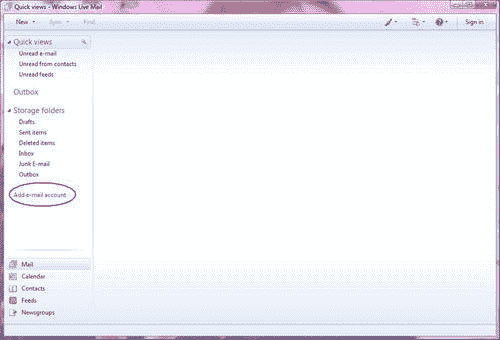
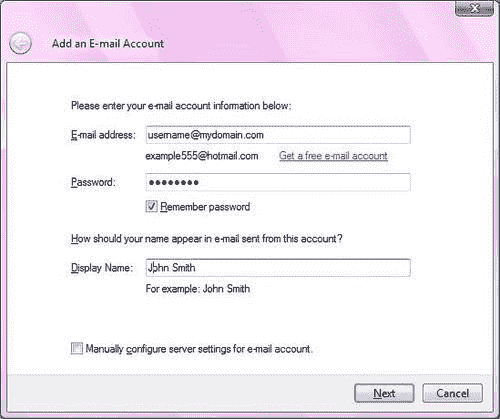
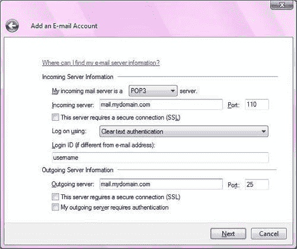
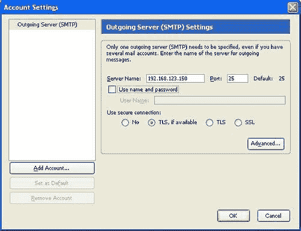

# 第三章。 接收邮件与 POP 和 IMAP

现在您有了一个正常工作的电子邮件服务器，下一步是让用户访问他们的电子邮件。 在本章中，你将学到以下内容:

*   什么是 POP 和 IMAP，以及如何选择应该实现哪一个
*   如何安装和配置可以同时提供 POP 和 IMAP 功能的 Courier-IMAP
*   如何配置电子邮件服务器可访问的客户端
*   如何配置流行的电子邮件客户端以使用您的电子邮件服务器提供的服务

# 选择 POP 和 IMAP

Postfix 将接收电子邮件并将其发送到用户的收件箱，但是需要额外的软件来允许用户轻松地阅读他们的电子邮件。 从主机检索电子邮件有两个标准。 第一种称为**邮局协议**(**POP**)。 POP3 是 POP 最常用的版本。 这通常用于从服务器下载电子邮件，将其存储在客户机应用程序中，并从服务器删除电子邮件。 这是互联网服务提供商经常使用的。 电子邮件随后由客户机应用程序(例如，Windows Live Mail 或 Mozilla Thunderbird)操纵。

第二个协议称为**Internet 消息访问协议**(**IMAP**)。 当您希望在服务器上保留每个电子邮件的副本时，通常使用 IMAP 系统。 IMAP 允许用户为电子邮件创建文件夹，并在文件夹之间移动或复制电子邮件。 客户机应用程序访问服务器上的电子邮件，但不必将其存储在客户机上。 电子邮件服务器必须能够存储所有用户的所有电子邮件，并且数据量通常会随着时间的推移而增加。 用户很少删除电子邮件。 因此，IMAP 更常用于具有集中式 IT 设施的大型组织。

名为**电子邮件客户端**的程序代表用户处理从邮件服务器检索邮件，而电子邮件客户端与之通信的程序称为**电子邮件服务器**。 有许多 POP3 和 IMAP 服务器。 有些只执行其中一个任务。 Courier-IMAP 软件套件同时包含 POP3 和 IMAP 服务器，本章将详细介绍。

Courier-IMAP 通过访问用户的 `maildir`进行操作。 操作概述如下图所示:


# 下载安装 Courier-IMAP

**Courier**是一套程序，包括一个成熟的 MTA。 本书假设 MTA 使用的是**后缀**。 重要的是只安装和配置 Courier 的 POP3 和 IMAP 组件——如果有两个 mta 同时运行，那么电子邮件系统将非常不稳定。

### 注意事项

术语“信使”经常用来指完整的信使软件套件，包括 MTA。 Courier-IMAP 通常用于引用服务器的 IMAP 和 POP3 部分。 **Courier 认证库**是 Courier- imap 所需要的另一个 Courier 模块。 确保只安装 Courier 身份验证库和 Courier- imap。

有几种方法可以安装 Courier-IMAP。 Courier-IMAP**Redhat 软件包管理器**(**rpm**)适用于几种不同的 Linux 发行版。 这些内容可能来自发行版本的制造商，也可能是由第三方制作的，通常是 Courier 的爱好者或开发者。 如果您的 Linux 发行版是基于 RPM 的，但是在 RPM 中没有一个 Courier-IMAP 包，那么它必须从源代码构建。

如果您的 Linux 发行版是基于 Debian 软件包格式，那么可能会有一个 Courier-IMAP 软件包。 如果不是，那么 Courier-IMAP 将不得不从源代码构建。

## 从分发库安装 Courier-IMAP

如果可能的话，最好使用 Linux 发行版构建的包。 它们提供的任何包都应该是稳定的、性能良好的，并且使用默认路径和文件位置来适应软件的其他部分。 如果您的发行版有一个包管理器，那么您应该使用它，因为它将自动安装任何 Courier-IMAP 需要的包。

获得与正在使用的发行版匹配的包是很重要的。 适用于不同发行版的软件包可能不能正确工作，也可能使现有软件不稳定。

## 从 RPM 安装 Courier-IMAP

获得与所使用的发行版匹配的 RPM 是很重要的。 用于其他发行版的 RPM 可能不能正确工作，并且可能使现有软件不稳定。

如果您的 Linux 发行版包含一个图形化的前端来管理包(例如 gnorpm)，那么最好使用它，因为它将自动管理包之间的任何依赖关系。

要定位 Courier-IMAP 的 RPM，首先检查您的 Linux 分发服务器是否提供了 RPM。 如果是，那么下载并使用它。 如果分发者没有提供一个包，另一个组织或个人可能提供一个合适的包。 要检查这个，可以在网上搜索。 在[www.rpmfind.net](http://www.rpmfind.net)上有一个 rpm 数据库，搜索 `courier-imap`并加上发行版的名称(例如，Fedora 或 Mandriva)将找到任何合适的包。 最好使用为发行版的特定版本设计的包。 例如，Mandriva Linux 2008.1 的包不应该用于 Mandriva Linux 2009.1。 如果您不确定，那么最好按照下一节所述从源代码安装 Courier-IMAP。

如果您不能使用前端 RPM，那么要从 RPM 安装 Courier-IMAP，首先下载 RPM 并使用命令提示符更改到包含该文件的目录。 root 用户使用 `rpm`命令安装 RPM。

```sh
# rpm -ivh courier-imap-4.4.1-1mdv2009.1.i586.rpm

```

如果没有所有的必备软件，RPM 命令可能会失败。 在这种情况下，输出将命名所需的软件。 可以像前面看到的那样，使用 `rpm`命令下载并安装相应的包。 安装完所有必备软件后，可以使用 `rpm`命令安装 Courier-IMAP。

如果使用 `rpm`命令安装了 Courier-IMAP，也可以使用 `rpm`命令卸载。 命令如下:

```sh
# rpm -e Courier-IMAP

```

## 使用 Debian 包格式安装 Courier-IMAP

如果您的 Linux 发行版包含一个图形化前端来管理包(比如 gnorpm)，那么您可以使用它，如果您愿意这样做的话。

可以在任何基于 debian 的系统上使用以下命令安装 Courier-IMAP:

```sh
# apt-get install courier-imap

```

## 从源安装 Courier-IMAP

在现代 Linux 发行版上，从源代码安装 Courier-IMAP 并不是一项困难的任务。 在较老版本的 Linux 和其他 UNIX 平台(如 AIX、Solaris 和 HP-UX)上，可能会出现问题，特别是在系统的其余软件不是最新的情况下。

### 前提条件

安装 Courier-IMAP 的前提条件如下:

*   **一个 c++编译器:**我们推荐**GNU c++编译器**,这是一个的一部分**GNU compiler Collection (GCC**),进而是几乎所有 Linux 发行版的一部分,是大多数平台上免费。 如果 RPM 或其他 GCC 包可用(几乎肯定会可用)，那么应该优先使用它，而不是从源代码构建 GCC。 【显示】****
*****   **A** `make`**实用程序:**我们推荐 GNU `make`实用程序，它将在大多数 Linux 发行版中可用，也可以从[http://gcc.gnu.org/](http://gcc.gnu.org/)下载。*   **GNU 链接器:**可以在[www.gnu.org/software/binutils/](http://www.gnu.org/software/binutils/)找到。*   **GNU**Libtool:可以在[www.gnu.org/software/libtool/](http://www.gnu.org/software/libtool/)上找到。*   **Berkeley DB library or gdbm library:**这些是允许程序在文件中创建数据库的库。 同样，这些文件应该以打包形式提供，但是可以分别从[www.sleepycat.com/](http://www.sleepycat.com/)和[http://www.gnu.org/software/gdbm/gdbm.html](http://www.gnu.org/software/gdbm/gdbm.html)下载。 几乎可以肯定已经安装了其中一个或两个。*   Courier-IMAP 的源代码。****

 ****要成功安装 Courier-IMAP，必须首先安装所有这些先决条件。

### 构建信使认证库

安装 Courier-IMAP 有两个阶段。 首先，必须构建 Courier Authentication Library(通常称为 `Courier-authlib`)。 完成之后，就可以安装 Courier-IMAP 了。

### 注意事项

虽然这里给出了安装 Courier-IMAP 的说明，但是阅读随包提供的 `README, READ.ME`或 `INSTALL`文件始终是一个好主意。 如果在安装软件时遇到问题，那么一定要检查是否在任何提供的文档中都没有提到这个问题。

`Courier-authlib`源码可以从[www.courier-mta.org/authlib/](http://www.courier-mta.org/authlib/)下载。 与许多开源包一样，Courier Authentication Library 使用一个配置脚本来检测系统功能，然后使用 `make`命令来构建和安装软件。

要构建信使身份验证库，请输入以下命令。 您应该会看到类似如下的响应:

```sh
$ cd /tmp
$ tar xfj /path/to/courier-authlib-0.62.4.tar.bz2
$ cd courier-authlib-0.62.4/
$ ./configure
checking for a BSD-compatible install... /usr/bin/install -c
checking whether build environment is sane... yes
checking for a thread-safe mkdir -p... /bin/mkdir -p
checking for gawk... gawk
... (lots more output appears)
configure: creating ./config.status
config.status: creating Makefile
config.status: creating config.h
config.status: executing depfiles commands
config.status: executing libtool commands
$
$ make
$ make
/bin/sh ./config.status --file=authlib.html
config.status: creating authlib.html
echo "#define AUTHLDAPRC \"\"" >authldaprc.h
...(lots more output)
/bin/sh ./config.status --file=authlib.3
config.status: creating authlib.3
make[2]: Leaving directory `/tmp/courier-authlib-0.62.4'
make[1]: Leaving directory `/tmp/courier-authlib-0.62.4'
$ su -c make install (enter the root password)
# make install
make install-recursive
make[1]: Entering directory `/tmp/courier-authlib-0.62.4'
Making install in libltdl
make[2]: Entering directory `/tmp/courier-authlib-0.62.4/libltdl'
make install-am
...(lots more output)
make[4]: Leaving directory `/tmp/courier-authlib-0.62.4'
make[3]: Leaving directory `/tmp/courier-authlib-0.62.4'
make[2]: Leaving directory `/tmp/courier-authlib-0.62.4'
make[1]: Leaving directory `/tmp/courier-authlib-0.62.4'
#

```

成功执行命令后，将安装 Courier Authentication Library。 在启动它之前，需要进行一些配置。

注意，如果你使用的是 Red Hat Linux 或者它的派生版本，比如 Fedora Core 或者 CentOS，那么 `./configure`脚本会检测到这一点，并建议你使用 RPM 或者 `--with-redhat`参数:

```sh
$ ./configure
configure: WARNING: === I think you are trying to run this configure script
configure: WARNING: === on Red Hat/Fedora. You're doing too much work!
configure: WARNING: === It's much faster to create installable binary RPMs
configure: WARNING: === like this: http://www.courier-mta.org/FAQ.html#rpm
configure: WARNING: === When you do this you may find that RPM will tell you
configure: WARNING: === to install some other software first, before trying to
configure: WARNING: === build this one, and even tell you the name of RPMs you
configure: WARNING: === build this one, and even tell you the name of RPMs you
configure: WARNING: === need to install from the distribution CD. That's much
configure: WARNING: === easier than trying to figure out the same from some
configure: WARNING: === cryptic error message.
configure: WARNING:
configure: WARNING: === Even if you don't intend to use everything you need to
configure: WARNING: === have in order to build via RPM, you should still do as
configure: WARNING: === you're told. All the extra stuff (LDAP, SQL, etc...)
configure: WARNING: === goes into RPM sub-packages, which do not need to be
configure: WARNING: === installed.
configure: WARNING: === But, if you insist, you can simply add '--with-redhat'
configure: WARNING: === parameter to this configure script and not see this
configure: WARNING: === error message. You should also do this when upgrading
configure: WARNING: === and you didn't use RPM with the older version.
configure: error: ... in either case you better know what you're doing!

```

在本例中，将 `--with-redhat`参数传递给 `./configure:`

```sh
$ ./configure --with-redhat

```

### 配置信使认证库

安装身份验证库之后，需要做出几个决定。

Courier Authentication Library 为系统管理员提供了对用户进行身份验证的灵活性。 身份验证是当用户证明他/她的身份时，通常是通过提供有效的用户名和相应的密码。 认证方式有以下几种:

<colgroup><col style="text-align: left"> <col style="text-align: left"></colgroup> 
| 

身份验证方法

 | 

描述

 |
| --- | --- |
| `authshadow` | 默认情况下，大多数 Linux 发行版在 `/etc/shadow`系统文件中保存用户密码。 使用 `authshadow`进行身份验证可以根据系统帐户验证密码。 这只适用于用户拥有系统帐户的情况，即他们可以使用 telnet 或 `ssh`登录到机器上。 |
| `authpwd` | 在较旧的系统上，密码存储在 `/etc/passwd`文件中。 `authpwd`模块允许用户根据系统密码进行身份验证。 同样，用户必须拥有系统帐户。 |
| `authuserdb` | 与每个用户都需要一个系统帐户的 `authshadow`不同， `authuserdb`将用户详细信息与系统帐户分开存储。 这允许使用**虚拟邮箱**功能，在这里可以定义用户，而不需要在机器上拥有真实的帐户。 许多脚本用于管理数据库，数据库通常保存在 `/etc/userdb`中。 (许多发行版将其放在 `/etc/courier/authlib/userdb.)` |
| `authmysql` | 这类似于 `authuserdb`，但使用的是 MySQL 数据库，而不是 `authuserdb`中使用的文件。 MySQL 是大多数 Linux 发行版提供的一种流行的关系数据库，与其他方法相比，它既有优点也有缺点。 使用关系数据库(如 MySQL)会增加电子邮件服务器的复杂性，但身份验证可能会更快，而且关系数据库允许与其他应用程序共享数据(如果需要的话)。 |
| `authpam` | 身份验证由**可编程访问方法(PAM)**库提供。 PAM 是一种常用的库，大多数 Linux 发行版都提供了它。 PAM 非常灵活，可以从各种来源验证用户，包括系统密码数据库(通常是 `/etc/passwd`文件)。 |
| `authcustom` | 允许系统管理员开发自己的自定义身份验证方法。 |

选择身份验证方法可能是一个困难的决定。 以下是一些指导方针:

*   如果所有用户都有系统帐户，则可以使用 `authshadow, authpwd`或 `authpam`。 如果已经安装和配置了 PAM，那么应该优先使用它。
*   如果需要虚拟电子邮件系统，可以使用 `authdb`或 `authmysql`。 对于小场地，选择 `authmysql`比 `authdb`优势不大。

在本书中，只介绍了使用 `authshadow`或 `authpwd`进行简单的身份验证。 不过，如果安装并配置了 PAM，则不需要额外的配置。 `authuserdb`和 `authmysql`需要进一步配置，身份验证库的文档中对此进行了描述。

`/usr/local/etc/courier/authlib`目录包含 Courier Authentication Library 的配置文件。 出于安全考虑，最好使整个目录仅供 `mail`组的成员用户可读。 可以从安装目录复制默认的 `authdaemonrc`文件。

```sh
# mkdir -p /usr/local/etc/courier/authlib
# chown mail:mail /usr/local/etc/courier/authlib/
# chmod 755 /usr/local/etc/courier/authlib/
# cp /tmp/courier-authlib-0.52/authdaemonrc /usr/local/etc/courier/
authlib

```

要以 root 用户完成配置，请编辑 `/usr/local/etc/courier/authlib/authdaemonrc`文件并修改以下条目:

```sh
authmodulelist="authshadow"
daemons=3
authdaemonvar=/var/lib/courier/authdaemon
DEBUG_LOGIN=0
DEFAULTOPTIONS=""

```

在以 `authmodulelist`开头的行中，输入您想要使用的模块。

`daemons=`行列出了应该运行多少进程，等待对用户进行身份验证。 除非有非常多的用户，否则在 `3`到 `5`之间的值就足够了。 守护进程的数量越大，身份验证库使用的内存就越多。 其他进程可用的内存也会减少，这可能会影响整个系统性能。

`authdaemonvar`行列出了 Courier Authentication Library 放置运行时文件的位置，特别是用于连接到它的套接字。 这里列出的目录(在本例中是 `/var/lib/courier/authdaemon)`)应该存在，并且只有根用户可读。 使用以下命令 `root`创建目录:

```sh
# mkdir -p /var/lib/courier/authdaemon
# chmod 750 /var/lib/courier/authdaemon
# chown mail:mail /var/lib/courier/authdaemon

```

出于安全考虑，最好让 `authdaemonrc`文件只让某些用户可读。

```sh
# chown mail:mail /usr/local/etc/courier/authlib/authdaemonrc

```

在系统引导时需要启动身份验证守护进程。 通常，在 `/etc/init.d/`中放置一个脚本，以方便启动和停止守护进程。 示例脚本包含在 `/courier-authlib.sysvinit`中的身份验证库源代码中。 这个文件应该放在 `/etc/init.d`中。

```sh
# cd /tmp/courier-authlib-0.52
# cp courier-authlib.sysvinit /etc/init.d/courier-auth

```

以后可以使用以下命令启动和停止服务:

```sh
# /etc/init.d/courier-auth start
# /etc/init.d/courier-auth stop

```

最初，守护进程应该直接从命令行运行。 如果有任何错误，它们将被显示。

```sh
# /usr/local/sbin/authdaemond start
/usr/local/sbin/authdaemond: line 16: /usr/local/etc/authlib/authdaemonrc: No such file or directory

```

在刚才显示的示例中，由于没有从安装目录复制默认的 `authdaemonrc`文件，所以丢失了 `/usr/local/etc/authlib/authdaemonrc`文件。

如果服务已正确启动，可以通过传递 `stop`参数来停止它。

```sh
# /usr/local/sbin/authdaemond stop

```

请参阅发行版文档，以便在 Linux 引导时自动启动服务。 在 Red Hat 系统中，可以使用 `service`命令设置服务自动启动。

```sh
# service courier-auth add default

```

对于其他发行版，可以使用 `chkconfig`命令。

```sh
# chkconfig -add imapd

```

### 解决错误

在构建的每个阶段都可能生成错误。 运行 `configure`脚本时的错误可能与缺少依赖有关。 检查随软件提供的 `README`和 `INSTALL`文件，并确保所有依赖项都已安装。 如果从生成的错误消息来看问题不明显，通过 Internet 搜索准确的错误消息可能会找到解决方案。

在构建时出现错误是不常见的，因为大多数错误都可以通过 `configure`脚本来避免。 再次，错误信息应该提供一个很好的线索，错误的来源和使用互联网搜索引擎可能会得到回报。

运行时错误通常是由于错误的配置。 Courier Authentication Library 的配置选项很少，但是可能会发生错误。

如果找不到答案，可以通过快递邮件列表寻求帮助。 一如既往，首先搜索你的问题列表档案，并咨询常见问题解答。 Courier-IMAP,邮件列表在 http://lists.sourceforge.net/lists/listinfo/courier-imap/,可搜索列表档案是可用的:http://sourceforge.net/mailarchive/forum.php?forum_id=7307/,常见问题可在 http://www.courier-mta.org/FAQ.html[【5】。](http://www.courier-mta.org/FAQ.html)

## 构建快递- imap

Courier-IMAP 源代码可以在一个压缩包中找到，该压缩包包含所有文件，类似于 ZIP 文件。 可以从[http://www.courier-mta.org/imap/](http://www.courier-mta.org/imap/)下载，但要注意下载的是 Courier- imap 源，而不是 Courier MTA 源。

### 注意事项

虽然这里给出了关于如何安装 Courier-IMAP 的详细信息，但是阅读随包提供的 `README, READ.ME`或 `INSTALL`文件始终是一个好主意。 如果在安装软件时遇到问题，总是检查是否在任何提供的文档中都没有提到这个问题。

要安装 Courier-IMAP，必须输入一些命令。 与以源代码形式提供的许多软件一样，首先运行配置脚本。 配置脚本检查安装在我们机器上的软件，并对软件进行配置，使其能够正确构建。

当使用 Courier-IMAP 作为 IMAP 服务器时，默认情况下，它假定其客户端完全遵循 IMAP 标准。 不幸的是，通常情况不是这样，如果 Courier-IMAP 希望客户端完全符合 IMAP 标准，那么邮件可能不会被发送到电子邮件客户端。 Courier-IMAP 开发人员认识到这一点，并且通过将 `--enable-workarounds-for-imap-client-bugs`标志传递给 configure 脚本，构建了使用非标准客户机的能力。

express - imap 在构建时包含一个特殊的 `check`功能。 不幸的是，使用 `--enable-workarounds-for-imap-client-bugs`会阻止检查成功工作。 由于 `check`功能是有用的，我们将构建该软件两次。 首先不使用 `--enable-workarounds-for-imap-client-bugs`，然后运行 `check`，然后使用标志重新构建，然后安装软件。

要构建 Courier-IMAP，输入以下命令。 选择一个合适的目录来构建软件。 在本例中，我们选择 `/tmp`，软件将自己解包到 `courier-imap-3.0.8`目录中。 正如在 Courier Authentication Library 的例子中提到的，configure 脚本将检测何时使用了 Red hat 派生的 Linux 发行版，并且可以传递 `--with-redhat`标志进行配置。

```sh
$ cd /tmp
$ tar xfj /path/to/courier-imap-4.5.1.tar.bz2
$ cd /tmp/courier-imap-4.5.1
$ ./configure --with-redhat
checking for a BSD-compatible install... /usr/bin/install -c
checking whether build environment is sane... yes
checking for a thread-safe mkdir -p... /bin/mkdir -p
checking for gawk... gawk
checking whether make sets $(MAKE)... yes
... (a lot more output follows)
config.status: creating config.h
config.status: executing depfiles commands
config.status: executing libtool command
$ make check
Making check in numlib
make[1]: Entering directory `/tmp/courier-imap-4.5.1/numlib'
make[1]: Nothing to be done for `check'.
make[1]: Leaving directory `/tmp/courier-imap-4.5.1/numlib'
Making check in md5
... (a lot more output appears)
make[2]: Leaving directory `/tmp/courier-imap-4.5.1/imap'
make[1]: Leaving directory `/tmp/courier-imap-4.5.1/imap'
make[1]: Entering directory `/tmp/courier-imap-4.5.1'
make[1]: Nothing to be done for `check-am'.
make[1]: Leaving directory `/tmp/courier-imap-4.5.1'
$ ./configure --enable-workarounds-for-imap-client-bugs
checking for gcc... gcc
checking for C compiler default output file name... a.out
checking whether the C compiler works... yes
checking whether we are cross compiling... no
... (a lot more output follows)
config.status: creating config.h
config.status: executing depfiles commands
config.status: executing libtool command
$ make
$ make
make all-recursive
make[1]: Entering directory `/tmp/courier-imap-4.5.1'
make all-gmake-check FOO=BAR
----------------------------------------------------
(lots more output appears)
cp imap/imapd.cnf .
cp imap/pop3d.cnf .
cp -f ./maildir/quotawarnmsg quotawarnmsg.example
make[2]: Leaving directory `/tmp/courier-imap-4.5.1'
make[1]: Leaving directory `/tmp/courier-imap-4.5.1'
$ su -c "make install"
Password: (enter password for root)
Making install in numlib
make[1]: Entering directory `/tmp/courier-imap-4.5.1/numlib'
make[2]: Entering directory `/tmp/courier-imap-4.5.1/numlib'
make[2]: Nothing to be done for `install-exec-am'.
make[2]: Nothing to be done for `install-data-am'.
(lots more output appears)
Do not forget to run make install-configure
test -z "/usr/lib/courier-imap/share" || /bin/mkdir -p "/usr/lib/courier-imap/share"
/usr/bin/install -c mkimapdcert mkpop3dcert '/usr/lib/courier-imap/share'
make[2]: Leaving directory `/tmp/courier-imap-4.5.1'
make[1]: Leaving directory `/tmp/courier-imap-4.5.1'
$ su -c "make install-configure"
Password: (enter password for root)
make[1]: Entering directory `/tmp/courier-imap-4.5.1/numlib'
make[1]: Leaving directory `/tmp/courier-imap-4.5.1/numlib'
make[1]: Entering directory `/tmp/courier-imap-4.5.1/md5'
make[1]: Leaving directory `/tmp/courier-imap-4.5.1/md5'
(lots more output appears)
make install-configure-local DESTDIR=
make[1]: Entering directory `/tmp/courier-imap-4.5.1'
make[1]: Leaving directory `/tmp/courier-imap-4.5.1'
$

```

如果输出与所示类似，则表示已经成功安装了 Courier-IMAP，您可以跳过下一节关于错误处理的内容。

### 处理错误

`configure`命令可能会失败。 配置尝试检测现有软件，并确保 Courier-IMAP 与之工作，但偶尔会出现错误。


在本例中， `configure`命令假设 `vpopmail`已经安装，当它找不到 `vpopmail`的部分内容时失败。 现实中， `vpopmail`没有安装，无法检测到。 我们从 `INSTALL`文件中获得以下内容:

```sh
...configure should automatically detect if you use vpopmail, and compile and install the authvchkpw authentication module.

```

这表明 `authvchkpw`用于 `vpopmail`。 在 `INSTALL`文件的后面，我们读到:

```sh
* authvchkpw - this module is compiled by default only if the vpopmail account is defined.

```

在检查 `/etc/passwd`文件时，我们发现有一个账号 `vpopmail`解释了这个检测。 缺少 `vpopmail`文件解释了 `configure`脚本的失败。 在 `INSTALL`文件中，描述了配置脚本的参数。

```sh
Options to configure:
...
* --without-module - explicitly specify that the authentication module named "module" should not be installed. See below for more details.
Example: --without-authdaemon.

```

因此，解决方案是使用 `--without-authvchkpw`选项:

```sh
$ ./configure –without-authvchkpw

```

大多数问题都可以用类似的方法解决。 最好不要被不理解的术语和名称所吓倒。 不需要了解 `vpopmail`的任何内容，只需要搜索术语`"vpopmail"`(在原始错误消息中提到过)，就可以通过阅读文档来解决错误。

如果你找不到答案，有一个快递邮件列表，可以寻求帮助。 细节在*解决错误*部分给出。

# 使用 POP3

正如在介绍中提到的，POP3 通常用于将电子邮件存储在客户机计算机上。 它最常用于与电子邮件服务器有间歇连接的情况，例如，在使用拨号线路访问 ISP 的电子邮件帐户时。 这种方法的优点是，客户端总是可以使用电子邮件，客户端可以在不连接到电子邮件服务器的情况下工作。 当用户下一次在线时，可以阅读电子邮件，并创建回复。

使用 POP3 的主要缺点是电子邮件通常只在客户端 PC 上可用。 如果客户端 PC 失败或被盗，电子邮件就会丢失，除非做了备份。

可以将 POP3 客户机配置为将电子邮件保存在 POP3 服务器上，以便其他客户机访问，但是在这种情况下更常用 IMAP。

## 配置 POP3 的速递 imap

如果是从源代码构建的，配置文件位于 `/usr/lib/courier-imap/etc/courier-imap/`中。 如果您正在使用打包发行版，它们可能位于 `/etc/courier-imap`中。 `pop3d`文件包含 POP3 服务器的设置。

如果您使用的是打包的 Courier-IMAP 分发版，可以通过以下命令找到配置文件:

```sh
# find / -name pop3d 2>/dev/null
/usr/lib/courier-imap/etc/pop3d
/usr/lib/courier-imap/bin/pop3d

```

编辑文件，找到并修改以下设置:

<colgroup><col style="text-align: left"> <col style="text-align: left"></colgroup> 
| 

设置

 | 

描述

 |
| --- | --- |
| `PIDFILE` | `pop3d`守护进程跟踪它使用的进程 ID。 它指定一个有效的路径和一个建议使用该文件的名称。 通常，这可能是 `/var/run/pop3d.pid`。 确保变量指向一个现有的目录(例如 `/var/run)`或创建指定的目录。 |
| `MAXDAEMONS` | 这指定一次可以运行的 `pop3d`进程的最大数量。 这个数字限制了一次可以连接的用户数量。 高于预期用户数量的数字可能是一种浪费，但试图连接的用户也包括在这个数字中。 将此设置为一次连接的最大用户数量，或者稍高一些。 请注意，这是启动的最大进程数，而不是初始进程数。 |
| `MAXPERIP` | 这指定来自每个 IP 地址的最大连接数。 较低的数字，例如 4，可以防止恶意行为，如拒绝服务攻击，即试图用尽邮件服务器上的所有连接。 |
| `POP3AUTH` | 如果使用 Courier Authentication Library 守护进程，则将其设置为空，否则将其设置为表示所执行的登录身份验证的类型。 对于 4.0 之前的版本，应该将其设置为 `LOGIN`。 |
| `PORT` | 这指定守护进程侦听的端口。 标准端口是 `110`，只有当所有客户端软件配置为使用非标准端口时，才应该选择不同的端口。 |
| `ADDRESS` | 它指定要监听的 IP 地址。 如果机器有多个网络接口，可以将 Courier-IMAP 配置为只监听其中一个地址。 `0`表示使用所有的网络接口。 |
| `TCPDOPTS` | 这些是要使用的选项。 使用的典型示例包括:阻止 POP3 守护进程尝试解析每个连接的名称的 `nodnslookup`和阻止它尝试对进入的连接执行 `ident`查询的 `-noidentlookup`。 指定这两个设置可以减少验证用户连接所花费的时间。 |
| `MAILDIRPATH` | 这是一个典型用户的 `maildir`的路径。 为您的系统指定适当的值，例如 `.maildir`。 |

下面显示了一个示例 `pop3d`配置文件:

```sh
PIDFILE=/var/run/pop3d.pid
MAXDAEMONS=40
MAXPERIP=4
POP3AUTH=""
PORT=110
ADDRESS=0
TCPDOPTS="-nodnslookup -noidentlookup"
MAILDIRPATH=.maildir

```

配置好 POP3 服务器之后，就可以对其进行测试了。 如果您正在使用发行版提供的 Courier-IMAP 版本，请使用发行版的启动脚本 `/etc/init.d/courier-imap`。 这将尝试启动 `imapd`和 `pop3d`，但由于大部分配置将由分发程序完成，因此 IMAP 将成功启动。

### 注意事项

如果您使用的是 Courier-IMAP 4.0 或更高版本，那么 `courier-authdaemon`必须在 POP3 或 IMAP 服务之前运行。 确保按照前面描述的方式启动它们。

使用实例启动 POP3 服务进行测试。

```sh
# /usr/lib/courier-imap/libexec/pop3d.rc start

```

一旦正确配置了 POP3 和 IMAP 服务，它们就可以在机器启动时自动启动。 这在*测试 IMAP 服务*一节中进行了解释。 即使不需要 IMAP，也可以遵循这些指示。

## 测试 POP3 服务

测试 POP3 等服务的最简单方法是使用**telnet**实用程序并连接到适当的端口。 这避免了网络连接或客户端配置可能出现的任何问题。 POP3 使用端口 `110`，因此将 telnet 连接到本地机器上的端口 `110`。

```sh
$ telnet localhost 110
Trying 127.0.0.1...
Connected to localhost.
Escape character is '^]'.
+OK Hello there.
USER username
+OK Password required.
PASS password
+OK logged in.
STAT
+OK 82 1450826
LIST
+OK POP3 clients that break here, they violate STD53.
1 5027
2 5130
3 6331
4 3632
5 1367
... all e-mails are listed, with their sizes in bytes
82 6427
.
RETR 1
+OK 5027 octets follow.
Return-Path: <user@domain.com>
X-Original-To: user@localhost
Delivered-To: user@machine.domain.com
Received: from isp (isp [255.255.255.255])
... e-mail is listed
.
QUIT
+OK Bye-bye.

```

连接被外部主机关闭。

POP3 协议基于文本命令，因此很容易通过 telnet 模拟客户机。 首先，使用 `USER`和 `PASS`命令对用户进行身份验证。 如果对用户进行了正确的身份验证，那么 `STAT`命令将列出所有电子邮件及其组合大小(以字节为单位)。 `LIST`列出每封邮件及其大小。 当使用命令指定电子邮件号码时， `RETR`命令检索(或列出)电子邮件。 `DELE`命令(未在示例中显示)将从服务器删除一封电子邮件。

现在 POP3 可以工作了，是时候配置一个电子邮件客户机来收集电子邮件了。

## 使用 Windows Live Mail 通过 POP3 检索电子邮件

Windows Live Mail 是一种流行的电子邮件客户端，从 XP 以后的 Windows 版本都可以下载。 它包括连接到支持 pop3 和 imap 的服务器的能力。 可以在[http://download.live.com/wlmail](http://download.live.com/wlmail)下载。

下面是配置它的步骤:

1.  Start Windows Live Mail by locating it in the Start menu hierarchy: **Start | All Programs | Windows Live | Windows Live Mail**. When it is run for the first time, the interface will automatically display the wizard to create new account. Otherwise, click on **Add e-mail account** in the navigation bar.

    

2.  The first page of the new account wizard will be displayed.

    

3.  以 `username@domain`格式输入完整的电子邮件地址。 您可以决定是否要输入密码—如果您不检查**记住密码**，每次启动 Windows Live Mail 时都会提示您输入密码。 **显示名称**应该是您的第一个和最后一个名称——这将出现在发出的电子邮件中。 不需要勾选**为电子邮件帐户手动配置服务器设置**复选框。
4.  Click on **Next**. The next page of the wizard requires some server details.

    

5.  默认为**POP3**服务器。 传入服务器**应该是邮件服务器的名称(或 IP 地址)。 **110**的默认**端口**可以保持不变。 不勾选 SSL 连接，认证方式保持为**明文认证**。 应该保留**登录 ID**作为在第一个屏幕中输入的电子邮件地址的用户名部分。 **传出服务器**应该与**传入服务器**一样，表单的其余部分可以保留默认值。 【t16.1】**
***   Press **Next**. You will be presented with a confirmation screen.

    

    *   当您单击**Finish**时，Windows Live Mail 将尝试连接到电子邮件服务器并下载电子邮件。*   如果有任何错误，那么在导航窗格中右键单击帐户，并选择**属性**。 然后您可以检查和修改任何设置。**

 **现在已经成功地配置了 POP3，是时候转向 IMAP 了。

# 使用 IMAP

正如在介绍中提到的，使用 IMAP，邮件被保存在服务器上，而不是客户机上。 这使它成为具有中央管理功能的组织的理想选择，因为它简化了备份，也允许用户更改他们工作的客户机计算机。 然而，这也意味着存储整个组织电子邮件所需的磁盘存储将不可避免地随着时间的推移而增加。 在发送或接收大型附件时尤其如此。 如果用户依赖于能够访问他们的邮箱，那么如果邮件服务器在他们的工作时间内不可用，他们将会很不方便。 一些电子邮件客户机可以配置为复制电子邮件，从而避免中断。 通过使用 IMAPs 功能创建文件夹并在它们之间移动电子邮件，有时可以以一种相对简单的方式实现这一点。

## 配置 IMAP 速递

在安装了 Courier-IMAP 之后(如前所述通过包或源安装)，需要先对其进行配置，然后才能使用它。

### 注意事项

如果您已经像前面描述的那样配置和测试了 POP3，那么您应该在配置 IMAP 时停止 Courier-IMAP 守护进程。 如果您使用的是大于 4.0 的 Courier-IMAP 版本，那么您可以让身份验证守护进程继续运行。

如果从源构建了 Courier-IMAP，配置文件位于 `/usr/lib/courier-imap/etc/courier-imap/`。 在包装分发中，它们可能位于 `/etc/courier-imap`。 `imapd`文件包含 IMAP 服务器的设置。

如果你正在使用一个打包的 Courier-IMAP 分发版，可以通过下面的命令找到配置文件:

```sh
# find / -name imapd 2>/dev/null

```

```sh
/usr/lib/courier-imap/etc/imapd
/usr/lib/courier-imap/bin/imapd

```

一旦找到文件，就可以对其进行适当的修改。 下面是主要的配置指令:

<colgroup><col style="text-align: left"> <col style="text-align: left"></colgroup> 
| 

设置

 | 

描述

 |
| --- | --- |
| `PIDFILE` | `imapd`守护进程跟踪它使用的进程 ID。 它指定一个有效的路径和一个名称，建议使用该文件。 通常，这可能是 `/var/run/imapd.pid`。 确保设置指向一个有效的目录。 |
| `MAXDAEMONS` | 这指定一次可以运行的 `imapd`进程的最大数量。 这个数字限制了一次可以连接的用户数量。 高于预期用户数量的数字可能是一种浪费，但试图连接的用户也包括在这个数字中。 将此设置为一次连接的最大用户数量，或者稍高一些。 |
| `PORT` | 这指定守护进程侦听的端口。 标准端口是 `143`，只有当所有客户端软件配置为使用非标准端口时，才应该选择不同的端口。 |
| `ADDRESS` | 它指定要监听的 IP 地址。 如果机器有多个网络接口，可以将 Courier-IMAP 配置为只监听其中一个地址。 `0`表示使用所有的网络接口。 |
| `TCPDOPTS` | 这些是要使用的选项。 典型的选项包括:阻止 IMAP 守护进程尝试解析每个连接的名称的 `-nodnslookup`和阻止它尝试对进入的连接执行 `ident`查询的 `-noidentlookup`。 指定这两个设置可以减少验证用户连接所花费的时间。 |
| `MAILDIRPATH` | 这是一个典型用户的 `maildir`的路径。 为您的系统指定适当的值，例如 `.maildir`。 |
| `MAXPERIP` | 这指定来自每个 IP 地址的最大连接数。 少量的数字可以防止恶意行为，如拒绝服务攻击，即试图用尽邮件服务器上的所有连接。 有些电子邮件客户端与服务器建立多个连接，因此，像 `5`这样的低值可能会影响客户端软件的操作。 |
| `IMAP_CAPABILITY` | 这描述了服务器向客户机报告的 IMAP 功能。 它应该保持默认设置。 |
| `IMAP_EMPTYTRASH` | 这指定电子邮件应该在特定文件夹中保存多长时间。 超过指定日期的消息将在用户登录或注销时自动删除。 这可用于在一段时间后自动从 `Trash`文件夹中删除电子邮件。 这适用于所有文件夹，因此可以在较长时间过期后删除 `Sent items`文件夹中的电子邮件。例如， `IMAP_EMPTYTRASH=Trash:7,Sent:30`指定 `Trash`文件夹中的电子邮件在 7 天后删除， `Sent`文件夹中的电子邮件在 30 天后删除。如果指定的文件夹中存在大量的电子邮件，那么性能将受到影响，因为每次用户登录或退出 IMAP 服务器时都将检查每个文件。 在这种情况下，最好禁用此设置，并定期运行一个单独的脚本来删除旧文件。 |
| `IMAP_IDLETIMEOUT` | 这是在连接关闭之前，客户端可以空闲(不向服务器发出任何请求)的时间长度(以秒为单位)。 低于默认值 60 的值可能会导致客户端连接提前终止，但编写良好的客户端将在不通知用户的情况下重新连接。 如果用户报告问题，应该使用更高的值。 |
| `IMAP_TRASHFOLDERNAME` | 这指定删除电子邮件时要使用的文件夹。 |
| `SENDMAIL` | 它指定到 `sendmail`的路径，用于发送电子邮件。 你应该确保它指向在[第 2 章](02.html "Chapter 2. Setting up Postfix")中通过后缀安装的可执行文件。 |

下面是一个示例 `imapd`配置文件:

```sh
ADDRESS=0
IMAP_CAPABILITY="IMAP4rev1 UIDPLUS CHILDREN NAMESPACE THREAD=ORDEREDSUBJECT THREAD=REFERENCES SORT QUOTA IDLE"
IMAP_EMPTYTRASH=Trash:7
IMAP_IDLE_TIMEOUT=60
IMAP_TRASHFOLDERNAME=Trash
MAILDIRPATH=.maildir
MAXDAEMONS=40
MAXPERIP=10
PIDFILE=/var/run/imapd.pid
PORT=143
SENDMAIL=/usr/sbin/sendmail
TCPDOPTS="-nodnslookup -noidentlookup"

```

## 测试 IMAP 服务

使用实例启动 IMAP 服务进行测试。

```sh
/usr/lib/courier-imap/libexec/imapd.rc start

```

测试 IMAP 等服务的最简单方法是使用 telnet 实用程序并连接到适当的端口。 这避免了网络连接或客户端配置方面的任何问题。 IMAP 使用端口 `143`，所以 telnet 到本地机器上的端口 `143`:

```sh
$ telnet localhost 143
Connected to localhost.
Escape character is '^]'.
* OK [CAPABILITY IMAP4rev1 UIDPLUS CHILDREN NAMESPACE THREAD=ORDEREDSUBJECT THREAD=REFERENCES SORT QUOTA IDLE ACL ACL2=UNION STARTTLS] Courier-IMAP ready. Copyright 1998-2004 Double Precision, Inc. See COPYING for distribution information.
1 capability
* CAPABILITY IMAP4rev1 UIDPLUS CHILDREN NAMESPACE
THREAD=ORDEREDSUBJECT THREAD=REFERENCES SORT QUOTA IDLE ACL ACL2=UNION STARTTLS
1 OK CAPABILITY completed
2 login "username" "password"
2 OK LOGIN Ok.
3 namespace
* NAMESPACE (("INBOX." ".")) NIL (("#shared." ".")("shared." "."))
3 OK NAMESPACE completed.

```

每个命令都有一个标识符作为前缀——这里我们使用增量数字。 第一个命令要求 IMAP 服务器列出它的功能。 第二个命令是用户登录，包括用户名和密码。 如果成功，则最后的名称空间命令显示服务器已接受登录，客户机可以确定用户在文件夹层次结构中的位置。

这足以确认用户可以登录并发出命令。 整个 IMAP 命令集非常庞大和复杂，不适合 telnet 使用。

一旦正确配置了 POP3 和 IMAP 服务，它们就可以在机器启动时自动启动。 如果您是从包中安装的，那么分发程序可能已经在 `/etc/init.d`中创建了合适的启动脚本。 根据分布，这可能在机器启动时开始。 对于 Red Hat Linux，命令将是:

```sh
# service courier-imap add default

```

对于其他发行版，可以使用 `chkconfig`命令:

```sh
# chkconfig -add imapd

```

现在已经正确配置了 IMAP，现在该配置电子邮件客户机了。

## 使用 Mozilla Thunderbird 通过 IMAP 检索邮件

Mozilla Thunderbird 是一种流行的开源电子邮件客户端，可以从[http://www.mozilla.org/](http://www.mozilla.org/)下载。 它可以用于各种操作系统，包括 Windows 和 Linux。

下面是配置它以连接到一个 Courier-IMAP 服务器的步骤:

1.  在雷鸟主屏幕上，选择**工具|帐户设置**。



1.  点击**添加账号…** 按钮。 在下一个屏幕上，选择**电子邮件帐户**，然后单击**next**。 身份屏幕打开。 输入您的用户名和电子邮件地址，然后单击**Next**。


1.  在**服务器信息**界面，选择**IMAP**作为服务器类型，并输入接收电子邮件的服务器名称或 IP 地址。 然后点击**Next**按钮。


1.  在下一个屏幕上，输入**传入用户名**。 这通常是 Linux 帐户名。


1.  最后，在**account Name**字段中为电子邮件帐户提供一个有用的标记，以防将来定义另一个帐户。 点击**Next**。


1.  在下一个屏幕中，将总结详细信息。 单击**完成**保存帐户详情并退出**帐户向导**。


1.  最后，显示**Account Settings**屏幕，列出您刚刚定义的帐户。 点击**确定**。


要检索消息，请单击**文件|获取新消息**，并从菜单中选择刚刚创建的帐户。

雷鸟会提示你输入密码。 输入正确的密码，然后按*回车*。 然后，雷鸟将连接到 Courier-IMAP 并检索所有电子邮件的详细信息。 如果您单击一封电子邮件，雷鸟将使用 IMAP 协议检索它。

# 总结

在本章中，我们看到了用于检索电子邮件的两种邮件协议 POP3 和 IMAP，并解释了它们的优缺点。 然后我们讨论了 Courier-IMAP，它可以同时提供 POP3 和 IMAP 服务，并建议您使用来自 Linux 分发服务器的包。 我们还描述了如果需要的话，如何从源代码构建它。 然后，我们讨论了如何配置和测试 POP3 和 IMAP 服务，包括配置流行的电子邮件客户机。******