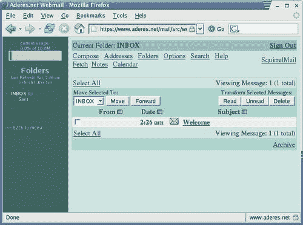
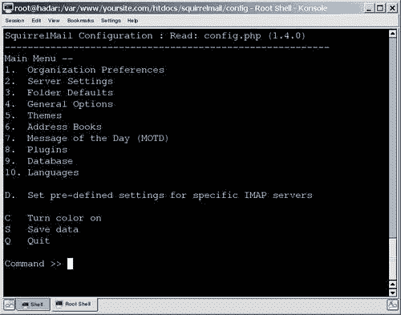

# 四、提供邮箱访问

在前面的章节中，您学习了如何设置和配置电子邮件服务器。 现在您的电子邮件服务器已经准备好提供服务，那么您的用户将如何访问它呢? 在本章中，你将学到以下内容:

*   webmail 访问解决方案的优点和缺点
*   SquirrelMail web 邮件包
*   设置和配置 SquirrelMail
*   SquirrelMail 插件是什么?它们可以做什么
*   如何让 SquirrelMail 更安全

在下一节中，我们将介绍 SquirrelMail 软件包，并研究它和其他 web 邮件访问解决方案的优缺点。 之后，我们将一步一步地跟踪 SquirrelMail 的安装和配置。 接下来，我们将检查插件的安装，并包含有用插件的参考。 最后，我们将包括一些关于如何保护 SquirrelMail 的提示。

# 网络邮件解决方案

webmail 解决方案**是运行在服务器上的程序或一系列脚本，可以通过网络访问，并提供对电子邮件功能的访问，类似于传统的邮件客户端。 它被雅虎使用! Mail、Microsoft Hotmail、Microsoft Outlook Web Access 和 Gmail 作为它们的电子邮件解决方案的主要接口。 你可能已经熟悉了各种形式的网络邮件。**

 **虽然我们将专门研究 SquirrelMail 的网络邮件解决方案，但 SquirrelMail 的优点和缺点适用于市场上的大多数网络邮件系统。 从这个角度来看，我们将从一般的角度来处理这个问题，然后详细介绍 SquirrelMail 包。

## 好处

本节将重点介绍安装和维护 webmail 解决方案所带来的好处。 与任何列表一样，它并不完全全面。 很多福利都是针对特定的情况; 重要的是仔细检查和考虑以下品质如何影响你的个人情况。

我们将在本节中探讨的主要好处如下:

*   容易和快速访问很少或没有设置
*   简单的远程访问
*   不需要维护客户端软件或配置
*   提供用于配置邮件服务器选项的用户界面
*   可能的保障福利

### 方便快捷

尽管传统邮件访问解决方案非常适合某些情况，但通常很难设置和维护。 通常，这涉及到在客户端本地计算机上安装软件并对其进行配置。 这可能很困难，特别是在用户需要自己设置软件的情况下。 配置通常会有更多的问题，因为有些用户可能没有足够的能力遵循一组非常详细的说明。 还需要为许多不同平台上的许多不同邮件客户机提供和维护这些说明。

然而，网络邮件解决方案没有这些问题中的大部分。 所有用户的设置都可以在服务器上配置，因为应用程序本身驻留在服务器上。 这意味着用户的设置时间几乎为零。 一旦他们收到他们的登录凭证，他们就可以访问网站，并立即访问他们的所有邮件。 用户可以立即访问站点来发送和接收电子邮件。

由于互联网现在如此普及，许多用户应该熟悉诸如谷歌 Mail 和 Windows Live Hotmail 等提供免费电子邮件服务的网站。 然而，开源包提供的用户界面可能更原始，并且缺乏一些视觉特性。 Squirrelmail 提供了对电子邮件的访问，包括发送和接收附件的功能，并提供了良好的用户界面。

值得一提的是，webmail 解决方案可以提供某些传统邮件客户端称为**群件**的特性。 这些特性使群组能够以补充电子邮件通信的方式进行通信和协调。 群件组件的例子包括私有日历、共享日历、会议安排、待办事项列表和其他类似工具。

这些应用程序可以预先配置，以便用户可以立即开始使用它们，而无需自己配置它们。 在 SquirrelMail 网站上可以找到几个实现这些功能的 SquirrelMail 插件。

### 方便远程访问

传统邮件访问软件的另一个问题是它不具有可移植性，因为电子邮件客户机需要在计算机上安装和配置。 一旦在特定的计算机上下载、安装和配置了它，就只能在该计算机上访问它。 如果没有网络邮件，路上的用户将无法从朋友的电脑、移动设备或机场的互联网亭获取电子邮件。

然而，在 webmail 解决方案中，电子邮件可以通过互联网连接从任何位置访问。 员工可以通过任何一台联网的电脑和合适的浏览器访问他们的工作电子邮件。

作为管理员，您可以选择允许或拒绝用户在不安全的情况下访问电子邮件。 通过要求对连接进行加密，您可以确保当用户处于远程位置时，他们与服务器的通信是安全的。

### 无需维护客户端

即使已经安装并正确配置了软件邮件客户端，也必须对它们进行维护。 当新版本发布时，所有的客户端都必须更新。 这未必是一项简单的任务。 不按预期工作的软件可能会导致大量的支持台呼叫。

在每个客户机上更新软件可能是一个非常大的管理负担。 事实上，许多昂贵的软件包是专门为在单个机器上自动更新软件而设计的。 尽管如此，特定于每个本地机器的问题经常会出现，必须单独解决。 向远程分支机构或远程工作人员传递指令或通知可能也很困难。 对于网络邮件解决方案，这就没有必要了。

与此相反，webmail 解决方案是集中维护和管理的。 webmail 应用程序驻留在服务器上。 使用 webmail，只需要升级 web 服务器和 webmail 包。 出现的任何异常或问题都可以在升级之前或升级期间处理。 软件升级本身可以在测试系统上运行，然后再部署到活动系统上。 虽然 SquirrelMail 很少修改设置，但可以更新用户的设置，使其与更新版本中引入的更改兼容。

此外，在升级或更改邮件服务器平台时，测试工作可以大大减少，因为只需要测试受支持的浏览器版本。 建议为公司计算机指定特定的浏览器版本。 与电子邮件客户机相比，不需要在所有可能的客户机和软件平台上进行测试。

### 通过用户界面配置邮件服务器接口

许多传统的桌面电子邮件客户机只提供电子邮件功能，仅此而已。 通常不支持代表邮件用户执行的其他基本任务(如更改访问密码)。 驻留在服务器上的某些配置选项可能需要额外的软件应用程序或外部解决方案来满足这些需求。 可能需要配置的邮件服务器选项示例包括每个用户的密码和垃圾邮件过滤设置。

在 SquirrelMail web 邮件应用程序中，已经开发了许多插件来提供这些功能。 例如，用户可以直接从 webmail 界面更改他/她的密码。 此外，还有一些插件和系统允许用户在没有任何直接人工干预的情况下轻松注册。 如果您希望提供一种服务，让用户可以在不需要管理开销的情况下注册，这可能会很有用。

### 可能的安全效益

这个问题可以从两种不同的角度来看待——正是由于这个原因，标题被列为*“可能的”安全性好处*。 尽管如此，这仍然是一个值得研究的有趣点。

在软件客户端访问模型中，电子邮件通常被下载到本地用户的计算机上，存储在一个或多个个人文件夹中。 从安全性的角度来看，这可能是一件坏事。 系统的用户可能不像训练有素的计算机管理员那样认真或了解计算机安全。 与正确配置和安全的服务器相比，获得对最终用户计算机的未经授权的访问通常要容易得多。 这意味着，偷了公司笔记本电脑的人可能能够访问存储在那台电脑上的所有电子邮件。

还有一个与客户机访问模型相关的缺点。 即使员工被解雇，他/她仍然可以访问他/她本地办公室计算机上的所有电子邮件。 可能需要一定的时间才能确保重要信息的安全。 不满的员工可以很容易地将外部存储源连接到他们本地的办公室计算机，并下载任何他们想要的数据。

同样值得注意的是，在 webmail 模型中，所有的电子邮件都集中存储。 如果攻击者要获得对中央电子邮件服务器的访问权，他/她可能会访问存储在该服务器上的所有电子邮件。 然而，如果中央邮件服务器被攻破，即使没有使用网络邮件系统，攻击者也有可能获得访问所有电子邮件的权限。

## 缺点

本节重点讨论提供和支持 webmail 解决方案的缺点。 上一节给出的警告适用:这个列表并不完全全面。 每一种情况都是独特的，并可能带来其独特的缺点。

我们将讨论以下 webmail 解决方案的缺点:

*   性能问题
*   与大量电子邮件的兼容性
*   与电子邮件附件的兼容性
*   安全问题

### 性能

传统的电子邮件客户机是在客户机-服务器模型中设计的。 一个邮件服务器接收和从其他邮件服务器发送电子邮件。 然而，桌面邮件客户端可以提供许多额外的提高生产力的功能，如消息排序、搜索、联系人列表管理、附件处理，以及最近的一些功能，如垃圾邮件过滤和消息加密。

这些特性中的每一个都可能需要一定的处理能力。 当将一个用户的电子邮件存储在台式机上时，所需的处理能力级别可能可以忽略，但是当将这些功能大规模应用到单个服务器时，提供这些功能可能会有问题。

在检查性能问题时，重要的是要考虑访问 webmail 应用程序的潜在用户数量和相应的服务器大小。 单个服务器可能能够轻松地处理 300 个用户，但如果用户数量显著增加，服务器负载可能会成为一个问题。

例如，在客户的计算机上搜索几年的存档邮件可能需要几秒钟。 当一个用户使用 webmail 执行这个任务时，负载将是相似的。 但是，如果许多客户机在很短的时间间隔或同时请求此操作，服务器可能很难及时处理所有请求。 这可能会导致页面以较慢的速度提供服务，或者在极端情况下，服务器无法响应。

最理想的情况是，如果担心服务器可能无法处理特定的用户负载，应该在适当的条件下执行负载测试。

### 兼容大电子邮件量

webmail 解决方案不太适合大的邮件量。 这个缺点与前一个有关，但更多地与发送的数据量有关。 即使用户数量相对较少，在 webmail 应用程序中也很难管理大量的电子邮件。 主要有以下两个原因:

*   首先，每次查看的电子邮件和列出的每个文件夹都必须从服务器发送。 使用传统的电子邮件客户机，客户机软件可以管理电子邮件消息，创建适合用户的列表和视图。 然而，对于 webmail 解决方案，这是在服务器上执行的。 因此，如果有很多用户，这种开销可能会占用服务器资源的很大一部分。
*   其次，与 webmail 应用程序的每次交互都需要一个**超文本传输协议**(**HTTP**)请求和响应。 这些消息通常比电子邮件服务器和桌面电子邮件客户机之间的消息大。 在使用 webmail 客户端时，并行性也会降低，换句话说，在同一时间发生的事情会减少。 桌面电子邮件客户端可以同时检查多个文件夹中的新电子邮件，但是 web 邮件客户端通常会一个接一个地执行这些任务，如果它们完全是自动执行的话。

### 电子邮件附件兼容性

webmail 解决方案不太适合电子邮件附件。 由于 webmail 应用程序驻留在远程服务器上，所以任何和所有的电子邮件附件必须首先上传到该服务器上。 由于一些原因，它可能是困难或不可能完成这个操作与太多的附件或附件的大尺寸。

由于邮件服务器的存储空间有限，可能会导致上传大型附件的困难。 通过 HTTP 协议上传大的附件可能需要很长时间，通过 HTTPS 甚至更长的时间。 此外，许多文件大小限制可能被强加于上传的文件。 与 SquirrelMail 一起使用的编程语言 PHP 在其默认配置中对上传的文件施加了 2MB 的限制。

上述问题的解决方案可能在于网络邮件访问解决方案的本质——电子邮件和邮件访问软件驻留在服务器上。 在传统邮件客户机中，通常在用户知道特定电子邮件的内容或大小之前就下载电子邮件。 与此相反，在 webmail 的情况下，用户可以查看带有大附件的电子邮件，而无需下载附件——这对那些没有高速互联网连接的人来说是一个特别的好处。

最后，从服务器下载和上传大型电子邮件附件可能会导致用户界面的性能问题。 许多用户对 webmail 应用程序中附件的上传时间感到沮丧，尤其是在附件上传之前无法发送消息。 在传统的邮件客户机中，附件是立即附加的，而发送消息则需要时间。

### 安全问题

我们要研究的最后一个问题是潜在的安全缺陷。 网络邮件访问解决方案的一个重要特性也产生了一个潜在的问题。 远程访问的好处让位给了用户访问其邮件的本地机器的潜在不安全性。

不受您直接控制的计算机可能被第三方意图控制以访问您的信息。 通常情况下，计算机不会记录用户的按键。 网吧和报亭，甚至员工的家庭电脑都可能运行恶意软件。 这种恶意软件可能会监视按键和访问的网站。 用户必须输入他/她的密码或登录凭据才能访问系统。 当这些凭据被恶意软件捕获并存储在计算机上时，它们可以被拦截，并被第三方用于未经授权的访问。

即使我们排除恶意，仍有一些情况可能会造成安全风险。 例如，许多现代浏览器都提供了在输入密码时保存密码的选项。 该密码存储在访问网站的本地计算机上。 如果用户登录到 webmail 应用程序并意外地将其密码保存在本地计算机上，则该密码可能会被任何访问该本地计算机的用户访问。

最后，用户可能会无意中让自己登录了 webmail 应用程序。 在不注销的情况下，访问该特定计算机的任何用户都可以访问该用户的邮件帐户。

# SquirrelMail 的 webmail 包

下面的截图显示了 SquirrelMail 的登录界面:


选择 SquirrelMail 是基于它提供的以下功能的组合:

*   它是一个经过验证的、稳定的、成熟的电子邮件平台。
*   它已经被下载超过 200 万次。
*   它是基于标准的，并以纯 HTML 4.0 呈现页面，而不需要使用 JavaScript。

SquirrelMail 还包括以下特性(通过灵活的插件系统，还有更多特性):

*   强大的 MIME 支持
*   通讯录的功能
*   拼写检查器
*   支持发送和接收 HTML 电子邮件
*   模板和主题支持
*   虚拟主机支持

下面的截图显示了一个收件箱，你可以在其中看到这些功能:



# SquirrelMail 的安装和配置

如果您不熟悉安装 web 应用程序，那么 SquirrelMail 的安装和配置似乎令人生畏。 但是，按照下面将要讨论的说明，SquirrelMail 就可以毫无困难地安装了。

## 安装前提条件

SquirrelMail 需要安装 PHP 和支持 PHP 脚本的 web 服务器。 在我们的例子中，我们将使用 Apache2 web 服务器，尽管其他服务器也可以工作。

首先，我们将回顾一下基本要求，以及如果你不能满足这些要求该怎么办。 然后，我们将讨论一些可能影响 SquirrelMail 某些特性的更高级的需求。

### 基本要求

在撰写本文时，SquirrelMail 的最新稳定版本是 1.4.19。 以下说明适用于此版本。 SquirrelMail 安装有两个基本要求。

#### 安装 Apache2

任何支持 PHP 的现代 Apache 版本，1。 x 或 2。 X 系列，就可以了。 这里我们提供使用 Apache2 的说明。 在基于 RPM 包管理的系统上查询 Apache 安装，在提示符下发出以下命令:

```sh
$ rpm -q apache

apache-1.3.20-16

```

如果，就像刚才看到的例子，返回了一个版本的 Apache，那么 Apache web 服务器就安装在您的系统上了。

要在基于 Debian 包管理的系统上查询 Apache 安装，在提示符下发出以下命令:

```sh
$ apt-cache search --installed apache2 | grep HTTP
libapache2-mod-evasive - evasive module to minimize HTTP DoS or brute force attacks
libpoe-component-server-http-perl - foundation of a POE HTTP Daemon
libserf-0-0 - high-performance asynchronous HTTP client library
libserf-0-0-dbg - high-performance asynchronous HTTP client library debugging symbols
libserf-0-0-dev - high-performance asynchronous HTTP client library headers
nanoweb - HTTP server written in PHP
php-auth-http - HTTP authentication
apache2 - Apache HTTP Server metapackage
apache2-doc - Apache HTTP Server documentation
apache2-mpm-event - Apache HTTP Server - event driven model
apache2-mpm-prefork - Apache HTTP Server - traditional non-threaded model
apache2-mpm-worker - Apache HTTP Server - high speed threaded model
apache2.2-common - Apache HTTP Server common files

```

使用其他包管理系统的其他发行版也可以使用类似的命令。

如果没有 Apache 安装，最好先查看一下您的发行版是否有 Apache 的副本——比如在您的操作系统安装 cd 上，或者使用在线包存储库。 或者，您可以访问 Apache 基金会的主页[http://www.apache.org](http://www.apache.org)。

#### PHP

安装 SquirrelMail 需要使用 PHP 编程语言(版本 4.1.0 或更高，包括所有 PHP 5 版本)。 要检查系统是否安装了 PHP，只需使用以下命令运行它:

```sh
$ php -v

```

如果命令成功，您将看到一条消息，描述所安装的 PHP 版本。 如果 PHP 版本是 4.1.0 或更高版本，那么您的系统就具备了所需的软件。 否则，您将需要安装或升级当前的安装。 与 Apache 一样，最好在您的发行版中寻找要安装的副本。 您也可以访问[http://www.php.net](http://www.php.net)。

### Perl

Perl 编程环境并不是 SquirrelMail 所必需的，但是使用 Perl 编程环境可以使 SquirrelMail 的配置更加简单。 在本章中，我们假设您可以访问 Perl，从而方便地配置 SquirrelMail。

要在基于 rpm 的系统上查询 Perl 安装，只需尝试使用以下命令运行它:

```sh
$ perl -v

```

如果命令成功，您将看到一条消息，描述所安装的 Perl 版本。

如果有任何版本的 Perl，那么您的系统已经具备了所需的软件。 否则，您将需要安装或升级当前的安装。 与 Apache 一样，最好在您的发行版中寻找要安装的副本。 您也可以访问[http://www.perl.com/get.html](http://www.perl.com/get.html)。

### 查看配置

您需要检查 PHP 配置文件 `php.ini`以确保设置是正确的。 在大多数 Linux 系统上，这个文件可以在 `/etc/php.ini`中找到。

`php.ini`是一个文本文件，可以用文本编辑器(如 Emacs 或 vi)进行编辑。首先，如果希望用户能够上传附件，请确保将选项 `file_uploads`设置为 `On:`

```sh
; Whether to allow HTTP file uploads.
file_uploads = On

```

您可能想要更改的 `php.ini`文件中的下一个选项是 `upload_max_filesize`。 此设置适用于已上载的附件，并确定已上载文件的最大文件大小。 将其改为合理的内容可能会有帮助，例如 `10M`。

```sh
; Maximum allowed size for uploaded files.
upload_max_filesize = 10M

```

## 安装 SquirrelMail

SquirrelMail 可以通过包安装，也可以直接从源代码安装。 虽然在这两种方法中都不进行源代码编译，但是使用包进行升级更容易。

许多不同的 Linux 和 Unix 发行版都包含 SquirrelMail 包。 从您的发行版中安装适当的包以使用二进制方法。 在许多 Linux 发行版上，这可能是一个以 `squirrelmail…`开头的 RPM 文件。

但是，您的特定发行版可能不包含或不提供 SquirrelMail 的更新版本。

下面是使用 Linux 发行版中提供的 SquirrelMail 版本的优点:

*   它将是非常简单的安装 SquirrelMail。
*   它将需要更少的配置，因为它将被配置为使用 Linux 分发程序选择的标准位置。
*   更新将非常容易应用，迁移问题可能由包管理系统处理。

下面是使用 Linux 发行版中提供的 SquirrelMail 版本的缺点:

*   它可能不是最新的版本。 例如，可能已经发布了一个可以修复安全漏洞的最新版本，但 Linux 发行商可能还没有创建新的包。
*   有时 Linux 发行版通过应用补丁来改变包。 这些补丁可能会影响包的操作，并可能使获得支持或帮助更加困难。

### 源安装

如果您没有通过您的发行版安装 SquirrelMail，您将需要获得适当的 tarball。 为此，请访问 SquirrelMail 网站[http://www.squirrelmail.org](http://www.squirrelmail.org)，然后点击**从这里下载**。 在撰写本文时，这个链接是[http://www.squirrelmail.org/download.php](http://www.squirrelmail.org/download.php)。

有两个版本可供下载，一个是**稳定版本**，另一个是**开发版本**。 除非您有特殊的理由选择其他版本，否则通常最好选择稳定版本。 下载并将该文件保存到中间位置。

```sh
$ cd /tmp
$ wget http://squirrelmail.org/countdl.php?fileurl=http%3A%2F%2Fprdownloa
ds.sourceforge.net%2Fsquirrelmail%2Fsquirrelmail-1.4.19.tar.gz

```

接下来，解压 tarball(`.tar.gz`)文件。 你可以使用以下命令:

```sh
$ tar xfz squirrelmail-1.4.19.tar.gz

```

将刚刚创建的文件夹移动到您的 web 根文件夹。 这是 Apache 用来服务页面的目录。 在这种情况下，我们将假设 `/var/www/html`是您的网络根。 我们还将笨拙的 `squirrelmail-1.4.3a`文件夹重命名为更简单的 `mail`文件夹。 为了在大多数系统上做到这一点，您需要拥有超级用户 `root`特权。

```sh
# mv squirrelmail-1.4.19 /var/www/html/mail
# cd /var/www/html/mail

```

这里我们使用了名称 `mail`，因此用户将使用的 URL 将是 `http://www.sitename.com/mail`。 您可以选择另一个名称，例如 `webmail`，并在您输入的命令中使用该目录名而不是 `mail`。

在主 web 根目录之外为 SquirrelMail 创建一个 `data`目录也是非常有用和安全的，这样就可以从 web 上访问这个文件夹。

```sh
# mv /var/www/html/mail/data /var/www/sqmdata

```

重要的是要使这个新创建的文件夹可以被 web 服务器写入。 要做到这一点，您必须知道您的 web 服务器运行在哪个用户和组下。 这可能是 `nobody`和 `nobody, apache`和 `apache`，或者其他什么。 你需要验证这一点; 它将作为 `User`和 `Group`条目在您的 `httpd.conf`文件中列出。

```sh
# chown -R nobody:nobody /var/www/sqmdata

```

最后，我们将创建一个目录来存储附件。 这个目录的特殊之处在于，尽管 web 服务器应该具有写入附件的写访问权限，但它不应该具有读访问权限。 我们创建这个目录，并用下面的命令分配正确的权限:

```sh
# mkdir /var/www/sqmdata/attachments
# chgrp -R nobody /var/www/sqmdata/attachments
# chmod 730 /var/www/sqmdata/attachments

```

SquirrelMail 现在已经正确安装。 所有文件夹都设置了正确的权限，以确保中间文件不被窥探。

### 注意事项

如果用户中止了包含上传附件的消息，web 服务器上的附件文件将不会被删除。 一个好的做法是在服务器上创建 cron 作业，以擦除附件目录中多余的文件。 例如，创建一个名为 `remove_orphaned_attachments`的文件，并将其放在 `/etc/cron.daily`目录中。 编辑文件，使其包含以下几行:

```sh
 #!/bin/sh
#!/bin/sh
rm `find /var/www/sqmdata/attachments -atime +2 | grep -v "\."| grep -v _`

```

这将每天运行，搜索 SquirrelMail 附件目录中孤立的文件，并删除它们。

## 配置 SquirrelMail

SquirrelMail 通过 `config.php`文件配置。 为了帮助配置，还提供了一个 `conf.pl`Perl 脚本。 这些文件位于基本安装目录的 `config/`目录中。

```sh
# cd /var/www/html/mail/config
# ./conf.pl

```

一旦你运行这个命令，你应该看到以下菜单:



要从菜单中选择一个项目，输入适当的字母或数字，然后按*enter*键。 随着 SquirrelMail 的开发，人们注意到 IMAP 服务器并不总是以相同的方式运行。 为了最大限度地利用您的设置，您应该告诉 SquirrelMail 您正在使用哪个 IMAP 服务器。 要加载 IMAP 服务器的默认配置，请输入**D**选项并输入已安装的 IMAP 服务器的名称。 这本书涵盖了 Courier IMAP 服务器，所以您应该选择它。 再次按*进入*，返回主菜单。

我们将浏览菜单的各个子部分并配置适当的选项。

键入 1，然后按*进入*选择**组织首选项**。 你会得到一个你可以改变的项目列表。 您可能需要编辑**组织名称、**组织标志、**组织标题**字段。 修改完这些内容后，输入 R 返回主菜单。

在此之后，输入 2 访问**服务器设置**。 这允许您设置 IMAP 服务器设置。 将**Domain**字段更新为合适的值是很重要的。

在我们的例子中，**更新 IMAP 设置**和**更新 SMTP 设置**的值应该是正确的。 如果您想使用位于不同机器上的 IMAP 或 SMTP 服务器，您可能需要更新这些值。

按 R 后按*回车*键返回主菜单。

接下来，键入 4 访问**General Options**。 您需要在本节中修改两个选项。

*   数据目录为 `/var/www/sqmdata`。
*   附件目录为 `/var/www/sqmdata/attachments`。
*   键入 R，然后按*Enter*键返回主菜单。 输入 S，然后按*Enter*键两次，保存设置到配置文件中。 最后，输入 Q，然后按*enter*键退出配置应用程序。

我们已经完成了基本操作所需的 SquirrelMail 设置的配置。 您可以在任何时候返回此脚本以更新已设置的任何设置。 还有许多其他选项可以设置，包括那些关于主题和插件的选项。

# SquirrelMail 插件

插件是对软件包进行扩展或添加功能的软件。 SquirrelMail 的设计从头到尾都具有很强的可扩展性，并且包含一个强大的插件系统。 目前，SquirrelMail 网站上有超过 200 个不同的插件。 可以通过[http://www.squirrelmail.org/plugins.php](http://www.squirrelmail.org/plugins.php)获取。

它们提供的功能包括管理工具、可视化添加、用户界面调整、安全增强，甚至天气预报。 在下一节中，我们将首先介绍如何安装和配置插件。 之后，我们将介绍一些有用的插件，它们的功能，如何安装等等。

## 安装插件

这些 SquirrelMail 添加被设计成易于设置和配置。 事实上，它们中的大多数遵循完全相同的安装过程。 然而，一些需要自定义设置说明。 所有插件的安装过程如下:

1.  下载并解压插件。
2.  如果需要，执行自定义安装。
3.  在 `conf.pl`中启用插件。

## 插件安装示例

在本节中，我们将介绍**兼容性插件的安装。** 为了安装为旧版本 SquirrelMail 创建的插件，这个插件是必需的。 无论你的安装多么简单，兼容性插件都很可能是你安装的一部分。

### 下载并解压插件

所有可用的 SquirrelMail 插件都在 SquirrelMail 网站上的[http://www.squirrelmail.org/plugins.php](http://www.squirrelmail.org/plugins.php)列出。

某些插件可能需要特定版本的 SquirrelMail。 验证是否安装了此版本。 找到插件后，将其下载到 SquirrelMail 根文件夹中的 `plugins/`目录。

您可以通过点击 SquirrelMail 插件页面的插件页面中的**Miscellaneous**类别找到兼容性插件。 本页在**杂项**类别中有一个插件列表。 找到兼容性，点击**详细信息，下载**，然后下载最新版本。


下载 tarball 到你的 SquirrelMail 插件目录。

```sh
# cd /var/www/mail/plugins
# wget http://squirrelmail.org/countdl.php?fileurl=http%3A%2F%2Fwww.
squirrelmail.org%2Fplugins%2Fcompatibility-2.0.14-1.0.tar.gz

```

下载插件到 `plugins`目录后，使用以下命令解包:

```sh
# tar zxvf compatibility-2.0.14-1.0.tar.gz

```

### 注意事项

如果已经安装了同名的插件，它的文件可能会被覆盖。 验证您是否有同名的插件，或者在解压缩 tarball 之前保存文件。

### 自定义安装

当前版本的兼容性插件不需要任何额外的配置。 然而，你应该经常检查插件的文档，因为某些其他插件可能需要自定义安装。 一旦你解压了插件包，安装说明就会列在新创建的 `plugin`目录下的 `INSTALL`文件中。 建议在配置管理器中启用插件之前检查安装说明，因为一些插件可能需要自定义配置。

### 在 conf.pl 中启用插件

在配置编辑器的主菜单中，选项 8 用于配置和启用插件。 启动 `conf.pl`并选择选项**8**。

```sh
# cd /var/www/mail/plugins
# cd ../config
# ./conf.pl
SquirrelMail Configuration : Read: config_default.php (1.4.0) 
--------------------------------------------------------- 
Main Menu -- 
[...] 
7\. Message of the Day (MOTD) 
8\. Plugins 
9\. Database
[...] 
Command >>

```

当你第一次选择这个选项时，你应该得到以下显示:


所有已经安装和启用的插件都列在**已安装的插件**列表中。 所有已经安装但未启用的插件都列在**Available plugins**列表中。

一旦你在 `plugins/`目录下解包了一个插件，它就会显示在**Available Plugins**下面。 正如您在前面的图中看到的，有许多已安装的插件，但是没有一个是启用的。 由于出现故障或配置错误的插件会导致 SquirrelMail 停止正常工作，建议一个接一个地启用插件，并在每个插件之后验证 SquirrelMail 是否正常工作。 要启用兼容性插件，请在列表**Available Plugins**(在本例中，编号**4)**中找到它，然后按*Enter*键。 现在已经安装了兼容性插件。 可以通过在**已安装插件**列表中找到它们，输入它们的编号，然后按*回车*来禁用插件。

## 实用插件

现在我们将看到一些有用的 SquirrelMail 插件，你可以考虑安装它们。

这些信息已被编译，以便在决定是否安装插件时提供有用的参考。 每个插件包含四个特定的类别:

*   **Category:**插件在 SquirrelMail 站点上的类别
*   **作者:**编写插件的作者:
*   **描述:**插件功能的简短描述
*   **要求:**插件成功安装的先决条件列表

<colgroup><col style="text-align: left"> <col style="text-align: left"> <col style="text-align: left"> <col style="text-align: left"> <col style="text-align: left"></colgroup> 
| 

插件名称

 | 

类别

 | 

Author(s)

 | 

描述

 | 

要求

 |
| --- | --- | --- | --- | --- |
| 兼容插件 | 杂项 | Paul Lesneiwski | 这个插件允许任何其他插件访问所需的函数和特殊变量，以使它与广泛使用的大多数 SM 版本向后(或向前)兼容。 这消除了在许多插件中重复某些功能的需要。 它还提供了帮助检查插件是否已正确安装和设置的功能。 | 没有什么 |
| 安全登录 | 登录 | Graham Norbury, Paul Lesneiwski | 这个插件自动为 SquirrelMail 登录页面启用安全的 HTTPS/ ssl 加密连接，如果它还没有被引用的超链接或书签请求。 可选地，安全连接可以在成功登录后再次关闭。 | SquirrelMail 1.2.8 或以上版本，支持 HTTPS/ ssl 加密的 web 服务器已经在您的 SquirrelMail 安装中工作。 |
| HTTP 身份验证 | 登录 | 泰勒·埃金斯，保罗·莱希涅夫斯基 | 如果你把 SquirrelMail 放在 web 服务器的密码保护目录下，并且 PHP 可以访问 web 服务器使用的用户名和密码，这个插件将绕过登录屏幕，使用用户名和密码对。 | SquirrelMail >= 1.4.0 |
| 密码忘记 | 登录 | 泰勒·埃金斯，保罗·莱斯内夫斯基 | 这个插件为浏览器的潜在漏洞提供了一个解决方案，自动存储进入网页的用户名和密码。 | SquirrelMail > = 1.0.1 |
| HTML 邮件 | 组成 | Paul Lesneiwski | 这个插件允许 IE 5.5(及以上)和更新的 Mozilla(基于 gecko 的浏览器，如 Firefox)浏览器的用户以 HTML 格式编写和发送他们的电子邮件。 | SquirrelMail >= 1.4.0 |
| 快存 | 组成 | Ray Black III, Paul Lesneiwski | 这个插件自动保存消息，因为他们正在组成，以防止意外丢失的消息内容，由于浏览离开组成屏幕或更严重的问题，如浏览器或计算机崩溃。 | SquirrelMail >= 1.2.9，兼容插件，javascript 浏览器 |
| 检查配额使用情况(v) | 视觉增加 | 凯瑞姆 Erkan | 这个插件将检查和显示用户的邮件配额状态。 | SquirrelMail 1.4.0 +; 兼容插件，版本 2.0.7+，UNIX, IMAP 或 cPanel 配额安装和配置 |
| 发送确认 | 杂项 | Paul Lesneiwski | 在消息成功发送后显示确认消息，以及其他功能。 | SquirrelMail >= 1.2.0，兼容性插件 |
| 超时的用户 | 杂项 | Ray Black III, Paul Lesneiwski | 如果用户空闲了指定的时间，将自动注销该用户。 | 插件的兼容性 |
| 电子邮件页脚 | 杂项 | Ray Black III, Paul Lesneiwski | 这个插件会自动在使用 SquirrelMail 发送的消息的末尾添加一个自定义页脚。 | SquirrelMail >= 1.4.2 |
| 更改密码 | 更改密码 | 泰勒·埃金斯，赛斯·e·兰德尔 | 允许用户使用 PAM 或 Courier 身份验证模块更改密码。 | SquirrelMail >= 1.4.0 |
| 地址簿进出口 | 地址本 | Lewis Bergman, Dustin Anders, Christian Sauer, Tomas Kuliavas | 允许从**CSV(逗号分隔的值)**文件导入地址簿。 | SquirrelMail >= 1.4.4 |
| 插件更新(v0.7) | 管理员的救济 | 吉米·康纳 | 检查当前正在运行的插件的更新。 | SquirrelMail >= 1.4.2 |

还有许多其他插件可以处理假期消息、日历、共享日历、笔记、待办事项列表、交换服务器集成、书签、天气信息等等。 查看 SquirrelMail 网站的**Plugins**部分，找到所有可用的插件。

# 保护 SquirrelMail

SquirrelMail 包本身是相当安全的。 它编写得很好，不需要 JavaScript 来执行功能。 然而，要让 SquirrelMail 作为安全邮件处理解决方案运行，需要采取一些预防措施。

*   **有 SSL 连接:**通过使用 SSL 连接，您可以确定所有通信都将被加密，因此用户名、密码和机密数据在传输过程中不会被拦截。 这可以通过安装**安全登录插件**来实现。 显然，还需要一个配置为安全 SSL 访问的 web 服务器; 证书很可能需要生成或获得。
*   **非活动用户超时:**用户可能会离开自己的登录状态，并在完成后忽略注销。 为了解决这个问题，不活跃的用户应该在一定时间后注销。 **超时用户插件**完成了这一任务。
*   **Fight“Remembered Passwords”:**许多现代浏览器提供记住用户的密码。 虽然很方便，但这可能是一个很大的安全漏洞，特别是当用户位于公共终端时。 要解决这个问题，请安装**密码忘记插件**。 这个插件将更改用户名和密码输入字段中的名称，使浏览器更难向未来用户推荐它们。
*   **不安装危及安全的插件:**插件如**Quick Save，**，**View as HTML**可能会危及安全。

# 总结

现在你已经完成了本章，你应该已经安装好了 SquirrelMail，并且对 webmail 解决方案的优缺点有了更好的理解。 你应该熟悉网络邮件解决方案的优点和缺点。 其好处包括远程访问、维护单个中心点和更简单的测试; 而缺点包括潜在的性能问题和安全风险，允许远程访问可能受到影响的计算机。

现在，您已经了解了 SquirrelMail 的主要特性，包括它的灵活性和插件的可用性，以及安装 SquirrelMail 的先决条件，以及如何识别它们是否已经安装。

您还学习了如何配置 SquirrelMail，包括定位、安装和配置插件。 你已经完成了一个关键插件的安装; 插件的兼容性。 另外还介绍了几个其他有用的插件。 最后，您了解了一些提高 SquirrelMail 安全性的方法，包括 web 服务器配置和一些适当的插件。**