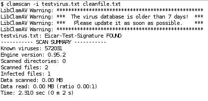

# 九、防病毒保护

通常认为 Linux 不容易受到病毒的攻击，所以为什么要安装反病毒解决方案呢? 虽然 Linux 的病毒确实很少，但其主要目的不是保护邮件服务器免受感染，而是减少或消除对收件人的任何风险。 您的组织可能有运行 Windows 的客户机 pc 容易感染病毒，或者您可能会收到一封满载病毒的电子邮件，您可以将其转发给客户或业务合作伙伴。

Procmail 过滤的众多选项之一是从电子邮件中删除可执行附件，以保护您的系统免受可能的病毒攻击。 这充其量是一次粗糙的操作; 在最坏的情况下，它将删除不包含病毒的文件，并可能留下其他受感染的文件，如脚本，不是可执行文件。

也可以在客户端扫描电子邮件。 但在公司环境中，并不总是可能依赖于每个人的机器都是最新的，并正确安装了合适的病毒检查软件。 显而易见的解决方案是在服务器上运行一个高效的进程，以确保组织发送或接收的所有电子邮件都正确地扫描了病毒。

对于基于 linux 的系统，有许多可用的反病毒解决方案。 我们选择专注于 Clam AntiVirus，通常被称为 ClamAV。 这是一个开源软件，定期更新病毒数据库，以便在下载前进行检查。

在本章中，我们将学习:

*   包含 ClamAV 可以检测到的病毒的文档类型
*   安装和配置用于检测病毒的 ClamAV 组件
*   建立程序来维护最新的防病毒数据库
*   将 ClamAV 与 Postfix 集成，以扫描所有传入的电子邮件消息和附件
*   使用包含测试病毒签名的样本文件和使用测试电子邮件 bourne 病毒广泛测试我们的安装
*   将每个 ClamAV 组件添加到我们的系统启动和关闭过程中

# ClamAV 简介

Clam AntiVirus 是一个针对 Linux、Windows 和 Mac OS x 的开源防病毒工具包。ClamAV 的主要设计特性是将其与邮件服务器集成，以执行附件扫描并帮助过滤已知病毒。 这个包提供了一个灵活的、可伸缩的多线程守护进程(`clamd`)、一个命令行扫描器(`clamscan`)和一个通过 Internet 自动更新的工具(`freshclam`)。 这些程序基于一个共享库 `libclamav`，与 Clam AntiVirus 包一起发布，你也可以在自己的软件中使用这个包。

在本章中，我们将使用的 ClamAV 版本是最新的稳定版本 0.95.2，它具有最新的病毒数据库和特征，能够检测超过 580,000 个病毒、蠕虫和木马，包括 Microsoft Office 宏病毒、移动恶意软件和其他威胁。 虽然本书没有介绍，但它也能够在 Linux 下执行实时扫描，并将其安装到 Linux 内核中。

# 支持文档类型

多种文档类型都可能包含或传播病毒，ClamAV 提供了针对大多数病毒的保护:

*   **ELF**(**可执行和链接格式)**UNIX 和类 UNIX 操作系统(如 Linux、Solaris 和 OpenBSD)使用的文件。
*   **便携式可执行**(**PE**)文件(32/64 位)，使用 UPX、FSG、Petite、WWPack32 压缩，使用 SUE、Yoda’s Cryptor 等进行混淆。 这是 Microsoft Windows 可执行文件的标准格式，也是病毒最常见的传输方式之一。
*   许多形式的 Microsoft 文档都可以包含脚本或可执行文件。 ClamAV 可以处理以下文件和档案类型:
    *   MS OLE2
    *   女士内阁文件
    *   MS CHM(压缩 HTML)
    *   m SZDD
    *   MS Office Word 和 Excel 文档
*   支持其他特殊文件和格式包括:
    *   超文本标记语言
    *   RTF
    *   PDF
    *   用 CryptFF 和 screc 加密的文件
    *   一种编码的程式
    *   TNEF (winmail.dat)
*   其他可能包含任何形式的文档且 ClamAV 可以处理的常见归档格式包括:
    *   RAR (2.0)
    *   邮政编码
    *   gzip
    *   bzip2
    *   tar
    *   BinHex
    *   SIS (SymbianOS 包)
    *   AutoIt

档案的扫描还包括档案中持有的支持文档格式的扫描。

# 下载安装 ClamAV

由于几乎每天都能发现病毒，所以安装最新稳定版本的 ClamAV 软件是非常值得的。 如果您的系统已经安装了 ClamAV，那么安装可能是基于过期的安装包。 强烈建议您从 ClamAV 网站下载并安装最新版本，以确保对系统病毒的最高级别安全。

## 添加新的系统用户和组

您必须向系统添加一个新用户和组，以便 ClamAV 系统使用。

```sh
# groupadd clamav
# useradd -g clamav -s /bin/false -c "Clam AntiVirus" clamav

```

## 从包中安装

ClamAV 有很多安装包，详细信息可以在 ClamAV 网站[http://www.clamav.net/download/packages/packages-linux 上找到。](http://www.clamav.net/download/packages/packages-linux.)

### 注意事项

由于许可限制，大多数二进制包没有内置 RAR 支持。 因此，我们建议您从头安装 ClamAV，直到解决任何许可问题为止。

如果您使用的是基于 Red hat 的系统，安装可能使用以下选项之一执行，这取决于您安装的发行版:

```sh
# yum update clamav

```

或

```sh
# up2date -u clamav

```

如果您使用的是基于 debian 的系统，可以使用以下命令执行安装:

```sh
# apt-get install clamav clamav-daemon clamav-freshclam

```

### 注意事项

确保您安装的是 0.95.2 或更高版本，因为与以前的版本相比，它有显著的增强。 通常，您应该始终安装可用的最新稳定版本。

## 从源代码安装

从原始源代码安装 ClamAV 并不是很困难，它使您能够运行您想要的任何版本，而不仅仅是您的 Linux 发行版的包维护人员选择的版本。 ClamAV 源代码可以从主要的 ClamAV 网站([http://www.clamav.net/download/sources](http://www.clamav.net/download/sources))上的多个镜像下载。

### 要求

编译 ClamAV 需要以下元素:

*   Zlib 和 Zlib -devel 包
*   gcc 编译器套件

以下软件包是可选的，但强烈推荐:

*   Bzip2 和 Bzip2 -devel 库
*   UnRAR 握手

### 建设和安装

一旦您下载并解压缩了归档文件， `cd`到目录，例如 `clamav-0.95.2`。 在开始构建和安装软件之前，很有必要阅读一下 `INSTALL`和 `README`文档。

对于大多数 Linux 系统，可以通过以下步骤减少最简单的安装方法:

1.  运行 `configure`实用程序，通过运行 `configure`命令来创建正确的构建环境:

    ```sh
    $ ./configure --sysconfdir=/etc

    ```

2.  配置脚本完成后，可以运行 `make`命令构建软件可执行文件。

    ```sh
    $ make

    ```

3.  最后一步，也就是 `root`，是将可执行文件复制到系统上进行操作的正确位置。

    ```sh
    # make install

    ```

在最后一步中，将软件安装到 `/usr/local`目录中，并将配置文件安装到 `/etc`中，如图所示，配置文件由`—sysconfdir`选项指定。

在所有阶段，您都应该检查流程输出是否有任何重大错误或警告。

与从源代码构建的所有包一样，在完成本章中的构建、安装和测试步骤后，您可能希望删除未打包的归档文件。

### 快速测试

我们可以通过尝试以下测试来递归扫描源目录中的示例测试病毒文件来验证软件是否正确安装:

### 注意事项

所提供的测试病毒文件不包含真正的病毒，是无害的。 它们包含一个业界认可的病毒签名，专门为测试目的而设计。

```sh
$ clamscan -r -l scan.txt clamav-x.yz/test

```

它应该在 `clamav-x.yz/test`目录中找到一些测试文件。 扫描结果将保存在 `scan.txt`日志文件中。 检查日志文件，特别注意任何提示尚未编译特定文件或存档格式的警告。 日志文件的尾部应该包含类似以下内容的摘要:


# 编辑配置文件

软件安装完成后，需要编辑两个配置文件。 第一个文件 `/etc/clamd.conf`用于实际的病毒扫描软件。 这个文件的大多数重要配置选项将在下面几节中讨论。 第二个配置文件 `/etc/freshclam.conf`将在本章后面介绍。 这就是我们为自动病毒数据库更新添加配置选项的地方。

## 【小题 0

您必须编辑配置文件才能使用这个守护进程，否则 `clamd`将无法运行。

```sh
$ clamd

```

```sh
ERROR: Please edit the example config file /etc/clamd.conf.

```

这将显示默认配置文件的位置。 该文件的格式和选项在 `clamd.conf(5)`手册中有详细描述。 文件注释很好，配置应该很简单。

### 检查示例配置文件

所提供的示例 `config`文件有很好的文档说明，每个重要的配置值都有注释。 以下是一些您可能希望修改的关键值:

```sh
##
## Example config file for the Clam AV daemon
## Please read the clamd.conf(5) manual before editing this file.
##
# Comment or remove the line below.
#Example

```

`Example`行将导致程序因配置错误而停止，它是故意包含的，目的是强迫您在软件正常运行之前编辑文件。 在行开头放置一个 `#`将足以在您完成文件编辑后解决这个问题。

```sh
# Uncomment this option to enable logging.
# LogFile must be writable for the user running daemon.
# A full path is required.
# Default: disabled
LogFile /var/log/clamav/clamd.log

```

最好设置一个日志文件，使您能够在操作的头几周检查错误并监视正确的操作。 然后，您可以决定是停止日志记录还是让它继续运行。

```sh
# Log time with each message.
# Default: disabled
LogTime yes

```

在日志文件中启用时间戳确保您可以跟踪所记录的事件的时间，以帮助调试问题并将事件匹配到其他日志文件中的条目。

```sh
# Path to the database directory.
# Default: hardcoded (depends on installation options)
#DatabaseDirectory /var/lib/clamav
DatabaseDirectory /usr/local/share/clamav

```

确保正确配置数据库目录，以便知道病毒签名信息的确切存储位置。 安装过程将创建文件 `main.cvd`，也可能创建文件 `daily.cld`，作为包含病毒签名的数据库文件。

```sh
# The daemon works in a local OR a network mode. Due to security # reasons we recommend the local mode.
# Path to a local socket file the daemon will listen on.
# Default: disabled
LocalSocket /var/run/clamav/clamd.sock

```

使用本地模式是一项重要的配置更改，它是确保安装 ClamAV 的系统的安全性所必需的。

```sh
# This option allows you to save a process identifier of the listening
# daemon (main thread).
# Default: disabled
PidFile /var/run/clamav/clamd.pid

```

这对于启动和停止脚本非常有用。 如前面的示例所示，ClamAV 目录必须是可写的。

```sh
# TCP address.
# By default we bind to INADDR_ANY, probably not wise.
# Enable the following to provide some degree of protection
# from the outside world.
# Default: disabled
TCPAddr 127.0.0.1

```

这是另一个与安全相关的配置项，以确保只有本地进程可以访问服务。

```sh
# Execute a command when virus is found. In the command string %v # will
# be replaced by a virus name.
# Default: disabled
#VirusEvent /usr/local/bin/send_sms 123456789 "VIRUS ALERT: %v"

```

在某些情况下，这可能是一个有用的特性。 然而，由于病毒传递的范围和频率很广，在夜间或白天传递消息可能会被证明是一种严重的烦恼。

```sh
# Run as a selected user (clamd must be started by root).
# Default: disabled
User clamav

```

通过为 ClamAV 创建一个用户，我们可以将文件和进程的所有权分配给这个用户 ID，并通过限制对该用户 ID 的访问来帮助提高文件的安全性。 此外，当系统上列出正在运行的进程时，很容易识别那些属于 ClamAV 系统的进程。

## freshclam

您必须编辑配置文件，否则 `freshclam`将无法运行。

```sh
$ freshclam

```

```sh
ERROR: Please edit the example config file /etc/freshclam.conf

```

源发行版中还包括一个示例 `freshclam`配置文件。 如果您需要更多关于配置选项和格式的信息，您应该参考*freshclam.conf(5)*手册页面。

### 最近的镜子

因特网上有许多镜像服务器，您可以从那里下载最新的防病毒数据库。 为了避免任何一台服务器超载，应该设置配置文件，以确保从最近的可用服务器获取下载。 包含的 `update`实用程序利用 DNS 系统根据您所请求的国家代码来定位合适的服务器。

需要修改的配置文件项为 `DatabaseMirror`。 您还可以指定参数 `MaxAttempts`—从服务器下载数据库的次数。

默认的数据库镜像是 `clamav.database.net`，但是您可以在配置文件中应用多个条目。 配置条目应该使用格式 `db.xx.clamav.net`，其中 `xx`表示您的标准 ISO 国家代码的两个字母。 例如，如果您的服务器在美国，您应该将以下几行添加到 `freshclam.conf`。 两个字母的国家代码的完整列表可以在[http://www.iana.org/cctld/cctld-whois.htm](http://www.iana.org/cctld/cctld-whois.htm)上找到。

```sh
DatabaseMirror db.us.clamav.net
DatabaseMirror db.local.clamav.net

```

如果连接到第一个条目的任何原因失败，将尝试从第二个镜像条目下载。 您不应该只使用默认条目，因为它可能导致您的服务器或 IP 地址因过载而被 ClamAV 数据库管理员列入黑名单，并且您可能根本无法获得任何更新。

### 检查示例配置文件

所提供的示例 `config`文件有很好的文档说明，每个重要的配置值都有注释。 以下是一些您可能希望修改的关键值:

```sh
##
## Example config file for freshclam
## Please read the freshclam.conf(5) manual before editing this file.
## This file may be optionally merged with clamd.conf.
##
# Comment or remove the line below.
#Example

```

确保这一行被注释以允许守护进程操作。

```sh
# Path to the log file (make sure it has proper permissions)
# Default: disabled
UpdateLogFile /var/log/clamav/freshclam.log

```

启用日志文件对于跟踪正在应用的正在进行的更新和在早期测试阶段监视系统的正确操作非常有用。

```sh
# Enable verbose logging.
# Default: disabled
LogVerbose

```

前一个选项允许在更新日志文件中包含更详细的错误消息。

```sh
# Use DNS to verify virus database version. Freshclam uses DNS TXT # records to verify database and software versions. We highly # recommend enabling this option.
# Default: disabled
DNSDatabaseInfo current.cvd.clamav.net
# Uncomment the following line and replace XY with your country
# code. See http://www.iana.org/cctld/cctld-whois.htm for the full # list.
# Default: There is no default, which results in an error when running freshclam
DatabaseMirror db.us.clamav.net

```

这是一个重要的配置，可以减少网络流量开销，并确保从地理位置较近的服务器获取更新。

```sh
# database.clamav.net is a round-robin record which points to our # most
# reliable mirrors. It's used as a fall back in case db.XY.clamav.net
# is not working. DO NOT TOUCH the following line unless you know
# what you are doing.
DatabaseMirror database.clamav.net

```

就像指令说的——不要管这一行。

```sh
# Number of database checks per day.
# Default: 12 (every two hours)
Checks 24

```

对于繁忙的服务器和大量的流量，值得以更频繁的间隔更新病毒数据库。 然而，这仅适用于运行版本为 0.8 或更高版本的 ClamAV 软件的系统。

```sh
# Run command after successful database update.
# Default: disabled
#OnUpdateExecute command
# Run command when database update process fails..
# Default: disabled
#OnErrorExecute command

```

为了帮助监视配置文件的更新，您刚才看到的选项可以在更新是否正确发生时应用适当的操作。

## 文件权限

按照前面的建议， `clamd`将作为 `clamav`用户运行，默认情况下，在启动时， `freshclam`将放弃特权并切换到 `clamav`用户。 因此，在前面的示例中看到的配置文件中指定的套接字、PID 和日志文件的所有权应该使用以下命令来设置，以允许正确的访问:

```sh
# mkdir /var/log/clamav /var/run/clamav
# chown clamav:clamav /var/log/clamav /var/run/clamav

```

运行 `freshclam`和 `clamd`的用户可以在 `freshclam.conf`和 `clamd.conf`中更改。 但是，如果更改这些参数，则应该验证 ClamAV 进程是否能够访问病毒定义数据库。

# 安装后测试

现在我们已经安装了 ClamAV 的主要组件，我们可以验证每个组件的正确操作。

*   `clamscan`-命令行扫描器
*   `clamd`- ClamAV 守护进程
*   `freshclam`-病毒定义更新程序

对于这些测试，我们需要一个病毒或者至少一个看起来像病毒的非破坏性文件。

## EICAR 测试病毒

许多反病毒研究人员已经合作产生了一个文件，他们的(和许多其他)产品检测出它是一个病毒。 对于用户而言，就这样一个文件达成一致简化了问题。

该测试文件称为**EICAR**(**european Institute for Computer Anti-virus Research)标准反病毒测试文件**。 该文件本身不是病毒，它根本不包含任何程序代码，因此可以安全地传递给其他人。 然而，大多数反病毒产品会对文件作出反应，就好像它真的是一个病毒，这可以使它是一个相当棘手的文件操作或通过电子邮件发送，如果您或收件人有良好的防病毒系统到位。

该文件是一个完全由可打印 ASCII 字符组成的文本文件，因此可以很容易地用常规文本编辑器创建它。 任何支持 EICAR 测试文件的防病毒产品都应该在任何以以下 68 个字符开头的文件中检测到它:

```sh
X5O!P%@AP[4\PZX54(P^)7CC)7}$EICAR-STANDARD-ANTIVIRUS-TEST-FILE!$H+H*

```

当您创建这个文件时，您应该注意以下事实。 该文件只使用大写字母、数字和标点符号，不包括空格。 在重新创建该文件时，可能会出现一些常见错误。 这包括确保第三个字符是大写字母 `O`，而不是数字零(0)，并且所有 68 个字符都是一行，必须是文件的第一行。

有关 EICAR 防病毒测试文件的更多信息，请访问[http://www.eicar.org/anti_virus_test_file.htm](http://www.eicar.org/anti_virus_test_file.htm)。

## 测试 clamscan

我们需要运行的第一个测试是确保安装了病毒扫描程序，并正确配置并包含了病毒定义数据库。 病毒数据库作为安装过程的一部分提供。

最简单的方法是在服务器上创建一个 EICAR 测试文件的副本，然后运行 `clamscan`程序。 我们正在使用`—i`标志，以便只显示受感染的文件。 你应该得到这样的输出:



请注意关于过期病毒数据库的警告。 这是正常的，将在 `freshclam`测试期间纠正。

## 测试粘性

通过使用 `clamdscan`程序，我们可以再次扫描测试文件，但这是通过指示 `clamd`进程进行扫描来完成的。 这是一个非常好的测试，可以确保 `clamd`守护进程正在运行。

预期的输出应该如下所示:

```sh
$ clamdscan testvirus.txt

```

```sh
/home/ian/testvirus.txt: Eicar-Test-Signature FOUND
----------- SCAN SUMMARY -----------
Infected files: 1
Time: 0.000 sec (0 m 0 s)

```

如果没有运行 clamd 守护进程，可以使用 `# clamd`命令启动它。

您还应该检查 `clamd`日志文件(如 `clamd.conf`中配置的)，查看在运行此测试之后是否有任何意外的错误或警告。

## 测试鲜蛤

使用 `freshclam`程序，我们可以交互式地用最新的定义更新病毒数据库。 这个测试将只更新一次数据库。 稍后我们将看到如何执行自动更新。 使用下面的命令(作为超级用户)，我们希望输出类似如下:


从输出中，我们可以看到更新过程成功地下载了两个差异更新，在第三个更新中由于网络问题而失败。 下载最新数据库和当前数据库之间的差异有助于减少网络流量和服务器负载。 在这种情况下， `freshclam`检测到故障，并下载了最新的每日更新，以使病毒数据库更新并增加病毒签名的数量。

现在，如果再次运行 `clamscan`测试，您将注意到不再显示过时警告。

在运行此测试之后，您还应该检查 `freshclam`日志文件是否包含类似于前面代码的输出。

# ClamSMTP 简介

为了扫描所有通过服务器的电子邮件，Postfix 和 ClamAV 之间需要一个软件接口。 我们将要使用的接口是**ClamSMTP**。 以下来自 ClamSMTP 站点([http://memberwebs.com/stef/software/clamsmtp/](http://memberwebs.com/stef/software/clamsmtp/))的介绍将 SMTP 病毒过滤器描述为:

> ClamSMTP 是一个 SMTP 过滤器，允许您使用 ClamAV 杀毒软件检查病毒。 它接受 SMTP 连接并转发 SMTP 命令并响应另一个 SMTP 服务器。 在转发之前，“DATA”邮件主体会被拦截和扫描。 ClamSMTP 的目标是轻量级、可靠和简单，而不是有无数的选项。 它是用 C 编写的，没有主要依赖项。

Postfix 的设计目的是允许调用外部过滤器来处理邮件消息，并将处理过的数据返回到 Postfix 以便后续交付。 ClamSMTP 被设计为直接在 Postfix 和 ClamAV 之间工作，以确保高效操作。

一些 Linux 发行版可能维护了 ClamSMTP 的包，可以通过相关的包管理器安装这些包。 但是，您仍然应该完成下面的说明，以便配置和将 ClamSMTP 集成到 Postfix 中。

可以从[http://memberwebs.com/stef/software/clamsmtp/](http://memberwebs.com/stef/software/clamsmtp/)下载最新的源代码，使用 `wget`命令直接下载到您的 Linux 系统上。 更改到一个合适的位置来下载和构建软件。 当前版本(1.10)的命令选项是 `wget <url>`。

```sh
$ wget http://memberwebs.com/stef/software/clamsmtp/clamsmtp-1.10.tar.gz

```

你应该在网站上查看可以下载的最新版本。 下载文件后，使用 `tar`命令解包文件内容。

```sh
$ tar xvfz clamsmtp-1.10.tar.gz

```

这将创建一个包含当前目录下所有相关文件的目录结构。

## 建设和安装

在构建和安装软件之前，很有必要阅读一下 `INSTALL`和 `README`文档。

对于大多数 Linux 系统，最简单的安装方法如下:

1.  运行 `configure`实用程序，通过运行 `configure`命令创建正确的构建环境。

    ```sh
    $ ./configure --sysconfdir=/etc

    ```

2.  配置脚本完成后，可以运行 `make`命令构建软件可执行文件:

    ```sh
    $ make

    ```

3.  最后一步，也就是 `root`，是将可执行文件复制到正确的位置以便在系统上进行操作:

    ```sh
    # make install

    ```

最后一步，将软件安装到 `/usr/local`目录，将配置文件安装到 `/etc`目录。

在所有阶段，您都应该检查流程输出是否有任何重大错误或警告。

## 配置后缀

Postfix 通过通过外部进程传递邮件项来支持邮件过滤。 此操作既可以在邮件排队之前执行，也可以在邮件排队之后执行。 Postfix 和 `clamsmtp`之间通信的工作方式是假装 `clamsmtp`本身是一个 SMTP 服务器。 这种简单的方法提供了一种创建分布式架构的简单方法，在这种架构中，不同的进程可以在不同的机器上工作，从而在非常繁忙的网络中分散负载。 对于我们的使用，我们将假设只使用一台机器，所有软件都运行在这台机器上。

过滤器接口是专门为在 ClamAV 和 Postfix 邮件系统之间提供接口而设计的。 该过滤器实现为后队列过滤器，用于防病毒扫描。

第一个配置选项需要在 Postfix `main.cf`文件中添加行:

```sh
content_filter = scan:127.0.0.1:10025
receive_override_options = no_address_mappings

```

`content_filter`指令强制 Postfix 通过端口 `10025`上名为 `scan`的服务发送所有邮件。 扫描服务将是我们使用 `clamsmtpd`设置的服务。 `receive_override_options`的指令将 Postfix 配置为执行 `no_address_mappings`。 这防止 Postfix 扩展任何电子邮件别名或组，否则将导致收到重复的电子邮件。

需要对 Postfix `master.cf`文件进行第二个配置更改。

```sh
# AV scan filter (used by content_filter)
scan unix - - n - 16 smtp
-o smtp_send_xforward_command=yes
-o smtp_enforce_tls=no
# For injecting mail back into postfix from the filter
127.0.0.1:10026 inet n - n - 16 smtpd
-o content_filter=
-o receive_override_options=no_unknown_recipient_checks,no_header_body_checks
-o smtpd_helo_restrictions=
-o smtpd_client_restrictions=
-o smtpd_sender_restrictions=
-o smtpd_recipient_restrictions=permit_mynetworks,reject
-o mynetworks_style=host
-o smtpd_authorized_xforward_hosts=127.0.0.0/8

```

### 注意事项

文件的格式非常重要。 您应该确保在添加的文本中， `=`(等号)或`(逗号)周围没有空格。`

 `前两行执行 `scan`服务的实际创建。 其余的行设置了一个服务，用于将邮件接收回 Postfix 以便交付。 其余选项用于防止邮件循环的发生和放松地址检查。 完成这些更改后，需要使用以下命令使 Postfix 重新读取修改的配置文件:

```sh
# postfix reload

```

## 配置 clamSMTP

您必须创建配置文件 `/etc/clamsmtpd.conf`，否则 `clamsmtpd`将无法运行:

```sh
$ clamsmtpd
clamsmtpd: configuration file not found: /etc/clamsmtpd.conf

```

源发行版 `doc`目录中包含一个示例 `clamsmtp.conf`配置文件。 在 `clamsmtp`软件正确操作之前，需要将其复制到正确的位置并进行编辑。

```sh
# cp clamsmtpd.conf /etc/clamsmtpd.conf

```

该文件的格式和选项在 `clamsmtpd.conf(5)`手册中有详细描述。

### 检查示例配置文件

所提供的示例**配置**文件有很好的文档说明，并对每个重要的配置值进行了注释。 这里有一些您可能希望修改的关键值。

```sh
# The address to send scanned mail to.
# This option is required unless TransparentProxy is enabled
OutAddress: 127.0.0.1:10026

```

由于在此配置中只使用一台机器，因此应该将 `OutAddress`选项指定为 `127.0.0.1:10026`，以匹配 `master.cf`中指定的选项。

```sh
# The maximum number of connection allowed at once.
# Be sure that clamd can also handle this many connections
#MaxConnections: 64
# Amount of time (in seconds) to wait on network IO
#TimeOut: 180
# Keep Alives (ie: NOOP's to server)
#KeepAlives: 0
# Send XCLIENT commands to receiving server
#XClient: off
# Address to listen on (defaults to all local addresses on port 10025)
#Listen: 0.0.0.0:10025

```

此地址匹配在 `main.cf`中指定的选项。

```sh
# The address clamd is listening on
ClamAddress: /var/run/clamav/clamd.sock

```

这应该匹配 `clamd.conf`文件中的 `LocalSocket`选项。

```sh
# A header to add to all scanned email
#Header: X-Virus-Scanned: ClamAV using ClamSMTP
# Directory for temporary files
#TempDirectory: /tmp
# What to do when we see a virus (use 'bounce' or 'pass' or 'drop'
Action: drop

```

丢掉这些信息。

```sh
# Whether or not to keep virus files
#Quarantine: off
# Enable transparent proxy support
#TransparentProxy: off
# User to switch to
User: clamav

```

重要的是要确保这些进程以运行 `clamd`的相同用户运行，否则您可能会发现每个进程在访问其他进程的临时文件时存在问题。

```sh
# Virus actions: There's an option to run a script every time a virus is found.
# !IMPORTANT! This can open a hole in your server's security big enough to drive
# farm vehicles through. Be sure you know what you're doing. !IMPORTANT!
#VirusAction: /path/to/some/script.sh

```

现在我们准备好执行 `clamsmtpd`流程的启动。 您应该将其作为 `root`启动，并验证进程是否存在并使用 `clamav`的用户 id 运行。

```sh
# clamsmtpd

```

如果在启动服务时遇到问题，请确保 `clamd`(ClamAV 守护进程)正在运行，并且它正在监听您指定的套接字。 您可以使用 `LocalSocket`或 `TCPSocket`指令在 `clamd.conf`中进行设置(请确保只取消其中一行的注释)。 您还应该确保 `ScanMail`指令被设置为 `on`。

# 测试邮件过滤

根据定义，病毒是我们宁愿避免接触的东西。 但为了确保我们的过滤和检测过程正常工作，并充分保护我们，我们需要访问病毒进行测试。 在生产环境中使用真实的病毒进行测试，就像在办公室里点燃垃圾桶来查看烟雾探测器是否工作一样。 这样的测试将会得到有意义的结果，但也会伴随着不吸引人的风险和不可接受的副作用。 因此，我们需要我们的 EICAR 测试文件，它可以安全地到处传播，而且它显然是非病毒的，但您的杀毒软件将对它作出反应，就像它是病毒一样。

## 测试邮件传播的病毒过滤

第一个测试是检查您是否仍然可以接收邮件。

```sh
$ echo "Clean mail" | sendmail $USER

```

你收到的邮件应该会加上以下一行:

```sh
X-virus-scanned: ClamAV using ClamSMTP

```

如果没有收到邮件，请检查系统、后缀和 clamd 日志文件。 如果有必要，还可以使用 `-d 4`选项停止并重新启动 `clamsmtpd`守护进程，以获得额外的调试输出。

通过将 EICAR 病毒的副本作为电子邮件附件发送给自己，可以执行扫描邮件传播病毒的第二个简单测试。

必须将示例 EICAR 病毒文件创建为电子邮件的附件。 以下来自 Linux 命令提示符的命令链将发送受病毒感染的文件的非常简单的 uu 编码附件副本。

```sh
$ uuencode testvirus.txt test_virus | sendmail $USER

```

如果一切都正常工作并正确配置，您应该不会收到邮件，因为提示 `clamsmtp`删除消息。 消息的缺失并不能证明一切都在正常工作，因此请检查系统或后缀日志文件中类似以下条目:

```sh
Jul 8 19:38:57 ian postfix/smtp[6873]: 26E66F42CB: to=<ian@example.com>, orig_to=<ian>, relay=127.0.0.1[127.0.0.1]:10025, delay=0.1, delays=0.06/0/0.04/0, dsn=2.0.0, status=sent (250 Virus Detected; Discarded Email)

```

这证明了检测包含病毒的直接附件的简单情况。

当然，在现实世界中，病毒比一般的电子邮件附件要聪明一些。 需要进行彻底的测试，以确保正确地设置了筛选。 幸运的是，有一个网站([http://www.gfi.com/emailsecuritytest/](http://www.gfi.com/emailsecuritytest/))可以向您发送包含以多种方式在电子邮件中编码的 EICAR 病毒的电子邮件。 目前它支持 17 个单独的测试。

## 全面的电子邮件测试

网站[http://www.gfi.com/emailsecuritytest/](http://www.gfi.com/emailsecuritytest/)要求您注册要测试的电子邮件地址，并向该地址发送确认电子邮件。 在此电子邮件中有一个 follow 链接，该链接确认您是控制该电子邮件地址的有效用户。 然后，您可以将 17 个病毒和电子邮件客户端利用测试中的任何一个或全部发送到此电子邮件地址。 如果任何带有病毒的电子邮件在您的收件箱中没有被过滤，那么安装就失败了。

### 注意事项

然而，站点上有一些测试消息严格来说不是病毒，因此 ClamAV 流程无法检测到它们。 这是因为这些消息本身并不包含病毒，因此没有什么可查找的，因此也没有什么可停止的。

根据定义，ClamAV 只捕获恶意代码。 gfi([http://www.gfi.com/emailsecuritytest/](http://www.gfi.com/emailsecuritytest/))站点发送这种类型的测试消息。 这些消息的本质是它们有一些畸形的 MIME 标记，可以欺骗 Outlook 客户机。 它不是一个反病毒程序的工作来检测这样的消息。

# 自动更新病毒数据

ClamAV 由志愿者提供，用于分发软件和病毒数据库的服务器和带宽是自愿资助的。 因此，确保在检查更新以维护最新数据库和重载各种服务器之间保持平衡是很重要的。

### 注意事项

ClamAV 小组建议如下:如果您运行的是 ClamAV 0.8x 或更高版本，如果您在 `freshclam.conf: DNSDatabaseInfo current.cvd.clamav.net`中有以下选项，那么您可以每小时检查四次数据库更新。

如果你没有这个选择，你必须坚持每小时一张支票。

## 设置自动更新

ClamAV 的病毒数据库文件可以通过多种方式从 ClamAV 服务器上下载。 这包括使用自动或手动工具，如 `wget`。 然而，这并不是进行更新的首选方法。

我们早先使用 ClamAV 安装的 `freshclam`实用程序是执行更新的首选方法。 它会定期自动下载最新的防病毒数据库。 可以通过 `cron`条目或命令行设置它自动工作，也可以作为守护进程运行并处理自己的调度。 当 `freshclam`由具有根权限的用户启动时，它将删除特权并将用户 ID 切换到 `clamav`用户。

`freshclam`使用 DNS 系统的功能来获取已准备好下载的最新版本的病毒数据库的详细信息，以及可以从何处获取。 这可以显著降低您自己和远程系统的负载，因为在大多数情况下，执行的唯一操作是使用 DNS 服务器进行检查。 只有在有新版本可用时，它才会尝试执行下载。

现在我们准备开始 `freshclam`流程。 如果您已经决定将它作为守护进程运行，那么只需执行以下命令:

```sh
# freshclam –d

```

然后检查进程是否正在运行，并且日志文件是否被正确更新。

另一种可用的方法是使用 `cron`守护进程来调度 `freshclam`进程以定期运行。 为此，您需要为 `root`或 `clamav`用户在 `crontab`文件中添加以下条目:

```sh
N * * * *       /usr/local/bin/freshclam –quiet

```

### 注意事项

`N`可以是 `1`和 `59`中的任意数字。 请不要选择任何 10 的倍数，因为已经有太多的服务器使用这些时间段。

代理设置只能通过配置文件进行配置，当 `HTTPProxyPassword`被启用时， `freshclam`将要求配置文件的所有者具有严格的只读权限。 例如,

```sh
# chmod 0600 /etc/freshclam.conf

```

代理设置示例如下:

```sh
HTTPProxyServer myproxyserver.com
HTTPProxyPort 1234
HTTPProxyUsername myusername
HTTPProxyPassword mypass

```

# 自动启动和关机

如果通过包管理器而不是从源安装任何或所有 ClamAV 和 ClamSMTP 组件，则可能已经提供了必要的启动脚本。 检查是否在启动启动序列中包含了必要的脚本。

如果您已经从源代码安装了 ClamAV，下面的脚本是在引导时启动和停止必要的守护进程的示例。 根据您的发行版本，文件位置可能有所不同，您可能需要执行额外的命令来为每个脚本设置运行级别。 请参阅您的发行版文档。

## ClamSMTP

在 ClamSMTP 源中提供的脚本之一是用于在启动系统时自动启动和停止操作守护进程的脚本。 检查脚本中的路径名是否与配置文件和安装目录中的路径名匹配，然后从 ClamSMTP 源树的根目录执行以下命令:

```sh
# cp scripts/clamsmtpd.sh /etc/init.d/clamsmtpd

```

复制文件之后，确保脚本具有执行权限，并且除了系统 root 用户之外，任何人都不能修改脚本。

```sh
# ls -al /etc/init.d/clamsmtpd
-rwxr-xr-x 1 root root 756 2009-07-09 15:51 /etc/init.d/clamsmtpd

```

将该脚本添加到系统启动中。

```sh
# update-rc.d clamsmtpd defaults

```

## ClamAV

接下来是一个示例脚本，用于在引导时启动和停止 `clamd`和 `freshclamd`守护进程。 与前面一样，验证路径名，根据需要调整脚本，并在将脚本添加到系统启动之前将其复制到系统初始化目录。

如果 `freshclam`作为 `cron`作业而不是作为守护进程运行，那么从脚本中删除启动 `freshclam`进程和停止 `freshclam`进程的行。

```sh
#!/bin/sh
#
# Startup script for the Clam AntiVirus Daemons
#
[ -x /usr/local/sbin/clamd ] || [ -x /usr/local/bin/freshclam ] || exit 0
# See how we were called.
case "$1" in
start)
echo -n "Starting Clam AntiVirus Daemon: "
/usr/local/sbin/clamd
echo -n "Starting FreshClam Daemon: "
/usr/local/bin/freshclam -d -p /var/run/clamav/freshclam.pid
;;
stop)
echo -n "Stopping Clam AntiVirus Daemon: "
[ -f /var/run/clamav/clamd.pid ] && kill `cat /var/run/clamav/clamd.pid`
rm -f /var/run/clamav/clamd.socket
rm -f /var/run/clamav/clamd.pid
echo -n "Stopping FreshClam Daemon: "
[ -f /var/run/clamav/freshclam.pid ] && kill `cat /var/run/clamav/freshclam.pid`
rm -f /var/run/clamav/freshclam.pid
;;
*)
echo "Usage: clamav {start|stop}"
;;
esac

```

# 监控日志文件

定期监视日志文件是很重要的。 在这里，您将能够跟踪病毒数据库的定期更新，并确保您的系统受到尽可能好的保护。

定期更新消息应该如下所示:


偶尔会有新软件发布，需要更新。 在这种情况下，您将在日志文件中得到警告消息，如下所示:


在 Internet 连接出现问题或远程文件本身在更新时不可用的情况下，进程可能会记录临时错误消息。 只要这些错误不存在，就不需要采取任何行动。

# 文件消毒

一种常见的要求是，在将文件转发给最终接收方之前，对文件进行自动消毒。 在当前版本(0.95)中，ClamAV 无法对文件进行消毒。 以下信息可从 ClamAV 文档中获得。

> 我们将在下一个稳定版中添加对 OLE2 文件的消毒支持。 目前还没有对其他类型文件进行消毒的计划。 这样做的原因有很多:现在从文件中清除病毒几乎毫无意义。 清洁后很少有什么有用的东西留下，即使有，你能相信吗?

# 总结

我们现在已经安装并配置了一个非常有效的防病毒系统，用于检查所有收到的电子邮件中的受感染附件，并显著地保护了我们的系统(包括服务器和工作站)免受攻击。

我们的邮件传输代理 Postfix 现在可以通过 ClamSMTP 内容过滤接口过滤使用 ClamAV 守护进程的所有邮件，以扫描和检测针对病毒签名数据库的各种威胁。 通过使用 `freshclam`，我们确保我们的检测数据库一直保持最新，以防范最新的威胁和任何新发布的病毒。 在这场持续的战斗中，我们仍然需要时刻保持警惕，以确保软件和文件始终保持完全最新的状态。`