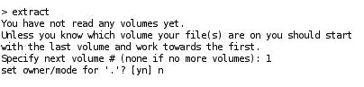

# 十、备份系统

为了在发生重大硬件或软件故障时从灾难性的服务损失中恢复，有一个备份是绝对必要的。 备份应该让您恢复软件(或者更确切地说，软件的配置)和重新建立服务所需的其他数据。 这包括用户的邮件、系统的邮件队列以及他们的身份验证数据等。

本章将指导您完成必要的步骤，以保护您的系统不发生故障，以及如果发生故障，如何恢复。 读完本章，你就会知道:

*   什么备份选项可用
*   我们需要备份多少数据啊
*   备份介质的存储考虑
*   如何对邮箱执行增量备份和完全备份
*   完成文件系统恢复所需的步骤
*   如何恢复单个电子邮件
*   如何备份我们的服务器配置
*   设置自动备份计划

# 备份选项

选择最合适的备份选项总是需要权衡。 您必须平衡业务的停机成本、备份媒体和硬件的价格和可用性、用户数据的价值(在本例中是用户的电子邮件)以及管理备份操作的人员成本。

对于我们的小型办公室电子邮件服务器，我们将提供一个简单但可靠的解决方案，使用许多管理员多年来使用的可靠的技术和工具。

我们采取的任何备份都需要存储在备份媒体上。 最方便的解决方案是有一台备用的 Linux 机器，它有许多硬盘驱动器，可以连接到我们的电子邮件服务器，最好位于另一栋大楼里。 如果我们想保护自己免受火灾等灾难性事件的影响，在站点外存储备份是必要的。

如果不能使用远程服务器，那么可以使用一些连接到服务器的可热插拔外部硬盘驱动器，必要时甚至可以使用 DVD 刻录机。 磁带驱动器也是一种选择，但磁带驱动器和媒体的成本通常比服务器更高。 如果可移动媒体是唯一的选择，那么不要把备份堆在服务器上或抽屉里，把它们移到一个安全的地点。 在现场保留最新备份媒体的本地副本，以便更快地响应紧急恢复情况，这可能比较方便。

## 突袭

**RAID**是**廉价**(或**独立**)**硬盘**的**冗余阵列**的缩写。 通过在 RAID 设置中使用多个磁盘，数据分布在磁盘上，但操作系统将阵列视为单个设备。 通过在整个阵列中复制和划分数据，可以显著降低对磁盘故障的容忍度，从而提高数据可靠性和可能的 I/O 性能。 当阵列中有硬盘故障时，可以将旧硬盘更换为新硬盘。 然后 RAID 控制器(硬件或软件控制器)重构数据。 有关 RAID 和各种可用配置选项的更多信息，请访问[http://en.wikipedia.org/wiki/RAID](http://en.wikipedia.org/wiki/RAID)。 【病人】

但是，RAID 本身并不是一个备份解决方案。 文件或电子邮件已被删除，无论是意外或恶意，无法恢复。 RAID 不能防止用户错误或严重的硬件故障，如电源激增导致服务器崩溃甚至火灾损坏。

使用 RAID 提高数据可用性是一件好事，但并不是合适的备份和恢复策略的替代方案。

## 镜像备份

磁盘映像备份程序将从硬盘逐个扇区复制数据，而不考虑磁盘上的任何文件或结构。 备份是磁盘的精确映像—主引导记录、分区表和所有数据。

在发生重大硬件故障时，恢复系统的步骤如下:

1.  更换或修复故障硬件。
2.  引导包含磁盘映像恢复程序的 Linux 活动 CD。
3.  从备份中写入每个磁盘的映像。
4.  重新引导。

从表面上看，这似乎是一种有吸引力的、快速的方法，可以快速、轻松地恢复服务。 但是，使用磁盘映像进行备份存在许多固有的问题。

*   将磁盘映像恢复到不同大小或几何形状的新磁盘通常是不可能的。
*   新的硬件几乎肯定是不同的配置(主板、网卡、磁盘控制器等等)，并且恢复的 Linux 内核可能没有成功引导所需的驱动程序。
*   磁盘映像很大。 映像是磁盘的总大小，而不仅仅是存储在磁盘上的数据的大小。 多个磁盘映像的空间需求很快就会增加。
*   恢复单个用户文件是相当麻烦的。 需要将磁盘映像恢复到空闲磁盘，挂载在正在运行的系统上，一旦找到，将其复制到所需的位置。

总体系统故障很少发生，映像恢复的便利性和速度通常被文件系统备份的灵活性所抵消。

## 文件系统备份

与映像备份不同，文件系统备份了解文件系统的结构，从而了解硬盘上的数据。 因此，只复制磁盘中已分配的部分，而不复制空闲空间。 备份针对的是文件系统中的所有文件，而不是按扇区进行备份。

因为文件系统备份是通过这种方式进行的，这意味着可以只复制自上次备份以来更改的文件，从而产生较小的后续备份文件。

在发生重大硬件故障时，恢复系统的步骤如下:

1.  更换或修复故障硬件。
2.  安装 Linux 发行版。
3.  在本书中安装邮件服务器应用程序。
4.  应用任何补丁。
5.  恢复应用程序配置数据备份。
6.  恢复用户数据备份。
7.  重新启动

与映像备份相比，这种方法花费的时间稍微长一些，涉及的步骤也更多，但是有许多优点。

*   更换的硬盘不需要相同的尺寸和几何形状。
*   只要您的 Linux 发行版支持新硬件，就不存在兼容性问题。
*   备份文件的大小要小得多。
*   单个文件的恢复要简单得多。

如前所述，主要系统故障并不常见。 虽然完成完全恢复的步骤比映像备份要麻烦一些，但更小、更快的备份以及用户数据的选择性恢复的便利性的优点是非常显著的。

为了减少意外磁盘故障的可能性，可以使用系统工具监视磁盘驱动器的健康状况。 更多信息，请访问[http://en.wikipedia.org/wiki/S.M.A.R.T。](http://en.wikipedia.org/wiki/S.M.A.R.T) 。

## 临时备份

文件系统备份整个文件系统，而不是个别的文件或目录。 有时，在对某个应用程序进行重大配置更改后，我们可能希望只复制几个文件。

使用标准 Linux 工具(如 `tar`或 `cp`)，可以将重要的更改文件复制到文件系统上的一个目录中，该目录是正常备份计划的一部分。

# 什么要备份

与备份相关的一个大问题是，“我们应该备份什么?”

有很多因素影响着我们的最终决定。 当然，我们希望备份服务器的配置，因为这对服务器的功能至关重要。 但我们也希望备份用户的数据，因为这是我们业务的宝贵资产。 公司有没有规定人们可以用电子邮件进行私人交流? 如果有，我们是否也应该备份这些信息?

我们应该只备份恢复系统到正常工作状态所需要的数据。 这样可以节省备份介质的空间，缩短执行备份和恢复所需的时间。

毕竟，任何备份媒体上的空间都是有限的，因此非常宝贵。 备份所有用户的邮件比备份 `/tmp`目录更重要。 此外，我们备份的数据越少，执行备份所需的时间就越少，从而更快地将系统资源(CPU 周期、I/O 带宽)返回给它们的主要目的——处理用户的邮件。

以下是我们需要备份以获得工作系统的项目列表:

*   系统库存
*   服务需要的已安装软件
*   软件配置文件
*   用户的凭证
*   用户的邮箱
*   日志文件(用于计费目的和最终用户请求)
*   后缀邮件队列

下面几节描述了所讨论的每一项。

## 系统库存

在部分或全部硬件故障的情况下，记录当前系统布局是很有用的。 在大多数情况下，替换的硬件通常与我们当前的设置一样好，如果不是更好的话。 为了恢复系统，我们需要知道磁盘是如何分区的，以及挂载点是如何组织的。 将用户的数据恢复到一个太小的磁盘上是很困难的。

使用以下命令的输出，我们将有足够的信息来重新创建磁盘布局:

```sh
# fdisk -l > disk_layout.txt

```

该命令打印每个磁盘的分区表，并将输出保存到一个文件中。

```sh
# df -h >> disk_layout.txt

```

这个命令将每个挂载点的容量和用法附加到我们的文件中。

```sh
# mount >> disk_layout.txt

```

`mount`命令列出当前的挂载点，我们将其附加到文件中。

其他信息可能在文件 `/etc/fstab`中，我们稍后将对其进行备份。

## 获取已安装软件列表

为了恢复已安装的软件，我们需要一个当前已安装软件的列表。

在 Debian 中，这是通过以下命令提供的。 `installed_software.txt`文件包含系统上已安装/未安装软件的当前状态。

```sh
# dpkg --get-selections > installed_software.txt

```

对于基于 rpm 的发行版，这将是:

```sh
# rpm -qa > installed_software.txt

```

在基于 debian 的系统中，稍后可以使用该文件安装相同的软件集。

```sh
# dpkg --set-selections < installed_software.txt
# dselect

```

在 `dselect`实用程序中，为 `install`选择 `i`，然后确认安装。

对于基于 rpm 的发行版，这将是:

```sh
# yum -y install $(cat installed_software.txt)

```

### 注意事项

刚才讨论的命令只列出通过包管理器安装的软件。 如果您已经从源代码安装了软件，那么请记录您安装的应用程序和版本。

## 系统配置文件

没有这些，服务器将不能执行其预期的职责。 至少需要备份的配置文件有:

*   `/etc/courier:`此目录保存了 Courier-IMAP 的配置数据。
*   `/etc/postfix:`此目录保存 Postfix 的配置数据。

目录树 `/etc`包括网络设置、路由等项目，否则我们需要记住这些内容。 建议备份整个 `/etc`树。

### 注意事项

如果您从源代码安装了带有非标准位置配置文件的软件，请确保将这些配置文件包含在您的备份候选列表中。

## 认证数据

否则，用户无法使用其用户名和密码组合进行身份验证。 需要备份的数据取决于身份验证的完成方式，包括三个文件`—/etc/passwd, /etc/shadow`和 `/etc/group`，以及一个 MySQL 数据库(如果用户的凭证存储在该数据库中)。

## 用户邮箱

这是存储用户邮件的地方。 这包括 `/home`及其以下的整个目录树。 这是我们大量的备份大量的数据。

## 日志文件

我们至少应该存储 Postfix 和 Courier 生成的日志。 这些将用于处理用户请求，例如“我的邮件去哪里了?” 如果用户是基于发送和/或接收的邮件量计费，那么我们肯定需要备份 Postfix 的日志。

由于 Postfix 的和 Courier 的日志通常是由系统的 `syslogd`守护进程写入的，我们需要检查 `/etc/syslog.conf`文件来查看这些日志的去向。 两个程序都使用 `syslog`邮件设施记录它们的消息。

为了确保完全覆盖，最好备份 `/var/log`的整个目录树。

## 邮件队列

备份正在工作的系统的 Postfix 队列可能有意义，也可能没有意义，这取决于具体情况。

使用 Postfix，电子邮件至少会击中磁盘两次。

*   当电子邮件被 Postfix 接收时，它们第一次到达你的驱动器; 在继续交付之前，它们被写入 Postfix 的 `queue_directory`。

### 注意事项

病毒扫描程序或检测垃圾邮件的程序(例如， `clamav`和 `spamassassin`)可能会产生更多磁盘 I/O。

*   如果是本地域的邮件，我们的服务器就是这些邮件的最终目的地，它们在 `queue_directory`中的寿命非常短。 它们进入队列，只是为了随后立即被发送到用户的邮箱。 这是他们第二次撞击磁碟了。
*   如果是发送到其他域的邮件(因为服务器充当中继)，那么 Postfix 将立即联系收件人的邮件服务器，并尝试将消息传递到那里。 只有在出现问题的情况下，队列才会包含大量尚未交付的电子邮件。 这些问题是:
    *   **`content_filter`**速度慢或不能操作:**例如 `clamsmtp`或其他产品。**
    ***   **远程站点有问题:**大型免费电子邮件提供商经常有问题，因此可能无法立即接受我们的电子邮件。**

 **在这两种情况下，延迟队列将填满仍要交付的邮件，显然应该备份这些邮件，以防出现故障。 如果服务器非常繁忙，队列中可能会有大量延迟的邮件。

Postfix 邮件队列包括目录树 `/var/spool/postfix`及其以下。

# 什么不备份

我们不需要备份所有已安装的二进制文件，因为这些文件可以简单地使用前面提到的“已安装软件列表”重新安装。 当然，这假定在我们需要重建系统时，安装介质是可用的。 作为具有安全意识的管理员，我们通过安装厂商的补丁来保持系统的更新。 随着时间的推移，已安装和随后打过补丁的软件的版本将与安装媒体上的版本显著不同。 如果这些更新可以通过互联网安装(例如使用 Red Hat 的 up2date 或 Debian apt-get)，我们就不需要在站点上保存它们。

# 备份用户电子邮件

我们将使用 dump 来备份包含邮箱的整个分区。 dump 命令将文件系统中的文件复制到指定的磁盘、磁带或其他媒体。

使用它的原因有:

*   它的速度非常快(在我的测试中，网络是瓶颈)
*   它很简单(一个命令就足够了)
*   它可以在无人值守的情况下运行(例如，作为 `cron`作业)
*   它不需要安装任何额外的软件
*   它不需要 GUI
*   它已经非常成熟了，大约从 1975 年 AT&T UNIX 版本 6 开始

`restore`命令的执行与 `dump`相反。 可以将使用 `dump`获得的文件系统备份恢复为完整的文件系统，也可以有选择地恢复某些文件或目录。

## 邮件存储

出于多种原因，我们建议将邮箱(`/home`)放在一个单独的分区上。

*   文件系统维护可以独立于系统的其他部分执行(只需卸载 `/home`，执行 `fsck`，然后重新挂载它)。
*   可以将该分区放在单独的磁盘上或 RAID 上，从而将用户的 I/O(在该分区上)与系统的 I/O(日志、邮件队列、病毒扫描程序)分开。

最重要的是:

*   使用 `dump/restore`，我们可以转储整个分区。 (好吧，这并不完全正确，但只有在整个分区中才能轻松地完成 `dump/restore`。)
*   包含邮箱的分区过满不会对系统写入日志文件或其他重要系统信息的能力产生负面影响。 如果所有数据(日志、邮箱、系统文件)都在一个分区上，填充这个分区将导致停止日志记录。

Courier 和 Postfix 都对用户的邮箱使用 Maildir 格式。 它们将每封邮件存储为一个单独的文件，即使是单个邮件也可以轻松地恢复操作。

使用 Maildir 格式的备份操作非常简单。

*   “备份电子邮件”对应于“将文件备份到备份媒体”。
*   “还原电子邮件”对应于“从备份介质中还原文件”。
*   “备份邮箱”对应于“将一个 Maildir 及其所有子目录备份到备份介质”。
*   “还原邮箱”对应于“从备份介质中还原 Maildir 及其所有子目录”。

## 使用 dump

备份数据基本上有两种方法。 简单方法在执行备份时存储所有数据。 这被称为完全备份。 它的优点是简单，而它的主要缺点是需要存储在备份媒体上的大量数据。 增量备份的概念解决了这个问题。 增量备份仅保存自上次增量(或完全)备份以来的更改。

如果备份介质上的空间允许每天进行完全备份，为了简单起见，我们可以这样做。 这样，我们只需要查看最后一个完整的备份就可以恢复所有数据。

增量备份很简单。 备份软件只需要备份自上次备份以来最近创建或更改的文件和目录。

如果空间不允许这个简单的解决方案，我们可以使用以下方案:

*   每周执行一次全量备份
*   做 6 次增量备份，每天一次

如果我们需要从头开始恢复，首先恢复最后一个完整备份，然后恢复最多 6 个增量备份。 这样我们最多失去一天的邮件，这是我们可以得到的最接近每天备份间隔。 稍后，我们将看到更复杂的增量备份策略，以减少恢复完整转储后所需的增量恢复的数量。

有关 `dump(8)`和 `restore(8)`的详细信息，请参见系统手册页面。

现在我们来看看使用 `dump`命令备份邮箱的实际任务。

### 完全转储

现在，我们要对包含用户 Maildirs 的分区执行完全备份。 在本例中，这个分区将是 `/dev/sdb1`(我们的 SATA 磁盘的第一个分区)。 因此，我们将想要备份 `/dev/sdb1`。

为了找出系统上需要备份的分区，我们需要检查 `mount`命令的输出:

```sh
# mount

```

```sh
/dev/sda1 on / type ext3 (rw,relatime,errors=remount-ro)
tmpfs on /lib/init/rw type tmpfs (rw,nosuid,mode=0755)
/proc on /proc type proc (rw,noexec,nosuid,nodev)
sysfs on /sys type sysfs (rw,noexec,nosuid,nodev)
varrun on /var/run type tmpfs (rw,nosuid,mode=0755)
varlock on /var/lock type tmpfs (rw,noexec,nosuid,nodev,mode=1777)
udev on /dev type tmpfs (rw,mode=0755)
tmpfs on /dev/shm type tmpfs (rw,nosuid,nodev)
devpts on /dev/pts type devpts (rw,noexec,nosuid,gid=5,mode=620)
fusectl on /sys/fs/fuse/connections type fusectl (rw)
lrm on /lib/modules/2.6.27-14-generic/volatile type tmpfs (rw,mode=755)
/dev/sdb1 on /home type ext3 (rw,relatime)

```

我们可以看到， `/home`是 `/dev/sdb1`的分区。

我们的计划是使用 `dump`工具为这个分区创建备份。 该备份数据需要传输到我们的备份介质中，备份介质可以是另一个磁盘、磁带，在本例中，可以是远程备份服务器中的磁盘。

通过网络获取数据有多种方法，其中之一是 `ssh`。 它是一种网络协议，用于保证两台设备之间的安全通信。

为了将我们的备份数据通过网络传输到备份服务器中的另一个磁盘上，我们使用 Linux 的能力将 `dump`程序和 `ssh`协议结合起来。

`dump`程序的输出将送入 `gzip`以压缩转储，然后送入 `ssh`，从而在备份服务器上生成另一个程序 `dd`，最终将该数据写入其磁盘。

以下代码行将包含邮箱的分区的完整转储到远程系统上的一个文件。 我们假设邮箱位于挂载为 `/home`的分区 `/dev/sdb1`上。

以 root 用户执行如下命令:

```sh
# dump -0 -u -b 1024 -f - /dev/sdb1 | \
gzip -c | \
ssh user@backup-host.domain.com \
dd of=/backupdirectory/$(date +%Y%m%d%H%M%S).home.dump.0.gz

```

这个命令看起来很复杂，所以让我们在每个步骤中分解它:

*   `dump -0 -u -b 1024 -f -`执行水平 `0`(`full`)转储的分区 `/dev/sdb1` `/home`(包含在我们的示例中)使用一块大小 `1024`(最大性能)和更新 `/var/lib/dumpdates`(`-u`)文件转储后已经成功。 `-u`选项很重要，因为它记录此转储的日期和时间，因此后续的增量转储可以确定自上次转储以来更改或创建了哪些文件。 转储的输出转到指定为(`-`)的文件(`-f`)，该文件表示 `stdout`，即标准输出。
*   当 `dump`数据进入标准输出(`stdout`)时，我们可以将该输出管道到 `gzip`以压缩转储的大小。 `-c`选项告诉 `gzip`将压缩输出写入 `stdout`。
*   然后，压缩的 0 级转储输出通过管道传递到 `ssh`命令，该命令对以 `user`身份登录的系统 `backup-host.domain.com`进行远程连接。 登录后，远程系统执行 `dd`命令。 我们建议使用 `ssh`提供的基于密钥的身份验证方案。 这样，备份可以在无人值守的情况下运行，因为没有人需要输入作为 `user`登录 `backup-host.domain.com`所需的密码。
*   在远程服务器上，最后一步是使用 `dd`命令写入输出。 输出文件名由 `of`选项指定为 `dd`。 输出文件名的构造方式便于识别文件系统、转储的日期和时间、转储的级别以及后缀 `.gz`，以表明该转储文件已被压缩。 文件名部分 `$(date +%Y%m%d%H%M%S`是在本地系统(不是远程系统)上执行的 shell 扩展，以 `YYYYMMDDHHMMSS`格式输出当前日期和时间。 最终的输出文件名将类似于 `20090727115323.dump.0.gz`。

有关每个命令的更多信息，请参阅系统手册中的 `dump, gzip, ssh, dd`和 `date`页。

输出将类似如下所示:


下面的例子将简单地将备份数据写入一个目录没有 `stdout`魔法!

下面的代码行给出了包含邮箱的分区的完整转储到一个单独磁盘上的文件，以保存备份:

```sh
# dump -0 -u -f /backupdirectory/fulldump /dev/sdb1

```

当然,这是更快和更简单的通过网络发送所有数据通过 `ssh`与数据进行加密和解密在运输过程中(这需要很多的时间和 CPU),但是,如果我们的服务器是烧成炭灰,一个内置的硬盘上备份不会起到任何作用。

请记住， `/backupdirectory/fulldump`也可以是 NFS 挂载或 SMB 挂载。 这将同时提供简单的命令行和离线备份的优点。 所以，确保你有一个离线备份。 这两种方法都很简单。

### 增量转储

增量转储的执行方式与完整转储完全相同，只是我们将级别选项从 0 更改为 1、2 或 3，等等，这取决于我们希望备份多少更改。 记住，高于 0 的级别告诉 dump 复制自上一次较低级别转储以来的所有新文件或修改的文件。 最好用一些例子来说明这一点。 为了清晰起见，我们将简单地将其转储到一个文件中，但在实践中，我们通常使用与使用 `gzip, ssh, dd`所讨论的相同的命令序列，等等。

假设我们的 0 级转储是在周日晚上被拿走的。 然后在周一晚上执行第一次增量转储(级别 1，由 `-1`选项表示)，如下所示:

```sh
# dump -1 -u -f mon.dump.1 /dev/sdb1

```

这会将所有新的或自上次完全转储后更改的内容保存到 `mon.dump.1`。 此转储文件将比以前仅包含周一所做更改的完整转储要小得多。 假设，在第二天我们重复这个 1 级转储

```sh
# dump -1 -u -f tue.dump.1 /dev/sdb1

```

第二个增量转储 `tue.dump.1`将包含周一和周二所做的所有更改，因为 1 级转储将备份自 0 级转储以来发生的所有更改。 为了将系统恢复到最新的备份，我们必须只恢复周二的备份。 因此，人们可能会认为周一的倾倒现在已经过时了; 然而，如果用户希望恢复在周一创建的文件，并在周二意外删除，我们仍然需要第一次备份。

重复执行 1 级转储可以非常快速地恢复，因为只需要恢复两个转储文件，即 0 级转储和最新的 1 级转储。 其缺点是，每个后续转储文件的大小都会增加，并且需要越来越长的时间来完成。 这种方案有时被称为差异备份。

另一种方法是使用额外的转储级别来减少每个备份文件的大小。

例如，以下命令序列在初始的 0 级转储之后执行了大量的增量备份:

```sh
# dump -1 -u -f mon.dump.1 /dev/sdb1
# dump -2 -u -f tue.dump.2 /dev/sdb1
# dump -3 -u -f wed.dump.3 /dev/sdb1
# dump -4 -u -f thu.dump.4 /dev/sdb1

```

在本例中，每天的转储文件只包含自上一次转储以来的新文件和更改的文件。 从周二开始的每个转储操作都将更快地完成，并产生比前面示例中更小的文件大小。 然而，复苏将需要更长的时间。 为了恢复到最新的备份，我们需要恢复全部转储，然后按顺序恢复从周一到周四的每个增量转储。

为了理解不同级别转储之间的交互，在小型临时文件系统上尝试这些示例可能是一个有用的练习。 可以使用以下命令检查每个转储文件:

```sh
# restore -t -f filename

```

出于好奇，还可以在每次转储之后检查文件 `/var/lib/dumpdates`，以验证每个转储的日期和级别。

正如本章开头所述，一切都是一种权衡，因此选择合适的备份策略需要平衡媒体成本、人员成本和恢复时间。

到目前为止，我们的所有备份都是在挂载磁盘的情况下执行的，这使得无法验证备份。 原因是我们刚刚备份的数据一直在变化。 记住，每个文件代表一个电子邮件。 每当用户获得新邮件或删除旧邮件时，文件系统的状态就会改变。 用户不断地获取邮件、读取邮件和删除邮件，即使在他们准备执行备份时也是如此。

`restore`命令确实有 `-C`选项，可以将转储文件与原始磁盘内容进行比较，但是只有当我们正在转储的文件系统被卸载时，这个选项才有效。 在大多数情况下，卸载每个文件系统是不实际的，并且会严重中断服务。

## 使用还原

所有备份过的数据在使用之前都需要进行恢复。

这可以通过两种方式实现，交互或非交互。

### 交互式恢复

为了交互式地从转储中恢复数据，我们需要将转储从备份介质复制到系统中，或者在存储转储的计算机上执行文件恢复操作。 如果我们只提取了几个文件，那么可以在一个临时目录中执行这一操作，并且在恢复完成后，可以将生成的文件移动到正确的位置。 对于较大数量的文件，例如整个用户帐户，我们可以在开始恢复之前 `cd`到最终目的地。

对于交互式恢复，运行以下命令:

```sh
# restore -i -f /backupdirectory/subdir/dumpfile
>

```

其中`>`为交互界面恢复提示。 它是一个简陋的界面，只有有限的命令可用。 它允许在转储中导航，就像我们在一个活动的文件系统上一样。 使用 `ls`和 `cd`显示目录内容或更改目录。 发布 `?`以获得支持的命令列表。

一旦我们找到了想要恢复的数据，输入以下命令之一:

*   【t】【t】
*   【t】【t】

这将把特定的 `directoryname`和它下面的所有数据，或者只是 `filename`添加到需要恢复的文件集中。 重复其他文件或目录。

一旦添加了所有需要恢复的数据，就发出 `extract`命令。



上一个屏幕截图中显示的输出与磁带上的卷号有关。 一个转储文件可能已经被分割到一个多卷磁带集上，但在处理硬盘上的转储文件时，请选择卷 `1`。 我们通常会选择 `n`来保留工作目录的当前所有权和权限。

一旦必要的文件被提取出来，发出以下命令:

```sh
> quit

```

按照顺序处理最后一个完整转储和每个增量转储，直到最后一个可用的增量转储。 这确保我们恢复了自上次完全备份以来的所有更改。

### 注意事项

如果我们正在恢复的数据在两个转储之间没有更改，那么在第二个增量转储中就根本找不到它。

### 跨网络的非交互式恢复

如果我们只想恢复几个邮箱，那么手动方法是有意义的。 如果我们想要完全恢复所有邮箱，我们需要使用非交互方案。 这不需要目标系统上的额外存储空间，因为转储数据是通过网络传输的。

在新安装的、新分区的硬盘上重新创建文件系统并挂载它:

```sh
# mke2fs -j /dev/sdb1
# mount /dev/sdb1 /home

```

`mke2fs`的 `-j`选项在 `/dev/sdb1`上创建一个 ext3 日志文件系统，并将其挂载为 `/home`。

请注意，我们需要使用与创建备份时相同的文件系统重新创建数据!

让恢复开始吧。

```sh
# cd /home
# ssh user@backup-host.domain.com \
dd if=/backupdirectory/20090601030034.home.dump.0.gz | \
gunzip -c | restore -r -f -

```

就像我们在网络上执行备份一样，我们现在对恢复执行同样的操作。

```sh
ssh user@backup-host.domain.com

```

上一行在 `backup-host.domain.com`主机上以 `user`的形式执行以下命令，不过这次使用 `dd`命令，使用 `if`选项读取压缩转储文件并将输出发送给 `stdout`。

```sh
dd if=/backupdirectory/20090601030034.home.dump.0.gz

```

输出通过管道通过网络传输到 `gunzip`以解压缩文件，最终通过管道传输到 `restore -r -f -`。 `-r`选项指示 restore 使用原始权限和所有权从转储文件的内容重新构建整个文件系统到原始位置。 如果愿意，可以将 `-v`选项与 `restore`一起使用以获得详细输出。

### 注意事项

在发出 `restore`命令之前，必须确保我们位于正确的目录中，否则可能会对现有的文件系统造成严重损害。

恢复的输出看起来像这样:

```sh
# ssh backup@nas1 dd if=backups/20090727153909.home.dump.0.gz \ | gunzip -c | restore -r -f -
restore: ./lost+found: File exists
1629153+1 records in
1629153+1 records out
834126574 bytes (834 MB) copied, 71.4752 s, 11.7 MB/s
#

```

关于 `lost+found`存在的警告是正常的，可以安全地忽略。

然后，应该对每个需要将系统返回到所需状态的增量转储文件重复此操作。 如果我们以错误的顺序恢复增量转储，我们将得到错误的“增量磁带太低”或“增量磁带太高”。 一旦我们收到这些错误之一，我们就无法完成完全恢复，必须从级别 0 转储重新启动恢复。

当对恢复命令使用 `-r`选项时，它将创建文件 `restoresymtable`。 这是恢复命令在还原多个转储时使用的检查点文件，以帮助下一个 `restore`命令确定需要更新、创建或删除哪些目录或文件。

在完全恢复并验证了文件系统之后，我们应该删除 `restoresymtable`文件。 如果该文件包含在下一个转储中，那么旧的 `restoresymtable`文件最终可能会覆盖当时正在创建的文件，从而阻止恢复其他转储。

最后一步，对新恢复的文件系统执行级别 0 `dump`。

# 备份配置和日志

备份配置数据和重要日志文件有两种方法。

*   **将数据存储在我们的备份介质上:**使用这种方法，我们将直接备份到我们的备份服务器。
*   **将数据添加到我们的备份计划中:**这种方法将包括必要的文件作为我们的用户数据备份的一部分。

这两种情况都是同样有效的，实际上是一个个人偏好的问题。

提醒一下，之前我们列出了系统中需要备份的重要部分。 这些是:

<colgroup><col style="text-align: left"> <col style="text-align: left"></colgroup> 
| 

这是系统的重要组成部分

 | 

示例命令

 |
| --- | --- |
| 系统库存 | `disk_layout.txt` |
| 已安装软件清单 | `installed_software.txt` |
| 系统配置文件 | `/etc` |
| 身份验证数据 | `/etc/password /etc/groups /etc/shadow` |
| 日志文件 | `/var/log` |
| 邮件队列 | `/var/spool/postfix` |

由于每个系统都是不同的，所以您应该确保下面给出的示例命令涵盖所有必要的文件。

## 传输配置和日志到备份介质

为了简单起见，我们只使用 `tar`工具创建前面列出的文件和目录的存档，并将其存储在与备份服务器上的完整或增量转储相同的目录中:

```sh
# tar cz disk_layout.txt installed_software.txt \
/etc /var/log /var/spool/postfix | \
ssh user@backup-host.domain.com \
dd of=/backupdirectory/$(date +%Y%m%d%H%M%S).config.tar.gz

```

或者，我们可以在 `/home`文件系统上创建 `tar`归档，并将其作为正常备份计划的一部分进行备份。

```sh
# mkdir -p /home/config
# chmod 600 /home/config
# tar czf /home/config/$(date +%Y%m%d%H%M%S).config.tar.gz \
disk_layout.txt installed_software.txt \
/etc /var/log /var/spool/postfix

```

在这两种情况下，我们使用带有选项 `c`的 `tar`命令创建存档， `z`压缩，以及 `f`作为输出存档名。 还要注意，我们限制了对 `/home/config`目录的访问，因为它包含包含敏感信息的归档文件，这些敏感信息应该受到保护。

有关 `tar`的更多信息，请参阅系统手册页。

## 恢复配置

根据前面使用的方法，恢复配置和日志文件是相对简单的。 我们可以从备份服务器复制所需的归档，也可以直接从 `/home/config`使用归档。 在这两种情况下，解压归档文件都使用以下命令:

```sh
# mkdir tmpdir
# cd tmpdir
# tar xzf xxxxx.config.tar.gz

```

注意，在展开存档之前，我们已经创建并移动到一个临时目录中。 如果在执行 `tar`命令时，当前目录为 `/`，则会覆盖 `/etc, /var/log`和 `/var/spool/postfix`中的所有文件，从而产生可能不理想的结果。

现在我们已经对归档文件进行了解压，可以比较和复制需要恢复的文件了。

# 自动备份

现在我们已经了解了如何备份系统，我们需要设置一个自动化过程，以消除定期手动调用 `dump`的麻烦。

关于转储的手册页提供了一些关于备份频率和在何种级别上减少恢复时间的指导。

> *在发生灾难性磁盘事件时，可以通过错开增量转储，将所有必要的备份磁带或文件恢复到磁盘所需的时间保持到最小。 一个有效的惊人增量转储方法，以最小化磁带数量:*

> *总是从 0 级备份开始。 这应该在设定的间隔内完成，比如一个月一次或每两个月一次，并且在一组永远保存的新磁带上*。

> *在级别 0 之后，使用改进的河内塔算法，每天收集活动文件系统的转储，转储级别的顺序为:3 2 5 4 7 6 9 8 9… 对于每日转储，应该可以每天使用固定数量的磁带，每周使用一次。 每周进行一次 1 级转储，每天的河内序列从 3 开始重复。 对于每周转储，每个转储文件系统使用另一组固定的磁带，也是周期性的*。

> *在几个月左右之后，每天和每周的磁带应该从转储周期中旋转出来，并引入新的磁带*。

这一系列的转储看起来相当奇怪，需要更多的解释。 通过这个过程，我们将演示如何最小化转储的大小，并减少恢复所需的数量。

一旦获取了 3 级转储，恢复就只需要恢复转储 0 和 3。 在第二天之后，2 级转储将在更低的级别(即 0 级)上备份自上次转储以来所更改的所有内容。 这使得 3 级转储无效。 5 级转储然后备份自 2 级转储以来的更改。 随着顺序的进展，使用更高或更低的级别跳过几天，以前的转储将变得无效，并且不再需要完成完全恢复。 应该仍然保留每个转储文件，以防以后需要恢复意外删除的单个文件。

到周末时，将执行 1 级转储，呈现所有前几周的转储级别，并重新启动序列，直到月末获取新的 0 级转储。

下表说明了每天使用的转储级别以及将数据恢复到最新版本所需的恢复数量:

<colgroup><col style="text-align: left"> <col style="text-align: left"></colgroup> 
| 

天月

 | 

转储水平

 | 

恢复要求的水平

 |
| --- | --- | --- |
| 1 | 0 | 0 |
| 2, 9, 16, 23, 30 | 3 | 0, 1 and 3 |
| 3, 10, 17, 24, 31 | 2 | 0, 1 and 2 |
| 4, 11, 18, 25 | 5 | 0, 1, 2, 5 |
| 5, 12, 19, 26 | 4 | 0, 1, 2, and 4 |
| 6, 13, 20, 27 | 7 | 0, 1 times 2, 4, 7 |
| 7, 14, 21, 28 | 6 | 0, 1 times 2, 4, 6 |
| 8, 15, 22, 29 | 1 | 0, 1 |

### 注意事项

在第一周，恢复过程中不需要 1 级转储(用*标记)。 从第 8 天开始，一直需要 1 级转储。

从表中可以看到，即使在一个月的末尾，恢复数据也只需要几个转储，而不是在创建增量每日转储时需要几十个。

对于我们的每月备份计划，一个简单的脚本和向 `cron`添加一些条目将完成自动备份过程。

## 备份脚本

下面的 bash 脚本示例将归档我们的系统配置和日志文件，并将请求的文件系统转储到远程备份服务器。 这只是一个示例脚本，应该根据您的需要进行修改。 为了清晰起见，这里省略了任何错误检查和日志记录。

```sh
#!/bin/sh
# The name of the dump, e.g. home or users
NAME=$1
# The partition to dump, e.g. /dev/sdb1
DEVICE=$2
# The dump level, e.g. 0 or 3 etc.
LEVEL=$3
# ssh login name and host
#
USERNAME=user
BACKUPHOST=backuphost
# Take a system inventory.
#
/sbin/fdisk -l > /tmp/disk_layout.txt
/bin/df -h >> /tmp/disk_layout.txt
/bin/mount >> /tmp/disk_layout.txt
# Installed software (Debian)
#
/usr/bin/dpkg --get-selections > /tmp/installed_software.txt
# Archive our system configuration and logs
#
/bin/tar cz /tmp/disk_layout.txt /tmp/installed_software.txt \
/etc /var/log /var/spool/postfix | \
/usr/bin/ssh $USERNAME@$BACKUPHOST \
/bin/dd of=$(date +%Y%m%d%H%M%S).config.tar.gz
# Perform the dump to the remote backup server.
#
/usr/sbin/dump -u -$LEVEL -f - $DEVICE | \
/bin/gzip -c | ssh $USERNAME@$BACKUPHOST \
/bin/dd $(date +%Y%m%d%H%M%S).$NAME.dump.$LEVEL.gz"
# Remove temporary files.
#
rm -f /tmp/disk_layout.txt /tmp/installed_software.txt
exit 0

```

该脚本需要 3 个参数:转储名称、要转储的分区和转储级别。

典型用法如下:

```sh
# remote-dump.sh home /home 0

```

前面的脚本在每次运行时都会归档 `/etc`。 您可能希望将这些命令移动到单独的脚本中，以便每周甚至每月执行此任务。 如果脚本也将用于转储其他文件系统，那么这一点尤为重要。

以前几个月的旧转储文件没有被脚本删除，可能会填满我们的备份服务器，防止未来的备份。 谨慎的做法是，根据组织的数据保留策略，设置删除或存档旧转储文件的过程。

## 添加 crontab 条目

每天晚上自动运行我们的备份脚本，只需要使用我们的备份计划表中的条目并执行脚本转储正确的分区。 下面的例子 `crontab`条目每天晚上 02:10 执行我们的脚本来转储 `/home`。 每个月的第一天执行一次 0 级转储，然后每隔 7 天执行一次每周一次的 1 级转储。 其他条目实现了修改后的“河内塔”算法。

```sh
10 02 1 * * /bin/remote-dump.sh home /home 0
10 02 2,9,16,23,30 * * /bin/remote-dump.sh home /home 3
10 02 3,10,17,24,31 * * /bin/remote-dump.sh home /home 2
10 02 4,11,18,25 * * /bin/remote-dump.sh home /home 5
10 02 5,12,19,26 * * /bin/remote-dump.sh home /home 4
10 02 6,13,20,27 * * /bin/remote-dump.sh home /home 7
10 02 7,14,21,28 * * /bin/remote-dump.sh home /home 6
10 02 8,15,22,29 * * /bin/remote-dump.sh home /home 1

```

自动化备份过程就位后，我们需要注意任何错误，并验证远程服务器上转储文件的完整性。

# 正在验证恢复程序

即使有世界上最好的计划，事情总是在最不方便的时候出错。

通过良好的规划和实践，采取积极的方法进行灾难恢复，可以在为时已晚之前尽早突出任何问题。 只有通过恢复系统备份并检查恢复的系统是否完全可操作，才能真正验证系统备份的完整性。

您应该问自己这样的问题:“如果远程服务器失败，需要采取什么行动?” 您是先修复备份服务器还是在没有备份的情况下切换到另一个服务器来减小窗口的大小? 如果邮件服务器发生故障，您熟悉恢复过程吗? 是否可以在短时间内更换硬件，比如在周日?

有许多可怕的故事，管理员努力地进行备份，却发现在需要时备份是无用的，因为磁带驱动器错误或备份脚本中的一个小语法错误，用错误数据覆盖了有效的转储文件。

自己设计一些场景，在备用硬件上练习完全裸机恢复，或者恢复单个用户的电子邮件。

验证恢复过程的工作将给您信心，您可以从数据丢失中恢复。

# 总结

在本章中，我们描述了如何备份电子邮件和邮件服务器配置。 我们首先介绍了您认为值得备份的内容，最后介绍了一个使用自动完全备份和增量备份的复杂解决方案。

特别地，我们描述了使用 `dump`命令的过程，以及如何获取数据的副本。 我们使用 `restore`命令恢复一个完整的文件系统和所选的文件。

本章指导您通过备份和恢复您的服务器的宝贵数据的过程。 它展示了为什么要备份，要备份什么数据，不同的备份和恢复方法，以及采取自动每日备份的过程。

在实现了我们在本章中向你展示的所有过程之后，你会睡得更好，而且无论如何，你的用户会喜欢你的系统所提供的范围和功能。**