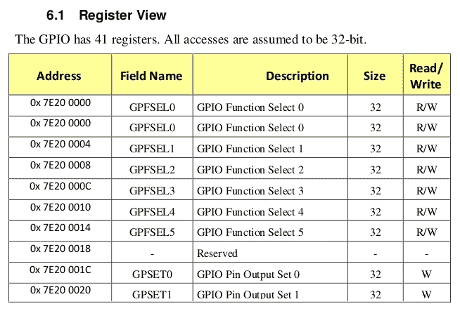

# 三、使用硬件 IO 内存

在本章中，我们将重点讨论编写设备驱动程序的一个重要的硬件相关方面:如何准确地访问和执行对硬件(或外围设备)输入/输出存储器的输入/输出(输入/输出、读取和写入)——您正在为其编写驱动程序的外围设备硬件芯片。

本章中您将获得的知识背后的动机很简单:没有这些，您将如何实际控制设备？大多数设备由对其硬件寄存器和/或外围存储器(也称为硬件输入/输出存储器)的仔细校准的读写驱动。作为一个基于虚拟内存的操作系统，Linux 在处理外围输入输出内存时需要一些抽象。

在本章中，我们将涵盖以下主题:

*   从内核访问硬件输入/输出内存
*   理解和使用内存映射输入/输出
*   理解和使用端口映射输入/输出

我们开始吧！

# 技术要求

我假设您已经通过了*前言*部分*来充分利用这本书*，并且已经适当地准备了一个运行 Ubuntu 18.04 LTS(或更高的稳定版本)的来宾 VM，并且安装了所有需要的软件包。如果没有，我强烈建议你先做这个。为了最大限度地利用这本书，我强烈建议您首先设置工作空间环境，包括克隆这本书的 GitHub 代码存储库，并以动手的方式进行处理。知识库可以在这里找到:[https://github . com/PacktPublishing/Linux-内核-编程-第 2 部分](https://github.com/PacktPublishing/Linux-Kernel-Programming-Part-2)。

# 从内核访问硬件输入/输出内存

作为设备驱动程序作者，您可能会面临一个有趣的问题:您需要能够访问和处理外围芯片的输入/输出内存、硬件寄存器和/或硬件内存。事实上，这通常是驱动程序在“金属”级别对硬件进行编程的方式:通过寄存器和/或外围存储器向硬件发出命令。然而，在 Linux 上直接访问硬件输入/输出内存会面临一个问题。在第一部分中，我们将研究这个问题并提供解决方案。

## 通过直接访问了解问题

当然，现在芯片上的这个硬件内存，也就是所谓的 I/O 内存，并不是 RAM。Linux 内核拒绝模块或驱动程序作者直接访问这样的硬件输入/输出内存位置。我们已经知道原因:在现代基于虚拟机的操作系统上，所有内存访问都必须通过**内存管理单元** ( **MMU** )和分页表进行。

让我们快速总结一下在配套指南**第 7 章* *内存管理内部组件–要点*中看到的内容的关键方面:默认情况下，内存是虚拟化的，这意味着所有地址都是虚拟的，而不是物理的(这包括内核段或 VAS 中的地址)。这样想:一旦进程(或内核)访问虚拟地址进行读写或执行，系统就必须在相应的物理地址获取内存内容。这包括在运行时将虚拟地址转换为物理地址；硬件优化(中央处理器缓存、**翻译后备缓冲器** ( **TLBs** )等)可以加快速度。执行的过程如下:*

1.  首先，检查中央处理器高速缓存(L1-D/L1-I、L2 等)以查看该虚拟地址引用的内存是否已经在中央处理器高速缓存芯片上。
2.  如果内存已经在船上，我们有一个缓存命中，工作就完成了。如果不是(这是一个**末级缓存** — **LLC** 失手-贵！)，虚拟地址被馈送到微处理器 MMU。
3.  MMU 现在在处理器 TLB 中寻找相应的物理地址。如果它在那里，我们有一个 TLB 击中，工作已经完成；如果没有，我们有一个 TLB 小姐(这是昂贵的！).

4.  MMU 现在遍历进行访问的用户空间进程的分页表；或者，如果内核进行了访问，它会遍历内核分页表，将虚拟地址转换为相应的物理地址。此时，物理地址被放在总线上，工作完成。

Please refer to TI's *Technical Reference Manual* for the OMAP35x at [https://www.ti.com/lit/ug/spruf98y/spruf98y.pdf?ts=1594376085647](https://www.ti.com/lit/ug/spruf98y/spruf98y.pdf?ts=1594376085647) for more information on this; the *MMU Functional Description* topic (page 946) is illustrated with excellent diagrams (for our purpose, see *Figures 8.4*, *8.6*, and *8.7* – the latter is a flowchart depicting the preceding procedures).

Also, we mention the fact that the actual address translation procedure is of course very arch-dependent. On some systems, the order is as shown here; on others (often on ARM), the MMU (including TLB lookups) is performed first, and then the CPU caches are checked.

所以，想想看:即使是正常的内存位置也不能被运行在现代操作系统上的软件直接访问；这是因为它的内存被虚拟化了。在这种情况下，分页表(每个进程以及内核本身)使操作系统能够在运行时将虚拟地址转换为物理地址。(在我们的配套书籍 *Linux 内核编程*、*第 7 章*、*内存管理内部组件–要点*、*虚拟寻址和地址转换*部分中，我们已经详细介绍了这些领域；如果需要的话，一定要回头看一下，以更新这些要点。)

现在，如果我们有一个包含输入/输出内存的硬件外设或芯片，如果我们考虑到这个内存不是内存的事实，这个问题似乎更加复杂。那么，这个内存不是由分页表映射的吗？还是真的？在下一节中，我们将探讨两种常见的解决方案，请继续阅读！

## 解决方案–通过输入/输出内存或输入/输出端口进行映射

为了解决这个问题，我们必须理解，现代处理器提供了两种广泛的方式来访问和使用硬件输入/输出(外围芯片)存储器:

*   通过为这些外围设备保留处理器地址空间的一些区域；即使用**内存映射 I/O** ( **MMIO** )作为 I/O 的映射类型

*   通过提供不同的汇编(和相应的机器)中央处理器指令来直接访问输入/输出内存。将这种映射类型用于输入/输出被称为**端口映射输入/输出** ( **PMIO** 或简称为 **PIO** )。

我们将在*理解和使用内存映射输入/输出*和*理解和使用端口映射输入/输出*部分分别考虑这两种技术。然而，在我们这样做之前，我们需要学习如何礼貌地向内核请求使用这些输入/输出资源的许可！

## 请求内核的许可

想一想:即使你知道使用哪个应用编程接口来映射或以某种方式处理输入/输出内存，首先，你需要向操作系统*请求许可。*毕竟，操作系统是系统的整体资源管理器，在使用它的资源之前，你必须很好地询问它。当然，这还不止这些——当你问它的时候，你真正做的是让它建立一些内部数据结构，让内核了解哪个驱动程序或子系统正在使用什么输入/输出内存区域或端口。

在执行任何外围输入/输出之前，您应该向内核请求这样做的权限，假设您得到了权限，您就执行输入/输出。在此之后，您应该将输入/输出区域释放回内核。该过程涉及以下步骤:

1.  **输入输出前**:请求访问内存或端口区域。
2.  **收到内核的绿灯后，执行实际的输入输出**:你可以使用 MMIO 或者 PMIO 来完成(详情见下表)。
3.  **输入/输出后**:将内存或端口区域释放回操作系统。

那么，如何执行这些请求、输入/输出和释放操作呢？有一些 API 可以做到这一点，您应该使用的 API 取决于您使用的是 MMIO 还是 PMIO。下表总结了在执行输入/输出之前应该使用的应用编程接口，然后在这项工作完成后释放该区域(执行输入/输出的实际应用编程接口将在后面介绍):

| **访问输入/输出存储器的方法** | MMO | pmio |
| 在执行任何输入/输出之前，请求访问输入/输出内存/端口区域。 | `request_mem_region()` | `request_region()` |
| 执行输入/输出操作。 | (参见*MMIO–执行实际输入/输出*部分) | (参见*PMIO–执行实际输入/输出*部分) |
| 执行输入/输出操作后，释放该区域。 | `release_mem_region()` | `release_region()` |

上表所示功能在`linux/ioport.h`表头定义为宏；他们的签名如下:

```sh
request_mem_region(start, n, name);  [...] ; release_mem_region(start, n);
request_region(start, n, name);      [...] ; release_region(start, n);
```

所有这些宏本质上都是`__request_region()`和`__release_region()`内部 API 的包装器。这些宏的参数如下:

*   `start`是 I/O 内存区域或端口的开始；对 MMIO 来说，这是一个物理(或总线)地址，而对 PMIO 来说，这是一个端口号。
*   `n`是被请求区域的长度。
*   `name`是您希望与映射区域或端口范围相关联的任何名称。它通常是执行输入/输出操作的驱动程序的名称(您可以在 proc 文件系统中看到它；我们将在介绍如何使用 MMIO 和 PMIO 时更详细地了解这一点)。

`request_[mem_]region()`应用编程接口/宏的返回值是一个指向`struct resource`的指针(在*获取设备资源*一节中有更多相关内容)。如果`NULL`被返回，这意味着资源未能被保留；驱动程序通常会返回`-EBUSY`，表示资源现在正忙或不可用(可能是因为另一个组件/驱动程序已经请求并正在使用它)。

在接下来的章节中，我们将提供一些使用这些 APIs 宏的实际例子。现在，让我们学习如何实际映射和使用输入/输出内存。我们将从几乎所有现代处理器都支持的通用方法开始；也就是 MMIO。

# 理解和使用内存映射输入/输出

在 MMIO 方法中，中央处理器理解其地址空间的某个区域(或几个)是为输入/输出外围存储器保留的。您实际上可以通过参考给定处理器(或 SoC)数据表的物理内存图来查找区域。

为了更清楚地说明这一点，让我们看一个真实的例子:树莓皮。如您所知，这款流行的主板使用的是 Broadcom BCM2835(或更高版本)SoC。位于[https://github . com/raspberrpi/documentation/blob/master/hardware/raspberrpi/BCM 2835/BCM 2835-ARM-外设. pdf](https://github.com/raspberrypi/documentation/blob/master/hardware/raspberrypi/bcm2835/BCM2835-ARM-Peripherals.pdf) (位于*第 90 页*上)的 *BCM2835 ARM 外设*文档提供了其物理内存映射的一小部分的截图。SoC 的**通用输入/输出** ( **GPIO** )寄存器的映射显示了处理器地址空间中硬件输入/输出存储器的一部分:



Figure 3.1 – Physical memory map on the BCM2835 showing the GPIO register bank Well, the reality is more complex; the BCM2835 SoC has multiple MMUs: one – the VC/ARM MMU (**VC** stands for **VideoCore** here) – translates the ARM bus address into the ARM physical address, after which the regular ARM MMU translates the physical address into a virtual address. Take a look at the diagram on *page 5* of the aforementioned *BCM2835 ARM Peripherals* document to see this.

正如我们所看到的，这是一个寄存器块(或存储体)，一个 32 位寄存器的集合，用于类似的目的(这里是 GPIO)。在上图中，我们当前目的的关键列是第一列，即**地址**列:这是物理或总线地址，是 ARM 处理器物理地址空间中它看到 GPIO 寄存器的位置。它从`0x7e20 0000`开始(因为这是前面截图中的第一个地址)，并且长度有限(这里，它被记录为具有 41 个寄存器，每个寄存器 32 位，所以我们将该区域的长度取为 *41 * 4* 字节)。

## 使用 ior emap *(API)

现在，正如我们在*中看到的，理解直接访问*部分的问题，试图在这些物理或总线地址上直接执行输入/输出是行不通的。我们应该这样做的方法是告诉 Linux 将**这些总线地址映射到**内核的 VAS 中，这样我们就可以通过**内核虚拟地址** ( **KVAs** )访问它！我们如何做到这一点？内核为此提供了 APIs 驱动作者使用的一个非常常见的是`ioremap()` API。其签名如下:

```sh
#include <asm/io.h>
void __iomem *ioremap(phys_addr_t offset, size_t size)
```

`asm/io.h`头文件根据需要成为一个特定于 arch 的头文件。注意`ioremap()`的第一个参数是物理(或总线)地址(它的数据类型是`phys_addr_t`)。作为驱动程序作者，这是 Linux 中少有的必须提供物理地址而不是虚拟地址的情况(另一种典型情况是在执行**直接内存访问** ( **DMA** )操作时)。第二个参数很明显；这是我们必须映射的内存 I/O 区域的大小或长度。调用时，`ioremap()`例程将从`offset`开始将长度为`size`字节的输入/输出芯片或外围存储器映射到内核的 VAS 中！这是必要的——以内核特权运行，你的驱动现在可以通过返回指针访问这个输入/输出内存区域，从而在内存区域上执行输入/输出。

Think about it! Just like the `mmap()` system call allows you to memory map a region of KVA space to a user space process, the `[devm_]ioremap*()` (and friends) APIs allow you to map a region of peripheral I/O memory to the KVA space.

`ioremap()` API 返回一个`void *`类型的 KVA(因为它是一个地址位置)。那么，这里有什么奇特的`__iomem`指令(`void __iomem *`)？它只是一个编译器属性，在构建时会被删除；它只是提醒我们人类(以及执行健全性检查或查看静态分析代码)这是一个输入/输出地址，而不是您的常规内存地址！

因此，对于前面的示例，在树莓 Pi 设备上，您可以通过执行以下操作将 GPIO 寄存器库映射到 KVA(这不是实际的代码，而是一个向您展示如何调用`ioremap()` API 的示例):

```sh
#define GPIO_REG_BASE    0x7e200000
#define GPIO_REG_LEN     164    // 41 * 4
static void __iomem *iobase;
[...]
if (!request_mem_region(GPIO_REG_BASE, GPIO_REG_LEN, "mydriver")) {
    dev_warn(dev, "couldn't get region for MMIO, aborting\n");
    return -EBUSY;   // or -EINVAL, as appropriate
}
iobase = ioremap(GPIO_REG_BASE, GPIO_REG_LEN);
if (!iobase) // handle any error
    [... perform the required IO ... ]
iounmap(iobase);
release_mem_region(GPIO_REG_BASE, GPIO_REG_LEN);
```

`iobase`变量现在保存来自`ioremap()`的返回值；这是一个 KVA，一个内核虚拟地址。您现在可以使用它，只要它是非空的(您应该验证这一点！).因此，在这个例子中，来自`ioremap()`的返回值是内核 VAS 中树莓 Pi 的 GPIO 寄存器(外围输入/输出存储器)现在映射和可用的地方。

一旦完成，您需要使用`iounmap()` API 取消映射(如前面的代码片段所示)；`iounmap()`应用编程接口的参数是显而易见的——输入/输出映射的开始(由`ioremap()`返回的值):

```sh
void iounmap(volatile void __iomem *io_addr);
```

因此，当我们将(GPIO 寄存器)输入/输出内存映射到内核 VAS 时，我们得到了一个 KVA，这样我们就可以使用它。有趣的是，来自`ioremap()` API 的返回值通常是内核 VAS 的 *vmalloc* 区域内的一个地址(有关这些详细信息，请参考配套指南 *Linux 内核编程* - [第 7 章](3.html)、*内存管理内部组件–要点*)。这是因为`ioremap` 通常会从内核的 vmalloc 区域分配并使用所需的虚拟内存进行映射(但情况并非总是如此；像`ioremap_cache()`这样的变体可以使用 vmalloc 以外的区域。在这里，假设返回值——我们的`iobase`地址——是`0xbbed 8000`(参考图 3.2:这里有一个 2:2 GB 的虚拟机分割，您可以看到`iobase`返回地址确实是内核 vmalloc 区域内的一个 KVA)。

以下是显示这一点的概念图:


Figure 3.2 – The physical-to-virtual mapping of I/O peripheral memory

将前面的图表(*图 3.2* )与我们在配套指南 *第 7 章* *内存管理内部组件-要点* ( *图 7.12* )中介绍的树莓 Pi 上内核 VAS 的详细图表进行比较，是一件有趣的事情。

(在 Aarch64 或 ARM64 处理器上看到一个显示内存物理/虚拟映射的类似图表也很有教育意义；你可以在 ARM 官方文档中查找；即*内存管理单元*部分下的 *ARM Cortex-A 系列程序员指南 ARM V8-A*-查看*图 12.2:**[https://developer . ARM . com/documentation/den0024/A/The-Memory-Management-Unit](https://developer.arm.com/documentation/den0024/a/The-Memory-Management-Unit)。)*

 *## 较新的种类 devm _ *管理的应用编程接口

现在你明白了如何使用`request_mem_region()`和刚刚看到的`ioremap*()`API，你猜怎么着？现实是这两种 API 现在都被认为是不推荐使用的；作为一个现代驱动程序作者，你应该使用更好的资源管理`devm_*`API。(出于一些原因，我们介绍了较旧的驱动程序，包括许多较旧的驱动程序仍在大量使用它们，以了解使用`ioremap()`资源管理 API 的基础知识，并确保完整性。)

首先，让我们在`lib/devres.c`中查看新的资源管理 ioremap，称为`devm_ioremap()`:

```sh
/** 
 * devm_ioremap - Managed ioremap()
 * @dev: Generic device to remap IO address for
 * @offset: Resource address to map
 * @size: Size of map
 *
 * Managed ioremap(). Map is automatically unmapped on driver detach.
 */ 
void __iomem *devm_ioremap(struct device *dev, resource_size_t offset,
               resource_size_t size)
```

正如我们在非常常见的`kmalloc`*/*`kzalloc`API(参考配套指南 *Linux 内核编程、* *第 8 章*、*模块作者的内核内存分配–第 1 部分*)中了解到的那样，`devm_kmalloc()`和`devm_kzalloc()`API 简化了我们的生活，因为它们保证释放在设备分离或驱动程序移除时分配的内存。以类似的方式，使用`devm_ioremap()`意味着您不需要显式调用`iounmap()` API，因为内核的 *devres* 框架将在驱动程序分离时处理它！

Again, since this book is not primarily focused on writing device drivers, we shall mention bit not delve into deep details of using the modern **Linux Device Model** (**LDM**) with the `probe()` and `remove()`/`disconnect()` hooks. Other literature dedicated to this subject can be found in the *Further reading* section, at the end of this chapter.

请注意，任何`devm_*()` API 的第一个参数都是指向`struct device`的指针(我们在[第 1 章](1.html)*编写简单的杂项字符设备驱动程序*中向您展示了如何获取这个参数，当时我们介绍了如何编写简单的`misc`驱动程序)。

### 获取设备资源

`devm_ioremap()` API 的第二个参数(见上节的签名)是`resource_size_t offset`。形式参数名`offset`有点误导——它实际上是外围 I/O 内存区域的物理或总线地址，用于重新映射到内核 VAS(事实上，`resource_size_t`数据类型只不过是物理地址`phys_addr_t`的`typedef`。

This and the following section's coverage is **important for Linux device driver authors** since it introduces some key ideas (the **Device Tree** (**DT**), the platform and `devres` APIs, and so on) and encompasses some very common strategies that are employed.

但是如何获得`devm_ioremap()` API 的第一个参数——总线或物理地址呢？一个常见问题！当然，这是设备特有的。话虽如此，起始总线或物理地址只是驱动程序作者可以——有时必须——指定的几个输入/输出资源之一。Linux 内核为此提供了一个强大的框架——输入/输出资源管理框架，因为它允许您获取/设置硬件资源。

There are several kinds of resources available; it includes device MMIO ranges, I/O port ranges, **interrupt request** (**IRQ**) lines, register offsets, DMAs, and bus values.

现在，为了使所有这些工作正常进行，必须在每个设备的基础上指定输入/输出资源。有两种广泛的方法可以做到这一点:

*   **传统方法**:通过将它们(输入/输出资源)硬编码到内核源代码树中，通常称为特定于板的文件。(例如，对于流行的 ARM CPU，这些通常在`arch/arm/mach->foo/...`找到，其中`foo`是机器(`mach`)或平台/板名。再举一个例子，在 Linux 3.10.6 中，这些特定于主板的文件中定义的平台设备数量为 1，670 个；迁移到现代 DT 方法后，对于 5.4.0 内核源代码树，这个数字减少到了 885。)

*   **现代方法**:将它们(输入/输出资源)放置在操作系统启动时可以发现的位置；对于嵌入式系统，如 ARM-32、AArch64 和 PPC，通常通过一种称为 DT(类似于 VHDL)的硬件特定语言来描述板或平台的硬件拓扑(其上的所有硬件，如 SoC、CPU、外设、磁盘、闪存芯片、传感器芯片等)。**设备树源** ( **DTS** )文件位于内核源树下(对于 ARM，在`arch/arm/boot/dts/`中)，并在内核构建时编译(通过 DT 编译器；也就是说，`dtc`)转换成称为**设备树 Blob** ( **DTB** )的二进制格式。DTB 通常在引导时由引导加载程序传递给内核。在早期引导期间，内核读入、展平并解释 DTB，根据需要创建平台(和其他)设备，然后将它们绑定到相应的驱动程序。

The DT isn't present for x86[_64] systems. The closest equivalent is perhaps the ACPI tables. Also, note that the DT isn't a Linux-specific technology; it was designed to be OS-agnostic, and the generic org is called **Open Firmware** (**OF**).

正如我们之前提到的，在这个现代模型中，内核和/或设备驱动程序必须从 DTB 获得资源信息(它被填充在`include/linux/ioport.h:struct resource`中)。怎么做？平台驱动程序通常这样做的一种常见方式是通过`platform_get_*()`应用编程接口。

我们希望通过内核源码中的一个**视频 For Linux** ( **V4L** )媒体控制器驱动程序的例子来说明这一点。该驱动程序用于三星 Exynos 4 SoC 上的 SP5 电视混音器(在某些 Galaxy S2 型号中使用)。在 *V4L 驱动程序特定文档*部分下，甚至有一些内核文档:https://www . kernel . org/doc/html/v 5 . 4/media/V4L-drivers/fimc . html # the-Samsung-s5p-exy nos 4-fimc-driver。

以下代码可以在`drivers/gpu/drm/exynos/exynos_mixer.c`找到。这里，驱动程序利用`platform_get_resource()` API 获取 I/O 内存资源的值；也就是说，该外围芯片的输入/输出存储器的起始物理地址:

```sh
    struct resource *res;
    [...]
    res = platform_get_resource(mixer_ctx-pdev, IORESOURCE_MEM, 0);
    if (res == NULL) {
        dev_err(dev, "get memory resource failed.\n");
        return -ENXIO;
    } 

    mixer_ctx->mixer_regs = devm_ioremap(dev, res-start,
 resource_size(res));
    if (mixer_ctx->mixer_regs == NULL) {
        dev_err(dev, "register mapping failed.\n");
        return -ENXIO;
    }
    [...]
```

在前面的代码片段中，驱动程序发出`platform_get_resource()` API 来获取指向`IORESOURCE_MEM`类型资源(MMIO 内存！).然后，它发布`devm_ioremap()`应用编程接口，将这个 MMIO 地区映射到内核增值服务中(如前一节中详细解释的)。使用`devm`版本减轻了在完成时(或由于错误)手动取消映射输入/输出内存的需要，从而减少了泄漏的机会！

### 与 devm_ioremap_resource()应用编程接口合二为一

作为一个驱动作者，你应该意识到并使用这个有用的例程:`devm_ioremap_resource()`托管 API 执行(有效性)检查请求的 I/O 内存区域的工作，从内核请求它(内部通过`devm_request_mem_region()` API)，并重新映射它(内部通过`devm_ioremap()`)！这使得它对于像您这样的驱动程序作者来说是一个有用的包装器，并且它的使用非常普遍(在 5.4.0 内核代码库中，它被使用了 1400 多次)。其签名如下:

```sh
void __iomem *devm_ioremap_resource(struct device *dev, const struct resource *res);
```

这里有一个来自`drivers/char/hw_random/bcm2835-rng.c`的用法示例:

```sh
static int bcm2835_rng_probe(struct platform_device *pdev)
{
    [...]
    struct resource *r; 
    [...]
    r = platform_get_resource(pdev, IORESOURCE_MEM, 0); 

    /* map peripheral */
    priv->base = devm_ioremap_resource(dev, r); 
    if (IS_ERR(priv->base))
        return PTR_ERR(priv->base);
    [...]
```

同样，如同现代 LDM 的典型情况，该代码作为驱动程序的探测例程的一部分来执行。此外(同样，这是非常常见的)，首先使用`platform_get_resource()` API，以便获取物理(或总线)地址的值并将其放入`resource`结构中，该结构的地址作为第二个参数传递给`devm_ioremap_resource()`。使用 MMIO 的输入/输出内存，现在被检查，请求，并重新映射到内核 VAS，准备好供驱动程序使用！

You may have come across the `devm_request_and_ioremap()` API which was commonly used for similar purposes; back in 2013, it was replaced with the `devm_ioremap_resource()` API.

最后还有`ioremap()`的几个变体。`[devm_]ioremap_nocache()`和`ioremap_cache()`应用编程接口就是这样的例子，它们会影响中央处理器的缓存模式。

Driver authors would do well to carefully read the (arch-specific) comments in the kernel source where these routines are; for example, on the x86 at `arch/x86/mm/ioremap.c:ioremap_nocache()`.

现在，已经介绍了如何获取资源信息和使用现代`devm_*()`管理的 API 的重要部分，让我们学习如何解释关于 MMIO 的`/proc`的输出。

## 通过/proc/iomem 查找新映射

一旦您执行了映射(通过刚刚介绍的`[devm_]ioremap*()`API 之一)，它实际上可以通过只读伪文件看到；也就是`/proc/iomem`。现实是当你成功调用`request_mem_region()`时，会在`/proc/iomem`下生成一个新条目。查看它需要 root 访问权限(更正确地说，您可以将其视为非 root，但只会看到所有地址为`0`；这是出于安全目的)。因此，让我们在值得信赖的 x86_64 Ubuntu 来宾虚拟机上看看这个。在下面的输出中，由于缺少空间，为了清楚起见，我们将显示它被部分截断:

```sh
$ sudo cat /proc/iomem 
[sudo] password for llkd: 
00000000-00000fff : Reserved
00001000-0009fbff : System RAM
0009fc00-0009ffff : Reserved
000a0000-000bffff : PCI Bus 0000:00
000c0000-000c7fff : Video ROM
000e2000-000ef3ff : Adapter ROM
000f0000-000fffff : Reserved
000f0000-000fffff : System ROM
00100000-3ffeffff : System RAM
18800000-194031d0 : Kernel code
194031d1-19e6a1ff : Kernel data
1a0e2000-1a33dfff : Kernel bss
3fff0000-3fffffff : ACPI Tables
40000000-fdffffff : PCI Bus 0000:00
[...]
fee00000-fee00fff : Local APIC
fee00000-fee00fff : Reserved
fffc0000-ffffffff : Reserved
$ 
```

真正需要认识到的重要一点是，左侧栏中显示的地址范围不是虚拟的–**它们是物理(或总线)地址**。您可以看到系统(或平台)内存的映射位置。此外，在其中，您可以看到内核代码、数据和 bss 部分的确切位置(就物理地址而言)。事实上，我的`procmap`实用程序([https://github.com/kaiwan/procmap](https://github.com/kaiwan/procmap))正是使用了这些信息(将物理地址转换为虚拟地址)。

为了进行一些对比，让我们在我们的树莓 Pi 3 设备上运行相同的命令(B+型号配备了博通 BCM2837 SoC 和四核 ARM Cortex A53)。同样，由于空间限制，为了清楚起见，我们将显示部分截断的输出:

```sh
pi@raspberrypi:~ $ sudo cat /proc/iomem
00000000-3b3fffff : System RAM
00008000-00bfffff : Kernel code
00d00000-00e74147 : Kernel data
3f006000-3f006fff : dwc_otg
3f007000-3f007eff : dma@7e007000
[...]
3f200000-3f2000b3 : gpio@7e200000
3f201000-3f2011ff : serial@7e201000
3f201000-3f2011ff : serial@7e201000
3f202000-3f2020ff : mmc@7e202000
[...]
pi@raspberrypi:~ $ 
```

注意 GPIO 寄存器组如何显示为`gpio@7e200000`，正如我们在*图 3.1* 中看到的，这是物理地址。您可能想知道为什么 ARM 上的格式看起来不同于 x86_64。左栏现在是什么意思？在这里，内核允许 BSP/平台团队决定他们具体如何构建和设置(通过`/proc/iomem`)用于显示的 I/O 内存区域，这很有意义！他们最了解硬件平台。我们之前提到过这一点，但事实是 BCM2835 SoC(树莓 Pi 使用的)有多个 MMU。一种这样的 MMU 是粗粒度 VC/ARM MMU，它将 ARM 总线地址翻译成 ARM 物理地址，之后常规的 ARM MMU 将物理地址翻译成虚拟地址。因此，在这里，ARM 总线地址`start-end`值显示在左列，ARM 物理地址显示为`@`符号(`gpio@xxx`)的后缀。因此，对于前面映射的 GPIO 寄存器，ARM 总线地址为`3f200000` - `3f2000b3`，ARM 物理地址为`0x7e200000`。

让我们通过提及关于`/proc/iomem`伪文件的几点来结束这一部分:

*   `/proc/iomem`显示当前由内核和/或各种设备驱动程序映射的物理(和/或总线)地址。然而，确切的显示格式非常依赖于拱门和设备。
*   每当`request_mem_region()`应用编程接口运行时，都会为`/proc/iomem`生成一个条目。
*   当相应的`release_mem_region()`应用编程接口运行时，该条目被删除。
*   你可以在`kernel/resource.c:ioresources_init()`找到相关的内核代码。

那么，现在您已经成功地将输入/输出内存区域映射到内核 VAS，您将如何实际读取/写入这个输入/输出内存呢？MMIO 有哪些宣传短片？下一节将深入探讨这个主题。

## MMIO–执行实际的输入/输出

当使用 MMIO 方法时，外围输入/输出内存被映射到内核 VAS，因此对您(驱动程序作者)来说，就像内存一样，是普通的旧内存。我们在这里需要小心:有一些警告和注意事项需要遵守。你是*而不是*期望把这个区域当作普通的老 RAM，通过通常的 C 例程直接访问！

在接下来的部分中，我们将向您展示如何对通过 MMIO 方法重新映射的任何外围输入/输出区域执行输入/输出(读和写)。我们将从执行小型(1 到 8 字节)输入/输出的非常常见的情况开始，然后继续重复输入/输出，然后看看如何`memset`和`memcpy`MMIO 区域。

### 对 MMIO 存储区域执行 1 到 8 字节的读写操作

那么，您究竟如何通过 MMIO 方法在外围输入/输出内存上访问和执行输入/输出(读和写)？内核提供允许你读写芯片内存的 API。通过使用这些应用编程接口(或宏/内联函数)，您可以以四种可能的位宽执行输入/输出，如读和写；也就是 8 位、16 位、32 位，在 64 位系统上是 64 位:

*   MMIO 读作:`ioread8()`、`ioread16()`、`ioread32()`和`ioread64()`
*   MMIO 写道:`iowrite8()`、`iowrite16()`、`iowrite32()`和`iowrite64()`

**输入输出读取程序**的签名如下:

```sh
#include <linux/io.h>
u8 ioread8(const volatile void __iomem *addr);
u16 ioread16(const volatile void __iomem *addr);
u32 ioread32(const volatile void __iomem *addr);
#ifdef CONFIG_64BIT
u64 ioread64(const volatile void __iomem *addr);
#endif
```

`ioreadN()`应用编程接口的单个参数是必须读取的输入/输出存储单元的地址。通常，它是从我们看到的某个`*ioremap*()`API 中获得的返回值，加上一个偏移量(该偏移量可能是`0`)。向基(`__iomem`)地址添加偏移量是一件非常常见的事情，因为硬件设计人员故意以这样一种方式布局寄存器，即它们可以很容易地被软件按顺序访问，如数组(或寄存器组)！驱动程序作者利用了这一点。当然，这没有捷径可走，因为你不能假设任何事情——你必须仔细研究为其编写驱动程序的特定输入/输出外设的数据表；魔鬼在于细节！

`u8`返回类型是指定无符号 8 位数据类型的`typedef`(相反，`s`前缀表示有符号数据类型)。其他数据类型也是如此(有`s8`、`u8`、`s16`、`u16`、`s32`、`u32`、`s64`和`u64`，都非常有用且明确)。

**输入输出写程序**的签名如下:

```sh
#include <linux/io.h>
void iowrite8(u8 value, volatile void __iomem *addr);
void iowrite16(u16 value, volatile void __iomem *addr);
void iowrite32(u32 value, volatile void __iomem *addr);
#ifdef CONFIG_64BIT
void u64 iowrite64(u64 value, const volatile void __iomem *addr);
#endif
```

`iowriteN()`API 的第一个参数是要写入的值(具有适当的位宽)，而第二个参数指定要写入的位置；也就是 MMIO 地址(同样，这是通过其中一个`*ioremap*()`API 获得的)。请注意，没有返回值。这是因为这些输入/输出例程实际上在硬件上工作，所以它们没有失败的问题:它们总是成功的！当然，现在您的驱动程序可能仍然不工作，但这可能是由于许多原因(资源不可用、映射错误、使用错误的偏移量、定时或同步问题等)。但是，输入/输出例程仍然可以工作。

A common test that driver authors use to fundamentally test the driver's/hardware's sanity is that they write a value, `n`, into a register and read it back; you should get the same value (`n`). (Of course, this only holds true if the register/hardware won't immediately change or consume it.)

### 对 MMIO 存储区域执行重复输入/输出

`ioread[8|16|32|64]()`和`iowrite[8|16|32|64]()`应用编程接口只能处理 1 到 8 字节的小数据量。但是如果我们想读或写几十或几百字节呢？您总是可以在一个循环中编码这些 API。然而，内核正是预料到了这一点，提供了更高效的助手例程，这些例程在内部使用紧密的汇编循环。这些就是所谓的 MMIO 原料药的重复版本:

*   为了阅读，我们有`ioread[8|16|32|64]_rep()`套 API。
*   对于写作，我们有`iowrite[8|16|32|64]_rep()`套 API。

让我们看看其中一个的签名；即 8 位重复读取。其余的读数完全类似:

```sh
#include <linux/io.h>

void ioread8_rep(const volatile void __iomem *addr, void *buffer, unsigned int count);
```

这将从源地址`addr`(MMIO 位置)读取`count`字节到由`buffer`指定的(内核空间)目标缓冲区。同样，以下是重复 8 位写入的签名:

```sh
void iowrite8_rep(volatile void __iomem *addr, const void *buffer, unsigned int count);
```

这将把`count`字节从源(内核空间)缓冲区(`buffer`)写入目的地址`addr`(MMIO 位置)。

除了这些 API 之外，内核确实有一些助手，它们是这些 API 的变体；例如，对于字节序，它提供`ioread32be()`，其中`be`是大端序。

### MMIO 存储区域的设置和复制

内核还为使用 MMIO 时的`memset()`和`memcpy()`操作提供了助手例程。请注意，您必须使用以下助手:

```sh
#include linux/io.h

void memset_io(volatile void __iomem *addr, int value, size_t size);
```

这将把输入/输出存储器从起始地址`addr`(MMIO 位置)设置为由`size`字节的`value`参数指定的值。

为了复制内存，根据内存传输的方向，有两个助手例程可用:

```sh
void memcpy_fromio(void *buffer, const volatile void __iomem *addr, size_t size);
void memcpy_toio(volatile void __iomem *addr, const void *buffer, size_t size);
```

第一个将内存从 MMIO 位置`addr`复制到(内核空间)目标缓冲区(`buffer`)以获取`size`字节；第二个例程将内存从(内核空间)源缓冲区(`buffer`)复制到目标 MMIO 位置`addr`，以获取`size`字节。同样，对于所有这些助手，请注意没有返回值；他们总是成功。另外，对于前面的所有例程，请确保包含`linux/io.h`标题。

Originally, the `asm/io.h` header was typically included. However, now, the `linux/io.h` header is an abstraction layer above it and internally includes the `asm/io.h` file.

需要注意的是，内核有执行 MMIO 的旧助手例程；这些是`read[b|w|l|q]()`和`write[b|w|l|q]()` API 助手。这里，以读/写为后缀的字母指定位宽；这真的非常简单:

*   `b`:字节宽(8 位)
*   `w`:字宽(16 位)
*   `l`:长宽(32 位)
*   `q`:四字宽(64 位)；仅在 64 位机器上可用

请注意，对于现代内核，您是*而不是期望使用这些例程的*，而是前面提到的`ioread/iowrite[8|16|32|64]()`应用编程接口助手。我们在这里提到它们的唯一原因是仍然有几个驱动程序使用这些旧的助手例程。语法和语义完全类似于较新的助手，所以如果需要的话，我会让您去查找它们。

让我们通过总结**驾驶员在执行 MMIO** 时遵循的典型顺序来结束这一部分(不要过多关注我们到目前为止所涉及的所有细节):

1.  通过`request_mem_region()`向内核请求内存区域(在`*/*proc/iomem`中生成一个条目)。
2.  通过`[devm_]ioremap[_resource|[no]cache()`将外设 I/O 内存重新映射到内核 VAS 现代司机通常使用托管的“T1”(或“T2”应用编程接口)来做到这一点
3.  通过一个或多个现代助手例程执行实际的输入/输出:
    *   `ioread[8|16|32|64]()`
    *   `iowrite[8|16|32|64]()`
    *   `memset_io() / memcpy_fromio() / memcpy_toio()`
    *   (老帮工套路:`read[b|w|l|q]()`和`write[b|w|l|q]()`)

4.  完成后，取消 MMIO 地区的地图；也就是`iounmap()`。只有在需要时才这样做(当使用托管`devm_ioremap*()`应用编程接口时，这是不必要的)。
5.  通过`release_mem_region()`将 MMIO 区域释放回内核(清除`/proc/iomem`中的条目)。

随着 MMIO 成为与外围芯片通信的强大手段，你可能会想象所有驱动程序(包括所谓的总线驱动程序)都是为使用它(和/或端口输入/输出)而设计和编写的，但事实并非如此。这是由于性能问题。说了这么多，做了这么多，在外设上执行 MMIO(或 PMIO)需要处理器持续的交互和关注。这一点，在许多类别的设备上(想想你的智能手机或平板电脑上的高清流媒体内容！)，只是太慢了。那么，与外设通信的高性能方式是什么？答案是 DMA *，*这个话题不幸超出了本书的范围(请查看*进一步阅读*部分，了解关于 DMA 的有用驱动程序书籍和资源的建议)。那么，MMIO 用在哪里？实际上，它用于大量低速外设，包括状态和控制操作。

虽然 MMIO 是在外围设备上执行输入/输出的最常见方式，但端口输入/输出是另一种方式。所以，让我们学习如何使用它。

# 理解和使用端口映射输入/输出

正如我们之前在*解决方案中提到的——通过 I/O 内存或 I/O 端口进行映射*部分，除了 MMIO 之外，还有另一种在外围设备内存上执行 I/O 的方法，称为 PMIO、或通常简称为**【PIO】**。它的工作方式与 MMIO 截然不同。这里，中央处理器有不同的汇编(和相应的机器)指令，使其能够直接读写输入/输出内存位置。不仅如此，这个输入/输出内存范围完全是一个独立的地址空间，不同于内存。这些内存位置称为端口。不要将这里使用的术语**端口**与网络技术中使用的术语混淆；把这个端口想象成一个**硬件寄存器**，因为它非常接近这个意思。(虽然通常是 8 位，但外设芯片寄存器实际上可以有三种位宽:8 位、16 位或 32 位。)

现实情况是，大多数现代处理器，即使它们支持具有独立输入/输出端口地址空间的 PMIO，也倾向于使用 MMIO 方法进行外围输入/输出映射。除了 MMIO 之外，支持 PMIO 并经常使用它的主流处理器系列是 x86。在这些处理器上，正如它们的**物理内存映射**中所记录的，有一系列地址位置被保留用于此目的。这被称为**端口地址范围**，并且通常在 x86 上从物理地址`0x0`跨越到`0xffff`；也就是说，长度为 64 千字节。这个区域包含哪些寄存器？通常，在 x86 上，有各种输入/输出外设的寄存器(通常是数据/状态/控制)。常见的有 i8042 键盘/鼠标控制器芯片、 **DMA 控制器** ( **DMAC** )、定时器、RTC 等等。我们将在*通过/proc/ioport*查找 *端口部分详细了解这些内容。*

## PMIO–执行实际的输入/输出

与我们在 MMIO 看到的所有喧闹相比，端口输入/输出非常简单。这是因为处理器提供机器指令来直接执行工作。当然，就像 MMIO 一样，您需要礼貌地向内核请求访问 PIO 地区的许可(我们在*请求内核许可*一节中介绍了这一点)。这样做的 API 是`request_region()`和`release_region()`(它们的参数与 MMIO 对应的 API 相同)。

那么，如何在 *I/O* *端口*上访问和执行 I/O(读和写)？同样，内核为底层汇编/机器指令提供了 API 包装器，以便进行读写。使用它们，您可以以三种可能的位宽执行输入/输出读写；即 8 位、16 位和 32 位:

*   PMIO 写着:`inb()`、`inw()`和`inl()`
*   PMIO 写道:`outb()``outw()``outl()`

非常直观地说，`b`表示字节宽(8 位)`w`表示字宽(16 位)`l`表示长宽(32 位)。

**端口输入输出读取程序**的签名如下:

```sh
#include <linux/io.h>
u8 inb(unsigned long addr);
u16 inw(unsigned long addr);
u32 inl(unsigned long addr);
```

`in[b|w|l]()`包装器的单个参数是将被读取的端口输入/输出存储器位置的端口地址。我们在*获取设备资源*一节中介绍了这一点(对于像您这样的驱动程序开发人员来说，这是一个非常关键的部分！).A **端口**也是一种资源，这意味着可以通过通常的方式获取:在现代嵌入式系统上，这是通过解析*设备树*(或 ACPI 表)来完成的；旧的方法是在特定于电路板的源文件中硬编码这些值。实际上，对于许多常见的外设，端口号或端口地址范围是众所周知的，这意味着它可以被硬编码到驱动程序中(这通常发生在驱动程序的头文件中)。同样，最好不要简单地假设任何事情，确保参考相关外设的数据手册。

现在，让我们回到 API。返回值是一个无符号整数(位宽是变化的，取决于所使用的助手例程)。它是发出读取命令时该端口(寄存器)上的当前值。

**端口输入输出写程序**的签名如下:

```sh
#include <linux/io.h>
void outb(u8 value, unsigned long addr);
void outw(u16 value, unsigned long addr);
void outl(u32 value, unsigned long addr);
```

第一个参数是要写入硬件(端口)的值，而第二个参数是要写入的端口 I/O 内存的端口地址。同样，和 MMIO 一样，没有失败的问题，因为这些辅助输入/输出例程总是成功的。至少在 x86 上，对输入/输出端口的写入保证在下一条指令执行之前完成。

### PIO 的一个例子 i8042

为了让事情变得更清楚，让我们看一些来自 i8042 键盘和鼠标控制器的设备驱动程序的代码片段，虽然现在认为它很旧，但在 x86 系统上仍然非常常见。

You can find a basic schematic of the 8042 controller here: [https://wiki.osdev.org/File:Ps2-kbc.png](https://wiki.osdev.org/File:Ps2-kbc.png).

有趣的部分(至少对我们来说)在驱动程序的头文件中:

```sh
// drivers/input/serio/i8042-io.h
/*
 * Register numbers.
 */
#define I8042_COMMAND_REG   0x64
#define I8042_STATUS_REG    0x64
#define I8042_DATA_REG      0x60
```

在前面的代码片段中，我们可以看到这个驱动程序使用的输入/输出端口或硬件寄存器。状态寄存器和数据寄存器是如何解析到同一个输入/输出端口(`0x64`)地址的？*方向*重要:读它有 I/O 端口`0x64`表现为状态寄存器，而写它有它表现为命令寄存器！此外，数据表将显示这些是 8 位寄存器；因此，在这里，实际的输入/输出是通过`inb()`和`outb()`助手执行的。驱动程序在小的内联例程中进一步抽象这些:

```sh
[...]
static inline int i8042_read_data(void)
{
    return inb(I8042_DATA_REG);
}
static inline int i8042_read_status(void)
{
    return inb(I8042_STATUS_REG);
}
static inline void i8042_write_data(int val)
{
    outb(val, I8042_DATA_REG);
}
static inline void i8042_write_command(int val)
{
    outb(val, I8042_COMMAND_REG);
}
```

当然，现实是这个驱动程序要做的远不止这些(比我们在这里展示的更多)，包括处理硬件中断、初始化和使用多个端口、阻止读写、刷新缓冲区、在内核死机时闪烁键盘指示灯等等。我们在这里不再深入调查了。

## 通过/proc/ioport 查找端口

内核通过`/proc/ioports`伪文件提供一个进入端口地址空间的视口。让我们在 x86_64 来宾虚拟机上检查一下(同样，我们只显示了部分输出):

```sh
$ sudo cat /proc/ioports 
[sudo] password for llkd: 
0000-0cf7 : PCI Bus 0000:00
  0000-001f : dma1
  0020-0021 : pic1
  0040-0043 : timer0
  0050-0053 : timer1
  0060-0060 : keyboard
 0064-0064 : keyboard
  0070-0071 : rtc_cmos
  0070-0071 : rtc0
[...]
  d270-d27f : 0000:00:0d.0
  d270-d27f : ahci
$ 
```

我们用粗体突出显示了键盘端口。请注意端口号如何与我们之前看到的 i8042 驱动程序代码指定的内容相匹配。有趣的是，在树莓 Pi 上运行相同的命令不会产生任何结果；这是因为没有驱动程序或子系统使用任何 I/O 端口。与 MMIO 类似，当`request_region()`应用编程接口运行时，在`/proc/ioports`中生成一个条目，反之，当相应的`release_region()`应用编程接口运行时，该条目被删除。

现在，让我们快速提到一些关于端口输入/输出的事情

## 端口输入/输出–还有几点需要注意

作为一个司机作者，你应该注意 PIO 的一些或多或少的杂点:

*   就像 MMIO 提供了重复的输入/输出例程(回想一下`ioread|iowrite[8|16|32|64]_rep()`助手)，PMIO(或 PIO)为您想要多次读取或写入同一个输入/输出端口的情况提供了类似的重复功能。这些就是常规端口助手例程的所谓*字符串版本*；他们的名字中有一个`s`来提醒你这一点。内核源代码包含一个注释，巧妙地总结了这一点:

```sh
// include/asm-generic/io.h/*
 * {in,out}s{b,w,l}{,_p}() are variants of the above that repeatedly access a
 * single I/O port multiple times.
 */
*we don't show the complete code below, just the 'signature' as such* 
void insb(unsigned long addr, void *buffer, unsigned int count);
void insw(unsigned long addr, void *buffer, unsigned int count);
void insl(unsigned long addr, void *buffer, unsigned int count);

void outsb(unsigned long addr, const void *buffer, unsigned int count);
void outsw(unsigned long addr, const void *buffer, unsigned int count);
void outsl(unsigned long addr, const void *buffer, unsigned int count);
```

因此，例如，`insw()`助手例程将从起始的`addr`，也就是一个输入/输出端口地址，总共读取`count`次(也就是说，*计数*2* 个字节，因为每个字节都是 2 字节或 16 位读取)到`buffer`处目的缓冲区的连续位置中(内部实现是`readsw()`内联函数)。

类似地，`outsw()`助手例程总共写入`count`次(即，*计数*2* 字节，因为每次都是 2 字节或 16 位读取)，数据从位于`buffer`的源缓冲区写入位于`address`的输入/输出端口(内部实现为`writesw()`内联函数)。

*   接下来，内核似乎提供了相当于`in|out[b|w|l]()`的助手 APIs 也就是`in|out[b|w|l]_p()`。这里，`_p`后缀意味着输入/输出中引入了*暂停*或延迟。最初，这是指慢速外设；然而如今，这似乎已经成为一个向后兼容的争论点:“延迟 I/O”例程只不过是常规例程的简单包装器(实际上没有延迟)。
*   还有 PIO API 的用户空间等价物(例如，您可以使用其中一个来编写用户空间驱动程序)。当然，在用户模式下成功发布`in|out[b|w|l]()`API 需要发布过程成功调用`iopl(2)` / `ioperm(2)`系统调用，这又需要根访问(或者你需要设置`CAP_SYS_RAWIO`能力位；出于安全目的，也可以这样做。)

至此，我们结束了对端口输入/输出以及本章的讨论。

# 摘要

在本章中，您了解了为什么我们不能直接使用外围输入/输出内存。接下来，我们介绍了如何在 Linux 设备驱动程序框架内，访问和执行硬件(或外围设备)输入/输出内存上的输入/输出(读和写)。您了解到有两种广泛的方法可以做到这一点:通过 MMIO(通用方法)和 P(M)IO。

我们了解到，x86 等系统通常采用这两种方法，因为外设就是这样设计的。对于任何驾驶员来说，MMIO 和/或 PMIO 通道都是一项关键任务，毕竟这是我们与硬件对话和控制硬件的方式！不仅如此，很多底层总线驱动(针对 Linux 上的各种总线，如 I2C、USB、SPI、PCI 等)内部都使用 MMIO/PMIO 来执行外设 I/O，所以，完成这一章做得很好！

在下一章中，我们将关注另一个与硬件相关的重要领域:理解、处理和处理硬件中断。

# 问题

假设您已经将一个 8 位寄存器库映射到一个外围芯片(通过您的驱动程序的`xxx_probe()`方法中的`devm_ioremap_resource()`API；假设它成功了)。现在，您需要读取第三个 8 位寄存器中的当前内容。下面是一些(伪)代码，您可以使用它们来实现这一点。研究它，找出里面的错误:

```sh
char val;
void __iomem *base = devm_ioremap_resource(dev, r);
[...]
val = ioread8(base+3);
```

你能建议一个解决办法吗？

Possible solution to this exercise can be found at [https://github.com/PacktPublishing/Linux-Kernel-Programming-Part-2/tree/main/solutions_to_assgn](https://github.com/PacktPublishing/Linux-Kernel-Programming-Part-2/tree/main/solutions_to_assgn).

# 进一步阅读

*   现代(以及更老的)Linux 设备驱动程序书籍:与 LDM 合作:
    *   *Linux 设备驱动程序开发，Madieu* ，Packt，2017 年 10 月–这是一个提供现代和广泛覆盖的优秀资源。
    *   *嵌入式处理器的 Linux 驱动开发*，Alberto Liberal de los Ríos，第二版，2018。
    *   *基本的 Linux 设备驱动程序*，Sreekrishnan Venkateswaran，Pearson，2008 年 3 月–这是一本较老的书，但是提供了几乎所有类型的 Linux 驱动程序的极好的覆盖面！
    *   *Linux 设备驱动*，Rubini，Corbet，GK-哈特曼，O'Reilly，2005 年 2 月–这是旧的 Linux 驱动圣经；怎么可能被忽略呢？
*   设备树:
    *   设备树规格:[https://www.devicetree.org/](https://www.devicetree.org/)。
    *   *设备树参考*，Elinux:[https://elinux.org/Device_Tree_Reference](https://elinux.org/Device_Tree_Reference)。
    *   *生成并编译设备树来配置您的 [Arietta](http://www.acmesystems.it/arietta) G25 板*:[http://linux.tanzilli.com/](http://linux.tanzilli.com/)的硬件设置–这提供了一个非常有趣和交互式的配置，可以为设备树执行！
*   DMA:
    *   文:*直接内存访问简介*，2003 年 10 月:[https://www . embedded . com/直接内存访问简介/](https://www.embedded.com/introduction-to-direct-memory-access/)
    *   LWN 核心指数:关于 DMA 的文章:[https://lwn.net/Kernel/Index/#Direct_memory_access](https://lwn.net/Kernel/Index/#Direct_memory_access)
    *   Linux 内核文档: *DMAEngine 文档*:[https://www . kernel . org/doc/html/latest/driver-API/DMAEngine/index . html](https://www.kernel.org/doc/html/latest/driver-api/dmaengine/index.html)
    *   *Linux 内核有一个“DMA 测试”内核模块*；文档:[https://www . kernel . org/doc/html/latest/driver-API/dmaengine/dmatest . html](https://www.kernel.org/doc/html/latest/driver-api/dmaengine/dmatest.html)
    *   *堆栈溢出:从内核到用户空间(DMA)*:[https://stackoverflow . com/questions/11137058/从内核到用户空间-dma](https://stackoverflow.com/questions/11137058/from-the-kernel-to-the-user-space-dma)
    *   Laurent Pinchart–*掌握 dma 和 iommu API | ELC 2014*:[https://www.youtube.com/watch?v=n07zPcbdX_w](https://www.youtube.com/watch?v=n07zPcbdX_w)
*   硬件/中央处理器:
    *   英特尔 x86 体系结构，最小:*