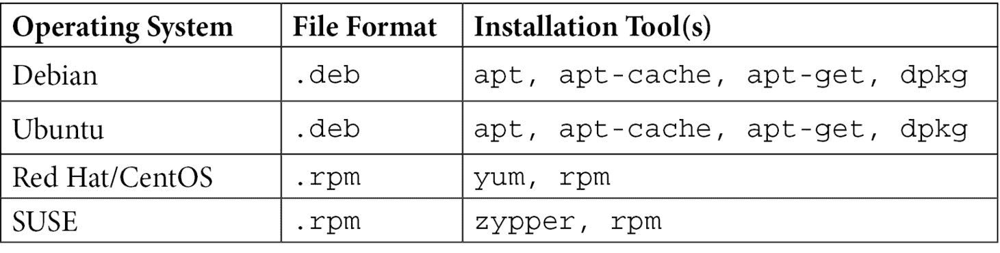
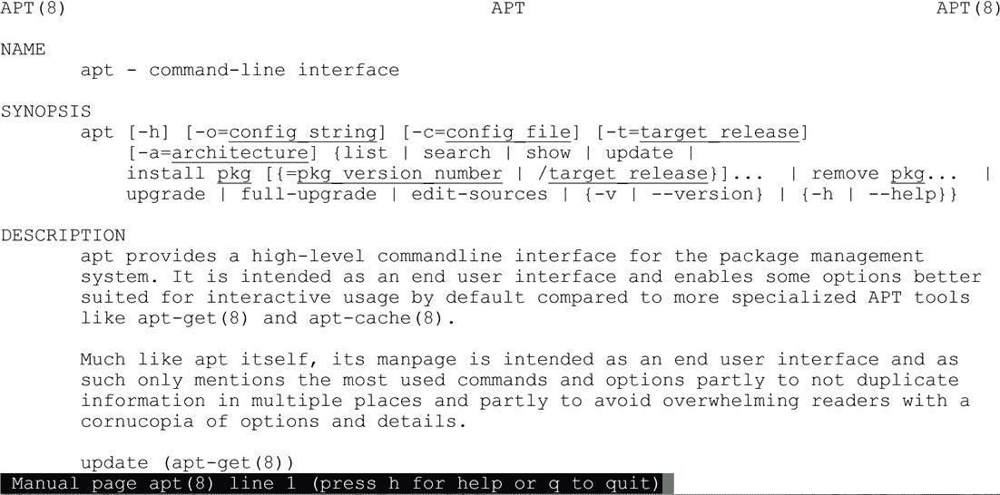
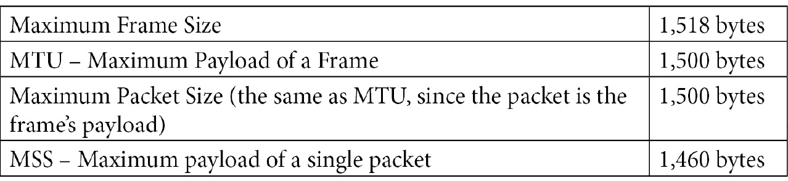

# 二、基本 Linux 网络配置和操作——使用本地接口

在本章中，我们将探索如何在您的 Linux 主机上显示和配置本地接口和路由。 我们将尽可能地讨论执行这些操作的新命令和遗留命令。 这将包括显示和修改 IP 地址、本地路由和其他接口参数。 在此过程中，我们将讨论如何使用二进制方法构造 IP 地址和子网地址。

本章将为您在后面章节中讨论的主题打下坚实的基础，包括排除网络问题、加固主机和安装安全服务。

本章所涵盖的主题如下:

*   使用您的网络设置—两组命令
*   显示接口 IP 信息
*   IPv4 地址和子网掩码
*   配置接口的 IP 地址

# 技术要求

在本章和其他章节中，当我们讨论各种命令时，我们鼓励您在自己的计算机上尝试它们。 本书中的命令都是在 Ubuntu Linux 版本 20(一个长期支持版本)上说明的，但在几乎所有 Linux 发行版上应该在很大程度上是相同的或非常相似的。

# 使用您的网络设置—两组命令

对大多数人都熟悉的 Linux 寿命,**ifconfig**(**界面配置)和相关命令 Linux 操作系统的支柱,以至于现在的弃用在大多数发行版,它仍然*卷的手指*许多系统和网络管理员。**

为什么这些旧的网络命令被替换? 有几个原因。 一些新的硬件(特别是 InfiniBand 网络适配器)并没有得到旧命令的很好支持。 此外，由于 Linux 内核多年来发生了变化，旧命令的操作随着时间的推移变得越来越不一致，但围绕向后兼容性的压力使解决这个问题变得困难。

旧的命令在`net-tools`软件包中，新的命令在`iproute2`软件包中。 新管理员应该关注新命令，但是熟悉旧命令仍然是一件好事。 运行 Linux 的旧计算机仍然很常见，这些机器可能永远不会更新，但仍然使用旧命令。 因此，我们将介绍这两种工具集。

从中得到的教训是，在 Linux 世界中，变化是不断的。 旧的命令仍然可用，但默认不安装。

要安装遗留命令，使用这个命令:

```sh
robv@ubuntu:~$ sudo apt install net-tools
 [sudo] password for robv:
Reading package lists... Done
Building dependency tree
Reading state information... Done
The following package was automatically installed and is no longer required:
  libfprint-2-tod1
Use 'sudo apt autoremove' to remove it.
The following NEW packages will be installed:
  net-tools
0 upgraded, 1 newly installed, 0 to remove and 0 not upgraded.
Need to get 0 B/196 kB of archives.
After this operation, 864 kB of additional disk space will be used.
Selecting previously unselected package net-tools.
(Reading database ... 183312 files and directories currently installed.)
Preparing to unpack .../net-tools_1.60+git20180626.aebd88e-1ubuntu1_amd64.deb ..                                      .
Unpacking net-tools (1.60+git20180626.aebd88e-1ubuntu1) ...
Setting up net-tools (1.60+git20180626.aebd88e-1ubuntu1) ...
Processing triggers for man-db (2.9.1-1) ...
```

您可能会注意到这个`install`命令中的及其输出:

*   `sudo`: The `sudo` command was used – **sudo** essentially means **do as the super user** – so the command executes with root (administrator) privileges. This needs to be paired with the password of the user executing the command. In addition, that user needs to be properly entered in the configuration file `/etc/sudoers`. By default, in most distributions, the `userid` defined during the installation of the operating system is automatically included in that file. Additional users or groups can be added using the `visudo` command.

    为什么使用`sudo`? 安装软件或更改网络参数以及许多其他系统操作都需要更高的权限——在多用户的企业系统上，您不会希望不是管理员的人进行这些更改。

    所以，如果`sudo`这么好，为什么不以 root 的形式运行所有内容? 主要是因为这是一个安全问题。 当然，如果您拥有根权限，那么一切都可以正常工作。 然而，任何错误和打字错误都可能导致灾难性的结果。 此外，如果你运行的权限和碰巧执行一些恶意软件，恶意软件将有同样的特权，这肯定是不理想的! 如果有人问，是的，Linux 恶意软件肯定存在，而且几乎从一开始就伴随着操作系统。

*   `apt`: The `apt` command was used – **apt** stands for **Advanced Package Tool**, and installs not only the package requested, but also any required packages, libraries, or other dependencies required for that package to run. Not only that, but by default, it collects all of those components from online repositories (or repos). This is a welcome shortcut compared to the old process, where all the dependencies (at the correct versions) had to be collected, then installed in the correct order to make any new features work.

    `apt`是 Ubuntu、Debian 和相关发行版的默认安装程序，但不同发行版的包管理应用有所不同。 除了`apt`及其等价物之外，仍然支持从下载文件安装。 Debian、Ubuntu 和相关发行版使用`deb`文件，而许多其他发行版使用`rpm`文件。 总结如下:



那么，现在我们有一大堆新的命令要查看，我们如何获得更多关于这些命令的信息? `man`(手动)命令有 Linux 中大多数命令和操作的文档。 对于实例，`apt`的`man`命令可以使用`man apt`命令打印; 输出如下:



图 2.1 - apt 手册页

当我们在本书中介绍新的命令时，请花一分钟时间使用`man`命令来回顾它们——本书更多地是为了指导您的旅程，而不是替代实际的操作系统文档。

现在我们已经讨论了现代工具和遗留工具，然后安装了遗留的`net-tools`命令，那么这些命令是什么?它们做什么?

# 显示接口 IP 信息

显示接口信息是 Linux 工作站上的常见任务。 如果您的主机适配器被设置为自动配置，对于使用**动态主机配置协议**(**DHCP**)或 IPv6 自动配置的实例，这尤其正确。

正如我们所讨论的，有两组命令来完成此任务。 该命令允许我们在新的操作系统上显示或配置主机的网络参数。 在旧版本中，您将发现使用了`ifconfig`命令。

`ip`命令将允许我们显示或更新 IP 地址、路由信息和其他网络信息。 例如，要查看当前 IP 地址信息，可以使用如下命令:

```sh
ip address
```

`ip`命令支持**命令补全**，因此`ip addr`甚至`ip a`将给您相同的结果:

```sh
robv@ubuntu:~$ ip ad
1: lo: <LOOPBACK,UP,LOWER_UP> mtu 65536 qdisc noqueue state UNKNOWN group default qlen 1000
    link/loopback 00:00:00:00:00:00 brd 00:00:00:00:00:00
    inet 127.0.0.1/8 scope host lo
       valid_lft forever preferred_lft forever
    inet6 ::1/128 scope host
       valid_lft forever preferred_lft forever
2: ens33: <BROADCAST,MULTICAST,UP,LOWER_UP> mtu 1500 qdisc fq_codel state UP group default qlen 1000
    link/ether 00:0c:29:33:2d:05 brd ff:ff:ff:ff:ff:ff
    inet 192.168.122.182/24 brd 192.168.122.255 scope global dynamic noprefixroute ens33
       valid_lft 6594sec preferred_lft 6594sec
    inet6 fe80::1ed6:5b7f:5106:1509/64 scope link noprefixroute
       valid_lft forever preferred_lft forever
```

您将看到，即使是最简单的命令有时也会返回更多您可能想要的信息。 实例,您将看到两个 IP 版本 4**(**IPv4)和 IPv6 返回信息——我们只能限制这个版本 4 或 6 通过添加`-4`或`-6`【显示】命令行选项:****

```sh
robv@ubuntu:~$ ip -4 ad
1: lo: <LOOPBACK,UP,LOWER_UP> mtu 65536 qdisc noqueue state UNKNOWN group default qlen 1000
    inet 127.0.0.1/8 scope host lo
       valid_lft forever preferred_lft forever
2: ens33: <BROADCAST,MULTICAST,UP,LOWER_UP> mtu 1500 qdisc fq_codel state UP group default qlen 1000
    inet 192.168.122.182/24 brd 192.168.122.255 scope global dynamic noprefixroute ens33
       valid_lft 6386sec preferred_lft 6386sec
```

在这个输出中，您将看到`loopback`接口(一个逻辑内部接口)的 IP 地址为`127.0.0.1`，而以太网接口`ens33`的 IP 地址为`192.168.122.182`。

现在是输入`man ip`并回顾我们可以使用这个命令执行的各种操作的绝佳时机:


图 2.2 - ip man 页面

`ifconfig`命令具有与`ip`命令非常相似的功能，但正如我们所注意到的，主要出现在旧版本的 Linux 上。 遗留命令都有了自然的增长，并根据需要附加了一些特性。 这使我们处于一种状态，即随着显示或配置更复杂的东西，语法变得越来越不一致。 更现代的命令是为了一致性而从头设计的。

让我们使用 legacy 命令复制我们的工作; 要显示接口 IP，输入`ifconfig`:

```sh
robv@ubuntu:~$ ifconfig
ens33: flags=4163<UP,BROADCAST,RUNNING,MULTICAST>  mtu 1400
        inet 192.168.122.22  netmask 255.255.255.0  broadcast 192.168.122.255
        inet6 fe80::1ed6:5b7f:5106:1509  prefixlen 64  scopeid 0x20<link>
        ether 00:0c:29:33:2d:05  txqueuelen 1000  (Ethernet)
        RX packets 161665  bytes 30697457 (30.6 MB)
        RX errors 0  dropped 910  overruns 0  frame 0
        TX packets 5807  bytes 596427 (596.4 KB)
        TX errors 0  dropped 0 overruns 0  carrier 0  collisions 0
lo: flags=73<UP,LOOPBACK,RUNNING>  mtu 65536
        inet 127.0.0.1  netmask 255.0.0.0
        inet6 ::1  prefixlen 128  scopeid 0x10<host>
        loop  txqueuelen 1000  (Local Loopback)
        RX packets 1030  bytes 91657 (91.6 KB)
        RX errors 0  dropped 0  overruns 0  frame 0
        TX packets 1030  bytes 91657 (91.6 KB)
        TX errors 0  dropped 0 overruns 0  carrier 0  collisions 0
```

可以看到，大部分相同的信息以略微不同的格式显示。 如果您查看这两个命令的`man`页面，您将看到`imp`命令中的选项更加一致，并且没有那么多的 IPv6 支持—例如，您不能本机只选择 IPv4 或 IPv6 显示。

## 显示路由信息

在现代的网络命令中，我们将使用完全相同的`ip`命令来显示路由信息。 而且，如您所料，该命令是`ip route`，它可以缩写为`ip r`以下任意内容:

```sh
robv@ubuntu:~$ ip route
default via 192.168.122.1 dev ens33 proto dhcp metric 100
169.254.0.0/16 dev ens33 scope link metric 1000
192.168.122.0/24 dev ens33 proto kernel scope link src 192.168.122.156 metric 100
robv@ubuntu:~$ ip r
default via 192.168.122.1 dev ens33 proto dhcp metric 100
169.254.0.0/16 dev ens33 scope link metric 1000
192.168.122.0/24 dev ens33 proto kernel scope link src 192.168.122.156 metric 100
```

从这个输出中，我们看到有一个指向`192.168.122.1`的*默认路由*。 默认路由是——如果一个包被发送到路由表中不存在的目的地，主机将把这个包发送到它的默认网关。 路由表总是倾向于“最具体的”路由——与目的 IP 最接近的路由。 如果没有匹配，那么最具体的路由将到达默认网关，该网关路由到`0.0.0.0 0.0.0.0`(换句话说，“如果它不匹配任何其他”路由)。 主机假设默认网关 IP 属于路由器，路由器将(希望)知道下一步将包发送到哪里。

我们也看到了到`169.254.0.0/16`的路线。 这就是 RFC 3927 中定义的一个**Link-Local Address**。 **RFC**代表**征求意见**，作为非正式同行评审过程的一部分，互联网标准在开发过程中使用。 已发布的 rfc 列表是**IETF**(**Internet Engineering Task Force**)维护的，网址为 https://www.ietf.org/standards/rfcs/。

链接地址只有在当前子网-如果一个主机没有静态配置 IP 地址,和 DHCP 不分配和地址,它将使用前两个八位位组中定义的 RFC(`169.254`),然后计算两个八位字节,每次形态分配它们。 Ping / ARP 测试后(我们将讨论 ARP[*第三章*](03.html#_idTextAnchor053),*使用 Linux 和 Linux 工具网络诊断*),以确保这个计算地址实际上是可用的,主人准备沟通。 这个地址应该只与同一网段上的其他 LLA 地址通信，通常使用广播和组播协议(如 ARP、Alljoyn 等)来“找到”彼此。 为了清晰起见，这些地址几乎从未在真实的网络中使用过，它们是在绝对没有其他选择的情况下使用的地址。 为了混淆，微软把这些地址称为不同的**自动私有互联网协议寻址**(**APIPA**)。

最后，我们看到一个到本地子网的路由，在本例中是`192.168.122.0/24`。 这个被称为**连接的路由**(因为它连接到该接口)。 这告诉主机在它自己的子网中与其他主机通信不需要路由。

这组路由在简单网络中非常常见——一个默认网关，一个本地段，仅此而已。 在许多操作系统中，除非主机实际使用链接本地地址，否则您不会看到`169.254.0.0`子网。

在遗留方面，有多种方法可以显示当前的路由集。 典型的命令是*网络状态*的`netstat –rn`，显示路由和数字显示。 然而，`route`是一个单独的命令(我们将在本章后面看到为什么):

```sh
robv@ubuntu:~$ netstat -rn
Kernel IP routing table
Destination     Gateway         Genmask         Flags   MSS Window  irtt Iface
0.0.0.0         192.168.122.1   0.0.0.0         UG        0 0          0 ens33
169.254.0.0     0.0.0.0         255.255.0.0     U         0 0          0 ens33
192.168.122.0   0.0.0.0         255.255.255.0   U         0 0          0 ens33
robv@ubuntu:~$ route -n
Kernel IP routing table
Destination     Gateway         Genmask         Flags Metric Ref    Use Iface
0.0.0.0         192.168.122.1   0.0.0.0         UG    100     0        0 ens33
169.254.0.0     0.0.0.0         255.255.0.0     U     1000    0        0 ens33
192.168.122.0   0.0.0.0         255.255.255.0   U     100     0        0 ens33
```

它们显示相同的信息，但是现在我们有两个额外的命令——`netstat`和`route`。 遗留的网络工具集倾向于针对每种用途使用单独的、惟一的命令，在本例中，我们看到其中两个有相当多的重叠部分。 了解所有这些命令并保持它们的不同语法对 Linux 新手来说可能是一个挑战。 `ip`命令集让这变得简单多了!

无论您最终使用哪一组工具，现在您已经掌握了建立和检查 IP 地址和路由的基础知识，它们之间的关系将为您的主机提供基本的连通性。

# IPv4 地址及子网掩码

在上一节中，我们简要地讨论了 IP 地址，但是让我们更详细地讨论它们。 IPv4 允许你做的是通过给每个设备分配一个地址和一个子网掩码，在一个*子网*中唯一地给每个设备寻址。 例如，在我们的示例中，IPv4 地址是`192.168.122.182`。 IPv4 地址中每个*八位数*的范围从`0-255`开始，子网掩码为`/24`，通常也表示为`255.255.255.0`。 这看起来很复杂，直到我们把它分解成二进制表示。 `255`在二进制中是`11111111`(8 位)，而这些分组中的 3 个就是24 位。 因此，我们的地址和掩码表示表示的是，当掩码时，地址的网络部分是`192.168.122.0`，地址的主机部分是`182`，范围可以从`1-254`。

打破下来:


如果我们需要一个更大的子网呢? 我们可以简单地将这个蒙版向左滑动一些。 例如，对于一个 20 位子网掩码，我们有以下内容:


这使得掩码的第三个八位元`0b11110000`(注意“二进制”的简写`0b`)转换为十进制的`240`。 这个*将*网络的第三八元组屏蔽到`0b01110000`或`112`。 这增加了我们的主机的地址范围`0-15`(`0 – 0b1111`),第三个八位字节,和`0-255`(【显示】)第四,或`3824`(15 x 255 - 1)总计`-1`(我们会在下一节中)。

你可以看到，保持一个计算器应用做二进制到十进制的转换是一个方便的事情，网络专业人士! 确保它也是十六进制的(`base 16`); 我们将在几分钟后深入讨论这个问题。

现在，我们已经掌握了使用十进制(尤其是二进制)地址和子网掩码的技巧，让我们对其进行扩展，并探索如何使用它来说明其他寻址概念。

## 专用地址

为了进一步探索 IP 地址在本地子网中是如何工作的，我们需要讨论一些特殊用途的*地址。 首先，如果一个地址中所有的主机*位*都被设置为`1`，那就称为**广播**地址。 如果您向广播地址发送信息，它会被子网中的所有网络接口发送和读取。*

所以，在我们的两个例子中，`/24`网络的广播如下:


换句话说，我们有一个广播地址`192.168.122.255`。

`/20`网络直播内容如下:


或者，我们可以将转换回十进制的广播地址`192.168.127.255`。

移动 IPv4 地址的网络部分和主机部分之间的边界会让人想起**地址类**的概念。 当转换为二进制时，前几个字节为该地址定义了称为的**有类**子网掩码。 在大多数操作系统中，如果在 GUI 中设置 IP 地址，通常会在默认情况下填充这个有类的子网掩码。 这些二进制到子网的掩码分配结果如下:


它定义的是网络的默认有类子网掩码。 我们将在接下来的两节中深入探讨这个问题。

通过所有这些，您可以了解为什么大多数管理员在其组织内的子网上使用**类边界**。 到目前为止，大多数内部子网的掩码为`255.255.255.0`或`255.255.0.0`。 每当您向团队添加新成员时，任何其他选择都会引起混乱，可能会导致服务器或工作站配置出现错误。 此外，“做数学”每次你需要设置或解释一个网络地址不吸引大多数人。

我们刚才提到的第二种类型的特殊地址是**组播**地址。 多播地址用于在对话中包含多个设备。 例如，您可以使用多播地址将相同的视频流发送到许多网络连接的显示器，或者如果您正在一个语音/视频应用中设置一个电话会议或会议。 组播地址以以下形式存在于网络中:


最后 11 位(3+8)通常构成各种组播协议的“已知地址”。 常见的组播地址如下:


已知的、已注册的组播地址的完整列表由**IANA**(**Internet Assigned Numbers Authority**)在 https://www.iana.org/assignments/multicast-addresses/multicast-addresses.xhtml 维护。 虽然这个看起来很全面，但是供应商经常会在这个地址空间中创建他们自己的多播地址。

这是对多播寻址的一个基本介绍——它比这复杂得多，甚至有一整本书都在介绍其背后的设计、实现和理论。 我们已经讲了足够的内容来了解大致的概念，但也足够开始了。

在介绍了广播和多播地址之后，让我们讨论一下您的环境中最有可能使用的 IP 地址“族”。

## 私有地址- RFC 1918

另一组特殊的地址是 RFC 1918 地址空间。 RFC 1918 描述了分配给组织内部使用的 IP 子网列表。 这些地址不能在公共互联网上使用，所以必须使用**网络地址转换**(**NAT**)进行转换，才能在公共互联网上路由进出这些地址的流量。

RFC1918 地址如下:

*   `10.0.0.0/8`(A 类)
*   `172.16.0.0`至`172.31.0.0 / 16`(B 类)(可归纳为`172.16.0.0/12`)
*   `192.168.0.0/16`(C 类)

这些地址为组织内部提供了一个很大的 IP 空间，所有这些地址都保证不会与公共互联网上的任何东西冲突。

作为一个有趣的练习，您可以使用这些 RFC 1918 子网来验证默认地址类，方法是将每个子网的第一个八位元转换为二进制，然后将它们与最后一节中的表进行比较。

RFC 1918 规范在这里有完整的文档:https://tools.ietf.org/html/rfc1918。

现在我们已经介绍了 IP 地址和子网掩码的二进制方面，以及各种特殊的 IP 地址组，我相信您已经厌倦了理论和数学，希望回到您的 Linux 主机的命令行中来! 好消息是，我们仍然需要涵盖 IPv6 (IP 版本 6)的寻址的位和字节。更好的消息是，它将在附录中，这样我们就可以让你更快地使用键盘!

现在我们已经掌握了如何显示 IP 参数并很好地理解了 IP 地址，接下来让我们配置一个 IP 接口。

# 配置接口的 IP 地址

分配一个永久 IPv4 地址可能是你在几乎每台服务器上都需要做的事情。 幸运的是，这很简单。 在新的命令集中，我们将使用`nmcli`命令(**网络管理器命令行**)。 我们将设置 IP 地址、默认网关和 DNS服务器。 最后，我们将寻址模式设置为`manual`。 我们将以`nmcli`格式显示网络连接:

```sh
robv@ubuntu:~$ sudo nmcli connection show
NAME           UUID                           TYPE       DEVICE
Wired connection 1  02ea4abd-49c9-3291-b028-7dae78b9c968  ethernet  ens33
```

我们的连接的名字是`Wired connection 1`。 不过，我们不需要每次都输入这个; 我们可以通过键入`Wi`，然后按*tab*来完成名称。 另外，请记住，`nmcli`将允许缩短命令子句，所以我们可以对`modify`使用`mod`，对`connection`使用`con`，等等。 让我们继续我们的命令序列(注意在上一个命令中参数是如何被缩短的):

```sh
$ sudo nmcli connection modify "Wired connection 1" ipv4.addresses 192.168.122.22/24
$
$ sudo nmcli connection modify "Wired connection 1" ipv4.gateway 192.168.122.1
$
$ sudo nmcli connection modify "Wired connection 1" ipv4.dns "8.8.8.8"
$
$ sudo nmcli con mod "Wired connection 1" ipv4.method manual
$
Now, let's save the changes and make them "live":
$ sudo nmcli connection up "Wired connection 1" 
Connection successfully activated (D-Bus active path: /org/freedesktop/NetworkManager/ActiveConnection/5)
$
```

使用遗留方法，我们所有的更改都是通过编辑文件来完成的。 为了好玩，文件名和位置会随着发行版的不同而变化。 最常见的编辑和文件显示在这里。

要更改 DNS 服务器，编辑`/etc/resolv.conf`并更改`nameserver`行以反映所需的服务器 IP:

```sh
nameserver 8.8.8.8
```

如果需要修改 IP 地址、子网掩码等，请编辑`/etc/sysconfig/network-scripts/ifcfg-eth0`文件，更新值如下:

```sh
DEVICE=eth0
BOOTPROTO=none
ONBOOT=yes
NETMASK=255.255.255.0
IPADDR=10.0.1.27
```

如果你的默认网关在这个接口上，你可以这样添加:

```sh
GATEWAY=192.168.122.1
```

再次注意，在不同的发行版中，要编辑的文件可能不同，特别要注意的是**这种方法不是向后兼容**。 在现代 Linux 系统上，这种为网络更改编辑基本文件的方法基本上不再有效。

现在我们知道了如何为接口分配 IP 地址，让我们学习如何调整主机上的路由。

## 添加路由

要添加一个临时静态路由，`ip`命令再次成为我们的首选。 在这个例子中，我们告诉我们的主机路由到`192.168.122.10`以到达`10.10.10.0/24`网络:

```sh
robv@ubuntu:~$ sudo ip route add 10.10.10.0/24 via 192.168.122.10
 [sudo] password for robv:
robv@ubuntu:~$ ip route
default via 192.168.122.1 dev ens33 proto dhcp metric 100
10.10.10.0/24 via 192.168.122.10 dev ens33
169.254.0.0/16 dev ens33 scope link metric 1000
192.168.122.0/24 dev ens33 proto kernel scope link src 192.168.122.156 metric 100
```

您还可以通过将`dev <devicename>`添加到`ip route add`命令的末尾来添加`egress`网络接口。

不过，这只是添加了一个临时路由，如果主机重新启动或网络进程重新启动，该临时路由将无法存活。 可以使用`nmcli`命令添加一条永久静态路由。

首先，我们将以`nmcli`格式显示网络连接:

```sh
robv@ubuntu:~$ sudo nmcli connection show
NAME                UUID                                  TYPE       DEVICE
Wired connection 1  02ea4abd-49c9-3291-b028-7dae78b9c968  ethernet  ens33
```

接下来，我们将通过`192.168.122.11`添加到`10.10.11.0/24`的路由到`Wired connection 1`连接，使用`nmcli`:

```sh
robv@ubuntu:~$ sudo nmcli connection modify "Wired connection 1" +ipv4.routes "10.10.11.0/24 192.168.122.11"
```

再次，保存我们的`nmcli`更改:

```sh
$ sudo nmcli connection up "Wired connection 1" 
Connection successfully activated (D-Bus active path: /org/freedesktop/NetworkManager/ActiveConnection/5)
$
```

现在，看看我们的路由表，我们看到两个静态路由:

```sh
robv@ubuntu:~$ ip route
default via 192.168.122.1 dev ens33 proto dhcp metric 100
10.10.10.0/24 via 192.168.122.10 dev ens33
10.10.11.0/24 via 192.168.122.11 dev ens33 proto static metric 100
169.254.0.0/16 dev ens33 scope link metric 1000
192.168.122.0/24 dev ens33 proto kernel scope link src 192.168.122.156 metric 100
```

然而，如果我们重载，我们会看到临时路径已经消失，而永久路径已经就位:

```sh
robv@ubuntu:~$ ip route
default via 192.168.122.1 dev ens33 proto dhcp metric 100
10.10.11.0/24 via 192.168.122.11 dev ens33 proto static metric 100
169.254.0.0/16 dev ens33 scope link metric 1000
192.168.122.0/24 dev ens33 proto kernel scope link src 192.168.122.156 metric 100
```

在完成添加路由的基础知识之后，让我们看看如何使用遗留的`route`命令在较旧的 Linux 主机上完成相同的任务。

## 使用旧方法添加路由

首先，要添加路由，使用以下命令:

```sh
$ sudo route add –net 10.10.12.0 netmask 255.255.255.0 gw 192.168.122.12
```

要使这个路由永久保存，事情就变得复杂了——永久路由存储在文件中，文件名和位置将根据发行版的不同而不同，这就是为什么`iproute2/nmcli`命令的一致性使得在现代系统中更容易操作。

在一个较老的 Debian/Ubuntu 发行版上，一个常见的方法是编辑`/etc/network/interfaces`文件并添加以下一行:

```sh
up route add –net 10.10.12.0 netmask 255.255.255.0 gw 192.168.122.12
```

或者，在一个较老的 Redhat 家族发行版上，编辑`/etc/sysconfig/network-scripts/route-<device name>`文件并添加以下行:

```sh
10.10.12.0/24 via 192.168.122.12
```

或者,只是命令,添加路线编辑`/etc/rc.local`文件——这种方法将任何 Linux 系统上工作,但被认为是不优雅,主要是因为它的下一个管理员将寻找设置(因为这不是一个适当的网络设置文件)。 `rc.local`文件只是在系统启动时执行，并运行其中的任何命令。 在本例中，我们将添加`route add`命令:

```sh
/sbin/route add –net 10.10.12.0 netmask 255.255.255.0 gw 192.168.122.12
```

现在，我们已经在 Linux 主机上设置网络了。 我们已经设置了 IP 地址、子网掩码和路由。 但是，特别是在故障排除或初始设置时，通常必须禁用或启用某个接口; 我们将在后面讨论这个问题。

## 禁用和启用接口

在新的命令“world”中，我们使用-你猜对了`– ip`命令。 在这里，我们将“弹跳”界面，把它拉下来，然后再拉上来:

```sh
robv@ubuntu:~$ sudo ip link set ens33 down
robv@ubuntu:~$ sudo ip link set ens33 up
```

在旧的命令set 中，使用`ifconfig`禁用或启用接口:

```sh
robv@ubuntu:~$ sudo ifconfig ens33 down
robv@ubuntu:~$ sudo ifconfig ens33 up
```

在执行接口命令时，请始终记住，您不希望*切断您所在的分支*。 如果您是远程连接的(例如使用`ssh`)，如果更改`ip`寻址或路由，或者禁用一个接口，您很容易在此时失去与主机的连接。

至此，我们已经讨论了在现代网络中配置 Linux主机所需的大多数任务。 然而，网络管理的很大一部分是诊断和设置配置以适应特殊情况，例如，在可能需要更小或更大数据包大小的情况下，调整设置以优化流量。

## 设置接口 MTU

一个在现代系统中越来越常见的操作是设置**消息传输单元**(**MTU**)。 这是的规模最大的**【显示】协议数据单元(PDU****,也叫【病人】帧**在大多数网络),接口将发送或接收。 在以太网上，默认的 MTU 是 1500 字节，也就是最大的包大小为 1500 字节。 媒体的最大包大小通常称为**最大段大小**(**MSS**)。 对于以太网，这三个值如下:



表 2.1 -以太网的相关帧大小，MTU，数据包大小和 MSS

我们为什么要改变这一点? 对于数据包大小来说，1,500 是一个不错的折衷方案，因为它足够小，在发生错误时，该错误可以很快地被检测到，并且重传的数据量相对较小。 然而，尤其是在数据中心，有一些例外。

当处理存储流量时，特别是 iSCSI，需要大的帧大小，以便数据包大小可以容纳更多的数据。 在这些情况下，MTU 通常设置为 9000(通常称为一个**巨型包**)。 这些网络通常部署在 1gbps、10gbps 或更快的网络上。 您还会看到流量中使用较大的数据包来容纳备份或虚拟机迁移(例如:VMware 中的 VMotion 或 Hyper-V 中的 Live migration)。

在频段的另一端，您还经常会看到需要较小数据包的情况。 这是特别重要的，因为不是所有的主机都能很好地检测到这一点，而且许多应用会在其流量中设置**DF**(**Don't Fragment**)位。 在这种情况下，您可能会在一个可能只支持1380 字节数据包的介质上看到一个包含DF 的 1,500 字节数据包集——在这种情况下，应用将简单地失败，并且错误消息通常对故障排除没有帮助。 你可能在哪里看到这个? 任何涉及包被封装的链路通常都会涉及到这一点——例如，隧道或 VPN 解决方案。 这将通过封装引起的开销来减少帧大小(以及由此产生的数据包大小)，这通常是很容易计算的。 卫星连接是另一种常见的情况。 它们通常默认为 512 字节的帧——在这种情况下，大小将由服务提供者发布。

设置 MTU 和您所想的一样简单——我们将再次使用`nmcli`来设置它。 注意，在这个示例中，我们缩短了`nmcli`的命令行参数，并且在最后保存了配置更改—MTU 在最后一个命令之后立即更改。 让我们设置 MTU 为`9000`来优化 iSCSI 流量:

```sh
$ sudo nmcli con mod "Wired connection 1" 802-3-ethernet.mtu 9000
$ sudo nmcli connection up "Wired connection 1" 
Connection successfully activated (D-Bus active path: /org/freedesktop/NetworkManager/ActiveConnection/5)
$
```

设置了 MTU 后，我们还可以用`nmcli`命令做什么?

## 更多关于 nmcli 命令的信息

还可以交互式地调用`nmcli`命令，并且可以在实时解释器或 shell 中进行更改。 要进入以太网接口的 shell，使用`nmcli connection edit type ethernet`命令。 在 shell 中，`print`命令列出了可以为该接口类型更改的所有`nmcli`参数。 注意，这个输出被分成了多个逻辑组——我们编辑了这个(非常长)输出，以显示在各种情况下你可能需要调整、编辑或排除故障的许多设置:

```sh
nmcli> print
===============================================================================
                     Connection profile details (ethernet)
===============================================================================
connection.id:                          ethernet
connection.uuid:                        e0b59700-8dcb-4801-9557-9dee5ab7164f
connection.stable-id:                   --
connection.type:                        802-3-ethernet
connection.interface-name:              --
….
connection.lldp:                        default
connection.mdns:                        -1 (default)
connection.llmnr:                       -1 (default)
-------------------------------------------------------------------------------
```

这些是常见的以太网选项:

```sh
802-3-ethernet.port:                    --
802-3-ethernet.speed:                   0
802-3-ethernet.duplex:                  --
802-3-ethernet.auto-negotiate:          no
802-3-ethernet.mac-address:             --
802-3-ethernet.mtu:                     auto
….
802-3-ethernet.wake-on-lan:             default
802-3-ethernet.wake-on-lan-password:    --
-------------------------------------------------------------------------------
```

这些是常见的 IPv4 选项:

```sh
ipv4.method:                            auto
ipv4.dns:                               --
ipv4.dns-search:                        --
ipv4.dns-options:                       --
ipv4.dns-priority:                      0
ipv4.addresses:                         --
ipv4.gateway:                           --
ipv4.routes:                            --
ipv4.route-metric:                      -1
ipv4.route-table:                       0 (unspec)
ipv4.routing-rules:                     --
ipv4.ignore-auto-routes:                no
ipv4.ignore-auto-dns:                   no
ipv4.dhcp-client-id:                    --
ipv4.dhcp-iaid:                         --
ipv4.dhcp-timeout:                      0 (default)
ipv4.dhcp-send-hostname:                yes
ipv4.dhcp-hostname:                     --
ipv4.dhcp-fqdn:                         --
ipv4.dhcp-hostname-flags:               0x0 (none)
ipv4.never-default:                     no
ipv4.may-fail:                          yes
ipv4.dad-timeout:                       -1 (default)
-------------------------------------------------------------------------------
```

(IPv6 选项应该放在这里，但是为了保持这个列表的可读性，已经删除了。)

这些是代理设置:

```sh
-------------------------------------------------------------------------------
proxy.method:                           none
proxy.browser-only:                     no
proxy.pac-url:                          --
proxy.pac-script:                       --
-------------------------------------------------------------------------------
nmcli>
```

如前所述，清单在某种程度上是缩写。 我们已经展示了在各种设置或故障排除情况下，您最有可能必须检查或调整的设置。 在您自己的站点上运行该命令以查看完整的清单。

如前所述，`nmcli`命令允许我们以交互方式或从命令行调整几个接口参数。 命令行界面特别允许我们在脚本中调整网络设置，允许我们扩大规模，一次在几十个、数百个或数千个站点上调整设置。

# 总结

读完本章后，您应该对 IP 地址从二进制角度有了坚实的理解。 这样，您就应该理解子网寻址和掩码，以及广播和多播寻址。 您还很好地掌握了各种 IP 地址类。 掌握了所有这些信息之后，您应该能够使用各种不同的命令在 Linux 主机上显示或设置 IP 地址和路由。 其他接口操作也应该很容易完成，比如在接口上设置 MTU。

掌握了这些技能之后，您就可以开始我们的下一个主题:使用 Linux 和 Linux 工具进行网络诊断。

# 问题

正如我们总结的，这里有一个问题列表，供你测试你对本章材料的知识。 你可以在附录的*评估*部分找到答案:

1.  默认网关的目的是什么?
2.  对于一个`192.168.25.0/24`网络，子网掩码和广播地址是什么?
3.  对于同一网络，广播地址是如何使用的?
4.  对于相同的网络，可能的主机地址是什么?
5.  如果您需要静态地设置以太网接口的速度和双工，您将使用什么命令?

# 进一步阅读

*   RFC 1918 - Address Allocation for Private internet:[https://tools.ietf.org/html/rfc1918](https://https://tools.ietf.org/html/rfc1918%0D)
*   rfc791 - Internet Protocol:[https://tools.ietf.org/html/rfc791](https://https://tools.ietf.org/html/rfc791)**