# *第三章*:使用 Linux 和 Linux 工具进行网络诊断

在本章中，我们将介绍一些“它如何工作”的网络基础知识，以及如何使用我们的 Linux 工作站进行网络故障排除。 当你完成这一章，你应该有工具来排除本地和远程网络服务，以及“库存”你的网络和它的服务。

特别地，我们将涵盖以下主题:

*   网络基础- OSI 模型。
*   第二层-使用 ARP 关联 IP 和 MAC 地址，关于 MAC 地址的一些详细信息。
*   第 4 层- TCP 和 UDP 端口如何工作，包括 TCP“三次握手”以及如何在 Linux 命令中出现。
*   本地 TCP 和 UDP 端口枚举，以及它们如何与运行的服务相关。
*   使用两个本地工具的远程端口枚举。
*   远程端口枚举使用已安装的扫描器(特别是 netcat 和 nmap)。
*   最后，我们将介绍无线操作和故障排除的一些基本知识。

# 技术要求

为了遵循本节中的示例，我们将使用现有的 Ubuntu 主机或**虚拟机**(**虚拟机**)。 在这一章中，我们将涉及一些无线主题，所以如果你的主机或虚拟机中没有无线卡，你将需要一个 Wi-Fi 适配器来完成这些示例。

在我们研究各种故障诊断方法时，我们将使用各种工具，从一些本机 Linux 命令开始:

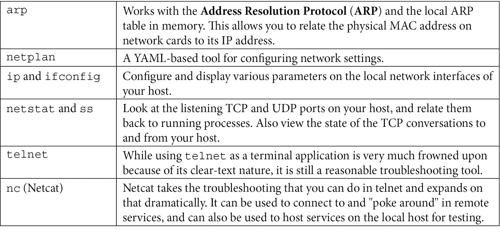

我们还将使用一些已安装的应用程序:

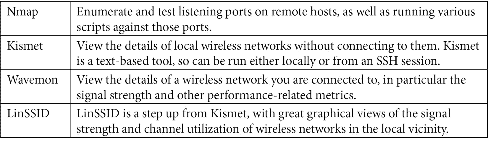

对于不包含在 Ubuntu 中的软件包，请确保您有一个正常的互联网连接，以便您可以使用`apt`命令进行安装。

# 网络基础- OSI 模型

是方便讨论网络的概念和应用程序层,每一层都是大致负责更高和更抽象的功能上的水平,和更多的*螺母和螺栓*原语你旅行沿着栈*。 下图概括地描述了 OSI 模型:*

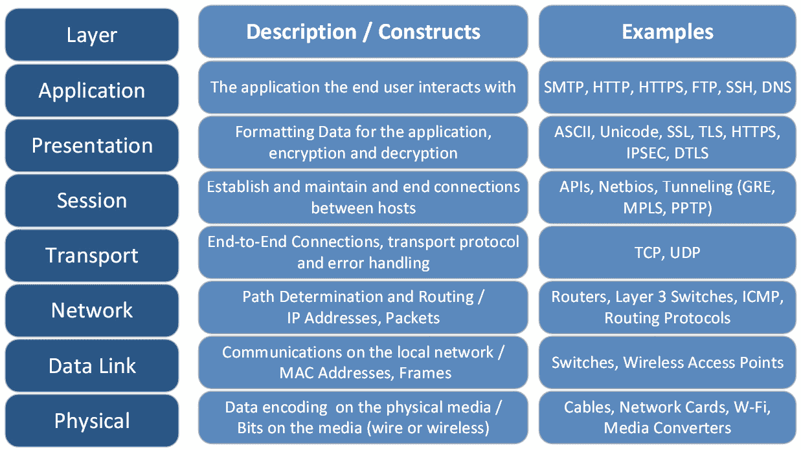

图 3.1 - OSI 网络通信模型，包括一些描述和示例

在常规用法中，层通常用数字来引用，从底部开始计数。 因此，第 2 层的问题通常涉及到 MAC 地址和交换机，并且将局限于站点所在的 VLAN(通常意味着本地子网)。 第 3 层问题将涉及 IP 寻址、路由或包(因此将涉及路由器和更远网络的相邻子网)。

与任何模型一样，总是存在混淆的空间。 例如，在第 6 层和第 7 层之间存在一些长期的*模糊性*。 在第 5 层和第 6 层之间，虽然 IPSEC 肯定是加密的，因此属于第 6 层，但它也可以被视为隧道协议(取决于您的观点和实现)。 即使在第 4 层，TCP 也有会话的概念，因此似乎有一只脚在第 5 层——尽管*端口*的概念将其牢牢地保留在第 4 层。

当然，总是有幽默的空间——普遍的智慧/笑话是，*人*在这个模型中形成第 8 层。 因此，第 8 层问题可能包括求助电话、预算讨论或与组织管理层开会来解决它!

我们在下一个图中看到的说明了这个模型中需要记住的最重要的概念。 当数据被接收时，它沿着堆栈向上移动，从它封装的最原始的构造到越来越抽象/高级的构造(例如，从位到帧到包、从 api 到应用程序)。 发送数据将它从应用程序层移动到网络上的二进制表示(从上层到下层)。

1-3 层通常被称为**媒体**或**网络**层，而 4-7 层通常被称为**主机或应用**层:


图 3.2 -在 OSI 堆栈中上下移动，并进行封装和解封装

这个概念使一个供应商能够制造一个交换机，例如，它可以与另一个供应商的网卡交互，或者使交换机能够与路由器一起工作。 这也是我们的应用程序生态系统——大部分应用程序开发人员不需要担心 IP 地址、路由、或无线和有线网络之间的差异,这一切只是照顾——网络可以被视为一个黑盒,你在一端发送数据, 你可以肯定，它会以正确的位置和格式出现在另一端。

现在我们已经建立了 OSI 模型的基础，让我们通过探索`arp`命令和本地 ARP 表来详细了解数据链路层。

# 使用 ARP 关联的二层 IP 地址和 MAC 地址

随着OSI模型的牢固到位，我们可以看到我们迄今为止关于 IP 地址的讨论都集中在第 3 层。 这就是普通人，甚至是许多 IT 和网络人员，在他们的理解中倾向于认为通往*的网络路径停止*的地方——他们可以沿着这条路径走到那么远，并将其余部分视为一个黑盒。 但是作为一个专业的社交人士，第 1 层和第 2 层是非常重要的——让我们从第 2 层开始。

理论上，MAC 地址是被*刻入*每个网络接口的地址。 虽然这通常是正确的，但也很容易改变。 MAC 地址是什么呢? 它是一个 12 位(6 字节/48 位)地址，通常用十六进制表示。 当显示时，每个字节或双字节通常用`.`或`-`分隔。 因此，典型的 MAC 地址可能是`00-0c-29-3b-73-cb`或`9a93.5d84.5a69`(显示了两种常见的表示方式)。

实际上，这些地址用于同一 VLAN 或子网中的主机之间的通信。 如果你看一个数据包捕获(我们会在稍后在书中,在[*第 11 章*](11.html#_idTextAnchor192),*数据包捕获和分析在 Linux 中*),TCP 会话开始时你会看到发送站发送一个广播(一个请求发送到所有站在子网)【显示】说`who has IP address x.x.x.x`ARP 请求。 来自具有该地址的主机的**ARP 应答**将包括`That's me, and my MAC address is aaaa.bbbb.cccc`。 如果目标 IP 地址在一个不同的子网，发送者将“ARP for”该子网的网关(通常是默认网关，除非有本地路由定义)。

接下来，发送方和接收方使用 MAC 地址进行通信。 两台主机连接的交换机基础设施只在每个 VLAN 内使用 MAC 地址，这也是交换机比路由器快得多的原因之一。 当我们看到实际的数据包(在*抓包*的章节)，你会看到发送和接收 MAC 地址以及每个数据包中的 IP 地址。

ARP 请求缓存在每个主机上的**ARP 缓存**或**ARP 表**中，可以通过`arp`命令显示:

```sh
$ arp -a
? (192.168.122.138) at f0:ef:86:0f:5d:70 [ether] on ens33
? (192.168.122.174) at 00:c3:f4:88:8b:43 [ether] on ens33
? (192.168.122.5) at 00:5f:86:d7:e6:36 [ether] on ens33
? (192.168.122.132) at 64:f6:9d:e5:ef:60 [ether] on ens33
? (192.168.122.7) at c4:44:a0:2f:d4:c3 [ether] on ens33
_gateway (192.168.122.1) at 00:0c:29:3b:73:cb [ether] on ens33
```

你可以看到这很简单。 它只是将三层 IP 地址与第一层**网络接口卡**(**网卡**)的二层 MAC 地址关联起来。 MAC 地址表项通常是从流量中“学习”的——包括 ARP 请求和应答。 它们确实会过期——通常情况下，如果没有流量被看到或从一个 MAC 地址中读取到流量，那么这个 MAC 地址将在一段时间后从表中清除。 你可以通过在`/proc`目录中列出正确的文件来查看你的超时值:

```sh
$ cat /proc/sys/net/ipv4/neigh/default/gc_stale_time
60
$ cat /proc/sys/net/ipv4/neigh/ens33/gc_stale_time
60
```

注意，每个网络适配器都有一个默认值(以秒为单位)和一个值(它们通常是匹配的)。 这对你来说似乎很短——交换机上的匹配 MAC 地址表(通常称为 CAM 表)通常是 5 分钟，路由器上的 ARP 表通常是 14,400 秒(4 小时)。 这些价值都与资源有关。 总的来说，工作站有足够的资源来频繁地发送 ARP 报文。 交换机*从流量(包括 ARP 请求和应答)中学习*MAC 地址，因此让这个计时器比工作站计时器稍微长一点是有意义的。 类似地，在路由器上设置一个长时间的 ARP 缓存计时器可以节省 CPU 和网卡资源。 路由器的计时器之所以这么长，是因为在过去几年里，与网络上的其他东西相比，路由器受到带宽和 CPU 的限制。 虽然这在现代已经改变了，但路由器上的 ARP 缓存超时的长默认值仍然存在。 在路由器或防火墙迁移过程中，这是一件很容易忘记的事情——我曾经参与过许多这种类型的维护窗口，在迁移之后，在右边的路由器上一个`clear arp`命令神奇地“修复了一切”。

我们还没有讨论过 Linux 中的`/proc`目录——这是一个文件的“虚拟”目录，其中包含 Linux 主机上各种事物的当前设置和状态。 它们不是“真正的”文件，但它们被表示为文件，因此我们可以使用与文件相同的命令:`cat`、`grep`、`cut`、`sort`、`awk`等等。 您可以查看网络接口错误和值，例如在/`proc/net/dev`中(注意，在这个清单中，事情不是很正确地排列起来):

```sh
$ cat /proc/net/dev
Inter-|   Receive                                                |  Transmit
 face |bytes    packets errs drop fifo frame compressed multicast|bytes    packets errs drop fifo colls carrier compressed
    lo:  208116    2234    0    0    0     0          0          0   208116    2234    0    0    0     0       0          0
 ens33: 255945718  383290    0  662    0     0          0         0 12013178  118882    0    0    0     0       0          0
```

你可以甚至查看内存统计(注意`meminfo`包含**很多**更多信息):

```sh
$ cat /proc/meminfo | grep Mem
MemTotal:        8026592 kB
MemFree:         3973124 kB
MemAvailable:    6171664 kB
```

回到 ARP 和 MAC 地址。 您可以添加一个静态 MAC 地址——一个不会过期的地址，它可能与您想要连接到的主机的真实 MAC 不同。 这通常是出于故障排除的目的。 或者你可以清除一个 ARP 条目，如果一个路由器被换出了，你可能经常想这样做(例如，如果你的默认网关路由器有相同的 IP，但现在有不同的 MAC)。 注意，你不需要特殊的权限来查看 ARP 表，但你一定要修改它!

要添加一个静态条目，请执行以下操作(显示时请注意`PERM`状态):

```sh
$ sudo arp -s 192.168.122.200 00:11:22:22:33:33
$ arp -a | grep 192.168.122.200
? (192.168.122.200) at 00:11:22:22:33:33 [ether] PERM on ens33
```

如果要删除 ARP 表项，请执行以下操作(注意此命令通常跳过`-i interfacename`参数):

```sh
$ sudo arp –i ens33 -d 192.168.122.200
```

要伪装成一个给定的 IP 地址-例如，回答 IP`10.0.0.1`的 ARP 请求-执行以下操作:

```sh
$ sudo arp -i eth0 -Ds 10.0.0.2 eth1 pub
```

最后，您还可以轻松地更改接口的 MAC 地址。 您可能认为应该通过来处理具有重复地址的，但这种情况非常罕见。

更改 MAC 地址的合法原因可能包括以下几点:

*   您已经迁移了防火墙，ISP 已经硬编码了您的 MAC。
*   你已经迁移了一个主机或主机网卡，而上游路由器对你来说是不可访问的，但是你不能等待路由器上的 ARP 缓存过期 4 个小时。
*   您已经迁移了一台主机，并且您需要使用旧 MAC 地址的 DHCP 保留，但您无法访问“修复”该 DHCP 条目。
*   出于隐私考虑，苹果设备会更改其无线 MAC 地址。 考虑到有那么多其他(更简单的)方法来追踪一个人的身份，这种保护通常不是那么有效。

恶意更改 MAC 地址的原因有以下几种:

*   你正在攻击一个无线网络，并且已经发现，一旦经过身份验证，接入点所做的唯一检查就是针对客户端 MAC 地址。
*   与前面的要点相同，但是是针对以太网络，该网络使用`802.1x`身份验证进行安全保护，但配置不安全或不完整(我们将在后面的章节中更详细地讨论这一点)。
*   你正在攻击一个拥有 MAC 地址权限的无线网络。

希望这说明使用 MAC 地址来实现安全通常不是一个明智的决定。

要找到您的MAC地址，我们有四种不同的方法:

```sh
$ ip link show
1: lo: <LOOPBACK,UP,LOWER_UP> mtu 65536 qdisc noqueue state UNKNOWN mode DEFAULT group default qlen 1000
    link/loopback 00:00:00:00:00:00 brd 00:00:00:00:00:00
2: ens33: <BROADCAST,MULTICAST,UP,LOWER_UP> mtu 1400 qdisc fq_codel state UP mode DEFAULT group default qlen 1000
    link/ether 00:0c:29:33:2d:05 brd ff:ff:ff:ff:ff:ff
$ ip link show ens33 | grep link
    link/ether 00:0c:29:33:2d:05 brd ff:ff:ff:ff:ff:ff
$ ifconfig
ens33: flags=4163<UP,BROADCAST,RUNNING,MULTICAST>  mtu 1400
        inet 192.168.122.22  netmask 255.255.255.0  broadcast 192.168.122.255
        inet6 fe80::1ed6:5b7f:5106:1509  prefixlen 64  scopeid 0x20<link>
        ether 00:0c:29:33:2d:05  txqueuelen 1000  (Ethernet)
        RX packets 384968  bytes 256118213 (256.1 MB)
        RX errors 0  dropped 671  overruns 0  frame 0
        TX packets 118956  bytes 12022334 (12.0 MB)
        TX errors 0  dropped 0 overruns 0  carrier 0  collisions 0
lo: flags=73<UP,LOOPBACK,RUNNING>  mtu 65536
        inet 127.0.0.1  netmask 255.0.0.0
        inet6 ::1  prefixlen 128  scopeid 0x10<host>
        loop  txqueuelen 1000  (Local Loopback)
        RX packets 2241  bytes 208705 (208.7 KB)
        RX errors 0  dropped 0  overruns 0  frame 0
        TX packets 2241  bytes 208705 (208.7 KB)
        TX errors 0  dropped 0 overruns 0  carrier 0  collisions 0
$ ifconfig ens33 | grep ether
        ether 00:0c:29:33:2d:05  txqueuelen 1000  (Ethernet)
```

改变aLinux主机的 MAC 地址，我们有几个选项:

在 Linux GUI 中，您可以通过单击顶部面板上的网络图标开始，然后为您的界面选择**设置**。 例如，对于只有一个以太网卡的主机，选择“**有线连接**”，然后选择**有线设置**:


图 3.3 -从 GUI 中更改 MAC 地址，步骤 1

从弹出的界面中,打开**新概要文件**对话框中点击**+**图标,然后添加【显示】克隆的 MAC 地址字段:

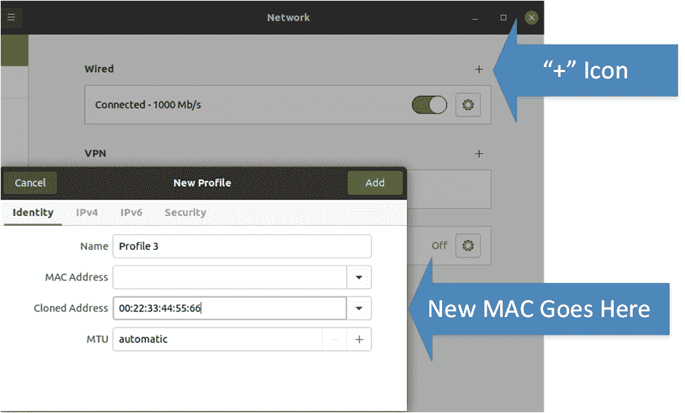

图 3.4 -从 GUI 中更改 MAC 地址，步骤 2

或者，从命令行或使用脚本，你可以做以下事情(当然，使用你自己的接口名和目标 MAC 地址):

```sh
$ sudo ip link set dev ens33 down
$ sudo ip link set dev ens33 address 00:88:77:66:55:44
$ sudo ip link set dev ens33 device here> up
```

还有一个`macchanger`包，可以用它将接口的 MAC 地址更改为一个目标值或一个伪随机值。

要永久更改 MAC 地址，可以使用`netplan`及其关联的配置文件。 首先对配置文件`/etc/netplan./01-network-manager-all.yaml`进行备份，然后进行编辑。 注意，要改变 MAC，你需要一个`match`语句来表示硬件**刻录地址**(**BIA**)MAC地址值，然后在设置新 MAC 后一行:

```sh
network:
    version: 2
    ethernets:
        ens33:
            dhcp4: true
            match:
                macaddress: b6:22:eb:7b:92:44
            macaddress: xx:xx:xx:xx:xx:xx
```

您可以用`sudo netplan try`测试您的新配置，并使用`sudo netplan apply`应用它。

或者，您可以创建或编辑`/etc/udev/rules.d/75-mac-spoof.rules`文件，该文件将在每次启动时执行。 添加以下:

```sh
ACTION=="add", SUBSYSTEM=="net", ATTR{address}=="XX:XX:XX:XX:XX:XX", RUN+="/usr/bin/ip link set dev ens33 address YY:YY:YY:YY:YY:YY"
```

掌握了 ARP 中 MAC 地址使用的基础知识后，让我们进一步深入研究 MAC 地址及其与各种网络适配器的制造商之间的关系。

## MAC 地址 OUI 值

那么现在我们已经讨论了超时和 ARP，我们是否知道了我们需要知道的关于二层和 MAC 地址的一切? 还没有——让我们讨论一下**组织独特标识符**(**OUI**)值。 如果你还记得我们讨论过如何使用子网掩码将 IP 地址划分为网络和主机部分，你会惊讶地发现在 MAC 地址中也有类似的分隔线!

每个 MAC 地址的前导位应该用来标识制造商——这个值被称为 OUI。 oui 在 IEEE 维护的正式注册表中注册，并在[http://standards-oui.ieee.org/oui.txt](http://standards-oui.ieee.org/oui.txt)发布。

但是，Wireshark 项目维护了一个更完整的列表，位于[https://gitlab.com/wireshark/wireshark/-/raw/master/manuf](https://gitlab.com/wireshark/wireshark/-/raw/master/manuf)。

Wireshark 还为这个列表提供了一个查找 web 应用程序[https://www.wireshark.org/tools/oui-lookup.html](https://www.wireshark.org/tools/oui-lookup.html)。

通常一个 MAC 地址是平均分割的，前 3 个字节(6 个字符)分配给 OUI，最后 3 个字节分配给唯一标识设备。 然而，组织能够购买更长的 oui(以更低的费用)，这给他们更少的设备地址分配。

OUI 是网络故障排除的宝贵工具——当问题出现或网络上出现未知站点时，OUI 值可以帮助识别这些罪魁祸首。 我们将在本章后面讨论网络扫描器(特别是 Nmap)时看到 OUIs 的出现。

如果您需要 Linux 或 Windows 的命令行 OUI 解析器，我在[https://github.com/robvandenbrink/ouilookup](https://github.com/robvandenbrink/ouilookup)上提供了一个。

这结束了我们在 OSI 模型的第 2 层的首次冒险，以及我们对其与第 3 层关系的检查，所以让我们通过查看 TCP 和 UDP 协议及其相关的服务，来冒险进入堆栈的更高部分，进入第 4 层。

# 第 4 层- TCP 和 UDP 端口如何工作

**传输控制协议(TCP****)和用户数据报协议**(****UDP)通常是【显示】是什么意思,当我们讨论第四层通信,特别是他们如何使用*端口的概念。*****

 **当站要*和*到另一个站在同一个子网使用其 IP 地址(IP 通常被确定在应用程序或表示层),它会检查 ARP 缓存是否有 MAC 地址相匹配的 IP。 如果没有该 IP 地址的条目，它将发送一个 ARP 请求到本地广播地址(正如我们在上一节中讨论的)。

下一步是让协议(TCP 或 UDP)建立端口到端口的通信。 站选择一个可用的端口，在`1024`之上和`65535`之下(最大端口值)，称为**临时端口**。 然后，它使用该端口连接到服务器上的固定服务器端口。 这些端口的组合，加上每一端的 IP 地址和正在使用的协议(TCP 或 UDP)，将始终是唯一的(因为选择源端口的方式)，并被称为**元组**。 这个元组的概念是可扩展的，特别是NetFlow配置中的，其中其他值可以“固定”， 如【病人】的服务质量(**QOS),【t16.1】差异化服务代码点**(**DSCP)或**的服务类型**(**TOS)值,应用的名字,接口名称,和路由等信息**【T26 自治系统数字】(****asn), MPLS, 或 VLAN 信息和发送和接收的流量字节数。 由于这种灵活性，构建所有其他元组的基本 5 值元组通常被称为**5 元组**。******

前 1024 个端口(编号为`0-1023`)几乎从不用作源端口——这些端口被指定为服务器端口，需要使用根权限。 `1024`-`49151`范围内的端口被指定为“用户端口”，`49152`-`65535`为动态或私有端口。 服务器不但是被迫使用端口编号下面`1024`尽管(例如几乎每个数据库服务器使用端口号`1024`以上),这只是一个历史惯例,可以追溯到当 TCP 和 UDP 被发达国家和所有服务器端口低于`1024`。 如果你看一看那个年代以前的许多服务器，你会看到以下模式，例如:

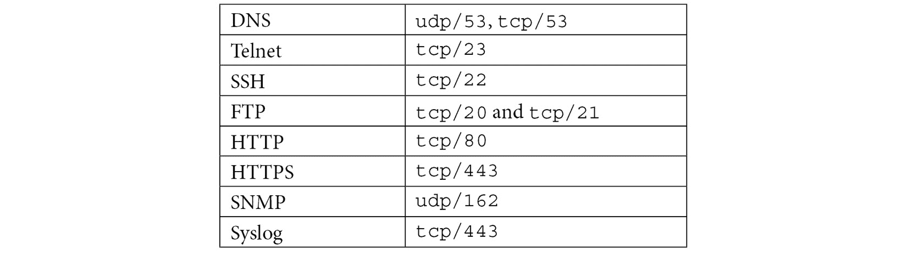

正式分配的端口的完整列表由 IANA 维护，并发布在[https://www.iana.org/assignments/service-names-port-numbers/service-names-port-numbers.xhtml](https://www.iana.org/assignments/service-names-port-numbers/service-names-port-numbers.xhtml)上。

相关文档见*RFC6335*。

但是在实践中，*assignment*对于这个列表来说是一个强有力的词。 虽然是愚蠢的把`53`TCP 端口的 web 服务器,或者一个 DNS 服务器在 UDP 端口`80`,许多应用程序并不在这个列表,所以简单地选择一个端口,通常是免费的,使用它。 经常会看到供应商选择一个端口，这个端口实际上分配给了这个列表中的其他人，但分配给了一个更模糊或更少使用的服务。 因此，在很大程度上，这个列表是一组强有力的建议，其中暗含的含义是，我们将考虑任何选择一个知名端口供自己使用的供应商…… 比方说,“愚蠢的”。

## 第 4 层- TCP 和三次握手

UDP 简单地从工作5 元组中拾取并开始发送数据。 接收应用程序负责接收该数据，或者检查应用程序的数据包，以验证内容是否按顺序到达，并进行任何错误检查。 事实上，正是由于这种开销的缺乏，UDP 才经常用于时间要求高的应用程序，如**VoIP**(**IP 语音**)和视频流。 如果在这些类型的应用程序中丢失了一个包，通常返回重试将中断数据流，并被最终用户注意到，因此错误在某种程度上被简单地忽略。

然而，TCP 协商一个序列号，并在对话进行时维护一个序列计数。 这允许基于 tcp 的应用程序跟踪丢失或损坏的数据包，并在发送和接收应用程序的更多数据时并行重试这些数据包。 最初的协商通常被称为**三次握手**，图上看起来是这样的:


图 3.5 - TCP 三次握手，建立一个 TCP 会话

这个的工作原理如下:

1.  第一个数据包从客户端从一个临时端口发送到服务器的(通常是)固定端口。 它设置了**SYN**(同步)位，并且有一个随机分配的**SEQ**(初始序列)号，在本例中为**5432**。
2.  来自服务器的应答数据包的**消(承认)组,与一些**5433 年,同样也有**SYN 位组有自己的**SYN**随机值,在这种情况下【显示】6543 年。 除了握手信息外，这个包可能已经包含数据(所有后续的包可能包含数据)。******
*****   第三个包是服务器的第一个**SYN**的**ACK**，编号为**6544**。*   继续前进，所有发送给对方的报文都是**ACK**报文，因此每个报文都有唯一的序列号和方向。****

 ****从技术上讲，包号**2**可以是两个单独的包，但通常它们合并为一个包。

优雅的谈话结束也是同样的道理。 结束会话的一方发送一个**FIN**，另一方回复一个**FIN-ACK**，后者从第一方获得一个**ACK**，会话结束。

会话的不体面的结束通常是由**RST**(重置)数据包发起的——一旦**RST**被发送，事情就结束了，而另一方不应该对此发送应答。

我们将在本章后面使用这些主题，并且贯穿全书。 所以如果你仍然不清楚对的理解，请再读一遍，尤其是前面的图表，直到你觉得正确为止。

现在我们已经了解了 TCP 和 UDP 端口是如何相互连接的，以及为什么您的应用程序可能使用其中一个端口而不是另一个端口，让我们看看主机的应用程序是如何“监听”各个端口的。

# 本地端口枚举-我连接到什么? 我在听什么?

网络中的许多基本故障排除步骤都在通信链路的一端或另一端——即在客户机或服务器主机上。 例如，如果一个 web 服务器无法访问，那么查看 web 服务器进程是否在运行，是否在适当的端口上“监听”客户机请求当然是有用的。

`netstat`命令是评估本地主机上的网络会话和服务状态的传统方法。 要列出所有监听端口和连接，请使用以下选项:


5 个参数说明如下:

```sh
$ netstat –tuan
Active Internet connections (servers and established)
Proto Recv-Q Send-Q Local Address           Foreign Address         State
tcp        0      0 127.0.0.53:53           0.0.0.0:*               LISTEN
tcp        0      0 0.0.0.0:22              0.0.0.0:*               LISTEN
tcp        0      0 127.0.0.1:631           0.0.0.0:*               LISTEN
tcp        0      0 192.168.122.22:34586    13.33.160.88:443        TIME_WAIT
tcp        0      0 192.168.122.22:60862    13.33.160.97:443        TIME_WAIT
tcp        0      0 192.168.122.22:48468    35.162.157.58:443       ESTABLISHED
tcp        0      0 192.168.122.22:60854    13.33.160.97:443        TIME_WAIT
tcp        0      0 192.168.122.22:50826    72.21.91.29:80          ESTABLISHED
tcp        0      0 192.168.122.22:22       192.168.122.201:3310    ESTABLISHED
tcp        0      0 192.168.122.22:60860    13.33.160.97:443        TIME_WAIT
tcp        0      0 192.168.122.22:34594    13.33.160.88:443        TIME_WAIT
tcp        0      0 192.168.122.22:42502    44.227.121.122:443      ESTABLISHED
tcp        0      0 192.168.122.22:34596    13.33.160.88:443        TIME_WAIT
tcp        0      0 192.168.122.22:34588    13.33.160.88:443        TIME_WAIT
tcp        0      0 192.168.122.22:46292    35.244.181.201:443      ESTABLISHED
tcp        0      0 192.168.122.22:47902    192.168.122.1:22        ESTABLISHED
tcp        0      0 192.168.122.22:34592    13.33.160.88:443        TIME_WAIT
tcp        0      0 192.168.122.22:34590    13.33.160.88:443        TIME_WAIT
tcp        0      0 192.168.122.22:60858    13.33.160.97:443        TIME_WAIT
tcp        0      0 192.168.122.22:60852    13.33.160.97:443        TIME_WAIT
tcp        0      0 192.168.122.22:60856    13.33.160.97:443        TIME_WAIT
tcp6       0      0 :::22                   :::*                    LISTEN
tcp6       0      0 ::1:631                 :::*                    LISTEN
udp        0      0 127.0.0.53:53           0.0.0.0:*
udp        0      0 0.0.0.0:49345           0.0.0.0:*
udp        0      0 0.0.0.0:631             0.0.0.0:*
udp        0      0 0.0.0.0:5353            0.0.0.0:*
udp6       0      0 :::5353                 :::*
udp6       0      0 :::34878                :::*
$
```

注意不同的状态(您可以使用`man netstat`命令在`man`页面查看`netstat`的所有这些状态)。 下表列出了您将看到的最常见的状态。 如果对其中任何一个的描述看起来令人困惑，您可以跳转到接下来的几页，通过使用图表(*图 3.6*和*3.7*)来完成此工作:

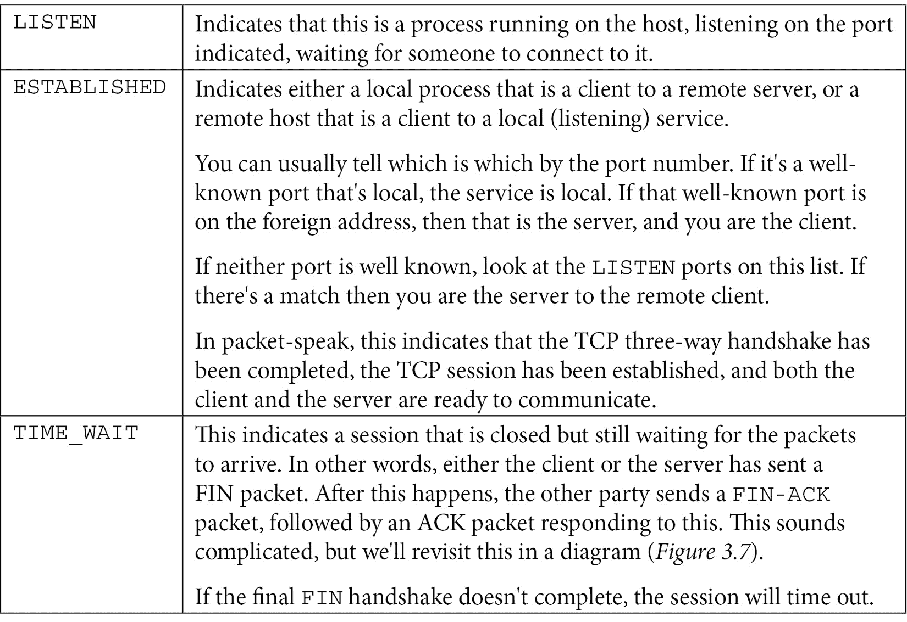

较少的常见状态(主要是因为这些状态通常只持续很短的时间)如下表所示。 如果你一直看到这些状态中的任何一个，你可能有一个问题需要解决:

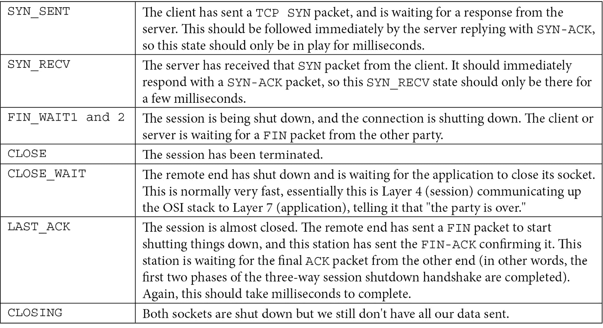

这些状态与我们刚才讨论的握手有什么关系? 让我们用图表来表示它们——再次注意，在大多数情况下，中间步骤应该只存在很短的时间。 如果您看到`SYN_SENT`或`SYN_RECVD`状态超过几毫秒，您可能需要进行一些故障排除:

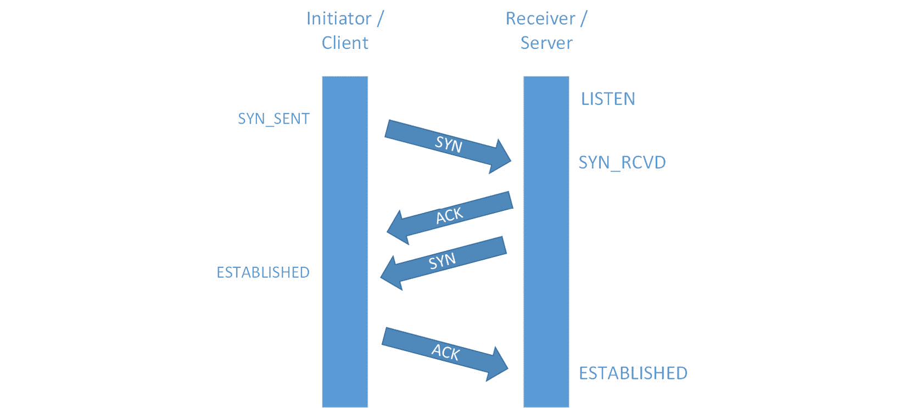

图 3.6 -建立 TCP 会话时各个点的会话状态

您将看到与 TCP 会话被断开时类似的状态。 再次注意，许多中间状态应该只持续很短的时间。 编写糟糕的应用程序通常不能正确地进行会话分解，因此在这些情况下可能会看到诸如`CLOSE WAIT`这样的状态。 另一种没有很好地完成会话分解的情况是，路径防火墙定义了最大 TCP 会话长度。 这种设置通常用于处理编写糟糕的应用程序，这些应用程序没有正确关闭，或者可能根本就没有关闭。 然而，最大会话计时器也可能干扰长时间运行的会话，比如旧式备份作业。 如果您遇到这种情况，并且长时间运行的会话没有很好地恢复(例如，一个备份作业出错而不是恢复会话)，您可能需要与防火墙管理员一起增加这个计时器， 或者与备份管理员一起查看更现代的备份软件(例如，具有多个并行 TCP 会话和更好的错误恢复):


图 3.7 -当会话被“撕毁”时，TCP 在各个点的会话状态

请注意，在会话启动中，我们并没有将`SYN`和`ACK`从服务器返回的两个状态分隔开——关闭会话所涉及的状态要比启动会话所涉及的状态多得多。 还要注意,包转第二个分数,如果你看到任何 TCP 会话的`netstat`显示除了`ESTABLISHED`,`LISTENING`,`TIME-WAIT`,或(更少)`CLOSED`,那么是不寻常的。

要将侦听端口与它们背后的服务关联起来，我们将使用`l`(用于侦听)而不是`a`，并为程序添加`p`选项:

```sh
$ sudo netstat -tulpn
[sudo] password for robv:
Active Internet connections (only servers)
Proto Recv-Q Send-Q Local Address           Foreign Address         State       PID/Program name
tcp        0      0 127.0.0.53:53           0.0.0.0:*               LISTEN      666/systemd-resolve
tcp        0      0 0.0.0.0:22              0.0.0.0:*               LISTEN      811/sshd: /usr/sbin
tcp        0      0 127.0.0.1:631           0.0.0.0:*               LISTEN      4147/cupsd
tcp6       0      0 :::22                   :::*                    LISTEN      811/sshd: /usr/sbin
tcp6       0      0 ::1:631                 :::*                    LISTEN      4147/cupsd
udp        0      0 127.0.0.53:53           0.0.0.0:*                           666/systemd-resolve
udp        0      0 0.0.0.0:49345           0.0.0.0:*                           715/avahi-daemon: r
udp        0      0 0.0.0.0:631             0.0.0.0:*                           4149/cups-browsed
udp        0      0 0.0.0.0:5353            0.0.0.0:*                           715/avahi-daemon: r
udp6       0      0 :::5353                 :::*                                715/avahi-daemon: r
udp6       0      0 :::34878                :::*                                715/avahi-daemon: r
```

可以替代`netstat`吗? 当然，有很多。

例如，`ss`具有几乎相同的功能。 在下面的表格中，你可以看到我们的要求:


让我们通过添加`p`选项来添加进程信息:

```sh
$ sudo ss -tuap
Netid      State          Recv-Q      Send-Q              Local Address:Port                  Peer Address:Port       Process
udp        UNCONN         0           0                   127.0.0.53%lo:domain                     0.0.0.0:*           users:(("systemd-resolve",pid=666,fd=12))
udp        UNCONN         0           0                         0.0.0.0:49345                      0.0.0.0:*           users:(("avahi-daemon",pid=715,fd=14))
udp        UNCONN         0           0                         0.0.0.0:631                        0.0.0.0:*           users:(("cups-browsed",pid=4149,fd=7))
udp        UNCONN         0           0                         0.0.0.0:mdns                       0.0.0.0:*           users:(("avahi-daemon",pid=715,fd=12))
udp        UNCONN         0           0                            [::]:mdns                          [::]:*           users:(("avahi-daemon",pid=715,fd=13))
udp        UNCONN         0           0                            [::]:34878                         [::]:*           users:(("avahi-daemon",pid=715,fd=15))
tcp        LISTEN         0           4096                127.0.0.53%lo:domain                     0.0.0.0:*           users:(("systemd-resolve",pid=666,fd=13))
tcp        LISTEN         0           128                       0.0.0.0:ssh                        0.0.0.0:*           users:(("sshd",pid=811,fd=3))
tcp        LISTEN         0           5                       127.0.0.1:ipp                        0.0.0.0:*           users:(("cupsd",pid=4147,fd=7))
tcp        ESTAB          0           64                 192.168.122.22:ssh                192.168.122.201:3310        users:(("sshd",pid=5575,fd=4),("sshd",pid=5483,fd=4))
tcp        ESTAB          0           0                  192.168.122.22:42502               44.227.121.122:https       users:(("firefox",pid=4627,fd=162))
tcp        TIME-WAIT      0           0                  192.168.122.22:46292               35.244.181.201:https      
tcp        ESTAB          0           0                  192.168.122.22:47902                192.168.122.1:ssh         users:(("ssh",pid=5832,fd=3))
tcp        LISTEN         0           128                          [::]:ssh                           [::]:*           users:(("sshd",pid=811,fd=4))
tcp        LISTEN         0           5                           [::1]:ipp                           [::]:*           users:(("cupsd",pid=4147,fd=6))
```

注意到最后一列是如何被换行到下一行的吗? 让我们使用`cut`命令只选择文本显示中的一些字段。 让我们请求列 1、2、4、5 和 6(我们将删除`Recv-Q`和`Send-Q`字段)。 我们将使用*将一个命令的输出*管道化到下一个命令的概念来实现这一点。

`cut`命令只有几个选项，通常您将使用`d`(分隔符)或`f`(字段号)。

在我们的例子中，分隔符是一个*空格*字符，我们需要字段 1、2、5 和 6。 不幸的是，字段之间有多个空格。 我们如何解决这个问题? 让我们使用`tr`(翻译)命令。 通常，`tr`会将单个字符转换为单个不同的字符，例如`tr 'a' 'b'`会将所有出现的`a`替换为`b`。 在我们的例子中，我们将使用`tr`的`s`选项，这将把目标字符的多次出现减少到一次。

我们最终的命令集是什么样子的? 请看以下内容:

```sh
sudo ss -tuap | tr -s ' ' | cut -d ' ' -f 1,2,4,5,6 --output-delimiter=$'\t'
```

第一个命令与我们上次使用的`ss`命令相同。 我们将其发送到`tr`，它将所有重复的空格字符替换为单个空格。 `cut`得到这个的输出，并执行以下操作:“使用空格字符分隔符，只给我字段 1、2、5 和 6，在结果列之间使用*T**ab*字符。”

我们的最终结果吗? 让我们来看看:

```sh
sudo ss -tuap | tr -s ' ' | cut -d ' ' -f 1,2,5,6 --output-delimiter=$'\t'
Netid   State   Local   Address:Port
udp     UNCONN  127.0.0.53%lo:domain    0.0.0.0:*
udp     UNCONN  0.0.0.0:49345   0.0.0.0:*
udp     UNCONN  0.0.0.0:631     0.0.0.0:*
udp     UNCONN  0.0.0.0:mdns    0.0.0.0:*
udp     UNCONN  [::]:mdns       [::]:*
udp     UNCONN  [::]:34878      [::]:*
tcp     LISTEN  127.0.0.53%lo:domain    0.0.0.0:*
tcp     LISTEN  0.0.0.0:ssh     0.0.0.0:*
tcp     LISTEN  127.0.0.1:ipp   0.0.0.0:*
tcp     ESTAB   192.168.122.22:ssh      192.168.122.201:3310
tcp     ESTAB   192.168.122.22:42502    44.227.121.122:https
tcp     ESTAB   192.168.122.22:47902    192.168.122.1:ssh
tcp     LISTEN  [::]:ssh        [::]:*
tcp     LISTEN  [::1]:ipp       [::]:*
```

使用选项卡作为分隔符可以使结果列更容易对齐。 如果这是一个更大的清单，我们可以将整个输出发送到`.tsv`(即**tab 分隔变量**)文件中，大多数电子表格应用程序都可以直接读取该文件。 这可以使用管道的变体来实现，称为**重定向**。

在本例中，我们将使用`>`操作符将整个输出发送到名为`ports.csv`的文件中，然后使用`cat`(连接)命令输入文件:

```sh
$ sudo ss -tuap | tr -s ' ' | cut -d ' ' -f 1,2,5,6 --output-delimiter=$'\t' > ports.tsv
$ cat ports.out
Netid   State   Local   Address:Port
udp     UNCONN  127.0.0.53%lo:domain    0.0.0.0:*
udp     UNCONN  0.0.0.0:49345   0.0.0.0:*
udp     UNCONN  0.0.0.0:631     0.0.0.0:*
udp     UNCONN  0.0.0.0:mdns    0.0.0.0:*
udp     UNCONN  [::]:mdns       [::]:*
udp     UNCONN  [::]:34878      [::]:*
tcp     LISTEN  127.0.0.53%lo:domain    0.0.0.0:*
tcp     LISTEN  0.0.0.0:ssh     0.0.0.0:*
tcp     LISTEN  127.0.0.1:ipp   0.0.0.0:*
tcp     ESTAB   192.168.122.22:ssh      192.168.122.201:3310
tcp     ESTAB   192.168.122.22:42502    44.227.121.122:https
tcp     ESTAB   192.168.122.22:47902    192.168.122.1:ssh
tcp     LISTEN  [::]:ssh        [::]:*
tcp     LISTEN  [::1]:ipp       [::]:*
```

最后，还有一个名为的特殊命令，它将输出发送到两个不同的位置。 在本例中，我们将它发送到`ports.out`文件和特殊的`STDOUT`(标准输出)文件，这实际上意味着“将它输入到我的终端会话中”。 为了好玩，让我们使用`grep`命令只选择已建立的会话:

```sh
$ sudo ss -tuap | tr -s ' ' | cut -d ' ' -f 1,2,5,6 --output-delimiter=$'\t' | grep "EST" | tee ports.out
tcp     ESTAB   192.168.122.22:ssh      192.168.122.201:3310
tcp     ESTAB   192.168.122.22:42502    44.227.121.122:https
tcp     ESTAB   192.168.122.22:47902    192.168.122.1:ssh
```

想要查看更多 TCP 会话的详细统计信息吗? TCP 使用`t`，选项使用`o`:

```sh
$ sudo ss –to
State    Recv-Q    Send-Q        Local Address:Port            Peer Address:Port     Process
ESTAB    0         64           192.168.122.22:ssh          192.168.122.201:3310      timer:(on,240ms,0)
ESTAB    0         0            192.168.122.22:42502         44.227.121.122:https     timer:(keepalive,6min47sec,0)
ESTAB    0         0            192.168.122.22:47902          192.168.122.1:ssh       timer:(keepalive,104min,0)
```

此 TCP 选项显示在诊断可能通过防火墙运行的长时间 TCP 会话时很有用。 由于内存的限制，防火墙会定期清除没有正确终止的 TCP 会话。 由于它们没有终止，在大多数情况下，防火墙将查找运行时间超过*x*分钟的会话(其中*x*是某个具有默认值且可以配置的数字)。 一种典型的情况是，如果客户机正在运行备份或通过防火墙传输大文件，可能是备份到云服务，或者在网络内外传输大文件。 如果这些会话超过了超时值，它们当然会被防火墙关闭。

在这种情况下，重要的是要了解在长传输中单个 TCP 会话可能持续多长时间。 备份或文件传输可能由几个较短的会话组成，这些会话以并行和顺序运行，以最大限度地提高性能。 或者它们可能是一个单一的传输，它与流程的运行时间一样长。 这组`ss`选项可以帮助您评估您的进程在底层的行为，而不必求助于包捕获(不用担心，我们将在本书的后面讨论包捕获)。

让我们再来看看这个问题，看看监听端口，并将显示与主机上的监听服务关联起来:

```sh
$ sudo netstat -tulpn
[sudo] password for robv:
Active Internet connections (only servers)
Proto Recv-Q Send-Q Local Address           Foreign Address         State       PID/Program name
tcp        0      0 127.0.0.53:53           0.0.0.0:*               LISTEN      666/systemd-resolve
tcp        0      0 0.0.0.0:22              0.0.0.0:*               LISTEN      811/sshd: /usr/sbin
tcp        0      0 127.0.0.1:631           0.0.0.0:*               LISTEN      4147/cupsd
tcp6       0      0 :::22                   :::*                    LISTEN      811/sshd: /usr/sbin
tcp6       0      0 ::1:631                 :::*                    LISTEN      4147/cupsd
udp        0      0 127.0.0.53:53           0.0.0.0:*                           666/systemd-resolve
udp        0      0 0.0.0.0:49345           0.0.0.0:*                           715/avahi-daemon: r
udp        0      0 0.0.0.0:631             0.0.0.0:*                           4149/cups-browsed
udp        0      0 0.0.0.0:5353            0.0.0.0:*                           715/avahi-daemon: r
udp6       0      0 :::5353                 :::*                                715/avahi-daemon: r
udp6       0      0 :::34878                :::*                                715/avahi-daemon: r
```

收集此信息的另一种经典方法是使用`lsof`(打开的文件列表)命令。 等一下，我们想要的是网络信息，而不是谁打开了什么文件的列表! 这个问题背后所缺少的信息是，在 Linux 中，**所有**都表示为一个文件，包括网络信息。 让我们用`lsof`来列举在 TCP 端口上的连接`80`和`22`:

```sh
$ lsof -i :443
COMMAND  PID USER   FD   TYPE DEVICE SIZE/OFF NODE NAME
firefox 4627 robv  162u  IPv4  93018      0t0  TCP ubuntu:42502->ec2-44-227-121-122.us-west-2.compute.amazonaws.com:https (ESTABLISHED)
$ lsof -i :22
COMMAND  PID USER   FD   TYPE DEVICE SIZE/OFF NODE NAME
ssh     5832 robv    3u  IPv4 103832      0t0  TCP ubuntu:47902->_gateway:ssh (ESTABLISHED)
```

您可以看到相同的信息，只是以稍微不同的方式表示。 这也很方便，因为`lsof`命令显式地显示了每个会话的方向，它从会话中的初始`SYN`包中获得(发送第一个`SYN`包的人就是任何 TCP 会话中的客户端)。

为什么我们如此关注侦听端口和进程? 一个答案实际上在本章的前面已经提到了——您只能有一个服务在特定的端口上侦听。 典型的例子是试图在 TCP 端口`80`上启动一个新网站，而不知道已经有一个服务在该端口上侦听。 在这种情况下，第二个服务或流程将无法启动。

现在我们已经探讨了本地侦听端口及其相关进程，让我们将注意力转向远程侦听端口——在其他主机上侦听的服务。

# 使用本地工具的远程端口枚举

因此，现在我们知道如何计算本地服务和一些流量诊断，我们如何枚举远程主机上的监听端口和服务呢?

最简单的方法是使用本地工具——例如，SFTP 服务器使用`scp`，FTP 服务器使用`ftp`。 但如果它是一些不同的服务，我们没有安装客户端。 非常简单，可以在紧急情况下使用`telnet`命令—例如，我们可以 telnet 到打印机的管理端口，运行`http`(`tcp/80`)，并发出`GET`请求获取第一页的页头。 注意清单底部的垃圾字符——这就是图形在本页上的表示方式:

```sh
$ telnet 192.168.122.241 80
Trying 192.168.122.241...
Connected to 192.168.122.241.
Escape character is '^]'.
GET / HTTP/1.1
HTTP/1.1 200 OK
Server: HP HTTP Server; HP PageWide 377dw MFP - J9V80A; Serial Number: CN74TGJ0H7; Built: Thu Oct 15, 2020 01:32:45PM {MAVEDWPP1N001.2042B.00}
Content-Encoding: gzip
Content-Type: text/html
Last-Modified: Thu, 15 Oct 2020 13:32:45 GMT
Cache-Control: max-age=0
Set-Cookie: sid=se2b8d8b3-e51eab77388ba2a8f2612c2106b7764a;path=/;HttpOnly;
Content-Security-Policy: default-src 'self' 'unsafe-eval' 'unsafe-inline'; style-src * 'unsafe-inline'; frame-ancestors 'self'
X-Frame-Options: SAMEORIGIN
X-UA-Compatible: IE=edge
X-XXS-Protection: 1
X-Content-Type-Options: nosniff
Content-Language: en
Content-Length: 667
▒▒▒O▒0▒▒▒W▒
           Hs<M▒´M
▒▒▒q.▒[▒▒l▒▒▒▒▒N▒J+▒"▒}s▒szr}?▒▒▒▒▒▒▒[▒<|▒▒:B{▒3v=▒▒▒ɇs▒n▒▒▒▒i ▒▒"1vƦ?X▒▒9o▒▒I▒
                                                                               2▒▒?ȋ▒ ]▒▒▒)▒^▒uF▒F{ԞN75▒)#▒|
```

即使您不知道输入什么，通常如果您可以通过 telnet 进行连接，这意味着您正在尝试的端口是打开的。

但是这种方法有一些问题——如果您不知道要输入什么，这并不是确定端口是否打开的万无一失的方法。 通常,退出的会话通常可以是一个问题——`BYE`,`QUIT`,`EXIT`会工作,有时按*^ c*(*Ctrl + c*【显示】)或*^ z*将工作,但这些方法都不是 100%保证。 最后，您可能要查看多个主机或多个端口，或者这可能只是故障排除的第一步。 所有这些因素结合起来使得这种方法既笨拙又耗时。**

为了解决这个问题，我们专门为这个目的构建了*端口扫描器*工具——`nmap`(我们将在下一节中介绍)是其中最受欢迎的。 然而，如果您碰巧没有安装其中之一，`nc`(netcat)命令是您的朋友!

让我们用 netcat 扫描我们的 HP 打印机示例:

```sh
$ nc -zv 192.168.122.241 80
Connection to 192.168.122.241 80 port [tcp/http] succeeded!
$ nc -zv 192.168.122.241 443
Connection to 192.168.122.241 443 port [tcp/https] succeeded!
```

或者我们测试第一个`1024`端口怎么样? 假设我们使用以下命令:

```sh
$ nc -zv 192.168.122.241 1-1024
```

我们得到了一页又一页的错误，如以下所示:

```sh
nc: connect to 192.168.122.241 port 1013 (tcp) failed: Connection refused
```

好吧，让我们和我们的朋友`grep`一起来过滤一下:

```sh
$ nc -zv 192.168.122.241 1-1024 | grep –v refused
```

这还是不行，为什么? 关键字是“错误”，Netcat 将错误发送到特殊的`STDERR`(标准错误)文件，这在 Linux 中是正常的(我们将在本节后面看到为什么成功的连接会被该工具视为错误)。 该文件回显到控制台，但它不是`STDOUT`，所以我们的`grep`过滤器完全忽略了它。 我们如何解决这个问题?

关于三个`STD`文件或*流*的一些背景信息——它们每个都有一个相关的文件编号:


通过使用这些文件号玩一些游戏，我们可以将`STDERR`重定向到`STDOUT`(因此`grep`现在将为我们工作):

```sh
$ nc -zv 192.168.122.241 1-1024 2>&1 | grep -v refused
Connection to 192.168.122.241 80 port [tcp/http] succeeded!
Connection to 192.168.122.241 443 port [tcp/https] succeeded!
Connection to 192.168.122.241 515 port [tcp/printer] succeeded!
Connection to 192.168.122.241 631 port [tcp/ipp] succeeded!
```

这正是**我们想要的! 不仅如此，我们还发现了一些我们不知道的额外端口! 将其扩展到*所有*端口，我们发现更多的服务正在运行。 注意，在我们的第一次尝试中，我们试图包含端口`0`(这在实际网络中可以看到)，但是 netcat 在这方面失败了:**

```sh
$ nc -zv 192.168.122.241 0-65535 2>&1 | grep -v refused
nc: port number too small: 0
$ nc -zv 192.168.122.241 1-65535 2>&1 | grep -v refused
Connection to 192.168.122.241 80 port [tcp/http] succeeded!
Connection to 192.168.122.241 443 port [tcp/https] succeeded!
Connection to 192.168.122.241 515 port [tcp/printer] succeeded!
Connection to 192.168.122.241 631 port [tcp/ipp] succeeded!
Connection to 192.168.122.241 3910 port [tcp/*] succeeded!
Connection to 192.168.122.241 3911 port [tcp/*] succeeded!
Connection to 192.168.122.241 8080 port [tcp/http-alt] succeeded!
Connection to 192.168.122.241 9100 port [tcp/*] succeeded!
```

我们也可以为 UDP 复制这个:

```sh
$ nc -u -zv 192.168.122.1 53
Connection to 192.168.122.1 53 port [udp/domain] succeeded!
```

然而，如果我们扫描 UDP 范围，这可能需要**非常**长的时间-我们也会发现 UDP 扫描不是很可靠。 它取决于使用 ICMP`port unreachable`错误响应的目标主机，如果路径中有任何防火墙，并不总是支持 ICMP`port unreachable`错误。 让我们看看当目标是 UDP 端口时，“first`1024`”扫描需要多长时间(注意我们如何使用分号将命令串在一起):

```sh
$ date ; nc -u -zv 192.168.122.241 1-1024 2>&1 | grep succeed ; date
Thu 07 Jan 2021 09:28:17 AM PST
Connection to 192.168.122.241 68 port [udp/bootpc] succeeded!
Connection to 192.168.122.241 137 port [udp/netbios-ns] succeeded!
Connection to 192.168.122.241 138 port [udp/netbios-dgm] succeeded!
Connection to 192.168.122.241 161 port [udp/snmp] succeeded!
Connection to 192.168.122.241 427 port [udp/svrloc] succeeded!
Thu 07 Jan 2021 09:45:32 AM PST
```

是的，一个坚实的 18 分钟-这个方法不是一个速度恶魔!

使用 netcat，您还可以直接与服务交互，与我们的 telnet 示例相同，但是没有 telnet 带来的“终端/光标控制”类型开销。 例如，连接到一个 web 服务器，语法如下:

```sh
# nc 192.168.122.241 80
```

但更有趣的是，我们可以设置一个假服务，让 netcat 监听给定的端口。 如果您需要测试连通性，特别是如果您想测试防火墙规则，但还没有构建目标主机或服务，这将非常方便。

此语法告诉主机监听端口`80`。 使用`l`参数告诉 netcat 侦听，但是当您的远程测试器或扫描仪连接或断开时，netcat 侦听器退出。 使用`l`参数是“更仔细地监听”选项，它正确地处理 TCP 连接和断开连接，将监听器保留在原位。 不幸的是，在 Ubuntu 的 netcat 实现中，`l`参数和`–e`(execute)参数都缺失了。 我们可以假装这一切——继续读下去!

在此基础上，让我们用 netcat 建立一个简单的网站! 首先，创建一个简单的文本文件。 我们将使我们的`index.html`类似如下:


现在，为了让网站正常运行，让我们在 netcat 语句中添加一个 1 秒的超时，并将整个语句放入循环，这样当我们退出连接时，netcat 会重新启动:

```sh
$ while true; do cat index.html | nc -l -p 80 –q 1; done
nc: Permission denied
nc: Permission denied
nc: Permission denied
…. (and so on) ….
```

注意在端口`80`上的监听是如何失败的——我们必须按*Ctrl*+*C*才能退出循环。 这是为什么呢? (提示:回到本章前面的 Linux 中端口的定义。) 让我们再次尝试端口`1500`:

```sh
$ while true; do cat index.html | nc -l -p 1500 -q 1  ; done
```

浏览我们的新网站(注意它是 HTTP，并注意用于设置目标端口的`:1500`)，我们现在看到以下内容:


图 3.8 -一个简单的 Netcat 网站

回到 Linux控制台，您将看到 netcat 响应客户端`GET`请求和浏览器的`User-Agent`字符串。 你会看到整个 HTTP 交换(从服务器的角度):

```sh
GET / HTTP/1.1
Host: 192.168.122.22:1500
Connection: keep-alive
Cache-Control: max-age=0
Upgrade-Insecure-Requests: 1
User-Agent: Mozilla/5.0 (Windows NT 10.0; Win64; x64) AppleWebKit/537.36 (KHTML, like Gecko) Chrome/87.0.4280.88 Safari/537.36 Edg/87.0.664.66
Accept: text/html,application/xhtml+xml,application/xml;q=0.9,img/webp,img/apng,*/*;q=0.8,application/signed-exchange;v=b3;q=0.9
Accept-Encoding: gzip, deflate
Accept-Language: en-US,en;q=0.9
```

为了让它更活跃，让我们让这个网站告诉我们日期和时间:

```sh
while true; do echo -e "HTTP/1.1 200 OK\n\n $(date)" | nc -l -p 1500 -q 1; done
```

浏览该网站现在给我们当前的日期和时间:


图 3.9 -一个更复杂的 Netcat 网站-添加时间和日期

或者，用`apt-get`来安装`fortune`包，我们现在可以添加一句谚语给我们一些*及时*智慧:


图 3.10 -在 Netcat 网站上添加财富

我们也可以使用 netcat 传输文件。 在接收端，我们将监听端口`1234`，并将输出发送到`out.file`，同样使用重定向:

```sh
nc -l -p 1234 > received.txt
```

在发送端，我们将连接到该服务 3 秒，并将其发送`sent-file.txt`。 我们将通过在相反的方向使用重定向(使用`<`操作符)来获得输入:

```sh
nc -w 3 [destination ip address] 1234 < sent-file.txt
```

现在，回到接收端，我们可以`cat`结果文件:

```sh
$ cat received.txt
Mr. Watson, come here, I want to see you.
```

这说明 netcat 可以是一个有价值的故障排除工具，但是根据您试图完成的任务的不同，它的使用可能比较复杂。 我们可以使用 netcat 作为一个简单的代理，作为一个简单的聊天应用程序，或者呈现一个完整的 Linux shell—所有这些对网络管理员(或者渗透测试人员)来说都是方便的。

以上就是 netcat 的基本知识。 我们已经使用 netcat 来枚举本地端口，连接到远程端口并与远程端口进行交互，支持一些相当复杂的本地服务，甚至传输文件。 现在让我们看看 Nmap，一种更快、更优雅的枚举远程端口和服务的方法。

# 远程端口和服务枚举- nmap

中最广泛用于扫描网络资源的工具是**NMAP**(简称**network Mapper**)。 NMAP一开始只是一个简单的端口扫描工具，但现在已经超越了那一组简单的函数，拥有一长串的函数列表。

首先，nmap 并没有默认安装在 Ubuntu 的基本工作站上(尽管它默认包含在许多其他发行版中)。 运行`sudo apt-get install nmap`进行安装。

当我们继续使用 nmap 时，请尝试我们在示例中使用的各种命令。 您可能会看到类似的结果，并在此过程中了解这个有价值的工具。 在这个过程中，你也会学到很多关于你的人际网络的知识!

重要提示

对于“自己试试这个”的建议，有一个非常重要的警告。 NMAP 是一个非常无害的工具，它几乎从不导致网络问题。 但是，如果是针对生产网络运行此功能，则需要首先了解该网络。 有几种类型的齿轮,特别是“摇晃”网络栈——老年医疗设备比如,以及老工业控制系统**(**ICS)或**监控和数据采集(**【显示】SCADA)装备。****

 ****换句话说，如果你在医院、工厂或公用事业单位，要小心! 在生产网络上运行任何网络映射都可能导致问题。

您可能仍然希望这样做，但首先要测试已知的“空闲”设备，这样您就知道当您扫描“真实的”网络时，您有一些保证，您不会造成问题。 还有请(**请**)，如果你在医疗网络上，**千万不要**扫描任何与一个人相关的东西!

第二个(法律上的)警告——未经允许不要扫描东西。 如果您使用的是家庭或实验室网络，那么这里是使用评估工具(如 nmap 或更激进的安全评估工具)的好地方。 然而，如果你在工作，即使你确定自己不会引起麻烦，你也要先得到书面许可。

扫描互联网主机，你不拥有或没有书面许可扫描是非常非法的。 许多会认为它相当无害，而在大多数案例中，扫描被大多数公司简单地认为是“互联网白噪音”(大多数组织每小时被扫描数十或数百次)。 永远记住这句谚语:“罪犯和信息安全专业人员的区别在于签订了合同”，因为它是 100%真实的，所以经常被重复。

所有这些都过去了，让我们更加熟悉这个伟大的工具! 尝试运行`man nmap`(还记得`manual`命令吗?)—在 nmap 的手册页中有很多有用的信息，包括完整的文档。 一旦我们更熟悉这个工具，你可能会发现帮助文本更快地使用。 通常，您(或多或少)知道要查找什么，因此可以使用`grep`命令进行搜索，例如:`nmap - -help | grep <my_search_string>`。 对于 nmap，您可以不使用标准的`- - help`选项，因为不带参数的 nmap 的默认输出是帮助页面。

所以，找到如何做一个 ping 扫描-也就是说，ping 范围内的所有东西(我总是忘记语法)-你会搜索如下:

```sh
$ nmap | grep -i ping
  -sn: Ping Scan - disable port scan
  -PO[protocol list]: IP Protocol Ping
```

我们如何继续? NMAP 想知道你想映射什么-在这种情况下，我将映射`192.168.122.0/24`子网:

```sh
$ nmap -sn 192.168.122.0/24
Starting Nmap 7.80 ( https://nmap.org ) at 2021-01-05 13:53 PST
Nmap scan report for _gateway (192.168.122.1)
Host is up (0.0021s latency).
Nmap scan report for ubuntu (192.168.122.21)
Host is up (0.00014s latency).
Nmap scan report for 192.168.122.51
Host is up (0.0022s latency).
Nmap scan report for 192.168.122.128
Host is up (0.0027s latency).
Nmap scan report for 192.168.122.241
Host is up (0.0066s latency).
Nmap done: 256 IP addresses (5 hosts up) scanned in 2.49 seconds
```

所以这是一个快速扫描，它告诉我们当前在我们的子网中活跃的每个 IP。

现在让我们看看服务。 让我们首先查找正在运行`tcp/443`(您可能将其识别为 HTTPS)的任何内容。 我们将使用`nmap –p 443 –open 192.168.122.0/24`命令。 在这个命令中有两件事需要注意。 首先，我们使用`-p`选项指定端口。

缺省情况下，NMAP 使用`SYN`扫描方式扫描 TCP 端口。 nmap 发送一个`SYN`包，并等待取回一个`SYN-ACK`包。 如果它看到这一点，那么该端口是打开的。 如果收到了`port unreachable`响应，则认为该端口已关闭。

如果我们想要一个完整的`connect`扫描(完成整个三次握手)，我们可以指定`-sT`。

接下来，我们看到一个`--open`选项。 这表示“只显示打开的端口”。 如果没有这个，我们将看到关闭端口和“过滤”端口(这通常意味着没有从初始包返回)。

如果我们想要更多关于为什么一个端口可能被认为是打开、关闭或过滤的细节，我们将删除`--open`选项，并添加`--reason`:

```sh
$ nmap -p 443 --open 192.168.122.0/24
 Starting Nmap 7.80 ( https://nmap.org ) at 2021-01-05 13:55 PST
Nmap scan report for _gateway (192.168.122.1)
Host is up (0.0013s latency).
PORT    STATE SERVICE
443/tcp open  https
Nmap scan report for 192.168.122.51
Host is up (0.0016s latency).
PORT    STATE SERVICE
443/tcp open  https
Nmap scan report for 192.168.122.241
Host is up (0.00099s latency).
PORT    STATE SERVICE
443/tcp open  https
Nmap done: 256 IP addresses (5 hosts up) scanned in 2.33 seconds
```

要扫描 UDP 端口，我们将使用相同的语法，但添加了`sU`选项。 注意到这里，我们开始看到启动的主机的 MAC 地址。 这是因为被扫描的主机与扫描器在同一个子网中，所以信息是可用的。 NMAP 使用 MAC 地址的 OUI 部分来识别每个网卡的供应商:

```sh
$ nmap -sU -p 53 --open 192.168.122.0/24
You requested a scan type which requires root privileges.
QUITTING!
```

哎呀——因为我们正在扫描 UDP 端口，所以 Nmap 需要使用 root 权限(使用`sudo`)运行。 这个是，因为它需要将发送接口置为*混杂模式*，以便捕获可能返回的任何数据包。 这是因为在 UDP 中没有*会话*的第 5 层概念，而我们在 TCP 中有，所以在发送和接收数据包之间没有第 5 层连接。 根据使用的命令行参数(不仅仅是 UDP 扫描)，Nmap 可能需要提高权限。 在大多数情况下，如果你正在使用 Nmap 或类似的工具，你会发现自己经常使用`sudo`:

```sh
$ sudo nmap -sU -p 53 --open 192.168.122.0/24
[sudo] password for robv:
Sorry, try again.
[sudo] password for robv:
Starting Nmap 7.80 ( https://nmap.org ) at 2021-01-05 14:04 PST
Nmap scan report for _gateway (192.168.122.1)
Host is up (0.00100s latency).
PORT   STATE SERVICE
53/udp open  domain
MAC Address: 00:0C:29:3B:73:CB (VMware)
Nmap scan report for 192.168.122.21
Host is up (0.0011s latency).
PORT   STATE         SERVICE
53/udp open|filtered domain
MAC Address: 00:0C:29:E4:0C:31 (VMware)
Nmap scan report for 192.168.122.51
Host is up (0.00090s latency).
PORT   STATE         SERVICE
53/udp open|filtered domain
MAC Address: 00:25:90:CB:00:18 (Super Micro Computer)
Nmap scan report for 192.168.122.128
Host is up (0.00078s latency).
PORT   STATE         SERVICE
53/udp open|filtered domain
MAC Address: 98:AF:65:74:DF:6F (Unknown)
Nmap done: 256 IP addresses (23 hosts up) scanned in 1.79 seconds
```

关于这次扫描还有几点需要注意:

第一次扫描尝试失败——注意你需要 root 权限才能在 NMAP 中进行大多数扫描。 得到结果,在许多情况下,工具工艺包本身,而不是使用标准的操作系统服务,它也通常需要权利来捕获数据包返回你的目标主机,所以 nmap 需要提高这两个操作的权限。

我们看到更多的状态指示`open|filtered`端口。 UDP 是特别容易出现这种——因为没有`SYN`/`SYN-ACK`类型的握手,你送一个`UDP`包,你可能不会得到任何东西——这并不意味着港口下跌,这可能意味着你的包是由处理远程服务,并没有承认发送(一些这样的协议)。 或者在许多情况下，它可能意味着端口没有启动，主机没有正确地返回 ICMP`Port Unreachable`错误消息(ICMP Type 1, Code 3)。

为了获得更详细的信息，让我们使用`sV`选项，该选项将探测相关的端口，并获得关于服务本身的更多信息。 在这种情况下,我们会看到`192.168.122.1`标识积极开放,运行`domain`服务,服务版本列为`generic dns response: NOTIMP`(这表明服务器不支持 DNS`UPDATE`功能,RFC 2136 中描述*)。 如果 NMAP 识别不确定，那么服务信息后面的*服务指纹*签名可以帮助进一步识别服务。*

 *还请注意，对于其他主机，原因列为`no-response`。 如果您知道协议，通常可以在这些情况下做出很好的推断。 在扫描 DNS 的情况下，`no-response`表示没有 DNS 服务器或端口关闭。 (或者可能它是开放的，有一些奇怪的服务，而不是 DNS 运行在它上面，这是极不可能的)。 (这是一个 DNS 服务器在`192`。)

还要注意，这次扫描花了整整 100 秒，大约是我们最初扫描的 50 倍:

```sh
$ sudo nmap -sU -p 53 --open -sV --reason 192.168.122.0/24
Starting Nmap 7.80 ( https://nmap.org ) at 2021-01-05 14:17 PST
Nmap scan report for _gateway (192.168.122.1)
Host is up, received arp-response (0.0011s latency).
PORT   STATE SERVICE REASON              VERSION
53/udp open  domain  udp-response ttl 64 (generic dns response: NOTIMP)
1 service unrecognized despite returning data. If you know the service/version, please submit the following fingerprint at https://nmap.org/cgi-bin/submit.cgi?new-service :
SF-Port53-UDP:V=7.80%I=7%D=1/5%Time=5FF4E58A%P=x86_64-pc-linux-gnu%r(DNSVe
SF:rsionBindReq,1E,"\0\x06\x81\x85\0\x01\0\0\0\0\0\0\x07version\x04bind\0\
SF:0\x10\0\x03")%r(DNSStatusRequest,C,"\0\0\x90\x04\0\0\0\0\0\0\0\0")%r(NB
SF:TStat,32,"\x80\xf0\x80\x95\0\x01\0\0\0\0\0\0\x20CKAAAAAAAAAAAAAAAAAAAAA
SF:AAAAAAAAA\0\0!\0\x01");
MAC Address: 00:0C:29:3B:73:CB (VMware)
Nmap scan report for 192.168.122.51
Host is up, received arp-response (0.00095s latency).
PORT   STATE         SERVICE REASON      VERSION
53/udp open|filtered domain  no-response
MAC Address: 00:25:90:CB:00:18 (Super Micro Computer)
Nmap scan report for 192.168.122.128
Host is up, received arp-response (0.00072s latency).
PORT   STATE         SERVICE REASON      VERSION
53/udp open|filtered domain  no-response
MAC Address: 98:AF:65:74:DF:6F (Unknown)
Nmap scan report for 192.168.122.171
Host is up, received arp-response (0.0013s latency).
PORT   STATE         SERVICE REASON      VERSION
53/udp open|filtered domain  no-response
MAC Address: E4:E1:30:16:76:C5 (TCT mobile)
Service detection performed. Please report any incorrect results at https://nmap.org/submit/ .
Nmap done: 256 IP addresses (24 hosts up) scanned in 100.78 seconds
```

让我们尝试使用`192.168.122.1`，端口`tcp/443`的`sV`详细服务扫描，我们会看到 NMAP 在识别主机上运行的 web 服务器方面做得很好:

```sh
root@ubuntu:~# nmap -p 443 -sV 192.168.122.1
Starting Nmap 7.80 ( https://nmap.org ) at 2021-01-06 09:02 PST
Nmap scan report for _gateway (192.168.122.1)
Host is up (0.0013s latency).
PORT    STATE SERVICE  VERSION
443/tcp open  ssl/http nginx
MAC Address: 00:0C:29:3B:73:CB (VMware)
Service detection performed. Please report any incorrect results at https://nmap.org/submit/ .
Nmap done: 1 IP address (1 host up) scanned in 12.60 seconds
```

对`192.168.122.51`进行同样的尝试，我们看到服务被正确地识别为为 VMware ESXi 7.0 管理接口:

```sh
root@ubuntu:~# nmap -p 443 -sV 192.168.122.51
Starting Nmap 7.80 ( https://nmap.org ) at 2021-01-06 09:09 PST
Nmap scan report for 192.168.122.51
Host is up (0.0013s latency).
PORT    STATE SERVICE   VERSION
443/tcp open  ssl/https VMware ESXi SOAP API 7.0.0
MAC Address: 00:25:90:CB:00:18 (Super Micro Computer)
Service Info: CPE: cpe:/o:vmware:ESXi:7.0.0
Service detection performed. Please report any incorrect results at https://nmap.org/submit/ .
Nmap done: 1 IP address (1 host up) scanned in 140.48 seconds
```

既然我们是使用各种选项扫描端口的专家，让我们在这方面进行扩展。 NMAP 允许我们在它找到的任何开放端口上运行脚本——这可以极大地节省时间!

## NMAP 脚本

到目前为止，我们只是研究了端口扫描——但 NMAP 远不止于此。 一个功能齐全的脚本引擎可以基于 Lua(一种基于文本的解释语言)处理数据包或 NMAP 的输出。 在本书中，我们不会深入探讨 LUA，但是 NMAP 确实提供了几个预先编写好的脚本，其中一些对于网络管理员来说是非常宝贵的。

例如，考虑 SMB 版本信息。 微软多年来一直强烈建议 SMBv1 退役，在 2017 年 SMBv1 中的 EternalBlue 和 EternalRomance 漏洞被 WannaCry/Petya/NotPetya 系列恶意软件使用之前达到顶峰。 虽然 SMBv1 已经被有效地退休了，甚至很难在新的 Windows 版本中启用它，但我们仍然在企业网络中看到 SMBv1——无论是在较旧的服务器平台上，还是在在其 SAMBA 服务中实现 SMBv1 的较旧的基于 linux 的设备上。 使用`smb-protocols`脚本扫描这一点非常简单。 在使用任何脚本之前，打开脚本查看它到底做了什么，以及 NMAP 需要如何调用它(它可能需要哪些端口或参数)是很方便的。 在这种情况下，`smb-protocols`文本给了我们用法，以及期望输出的内容:

```sh
-- @usage nmap -p445 --script smb-protocols <target>
-- @usage nmap -p139 --script smb-protocols <target>
--
-- @output
-- | smb-protocols:
-- |   dialects:
-- |     NT LM 0.12 (SMBv1) [dangerous, but default]
-- |     2.02
-- |     2.10
-- |     3.00
-- |     3.02
-- |_    3.11
--
-- @xmloutput
-- <table key="dialects">
-- <elem>NT LM 0.12 (SMBv1) [dangerous, but default]</elem>
-- <elem>2.02</elem>
-- <elem>2.10</elem>
-- <elem>3.00</elem>
-- <elem>3.02</elem>
-- <elem>3.11</elem>
-- </table>
```

让我们扫描目标网络中的一些特定的主机来了解更多信息。 我们将只显示一个运行 SMBv1 协议的示例主机的输出。 注意，从主机名来看，它似乎是一个**网络连接存储**(**NAS**)设备，因此可能是基于 Linux 或 bsd 的设备。 从 OUI 我们可以看到主机的品牌名称，这给了我们更具体的信息:

```sh
nmap -p139,445 --open --script=smb-protocols 192.168.123.0/24
Starting Nmap 7.80 ( https://nmap.org ) at 2021-01-06 12:27 Eastern Standard Time
Nmap scan report for test-nas.defaultroute.ca (192.168.123.1)
Host is up (0.00s latency).
PORT    STATE SERVICE
139/tcp open  netbios-ssn
445/tcp open  microsoft-ds
MAC Address: 00:D0:B8:21:89:F8 (Iomega)
Host script results:
| smb-protocols: 
|   dialects: 
|     NT LM 0.12 (SMBv1) [dangerous, but default]
|     2.02
|     2.10
|     3.00
|     3.02
|_    3.11
```

或者您可以直接使用`smb-vuln-ms17-010.nse`脚本扫描`Eternal*`漏洞(仅显示一个主机为例)。 扫描同一主机时，我们看到即使启用了 SMBv1，特定的漏洞也没有发挥作用。 尽管如此，仍然强烈建议禁用 SMBv1，因为 SMBv1 容易受到一系列漏洞的影响，而不仅仅是`ms17-010`。

在列表中向下滚动一点，我们的第二个示例主机确实存在这个漏洞。 从主机名可以看出，这很可能是一个业务关键型主机(运行 BAAN)，所以我们宁愿修复该服务器而不是勒索软件。 看看那个主机上的生产应用程序，SMB 实际上根本没有理由向大多数用户公开——实际上应该只有系统或应用程序管理员将驱动器映射到这个主机，用户将通过它的应用程序端口连接到它。 对此的建议显然是修补漏洞(这可能已经几年没有做过了)，但也要防火墙服务远离大多数用户(或禁用该服务，如果它不被管理员使用):

```sh
Starting Nmap 7.80 ( https://nmap.org ) at 2021-01-06 12:32 Eastern Standard Time
Nmap scan report for nas.defaultroute.ca (192.168.123.11)
Host is up (0.00s latency).
PORT    STATE SERVICE
139/tcp open  netbios-ssn
445/tcp open  microsoft-ds
MAC Address: 00:D0:B8:21:89:F8 (Iomega)
Nmap scan report for baan02.defaultroute.ca (192.168.123.77)
Host is up (0.00s latency).
PORT    STATE SERVICE
139/tcp open  netbios-ssn
445/tcp open  microsoft-ds
MAC Address: 18:A9:05:3B:ED:EC (Hewlett Packard)
Host script results:
| smb-vuln-ms17-010: 
|   VULNERABLE:
|   Remote Code Execution vulnerability in Microsoft SMBv1 servers (ms17-010)
|     State: VULNERABLE
|     IDs:  CVE:CVE-2017-0143
|     Risk factor: HIGH
|       A critical remote code execution vulnerability exists in Microsoft SMBv1
|        servers (ms17-010).
|           
|     Disclosure date: 2017-03-14
|     References:
|       https://cve.mitre.org/cgi-bin/cvename.cgi?name=CVE-2017-0143
|       https://technet.microsoft.com/en-us/library/security/ms17-010.aspx
|_      https://blogs.technet.microsoft.com/msrc/2017/05/12/customer-guidance-for-wannacrypt-attacks/
```

Nmap 安装了数百个脚本。 如果您正在寻找特定的东西，特别是如果您不能仅通过端口扫描来确定它，那么使用一个或多个 nmap 脚本通常是最简单的方法。 请记住，如果您正在寻找一个“流氓”主机(比如 DHCP 服务器)，那么您将找到您的生产主机以及任何不需要的实例。

注意，其中许多依赖于在扫描中包含正确的端口号。 “广播”风格的脚本通常只扫描你的扫描器所在的子网，所以扫描远程子网可能意味着“借用”或将主机放置在该子网上。 本列表中讨论的许多核心网络服务将在本书后面的章节中介绍，包括 DNS、DHCP 等。

请记住(再次)，未经授权的扫描永远不符合您的最佳利益-首先要获得书面许可!

nmap 中肯定有数百个脚本，通过快速的互联网搜索可以找到更多的脚本。 我发现在生产网络中最方便的一些预打包的 nmap 脚本包括:


**意外的、恶意的或配置错误的网络基础设施**:


**服务器问题和恶意服务**

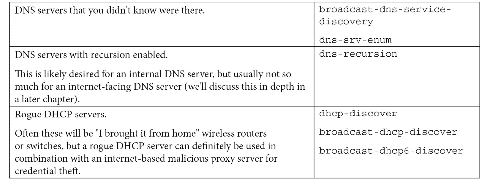

**盗版、“影子 IT”、恶意或其他意外的服务器**:


**工作站问题**:

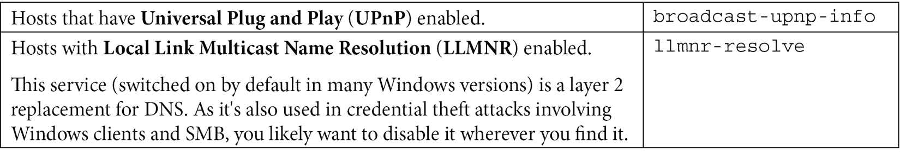

**网络边界问题**


**其他服务器或工作站问题**:


本文总结了 Nmap 的各种用途。 在更大的网络中，Nmap 做得不是很好——例如，在`/8`或`/16`网络中，或者一些非常大的 IPv6 网络中。 对于这些网络，需要一个更快的工具。 让我们探索一下用于这些用途的 MASSCAN 工具。

## Nmap 有限制吗?

对 Nmap 的主要限制是性能。 随着网络规模的增长，Nmap 将(当然)花费越来越长的时间来完成您正在运行的任何扫描。 这通常不是一个问题，但在生产网络中，如果您的扫描从早上 8 点开始，然后在第二天某个时间结束，很可能有相当长的一段时间设备大部分处于断电或断开状态，因此扫描的有效性将受到影响。 当你在一个非常大的网络上时，这一点就变得尤为明显——例如，当你的子网掩码缩小或者你的网络数量增加时，Nmap 的扫描时间可能会增加到几个小时、几天或几个星期。 同样，在 IPv6 网络上，通常可以看到数千、数十万甚至数百万个地址，这些地址可以在几年或几十年的时间里转换成 Nmap 扫描次数。

有两种方法可以帮助解决这个问题。

首先，如果您阅读 NMAP`man`页面，有一些参数可以提高速度—您可以调整并行度(一次可以运行多少个操作)、主机超时、往返超时和操作之间的延迟等待。 这些在`man`页有详细的解释，在[https://nmap.org/book/man-performance.html](https://nmap.org/book/man-performance.html)页有更深入的讨论。

或者，你可以看看其他工具。 Rob Graham 维护着专用于高性能扫描的 MASSCAN 工具。 有了足够的带宽和马力，它可以在 10 分钟内扫描整个 IPv4 互联网。 该工具的 1.3 版增加了对 IPv6 的支持。 MASSCAN 的语法与 Nmap 的类似，但是在使用这个更快的工具时需要注意一些事情。 该工具及其文档和“陷阱”发布在这里:[https://github.com/robertdavidgraham/masscan](https://github.com/robertdavidgraham/masscan)。

对于非常大的网络，一种常见的方法是使用 MASSCAN(或为更快的扫描调优的 Nmap)作为初始扫描集。 然后，粗略扫描的输出可以用于“提供”下一个工具，无论是 Nmap 还是其他工具，可能是安全扫描程序，如 Nessus 或 OpenVAS。 像这样将工具“链接”在一起，最大限度地发挥每个工具的优势，在最短的时间内提供最好的结果。

所有的工具都有其局限性，IPv6 网络仍然是扫描工具的一个挑战。 除非您能够以某种方式限制范围，否则 IPv6 将很快达到扫描主机上的网络带宽、时间和内存的限制。 DNS 收集等工具可以在此提供帮助——如果您能够在扫描服务之前识别出哪些主机实际上是活动的，那么可以将目标地址显著减少到可管理的卷。

端口扫描已经结束，让我们离开有线世界，探索在无线网络上使用 Linux 进行故障排除。

# 无线诊断操作

无线网络中的诊断工具通常关注发现低信号强度和干扰的区域——这些东西会给使用你的无线网络的人们带来问题。

有一些优秀的基于 linux 的无线工具，但是我们将讨论 Kismet、Wavemon 和 LinSSID。 这三个工具都是免费的，并且都可以使用标准的`apt-get install <package name>`命令进行安装。 如果您扩展您的工具搜索，包括攻击类型的工具或商业产品，这个列表显然会变得更大。

Kismet 是 Linux 中可用的较老的无线工具之一。 我第一次接触它是作为一个信息安全工具，突出显示“隐藏的”无线 ssid 实际上根本不隐藏!

使用如下命令运行该工具:

```sh
$ sudo kismet –c <wireless interface name>
```

或者，如果你有一个完整的工作配置，不需要实际的服务器窗口，运行以下:

```sh
$ sudo kismet –c <wireless interface name> &
```

现在，在另一个窗口(或者在相同的地方，如果你在后台运行 Kismet)，运行 Kismet 客户端:

```sh
$ kismet_client
```

在出现的显示中，您将看到各种 ssid，以及发送它们的接入点的 bssid。 当您滚动这个列表时，您将看到每个 SSID 使用的通道和加密类型、您的笔记本电脑能够理解的在该 SSID 上协商的速度，以及该 SSID 上的所有客户端站点。 每个客户端都会显示其 MAC 地址、频率和包计数。 这些信息都是以明文形式发送的，作为每个客户端关联过程和持续连接“握手”的一部分。

由于您的无线适配器一次只能在一个 SSID/BSSID 组合上，因此所呈现的信息是通过在信道之间跳跃来收集的。

在下面的截图中，我们显示了一个隐藏的 SSID，其中显示了接入点的 BSSID，以及该接入点上与该 SSID 关联的8 个客户端:

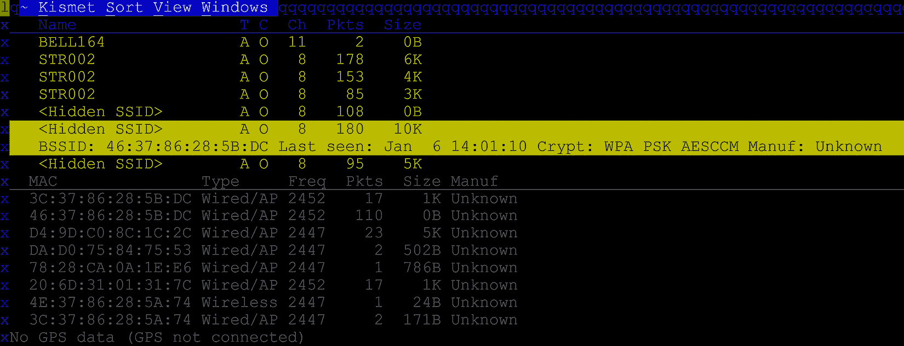

图 3.11 -主屏幕上典型的 Kismet 输出

在网络上按*Enter*将提供关于从该接入点广播的 SSID 的更多信息。 注意，我们在这个显示中看到了一个**隐藏的 SSID**:


图 3.12 - Kismet 输出，接入点/SSID 细节

进一步深入，您可以得到客户活动的详细信息:


图 3.13 - Kismet 输出，客户端详细信息

虽然 Kismet 是侦察和演示的好工具，但它的菜单很容易让人迷失，并且在诊断信号强度时不容易专注于跟踪我们真正关心的东西。

Wavemon 是一个非常不同的工具。 它只监视您的连接，因此您必须将它与 SSID 关联。 它会给你当前的访问点、速度、信道等等，如下面的截图所示。 这可能很有用，但它只是故障诊断通常需要的信息的一个狭窄视图——注意在下面的屏幕截图中，报告的值主要是关于数据吞吐量和从适配器所关联的网络中看到的信号。 由于这个原因，Wavemon 工具主要用于故障排除上行问题，而在故障排除、评估或查看整个无线基础设施的信息方面使用得不多:

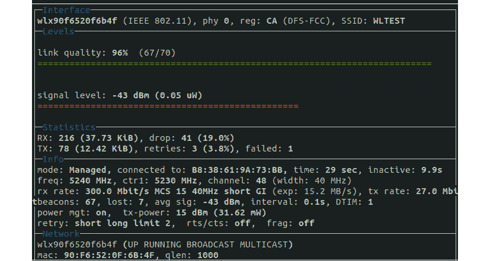

图 3.14 - Wavemon 显示

更常用的是**LinSSID**，它是 MetaGeek 的 Windows 应用程序 inside 的一个非常接近的端口。 在运行应用程序时，屏幕相当空。 选择您想要用来“嗅探”本地无线网络的无线适配器，然后按**Run**按钮。

显示器显示了两个频谱(2.4 GHz 和 5 GHz)上可用的信道，每个 SSID 在顶部窗口中表示。 列表中选中的每个 SSID/BSSID 组合都显示在底部窗口中。 这使得很容易看到列表中每个 AP 的信号强度，以及图形显示中的相对强度。 相互干扰的 ssid 在重叠的图形显示中很明显。 下面的屏幕截图显示了 5 GHz 频谱情况—注意 ap 是如何聚集在两个通道周围的。 它们中的任何一个都可以通过改变信道来提高性能，在我们的显示器中有很多空闲的信道——事实上，这就是推动迁移到 5 GHz 的原因。 是的，那个频段更快，但更重要的是，它更容易解决任何来自相邻接入点的干扰问题。 还需要注意的是，图上显示的每个通道占用大约 20 GHz(稍后将详细介绍):


图 3.15 - LinSSID 输出-主屏幕以文字和图形方式显示信道分配和强度

2.4 GHz 信道也好不到哪里去。 由于北美只有 11 个频道，你通常会看到人们选择频道 1、6 或 11——这 3 个频道互不干扰。 在几乎所有非农村的环境中，你会看到一些邻居在使用你认为是免费的 3 个频道! 在下面的截图中，我们可以看到每个人都选择了 11 频道，原因如下:

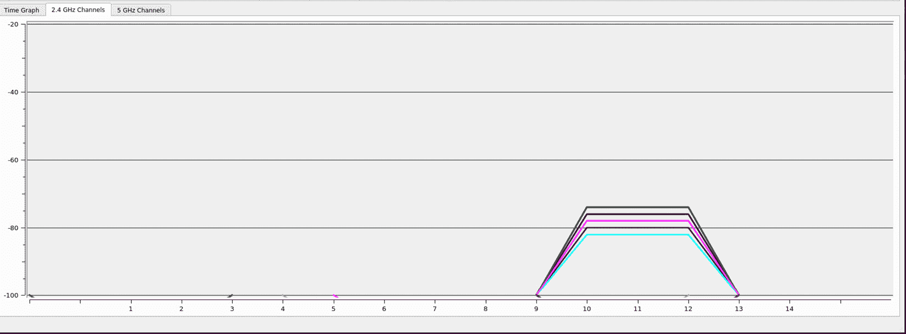

图 3.16 -来自无线邻居的干扰-多个无线 bssid 使用相同的信道

在第二个示例中(也是来自 2.4 GHz 频谱)，我们看到人们为他们的信号选择更宽的“足迹”的结果。 在`802.11`无线中，您可以选择将默认的 20 GHz 信道扩展到 40 / 80 GHz。 这样做的好处是——在没有任何邻居的情况下——这肯定会提高吞吐量，特别是对于使用较少的通道(例如一个或两个客户机)。 然而，在相邻接入点有重叠信号的环境中，您可以看到，增加信道宽度(在 2.4 GHz 频段上)会使每个人受到更多的干扰——相邻接入点会发现自己没有好的信道选择。 这种情况通常会影响每个人的信号质量(和吞吐量)，包括选择增加其信道宽度的“坏邻居”。

在 5 GHz 频段，有更多的信道，所以增加信道宽度通常是更安全的做法。 在选择或拓宽你的接入点的信道之前，先看看你的频谱中发生了什么总是明智的:

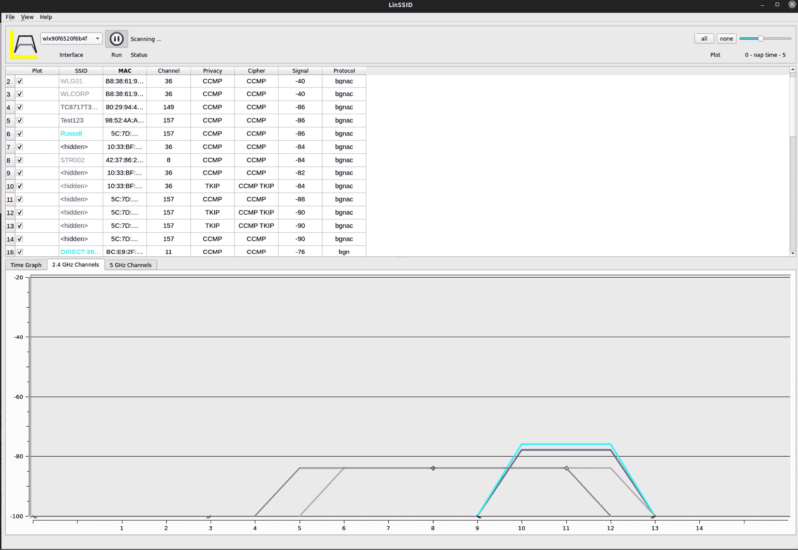

图 3.17 -在 2.4 GHz 频谱中使用更宽的信道宽度，会产生干扰

在我们已经讨论过的工具中，LinSSID 尤其适用于进行无线站点调查，您需要查看哪些频道可用，更重要的是，跟踪信号强度并找到“死点”，以最大限度地扩大整个建筑或区域的无线覆盖。 LinSSID 也是我们已经讨论过的最有帮助的工具，它可以帮助我们找到信道干扰的情况，或者故障排除在信道宽度选择不当的情况下的情况。

通过我们所讨论的内容和所探索的工具，您现在应该已经具备了很好的装备，可以排除 2.4 GHz 和 5 GHz 频段上有关无线信号强度和干扰的问题。 您应该能够使用工具,如天命找到隐藏 ssid,工具如 Wavemon 排除网络联系在一起,和工具包括 LinSSID 全面地观察到的无线频谱,寻找干扰和信号强度,以及通道宽度和通道重叠问题。

# 总结

读完本章后，您应该对 OSI 模型中描述的各种网络和应用协议的层次结构有了很好的理解。 您应该对 TCP 和 UDP 有扎实的理解，特别是这两个协议如何使用端口，以及如何建立和关闭 TCP 会话。 使用`netstat`或`ss`来查看您的主机如何连接到各种远程服务，或者您的主机正在侦听哪些服务，这是您可以在以后使用的技能。 在此基础上，使用端口扫描器查看组织中正在运行的主机和网络服务应该是一项有用的技能。 最后，我们对 Linux 无线工具的讨论应该有助于故障排除、配置和无线站点调查。 所有这些技能都将是我们在本书中继续前进的基础，但更重要的是，它们将在您的组织中对应用程序和网络问题进行故障排除时非常有用。

这就结束了我们关于使用 Linux 进行网络故障排除的讨论。 不过，我们将在大多数章节中重新讨论故障排除——随着我们继续前进并构建基础设施的每个部分，我们将发现新的潜在问题和故障排除方法。 在本节中，我们从网络和主机的角度详细讨论了通信是如何发生的。 在下一章中，我们将讨论 Linux 防火墙，这是一种限制和控制这些通信的好方法。

# 问题

正如我们总结的，这里有一个问题列表，供你测试你对本章材料的知识。 你可以在附录的*评估*部分找到答案:

1.  当您使用`netstat`、`ss`或其他命令评估本地端口时，您是否会看到一个处于`ESTABLISHED`状态的 UDP 会话?
2.  为什么能够确定哪些进程监听哪些端口如此重要?
3.  为什么确定从任何特定应用程序连接到哪个远程端口很重要?
4.  为什么要在除`tcp/443`之外的端口上扫描过期或即将过期的证书?
5.  为什么 netcat 需要`sudo`权限才能在端口`80`上启动侦听器?
6.  在 2.4 GHz 频段，哪三个通道是减少干扰的最佳选择?
7.  你什么时候会使用 20 GHz 以外的 Wi-Fi 信道宽度?

# 进一步阅读

*   OSI 模型(*ISO/IED 7498-1*):[https://standards.iso.org/ittf/PubliclyAvailableStandards/s020269_ISO_IEC_7498-1_1994(E).zip](https://standards.iso.org/ittf/PubliclyAvailableStandards/s020269_ISO_IEC_7498-1_1994(E).zip)
*   Nmap:[https://nmap.org/](https://nmap.org/)
*   The Nmap reference guide: [https://nmap.org/book/man.html](https://nmap.org/book/man.html)

    [https://www.amazon.com/Nmap-Network-Scanning-Official-Discovery/dp/0979958717](https://www.amazon.com/Nmap-Network-Scanning-Official-Discovery/dp/0979958717)

*   [https://github.com/robertdavidgraham/masscan](https://github.com/robertdavidgraham/masscan)*************