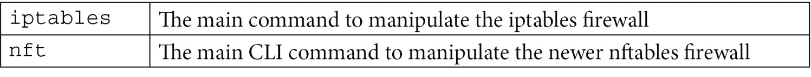
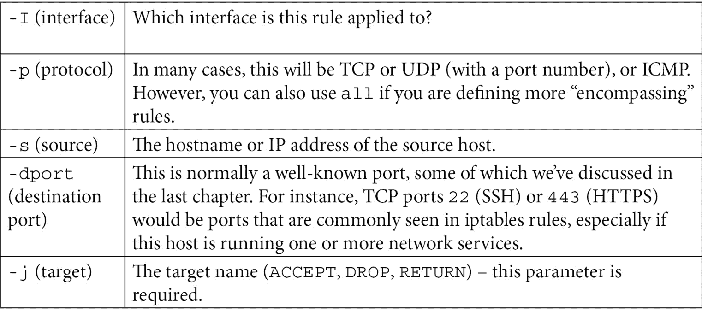
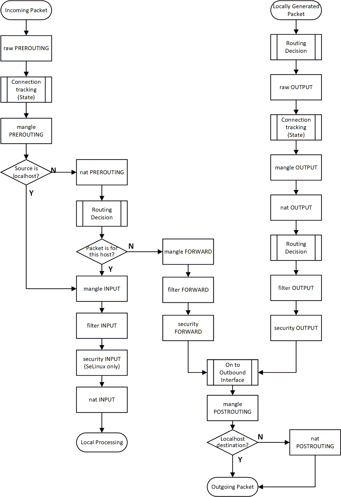

# 四、Linux 防火墙

Linux 几乎总是有一个集成的防火墙供管理员使用。 使用本机防火墙工具，您可以使用地址转换或代理服务器构建传统的外围防火墙。 然而，这些并不是现代数据中心的典型用例。 现代基础设施中主机防火墙的典型用例如下:

*   入站访问控制，以限制对管理接口的访问
*   入站访问控制，以限制对其他已安装服务的访问
*   在安全暴露、泄露或其他事件之后，记录对任何后续事件响应的访问

虽然出口过滤(出站访问控制)当然是推荐的，但这通常是在网络边界上实现的——在 vlan 之间的防火墙和路由器上，或者面对不太可信的网络，如公共互联网。

在本章中，我们将重点实现一组规则，这些规则控制对主机的访问，主机实现了用于一般访问的 web 服务，以及用于管理访问的 SSH 服务。

在本章中，我们将涵盖以下主题:

*   配置 iptables
*   配置 nftables

# 技术要求

为了遵循本章中的例子，我们将继续在现有的 Ubuntu 主机或虚拟机上进行构建。 在这一章中，我们将重点关注 Linux 防火墙，因此第二台主机可能会方便地测试您的防火墙更改。

当我们通过各种防火墙配置工作时，我们将只使用两个主要的 Linux 命令:



# 配置 iptables

在撰写本文时(2021 年)，我们正在防火墙架构上不断变化。 iptables 仍然是许多发行版的默认主机防火墙，包括我们的 Ubuntu 发行版。 然而，业界已经开始转向一种新的架构，nftables (Netfilter)。 例如，Red Hat 和 CentOS v8(在 Linux 内核 4.18 上)将 nftables 作为它们的默认防火墙。 仅供参考，当 iptables 在内核 3.13 版本中引入时(大约在 2014 年)，它转而取代了`ipchains`包(在 1999 年内核 2.2 版本中引入)。 迁移到新命令的主要原因是要迁移到更一致的命令集，提供对 IPv6 的更好支持，并使用 api 为配置操作提供更好的编程支持。

虽然 nftables 架构确实有一些优势(我们将在本章中介绍)，但目前的 iptables 方法有几十年的惯性。 整个自动化框架和产品都基于 iptables。 一旦我们了解了语法，您就会发现这看起来是可行的，但请记住，Linux 主机的使用寿命通常长达几十年——想想收银机、医疗设备、电梯控制器或与 plc 等制造设备一起工作的主机。 在许多情况下，这些长期存在的主机可能不会被配置为自动更新，因此根据组织类型，在任何时候，您都可以轻松地期望使用具有 5、10 或 15 年前完整 OS 版本的主机。 此外，由于这些设备的性质，即使它们连接到网络，它们也可能不会被列为“计算机”。 这意味着，尽管在任何特定发行版的新版本上，默认防火墙从 iptables 迁移到 nftables 的过程可能会很快，但在未来的许多年里，仍会有许多遗留主机将运行 iptables。

现在我们知道了 iptables 和 nftables 是什么，让我们开始配置它们，从 iptables 开始。

## iptables 从高水平

表是一个 Linux 防火墙应用，在大多数现代发行版中由默认安装。 如果启用它，它将管理所有进出主机的流量。 正如您在 Linux 上所期望的那样，防火墙配置在一个文本文件中，它被组织到表中，表由称为**链的规则集**组成。

当数据包匹配规则时，规则结果将成为目标。 目标可以是另一个链，也可以是以下三个主要操作之一:

*   **Accept**:表示报文通过。
*   **Drop**:丢包; 它没有通过。
*   **Return**:停止数据包遍历该链; 告诉它回到上一个链。

其中一个默认表是，称为**filter**。 这个表有三个默认链:

*   **Input**:控制进入主机的报文
*   **Forward**:处理入方向转发到其他地方的报文
*   **Output**:处理离开主机的报文

另外两个默认的表是**NAT**和**Mangle**。

与使用新命令时一样，请查看 iptables 手册页面，并快速查看 iptables 帮助文本。 为了便于阅读，可以使用`iptables -- help | less`通过`less`命令运行帮助文本。

缺省情况下，没有配置 iptables。 我们可以从`iptables –L -v`(for "list")中看到，三个默认链中都没有规则:

```sh
robv@ubuntu:~$ sudo iptables -L -v
Chain INPUT (policy ACCEPT 254 packets, 43091 bytes)
 pkts bytes target     prot opt in     out     source               destination 
Chain FORWARD (policy ACCEPT 0 packets, 0 bytes)
 pkts bytes target     prot opt in     out     source               destination 
Chain OUTPUT (policy ACCEPT 146 packets, 18148 bytes)
 pkts bytes target     prot opt in     out     source               destination
```

我们可以看到服务正在运行，但是`INPUT`和`OUTPUT`链上的数据包和字节是非零的，并且在增加。

为了向链中添加规则，我们使用`-A`参数。 这个命令可以有几个参数。 常用参数如下:



例如，这两条规则允许来自网络`1.2.3.0/24`的主机连接到我们主机上的`tcp/22`端口，并且允许任何东西连接到`tcp/443`:

```sh
sudo iptables -A INPUT -i ens33 -p tcp  -s 1.2.3.0/24 --dport 22  -j ACCEPT
sudo iptables -A INPUT -p tcp --dport 443 -j ACCEPT
```

端口`tcp/22`是 SSH 服务，`tcp/443`是 HTTPS 服务，但是如果您选择在这两个端口上运行其他服务，那么没有什么可以阻止您。 当然，如果在这些端口上没有运行任何东西，那么这些规则就没有意义了。

执行后，让我们再次查看规则集。 我们将使用`- -line-numbers`添加行号，并使用`–n`跳过地址的任何 DNS 解析(用于数字):

```sh
robv@ubuntu:~$ sudo iptables -L -n -v --line-numbers
Chain INPUT (policy ACCEPT 78 packets, 6260 bytes)
num   pkts bytes target     prot opt in     out     source               destination
1        0     0 ACCEPT     tcp  --  ens33  *       1.2.3.0/24            0.0.0.0/0            tcp dpt:22
2        0     0 ACCEPT     tcp  --  *      *       0.0.0.0/0             0.0.0.0/0            tcp dpt:443
Chain FORWARD (policy ACCEPT 0 packets, 0 bytes)
num   pkts bytes target     prot opt in     out     source               destination
Chain OUTPUT (policy ACCEPT 56 packets, 6800 bytes)
num   pkts bytes target     prot opt in     out     source               destination
```

规则列表是按从上到下的顺序处理的，因此，例如，如果您想要拒绝对一台主机的`https`服务器的访问，而允许对其他服务器的访问，那么您可以在`INPUT`说明符中添加一个行号。 注意，我们在下面代码块的第二个命令中修改了`List`语法——我们只指定了`INPUT`规则，还指定了`filter`表(如果不指定任何内容，则为默认值):

```sh
sudo iptables -I INPUT 2 -i ens33 -p tcp  -s 1.2.3.5 --dport 443 -j DROP
robv@ubuntu:~$ sudo iptables -t filter -L INPUT --line-numbers
Chain INPUT (policy ACCEPT)
num  target     prot opt source               destination
1    ACCEPT     tcp  --  1.2.3.0/24           anywhere              tcp dpt:ssh
2    DROP       tcp  --  1.2.3.5              anywhere              tcp dpt:https
3    ACCEPT     tcp  --  anywhere             anywhere              tcp dpt:https
```

在前面的示例中，我们使用`–I`参数在链中的特定位置插入规则。 但是，如果您计划好了一些事情并按顺序构建规则集，您可能会发现使用`–A`(append)参数更容易，它将规则添加到列表的底部。

在源文件中，您可以定义主机而不是子网，可以只定义 IP 地址(不带掩码)，也可以定义一系列地址，例如`--src-range 192.168.122.10-192.168.122.20`。

这个概念可以用来保护在服务器上运行的特定服务。 例如，您通常希望将允许管理访问(例如 SSH)的端口的访问限制为只允许该主机的管理员访问，但允许更广泛地访问主机上的主应用(例如 HTTPS)。 假设服务器的管理员在`1.2.3.0/24`子网中，我们刚刚定义的规则就是一个开始。 然而，我们忽略的是阻止人们从其他子网连接到 SSH 的“拒绝”:

```sh
sudo iptables -I INPUT 2 -i ens33 -p tcp  --dport 22 -j DROP
```

这些规则很快就会变得复杂起来。 最好养成将协议规则“分组”在一起的习惯。 在我们的示例中，我们保持 SSH 彼此相邻并按逻辑顺序排列，HTTPS 规则也是如此。 你会希望每个协议/端口的默认操作是在每个组的最后，除了前面的例外:

```sh
sudo iptables –L
Chain INPUT (policy ACCEPT)
num  target     prot opt source               destination
1    ACCEPT     tcp  --  1.2.3.0/24           anywhere              tcp dpt:ssh
2    DROP       tcp  --  anywhere             anywhere              tcp dpt:ssh
3    DROP       tcp  --  1.2.3.5              anywhere              tcp dpt:https
4    ACCEPT     tcp  --  anywhere             anywhere              tcp dpt:https
```

由于规则是按顺序处理的，出于性能原因，您将希望将最常“命中”的规则放在列表的顶部。 所以，在我们的例子中，我们可能把规则放反了。 在许多服务器上，您可能宁愿将应用端口(在本例中为`tcp/443`)放在列表的顶部，而将管理权限(通常会看到较小的流量流量)放在列表的底部。

要按编号删除特定的规则(例如，如果有`INPUT`规则 5)，使用以下命令:

```sh
sudo iptables –D INPUT 5
```

因为在本书中，网络管理员应该关注安全性，所以请记住，限制使用 iptables 的流量只是整个过程的前半部分。 除非启用 iptables 日志，否则我们无法回顾过去发生的事情。 将`-j LOG`添加到规则中，记录该规则的日志。 除了只记录日志之外，我们还可以使用`- -log-level`参数添加一个日志级别，使用`- -log-prefix 'text goes here'`添加一些描述性文本。 你能从中得到什么呢?

*   记录允许的 SSH 会话使我们能够跟踪可能正在对我们主机上的管理服务进行端口扫描的人。
*   记录被阻止的 SSH 会话，跟踪试图从非管理子网连接到管理服务的用户。
*   记录成功和失败的 HTTPS 连接允许我们在排除故障时将 web 服务器日志与本地防火墙日志关联起来。

要只记录一切，使用以下:

```sh
sudo iptables –A INPUT –j LOG
```

要只记录来自一个子网的流量，使用以下方法:

```sh
sudo iptables –A input –s 192.168.122.0/24 –j LOG
```

要添加日志级别和一些描述性文本，请使用以下方法:

```sh
sudo iptables -A INPUT –s 192.168.122.0/24 –j LOG - -log-level 3 –log-prefix '*SUSPECT Traffic Rule 9*'
```

日志去哪里了? 在 Ubuntu(我们的示例操作系统)中，它们被添加到`/var/log/kern.log`中。 在 Red Hat 或 Fedora 中，请参见`/var/log/messages`。

我们还应该考虑做什么? 就像信息技术中的其他东西一样，如果您可以构建一个东西并让它本身有文档，那么通常可以省去编写单独的文档(通常在完成后几天就过时了)。 要添加注释，只需将`–m comment - -comment "Comment Text Here"`添加到任何规则。

因此，对于我们的小型四规则防火墙表，我们将为每个规则添加注释:

```sh
sudo iptables -A INPUT -i ens33 -p tcp  -s 1.2.3.0/24 --dport 22  -j ACCEPT -m comment --comment "Permit Admin" 
sudo iptables -A INPUT -i ens33 -p tcp  --dport 22  -j DROP -m comment --comment "Block Admin" 
sudo iptables -I INPUT 2 -i ens33 -p tcp  -s 1.2.3.5 --dport 443 -j DROP -m comment --comment "Block inbound Web"
sudo iptables -A INPUT -p tcp --dport 443 -j ACCEPT -m comment --comment "Permit all Web Access"
sudo iptables -L INPUT
Chain INPUT (policy ACCEPT)
target     prot opt source               destination
ACCEPT     tcp  --  1.2.3.0/24           anywhere              tcp dpt:ssh /* Permit Admin */
DROP       tcp  --  anywhere             anywhere              tcp dpt:ssh /* Block Admin */
DROP       tcp  --  1.2.3.5              anywhere              tcp dpt:https /* Block inbound Web */
ACCEPT     tcp  --  anywhere             anywhere              tcp dpt:https /* Permit all Web Access */
```

关于 iptables 规则的最后一点提示:有一个默认规则，它是链中的最后一个条目，称为`default policy`。 默认值为`ACCEPT`，因此如果一个包一直到达列表的底部，它将被接受。 如果您计划拒绝一些流量，然后允许其余的流量，这是通常期望的行为——例如，如果您正在保护一个“大多数公共”服务，如大多数 web 服务器。

但是，如果期望的行为是允许一些流量，然后拒绝其余流量，您可能需要将该默认策略更改为`DENY`。 要对`INPUT`链进行此更改，请使用`iptables –P INPUT DENY`命令。 **在您考虑进行此更改之前，有一个重要的警告**:如果您是远程连接(例如通过 SSH)，在您的规则集完成之前不要进行此更改。 如果您在制定至少允许自己会话的规则之前进行此更改，那么您将阻塞当前会话(以及任何后续的远程访问)。 这就是“不要砍掉你所坐的树枝”的警告。 正是在这种情况下，默认策略的默认设置为`ACCEPT`。

但是，您总是可以添加一个最终规则，允许所有或拒绝所有来覆盖缺省策略(不管它是什么)。

现在我们已经有了一个基本的规则集，就像很多东西一样，您需要记住这个规则集不是永久的——它只是在内存中运行，所以在系统重新启动时它不会存在。 您可以使用`iptables-save`命令轻松地保存规则。 如果在配置中出现了错误，并且希望在不重新加载的情况下恢复到已保存的表，那么总是可以使用`iptables-restore`命令。 虽然这些命令在 Ubuntu 发行版中是默认安装的，但是您可能需要安装一个包来将它们添加到其他发行版中。 例如，在基于 debian 的发行版中，检查或安装`iptables-persistent`包，或者在基于 Red hat 的发行版中，检查或安装`iptables-services`包。

现在我们对基本的 permit 和 deny 规则有了严格的处理，让我们研究一下**网络地址转换**(**NAT**)表。

## NAT 表

NAT 用于转换来自(或前往)一个 IP 地址或子网的流量，并使其显示为另一个 IP 地址或子网。

这可能是最常见的 internet 网关或防火墙，其中“内部”地址在一个或多个 RFC1918 范围内，而“外部”接口连接到整个 internet。 在本例中，内部子网将被转换为可路由的 internet 地址。 在许多情况下，所有的内部地址都将映射到一个单一的“外部”地址，即网关主机的外部 IP。 在这个例子中,这是通过映射每个元组”(源 IP、源端口、目的 IP,目的港,和协议)到一个新的元组,在源 IP 现在是一个可路由的 IP 之外,和源端口只是下一个免费的源端口和协议(目的地值保持不变)。

防火墙在内存中的“NAT 表”中保持这个从内部元组到外部元组的映射。 当返回的流量到达时，它使用这个表将流量映射回真实的内部源 IP 和端口。 如果某一 NAT 表项是针对某一 TCP 会话的，则 TCP 会话拆除过程会移除该 NAT 表项的映射。 如果一个特定的 NAT 表项是针对 UDP 流量的，该表项通常在一段时间不活跃后被删除。

这看起来像真的吗? 让我们用一个内部网络的例子`192.168.10.0/24`和一个 NET 配置，其中所有内部主机都有这个“过载 NAT”配置，所有使用网关主机的外部接口:


图 4.1 - Linux 作为外围防火墙

让我们说得更具体一点。 我们将添加一个主机`192.168.10.10`，该主机向`8.8.8.8`发出 DNS 查询:


图 4.2 -周界防火墙示例，显示 NAT 和状态(会话跟踪或映射)

那么，使用这个例子，我们的配置是什么样子的? 它就像下面这样简单:

```sh
iptables -t nat -A POSTROUTING -o eth1 -j MASQUERADE
```

这告诉网关主机使用`eth1`的 IP 地址伪装所有离开接口`eth1`的流量。 `POSTROUTING`关键字告诉它使用`POSTROUTING`链，这意味着这个`MASQERADE`操作在包路由之后发生。

当我们开始引入加密时，操作是在路由之前还是路由之后开始产生更大的影响。 例如，如果我们在 NAT 操作之前或之后加密流量，这可能意味着流量在一个实例中加密，但在另一个实例中不加密。 因此，在这种情况下，出站 NAT 将是相同的前或后路由。 开始定义顺序是一个好主意，这样就不会产生混淆。

有数百种变体，但在这一点上最重要的是你已经掌握了 NAT 如何工作的基础知识(特别是映射过程)。 让我们离开的 NAT 示例，看看 mangle 表是如何工作的。

## 热轧台

mangle 表用于手动调整 IP 数据包中的值，因为它通过我们的 Linux 主机。 让我们考虑一个简单的例子,用我们的防火墙前一节的例子,如果互联网上行接口`eth1`使用**数字用户线(DSL**【显示】)服务或卫星链接吗? 这两种技术都不能处理标准以太网`1500`字节数据包。 例如，DSL 链路通常有一些封装开销，而卫星链路只是使用较小的包(以便任何单包错误影响较小的流量)。****

 **“没问题，”你说。 “当会话启动时，会有一个完整的 MTU“发现”过程，在这个过程中，通信的两台主机会计算出双方之间最大的数据包可能是多少。” 然而，特别是在较旧的应用或特定的 Windows 服务中，这个过程会中断。 另一件可能导致这种情况的事情是，如果运营商网络由于某些原因阻塞了 ICMP。 这可能看起来像是一个极端的特殊情况，但在实践中，它出现得相当频繁。 特别是在使用遗留协议时，经常会看到这个 MTU 发现过程中断。 在这种情况下，热轧机是你的朋友!

这个例子告诉 mangle 表“当你看到一个`SYN`数据包，调整**最大段大小**(**MSS**)到一些更低的数字(我们在这个例子中使用`1412`):

```sh
iptables -t mangle -A FORWARD -p tcp --tcp-flags SYN,RST SYN -j TCPMSS --set-mss 1412
```

如果你真的在计算构型，你如何得到这个“更小的数字”? 如果 ICMP 正在通过，可以使用以下方法:

```sh
ping –M do –s 1400 8.8.8.8
```

这告诉`ping`，“不要对数据包进行分片; 发送一个以`8.8.8.8`为目的地的`1400`字节大小的数据包。

通常情况下，要想找到“真正的”大小，就需要进行“捕猎-啄”的过程。 请记住，在这个大小中包含了 28 个字节的包头。

或者如果 ICMP 不能工作，您可以使用`nping`(来自我们的 NMAP 部分)。 在这里，我们告诉`nping`使用 TCP，端口`53`，**不片段**(**df**)，`mtu`值为`1400`，只持续 1 秒:

```sh
$ sudo nping --tcp -p 53 -df --mtu 1400 -c 1 8.8.8.8
Starting Nping 0.7.80 ( https://nmap.org/nping ) at 2021-04-22 10:04 PDT
Warning: fragmentation (mtu=1400) requested but the payload is too small already (20)
SENT (0.0336s) TCP 192.168.122.113:62878 > 8.8.8.8:53 S ttl=64 id=35812 iplen=40  seq=255636697 win=1480
RCVD (0.0451s) TCP 8.8.8.8:53 > 192.168.122.113:62878 SA ttl=121 id=42931 iplen=44  seq=1480320161 win=65535 <mss 1430>
```

在这两种情况下(`ping`和`nping`),你在寻找工作的人数最多(`nping`的情况下,将最多,你还看到`RCVD`包)确定帮助 MSS 数量。

从这个示例中可以看到，mangle 表很少被使用。 通常你插入或删除特定位包——例如,你可以通过交通类型,设置**的服务类型**(**TOS)或**差异化服务领域 CodePoint**(【显示】**DSCP)包位, 告诉上游承运人特定的流量可能需要什么样的服务质量。****

 **既然我们已经介绍了 iptables 中的一些默认表，那么让我们讨论为什么在构建复杂的表时保持操作顺序是至关重要的。

## iptables 中的操作顺序

在讨论了一些主要 iptables 之后，为什么操作的顺序很重要? 我们已经讨论了一个实例——如果您使用 IPSEC 加密流量，通常会有一个“匹配列表”来定义要加密的流量。 通常，在 NAT 表处理流量之前，您希望它匹配流量。

类似地，您可能正在执行基于策略的路由。 例如，您可能希望根据源、目的地和协议匹配流量，并且，例如，在每包成本较低的链路上转发备份流量，在速度和延迟特性较好的链路上转发常规流量。 你通常也想在 NAT 之前做这个决定。

有几个图可用来计算出 iptables 操作以何种顺序发生。 我通常指的是由*Phil Hagen*在[https://stuffphilwrites.com/wp-content/uploads/2014/09/FW-IDS-iptables-Flowchart-v2019-04-30-1.png](https://stuffphilwrites.com/wp-content/uploads/2014/09/FW-IDS-iptables-Flowchart-v2019-04-30-1.png)中维护的一个:



图 4.3 - iptables 中的操作顺序

如您所见，配置、处理，特别是调试 iptables 配置可能会变得极其复杂。 在本章中，我们将重点关注输入表，特别是用于限制或允许对主机上运行的服务的访问。 当我们继续讨论在 Linux 上运行的各种服务时，您应该能够使用这些知识来了解在您的环境中哪些地方可以使用输入规则来保护服务。

有了 iptables，你下一步可以去哪里? 与往常一样，再次查看手册页—大约有 100 页的语法和示例，如果您想深入了解这个特性，iptables 手册页是一个很好的参考资料。 例如，正如我们所讨论的，您可以只使用 iptables 和一些静态路由就可以将 Linux 主机作为路由器或基于 nat 的防火墙运行。 但是，这些不是普通数据中心的普通用例。 在 Linux 主机上运行这样的特性是很常见的，但在大多数情况下，您会看到这些特性在预先打包的 Linux 发行版上执行，比如 VyOS 发行版或路由器的 FRR/Zebra 包，或者 pfSense 或 OPNsense 防火墙发行版。

掌握了 iptables 的基础知识之后，让我们来处理 nftables 防火墙的配置。

# 配置 nftables

正如我们在本章开头的中所讨论的，iptables 在 Linux 中正在被弃用并最终退役，取而代之的是 nftables。 考虑到这一点，使用 nftable 有什么好处?

部署 nftables 规则比部署 iptables 要快得多——在底层，iptables 在添加每条规则时修改内核。 这在 nftables 中不会发生。 与此相关，nftables 也有一个 API。 这使得使用编制或“网络即代码”工具进行配置更加容易。 这些工具包括 Terraform、Ansible、Puppet、Chef 和 Salt 等应用。 这使得系统管理员可以更容易地自动化主机的部署，因此可以在几分钟内将一个新的虚拟机部署到私有或公共云中，而不是在几小时内。 更重要的是，可能涉及多个主机的应用可以并行部署。

nftables 在 Linux 内核中的运行效率也高得多，因此对于任何给定的规则集，您都可以指望 nftables 占用更少的 CPU。 对于只有 4 条规则的规则集来说，这似乎不是什么大问题，但如果您有 40 条、400 条或 4000 条规则，或在 400 个虚拟机上有 40 条规则，这可能会很快增加!

nftables 对所有操作使用单一命令`nft`。 虽然为了兼容性可以使用 iptables 语法，但您将发现没有预定义的表或链，更重要的是，您可以在一个规则中进行多个操作。 我们还没有过多地讨论 IPv6，但是 iptables 本身并不能处理 IPv6(您需要为此安装一个新的包:ip6tables)。

在介绍了基础知识之后，让我们深入了解命令行和使用`nft`命令配置 nftables 防火墙的细节。

## nftables 基本配置

此时，查看 nftables 的手册页可能是明智的。 另外，查看主 nftables 命令`nft`的手册页。 本手册甚至比 iptables 更冗长和复杂; 它有 600 多页长。

记住这一点，让我们部署与为 iptables 所做的相同的示例配置。 到目前为止，在大多数数据中心中最常见的 Linux 防火墙是使用直接的`INPUT`防火墙来保护主机。

首先，确保记录现有的 iptables 和 ip6tables 规则(`iptables –L`和`ip6tables –L`)，然后清除这两个规则(使用`–F`选项)。 仅仅因为您可以同时运行 iptables 和 nftables，并不意味着这样做是一个好主意。 想想下一个管理这个主机的人; 他们会看到一个或另一个防火墙，并认为这是所有部署。 为下一个将继承您正在处理的主机的人配置东西总是明智的!

如果您有一个现有的 iptables 规则集，特别是如果它是一个复杂的规则集，那么`iptables-translate`命令将把几个小时的工作变成几分钟的工作:

```sh
robv@ubuntu:~$ iptables-translate -A INPUT -i ens33 -p tcp  -s 1.2.3.0/24 --dport 22  -j ACCEPT -m comment --comment "Permit Admin"
nft add rule ip filter INPUT iifname "ens33" ip saddr 1.2.3.0/24 tcp dport 22 counter accept comment \"Permit Admin\"
```

使用这种语法，我们的 iptables 规则变成了一组非常类似的 nftables 规则:

```sh
sudo nft add table filter
sudo nft add chain filter INPUT
sudo nft add rule ip filter INPUT iifname "ens33" ip saddr 1.2.3.0/24 tcp dport 22 counter accept comment \"Permit Admin\"
sudo nft add rule ip filter INPUT iifname "ens33" tcp dport 22 counter drop comment \"Block Admin\" 
sudo nft add rule ip filter INPUT iifname "ens33" ip saddr 1.2.3.5 tcp dport 443 counter drop comment \"Block inbound Web\" 
sudo nft add rule ip filter INPUT tcp dport 443 counter accept comment \"Permit all Web Access\"
```

注意，在添加规则之前，我们首先创建了一个表和一个链。 现在列出我们的规则集:

```sh
sudo nft list ruleset
table ip filter {
        chain INPUT {
                iifname "ens33" ip saddr 1.2.3.0/24 tcp dport 22 counter packets 0 bytes 0 accept comment "Permit Admin"
                iifname "ens33" tcp dport 22 counter packets 0 bytes 0 drop comment "Block Admin"
                iifname "ens33" ip saddr 1.2.3.5 tcp dport 443 counter packets 0 bytes 0 drop comment "Block inbound Web"
                tcp dport 443 counter packets 0 bytes 0 accept comment "Permit all Web Access"
        }
}
```

正如在许多 Linux 网络结构中一样，nftables 规则在这一点上并不是持久的; 它们只会存在到下一次系统重新加载(或服务重新启动)。 默认的`nftools`规则集位于`/etc/nftools.conf`中。 您可以将新规则添加到该文件中，从而使其持久存在。

特别是在服务器配置中，更新`nftools.conf`文件可能会导致非常复杂的构造。 通过将`nft`配置分解为逻辑部分并将其分解为`include`文件，可以大大简化这一过程。

## 使用包含文件

你还能做什么? 您可以设置一个“案例”结构，分段您的防火墙规则，以匹配您的网段:

```sh
nft add rule ip Firewall Forward ip daddr vmap {\
      192.168.21.1-192.168.21.254 : jump chain-pci21, \
      192.168.22.1-192.168.22.254 : jump chain-servervlan, \
      192.168.23.1-192.168.23.254 : jump chain-desktopvlan23 \
}
```

在这里，定义的三个链有它们自己的入站规则或出站规则集。

可以看到，每个规则都是一个`match`子句，然后它将匹配的流量跳转到管理子网的规则集。

您可以使用`include`语句以一种逻辑方式分离语句，而不是生成一个单一的单片 nftables 文件。 例如，这允许您为所有 web 服务器、SSH 服务器或任何其他服务器或服务类维护一个规则文件，从而最终得到许多标准`include`文件。 这些文件可以根据需要包含在每台主机的主文件中，按照逻辑顺序:

```sh
# webserver ruleset
Include "ipv4-ipv6-webserver-rules.nft"
# admin access restricted to admin VLAN only
Include "ssh-admin-vlan-access-only.nft"
```

或者,你可以让规则越来越复杂——,你有规则基于 IP 报头等领域**差异化服务代码点**(**DSCP**),是在六位包用于确定或执行【显示】的服务质量(**QOS), 特别是对于视频数据包的语音。 您还可能决定在路由之前或路由之后应用防火墙规则(如果您正在进行 IPSEC 加密，这真的很有帮助)。**

## 删除防火墙配置

在我们继续下一章之前，我们应该删除我们的防火墙配置示例，使用以下两个命令:

```sh
$ # first remove the iptables INPUT and FORWARD tables
$ sudo iptables -F INPUT
$ sudo iptables -F FORWARD
$ # next this command will flush the entire nft ruleset
$ sudo nft flush ruleset
```

# 总结

虽然许多发行版仍然将 iptables 作为其默认防火墙，但随着时间的推移，我们可以期待看到这种情况转变为新的 nftables 架构。 需要几年完成这种转变之前,甚至那么奇怪的会弹出一个“惊喜”,当你发现你没有在你的主机库存,或设备,你没有意识到基于 linux 的计算机——**物联网**(**物联网)设备如恒温器、时钟,或电梯控制。 本章让我们从这两种架构开始。**

nftables 的手册页大约有 150 页，iptables 的手册页大约有 20 页，这些文档基本上是一本独立的书。 我们只接触了工具的表面，但是在现代数据中心中，在每个主机上定义一个入口过滤器是您将看到的 nftables 的最常见用途。 然而，当您研究数据中心的安全需求时，出站和传输规则肯定会在您的策略中占有一席之地。 我希望这次讨论是你旅途上一个好的开始!

如果你发现我们在这一章中讨论的任何概念都不清楚，现在是复习它们的好时机。 在下一章中，我们将讨论 Linux 服务器和服务的整体加固方法——Linux 防火墙，当然，是这个讨论的关键部分!

# 问题

正如我们总结的，这里有一个问题列表，供你测试你对本章材料的知识。 你可以在附录的*评估*部分找到答案:

1.  如果您要开始一个新的防火墙策略，您会选择哪个方法?
2.  如何实现防火墙的中央标准?

# 进一步阅读

*   iptables 手册页:[https://linux.die.net/man/8/iptables](https://https://linux.die.net/man/8/iptables%0D)
*   iptables processing flowchart (Phil Hagen):

    [https://stuffphilwrites.com/2014/09/iptables-processing-flowchart/](https://stuffphilwrites.com/2014/09/iptables-processing-flowchart/)

    [https://stuffphilwrites.com/wp-content/uploads/2014/09/FW-IDS-iptables-Flowchart-v2019-04-30-1.png](https://stuffphilwrites.com/wp-content/uploads/2014/09/FW-IDS-iptables-Flowchart-v2019-04-30-1.png)

*   非功能性文档手册页:[https://www.netfilter.org/projects/nftables/manpage.html](https://https://www.netfilter.org/projects/nftables/manpage.html%0D)
*   nftables wiki:[https://wiki.nftables.org/wiki-nftables/index.php/Main_Page](https://https://wiki.nftables.org/wiki-nftables/index.php/Main_Page%0D)
*   *nftables in 10 minutes*:[https://wiki.nftables.org/wiki-nftables/index.php/Quick_reference-nftables_in_10_minutes](https://https://wiki.nftables.org/wiki-nftables/index.php/Quick_reference-nftables_in_10_minutes)****