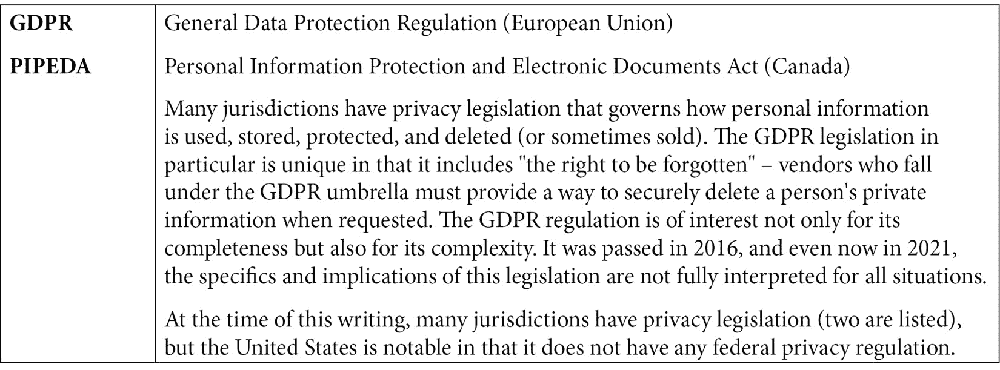
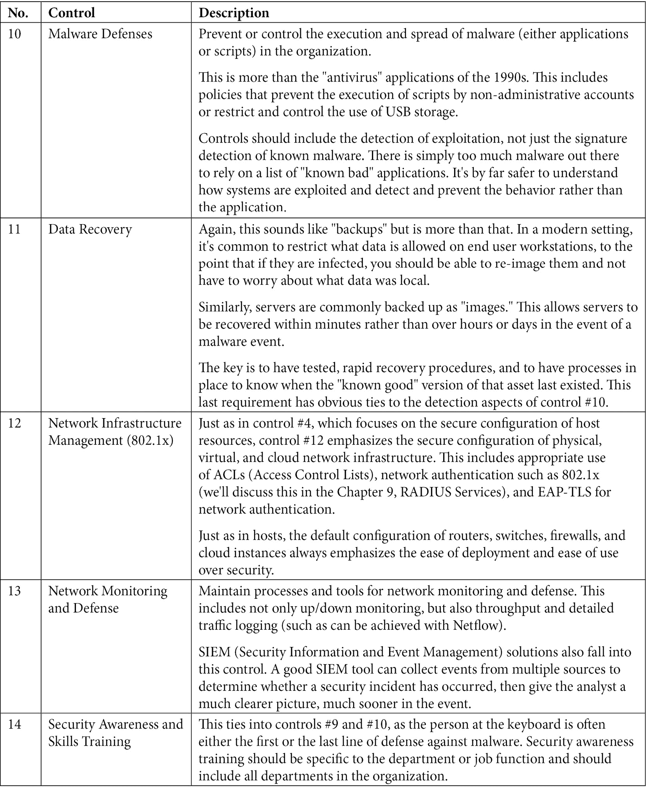
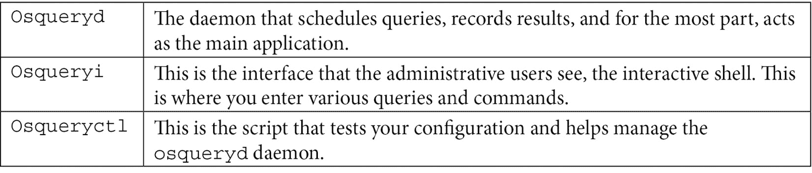

# 五、Linux 安全标准与现实生活中的例子

在本章中，我们将探讨为什么 Linux 主机，像其他主机一样，在初始安装之后——事实上，在它们的整个生命周期中——需要小心谨慎，以进一步保护它们。 在此过程中，我们将讨论各种主题，以构建保护您的 Linux 主机的最终“大图”。

本章将讨论下列主题:

*   为什么我需要保护我的 Linux 主机?
*   特定于云的安全注意事项
*   通常遇到特定于行业的安全标准
*   互联网安全中心的关键控制
*   互联网安全中心的基准
*   SELinux and AppArmor

# 技术要求

在本章中，我们将涵盖许多主题，但技术细节将集中于使用当前的 Linux 主机或虚拟机加固 SSH 服务。 正如在上一章中所述，您可能会发现第二台主机对您的更改进行测试很有用，但在示例中没有必要这样做。

# 为什么需要保护我的 Linux 主机?

与几乎所有其他操作系统一样，Linux 的安装是流线化的，以使安装更容易，在安装期间和之后尽可能少地出现故障。 正如我们在前面的章节中看到的，这通常意味着不启用防火墙的安装。 此外，操作系统版本和软件包版本当然会匹配安装介质，而不是每一个的最新版本。 在这一章中，我们将讨论 Linux 中的默认设置为何常常没有被设置为大多数人认为是安全的，以及作为一个行业，我们如何通过立法、法规和建议来纠正这种情况。

至于初始安装已经过时，幸运的是，大多数 Linux 发行版都启用了自动更新进程。 这由`/etc/apt/apt.conf.d/20auto-upgrades`文件中的两行代码控制:

```sh
APT::Periodic::Update-Package-Lists "1";
APT::Periodic::Unattended-Upgrade "1";
```

两个设置默认都被设置为`1`(启用)。 这几行是不言自明的——第一行决定是否更新包列表，第二行打开或关闭真正的自动更新。 对于可能采用“巡航控制”管理方法的桌面或服务器来说，这个默认设置并不坏。 但是请注意，`Unattended-Upgrade`行只启用安全更新。

在大多数管理良好的环境中，而不是在无人参与的升级中，您会期望看到预定的维护窗口，即升级和测试首先在不太重要的服务器上进行，然后再部署到更重要的主机上。 在这些情况下，您需要将自动更新设置设置为`0`，并使用手动或脚本化的更新过程。 对于 Ubuntu，手动更新过程包括两个命令，执行顺序如下:


这些可以合并在一行中(请参阅下一行代码)，但在升级步骤期间，您将有几个“Yes/No”提示需要回答——首先，批准整个过程和数据量。 另外，如果你的任何包在不同版本之间改变了它们的默认行为，你将被要求做出决定:

```sh
# sudo apt-get update && sudo apt-get upgrade
```

`&&`操作符依次执行命令。 只有在第一个命令成功完成时(返回码为 0)，第二个命令才会执行。

但是等等，你会说，我的一些主机是在云端的——那他们呢? 在下一节中，您将发现无论您在何处安装 Linux，它都是 Linux，并且在某些情况下，您的云实例可能没有“在数据中心”服务器模板安全。 不管你的操作系统是什么，或者你部署在哪里，更新都将是你的安全程序的关键部分。

# 特定于云的安全考虑

如果你在任何主要的云中使用默认映像旋转虚拟机，从安全的角度来看，有几件事需要考虑:

*   一些云有自动更新功能; 一些不。 然而，每个人对每个操作系统的映像总是有些过时。 在启动 VM 之后，您将需要更新它，就像更新独立主机一样。
*   大多数云服务映像也有一个主机防火墙，以某种限制性模式启用。 这两个防火墙问题对你来说意味着什么,当你把你的第一个,新的 Linux VM,别指望能够“萍”,直到你有窥主机防火墙配置(记住从最后一章——一定要检查`iptables`和`nftables`)。
*   许多云服务映像默认情况下允许从公共互联网直接进行远程访问以进行管理访问。 对于 Linux，这意味着 SSH 通过`tcp/22`。 虽然这种访问的默认设置不像早期的各种云服务提供商那样常见，但检查您的 SSH(`tcp/22`)是否对整个互联网开放仍然是明智的。
*   通常您使用的是云“服务”，而不是实际的服务器实例。 例如，无服务器数据库实例是常见的，在这种情况下，您可以完全访问和控制数据库，但托管数据库的服务器对用户或应用是不可见的。 底层服务器可能专用于您的实例，但更有可能的是，它将在多个组织之间共享。

既然我们已经讨论了内部部署和云 Linux 部署之间的一些差异，现在让我们讨论行业之间安全需求的一些差异。

# 常见的行业特定安全标准

有许多行业特定的指导和监管要求，其中一些即使您不在该行业，您也可能熟悉。 由于它们是特定于行业的，我们将在较高的级别上描述每一种——如果其中任何一种适用于您，您将知道其中每一种都值得单独写一本书(或几本书)。




虽然这些标准和法规或法律要求中的每一个都有特定于行业的重点，但许多基本的建议和要求是非常相似的。 **网络安全中心**(**CIS**) 当没有一组规则提供良好的安全指导时，经常使用“关键控制”。 事实上，这些控制经常与法规要求一起使用，以提供更好的整体安全性。

# 互联网安全关键控制中心

虽然CIS 的关键控制并不是法规遵循的标准，但对于任何组织来说，它们无疑都是一个优秀的基础和良好的工作模式。 关键控制在本质上是非常实用的——而不是遵从性驱动的，它们专注于现实世界的攻击和防御。 其理解是，如果您专注于控制，特别是，如果您按顺序关注它们，那么您的组织将很好地防御“在野外”看到的更常见的攻击。 例如，仅通过查看顺序，很明显，除非您知道网络上有哪些主机(**#1**)，否则您无法保护主机(**#3**)。 同样，如果没有主机和应用(**#2**和**#3**)的清单，日志记录(**#8**)也不会有效。 随着一个组织在名单上的名次下降，它很快就达到了不是“鹿群中最慢的羚羊”的目标。

与独联体基准一样，关键控制是由志愿者编写和维护的。 它们也会随着时间的推移而修改——这是关键，因为随着时间、操作系统和攻击的推进，世界在变化。 虽然 10 年前的威胁仍然与我们同在，但我们现在有了新的威胁，我们有了新的工具，恶意软件和攻击者使用了不同于 10 年前的方法。 本节描述关键控件的第 8 版(于 2021 年发布)，但如果您在组织中使用这些控件进行决策，请确保引用最新版本。

关键的控件(版本 8)被分为三个实现组:

**实施组 1 (IG1) -基本控制**

这些控制是组织通常开始的地方。 如果这些都到位了，那么您可以有一些保证，您的组织不再是群中最慢的羚羊*。 这些控制针对较小的 IT 团队和商业/现货硬件和软件。*

**实施组 2 (IG2) -中型企业**

实现组 2 控制扩展了 IG1 控制，为更具体的配置和技术流程添加了技术指导。 这个控制组的目标是更大的组织，其中只有一个人或一个小组负责信息安全，或者有法规遵从性要求。

**实施组 3 (IG3) -大型企业**

这些控制针对具有已建立的安全团队和过程的大型环境。 其中许多控制与组织有更多的关系——与员工和供应商合作，制定事件响应、事件管理、渗透测试和红色团队演习的政策和程序。

每个实现组都是前一个组的超集，因此 IG3 包括组 1 和组 2。 每个控件有几个子部分，并且正是这些子部分按实现组进行分类。 为一个完整的描述每个控制和实现集团的关键控制的源文档是在 T1【免费下载】https://www.cisecurity.org/controls/cis-controls-list/,与描述的点击率以及详细的 PDF 和 Excel 文档。





既然我们已经讨论了关键控制，那么如何将其转化为保护您组织中可能看到的 Linux 主机或基于 Linux 的基础设施呢? 让我们看一些具体的例子，从关键控制第 1 和第 2(硬件和软件清单)开始。

## 开始使用 CIS 关键安全控制 1 和 2

网络上的主机和运行在这些主机上的软件的精确的清单几乎是每一个安全框架的关键部分——其思想是，如果你不知道它的存在，你就无法保护它。

让我们以关键控件 1 和 2 为例，探索如何用零预算的方法为我们的 Linux 主机实现这一点。

### 关键控制 1 -硬件库存

让我们使用本机 Linux 命令来研究关键控件 1 和 2—硬件和软件清单。

硬件目录很容易获得——许多系统参数可以很容易地以文件的形式获得，位于`/proc`目录中。 文件系统是虚拟的。 `/proc`中的文件不是真正的文件; 它们反映了机器的运行特性。 例如，你可以通过查看正确的文件来获得 CPU(只有第一个 CPU 显示在这个输出中):

```sh
$ cat /proc/cpuinfo
processor       : 0
vendor_id       : GenuineIntel
cpu family      : 6
model           : 158
model name      : Intel(R) Xeon(R) CPU E3-1505M v6 @ 3.00GHz
stepping        : 9
microcode       : 0xde
cpu MHz         : 3000.003
cache size      : 8192 KB
physical id     : 0
siblings        : 1
core id         : 0
cpu cores       : 1
…
flags           : fpu vme de pse tsc msr pae mce cx8 apic sep mtrr pge mca cmov pat pse36 clflush mmx fxsr sse sse2 ss syscall nx pdpe1gb rdtscp lm constant_tsc arch_perfmon nopl xtopology tsc_reliable nonstop_tsc cpuid pni pclmulqdq ssse3 fma cx16 pcid sse4_1 sse4_2 x2apic movbe popcnt tsc_deadline_timer aes xsave avx f16c rdrand hypervisor lahf_lm abm 3dnowprefetch cpuid_fault invpcid_single pti ssbd ibrs ibpb stibp fsgsbase tsc_adjust bmi1 avx2 smep bmi2 invpcid rdseed adx smap clflushopt xsaveopt xsavec xgetbv1 xsaves arat md_clear flush_l1d arch_capabilities
bugs            : cpu_meltdown spectre_v1 spectre_v2 spec_store_bypass l1tf mds swapgs itlb_multihit srbds
bogomips        : 6000.00
…
```

记忆信息也很容易找到:

```sh
$ cat /proc/meminfo
MemTotal:        8025108 kB
MemFree:         4252804 kB
MemAvailable:    6008020 kB
Buffers:          235416 kB
Cached:          1486592 kB
SwapCached:            0 kB
Active:          2021224 kB
Inactive:         757356 kB
Active(anon):    1058024 kB
Inactive(anon):     2240 kB
Active(file):     963200 kB
Inactive(file):   755116 kB
…
```

深入研究`/proc`文件系统，我们可以在`/proc/sys/net/ipv4`中许多独立的、离散的文件中找到对各种 IP 或 TCP 参数的设置(为了更容易查看，此清单已完成并格式化)。

通过硬件，有多种方法获取操作系统版本:

```sh
$ cat /proc/version
Linux version 5.8.0-38-generic (buildd@lgw01-amd64-060) (gcc (Ubuntu 9.3.0-17ubuntu1~20.04) 9.3.0, GNU ld (GNU Binutils for Ubuntu) 2.34) #43~20.04.1-Ubuntu SMP Tue Jan 12 16:39:47 UTC 2021
$ cat /etc/issue
Ubuntu 20.04.1 LTS \n \l
$ uname -v
#43~20.04.1-Ubuntu SMP Tue Jan 12 16:39:47 UTC 2021
```

大多数组织选择将操作系统信息放入硬件目录中，尽管将其放入该机器的软件目录中当然是正确的。 然而，在几乎每一个操作系统中，安装的应用的更新频率要比操作系统的更新频率高，这就是为什么硬件库存如此频繁地被选择的原因。 重要的是，它被记录在一个目录或另一个目录中。 在大多数系统中，硬件和软件库存系统无论如何都是相同的系统，所以这很好地解决了讨论。

对于硬件目录来说，`lshw`命令是一个很好的“给我所有东西”命令——`lshw`的手册页为我们提供了更多的选项，以便更深入地研究或在显示该命令时更具选择性。 这个命令可能会收集太多信息——你需要有选择性!

组织通常会找到一个很好的折中方案，编写一个脚本来准确收集硬件库存所需的内容——例如，下面的简短脚本对于基本硬件和操作系统库存非常有用。 它使用了我们迄今为止使用的几个文件和命令，并通过使用几个新命令对它们进行扩展:

*   `fdisk`为磁盘信息
*   `dmesg`和`dmidecode`为系统信息:

```sh
echo -n "Basic Inventory for Hostname: "
uname -n
#
echo =====================================
dmidecode | sed -n '/System Information/,+2p' | sed 's/\x09//'
dmesg | grep Hypervisor
dmidecode | grep "Serial Number" | grep -v "Not Specified" | grep -v None
#
echo =====================================
echo "OS Information:"
uname -o -r
if [ -f /etc/redhat-release ]; then
    echo -n "  "
    cat /etc/redhat-release
fi
if [ -f /etc/issue ]; then
    cat /etc/issue
fi
#
echo =====================================
echo "IP information: "
ip ad | grep inet | grep -v "127.0.0.1" | grep -v "::1/128" | tr -s " " | cut -d " " -f 3
# use this line if legacy linux
# ifconfig | grep "inet" | grep -v "127.0.0.1" | grep -v "::1/128" | tr -s " " | cut -d " " -f 3
#
echo =====================================
echo "CPU Information: "
cat /proc/cpuinfo | grep "model name\|MH\|vendor_id" | sort -r | uniq
echo -n "Socket Count: "
cat /proc/cpuinfo | grep processor | wc -l
echo -n "Core Count (Total): "
cat /proc/cpuinfo | grep cores | cut -d ":" -f 2 | awk '{ sum+=$1} END {print sum}'
#
echo =====================================
echo "Memory Information: "
grep MemTotal /proc/meminfo | awk '{print $2,$3}'
#
echo =====================================
echo "Disk Information: "
fdisk -l | grep Disk | grep dev
```

您的实验室 Ubuntu VM 的输出可能看起来像这样(本例是一个虚拟机)。 注意，我们使用的是`sudo`(主要用于`fdisk`命令，该命令需要这些权限):

```sh
$ sudo ./hwinven.sh
Basic Inventory for Hostname: ubuntu
=====================================
System Information
Manufacturer: VMware, Inc.
Product Name: VMware Virtual Platform
[    0.000000] Hypervisor detected: VMware
        Serial Number: VMware-56 4d 5c ce 85 8f b5 52-65 40 f0 92 02 33 2d 05
=====================================
OS Information:
5.8.0-45-generic GNU/Linux
Ubuntu 20.04.2 LTS \n \l
=====================================
IP information:
192.168.122.113/24
fe80::1ed6:5b7f:5106:1509/64
=====================================
CPU Information:
vendor_id       : GenuineIntel
model name      : Intel(R) Xeon(R) CPU E3-1505M v6 @ 3.00GHz
cpu MHz         : 3000.003
Socket Count: 2
Core Count (Total): 2
=====================================
Memory Information:
8025036 kB
=====================================
Disk Information:
Disk /dev/loop0: 65.1 MiB, 68259840 bytes, 133320 sectors
Disk /dev/loop1: 55.48 MiB, 58159104 bytes, 113592 sectors
Disk /dev/loop2: 218.102 MiB, 229629952 bytes, 448496 sectors
Disk /dev/loop3: 217.92 MiB, 228478976 bytes, 446248 sectors
Disk /dev/loop5: 64.79 MiB, 67915776 bytes, 132648 sectors
Disk /dev/loop6: 55.46 MiB, 58142720 bytes, 113560 sectors
Disk /dev/loop7: 51.2 MiB, 53501952 bytes, 104496 sectors
Disk /dev/fd0: 1.42 MiB, 1474560 bytes, 2880 sectors
Disk /dev/sda: 40 GiB, 42949672960 bytes, 83886080 sectors
Disk /dev/loop8: 32.28 MiB, 33845248 bytes, 66104 sectors
Disk /dev/loop9: 51.4 MiB, 53522432 bytes, 104536 sectors
Disk /dev/loop10: 32.28 MiB, 33841152 bytes, 66096 sectors
Disk /dev/loop11: 32.28 MiB, 33841152 bytes, 66096 sectors
```

有了填充硬件库存所需的信息，接下来让我们看看软件库存。

### 关键控制 2 -软件库存

要清点所有已安装的包，可以使用`apt`或`dpkg`命令。 我们将使用这个命令来获取已安装包的列表:

```sh
$ sudo apt list --installed | wc -l
WARNING: apt does not have a stable CLI interface. Use with caution in scripts.
1735
```

注意,在如此多的包,最好知道你在寻找什么,让一个特定的请求(可能通过使用`grep`命令),或为多个主机收集一切,然后使用一个数据库查找主机不匹配一个或另一个。

`dpkg`命令会给我们类似的信息:

```sh
dpkg -
Name                                 Version                 Description
====================================================================================
acpi-support               0.136.1                scripts for handling many ACPI events
acpid                      1.0.10-5ubuntu2.1      Advanced Configuration and Power Interfacee
adduser                    3.112ubuntu1           add and remove users and groups
adium-theme-ubuntu         0.1-0ubuntu1           Adium message style for Ubuntu
adobe-flash-properties-gtk 10.3.183.10-0lucid1    GTK+ control panel for Adobe Flash Player pl
.... and so on ....
```

要获取包中包含的文件，使用以下方法:

```sh
robv@ubuntu:~$ dpkg -L openssh-client
/.
/etc
/etc/ssh
/etc/ssh/ssh_config
/etc/ssh/ssh_config.d
/usr
/usr/bin
/usr/bin/scp
/usr/bin/sftp
/usr/bin/ssh
/usr/bin/ssh-add
/usr/bin/ssh-agent
….
```

要列出大多数 Red Hat 发行版的所有安装包，请使用以下命令:

```sh
$ rpm -qa
libsepol-devel-2.0.41-3.fc13.i686
wpa_supplicant-0.6.8-9.fc13.i686
system-config-keyboard-1.3.1-1.fc12.i686
libbeagle-0.3.9-5.fc12.i686
m17n-db-kannada-1.5.5-4.fc13.noarch
pptp-1.7.2-9.fc13.i686
PackageKit-gtk-module-0.6.6-2.fc13.i686
gsm-1.0.13-2.fc12.i686
perl-ExtUtils-ParseXS-2.20-121.fc13.i686
... (and so on)
```

有关特定包装的更多信息，请使用`rpm -qi`:

```sh
$ rpm -qi python
Name        : python                       Relocations: (not relocatable)
Version     : 2.6.4                             Vendor: Fedora Project
Release     : 27.fc13                       Build Date: Fri 04 Jun 2010 02:22:55 PM EDT
Install Date: Sat 19 Mar 2011 08:21:36 PM EDT      Build Host: x86-02.phx2.fedoraproject.org
Group       : Development/Languages         Source RPM: python-2.6.4-27.fc13.src.rpm
Size        : 21238314                         License: Python
Signature   : RSA/SHA256, Fri 04 Jun 2010 02:36:33 PM EDT, Key ID 7edc6ad6e8e40fde
Packager    : Fedora Project
URL         : http://www.python.org/
Summary     : An interpreted, interactive, object-oriented programming language
Description :
Python is an interpreted, interactive, object-oriented programming
....
(and so on)
```

有关所有包的更多信息(可能信息太多了)，请使用`rpm -qia`。

如您所见，这些列表是非常细粒度和完整的。 您可以选择将所有内容编入目录——即使是一个完整的文本列表(没有数据库)也很有价值。 如果有两个相似的主机，可以使用`diff`命令查看两个相似的工作站(一个工作，一个不工作)之间的差异。

或者如果您正在进行故障排除，通常会根据已知的错误检查已安装的版本，或者根据已知的安装日期检查文件日期，等等。

到目前为止所讨论的库存方法都是 Linux 本地的，但不太适合管理一组主机，甚至不能很好地管理一个主机。 让我们来探索一下 OSQuery，它是一个管理包，可以简化您可能需要遵守的许多关键控制和/或任何监管框架的进展。

## OSQuery -关键控件 1 和 2，加入控件 10 和 17

与其用维护数千行文本文件作为库存，更常见的方法是使用实际的应用或平台来维护您的库存——要么在主机上，要么在数据库中，要么在某种组合中。 OSQuery 是一个通用的平台。 它为管理员提供了一个与数据库类似的接口来访问目标主机上的活动信息。

OSQuery 是一种常见的选择，因为它在一个接口中处理最流行的 Linux 和 Unix 变体 macOS 和 Windows。 让我们深入了解这个流行平台的 Linux 端。

首先，要安装 OSQuery，我们需要添加正确的存储库。 对于 Ubuntu，使用以下方法:

```sh
$ echo "deb [arch=amd64] https://pkg.osquery.io/deb deb main" | sudo tee /etc/apt/sources.list.d/osquery.list
```

接下来，导入存储库的签名密钥:

```sh
$ sudo apt-key adv --keyserver keyserver.ubuntu.com --recv-keys 1484120AC4E9F8A1A577AEEE97A80C63C9D8B80B
```

然后，更新包列表:

```sh
$ sudo apt update
```

最后我们可以安装`osquery`:

```sh
$ sudo apt-get install osquery
```

OSQuery 有三个主要组件:



完成了安装后，让我们来探索交互式 shell。 注意，没有设置守护进程和“连接”你的各种主机，我们使用的是一个虚拟数据库，只查看我们的本地主机:

```sh
robv@ubuntu:~$ osqueryi
Using a virtual database. Need help, type '.help'
osquery> .help
Welcome to the osquery shell. Please explore your OS!
You are connected to a transient 'in-memory' virtual database.
.all [TABLE]     Select all from a table
.bail ON|OFF     Stop after hitting an error
.echo ON|OFF     Turn command echo on or off
.exit            this program
.features        List osquery's features and their statuses
.headers ON|OFF  Turn display of headers on or off
.help            Show this message
….
```

接下来让我们看看我们可用的数据库表:

```sh
osquery> .tables
  => acpi_tables
  => apparmor_events
  => apparmor_profiles
  => apt_sources
  => arp_cache
  => atom_packages
  => augeas
  => authorized_keys
  => azure_instance_metadata
  => azure_instance_tags
  => block_devices
  => bpf_process_events
  => bpf_socket_events
….
```

有几十个表跟踪各种系统参数。 让我们看看操作系统的版本，例如:

```sh
osquery> select * from os_version;
+--------+---------------------------+-------+-------+-------+-------+----------+---------------+----------+--------+
| name   | version                   | major | minor | patch | build | platform | platform_like | codename | arch   |
+--------+---------------------------+-------+-------+-------+-------+----------+---------------+----------+--------+
| Ubuntu | 20.04.1 LTS (Focal Fossa) | 20    | 4     | 0     |       | ubuntu   | debian        | focal    | x86_64 |
```

或者，收集本地接口 IP和子网掩码(不包括环回)，使用如下方法:

```sh
osquery> select interface,address,mask from interface_addresses where interface NOT LIKE '%lo%';
+-----------+---------------------------------+-----------------------+
| interface | address                         | mask                  |
+-----------+---------------------------------+-----------------------+
| ens33     | 192.168.122.170                 | 255.255.255.0         |
| ens33     | fe80::1ed6:5b7f:5106:1509%ens33 | ffff:ffff:ffff:ffff:: |
+-----------+---------------------------------+-----------------------+
```

或者，为了获取本地 ARP 缓存，使用以下方法:

```sh
osquery> select * from arp_cache;
+-----------------+-------------------+-----------+-----------+
| address         | mac               | interface | permanent |
+-----------------+-------------------+-----------+-----------+
| 192.168.122.201 | 3c:52:82:15:52:1b | ens33     | 0         |
| 192.168.122.1   | 00:0c:29:3b:73:cb | ens33     | 0         |
| 192.168.122.241 | 40:b0:34:72:48:e4 | ens33     | 0         |
```

或者，列出已安装的包(注意此输出的上限为 2):

```sh
osquery> select * from deb_packages limit 2;
+-----------------+--------------------------+--------+------+-------+-------------------+----------------------+-----------------------------------------------------------+---------+----------+
| name            | version                  | source | size | arch  | revision          | status               | maintainer                                                | section | priority |
+-----------------+--------------------------+--------+------+-------+-------------------+----------------------+-----------------------------------------------------------+---------+----------+
| accountsservice | 0.6.55-0ubuntu12~20.04.4 |        | 452  | amd64 | 0ubuntu12~20.04.4 | install ok installed | Ubuntu Developers <ubuntu-devel-discuss@lists.ubuntu.com> | admin   | optional |
| acl             | 2.2.53-6                 |        | 192  | amd64 | 6                 | install ok installed | Ubuntu Developers <ubuntu-devel-discuss@lists.ubuntu.com> | utils   | optional |
+-----------------+--------------------------+--------+------+-------+-------------------+----------------------+-----------------------------------------------------------+---------+----------+
```

您可以也可以查询正在运行的进程(显示上限为 10):

```sh
osquery> SELECT pid, name FROM processes order by start_time desc limit 10;
+-------+----------------------------+
| pid   | name                       |
+-------+----------------------------+
| 34790 | osqueryi                   |
| 34688 | sshd                       |
| 34689 | bash                       |
| 34609 | sshd                       |
| 34596 | systemd-resolve            |
| 34565 | dhclient                   |
| 34561 | kworker/0:3-cgroup_destroy |
| 34562 | kworker/1:3-events         |
| 34493 | kworker/0:0-events         |
| 34494 | kworker/1:2-events         |
+-------+----------------------------+
```

我们可以向过程列表添加额外的信息。 让我们为每个进程添加`SHA256`哈希值。 哈希是唯一标识数据的数学函数。 例如，如果有两个名称不同但哈希值相同的文件，它们很可能是相同的。 虽然总有一个小的可能性，你会得到一个哈希“冲突”(相同的哈希为两个不相同的文件)，再次哈希他们与不同的算法消除任何不确定性。 哈希数据工件广泛应用于法医学——特别是在收集证据以证明监护链的完整性方面。

即使在法医分析中，单个哈希值通常也足以确定唯一性(或不唯一性)。

这对运行进程意味着什么? 如果你的恶意软件在每个实例中使用一个随机的名称来逃避检测，在所有 Linux 主机的 RAM 中散列进程可以让你在不同的主机上以不同的名称运行的相同进程:

```sh
osquery> SELECT DISTINCT h.sha256, p.name, u.username
    ...> FROM processes AS p
    ...> INNER JOIN hash AS h ON h.path = p.path
    ...> INNER JOIN users AS u ON u.uid = p.uid
    ...> ORDER BY start_time DESC
    ...> LIMIT 5;
+------------------------------------------------------------------+-----------------+----------+
| sha256                                                           | name            | username |
+------------------------------------------------------------------+-----------------+----------+
| 45fc2c2148bdea9cf7f2313b09a5cc27eead3460430ef55d1f5d0df6c1d96 ed4 | osqueryi        | robv     |
| 04a484f27a4b485b28451923605d9b528453d6c098a5a5112bec859fb5f2 eea9 | bash            | robv     |
| 45368907a48a0a3b5fff77a815565195a885da7d2aab8c4341c4ee869af4 c449 | gvfsd-metadata  | robv     |
| d3f9c91c6bbe4c7a3fdc914a7e5ac29f1cbfcc3f279b71e84badd25b313f ea45 | update-notifier | robv     |
| 83776c9c3d30cfc385be5d92b32f4beca2f6955e140d72d857139d2f7495 af1e | gnome-terminal- | robv     |
+------------------------------------------------------------------+-----------------+----------+
```

该工具在事件响应情况下尤其有效。 通过我们在这几页中列出的查询，我们可以快速找到具有特定操作系统或软件版本的主机——换句话说，我们可以找到容易受到特定攻击的主机。 此外，我们可以收集所有运行进程的哈希值，以找到可能伪装成良性进程的恶意软件。 所有这些都可以通过几个查询来完成。

最后一节介绍了关键控件中的高级指令，并将它们转换为 Linux 中的“具体细节”命令来实现这些目标。 让我们看看这与更规范的操作系统或特定于应用的安全指导有何不同——在本例中，是将 CIS 基准应用于主机实现。

# 互联网安全基准中心

CIS 发布了描述任意数量基础设施组件的安全配置的安全基准。 这包括几个不同 Linux 发行版的所有方面，以及可能部署在 Linux 上的许多应用。 这些基准测试非常“规定性”——基准测试中的每个建议都描述了问题，如何使用操作系统命令或配置解决问题，以及如何审计设置的当前状态。

独联体基准的一个非常吸引人的特点是，它们是由行业专家小组编写和维护的，他们自愿贡献自己的时间，使互联网成为一个更安全的地方。 虽然供应商确实参与了这些文档的开发，但它们是团队的工作，最终的建议需要团队的一致意见。 最终的结果是一个与供应商无关的、共识和社区驱动的文档，具有非常具体的建议。

创建 CIS 基准既是为了构建更好的平台(无论平台是什么)，也是为了对其进行审计，所以每个建议都有一个补救和一个审计部分。 对每个基准测试的详细说明是关键，这样管理员不仅能够清楚地了解它们在更改什么，而且能够清楚地了解更改的原因。 这一点很重要，因为并不是所有建议都适用于所有情况，事实上，有时建议会相互冲突，或者导致特定的内容不能在目标系统上工作。 这些情况在出现时的文档中进行了描述，但这强调了不要将所有建议都实现到最大潜力的重要性! 它还清楚地表明，在审计情况下，争取“100%”并不符合任何人的最佳利益。

这些基准测试的另一个关键特性是，它们通常是一个基准测试中的两个基准——将会有针对“常规”组织的建议，以及针对更高安全性环境的更严格的建议。

独联体并保持一个审计程序**CIS-CAT**(**配置评估工具**),评估基础设施对其基准,但许多行业标准工具,如安全扫描仪(比如 Nessus)和自动化工具(如 Ansible 傀儡, 或 Chef)将根据适用的 CIS 基准评估目标基础设施。

现在我们理解了基准测试的目的，让我们看一下 Linux 基准测试，特别是该基准测试中的一组建议。

## 在 Linux 上应用 CIS 基准-安全 SSH

当保护服务器、工作站或基础设施平台时，有一个您想要保护的东西的列表以及如何实现它是很有帮助的。 这就是独联体基准的目的。 如前所述，您可能永远无法在任何一台主机上完全实现 CIS 基准测试中的所有建议——安全建议通常会损害或禁用您可能需要的服务，有时建议会相互冲突。 这意味着通常要仔细评估基准，并将其用作特定于组织的构建文档的主要输入。

让我们使用 Ubuntu 20.04 的 CIS 基准来保护主机上的 SSH 服务。 SSH 是远程连接和管理 Linux 主机的主要方法。 这使得保护 Linux 主机上的 SSH 服务器成为一项重要任务，而且通常是网络连接建立后的第一个配置任务。

首先，下载基准测试——所有平台的基准测试文档位于[https://www.cisecurity.org/cis-benchmarks/](https://www.cisecurity.org/cis-benchmarks/)。 如果你没有运行 Ubuntu 20.04，下载最接近你发行版的基准测试。 您会发现 SSH 是一种非常常见的服务，以至于保护 SSH 服务的建议在发行版之间非常一致，并且在非 linux 平台上通常有匹配的建议。

在我们开始之前，请更新回购列表并升级操作系统包—再次注意我们是如何同时运行两个命令的。 使用一个`&`终结者命令在后台运行,但使用`&&`两个命令按顺序运行,第二个执行当第一个完成成功(也就是说,如果它有一个“返回值”零):

```sh
$ sudo apt-get update && sudo apt-get upgrade
```

您可以在`bash man`页面(执行`man bash`)了解更多信息。

现在操作系统组件已经更新，让我们安装 SSH 守护进程，因为它在 Ubuntu 上没有默认安装:

```sh
$ sudo apt-get install openssh-server
```

在现代 Linux 发行版中，这将安装 SSH 服务器，然后进行基本配置并启动服务。

现在让我们来确保它的安全。 在 Ubuntu 基准测试中，在 SSH 部分，我们看到 22 个不同的配置设置建议:

*   5.2 配置 SSH 服务器
*   5.2.1 配置`/etc/ssh/sshd_config`权限
*   5.2.2 确认 SSH 私钥文件的权限配置。
*   5.2.3 确认 SSH 公钥文件的权限配置。
*   5.2.4 检查 SSH`LogLevel`是否正确。
*   5.2.5 确认已关闭 SSH X11 转发功能。
*   5.2.6 确保 SSH`MaxAuthTries`设置为`4`及以下。
*   5.2.7 确认 SSH`IgnoreRhosts`已开启。
*   5.2.8 确认 SSH`HostbasedAuthentication`已禁用
*   5.2.9 关闭 root 用户 SSH 登录功能
*   5.2.10 确认 SSH`PermitEmptyPasswords`已关闭
*   5.2.11 确认 SSH`PermitUserEnvironment`服务未开启
*   5.2.12 仅使用强密码
*   5.2.13 仅使用强 MAC 算法。
*   5.2.14 仅使用强密钥交换算法。
*   5.2.15 配置 SSH 闲置超时时间
*   5.2.16 确保 SSH`LoginGraceTime`设置为 1 分钟以内。
*   5.2.17 确保 SSH 接入受限
*   5.2.18 确认配置了 SSH 警告标语
*   5.2.19 确认 SSH PAM 已开启。
*   5.2.20 确认 SSH`AllowTcpForwarding`未开启。
*   5.2.21 确认已配置 SSH`MaxStartups`
*   5.2.22 确认 SSH`MaxSessions`被限制。

为了说明是如何工作的，让更详细地查看的两个建议——禁用 root 用户的直接登录(5.2.9)和确保加密密码为字符串(5.2.12)。

### 禁止 root 用户 SSH 登录(5.2.9)

这个建议是为了确保所有用户都用他们的命名帐户登录-用户“root”不应该直接登录。 这确保了任何可能表明配置错误或恶意活动的日志条目都将有一个真实的人的名字附加到它们上面。

这种情况的术语是“不可否认性”——如果每个人都有自己的命名帐户，没有“共享”帐户，那么在发生事故时，没有人可以声称“每个人都知道那个密码，不是我的”。

审计命令如下所示:

```sh
$ sudo sshd -T | grep permitrootlogin
permitrootlogin without-password
```

这个默认设置是不兼容的。 我们希望这个答案是“不”。 其中`without-password`表示，表示可以以根用户身份登录，可以使用证书等非密码方式登录。

为了解决这个问题，我们将查看补救部分。 这告诉我们编辑`/etc/ssh/sshd_config`文件，并添加一行`PermitRootLogin no`。 `PermitRootLogin`被注释掉(带有`#`字符)，所以我们要么取消注释，要么更好的是，将我们的更改直接添加到注释值下面，如下所示:


图 5.1 -对 sshd_config 文件进行编辑以拒绝通过 SSH 进行 root 登录

现在我们将重新运行我们的审计检查，我们将看到我们现在符合:

```sh
$ sudo sshd -T | grep permitrootlogin
permitrootlogin no
```

实现了该建议后，让我们看看 SSH 密码的情况(CIS 基准测试建议 5.2.12)。

### 确保只使用强密码(5.2.12)

该检查确保只有强密码用于加密实际的 SSH 流量。 审计检查表明我们应该再次运行`sshd –T`，并查找“cipher”行。 我们想要确保我们只启用了已知的字符串密码，目前这是一个简短的列表:

*   `aes256-ctr`
*   `aes192-ctr`
*   `aes128-ctr`

特别是，已知的 SSH 弱密码包括任何`DES`或`3DES`算法，或任何块密码(随`cbc`附加)。

让我们检查一下当前的设置:

```sh
$ sudo sshd -T | grep Ciphers
ciphers chacha20-poly1305@openssh.com,aes128-ctr,aes192-ctr,aes256-ctr,aes128-gcm@openssh.com,aes256-gcm@openssh.com
```

虽然我们在列表中有已知的符合规则的密码，但也有一些不符合规则的密码。 这意味着攻击者可以通过正确的位置，在会话建立时将协商的密码“降级”为不太安全的密码。

在修正部分，我们被要求查看相同的文件并更新“密码”行。 在文件中，根本没有“Ciphers”行，只有一个`Ciphers and keyring`部分。 这意味着我们需要添加这一行，如下所示:

```sh
# Ciphers and keying
Ciphers aes256-ctr,aes192-ctr,aes128-ctr
```

保持评论不变。 因此，例如，如果稍后需要 keyring，则需要找到它们的占位符。 最好保持或添加尽可能多的注释——尽可能保持配置为“自文档化”，这是一种很好的方法，可以让下一个可能需要对您刚刚做出的更改进行故障排除的人轻松完成工作。 特别是，如果多年过去了，下一个人是你的未来版本!

接下来，我们将重新加载`sshd`守护进程，以确保所有的更改都是实时的:

```sh
$ sudo systemctl reload sshd
```

最后，重新运行我们的审计检查:

```sh
$ cat sshd_config | grep Cipher
# Ciphers and keying
Ciphers aes256-ctr,aes192-ctr,aes128-ctr
```

成功!

我们还能如何检查主机上的密码支持? 这个密码更改是一个重要的设置，可能需要在许多系统上进行设置，其中一些系统可能没有可以直接编辑的 Linux 命令行或`sshd_config`文件。 回想一章。 我们将用`ssh2-enum-algos.nse`脚本在远程系统中使用`nmap`检查此设置。 我们将在`Encryption Algorithms`脚本输出部分查看密码:

```sh
$ sudo nmap -p22 -Pn --open 192.168.122.113 --script ssh2-enum-algos.nse
Starting Nmap 7.80 ( https://nmap.org ) at 2021-02-08 15:22 Eastern Standard Time
Nmap scan report for ubuntu.defaultroute.ca (192.168.122.113)
Host is up (0.00013s latency).
PORT   STATE SERVICE
22/tcp open  ssh
| ssh2-enum-algos:
|   kex_algorithms: (9)
|       curve25519-sha256
|       curve25519-sha256@libssh.org
|       ecdh-sha2-nistp256
|       ecdh-sha2-nistp384
|       ecdh-sha2-nistp521
|       diffie-hellman-group-exchange-sha256
|       diffie-hellman-group16-sha512
|       diffie-hellman-group18-sha512
|       diffie-hellman-group14-sha256
|   server_host_key_algorithms: (5)
|       rsa-sha2-512
|       rsa-sha2-256
|       ssh-rsa
|       ecdsa-sha2-nistp256
|       ssh-ed25519
|   encryption_algorithms: (3)
|       aes256-ctr
|       aes192-ctr
|       aes128-ctr
|   mac_algorithms: (10)
|       umac-64-etm@openssh.com
|       umac-128-etm@openssh.com
|       hmac-sha2-256-etm@openssh.com
|       hmac-sha2-512-etm@openssh.com
|       hmac-sha1-etm@openssh.com
|       umac-64@openssh.com
|       umac-128@openssh.com
|       hmac-sha2-256
|       hmac-sha2-512
|       hmac-sha1
|   compression_algorithms: (2)
|       none
|_      zlib@openssh.com
MAC Address: 00:0C:29:E2:91:BC (VMware)
Nmap done: 1 IP address (1 host up) scanned in 4.09 seconds
```

使用第二个工具来验证您的配置是一个需要培养的重要习惯——虽然 Linux 是一个可靠的服务器和工作站平台，但 bug 还是会突然出现。 另外，这很容易滑出你的更改，然后退出，但意外地没有保存配置更改-使用另一个工具的双重检查是一个很好的方法，以确保事情是应有的!

最后,如果你审核,安排一个渗透测试,或有实际恶意软件在您的网络,很有可能在每种情况下网络扫描将寻找软弱的算法完成(或更糟的是,Telnet 或`rsh`,都是明文)。 如果您使用与攻击者(或审计员)相同的工具和方法，那么您更有可能捕捉到一个丢失的主机，或者一组带有您意想不到的 SSH 缺陷的主机!

你还应该检查哪些关键内容? 虽然 SSH 的所有设置都值得检查，但其他一些设置在每种情况和环境中都很关键:

*   检查您的**SSH 登录级别**，以便知道谁从哪个 IP 地址登录(5.2.4)。
*   **密钥交换**和**MAC 算法**检查与密码检查相同; 它们加强了协议本身(5.2.13 和 5.2.14)。
*   您需要设置一个**空闲超时**(5.2.15)。 这是关键，因为无人值守的管理员登录可能是一件危险的事情，例如，如果管理员忘记锁定他们的屏幕。 另外，如果您的用户习惯于关闭 SSH 窗口而不是注销，那么在许多平台上，这些会话不会关闭。 如果达到了最大会话数(几个月之后)，下一次连接尝试将失败。 要解决这个问题，您需要访问物理屏幕和键盘来解决这个问题(例如，重新启动 SSHD)或重新加载系统。
*   您需要设置**最大会话限制**(5.2.22)。 特别是当您的主机面临恶意网络(现在是每个网络)时，仅仅启动数百个 SSH 会话的攻击就会耗尽主机上的资源，影响其他用户可用的内存和 CPU。

但是，正如所讨论的，应该审查和评估基准测试的每个部分中的每个建议，以确定它是否适合您的环境。 这是常见的在这个过程中为您的环境创建一个构建文件,“黄金形象”主机,然后您可以使用一个模板克隆生产主机,和审计脚本或硬化脚本帮助保持你的主机一旦运行。

# SELinux and AppArmor

Linux 有两个通常使用**Linux 安全模块**(**LSMs**)，它们向系统添加额外的安全策略、控制和对默认行为的更改。 在许多情况下，它们修改 Linux 内核本身。 这两种版本都适用于大多数 Linux 发行版，并且在实现时都有一定程度的风险——您需要在实现之前做一些准备，以评估实现其中一种可能产生的影响。 不建议同时实现这两种方法，因为它们可能会冲突。

SELinux**SELinux**可以说更完整，而且管理起来也更复杂。 它是一组添加到基本安装中的内核修改和工具。 在较高的级别上，它分离了安全策略的配置和这些策略的实施。 控制**包括强制访问控制**,**强制完整性控制**,**【显示】基于角色的访问控制(RBAC**),【病人】和**类型执行。******

 **SELinux 的特性包括以下几点:

*   将安全策略的定义与这些策略的实施分开。
*   定义良好的策略接口(通过工具和 api)。
*   允许应用查询策略定义或特定的访问控制。 一个常见的例子是允许`crond`在正确的上下文中运行预定的作业。
*   支持修改默认策略或创建全新的自定义策略。
*   保护系统完整性(域完整性)和数据保密性(多级安全性)的措施。
*   控制流程初始化、执行和继承。
*   对文件系统、目录、文件和打开的文件描述符(例如管道或套接字)进行额外的安全控制。
*   套接字、消息和网络接口的安全控制。
*   控制“功能”(RBAC)的使用。
*   在可能的情况下，保单中不允许的任何内容都将被拒绝。 这种“默认拒绝”方法是 SELinux 的根本设计原则之一。

**AppArmor**具有许多与 SELinux 相同的特性，但它使用的是文件路径，而不是将标签应用到文件。 它还实现了强制访问控制。 您可以为任何应用分配安全配置文件，包括文件系统访问、网络权限和执行规则。 这个列表也很好地概括了 AppArmor 也执行 RBAC。

由于 AppArmor 不使用文件标签，因此就文件系统而言，它是不可知的，因此如果文件系统不支持安全标签，它是唯一的选择。 另一方面，这也意味着这个架构决策限制了它与 SELinux 的所有功能相匹配。

AppArmor 的特点包括以下限制:

*   文件访问控制
*   库加载控制
*   过程执行控制
*   对网络协议的粗粒度控制
*   指定套接字
*   对对象的粗略所有者检查(需要 Linux 内核 2.6.31 或更新版本)

两个 lvm 都有一个学习选项:

*   SELinux 具有允许模式，这意味着启用了策略，但不强制执行。 此模式允许您测试应用，然后检查 SELinux 日志，以查看执行策略时应用可能受到的影响。 可以通过编辑`/etc/selinux/config`文件并将`selinux`行更改为**强制**、**允许**或**禁用**来控制 SELinux 模式。 进行此更改后，需要重新启动系统。
*   AppArmor 的学习模式被称为**抱怨模式**。 进入学习模式，命令为`aa-complain`。 要为所有已配置的应用激活此功能，命令是`aa-complain/etc/apparmor.d/*`。 在激活学习模式，然后测试应用之后，您可以看到使用`aa-logprof`命令可能如何影响 AppArmor(您需要该命令的概要文件和日志的完整路径)。

使用命令查询任意一个 LVM 的状态。

*   对于 SELinux，命令是`getenforce`，对于更详细的输出，命令是`sestatus`。
*   对于 AppArmor，类似的命令有`apparmor status`和`aa-status`。

总之，AppArmor 和 SELinux 都是复杂的系统。 SELinux 被认为要复杂得多，但也更完整。 如果你选择了这两种方法中的任何一种，你都需要先尝试一下测试系统。 在实际部署之前，尽可能在生产主机的克隆上测试和构建您的生产配置也是明智的。 这两种解决方案都可以显著提高主机和应用的安全状况，但都需要大量的安装工作，并且需要持续的工作来保持主机和应用正常运行，因为它们会随时间变化。

对这两种系统的更完整的解释超出了本书的范围——如果你想更全面地探索其中任何一种系统，两种系统都有几本书专门介绍它们。

# 总结

我们所讨论的所有内容(监管框架、关键控制和安全基准)的最终目标是更容易更好地保护主机和数据中心。 每一种指导结构的关键是为您提供足够的方向，使您能够在无需成为安全专家的情况下到达需要的位置。 每一个都变得越来越具体。 监管框架通常非常广泛，在如何完成工作方面留下了相当大的自由裁量权。 关键控制更加具体，但在部署什么解决方案以及如何实现最终目标方面仍然允许相当大的余地。 CIS 基准测试非常具体，为您提供实现目标所需的准确命令和配置更改。

我希望通过我们在本章中所经历的过程，您能够很好地了解如何将这些不同的指导方法组合到您的组织中，以更好地保护您的 Linux 基础结构。

在下一章中，我们将讨论在 Linux 上实现 DNS 服务。 如果您想继续讨论更多关于保护主机的细节，请不要担心——您会发现，在我们实现新服务时，这个安全性讨论会反复出现。

# 问题

正如我们总结的，这里有一个问题列表，供你测试你对本章材料的知识。 你可以在附录的*评估*部分找到答案:

1.  在 IT 实现中使用了哪些美国法律来定义隐私要求?
2.  你能针对独联体关键控制进行审计吗?
3.  为什么要经常使用多种方法来检查一个安全设置—例如，SSH 的加密算法?

# 进一步阅读

有关本章所述主题的更多资料，你可浏览以下连结:

*   PCIDSS:[https://www.pcisecuritystandards.org/](https://www.pcisecuritystandards.org/)
*   HIPAA:[https://www.hhs.gov/hipaa/index.html](https://www.hhs.gov/hipaa/index.html)
*   NIST:[https://csrc.nist.gov/publications/sp800](https://csrc.nist.gov/publications/sp800)
*   FEDRAMP:[https://www.fedramp.gov/](https://www.fedramp.gov/)
*   DISA STIGs:[https://public.cyber.mil/stigs/ T1【】](https://public.cyber.mil/stigs/)
*   GDPR:[https://gdpr-info.eu/](https://gdpr-info.eu/)
*   [https://www.priv.gc.ca/en/privacy-topics/privacy-laws-in-canada/the-personal-information-protection-and-electronic-documents-act-pipeda/](https://www.priv.gc.ca/en/privacy-topics/privacy-laws-in-canada/the-personal-information-protection-and-electronic-documents-act-pipeda/)
*   CIS: [https://www.cisecurity.org/controls/](https://www.cisecurity.org/controls/)

    [https://isc.sans.edu/forums/diary/Critical+Control+2+Inventory+of+Authorized+and+Unauthorized+Software/11728/](https://isc.sans.edu/forums/diary/Critical+Control+2+Inventory+of+Authorized+and+Unauthorized+Software/11728/)

*   CIS 基准:[https://www.cisecurity.org/cis-benchmarks/](https://www.cisecurity.org/cis-benchmarks/)
*   OSQuery:[https://osquery.readthedocs.io/en/stable/](https://osquery.readthedocs.io/en/stable/)
*   SELinux:[http://www.selinuxproject.org/page/Main_Page](http://www.selinuxproject.org/page/Main_Page)
*   [https://apparmor.net/](https://apparmor.net/)**