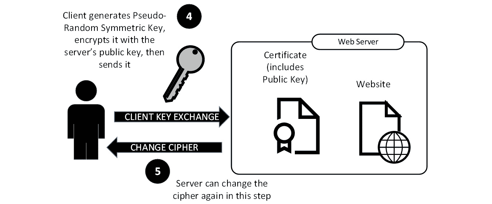

# 八、Linux 上的证书服务

在本章中，我们将讨论几个主题，这些主题涉及使用证书来保护或加密流量，特别是在 Linux 中配置和使用各种**证书颁发机构**(**CA**)服务器。

我们将介绍如何使用这些证书的基础知识，然后继续构建证书服务器。 最后,我们来看看周围的安全考虑证书服务,在保护 CA 的基础设施和使用**证书透明度**(**CT)执行的信任模型,以及库存/组织内部审计或侦察。**

在本章中，我们将涵盖以下主题:

*   证书是什么?
*   获得一个证书
*   以证书 web 服务器为例
*   构建私有证书颁发机构
*   保护您的证书颁发机构基础设施
*   证书的透明度
*   证书自动化和**自动化证书管理环境**(**ACME**)协议
*   `OpenSSL`小抄

当我们完成本章后，您将在您的 Linux 主机上拥有一个工作的私有 CA，您将清楚地知道如何颁发证书，以及如何管理和保护您的 CA，无论您是在实验室还是生产环境中使用它。 您还将对标准证书握手的工作方式有一个坚实的理解。

让我们开始吧!

# 技术要求

在本章中，我们可以继续使用我们一直在使用的 Ubuntu**虚拟机**(**VM**)或者工作站，因为这是一个学习练习。 即使在我们同时充当 CA 和证书申请人的部分中，本节中的示例也都可以在单个主机上完成。

但是，鉴于我们正在构建一个证书服务器，如果您使用本指南来帮助构建一个生产主机，强烈建议您在一个单独的主机或 VM 上构建它。 虚拟机是生产服务的首选，请阅读*保护 CA 基础设施*一节了解更多关于此建议的信息。

# 什么是证书?

证书本质上是*对真理的证明*——换句话说，证书是这样的文件:*相信我，这是真的*。 这听起来很简单，在某些方面确实如此。 但是在其他方面，证书的各种使用和安全地部署 CA 基础设施是一个重大的挑战——例如，我们在最近几年看到了公共 CA 的一些显著的失败:那些唯一的业务是确保证书过程的公司在审查时不能正确地使用它。 在本章后面的*保护 CA 基础设施*和*CT*部分，我们将更详细地介绍保护 CA 的挑战和解决方案。

在事物的根，工作站和服务器有一个它们信任的 ca 列表。 这种信任是使用加密签名的文档交付的，这些文档是每个 ca 的公共证书，存储在 Linux 或 Windows 主机的特定位置。

例如，当您浏览 web 服务器时，本地*证书存储*将被引用，以查看我们是否应该信任 web 服务器的证书。 这可以通过查看该 web 服务器的公共证书并查看它是否由您的受信任 ca 之一(或受信任 ca 之一的下属)签名来完成。 使用*儿童*或*下属*中科院实际签名是 common-each 公共 CA 想保护自己的*根 CA 尽可能多,所以【显示】下属 CAs*或*发行 CAs*创建、公共互联网上看到的。

组织可以创建自己的 ca，用于在用户、服务器、工作站和网络基础设施之间进行身份验证和授权。 这使得这种信任*在家庭内部*，也就是说，完全处于组织的控制之下。 它还意味着组织可以使用内部和免费的证书服务，而不是为数百或数千个工作站或用户证书付费。

现在我们知道了什么是证书，让我们看看如何颁发证书。

# 获取证书

在下面的图中，应用程序(例如 web 服务器)需要一个证书。 这张图看起来很复杂，但我们将把它分解成简单的步骤:


图 8.1 -证书签署请求(CSR)和颁发证书

让我们来看看创建证书所涉及的步骤，从初始请求到准备在目标应用程序中安装证书(*步骤 1-6*)，如下所示:

1.  The process starts by creating a CSR. This is simply a short text file that identifies the server/service and the organization that is requesting the certificate. This file is cryptographically "obfuscated"—while the fields are standardized and are just text, the final result is not human-readable. Tools such as OpenSSL, however, can read both CSR files and certificates themselves (see the *OpenSSL cheat sheet* section at the end of this chapter if you need examples of this). The text information for a CSR includes some—or all—of these standard fields:

    

    前面的列表并不是 CSR 中可以使用的所有字段的完整列表，但这些字段是最常见的。

    我们需要所有这些信息的原因是,当客户端连接到服务的使用证书(例如,一个 web 服务器使用**超文本传输协议安全**(**HTTPS)和**传输层安全性**(****TLS)), 客户机可以验证所连接的服务器名是否匹配 CN 字段或其中一个 SAN 条目。**

    这使得 CA 操作员验证此信息变得非常重要。 对于面向公众的证书，这是由验证公司名称、电子邮件等的操作员/供应商完成的。 自动化解决方案通过验证您对域或主机拥有管理控制来实现这一点。

2.  继续按照*图 8.1*，将此文本信息与申请人的公钥进行加密组合，形成`CSR`文件。
3.  现在完成的 CSR 被发送到 CA。当 CA 是一个公共 CA 时，这通常通过网站完成。 自动化等公共 CA**让我们加密 ACME**经常使用的应用程序编程接口**(**API)申请人和 CA 之间的通信。在 higher-stake 实现中,*步骤 3*和【显示】6 可能使用安全的媒体, 使用正式的*监护链*程序在受信任的各方之间进行实物交接。 重要的是，申请者和 CA 之间的通信使用了某种安全的方法。 虽然不太安全的方法，如电子邮件是可能的，他们不推荐。****
***   在 CA，验证身份信息(我们仍然遵循图 8.1 中的信息流)。 这个过程可以是自动的，也可以是手动的，取决于几个因素。 例如，如果这是一个公共 CA，那么您可能已经有一个帐户，这将使半自动化检查更有可能。 如果你没有账户，这张支票很可能是手动的。 对于私有 CA，这个过程可以完全自动化。*   经过验证后，验证过的 CSR 将以加密方式与 CA 的私钥组合，以创建最终证书。*   然后将此证书发送回申请人，并准备好安装到将使用它的应用程序中。**

 **请注意，在此事务中从未使用申请人的私钥——我们将看到它在 TLS 密钥交换中被使用的位置(在本章的下一节中)。

既然我们了解了如何创建或颁发证书，那么应用程序如何使用证书来信任服务或加密会话流量呢? 让我们看看浏览器和受 tls 保护的网站之间的交互，看看这是如何工作的。

# 使用证书- web 服务器的例子

当被问及这个问题时，大多数人会说，证书最常见的用途是使用 HTTPS 协议来确保网站的安全。 虽然这可能不是当今互联网上证书最常见的用途，但它仍然是最明显的。 让我们讨论一下如何使用 web 服务器的证书在服务器中提供信任并帮助建立加密的 HTTPS 会话。

如果您还记得 CSR 示例中的*申请人*，在本例中，该申请人是网站[www.example.com](http://www.example.com)，例如，它可能驻留在 web 服务器上。 我们将在前一个会话关闭的地方开始我们的示例——证书已经颁发并安装在 web 服务器上，准备好用于客户端连接。

**步骤 1**:客户端向 web 服务器发出初始 HTTPS 请求，称为**client HELLO**(图 8.2)。

在这个初始的*Hello*交换中，客户端向服务器发送以下内容:

*   它支持的 TLS 版本
*   它支持加密

这个过程如下图所示:


图 8.2 - TLS 通信以客户端 hello 开始

web 服务器通过发送其证书来回复。 如果您还记得的话，证书包含一些信息。

**步骤 2**:web 服务器通过发送其证书进行响应(*图 8.3*)。 如果你还记得的话，这个证书包含了一些信息，如下:

*   声明服务器标识的文本信息
*   web 服务器/服务的公钥
*   CA 的身份

服务器还发送以下信息:

*   支持的 TLS 版本
*   它对密码的第一个建议(通常是服务器支持的客户端列表中强度最高的密码)

这个过程如下图所示:


图 8.3 - TLS 交换:客户端发送服务器 hello 并验证证书

**步骤 3**:客户端接收此证书和其余信息(称为服务器 hello)，然后(接下来在*图 8.4*中显示)验证一些信息，如下所示:

*   我请求的服务器的身份是否在我刚刚收到的证书中(通常这将在 CN 字段或 SAN 字段中)?
*   今天的日期/时间是否在之后的*和*之前的*之间(即证书是否过期)?*
*   我是否信任 CA? 它将通过查看其证书存储来验证这一点，几个 ca 的公共证书通常位于其中(几个公共 ca，通常是一个或多个组织内使用的私有 ca)。
*   通过向**在线证书状态协议**(**OCSP**)服务器发送请求，客户端还有机会检查证书是否已被吊销。 检查**证书撤销列表**(**CRL**)的旧方法仍然得到支持，但已经不常用了——这个列表已经被证明不能很好地适应数千个已撤销证书。 在现代实现中，CRL 通常由已被吊销的公共 CA 证书组成，而不是常规的服务器证书。
*   *信任*和*撤销*检查非常重要。 这些验证服务器是否是它所声称的那个人。 如果这些检查没有完成，那么任何人都可以站在服务器上声称是你的银行，你的浏览器就会让你登录到那些恶意的服务器上。 现代的网络钓鱼活动经常试图通过*相似的域名*和其他方法来欺骗系统。

**步骤 4**:如果证书通过了客户端的所有检查，客户端将生成一个伪随机对称密钥(称为 pre-master key)。 使用服务器的公钥对其进行加密并发送到服务器(如图*图 8.4*所示)。 这个密钥将用于加密实际的 TLS 会话。

此时允许客户端修改密码。 最终的密码是客户机和服务器之间的协商——记住这一点，因为当我们讨论攻击和防御时，我们将对此进行更深入的研究。 长话短说——客户端通常不会更改密码，因为服务器已经从客户端的列表中选择了一个。

这个过程如下图所示:



图re 8.4 -客户端密钥交换和服务器得到最后一次更改密码的机会

**步骤 5**:在此步骤之后，服务器也有最后一次机会更改密码(仍在*图 8.4*中)。 这一步通常不会发生，并且通常完成密码协商。 预主密钥现在是最终的，被称为主秘密。

**步骤 6**:现在证书验证已经完成，密码和对称密钥都已经达成一致，可以进行通信了。 加密是使用前一步中的对称密钥完成的。

下面的图表说明了这一点:


图 8.5 -协商完成，通信使用主秘密(密钥)进行加密

在这个交换中有两个重要的需要注意的事情是隐含的，但还没有阐明，如下:

*   一旦协商完成，就不再使用证书—使用协商好的主秘密密钥进行加密。
*   正常协商时，不需要 CA。 当我们开始讨论保护我们组织的 CA 基础设施时，这将成为一个重要的问题。

现在我们对证书的工作方式有了更好的理解(至少在这个用例中)，让我们为我们的组织构建一个基于 linux 的 CA。 我们会用几种不同的方式来做这件事，让你在自己的组织中有一些选择。 我们还将在下一章中使用 CA，[*第 9 章*](09.html#_idTextAnchor153)，*RADIUS Services for Linux*，所以这是一组重要的示例，需要密切关注。

# 构建私有证书颁发机构

构建一个私有的CA 开始时，我们面临着与每个基础架构包相同的决定:*我们应该使用哪个 CA 包?* 有这么多服务器解决方案，有几个可供选择。 这里列出了一些选项:

*   **OpenSSL**技术给了我们需要的所有工具编写自己的脚本和维护我们自己的目录结构**公共密钥基础设施**(**PKI)片段。 您可以创建根 ca 和从属 ca，创建 CSR，然后签署这些证书以生成真正的证书。 在实践中，虽然这种方法得到了普遍的支持，但对于大多数人来说，它在手工方面有点太过了。**
*   **证书管理器**是与 Red Hat Linux 及相关发行版捆绑在一起的 CA。
*   **openSUSE**和相关发行版可以使用本地**Yet another Setup Tool**(**YaST**)配置和管理工具作为 CA。
*   **Easy-RSA**是一组脚本，本质上是相同 OpenSSL 命令的包装器。
*   **Smallstep**实现了更多的自动化—可以将其配置为私有 ACME 服务器，并且可以轻松地允许您的客户机请求和完成它们自己的证书。
*   **Boulder**是一个基于 acme 的 CA，分布在`LetsEncrypt`GitHub 页面，用 Go 编写。

如您所见，有相当多的 CA 包。 大多数旧的是各种 OpenSSL 命令的包装器。 较新的版本有额外的自动化，特别是围绕 ACME 协议，这是由`LetsEncrypt`首创的。 前面提到的每个包的文档链接在本章的*进一步阅读*列表中。 作为部署最广泛的 Linux CA，我们将使用 OpenSSL 构建示例 CA 服务器。

## 使用 OpenSSL 构建 CA

因为我们只使用了几乎每个 Linux 发行版中包含的命令，所以在我们开始使用这种方法构建 CA 之前，没有什么需要安装的。

让我们开始这个过程，如下:

1.  首先，我们将为 CA 创建一个位置。`/etc/ssl`目录应该已经存在于您的主机的文件结构中，我们将通过运行以下代码添加两个新目录:

    ```sh
    $ sudo mkdir /etc/ssl/CA
    $ sudo mkdir /etc/ssl/newcerts
    ```

2.  Next, keep in mind that as certificates are issued, the CA needs to keep track of serial numbers (usually sequential), and also some details about each certificate as it's issued. Let's start the serial numbers in a `serial` file, at `1`, and create an empty `index` file to further track certificates, as follows:

    ```sh
    $ sudo sh -c "echo '01' > /etc/ssl/CA/serial"
    $ sudo touch /etc/ssl/CA/index.txt
    ```

    在创建`serial`文件时，请注意`sudo`语法。 之所以需要这样做，是因为如果您只是针对`echo`命令使用`sudo`，那么您就没有`/etc`目录下的权限。 此语法所做的是启动一个`sh`临时 shell，并传递引号中的字符串，以便使用`-c`参数执行。 这相当于运行`sudo sh`或`su`，执行命令，然后退出到常规用户上下文。 然而，使用`sudo sh –c`比这些其他方法要好得多，因为它消除了停留在根上下文中的诱惑。 停留在根上下文中会带来各种各样的机会，错误地、永久地改变系统上你不想要的东西——从意外删除一个关键文件(只有`root`可以访问)，到错误地安装恶意软件， 或者允许勒索软件或其他恶意软件以`root`的形式运行。

3.  Next, we'll edit the existing `/etc/ssl/openssl.cnf` configuration file and navigate to the `[CA_default]` section. This section in the `default` file looks like this:

    ```sh
    [ CA_default ]
    dir             = ./demoCA              # Where everything is kept
    certs           = $dir/certs            # Where the issued certs are kept
    crl_dir         = $dir/crl              # Where the issued crl are kept
    database        = $dir/index.txt        # database index file.
    #unique_subject = no                    # Set to 'no' to allow creation of
     # several certs with same subject.
    new_certs_dir   = $dir/newcerts         # default place for new certs.
    certificate     = $dir/cacert.pem       # The CA certificate
    serial          = $dir/serial           # The current serial number
    crlnumber       = $dir/crlnumber        # the current crl number
     # must be commented out to leave a V1 CRL
    crl             = $dir/crl.pem          # The current CRL
    private_key     = $dir/private/cakey.pem# The private key
    x509_extensions = usr_cert              # The extensions to add to the cert
    ```

    我们将在该部分更新以下内容:

    ```sh
    dir             = /etc/ssl              # Where everything is kept
    database        = $dir/CA/index.txt     # database index file.
    certificate     = $dir/certs/cacert.pem         # The CA certificate
    serial          = $dir/CA/serial                # The current serial number
    private_key     = $dir/private/cakey.pem# The private key
    ```

    不需要对`private_key`行进行更改，但是在文件中，请确保再次检查其正确性。

4.  Next, we'll create a self-signed root certificate. This is normal for the root of a private CA. (In a public CA, you would create a new CSR and get it signed by another CA, to provide a *chain* to a trusted root.)

    由于这是一个组织的内部 CA，所以我们通常会选择较长的使用周期，这样就不会每一两年重新构建整个 CA 基础设施。 让我们选择 10 年(3650 天)。 注意，该命令要求输入密码(不要丢失它!)以及其他用于识别证书的信息。 注意，在下面的代码片段中，`openssl`命令在一个步骤中为 CA(`cakey.pem`)和根证书(`cacert.pem`)创建一个私钥。 当提示时，使用您自己的主机和公司信息来填写请求的值:

    ```sh
    $ openssl req -new -x509 -extensions v3_ca -keyout cakey.pem -out cacert.pem -days 3650
    Generating a RSA private key
    ...............+++++
    .................................................+++++
    writing new private key to 'cakey.pem'
    Enter PEM pass phrase:
    Verifying - Enter PEM pass phrase:
    -----
    You are about to be asked to enter information that will be incorporated
    into your certificate request.
    What you are about to enter is what is called a Distinguished Name or a DN.
    There are quite a few fields but you can leave some blank
    For some fields there will be a default value,
    If you enter '.', the field will be left blank.
    -----
    Country Name (2 letter code) [AU]:CA
    State or Province Name (full name) [Some-State]:ON
    Locality Name (eg, city) []:MyCity
    Organization Name (eg, company) [Internet Widgits Pty Ltd]:Coherent Security
    Organizational Unit Name (eg, section) []:IT
    Common Name (e.g. server FQDN or YOUR name) []:ca01.coherentsecurity.com
    Email Address []:
    ```

5.  In this final step, we'll move the key and root certificate to the correct locations. Note that you'll need `sudo` rights again to do this.

    ```sh
    sudo mv cakey.pem /etc/ssl/private/
    sudo mv cacert.pem /etc/ssl/certs/
    ```

    请确保不要复制文件，而是使用`mv`命令移动它们。 在安全协议中，通常会发现存储在各种临时或存档位置的证书和密钥——不用说，如果攻击者能够获得您的证书服务器的根证书和私钥，就会导致各种恶作剧!

您的 CA 现在可以使用了! 让我们继续创建 CSR 并对其签名。

## 请求并签署 CSR

让我们创建一个测试 csr——您可以在我们正在使用的同一个示例主机上执行此操作。 首先，为该证书创建一个私钥，如下所示:

```sh
$ openssl genrsa -des3 -out server.key 2048
Generating RSA private key, 2048 bit long modulus (2 primes)
...............................................+++++
........................+++++
e is 65537 (0x010001)
Enter pass phrase for server.key:
Verifying - Enter pass phrase for server.key:
```

请跟踪该密码，因为在安装证书时将需要它! 另外，请注意，该键有一个`2048`位模量——这是您希望看到或用于此目的的最小值。

证书密钥的密码是非常重要和敏感的信息，您应该将它们存储在安全的地方—例如，如果您计划在证书到期时(或者在此之前)更新该证书，那么您将需要该密码来完成这个过程。 与其将其保存在纯文本文件中，我建议使用密码库或密码管理器来存储这些重要的密码短语。

注意，许多守护进程风格的服务在中需要一个没有密码的密钥和证书(Apache web 服务器、Postfix 和许多其他服务)，以便在不干预的情况下自动启动。 如果您正在为这样的服务创建密钥，我们将删除密码以创建一个*不安全密钥*，如下所示:

```sh
$ openssl rsa -in server.key -out server.key.insecure
Enter pass phrase for server.key:
writing RSA key
```

现在，让我们重命名密钥——`server.key`*安全的*密钥为`server.key.secure`，`server.key.insecure`*不安全的*密钥为`server.key`，如下代码片段所示:

```sh
$ mv server.key server.key.secure
$ mv server.key.insecure server.key
```

无论我们创建的是哪种*风格*密钥(有或没有密码短语)，最终的文件都是`server.key`。 使用这个密钥，我们现在可以创建一个 CSR。 这个步骤需要使用不同的密码来签署 CSR，如下面的代码片段所示:

```sh
~$ openssl req -new -key server.key -out server.csr
You are about to be asked to enter information that will be incorporated
into your certificate request.
What you are about to enter is what is called a Distinguished Name or a DN.
There are quite a few fields but you can leave some blank
For some fields there will be a default value,
If you enter '.', the field will be left blank.
-----
Country Name (2 letter code) [AU]:CA
State or Province Name (full name) [Some-State]:ON
Locality Name (eg, city) []:MyCity
Organization Name (eg, company) [Internet Widgits Pty Ltd]:Coherent Security
Organizational Unit Name (eg, section) []:IT
Common Name (e.g. server FQDN or YOUR name) []:www.coherentsecurity.com
Email Address []:
Please enter the following 'extra' attributes
to be sent with your certificate request
A challenge password []:passphrase
An optional company name []:
```

既然在`server.csr`文件中已经有了 CSR，就可以对它进行签名了。 在证书服务器(碰巧对我们来说是相同的主机，但这不是典型情况)上，取`CSR`文件并用以下命令对其签名:

```sh
$ sudo openssl ca -in server.csr -config /etc/ssl/openssl.cnf
```

这将生成几页输出(未显示)并请求几个确认。 其中一个确认将是我们在之前创建 CSR 时提供的密码。 当所有这些都完成后，您将看到实际的证书作为输出的最后一部分滚动。 您还将注意到，因为我们没有指定任何日期，所以证书从现在开始有效，并设置为 1 年后到期。

我们刚刚签署的证书存储在`/etc/ssl/newcerts/01.pem`中，如下面的代码片段所示，并且应该可以被请求服务使用:

```sh
$ ls /etc/ssl/newcerts/
01.pem
```

随着我们的进展，颁发的证书将增加到`02.pem`、`03.pem`，等等。

注意在下面的代码片段中，`index`文件已经被更新为证书细节，并且`serial number`文件已经被增量，为下一次签名请求做好准备:

```sh
$ cat /etc/ssl/CA/index.txt
V       220415165738Z           01      unknown /C=CA/ST=ON/O=Coherent Security/OU=IT/CN=www.coherentsecurity.com
$ cat /etc/ssl/CA/serial
02
```

在完成了一个 CA 示例并使用测试证书进行操作之后，让我们看看如何保护您的 CA 基础设施。

# 保护您的证书颁发机构基础设施

通常有几个最佳的实践被推荐来保护您的 CA。一些“遗留”建议是特定于单个 CA 的，但是随着虚拟化在大多数数据中心中变得越来越普遍，这为简化和安全 CA 基础设施带来了额外的机会。

## 久经考验的建议

保护组织证书基础设施的传统建议利用了这样一个事实，即它只在颁发证书时使用。 如果您能够很好地管理何时需要新证书，那么您可以在不需要时关闭 CA 服务器。

如果您需要更大的灵活性，您可以创建一个分层的证书基础结构。 为您的组织创建根 CA，根 CA 的惟一工作是签署用于创建从属 CA(或者可能是多个从属 CA)的证书。 然后使用这些从属关系创建所有客户机和服务器证书。 根 CA 可以被下电或脱机，除了用于打补丁的。

如果一个组织尤其关心保护 CA,专用硬件如**硬件安全模块**(**HSM)可用于存储私钥和 CA 证书的 CA 离线,通常在保管箱或其他装置外,安全的位置。 商业上的高速路例子包括硝基高速路或 YubiHSM。 NetHSM 是开源 HSM 的一个很好的例子。**

## 现代忠告

前面的建议 100%仍然有效。 在现代基础设施中，我们看到的有助于确保 ca 安全的新难题是服务器虚拟化。 这意味着在大多数环境中，由于虚拟机的备份方式，每个服务器都有一个或多个映像备份存储在本地磁盘上。 因此，如果主机损坏到无法修复，无论是恶意软件(通常是勒索软件)或一些严重的配置错误，只需 5 分钟左右就可以将整个服务器回滚到前一晚的图像，或者在最坏的情况下，回滚到前两晚的图像。

一切迷失在这复苏将服务器数据发布的任何证书*间隔丢失,如果我们再回到一个会话是如何协商的,服务器数据从来没有真正用于建立一个会话。 这意味着这*旅行回到时间*,服务器恢复不影响任何的客户端或服务器使用谈判的发行证书加密(或身份验证,我们会看到当我们到达[*第 9 章*](09.html#_idTextAnchor153)、【显示】服务半径 Linux)。*

 *在较小的环境中，根据具体情况，只需使用单个 CA 服务器就可以轻松地保护基础设施——只需保持映像备份，以便在需要恢复时，字节对字节的映像可用，并且可以在几分钟内回滚。

在更大的环境中，为 CA 基础设施建立一个层次结构模型仍然很有意义——例如，这可以使合并和收购更容易。 层次结构模型有助于将基础设施维护为单个组织，同时更容易将多个业务单元的 ca 固定在单个主服务器下。 然后，您可以使用基于**操作系统**(**OS**)的安全性来限制*飞溅区域*，以防在一个或另一个分区中发生恶意软件事件; 或者，在日常模型中，如果需要的话，您可以使用相同的操作系统安全性来限制对业务单元之间证书的管理访问。

依赖映像备份来保护 CA 基础设施的主要风险要追溯到传统上使用 CA 服务器的方式——在某些环境中，证书可能很少需要。 例如，如果您在本地保留了一周的服务器映像备份，但需要一个月(或几个月)的时间才能意识到应用的脚本或补丁导致 CA 服务器崩溃，那么从备份中恢复可能会出现问题。 这可以通过更广泛地使用证书(例如，在对无线网络的无线客户端进行身份验证时)和自动证书颁发解决方案(如 Certbot 和 ACME 协议(由 Let's Encrypt 平台首创)来很好地处理。 这些因素(尤其是结合在一起)意味着 CA 的使用越来越频繁，以至于如果 CA 服务器不能正常运行，现在情况可能会在数小时或数天内升级，而不是数周或数月。

## 现代基础设施 ca 特异性风险

*证书权威*或*CA*不是在聚会的非正式谈话中出现的术语，甚至在工作的休息室也不会出现。 这意味着如果你给您的 CA 服务器的主机名`ORGNAME-CA01`,在`CA01`名字的一部分使服务器显然重要你,别指望的`CA`主机名被明显的任何人。 例如，对于您的经理、程序员、在您休假时代您工作的人或由于某种原因拥有 hypervisor 根密码的暑期学生来说，这很可能不是一个危险信号。 如果您是一名顾问，那么组织中实际工作的人可能都不知道 CA 是做什么的。

这意味着，特别是在虚拟基础设施中，我们会看到 CA vm(某种程度上)不时被意外删除。 这种情况发生得非常频繁，当我构建一个新的 CA VM 时，我通常将其称为`ORGNAME-CA01 – DO NOT DELETE, CONTACT RV`，其中`RV`表示拥有该服务器的管理员的首字母缩写(在本例中，就是我)。

当任何服务器 VM 被删除时，最好设置警报，通知该主机的管理团队中的任何成员——这将为您提供另一层防御，至少提供及时的通知，以便您能够快速恢复。

最后，在您的 hypervisor 基础架构上实现**基于角色的访问控制**(**RBAC**)是每个人的最佳实践列表。 只有任何特定服务器的直接管理员应该能够删除、重新配置或更改该服务器的电源状态。 这种级别的控制很容易在现代管理程序中配置(例如，VMware 的 vSphere)。 这至少增加了意外删除 VM 的难度。

现在我们已经有了一些保护 CA 的安全实践，让我们从攻击者和基础设施防御者的角度来看看 CT。

# 证书透明性

回顾本章的开篇段落，回想一下 CA 的一个主要的*工作*是*信任*。 无论它是公共的还是私有的 CA，您都必须信任 CA 来验证请求证书的人就是他们自称的人。 如果这张支票失败，那么任何想代表[yourbank.com](http://yourbank.com)的人都可以请求该证书，并假装是您的银行! 在今天以网络为中心的经济中，这将是灾难性的。

当这种信任失败时，各种 CA、浏览器团队(特别是 Mozilla、Chrome 和 Microsoft)和操作系统供应商(主要是 Linux 和 Microsoft)将简单地从各种操作系统和浏览器证书存储中删除有问题的 CA。 这实际上是将该 CA 颁发的所有证书转移到一个不受信任的*类别，迫使所有这些服务从其他地方获取证书。 这种情况在最近发生了几次。*

DigiNotar 在被入侵后被摘牌，攻击者控制了它的一些关键基础设施。 欺诈**通配符证书为`*.`[发布 google.com](http://google.com)注意`*`这个证书是一个通配符,可以用来保护或模仿任何主机的域。 不仅发放了欺诈性通配符，还被用来拦截真实的流量。 不用说，每个人都对此持悲观看法。**

在 2009 年到 2015 年之间，赛门铁克 CA 颁发了许多**测试证书**，包括属于谷歌和 Opera(另一种浏览器)的域。 当这件事曝光后，赛门铁克受到了越来越严格的限制。 最终，赛门铁克的工作人员多次跳过验证重要证书的步骤，CA 最终在 2018 年被摘牌。

帮助检测这种类型的事件,公共 ca 现在参与**证书透明度**(**CT),**中描述注释请求**(****RFC) 6962 年【显示】。 这意味着，当证书颁发时，证书上的信息由 CA 发布到其 CT 服务。 对于用于**安全套接字层**(**SSL**)/TLS 的所有证书，此过程是强制性的。 这个程序意味着任何组织都可以检查(或更正式地审计)其购买的证书的注册表。 更重要的是，它可以检查/审计注册表中没有*购买的证书。 让我们看看如何在实践中工作。***

## 使用 CT 进行盘点或侦察

正如我们所讨论的，CT 服务存在的主要原因是通过允许任何人验证或正式审计颁发的证书来确保对公共 ca 的信任。

然而，除此之外，组织可以查询 CT 服务，查看是否有不应该从事服务器业务的人购买了他们公司的合法证书。 例如,它不是闻所未闻的营销团队站起来一个服务器与云服务提供者,绕过所有的安全性和成本控制,可能是讨论如果**信息技术**(**)集团建立了代表他们的服务器。 这种情况通常被称为*影子*,非 IT 部门决定去哪里流氓与他们的信用卡和创建并行和经常 less-well-secured 服务器*的【显示】这组没有看到(通常直到太迟了)。***

 **或者，在安全评估或渗透测试上下文中，找到客户的所有资产是难题的关键部分—您只能评估您所找到的。 使用 CT 服务将找到为公司颁发的所有 SSL/TLS 证书，包括测试、开发和**质量保证**(**QA**)服务器的任何证书。 测试和开发服务器通常是安全性最差的，通常这些服务器为渗透测试人员提供了一扇敞开的大门。 通常，这些开发服务器包含生产数据库的最新副本，因此在许多情况下，危及开发环境是完全违反规定的。 不用说，真正的攻击者使用这些相同的方法来寻找这些相同的脆弱资产。 这还意味着这个场景中的*蓝队*(IT 组中的捍卫者)也应该经常检查 CT 服务器之类的东西。

话虽如此，你怎么检查 CT 呢? 让我们使用位于[https://crt.sh](https://crt.sh)的服务器，并搜索颁发给`example.com`的证书。 为此，浏览到[https://crt.sh/?q=example.com](https://crt.sh/?q=example.com)(如果您感兴趣，也可以使用您的公司域名)。

请注意，因为这意味着作为一个完整的审计跟踪，这些证书通常会追溯到*时间*，一直追溯到 2013-2014 年，当时 CT 仍处于实验阶段! 这可以成为一个很好的侦察工具，可以帮助您找到证书过期的主机，或者现在受通配符证书保护的主机。 与这些证书相关的旧**域名系统**(**DNS**)记录可能还会将您指向全新的资产或子网。 说到通配符证书(我们之前讨论过)，您将在列表中看到这些证书为`*.example.com`(或`*.yourorganisation.com`)。 这些证书旨在保护父域(由`*`指示)下的任何主机。 使用通配符的风险在于，如果适当的材料被窃取(可能来自易受攻击的服务器)，域内的任何或所有主机都可能被假冒——当然，这可能是灾难性的! 另一方面，在购买了 3 到 5 个单独的证书之后，将它们合并到一个通配符证书中变得更加划算，这将具有更低的成本，但更重要的是，有一个单一的到期日期来跟踪。 一个附带的好处是，使用通配符证书意味着使用 CT 进行侦察对攻击者的有效性大大降低。 然而，防御者仍然可以看到欺骗性的证书，或者是购买并被其他部门使用的证书。

在这一章中我们已经讨论了很多内容。 现在，我们已经牢固地掌握了证书在现代基础设施中的位置，让我们探索如何使用现代应用程序和协议来自动化整个证书过程。

# 证书自动化和 ACME 协议

近年来，CAs 的自动化得到了一些重视。 特别是 Let's Encrypt，通过提供免费的公共证书服务，推动了这一变化。 他们降低成本这个服务通过使用自动化,特别是使用**ACME 协议**(*RFC 8737*/【RFC 8555 T6】)和【显示】Certbot 服务验证企业社会责任的信息,以及发布和交付证书。 在大多数情况下，该服务和协议的重点是为 web 服务器提供自动证书，但它正在向外扩展，以覆盖其他用例。

像Smallstep 这样的实现，它使用 ACME 协议来自动化和发出证书请求，已经扩展了这个概念，包括以下内容:

*   **开放授权(OAuth) / OpenID 连接(OIDC**)供应,使用身份令牌认证,允许**单点登录(SSO**)集成套件,Okta,**Azure Active Directory**(【显示】Azure 广告),和任何其他 OAuth 提供者****
*****   使用来自**Amazon Web Services**(**AWS**)、**谷歌 Cloud Platform**(**GCP**)或 Azure 的 API 提供*   **JavaScript 对象表示法(JSON)网络关键****JWK**和**JSON Web 标记**(**JWT**)集成,允许一次性令牌用于身份验证或利用后续发行证书****

 ****因为使用 ACME 协议颁发的证书通常是免费的，所以它们也是恶意参与者的主要目标。 例如，恶意软件经常利用 Let's Encrypt 提供的免费证书来对加密**命令-控制**(**C2**)操作或数据提取进行加密。 即使对于像 Smallstep 这样的内部 ACME 服务器，对细节的任何疏忽都可能意味着恶意参与者能够破坏组织中的所有加密。 由于这个原因，基于 acme 的服务器通常只颁发短期证书，并认为自动化将通过完全消除增加的管理开销来“弥补不足”。 让我们来看看 Encrypt 是使用 acme 的最知名的公共 CA，它的证书有效期为 90 天。 Smallstep 走到了极端，默认的证书持续时间是 24 小时。 请注意，24 小时的终止时间是很极端的，这可能会对移动工作站产生严重的影响，这些移动工作站可能每天都不在内部网络上，因此通常会设置更长的时间间隔。

在 ACME 之前，**简单证书注册协议**(**SCEP**)用于自动化，特别是用于提供机器证书。 SCEP 目前仍广泛应用于**移动设备管理**(**MDM**)产品中，以向手机等移动设备提供企业证书。 连也在很大程度上仍然在使用微软的**网络设备登记服务**(【病人】濒死经历)组件,在 Active Directory**(**【t16.1】广告)的证书服务。

微软的，他们的免费证书服务自动注册工作站和用户证书，所有都在组策略控制下。 这意味着随着工作站和用户自动身份验证需求的增加，微软 CA 服务的使用似乎也在增加。

基于 linux 的 CA 服务的总体趋势是尽可能自动化颁发证书。 然而，基础的证书原则与我们在本章中讨论的完全相同。 随着这一趋势中的*赢家*开始出现，您应该掌握一些工具，以便理解任何 CA 应该如何在您的环境中工作，不管可能使用的是前端方法还是自动化方法。

自动化完成后，我们介绍了您将在现代基础设施中看到的主要证书操作和配置。 在结束这个主题之前，通常有一组简短的“食谱式”命令用于证书操作是很有用的。 因为 OpenSSL 是我们的主要工具，所以我们收集了一些常用命令，希望这些命令可以使这些复杂的操作更容易完成。

# OpenSSL 备忘单

在开始这个节之前，让我说一下，这将涵盖本章中使用的命令，以及在检查、请求和颁发证书时可能使用的许多命令。 还演示了一些远程调试命令。 OpenSSL 有数百个选项，因此与往常一样，手册页是您更全面地探索其功能的好朋友。 在必要时，如果您谷歌`OpenSSL``cheat sheet`，您将发现数百个页面显示常见的 OpenSSL 命令。

下面是一些在证书创建中常见的步骤和命令:

*   要为新证书(在申请人上)创建私钥，运行以下命令:

    ```sh
    openssl genrsa -des3 -out private.key <bits>
    ```

*   要为新证书(在申请人上)创建 CSR，运行以下命令:

    ```sh
    openssl req -new -key private.key -out server.csr
    ```

*   验证 CSR 签名:

    ```sh
    openssl req -in example.csr -verify
    ```

*   查看 CSR 的内容:

    ```sh
    openssl req -in server.csr -noout -text
    ```

*   要签名一个 CSR(在 CA 服务器上)，执行以下命令:

    ```sh
    sudo openssl ca -in server.csr -config <path to configuration file>
    ```

*   要创建自签名证书(通常不是最佳实践)，运行以下命令:

    ```sh
    openssl req -x509 -sha256 -nodes -days <days>  -newkey rsa:2048 -keyout privateKey.key -out certificate.crt
    ```

以下是检查证书状态时使用的一些命令:

*   查看标准`x.509`证书文件，运行以下命令:

    ```sh
    openssl x509 -in certificate.crt -text –noout
    ```

*   要检查`PKCS#12`文件(这将证书和私钥组合为单个文件，通常带有`pfx`或`p12`后缀)，运行以下命令:
*   使用如下命令检查私钥:

    ```sh
    openssl rsa -check -in example.key
    ```

下面是一些常用的证书远程调试命令:

*   查看远程服务器上的证书，运行以下命令:

    ```sh
    openssl s_client -connect <servername_or_ip>:443
    ```

*   要使用 OCSP 协议检查证书撤销状态(注意，这是一个过程，所以我们对步骤进行了编号)，请按照以下步骤进行操作:

1.  首先，收集公众证书，剥离`BEGIN`、`END`行，如下:
2.  接下来，检查证书中是否存在 OCSP**统一资源标识符**(**URI**)，如下所示:
3.  If there is, you can make a request at this point, as shown here:

    ```sh
    openssl x509 -in publiccert.pem -noout -ocsp_uri http://ocsp.ca-ocspuri.com
    ```

    这里，`http://ocsp.ca-ocspuri.com`是签发 CA 的 OCSP 服务器的 URI(之前已经找到)。

4.  如果公共证书中没有 URI，我们将需要获得证书链(即到发行者的链)，然后是发行者的根 CA，如下所示:
5.  这通常会创建大量输出—为了将证书链提取到一个文件(在本例中为`chain.pem`)，运行以下命令:

下面是一些用于文件格式转换的 OpenSSL命令:

*   将**Privacy-Enhanced 邮件**(**PEM)格式的证书**尊敬的编码规则**(【显示】DER),运行以下命令(注意,DER-formatted 文件很容易确定为他们不包括纯文本格式的字符串,如`-----BEGIN CERTIFICATE-----`):

    ```sh
    openssl x509 -outform der -in certificate.pem -out certificate.der
    ```** 
***   要将 DER 文件(`.crt`，`.cer`，或`.der`)转换为 PEM 文件，运行如下命令:

    ```sh
    openssl x509 -inform der -in certificate.cer -out certificate.pem
    ```

    *   使用实例将包含私钥和证书的`PKCS#12`文件(`.pfx`，`.p12`)转换为 PEM 文件。*   OpenSLL commands are also used to convert a PEM certificate file and a private key to `PKCS#12` (`.pfx`, `.p12`).

    如果服务需要身份证书，但在安装过程中没有 CSR 提供私钥信息，则通常需要`PKCS#12`格式文件。 的情况下,使用**个人交换格式**(**可以)文件或**公钥密码学标准 12 #**(【显示】P12)文件提供了所需的所有信息(私钥和公共证书)在一个文件中。 示例命令如下:**

    ```sh
    **openssl pkcs12 -export -out certificate.pfx -inkey privateKey.key -in certificate.crt -certfile CACert.crt**
    ```** 

 ****希望这篇简短的“烹饪书”有助于解开证书操作的神秘面纱，并有助于简化证书基础结构中涉及的各种文件的阅读。

# 总结

完成此讨论后，您应该了解使用 OpenSSL 安装和配置证书服务器的基础知识。 您还应该了解请求证书和签署证书所需的基本概念。 不同 CA 实现之间的基本概念和工具是相同的。 您还应该了解用于在远程服务器上检查证书材料或调试证书的基本 OpenSSL 命令。

您应该进一步了解确保证书基础设施安全所涉及的因素。 这包括使用 CT 进行盘查和侦察，用于防御和进攻目的。

在[*第 9 章*](09.html#_idTextAnchor153)，*为 Linux 提供的 RADIUS 服务*中，我们将在此基础上为 Linux 主机添加 RADIUS 认证服务。 您将看到，在更高级的配置中，RADIUS 可以使用您的证书基础设施来保护您的无线网络，其中证书将用于双向身份验证和加密。

# 问题

正如我们总结的，这里有一个问题列表，供你测试你对本章材料的知识。 你可以在附录的*评估*部分找到答案:

1.  证书促进通信的两个功能是什么?
2.  什么是`PKCS#12`格式，可以在哪里使用它?
3.  为什么 CT 很重要?
4.  为什么您的 CA 服务器跟踪所颁发证书的详细信息很重要?

# 进一步阅读

如欲了解更多有关资讯，请参阅以下资料:

*   Ubuntu 上的证书(特别是，构建 CA):[https://ubuntu.com/server/docs/security-certificates](https://ubuntu.com/server/docs/security-certificates)
*   OpenSSL 首页:[https://www.openssl.org/](https://www.openssl.org/)
*   *Network Security with OpenSSL*:[https://www.amazon.com/Network-Security-OpenSSL-John-Viega/dp/059600270X](https://www.amazon.com/Network-Security-OpenSSL-John-Viega/dp/059600270X)
*   CT:[https://certificate.transparency.dev](https://certificate.transparency.dev)
*   OpenSUSE(使用 YaST)的 CA 操作:[https://doc.opensuse.org/documentation/leap/archive/42.3/security/html/book.security/cha.security.yast_ca.html](https://doc.opensuse.org/documentation/leap/archive/42.3/security/html/book.security/cha.security.yast_ca.html)
*   Red hat 发行版上的 CA 操作(使用证书管理器):[https://access.redhat.com/documentation/en-us/red_hat_certificate_system/9/html/planning_installation_and_deployment_guide/planning_how_to_deploy_rhcs](https://access.redhat.com/documentation/en-us/red_hat_certificate_system/9/html/planning_installation_and_deployment_guide/planning_how_to_deploy_rhcs)
*   [https://github.com/OpenVPN/easy-rsa](https://github.com/OpenVPN/easy-rsa)
*   ACME-enabled CAs:

    T1 Smallstep CA:[https://smallstep.com/【】](https://smallstep.com/)

    巨石 CA:[https://github.com/letsencrypt/boulder](https://github.com/letsencrypt/boulder)*************