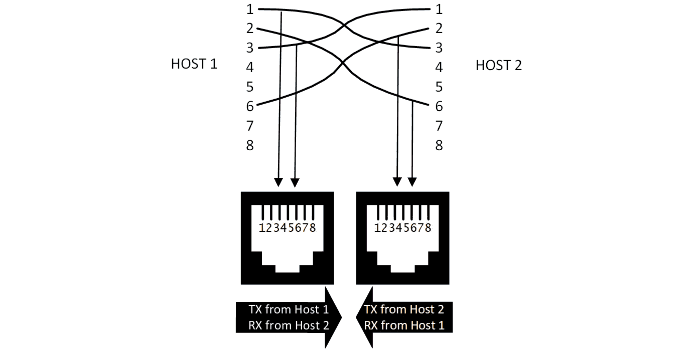
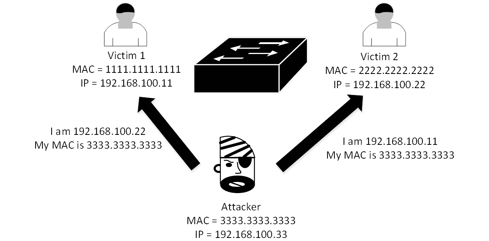
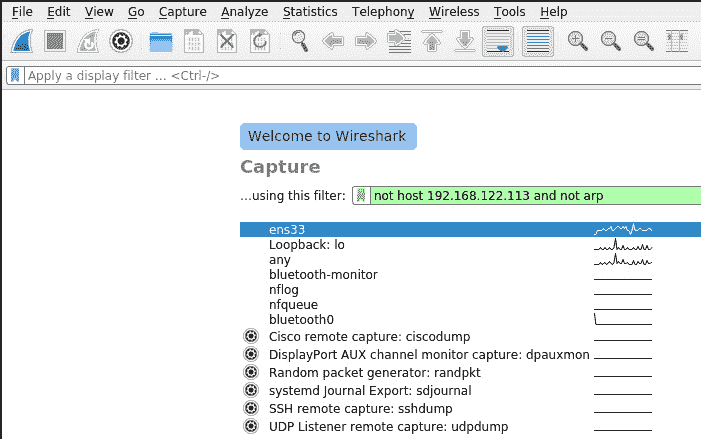
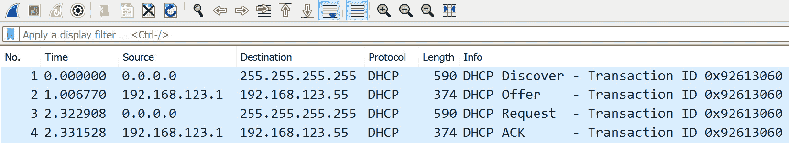
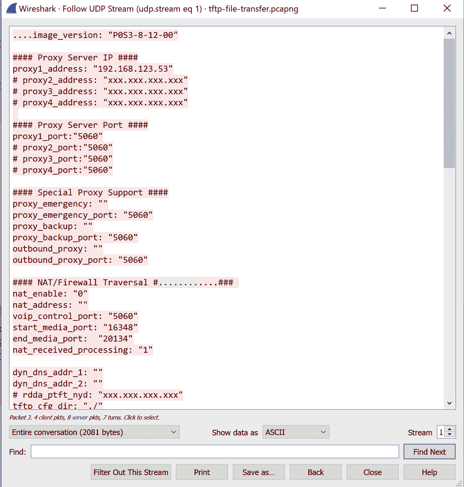
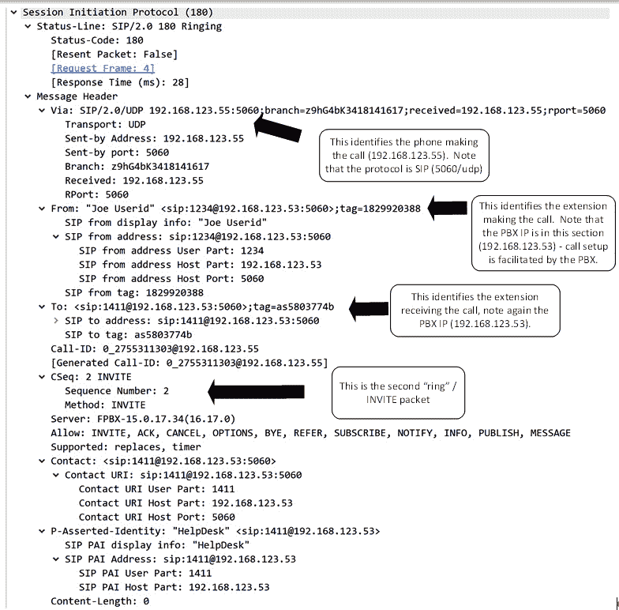
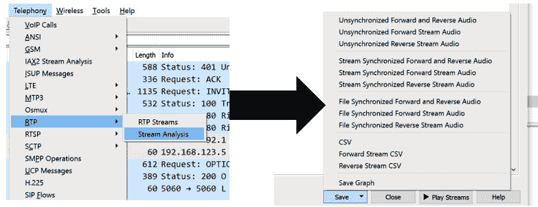
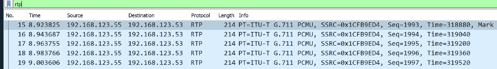
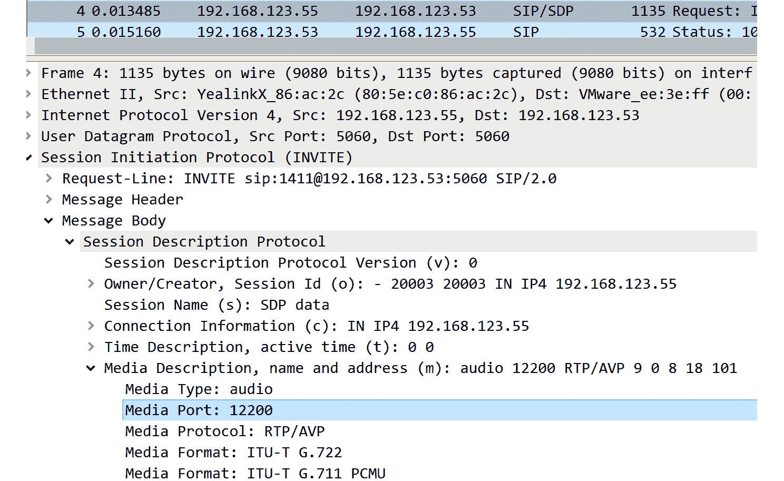

# 十一、Linux 上的抓包分析

在本章中，我们将讨论使用 Linux 进行包捕获。 在许多方面，数据包是数据中心中最接近*真相*的东西; 经常被引用的谚语是*数据包不会说谎*。 无论主机或防火墙上存在什么策略或复杂的配置，主机和应用数据包总是会反映发生了什么。 这使得数据包捕获，更重要的是，对这些数据包的分析成为网络管理员工具箱中解决问题和故障排除的关键技能。

特别地，我们将涵盖以下主题:

*   数据包捕获介绍-正确的地方去看
*   捕获时的性能考虑
*   捕捉工具
*   过滤捕获流量
*   故障排除应用-捕获一个 VoIP 电话呼叫

让我们开始吧!

# 技术要求

在本章中，我们将捕获数据包。 初始设置和包捕获使用一个您可能无法访问的物理交换机。 然而，一旦我们开始查看包本身，所有的捕获文件都可以下载。 由于本章的大部分内容是关于分析和解释捕获的数据包，我们现有的 Linux 主机应该可以很好地完成这些工作，而无需进行不必要的修改。 这也是一种很好的方法，可以确保当你遵循本章中的例子时，你的显示符合我们所描述的。

尽管如此，还是可以将包捕获构建到您的实验室中，或者更好地构建到您的工作环境中。 它是一个非常有价值的工具，用于故障排除，或者只是为了更好地理解我们每天使用的各种协议和应用!

本章中引用的捕获文件可以在本书的 GitHub 库的`C11`文件夹中找到:[https://github.com/PacktPublishing/Linux-for-Networking-Professionals/tree/main/C11](https://github.com/PacktPublishing/Linux-for-Networking-Professionals/tree/main/C11)。

# 数据包捕获介绍-正确的地方看

在两台主机之间有多种方法截取和捕获数据包，并且在通信路径中的多个位置进行此操作。 让我们来讨论一些更受欢迎的选择。

## 从两端捕获

这肯定是最简单的选项，因为当一切正常时，会话两端的主机将接收或发送所有数据包。 不过，也有一些人对此持反对意见:

*   你可能无法进入任何一端。 根据情况，其中一个端点主机可能根本不在您的组织中。
*   即使有，您也可能没有对环境中的主机(或多个主机)的管理访问权。 特别是在企业环境中，通常会看到网络团队和/或安全团队可能没有对服务器的管理访问权(或任何访问权)。
*   在大多数组织中，安装新的系统软件通常不是您可以随随便便做的事情。 对于任何可能影响工作站或服务器操作的事情，大多数公司都需要严格的变更控制程序。
*   即使安装包捕获应用的变更请求得到批准,奇怪这样的应用可以是一个争论的焦点几个月或几年安装后,在服务器上的任何奇怪的问题可能是归咎于“奇怪的应用”,网络团队将在服务器上。
*   如果您正在对一个问题进行故障排除，那么您可能无法从您可以访问的终端看到该问题。 例如，如果一些或所有的数据包没有到达服务器(或客户端)，那么在问题站捕获可能无法帮助您解决问题—也就是说，除了确认这些数据包没有到达之外。

由于这些原因，通常首选在路径的某个中点捕获数据包。 一种流行的选择是将交换机端口配置为镜像或*监控*流量。

## 监控端口切换

一种常见的情况是，我们需要捕获数据包进出主机，但我们既不能访问主机，也不能中断服务，或者无法获得必要的权限来安装数据包捕获软件。 由于这些情况非常常见，交换机供应商已经实现了一些特性来帮助我们解决问题。 大多数交换机都具有*镜像*或*监控*进出端口的流量的设施。 这通常称为**交换端口分析器**(**SPAN**)配置。 从交换机，我们简单地配置我们正在监视的端口，我们是希望发送(Tx)，接收(Rx)，还是两个方向的流量，以及我们希望将数据发送到哪个端口。

例如，在一个 Cisco 交换机上，在这个配置中，我们正在监视`GigabitEthernet 1/0/1`端口(发送和接收)，而我们的数据包捕获主机在`GigabitEthernet 1/0/5`端口:

```sh
monitor session 1 source g1/0/1 both
monitor session 1 destination g1/0/5
```

如您所见，这些是为`monitor session 1`定义的，这意味着大多数交换机一次支持多个监视器会话。 这可以扩大了监测整个 VLAN(所以源可能 VLAN 7)或发送数据包捕获到一个远程目的地,叫做**远程交换端口分析仪**(**RSPAN)的目的地。**

 **如果混合了防火墙或负载均衡器，那么要注意定义的源端口——例如，如果在 NAT 之前或之后捕获数据包，那么数据包捕获数据就会有很大差别。

您还可以在其他地方查找特定对话中的数据包? 网络设备是另一个流行的选择。

## 中间直连主机

在这种情况下，中间主机(如路由器、交换机或防火墙)可以捕获流量。 防火墙，特别是是非常方便的，因为在许多情况下，您可以捕获 NAT 之前和之后的流量。如果您要对定义良好的问题进行故障排除，这种方法非常有用。 但是，必须考虑到以下几点:

*   网络设备通常具有有限的存储空间，因此您需要将包的总体容量保持在捕获设备的存储容量之内。 在一些设备上，您可以将您的捕获实时发送到远程目的地，以消除这个问题，但这也存在问题。
*   无论哪种情况，数据包速率都应该很低。 在许多情况下，这些设备上的本地存储相对较慢，如果包速率很高，将包捕获实时发送到网络目的地可能会导致在捕获过程中丢失包。
*   抓包会影响抓包设备的 CPU。 在考虑将数据包捕获添加到此设备的负载之前，请确保您的总体 CPU 利用率较低。
*   如果您将捕获的数据包发送到远程目的地，请确保有足够的带宽来完成此操作—如果您超过了端口的带宽，您将在此等式的捕获端或发送端丢弃数据包。
*   综上所述，在许多情况下，您需要在流中查找非常特定的包来排除问题，以便您可以创建一个*过滤器*来收集这些流量。

关于使用Cisco 路由器作为*采集器*处理数据包的更完整的描述可以在这里找到:https://isc.sans.edu/forums/diary/Using+a+Cisco+Router+as+a +Remote+ collector +for+tcpdump+or+Wireshark/7609/。

其他平台的包捕获功能通常非常类似——它们创建一个定义感兴趣的流量的*列表*，然后启动捕获过程。 无论你的设备是什么，你的供应商会有这方面的记录，比我们在这里所能说明的更完整。

最后，我们来看看“纯粹主义”方法; 也就是说，使用网络水龙头。

## 网络点击

tap 是一种插入通信量的硬件设备，可以在任意一个方向或两个方向上进行全面监控。 因为它是传统的电子/硬件解决方案，没有对包容量吹毛求疵; 每一个方向的比特都被简单地电复制到侦听站。 然而，水龙头是要花钱的，需要你在现场。 你还必须断开有问题的以太网电缆，把水龙头在线上。 由于这些原因，水龙头仍然很方便，但经常不再使用。

一个典型的低端按键(`10`或`10/100`)是 Michael Ossmann 的以太网“飞镖”，可以在[https://greatscottgadgets.com/throwingstar/](https://greatscottgadgets.com/throwingstar/)找到。 下图显示了典型的低端(`10/100`)点击是如何操作的。 注意，有两种方法可以构建一个点击——如下图所示，你可以构建一个只有监听的点击，有两个端口，每个端口只“监听”一个方向的流量:



图 11.1 -两个抽头端口，每个方向相同

你还可以使用更传统的水龙头，它可以在一个端口上从两个方向“听到”流量:


图 11.2 -一个插孔可以看到所有流量(只有引脚)

这一切都工作到 1gb 以太网，在这一点上，信号丢失像这样的水龙头成为一个问题。 10 Gbps 甚至更复杂，因为实际的第一层信令不再匹配标准以太网。 由于这些原因，在 10gbps 或以上时，水龙头是主动设备，其行为更像是带有一个或多个 SPAN 端口的开关，而不是无源设备。 信号仍然完全复制到目标端口，但在它后面有更多的电路，以确保发送到实际源、目标和捕获主机的信号仍然可以被各方可靠地读取。

在某些特定的安全设置中，我们仍然可以看到使用水龙头，1G、10G 或更快的流量必须被捕获，但我们也需要电气隔离，以防止任何传输。

水龙头仍然是一种方便的故障排除设备，可以放在你的笔记本电脑包中，以应对你需要它的不寻常情况，但正如前面提到的，它们不再经常用于普通的数据包捕获。

到目前为止，我们已经描述了各种捕获数据包的合法方法，但是罪犯和他们的恶意软件是如何完成任务的呢?

## 恶意报文捕获方法

到目前为止，我们已经考虑了如何合法地捕获数据包。 但是，如果您考虑的是恶意意图，那么如何防御可能使用其他方法的攻击者呢? 为此，让我们像攻击者一样思考，看看他们如何在没有管理访问权限的情况下设置包捕获站。

第一种方法在第 7 章[](07.html#_idTextAnchor118)*、*Linux 上的 DHCP 服务*中介绍过。 攻击者可以挂载一个非法 DHCP 服务器，并将其主机作为目标计算机的默认网关或代理服务器(使用 WPAD 方法)。 在任何一种方法中，受害者的数据包都可以通过攻击者的主机并被捕获。 如果在明文协议(例如,使用 HTTP, TFTP, FTP,或 SIP,正如我们将在本章的后面看到,在*故障诊断*【显示】应用——捕捉 VoIP 电话部分),这些数据包可以存储供以后分析甚至实时修改。 我们可以通过保护 DHCP 服务来防止这种类型的攻击(正如我们在[*第七章*](07.html#_idTextAnchor118)，*Linux 上的 DHCP 服务*中讨论的)。*

 *类似地，攻击者可以劫持路由协议来捕获特定子网或主机的流量。 我们偶尔会在互联网上看到这种情况，在那里子网可能会被利用 BGP 路由协议的信任性质所劫持。 在这些情况下，我们经常看到信用卡门户网站被重定向到意想不到的国家，在那里，当人们登录到为他们准备好的虚假网站时，他们的凭证就会被收获。 在这种情况下，受害者如何保护自己? 实际上，它比你想象的更简单，也更不可靠。 如果受害者收到一个无效证书的警告，他们应该关闭该会话而不继续进行。 不幸的是，虽然这确实是一个简单的解决方案(警告屏幕几乎是整个页面，并有很多红色在它)，它也不是很可靠，因为许多人会简单地点击它来解散警告，并继续网站。

另一种常见的攻击者用来捕获数据包的方法称为 ARP 缓存中毒。 要理解这一点，您可能需要回顾 ARP 是如何工作的(第 3 章[](03.html#_idTextAnchor053)*，*使用 Linux 和 Linux 工具进行网络诊断*)。 在较高的级别上，攻击者使用 ARP 数据包向每个受害者“撒谎”——这可以在下图中很容易地看到:*

 *

图 11.3 - ARP 缓存中毒

在这个图中,两个受害者是**192.168.100.11**(**MAC 1111.1111.1111**),**192.168.100.22【显示】(**MAC 2222.2222.2222**)。 攻击者收集每个受害者的 MAC 并发送“无偿”(一种奇特的说法并不是要求)ARP 数据包,告诉 1【病人】**受害者,其 MAC`3333.3333.3333`,**,告诉受害者 2**,其 MAC 是`3333.3333.3333`。 开关看不到这些; 它只是将不同的包进行路由，因为它们在技术上都是有效的。 现在，当**受害者 1**想要与**受害者 2**对话时，它在它的本地 ARP 表中看到**受害者 2**的 MAC 是`3333.3333.3333`。****

如果**受害者 2**恰好是子网的默认网关，则攻击者可以将此扩展到网络外捕获。

这似乎有点复杂，但它已经自动化很多年了——用于这种类型的攻击的第一个工具是*d 嗅*，早在 2000 年由*Dug Song*编写。 Ettercap 是一个更现代的工具，它使用 GUI，允许您图形化地选择各种受害者。 Ettercap 及其后继者 Bettercap 的优势是，当他们看到“感兴趣的工件”，如凭证或密码散列时，他们会自动收集它们。

当这个过程完成后，Ettercap 关闭时，它优雅地用正确的值重新填充所有受害站的 ARP 表。 这意味着，如果 Ettercap 以一种不优雅的方式关闭(例如，被踢出网络或被太多的流量“淹没”)，受害网站将因错误的 ARP 条目而“搁浅”，通常是在每个工作站的 ARP 定时器的持续时间内。 如果攻击站在其列表中有子网的默认网关，这种情况将在网关的 ARP 定时器持续时间内隔离整个子网(可能长达 4 小时)。

我们如何防范这种类型的攻击? 日志是一个很好的开始。 当看到两个不同的 MAC 地址声称拥有相同的 IP 地址时，大多数现代交换机和路由器都会记录一个`Duplicate IP Address`错误。 这种类型的日志条目上的警报(参见[*第 12 章*](12.html#_idTextAnchor216)，*使用 Linux 的网络监控*)可以帮助启动主动事件响应程序。

我们还能做些更“积极”的事情吗? 大多数交换机都有一个称为**动态 ARP 检查**(**DAI**)的特性，它将查找这种类型的攻击。 当看到攻击时，关闭攻击者的以太网端口。 不过，您需要注意在哪里实现 DAI——不要在具有下行交换机或无线接入点的交换机端口上配置 DAI; 否则，当攻击者的端口被禁用时，攻击者会带走许多无辜的旁观者。 带有下游交换机或 ap 的端口通常被配置为“可信”，期望下游设备将处理其自己连接的站点的检查。

DAI 看起来非常类似于 DHCP 检查和信任配置:

```sh
ip arp inspection vlan <number>
ip arp inspection log-buffer entries <some number, try 1024 to start>
ip arp inspection log-buffer logs 1024 interval 10
```

如前所述，在具有下行交换机、ap 等的交换机端口上，您可以使用以下方法禁用 DAI:

```sh
int g1/0/x
  ip arp inspection trust
```

要将 DAI ARP 阈值从默认的每秒 15 个包的限制降低到更低的值(在本例中是 10 个包)，您可以执行以下操作:

```sh
int g 1/0/x
  ip arp inspection limit 10
```

如果在使用 Ettercap 等工具进行攻击时启用了 ARP 检查，该工具通常会向受害者发送一个稳定的 ARP 报文流，以确保他们的 ARP 缓存保持有毒状态。 在这种情况下，当超过端口阈值时，受影响的交换机将生成`DAI-4-"DHCP_SNOOPING_DENY" "Invalid ARPs"`错误消息。 该端口还会创建`ERR-DISABLE`状态，使攻击者完全脱机。

然而，在当今网络速度不断增长的世界中，您可能会发现，您所捕获的数据超过了您的工作站的容量——但不要放弃; 你可以进行一些优化，这可能会有所帮助!

# 捕获时的性能考虑

正如我们在上一节中提到的，一旦数据速率开始上升，抓包可能会影响主机，即使是高端 Linux 主机或 VM。 在设置数据包捕获时，还需要做出一些网络决策。

需要考虑的因素包括:

*   如果您正在使用 SPAN 或 Monitor 端口(取决于交换机模型)，那么您的目标端口(您的嗅探站所插入的端口)可能不在网络上—它可能只看到进出源的流量。 这意味着，通常，您必须使用最快的板载网卡来抓包，然后如果该主机需要同时在网络上活跃(例如，如果您正在远程访问它)，则使用性能较低的 USB 网卡。
*   在所有情况下，确保您的网卡足够快，能够实际“看到”所有目标数据包。 特别是在监视端口设置中，可以配置 10gbps 的源和 1gbps 的目的。 这样做会很好，直到您开始看到流量超过 1gbps。 在这一点上，交换机将开始队列和/或丢弃数据包，这取决于交换机的型号。 换句话说，你的里程可能会有所不同，你的结果可能是不可预测的(或可以预见的糟糕)。
*   一旦在 NIC 上，确保 NIC 的上游能够处理流量。 例如，如果您在笔记本电脑上使用 10gbps 的 Thunderbolt 适配器，请确保它插入了 Thunderbolt 端口(而不是 USB-C 端口)，并且您有足够的带宽来添加新的带宽。 例如，如果您在同一台笔记本电脑上有两个 4K 屏幕，那么用于高速数据包捕获的 Thunderbolt 上行链路上可能已经没有 10gbps 了。
*   向上移动行，确保您的磁盘具有足够的速度和容量。 如果您捕获的是 10gbps，那么您可能希望将 NVME SSD 作为存储目标。 你可能也希望它是在板上，而不是插入相同的 Thunderbolt 或 USB-C 适配器，你有你的网络适配器。 或者，如果您使用服务器进行捕获，请查看可用的 RAID 或 SAN 吞吐量。 特别是如果存储是 iSCSI，请确保您的包捕获不会“饥饿”其他 iSCSI 客户端到 SAN 的带宽。
*   考虑环缓冲区的大小，特别是 tcpdump 在这方面具有很好的灵活性。 环形缓冲区是内存中存储捕获数据包的临时区域，在此区域被发送到磁盘或捕获应用的内存之前。 在大多数 Linux 系统上，默认值为 2 MB，这通常已经足够了。 但是，如果您看到您的捕获会话似乎丢失了数据包，增加这个值可能会修复这个问题。 在 tcpdump 中，可以很容易地通过`-B`参数进行调整——这使得 tcpdump 成为在您知道或怀疑您的数据包捕获可能会突破限制时使用的理想工具。 注意，tcpdump 没有记录这个的默认大小; 2 MB 的默认值是常见的。
*   假设您需要整个包。 如果您只需要包头来解决您的问题(换句话说，您不需要实际的负载)，您可以调整`snaplen`—每个包中要捕获的字节数。 例如，将此值从`1500`减少到`64`可以显著增加适合您的环形缓冲区的数据包数量。 您将希望确保`snaplen`值足够大，以捕获所有包头信息。
*   最后，如果您作为一个攻击者在一个批准的安全演习(例如渗透测试)中工作，还有一些事情要记住。 如果您正在使用 ARP 缓存中毒作为您的业务的一部分，请注意这种攻击有一定的风险。 确保你的站有足够的接口带宽、CPU 和内存容量成功这种类型的攻击,如果中间的**男人**(**MiTM)流量超过你的站的能力,您的机器可能会离线。 对于受害者(可能是整个 VLAN)来说，这意味着他们将留下无效的 ARP 缓存，并在 ARP 计时器的持续时间内(在某些平台上长达 4 个小时)被搁浅。**

有了这些理论，我们将使用哪些工具来捕获和分析数据包呢?

# 捕获工具

可以使用许多不同的工具从网络上捕获数据包，或者直接分析数据包数据，或者将它们存储在`pcap`文件中。 还有更多的工具可以获取这些`pcap`文件，并允许您对它们进行进一步的离线分析。

## tcpdump

我们已经多次引用了 tcpdump。 这是一个命令行包捕获工具，这意味着它可以在没有 GUI 的系统上使用，也可以在使用非 GUI 接口(如，如 SSH)时使用。 因为它不处理任何图形，也不为您查看(例如告诉您任何协议细节)预处理数据包，所以它是您将找到的用于包捕获的性能更高、影响最小的工具之一。

tcpdump 使用**伯克利包过滤**(**BPF**)语法来决定捕获哪些包。 这可以使用根据 IP 地址、MAC 地址、协议甚至 TCP 数据包中的特定标志进行过滤。

## Wireshark

Wireshark 是最常用的抓包工具之一。 它有一个 GUI，并且每个数据包都被分类、用颜色编码并进行消息处理，以便尽可能多地显示信息。 与 tcpdump 类似，Wireshark 在抓取过程中使用 BPF语法对报文进行过滤。 它使用不同的过滤器语法来过滤显示的数据包。

## TShark

TShark 是与 Wireshark应用一起打包的，本质上是一个命令行/文本版本的 Wireshark。 如果您在 SSH 会话中，并且希望使用比 tcpdump 更灵活的方法，那么使用 TShark 是非常方便的。

## 其他 PCAP 工具

有数百种(如果不是数千种的话)工具可以用来捕获数据包或分析数据包捕获。 在攻击者方面，我们已经讨论过 Ettercap、Bettercap 和 d 嗅作为 MiTM 攻击工具。 像 NetworkMiner 这样的工具对于包捕获或处理现有的包捕获都很有用。 这样的工具使您可以节省分析哪些文件可能很快变成非常大的包捕获文件的时间。 NetworkMiner 将从`pcap`文件中提取有价值的工件，例如在捕获会话期间传输的凭据、凭据散列、证书和数据文件。

我们将讨论更高级的工具,使用数据包捕获,即**入侵检测系统(IDS**),**入侵预防系统**(【显示】**IPS)和被动交通监控,在接下来的章节([*第十三章【病人】*](13.html#_idTextAnchor236),*入侵预防系统在 Linux 上*, [*第十四章*](14.html#_idTextAnchor252)，*Linux 上的蜜罐服务*)。******

 ****您可能会发现，首先进行包捕获的原因是为了解决问题。 让我们讨论一下如何只捕获或查看应用于您正在处理的问题的数据包。

# 过滤捕获流量

在使用包捕获工具时，您将注意到的第一件事是显示上出现的大量包。 由于包捕获通常是为了排除故障而进行的，所以您通常希望将包限制为具有需要解决的问题的包。 为此，您通常要么希望在捕获过程中“过滤”这些包，要么希望在捕获后过滤这些包的显示。 让我们讨论这两种情况。

## Wireshark capture filters(捕获您的家庭网络流量)

没有特定的交换机配置，您的家庭网络上的数据包捕获将发现比您可能认为的更多。 现在很多家庭都有一小群基于 Linux 的联网设备——如果连上了，你的电视、恒温器、门铃、跑步机和冰箱可能都是 Linux 主机。 这些通常被称为**物联网**(**物联网**)设备。 几乎所有物联网主机都可能在你的有线和无线网络上广播和多播一个持续的“发现”包流，它们这样做是为了找到可能想要与它们对话甚至控制它们的控制器和集线器。

让我们快速看一下-我们将使用 Wireshark 工具来完成这个。

启动该工具并选择连接到您的网络的网络适配器。

在您点击**Start**之前，让我们添加一个捕获过滤器。 我们将排除我们的地址，并从捕获中排除 ARP 包。 注意，你的 IP 地址将是不同的:



图 11.4 -在 Wireshark 中添加一个捕获过滤器

现在，点击**开始捕获**按钮，左上方的蓝色*鱼翅*图标，或者选择**捕获/开始**。

在一个典型的家庭网络中，您应该在几秒钟内就有几十个包要查看——下面的截图显示了在我的家庭网络中 10 秒后的包。 您可能会看到广播和多播通信的混合——根据定义，传输是发送到所有电台的。 虽然这可能被视为一个有限的捕获，你可以使用它开始库存什么是在你的网络:


图 11.5 -一个典型的家庭网络捕获

即使没有探索数据包的内容，有一些关键的事情要注意前面的截图:

*   部分 IPv4 设备运行在`169.254.0.0/16`范围内(即自动私有 IP 地址范围)。 这些地址无法路由出您的网络，但对于电视遥控器或门铃与本地网络上的控制器通话这样的东西，这完全没问题。
*   你可能会看到生成树交通从您的本地开关,如果你等待足够长的时间,你可能会看到**发现链路层协议**(**LLDP)或思科发现协议**(【显示】**CDP)数据包从开关(稍后我们会看到一个这样的例子在这一节中)。******
***   你也很可能会看到 IPv6 流量——在这个捕获中，我们可以看到`DHCPv6`和`ICMPv6`数据包。**

 **这一切都来自 10 秒钟的倾听! 为了好玩，深入研究你的家庭网络，甚至是一些简单的事情，比如查看你看到的 MAC 地址，并使用它的 OUI 来识别每个供应商。

让我们从数据包的角度深入研究一组特定的设备——**VoIP**(**VoIP**)电话。

## tcpdump 捕获过滤器- VoIP 电话和 DHCP

让我们通过研究tcpdump 和 Wireshark 中的捕获过滤器，看看典型 VoIP 电话的启动顺序。 我们的网络很简单; 有四个站点和两个 vlan:


图 11.6 -包捕获的实验设置

注意，我们设置了一个监视器会话，其中端口`5`接收端口`1`进出的所有数据包。

以下是 VoIP 电话启动与通信过程中涉及的站的概述:


注意,当我们从左到右表中,我们旅行所代表的“堆栈”的 ISO 模型-应用中的扩展表示层,IP 地址是第四层,MAC 地址和 vlan 是 2 层,最后我们有自己的接口。

首先，让我们使用 tcpdump 来捕获 DHCP 服务器本身上的 DHCP 序列。 使用此主机非常方便，因为 DHCP 服务器是 DHCP“对话”的一端，所以如果一切正常，它应该可以看到两个方向的所有数据包。

此外，使用 tcpdump 意味着我们不依赖于任何 GUI—如果您从 SSH 会话操作，您仍然得到完全支持。 Tcpdump 几乎被普遍支持。 几乎每个 Linux 发行版都默认安装了 tcpdump，此外，您可以在大多数防火墙、路由器和交换机上调用 tcpdump(使用一种或另一种语法)——这并不奇怪，因为这些平台中有许多是基于 Linux 或 BSD unix 的。

我们继续抓捕吧。 因为源站还没有 IP 地址，我们需要根据电话的 MAC 地址和 DHCP 使用的两个 UDP 端口来指定流量:`67/udp`(bootps)和`68/udp`(bootpc)。 我们将捕获完整的数据包并将它们写入一个文件—注意，实际的捕获需要*sudo*权限。

首先，列出接口以便我们获得正确的源:

```sh
$ tcpdump -D
1.ens33 [Up, Running]
2.lo [Up, Running, Loopback]
3.any (Pseudo-device that captures on all interfaces) [Up, Running]
4.bluetooth-monitor (Bluetooth Linux Monitor) [none]
5.nflog (Linux netfilter log (NFLOG) interface) [none]
6.nfqueue (Linux netfilter queue (NFQUEUE) interface) [none]
7.bluetooth0 (Bluetooth adapter number 0) [none]
```

现在，让我们捕获一些数据包!

```sh
$ sudo tcpdump -s0 -l -i ens33 udp portrange 67-68
tcpdump: verbose output suppressed, use -v or -vv for full protocol decode
listening on ens33, link-type EN10MB (Ethernet), capture size 262144 bytes
08:57:17.383672 IP 192.168.123.1.bootps > 192.168.122.113.bootps: BOOTP/DHCP, Request from 80:5e:c0:57:bc:91 (oui Unknown), length 548
08:57:18.384983 IP 192.168.122.113.bootps > 192.168.123.1.bootps: BOOTP/DHCP, Reply, length 332
```

我们的论点包括:


在输出中，我们可以看到交换中的前几个包——我们想要做的是将其写入一个文件，所以让我们为其添加`-w`:

```sh
$ sudo tcpdump -s0 -l -i ens33 udp portrange 67-68 -w DHCPDora-Phone.pcap
```

现在，让我们假设我们无法访问 DHCP 服务器。 或者，如果 DHCP 不能正常工作，我们可能需要一个交换机的*网络视图*，以了解为什么服务器或客户端不能接收或发送 DHCP 报文。 在这种情况下，请记住客户机是一部电话，因此，尽管它很可能是基于 linux 的，但供应商可能无法方便地通过 SSH 到该平台来运行 tcpdump。

在这种情况下，典型的解决方案是设置一个 SPAN 端口，也称为`monitor`或`mirror`端口(取决于交换机供应商)。 在这种情况下，我们的数据包捕获主机位于端口`5`，因此它将是监视会话的目的地。 电话位于端口`1`中，因此这将是我们的监视器会话源。 在 Cisco 交换机上，设置语法如下所示:

```sh
monitor session 1 source interface Gi1/0/1
monitor session 1 destination interface Gi1/0/5
```

要查看正在运行的各种监视器会话，`show`命令如下所示:

```sh
rvlabsw01#sho monitor
Session 1
---------
Type                   : Local Session
Source Ports           :
    Both               : Gi1/0/1
Destination Ports      : Gi1/0/5
    Encapsulation      : Native
          Ingress      : Disabled
```

让我们在 Wireshark 中设置这个。 这对我们有很多好处——它不仅会检查过滤器的语法(注意，当它有效时，它会变成绿色)，而且我们还可以图形化地选择我们的网络适配器，并且在捕获过程中图形化地显示数据包。 同样，在我们选择捕获接口后，过滤器将如下所示:


图 11.7 -在 Wireshark 中定义捕获过滤器

注意，Wireshark 和 tcpdump 的捕获过滤器语法是相同的; 它使用所谓的 BPF 语法。 在这个例子中，我们在过滤器中添加了一个`ether host`，只捕获到该 MAC 地址的 DHCP 报文。 按**Start Capture**按钮(窗口左上方的蓝色*鱼翅*图标); 我们将看到我们的 DHCP 序列作为电话启动:



图 11.8 -捕获一个完整的 DHCP“DORA”序列

如果你没有实验室设置，你可以从我们的 GitHub 页面([https://github.com/PacktPublishing/Linux-for-Networking-Professionals/tree/main/C11](https://github.com/PacktPublishing/Linux-for-Networking-Professionals/tree/main/C11))收集这个`pcap`文件; 文件名为`DHCP DORA Example.pcapng`。

我们可以简单地扩展数据包中的各种数据字段，以显示各种诊断值。 展开第一帧的 DHCP 部分:


图 11.9 -探测 DHCP“发现”包

向下滚动和扩展一些 DHCP`Option`域，特别是`Parameter Request List`:


图 11.10 -“Discover”报文中的 DHCP 选项

注意电话的*请求列表*中有多少项。 这些为攻击者提供了一些很好的选择。 特别是，如果恶意的 DHCP 服务器可以响应并给电话一个不同的 TFTP 服务器和Bootfile 名称，那么 TFTP 服务器上的那个文件就拥有电话的全部配置，包括它的扩展名和呼叫者 ID——几乎所有的一切。

此外，这样的配置服务器几乎总是 TFTP 或 HTTP 服务器。 对攻击者来说意味着什么,如果他们可以得到一个 MiTM 客户机和服务器之间的位置(使用 Ettercap、Bettercap 或类似工具),他们不仅可以收集配置数据供以后使用的攻击,他们也可以实时修改这些数据,手机下载它。

这强调了保护您的 DHCP 服务和 VoIP 配置服务是多么重要! 让我们看看一个更通用的协议——LLDP 和 CDP。

## 更多的捕获过滤器- LLDP 和 CDP

当一个车站启动时，我们还能看到什么? CDP 和 LLDP 是主要的第 2 层发现协议，你会在大多数环境中看到。 这些协议将在故障排除或自动记录我们的网络和站点时为我们提供各种有用的信息。 它们还会向攻击者提供相同的信息，这意味着在可能的情况下，您将希望限制这些协议，通常是在连接到其他公司的任何通信链路上。

LLDP 要求几乎所有的 VoIP 实现,尽管——它的手机怎么知道 VLAN是在大多数情况下在 DHCP(除非 VLAN 组),这也是大多数电话协商他们的**如何控制以太网**(**坡)力量的水平。 如果没有 LLDP，所有的手机将收到 15 瓦的电力，这意味着任何给定的开关将需要提供 6-7 倍的电力(大多数手机在 2-4-6 瓦范围内)。**

让我们来看看 CDP(它向第二层地址`01:00:0c:cc:cc:cc`进行组播)和 LLDP(它向`01:80:C2:00:00:0E`进行组播，并具有`0x88cc`的以太网协议)。 在这种情况下，我们的捕获过滤器如下所示:

```sh
ether host 01:00:0c:cc:cc:cc or ether proto 0x88cc
```

或者，它将如下:

```sh
ether host 01:00:0c:cc:cc:cc or ether host 01:80:C2:00:00:0E
```

结果捕获显示，LLDP 和 CDP 都在发挥，但我们可以看到在 LLDP 数据包，手机发送?

我们正在寻找的信息都在 Wireshark 显示的应用部分(这个捕获的示例文件是 LLDP 和 CDP -`Phone Example.pcapng`)。 打开文件，显示 LLDP 报文的**链路层发现协议**部分。 注意下面的数据包含很多十六进制字符，但是有足够的数据可以转换成 ASCII，您可以看到一些有用的数据!


图 11.11 -捕获的 LLDP 帧

现在，展开 LLDP 选项卡，以便我们可以查看该部分的一些细节:


图 11.12 -更详细地查看 LLDP 数据包

电话已被设置为自动速度和双工，并协商为 100/Full。

该手机为 Yealink，型号为 T21P-E2，序列号为`805ec086ac2c`。 它运行的固件版本是 52.84.0.15。

在未加标签的(原生)虚拟局域网(VLAN ID 是`0`),没有**的服务质量**(**QoS)标签设置(DSCP`0`,所以是 L2 优先级)。**

请随意从捕获文件中的 CDP 数据包中收集相同的信息-记住我们过滤了 CDP 和 LLDP。

这可能看起来像是一个简单的例子，但通常情况下，网络是经过多年“有机地”组合在一起的，很少或没有文档。 在某种程度上，网络将变得足够复杂，或者知道所有网络是如何连接起来的人将离开公司——在这种情况下，记录您的网络将变得非常重要。 如果 CDP 或 LLDP 是启用的，这给你一个重要的工具，让你有一个好的开始，所有的 IP 地址，型号号码，固件，和连接端口。

从攻击者的角度来看，可以使用相同的信息来识别可能成为攻击对象的主机。 您可以使用相同的方法来收集这些数据，查找具有已知漏洞的固件版本的基础设施。 然后，这些设备就可以成为攻击者的下一个平台，利用该主机收集进一步的信息，以便在下一次攻击中使用。 这种方法可以很容易地用于继续攻击到下一个连接的组织，也许目标是路由器或交换机，我们的 ISP 在我们的互联网或 MPLS 上行链路上。

现在，让我们看看如何从包捕获中提取特定的工件，例如文件。

## 抓包收集文件

如果您正在处理一组捕获的包，或者正在进行包捕获，如果看到文件传输经过，您有哪些选项? 如果它使用任何 TCP 协议，或众所周知的 UDP 协议(如 TFTP 或 RTP)，那么它就非常简单!

在这里，我们可以看到一个包捕获(`file-transfer-example.pcapng`在我们的 GitHub 存储库)。 Wireshark 正确地识别出这是一个 TFTP 文件传输:


图 11.13 -包含文件传输的数据包捕获

知道网络上有 VoIP 电话，我们怀疑这些可能是配置文件——在启动/初始化过程中传输的电话的配置文件。 让我们仔细看看。

在第一行中，我们可以看到一个名为`SIPDefault.cnf`的文件的读请求。 这确实是一个高价值的目标，因为它为思科 SIP 电话提供了一套默认设置，如果它们是集中供应的。 突出显示第一个包标记为**数据包**(数据包 3)。右键单击它并选择**遵循| UDP 流**。 正如你所回忆的，在 UDP 协议中没有会话数据，但 Wireshark 为许多协议内置了解码，TFTP 只是其中之一:


图 11.14 -从 PCAP 收集传输文件-步骤 1

宾果! 我们找到要找的文件了! 选择**另存为…** 来“收获”此文件。 现在，让我们看看还有什么:



图 11.15 -从 PCAP 收集传输文件-步骤 2

关闭此窗口并在 Wireshark 中清除显示过滤线，这样我们就可以再次看到整个捕获(清除显示`udp stream eq 1`的文本)。

在数据包 15 上，我们看到对第二个文件的请求`SIP0023049B48F1.cnf`。 对这个文件重复我们之前遵循的过程——传输从包 17 开始，所以遵循从那里开始的 UDP 流。 有了这个文件，我们现在就有了 MAC 地址为`0023.049B.48F1`的电话的 SIP 配置。 查看这个文件，我们可以看到这是扩展名`1412`的配置文件，调用者 ID 为`Helpdesk Extension 2`。 该文件包含该电话的整个配置，包括 SIP 密码。 有了这些信息，攻击者就可以轻松地模拟帮助台扩展，并使用社会工程从呼叫帮助台的人那里收集机密信息——这确实是一条很有价值的信息!

现在，让我们更深入地研究我们的电话系统，并从一个实际的 VoIP 电话呼叫中捕获音频。

# 故障排除应用-捕获 VoIP 电话呼叫

为此，我将保持相同的捕获设置，并从端口`G1/0/1`上的客户端电话拨打`G1/0/2`上的帮助台电话。 捕获所有进出`G1/0/1`的数据包应该会得到所需的信息——对于这个间隔，进出`G1/0/2`的流量应该与`G1/0/1`相同(只是方向相反)。

为了捕获文本，我们只需要做一个完整的捕获; 在这种情况下不需要过滤器。 我们开始捕获，确保捕获了呼叫的开始和结束(所以我们在拨号之前开始捕获，在挂断之后结束捕获)。

完成捕获后,我们可以看到在 Wireshark PCAP——这个实验室的示例文件`HelpDesk Telephone Call.pcapng`,位于 GitHub 库在 https://github.com/PacktPublishing/Linux-for-Networking-Professionals/tree/main/C11。

让我们看看标记为`Ringing`的第 6 包。 探索这个包中的应用数据说明了在许多情况下理解这些数据是多么容易——特别是 SIP(当在调用建立中使用时)遵循了你可能期望从使用电子邮件中得到的:



图 11.16 -探索一个 SIP“ring / INVITE”包

看一下其他几个SIP 包，并研究每个包的应用数据中的一些字段。

接下来，我们来看看调用本身。 注意，在数据包 15 上，协议从 SIP(在`5060/udp`上)变为**实时协议**(**RTP**)。 在这个包中有一些事情是不同的。 如果你展开`IP section`，然后展开**差异化服务字段**(**DSCP**)部分，你会看到已经设置了一个 DSCP 值`46`:


图 11.17 - RTP(语音)包中的 DSCP 位

DSCP 是包中的一个 6 位字段，它告诉中间的网络设备如何对这个包进行优先级排序。 本例中设置为`46`、**Expedited Forwarding**或**EF**。 这告诉交换机，如果有几个包排队，这个包(和其他具有相同标记的包)应该先走。 事实上，EF 标记是唯一的，因为它告诉网络设备，如果可能的话，根本不要队列这个包。

EF 标记是唯一的，因为它没有排队，并且首先被转发，以保持语音流的完整性，并防止“echo”等工件。 它的独特之处在于，如果缓冲区填充到一定程度，这个包必须排队，通常，中间的网络设备将丢弃几个包，而不是延迟它们。 这是因为人类的耳朵是更宽容的 VoIP 呼叫，有几个包被丢弃，而不是这些相同的包被延迟。

如果您检查用于设置呼叫的其中一个 SIP 包，这些包的 DSCP 值都是 26(有保证转发)——换句话说，不是 expedited，但它被标记为具有一定重要性的 UDP 包。 这些标记要求如果一个接口或路径拥塞，那么这个包应该被缓冲而不被丢弃。

接下来，让我们回到这个 RTP 包中的应用数据:


图 11.18 - RTP 应用数据

注意，这个数据要简单得多。 在大多数情况下，有一些导入数据可以识别这个数据包是正在进行的电话的一部分。 这是呼叫的包(和帧)4。 编解码器被识别，以便远端设备知道如何解码数据。 数据包的大部分在`Payload`域，这是语音数据。

你可以通过在呼叫中突出显示一个 RTP 包来“跟随”这个流，右键单击它，并选择**跟随 UDP 流**。 它提取通话中的所有 RTP/语音数据，以便对其进行分析。 在其他协议中，您可以选择**遵循 TCP 流**或**遵循 UDP 流**，然后能够恢复整个文件(例如，从 FTP 或 TFTP 会话中)。

为了恢复语音通话，Wireshark 添加了一个特殊的处理程序。 打开此 PCAP 文件，选择**Telephony**|**VoIP Calls**。 双击这个文件中捕获的一个调用，您将看到调用的两个部分被表示为两个 WAV 输出。 `R`(右)正在拨打电话，`L`(左)正在接听电话。 如果您选择**播放**按钮，您可以回放整个对话:


图 11.19 -回放捕获的 VoIP 对话

或者，选择任意一个 RTP 报文，选择**Telephony | RTP | Stream Analysis**。 现在，选择**保存**并选择任何同步选项(例如-0)、**未同步前转**和**反向音频**。 这将文件保存为“AU”(Sun Audio)文件，它可以被大多数媒体播放器播放，或转换成任何其他所需的音频格式:



图 11.20 -将 VoIP 对话保存为可播放的媒体文件

这对任何运行 VoIP 解决方案的人都有一些明显的暗示。 缺省情况下，大多数 VoIP 配置不加密语音流量。 这是为了消除作为延迟或抖动来源的加密/解密，这是降低语音质量的两个主要原因。 这意味着在这些情况下，语音数据不能被视为“安全的”。

另外，请注意，在我们的帮助台呼叫中，帮助台人员使用来电显示来验证来电者的身份。 当一切正常时，这可能有效，但我们已经描述了一种折衷的方法。 一种更简单的方法是攻击者使用数据包捕获来识别 VoIP 基础设施如何工作，然后在他们的计算机上架设一个“软电话”。 在这种情况下，攻击者可以为调用者 ID 定义他们想要的任何东西; 这是一个简单的文本字段。 通常情况下，拨打电话时，来电者的 ID 是由手持设备而不是 PBX 提供的，所以在这种情况下，帮助台被骗进行了密码重置。

通常，电话启动顺序使用基于 TFTP 或 HTTP 的供应服务。 这将根据手机的“名称”下载一个配置文件。 在许多情况下，手机的“名称”是单词`SIP`，然后是手机的 MAC 地址——你也可以在手机的 LLDP 广告中看到这些名称。 不同的手机厂商会有不同的约定，但它几乎总是一个简单的文本字符串，加上手机的 MAC 地址。 攻击者只需在配置/配置服务器和电话听筒之间进行 MiTM 就可以破坏这种电话的配置。 这一点，再加上配置文件的纯文本性质，允许攻击者在下载文件时修改关键字段。

## Wireshark 显示过滤器-在捕获中分离特定的数据

使用我们的帮助台呼叫文件，我们可以很容易地过滤这个文件，只显示特定的流量。 例如,当故障排除,这是普遍需要看到 SIP 交通——经常SIP 网关属于一个云提供商通常会设置错误,导致 SIP 认证问题,甚至把 acl 不正确,所以登录初始连接,甚至失败。 你可以在数据包中看到所有这些问题，所以让我们过滤 SIP 协议:


图 11.21 -过滤 SIP 流量(呼叫建立/关闭)

这显示了整个通话设置、振铃、接机和最后挂断(从下往上两行，`BYE`包在`7848`)。 我们也可以通过指定`udp.port==5060`来过滤它。 将其与包捕获过滤器进行比较，注意显示过滤器使用了不同的语法，结果更加灵活。 通常，您会使用一个过滤器捕获您需要的内容，然后在 Wireshark 中再次进行过滤，允许您使用多个串在一起的过滤器深入地获取您真正想要的内容。

注意`14`和`5896`之间的`5882`丢失包; 这就是对话本身。 让我们过滤一下:



图 11.22 - RTP 流量的过滤(语音会话)

您通常只根据协议名称过滤 RTP，因为 RTP 端口在不同的调用中会有所不同，因为它们是在 SIP 设置期间进行协商的。 通过深入研究 RTP 包，我们可以看到，`192.168.123.55`对应的端口是`12200`，`192.168.123.53`对应的端口是`12830`(您可以从 SIP 包中获得名称和扩展):


图 11.23 -本次对话中使用的 RTP 端口

这两个港口在哪里谈判? 这些是在 SDP 中设置的，它是 SIP 交换的一部分。 第一个 SDP 包在包 4 中，其中位于 x1234 的调用者标识了他们的 RTP 端口。 扩展此数据包，然后滚动到**会话发起协议(INVITE) |消息体|会话描述协议|媒体描述**部分:



图 11.24 -呼叫者设置他们的 RTP 端口

当远端手持设备被拿起时，SDP 应答在包 13 中出现。 这是接收端(分机`1411`在`192.168.123.53`)带着端口返回的地方; 即`12830`:


图 11.25 -呼叫接收者设置他们的 RTP 端口

您可以通过查找`SIP and SDP`作为显示过滤器(包 4 和包 15)来过滤 SDP 包:


图 11.26 -只过滤 SIP/SDP 数据包

注意，如果您查看第一个包，它是一个失败的邀请。 如果你感兴趣，你可以深入了解为什么会这样!

希望您可以采用这里学到的方法来分析本节中的各种 VoIP 协议，并将它们应用到生产环境中的具体问题解决中。

# 总结

现在，我们已经讨论了如何使用包捕获工具，从合理的故障排除角度和攻击者的角度来看都是如此。 特别是，我们讨论了如何定位和配置内容，以便捕获数据包，使用什么工具，以及如何过滤信息的“消防管道”，直到您需要解决问题的内容。 过滤尤其有用，这就是为什么在 Wireshark 中有两个阶段的过滤方法(在捕获时和在显示包时)。

我们已经深入地介绍了 VoIP 呼叫的操作，从启动电话到拨打电话，再到捕获并收听通话的音频回放。 现在，您应该对这些工具中为网络、系统和应用管理员提供的功能有了一些了解。 你应该能够借此欣赏真正的掌握,就请记住,最好的学习方式如 Wireshark 或 tcpdump 工具是用它来解决一个问题,或者至少用它来学习其他东西(比如 DHCP 是如何工作的,或者通过网络电话是如何工作的,例如)。

在下一章中，我们将讨论网络监控，包括日志记录，使用 SNMP 的网络监控系统，以及使用 NetFlow 和其他基于流的协议来监控和排除网络故障。

# 问题

正如我们总结的，这里有一个问题列表，供你测试你对本章材料的知识。 你可以在附录的*评估*部分找到答案:

1.  为什么要使用端点主机(跨 SPAN 端口的中间设备)来捕获数据包?
2.  什么时候使用 tcpdump 而不是 Wireshark?
3.  RTP 使用的是哪个端口?

# 进一步阅读

要了解更多本章的内容，请参阅以下参考资料:

*   Wireshark 用户指南:[https://www.wireshark.org/docs/wsug_html_chunked/](https://www.wireshark.org/docs/wsug_html_chunked/)
*   tcpdump 手册页:[https://www.tcpdump.org/manpages/tcpdump.1.html](https://www.tcpdump.org/manpages/tcpdump.1.html)
*   SANS (January 2019) TCPIP and tcpdump cheat sheet:[https://www.sans.org/security-resources/tcpip.pdf](https://www.sans.org/security-resources/tcpip.pdf)
*   Wireshark Display cheat sheet:[https://packetlife.net/media/library/13/Wireshark_Display_Filters.pdf](https://packetlife.net/media/library/13/Wireshark_Display_Filters.pdf)
*   *格林(2012,11 月 16 日)。 基于 Linux 基础工具的网络流量分析*:[https://www.sans.org/reading-room/whitepapers/protocols/paper/34037](https://www.sans.org/reading-room/whitepapers/protocols/paper/34037)
*   *Cheok, R. (2014, July 3). Wireshark: A Guide to Color My Packets*:[https://www.sans.org/reading-room/whitepapers/detection/paper/35272](https://www.sans.org/reading-room/whitepapers/detection/paper/35272)
*   *VandenBrink R(2009, 11 月 18 日)，Using Cisco Router as a Remote Collector for tcpdump or Wireshark*:https://isc.sans.edu/forums/diary/Using+a+Cisco+Router+as+a+Remote+Collector+for+tcpdump +or+Wireshark/7609/**********