# 十二、Linux 上的网络监控

在本章中，我们将讨论各种网络监控和管理协议、工具和方法。 我们将介绍使用 syslog 进行日志记录，它可用于记录不同主机上的相关事件。 这将扩展到基于云的 syslog 事件集合，允许您既总结防火墙流量，又将您的流量模式与互联网上的流量模式进行比较。

我们将讨论使用 SNMP 来收集各种网络设备和主机的性能统计数据，这在故障排除和容量规划中都很有用。

最后，我们将使用 NetFlow 和其他流量收集协议来寻找交通异常——我们将使用 NetFlow 来跟踪一个典型的事件调查，发现一个大数据外渗事件。

特别地，我们将涵盖以下主题:

*   日志使用 Syslog
*   Dshield 项目
*   在 Linux 上收集 NetFlow 数据

# 技术要求

在这一章中，我们将讨论网络管理的几个方面。 虽然您可以在本章中重新创建示例构建，但要注意您的数据将有所不同。 因此，虽然使用各种数据类型进行监视或故障排除的方法将保持不变，但要在环境中使用数据(以及您发现的需要解决的任何问题)，您将需要不同的搜索词。

也就是说，您现有的 Linux Host 或 VM 可以用于构建本章中描述的任何或所有示例系统。 但是，在生产中，您可以将这些功能分散到一个、两个甚至更多的专用服务器上。 如果您使用的是虚拟机为您的实验室,我最好的建议就是从一个新的开始,清廉形象和构建提出从那里,这样,如果你发现任何不同的**网络管理系统**(**nms)与我们合作有用,您可以直接推进到生产。**

 **NMS 部分主要介绍 LibreNMS 应用程序。 对于这组示例的建议是为该应用程序下载并安装预构建的 Linux VM 映像(OVA 格式)。

# 使用 Syslog 日志

**日志**是管理任何系统的关键方面，中央日志几乎是普遍推荐的。 集中记录允许您将来自多个服务器或服务(例如，您的防火墙、负载均衡器和 web 服务器)的日志按时间顺序组合到一个文件中。 这通常可以加速任何故障排除或诊断，因为您甚至可以看到从一个平台移动到另一个平台。 从安全的角度来看，这在**事件响应**(**IR**)中尤其重要。 在响应事件的中，您可能会看到恶意软件通过电子邮件到达，然后作为一个进程执行，然后横向移动(通常称为“东/西”)到其他工作站主机，或者向“北”移动到您的服务器。 此外，在定期(通常每小时)更新之后，当前版本的工具很可能会从日志中挑出昨天可能被忽略的恶意软件。

另外，从安全性的角度来看，将日志记录到中心位置会从源主机上获取这些日志条目的副本。 如果源主机被破坏，这可以为您提供一个“更可信”的真相版本。 在最初的妥协之后，攻击者必须花费更多的精力来找到并妥协中央日志服务器。 在许多情况下，可以利用这种延迟来识别并警告攻击已经发生。 通常情况下，防御都是为了延迟攻击者，并在延迟期间向防御者提供尽可能多的细节。 集中式日志记录以及接近实时分析或针对日志条目的触发器就是一个很好的例子。

那么，在部署和使用中央日志记录时，我们应该考虑哪些设计和可用性方面的考虑?

## 日志大小、旋转和数据库

关于日志，您将注意到的第一点是它们增长得非常快。 如果您正在防火墙上进行完整的日志记录，即使是在一个小型组织中，这些日志每天都可能很快增长为 gb。 将来自路由器、交换机、服务器和这些服务器上的服务的日志添加到这些日志中，就会变得非常复杂，难以搜索。

人们通常做的第一件事是分开登出。 保留一个“一切日志”总是明智的，但是把每个设备或服务日志的副本分开，形成更小的日志也很方便。 防火墙日志的大小可能是 g 字节，而同一时期的路由器日志的大小很可能是 k 字节，通常为个位数。 日志大小通常是一个问题的指示器——例如，如果您的日志通常是每天 3-5 KB，然后突然增加到每天 2-3 MB，这通常意味着有什么地方出了问题。 或者，如果你有 15 个分支机构，它们应该是一样的，但其中一个分支机构的路由器或防火墙的大小是其他分支机构的 3 倍或 10 倍，这也是一个巨大的箭头，告诉你“看这里!”

通常，人们会采取一种混合的方法——保留包含所有内容的整体日志，为所有内容保留单独的日志，然后合并那些不那么“闲聊”的内容——例如， 只要删除防火墙日志以及 Linux 和 Hypervisor 的主要 syslog 日志，就可以极大地减少日志大小，但仍然保留一个合理的统一日志文件。

所有这些占用磁盘空间，每次您以不同的方式切片数据时，可能会再次显著增加空间需求。 请注意数据的总体大小和所使用的卷—您绝对不希望处于攻击会填满日志卷的位置。 这种情况会使日志记录过程完全停止，因此您不知道攻击者去了哪里。 它还可以覆盖事件中的初始事件集，因此您将不知道攻击者最初是如何获得立足点的。 在最坏的情况下，它可以两者兼得。

处理这个空间问题的一种方法是将您的日志存档——将 1-5-7-10 天的日志保存为易于搜索的格式，但除此之外，可以将主日志存档并压缩，然后删除其余的日志。 这可以保留传统的文本文件，以及传统的`grep`/`cut`/`sort`/`uniq search`方法，但保持大小可控。

一种更现代的方法可能是保留那个单一的“一切”日志文件，并定期进行脱机存储，这样就很容易将日志保存数月或数年——无论您的策略、过程或遵从性需求需要什么。 然后，您可以根据需要从这个中心位置将流量重新转发到 SIEM。 这些日志都可以使用命令行工具进行搜索。

要解决日常问题，请解析日志数据并将其存储在数据库中。 这允许更快的搜索，特别是在应用了战略索引之后，还允许您更容易地管理数据的总体大小。 这种方法的关键不是管理磁盘空间，而是(尽可能地)按照的目标时间间隔管理日志卷，这将有助于实现可预测的、可重复的故障诊断和报告窗口。

让我们深入研究如何迭代地添加搜索条件，以便在故障排除时找到最终答案。

## 日志分析-找到“东西”

人们在磁盘上有日志后面临的主要挑战是如何使用它们。 具体来说，在进行故障排除或处理安全事故时，您知道日志中有很好的信息，但是如果您刚刚开始进行日志分析，那么知道在哪里搜索、如何搜索以及使用什么工具是一项艰巨的任务。

### 去哪里看

通常，确定在 OSI 堆栈的哪个位置寻找问题是有意义的。 像重复的 IP 地址是第三层的问题——你可以查看路由器或交换机的日志。 然而,同样的问题可能会从最终用户报告称“web 服务器不稳定”,所以你可能会启动应用程序日志 web 服务器,它可能会让你花一些时间来工作,通过各种服务器问题的堆栈和设备日志来找出问题的根源。 在最近的一个例子中，我与帮助台一起部署了一个新的打印机，我不小心在打印机配置中错误地使用了一个 web 服务器集群地址。

虽然在较大的日志中查找这些问题可能会更快，但搜索一个多 gb 的文本日志很容易每次“尝试”花费 5-10-15 分钟，因为您可以交互式地获得最终的一组搜索词。 同样，在文本日志的情况下，您通常会在“最有可能的”日志中开始搜索，而不是“搜索这里，它有一切”日志。

现在我们在正确的地方寻找，我们如何缩小所有这些日志记录以找到“答案”?

### 如何搜索

在大多数情况下，搜索日志将由一系列的`find this`和`exclude that`子句组成。 如果您正在搜索一个文本日志，这通常是`grep –i "include text"`或`grep –i –v "exclude text"`。 注意，使用`–i`将使搜索不区分大小写。 如果你以正确的顺序把足够多的这些串在一起，这通常就足够了。

但是，如果您想要“计数”特定的事件，`uniq -c`可能会有所帮助，它将计数唯一的事件。 然后，您可以使用`sort –r`将它们按降序排序。

例如，要查找对外部 DNS 服务器的 DNS 查询，您需要搜索您的防火墙日志。 如果防火墙是 Cisco ASA，查询可能看起来类似如下序列:

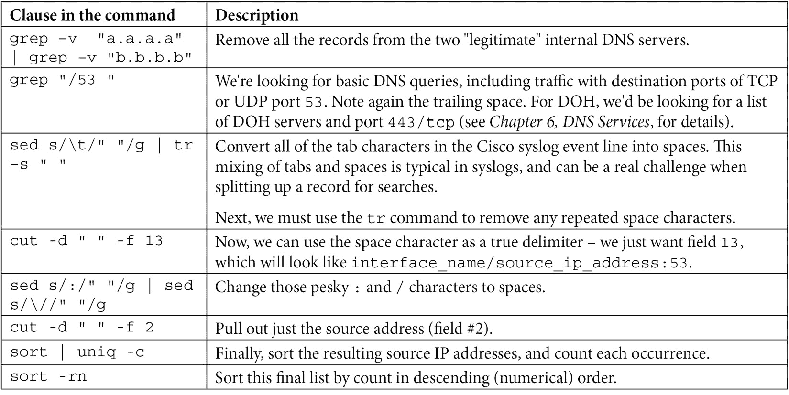

我们最后的命令吗? 让我们来看看:

```sh
cat logfile.txt | grep –v  "a.a.a.a" | grep –v "b.b.b.b" | grep "/53 " | sed s/\t/" "/g | tr –s " " | cut -d " " -f 13 | sed s/:/" "/g | sed s/\//" "/g | cut -d " " -f 2 | sort | uniq –c | sort –r
```

这看起来很复杂，但请记住，这是迭代完成的—我们分别计算请求中的每个“子句”，并按顺序将它们串在一起。 而且，在许多情况下，我们可能会花费几分钟甚至几个小时来获得一个“刚刚好”的查询，但随后会以一种自动的方式使用该查询多年，所以这些时间是值得花的!

此外，虽然我们使用 Linux 命令行文本处理命令展示了这个查询，但同样的方法也可以用于数据库日志存储库，甚至用于针对不同防火墙进行查询。 不管目标设备、日志存储库类型是什么，或者我们正在解决的问题是什么，最常见的方法是做以下工作:

*   使用一些粗略的查询或选择(包括或排除)将数据缩减为更易于管理的量。
*   做任何处理数据所需的事情，以便可以更具体地查询它。
*   使用一些更具体的查询来缩小范围。
*   如果我们要查找计数或最常见的情况，总结数据以匹配所需。
*   测试最终的查询/选择条件。
*   将最终的搜索条件插入到需要的任何自动化中，以便以任何需要的频率对这些信息进行总结或报告。

本文讨论了如何通过搜索过去事件的日志来诊断过去的问题，但是我们不能使用日志来立即告诉我们何时发生了已知的问题吗? 简短的回答是“是的，绝对的。” 让我们探讨一下这是如何实现的。

## 针对特定事件的警报

这是“找到该找的东西”对话的一个扩展——可能与“什么时候去找”的话题同时出现。 当然，发现问题的最佳时间是它发生的那一刻——或者甚至是在它发生之前，以便您能够尽快地修复它。

为此，通常定义简单的文本字符串来指示问题并在问题发生时向正确的人员发出警报。 您可以在此类警报发生时立即向他们发送电子邮件警报或 SMS 消息，或者收集一天的警报并发送每日摘要—您的方法可能取决于您的环境和所看到的警报的严重性。

常见的搜索术语包括以下(几乎总是推荐不区分大小写的搜索):


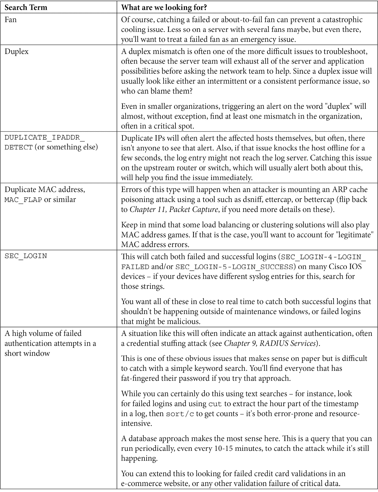

在所有这些情况下,您可能会想添加一个`not`条款可能过滤掉用户浏览或搜寻这些术语——例如,“糊”会发现所有电池事件,但它也将找到用户寻找蛋糕食谱和棒球新闻故事。 如果你把“http”从的搜索词中排除，通常你会得到你所需要的。

有了这些触发器，你就可以在问题变成问题之前阻止一堆问题——这总是一件好事。

现在我们已经讨论了搜索和触发器，让我们构建一个日志服务器并真正尝试这些方法!

## Syslog 服务器示例—Syslog

要在 Linux 主机上运行基本的syslog 服务，我们将配置`rsyslog`服务。 默认情况下，该服务侦听端口`514/udp`，尽管端口和协议都是可配置的。

日志事件有不同的优先级或严重级别，通常由发送设备设置:

*   `emerg, panic`(Emergency) - Level`0`:最低日志级别。 系统不可用。 通常，这些是您在系统崩溃之前看到的最后消息。
*   `alert`(警报):级别`1`:必须立即采取行动。 这些通常会影响整个系统的运行。
*   `crit`(紧急):级别`2`:与警报一样，必须立即采取行动。 系统的主要功能可能无法运行。
*   `err`(Errors):级别`3`:重要错误，但系统仍处于启动状态。 系统的主要功能可能会受到影响。
*   `warn`(Warnings):级别`4`:警告条件。
*   `notice`(通知):等级`5`:正常但有重要情况。
*   `info`(Information):级别`6`:信息消息。
*   `debug`(Debugging): Level`7`:这是最高的调试级别消息。

通常，当您配置一个日志级别时，会包括所有较低的日志级别。 因此，如果在主机上配置级别 4 的 syslog，则还包括 0、1、2 和 3。 这解释了为什么在大多数情况下，您只为任何给定主机配置一个日志级别。

很可能`rsyslog`已经安装并在您的 Linux 主机上运行。 让我们检查:

```sh
~$ sudo systemctl status rsyslog
• rsyslog.service - System Logging Service
     Loaded: loaded (/lib/systemd/system/rsyslog.service; enabled; vendor prese>
     Active: active (running) since Tue 2021-06-15 13:39:04 EDT; 11min ago
TriggeredBy: • syslog.socket
       Docs: man:rsyslogd(8)
             https://www.rsyslog.com/doc/
   Main PID: 783 (rsyslogd)
      Tasks: 4 (limit: 9334)
     Memory: 4.1M
     CGroup: /system.slice/rsyslog.service
             └─783 /usr/sbin/rsyslogd -n -iNONE
Jun 15 13:39:04 ubuntu systemd[1]: Starting System Logging Service...
Jun 15 13:39:04 ubuntu rsyslogd[783]: imuxsock: Acquired UNIX socket '/run/syst>
Jun 15 13:39:04 ubuntu rsyslogd[783]: rsyslogd's groupid changed to 110
Jun 15 13:39:04 ubuntu rsyslogd[783]: rsyslogd's userid changed to 104
Jun 15 13:39:04 ubuntu rsyslogd[783]: [origin software="rsyslogd" swVersion="8.>
Jun 15 13:39:04 ubuntu systemd[1]: Started System Logging Service.
Jun 15 13:39:05 ubuntu rsyslogd[783]: [origin software="rsyslogd" swVersion="8.
```

如果您没有安装此服务，那么只需运行以下命令即可:

```sh
$ sudo apt-get install rsyslog 
```

安装并运行服务之后，让我们继续进行配置。 编辑`/etc/rsyslog.conf`文件，确保使用`sudo`权限进行此操作。

您将发现控制侦听端口的行如下所示。 取消对 UDP 的注释，如下所示(其中包含`imudp`的两行)。 如果你也想在`514/tcp`上接受 syslog，也可以取消注释(这里显示的都是未注释的):

```sh
# provides UDP syslog reception
module(load="imudp")
input(type="imudp" port="514")
# provides TCP syslog reception
module(load="imtcp")
input(type="imtcp" port="514")
```

如果你想限制 syslog 客户特定子网或 DNS 域,你可以通过添加一个`AllowedSender`这个文件,如下所示,下面的“输入”我们只是注释(一定要使用正确的协议根据你添加这条线节):

```sh
$AllowedSender UDP, 127.0.0.1, 192.168.0.0/16, *.coherentsecurity.com
```

接下来，我们将向下滚动到这个文件的`GLOBAL DIRECTIVES`部分。 在这一行之前，我们将添加一行作为“模板”来命名传入的文件并标识它们的位置。 我们可以使用几个`"%"`分隔变量，最常见的如下:


在我们的配置中，我们将使用主机 IP 作为文件名，然后按日期打破日志:

```sh
$template remote-incoming-logs, "/var/log/%$year%-%$month%-%$day%/%FROMHOST-IP%.log"
*.* ?remote-incoming-logs
```

使用以下命令检查文件语法:

```sh
$ rsyslogd -N 1
rsyslogd: version 8.2001.0, config validation run (level 1), master config /etc/rsyslog.conf
rsyslogd: End of config validation run. Bye.
```

其他可以用来模板 syslog 文件的变量名称包括:

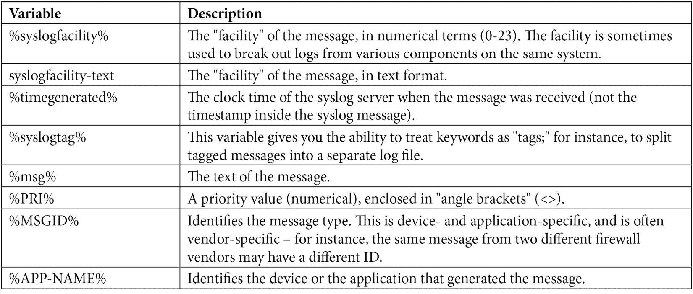

现在，保存文件并重新启动`rsyslog`服务:

```sh
$ sudo systemctl restart rsyslog
```

现在，我们要做的就是配置所有的服务器和设备将日志转发到这个服务器，对吧?

这给我们带来的是一堆非常昂贵的日志(就磁盘空间而言)。 我们真正想要的是从这些日志中获得一些实时警报的方法。 我们将使用名为**的日志跟踪**的过程来实现这一点。 这来自于`tail`命令，当使用以下命令将行添加到文本文件中时，该命令将回显:

```sh
tail –f < filename.txt
```

这是文本的回声，但没有给我们任何提示。 为此，我们必须安装一个名为`swatch`的包(用于“syslog watch”):

```sh
Apt-get install swatch
```

安装完成后，我们将创建一个配置文件来告诉该工具要查找什么。 回头看看我们的常见警告列表，这里显示的`swatch.conf`文件可能是一个好的开始:

```sh
watchfor /batter/i
echo red
mail=facilities@coherentsecurity.com, subject="ALERT: Battery Issue"
watchfor /temperature|fan|water/i
echo environmental
mail=rob@coherentsecurity.com, subject="ALERT: Environmental Alert"
watchfor /BGP/
echo routing_issue
mail=rob@coherentsecurity.com, subject="ALERT: Routing Issue"
watchfor /SEC_LOGIN_FAILED/
echo security_event
mail=rob@coherentsecurity.com, subject="ALERT: Administrative Login Failed"
continue
watchfor /SEC_LOGIN_FAILED/
threshold type=threshold,count=5,seconds=600
echo security_event
mail=rob@coherentsecurity.com, subject="ALERT: Possible Password Stuffing Attack in Progress"
```

这里有几件事要注意——我们要找的文本在`watchfor`子句中。 注意，在每种情况下，要监视的文本都是一个“正则表达式”，即`regex`。 `regex`语法非常灵活，既可以非常简单(如前面所示)，也可以复杂到难以理解。 在本章的末尾，我引用了一些正则表达式。

在我们的示例中，第一个正则表达式以`/I`结束，这告诉`watchfor`命令这是一个不区分大小写的搜索。 注意，这是相当耗费 cpu 的，所以如果知道匹配文本中的情况，最好将其正确地放入正则表达式中。

在第二个子句中，注意我们有三个不同的搜索词，用`|`字符分隔，这是一个逻辑上的“或”——换句话说，“温度、风扇或水”。

最后两个例子是相互联系的。 第一个会查找失败的登录，并在每次登录失败时提醒您。 但它有一个`continue`命令，告诉 swatch 继续。 下一个子句匹配相同的文本，但有一个阈值——如果 swatch 在 5 分钟内看到 5 次失败的登录尝试，它就识别出可能的密码填充攻击。

您还可以让匹配的日志语句使用`exec`命令而不是`mail`来触发脚本。

最后，我们要开始 swatch 过程:

```sh
$swatchdog –c /path/swatch.conf –t /path/logfile.log
```

这个命令会带来两点:

*   我们已经提到了日志大小的问题，因此，当前存储日志的路径不应该与`/var/log`在同一个分区中，因为`/var/log`只对本地日志设置大小。 它绝对不应该与引导分区或任何其他系统分区在同一个分区中。 填满 syslog 分区会导致日志丢失，但也会导致服务器崩溃或无法启动! 我们希望将我们的日志放在一个独立的、专用的分区中，以便存储我们需要的内容。 归档日志可以在同一个分区中，也可以在第二个分区中，仅用于归档(可能是 zip 压缩的)日志。
*   我们对`rsyslog`的当前配置需要 sudo 权限才能查看日志。 因此，我们要么需要修改文件和目录权限，要么需要使用 sudo 运行`swatchdog`。 两者都有一定程度的风险，但是为了便于使用日志进行故障排除，让我们更改文件权限。 这可以在`/etc/rsyslog.conf`文件中通过修改以下行完成:

```sh
$FileOwner syslog
$FileGroup adm
$FileCreateMode 0640
*.*
$DirCreateMode 0755
*.*
$Umask 0022
$PrivDropToUser syslog
$PrivDropToGroup syslog
```

在大多数情况下，您可以将`FileGroup`命令更改到一个不同的组，并将您的各种管理人员放入该组，以及您运行“swatch”设置的任何帐户。

或者，您可以更改 File 和 Dir`CreateMode`行，可能一直包括`0777`中的“每个人”。 由于日志条目总是包含敏感信息，我不建议这样做——作为一个渗透测试人员，在日志文件中找到密码是相当常见的——令人惊讶的是，人们经常在`userid`字段中输入他们的密码，然后用正确的信息再次尝试!

您仍然可以在目录名中使用日期，但通常更容易为活动文件保持一致的文件和目录名集合。 这使得日志监控工具和故障排除人员更容易找到“今天”的问题。 在存档脚本中使用日期值意味着历史日志文件要么在一个“日期”目录中，要么有一个“日期”ZIP 文件名。

话虽如此，我们修改后的 swatch 命令看起来将类似如下:

```sh
$swatchdog –c /path/swatch.conf –t /path/logfile.log --daemon
```

注意，我们在命令中添加了`–d`—一旦调试完毕并正常工作，您将希望这个参数在后台运行命令(作为一个守护进程)。

可能有更多的工作,你将需要做的样布生产中——例如,将这些权限“这样”为您的环境,通过您的网络库存,并确保你有中央日志记录你所有的装备,让日志分区大小,让你的日志轮换工作。 不过，我们所涵盖的内容应该足以让你上路了; 这些其他工作的大部分将特定于您的环境。

随着我们组织的日志的覆盖，现在出现了其他问题:我们的事件与其他组织相比如何? 我们会像其他人一样看到同样的袭击吗，或者我们可能是特定事情的目标? 我们怎样才能得到这个信息? 我们将在下一节中讨论这个问题。

# Dshield 项目

的 Dshield项目维护的网络风暴中心的人[(https://isc.sans.edu),并允许参与者他们(匿名)日志转发给一个中央存储库,它们聚合提供良好的照片在互联网上发生的事情。”](https://isc.sans.edu)

具体来说，所转发的信息是被防火墙阻止的连接尝试。 如果你不想使用你的实际防火墙日志，也可以使用一个专用的 Dshield 传感器。 参与说明请参见:[https://isc.sans.edu/howto.html](https://isc.sans.edu/howto.html)。

这些聚合的数据让我们看到恶意参与者正在寻找哪些端口，并打算利用它们。 参与者的地址是匿名的信息。 各类高级报表可在此查看:[https://isc.sans.edu/reports.html](https://isc.sans.edu/reports.html)。

特别是，您可以深入到该页面上的任何“前 10 个端口”，以查看扫描的最受欢迎端口的活动随时间的变化。 例如:[https://isc.sans.edu/port.html?port=2222](https://isc.sans.edu/port.html?port=2222)，如下截图所示:

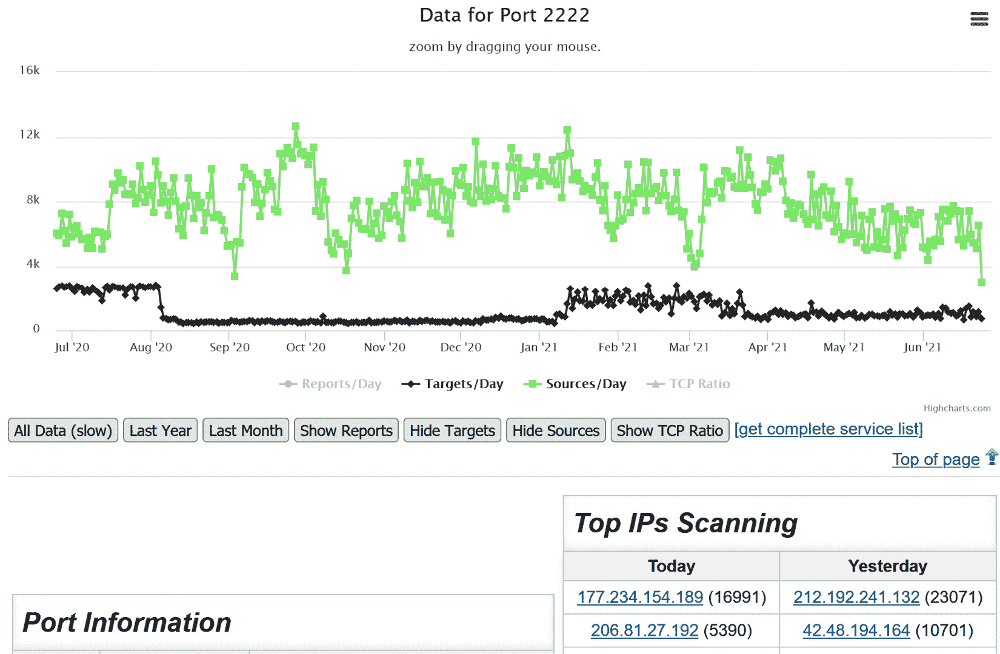

图 12.1 -一个端口的 Dshield 数据

从这个模式中，您可以看到如果您有可能要对其进行取证的特定流量，则如何查询任何端口。

此外，如果您愿意使用脚本或应用程序来使用这些聚合的信息，则可以通过 API 来查询这些信息。 Dshield API 文档如下:[https://isc.sans.edu/api/](https://isc.sans.edu/api/)。

例如，为了收集端口`2222`的汇总信息，我们可以使用`curl`(仅作为示例):

```sh
$ curl –s –insecure https://isc.sans.edu/api/port/2222 | grep –v encoding\= | xmllint –format –
<?xml version="1.0"?>
<port>
  <number>2222</number>
  <data>
    <date>2021-06-24</date>
    <records>122822</records>
    <targets>715</targets>
    <sources>3004</sources>
    <tcp>100</tcp>
    <udp>0</udp>
    <datein>2021-06-24</datein>
    <portin>2222</portin>
  </data>
  <services>
    <udp>
      <service>rockwell-csp2</service>
      <name>Rockwell CSP2</name>
    </udp>
    <tcp>
      <service>AMD</service>
      <name><![CDATA[[trojan] Rootshell left by AMD exploit]]></name>
    </tcp>
  </services>
</port>
```

因为在本例中数据是以 XML 格式返回的，所以您可以使用标准库或语言组件使用它。 您还可以将返回格式更改为 JSON、文本或 PHP。 在某些情况下，数据本身适用于逗号或制表符分隔的格式(CSV、制表符)。

要更改格式，只需将`?format_type`添加到查询中，其中`format_type`可以是 JSON、文本、PHP，或者在某些情况下，CSV 或选项卡。

每个用户都有自己的 web 门户，该门户显示了他们自己设备的这些相同的统计数据——这些数据在故障排除中很有价值，或者可以将其与聚合数据进行对比，以查看您的组织是否可能成为攻击的目标。 但这种方法的优势在于汇总的数据，它能很好地描绘出某一天互联网的“天气”以及整体的“气候”趋势。

现在我们有当地日志配置和防火墙日志聚合,从而获得更好的网络流量分析,让我们考虑一下其他网络管理协议和方法,从**简单网络管理协议(SNMP**)管理/性能和正常运行时间。****

 **## 通过 SNMP 管理网络设备

在其核心，SNMP 是一种方式从目标网络设备收集信息。 大多数情况下，这是由基于服务器的应用程序完成的，但您当然可以从命令行查询 SNMP。SNMP 有几个版本，其中两个是目前常用的。

SNMPv2c (2c 版本)是对最初的 v1 协议的轻微改进，但仍然是一种“老派”的数据收集方法——SNMP 查询和响应都是在 UDP 上以明文传输的。 使用密码保护(称为*社区字符串*),但这也是以明文发送,所以 Ettercap 等工具可以很容易地收集这些,甚至经常推荐“长和复杂的“字符串不保护你如果你攻击者可以简单地剪切和粘贴重用。 此外，默认的团体字符串(用于只读访问的公共字符串和用于读写访问的私有字符串)通常都保留在原处，因此仅使用这些字符串进行查询通常可以为攻击者带来良好的结果。 通常建议在目标设备上使用 ACL 保护对 SNMP 的访问。 然而，由于执行 ARP 中毒攻击非常容易，一个定位良好的攻击者也可以很容易地绕过这些 acl。

SNMPv3 是该协议的最新版本，它增加了一个最受欢迎的加密特性。 与 SNMPv2c 提供的“读或读/写”访问控制不同，它还提供了一种更细致入微的访问控制方法。

正如我们前面提到的，SNMP(任何一个版本)都可以用来“轮询”目标设备以获取信息。 此外，该设备还可以主动向 SNMP 服务器或日志采集器发送 SNMP“trap”。 SNMP轮询使用`161/udp`，SNMPtrap 发送到`162/udp`(尽管 TCP 可以配置)。

介绍了一些背景知识之后，让我们做几个示例查询。

### 基本的 SNMP 查询

在你可以在 Linux 上执行命令行查询之前，你可能需要安装`snmp`包:

```sh
$ sudo apt-get install snmp
```

现在，我们可以创建一个示例查询。 在我们的第一个例子中，我收集了 IOS 版本的实验室开关:

```sh
$ snmpget –v2c –c <snmpstring> 192.168.122.7 1.3.6.1.2.1.1.1.0
iso.3.6.1.2.1.1.1.0 = STRING: "SG550XG-8F8T 16-Port 10G Stackable Managed Switch"
```

要收集系统正常运行时间(以秒为单位，以人类可读的时间戳为单位)，请使用以下命令:

```sh
$ snmpget -v2c -c <snmpstring> 192.168.122.7 1.3.6.1.2.1.1.3.0
iso.3.6.1.2.1.1.3.0 = Timeticks: (1846451800) 213 days, 17:01:58.00
```

那么接口的统计数据呢? 让我们从名字开始:

```sh
snmpget -v2c -c <snmpstring> 192.168.122.7 .1.3.6.1.2.1.2.2.1.2.2
iso.3.6.1.2.1.2.2.1.2.2 = STRING: "TenGigabitEthernet1/0/2"
```

然后，我们可以得到数据包进出(单播):

```sh
$ snmpget -v2c -c <snmpstring> 192.168.122.7 .1.3.6.1.2.1.2.2.1.11.2
iso.3.6.1.2.1.2.2.1.11.2 = Counter32: 4336153
$ snmpget -v2c -c public 192.168.122.7 .1.3.6.1.2.1.2.2.1.17.2
iso.3.6.1.2.1.2.2.1.17.2 = Counter32: 5940727
```

您已经理解了这一点——几乎每个常见参数都有一个 OID。 但我们怎么才能把它们都弄清楚呢?

首先，这个在 RFC 1213 中是标准化的，MIB-2 是大多数供应商作为“最小公分母”实现支持的最新定义集。 其次，定义是分层的。 这显示了基本树的“顶部”，并突出显示了**mib-2**的 OID:


图 12.2 - SNMP OID 树，显示 mib-2

当有一组接口时，将有一个计数，然后是每个接口统计信息的表(按接口索引)。 如果使用`snmpwalk`而不是`snmpget`，则可以收集整个列表以及每个条目的所有子参数。 这显示了 mib-2 的`ifTable`(接口表)部分的开始:

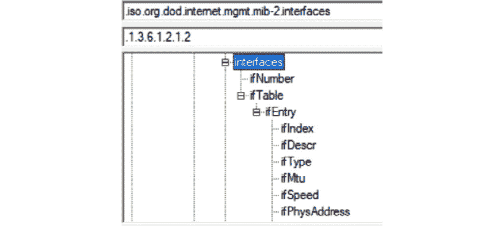

图 12.3 - SNMP OID 树，显示接口信息(ifTable)

此外，它们还维护 oid 的“起点”列表，每个供应商都有其自定义的项目树。 这里显示的是 OID 树的**私有**分支的顶部。 请注意，在树的顶部，你会发现一些组织可能已经被收购，或者由于这样或那样的原因在企业环境中不再常见:

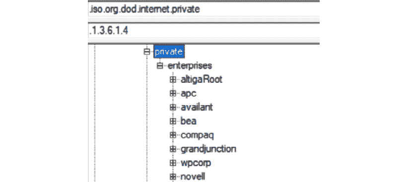

图 12.4 - SNMP OID 树，显示 Vendor OID 部分

这个模型或多或少很好地结合在一起，各种设备维护它们的各种计数器，等待一个有效的服务器查询这些值。

如果您有一个起始点，您可以使用`snmpwalk`命令从该起始点向下遍历 oid 树(参见*SNMPv3*一节中的示例)。 不用说，这可能会变成一种“找到我真正想要的数字”的混乱的工作，它会在数百行文本中展开。

此外，如您所见，SNMP 树中的每个“节点”都被命名。 如果有适当的定义，就可以通过名称而不是 OID 来查询。 您可能已经在您的 Linux 主机上安装了 MIB-2 定义，因此您也可以导入和管理供应商 MIB 定义。 安装或管理各种 MIB 定义的一种简单方法是使用`snmp-mibs-downloader`包(使用我们熟悉的`apt-get install`方法安装该包)。

要安装供应商的 mib，我们可以使用 Cisco(作为示例)。 在安装`snmp-mibs-downloader`后，编辑`/etc/snmp-mibs-downloader/snmp-mibs-downloader.conf`文件并将`cisco`指示符添加到`AUTOLOAD`行。 这一行现在应该如下所示:

```sh
AUTOLOAD="rfc ianarfc iana cisco"
```

在哪里和如何收集思科 mib 的定义在`/etc/snmp-mibs-downloader/cisco.conf`:

```sh
# Configuarions for Cisco v2 MIBs download from cisco.com
#
HOST=ftp://ftp.cisco.com
ARCHIVE=v2.tar.gz
ARCHTYPE=tgz
ARCHDIR=auto/mibs/v2
DIR=pub/mibs/v2/
CONF=ciscolist
DEST=cisco
```

单独的 MIB 定义在`/etc/snmp-mibs-downloader/ciscolist`中——正如你所看到的，这个文件太长了，无法在这里列出:

```sh
# cat :/etc/snmp-mibs-downloaderciscolist | wc -l
1431
```

更新完`snmp-mibs-downloader.conf`文件后，只需运行以下命令:

```sh
# sudo download-mibs
```

您将看到每个 MIB 文件被下载(所有 1431 个文件)。

通过加载 MIB 文本描述(默认值在安装`snmp-mibs-downloader`后加载)，您现在可以使用文本描述查询 SNMP -在本例中，我们将查询实验室开关的`sysDescr`(系统描述)字段:

```sh
snmpget -Os -c <snmpstring> -v2c   192.168.122.5 SNMPv2-MIB::sysDescr.0
sysDescr.0 = STRING: SG300-28 28-Port Gigabit Managed Switch
```

即使使用描述性字段名，这个过程也会非常迅速地变得非常复杂——这时就要用到**网络管理系统**(**NMS**)。 大多数网管系统都有一个点击式的web 界面，你可以从 IP 开始，然后通过界面或其他统计信息来获得你想要的信息。 然后，它通常会随着时间的推移，以图形的方式呈现这些信息。 大多数更好的 nms 会找出设备是什么，并创建您通常需要的所有图形，而无需进一步提示。

**哪里出问题了?**

SNMPv2 的明文性质是一个持续存在的问题——许多组织根本就没有转向具有更安全传输的 SNMPv3。

更糟糕的是，许多组织只是继续使用默认的 SNMP 团体字串; 也就是“公共的”和“私人的”。 在几乎所有情况下，都不需要对 SNMP 进行读写访问，但人们还是会配置它。 这种情况变得更糟,不仅可以关闭接口或重启设备如果你有读/写访问,但你通常可以获取一个完整的设备配置和访问,甚至还有一个运行 nmap 脚本检索一个思科 IOS 配置。

操作上，如果查询设备上的每个接口和统计信息，往往会影响该设备的 CPU。 从历史上看，特别是在开关上，如果查询每个接口，(在操作系统的一个版本或另一个版本上)会发现内存泄漏错误。 这些情况可能非常糟糕，以至于您可以画出内存利用率的图表，并看到这些查询每个查询不返回几个字节的直线增长，最终达到没有足够的内存供设备运行的地步。

这些是很明显的建议。 使用 SNMPv3 协议，限制对已知服务器的 SNMP 访问，只查询您需要的接口。 在防火墙和路由器上，这可能包括所有接口，但在交换机上，通常只查询关键服务器的上行链路和接口——特别是管理程序。

在介绍了一些理论之后，让我们构建一个流行的基于 linux 的网管——LibreNMS。

## SNMP 网管部署示例—LibreNMS

LibreNMS是一个由从 Nagios NMS(现在主要是一个商业产品)派生而来的 NMS，对于一个免费的 NMS 应用程序来说，它具有相当多的功能。 更重要的是，让您的设备注册的学习曲线非常简单，安装可以大大简化。

首先，LibreNMS 的安装文档非常完整，涵盖了所有不同的数据库、网站和其他相关组件。 我们不会在这里介绍这些说明，因为它们会随着版本的不同而变化; 最好的来源是供应商的下载页面。

但是，与从头安装相比，使用任何一个预先安装的映像并从那里开始安装通常要简单得多。 VMware 和 Hyper-V 都是非常广泛的管理程序，也是许多企业的主要计算平台。 对于这些，LibreNMS有一个完整的 Ubuntu 安装在预先打包的**Open Virtualization Format**(**OVA**)文件中。 事实上，顾名思义，在部署预构建的 VM 映像时，几乎普遍支持该文件类型。

本章举例中，您可以下载并导入 LibreNMS 的 OVA 文件。 您需要查询的设备将与示例不同，这取决于您的环境中的内容，但核心概念将保持不变。 部署 NMS 的一个很大的副作用是，就像日志记录和日志警报一样，您可能会发现自己不知道存在的问题——从过热的 CPU 到以最大容量运行的接口或“太接近最大”容量。

### 虚拟机监控程序的细节

确保部署 LibreNMS VM 的网络能够访问将要监视的设备。

VMware 环境下，该虚拟机的默认磁盘格式为“精简”。 这意味着虚拟磁盘一开始的容量只能容纳其上的文件，然后随着文件存储空间的增加而增加。 这对于实验室/测试 VM 来说很好，但是在生产环境中，您几乎总是需要一个“大容量的”磁盘—您不希望服务器意外地“增长”并耗尽您的存储空间。 这永远不会有好结果，特别是在同一个数据存储中有多个服务器进行精简配置时!

一旦部署完成，您将需要使用`librenms`帐户登录—该帐户的密码在不同版本中会有所改变，因此请务必参考下载的文档。 登录后，请注意该帐户具有根权限，因此使用`passwd`命令更改`librenms`的密码。

使用`ip address`命令获取当前 IP 地址(参见[*第二章*](02.html#_idTextAnchor035)，*基本 Linux 网络配置和操作-使用本地接口*)。 认为该主机将使用 SNMP 监控关键设备,你可能想添加 ACL 的这些设备来限制访问 SNMP,鉴于您需要手动设置 IP 地址、子网掩码,网关,DNS 服务器静态值。 您可以使用静态 DHCP 保留来实现这一点，也可以在服务器上静态地分配它——选择您所在组织的标准方法。

完成此操作后，使用 HTTP 而不是 HTTPS 浏览到该地址。 考虑到这个服务器上的信息的敏感性，我建议安装一个证书并强制使用 HTTPS，但我们不会在本章中讨论这个问题(尽管 LibreNMS 文档在这方面做了很好的介绍)。 web 登录也是`librenms`，但默认密码会有所不同; 也可以参考您的下载文档。

你现在应该有一个**编辑仪表板**启动画面:

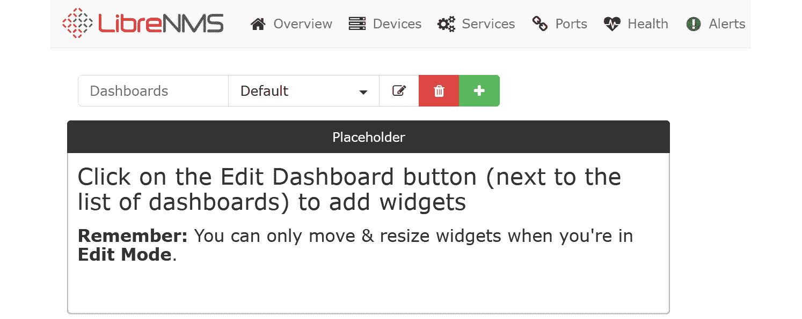

图 12.5 - LibreNMS Edit Dashboard 启动界面

在你继续之前，点击屏幕右上方的`librenms`帐户图标:


图 12.6 - LibreNMS“帐户”及“系统”图标

然后，更新网络帐户的密码:

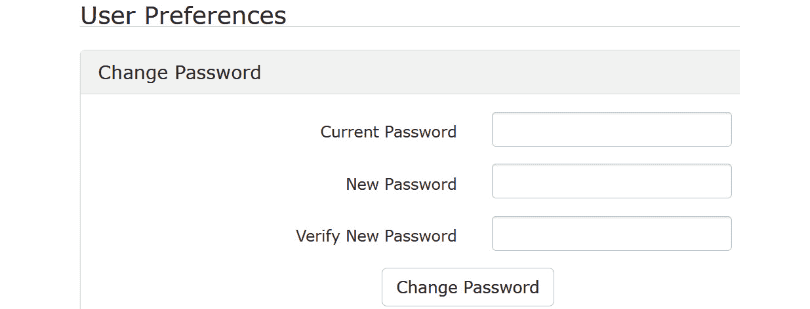

图 12.7 -在 LibreNMS 中更改默认密码

在服务器启动并运行之后，让我们看看如何添加一些要管理的设备。

### 搭建 SNMPv2 基本设备

要添加最基本的设备，您需要进入那个设备。 您需要启用 SNMP(在本例中是版本 2)，然后添加一个团体字符串，希望还可以添加一个 ACL 来限制访问。 例如，在一个典型的思科交换机上，这看起来像这样:

```sh
ip access-list standard ACL-SNMP
 permit 192.168.122.174
 deny   any log
snmp-server community ROSNMP RO ACL-SNMP
```

就是这样! 注意，我们将`ROSNMP`用于 SNMP Community 字符串—这对于生产环境来说太简单了。 另外，请注意，`RO`参数确保这是只允许只读权限的字符串。

现在，回到 LibreNMS，从主仪表盘选择**设备**>**添加设备**:


图 12.8 -向 LibreNMS 添加设备

填写设备的 IP 地址，以及团体字串。 你的屏幕应该看起来像这样(当然是你自己设备的 IP地址):

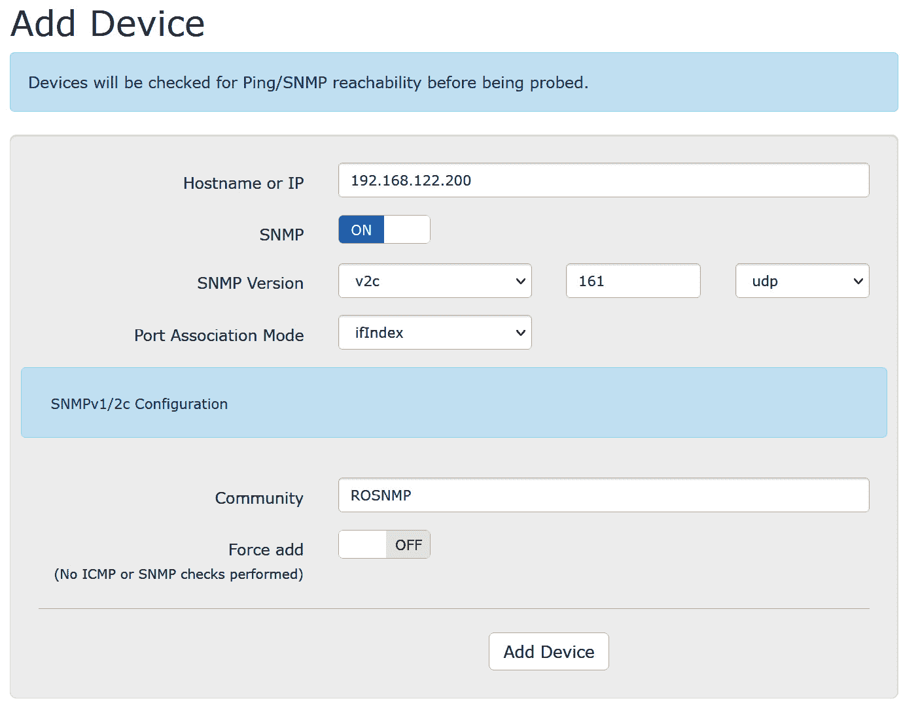

图 12.9 -在 LibreNMS 中添加设备细节

现在，您可以通过选择**设备**>**所有设备**浏览到刚刚添加的设备，然后单击您的设备。

注意，LibreNMS 已经开始绘制 CPU 和内存利用率，以及整个设备和每个接口的流量。 网络设备(在本例中是防火墙)的默认页面如下所示:


图 12.10 -在 LibreNMS 中收集的设备统计信息

当您向下钻取到任何特定的可点击链接或图表时，将显示收集到的统计数据的进一步细节。 通常，即使鼠标在链接上也会显示出详细信息——在这种情况下，通过鼠标在`vmx0`链接上，特定接口的详细信息会显示出来:

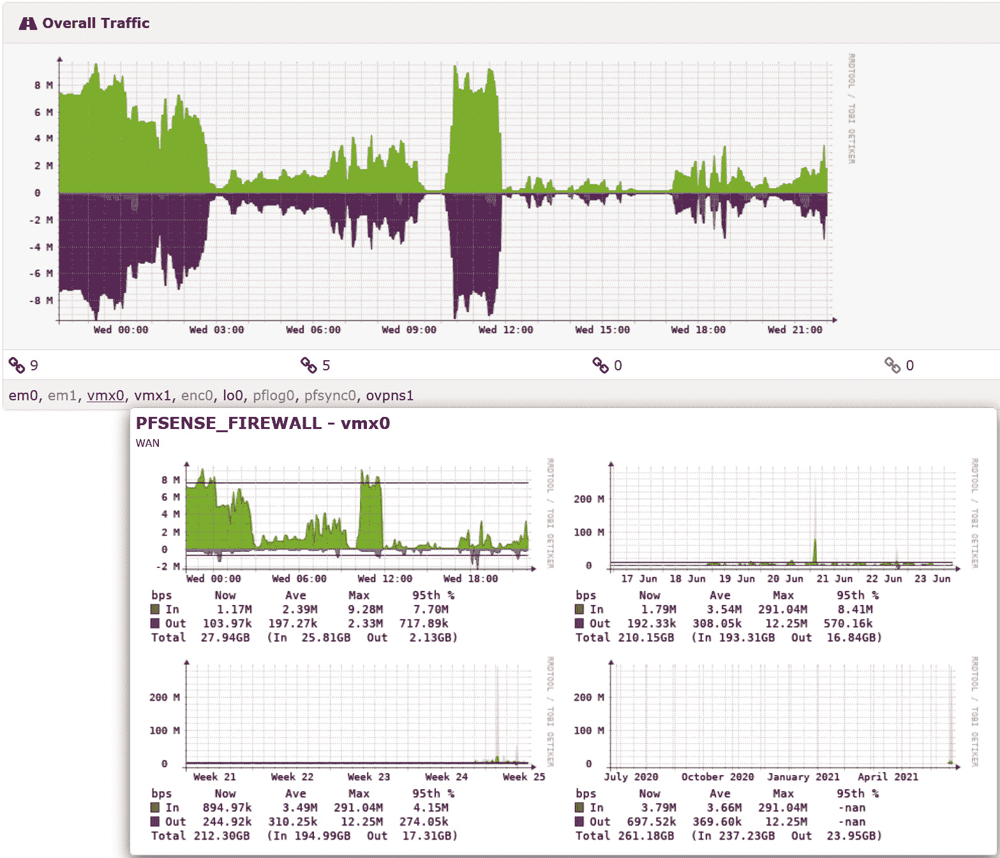

图 12.11 -在 LibreNMS 中鼠标移到接口上获取接口详细信息

我们已经讨论了部署 SNMPv2 的风险，因为它的纯文本性质和简单的身份验证。 让我们通过使用 SNMPv3 来解决这个问题。

## SNMPv3

SNMP 版本3 是，配置起来并不复杂。 在大多数情况下，我们采用默认的“只读”SNMP 视图，只添加一个用于身份验证的口令和一个加密密钥。 在设备端，这是一个思科 IOS 配置示例:

```sh
ip access-list standard ACL-SNMP
    permit 192.168.122.174
    deny   any log
snmp-server view ViewDefault iso included 
snmp-server group GrpMonitoring v3 priv read ViewDefault access ACL-SNMP
snmp-server user snmpadmin GrpMonitoring v3 auth sha AuthPass1 priv aes 128 somepassword
```

关键参数如下:

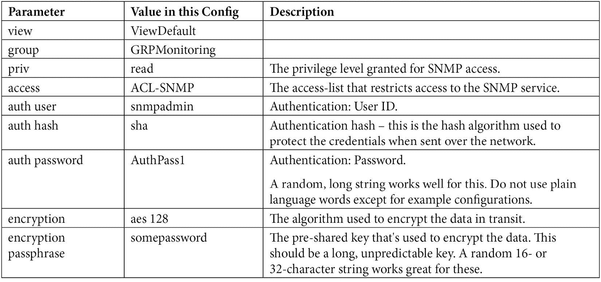

我们可以使用`snmpwalk`或`snmpget`命令测试。 例如，`snmpwalk`命令提取系统描述值(注意，我们需要在 ACL-SNMP 访问列表中需要调用站的 IP):

```sh
$ snmpwalk -v3 -l authPriv -u snmpadmin -a SHA -A AuthPass1 -x AES -X somepassword 192.168.122.200:161 1.3.6.1.2.1.1.1.0
iso.3.6.1.2.1.1.1.0 = STRING: "Cisco IOS Software, CSR1000V Software (X86_64_LINUX_IOSD-UNIVERSALK9-M), Version 15.5(2)S, RELEASE SOFTWARE (fc3)
Technical Support: http://www.cisco.com/techsupport
Copyright (c) 1986-2015 by Cisco Systems, Inc.
Compiled Sun 22-Mar-15 01:36 by mcpre"
```

在网管端，它就像匹配我们在设备上使用的各种配置密码和参数一样简单:

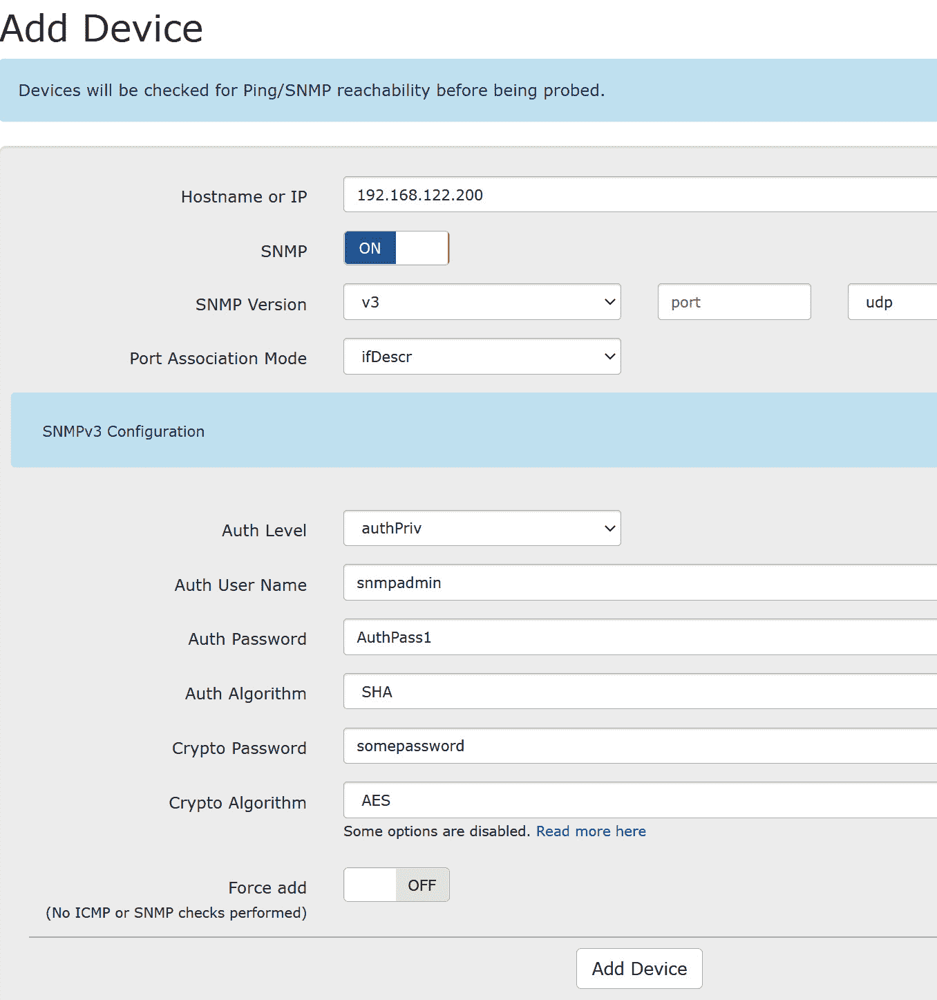

图 12.12 -使用 SNMPv3 向 LibreNMS 目录添加设备

在注册之后，我们可以通过编辑设备来固定设备的名称，然后将设备的名称更改为更容易记住的名称，并添加一个 IP 覆盖(网管将使用它进行访问)。 当然，如果设备有一个 DNS 名称，那么使用它的 FQDN 注册它也可以。 依赖 DNS 可能会成为一个问题，但是当 DNS 可能不可用时，您需要 NMS 进行故障排除—实际上，您可能正在进行 DNS 故障排除!


图 12.13 -在 LibreNMS 中更改设备名称并添加“Overwrite IP

注意,即使我们添加了真正的身份验证(使用一个散列密码在运输途中)和授权的访问级别(通过添加授权),以及实际数据的加密,我们还添加一个普通访问列表来保护路由器上的 SNMP 服务。 “深度防御”的咒语让我们认为，最好假设一个或多个保护层在某些时候可能会被破坏，因此向任何目标服务添加更多的保护层将会更好地保护它。

我们可以通过使用 SNMPv3 发送加密的 SNMP trap 消息来扩展 SNMPv3 的使用，以取代明文 syslog 日志记录。 这使我们的日志服务有些复杂，但这是值得的!

额外的安全配置可用于 SNMPv3; 您的平台的 CIS基准通常是一个很好的参考。 如果你只是想深入挖掘，或者你的路由器或交换机没有供应商提供的基准或良好的安全指导，Cisco IOS 的 CIS 基准是一个很好的起点。

除了提供额外的保护之外，SNMP 版本 2 和 SNMP 版本 3 之间的底层 SNMP 功能几乎保持不变。 一旦注册到网管系统中，使用 SNMPv2 和 SNMPv3 的设备在系统中不会有任何显著的不同。

既然我们正在使用 SNMP 监视所有各种网络连接的设备和服务器，那么我们可以使用 NMS 的轮询引擎添加警报来监视设备或服务的故障吗?

### 警报

你需要做的主要事情之一就是添加一些提醒来配合你的数据。 例如，如果您转到**Alerts**>**Alert Rules**并单击**Create rule from collection**，您将看到以下屏幕:

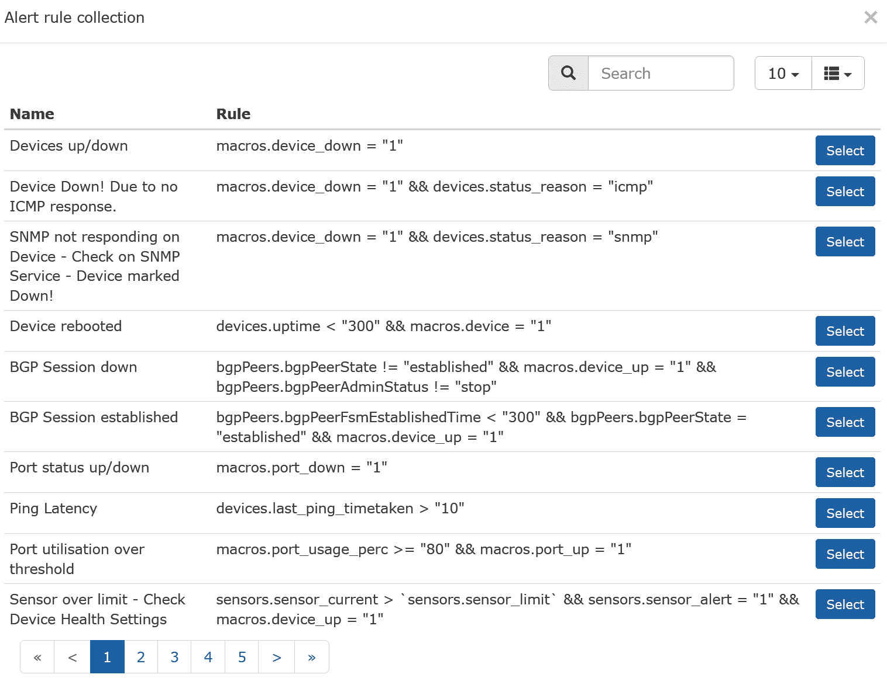

图 12.14 - LibreNMS 中的默认警报集合

让我们添加一个警报，它将在利用率超过 80%的任何接口上触发。 要查看默认集合中是否有类似这样的内容，请在*Search*字段中输入`utili`—当你输入时，搜索范围会缩小:


图 12.15 -在 LibreNMS 中添加警报

选择规则; 我们将得到一些选项:


图 12.16 - LibreNMS 中的警报规则选项

应该从顶部的开始重命名规则。 如果您决定导入默认规则集，您不希望因为尝试使用重复的规则名而导致失败。 通常，我将命名自定义规则，以便它们以下划线开头; 这确保了排序时它们总是位于规则列表的顶部。 由于我们对集合中的内容进行了复制，所以我们还可以轻松地更改触发警报的百分比。

对于**匹配设备、组和位置列表**，事情变得棘手起来。 按照目前的情况，匹配列表中没有任何内容，并且**除了列表**中的所有设备都被设置为**OFF**，因此该规则将不匹配任何内容。 让我们选择我们的设备:


图 12.17 -在 LibreNMS 中匹配警报规则中的设备和组

现在，保存规则。 是的，就这么简单!

你有没有注意到前面菜单中的**组**选择? 使用设备组是为所有类似的设备分配一个规则的好方法——例如，您可能对路由器或交换机端口有不同的端口阈值。 这样做的原因是，提高路由器的广域网连接速度可能需要几周的时间，而不是改变交换机端口，这可能只需要将电缆从一个 1G 端口移动到一个 10G 端口(例如)。 因此，在这种情况下，有一个规则为所有路由器(可能是 60%)和一个不同的规则为所有交换机(设置在一些更高的数字)是很有意义的。

探索以下规则(您将看到许多您可能希望启用的规则):设备或服务关闭警报、CPU、内存或接口利用率警报以及温度或风扇警报。 其中一些警报依赖于 syslog——是的，LibreNMS 确实内置了一个 syslog 服务器。 **概述**>**Syslog**:

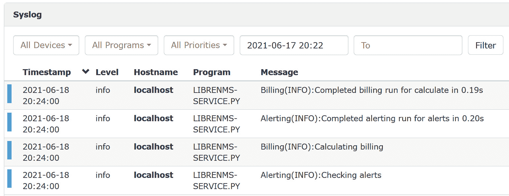

图 12.18 - LibreNMS 中的 Syslog 显示

请注意，您可以使用一些简单的搜索，但它非常简单。 使用这个 syslog 服务器是一个很好的工具，这样警报就可以监视它——这比我们在本章前面设置的警报要简单得多。 但是，您仍然需要保留我们设置的这些文本日志，以便更好地搜索和更长期的存储。

当我们向 NMS 添加设备，或者部署设备并为其命名时，有一些事情我们应该记住。

### 添加设备时要记住一些事情

当您添加设备和组时，一定要给它们命名，尤其是设备，以便它们按逻辑排序。 命名约定通常使用设备的类型(例如 FW、SW 或 RT)、位置名称的标准(例如分支编号)或城市名称的缩写形式—(例如，CHI、TOR 和 NYC 表示芝加哥、多伦多和纽约市)。 重要的事情是一致性，计划好如何排序，并保持名称中的各种术语简短——记住，您将键入这些东西，它们最终也将出现在电子表格列中。

到目前为止，我们主要关注使用 SNMP 监视统计信息。 现在，让我们监视设备上正在运行的服务。

### 监控服务

请记住，主机上的服务是要监视的关键内容。 在 NMS 中使用类似 nmap 的功能来监视数据库访问、api、web 和 VPN 服务的端口是很常见的。 更高级的监视器将轮询服务，并确保从轮询返回的数据是正确的。

在监视服务之前，我们需要启用服务检查。 SSH 到 LibreNMS 主机并编辑`/opt/librenms/config.php`文件。 添加以下一行:

```sh
$config['show _services']             =1;
```

您可能还希望取消注释部分或所有这些`$config`行(以便您可以扫描子网，而不是一次添加一个设备):

```sh
### List of RFC1918 networks to allow scanning-based discovery
#$config['nets'][] = "10.0.0.0/8";
#$config['nets'][] = "172.16.0.0/12";
$config['nets'][] = "192.168.0.0/16";
```

现在，我们将通过在`/etc/cron.d/librenms`文件中添加以下内容来更新应用程序的 cron 调度程序:

```sh
*/5  *    * * *   librenms    /opt/librenms/services-wrapper.py 1
```

默认情况下，并不是所有的插件都安装了——事实上，在我的安装中，一个都没有安装。 像这样安装它们:

```sh
apt-get install nagios-plugins nagios-plugins-extra
```

现在，我们应该能够添加一个服务。 选择**Services**>**Add a Service**in LibreNMS and monitor for SSH on our core switch (TCP 端口`22`):

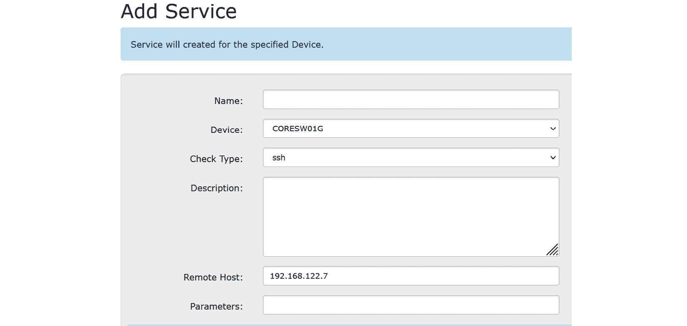

图 12.19 -在 LibreNMS 中监视一个基本服务

您可以对此展开—您注意到在添加第一个服务时，列表中有多少个服务检查吗? 让我们为 HTTP 服务添加一个监视器。 在这种情况下，我们将在防火墙上查看它。 这也是监视 SSL VPN 服务的一个方便的检查:


图 12.20 -使用参数监控 LibreNMS 中的 HTTPS 服务

注意，这里的参数很重要。 `-S`表示检查应该使用 SSL(或者更具体地说，TLS)。 `–p 443`表示要轮询的端口。

现在，当我们导航到**Services**页面时，我们将看到刚才添加的两个服务。 你可能需要给 LibreNMS 几分钟的时间来轮询他们:

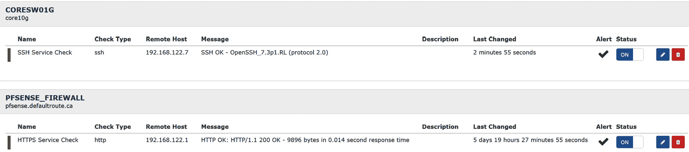

图 12.21 - LibreNMS 中显示的服务

可用的插件的完整列表可以直接从**服务配置**页面的下拉菜单中看到:


图 12.22 - LibreNMS 中可用的服务检查

一些常用的检查包括以下:


这些检查的所有参数的文档位于[https://www.monitoring-plugins.org/doc/man/index.html](https://www.monitoring-plugins.org/doc/man/index.html)。

涵盖了 LibreNMS 系统的基本操作。 现在，让我们继续收集和分析流量。 我们不会使用数据包捕获，而是使用 NetFlow 协议家族将高级流量信息聚合为“流”。

# 在 Linux 上收集 NetFlow 数据

当看到接口吞吐量不够时，和该怎么做? 通常，这些 SNMP 吞吐量图会告诉您您遇到了问题，但不会将您带到下一步——什么协议或哪些人正在占用所有的带宽? 我是否可以通过配置来解决这个问题，或者我是否需要制定政策来帮助控制我的组织中人们的视频习惯，或者我真的需要更多的带宽?

我们怎样才能得到这个信息? 它不像 SNMP 那么简单，但是 NetFlow 收集了您可能需要的所有信息，以帮助您成为一个“带宽侦探”。 让我们讨论一下这是如何工作的，以及涉及到哪些协议。

## 什么是 NetFlow 和它的“表亲”SFLOW, J-Flow 和 IPFIX?

如果你还记得在[*第三章*](03.html#_idTextAnchor053),*使用 Linux 和 Linux 工具网络诊断*、【显示】和在[*第 11 章*【病人】,*数据包捕获和分析在 Linux 中*,在](11.html#_idTextAnchor192)我们讨论了包“元组”,这是我们对几乎所有使用这一概念。 NetFlow 是一种服务，它从一个标识的接口(通常在路由器、交换机或防火墙上)收集流量，并对其进行总结。 它收集来总结的信息几乎总是包含我们在本书前面讨论过的核心元组值:

*   源 IP
*   目的地 IP
*   协议(TCP, UDP, ICMP，或任何其他协议)
*   源端口
*   目的港

然而，正如我们稍后将看到的，现代 NetFlow 配置可以通过添加以下内容来扩展标准元组值:

*   QOS信息(TOS 或 DSCP 位)
*   BGP**自治系统**(**AS**)编号
*   TCP 标志(SYN、ACK 等)

TCP 标志非常关键，因为第一个包(只有一个 SYN 标志集)定义了在任何对话中哪个主机是客户端，哪个主机是服务器。

NetFlow 最初是由思科开发的，但是在 RFC 流程下开发的，以允许业界更广泛地采用，而且除了思科之外，许多供应商都支持 NetFlow。 NetFlow 有两个常见的版本——5 和 9——主要的区别是支持的字段数量。 有一些常见的“表亲”协议:

*   **sFlow**由 InMon 开发作为一个开放标准，并支持 RFC。 我们经常看到网络设备同时支持 NetFlow 和 sFlow。
*   **IPFIX**(**IP 流量信息输出**)是另一个开放标准，它建立在之上，(或多或少)是 NetFlow v9 的一个超集。
*   **J-Flow**是 NetFlow的等价于 Juniper 设备，尽管在其最新版本(J-Flow v9)中，它看起来与 IPFIX 相同，并且在 Juniper 的特定设备文档中以这种方式记录。

无论您使用什么协议来导出流信息，接收此信息的系统通常会接收其中的任何一个或全部。 导出通常在 UDP 端口上。 虽然在某些情况下，端口将在规范中定义，但它总是可以更改的，而且常常会因供应商的不同而不同。 例如，NetFlow 经常出现在端口`2055`、`2056`、`4432`、`9995`或`9996`上。 sFlow 被正式定义为在端口`6343`上，但通常部署在其他端口上。 IPFIX 还没有被广泛使用(除了作为 J-Flow v9)，但被指定为在`4739`上。

虽然有一些细微的差异(特别是 sFlow，在数据收集和汇总的方式上有一些差异)，但结果是相同的。 汇总后，数据被发送到后端服务器，在那里它是可查询的。 在这些数据存储库中，网络管理员寻找和警察侦探一样的东西:

*   **Who**sent the data, and to**Where**? (源和目的 IP)
*   **是什么数据(源，特别是目的端口)**
***   **When**is it sent?*   **为什么常常推断通过定义的应用程序被用来发送数据,思科的**基于网络的应用程序识别**(**NBAR)附加有帮助,或者你经常可以推断出从目的港的应用程序在服务器端(流)。*********   **在每个时间间隔内**发送的数据量。******

 ****让我们更深入地研究收集、聚合和发送流数据的工作方式，以及它如何在组织的网络中影响您的设计和实现。

## 流程收集实现概念

所有这些流量收集协议中的一个关键概念是采样。 所有这些协议在其配置中都有一个“每个 y 包对应的 x 包样本”属性，不同的供应商和平台有不同的默认值。 例如，较新的路由器通常会默认为 100%的采样率，因为它们通常是较低带宽的平台(通常低于 100 Mbps)，并有 CPU 备份采集率。 在 1G、10G 或更快的开关上，这种速率通常是不实际的——在这些情况下，以合理的速率采样变得至关重要。

选择接口也是实现的关键。 与在 SNMP 中一样，在大型交换机的所有端口上收集流信息可能会严重影响交换机的 CPU(及其总体吞吐量)。 不过，在这一点上，你可能会有所不同，因为高端交换机将把遥测功能转移到专用的硅上，以更少地使用主机箱 CPU。

选择集合拓扑也很重要。 例如，在一个数据中心/总部/分支机构场景中，如果大部分流量是“hub and spoke”(也就是说，分支到分支的通信很少)，那么您可能只会在中心位置收集流数据，并将流收集器放在相同的中心位置。 在这种情况下，分支的流量与总部的流量是相反的，因此通过 WAN 第二次发送流量通常是不明智的，这可能会花费您的带宽费用。

的例外是**Voice over IP**(**VoIP**)。 如果你回想一下[*第 11 章*](11.html#_idTextAnchor192)，*Linux 上的包捕获和分析*，呼叫建立使用 SIP 协议，是在电话手柄和 PBX 之间。 调用本身使用 RTP，直接从一个手持设备到另一个。 如果有大量的分支到分支的 VoIP 通信，您也可以选择监控分支路由器的广域网接口。

最后，请记住，在对这些数据进行采样和聚合的同时，这些数据最终会到达服务器，并必须存储在磁盘上，在磁盘上，这些数据积累得很快。 您可能会发现，当您“找到”创建有意义的报告需要保留多少信息时，您可能不得不相当频繁地增加分区或数据库大小(不幸的是，总是增加)。

类似地，随着数据量的增加，对内存和 CPU 的需求也会增加。 你可能会发现，你可以通过在数据库中添加索引来加速报告或网页界面本身。 不幸的是，添加索引通常会消耗额外的磁盘和内存需求，所以也要记住这一点。 随着对需求的深入研究，您将发现数据库管理技能会随着时间的推移而增长，并最终帮助您优化其他以数据库为中心的应用程序。

总是存在将 syslog、SNMP 和流收集组合在一个网络管理服务器上的诱惑。 虽然组合 syslog 和 SNMP 是一件常见的事情，但是如果网管使用一个数据库来存储日志信息，那么您可能需要一个单独的、基于文本的日志存储库—如果只是为了使您的长期日志存储过程保持简单的话。 关于流收集，您几乎总是将其放在一个单独的服务器上。 您可能会在较小的环境中使用“一体化”方法，但是即使是许多较小的环境也会发现用于流收集的资源远远超过其他两个功能。 此外，对后端数据库的依赖和入站数据的高速率意味着这可能会使您的流收集服务器异常地“脆弱”——您可能会发现每年需要重新构建该服务器一次或两次，以修复“无法解释”的问题。 也正因为如此,你会发现它是相当常见的组织切换到一个不同的应用程序或数据库平台,当这一切发生的时候(除非涉及商业许可),只是因为到那时,他们就知道自己不喜欢前面的构建,因为有一个重建, 测试下一个解决方案的门槛很低。

在介绍了所有这些基本流信息之后，让我们构建一个真正的 NetFlow 解决方案，从一个典型的路由器开始。

## 配置路由器或交换机进行流量采集

首先，我们将定义我们想要收集的内容。 首先，我们需要标准的元组信息——源和目的 IP、协议和端口信息。 我们还会添加 QoS 信息(`ipv4 tos`线)，在可能的情况下添加方向和路由信息(`as`信息为 BGP 自治系统信息)。 在这个定义中还有`application name`。 如果你也在运行思科的 NBAR 插件，这主要是使用。 NBAR 是在接口上设置的(你会在下一页看到这个)，它帮助通过名称从组成的网络流量中识别应用程序:

```sh
flow record FLOW-RECORD-01
  match ipv4 tos
  match ipv4 protocol
  match ipv4 source address
  match ipv4 destination address
  match transport source-port
  match transport destination-port
  match application name
  match flow direction
  match interface input
  match interface output
  collect routing source as
  collect routing destination as
  collect transport tcp flags
  collect counter bytes
  collect counter packets
```

接下来，我们将定义流导出器。 这告诉系统要将流信息发送到哪里，以及从哪个接口发送。 流源很重要，因为如果它发生变化，它将看起来像 NetFlow 服务器上的另一个设备。 另外，请注意，我们在本节中定义了一个接口表，它将发送足够的接口信息，以帮助定义服务器上的主机和接口特征。 注意，流目的端口几乎总是 UDP，但端口号不是标准化的。 厂商通常都有自己的默认值，在我见过的所有实现中，端口号都是可配置的:

```sh
flow exporter FLOW-EXPORT-01
  destination 10.17.33.187
  source GigabitEthernet0/0/0
  transport udp 9996
  template data timeout 120
  option interface-table
  option exporter-stats timeout 120
  option application-table timeout 120
```

正如您在定义中看到的，流监视器将导出器和流记录联系在一起，以便将它们作为一个“东西”应用到接口:

```sh
flow monitor FLOW-MONITOR-01
  exporter FLOW-EXPORT-01
  cache timeout active 60
  record FLOW-RECORD-01
```

在接口上，您将看到我们定义了一个入站和出站的流监视器。 注意，您可以定义多个记录器和监视器。 通常，只有一个流输出器(因为对于任何给定的设备通常只有一个流目的地)。

例如，`bandwidth`语句通常用于帮助定义 OSPF 或 EIGRP 路由协议中的路由器度量。 但是，在流收集的情况下，定义带宽通常会自动配置各个流图的每个接口的总带宽。 定义每个物理接口的总带宽是关键，这样每个图都有一个准确的上限，然后将显示聚合和特定元组统计数据的准确百分比:

```sh
Interface Gigabit 0/0/1
  bandwidth 100000
  ip nbar protocol-discovery
  ip flow monitor FLOW-MONITOR-01 input
  ip flow monitor FLOW-MONITOR-01 output
```

第二层流收集——例如，在一个单独的交换机端口上——通常要简单得多。 例如，在 HP 交换机上，收集交换机端口上的 sFlow 数据可能如下所示。

请注意，端口号是`6343`。 与 NetFlow 不同，sFlow 的默认端口是`6343/udp`。 当然，它是可配置的其他值在客户端和服务器端:

```sh
sflow 1 destination 10.100.64.135 6343
interface <x>
 sflow 1 sampling 23 50
 sflow 1 polling 23 20
interface <y>
 sflow 1 sampling 23 50
 sflow 1 polling 23 20
```

请注意所定义的采样率和轮询间隔。 另外，请注意，由于您在此实例中是在第 2 层收集流数据，因此您的元组可能受到限制，这取决于您的交换机模型上的。 这也有助于解释为什么配置如此简单——除非开关分解采样帧以获得每个包的 L3/L4 信息，否则要收集的信息就少了。

路由器配置完成后，让我们继续构建和配置这个等式的服务器端。

## NetFlow 服务器使用 NFDump 和 NFSen

NFDump和**NetFlow Sensor**(**NFSen**)使为nice entrylevel的流量收集世界。 特别有趣的是,NFDump 使用自己的文件格式,并且命令行工具非常相似的操作 tcpdump(我们在[*第 11 章*【病人】,*数据包捕获和分析在 Linux 中*)。 因此，如果您喜欢我们在那一章中的过滤讨论和示例，那么使用 NFDump 工具来进行“top n”类型的统计和报告将是您的拿手之道!](11.html#_idTextAnchor192)

NFCapd 是一个流收集器应用程序。 我们会在前台和后台运行它。

NFSen 是 NFDump 的一个简单的 web 前端。

我们将在一个独立的 Linux 主机上运行它; 你可以使用我们在本书中一直使用的 Ubuntu 虚拟机或物理主机。 让我们从安装`nfdump`包开始(它为我们提供了几个与 netflow 相关的命令):

```sh
$ sudo apt-get install nfdump
```

现在，编辑`/etc/nfdump/.default.conf`文件，并更改顶部的`options`行:

```sh
options='-l /var/cache/nfdump/live/source1 -S 1 -p 2055'
```

这将把数据放在我们的 NFSen 服务器所期望的位置。 参数`-S`告诉 NFCapd 进程(我们将作为守护进程运行)向路径添加一个日期戳。 因此，2021 年 6 月 23 日，我们捕获的所有 NetFlow 数据将在目录:

```sh
/var/cache/nfdump/live/source1/2021/06/23
```

如您所料，这些数据往往会迅速累积，这可能有风险，因为`/var`也是日志和其他重要系统数据存储的地方。 在生产环境中，我建议您为此创建一个单独的分区，并将路径根设置为不同的值，比如`/netflow`。 这样，如果您的 NetFlow 流量已满，其他系统服务不会受到直接影响。

参数`–p`定义了`nfcapd`进程将要侦听的端口——默认的`2055`在大多数情况下应该工作良好，但是根据需要更改它。

现在，我们可以开始使用端口`2055/udp`将 NetFlow 流量定向到这个收集器 IP。 几分钟后，我们可以使用`nfdump`查看 NetFlow 数据。 数据文件在`/var/cache/nfdump/live/source1/`中收集(从那里沿着树一直到今天的日期)。

让我们来看看一个文件的前几行:

```sh
nfdump -r nfcapd.202106212124 | | head
Date first seen          Event  XEvent Proto      Src IP Addr:Port          Dst IP Addr:Port     X-Src IP Addr:Port        X-Dst IP Addr:Port   In Byte Out Byte
1970-01-01 00:00:00.000 INVALID  Ignore TCP     192.168.122.181:51702 ->     52.0                                      .134.204:443            0.0.0.0:0     ->          0.0.0.0:0           460                                              0
1970-01-01 00:00:00.000 INVALID  Ignore TCP      17.57.144.133:5223  ->  192.168                                      .122.140:63599          0.0.0.0:0     ->          0.0.0.0:0          5080                                              0
```

注意，每一行都换行。 让我们来看看元组信息以及每个样本间隔中被移动的数据量。 我们将取出列标题:

```sh
$ nfdump -r nfcapd.202106212124 | head | tr -s " " | cut -d " " -f 5,6,7,8,10,12,13 | grep –v Port
TCP 192.168.122.181:51702 -> 52.0.134.204:443 -> 460 0
TCP 17.57.144.133:5223 -> 192.168.122.140:63599 -> 5080 0
TCP 192.168.122.140:63599 -> 17.57.144.133:5223 -> 980 0
TCP 192.168.122.181:55679 -> 204.154.111.118:443 -> 6400 0
TCP 192.168.122.181:55080 -> 204.154.111.105:443 -> 920 0
TCP 192.168.122.151:51201 -> 151.101.126.73:443 -> 460 0
TCP 31.13.80.8:443 -> 192.168.122.151:59977 -> 14500 0
TCP 192.168.122.151:59977 -> 31.13.80.8:443 -> 980 0
TCP 104.124.10.25:443 -> 192.168.122.151:59976 -> 17450 0
```

现在，我们有了看起来像是信息的东西! 我们将两个方向的流量相加`-b`。 我们还将读取目录中所有可用的文件。 现在列是`Protocol`、`Src IP:Port`、`Dst IP:Port`、`Out Pkt`、`In Pkt`、`Out Byte`、`In Byte`和`Flows`。 注意，在某些情况下，我们有一个该时间段的活动流，但没有数据输入或输出:

```sh
$  nfdump -b -R /var/cache/nfdump | head | tr -s " " | cut -d " " -f 4,5,6,7,8,10,12,13 | grep -v Port
UDP 192.168.122.174:46053 <-> 192.168.122.5:161 0 0 1
TCP 52.21.117.50:443 <-> 99.254.226.217:44385 20 1120 2
TCP 172.217.1.3:443 <-> 99.254.226.217:18243 0 0 1
TCP 192.168.122.181:57664 <-> 204.154.111.113:443 0 0 1
TCP 192.168.122.201:27517 <-> 52.96.163.242:443 60 4980 4
UDP 8.8.8.8:53 <-> 192.168.122.151:64695 0 0 1
TCP 23.213.188.93:443 <-> 99.254.226.217:39845 0 0 1
TCP 18.214.243.14:443 <-> 192.168.122.151:60020 20 1040 2
TCP 40.100.163.178:443 <-> 99.254.226.217:58221 10 2280 2
```

让我们看看在的流量仅仅来自一个 IP 地址:

```sh
$  nfdump -b -s ip:192.168.122.181 -R /var/cache/nfdump | grep -v 1970
Command line switch -s overwrites -a
Top 10 IP Addr ordered by -:
Date first seen          Duration Proto           IP Addr    Flows(%)     Packets(%)       Bytes(%)         pps       bps   bpp
2021-06-21 21:42:19.468   256.124 UDP      34.239.237.116        2( 0.0)       20( 0.0)     1520( 0.0)        0       47    76
2021-06-21 21:29:40.058    90.112 TCP      204.79.197.219        4( 0.1)       80( 0.0)    12000( 0.0)        0     1065   150
2021-06-21 21:31:15.651   111.879 TCP      204.79.197.204        6( 0.1)      110( 0.0)    44040( 0.0)        0     3149   400
2021-06-21 21:39:42.414    58.455 TCP      204.79.197.203        7( 0.1)      150( 0.0)    92530( 0.0)        2    12663   616
2021-06-21 21:28:21.682  1046.074 TCP      204.79.197.200       18( 0.2)      570( 0.1)   288990( 0.1)        0     2210   507
2021-06-21 21:31:24.158    53.392 TCP     209.191.163.209       13( 0.2)      180( 0.0)    86080( 0.0)        3    12897   478
```

数据被包装，但您可以看到这是如何变得越来越有用。 它不是一个完整的包捕获，但在许多天，它是您可能需要的所有包捕获信息!

`–s`(statistics)参数非常有用，因为您可以在扩展元组中查询任何可能的 netflow 收集的信息。 `-A`允许您聚合相同的扩展信息，而`–a`只聚合基本的 5 元组。 注意，当您设置了`–b`时，您不能在源或目标IP 上聚合(因为`–b`已经聚合了这两个 IP)。

通常，你需要收集一个给定时间窗口的信息; 也就是说，当出现问题或症状时。 在这些情况下，`-t`(timewin)是你的朋友-让我们看看 21:31 和 21:32 之间，仍然只是为了那个 IP 地址。 再次注意，你会想要修改你的日期和交通模式:

```sh
$  nfdump -b -s ip:192.168.122.181 -t 2021/06/21.21:31:00-2021/06/21.21:32:59 -R /var/cache/nfdump
Command line switch -s overwrites -a
Top 10 IP Addr ordered by -:
Date first seen          Duration Proto           IP Addr    Flows(%)     Packets(%)       Bytes(%)         pps       bps   bpp
2021-06-21 21:32:43.075     0.251 IGMP         224.0.0.22        1( 0.1)       20( 0.0)      920( 0.0)       79    29322    46
2021-06-21 21:32:09.931     0.000 UDP     239.255.255.251        1( 0.1)       10( 0.0)      640( 0.0)        0        0    64
2021-06-21 21:31:07.030    47.295 UDP     239.255.255.250        4( 0.3)       60( 0.1)    18790( 0.0)        1     3178   313
2021-06-21 21:31:15.651     0.080 TCP      204.79.197.204        3( 0.2)       60( 0.1)    21220( 0.0)      750    2.1 M   353
2021-06-21 21:31:24.158    53.392 TCP     209.191.163.209       13( 0.9)      180( 0.2)    86080( 0.1)        3    12897   478
2021-06-21 21:31:09.920     0.252 TCP      52.207.151.151        4( 0.3)      170( 0.2)   142280( 0.2)      674    4.5 M   836
2021-06-21 21:32:12.799    11.421 TCP       52.95.145.171        7( 0.5)      110( 0.1)    22390( 0.0)        9    15683   203
2021-06-21 21:31:53.512     0.054 TCP     162.159.136.232        4( 0.3)       50( 0.1)     5250( 0.0)      925   777777   105
2021-06-21 21:31:11.890    51.148 TCP        209.15.45.65        5( 0.4)       60( 0.1)    32020( 0.1)        1     5008   533
2021-06-21 21:31:07.531    69.964 TCP        69.175.41.15       22( 1.6)      460( 0.5)   222720( 0.4)        6    25466   484
Summary: total flows: 1401, total bytes: 58.9 M, total packets: 85200, avg bps: 4.0 M, avg pps: 716, avg bpp: 691
Time window: 2021-06-21 21:26:17 - 2021-06-21 21:58:40
Total flows processed: 8052, Blocks skipped: 0, Bytes read: 516768
Sys: 0.003s flows/second: 2153517.0  Wall: 0.002s flows/second: 3454311.5 
```

在一个命令行中，我们总结了 2 分钟内进出一个主机的所有流量!

在基本功能正常工作之后，让我们为收集器安装 web 界面。 这就是 NetFlow数据最常被消耗的方式——协议模式中的异常通常很容易被肉眼看到。

下面的说明来自[https://github.com/mbolli/nfsen-ng](https://github.com/mbolli/nfsen-ng)(`nfsen-ng`是正在安装的应用程序):

首先，让我们把我们的特权提升到 root -这里几乎所有东西都需要这些权利:

```sh
sudo su -
```

安装我们需要的所有包:

```sh
apt install apache2 git nfdump pkg-config php7.4 php7.4-dev libapache2-mod-php7.4 rrdtool librrd-dev
```

启用 Apache 模块:

```sh
a2enmod rewrite deflate headers expires
```

安装`rrd`PHP 库:

```sh
pecl install rrd 
```

配置 RRD 库和 PHP:

```sh
echo "extension=rrd.so" > /etc/php/7.4/mods-available/rrd.ini
phpenmod rrd
```

配置虚拟主机，使其可以读取`.htaccess`文件。 编辑`/etc/apache2/apache2.conf`文件，编辑`/var/www`部分中的`Allow Override`行:

```sh
<Directory /var/www/>
        Options Indexes FollowSymLinks
        AllowOverride All
        Require all granted
</Directory>
```

最后，重启 Apache 服务器:

```sh
systemctl restart apache2
```

现在，我们准备安装`nfsen-ng`并设置文件/目录标志:

```sh
cd /var/www/html
git clone https://github.com/mbolli/nfsen-ng
chown -R www-data:www-data .
chmod +x nfsen-ng/backend/cli.php
```

仍然使用根权限工作，复制默认设置到设置文件:

```sh
cd /var/www/html/nfsen-ng/backend/settings
cp settings.php.dist settings.php
```

编辑结果`settings.php`文件。

在`nfdump`部分中，更新以下行以匹配:

```sh
    'nfdump' => array(
        'profiles-data' => '/var/cache/nfdump/',
        'profile' => '',
```

请注意，您可以更改这一点，特别是如果您计划根据`nfdump`文件的日期进行日志旋转，但目前这不在我们的范围内。

现在，让我们测试我们的配置(仍然作为根):

```sh
cd /var/www/html/nfsen-ng/backend
./cli.php -f import
2021-06-22 09:03:35 CLI: Starting import
Resetting existing data...
Processing 2 sources...                                         0.0% 0/2194 ETC: ???. Elapsed: < 1 sec [>                              ]
Processing source source1 (1/2)...
Processing 2 sources...                                 50.0% 1097/2194 ETC: < 1 sec. Elapsed: < 1 sec [===============>               ]
Processing source source2 (2/2)...
Processing 2 sources...                                100.0% 2194/2194 ETC: < 1 sec. Elapsed: < 1 sec [===============================]
```

如果这个进程没有错误，那么您的配置将看起来很好!

现在，指向您的各种网络设备，将它们的 NetFlow 结果发送到这个主机的 IP 地址，端口`2055/udp`(注意，您可以通过编辑`/etc/nfdump/default.conf`来更改这个侦听端口)。

让我们收集一些数据。 您可以通过观察目标目录中的文件大小来验证它是否正常工作。 一个“空”文件是 276 字节，但是一旦开始接收数据，您应该开始看到更大的文件。

现在，浏览您的服务器。 因为我们没有在 apache 中做任何花哨的事情，你的 URL 将如下:

```sh
http://<your server's IP address>/nfsen-ng/frontend/ 
```

现在，让我们看看图形方面的东西。 浏览到您的服务器 IP 地址- URL 应该类似于[http://192.168.122.113/nfsen-ng/frontend/](http://192.168.122.113/nfsen-ng/frontend/)。 当然，您可以通过将 Apache 配置为重新指向主页来简化这个 URL。

你的显示现在应该看起来像这样(你的数据值将不同):

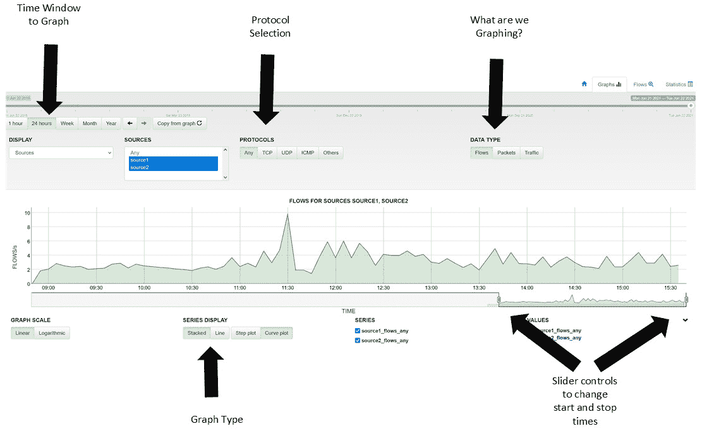

图 12.23 -在 NFSen 中使用显示/过滤控件显示图形中的基本流量数据

一个好的方法是来选择一个合理的时间尺度，然后使用滑块根据需要增大或缩小窗口。 在本例中，我们从一个 24 小时的图表开始，最后显示大约 6 小时。

该显示通常会突出显示可能需要关注的时间—您可以“放大”该图表以获得更多细节。

下一站将是**Flows**按钮(在显示器的右上方)。 这里一组好的选择将是一个合理的开始窗口。 接下来，选择各种聚合。

通常，您需要协议聚合与目的端口聚合。 接下来，您通常希望通过源 IP 和目标 IP 聚合 IP。 为确切的时间窗口添加 NFDUMP 过滤器通常也很有帮助。 如果您可以限制您的显示器为短-几分钟，如果可能，您将从这些显示器中获得最大的价值:


图 12.24 -流显示控制聚集和过滤在 NFSen

最终的选择将由您试图解决的问题决定，并且可能需要几次尝试才能得到最终诊断所需的显示。

当您的选择完成后，选择**过程数据**在屏幕下方获得您的结果:

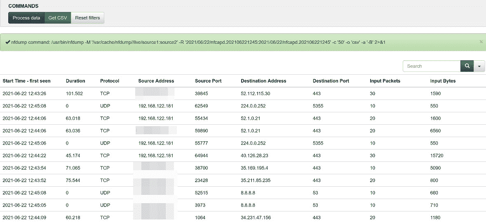

图 12.25 - NFSen 中的过滤结果

您可能希望到将其导出到 CSV，以便在电子表格中进一步操作您的数据。

在真实事件中，这看起来像什么? 让我们打开默认窗口，在那里我们将注意到一个可能可疑的流量“尖峰”。 我们也可能会得到这个时间段的帮助台或桌面团队,谁可能有法医的信息,一个 IPS 事件(见[*第十三章*](13.html#_idTextAnchor236),*入侵预防系统在 Linux 上*),或一个事件从桌面应用程序或反恶意软件保护的应用程序。 在这张每日视图中，我们可以看到在下午 2:30 之前出现了一个可疑的高峰 注意，我们使用滑块放大感兴趣的时间窗口。 另外，请注意，我们正在查看“流量”或“字节”视图-数据外滤通常只作为一个或两个流发生，所以这些攻击通常会在默认显示中突出:


图 12.26 -发现异常流量“峰值

让我们将将更改为协议显示，并稍微讨论一下。 在这个显示中，我们已经削减了只显示 UDP 的东西，我们可以看到一些可疑的东西-这个 UDP 流量是不正常的组织:


图 12.27 -在协议显示中显示调整，只显示 UDP

由于和在 14:20 出现了可疑的流量高峰，让我们深入挖掘一下。 让我们添加一个 nfdump 过滤器来查看 UDP，但是取出所有我们在内部 DNS 服务器上配置的 DNS 转发器的请求:

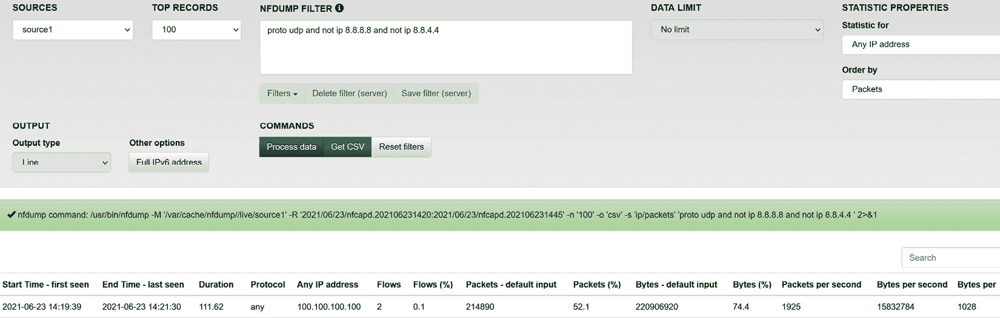

图 12.28 - UDP 搜索结果-删除合法的 DNS 流量

现在，深入挖掘，让我们看看这个可疑 IP 地址:


图 12.29 -过滤可疑 IP 地址

这给了我们以下的结果，显示了在防火墙上 NAT 转换前后相同的传输，除了这一次大的数据传输之外没有其他流量:

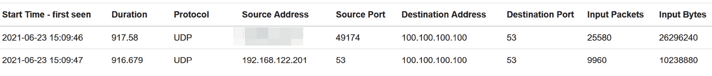

图 12.30 -防火墙上 NAT 转换前后的可疑流量

查看**Bytes**列中的总计，以及，知道目的地地址不是 DNS 服务器，这看起来确实像一个数据抽取的实例。 将数据抽取埋入通常被允许但没有被很好检查的协议中是一件很常见的事情。 通常，这是不同端口号上的一个 TFTP、FTP 或 SCP 副本——在本例中，这是`53/udp`，我们知道它通常用于 DNS。

使用 DNS，您甚至可以使用有效的查询来抽取数据—首先，使用 base64 对数据进行编码，然后以已知的“块”大小对结果文本进行连续的“A”记录查询。 然后接收服务器重新组装数据并将其解码为原始的二进制格式。 如果担心数据包顺序混乱，您甚至可以在传输中编码一个序列号。

现在我们已经发现了这种攻击，我们将如何在网络级别上防御这种攻击呢?

一个好的起点是为出站流量提供一个合理的访问列表，通常称为出口过滤器。 它是这样工作的:

*   允许我们的 DNS 服务器上的`53/udp`和`tcp`到其已知的转发 ip。
*   拒绝所有其他`53/udp`和`tcp`，并将该流量记录为警报。
*   通过协议和端口允许`ssh`，`scp`，`ftp`和其他已知的流量到已知的目标主机。
*   拒绝那些协议到所有其他主机，并记录这作为一个警报。
*   允许 HTTP 和 HTTPS 访问任何 IP(但在另一个保护层上，可能是声誉过滤或内容控制)。
*   拒绝所有其他流量，并将该流量记录为警报。

关键是,总是会有一个“下一个攻击”,但日志和警报袭击至少你知道通常会给你一些警告攻击开始时,经常够你采取行动,防止的攻击者成功的最终目标。

此时，您已经熟悉了使用 NFDUMP 和 NFSEN 组合。 但是你还可以使用其他开源 NetFlow Collector 应用程序吗?

### 其他开源 NetFlow 替代方案

nProbe 是由带我们去 ntop 的好人们写的，在[https://www.ntop.org/products/netflow/nprobe/#](https://www.ntop.org/products/netflow/nprobe/#)主持。 这允许您在任何主机上安装 NetFlow 收集器。 ntop 工具([https://www.ntop.org/products/traffic-analysis/ntop/](https://www.ntop.org/products/traffic-analysis/ntop/))是他们的收集器，它在 NetFlow 流行之前就给我们带来了很多 NetFlow 的好处，但是使用了数据包捕获和分析方法。 它已经扩展到支持所有版本的 NetFlow 和 IPFIX。 选择 ntop 最吸引人的因素是，它是一个单独的安装，所有的东西都打包在里面——大多数繁琐的配置都被处理了。 它还提供了关于底层应用程序的更详细的数据，甚至是在初始图形屏幕上。 缺点是，没有命令行工具集; 它是一个“一体化”的应用程序，提供了一个 web/图形界面。 ntop 工具套件可以免费下载。 在这个免费的层面上，它通过论坛和“最佳努力”邮件列表享受“社区支持”。

**System for Internet Level Knowledge**(**SILK**)是中最古老的流程收集工具之一，但它仍然支持所有较新的协议。 它是由 CERT 的网络态势感知组开发的，文档和下载在这里:[https://tools.netsa.cert.org/silk/](https://tools.netsa.cert.org/silk/)。 SILK 是一种免费工具，不提供任何商业产品。

说到这个，这个领域的商业产品怎么样?

### 商业产品

几乎每个拥有商业网管的供应商都有一个到该网管的流收集模块。 但是，当您深入研究它们的文档时，几乎所有这些工具都会建议您将流收集部署在与 SNMP 和 syslog 功能相同的服务器上。 正如我们前面讨论的，随着流数据量的增长和数据保留长度的增长，流收集服务将会淹没已经很忙的系统。 另外，考虑到大多数流收集服务的数据库密集型特性，通常看到人们必须定期清理数据，作为“当所有其他故障排除失败时”的步骤，以修复损坏的流收集服务器。 在大多数组织中，这些因素会使 NetFlow 或其相关服务迅速转移到它们自己的服务器和数据库中。

也就是说，在商业产品中，您经常会看到对应用程序的“外观和感觉”进行更多的工作。 例如，当为 NetFlow 添加一个设备接口时，接口名称通常会从接口的`description`值中读取，并且图形的最大带宽最初将从接口的吞吐量值或路由器的“带宽”度量(如果设置了)中设置。 图通常包括应用程序名称和工作站名称，甚至用户 id。 图表还将从一开始就深入到目标端口值和数据速率——因为这是您通常希望结束的地方。 总的来说，大多数商业产品的设置都要容易得多，无论是在初始应用程序中还是在添加设备时。

# 总结

此时，您应该意识到可以从各种系统的日志中收集大量有用的数据，以及如何使用命令行工具来“挖掘”这些数据，以找到可以帮助您解决特定问题的信息。 日志警报的使用也应该很熟悉，它允许您在问题的早期阶段主动发送警报。

然后介绍了 Dshield 项目。 我们欢迎您的参与，但即使您不提供数据，它也可以是一个快速“互联网天气报告”的宝贵资源，以及帮助定义“互联网气候”到恶意流量(按端口和协议)的趋势。

您现在应该熟悉 SNMP 的工作原理，以及如何使用基于 SNMP 的 NMS 来管理网络设备甚至 Linux 或 Windows 服务器上的性能指标。 我们在示例中使用了 LibreNMS，但是其方法甚至实现在您使用的几乎任何 NMS 上都非常相似。

在更高级的级别上，您应该非常熟悉 NetFlow 协议，并在网络设备和 Linux 收集器上配置它。 在本章中，我们使用 NetFlow 作为检测工具，对网络流量进行高级取证，发现可疑流量，最终发现恶意数据泄露事件。

在下一章中，我们将探讨**入侵防御系统**(**IPS**)，它将基于本书几章的内容来寻找并经常阻止恶意网络活动。

# 问题

正如我们总结的，这里有一个问题列表，供你测试你对本章材料的知识。 你可以在附录的*评估*部分找到答案:

1.  为什么启用 SNMP 的读写团体访问是一个坏主意?
2.  使用 Syslog 有哪些风险?
3.  NetFlow 也是一个明文协议。 这样做有什么风险?

# 进一步阅读

有关本章内容的更多信息，请查看以下资源:

*   处理 Syslog 数据的方法:
    *   [https://isc.sans.edu/diary/Syslog+Skeet+Shooting+-+Targetting+Real+Problems+in+Event+Logs/19449](https://isc.sans.edu/diary/Syslog+Skeet+Shooting+-+Targetting+Real+Problems+in+Event+Logs/19449)
    *   [https://isc.sans.edu/forums/diary/Finding+the+Clowns+on+the+Syslog+Carousel/18373/](https://isc.sans.edu/forums/diary/Finding+the+Clowns+on+the+Syslog+Carousel/18373/)
*   斯沃琪手册页:
    *   [http://manpages.ubuntu.com/manpages/bionic/man1/swatchdog.1p.html](http://manpages.ubuntu.com/manpages/bionic/man1/swatchdog.1p.html)
    *   [https://linux.die.net/man/1/swatch](https://linux.die.net/man/1/swatch)
*   斯沃琪主页:
    *   [https://github.com/ToddAtkins/swatchdog](https://github.com/ToddAtkins/swatchdog)
    *   [https://sourceforge.net/projects/swatch/](https://sourceforge.net/projects/swatch/)
*   各种正则表达式备忘单:
    *   [https://www.rexegg.com/regex-quickstart.html](https://www.rexegg.com/regex-quickstart.html)
    *   [https://developer.mozilla.org/en-US/docs/Web/JavaScript/Guide/Regular_Expressions/Cheatsheet](https://developer.mozilla.org/en-US/docs/Web/JavaScript/Guide/Regular_Expressions/Cheatsheet)
    *   [https://www.sans.org/security-resources/posters/dfir/hex-regex-forensics-cheat-sheet-345](https://www.sans.org/security-resources/posters/dfir/hex-regex-forensics-cheat-sheet-345)
*   在线正则表达式“建设者”:
    *   [https://regexr.com/](https://regexr.com/)
    *   https://gchq.github.io/CyberChef/配方= Regular_expression(用户定义的% 20,”,真的,真的,假的,假的,假的,假的,“突出% 20 场比赛”)输入=搞笑
*   出口过滤器:[https://isc.sans.edu/forums/diary/Egress+Filtering+What+do+we+have+a+bird+problem/18379/](https://isc.sans.edu/forums/diary/Egress+Filtering+What+do+we+have+a+bird+problem/18379/)
*   相关的 rfc:
    *   **Syslog**:[https://datatracker.ietf.org/doc/html/rfc5424](https://datatracker.ietf.org/doc/html/rfc5424)
    *   SNMP:
        1.  [https://datatracker.ietf.org/doc/html/rfc3411](https://datatracker.ietf.org/doc/html/rfc3411)
        2.  [https://datatracker.ietf.org/doc/html/rfc3412](https://datatracker.ietf.org/doc/html/rfc3412)
        3.  [https://datatracker.ietf.org/doc/html/rfc3413](https://datatracker.ietf.org/doc/html/rfc3413)
        4.  [https://datatracker.ietf.org/doc/html/rfc3415](https://datatracker.ietf.org/doc/html/rfc3415)
        5.  [https://datatracker.ietf.org/doc/html/rfc3416](https://datatracker.ietf.org/doc/html/rfc3416)
        6.  [https://datatracker.ietf.org/doc/html/rfc3417](https://datatracker.ietf.org/doc/html/rfc3417)
        7.  [https://datatracker.ietf.org/doc/html/rfc3418](https://datatracker.ietf.org/doc/html/rfc3418)
    *   **SNMP MIB II**:[https://datatracker.ietf.org/doc/html/rfc1213](https://datatracker.ietf.org/doc/html/rfc1213)
    *   **SNMPv3:**
        1.  [https://datatracker.ietf.org/doc/html/rfc3414](https://datatracker.ietf.org/doc/html/rfc3414)
        2.  [https://datatracker.ietf.org/doc/html/rfc6353](https://datatracker.ietf.org/doc/html/rfc6353)
    *   **NetFlow**:[https://datatracker.ietf.org/doc/html/rfc3954.html](https://datatracker.ietf.org/doc/html/rfc3954.html)
    *   **sFlow**:[https://datatracker.ietf.org/doc/html/rfc3176](https://datatracker.ietf.org/doc/html/rfc3176)
    *   **IPFIX**:[https://datatracker.ietf.org/doc/html/rfc7011](https://datatracker.ietf.org/doc/html/rfc7011)
    *   **SNMP oid for 各个供应商**:参考您的供应商文档; 这里列出了一些您经常看到的 oid。

## 常用的 SNMP oid

*   监控路由器上的 CPU:`1.3.6.1.4.1.9.2.1.58.0`
*   监控路由器的内存:`1.3.6.1.4.1.9.9.48.1.1.1.6.1`
*   **ASA 防火墙:**
    *   系统:`1.3.6.1.2.1.1`
    *   接口:`1.3.6.1.2.1.2`
    *   Ip:`1.3.6.1.2.1.4`
    *   记忆:`1.3.6.1.2.1.4.1.9.9.48`
    *   Cpu:`1.3.6.1.2.1.4.1.9.9.109`
    *   防火墙:`1.3.6.1.2.1.4.1.9.9.147`
    *   缓冲液:`1.3.6.1.2.1.4.1.9.9.147.1.2.2.1`
    *   连接:`1.3.6.1.2.1.4.1.9.9.147.1.2.2.2`
    *   SSL 统计:`1.3.6.1.4.1.3076.2.2.26`
    *   IPSec 统计信息:`1.3.6.1.2.1.4.1.9.9.171`
    *   远程访问统计:`1.3.6.1.2.1.4.1.9.9.392`
    *   FIPS 统计:`1.3.6.1.2.1.4.1.9.9.999999`
    *   在 PIX/ASA 防火墙活动连接:`1.3.6.1.4.1.9.9.147.1.2.2.2.1.5.40.7`
    *   当前活跃的 IPsec phase 2 隧道总数:`1.3.6.1.4.1.9.9.171.1.3.1.1.0`

您将需要以下 mib:

*   If-mib, rfc1213-mib, cisco-memory-poolmib, cisco-process-mib, entity-mib, cisco-smi, cisco-firewall-mib。 ASA 还增加了 CISCO-IPSEC-FLOW-MONITOR-MIB、CISCO-FIPS-STAT-MIB 和 ALTIGA-SSL-STATS-MIB。
*   可堆叠开关序列号:`1.3.6.1.2.1.47.1.1.1.1.11.1`
*   可堆叠交换机的 IOS 版本:`1.3.6.1.2.1.47.1.1.1.1.9.1`
*   路由器上的 ARP 缓存:`1.3.6.1.2.1.3.1.1.2`
*   接口最近状态变化:`1.3.6.1.2.1.2.2.1.9`.【接口编号】********