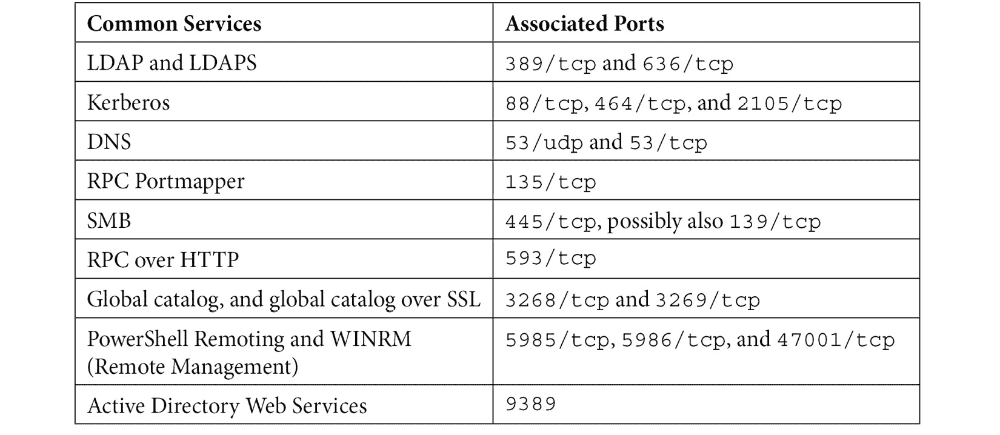

# 十五、答案

在接下来的几页中，我们将回顾这本书中每个章节的所有练习问题，并提供正确的答案。

# 第二章-基本 Linux 网络配置和操作-使用本地接口

1.  A default gateway is a special route, usually denoted as `0.0.0.0/0` (in other binary, this indicates "all networks"). A host always has a local routing table, with an order of precedence.

    任何直接连接到一个接口的网络首先被处理。 这些路由称为**连接的**或**接口**路由。

    路由定义在路由表中。 这些路由可能是您通过`route`命令的`ip`命令添加的。

    最后引用缺省路由。 如果发送的流量与已连接的路由或路由表中的路由不匹配，则发送到缺省网关中定义的 IP 地址。 通常，这种设备是一种特殊的路由器或防火墙设备，它通常同时具有一个本地表、静态定义的路由和一个默认网关(在其他几种路由机制中，这些路由机制不在本书的讨论范围内)。

2.  对于这个网络，子网掩码是`255.255.255.0`(24 位二进制位)。 广播地址为`192.158.25.255`。
3.  发送到广播地址的流量被发送到整个子网，并由该子网中的所有主机进行处理。 标准 ARP 请求就是一个例子(我们将在下一章深入讨论)。
4.  主机地址范围为`192.168.25.1`~`192.168.25.254`。 `0`地址是网络地址，因此不能用于主机。 `255`地址为广播地址。
5.  `nmcli`命令是进行此更改的推荐方法。 例如，要将接口连接有线以太网 1 设置为 100 Mbps/全双工，使用以下命令:

    ```sh
    $ sudo nmcli connection modify 'Wired connection 1' 802-3-ethernet.speed 100
    $ sudo nmcli connection modify 'Wired connection 1' 802-3-ethernet.duplex full
    ```

# 第三章-使用 Linux 和 Linux 工具进行网络诊断

1.  你永远不会看到这个。 从网络的角度来看，会话、连接和会话只存在于 TCP 协议中(在 OSI 层 5)。UDP 会话是无状态的-网络没有一种方法来关联一个 UDP 请求到一个 UDP 响应-这一切都必须发生在应用中。 通常，应用会在包数据中包含会话号或序列号(或两者都包含，具体取决于应用)来完成这一任务。 请记住，如果应用以某种方式通过 UDP 维护一个会话，应用就有责任保持它的直线-在主机或网络的第 5 层没有任何东西可以跟踪这一点，就像我们在 TCP 中看到的那样。
2.  If you are troubleshooting network or application issues, this is critical information. If, for instance, you have an application issue that may be network related, understanding which ports that host listens on can be key – for instance, those ports might need to be configured on the host firewall or on some other in-path firewall.

    从另一个角度来看，如果您看到特定端口上的防火墙错误，例如正在被终止的长时间运行的会话，那么您需要将端口关联回应用。

    对于第三个例子，在调查恶意软件时，您可能会看到绑定到发送或监听端口的恶意软件活动。 能够快速诊断这种情况可以使找到其他可能受到该恶意软件影响的站点变得简单得多。 例如，使用 Nmap 可以发现监听特定端口的恶意软件，或者使用防火墙日志可以快速发现在特定端口传输的恶意软件。 恶意软件的一个很好的例子,这将是漏出 DNS 数据端口——在这种情况下,你会寻找防火墙日志条目`tcp/53`或`udp/53`,从内部主机不是 DNS 服务器,或外部主机 DNS 服务器。 在大多数企业环境中，只有 DNS 服务器应该对特定的 internet DNS 转发主机进行 DNS 查询(参见[*第 6 章*](06.html#_idTextAnchor100)，*Linux 上的 DNS 服务*，了解更多细节)。

3.  In a well-run network, the internet firewall will typically have rules in both directions. The inbound set of rules (from the internet to the inside network) will describe which listening ports you might want to allow internet clients to connect to. This is often called an **ingress filter**.

    在另一个方向，你有一个端口列表，允许在出站方向连接，从内部网络到互联网。 这通常被称为**出口过滤器**。 出口过滤器的目标是允许您希望允许的出站流量，并阻止其他一切。 回到 20 世纪 90 年代或 21 世纪初，人们的反应可能是*我们信任我们的用户。 可悲的是，虽然我们仍然可以信任我们的用户，但我们不能再相信他们不会点击恶意链接，我们也不能相信他们可能带入我们环境的恶意软件。 一个出口过滤器与`deny all`作为其最后的条目和适当的警报通常会提醒管理员恶意软件,不需要的软件安装在桌面或服务器,配置错误的主机或设备,或*我从家里带来*硬件不属于组织的网络。*

4.  Certificates are used to secure many services, and HTTPS (on `tcp/443`) is just the most popular. Certificates are also used to authenticate or secure lots of other services. A short list of the most commonly found ones are shown in the following table (there are **lots** more):

    

    如果证书过期，在最好的情况下，连接到该服务的用户将收到一个错误。 根据他们的浏览器设置，他们可能无法继续。 如果连接是从程序到服务(也就是说，不是浏览器)，那么连接可能会出错，这取决于应用的错误处理和日志代码是如何编写的。

5.  `1024`下的所有端口都是服务器端口，因此需要有管理权限才能在其中任何端口上打开侦听器。
6.  假设通道宽度为 20 GHz，通道 1、6 和 11 不重叠。
7.  信道宽度通常会提高性能，这取决于客户端站试图在媒体上做什么。 然而，在 2.4 GHz 频段，只有 11 个通道可用(只有 3 个选择不会产生干扰)，增加通道宽度几乎肯定会增加大多数环境的干扰。 在 5 千兆赫频段中有一个更好的机会用于更宽的信道，因为有更多可用的信道。

# 第四章- Linux 防火墙

1.  希望您会考虑使用 nftables。 虽然 iptables 在未来几年仍将受到支持，但 nftables 的效率更高(cpu 方面)，并支持 IPv6。 它在“匹配”流量方面也更加灵活，允许更容易地匹配数据包中的各个字段，以便进一步处理。
2.  An easy method to support central firewall standards (without adding orchestration or configuration management tools into the mix) would be to use `nft` `include` files. These files can be managed in a single location, given meaningful names, then copied out to target servers that match the use case for each of these `include` files. For instance, having an `include` file for web servers, DNS hosts, or DHCP servers is commonly seen. Having a separate `include` file to allow host administration only from a small set of administrative "jump hosts," address ranges, or subnets is another very common use case.

    然而，即使没有`include`文件，诸如 Terraform、Ansible、Puppet、Chef 或 Salt 等编制工具也可以用来集中管理 Linux 主机和服务的许多方面，包括防火墙。 在这种情况下，最好至少硬编码您正在使用的编排工具所需的访问—如果发现编排工具中的一个简单配置错误删除了对服务器场的所有管理访问，那就太不有趣了。

# 第五章- Linux 安全标准与真实的例子

1.  可悲的是，在这个时候，美国没有任何联邦隐私立法。 希望这种情况在不久的将来会改变!
2.  No, the critical controls are not meant as an audit framework. However, you can certainly be assessed against them.

    例如，在关键控制 1 中，建议在网络接入中部署 802.1x 认证。 这意味着您的工作站和/或用户帐户对网络进行“身份验证”，身份验证过程指示工作站和用户 id 组合可以访问什么。 虽然这不是一个审计项目(它不讨论特定的设置，甚至不讨论特定的服务或访问)，但您是否在基础设施中实现 802.1x 可以在更大的安全计划或项目集中进行评估。

3.  The first answer to this is that the first check might not be accurate, and a parallax view can be helpful in determining that. For instance, if a change is made but an operating system or application bug means that the configuration change isn't implemented correctly, a second tool to assess the setting can identify this.

    更重要的是，配置更改和检查通常是在本地主机上进行的，需要逐个主机重复进行。 评估“在线”设置——例如，使用 Nmap 扫描——允许您在几分钟内评估数百个主机。 这不仅节省了时间，而且也是审计人员、渗透测试人员和恶意软件使用的节省时间的方法。

# 第六章- Linux 上的 DNS 服务

1.  DNSSEC 实现了允许“签名”来验证 DNS 响应数据的记录。 它既不加密请求也不加密响应，因此它可以使用标准的 DNS 端口`udp/53`和`tcp/53`进行操作。 DoT 使用 TLS 完全加密 DNS 请求和响应。 因为 DoT 是一个完全不同的协议，它使用端口`tcp/853`。
2.  DoH 的行为类似于 api——请求和响应在带有特定 HTTP 头的 HTTPS 流量中携带。 DoT**统一资源定位器**(**URL**)的默认“着陆”站点为`/dns-query`，由于采用 HTTPS 传输，协议仅使用`tcp/443`。
3.  An internal DNS server would definitely implement recursion and forwarders, to allow the resolution of internet hosts. Usually, auto-registration is enabled, and requests are normally limited to "known" subnets that are within the organization.

    组织区域的外部 DNS 服务器通常不会实现递归或转发器，而且几乎永远不会实现自动注册。 速率限制几乎总是被实现的。

# 第七章:Linux 上的 DHCP 服务

1.  First, this may be a problem only for the person who called the Helpdesk. Make sure that this is a branch-wide issue. Make sure that the person who called is plugged into the network (or is associated properly if they are wireless). Make sure that they are not working from home; if they're not even in the office, then this isn't likely a problem with your server.

    我们有一个问题吗?问题完成了，看看你是否可以在远程办公室找到任何东西。 如果局内的广域网链路、VPN 链路、路由器或交换机都不能工作，那么 DHCP 也不能工作。 在深入挖掘 DHCP 端之前，确保您可以 ping 或以其他方式测试每个设备。

    接下来，从确保 DHCP 服务器实际工作开始。 检查服务是否正在运行-注意以下`systemctl`命令提供了一些最近的 DHCP 报文信息:

    ```sh
    $ systemctl status isc-dhcp-server.service
    ● isc-dhcp-server.service - ISC DHCP IPv4 server
     Loaded: loaded (/lib/systemd/system/isc-dhcp-server.service; enabled; vend>
     Active: active (running) since Fri 2021-03-19 13:52:19 PDT; 2min 4s ago
     Docs: man:dhcpd(8)
     Main PID: 15085 (dhcpd)
     Tasks: 4 (limit: 9335)
     Memory: 5.1M
     CGroup: /system.slice/isc-dhcp-server.service
     └─15085 dhcpd -user dhcpd -group dhcpd -f -4 -pf /run/dhcp-server/>
    Mar 19 13:53:29 ubuntu dhcpd[15085]: DHCPDISCOVER from e0:37:17:6b:c1:39 via en>
    Mar 19 13:53:29 ubuntu dhcpd[15085]: ICMP Echo reply while lease 192.168.122.14>
    ….
    ```

    此时，您还可以使用`ss`命令进行检查，以查看服务器是否正在监听正确的 UDP 端口。 注意，这并不能验证它实际上是 DHCP 服务器正在监听`port 67/udp`(bootup)，但如果它是其他东西，这将是真正奇怪的一天:

    ```sh
    $ ss -l | grep -i bootps
    udp     UNCONN   0        0                            0.0.0.0:bootps                                      0.0.0.0:*
    ```

    现在，检查 DHCP 服务器今天是否正在分配地址——我们将使用`tail`命令来提取最后几个日志条目。 如果日期不是今天，请注意日期以查看 DHCP 最后一次分配地址的时间。 你可能会从`systemctl`输出中得到这个，但你也可以从`syslog`中得到它:

    ```sh
    cat /var/log/syslog | grep DHCP | tail
    Mar 19 13:53:29 ubuntu dhcpd[15085]: DHCPDISCOVER from e0:37:17:6b:c1:39 via ens33
    Mar 19 13:53:32 ubuntu dhcpd[15085]: DHCPDISCOVER from e0:37:17:6b:c1:39 via ens33
    Mar 19 13:53:38 ubuntu dhcpd[15085]: DHCPOFFER on 192.168.122.10 to e0:37:17:6b:c1:39 via ens33
    Mar 19 13:53:38 ubuntu dhcpd[15085]: DHCPREQUEST for 192.168.122.130 (192.168.122.1) from e0:37:17:6b:c1:39 via ens33
    Mar 19 13:53:38 ubuntu dhcpd[15085]: DHCPACK on 192.168.122.130 to e0:37:17:6b:c1:39 via ens33
    ```

    从这些信息来看，这是否适用于其他远程站点? 是为总公司工作吗? 检查几个不同的子网:

    ```sh
    cat /var/log/syslog | grep DHCP | grep "subnet of interest" | tail
    ```

    如果这只是影响到调用的远程站点，检查其远程路由器上的 DHCP 转发器条目:

    ```sh
    # show run | i helper
    ip helper-address <your dhcp server ip>
    ```

    检查 DHCP 服务器上的防火墙，确保服务器可以接收 UDP 端口 6。 翻回[*第 4 章*](04.html#_idTextAnchor071)，*Linux 防火墙*，如果你需要复习一下如何做到这一点:

    ```sh
    # sudo nft list ruleset
    ```

    您正在寻找允许或拒绝入站`67/udp`(引导)的规则。

    至此，您几乎已经检查了所有内容。 现在是时候再次检查办公室里的路由器和交换机是否通电了，以及周末人们是否在办公室里重新布线了。 同样值得再次核实的是，报告问题的人是否真的在办公室。 这可能看起来很奇怪，但也要问问灯是否开着——你会惊讶地发现，人们打电话说网络中断的频率有多高，而实际上他们遇到的是长时间的断电。

    如果所有这些都失败了，继续进行问题 2。 您可能在该办公室中有一个非法 DHCP 服务器，而 Helpdesk 可能还没有发现这个问题。

2.  On any Linux client, get the IP of the DHCP server. There are a few methods for doing this. You could check the `syslog` file:

    ```sh
    $ sudo cat /var/log/syslog | grep DHCPACK
    Mar 19 12:40:32 ubuntu dhclient[14125]: DHCPACK of 192.168.1.157 from 192.168.1.1 (xid=0xad460843)
    ```

    或者只是从工作站上的 DHCP 客户端租期文件中转储服务器信息(这随着各种客户端接口更新而更新):

    ```sh
    $ cat /var/lib/dhcp/dhclient.leases | grep dhcp-server
     option dhcp-server-identifier 192.168.1.1;
     option dhcp-server-identifier 192.168.1.1;
    ```

    最后，您可以在前台更新租约并从那里获取信息。 注意，如果您通过 SSH 连接到客户端，您的地址可能会随着这种方法而改变。 客户端也会在这里显示的最后一行出现“挂起”。 请记住，它是运行在前台的后台 DHCP 客户端进程，因此它不是“挂起”，而是“等待”。 按*Ctrl + C*退出:

    ```sh
    $ sudo dhclient –d 
    Internet Systems Consortium DHCP Client 4.4.1
    Copyright 2004-2018 Internet Systems Consortium.
    All rights reserved.
    For info, please visit https://www.isc.org/software/dhcp/
    Listening on LPF/ens33/00:0c:29:33:2d:05
    Sending on   LPF/ens33/00:0c:29:33:2d:05
    Sending on   Socket/fallback
    DHCPREQUEST for 192.168.1.157 on ens33 to 255.255.255.255 port 67 (xid=0x7b4191e2)
    DHCPACK of 192.168.1.157 from 192.168.1.1 (xid=0xe291417b)
    RTNETLINK answers: File exists
    bound to 192.168.1.157 -- renewal in 2843 seconds.
    ```

    或者，如果远程客户端是基于 windows 的，有一个简单的命令来获取 DHCP 服务器地址:

    ```sh
    > ipconfig /all | find /i "DHCP Server"
     DHCP Server . . . . . . . . . . : 192.168.1.1
    ```

    无论您如何获得 DHCP 服务器的 IP 地址，如果您从故障排除中获得的 IP 地址不是您的服务器，那么您就有一个非法 DHCP 问题。

    既然我们现在有了 DHCP IP 地址，从受影响的主机快速 ping 它，然后收集非法服务器的 MAC 地址:

    ```sh
    $ arp –a | grep "192.168.1.1"
    _gateway (192.168.1.1) at 00:1d:7e:3b:73:cb [ether] on ens33
    ```

    从 OUI 中，找到问题设备的制造商。 在这种情况下，它是一个 Linksys 家庭路由器。 你可以很容易得到这个从 Wireshark 是的查找网站(https://www.wireshark.org/tools/oui-lookup.html),或者,正如第二章[*【4】【5】,*基本的 Linux 网络配置和操作,使用本地接口* 我有一个脚本托管在 GitHub(*](02.html#_idTextAnchor035)*[https://github.com/robvandenbrink/ouilookup](https://github.com/robvandenbrink/ouilookup))。*

    现在转到您的交换机(或循环您的网络人员)，找出主机连接到哪个交换机端口。 注意，我们只是在寻找 MAC 地址的最后一部分:

    ```sh
    # show mac address-table | i 73cb
    * 1        001d.7e3b.73cb    dynamic   20         F    F   Gi1/0/7
    ```

    此时，您可能希望关闭该端口并开始进行一些电话通话。 当您这样做时，请确保您没有关闭连接整个交换机的端口。 首先检查该端口上的其他 MAC 地址，特别是查看找到的 MAC 地址计数:

    ```sh
    # show mac address-table int Gi1/0/7
    ```

    同时，检查 LLDP 邻居列表为该端口-它应该告诉你是否有一个交换机:

    ```sh
    # show lldp neighbors int g1/0/7 detailed
    ```

    同时，在该端口上寻找 CDP 邻居，同时也寻找交换机:

    ```sh
    # show cdp neighbors int g1/0/7
    ```

    如果在那个端口上有一个交换机，连接到那个相邻的交换机，并重复这个过程，直到你找到违规的 DHCP 服务器的端口。

    关闭违规端口后，您的用户应该能够重新开始获取 DHCP 地址。 因为你有服务器的 OUI，你的下一步就是让办公室里一个值得信任的人去找一个上面有<insert brand="" name="" here="">标签的新盒子。</insert>

# 第 8 章- Linux 上的证书服务

1.  The first function is the most important and is most often overlooked. A certificate provides trust and authentication. The fact that the hostname matches either the CN or SAN fields in the certificate provides the authentication needed to start the session. The fact that the certificate is signed by a trusted CA means that the authentication can be trusted by the client. This will be revisited again in the next chapter of this book, [*Chapter 9*](09.html#_idTextAnchor153), *RADIUS Services for Linux*.

    第二个功能是，证书材料用于为用于后续会话的对称加密的密钥提供一些材料。 但是请注意，当我们讨论其他用例时，许多使用证书的情况根本就不进行会话加密——证书纯粹用于身份验证。

2.  `PKCS#12`格式通常以`.pfx`或有时`.p12`为后缀，将服务的公共证书与其私钥结合在一起。 这种组合通常需要用于以下情况:正常的安装过程通常有*，让我们从 CSR*开始，但证书是预先存在的，比如通配符。
3.  CT is key in the trust model that is needed for public CAs. Since all certificates are posted publicly, this means that the CT log can be audited for fraudulent certificates.

    作为附带的好处，这意味着组织可以对发给他们的证书进行审计，而这些证书是未经授权购买给以前未知的服务的。 这有助于遏制*影子 IT*的扩散，即非 IT 部门在正常渠道之外直接购买 IT 服务。

4.  While the CA is never consulted as certificates are used after they are issued, there are several reasons for maintaining the details of issued certificates, outlined as follows:
    *   最重要的原因是*信任*。 保存已颁发证书的登记册意味着可以对该列表进行审计。
    *   第二个原因也是*信任*。 保存已颁发证书的日志意味着当您需要撤销一个或多个证书时，您可以通过其在`index.txt`文件中的名称来识别它们，然后通过使用它们的序列号(与它们的文件名匹配)来撤销这些证书。
    *   最后,当操作内部 CA 和服务器基础设施,你会达到一个点,当故障排除时你会说*好像证书来自别的地方*——例如,它可能是自签名或可能是另一个 CA 颁发的。虽然可以获得证书本身的信息, 私有 CA 上的索引为您提供了通过另一种方法检查颁发了哪些证书以及何时颁发的所需工具。

    例如，如果攻击者建立了一个与您的 CA 名称相同的恶意 CA，那么使用`openssl`命令就可以在不验证密钥和签名的情况下进行快速检查。

    或者更糟的是，如果攻击者使用从您的实际服务器窃取的(和有效的)密钥材料构建了恶意 CA，那么真正 CA 上的索引文件将是引导您进行最终诊断的唯一线索。

# 第九章- Linux 上的 RADIUS 服务

1.  使用同时引用身份验证请求和后端组成员关系的`unlang`规则是典型的解决方案。 该规则应指定以下内容:

1.  如果您正在发起 VPN 请求，那么您需要在`VPN users`组中进行身份验证。
2.  如果正在发出管理访问请求，则需要位于`network admins`组中。
3.  This approach can be extended to include any number of authentication types, device types, RADIUS attribute values, and group memberships.

    传递所请求函数的`unlang`规则示例如下:

    ```sh
    if(&NAS-IP-Address == "192.168.122.20") {
     if(Service-Type == Administrative && LDAP-Group == "Network Admins") {
     update reply {
     Cisco-AVPair = "shell:priv-lvl=15"
     } 
     accept
     } 
     elsif (Service-Type == "Authenticate-Only" && LDAP-Group == "VPN Users" ) {
     accept
     }
     elsif {
     reject
     }
    }
    ```

4.  有几个原因，这些是概述在这里:

1.  因为它使用证书，而且通常是本地证书存储，所以整个信任模型
2.  由于它使用 tls(如果实现正确的话)，那么针对身份验证交换加密的攻击将是一个重大挑战。
3.  每个无线用户都有自己的会话密钥，它们经常轮换。
4.  没有可供攻击者捕获或利用的密码。 所有其他无线身份验证和加密机制都使用用户 ID/密码(例如，PEAP)或预共享密钥。
5.  The obstacle in deploying EAP-TLS is in the preparation—notably, issuing and installing certificates on the RADIUS servers and, particularly, the endpoint clients. This is very doable in a typical organization, where the stations are owned by the company, or you can walk your people through installing certificates on any authorized gear that they own. In addition, **mobile device management** (**MDM**) platforms can be used to issue and install certificates on cellphones and tablets.

    然而，如果设备不属于公司——例如，如果设备是顾问或供应商的笔记本电脑，或者是员工拥有的家庭电脑，获得公司颁发的证书并安全地安装在那台机器上可能是一个真正的挑战。 特别是，经常会看到**证书签名请求**(**csr**)和通过电子邮件来回发送的证书，不建议用于传输此类敏感数据。

    MFA 解决方案将用户 id -密码接口保留在合适的位置，用于 VPN 服务，但消除了这些接口中出现密码篡改或暴力破解攻击等问题的风险。 此外，在系统中注册远程站点，如谷歌 Authenticator 是极其简单的-只需扫描二维码，你发出的工作!

# 第十章- Linux 的负载均衡器服务

1.  If you are in a situation where your total load might be reaching the capacity of the load balancer, a DSR solution means that only the client to server traffic needs to be routed through the load balancer. This is especially impactful as most workloads have much more return traffic (server to client) than send traffic (from client to server). This means that changing to a DSR solution can easily reduce the traffic through the load balancer by 90%.

    如果较小的负载平衡器与需要平衡的每个离散工作负载匹配为 1:1，那么就不需要考虑性能。 特别是在虚拟化环境中，向基于 vm 的负载平衡器添加 CPU 和内存资源也比在基于硬件的旧设备情况下进行匹配的硬件升级要简单得多。

    一个 DSR 负载均衡器也需要一些服务器和网络的“修补”才能使所有的部分工作。 一旦它工作了，一年后当需要对其进行故障排除时，再把它弄清楚也是一个真正的问题。

    DSR 解决方案在客户端和服务器之间的通信上也失去了相当多的智能，因为只看到了一半的对话。

2.  使用基于代理的负载均衡器的主要原因是允许在 HTTPS 设置中保持会话。 通过终止前端虚拟 IP**(**VIP**)上的客户端会话，然后在后端接口上启动一个新的 HTTPS 会话。 这种方法允许负载平衡器在此等式的客户端会话中插入一个 cookie。 当客户端发送下一个请求(其中将包含此 cookie)时，负载均衡器然后将会话定向到此客户端 HTTPS 会话分配给的服务器。**

 **# 第十一章- Linux 上的抓包分析

1.  你会从一个中间设备捕获，有以下几个原因:
    *   您没有访问两端主机的权限，或者没有权限在主机上捕获数据包。
    *   您无法访问允许您使用主机和 Wireshark 的交换机端口，因为您不是本地用户或者没有交换机访问。
    *   如果中间设备是防火墙，从那里捕获将允许您考虑 NAT(在转换之前和之后捕获)，以及防火墙上的任何 acl。
    *   如果您正在对主机服务进行故障排除，并且能够访问其中一个主机，并且有权限在其中一个或两个主机上安装包捕获工具，则可以从两端的主机进行捕获。 此外，从任何一端捕获可能允许您捕获解密之前或之后的加密流量。
    *   几乎在所有情况下，使用 SPAN 端口捕获都是首选解决方案。 这允许您捕获任意方向的流量，但不需要访问或更改任一端点主机的权限。
2.  tcpdump is the underlying packet capture mechanism on Linux. Almost all tools, including Wireshark use tcpdump. Wireshark has the advantage of giving the operator a GUI to work from, which is very attractive if that person isn't a "CLI person." In addition, Wireshark will fully decode packets and allow you to interactively drill down to your target traffic using display filters.

    另一方面，TCPdump 的优点是它可以在任何地方运行，如果捕获会话是在 SSH 会话上运行，或者执行捕获的主机没有运行 GUI，那么这一点非常有吸引力。 TCPdump 还为您提供了对低级函数的更多控制，这些函数将影响捕获的性能或容量。 例如，可以通过`tcpdump`命令行轻松地修改环形缓冲区的大小。

3.  每次调用 RTP 协议的端口都是不同的。 它们总是 UDP，但是会话的 RTP 调用的端口号是在调用建立期间协商的，但是 SIP/SDP，特别是由`INVITE`包(来自每个调用端点的一个)。

# 第十二章- Linux 上的网络监控

1.  SNMP 的写访问允许您监视(读取)设备或主机参数，以及设置(写入)这些相同的参数。 因此，通过读写访问，您可以更改接口速度或双工，重新引导或关闭设备，或下载配置。 有一个 nmap 脚本可以简化这样的配置下载:`snmp-ios-config.nse`。
2.  Syslog is most often sent in clear text over `514/udp`. There is an option to encrypt this traffic using IPSEC, but it is not widely implemented. The risks are that sensitive information is sent using syslog, and as it's clear text, anyone in a position to read it can either collect that information for later use or modify it as it is sent.

    例如，让管理员将其密码放在`userid`字段中是相当常见的，这意味着此时密码可能已被泄露。 这个人通常采取的下一步是再次尝试，这意味着攻击者现在既有用户 id 又有密码。 但是，您需要记录这些信息，以帮助检测恶意的登录尝试。

    一种选择是启用 SNMPv3，使用 SNMPv3 trap 来代替 Syslog 日志。 然而，这确实会将您的日志平台转移到一个通常不太灵活且难于使用的平台。

    要在 Cisco IOS 设备上启用 SNMPv3 trap，请使用以下代码:

    ```sh
    snmp-server enable traps
    !
    ! … this can also be done in a more granular fashion:
    ! snmp-server enable traps envmon fan shutdown supply temperature status ospf cpu
    !
    ! EngineID is automatically generated by the router, use "show snmp engineID" to check
    snmp-server engineID remote <server ip address> 800005E510763D0FFC1245N1A4
    snmp-server group TrapGroup v3 priv
    snmp-server user TrapUser TrapGroup remote <server ip address> v3 auth sha AuthPass priv 3des PSKPass
    snmp-server host <server ip address>  informs version 3 priv TrapUser
    ```

    您的 SNMP trap 服务器必须具有匹配的帐户信息和加密选项。 如果您要走到这一步，您还必须为每个发送陷阱的设备硬编码主机信息。

3.  NetFlow collects and aggregates summary information for network traffic. At a minimum, this includes the "tuple" of Source IP, Destination IP, Protocol, Source Port Number, and Destination Port Number. Times are added for analytics, usually by the collecting server, so that flows from multiple servers can be combined and correlated without the need to worry about clock drift between the various networking devices.

    尽管如此，所发送的信息通常是不敏感的——本质上，它是源和目的 IP 地址以及对正在使用的应用的猜测(通常是从目的端口派生的)。 大多数组织不会认为这是敏感的。

    但是，如果您的组织认为这是一种风险，那么很容易通过 IPSEC 隧道将这些数据定向回收集服务器。 这种架构可能有点棘手，因为你可能需要维护两个路由**虚拟路由框架**(**vrf**)才能实现这一点，但这是可行的。 它可能更简单，只是加密所有 WAN 流量，然后在核心路由器和 NetFlow 收集服务器之间应用第二层保护(假设它们在同一子网)。

# 第十三章- Linux 上的入侵防御系统

1.  奇克会是你的首选工具。 正如我们在 Zeek 的例子中看到的那样，通过一个特定时间窗口内的所有通信深入到一个特定的 TLS 版本是非常快速的。 在搜索过程中添加地理位置信息只需要点击几下鼠标。 当您缩小搜索范围时，源和目的 IP 地址会被汇总，因此不需要额外的操作来收集它们。
2.  SSH clients, when used, generate traffic. A tool such as P0F (or a commercial tool such as Teneble PVS) can passively collect all traffic, and then associate this traffic with the client workstations. By using algorithms such as JA3 or HASSH, passively collected data can often tell you about the client application, very often right down to its version. This allows you to target out-of-date clients for software upgrades.

    PuTTY 就是一个很好的例子，因为这个应用通常不使用完整的基于 msi 的 Windows 安装程序来安装。 这意味着使用 PowerShell 或商业库存工具进行库存通常并不容易。

    这种方法的缺点是，您只能在使用目标应用时清点它们。 识别硬件客户端——例如，未经批准的**物联网**(**物联网**)设备——尤其有效，因为这些设备往往会非常频繁地接触到它们的各种云服务。

3.  To start with, intentionally placing an IPS on the public internet side of a firewall isn't productive these days, given the hostile nature of that network – it will simply alert continuously, which makes for just too much "noise" to filter through.

    将 IPS 主要用于捕获通过防火墙的出站流量或入站流量，从而将评估的流量大幅缩小到潜在的攻击流量(入站)和可能表明内部主机受到威胁的流量(出站)。 这种位置通常相当于位于 SPAN 端口上，监视防火墙的内部和 DMZ 接口。 可以扩展到其他端口或整个 vlan(参考[*第 11 章*](11.html#_idTextAnchor192)、*Linux 抓包分析*中的 SPAN 端口章节)。

    将 IPS 设置成可以检查解密流量的方式，允许它评估“不可见”的有效负载; 例如，在 RDP、SSH 或 HTTPS 流量。 在现代架构中,这通常意味着“诱导多能性”实际上是在防火墙本身,通常被称为**统一威胁管理**(**UTM)防火墙或**下一代防火墙**(**NGFW**)。**

# 第十四章- Linux 上的蜜罐服务

1.  Honeypots are deployed to catch attacker traffic "on film." Especially on internal networks, their primary goal is to keep the attacker engaged on the honeypot host for long enough that you can mount some defenses.

    在一台主机上点亮一个意想不到的端口组合会让攻击者知道目标是一个蜜罐。 它们不仅会跳过那个主机，而且知道您部署了蜜罐，它们还会格外小心地继续操作。

2.  AD 域控制器通常会启用许多这样的端口:



这个列表并不完整，主要关注 TCP 端口。 攻击者通常会完全跳过 UDP 端口扫描，特别是当打开的 TCP 端口的配置文件足以识别目标主机时。

在互联网上，例外情况是扫描`500/udp`和`4500/udp`，它们通常表示开放的 VPN 端点。**