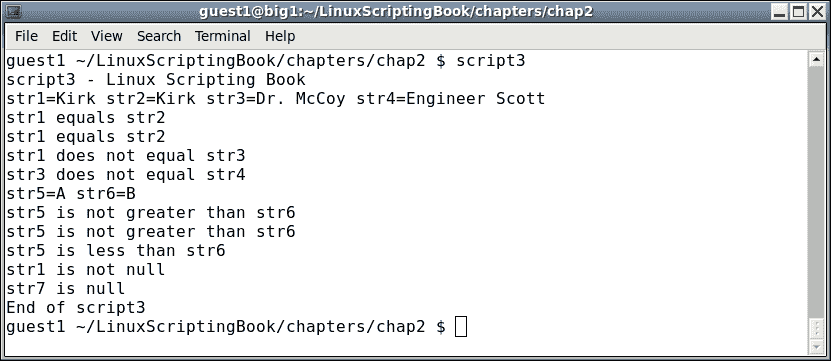
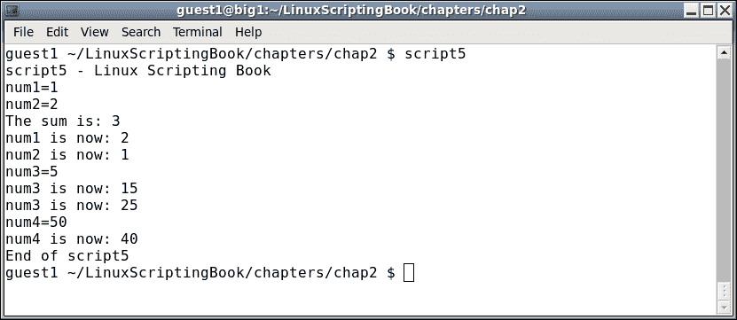
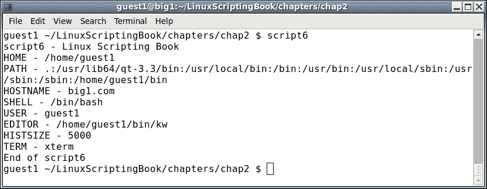
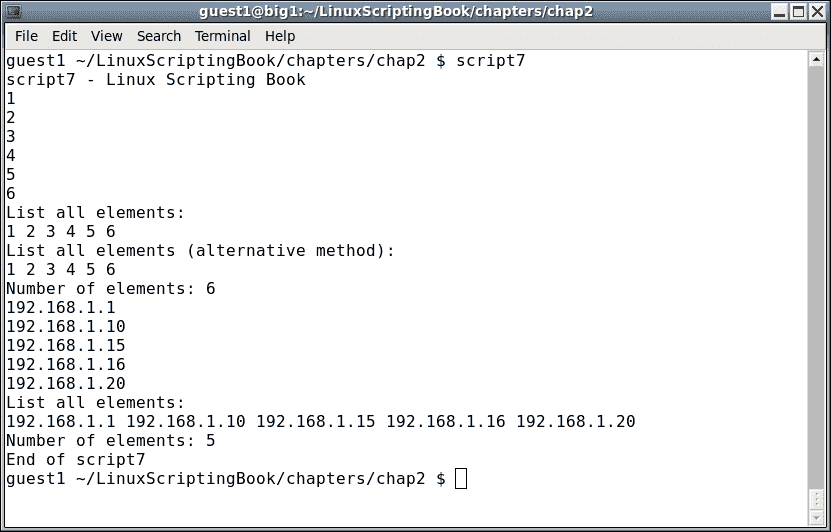

# 二、使用变量

本章将展示变量如何在 Linux 系统和脚本中使用。

本章涵盖的主题有:

*   在脚本中使用变量
*   使用条件语句验证参数
*   字符串的比较运算符
*   环境变量

# 在脚本中使用变量

变量只是某个值的占位符。值可以改变；但是，变量名将总是相同的。这里有一个简单的例子:

```sh
   a=1
```

这个给变量`a`赋值`1`。这里还有一个:

```sh
   b=2
```

要显示变量包含的内容，请使用`echo`语句:

```sh
   echo Variable a is: $a
```

### 注

注意变量名前面的`$`。这是显示变量内容所必需的。

如果在任何时候，你没有看到你期望的第一次检查`$`的结果。

下面是一个使用命令行的示例:

```sh
$ a=1
$ echo a
a
$ echo $a
1
$ b="Jim"
$ echo b
b
$ echo $b
Jim
```

Bash 脚本中的所有变量都被认为是字符串。这与 C 等编程语言中的不同，在 C 语言中，一切都是强类型的。在前面的例子中，`a`和`b`是字符串，尽管它们看起来是整数。

这里有一个简短的脚本让我们开始:

## 第二章-剧本 1

```sh
#!/bin/sh
#
# 6/13/2017
#
echo "script1"

# Variables
a="1"
b=2
c="Jim"
d="Lewis"
e="Jim Lewis"
pi=3.141592

# Statements
echo $a
echo $b
echo $c
echo $d
echo $e
echo $pi
echo "End of script1"
```

这是在我的系统上运行时的输出:


由于所有的变量都是字符串，我也可以这样做:

```sh
a="1"
b="2"
```

当字符串包含空格时很重要，如这里的变量`d`和`e`。

### 注

我发现，如果我引用程序中的所有字符串，而不是数字，那么更容易跟踪我是如何使用变量的(也就是说，作为字符串或数字)。

# 使用条件语句验证参数

当使用变量作为数字时，变量可以与其他变量进行测试和比较。

下面列出了一些可以使用的运算符:

<colgroup><col style="text-align: left"> <col style="text-align: left"></colgroup> 
| 

操作员

 | 

描述

 |
| --- | --- |
| `-eq` | 这代表等于 |
| `-ne` | 这代表不等于 |
| `-gt` | 这代表大于 |
| `-lt` | 这代表不到 |
| `-ge` | 这代表大于或等于 |
| `-le` | 这表示小于或等于 |
| `!` | 这代表否定运算符 |

让我们在下一个示例脚本中看看这个:

## 第二章-剧本 2

```sh
#!/bin/sh
#
# 6/13/2017
#
echo "script2"

# Numeric variables
a=100
b=100
c=200
d=300

echo a=$a b=$b c=$c d=$d     # display the values

# Conditional tests
if [ $a -eq $b ] ; then
 echo a equals b
fi

if [ $a -ne $b ] ; then
 echo a does not equal b
fi

if [ $a -gt $c ] ; then
 echo a is greater than c
fi

if [ $a -lt $c ] ; then
 echo a is less than c
fi

if [ $a -ge $d ] ; then
 echo a is greater than or equal to d
fi

if [ $a -le $d ] ; then
 echo a is less than or equal to d
fi

echo Showing the negation operator:
if [ ! $a -eq $b ] ; then
 echo Clause 1
else
 echo Clause 2
fi
echo "End of script2"
```

输出如下:


为了帮助理解本章，请在您的系统上运行脚本。尝试改变变量值，看看它如何影响输出。

当我们查看文件时，我们在[第 1 章](01.html "Chapter 1. Getting Started with Shell Scripting")、*中看到了否定操作符。提醒一下，它否定了这个表达。你也可以说它与原始陈述的意思相反。*

考虑以下示例:

```sh
a=1
b=1
if [ $a -eq $b ] ; then
  echo Clause 1
else
  echo Clause 2
fi
```

当该脚本运行时，它将显示`Clause 1`。现在考虑一下:

```sh
a=1
b=1
if [ ! $a -eq $b ] ; then    # negation
  echo Clause 1
else
  echo Clause 2
fi
```

因为否定运算符的现在将显示`Clause 2`。在你的系统上试试吧。

# 字符串的比较运算符

字符串的比较不同于数字。以下是部分列表:

<colgroup><col style="text-align: left"> <col style="text-align: left"></colgroup> 
| 

操作员

 | 

说明

 |
| --- | --- |
| `=` | 这代表等于 |
| `!=` | 这代表不等于 |
| `>` | 这代表大于 |
| `<` | 这代表不到 |

现在我们来看看*脚本 3* :

## 第二章-剧本 3

```sh
  1  #!/bin/sh
  2  #
  3  # 6/13/2017
  4  #
  5  echo "script3"
  6  
  7  # String variables
  8  str1="Kirk"
  9  str2="Kirk"
 10  str3="Spock"
 11  str3="Dr. McCoy"
 12  str4="Engineer Scott"
 13  str5="A"
 14  str6="B"
 15  
 16  echo str1=$str1 str2=$str2 str3=$str3 str4=$str4
 17  
 18  if [ "$str1" = "$str2" ] ; then
 19   echo str1 equals str2
 20  else
 21   echo str1 does not equal str2
 22  fi
 23  
 24  if [ "$str1" != "$str2" ] ; then
 25   echo str1 does not equal str2
 26  else
 27   echo str1 equals str2
 28  fi
 29  
 30  if [ "$str1" = "$str3" ] ; then
 31   echo str1 equals str3
 32  else
 33   echo str1 does not equal str3
 34  fi
 35  
 36  if [ "$str3" = "$str4" ] ; then
 37   echo str3 equals str4
 38  else
 39   echo str3 does not equal str4
 40  fi
 41  
 42  echo str5=$str5 str6=$str6
 43  
 44  if [ "$str5" \> "$str6" ] ; then        # must escape the >
 45   echo str5 is greater than str6
 46  else
 47   echo str5 is not greater than str6
 48  fi
 49  
 50  if [[ "$str5" > "$str6" ]] ; then       # or use double brackets
 51   echo str5 is greater than str6
 52  else
 53   echo str5 is not greater than str6
 54  fi
 55  
 56  if [[ "$str5" < "$str6" ]] ; then       # double brackets
 57   echo str5 is less than str6
 58  else
 59   echo str5 is not less than str6
 60  fi
 61  
 62  if [ -n "$str1" ] ; then     # test if str1 is not null
 63   echo str1 is not null
 64  fi
 65  
 66  if [ -z "$str7" ] ; then     # test if str7 is null
 67   echo str7 is null
 68  fi
 69  echo "End of script3"
 70
```

以下是我的系统的输出:



让我们一行一行地看下去:

*   线路`7` - `14`设置变量
*   第`16`行显示它们的值
*   第`18`行检查是否相等
*   第`24`行使用不等运算符
*   直到`50`的线是不言自明的
*   第`44`行需要一些澄清。为了避免语法错误，`>`和`<`运算符必须转义
*   这是通过使用反斜杠(或转义)`\`字符来实现的
*   第`50`行显示了如何使用双括号来处理大于运算符。正如你在第`58`行看到的，它也适用于小于运算符。我更喜欢在需要的时候使用双括号。
*   第`62`行显示如何检查一个字符串是否为`not null`。
*   第`66`行显示如何检查一个字符串是否为`null`。

仔细看看这个脚本，以确保它对您来说是清晰的。还要注意的是`str7`显示为`null`，但是我们实际上并没有声明`str7`。在脚本中这样做是可以的，它不会产生错误。然而，作为编程的一般规则，在使用所有变量之前声明它们是一个好主意。你的代码会更容易被你和其他人理解和调试。

编程中经常出现的一种情况是有多个条件需要测试。例如，如果某件事是真的，而另一件事是真的，采取这个行动。这是通过使用逻辑运算符来实现的。

这里是*脚本 4* 来展示如何使用逻辑运算符:

## 第二章-剧本 4

```sh
#!/bin/sh
#
# 5/1/2017
#
echo "script4 - Linux Scripting Book"

if [ $# -ne 4 ] ; then
 echo "Usage: script4 number1 number2 number3 number4"
 echo "       Please enter 4 numbers."

 exit 255
fi

echo Parameters: $1 $2 $3 $4

echo Showing logical AND
if [[ $1 -eq $2 && $3 -eq $4 ]] ; then      # logical AND
 echo Clause 1
else
 echo Clause 2
fi

echo Showing logical OR
if [[ $1 -eq $2 || $3 -eq $4 ]] ; then      # logical OR
 echo Clause 1
else
 echo Clause 2
fi

echo "End of script4"
exit 0
```

以下是我系统上的输出:


使用几个不同的参数在您的系统上运行该脚本。每次尝试时，尝试确定输出是什么，然后运行它。尽可能多地这样做，直到每次都能做对为止。现在理解这个概念将非常有帮助，因为我们以后会进入更复杂的脚本。

现在让我们来看看*脚本 5* 如何执行数学:

## 第二章-剧本 5

```sh
#!/bin/sh
#
# 5/1/2017
#
echo "script5 - Linux Scripting Book"

num1=1
num2=2
num3=0
num4=0
sum=0

echo num1=$num1
echo num2=$num2

let sum=num1+num2
echo "The sum is: $sum"

let num1++
echo "num1 is now: $num1"

let num2--
echo "num2 is now: $num2"

let num3=5
echo num3=$num3

let num3=num3+10
echo "num3 is now: $num3"

let num3+=10
echo "num3 is now: $num3"

let num4=50
echo "num4=$num4"

let num4-=10
echo "num4 is now: $num4"

echo "End of script5"
```

这是输出:



正如你所看到的，变量设置和以前一样。`let`命令用于执行数学运算。注意不使用`$`前缀:

```sh
let sum=num1+num2
```

还要注意一些操作的速记方式。例如，假设您想要将 var `num1`增加`1`。您可以这样做:

```sh
let num1=num1+1
```

或者，您可以使用速记符号:

```sh
let num1++
```

运行该脚本并更改一些值，以了解数学运算是如何工作的。我们将在后面的章节中更详细地讨论这个问题。

# 环境变量

到目前为止我们只讨论了脚本的局部变量。还有系统范围的环境变量(env vars)，它们在任何 Linux 系统中都扮演着非常重要的角色。这里有几个，读者可能已经知道其中一些:

<colgroup><col style="text-align: left"> <col style="text-align: left"></colgroup> 
| 

可变的

 | 

作用

 |
| --- | --- |
| `HOME` | 用户的主目录 |
| `PATH` | 搜索命令的目录 |
| `PS1` | 命令行提示 |
| `HOSTNAME` | 机器的主机名 |
| `SHELL` | 正在使用的 Shell |
| `USER` | 此会话的用户 |
| `EDITOR` | 用于`crontab`和其他程序的文本编辑器 |
| `HISTSIZE` | 历史命令将显示的命令数量 |
| `TERM` | 正在使用的命令行终端的类型 |

这些大多是不言自明的，然而，我将提到几个。

`PS1`环境变量控制 shell 提示符作为命令行的一部分显示的内容。默认设置通常是类似`[guest1@big1 ~]$`的东西，并没有它本来的用处大。至少，一个好的提示至少会显示主机名和当前目录。

例如，当我完成本章时，我的系统上的提示如下所示:

```sh
   big1 ~/LinuxScriptingBook/chapters/chap2 $
```

`big1`是我的系统的主机名，`~/LinuxScriptingBook/chapters/chap2`是当前目录。回想一下，颚化符`~`代表用户的`home`目录；所以在我的例子中，这扩展到:

```sh
 /home/guest1/LinuxScriptingBook/chapters/chap2
```

`"$"`表示我在一个客户账户下运行。

为此，我的`PS1`环境变量在`/home/guest1/.bashrc`中定义如下:

```sh
   export PS1="\h \w $ "
```

`"\h"`显示主机名，`\w`显示当前目录。这是一个非常有用的提示，我已经用了很多年了。以下也是显示用户名的方法:

```sh
   export PS1="\u \h \w $ "
```

现在的提示如下所示:

```sh
 guest1 big1 ~/LinuxScriptingBook/chapters/chap2 $
```

如果您更改了`.bashrc`文件中的`PS1`变量，请确保您在文件中的任何其他行之后进行更改。

例如，以下是我最初的`.bashrc`在我的`guest1`账户下包含的内容:

```sh
# .bashrc

# Source global definitions
if [ -f /etc/bashrc ]; then
    . /etc/bashrc
fi

# User specific aliases and functions
```

把你的`PS1`定义放在这几行后面。

### 注

如果你每天登录很多不同的机器，我发现有一个`PS1`小技巧非常有用。这将在后面的章节中展示。

你可能已经注意到，在本书的例子中，我似乎并不总是使用一个好的`PS1`变量。为了节省空间，在书籍创作过程中对其进行了编辑。

`EDITOR`变量可能非常有用。这告诉系统使用哪个文本编辑器来编辑用户的`crontab` ( `crontab -e`)等。如果没有设置，它默认为 vi 编辑器。可以通过将其放入用户的`.bashrc`文件中进行更改。以下是我的根帐户的情况:

```sh
   export EDITOR=/lewis/bin64/kw
```

当我运行`crontab -l`(或`-e`)时，我个人写的文本编辑器出现，而不是 vi。非常方便！

这里我们来看一下*脚本 6* ，它显示了我的`guest1`帐户下我的系统中的一些变量:

## 第二章-剧本 6

```sh
#!/bin/sh
#
# 5/1/2017
#
echo "script6 - Linux Scripting Book"

echo HOME - $HOME
echo PATH - $PATH
echo HOSTNAME - $HOSTNAME
echo SHELL - $SHELL
echo USER - $USER
echo EDITOR - $EDITOR
echo HISTSIZE - $HISTSIZE
echo TERM - $TERM

echo "End of script6"
```

输出如下:



您也可以创建和使用自己的环境变量。这是 Linux 系统非常强大的特性。以下是我在`/root/.bashrc`文件中使用的一些例子:

```sh
BIN=/lewis/bin64
DOWN=/home/guest1/Downloads
DESK=/home/guest1/Desktop
JAVAPATH=/usr/lib/jvm/java-1.7.0-openjdk-1.7.0.99.x86_64/include/
KW_WORKDIR=/root
L1=guest1@192.168.1.21
L4=guest1@192.168.1.2
LBCUR=/home/guest1/LinuxScriptingBook/chapters/chap2
export BIN DOWN DESK JAVAPATH KW_WORKDIR L1 L4 LBCUR
```

*   `BIN`:这是根目录下我的可执行文件和脚本的目录
*   `DOWN`:这是邮件附件等的下载目录
*   `DESK`:这是截图的下载目录
*   `JAVAPATH`:这是我写 Java 应用的时候要用的目录
*   `KW_WORKDIR`:这是我的编辑放工作文件的地方
*   `L1`和`L2`:这是我笔记本电脑的 IP 地址
*   `LBCUR`:这是我目前为这本书工作的目录

请务必导出您的变量，以便其他终端可以访问它们。当你做出改变时，也要记得提供你的`.bashrc`来源。在我的系统上，命令是:

```sh
    guest1 $ . /home/guest1/.bashrc
```

### 类型

别忘了命令开头的句号！

我将在后面的章节中展示如何将这些环境变量与别名配对。例如，我的系统上的`bin` 命令是将当前目录更改为`/lewis/bin64`目录的别名。这是 Linux 系统中最强大的功能之一，然而，我总是惊讶于我没有看到它被更频繁地使用。

我们将在本章中介绍的最后一种类型的变量叫做数组。假设您想编写一个包含实验室中所有机器的 IP 地址的脚本。你可以这样做:

```sh
L0=192.168.1.1
L1=192.168.1.10
L2=192.168.1.15
L3=192.168.1.16
L4=192.168.1.20
L5=192.168.1.26
```

这是可行的，事实上我在我的家庭办公室/实验室也做了类似的事情。然而，假设你有很多机器。使用数组可以让你的生活简单很多。

来看看*脚本 7* :

## 第二章-剧本 7

```sh
#!/bin/sh
#
# 5/1/2017
#
echo "script7 - Linux Scripting Book"

array_var=(1 2 3 4 5 6)

echo ${array_var[0]}
echo ${array_var[1]}
echo ${array_var[2]}
echo ${array_var[3]}
echo ${array_var[4]}
echo ${array_var[5]}

echo "List all elements:"
echo ${array_var[*]}

echo "List all elements (alternative method):"
echo ${array_var[@]}

echo "Number of elements: ${#array_var[*]}"
labip[0]="192.168.1.1"
labip[1]="192.168.1.10"
labip[2]="192.168.1.15"
labip[3]="192.168.1.16"
labip[4]="192.168.1.20"

echo ${labip[0]}
echo ${labip[1]}
echo ${labip[2]}
echo ${labip[3]}
echo ${labip[4]}

echo "List all elements:"
echo ${labip[*]}

echo "Number of elements: ${#labip[*]}"
echo "End of script7"
```

这里是我系统上的输出:



在您的系统上运行这个脚本，并尝试使用它。如果你以前从未见过或使用过数组，不要让它们吓到你；你很快就会熟悉它们。这是另一个很容易忘记`${ array variable here }`语法的地方，所以如果脚本没有做你想做的事情(或者产生了一个错误)，先检查一下。

当我们在下一章讨论循环时，我们将更详细地再次讨论数组。

# 总结

在本章中，我们介绍了如何声明和使用环境变量和局部变量。我们讨论了数学是如何进行的，以及如何使用数组。

我们还介绍了在脚本中使用变量。*脚本 1* 展示了如何分配变量并显示其值。*脚本 2* 展示了如何处理数字变量，*脚本 3* 展示了如何比较字符串。*脚本 4* 展示了逻辑运算符，*脚本 5* 展示了如何执行数学运算。*脚本 6* 展示了如何使用环境变量，*脚本 7* 展示了如何使用数组。