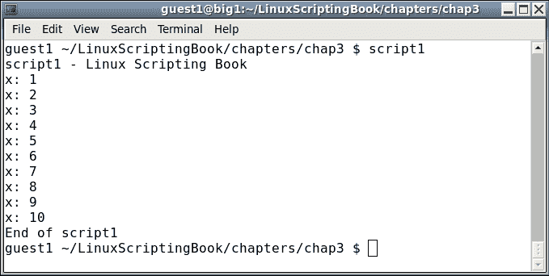
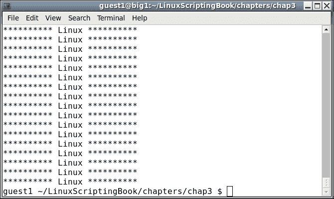
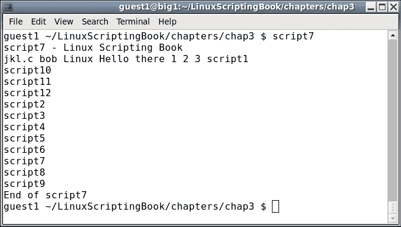
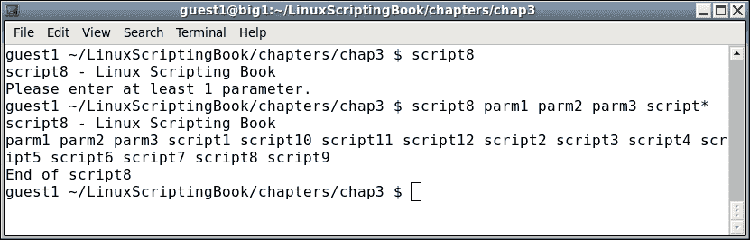

# 三、使用循环和睡眠命令

本章说明如何使用循环来执行迭代操作。它还展示了如何在脚本中创建延迟。读者将学习如何在脚本中使用循环和睡眠命令。

本章涵盖的主题如下:

*   标准`for`、`while`和`until`循环。
*   循环的嵌套，以及如何不混淆。
*   介绍`sleep`命令，以及如何使用该命令在脚本中造成延迟。
*   克服使用`sleep`的常见陷阱。

# 使用循环

任何编程语言最重要的特征之一是能够多次执行一个或多个任务，然后在满足结束条件时停止。这是通过使用循环来实现的。

下一节展示了一个非常简单的`while`循环的例子:

## 第三章-剧本 1

```sh
#!/bin/sh
#
# 5/2/2017
#
echo "script1 - Linux Scripting Book"
x=1
while [ $x -le 10 ]
do
 echo x: $x
 let x++
done

echo "End of script1"

exit 0
```

而这里是输出:



我们从将变量`x`设置为`1`开始。`while`语句检查`x`是否小于或等于`10`，如果是，运行`do`和`done`语句之间的命令。它将继续这样做，直到`x`等于`11`，在这种情况下，完成语句之后的行将运行。

在你的系统上运行这个。理解这个脚本非常重要，这样我们就可以继续进行更高级的循环。

让我们在下一节看看另一个脚本，看看您是否能确定它有什么问题。

## 第三章-剧本 2

```sh
#!/bin/sh
#
# 5/2/2017
#
echo "script2 - Linux Scripting Book"

x=1
while [ $x -ge 0 ]
do
 echo x: $x
 let x++
done

echo "End of script2"

exit 0
```

感觉自由跳过这一个的运行，除非你真的想。仔细看`while`测试。它表示当`x`大于或等于`0`时，运行循环中的命令。`x`会不满足这个条件吗？不，它不是，这就是所谓的无限循环。不用担心；按 *Ctrl* + *C* 仍然可以结束脚本(按住 *Ctrl* 键，按 *C* )。这将终止脚本。

我想马上涵盖无限循环，因为您几乎肯定会不时这样做，我想让您知道如何在脚本发生时终止它。当我刚开始的时候，我确实这样做过几次。

好吧，让我们做些更有用的事情。假设您正在启动一个新项目，需要在系统上创建一些目录。您可以一次执行一个命令，或者在脚本中使用一个循环。

我们将在*脚本 3* 中看到这一点。

## 第三章-剧本 3

```sh
#!/bin/sh
#
# 5/2/2017
#
echo "script3 - Linux Scripting Book"

x=1
while [ $x -le 10 ]
do
 echo x=$x
 mkdir chapter$x
 let x++
done
echo "End of script3"

exit 0
```

这个简单的脚本假设你从基本目录开始。当运行时，它将创建目录`chapter 1`到`chapter 10`，然后进行到底。

当运行对您的计算机进行更改的脚本时，最好在真正运行之前确保逻辑正确。例如，在运行这个之前，我注释掉了`mkdir`行。然后我运行脚本以确保它在显示`x`等于`10`后停止。然后，我取消了对该行的注释，并真实地运行了它。

# 屏幕操作

我们将在下一节看到另一个脚本，它使用一个循环将文本放在屏幕上:

## 第三章-剧本 4

```sh
#!/bin/sh
#
# 5/2/2017
#
echo "script4 - Linux Scripting Book"

if [ $# -ne 1 ] ; then
 echo "Usage: script4 string"
 echo "Will display the string on every line."
 exit 255
fi

tput clear                   # clear the screen

x=1
while [ $x -le $LINES ]
do
 echo "********** $1 **********"
 let x++
done

exit 0
```

在执行此脚本之前，运行以下命令:

```sh
echo $LINES
```

如果该终端的行数未显示，运行以下命令:

```sh
export LINES=$LINES
```

然后继续运行脚本。以下是使用`script4` `Linux`运行时我的系统上的输出:



好吧，所以我同意这可能不是非常有用，但它确实显示了一些事情。`LINES` env var 包含当前终端的当前行数(或行数)。这对于在更复杂的脚本中限制输出非常有用，这将在后面的章节中显示。这个例子也展示了如何在脚本中操作屏幕。

如果你需要导出`LINES`变量，你可以把它放在你的`.bashrc`文件中，并重新获取它。

我们将在下一节中查看另一个脚本:

## 第三章-剧本 5

```sh
#!/bin/sh
#
# 5/2/2017
#
# script5 - Linux Scripting Book

tput clear                   # clear the screen

row=1
while [ $row -le $LINES ]
do
 col=1
 while [ $col -le $COLUMNS ]
 do
  echo -n "#"
  let col++
 done
 echo ""                     # output a carriage return
 let row++
done

exit 0
```

这类似于*脚本 4* ，它显示了如何在终端范围内显示输出。请注意，您可能需要导出`COLUMNS`环境变量，就像我们导出`LINES`变量一样。

你可能注意到这个剧本有些不同。`while`语句里面有`while`语句。这被称为嵌套循环，在编程中经常使用。

我们从声明`row=1`开始，然后开始外部`while`循环。然后将`col` var 设置为`1`，然后启动内环。这个内部循环显示了行中每一列的字符。当到达行尾时，循环结束，`echo`语句输出回车。`row` var 递增，然后过程再次开始。它在最后一行之后结束。

通过使用`LINES`和`COLUMNS`环境变量，只写入实际屏幕。您可以通过运行程序然后扩展终端来测试这一点。

当使用嵌套循环时，很容易混淆什么去哪里。这是我每次都尝试做的事情。当我第一次意识到程序(可以是脚本、C 或 Java 等)中需要一个循环时，我首先这样编写循环体:

```sh
 while [ condition ]
 do
    other statements will go here
 done
```

这样我就不会忘记`done`语句，并且它也是正确排列的。如果我需要另一个循环，我只需要再做一次:

```sh
 while [ condition ]
 do
   while [ condition ]
   do
     other statements will go here
   done
 done
```

您可以根据需要嵌套任意多个循环。

# 缩进您的代码

这可能是谈论缩进的好时机。在过去(也就是 30 多年前)，每个人都使用一个带有单间距字体的文本编辑器来编写他们的代码，因此只需一个空格缩进就可以相对容易地保持所有内容对齐。后来，当人们开始使用可变间距字体的文字处理器时，缩进变得越来越难看到，因此使用了更多的空格(或制表符)。我的建议是用你觉得最舒服的。然而，话虽如此，你可能不得不学习阅读和使用任何适合你公司的代码风格。

到目前为止，我们只讨论了`while`声明。现在让我们来看下一节中的`until`循环:

## 第三章-剧本 6

```sh
#!/bin/sh
#
# 5/3/2017
#
echo "script6 - Linux Scripting Book"

echo "This shows the while loop"

x=1
while [ $x -lt 11 ]          # perform the loop while the condition 
do                           # is true
 echo "x: $x"
 let x++
done

echo "This shows the until loop"

x=1
until [ $x -gt 10 ]          # perform the loop until the condition 
do                           # is true
 echo "x: $x"
 let x++
done

echo "End of script6"

exit 0
```

输出:


看看这个剧本。两个循环的输出是相同的；然而，情况恰恰相反。当条件为真时，第一个循环继续，第二个循环继续，直到条件为真。一个不那么微妙的差别，所以要注意。

# 使用 for 语句

另一种循环方式是使用`for`语句。它通常用于处理文件和其他列表。`for`循环的一般语法如下:

```sh
 for variable in list
 do
     some commands
 done
```

该列表可以是字符串的集合，或者文件名通配符，等等。我们可以在下一节给出的例子中看到这一点。

## 第三章-剧本 7

```sh
#!/bin/sh
#
# 5/4/2017
#
echo "script7 - Linux Scripting Book"

for i in jkl.c bob Linux "Hello there" 1 2 3
do
 echo -n "$i "
done

for i in script*             # returns the scripts in this directory
do
 echo $i
done

echo "End of script7"
exit 0
```

以及我系统的输出。这是我的`chap3`目录:



下一个脚本显示了如何将`for`语句用于文件:

## 第三章-剧本 8

```sh
#!/bin/sh
#
# 5/3/2017
#
echo "script8 - Linux Scripting Book"

if [ $# -eq 0 ] ; then
 echo "Please enter at least 1 parameter."
 exit 255
fi

for i in $*                  # the "$*" returns every parameter given 
do                           # to the script
 echo -n "$i "
done

echo ""                      # carriage return
echo "End of script8"

exit 0
```

以下是输出:



使用`for`语句还可以做一些其他的事情，更多信息请参考 Bash 的`man`页面。

# 提前离开循环

有时当你在编写一个脚本时，你会遇到一种情况，在结束条件满足之前，你想提前退出循环。这可以使用`break`和`continue`命令来完成。

下面是显示这些命令的脚本。我也在介绍`sleep`命令，这将在下一个脚本中详细讨论。

## 第三章-剧本 9

```sh
#!/bin/sh
#
# 5/3/2017
#
echo "script9 - Linux Scripting Book"

FN1=/tmp/break.txt
FN2=/tmp/continue.txt

x=1
while [ $x -le 1000000 ]
do
 echo "x:$x"
 if [ -f $FN1 ] ; then
  echo "Running the break command"
  rm -f $FN1
  break
 fi

 if [ -f $FN2 ] ; then
  echo "Running the continue command"
  rm -f $FN2
  continue
 fi

 let x++
 sleep 1
done

echo "x:$x"

echo "End of script9"

exit 0
```

以下是我的系统的输出:


在你的系统上运行这个，在另一个终端`cd`到`/tmp`目录。运行命令`touch continue.txt`并观察发生了什么。如果您愿意，您可以多次这样做(请记住，向上箭头会调用前面的命令)。注意当点击`continue`命令时，变量`x`不会增加。这是因为控制立即回到`while`语句。

现在运行`touch break.txt`命令。脚本将结束，并且`x`没有增加。这是因为`break`立即导致循环结束。

`break`和`continue`命令在脚本中经常使用，所以一定要玩这个命令，以便真正了解发生了什么。

# 睡眠命令

我之前向展示了`sleep`命令，让我们更详细地了解一下。一般来说，`sleep`命令用于在脚本中引入延迟。例如，在之前的脚本中，如果我没有使用`sleep`，输出会滚动得太快，看不到发生了什么。

`sleep`命令需要一个参数来指示延迟时间。例如，`sleep 1`表示引入一秒的延迟。这里有几个例子:

```sh
sleep 1       # sleep 1 second (the default is seconds)
sleep 1s      # sleep 1 second
sleep 1m      # sleep 1 minute
sleep 1h      # sleep 1 hour
sleep 1d      # sleep 1 day
```

`sleep`命令实际上比这里显示的功能多一点。更多信息请参考`man sleep`页面。

下面是一个脚本，更详细地展示了`sleep`是如何工作的:

## 第三章-剧本 10

```sh
#!/bin/sh
#
# 5/3/2017
#
echo "script10 - Linux Scripting Book"

echo "Sleeping seconds..."
x=1
while [ $x -le 5 ]
do
 date
 let x++
 sleep 1
done

echo "Sleeping minutes..."
x=1
while [ $x -le 2 ]
do
 date
 let x++
 sleep 1m
done

echo "Sleeping hours..."
x=1
while [ $x -le 2 ]
do
 date
 let x++
 sleep 1h
done

echo "End of script10"
exit 0
```

而输出:


你可能注意到了，我按 *Ctrl* + *C* 终止脚本，因为我不想等 2 个小时才完成。这种性质的脚本在 Linux 系统中被广泛用于监控进程、监视文件等等。

使用`sleep`命令时有一个需要提及的常见陷阱。

### 注

请记住`sleep`命令会在脚本中引入延迟。明确一点，当你编码一个`sleep 60`的时候，是指引入 60 秒的延迟；这并不意味着它将每 60 秒运行一次脚本。差别很大。

我们将在下一节中看到一个这样的例子:

## 第三章-剧本 11

```sh
#!/bin/sh
#
# 5/3/2017
#
echo "script11 - Linux Scripting Book"

while [ true ]
do
 date
 sleep 60                    # 60 seconds
done

echo "End of script11"

exit 0
```

这是我系统上的输出。最终不同步并不需要那么长时间:


对于绝大多数脚本来说，这永远不会成为问题。请记住，如果您试图完成的任务是时间关键的，比如每天晚上 12:00 运行一个命令，您可能需要考虑其他方法。注意`crontab`也不会这样做，因为在它运行命令之前有大约 1 或 2 秒的延迟。

# 观看流程

本章还有几个我们应该看的话题。假设您希望在系统上运行的进程结束时收到警报。

这里有一个脚本，当指定的过程结束时通知用户。请注意，还有其他方法可以完成这项任务，这只是一种方法。

## 第三章-剧本 12

```sh
#!/bin/sh
#
# 5/3/2017
#
echo "script12 - Linux Scripting Book"

if [ $# -ne 1 ] ; then
 echo "Usage: script12 process-directory"
 echo " For example: script12 /proc/20686"
 exit 255
fi

FN=$1                        # process directory i.e. /proc/20686
rc=1
while [ $rc -eq 1 ]
do
 if [ ! -d $FN ] ; then      # if directory is not there
  echo "Process $FN is not running or has been terminated."
  let rc=0
 else
  sleep 1
 fi
done

echo "End of script12"
exit 0
```

要查看该脚本的运行情况，请运行以下命令:

*   在终端中，运行`script9`
*   在另一个终端运行`ps auxw | grep script9`。输出会是这样的:

    ```sh
    guest1   20686  0.0  0.0 106112  1260 pts/34   S+   17:20   0:00 /bin/sh ./script9
    guest1   23334  0.0  0.0 103316   864 pts/18   S+   17:24   0:00 grep script9
    ```

*   使用来自`script9`(本例中为`20686`)的进程 ID，并将其作为运行`script12` :

    ```sh
    $ script12 /proc/20686
    ```

    的参数

如果你愿意，你可以让它运行一会儿。最终回到正在运行的终端`script9`，用 *Ctrl* + *C* 终止。您将看到`script12`输出一条消息，然后也终止。请随意尝试这个，因为它包含了很多重要的信息。

您可能会注意到，在这个脚本中，我使用了一个变量`rc`，来确定何时结束循环。我可以使用`break`命令，就像我们在本章前面看到的那样。然而，使用一个控制变量(通常被称为)被认为是一种更好的编程风格。

当您已经开始一个命令，然后它花费的时间比您预期的要长时，这样的脚本会非常有用。

例如，不久前，我使用`mkfs`命令在外部 1tbu 盘上开始格式化操作。它花了几天时间完成，我想知道确切的时间，这样我就可以继续使用驱动器。

# 创建编号备份文件

现在作为奖励，这里有一个可以运行的脚本，可以用来制作编号的备份文件。在我想出这个方法之前(很多年前)，我会经历手工制作备份的仪式。我的编号方案并不总是一致的，我很快意识到让脚本来做会更容易。这是计算机真正擅长的。

我把这个剧本叫做`cbS`。这是我很久以前写的，我甚至不知道它代表什么。也许是**电脑备份脚本**之类的。

## 第 3 章–脚本 13

```sh
#!/bin/sh
#
echo "cbS by Lewis 5/4/2017"

if [ $# -eq 0 ] ; then
 echo "Usage: cbS filename(s) "
 echo " Will make a numbered backup of the files(s) given."
 echo " Files must be in the current directory."
 exit 255
fi

rc=0                         # return code, default is no error
for fn in $*                 # for each filename given on the command line
do
 if [ ! -f $fn ] ; then      # if not found
  echo "File $fn not found."
  rc=1                       # one or more files were not found
 else
  cnt=1                      # file counter
  loop1=0                    # loop flag
  while [ $loop1 -eq 0 ]
  do
   tmp=bak-$cnt.$fn
   if [ ! -f $tmp ] ; then
     cp $fn $tmp
     echo "File "$tmp" created."
     loop1=1                 # end the inner loop
   else
     let cnt++               # try the next one
   fi
  done
 fi
done

exit $rc                     # exit with return code
```

它以`Usage`消息开始，因为它至少需要一个文件名来工作。

注意这个命令要求文件在当前目录下，所以做类似`cbS /tmp/file1.txt`的事情会产生错误。

`rc`变量初始化为`0`。如果找不到文件，将设置为`1`。

现在让我们看看内环。这里的逻辑是使用`cp`命令从原始文件创建一个备份文件。备份文件的命名方案是`bak-(number).original-filename`，其中`number`是序列中的下一个。代码通过浏览所有`bak-#.filename`文件直到找不到一个，来确定下一个数字是什么。然后，该文件将成为新的文件名。

让这个进入你的系统。您可以随意给它命名，但是要注意不要给它命名为现有的 Linux 命令。使用`which`命令进行检查。

以下是我的系统上的一些输出示例:


这个脚本可以大大改进。可以使用路径/文件，并且应该检查`cp`命令的错误。这种级别的编码将在后面的章节中介绍。

# 总结

在本章中，我们介绍了不同类型的循环语句以及它们之间的区别。嵌套循环和`sleep`命令也包括在内。还提到了使用`sleep`命令时的常见陷阱，并介绍了一个备份脚本来展示如何轻松创建编号备份文件。

在下一章中，我们将讨论子程序的创建和调用。