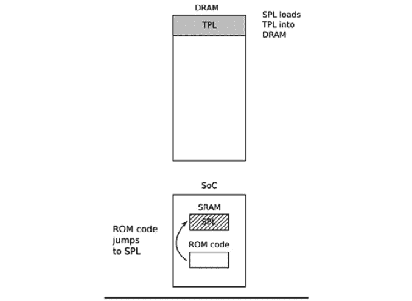

# 三、关于引导加载器的一切

引导加载程序是嵌入式 Linux 的第二个元素。 它是启动系统并加载操作系统内核的部分。 在本章中，我们将介绍引导加载程序的角色，特别是它如何使用称为**设备树**的数据结构(也称为**扁平设备树**或**FDT**)将控制从自身传递给内核。 我将介绍设备树的基础知识，因为这将帮助您遵循设备树中描述的连接，并将其与实际硬件相关联。

我将介绍流行的开源引导加载程序 U-Boot，并以 Beaglebone Black 为例向您展示如何使用它来引导目标设备，以及如何对其进行自定义以使其可以在新设备上运行。

在本章中，我们将介绍以下主题：

*   引导加载程序做什么？
*   引导顺序
*   从引导加载程序移到内核
*   设备树简介
*   U-Boot

我们开始吧!

# 技术要求

要按照本章中的示例操作，请确保您具备以下条件：

*   安装了`device-tree-compiler`、`git`、`make`、`patch`和`u-boot-tools`或其等效项的基于 Linux 的主机系统。
*   Beaglebone Black 的 Crosstool-NG 工具链，参见[*第 2 章*](02.html#_idTextAnchor029)，*学习
    关于工具链*。
*   一种 MicroSD 卡读卡器和卡。
*   USB 转 TTL 3.3V 串行电缆
*   比格尔博恩黑
*   5V 1A 直流电源

本章将使用的所有代码都可以在本书 GitHub 存储库的`Chapter03`文件夹中找到：[https://github.com/PacktPublishing/Mastering-Embedded-Linux-Programming-Third-Edition](https://github.com/PacktPublishing/Mastering-Embedded-Linux-Programming-Third-Edition)。

# 引导加载程序做什么？

在嵌入式Linux 系统中，BootLoader 有两个主要工作：将系统初始化为基本级别和加载内核。 事实上，第一个作业在某种程度上从属于第二个作业，因为它只需要让系统工作到加载内核所需的程度即可。

当执行引导加载程序代码的第一行时，在通电或重置之后，系统处于非常小的状态。 未设置 DRAM 控制器，因此无法访问主内存。 同样，其他接口未配置，因此通过 NAND 闪存控制器、MMC 控制器等访问的存储不可用。 通常，开始时唯一可操作的资源是单 CPU 内核、一些片上静态存储器和引导 ROM。

系统引导由几个阶段的代码组成，每个阶段都会使更多的系统投入运行。 引导加载程序的最后一个动作是将内核加载到 RAM 中，并为其创建一个执行环境。 引导加载器和内核之间接口的细节是特定于体系结构的，但在每种情况下，它都必须做两件事。 首先，引导加载程序必须传递一个指向包含有关硬件配置信息的结构的指针。 其次，它必须传递一个指向内核命令行的指针。

内核命令行是控制 Linux 行为的文本字符串。 一旦内核开始执行，就不再需要引导加载程序，并且它正在使用的所有内存都可以回收。

引导加载器的一项辅助工作是提供维护模式，用于更新引导配置、将新引导映像加载到内存中，可能还包括运行诊断。 这通常由简单的命令行用户界面控制，通常通过串行控制台。

# 引导顺序

在更简单的时候，几年前，只需要将引导加载程序放在非易失性存储器中处理器的重置向量处。 **NOR 闪存**在当时很常见，因为它可以直接映射到地址空间，所以它是理想的存储方法。 下图显示了这样的配置，闪存区域顶端的`0xfffffffc`处有**复位矢量**。 引导加载器被链接，以便在该位置有一个指向引导加载器代码开始的跳转指令：


图 3.1-NOR 闪光灯

从那时起，在 NOR 闪存中运行的引导加载程序代码可以初始化 DRAM 控制器，以便主存储器(**DRAM**)变为可用，然后将其自身复制到 DRAM 中。 一旦完全运行，引导加载程序就可以将内核从闪存加载到 DRAM 中，并将控制权移交给它。

然而，一旦您离开了简单的线性可寻址存储介质(如 NOR 闪存)，引导序列就会变成一个复杂的多阶段过程。 细节对于每个 SoC 都是非常具体的，但它们通常遵循以下每个阶段。

## 阶段 1-ROM 代码

在没有可靠的外部存储器的情况下，在
复位或上电后立即运行的代码必须存储在 SoC 中的芯片上；这称为**ROM 代码**。 它在制造时被加载到芯片中，因此 ROM 代码是专有的，不能被开源的等价物取代。 通常，它不包括初始化存储器控制器的代码，因为 DRAM 配置高度特定于器件，因此它只能使用不需要存储器控制器的**静态随机存取存储器**(**SRAM**)。

大多数嵌入式 SoC 设计都有少量的片内 SRAM，大小从 4 KB 到几百 KB 不等：


图 3.2-阶段 1-ROM 代码

ROM 代码能够将一小块代码从几个预编程位置之一加载到 SRAM 中。 例如，TI OMAP 和 Sitara 芯片尝试从 NAND 闪存的前几页加载代码，或者从通过**串行外设接口**(**SPI**)连接的闪存加载代码，或者从 MMC 设备(可以是 eMMC芯片或 SD 卡)的第一个扇区加载代码，或者从 MMC 设备的第一个分区上名为`MLO`的文件加载代码。 如果从所有这些存储设备读取失败，则会尝试从以太网、USB 或 UART 读取字节流；后者主要用于在生产过程中将代码加载到闪存中，而不是用于正常操作。 大多数嵌入式 SoC 都有以类似方式工作的 ROM 代码。 在 SRAM 不足以加载完整引导加载程序(如 U-Boot)的 SoC 中，必须有一个称为**辅助程序加载程序**(**SPL**)的中间加载程序。

在 ROM代码阶段结束时，SPL 出现在 SRAM 中，并且 ROM 代码跳转到该代码的开头。

## 阶段 2-辅助程序加载器

SPL 必须设置存储器控制器和系统的其他基本部件，为将**第三级程序加载程序**(**TPL**)加载到 DRAM 做好准备。 SPL 的功能受 SRAM 大小的限制。 它可以从存储设备列表中读取程序，就像 ROM 代码一样，再次使用从闪存设备开始处预先编程的偏移量。 如果 SPL 内置了文件系统驱动程序，它可以从磁盘分区读取众所周知的文件名，比如`u-boot.img`。 SPL 通常不允许任何用户交互，但它可能会打印版本信息和进度消息，您可以在控制台上看到这些信息。 下图说明了第 2 阶段架构：



图 3.3-阶段 2-SPL

上图显示了从 ROM 代码到 SPL 的跳转。 当 SPL 在 SRAM 中执行时，它会将 TPL 加载到 DRAM 中。 在第二阶段结束时，TPL 出现在 DRAM 中，SPL 可以跳转到该区域。

SPL 可能是开源的源代码，就像 TI x-Loader 和 Atmel AT91Bootstrap 一样，但它包含由制造商以二进制 BLOB 形式提供的专有代码是很常见的。

## 第三阶段-第三方物流

此时，我们正在运行一个完整的引导加载程序，例如 U-Boot，我们将在本章的后面部分了解它。 通常，有一个简单的命令行用户界面，允许您执行维护任务，例如将新的引导和内核映像加载到闪存中，以及加载和引导内核，并且有一种无需用户干预的自动加载内核的方法。

下图说明了阶段 3 架构：


图 3.4-阶段 3-第三方物流

上图显示了从 SRAM 中的 SPL 到 DRAM 中的 TPL 的跳变。 当 TPL 执行时，它将内核加载到 DRAM 中。 如果需要，我们还可以选择将 FDT 和/或初始 RAM 磁盘附加到 DRAM 中的映像。 无论哪种方式，在第三阶段结束时，内存中都有一个内核等待启动。

一旦内核运行，嵌入式引导加载程序通常就会从内存中消失，并且不再参与系统的操作。 在此之前，TPL 需要将引导过程的控制权移交给内核。

# 从引导加载程序移到内核

当引导加载程序将控制权传递给内核时，它必须传递一些基本信息，其中包括以下内容：

*   在不支持设备树的 PowerPC 和 ARM 平台上使用的*机器号*，用于标识 SoC 的类型。
*   到目前为止检测到的硬件的基本细节，包括(至少)物理 RAM 的大小和位置以及 CPU 的时钟速度。
*   内核命令行。
*   设备树二进制文件的位置和大小(可选)。
*   还可以选择初始 RAM 磁盘的位置和大小，称为**初始 RAM 文件系统**(**initramfs**)。

内核命令行是一个纯 ASCII 字符串，它通过给出例如包含根文件系统的设备的名称来控制 Linux 的行为。 我们将在下一章中详细介绍这一点。 通常将根文件系统作为 RAM 磁盘提供，在这种情况下，引导加载程序负责将 RAM 磁盘映像加载到内存中。 我们将在[*第 5 章*](05.html#_idTextAnchor122)，*构建根文件系统*中介绍如何创建初始 RAM 磁盘。

此信息的传递方式取决于体系结构，并且在最近几年发生了变化。 例如，在 PowerPC 中，引导加载器只是用来传递指向电路板信息结构的指针，而在 ARM 中，它只传递指向*A 标记列表*的指针。 在`Documentation/arm/Booting`中对内核源代码中的 A 标签格式有很好的描述。

在这两种情况下，传递的信息量都非常有限，只剩下大部分信息在运行时被发现，或者作为**平台数据**硬编码到内核中。 平台数据的广泛使用意味着每个主板都必须为该平台配置和修改内核。 需要一种更好的方式，那就是设备树。 在 ARM 领域，从 2013 年 2 月开始，随着 Linux3.8 的发布，正式开始了对 A 标签的淘汰。 今天，几乎所有的 ARM 系统都使用设备树来收集有关硬件平台细节的信息，从而允许单个内核二进制文件在广泛的这些平台上运行。

现在我们已经了解了引导加载器的作用、引导序列的各个阶段以及它如何将控制权传递给内核，接下来让我们学习如何配置引导加载器，使其能够在流行的嵌入式 SoC 上运行。

# 设备树简介

如果您使用的是ARM 或 PowerPC SoC，您几乎肯定会在某个时候遇到设备树。 本节旨在让您快速了解它们是什么以及它们是如何工作的。 在本书的整个过程中，我们将反复回顾设备树的主题。

设备树是定义计算机系统硬件组件的一种灵活方式。 请记住，设备树只是静态数据，而不是可执行代码。 通常，设备树由引导加载程序加载并传递给内核，尽管也可以将设备树与内核映像本身捆绑在一起，以满足无法单独加载它们的引导加载程序的需要。

该格式派生自 Sun Microsystems引导加载程序(称为**OpenBoot**)，该引导加载程序被正式化为开放固件规范，该规范是 IEEE 标准 IEEE1275-1994。 它用于基于 PowerPC 的 Macintosh 计算机，因此是 PowerPC Linux 端口的合理选择。 从那时起，它被许多 ARM Linux 实现大规模采用，在较小程度上被 MIPS、MicroBlaze、ARC 和其他体系结构采用。

我建议访问[https://www.devicetree.org](https://www.devicetree.org)了解更多信息。

## 设备树基础知识

Linux 内核在`arch/$ARCH/boot/dts`中包含大量的设备树源文件，这是学习设备树的一个很好的起点。 在`arch/$ARCH/dts`中的 U-boot 源代码中也有较少数量的源代码。 如果您的硬件是从第三方购买的，`dts`文件构成主板支持包的一部分，因此您应该会收到一个源文件和其他源文件。

设备树将计算机系统表示为在层次结构(如树)中连接在一起的组件的集合。 设备树以根节点开始，该根节点由正斜杠`/`表示，它包含表示系统硬件的后续节点。 每个节点都有一个名称，并包含许多格式为`name = "value"`的属性。 下面是一个简单的例子：

```sh
/dts-v1/;
/{
    model = "TI AM335x BeagleBone";
    compatible = "ti,am33xx";
    #address-cells = <1>;
    #size-cells = <1>;
    cpus {
        #address-cells = <1>;
        #size-cells = <0>;
        cpu@0 {
            compatible = "arm,cortex-a8";
            device_type = "cpu";
            reg = <0>;
        };
    };
    memory@0x80000000 {
        device_type = "memory";
        reg = <0x80000000 0x20000000>; /* 512 MB */
    };
};
```

这里，我们有一个根节点，它包含一个`cpus`节点和一个`memory`节点。 `cpus`节点包含名为`cpu@0`的单个 CPU 节点。 这些节点的名称通常包括一个`@`，后跟一个地址，该地址将该节点与其他相同类型的节点区分开来。 如果节点具有`reg`属性，则需要`@`。

根节点和 CPU 节点都有`compatible`属性。 Linux 内核使用此属性来查找匹配的设备驱动程序，方法是将其与由`of_device_id`结构中的每个设备驱动程序导出的字符串进行比较(更多信息请参见[*第 11 章*](11.html#_idTextAnchor329)，*与设备驱动程序*接口)。

重要注

按照惯例，`compatible`属性的值由制造商名称和组件名称组成，以减少不同制造商制造的类似设备之间的混淆；因此，`ti,am33xx`和`arm,cortex-a8`。 在有多个驱动程序可以处理此设备的情况下，`compatible`属性有多个值也很常见。 它们被列出，最合适的列在前面。

CPU 节点和内存节点有一个`device_type`属性，该属性描述设备的类别。 节点名称通常派生自`device_type`。

## reg 属性

前面显示的`memory`和`cpu`节点具有`reg`属性，该属性引用寄存器空间中的单元范围。 `reg`属性由表示实际物理地址和范围大小(长度)的两个值组成。 两者都被写成零个或多个个 32 位整数，称为单元。 因此，前面的`memory`节点指的是从`0x80000000`开始、长度为`0x20000000`字节的单个内存库。

当地址或大小值不能用 32 位表示时，理解`reg`属性变得更加复杂。 例如，在采用 64 位寻址的设备上，每个单元需要两个单元：

```sh
/{
    #address-cells = <2>;
    #size-cells = <2>;
    memory@80000000 {
        device_type = "memory";
        reg = <0x00000000 0x80000000 0 0x80000000>;
    };
};
```

有关所需单元格数量的信息保存在祖先节点的`#address-cells`和`#size_cells`属性中。 换句话说，要理解`reg`属性，必须向下查看节点层次结构，直到找到`#address-cells`和`#size_cells`。 如果没有，则每个的缺省值都是`1`-但设备树编写器依赖缺省值是不好的做法。

现在，让我们回到`cpu`和`cpus`节点。 CPU 也有地址；在四核设备中，它们可能被寻址为 0、1、2 和 3。这可以被认为是没有任何深度的一维数组，因此大小为零。 因此，您可以看到，在`cpus`节点中有`#address-cells = <1>`和`#size-cells = <0>`，在子节点`cpu@0`中，我们为`reg`属性`reg = <0>`分配了一个值。

## 标签和中断

到目前为止，我们已经描述的设备树的结构假设组件只有一个层次结构，而实际上有几个。 除了组件和系统的其他部分之间明显的数据连接之外，它还可以连接到中断控制器、时钟源和电压调节器。 为了表示这些连接，我们可以向一个节点添加一个标签，然后从其他节点引用该标签。 这些标签有时被称为**管脚**，因为当编译设备树时，具有来自另一个节点的引用的节点在称为`phandle`的属性中被分配一个唯一的数值。 如果反编译设备树二进制文件，就可以看到它们。

以包含可产生`interrupts`和`interrupt-controller`的 LCD 控制器的系统为例：

```sh
/dts-v1/;
{
    intc: interrupt-controller@48200000 {
        compatible = "ti,am33xx-intc";
        interrupt-controller;
        #interrupt-cells = <1>;
        reg = <0x48200000 0x1000>;
    };
    lcdc: lcdc@4830e000 {
        compatible = "ti,am33xx-tilcdc";
        reg = <0x4830e000 0x1000>;
        interrupt-parent = <&intc>;
        interrupts = <36>;
        ti,hwmods = "lcdc";
        status = "disabled";
    };
};
```

这里，我们有一个标签为`intc`的`interrupt-controller@48200000`节点。 `interrupt-controller`属性将其标识为中断控制器。 与所有中断控制器一样，它有一个`#interrupt-cells`属性，该属性告诉我们需要多少个单元来表示中断源。 在这种情况下，只有一个代表**中断请求**(**IRQ**)编号。 其他中断控制器可以使用额外的单元来表征中断；例如，用来指示它是边沿触发还是电平触发。 每个中断控制器的绑定中描述了中断单元的数量及其含义。 设备树绑定可以在 Linux 内核源代码中的`Documentation/devicetree/bindings/`目录中找到。

查看`lcdc@4830e000`节点，它有一个`interrupt-parent`属性，该属性使用标签引用它所连接的中断控制器。 它还有一个`interrupts`属性，在本例中为`36`。 请注意，该节点有自己的标签`lcdc`，该标签在其他地方使用：任何节点都可以有一个标签。

## 设备树包括文件

许多硬件在同一系列的 SoC 之间以及使用相同 SoC 的电路板之间是通用的。 这反映在设备树中，方法是将公共部分拆分成包含文件，通常扩展名为`.dtsi`。 Open Firmware 标准将`/include/`定义为要使用的机制，如`vexpress-v2p-ca9.dts`中的以下代码片段所示：

```sh
/include/ "vexpress-v2m.dtsi"
```

不过，请查看内核中的`.dts`文件，您会发现另一个借用自 C 的`include`语句；例如，在`am335x-boneblack.dts`中：

```sh
#include "am33xx.dtsi"
#include "am335x-bone-common.dtsi"
```

下面是`am33xx.dtsi`中的另一个示例：

```sh
#include <dt-bindings/gpio/gpio.h>
#include <dt-bindings/pinctrl/am33xx.h>
#include <dt-bindings/clock/am3.h>
```

最后，`include/dt-bindings/pinctrl/am33xx.h`包含普通的 C 宏：

```sh
#define PULL_DISABLE       (1 << 3)
#define INPUT_EN           (1 << 5)
#define SLEWCTRL_SLOW      (1 << 6)
#define SLEWCTRL_FAST       0
```

如果使用 Kbuild 系统构建设备树源，则所有这些问题都可以解决，Kbuild 系统通过 C 预处理器 cpp 运行它们，在 cpp 中，`#include`和`#define`语句被处理成适合于设备树编译器的文本。 此动机在前面的示例中进行了说明；这意味着设备树源可以使用与内核代码相同的常量定义。

当我们使用任一语法包含文件时，节点会一个接一个地重叠，以创建一个复合树，在该树中外层扩展或修改内部层。 例如，通用于所有`am33xx`SoC 的`am33xx.dtsi`定义了第一个 MMC 控制器接口，如下所示：

```sh
mmc1: mmc@48060000 {
    compatible = "ti,omap4-hsmmc";
    ti,hwmods = "mmc1";
    ti,dual-volt;
    ti,needs-special-reset;
    ti,needs-special-hs-handling;
    dmas = <&edma_xbar 24 0 0
        &edma_xbar 25 0 0>;
    dma-names = "tx", "rx";
    interrupts = <64>;
    reg = <0x48060000 0x1000>;
    status = "disabled";
};
```

请注意，`status`是`disabled`，这意味着没有设备驱动程序应该绑定到它，而且它的标签是`mmc1`。

Beaglebone 和 Beaglebone Black 都有一个连接到`mmc1`的 microSD 卡接口。 这就是为什么在`am335x-bone-common.dtsi`中，相同的节点由其标签引用；即`&mmc1`：

```sh
&mmc1 {
    status = "okay";
    bus-width = <0x4>;
    pinctrl-names = "default";
    pinctrl-0 = <&mmc1_pins>;
    cd-gpios = <&gpio0 6 GPIO_ACTIVE_LOW>;
};
```

`status`属性设置为`okay`，这会导致 MMC 设备驱动程序在运行时与 Beaglebone 的两个变体上的此接口绑定。 此外，对标签的引用被添加到管脚控制配置`mmc1_pins`。 唉，这里没有足够的篇幅来描述管脚控制和管脚复用。 您可以在`Documentation/devicetree/bindings/pinctrl`目录中的 Linux 内核源代码中找到一些信息。

但是，`mmc1`接口连接到 Beaglebone Black 上的不同电压调节器。 这以`am335x-boneblack.dts`表示，其中您将看到另一个对`mmc1`的引用，该引用通过`vmmcsd_fixed`标签将其与电压调节器相关联：

```sh
&mmc1 {
    vmmc-supply = <&vmmcsd_fixed>;
};
```

因此，像这样对设备树源文件进行分层为我们提供了灵活性，并减少了对重复代码的需要。

## 编译设备树

引导加载程序和内核需要设备树的二进制表示，因此必须使用设备树编译器进行编译；即`dtc`。 结果是一个以`.dtb`结尾的文件，它被称为设备树二进制或设备树 BLOB。

Linux 源代码中的`scripts/dtc/dtc`中有一份`dtc`的副本，许多 Linux 发行版上也提供了它的软件包。 您可以使用它编译一个简单的设备树(不使用`#include`的设备树)，如下所示：

```sh
$ dtc simpledts-1.dts -o simpledts-1.dtb
DTC: dts->dts on file "simpledts-1.dts"
```

请注意，`dtc`不会给出有用的错误消息，也不会检查语言的基本语法，这意味着调试源文件中的键入错误可能是一个漫长的过程。

要构建更复杂的示例，您必须使用 Kbuild 内核，如[*第 4 章*](04.html#_idTextAnchor085)，*配置和构建内核*中所示。

与内核一样，引导加载程序可以使用设备树来初始化嵌入式 SoC 及其外围设备。 当您从大容量存储设备(如 QSPI 闪存)加载内核时，此设备树非常关键。 虽然嵌入式 Linux 提供了引导加载程序的选择，但我们将只介绍其中一个。 接下来，我们将深入研究该引导加载程序。

# U-Boot

我们将专门关注 U-Boot，因为它支持大量的处理器架构以及大量的单板和设备。 它已经存在了很长一段时间，并且有一个很好的社区来支持它。

U-Boot，或者全称为**Das U-Boot**，最初是一个用于嵌入式 PowerPC 板的开源引导加载程序。 然后，它被移植到基于 ARM 的主板上，后来又移植到其他架构上，包括 MIPS 和 SH。 它由 Denx 软件工程公司托管和维护。 上面有很多可用的信息，一个很好的起点是[https://www.denx.de/wiki/U-Boot](https://www.denx.de/wiki/U-Boot)。 还有一个邮件列表，地址是[u-BOOT@lists.denx.de](mailto:u-boot@lists.denx.de)，您可以通过填写并提交[https://lists.denx.de/listinfo/u-boot](https://lists.denx.de/listinfo/u-boot)提供的表单来订阅。

## 建筑 U-Boot

从获取源代码开始。 与大多数项目一样，推荐的方法是克隆`.git`存档并签出您想要使用的标记-在本例中，该标记是撰写本文时的最新版本：

```sh
$ git clone git://git.denx.de/u-boot.git
$ cd u-boot
$ git checkout v2021.01
```

或者，您可以从[ftp://ftp.denx.de/pub/u-boot](ftp://ftp.denx.de/pub/u-boot)获得一个 tarball。

在`configs/`目录中有 1,000 多个通用开发板和设备的配置文件。 在大多数情况下，您可以根据文件名很好地猜测使用哪个文件，但您可以通过查看`board/`目录中的每个单板的`README`文件来获得更详细的信息，或者您可以在适当的网络教程或论坛中找到信息。

以 Beaglebone Black 为例，我们会发现可能有一个名为`configs/am335x_evm_defconfig`的配置文件，该板生成的二进制文件文本**支持...。 `am335x`芯片的电路板`README`文件中的 Beaglebone Black**，`board/ti/am335x/README`。 有了这些知识，为 Beaglebone Black 构建 U-Boot 就很简单了。 您需要通过设置`CROSS_COMPILE`make 变量，然后使用`make [board]_defconfig`类型的命令选择配置文件，来通知 U-Boot 交叉编译器的前缀。 因此，要使用我们在[*第 2 章*](02.html#_idTextAnchor029)，*了解工具链*中创建的 Crosstool-NG 编译器构建 U-Boot，您需要键入以下内容：

```sh
$ source ../MELP/Chapter02/set-path-arm-cortex_a8-linux-gnueabihf
$ make am335x_evm_defconfig
$ make
```

编制结果如下：

*   `u-boot`：ELF 对象格式的 U-Boot，适用于调试器
*   `u-boot.map`：符号表
*   `u-boot.bin`：原始二进制格式的 U-Boot，适合在您的设备上运行
*   `u-boot.img`：这是添加了 U-Boot 标头的`u-boot.bin`，适用于上传到 U-Boot 的运行副本
*   `u-boot.srec`：Motorola S-Record(**SRECORD**或**SRE**)格式的 U-Boot，适合通过串行连接传输

如前所述，BeagleboneBlack 还需要一个**辅助程序加载器**(**SPL**)。 这是同时建造的，命名为 MLO：

```sh
$ ls -l MLO u-boot*
-rw-rw-r-- 1 frank frank  108260 Feb  8 15:24 MLO
-rwxrwxr-x 1 frank frank 6028304 Feb  8 15:24 u-boot
-rw-rw-r-- 1 frank frank  594076 Feb  8 15:24 u-boot.bin
-rw-rw-r-- 1 frank frank   20189 Feb  8 15:23 u-boot.cfg
-rw-rw-r-- 1 frank frank   10949 Feb  8 15:24 u-boot.cfg.configs
-rw-rw-r-- 1 frank frank   54860 Feb  8 15:24 u-boot.dtb
-rw-rw-r-- 1 frank frank  594076 Feb  8 15:24 u-boot-dtb.bin
-rw-rw-r-- 1 frank frank  892064 Feb  8 15:24 u-boot-dtb.img
-rw-rw-r-- 1 frank frank  892064 Feb  8 15:24 u-boot.img
-rw-rw-r-- 1 frank frank    1722 Feb  8 15:24 u-boot.lds
-rw-rw-r-- 1 frank frank  802250 Feb  8 15:24 u-boot.map
-rwxrwxr-x 1 frank frank  539216 Feb  8 15:24 u-boot-nodtb.bin
-rwxrwxr-x 1 frank frank 1617810 Feb  8 15:24 u-boot.srec
-rw-rw-r-- 1 frank frank  211574 Feb  8 15:24 u-boot.sym
```

对于其他目标，该过程类似。

## 安装 U-Boot

首次在板上安装引导加载程序需要一些外部帮助。 如果主板有硬件调试接口，如**JTAG**(**联合测试行动小组**)，通常可以将 U-Boot 的副本直接加载到 RAM 中并使其运行。 从那时起，您可以使用 U-Boot 命令，以便它将自身复制到闪存中。 这方面的细节非常具体，超出了本书的范围。

许多 SoC 设计都内置了引导 ROM，可用于从各种外部来源(如 SD 卡、串行接口或 USB 大容量存储)读取引导代码。 Beaglebone Black 中的`am335x`芯片就是这种情况，这使得试用新软件变得很容易。

您需要 SD 卡读卡器才能将图像写入卡。 有两种类型：插入 USB 端口的外部读卡器和许多笔记本电脑上都有的内置 SD 读卡器。 当将卡插入读卡器时，Linux 会指定设备名称。 `lsblk`命令是找出分配了哪个设备的有用工具。 例如，当我将一张 NOMINAl 8 GB microSD 卡插入我的读卡器时，会看到以下内容：

```sh
$ lsblk
NAME        MAJ:MIN RM   SIZE RO TYPE MOUNTPOINT
sda           8:0    1   7.4G  0 disk 
└─sda1        8:1    1   7.4G  0 part /media/frank/6662-6262
nvme0n1     259:0    0 465.8G  0 disk 
├─nvme0n1p1 259:1    0   512M  0 part /boot/efi
├─nvme0n1p2 259:2    0    16M  0 part 
├─nvme0n1p3 259:3    0 232.9G  0 part 
└─nvme0n1p4 259:4    0 232.4G  0 part /
```

在本例中，`nvme0n1`是我的 512 GB 硬盘，`sda`是 microSD 卡。 它只有一个分区`sda1`，该分区作为`/media/frank/6662-6262`目录挂载。

重要注

虽然 microSD 卡的外部打印有 8 GB，但内部只有 7.4 GB。 在一定程度上，这是因为使用的单位不同。 所通告的容量以千兆字节(109)为度量单位，但是由软件报告的大小以千兆字节(230)为单位。 千兆字节缩写为 GB，而千兆字节缩写为 GiB。 这同样适用于 KB 和 KiB 以及 MB 和 MIB。 在这本书中，我试着使用正确的单位。 在 SD 卡的情况下，8 GB 碰巧大约是 7.4GiB。

如果我使用内置的SD 卡插槽，我会看到：

```sh
$ lsblk
NAME        MAJ:MIN RM   SIZE RO TYPE MOUNTPOINT
mmcblk0     179:0    1   7.4G  0 disk 
└─mmcblk0p1 179:1    1   7.4G  0 part /media/frank/6662-6262
nvme0n1     259:0    0 465.8G  0 disk 
├─nvme0n1p1 259:1    0   512M  0 part /boot/efi
├─nvme0n1p2 259:2    0    16M  0 part 
├─nvme0n1p3 259:3    0 232.9G  0 part 
└─nvme0n1p4 259:4    0 232.4G  0 part /
```

在这种情况下，microSD 卡显示为`mmcblk0`，分区为`mmcblk0p1`。 请注意，您使用的 microSD 卡的格式可能与此不同，因此您可能会看到具有不同挂载点的不同数量的分区。 格式化 SD 卡时，确定其设备名称非常重要。 你真的不想把你的硬盘误认为 SD 卡，然后格式化它。 这已经不止一次发生在我身上了。 因此，我在本书的代码归档文件中提供了一个名为`MELP/format-sdcard.sh`的 shell 脚本，它具有合理的检查次数，以防止您(和我)使用错误的设备名称。 该参数是 microSD 卡的设备名称，在第一个示例中为`sdb`，在第二个示例中为`mmcblk0`。 以下是它的用法示例：

```sh
$ MELP/format-sdcard.sh mmcblk0
```

该脚本创建两个分区：第一个是 64MiB，格式为`FAT32`，将包含引导加载程序；第二个是 1GiB，格式为`ext4`，您将在[*第 5 章*](05.html#_idTextAnchor122)，*构建根文件系统*中使用它。 当该脚本应用于任何大于 32GiB 的驱动器时，该脚本将中止，因此如果您使用的是更大的 microSD 卡，请准备好修改它。

对 microSD 卡进行格式化后，将其从读卡器中取出，然后重新插入，以便自动挂载分区。 在当前版本的 Ubuntu 上，这两个分区应该挂载为`/media/[user]/boot`和`/media/[user]/rootfs`。 现在，您可以将 SPL 和 U-Boot 复制到其中，如下所示：

```sh
$ cp MLO u-boot.img /media/frank/boot
```

最后，卸载它：

```sh
$ sudo umount /media/frank/boot
```

现在，在 Beaglebone 板不通电的情况下，将 microSD 卡插入读卡器。 插入串行电缆。 串行端口在您的 PC 上应显示为`/dev/ttyUSB0`。 启动合适的终端程序，如`gtkterm`、`minicom`或`picocom`，并以`115200`位/秒(Bps)的速度连接到端口，不进行流量控制。 `gtkterm`可能是最容易设置和使用的：

```sh
$ gtkterm -p /dev/ttyUSB0 -s 115200
```

如果您收到权限错误，则可能需要将自己添加到`dialout`组并重新启动才能使用此端口。

按住 Beaglebone Black 上的Boot Switch 按钮(距离 microSD 插槽最近)，使用外部 5V 电源接头接通主板电源，大约 5 秒钟后松开按钮。 您应该会在串行控制台上看到一些输出，后面跟着 U-Boot 提示符：

```sh
U-Boot SPL 2021.01 (Feb 08 2021 - 15:23:22 -0800)
Trying to boot from MMC1
U-Boot 2021.01 (Feb 08 2021 - 15:23:22 -0800)
CPU  : AM335X-GP rev 2.1
Model: TI AM335x BeagleBone Black
DRAM:  512 MiB
WDT:   Started with servicing (60s timeout)
NAND:  0 MiB
MMC:   OMAP SD/MMC: 0, OMAP SD/MMC: 1
Loading Environment from FAT... *** Warning - bad CRC, using default environment
<ethaddr> not set. Validating first E-fuse MAC
Net:   eth2: ethernet@4a100000, eth3: usb_ether
Hit any key to stop autoboot:  0 
=>
```

按键盘上的任意键可停止 U-Boot 在默认环境下自动启动。 现在我们面前有一个 U-Boot 提示符，让我们来测试一下 U-Boot。

## 使用 U-Boot

在本节中，我将描述一些可以使用 U-Boot
执行的常见任务。

通常，U-Boot 通过串行端口提供命令行界面。 它提供为每个电路板定制的命令提示符。 在这些示例中，我将使用`=>`。 键入`help`会打印出在此版本的 U-Boot 中配置的所有命令；键入`help <command>`会打印出有关特定命令的更多信息。

Beaglebone Black 的默认命令解释器非常简单。 您不能通过按向左或向右键进行命令行编辑；按*Tab*键不会完成命令；按 Up 键也不会有命令历史记录。 按下这些键中的任何一个都会中断您当前尝试键入的命令，您必须键入*Ctrl+C*，然后重新开始。 唯一可以安全使用的行编辑键是退格键。 作为一种选择，您可以配置一个名为**Hush**的不同命令 shell，它具有更复杂的交互支持，包括命令行编辑。

默认数字格式为十六进制。 以下面的命令
为例：

```sh
=> nand read 82000000 400000 200000
```

这将从 NAND 闪存开始处的偏移量`0x400000`将`0x200000`字节读取到 RAM 地址`0x82000000`。

### 环境变量

U-Boot 广泛使用环境变量在函数之间存储和传递信息，甚至创建脚本。 环境变量是存储在内存区域中的简单`name=value`对。 初始变量集合可以在电路板配置头文件中编码，如下所示：

```sh
#define CONFIG_EXTRA_ENV_SETTINGS
"myvar1=value1"
"myvar2=value2"
[…]
```

您可以使用`setenv`从 U-Boot 命令行创建和修改变量。 例如，`setenv foo bar`使用`bar`值创建`foo`变量。 请注意，变量名和值之间没有`=`号。 您可以通过将变量设置为`null`字符串`setenv foo`来删除该变量。 您可以使用`printenv`将所有变量打印到控制台，也可以使用`printenv foo`打印单个变量。

如果 U-Boot 已为配置了存储环境的空间，您可以使用`saveenv`命令保存它。 如果存在原始 NAND 或 NOR 闪存，则可以为此保留一个`erase`块，通常使用另一个块作为冗余副本以防止损坏。 如果有 eMMC 或 SD 卡存储，则可以将其存储在保留的扇区阵列中，或存储在磁盘分区中名为`uboot.env`的文件中。 其他选项包括将其存储在通过 I2C 或 SPI 接口或非易失性 RAM 连接的串行 EEPROM 中。

### 引导映像格式

U-Boot 没有文件系统。 相反，它用 64 字节的头标记信息块，这样它就可以跟踪内容。 我们使用`mkimage`命令行工具为 U-Boot 准备文件，该工具与 Ubuntu 上的`u-boot-tools`包捆绑在一起。 您还可以通过在 U-Boot 源代码树中运行`make tools`来获取`mkimage`，然后将其作为`tools/mkimage`调用。

以下是该命令用法的简要摘要：

```sh
$ mkimage
Error: Missing output filename
Usage: mkimage -l image
          -l ==> list image header information
       mkimage [-x] -A arch -O os -T type -C comp -a addr -e ep -n name -d data_file[:data_file...] image
          -A ==> set architecture to 'arch'
          -O ==> set operating system to 'os'
          -T ==> set image type to 'type'
          -C ==> set compression type 'comp'
          -a ==> set load address to 'addr' (hex)
          -e ==> set entry point to 'ep' (hex)
          -n ==> set image name to 'name'
          -d ==> use image data from 'datafile'
          -x ==> set XIP (execute in place)
       mkimage [-D dtc_options] [-f fit-image.its|-f auto|-F] [-b <dtb> [-b <dtb>]] [-i <ramdisk.cpio.gz>] fit-image
           <dtb> file is used with -f auto, it may occur multiple times.
          -D => set all options for device tree compiler
          -f => input filename for FIT source
          -i => input filename for ramdisk file
Signing / verified boot options: [-E] [-B size] [-k keydir] [-K dtb] [ -c <comment>] [-p addr] [-r] [-N engine]
          -E => place data outside of the FIT structure
          -B => align size in hex for FIT structure and header
          -k => set directory containing private keys
          -K => write public keys to this .dtb file
          -c => add comment in signature node
          -F => re-sign existing FIT image
          -p => place external data at a static position
          -r => mark keys used as 'required' in dtb
          -N => openssl engine to use for signing
       mkimage -V ==> print version information and exit
Use '-T list' to see a list of available image types
```

例如，要为 ARM 处理器准备内核映像，可以使用以下命令
：

```sh
$ mkimage -A arm -O linux -T kernel -C gzip -a 0x80008000 \ 
-e 0x80008000
-n 'Linux' -d zImage uImage
```

在本例中，体系结构是`arm`，操作系统是`linux`，镜像类型是`kernel`。 另外，压缩方案为`gzip`，加载地址为`0x80008000`，入口点与加载地址相同。 最后，图像
名为`Linux`，图像数据文件名为`zImage`，生成的图像名为`uImage`。

### 正在加载图像

通常，您将从可移动存储(如 SD 卡或网络)加载图像。 SD 卡在 U-Boot 中由 MMC 驱动程序处理。 用于将图像加载到存储器的典型序列如下：

```sh
=> mmc rescan
=> fatload mmc 0:1 82000000 uimage
reading uimage
4605000 bytes read in 254 ms (17.3 MiB/s)
=> iminfo 82000000
## Checking Image at 82000000 ...
Legacy image found
Image Name: Linux-3.18.0
Created: 2014-12-23 21:08:07 UTC
Image Type: ARM Linux Kernel Image (uncompressed)
Data Size: 4604936 Bytes = 4.4 MiB
Load Address: 80008000
Entry Point: 80008000
Verifying Checksum ... OK
```

`mmc rescan`命令重新初始化 MMC 驱动程序，可能是为了检测最近是否插入了 SD 卡。 接下来，使用`fatload`从 SD 卡上的 FAT 格式分区读取文件。 格式如下：

```sh
fatload <interface> [<dev[:part]> [<addr> [<filename> [bytes [pos]]]]]
```

如果`<interface>`是`mmc`，就像我们的例子一样，`<dev:part>`是 MMC 接口的设备号，从零开始计数，分区号从一开始计数。 因此，`<0:1>`是第一个设备上的第一个分区，即 microSD 卡的`mmc 0`(板载 eMMC 为`mmc 1`)。 存储器位置`0x82000000`被选择在目前未使用的 RAM 区域中。 如果我们打算引导这个内核，我们必须确保当内核映像被解压缩并位于运行时位置时，RAM 的这一区域不会被覆盖，`0x80008000`。

要通过网络加载图像文件，必须使用**普通文件传输协议(TFTP)**。 这需要您在开发系统上安装 TFTP 守护进程`tftpd`并开始运行它。 您还必须配置 PC 和目标板之间的所有防火墙，以允许 UDP 端口`69`上的 TFTP 协议通过。 TFTP 的默认配置仅允许访问`/var/lib/tftpboot`目录。 下一步是将要传输到目标的文件复制到该目录中。 然后，假设您使用的是一对静态 IP 地址，这样就不需要进一步的网络管理，加载一组内核映像文件的命令序列应该如下所示：

```sh
=> setenv ipaddr 192.168.159.42
=> setenv serverip 192.168.159.99
=> tftp 82000000 uImage
link up on port 0, speed 100, full duplex
Using cpsw device
TFTP from server 192.168.159.99; our IP address is 192.168.159.42
Filename 'uImage'.
Load address: 0x82000000
Loading:
########################################################################################################################################################################################################################################################################################################################
3 MiB/s
done
Bytes transferred = 4605000 (464448 hex)
```

最后，让我们看看如何将图像编程到 NAND 闪存中并读回它们，这是由`nand`命令处理的。 此示例通过 TFTP 加载内核映像并将其编程到闪存中：

```sh
=> tftpboot 82000000 uimage
=> nandecc hw
=> nand erase 280000 400000
NAND erase: device 0 offset 0x280000, size 0x400000
Erasing at 0x660000 -- 100% complete.
OK
=> nand write 82000000 280000 400000
NAND write: device 0 offset 0x280000, size 0x400000
4194304 bytes written: OK
```

现在，您可以使用`nand read`命令从闪存加载内核：

```sh
=> nand read 82000000 280000 400000
```

一旦内核加载到 RAM 中，我们就可以引导它了。

## 引导 Linux

`bootm`命令启动运行的内核映像。 语法如下：

```sh
bootm [address of kernel] [address of ramdisk] [address of dtb].
```

内核映像的地址是必需的，但如果内核配置不需要`ramdisk`和`dtb`的地址，则可以省略它们。 如果有`dtb`但没有`initramfs`，则可以用破折号(`-`)替换第二个地址。 如下所示：

```sh
=> bootm 82000000 – 83000000
```

显然，每次开机时输入一长串命令来引导您的主板是不可接受的。 让我们看看如何自动启动过程。

### 使用 U-Boot 脚本自动引导

U-Boot 在环境变量中存储一系列命令。 如果名为`bootcmd`的特殊变量包含脚本，它将在延迟`bootdelay`秒后在加电时运行。 如果您在串行控制台上观看此视频，您将看到延迟倒计时为零。 您可以在此期间按任意键终止倒计时，并进入与 U-Boot 的互动会话。

创建脚本的方式很简单，但不容易阅读。 您只需附加用分号分隔的命令，命令前面必须有*\*转义字符。 因此，例如，要从闪存中的偏移量加载内核映像并引导它，您可以使用以下命令：

```sh
setenv bootcmd nand read 82000000 400000 200000\;bootm 82000000
```

我们现在知道如何使用 U-Boot 在 Beaglebone Black 上引导内核。 但是，我们如何将 U-Boot 移植到没有 BSP 的新板上呢？ 我们将在本章的剩余部分介绍这一点。

## 将 U-Boot 移植到新板

让我们假设您的硬件部门已经创建了一个基于 Beaglebone Black 的名为**Nova**的新主板，并且您需要将 U-Boot 移植到该主板上。 您需要了解 U-Boot 代码的布局以及电路板配置机制如何工作。 在本节中，我将向您展示如何创建现有电路板的变体-Beaglebone Black-您可以继续将其用作进一步定制的基础。 有相当多的文件需要更改。 我已经将它们放在`MELP/Chapter03/0001-BSP-for-Nova.patch`的代码存档中的一个补丁文件中。 您可以简单地将该补丁应用于 U-Boot 版本 2021.01 的干净副本，如下所示：

```sh
$ cd u-boot
$ patch -p1 < MELP/Chapter03/0001-BSP-for-Nova.patch
```

如果您要使用不同版本的 U-Boot，则必须对补丁进行一些更改才能将其完全应用。

本部分的其余部分将描述补丁程序是如何创建的。 如果你想循序渐进，你需要一份干净的 U-Boot 2021.01，没有 Nova BSP 补丁。 我们将处理的主要目录如下：

*   `arch`：包含特定于`arm`、`mips`和`powerpc`目录中的每个受支持体系结构的代码。 在每个体系结构中，家族的每个成员都有一个子目录；例如，在`arch/arm/cpu/`中，有体系结构变体的目录，包括`amt926ejs`、`armv7`和`armv8`。
*   `board`：包含特定于电路板的代码。 如果有多个电路板来自同一供应商，则可以将它们收集到一个子目录中。 因此，Beaglebone 所基于的`am335x`EVM 板的支持在`board/ti/am335x`中。
*   `common`：包含核心函数，包括命令 shell 和可以从其中调用的命令，每个命令都位于名为`cmd_[command name].c`的文件中。
*   `doc`：包含多个`README`文件，描述 U-Boot 的各个方面。 如果您想知道如何继续使用 U-Boot 端口，这是一个很好的起点。
*   `include`：除了许多共享的头文件外，它还包含非常重要的`include/configs/`子目录，您可以在该目录中找到大多数线路板配置设置。

`Kconfig`从`Kconfig`文件中提取配置信息并将整个系统配置存储到名为`.config`的文件中的方法将在[*第 4 章*](04.html#_idTextAnchor085)，*配置和构建内核*中详细描述。 每个电路板都有存储在`configs/[board name]_defconfig`中的默认配置。 对于 Nova 主板，我们可以从复制 EVM 的配置开始：

```sh
$ cp configs/am335x_evm_defconfig configs/nova_defconfig
```

现在，编辑`configs/nova_defconfig`并在`CONFIG_AM33XX=y`之后插入`CONFIG_TARGET_NOVA=y`，如下所示：

```sh
CONFIG_ARM=y
CONFIG_ARCH_CPU_INIT=y
CONFIG_ARCH_OMAP2PLUS=y
CONFIG_TI_COMMON_CMD_OPTIONS=y
CONFIG_AM33XX=y
CONFIG_TARGET_NOVA=y
CONFIG_SPL=y
[…]
```

注意，`CONFIG_ARM=y`使得`arch/arm/Kconfig`的内容被包括在中，并且`CONFIG_AM33XX=y`使得`arch/arm/mach-omap2/am33xx/Kconfig`被包括在内。

接下来，在`CONFIG_DISTRO_DEFAULTS=y`之后插入`CONFIG_SYS_CUSTOM_LDSCRIPT=y`和`CONFIG_SYS_LDSCRIPT=="board/ti/nova/u-boot.lds"`到同一个文件中，如下所示：

```sh
[…]
CONFIG_SPL=y
CONFIG_DEFAULT_DEVICE_TREE="am335x-evm"
CONFIG_DISTRO_DEFAULTS=y
CONFIG_SYS_CUSTOM_LDSCRIPT=y
CONFIG_SYS_LDSCRIPT="board/ti/nova/u-boot.lds"
CONFIG_SPL_LOAD_FIT=y
[…]
```

我们现在已经完成了对`configs/nova_defconfig`的修改。

### 特定于电路板的文件

每个线路板都有一个名为`board/[board name]`或`board/[vendor]/[board name]`的子目录，其中应包含以下内容：

*   `Kconfig`：包含电路板的配置选项。
*   `MAINTAINERS`：包含董事会当前是否由谁维护的记录，如果是，由谁维护。
*   `Makefile`：用于构建特定于电路板的代码。
*   `README`：包含有关此 U-Boot 端口的任何有用信息；例如，涵盖哪些硬件变体。

此外，可能还有特定于电路板的功能的源文件。

我们的 Nova 董事会基于 Beaglebone，而 Beaglebone 又基于 TI`am335x`EVM。 因此，我们应该复制`am335x`板文件：

```sh
$ mkdir board/ti/nova
$ cp -a board/ti/am335x/* board/ti/nova
```

接下来，编辑`board/ti/nova/Kconfig`并将`SYS_BOARD`设置为`"nova"`，以便在`board/ti/nova`中构建文件。 然后，也将`SYS_CONFIG_NAME`设置为`"nova"`，以便它将使用`include/configs/nova.h`作为配置文件：

```sh
if TARGET_NOVA
config SYS_BOARD
        default "nova"
config SYS_VENDOR
        default "ti"
config SYS_SOC
        default "am33xx"
config SYS_CONFIG_NAME
        default "nova"
[…]
```

这里还有一个我们需要更改的文件。 放置在`board/ti/nova/u-boot.lds`处的链接器脚本包含对
`board/ti/am335x/built-in.o`的硬编码引用。 更改它，如下所示：

```sh
{
    *(.__image_copy_start)
    *(.vectors)
    CPUDIR/start.o (.text*)
    board/ti/nova/built-in.o (.text*)
}
```

现在，我们需要将 Nova 的`Kconfig`文件链接到`Kconfig`文件链中。 首先，编辑`arch/arm/Kconfig`，在`source "board/tcl/sl50/Kconfig"`后插入`source "board/ti/nova/Kconfig"`，如下图所示：

```sh
[…]
source "board/st/stv0991/Kconfig"
source "board/tcl/sl50/Kconfig"
source "board/ti/nova/Kconfig"
source "board/toradex/colibri_pxa270/Kconfig"
source "board/variscite/dart_6ul/Kconfig"
[…]
```

然后编辑`arch/arm/mach-omap2/am33xx/Kconfig`，在紧跟在`TARGET_AM335X_EVM`后面添加`TARGET_NOVA`的配置选项，如下图所示：

```sh
[…]
config TARGET_NOVA
        bool "Support the Nova! board"
        select DM
        select DM_GPIO
        select DM_SERIAL
        select TI_I2C_BOARD_DETECT
        imply CMD_DM
        imply SPL_DM
        imply SPL_DM_SEQ_ALIAS
        imply SPL_ENV_SUPPORT
        imply SPL_FS_EXT4
        imply SPL_FS_FAT
        imply SPL_GPIO_SUPPORT
        imply SPL_I2C_SUPPORT
        imply SPL_LIBCOMMON_SUPPORT
        imply SPL_LIBDISK_SUPPORT
        imply SPL_LIBGENERIC_SUPPORT
        imply SPL_MMC_SUPPORT
        imply SPL_NAND_SUPPORT
        imply SPL_OF_LIBFDT
        imply SPL_POWER_SUPPORT
        imply SPL_SEPARATE_BSS
        imply SPL_SERIAL_SUPPORT
        imply SPL_SYS_MALLOC_SIMPLE
        imply SPL_WATCHDOG_SUPPORT
        imply SPL_YMODEM_SUPPORT
        help
          The Nova target board 
[…]
```

所有的`imply SPL_`行都是必需的，这样 U-Boot 就可以干净地构建而不会出现错误。

现在我们已经复制并修改了 Nova 主板的特定于主板的文件，现在让我们转到头文件。

### 配置头文件

每个线路板在`include/configs/`中都有一个包含大部分配置信息的头文件。 该文件由电路板的`Kconfig`文件中的`SYS_CONFIG_NAME`标识符命名。 此文件的格式在 U-Boot 源代码树顶层的`README`文件中有详细说明。 对于我们的 Nova 板，只需将`include/configs/am335x_evm.h`复制到`include/configs/nova.h`并进行一些更改，如下所示：

```sh
[…]
#ifndef __CONFIG_NOVA_H
#define __CONFIG_NOVA_H
include <configs/ti_am335x_common.h>
#include <linux/sizes.h>
#undef CONFIG_SYS_PROMPT
#define CONFIG_SYS_PROMPT "nova!> "
#ifndef CONFIG_SPL_BUILD
# define CONFIG_TIMESTAMP
#endif
[…]
#endif  /* ! __CONFIG_NOVA_H */
```

除了用`__CONFIG_NOVA_H`替换`__CONFIG_AM335X_EVM_H`之外，需要进行的唯一更改是设置一个新的命令提示符，以便我们可以在运行时识别
这个引导加载程序。

完全修改源树后，我们现在就可以为我们的
自定义板构建 U-Boot 了。

## 建造和测试

要为 Nova 板构建 U-Boot，请选择您刚刚创建的配置：

```sh
$ source ../MELP/Chapter02/set-path-arm-cortex_a8-linux-gnueabihf
$ make distclean
$ make nova_defconfig
$ make
```

将`MLO`和`u-boot.img`复制到您先前创建的 microSD 卡的启动分区，然后启动该板。 您应该看到如下所示的输出(请注意命令提示符)：

```sh
U-Boot SPL 2021.01-dirty (Feb 08 2021 - 21:30:41 -0800)
Trying to boot from MMC1
U-Boot 2021.01-dirty (Feb 08 2021 - 21:30:41 -0800)
CPU  : AM335X-GP rev 2.1
Model: TI AM335x BeagleBone Black
DRAM:  512 MiB
WDT:   Started with servicing (60s timeout)
NAND:  0 MiB
MMC:   OMAP SD/MMC: 0, OMAP SD/MMC: 1
Loading Environment from FAT... *** Warning - bad CRC, using default environment
<ethaddr> not set. Validating first E-fuse MAC
Net:   eth2: ethernet@4a100000, eth3: usb_ether
Hit any key to stop autoboot:  0 
nova!>
```

您可以通过将更改签入 Git 并使用`git format-patch`命令为所有这些更改创建补丁：

```sh
$ git add .
$ git commit -m "BSP for Nova"
[detached HEAD 093ec472f6] BSP for Nova
12 files changed, 2379 insertions(+)
 create mode 100644 board/ti/nova/Kconfig
 create mode 100644 board/ti/nova/MAINTAINERS
 create mode 100644 board/ti/nova/Makefile
 create mode 100644 board/ti/nova/README
 create mode 100644 board/ti/nova/board.c
 create mode 100644 board/ti/nova/board.h
 create mode 100644 board/ti/nova/mux.c
 create mode 100644 board/ti/nova/u-boot.lds
 create mode 100644 configs/nova_defconfig
 create mode 100644 include/configs/nova.h
$ git format-patch -1
0001-BSP-for-Nova.patch
```

生成此补丁结束了我们将 U-Boot 作为 TPL 的介绍。 U-Boot 还可以配置为完全绕过引导过程的 TPL 阶段。 接下来，让我们研究一下引导 Linux 的另一种方法。

## 猎鹰模式

我们习惯于这样的想法：引导现代嵌入式处理器需要 CPU 引导 ROM 加载 SPL，SPL 加载`u-boot.bin`，然后再加载 Linux 内核。 您可能想知道是否有方法可以减少步骤数，从而简化和加快引导过程。 答案是 U-Boot**猎鹰模式**。 想法很简单：让 SPL 直接加载内核映像，省略`u-boot.bin`。 没有用户交互，也没有脚本。 它只是将内核从闪存或 eMMC 中的已知位置加载到内存中，传递给它一个预先准备好的参数块，然后启动它的运行。 配置 Falcon 模式的详细信息不在本书讨论范围内。 如果您想了解更多信息，请查看`doc/README.falcon`。

重要注

猎鹰模式是以游隼的名字命名的，游隼是所有鸟类中速度最快的，能够在一次潜水中达到每小时 200 英里以上的速度。

# 摘要

每个系统都需要一个引导加载程序来激活硬件并加载内核。 U-Boot 受到了许多开发人员的青睐，因为它支持一系列有用的硬件，而且很容易移植到新设备上。 在本章中，我们学习了如何通过串行控制台从命令行以交互方式检查和驱动 U-Boot。 这些命令行练习包括使用 TFTP 通过网络加载内核以进行快速迭代。 最后，我们了解了如何通过为 Nova 主板生成补丁来将 U-Boot 移植到新设备。

在过去的几年中，嵌入式硬件的复杂性和不断增加的种类导致了设备树作为描述硬件的一种方式的引入。 设备树只是系统的文本表示，它被编译成**设备树二进制文件**(**DTB**)，并在加载时传递给内核。 它由内核来解释设备树，并为它在那里找到的设备加载和初始化驱动程序。

在使用中，U-Boot 非常灵活，允许从大容量存储、闪存或网络加载映像，然后引导。 在介绍了引导 Linux 的一些错综复杂的内容之后，在下一章中，我们将讨论该过程的下一阶段，因为嵌入式项目的第三个元素-内核-开始发挥作用。