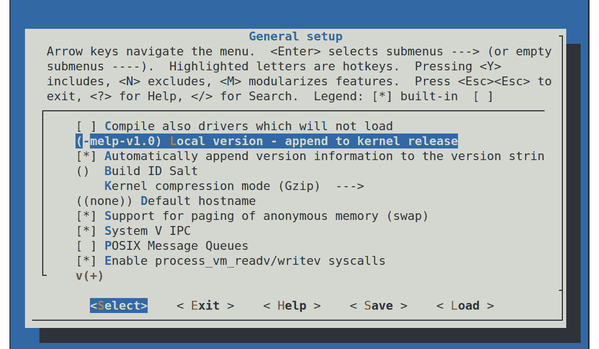
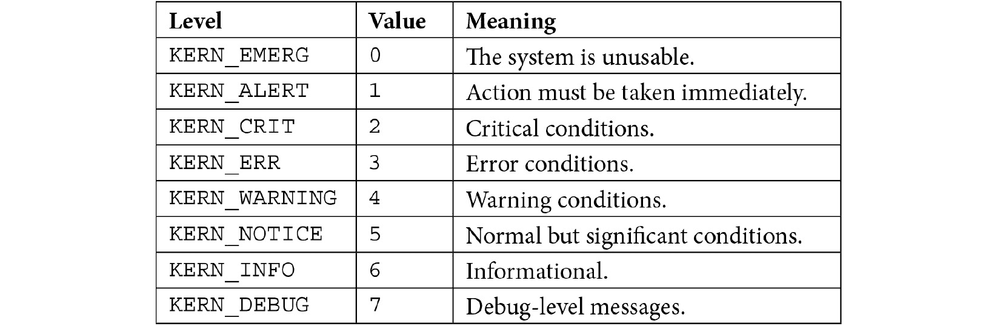

# 四、配置和构建内核

内核是嵌入式 Linux 的第三个元素。 它是负责管理资源和与硬件交互的组件，因此几乎影响最终软件构建的方方面面。 尽管如我们在[*第 3 章*](03.html#_idTextAnchor061)，*All About Bootloaders*中看到的，设备树通常是根据您的特定硬件配置定制的，但是设备树允许您通过设备树的内容创建为特定硬件量身定做的通用内核。

在本章中，我们将了解如何获取电路板的内核，以及如何配置和编译它。 我们将再次查看 Bootstrap，这一次重点关注内核所扮演的角色。 我们还将查看设备驱动程序以及它们如何从设备树中提取信息。

我们将涵盖以下主要主题：

*   内核是做什么的？
*   选择内核
*   构建内核
*   引导内核
*   将 Linux 移植到新的主板

# 技术要求

要按照示例操作，请确保您具备以下条件：

*   一种基于 Linux 的主机系统
*   [*第 2 章*](02.html#_idTextAnchor029)，*中的 Crossstool-NG 工具链了解工具链*
*   一种 microSD 卡读卡器和卡
*   安装了 U-Boot 的 microSD 卡从[*第 3 章*](03.html#_idTextAnchor061)，*All About BootLoader*安装
*   USB 转 TTL 3.3V 串行电缆
*   覆盆子派 4
*   一种 5V 3A USB-C 电源
*   比格尔博恩黑
*   5V 1A 直流电源

本章的所有代码都可以在本书的 GitHub 存储库的`Chapter04`文件夹中找到：[https://github.com/PacktPublishing/Mastering-Embedded-Linux-Programming-Third-Edition](https://github.com/PacktPublishing/Mastering-Embedded-Linux-Programming-Third-Edition)。

# 内核做什么？

Linux 始于 1991 年，当时 Linus Torvalds 开始为基于 Intel386 和 486 的个人计算机编写操作系统。 他的灵感来自 4 年前安德鲁·S·塔南鲍姆(Andrew S.Tanenbaum)编写的 Minix 操作系统。 Linux 与 Minix 在很多方面都不同；主要区别在于它是一个 32 位虚拟内存内核，代码是开源的，后来在 GPLv2 许可下发布。 1991 年 8 月 25 日，他在`comp.os.minix`新闻组的一个著名帖子中宣布了这一消息，帖子开头是这样的：

大家好，在那里使用 Minix 的人-我正在为 386(486)个 AT 克隆做一个(免费的)操作系统(只是一个爱好，不会像 GNU 那样大和专业)。 这从 4 月份就开始酝酿了，并开始做好准备。 我想要任何关于 Minix 中人们喜欢/不喜欢的东西的反馈，因为我的操作系统有点像它(文件系统的物理布局相同(由于实际原因))。

严格地说，莱纳斯并没有写操作系统，而是写了一个内核，而内核只是操作系统的一个组成部分。 为了创建一个包含用户空间命令和 shell 命令解释器的完整操作系统，他使用了 GNU 项目中的组件，特别是工具链、C 库和基本命令行工具。 这一区别至今仍然存在，并使 Linux 在使用方式上具有很大的灵活性。

Linux 内核可以与 GNU 用户空间相结合，以创建在桌面和服务器上运行的完整 Linux 发行版(有时称为 GNU/Linux)；它可以与 Android 用户空间相结合，以创建众所周知的移动操作系统，也可以与基于 BusyBox 的小用户空间相结合，以创建紧凑的嵌入式系统。

这与 BSD 操作系统(FreeBSD、OpenBSD 和 NetBSD)形成对比，在这些操作系统中，内核、工具链和用户空间被组合到单个代码库中。 通过移除工具链，您可以在不需要编译器或头文件的情况下部署更瘦的运行时映像。 通过将用户空间与内核分离，您可以在 init 系统(`runit`与`systemd`)、C 库(`musl`与`glibc`)和包格式(`.apk`与`.deb`)方面获得选项。

内核有三项主要工作：管理资源、与硬件交互以及提供 API(为用户空间程序提供有用的抽象级别)，如下图所示：


图 4.1.−用户空间、内核空间和硬件

在**用户空间**中运行的应用以较低的 CPU 特权级别运行。 除了调用图书馆，他们几乎无能为力。 **用户空间**和**内核空间**之间的主要接口是**C 库**，它将用户级函数(如 POSIX 定义的函数)转换为内核系统调用。 系统调用接口使用特定于体系结构的方法(如陷阱或软件中断)将 CPU 从低特权用户模式切换到高特权内核模式，从而允许访问所有内存地址和 CPU 寄存器。

**系统调用处理程序**将调用分派给适当的内核子系统：内存分配调用转到内存管理器，文件系统调用转到文件系统代码，依此类推。 其中一些调用需要来自底层硬件的输入，并将向下传递到设备驱动程序。 在某些情况下，硬件本身通过引发中断来调用内核函数。

重要音符

上图显示内核代码还有第二个入口点：硬件中断。 中断只能在设备驱动程序中处理，而不能由用户空间应用处理。

换句话说，您的应用所做的所有有用的事情都是通过内核完成的。 因此，内核是系统中最重要的元素之一。 因此，了解如何选择一个很重要-让我们下一步来做这件事。

# 选择内核

下一步是为您的项目选择内核，平衡始终使用最新版本软件的愿望与特定于供应商的添加需求以及对代码库的长期支持的兴趣。

## 内核开发周期

Linux 的开发速度很快，每隔 8 到 12 周就会发布一个新版本。 近年来，版本号的构建方式发生了一些变化。 在 2011 年 7 月之前，有一个版本号看起来像 2.6.39 的三位数版本方案。 中间的数字表示它是开发者还是稳定版本；奇数(2.1.x，2.3.x，2.5.x)是给开发者的，偶数是给终端用户的。

从 2.6 版开始，长期开发分支(奇数)的想法被放弃了，因为它降低了向用户提供新功能的速度。 2011 年 7 月，Linux 的编号从 2.6.39 更改为 3.0，纯粹是因为 Linus 觉得编号变得太大了；在这两个版本之间，Linux 的功能或体系结构并没有太大的飞跃。 他还利用这个机会去掉了中间的数字。 从那时起，在 2015 年 4 月和 2019 年 3 月，他分别将专业从 3 个调整为 4 个，将专业从 4 个调整为 5 个，同样纯粹是为了整洁，而不是因为任何重大的建筑变化。

Linus 管理开发内核树。 您可以通过如下方式克隆 Git 树来跟随他：

```sh
$ git clone git://git.kernel.org/pub/scm/linux/kernel/git/torvalds/linux.git
```

这将签出到子目录`linux`。 您可以通过不时在该目录中运行`git pull`命令来保持最新状态。

目前，一个完整的内核开发周期从两周的合并窗口开始，在此期间，Linus 接受新功能的补丁。 在合并窗口结束时，稳定阶段开始，在此期间，Linus 每周发布候选版本，版本号以`-rc1`、`-rc2`等结尾，通常一直到`-rc7`或`-rc8`。 在此期间，人们测试候选人并提交错误报告和修复。 当所有重要的错误都被修复后，内核就被释放了。

在合并窗口期间合并的代码必须已经相当成熟。 通常，它是从内核的许多子系统和体系结构维护者的存储库中提取的。 通过保持较短的开发周期，功能可以在准备好时进行合并。 如果内核维护者认为某个特性不够稳定或开发得不够好，那么它可以简单地推迟到下一个版本。

跟踪各个版本的变化并非易事。 您可以在 Linus 的 Git 存储库中读取
提交日志，但是，由于大约有 10,000 个或更多条目，
很难获得概述。 值得庆幸的是，有Linux**KernelNewbies**网站[https://kernelnewbies.org](https://kernelnewbies.org)，在那里您可以在[https://kernelnewbies.org/LinuxVersions](https://kernelnewbies.org/LinuxVersions)找到每个版本的简明概述。

## 稳定、长期的支持版本

Linux的快速变化速度是中的一件好事，因为它为主线代码库带来了新特性，但它不太适合嵌入式项目较长的生命周期。 内核开发人员通过两种方式解决这个问题：**稳定的**版本和**长期的**版本。 在发布主线内核(由 Linus Torvalds 维护)之后，它被移到**稳定**树(由 Greg Kroah-Hartman 维护)。 错误修复应用于稳定的内核，而主线内核则开始下一个开发周期。 稳定内核的点发布用第三个数字来标记，即 3.18.1、3.18.2，依此类推。 在版本 3 之前，有四个版本号：2.6.29.1、2.6.39.2 等。

您可以使用以下命令获取稳定树：

```sh
$ git clone git://git.kernel.org/pub/scm/linux/kernel/git/stable/linux-stable.git
```

您可以使用`git checkout`获取特定版本，例如，版本 5.4.50：

```sh
$ cd linux-stable
$ git checkout v5.4.50
```

通常，只有稳定内核才会更新，直到下一个主线版本(8 到 12
周后)，所以您会看到在[https://www.kernel.org/](https://www.kernel.org/)上只有一个或有时是两个稳定内核。 为了迎合那些想要更长时间(T4)更新的用户，并确信会发现并修复任何错误，一些内核被标记为**长期**，并维护 2 年或更长时间。 每年至少有一个长期内核版本。

在撰写本文时查看[https://www.kernel.org/](https://www.kernel.org/)，总共有 5 个长期内核：5.4、4.19、4.14、4.9 和 4.4。 最早的版本已经维护了近 5 年，版本是 4.4.256。 如果您正在构建一个需要维护这么长时间的产品，那么最新的长期内核(在本例中为 5.4)可能是个不错的选择。

### 供应商支持

在理想情况下，您可以从[Linux](https://www.kernel.org/)下载内核，并为任何声称支持 https://www.kernel.org/的设备配置它。 然而，这并不总是可能的；事实上，主流 Linux 只对可以运行 Linux 的众多设备中的一小部分提供了可靠的支持。 您可能会从独立的开源项目(如 Linaro 或 Yocto Project)或为嵌入式 Linux 提供第三方支持的公司获得对您的主板或**片上系统**(**SoC**)的支持，但在许多情况下，您必须向 SoC 或主板的供应商寻求工作内核。

正如我们所知，一些供应商在支持 Linux 方面比其他供应商做得更好。 在这一点上，我的建议是选择那些提供良好支持的供应商，或者更好的供应商，他们不厌其烦地将其内核更改放在主线上。 搜索 Linux 内核邮件列表或提交历史记录，了解候选 SoC 或主板最近的活动。 当主线内核没有上游更改时，对供应商是否提供良好支持的判断在很大程度上是基于口碑。 一些供应商臭名昭著，因为他们只发布了一个内核代码包，然后将所有精力重新定向到较新的 SoC 上。

### 发牌

Linux 源代码是根据 GPLv2 授权的，这意味着您必须通过许可证中指定的一种方式使内核的源代码可用。

内核许可证的实际文本在`COPYING`文件中。 它从 Linus 编写的附录开始，声明通过
系统调用接口从用户空间调用内核的代码不被视为内核的衍生产品，因此不在许可证范围内。 因此，在 Linux 上运行专有应用是没有问题的。

然而，Linux 许可中有一个领域引起了无休止的困惑和争论：内核模块。 **内核模块**仅仅是一段在运行时与内核动态链接的代码，从而扩展了内核的功能。 GPL 没有区分静态链接和动态链接，因此内核模块的源代码似乎包含在 GPL 中。 但是，在 Linux 的早期，对于这一规则的例外情况存在争议，例如，与 Andrew 文件系统相关的例外情况。 这段代码早于 Linux，因此(有人争辩)它不是派生作品，因此许可证不适用。

多年来，对于其他代码段也进行了类似的讨论，结果是现在公认的做法是，GPL 不一定适用于内核模块。 这是由内核`MODULE_LICENSE`宏编码的，它可能采用`Proprietary`值来指示它不是在 GPL 下发布的。 如果您计划自己使用相同的参数，您可能希望通读一个经常被引用的电子邮件线程，标题为*Linux GPL and Binary Module Exception 子句？*，它存档于[https://yarchive.net/comp/linux/gpl_modules.html](https://yarchive.net/comp/linux/gpl_modules.html)。

GPL 应该被认为是一件好事，因为它保证了当我们处理嵌入式项目时，我们总是可以获得内核的源代码。 如果没有它，嵌入式 Linux 将更难使用，也会更加零散。

# 构建内核

确定构建基于哪个内核之后，下一步是构建它。

## 获取源代码

本书中使用的所有三个目标(Raspberry PI 4、Beaglebone Black 和 ARM 多功能 PB)都得到了主线内核的良好支持。 因此，使用[https://www.kernel.org/](https://www.kernel.org/)提供的最新长期内核是有意义的，在撰写本文时它是 5.4.50。 当您自己来做这件事时，您应该检查是否有更高版本的 5.4 内核，并改用该版本，因为它将修复 5.4.50 发布后发现的错误。

重要音符

如果有较新的长期版本，您可能会考虑使用该版本，但请注意，可能发生了一些更改，这意味着下面的命令序列不能完全按照给定的方式工作。

要获取并解压缩 5.4.50 Linux 内核的发行版 tarball，请使用以下命令：

```sh
$ wget https://cdn.kernel.org/pub/linux/kernel/v5.x/linux-5.4.50.tar.xz
$ tar xf linux-5.4.50.tar.xz
$ mv linux-5.4.50 linux-stable
```

要获取更高版本，请将`linux-`后的`5.4.50`替换为所需的长期版本。

这里有很多代码。 5.4 内核中有超过 57,000 个文件，其中包含 C 源代码、头文件和汇编代码，根据 SLOCCount 实用程序的测量，总计超过 1400 万行代码。 不过，有必要了解代码的基本布局，并大致知道在哪里查找特定组件。 感兴趣的主要目录如下：

*   `arch`：包含特定于体系结构的文件。 每个体系结构都有一个子目录。
*   `Documentation`：包含内核文档。 如果您想找到有关 Linux 某个方面的更多信息，请始终先查看此处。
*   `drivers`：包含设备驱动程序-数以千计。 每种类型的驱动程序都有一个子目录。
*   `fs`：包含文件系统代码。
*   `include`：包含内核头文件，包括构建
    工具链时所需的文件。
*   `init`：包含内核启动代码。
*   `kernel`：包含核心功能，包括调度、锁定、计时器、电源管理和调试/跟踪代码。
*   `mm`：包含内存管理。
*   `net`：包含网络协议。
*   `scripts`：包含许多有用的脚本，包括我在[*第 3 章*](03.html#_idTextAnchor061)，*All About Bootloaders*中描述的**设备树编译器**(**DTC**)。
*   `tools`：包含许多有用的工具，包括 Linux 性能计数器工具`perf`，我将在[*第 20 章*](20.html#_idTextAnchor561)，*分析和跟踪*中介绍该工具。

随着时间的推移，您会逐渐熟悉这种结构，并意识到如果您正在寻找特定 SoC 的串行端口代码，您会在`drivers/tty/serial`而不是`arch/$ARCH/mach-foo`中找到它，因为它是一个设备驱动程序，而不是特定于 CPU 体系结构的东西。

## 了解内核配置-Kconfig

Linux 的优势之一是您可以配置内核以适应不同的任务，从小型专用设备(如智能温控器)到复杂的移动手机。 在当前版本中，有数千个配置选项。 正确配置本身就是一项任务，但在我们进入之前，我想向您展示它是如何工作的，这样您就可以更好地了解正在发生的事情。

配置机制称为`Kconfig`，与其集成的构建系统称为`Kbuild`。 这两种方法都在`Documentation/kbuild`中进行了说明。 `Kconfig/Kbuild`用于许多其他项目和内核，包括 Crossstool-NG、U-Boot、Barebox 和 BusyBox。

配置选项是使用`Documentation/kbuild/kconfig-language.rst`中描述的语法在名为`Kconfig`的文件层次结构中声明的。

在 Linux 中，顶层`Kconfig`如下所示：

```sh
mainmenu "Linux/$(ARCH) $(KERNELVERSION) Kernel Configuration"
comment "Compiler: $(CC_VERSION_TEXT)"
source "scripts/Kconfig.include"
[…]
```

`arch/Kconfig`的第一行是这样的：

```sh
source "arch/$(SRCARCH)/Kconfig"
```

该行包含依赖于体系结构的配置文件，根据启用的选项，该文件可作为其他`Kconfig`文件的来源。

让架构扮演如此重要的角色有三个含义：

*   首先，在配置 Linux 时必须通过设置`ARCH=[architecture]`来指定架构，否则默认为本地机器架构。
*   其次，您为`ARCH`设置的值通常决定`SRCARCH`的值，因此您很少需要显式设置`SRCARCH`。
*   第三，顶层菜单的布局对于每个体系结构都是不同的。

您输入到`ARCH`中的值是您在`arch`目录中找到的子目录之一，奇怪的是`ARCH=i386`和`ARCH=x86_64`都来自`arch/x86/Kconfig`。

`Kconfig`文件主要由菜单组成，由`menu`和`endmenu`关键字描述。 菜单项由关键字`config`标记。

以下是摘自`drivers/char/Kconfig`的示例：

```sh
menu "Character devices"
[…]
config DEVMEM
    bool "/dev/mem virtual device support"
    default y
    help
      Say Y here if you want to support the /dev/mem device.
      The /dev/mem device is used to access areas of physical
      memory.
      When in doubt, say "Y".
[…]
endmenu
```

`config`后面的参数命名一个变量，在本例中，该变量为`DEVMEM`。 由于此选项是`bool`(布尔值)，因此它只能有两个值：如果启用，则将其赋给`y`；如果未启用，则根本不定义变量。 屏幕上显示的菜单项的名称是`bool`关键字后面的字符串。

此配置项与所有其他配置项一起存储在名为`.config`的文件中。

给小费 / 翻倒 / 倾覆

`.config`中的前导圆点(`.`)表示它是一个隐藏文件，除非您键入`ls -a`以显示所有文件，否则`ls`命令不会显示该文件。

该配置项对应的行如下：

```sh
CONFIG_DEVMEM=y
```

除了`bool`之外，还有其他几种数据类型。 以下是完整列表：

*   `bool`：`y`或未定义。
*   `tristate`：在功能可以构建为内核模块或构建到主内核映像中的情况下使用。 对于模块，这些值是`m`，要内置的值是`y`，如果未启用该功能，则不定义该值。
*   `int`：使用十进制记数法的整数值。
*   `hex`：使用十六进制记数法的无符号整数值。
*   `string`：字符串值。

项目之间可能存在依赖关系，由`depends on`结构表示，如下所示：

```sh
config MTD_CMDLINE_PARTS
    tristate "Command line partition table parsing"
    depends on MTD
```

如果没有在其他地方启用`CONFIG_MTD`，则不会显示此菜单选项，因此无法选择。

还存在反向依赖关系；如果启用了此选项，则`select`关键字将启用其他选项。 `arch/$ARCH`中的`Kconfig`文件有大量的`select`语句，这些语句启用特定于体系结构的功能，如下面的`ARM`所示：

```sh
config ARM
    bool
    default y
    select ARCH_CLOCKSOURCE_DATA
    select ARCH_HAS_DEVMEM_IS_ALLOWED
[…]
```

通过选择`ARCH_CLOCKSOURCE_DATA`和`ARCH_HAS_DEVMEM_IS_ALLOWED`，我们为这些变量赋值`y`，以便将这些特性静态地构建到内核中。

有几个配置实用程序可以读取`Kconfig`文件并生成`.config`文件。 它们中的一些会在屏幕上显示菜单，并允许您以交互方式进行选择。 `menuconfig`可能是大多数人熟悉的，但也有`xconfig`和`gconfig`。

要使用`menuconfig`，首先需要安装`ncurses`、`flex`和`bison`。 以下命令在 Ubuntu 上安装所有这些必备组件：

```sh
$ sudo apt install libncurses5-dev flex bison
```

您可以通过`make`命令启动`menuconfig`，记住，对于内核，您必须提供一个体系结构，如下所示：

```sh
$ make ARCH=arm menuconfig
```

在这里，您可以看到前面突出显示了`DEVMEM`配置选项的`menuconfig`：


图 4.2DEVMEM 选择−

项目左侧的星号(`*`)表示已选择将驱动程序静态构建到内核中，或者，如果是`M`，则表示已选择将其构建为内核模块，以便在运行时插入到内核中。

给小费 / 翻倒 / 倾覆

您经常会看到`enable CONFIG_BLK_DEV_INITRD`之类的说明，但由于要浏览的菜单太多，可能需要一段时间才能找到设置该配置的位置。 所有配置编辑器都有搜索功能。 您可以通过按正斜杠*/*在`menuconfig`中访问它。 在`xconfig`中，它在**编辑**菜单中，但请确保省略了正在搜索的配置项目的`CONFIG_`部分。

由于要配置的东西太多，每次想要构建内核时都从零开始是不合理的，因此在`arch/$ARCH/configs`中有一组已知的工作配置文件，每个文件都包含单个 SoC 或一组 SoC 的合适配置值。

您可以使用`make [configuration file name]`命令选择一个。 例如，要使用`ARMv7-A`体系结构将 Linux 配置为在广泛的 SoC 上运行，您需要键入以下内容：

```sh
$ make ARCH=arm multi_v7_defconfig
```

这是一个在各种不同主板上运行的通用内核。 对于更专业的应用，例如，当使用供应商提供的内核时，默认配置文件是主板支持包的一部分；在构建内核之前，您需要找出要使用哪个配置文件。

还有另一个名为`oldconfig`的有用配置目标。 您可以在将配置移动到更新的内核版本时使用它。 此目标获取现有的`.config`文件，并提示您有关新配置选项的问题。 将`.config`从旧内核复制到新的源目录，然后运行`make ARCH=arm oldconfig`命令将其更新。

`oldconfig`目标还可用于验证您手动编辑的`.config`文件(忽略文本**自动生成的文件；不要编辑出现在顶部的**；有时忽略警告是可以的)。

如果您确实对配置进行了更改，修改后的`.config`文件将成为您的主板支持包的一部分，并且需要置于源代码控制之下。

当您启动内核构建时，会生成一个头文件`include/generated/autoconf.h`，它包含每个配置值的`#define`，以便可以将其包含在内核源代码中。

既然我们已经确定了一个内核并了解了如何配置它，我们现在将着手识别我们的内核。

## 使用 LOCALVERSION 识别您的内核

您可以发现您使用`make kernelversion`和`make``kernelrelease`目标构建的内核版本和发行版：

```sh
$ make ARCH=arm kernelversion
5.4.50
$ make ARCH=arm kernelrelease
5.4.50
```

这在运行时通过`uname`命令报告，也用于命名存储内核模块的目录。

如果您更改了默认配置，建议附加您自己的版本信息，您可以通过设置`CONFIG_LOCALVERSION`进行配置。 例如，如果我想用`melp`标识符和版本`1.0`标记我正在构建的内核，我将在`menuconfig`中定义本地版本，如下所示：



图 4.3-附加到内核发布版本

运行`make kernelversion`会产生与以前相同的输出，但现在如果我运行`make kernelrelease`，我会看到以下内容：

```sh
$ make ARCH=arm kernelrelease
5.4.50-melp-v1.0
```

这是对内核版本控制的一次愉快的迂回，但现在让我们回到配置内核以进行编译的业务。

## 何时使用内核模块

我已经多次提到内核模块。 桌面 Linux 发行版广泛使用它们，因此可以根据检测到的硬件和所需的功能在运行时加载正确的设备和内核函数。 如果没有它们，每个单独的驱动程序和功能都必须静态链接到内核中，这使得内核变得太大了。

另一方面，对于嵌入式设备，硬件和内核配置通常在构建内核时就已知，因此模块不是很有用。 事实上，它们会造成问题，因为它们在内核和根文件系统之间创建了版本依赖关系，如果其中一个更新了，而另一个没有更新，则可能导致引导失败。 因此，在没有任何模块的情况下构建嵌入式内核是很常见的。

以下是在嵌入式系统中内核模块是一个好主意的几种情况：

*   当您拥有专有模块时，出于上一节中给出的许可原因。
*   通过推迟加载不必要的驱动程序来缩短引导时间。
*   当有几个驱动程序可以加载时，静态编译它们会占用太多内存。 例如，您有一个支持多种设备的 USB 接口。 这基本上与桌面发行版中使用的论点相同。

接下来，让我们学习如何使用`Kbuild`编译带有或不带有内核模块
的内核映像。

# 编译-Kbuild

内核构建系统`Kbuild`是一组脚本，它们从`.config`文件获取配置信息，计算依赖项，并编译生成内核映像所需的所有内容。 该内核映像包含所有静态链接的组件，可能是设备树二进制文件，也可能是一个或多个内核模块。 依赖关系以 Make 文件的形式表示，这些文件位于每个目录中，其中包含可构建的组件。 例如，以下两行取自`drivers/char/Makefile`：

```sh
obj-y += mem.o random.o
obj-$(CONFIG_TTY_PRINTK) += ttyprintk.o
```

`obj-y`规则无条件地编译文件以生成目标，因此`mem.c`和`random.c`始终是内核的部分。 在第二行中，`ttyprintk.c`依赖于配置参数。 如果`CONFIG_TTY_PRINTK`为`y`，则编译为内置；如果为`m`，则构建为模块；如果参数未定义，则根本不编译。

对于大多数目标，只需键入`make`(使用适当的`ARCH`和`CROSS_COMPILE`)就可以完成工作，但一次执行一步是有指导意义的。 有关`CROSS_COMPILE``make`变量的含义，请参阅[*第 2 章*](02.html#_idTextAnchor029)，*了解工具链*的最后一节。

## 找出要构建的内核目标

要构建内核映像，您需要知道引导加载程序需要什么。 这是一份
粗略指南：

*   **U-Boot**：传统上，U-Boot 需要`uImage`，但较新的版本可以使用`bootz`命令加载
    `zImage`文件。
*   **x86 目标**：需要`bzImage`文件。
*   **大多数其他引导加载程序**：需要`zImage`文件。

以下是构建`zImage`文件的示例：

```sh
$ make -j 4 ARCH=arm CROSS_COMPILE=arm-cortex_a8-linux-gnueabihf- zImage
```

给小费 / 翻倒 / 倾覆

`-j 4`选项告诉`make`要并行运行的作业数量，这减少了构建所需的时间。 粗略的指导是运行与
个 CPU 核心一样多的作业。

为具有多平台支持的 ARM 构建`uImage`文件有一个小问题，这是当前一代 ARM SoC 内核的标准。 Linux 3.7 中引入了对 ARM 的多平台支持。 它允许一个内核二进制文件在多个平台上运行，这是在为所有 ARM 设备提供少量内核的道路上迈出的一步。 内核通过读取引导加载程序传递给它的机器编号或设备树来选择正确的平台。 出现该问题的原因是，每个平台的物理内存位置可能不同，因此内核的重新定位地址(通常是从物理 RAM 开始的`0x8000`字节)也可能不同。

内核构建时，重定位地址由`mkimage`命令编码到`uImage`头中，但如果有多个重定位地址可供选择，则它将失败。 换句话说，`uImage`格式与多平台镜像不兼容。 您仍然可以从多平台版本创建`uImage`二进制文件，只要给出您希望在其上引导该内核的特定 SoC 的`LOADADDR`即可。 您可以通过查看`arch/$ARCH/mach-[your SoC]/Makefile.boot`并注意`zreladdr-y`的值来找到加载地址：

```sh
$ make -j 4 ARCH=arm CROSS_COMPILE=arm-cortex_a8-linux-gnueabihf- LOADADDR=0x80008000 uImage
```

无论我们以哪种内核映像格式为目标，在生成可引导映像之前，都会首先创建相同的两个构建构件。

## 构建工件

内核构建在顶级目录中生成两个文件：`vmlinux`和`System.map`。
第一个参数`vmlinux`是作为 ELF 二进制文件的内核。 如果您编译内核时启用了`debug`(`CONFIG_DEBUG_INFO=y`)，则它将包含可与调试器(如`kgdb`)一起使用的调试符号。 您还可以使用其他 ELF 二进制工具，如`size`来测量组成`vmlinux`可执行文件的每个部分(`text`、`data`和`bss`)的长度：

```sh
$ arm-cortex_a8-linux-gnueabihf-size vmlinux
   text    data      bss      dec      hex      filename
14005643   7154342   403160   21563145  1490709  vmlinux
```

`dec`和`hex`值分别是十进制和十六进制的总文件大小。

`System.map`包含人类可读形式的符号表。

大多数引导加载器不能直接处理 ELF 代码。 还有一个处理阶段需要`vmlinux`和将那些适用于各种引导加载程序的二进制文件放在`arch/$ARCH/boot`中：

*   `Image`：`vmlinux`已转换为原始二进制格式。
*   `zImage`：对于 PowerPC 体系结构，这只是`Image`的压缩版本，这意味着引导加载程序必须进行解压缩。 对于所有其他架构，压缩的`Image`被搭载到一个代码存根上，该代码存根对其进行解压缩和重新定位。
*   `uImage`：`zImage`加上一个 64 字节的 U-Boot 标头。

当构建正在运行时，您将看到正在执行的命令的摘要：

```sh
$ make -j 4 ARCH=arm CROSS_COMPILE=arm-cortex_a8-linux-gnueabihf- \
zImage
  CC      scripts/mod/empty.o
  CC      scripts/mod/devicetable-offsets.s
  MKELF   scripts/mod/elfconfig.h
  HOSTCC  scripts/mod/modpost.o
  HOSTCC  scripts/mod/sumversion.o
[…]
```

有时，当内核构建失败时，查看正在执行的实际命令很有用。 为此，请将`V=1`添加到命令行：

```sh
$ make -j 4 ARCH=arm CROSS_COMPILE=arm-cortex_a8-linux-gnueabihf- \
V=1 zImage
[…]
arm-cortex_a8-linux-gnueabihf-gcc -Wp,-MD,drivers/tty/.tty_baudrate.o.d  -nostdinc -isystem /home/frank/x-tools/arm-cortex_a8-linux-gnueabihf/lib/gcc/arm-cortex_a8-linux-gnueabihf/8.3.0/include -I./arch/arm/include -I./arch/arm/include/generated  -I./include -I./arch/arm/include/uapi -I./arch/arm/include/generated/uapi -I./include/uapi -I./include/generated/uapi -include ./include/linux/kconfig.h -include ./include/linux/compiler_types.h -D__KERNEL__ -mlittle-endian -Wall -Wundef -Werror=strict-prototypes -Wno-trigraphs -fno-strict-aliasing -fno-common -fshort-wchar -fno-PIE -Werror=implicit-function-declaration -Werror=implicit-int -Wno-format-security -std=gnu89 -fno-dwarf2-cfi-asm -fno-ipa-sra -mabi=aapcs-linux -mfpu=vfp -funwind-tables -marm -Wa,-mno-warn-deprecated -D__LINUX_ARM_ARCH__=7 -march=armv7-a -msoft-float -Uarm -fno-delete-null-pointer-checks -Wno-frame-address -Wno-format-truncation -Wno-format-overflow -O2 --param=allow-store-data-races=0 -Wframe-larger-than=1024 -fstack-protector-strong -Wno-unused-but-set-variable -Wimplicit-fallthrough -Wno-unused-const-variable -fomit-frame-pointer -fno-var-tracking-assignments -Wdeclaration-after-statement -Wvla -Wno-pointer-sign -Wno-stringop-truncation -Wno-array-bounds -Wno-stringop-overflow -Wno-restrict -Wno-maybe-uninitialized -fno-strict-overflow -fno-merge-all-constants -fmerge-constants -fno-stack-check -fconserve-stack -Werror=date-time -Werror=incompatible-pointer-types -Werror=designated-init -fmacro-prefix-map=./= -Wno-packed-not-aligned    -DKBUILD_BASENAME='"tty_baudrate"' -DKBUILD_MODNAME='"tty_baudrate"' -c -o drivers/tty/tty_baudrate.o drivers/tty/tty_baudrate.c
[…]
```

在本节中，我们了解了`Kbuild`如何获取预编译的`vmlinux`ELF 二进制文件
并将其转换为可引导内核映像。 接下来，我们将了解如何编译设备树。

## 编译设备树

下一步是构建设备树，如果是多平台构建，则构建树。 `dtbs`目标使用该目录中的设备树源文件，根据`arch/$ARCH/boot/dts/Makefile`中的规则构建设备树。 以下是为`multi_v7_defconfig`构建`dtbs`目标的代码片段：

```sh
$ make ARCH=arm dtbs
[…]
  DTC     arch/arm/boot/dts/alpine-db.dtb
  DTC     arch/arm/boot/dts/artpec6-devboard.dtb
  DTC     arch/arm/boot/dts/at91-kizbox2.dtb
  DTC     arch/arm/boot/dts/at91-nattis-2-natte-2.dtb
  DTC     arch/arm/boot/dts/at91-sama5d27_som1_ek.dtb
[…]
```

编译后的`.dtb`文件在与源代码相同的目录中生成。

## 编译模块

如果您配置了要构建为模块的某些功能，则可以使用`modules`目标单独构建它们：

```sh
$ make -j 4 ARCH=arm CROSS_COMPILE=arm-cortex_a8-linux-gnueabihf- \
modules
```

编译后的`modules`有一个`.ko`后缀，并且生成在与源代码相同的目录中，这意味着它们分散在内核源代码树的各个部分。 找到它们有点棘手，但您可以使用`modules_install make`目标将它们安装在正确的位置。 在您的开发系统中，默认位置是`/lib/modules`，这几乎肯定不是您想要的。 要将它们安装到根文件系统的临时区域(我们将在下一章讨论根文件系统)，请使用`INSTALL_MOD_PATH`提供路径：

```sh
$ make -j4 ARCH=arm CROSS_COMPILE=arm-cortex_a8-linux-gnueabihf- \
INSTALL_MOD_PATH=$HOME/rootfs modules_install
```

内核模块被放入相对于文件系统根目录的`/lib/modules/[kernel version]`目录中。

## 清除内核源代码

清理内核源代码树有个`make`个目标：

*   `clean`：删除对象文件和大多数中间件。
*   `mrproper`：删除所有中间文件，包括`.config`文件。 使用此目标可以将源树返回到克隆或提取源代码后立即所处的状态。 如果你对这个名字很好奇，“适当先生”是世界上一些地方常见的清洁产品。 `make mrproper`的意思是给内核源代码一个很好的洗刷。
*   `distclean`：这与`mrproper`相同，但也删除了编辑器备份文件、补丁文件和软件开发的其他工件。

我们已经看到了内核编译步骤及其结果输出。 现在，让我们为手头的板卡构建一些内核。

## 为 Raspberry Pi 4 构建 64 位内核

尽管在主线内核中已经有了对 Raspberry PI 4的支持，但我发现 Raspberry Pi Foundation 的 Linux 分支([https://github.com/raspberrypi/linux](https://github.com/raspberrypi/linux))在撰写本文时更加稳定。 分叉`4.19.y`分支也比同一分叉的`rpi-5.4.y`分支维护得更积极。 这种情况在不久的将来可能会改变，但目前，让我们继续使用`4.19.y`分支。

由于 Raspberry PI 4 拥有 64 位四核 ARM Cortex-A72CPU，我们将使用ARM 针对 AArch64GNU/Linux的 GNU 工具链为其交叉编译 64 位内核。 此预构建工具链可从 https://developer.arm.com/tools-and-software/open-source-software/developer-tools/gnu-toolchain/gnu-a/downloads：下载

```sh
$ cd ~
$ wget https://developer.arm.com/-/media/Files/downloads/gnu-a/10.2-2020.11/binrel/gcc-arm-10.2-2020.11-x86_64-aarch64-none-linux-gnu.tar.xz
$ tar xf gcc-arm-10.2-2020.11-x86_64-aarch64-none-linux-gnu.tar.xz
$ mv gcc-arm-10.2-2020.11-x86_64-aarch64-none-linux-gnu \
gcc-arm-aarch64-none-linux-gnu
```

在撰写本文时，`gcc-arm-10.2-2020.11-x86_64-aarch64-none-linux-gnu`是当前`x86_64`Linux 托管的针对 AArch64GNU/Linux 的交叉编译器。 如果下载失败，请将前面命令中的`10.2-2020.11`替换为当前发布版本。

接下来，安装我们需要获取并构建内核的几个包：

```sh
$ sudo apt install subversion libssl-dev
```

现在您已经安装了必要的工具链和软件包，将`4.19.y`内核 repo 克隆到名为`linux`的目录中的一个级别，并将一些预构建的二进制文件导出到`boot`子目录：

```sh
$ git clone --depth=1 -b rpi-4.19.y https://github.com/raspberrypi/linux.git
$ svn export https://github.com/raspberrypi/firmware/trunk/boot
$ rm boot/kernel*
$ rm boot/*.dtb
$ rm boot/overlays/*.dtbo
```

导航到新克隆的`linux`目录并构建内核：

```sh
$ PATH=~/gcc-arm-aarch64-none-linux-gnu/bin/:$PATH
$ cd linux
$ make ARCH=arm64 CROSS_COMPILE=aarch64-none-linux-gnu- \ bcm2711_defconfig
$ make -j4 ARCH=arm64 CROSS_COMPILE=aarch64-none-linux-gnu-
```

构建完成后，将内核映像、设备树Blob 和引导参数复制到`boot`subdi目录：

```sh
$ cp arch/arm64/boot/Image ../boot/kernel8.img
$ cp arch/arm64/boot/dts/overlays/*.dtbo ../boot/overlays/
$ cp arch/arm64/boot/dts/broadcom/*.dtb ../boot/
$ cat << EOF > ../boot/config.txt
enable_uart=1
arm_64bit=1
EOF
$ cat << EOF > ../boot/cmdline.txt
console=serial0,115200 console=tty1 root=/dev/mmcblk0p2 rootwait
EOF
```

上述命令都可以在脚本`MELP/Chapter04/build-linux-rpi4-64.sh`中找到。 请注意，写入`cmdline.txt`的内核命令行必须全部在一行上。 让我们将这些步骤分成几个阶段：

1.  将树莓 Pi 基金会的内核分支的`rpi-4.19.y`分支克隆到`linux`目录中。
2.  将`boot`子目录的内容从 Raspberry Pi Foundation 的`firmware`repo 导出到`boot`目录。
3.  从`boot`目录中删除现有内核映像、设备树 BLOB 和设备树覆盖。
4.  从`linux`目录中，为 Raspberry PI 4 构建 64 位内核、模块和设备树。
5.  将新构建的内核映像、设备树 BLOB 和设备树覆盖从`arch/arm64/boot/`复制到`boot`目录。
6.  将`config.txt`和`cmdline.txt`文件写出到引导目录，以便 Raspberry PI 4 的引导加载程序读取并传递给内核。

让我们看看`config.txt`中的设置。 `enable_uart=1`行在引导期间启用串行控制台，默认情况下该功能处于禁用状态。 `arm_64bit=1`行指示 Raspberry PI 4 的引导加载程序以 64 位模式启动 CPU，并从名为`kernel8.img`的文件(而不是 32 位 ARM 的默认`kernel.img`文件)加载内核映像。

现在，让我们看一下`cmdline.txt`。 内核命令行参数`console=serial0,115200`和`console=tty1`指示内核在内核引导时将日志消息输出到串行控制台。

## 为 Beaglebone Black 构建内核

根据已经给出的信息，下面是使用 Crossstool-NG ARM Cortex A8 交叉编译器为 Beaglebone Black 构建内核、模块和设备树的完整命令序列：

```sh
$ cd linux-stable
$ make ARCH=arm CROSS_COMPILE=arm-cortex_a8-linux-gnueabihf- mrproper
$ make ARCH=arm multi_v7_defconfig
$ make -j4 ARCH=arm CROSS_COMPILE=arm-cortex_a8-linux-gnueabihf- zImage
$ make -j4 ARCH=arm CROSS_COMPILE=arm-cortex_a8-linux-gnueabihf- modules
$ make ARCH=arm CROSS_COMPILE=arm-cortex_a8-linux-gnueabihf- dtbs
```

这些命令位于`MELP/Chapter04/build-linux-bbb.sh`脚本中。

## 为 QEMU 构建内核

下面是使用 Crossstool-NG v5TE 编译器为 QEMU 模拟的 ARM VersatilePB 构建 Linux 的命令序列：

```sh
$ cd linux-stable
$ make ARCH=arm CROSS_COMPILE=arm-unknown-linux-gnueabi- mrproper
$ make -j4 ARCH=arm CROSS_COMPILE=arm-unknown-linux-gnueabi- zImage
$ make -j4 ARCH=arm CROSS_COMPILE=arm-unknown-linux-gnueabi- modules
$ make ARCH=arm CROSS_COMPILE=arm-unknown-linux-gnueabi- dtbs
```

这些命令位于`MELP/Chapter04/build-linux-versatilepb.sh`脚本中。 在本节中，我们了解了如何使用 Kbuild 为我们的目标编译内核。 现在，我们将学习如何引导内核。

# 引导内核

引导 Linux 与高度依赖于设备。 在这一节中，我将向您展示它是如何在 Raspberry Pi 4、Beaglebone Black 和 QEMU 上工作的。 对于其他目标电路板，您必须咨询供应商或社区项目(如果有)的信息。

此时，您应该有了 Raspberry PI 4、Beaglebone Black 和 QEMU 的内核映像文件和设备树 BLOB。

## 启动树莓 PI 4

Raspberry PI 使用 Broadcom 提供的专有引导加载程序，而不是 U-Boot。 与以前的 Raspberry Pi 型号不同，Raspberry Pi 4 的引导加载程序驻留在板载 SPI EEPROM 上，而不是 microSD 卡上。 我们仍然需要将 Raspberry PI 4 的内核映像和设备树 blob 放在 microSD 上，才能引导我们的 64 位内核。

首先，您需要一个具有足够大的 FAT32`boot`分区的 microSD 卡，以容纳必要的内核构建构件。 `boot`分区需要是 microSD 卡上的第一个分区。 1 GB 的分区大小就足够了。 将 microSD 卡插入读卡器，并将`boot`目录的全部内容复制到`boot`分区。 卸下该卡并将其插入 Raspberry PI 4。将 USBtoTTL 串行电缆连接到 40 针 GPIO 接头([https://learn.adafruit.com/adafruits-raspberry-pi-lesson-5-using-a-console-cable/connect-the-lead](https://learn.adafruit.com/adafruits-raspberry-pi-lesson-5-using-a-console-cable/connect-the-lead))上的接地、Txd 和 Rxd 引脚。 接下来，启动终端仿真器，如`gtkterm`。 最后，打开 Raspberry PI 4 的电源，您应该会在串行控制台上看到以下输出：

```sh
[    0.000000] Booting Linux on physical CPU 0x0000000000 [0x410fd083]
[    0.000000] Linux version 4.19.127-v8+ (frank@franktop) (gcc version 10.2.1 20201103 (GNU Toolchain for the A-profile Architecture 10.2-2020.11 (arm-10.16))) #1 SMP PREEMPT Sat Feb 6 16:19:37 PST 2021
[    0.000000] Machine model: Raspberry Pi 4 Model B Rev 1.1
[    0.000000] efi: Getting EFI parameters from FDT:
[    0.000000] efi: UEFI not found.
[    0.000000] cma: Reserved 64 MiB at 0x0000000037400000
[    0.000000] random: get_random_bytes called from start_kernel+0xb0/0x480 with crng_init=0
[    0.000000] percpu: Embedded 24 pages/cpu s58840 r8192 d31272 u98304
[    0.000000] Detected PIPT I-cache on CPU0
[…]
```

该序列将在内核死机中结束，因为内核在 microSD 卡上找不到根文件系统。 内核死机将在本章后面的中解释。

## 启动 Beaglebone Black

首先，您需要安装了 U-Boot 的microSD 卡，如[*第 3 章*](03.html#_idTextAnchor061)，*All About BootLoader*中的
*安装 U-Boot*部分所述。 将 microSD 卡插入读卡器，并从`linux-stable`目录将`arch/arm/boot/zImage`和`arch/arm/boot/dts/am335x-boneblack.dtb`文件复制到`boot`分区。 卸下卡并将其插入 Beaglebone Black。 启动终端仿真器(如`gtkterm`)，并准备好在看到 U-Boot 消息时立即按空格键。 接下来，打开 Beaglebone Black 的电源并按空格键。 您应该会看到 U-Boot 提示。 现在，输入 U-Boot#提示符后显示的以下命令以加载 Linux 和设备树二进制文件：

```sh
U-Boot# fatload mmc 0:1 0x80200000 zImage
reading zImage
7062472 bytes read in 447 ms (15.1 MiB/s)
U-Boot# fatload mmc 0:1 0x80f00000 am335x-boneblack.dtb
reading am335x-boneblack.dtb
34184 bytes read in 10 ms (3.3 MiB/s)
U-Boot# setenv bootargs console=ttyO0
U-Boot# bootz 0x80200000 - 0x80f00000
## Flattened Device Tree blob at 80f00000
Booting using the fdt blob at 0x80f00000
Loading Device Tree to 8fff4000, end 8ffff587 ... OK
Starting kernel ...
[ 0.000000] Booting Linux on physical CPU 0x0
[…]
```

请注意，我们将内核命令行设置为`console=ttyO0`。 这告诉 Linux 使用哪个设备来进行控制台输出，在本例中是板上的第一个 UART，设备`ttyO0`。 如果没有它，我们在`Starting the kernel...`之后就看不到任何消息，因此不知道它是否工作。 序列将在内核恐慌中结束，原因我将在稍后解释。

## 启动 QEMU

假设您的已经安装了`qemu-system-arm`，您可以使用内核和 ARM 通用 PB 的`.dtb`文件启动它，如下所示：

```sh
$ QEMU_AUDIO_DRV=none \
qemu-system-arm -m 256M -nographic -M versatilepb -kernel \ zImage
-append "console=ttyAMA0,115200" -dtb versatile-pb.dtb
```

请注意，将`QEMU_AUDIO_DRV`设置为`none`只是为了抑制来自 QEMU 的关于缺少音频驱动程序配置的错误消息，我们不使用这些配置。 与 Raspberry Pi 4 和 Beaglebone Black 一样，这将以内核恐慌结束，系统将停止。 要退出 QEMU，请按*Ctrl*+*A*，然后按*x*(两次单独的按键)。 现在，让我们讨论一下什么是内核恐慌。

## 内核死机

虽然事情开始得很好，但结局却很糟糕：

```sh
[ 1.886379] Kernel panic - not syncing: VFS: Unable to mount root fs on unknown-block(0,0)
[ 1.895105] ---[ end Kernel panic - not syncing: VFS: Unable to mount root fs on unknown-block(0, 0)
```

这是内核恐慌的一个很好的例子。 当内核遇到不可恢复的错误时，会发生内核死机。 默认情况下，它会将一条消息打印到控制台，然后暂停。 您可以设置`panic`命令行参数，以便在死机后重新启动之前有几秒钟的时间。 在本例中，不可恢复的错误不是根文件系统，这说明如果没有用户空间来控制内核，则内核是无用的。 您可以通过提供根文件系统(作为 ramdisk 或在可挂载的大容量存储设备上)来提供用户空间。 我们将在下一章讨论如何创建根文件系统，但首先我想描述通向`panic`的事件序列。

## 早期用户空间

为了将从内核初始化转换到用户空间，内核必须挂载一个根文件系统并在该根文件系统中执行一个程序。 这可以通过内存磁盘或通过在块设备上挂载真实的文件系统来实现。 所有这些的代码都在`init/main.c`中，从`rest_init()`函数开始，该函数创建第一个 PID 为`1`的线程，并在`kernel_init()`中运行代码。 如果存在 ramdisk，它将尝试执行程序`/init`，该程序将承担设置用户空间的任务。

如果内核无法找到并运行`/init`，它会尝试通过调用`init/do_mounts.c`中的`prepare_namespace()`函数来挂载文件系统。 这需要使用`root=`命令行给出用于挂载的块设备的名称，通常采用以下形式：

```sh
root=/dev/<disk name><partition number>
```

或者，在此表格中，对于 SD 卡和 eMMC：

```sh
root=/dev/<disk name>p<partition number>
```

例如，对于 SD 卡上的第一个分区，它将是`root=/dev/mmcblk0p1`。 如果挂载成功，它将尝试执行`/sbin/init`，然后是
`/etc/init`、`/bin/init`，然后是`/bin/sh`，并在第一个有效的位置停止。 可以在命令行上覆盖该程序。 对于 ramdisk，使用`rdinit=`，对于文件系统，使用`init=`。

## 内核消息

内核开发人员喜欢通过自由使用`printk()`和类似函数打印出有用的信息。 根据重要性对消息进行分类，`0`是最高的：



它们首先被写入缓冲器`__log_buf`，该缓冲器的大小是`CONFIG_LOG_BUF_SHIFT`的幂
的 2。 例如，如果`CONFIG_LOG_BUF_SHIFT`为`16`，则`__log_buf`为 64 KiB。 您可以使用`dmesg`命令转储整个缓冲区。

如果消息级别低于控制台日志级别，则会在控制台上显示该消息，并将其放置在`__log_buf`中。 默认控制台日志级别为`7`，表示显示级别为`6`及更低级别的消息，过滤掉级别为`7`的`KERN_DEBUG`。 您可以通过多种方式更改控制台日志级别，包括使用`loglevel=<level>`内核参数或`dmesg -n <level>`命令。

## 内核命令行

内核命令行是引导加载程序通过`bootargs`变量(在 U-Boot 的情况下)传递给内核的字符串；它也可以在设备树中定义或设置为`CONFIG_CMDLINE`中内核配置的一部分。

我们已经看到了一些内核命令行的示例，但还有更多。 在`Documentation/kernel-parameters.txt`中有一个完整的列表。 以下是一份简短的最有用的列表：

*   `debug`：将控制台日志级别设置为最高级别`8`，以确保您在控制台上看到所有内核消息。
*   `init=`：从挂载的根文件系统运行的`init`程序，缺省为`/sbin/init`。
*   `lpj=`：将`loops_per_jiffy`设置为给定常量。 在这个清单后面的一段中描述了这一点的重要性。
*   `panic=`：内核死机时的行为：如果大于 0，则给出重新启动前的秒数；如果大于 0，则永远等待(这是默认设置)；如果小于 0，则毫无延迟地重新启动。
*   `quiet`：将控制台日志级别设置为静默，禁止除紧急消息以外的所有消息。 由于大多数设备都有串行控制台，因此输出所有这些字符串需要时间。 因此，使用此选项减少消息数量可缩短引导时间。
*   `rdinit=`：要从内存磁盘运行的`init`程序。 默认为`/init`。
*   `ro`：将根设备装载为只读。 对始终为读/写状态的 ramdisk 没有影响。
*   `root=`：要挂载根文件系统的设备。
*   `rootdelay=`：尝试装载根设备之前等待的秒数；默认为零。 如果设备需要时间来探测硬件，则非常有用，但也请参阅`rootwait`。
*   `rootfstype=`：根设备的文件系统类型。 在许多情况下，它是在挂载过程中自动检测到的，但对于`jffs2`文件系统是必需的。
*   `rootwait`：无限期等待检测到根设备。 对于 MMC 设备通常是必需的。
*   `rw`：将根设备挂载为读写(默认)。

在减少内核引导时间时，经常会提到`lpj`参数。 在初始化期间，内核循环大约 250 毫秒以校准延迟循环。 该值存储在`loops_per_jiffy`变量中，并按如下方式报告：

```sh
Calibrating delay loop... 996.14 BogoMIPS (lpj=4980736)
```

如果内核始终在同一硬件上运行，则它将始终计算相同的值。 通过在命令行中添加`lpj=4980736`，可以将引导时间缩短 250 毫秒。

在下一节中，我们将学习如何将 Linux 移植到基于 Beaglebone Black 的新主板上，Beaglebone Black 是我们假设的 Nova 主板。

# 将 Linux 移植到新板

将 Linux 移植到新板可能容易，也可能困难，这取决于您的主板与现有开发板的相似程度。 在[*第 3 章*](03.html#_idTextAnchor061)，*All About BootLoader*中，我们
将 U-Boot 移植到一个名为 Nova 的新板上，该板基于 Beaglebone Black。 只需对内核代码进行很少的更改，因此非常简单。 如果您要移植到全新的创新型硬件，您将会有更多的事情要做。 我们将在[*第 12 章*](12.html#_idTextAnchor356)，*《利用分支板制作原型》*中更深入地研究
有关附加硬件外围设备的主题。

`arch/$ARCH`中特定于体系结构的代码的组织方式因系统而异。 X86 架构非常干净，因为大多数硬件细节都是在运行时检测到的。 PowerPC 架构将 SoC 和特定于主板的文件放入子目录平台中。 另一方面，ARM 架构相当混乱，部分原因是许多基于 ARM 的 SoC 之间存在很大的可变性。 与平台相关的代码放在名为`mach-*`的目录中，大约每个 SoC 一个。 还有其他名为`plat-*`的目录，其中包含多个 SoC 版本通用的代码。 对于 Beaglebone Black，相关目录为`arch/arm/mach-omap2`。 但不要被名字所愚弄；它包含对 OMAP2、3 和 4 芯片以及 Beaglebone 使用的 AM33xx 系列芯片的支持。

在接下来的几节中，我将解释如何为新主板创建设备树，以及如何将其键入 Linux 的初始化代码中。

## 新设备树

要做的第一件事是为主板创建设备树，并对其进行修改以描述 Nova 主板的附加或更改的硬件。 在这个简单的例子中，我们只需将`am335x-boneblack.dts`复制到`nova.dts`，并将模型名称更改为`Nova`，如下所示：

```sh
/dts-v1/;
#include "am33xx.dtsi"
#include "am335x-bone-common.dtsi"
#include "am335x-boneblack-common.dtsi"
/ {
        model = "Nova";
        compatible = "ti,am335x-bone-black", "ti,am335x-bone", "ti,am33xx";
};
[…]
```

我们可以显式构建 Nova 设备树二进制文件，如下所示：

```sh
$ make ARCH=arm nova.dtb
```

如果我们希望每当选择 AM33xx 目标时由`make ARCH=arm dtbs`编译 Nova 的设备树，我们可以在`arch/arm/boot/dts/Makefile`中添加依赖项，如下所示：

```sh
[…]
dtb-$(CONFIG_SOC_AM33XX) += 
    nova.dtb 
[…]
```

我们可以通过启动 Beaglebone Black 来查看使用 Nova 设备树的效果，按照与*启动 Beaglebone Black*部分相同的步骤，使用与前面相同的`zImage`文件，但加载`nova.dtb`而不是`am335x-boneblack.dtb`。 以下突出显示的输出是打印机器型号的点：

```sh
Starting kernel ...
[ 0.000000] Booting Linux on physical CPU 0x0
[ 0.000000] Linux version 5.4.50-melp-v1.0-dirty (frank@franktop) (gcc version 8.3.0 (crosstool-NG crosstool-ng-1.24.0) ) #2 SMP Sat Feb 6 17:19:36 PST 2021
[ 0.000000] CPU: ARMv7 Processor [413fc082] revision 2 (ARMv7), cr=10c5387d
[ 0.000000] CPU: PIPT / VIPT nonaliasing data cache, VIPT aliasing instruction cache
[ 0.000000] OF: fdt:Machine model: Nova
[…]
```

现在我们已经有了专门用于 Nova 主板的设备树，我们可以对其进行修改，以描述 Nova 和 Beaglebone Black 之间的硬件差异。 内核配置也很可能发生更改，在这种情况下，您将基于`arch/arm/configs/multi_v7_defconfig`的副本创建自定义配置文件。

## 设置线路板的 Compatible 属性

创建新的设备树意味着我们可以描述 Nova 板上的硬件，选择设备驱动程序并设置匹配的属性。 但是假设 Nova 董事会需要不同于 Beaglebone Black 的早期初始化代码，我们如何才能将其连接起来呢？

电路板设置由根节点中的`compatible`属性控制。 这是我们目前对 Nova 董事会的看法：

```sh
/ {
    model = "Nova";
    compatible = "ti,am335x-bone-black", "ti,am335x-bone", "ti,am33xx";
};
```

当内核解析该节点时，它将为 Compatible 属性的每个值搜索匹配的计算机，从左侧开始，直到找到第一个匹配项。 每台机器都定义在由`DT_MACHINE_START`和`MACHINE_END`宏分隔开的结构中。 在`arch/arm/mach-omap2/board-generic.c`中，我们发现
如下：

```sh
#ifdef CONFIG_SOC_AM33XX
static const char *const am33xx_boards_compat[] __initconst = {
    "ti,am33xx",
    NULL,
};
 DT_MACHINE_START(AM33XX_DT, "Generic AM33XX (Flattened Device Tree)")
    .reserve = omap_reserve,
    .map_io = am33xx_map_io,
    .init_early = am33xx_init_early,
    .init_machine = omap_generic_init,
    .init_late = am33xx_init_late,
    .init_time = omap3_gptimer_timer_init,
    .dt_compat = am33xx_boards_compat,
    .restart = am33xx_restart,
MACHINE_END
#endif
```

请注意，字符串数组`am33xx_boards_compat`包含`"ti,am33xx"`，它与`compatible`属性中列出的计算机之一相匹配。 事实上，这是唯一可能的匹配，因为没有`ti,am335x-bone-black`或`ti,am335x-bone`的匹配项。 `DT_MACHINE_START`和`MACHINE_END`之间的结构包含一个指向字符串数组的指针，以及用于电路板设置函数的函数指针。

您可能会想，如果`ti,am335x-bone-black`和`ti,
am335x-bone`从未匹配过任何内容，为什么还要费心呢？ 部分原因是它们是未来的占位符，但内核中也有包含使用`of_machine_is_compatible()`函数的机器的运行时测试的位置；例如，在`drivers/net/ethernet/ti/cpsw-common.c`中：

```sh
int ti_cm_get_macid(struct device *dev, int slave, u8 *mac_addr)
{
[…]
    if (of_machine_is_compatible("ti,am33xx"))
        return cpsw_am33xx_cm_get_macid(dev, 0x630, slave, mac_addr);
[…]
```

因此，我们不仅要查看目录，还要查看整个内核源代码，以获得依赖于`machine compatible`属性的所有位置的列表。 在 5.4 内核中，您会发现仍然没有检查`ti,
am335x-bone-black`和`ti,am335x-bone`，但是将来可能会有。

回到 Nova 板，如果我们想要添加特定于机器的设置，我们可以在`arch/arm/mach-omap2/board-generic.c`中添加一台机器，如下所示：

```sh
#ifdef CONFIG_SOC_AM33XX
[…]
static const char *const nova_compat[] __initconst = {
    "ti,nova",
    NULL,
};
 DT_MACHINE_START(NOVA_DT, "Nova board (Flattened Device Tree)")
    .reserve = omap_reserve,
    .map_io = am33xx_map_io,
    .init_early = am33xx_init_early,
    .init_machine = omap_generic_init,
    .init_late = am33xx_init_late,
    .init_time = omap3_gptimer_timer_init,
    .dt_compat = nova_compat,
    .restart = am33xx_restart,
MACHINE_END
#endif
```

然后，我们可以像这样更改设备树根节点：

```sh
/ {
    model = "Nova";
    compatible = "ti,nova", "ti,am33xx";
};
```

现在，机器将匹配`board-generic.c`中的`ti,nova`。 我们保留`ti,am33xx`，因为我们希望运行时测试(如`drivers/net/ethernet/ti/cpsw-common.c`中的测试)继续工作。

# 摘要

Linux 之所以如此强大，是因为我们能够随心所欲地配置内核。 获取内核源代码的最终位置是[https://www.kernel.org/](https://www.kernel.org/)，但您可能需要从该设备的供应商或支持该设备的第三方获取特定 SoC 或主板的源代码。 针对特定目标的内核定制可能包括对核心内核代码的更改、不在主线 Linux 中的设备的其他驱动程序、默认内核配置文件和设备树源文件。

通常，您从目标板的默认配置开始，然后通过运行其中一个配置工具(如`menuconfig`)进行调整。 在这一点上，您应该考虑的一件事是内核特性和驱动程序应该编译为模块还是内置。 对于嵌入式系统来说，内核模块通常不是很大的优势，因为在嵌入式系统中，功能集和硬件通常都定义得很好。 然而，模块通常被用作将专有代码导入内核的一种方式，还可以通过在引导后加载不必要的驱动程序来缩短引导时间。

构建内核将生成名为`zImage`、`bzImage`或`uImage`的压缩内核映像文件，具体取决于您将使用的引导加载程序和目标体系结构。 内核构建还将生成您已配置的任何内核模块(作为`.ko`文件)和设备树二进制文件(作为`.dtb`文件)(如果您的目标需要它们)。

将 Linux 移植到新的目标板可能非常简单，也可能非常困难，这取决于硬件与主线或供应商提供的内核的不同程度。 如果您的硬件基于众所周知的参考设计，则可能只是更改设备树或平台数据的问题。 您可能需要添加设备驱动程序，我们将在[*第 11 章*](11.html#_idTextAnchor329)、*与设备驱动程序*接口中讨论这一点。 但是，如果硬件与参考设计完全不同，您可能需要额外的核心支持，这不在本书的讨论范围之内。

内核是基于 Linux 的系统的核心，但它不能单独工作。 它需要
一个包含用户空间组件的根文件系统。 根文件系统可以是
、ramdisk 或通过块设备访问的文件系统，这将是
下一章的主题。 正如我们已经看到的，在没有根文件系统的情况下引导内核会导致
内核死机。

# 附加读数

以下资源提供了有关本章
中介绍的主题的详细信息：

*   *所以你想构建一个嵌入式 linux 系统？*杰伊·卡尔森：
    [https://jaycarlson.net/embedded-linux/](https://jaycarlson.net/embedded-linux/)
*   *Linux 内核开发*，*第三版*，Robert Love 著
*   *Linux 每周新闻*：[https://lwn.net](https://lwn.net)
*   *Beaglebone 论坛*：[https：//beagleboard.org/Discesse#bone_Forum_embed](https://beagleboard.org/discuss#bone_forum_embed)
*   *树莓派论坛*：[https://www.raspberrypi.org/forums/](https://www.raspberrypi.org/forums/)