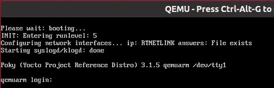

# 六、选择构建系统

在前面的章节中，我们介绍了嵌入式 Linux 的四个要素，并逐步向您展示了如何构建工具链、引导加载程序、内核和根文件系统，然后将它们组合到一个基本的嵌入式 Linux 系统中。 而且还有很多台阶呢！ 现在，是时候考虑通过尽可能使其自动化来简化这一过程的方法了。 我们将了解嵌入式构建系统如何提供帮助，并特别介绍其中的两个：Buildroot 和 Yocto 项目。 两者都是复杂而灵活的工具，需要一整本书才能完整地描述它们是如何工作的。 在本章中，我只想向您展示构建系统背后的一般概念。 我将向您展示如何构建一个简单的设备映像以获得系统的整体感觉，然后如何使用前几章中的 Nova 板示例以及 Raspberry PI 4 进行一些有用的更改。

在本章中，我们将介绍以下主题：

*   比较构建系统
*   分发二进制文件
*   Buildroot 简介
*   Yocto 项目简介

我们开始吧!

# 技术要求

要按照本章中的示例操作，请确保您具备以下条件：

*   至少具有 60 GB 可用磁盘空间的基于 Linux 的主机系统
*   适用于 Linux 的蚀刻器
*   一种 microSD 卡读卡器和卡
*   USB 转 TTL 3.3V 串行电缆
*   覆盆子派 4
*   一种 5V 3A USB-C 电源
*   用于网络连接的以太网电缆和端口
*   ♪Beaglebone Black♪
*   5V 1A 直流电源

本章的所有代码都可以在本书 GitHub 存储库的`Chapter06`文件夹中找到：[https://github.com/PacktPublishing/Mastering-Embedded-Linux-Programming-Third-Edition](https://github.com/PacktPublishing/Mastering-Embedded-Linux-Programming-Third-Edition)。

# 比较构建系统

我在[*第 5 章*](05.html#_idTextAnchor122)，*构建根文件系统*中将手动创建系统的过程描述为**滚动自己的**(**Ryo**)过程。 它的优点是您可以完全控制软件，并且您可以定制它来做任何您喜欢的事情。 如果你想要它做一些真正奇特但有创意的事情，或者如果你想把内存占用空间减少到尽可能小的大小，Ryo 是个不错的选择。 但是，在绝大多数情况下，手动构建是浪费时间，并且会产生劣质的、不可维护的系统。

构建系统的想法是自动执行到目前为止我已经描述的所有步骤。
构建系统应该能够从上游源代码构建以下部分或全部
：

*   工具链
*   引导加载程序
*   一个内核
*   根文件系统

从上游源代码构建非常重要，原因有很多。 这意味着您可以在任何时候进行重建，而不需要外部依赖，这意味着您可以高枕无忧。 这还意味着您拥有用于调试的源代码，而且您还可以满足许可证要求，在必要时将代码分发给用户。

因此，要完成其工作，构建系统必须能够执行以下操作：

1.  从上游下载源代码，可以直接从源代码控制系统下载，也可以作为存档下载，并在本地缓存。
2.  应用补丁程序以启用交叉编译、修复依赖于体系结构的错误、应用本地配置策略等。
3.  构建各种组件。
4.  创建临时区域并组装根文件系统。
5.  创建各种格式的图像文件，准备加载到目标上。

其他有用的东西如下：

1.  添加您自己的包，例如包含应用或内核更改的包。
2.  选择各种根文件系统配置文件：大或小，带或不带图形或其他功能。
3.  创建一个独立的 SDK，您可以将其分发给其他开发人员，这样他们就不必安装完整的构建系统。
4.  跟踪您
    选择的各种包使用哪些开源许可证。
5.  具有用户友好的用户界面。

在所有情况下，它们都将系统组件封装到包中，一些用于主机，另一些用于目标。 每个包都由一组规则定义，以获取源代码、构建源代码并将结果安装到正确的位置。 包与构建机制之间存在依赖关系，以解决依赖关系并构建所需的包集。

在过去的几年中，开源构建系统已经相当成熟。 周围有很多网站，包括以下几个：

*   **Buildroot**：这是一个使用 GNU make和 KCONFIG
    ([https://buildroot.org](https://buildroot.org))的易于使用的系统。
*   **EmbToolkit**：这是一个用于生成根文件系统和
    工具链的简单系统，也是到目前为止唯一支持 LLVM/https://www.embtoolkit.org 的系统([embToolkit](https://www.embtoolkit.org))。
*   **OpenEmbedded**：这是一个强大的系统，也是 Yocto 项目和其他项目([https://openembedded.org](https://openembedded.org))的核心组件。
*   **OpenWRT**：这是一个构建工具，面向无线路由器([https://openwrt.org](https://openwrt.org))构建固件，支持开箱即用的运行时包管理。
*   **PTXdist**：这是一个由Penguconix([https://www.ptxdist.org](https://www.ptxdist.org))发起的开源构建系统。
*   **Yocto 项目**：这个用元数据、工具和文档扩展了 OpenEmbedded核心，可能是最流行的系统([https://www.yoctoproject.org](https://www.yoctoproject.org))。

我将把集中在其中的两个项目上：Buildroot 和 Yocto 项目。 他们处理问题的方式不同，目标也不同。

Buildroot 的主要目的是构建根文件系统映像，因此得名，尽管它可以构建引导加载程序和内核映像以及工具链。 它易于安装和配置，并可快速生成目标映像。

另一方面，Yocto 项目在定义目标系统的方式上更为通用，因此它可以构建复杂的嵌入式设备。 默认情况下，使用 RPM 格式将每个组件生成为二进制包，然后组合这些包以生成文件系统映像。 此外，您可以在文件系统映像中安装包管理器，这允许您在运行时更新包。 换句话说，当您使用 Yocto 项目构建时，实际上是在创建您自己的自定义 Linux 发行版。 请记住，启用运行时包管理还意味着提供和运行您自己的相应包存储库。

# 分发二进制文件

在大多数情况下，主流 Linux 发行版都是由 RPM 或 DEB 格式的二进制(预编译)包集合构建的。 **RPM**代表**Red Hat Package Manager**，用于 Red Hat、SuSE、Fedora 和其他基于它们的发行版
。 Debian 和 Debian 派生的发行版，包括 Ubuntu 和 Mint，使用
称为 DEB 的 Debian 包管理器格式。 此外，还有一种特定于嵌入式设备的轻量级格式，称为 Itsy Package Format 或 IPK，它基于 DEB。

在设备上包含包管理器的能力是构建系统之间最大的区别之一。 一旦目标设备上有了包管理器，您就可以轻松地将新包部署到它并更新现有包。 我将在[*第 10 章*](10.html#_idTextAnchor278)，*在现场更新软件*中讨论这一点的含义。

# Buildroot 简介

Buildroot 的当前版本能够构建工具链、引导加载程序、内核和根文件系统。 它使用 GNU`Make`作为主要的构建工具。 在[Buildroot](https://buildroot.org/docs.html)有很好的在线文档，包括*https://buildroot.org/docs.html 用户手册*在[https://buildroot.org/downloads/manual/manual.html](https://buildroot.org/downloads/manual/manual.html)。

## 背景

Buildroot 是最早的构建系统之一。 它最初是 uClinux 和 uClibc 项目的一部分，是生成用于测试的小型根文件系统的一种方式。 它在 2001 年末成为一个独立的项目，并持续发展到 2006 年，之后它进入了一个相当休眠的阶段。 然而，自 2009 年 Peter Korsgaard 接手管理工作以来，它一直在快速发展，增加了对基于 Glibc 的工具链的支持，并且大大增加了软件包和目标板的数量。

有趣的是，Buildroot 也是另一个流行的构建系统 OpenWRT([http://wiki.openwrt.org](http://wiki.openwrt.org))的祖先，OpenWRT 大约在 2004 年从 Buildroot 派生而来。 OpenWRT 的主要关注点是为无线路由器生产软件，因此软件包组合面向网络基础设施。 它还有一个使用 IPK 格式的运行时包管理器，因此无需完全刷新映像即可更新或升级设备。 然而，Buildroot 和 OpenWRT 的分歧如此之大，以至于它们现在几乎是完全不同的构建系统。 用其中一种方法构建的包与另一种方法不兼容。

## 稳定发布，长期支持

Buildroot开发人员每年生成四次稳定版本，分别是 2 月、5 月、8 月和 11 月。 它们由形式为`<year>.02`、`<year>.05`、`<year>.08`和`<year>.11`的 Git 标记。 从时不时地，发布被标记为**长期支持**(**LTS**)，这意味着在初始发布之后的 12 个月内，将有修复安全和其他重要错误的点发布。 `2017.02`版本是第一个收到 LTS 标签的版本。

## 安装

通常，您可以通过克隆存储库或下载归档文件来安装 Buildroot。 下面是获取版本`2020.02.9`的示例，该版本在撰写本文时是最新的稳定版本：

```sh
$ git clone git://git.buildroot.net/buildroot -b 2020.02.9
$ cd buildroot
```

在[https://buildroot.org/downloads](https://buildroot.org/downloads)上可以找到等效的 TAR 归档文件。

接下来，您应该阅读*Buildroot 用户手册*的*系统要求*部分，该部分位于[https://buildroot.org/downloads/manual/manual.html](https://buildroot.org/downloads/manual/manual.html)，并确保您已经安装了那里列出的所有软件包。

## 配置

Buildroot 使用内核 Kconfig/Kbuild 机制，我在[*第 4 章*](04.html#_idTextAnchor085)，*配置和构建内核*的*了解内核配置*一节中进行了描述。 您可以直接使用`make menuconfig`(`xconfig`或`gconfig`)从头开始配置 Buildroot，也可以为各种开发板和 QEMU 仿真器选择 100 多种配置之一，这些配置存储在`configs/`目录中。 键入`make list-defconfigs`列出所有默认配置。

让我们首先构建一个可以在 ARM
QEMU 仿真器上运行的默认配置：

```sh
$ cd buildroot
$ make qemu_arm_versatile_defconfig
$ make
```

重要音符

您不能告诉`make`使用`-j`选项要运行多少并行作业：Buildroot 将自动优化您的 CPU 的使用。 如果要限制作业数量，可以运行`make menuconfig`并查看构建选项。

构建将花费半小时到一小时或更长时间，这取决于您主机系统的能力和您连接到互联网的速度。 它将下载大约 220MiB 的代码，并消耗大约 3.5GiB 的磁盘空间。 完成后，您会发现已经创建了两个新目录：

*   `dl/`：其中包含 Buildroot 已构建的上游项目的档案。
*   `output/`：它包含所有中间和最终编译资源。

您将在`output/`中看到以下内容：

*   `build/`：在这里，您可以找到每个组件的构建目录。
*   `host/`：它包含在主机上运行的 Buildroot 所需的各种工具，包括工具链的可执行文件(在`output/host/usr/bin`中)。
*   `img/`：这是最重要的，因为它包含构建的结果。 根据您在配置时选择的内容，您将找到一个引导加载程序、一个内核以及一个或多个根文件系统映像。
*   `staging/`：这是指向工具链的`sysroot`的符号链接。 链接的名称有点令人困惑，因为它没有指向临时区域，正如我在[*第 5 章*](05.html#_idTextAnchor122)，*构建根文件系统*中定义的那样。
*   `target/`：这是`root`目录的临时区域。 请注意，目前您不能将其用作根文件系统，因为文件所有权和权限设置不正确。 Buildroot 使用设备表(如上一章所述)在`img/`目录中创建文件系统映像时设置所有权和权限。

## 运行

某些示例配置在`board/`目录中有相应的条目，其中包含自定义配置文件和有关在目标系统上安装结果的信息。 对于您刚刚构建的系统，相关文件是`board/qemu/arm-versatile/readme.txt`，它告诉您如何使用这个目标启动 QEMU。 假设您已经安装了`qemu-system-arm`，如[*第 1 章*](01.html#_idTextAnchor014)，*从*开始所述，您可以使用以下命令运行它：

```sh
$ qemu-system-arm -M versatilepb -m 256 \
-kernel outpimg/zImage \
-dtb outpimg/versatile-pb.dtb \
-drive file=outpimg/rootfs.ext2,if=scsi,format=raw \
-append "root=/dev/sda console=ttyAMA0,115200" \
-serial stdio -net nic,model=rtl8139 -net user
```

本书的代码存档中有一个名为`MELP/Chapter06/run-qemu-buildroot.sh`的脚本，其中包含该命令。 当 QEMU 启动时，您应该会看到内核启动消息出现在启动 QEMU 的同一终端窗口中，后面跟着一个登录提示符：

```sh
Booting Linux on physical CPU 0x0
Linux version 4.19.91 (frank@franktop) (gcc version 8.4.0 (Buildroot 2020.02.9)) #1 Sat Feb 13 11:54:41 PST 2021
CPU: ARM926EJ-S [41069265] revision 5 (ARMv5TEJ), cr=00093177
CPU: VIVT data cache, VIVT instruction cache
OF: fdt: Machine model: ARM Versatile PB
[…]
VFS: Mounted root (ext2 filesystem) readonly on device 8:0.
devtmpfs: mounted
Freeing unused kernel memory: 140K
This architecture does not have kernel memory protection.
Run /sbin/init as init process
EXT4-fs (sda): warning: mounting unchecked fs, running e2fsck is recommended
EXT4-fs (sda): re-mounted. Opts: (null)
Starting syslogd: OK
Starting klogd: OK
Running sysctl: OK
Initializing random number generator: OK
Saving random seed: random: dd: uninitialized urandom read (512 bytes read)
OK
Starting network: 8139cp 0000:00:0c.0 eth0: link up, 100Mbps, full-duplex, lpa 0x05E1
udhcpc: started, v1.31.1
random: mktemp: uninitialized urandom read (6 bytes read)
udhcpc: sending discover
udhcpc: sending select for 10.0.2.15
udhcpc: lease of 10.0.2.15 obtained, lease time 86400
deleting routers
random: mktemp: uninitialized urandom read (6 bytes read)
adding dns 10.0.2.3
OK
Welcome to Buildroot
buildroot login:
```

以`root`身份登录，无密码。

您将看到除了显示内核引导消息的窗口外，QEMU 还会启动一个黑色窗口。 它用于显示目标的图形帧缓冲区。 在这种情况下，目标从不写入帧缓冲区，这就是它显示为黑色的原因。 要关闭 QEMU，请按*Ctrl+Alt+2*进入 QEMU 控制台，然后键入`quit`，或者只需关闭帧缓冲区窗口。

## 瞄准真实硬件

为 Raspberry PI 4 配置和构建可引导映像的步骤几乎与 ARM QEMU 相同：

```sh
$ cd buildroot
$ make clean
$ make raspberrypi4_64_defconfig
$ make
```

构建完成后，映像将写入名为`outpimg/sdcard.img`的文件。 用于写入镜像文件的`post-image.sh`脚本和`genimage-raspberrypi4-64.cfg`配置文件都位于`board/raspberrypi/`目录中。 要将`sdcard.img`写入 microSD 卡并在 Raspberry PI 4 上引导它，请执行以下步骤：

1.  将 microSD 卡插入 Linux 主机。
2.  启动 Etcher。
3.  从 Etcher 的文件中单击**闪存。**
4.  找到您为 Raspberry PI 4 构建的`sdcard.img`图像并打开它。
5.  单击**从 Etcher 选择目标**。
6.  选择您在*步骤 1*中插入的 microSD 卡。
7.  从 Etcher 单击**Flash**以写入图像。
8.  当 Etcher 完成闪烁时，弹出 microSD 卡。
9.  将 microSD 卡插入您的 Raspberry PI 4。
10.  通过 USB-C 端口为 Raspberry PI 4 通电。

将 PI 4 插入以太网并观察网络活动指示灯闪烁，以确认PI 4 已成功引导。 为了将`ssh`添加到您的 PI4 中，您需要将`dropbear`或`openssh`这样的 SSH 服务器添加到您的 Buildroot 映像配置中。

## 创建自定义 BSP

接下来，让我们使用 Buildroot 为我们的 Nova 主板创建一个**主板支持包(BSP)**，使用前面章节中的相同版本的 U-Boot 和 Linux。 您可以在`MELP/Chapter06/buildroot`中看到我在本节中对 Buildroot 所做的更改。

以下是存储更改的推荐位置：

*   `board/<organization>/<device>`：它包含任何补丁、二进制 BLOB、额外的构建步骤、Linux、U-Boot 和其他组件的配置文件。
*   `configs/<device>_defconfig`：这包含电路板的默认配置。
*   `package/<organization>/<package_name>`：这是您可以放置该电路板的任何附加包裹的地方。

让我们首先创建一个目录来存储 Nova 主板的更改：

```sh
$ mkdir -p board/melp/nova
```

接下来，从以前的任何构建中清除工件，这是在更改配置时应该始终执行的操作：

```sh
$ make clean
```

现在，选择 Beaglebone 的配置，我们将使用它作为 Nova 配置的基础：

```sh
$ make beaglebone_defconfig
```

`make beaglebone_defconfig`命令将 Buildroot 配置为构建以Beaglebone Black 为目标的映像。 这个配置是一个很好的起点，但是我们仍然需要为我们的 Nova 主板定制它。 让我们首先选择我们为 Nova 创建的自定义 U-Boot 补丁。

### U-Boot

在[*第 3 章*](03.html#_idTextAnchor061)，*All About Bootloaders*中，我们基于 U-Boot 的`2021.01`版本为 Nova 创建了一个自定义引导加载程序，并为其创建了一个补丁文件，您可以在`MELP/Chapter03/0001-BSP-for-Nova.patch`中找到。 我们可以将 Buildroot 配置为选择相同的版本并应用我们的补丁。 首先将补丁文件复制到`board/melp/nova`，然后使用`make menuconfig`将 U-Boot 版本设置为`2021.01`，将补丁文件设置为`board/melp/nova/0001-BSP-for-Nova.patch`，将板名设置为 Nova，如以下截图所示：


图 6.1-选择自定义 U-Boot 补丁程序

我们还需要一个 U-Boot 脚本来从
SD 卡加载 Nova 设备树和内核。 我们可以将文件放入`board/melp/nova/uEnv.txt`。 它应该包含以下命令：

```sh
bootpart=0:1
bootdir=
bootargs=console=ttyO0,115200n8 root=/dev/mmcblk0p2 rw rootfstype=ext4 rootwait
uenvcmd=fatload mmc 0:1 88000000 nova.dtb;fatload mmc 0:1 82000000 zImage;bootz 82000000 - 88000000
```

请注意，尽管可以看到换行，但`bootargs`和`uenvcmd`都是在单行上定义的。 `rootfstype=ext4 rootwait`是`bootargs`的一部分，而`bootz 82000000 - 88000000`是`uenvcmd`的一部分。

现在我们已经修补并配置了 Nova 主板的 U-Boot，下一步是修补和配置内核。

### Linux 操作系

在[*第 4 章*](04.html#_idTextAnchor085)，*配置和构建内核*中，我们将内核建立在 Linux 5.4.50 上，并提供了一个新的设备树，位于`MELP/Chapter04/nova.dts`中。 将设备树复制到`board/melp/nova`，将 Buildroot 内核配置更改为 Linux 版本 5.4，并将设备树源更改为`board/melp/nova/nova.dts`，如以下截图所示：


图 6.2-选择设备树源

我们还必须更改用于内核头的内核系列，以便它们与正在构建的内核相匹配：


图 6.3-选择自定义内核头

现在我们已经完成了这项工作，现在让我们构建系统映像，包括内核和
根文件系统。

### 委托建造 / 建立 / 安装 / 编

在构建的最后阶段，Buildroot 使用名为`genimage`的工具为 SD 卡创建镜像，我们可以将目录复制到该卡。 我们需要一个配置文件来以正确的方式布局图像。 我们将文件命名为`board/melp/nova/genimage.cfg`并填充它，如下所示：

```sh
image boot.vfat {
    vfat {
        files = {
            "MLO",
            "u-boot.img",
            "zImage",
            "uEnv.txt",
            "nova.dtb",
        }
    }
    size = 16M
}
image sdcard.img {
    hdimage {
    }
    partition u-boot {
        partition-type = 0xC
        bootable = "true"
        image = "boot.vfat"
    }
    partition rootfs {
        partition-type = 0x83
        image = "rootfs.ext4"
        size = 512M
    }
}
```

这将创建名为`sdcard.img`的文件，其中包含名为
`u-boot`和`rootfs`的两个分区。 第一个文件包含`boot.vfat`中列出的引导文件，第二个文件包含名为`rootfs.ext4`的根文件系统映像，它将由 Buildroot 生成。

最后，我们需要创建一个`post-image.sh`脚本，该脚本将调用`genimage`，从而创建 SD 卡映像。 我们将把它放在`board/melp/nova/post-image.sh`中：

```sh
#!/bin/sh
BOARD_DIR="$(dirname $0)"
cp ${BOARD_DIR}/uEnv.txt $BINARIES_DIR/uEnv.txt
GENIMAGE_CFG="${BOARD_DIR}/genimage.cfg" 
GENIMAGE_TMP="${BUILD_DIR}/genimage.tmp"
rm -rf "${GENIMAGE_TMP}"
genimage \
    --rootpath "${TARGET_DIR}" \
    --tmppath "${GENIMAGE_TMP}" \
    --inputpath "${BINARIES_DIR}" \
    --outputpath "${BINARIES_DIR}" \
    --config "${GENIMAGE_CFG}"
```

这会将`uEnv.txt`脚本复制到`output/images`目录中，并使用我们的配置文件运行`genimage`。

请注意，`post-image.sh`需要是可执行的；否则，构建将在最后失败：

```sh
$ chmod +x board/melp/nova/post-image.sh
```

现在，我们可以再次运行`make menuconfig`并深入页面。 在该页面中，向下导航到要在创建文件系统映像之前运行的**自定义脚本，然后输入我们的`post-image.sh`脚本的路径，如以下屏幕截图所示：**


图 6.4-选择创建文件系统映像后要运行的自定义脚本

最后，您只需输入`make`就可以为 Nova 板构建 Linux。 当它完成时，您将在`outpimg/`目录中看到这些文件(以及一些附加的 DBS)：

```sh
nova.dtb      sdcard.img      rootfs.ext2        u-boot.img
boot.vfat     rootfs.ext4     uEnv.txt           MLO
rootfs.tar    bzImage
```

要测试它，请将 microSD 卡插入读卡器并使用 Etcher 将
`outpimg/sdcard.img`写入 SD 卡，就像我们对 Raspberry PI 4 所做的那样。没有必要像我们在上一章中所做的那样预先格式化 microSD，因为`genimage`已经创建了所需的精确磁盘布局。

Etcher 完成后，将 microSD 卡插入 Beaglebone Black，并在按下 Switch Boot 按钮的同时打开
，以强制其从 SD 卡加载。 您应该看到，它与我们选择的 U-Boot、Linux 版本以及
Nova 设备树一起启动。

在证明我们的 Nova 主板自定义配置有效之后，最好保留一份配置副本，以便您和其他人可以再次使用它，您可以使用以下命令：

```sh
$ make savedefconfig BR2_DEFCONFIG=configs/nova_defconfig
```

现在，您有了 Nova 板的Buildroot 配置。 随后，您可以通过键入以下命令检索此配置：

```sh
$ make nova_defconfig
```

我们已成功配置 Buildroot。 现在，如果您想要向其中添加您自己的代码，该怎么办呢？ 我们将在下一节中学习如何做到这一点。

## 添加您自己的代码

假设您已经开发了一个程序，并且您想要将其包含在构建中。 您有两个选择：首先，您可以使用它自己的构建系统单独构建它，然后将二进制文件作为覆盖层滚动到最终构建中。 其次，您可以创建一个 Buildroot 包，该包可以从菜单中选择并像构建其他包一样进行构建。

### 叠加层

覆盖只是一种目录结构，它在构建过程的后期阶段被复制到 Buildroot 根文件系统的顶部。 它可以包含可执行文件、库以及您可能想要包含的任何其他内容。 请注意，任何编译的代码都必须与运行时部署的库兼容，这又意味着它必须使用 Buildroot 使用的同一工具链进行编译。 使用 Buildroot 工具链非常简单。 只需将其添加到`PATH`：

```sh
$ PATH=<path_to_buildroot>/output/host/usr/bin:$PATH
```

工具链的前缀是`<ARCH>-linux-`。 因此，要编译一个简单的程序，您需要执行以下操作：

```sh
$ PATH=/home/frank/buildroot/output/host/usr/bin:$PATH
$ arm-linux-gcc helloworld.c -o helloworld
```

使用正确的工具链编译程序后，只需将可执行文件和其他支持文件安装到临时区域，然后将其标记为 Buildroot 的覆盖文件。 对于`helloworld`示例，您可以将其放在`board/melp/nova`目录中：

```sh
$ mkdir -p board/melp/nova/overlay/usr/bin
$ cp helloworld board/melp/nova/overlay/usr/bin
```

最后，将`BR2_ROOTFS_OVERLAY`设置为指向覆盖的路径。 可以在`menuconfig`中使用**系统配置|根文件系统覆盖目录**选项进行配置。

### 添加包

Buildroot 软件包(超过 2000 个)存储在`package`目录中，每个都在自己的子目录中。 包至少由两个文件组成：`Config.in`，它包含使包在配置菜单中可见所需的 Kconfig 代码片段；以及一个名为`<package_name>.mk`的 Makefile。

重要音符

请注意，Buildroot 包不包含代码，只包含通过下载 tarball、执行`git pull`或获取上游源代码所需的任何操作来获取代码的指令。

Makefile 以 Buildroot 期望的格式编写，并包含允许 Buildroot 下载、配置、编译和安装程序的指令。 编写新的软件包 Makefile 是一项复杂的操作，在 Buildroot 用户手册：[https://buildroot.org/downloads/manual/manual.html](https://buildroot.org/downloads/manual/manual.html)中详细介绍了*。 下面的示例向您展示了如何为本地存储的简单程序(如我们的`helloworld`程序)创建包。*

首先，使用配置文件`Config.in`创建`package/helloworld/`子目录，如下所示：

```sh
config BR2_PACKAGE_HELLOWORLD
    bool "helloworld"
    help
      A friendly program that prints Hello World! Every 10s
```

第一行必须是`BR2_PACKAGE_<uppercase package name>`格式。 后跟`bool`和软件包名称，因为它将出现在配置菜单中，这将允许用户选择该软件包。 `help`部分是可选的，但通常是个好主意，因为它起到了自我文档的作用。

接下来，通过编辑`package/Config.in`并获取配置文件，将新包链接到**目标包**菜单，如下所示：

```sh
menu "My programs"
      source "package/helloworld/Config.in"
endmenu
```

您可以将这个新的`helloworld`包附加到现有的子菜单中，但是创建一个新的子菜单(它只包含我们的包)并将其插入到`menu "Audio and video applications"`之前会更简单。

将`menu "My programs"`插入`package/Config.in`后，创建 Makefile`package/helloworld/helloworld.mk`，以提供 Buildroot 所需的数据：

```sh
HELLOWORLD_VERSION = 1.0.0
HELLOWORLD_SITE = /home/frank/MELP/Chapter06/helloworld
HELLOWORLD_SITE_METHOD = local
define HELLOWORLD_BUILD_CMDS
    $(MAKE) CC="$(TARGET_CC)" LD="$(TARGET_LD)" -C $(@D) all
endef
define HELLOWORLD_INSTALL_TARGET_CMDS
    $(INSTALL) -D -m 0755 $(@D)/helloworld $(TARGET_DIR)/usr/bin/helloworld
endef
$(eval $(generic-package))
```

您可以在本书的`MELP/Chapter06/buildroot/package/helloworld`中找到我的`helloworld`包，在`MELP/Chapter06/helloworld`中找到该程序的源代码。 代码的位置被硬编码为本地路径名。 在更接近的情况下，您可以从源代码系统或某种中央服务器获取代码：在*Buildroot 用户手册*中有关于如何做到这一点的详细信息，其他包中也有大量示例。

## 许可证合规性

Buildroot 基于一款开源软件，它编译的包也是如此。 在项目期间的某个点，您应该检查许可证，这可以通过运行以下命令来完成：

```sh
$ make legal-info
```

信息被收集到`output/legal-info/`中。 这里有用于编译`host-manifest.csv`中的主机工具和目标上的`manifest.csv`中的主机工具的许可证摘要。 在`README`文件和*Buildroot
用户手册*中有更多信息。

我们将在[*第 14 章*](14.html#_idTextAnchor411)、*中从 BusyBox Runit*开始再次访问 Buildroot。 现在，让我们切换构建系统，开始学习 Yocto 项目。

# 介绍 Yocto 项目

Yocto 项目比 Buildroot 更复杂。 它不仅可以像 Buildroot 那样构建工具链、引导加载程序、内核和根文件系统，还可以使用可以在运行时安装的二进制软件包为您生成整个 Linux 发行版。 构建过程是围绕菜谱组构建的，类似于 Buildroot 包，但使用 Python 和 shell 脚本的组合编写。 Yocto 项目包括一个名为**BitBake**的任务调度器，它可以根据食谱生成。 在[https://www.yoctoproject.org](https://www.yoctoproject.org)上有大量的在线文档。

## 背景

如果你先看看背景，尤克托项目的结构就更有意义了。 它的根源是**OpenEmbedded**([Linux](https://openembedded.org))，它反过来又源于个将 https://openembedded.org 移植到各种手持计算机上的项目，包括 Sharp Zaurus 和 Compaq iPaq。 OpenEmbedded 作为掌上电脑的构建系统于 2003 年问世。 不久之后，其他开发人员开始将其用作运行嵌入式 Linux 的设备的通用构建系统。 它是由一个热情的程序员社区开发的，而且还在继续开发。

OpenEmbedded 项目开始使用紧凑的 IPK 格式创建一组二进制包，然后可以通过各种方式组合这些包来创建目标系统，并在运行时将其安装在目标系统上。 它通过为每个包创建食谱并使用 BitBake 作为任务调度器来做到这一点。 它过去是，现在也是非常灵活的。 通过提供正确的元数据，您可以根据自己的规范创建整个 Linux 发行版。 一个相当有名的是**ängström 分布**，但还有许多其他的分布。

在 2005 年的某个时候，当时在 OpenedHand 担任开发人员的 Richard Purdie 创建了 OpenEmbedded 的分支，它对包的选择更为保守，并创建了在一段时间内稳定的发行版。 他以日本小吃命名为**poky**(如果你担心这些事情，poky 的发音与曲棍球押韵)。 虽然 POKY 是一个分支，但 OpenEmbedded 和 POKY 继续并驾齐驱，共享更新，使架构或多或少保持同步。 英特尔在 2008 年收购了 OpenedHand，并在 2010 年将 Poky Linux 转移到 Linux 基金会，当时他们成立了 Yocto 项目。

从 2010 年开始，OpenEmbedded 和 POKY 的通用组件被合并到一个名为**OpenEmbedded Core**或简称为**OE-Core**的单独项目中。

因此，Yocto 项目收集了几个组件，其中最重要的组件如下：

*   **OE-Core**：这是核心元数据，与 OpenEmbedded 共享。
*   **BitBake**：这是任务调度器，与 OpenEmbedded 和
    其他项目共享。
*   **poky**：这是参考分布。
*   **文档**：这是
    每个组件的用户手册和开发人员指南。
*   **Toaster**：这是 BitBake 及其元数据的基于 Web 的界面。

Yocto 项目提供了一个稳定的基础，它可以按原样使用，也可以使用**元层**进行扩展，我将在本章后面讨论这一点。 许多 SoC 供应商以这种方式为他们的设备提供 BSP。 元层也可以用来创建扩展的或仅仅不同的构建系统。 其中一些是开源的，比如ängström 发行版，而另一些是商业的，比如 MontaVista 运营商级版、Mentor Embedded Linux 和 Wind River Linux。 Yocto 项目有一个品牌和兼容性测试方案，以确保组件之间具有互操作性。 你会在不同的网页上看到诸如“Yocto Project Compatible”这样的声明。

因此，您应该将 Yocto 项目视为整个嵌入式 Linux 部门的基础，并且本身就是一个完整的构建系统。

笔记 / 便条 / 票据 / 注解

你可能想知道这个名字，Yocto。 *Yocto*是 10-24，
的 SI 前缀，与*Micro*是 10-6 的方式相同。 为什么给这个项目取名为 Yocto？ 这在一定程度上表明，它可以构建非常小的 Linux 系统(尽管，公平地说，其他构建系统也可以)，但也是为了抢占基于 OpenEmbedded 的ängström 发行版的先机。 Aóngström 是 10-10。 这是巨大的，与*Yocto*相比！

## 稳定的版本和支持

通常，Yocto 项目每 6 个月发布一次：在4 月和 10 月。 它们主要是通过它们的代号来知道的，但是知道 Yocto 项目和 POKY 的版本号也是很有用的。 以下是撰写本文时的六个最新版本的表格：

<colgroup><col> <col> <col> <col></colgroup> 
| **代码名称** | **发布日期** | **Yocto 版本** | **POKY 版本** |
| ♪Gatesgarth♪ | 2020 年 10 月 | 3.2 | 24 个 |
| 邓费尔 | 2020 年 4 月 | 3.1 | 23 个 |
| 宙斯 | 2019 年 10 月 | 3.0 | 22 |
| 勇士 / 经验丰富的战士 / 武士 / 鼓吹战争的人 | 2019 年 4 月 | 2.7 | 21 岁 |
| 嘿，嘿。 | 2018 年 11 月 | 2.6 | 20 个 |
| 相扑 | 2018 年 4 月 | 2.5 | 19 个 |

稳定版本支持当前发布周期和下一个发布周期的安全和关键错误修复。 换句话说，每个版本在发布后大约 12 个月内都受到支持。 此外，邓费尔是 Yocto 的第一个 LTS 版本。 LTS指定意味着邓费尔将获得延长 2 年的缺陷修复和更新。 因此，未来的计划是选择每两年发布一次 Yocto 项目的 LTS 版本。

与 Buildroot 一样，如果您需要继续支持，可以更新到下一个稳定版本，或者向后移植到您的版本的更改。 您还可以选择由 Mentor Graphics、Wind River 等操作系统供应商为 Yocto 项目提供为期数年的商业支持。 现在，让我们学习如何安装 Yocto 项目。

## 安装 Yocto 项目

要获得 Yocto 项目的副本，请克隆存储库，选择代码名作为分支，在本例中为`dunfell`：

```sh
$ git clone -b dunfell git://git.yoctoproject.org/poky.git
```

定期运行`git pull`以从远程分支获取最新的错误修复和安全补丁是一种很好的做法。

阅读*Yocto 项目快速构建*指南([https://www.yoctoproject.org/docs/current/brief-yoctoprojectqs/brief-yoctoprojectqs.html](https://www.yoctoproject.org/docs/current/brief-yoctoprojectqs/brief-yoctoprojectqs.html))的*兼容 Linux 发行版*和*构建主机包*部分。 确保您的主机上安装了 Linux 发行版的基本软件包。 下一步是配置。

## 配置

与 Buildroot 一样，让我们从构建 QEMU ARM 仿真器开始。 首先寻找一个脚本来设置环境NT：

```sh
$ source poky/oe-init-build-env
```

这将为您创建一个名为`build/`的工作目录，并使其成为当前目录。 所有配置以及任何中间和目标图像文件
都将放在此目录中。 每次要处理此项目时，您都必须获取此脚本。

您可以选择不同的工作目录，方法是将其作为参数添加到
`oe-init-build-env`；例如：

```sh
$ source poky/oe-init-build-env build-qemuarm
```

这将使您进入`build-qemuarm/`目录。 通过这种方式，您可以拥有多个构建目录，每个目录对应一个不同的项目：您可以通过传递给`oe-init-build-env`的参数选择要使用的构建目录。

最初，build 目录只包含一个名为`conf/`的子目录，该子目录包含此项目的以下配置文件：

*   `local.conf`：这包含要构建的设备和构建环境的规范。
*   `bblayers.conf`：它包含要使用的元层的路径。 稍后我将描述各个层次。

目前，我们只需要通过删除该行开头的注释字符(`#`)将`conf/local.conf`中的`MACHINE`变量设置为`qemuarm`：

```sh
MACHINE ?= "qemuarm"
```

现在，我们准备使用 Yocto 构建我们的第一个映像。

## 建筑

要实际执行构建，您需要运行 BitBake，告诉它您想要创建哪个根文件系统映像。 一些常见的图像如下所示：

*   `core-image-minimal`：这是一个基于控制台的小型系统，可用于测试，也可作为自定义映像的基础。
*   `core-image-minimal-initramfs`：这类似于`core-image-minimal`，但构建为内存磁盘。
*   `core-image-x11`：这是一个基本图像，通过 X11 服务器和`xterminal`终端应用支持图形。
*   `core-image-full-cmdline`：此基于控制台的系统提供标准 CLI 体验和对目标硬件的全面支持。

通过将 BitBake 作为最终目标，它将向后工作，并首先从工具链开始构建所有依赖项。 目前，我们只想创建一个最小的映像，看看它是如何工作的：

```sh
$ bitbake core-image-minimal
```

构建可能需要一些时间(可能超过一个小时)，即使有几个 CPU 内核和大量 RAM 也是如此。 它将下载大约 10GiB 的源代码，并消耗大约 40GiB 的磁盘空间。 完成后，您将在 Build 目录中找到几个新目录，包括`downloads/`和`tmp/`，其中`downloads/`包含为构建下载的所有源代码，`tmp/`包含大多数构建构件。 您应该在`tmp/`中看到以下内容：

*   `work/`：它包含根文件系统的构建目录和临时区域。
*   `deploy/`: This contains the final binaries to be deployed on the target:

    `deplimg/[machine name]/`：包含准备在目标系统上运行的引导加载程序、内核和根文件系统映像。

    `deploy/rpm/`：它包含组成映像的 RPM 包。

    `deploy/licenses/`：它包含从每个软件包提取的许可证文件。

当构建完成后，我们可以在 QEMU 上引导完成的映像。

## 运行 QEMU 目标

当您构建 QEMU 目标时，会生成 QEMU 的内部版本，这样就不再需要为您的发行版安装 QEMU 包，从而避免了版本依赖。 我们可以使用名为`runqemu`的包装器脚本来运行此版本的 QEMU。

要运行 QEMU 仿真，请确保您已经获取了`oe-init-build-env`，然后只需键入以下内容：

```sh
$ runqemu qemuarm
```

在本例中，QEMU 配置了图形控制台，登录提示符出现在黑色帧缓冲区中，如以下截图所示：



图 6.5-QEMU 图形控制台

以`root`身份登录，无需密码。 要关闭 QEMU，请关闭帧缓冲区窗口。

要在没有图形窗口的情况下启动 QEMU，请在命令行中添加`nographic`：

```sh
$ runqemu qemuarm nographic
```

在这种情况下，使用键序列*Ctrl+A*，然后按*x*关闭 QEMU。

`runqemu`脚本有许多其他选项。 键入`runqemu help`以了解详细信息。

## 层

Yocto 项目的元数据被组织成层。 按照惯例，每个层都有一个以`meta`开头的名称。 Yocto 计划的核心层如下：

*   `meta`：这是OpenEmbedded 内核，包含对 poky 的一些更改。
*   `meta-poky`：这是特定于 POKY 分布的元数据。
*   `meta-yocto-bsp`：本包含 Yocto 项目支持的机器的主板支持包。

BitBake 搜索食谱的层列表存储在`<your build directory>/conf/bblayers.conf`中，默认情况下包括前面列表中提到的所有三个层。

通过以这种方式组织食谱和其他配置数据，很容易通过添加新层来扩展 Yocto 项目。 可以从
SoC 制造商、Yocto 项目本身以及希望
为Yocto 项目和 OpenEmbedded 增加价值的广泛人员那里获得附加层。 在[http://layers.openembedded.org/layerindex/](http://layers.openembedded.org/layerindex/)有一个有用的层列表。 以下是一些例子：

*   `meta-qt5`：qt 5 库和实用程序
*   `meta-intel`：面向英特尔 CPU 和 SoC 的 BSP
*   `meta-raspberrypi`：覆盆子 PI 板的 BSP
*   `meta-ti`：用于 TI 基于 ARM 的 SoC 的 BSP

添加层非常简单，只需将`meta`目录复制到合适的位置并将其添加到`bblayers.conf`即可。 确保阅读每个层应该附带的`REAMDE`文件，以查看它对其他层有哪些依赖关系，以及它与哪些版本的 Yocto Project 兼容。

为了说明层的工作方式，让我们为 Nova 板创建一个层，我们可以在添加功能时在本章的其余部分使用它。 您可以在`MELP/Chapter06/meta-nova`的代码归档中查看该层的完整实现。

每个 meta层必须至少有一个名为`conf/layer.conf`的配置文件，它还应该有`README`文件和许可证。

要创建我们的`meta-nova`层，请执行以下步骤：

```sh
$ source poky/oe-init-build-env build-nova
$ bitbake-layers create-layer nova
$ mv nova ../meta-nova
```

这将把您放到一个名为`build-nova`的工作目录中，并在`COPYING.MIT`中创建一个名为`meta-nova`的层，其中包含一个`conf/layer.conf`、一个轮廓`README`和一个`MIT LICENSE`。 `layer.conf`文件如下所示：

```sh
# We have a conf and classes directory, add to BBPATH
BBPATH .= ":${LAYERDIR}"
# We have recipes-* directories, add to BBFILES
BBFILES += "${LAYERDIR}/recipes-*/*/*.bb \
            ${LAYERDIR}/recipes-*/*/*.bbappend"
BBFILE_COLLECTIONS += "nova"
BBFILE_PATTERN_nova = "^${LAYERDIR}/"
BBFILE_PRIORITY_nova = "6"
LAYERDEPENDS_nova = "core"
LAYERSERIES_COMPAT_nova = "dunfell"
```

它将自身添加到`BBPATH`，并将其包含的配方添加到`BBFILES`。 通过查看代码，您可以在名称以`recipes-`开头的目录中找到食谱，其文件名以`.bb`(对于普通的 BitBake 食谱)或`.bbappend`(对于通过覆盖或添加指令来扩展现有食谱的食谱)结尾。 该层的名称为`nova`，已添加到`BBFILE_COLLECTIONS`中的层列表中，并且优先级为`6`。 如果相同的配方出现在多个层中，则使用该层的优先级：优先级最高的层中的那个取胜。

现在，您需要使用以下命令将该层添加到构建配置中：

```sh
$ bitbake-layers add-layer ../meta-nova
```

确保在采购该环境后从`build-nova`工作目录运行此命令。

您可以确认您的层结构设置正确，如下所示：

```sh
$ bitbake-layers show-layers
NOTE: Starting bitbake server...
layer            path                               priority
==============================================================
meta             /home/frank/poky/meta                     5
meta-poky        /home/frank/poky/meta-poky                5
meta-yocto-bsp   /home/frank/poky/meta-yocto-bsp           5
meta-nova        /home/frank/meta-nova                     6
```

在这里，您可以看到新图层。 它的优先级为`6`，这意味着我们可以覆盖其他层中的食谱，这些层的优先级都较低。

此时，使用该空层运行构建将是一个好主意。 最终目标将是 Nova 董事会，但目前，通过取消`conf/local.conf`中的`MACHINE ?= "beaglebone-yocto"`注释来构建 Beaglebone Black。 然后，使用`bitbake core-image-minimal`构建一个小映像，就像您之前所做的那样。

除了食谱之外，层还可以包含 BitBake 类、机器的配置文件、分发版本等等。 接下来，我将介绍食谱，并向您展示如何创建自定义图像以及如何创建包。

### BitBake 和食谱

BitBake 处理几种不同类型的元数据，包括：

*   **配方**：以`.bb`结尾的文件。 这些文档包含有关构建软件单元的信息，包括如何获取源代码副本、其他组件的依赖关系以及如何构建和安装它。
*   **追加**：以`.bbappend`结尾的文件。 这些允许覆盖或扩展食谱的某些细节。 `bbappend`文件只是将其指令附加到具有相同根名称的配方(`.bb`)文件的末尾。
*   **包含**：以`.inc`结尾的文件。 这些食谱包含多个食谱共有的信息，允许它们之间共享信息。 可以使用**INCLUDE**或**REQUIRED**关键字包括文件。 不同之处在于，如果文件不存在，则`require`会产生错误，而`include`则不存在。
*   **CLASS**：以`.bbclass`结尾的文件。 这些文件包含常见的构建信息；例如，如何构建内核或如何构建 AutoTools 项目。 这些类是使用`inherit`关键字在配方和其他类中继承和扩展的。 在每个配方中都隐式继承了`classes/base.bbclass`类。
*   **配置**：以`.conf`结尾的文件。 它们定义了控制项目构建过程的各种配置变量。

菜谱是用 Python 和 Shell 脚本的组合编写的任务集合。 任务的名称为`do_fetch`、`do_unpack`、`do_patch`、`do_configure`、`do_compile`和`do_install`。 您可以使用 BitBake 执行这些任务。 默认任务是`do_build`，它执行构建配方所需的所有子任务。 您可以使用`bitbake -c listtasks [recipe]`列出配方中可用的任务。 例如，您可以按如下方式列出`core-image-minimal`中的任务：

```sh
$ bitbake -c listtasks core-image-minimal
```

重要音符

`-c`选项告诉 BitBake 运行配方中的特定任务，而不必在任务名称的开头包含`do_`部分。

`do_listtasks`任务只是一个特殊任务，它列出了配方中定义的所有任务。 另一个例子是`fetch`任务，它下载食谱的源代码：

```sh
$ bitbake -c fetch busybox
```

要获取目标及其所有依赖项的代码，这在您希望确保已下载要构建的映像的所有代码时非常有用，请使用以下命令：

```sh
$ bitbake core-image-minimal --runall=fetch
```

配方文件通常命名为`<package-name>_<version>.bb`。 它们可能依赖于其他食谱，这将允许 BitBake 计算出完成顶级作业所需执行的所有子任务。

例如，要在`meta-nova`中为我们的`helloworld`程序创建配方，您将创建如下目录结构：

```sh
meta-nova/recipes-local/helloworld
├── files
│   └── helloworld.c
└── helloworld_1.0.bb
```

配方是`helloworld_1.0.bb`，源是`files/`子目录中配方目录的本地。 食谱包含以下说明：

```sh
DESCRIPTION = "A friendly program that prints Hello World!"
PRIORITY = "optional"
SECTION = "examples"
LICENSE = "GPLv2"
LIC_FILES_CHKSUM = "file://${COMMON_LICENSE_DIR}/GPL-2.0;md5=801f80980d171dd6425610833a22dbe6"
SRC_URI = "file://helloworld.c"
S = "${WORKDIR}"
do_compile() {
    ${CC} ${CFLAGS} ${LDFLAGS} helloworld.c -o helloworld
}
do_install() {
    install -d ${D}${bindir}
    install -m 0755 helloworld ${D}${bindir}
}
```

源代码的位置由`SRC_URI`设置。 在本例中，`file://`URI 表示代码是`recipe`目录的本地代码。 BitBake 将相对于包含配方的目录搜索`files/`、`helloworld/`和`helloworld-1.0/`目录。 需要定义的任务是`do_compile`和`do_install`，
，它们编译源文件并将其安装到目标根文件系统中：`${D}`将
扩展到配方的登台区，`${bindir}`扩展到默认的二进制目录；即
`/usr/bin`。

每个食谱都有一个许可证，由`LICENSE`定义，此处设置为`GPLv2`。 包含许可证文本和校验和的文件由`LIC_FILES_CHKSUM`定义。 如果校验和不匹配，BitBake 将终止构建，这表明许可证已以某种方式更改。 请注意，MD5 校验和值和`COMMON_LICENSE_DIR`在同一行，由分号分隔。 许可证文件可能是软件包的一部分，也可能指向`meta/files/common-licenses/`中的标准许可证文本之一，就像这里的情况一样。

默认情况下，商业许可证是不允许的，但启用它们很容易。 您需要在食谱中指定许可证，如下所示：

```sh
LICENSE_FLAGS = "commercial"
```

然后，在您的`conf/local.conf`文件中，您将明确允许此许可证，如下所示：

```sh
LICENSE_FLAGS_WHITELIST = "commercial"
```

现在，为了确保我们的`helloworld`配方正确编译，您可以要求 BitBake 构建它，如下所示：

```sh
$ bitbake helloworld
```

如果一切正常，您应该看到它已经在`tmp/work/cortexa8hf-neon-poky-linux-gnueabi/helloworld/`中为其创建了一个工作目录。 您还应该看到，在`tmp/deploy/rpm/cortexa8hf_neon/helloworld-1.0-r0.cortexa8hf_neon.rpm`中有一个用于它的 RPM 包。

不过，它还不是目标图像的一部分。 要安装的软件包列表保存在名为`IMAGE_INSTALL`的变量中。 通过将此行添加到`conf/local.conf`，可以将其附加到该列表的末尾：

```sh
IMAGE_INSTALL_append = " helloworld"
```

请注意，在左双引号和第一个包名之间必须有一个空格。 现在，程序包将添加到您`bitbake`：

```sh
$ bitbake core-image-minimal
```

如果您查看`tmp/deplimg/beaglebone-yocto/core-image-minimal-beaglebone-yocto.tar.bz2`，您将看到`/usr/bin/helloworld`确实已经安装。

## 通过 local.conf 自定义图像

您可能经常希望在开发期间将包添加到映像中，或者以其他方式调整它。 如前所述，您可以通过添加如下语句，简单地将其附加到要安装的软件包列表中：

```sh
IMAGE_INSTALL_append = " strace helloworld"
```

您可以通过`EXTRA_IMAGE_FEATURES`进行更彻底的更改。 下面是一个简短的列表，可以让您了解可以启用的功能：

*   `dbg-pkgs`：这将为
    映像中安装的所有包安装调试符号包。
*   `debug-tweaks`：这允许`root`登录而无需密码和其他可简化开发的更改。
*   `package-management`：这将安装包管理工具并保留包管理器数据库。
*   `read-only-rootfs`：这使根文件系统成为只读的。 我们将在[*第 9 章*](09.html#_idTextAnchor246)，*创建存储策略*中更详细地介绍这一点。
*   `x11`：这将安装 X 服务器。
*   `x11-base`：这将在最小环境下安装 X 服务器。
*   `x11-sato`：这将安装 OpenedHand Sato 环境。

您可以通过这种方式添加更多功能。 我建议您阅读位于[https://www.yoctoproject.org/docs/latest/ref-manual/ref-manual.html](https://www.yoctoproject.org/docs/latest/ref-manual/ref-manual.html)的*Yocto 项目参考手册*的*图像特性*部分，并通读`meta/classes/core-image.bbclass`中的代码。

## 写一张图片食谱

更改`local.conf`的问题在于，它们是本地的。 如果您想创建一个要与其他开发人员共享或加载到生产系统上的映像，那么您应该将更改放入**映像配方**。

映像配方包含有关如何为目标创建映像文件的说明，包括引导加载程序、内核和根文件系统映像。 按照惯例，图像食谱被放入名为`images`的目录中，因此您可以使用以下命令获取所有可用图像的列表：

```sh
$ ls meta*/recipeimg/*.bb
```

您会发现`core-image-minimal`的配方在`meta/recipes-coimg/core-image-minimal.bb`中。

一种简单的方法是获取一个现有的图像配方，并使用与您在`local.conf`中使用的语句类似的语句对其进行修改。

例如，假设您想要一个与`core-image-minimal`相同但包含`helloworld`程序和`strace`实用程序的映像。 您可以使用一个两行的配方文件来实现这一点，该文件包括(使用`require`关键字)基本图像并添加您想要的包。 通常将图像放在名为`images`的目录中，因此将包含以下内容的`nova-image.bb`食谱添加到`meta-nova/recipes-local/images`中：

```sh
require recipes-coimg/core-image-minimal.bb
IMAGE_INSTALL += "helloworld strace"
```

现在，您的可以从您的`local.conf`中删除`IMAGE_INSTALL_append`行，并使用以下代码构建它：

```sh
$ bitbake nova-image
```

这一次，构建应该进行得更快，因为 BitBake 重用了构建时遗留的产品`core-image-minimal`。

BitBake 不仅可以构建在目标设备上运行的映像，还可以构建在主机上进行开发的 SDK。

## 创建 SDK

能够创建一个其他开发人员可以安装的独立工具链是非常有用的，避免了团队中的每个人都需要完整安装 Yocto 项目。 理想情况下，您希望工具链包含目标上安装的所有库的开发库和头文件。 您可以使用`populate_sdk`任务对任何图像执行此操作，如下所示：

```sh
$ bitbake -c populate_sdk nova-image
```

结果是在`tmp/deploy/sdk`中生成一个自安装的 shell 脚本：

```sh
poky-<c_library>-<host_machine>-<target_image><target_machine>-toolchain-<version>.sh
```

对于使用`nova-image`配方构建的 SDK，它是这样的：

```sh
poky-glibc-x86_64-nova-image-cortexa8hf-neon-beaglebone-yocto-toolchain-3.1.5.sh
```

如果您只需要一个只包含 C 和 C++交叉编译器、C 库和头文件的基本工具链，则可以改为运行以下命令：

```sh
$ bitbake meta-toolchain
```

要安装 SDK，只需运行 shell 脚本。 默认安装目录为`/opt/poky`，但安装脚本允许您更改此目录：

```sh
$ tmp/deploy/sdk/poky-glibc-x86_64-nova-image-cortexa8hf-neon-beaglebone-yocto-toolchain-3.1.5.sh
Poky (Yocto Project Reference Distro) SDK installer version 3.1.5
==============================================================
Enter target directory for SDK (default: /opt/poky/3.1.5): 
You are about to install the SDK to "/opt/poky/3.1.5". Proceed [Y/n]? Y
[sudo] password for frank: 
Extracting SDK............................................done
Setting it up...done
SDK has been successfully set up and is ready to be used.
Each time you wish to use the SDK in a new shell session, you need to source the environment setup script e.g.
$ . /opt/poky/3.1.5/environment-setup-cortexa8hf-neon-poky-linux-gnueabi
```

要使用工具链，首先，获取环境并设置脚本：

```sh
$ source /opt/poky/3.1.5/environment-setup-cortexa8hf-neon-poky-linux-gnueabi
```

给小费 / 翻倒 / 倾覆

为 SDK 设置内容的`environment-setup-*`脚本与您在 Yocto Project Build 目录中工作时获取的`oe-init-build-env`脚本不兼容。 在获取任一脚本之前，始终启动新的终端会话是一条很好的规则。

Yocto 项目生成的工具链没有有效的`sysroot`目录。 我们知道这是真的，因为将`-print-sysroot`选项传递给工具链的编译器将返回`/not/exist`：

```sh
$ arm-poky-linux-gnueabi-gcc -print-sysroot
/not/exist
```

因此，如果您尝试交叉编译，就像我在前面几章中所展示的那样，它将失败，如下所示：

```sh
$ arm-poky-linux-gnueabi-gcc helloworld.c -o helloworld
helloworld.c:1:10: fatal error: stdio.h: No such file or directory
    1 | #include <stdio.h>
      |          ^~~~~~~~~
compilation terminated.
```

这是因为该编译器已配置为适用于多种 ARM 处理器，并且在使用正确的标志集启动它时进行微调。 相反，您应该使用在编写`environment-setup`脚本进行交叉编译时创建的 shell 变量。 它包括以下内容：

*   `CC`：c 编译
*   `CXX`：C++编译器
*   `CPP`：c 预处理器
*   `AS`：汇编器
*   `LD`：左侧

例如，我们发现`CC`已设置为：

```sh
$ echo $CC
arm-poky-linux-gnueabi-gcc -mfpu=neon -mfloat-abi=hard -mcpu=cortex-a8 -fstack-protector-strong -D_FORTIFY_SOURCE=2 -Wformat -Wformat-security -Werror=format-security --sysroot=/opt/poky/3.1.5/sysroots/cortexa8hf-neon-poky-linux-gnueabi
```

只要您使用`$CC`编译，一切都应该正常工作：

```sh
$ $CC -O helloworld.c -o helloworld
```

接下来，我们来看一下许可证审核。

## 许可证审核

Yocto 项目坚持每个套餐都有许可证。 每个软件包在构建时都会在`tmp/deploy/licenses/[package name]`中放置一份许可证副本。 此外，映像中使用的包和许可证的摘要被放入`<image name>-<machine name>-<date stamp>/`目录中。 对于我们刚刚构建的`nova-image`，目录将命名为如下所示：

```sh
tmp/deploy/licenses/nova-image-beaglebone-yocto-20210214072839/
```

这就完成了我们对嵌入式 Linux 的两个领先构建系统的调查。 Buildroot 简单快捷，这使它成为相当简单的单一用途设备的一个很好的选择：传统的嵌入式 Linux，我喜欢这样认为。 Yocto 项目更加复杂和灵活。 尽管 Yocto 项目在整个社区和行业都得到了很好的支持，但该工具仍然有一个非常陡峭的学习曲线。 你可能需要几个月的时间才能精通 Yocto，即使到那时，它有时也会做一些你意想不到的事情。

# 摘要

在本章中，您了解了如何使用 Buildroot 和 Yocto 项目来配置、自定义和构建嵌入式 Linux 映像。 我们使用 Buildroot 为基于 Beaglebone Black 的假设板创建了带有自定义 U-Boot 补丁和设备树规范的 BSP。 然后，我们学习了如何以 Buildroot 包的形式将自己的代码添加到图像中。 我们还向您介绍了 Yocto 项目，我们将在接下来的两章中深入介绍该项目。 特别是，您学习了一些基本的 BitBake 术语、如何编写图像配方以及如何创建 SDK。

不要忘记，使用这些工具创建的任何设备都需要在现场维护一段时间，通常需要多年。 Yocto 项目和 Buildroot 都在初始版本之后提供大约一年的点发布，而 Yocto 项目现在提供至少两年的长期支持。 在任何一种情况下，您都会发现您必须自己维护您的版本；否则，您将为商业支持买单。 第三种可能性，忽略这个问题，不应该被认为是一种选择！

在下一章中，我们将介绍文件存储和文件系统，以及您在这些方面所做的选择将如何影响嵌入式
Linux 系统的稳定性和可维护性。

# 进一步阅读

以下资源包含有关本章中介绍的主题的详细信息：

*   *Buildroot 用户手册*，Buildroot Association：[http://buildroot.org/downloads/manual/manual.html](http://buildroot.org/downloads/manual/manual.html)
*   *Yocto 项目文档*，Yocto 项目：[https://www.yoctoproject.org/documentation](https://www.yoctoproject.org/documentation)
*   *Embedded Linux Development Using the Yocto Project Cookbook*，Alex González 著