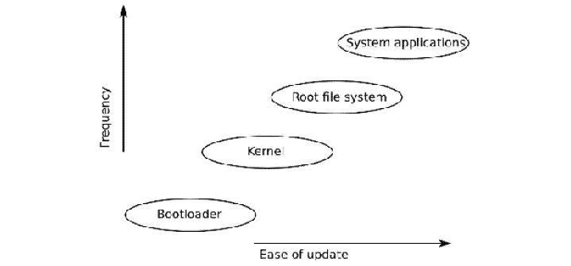
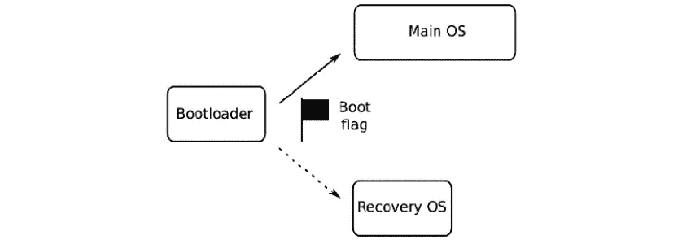
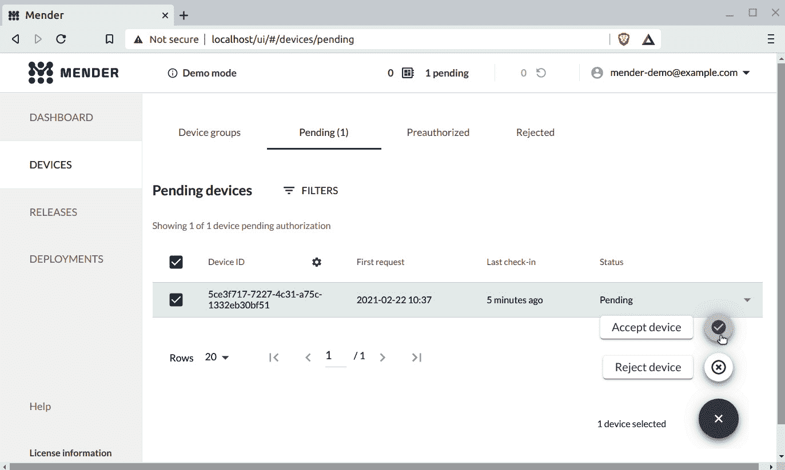
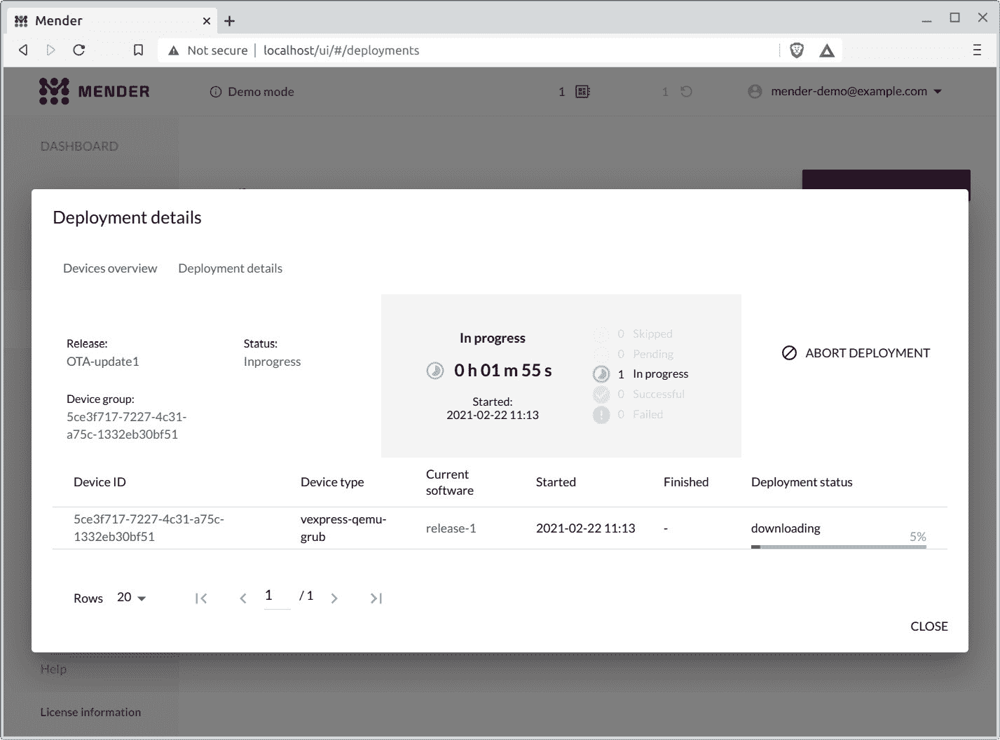
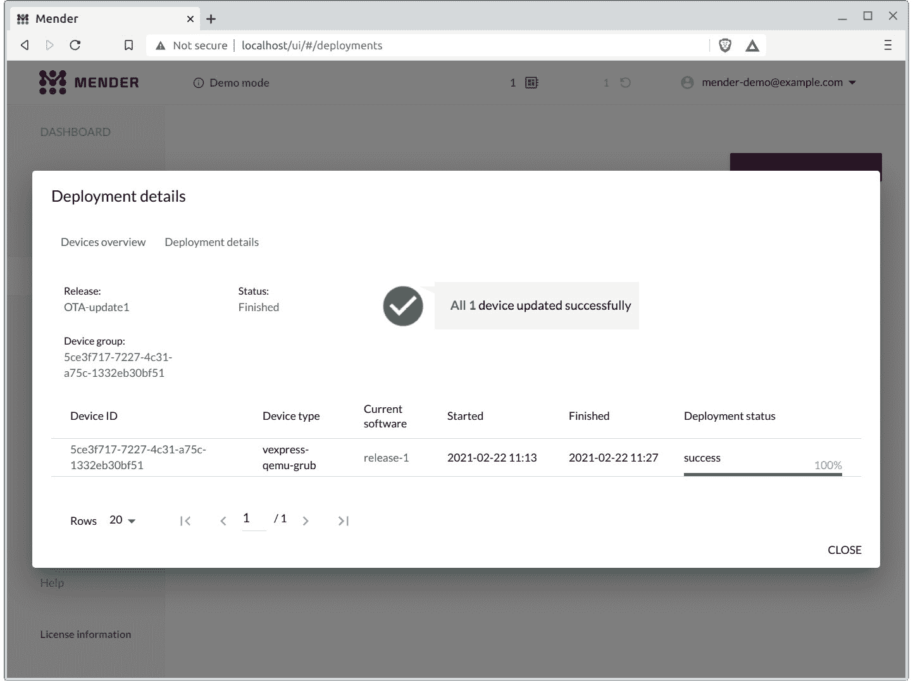
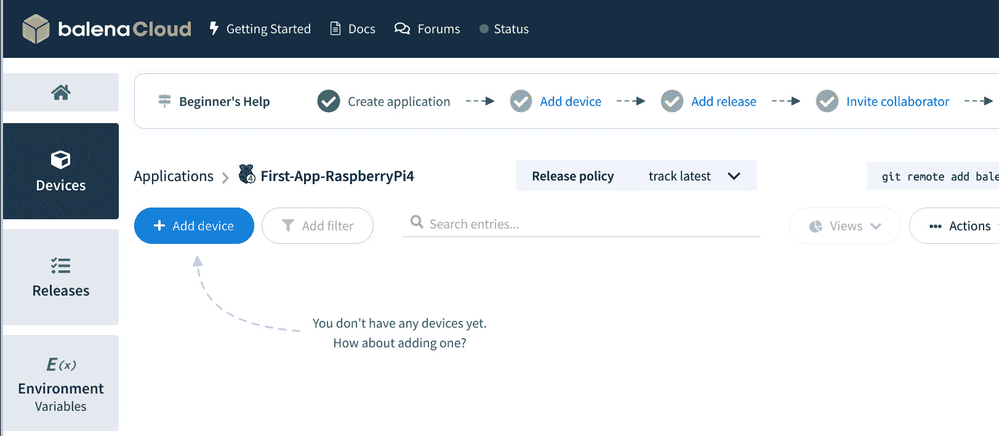
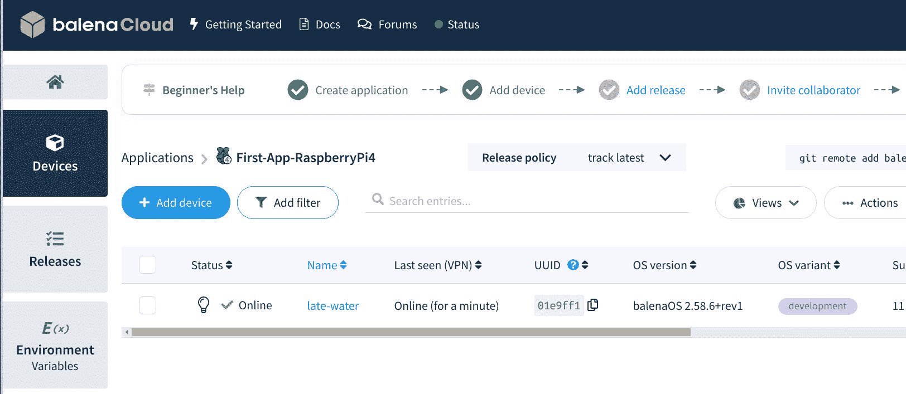

# 十、现场更新软件

在前面的章节中，我们讨论了为 Linux 设备构建软件的各种方法，以及如何为各种类型的大容量存储创建系统映像。 当您投入生产时，只需将系统镜像复制到闪存中，即可部署。 现在，我想考虑一下设备在第一批发货后的使用寿命。

随着我们进入*物联网*时代，我们创造的设备很可能通过互联网连接在一起。 与此同时，软件正变得越来越复杂。 更多的软件意味着更多的错误。 与互联网的连接意味着这些漏洞可以从远处被利用。 因此，我们有一个共同的要求，即能够在领域中更新软件*。 然而，软件更新带来了比修复错误更多的好处。 它们打开了为现有硬件增加价值的大门，方法是随着时间的推移提高系统性能或启用功能。*

在本章中，我们将介绍以下主题：

*   更新源自何处？
*   要更新的内容
*   软件更新的基础知识
*   更新机制的类型
*   OTA 更新
*   使用 Mender 进行本地更新
*   使用 Mender 进行 OTA 更新
*   使用 Whale 进行本地更新

# 技术要求

要按照示例操作，请确保您具备以下条件：

*   至少具有 60 GB 可用磁盘空间的基于 Linux 的主机系统
*   Yocto 3.1(邓费尔)LTS 版本
*   适用于 Linux 的蚀刻器
*   一种 microSD 卡读卡器和卡
*   覆盆子派 4
*   一种 5V 3A USB-C 电源
*   Wi-Fi 路由器

本章的*使用 Mender 进行本地更新*和*使用 Mender 进行 OTA 更新*一节需要 Yocto。

您应该已经为[*第 6 章*](06.html#_idTextAnchor164)，*选择构建系统*构建了 Yocto 的 3.1(Dunfall)LTS 发行版。 如果没有，请参考*Yocto Project Quick Build*指南([https://www.yoctoproject.org/docs/current/brief-yoctoprojectqs/brief-yoctoprojectqs.html](https://www.yoctoproject.org/docs/current/brief-yoctoprojectqs/brief-yoctoprojectqs.html))的*Compatible Linux Distribution*和*Build Host Packages*部分，然后根据[*第 6 章*](06.html#_idTextAnchor164)中的说明在您的 LINUX 主机上构建 Yocto。

本章的所有代码都可以在本书的 GitHub 存储库的`Chapter10`文件夹中找到：[https://github.com/PacktPublishing/Mastering-Embedded-Linux-Programming-Third-Edition](https://github.com/PacktPublishing/Mastering-Embedded-Linux-Programming-Third-Edition)。

# 更新源自何处？

有许多软件更新方法。 概括地说，我将它们描述为
如下：

*   本地更新，通常由技术人员执行，技术人员在
    便携式介质(如 USB 闪存驱动器或 SD 卡)上进行更新，并且必须单独访问每个系统
*   远程更新，其中更新由用户或技术人员在本地启动，但从远程服务器下载
*   **空中**(**OTA**)更新，其中更新是完全远程推送和管理的，不需要任何本地输入

我将首先描述几种软件更新的方法，然后我将展示一个使用渲染器([https://mender.io](https://mender.io))的示例。

# 要更新的内容

嵌入式 Linux 设备在设计和实现方面非常多样化。 但是，它们都有这些基本组件：

*   引导加载程序
*   果仁 / 核心 / 精髓
*   根文件系统
*   系统应用
*   特定于设备的数据

某些组件比其他组件更难更新，如下图所示：



图 10.1-更新的组件

让我们依次查看每个组件。

## 引导加载程序

引导加载器是处理器加电时运行的第一段代码。 处理器定位引导加载程序的方式非常特定于设备，但在大多数情况下，只有一个这样的位置，因此只能有一个引导加载程序。 如果没有备份，更新引导加载程序是有风险的：如果系统中途断电会发生什么情况？ 因此，大多数更新解决方案都不使用引导加载程序。 这不是一个大问题，因为引导加载程序在开机时只运行很短的时间，通常不是运行时错误的主要来源。

## 内核

Linux 内核是一个关键组件，肯定需要不时更新。

内核有几个部分：

*   引导加载程序加载的二进制映像，通常存储在根文件系统中。
*   许多设备还具有**设备树二进制文件**(**DTB**)，该文件向内核描述硬件，因此必须同步更新。 DTB 通常与内核二进制文件一起存储。
*   根文件系统中可能有内核模块。

内核和 DTB 可以存储在根文件系统中，只要引导加载程序能够读取该文件系统格式，或者它可以存储在专用分区中。 在任何一种情况下，拥有冗余副本都是可能的，也是更安全的。

## 根文件系统

根文件系统包含使系统工作所需的基本系统库、实用程序和脚本。 能够更换和升级所有这些都是非常理想的。 该机制取决于文件系统实现。

嵌入式根文件系统的常见格式如下：

*   Ramdisk，引导时从原始闪存或磁盘映像加载。 要更新它，只需覆盖 ramdisk镜像并重新启动。
*   存储在闪存分区中的只读压缩文件系统，如`squashfs`。 由于这些类型的文件系统不实现写入功能，因此更新它们的唯一方法是将完整的文件系统映像写入分区。
*   普通文件系统类型：对于原始闪存，JFFS2 和 UBIFS 格式很常见，而对于托管闪存，例如 eMMC 和 SD 卡，格式可能是 ext4 或 F2Fs。 因为这些文件在运行时是可写的，所以可以逐个文件地更新它们。

## 系统应用

系统应用是设备的主要有效负载；它们实现设备的主要功能。 因此，它们可能会频繁更新，以修复错误并添加功能。 它们可能与根文件系统捆绑在一起，但通常也会将它们
放在单独的文件系统中，以简化更新并保持系统文件(通常是开源的)和应用文件(通常是专有的)之间的分离。

## 特定于设备的数据

这是在运行时修改的文件的组合，包括配置设置、日志、用户提供的数据等。 它们并不经常需要更新，但在更新过程中确实需要保留。 这样的数据需要存储在它自己的分区中。

## 需要更新的组件

总之，更新可能包括新版本的内核、根文件系统和系统应用。 设备将具有不应被更新干扰的其他分区，就像设备运行时数据的情况一样。

软件更新失败的代价可能是灾难性的。 在企业和家庭互联网环境中，安全的软件更新也是一个主要问题。 在我们发货任何硬件之前，我们需要能够信心十足地更新软件。

# 软件更新的基础知识

乍一看，更新软件似乎是一项简单的任务：您只需要用新的副本覆盖一些文件。 但是当你开始意识到所有可能出错的事情时，你的工程师的培训就开始了。 如果在更新过程中断电了怎么办？ 如果在测试更新时看不到的错误导致一定比例的设备无法启动，该怎么办？ 如果第三方发送虚假更新，将您的设备登记为僵尸网络的一部分，该怎么办？ 软件更新机制至少必须是：

*   健壮，因此更新不会使设备不可用
*   故障保护，以便在所有其他方法都失败时有一个后备模式
*   安全，防止设备被安装
    未经授权更新的人员劫持

换句话说，我们需要一个不受墨菲定律影响的系统。墨菲定律指出，如果某件事可能出错，那么它最终也会出错。 然而，其中一些问题并不是微不足道的。 将软件部署到现场设备与将软件部署到云不同。 嵌入式 Linux 系统需要在没有任何人为干预的情况下检测和响应内核死机或引导循环等事故。

## 使更新更健壮

您可能认为更新 linux 系统的问题很久以前就已经解决了，−我们都有定期更新的 linux 桌面(不是吗？)。 此外，在数据中心中运行的大量 Linux 服务器也同样保持最新状态。 但是，服务器和设备之间是有区别的。 前者在受保护的环境中运作。 它不太可能突然断电或网络连接中断。 在更新失败的情况下，始终可以访问服务器并使用外部机制重复安装。

另一方面，设备通常部署在断断续续的电源和糟糕的网络连接的远程站点，这使得更新更有可能中断。 然后，考虑到，如果设备是山顶的环境监测站或控制海底油井的阀门，则访问该设备以对失败的更新采取补救措施可能是非常昂贵的，例如，如果该设备是位于山顶的环境监测站或控制海底油井的阀门，则访问该设备以对失败的更新采取补救措施可能是非常昂贵的。 因此，对于嵌入式设备来说，更重要的是要有一个健壮的更新机制，该机制不会导致系统变得不可用。

这里的关键词是**原子性**。 作为一个整体的更新必须是原子的：不应该有任何阶段来更新系统的一部分，但不应该有其他部分。 必须对切换到新软件版本的系统进行单一的、不可中断的更改。

这排除了最明显的更新机制：简单地更新单个文件的机制，例如，通过在文件系统的各个部分上提取归档文件。 如果系统在更新期间重置，则无法确保有一致的文件集。 即使使用包管理器(如`apt`、`yum`或`zypper`)也无济于事。 如果您查看所有这些包管理器的内部结构，就会发现它们确实能够正常工作，方法是在文件系统上提取一个归档文件，并在更新前后运行脚本来配置包。 包管理器适用于受保护的数据中心世界，甚至适用于您的桌面，但不适用于设备。

要实现原子性，更新必须与正在运行的系统一起安装，然后抛出一个开关以从旧系统切换到新系统。 在后面的部分中，我们将描述实现原子性的两种不同方法。 第一个是拥有根文件系统和其他主要组件的两个副本。 一个是实时的，而另一个可以接收更新。 更新完成后，将抛出开关，以便在重新启动时引导加载程序选择更新的副本。 这是称为**对称图像更新**或**A/B 图像更新**的。 此主题的一个变体是使用负责更新主操作系统的特殊**恢复模式**操作系统。 原子性的保证在引导加载程序和恢复操作系统之间共享。 这称为**非对称图像更新**。 这是在 Nougat 7.x 版本之前的 Android 中采取的方法。

第二种方法是将根文件系统的两个或多个副本放在系统分区的不同子目录中，然后在引导时使用`chroot(8)`选择其中一个副本。 Linux 运行后，更新客户端可以将更新安装到另一个根文件系统中，然后当一切都完成并检查完毕后，它可以启动开关并重新启动。 这被称为**原子文件更新**，并且由**OSTree**举例说明。

## 使更新具有故障保护功能

要考虑的下一个问题是从正确安装但包含停止系统引导的代码的更新中恢复。 理想情况下，我们希望系统检测到这种情况并恢复到以前的工作图像。

有几种故障模式可能导致系统无法运行。 第一种是内核死机，例如，由内核设备驱动程序中的错误或无法运行`init`程序引起。 明智的做法是将内核配置为在死机几秒钟后重新启动。 您可以通过设置`CONFIG_PANIC_TIMEOUT`来构建内核，也可以通过将内核命令行设置为死机来实现这一点。 例如，要在死机后 5 秒重新启动，需要在内核命令行中添加`panic=5`。

您可能希望更进一步，将内核配置为在 Oops 上死机。 请记住，Oops 是在内核遇到致命错误时生成的。 在某些情况下，它将能够从错误中恢复，在其他情况下则不能，但在所有情况下，都会出现问题，系统无法正常工作。 要在内核配置中启用 Oop 上的死机，请设置`CONFIG_PANIC_ON_OOPS=y`或在内核命令行上设置`oops=panic`。

第二种故障模式发生在内核成功启动`init`，但由于某种原因，主应用无法运行时。 要做到这一点，你需要一只看门狗。 **看门狗**是硬件或软件定时器，如果定时器在到期前未重置，则该定时器会重新启动系统。 如果您使用的是`systemd`，您可以使用内置的 Watchdog 函数，我将在[*第 13 章*](13.html#_idTextAnchor391)，*启动-init 程序*中介绍该函数。 如果没有，您可能希望启用 Linux 中内置的看门狗支持，如`Documentation/watchdog`中的内核源代码中所述。

两次故障都会导致**引导循环**：内核死机或看门狗超时都会导致系统重新引导。 如果问题仍然存在，系统将不断重新启动。 要跳出引导循环，我们需要引导加载程序中的一些代码来检测这种情况，并恢复到以前已知良好的版本。 一种典型的方法是使用**引导计数**，该计数在每次引导时由引导加载程序递增，一旦系统启动并运行，该计数在用户空间中被重置为零。 如果系统进入引导循环，则计数器不会复位，因此会继续增加。 然后，引导加载器被配置为在计数器超过阈值时采取补救措施。

在 U-Boot 中，这是由三个变量处理的：

*   `bootcount`：每次处理器启动时，该变量都会递增。
*   `bootlimit`：如果`bootcount`超过`bootlimit`，则 U-Boot 运行`altbootcmd`中的命令，而不是`bootcmd`中的命令。
*   `altbootcmd`：它包含其他引导命令，例如，回滚到软件的以前版本或启动恢复模式操作系统。

要实现这一点，必须有一种方法让用户空间程序重置引导计数。 我们可以使用 U-Boot 实用程序来实现这一点，这些实用程序允许在运行时访问 U-Boot 环境：

*   `fw_printenv`：打印 U-Boot 变量的值
*   `fw_setenv`：设置 U-Boot 变量的值

这两个命令需要知道 U-Boot 环境块存储在哪里，在`/etc/fw_env.config`中有一个配置文件。 例如，如果 U-Boot 环境存储在距 eMMC 内存起始位置`0x800000`的偏移量处，备份副本存储在`0x1000000`处，则配置将如下所示：

```sh
# cat /etc/fw_env.config
/dev/mmcblk0 0x800000 0x40000
/dev/mmcblk0 0x1000000 0x40000
```

在这一节中还有最后一件事要介绍。 在每次引导时增加引导计数，然后在应用开始运行时重置引导计数会导致不必要的环境块写入，耗尽闪存并减慢系统初始化。 为了避免在所有重新启动时都执行此操作，U-Boot 还有一个名为`upgrade_available`的变量。 如果`upgrade_available`为`0`，则`bootcount`不会递增。 在安装更新后将`upgrade_available`设置为`1`，以便仅在需要时才使用引导计数保护。

## 确保更新安全

最后一个问题与更新机制本身的潜在误用有关。 实现更新机制的主要目的是提供可靠的自动或半自动方法来安装安全补丁和新功能。 但是，其他人可能使用相同的机制来安装未经授权的软件版本，因此*劫持*设备。 我们需要看看如何才能确保这种情况不会发生。

最大的漏洞是假远程更新。 为了防止出现这种情况，我们需要在开始下载之前对更新服务器进行身份验证。 我们还需要一个安全的传输通道，如 HTTPS，以防止对下载流进行篡改。 稍后在描述 OTA 更新时，我会再谈到这一点。

还有一个问题是本地提供的更新的真实性。 检测虚假更新的一种方法是在引导加载程序中使用安全引导协议。 如果内核映像在出厂时使用数字密钥签名，则引导加载程序可以在加载内核之前检查密钥，如果密钥不匹配，则拒绝加载。 只要密钥由制造商保密，就不可能加载未经授权的内核。 U-Boot 实现了这样一种机制，在`doc/uImage.FIT/verified-boot.txt`中的 U-Boot 源代码中对此进行了描述。

重要音符

安全引导：好还是不好？

如果我购买了具有软件更新功能的设备，那么我相信该设备的供应商能够提供有用的更新。 我绝对不希望恶意的第三方在我不知情的情况下安装软件。 但是我应该被允许自己安装软件吗？ 如果我完全拥有该设备，我是否应该无权对其进行修改，包括加载新软件？ 回想一下 TiVo 机顶盒，它最终导致了 GPLv3 许可证的创建。 还记得 Linksys WRT54G Wi-Fi 路由器：当访问硬件变得容易时，它催生了一个全新的行业，包括 OpenWRT 项目。 例如，有关更多详细信息，请参见[https://www.wi-fiplanet.com/tutorials/article.php/3562391](https://www.wi-fiplanet.com/tutorials/article.php/3562391)。 这是一个位于自由和控制之间的十字路口的复杂问题。 我的观点是，一些设备制造商以安全为借口来保护他们有时粗制滥造的软件。

既然我们知道了需要什么，那么我们如何着手更新嵌入式 Linux 系统上的软件呢？

# 更新机制的类型

在本节中，我将描述三种应用软件更新的方法：对称(或 A/B)映像更新；非对称映像更新(也称为*恢复模式更新*)；最后是原子文件更新。

## 对称镜像更新

在该方案中，操作系统有个副本，每个副本包括 Linux 内核、根文件系统和系统应用。 它们在下图中标记为 A 和 B：


图 10.2-对称镜像更新

对称映像更新的工作方式如下：

1.  引导加载程序有一个标志，指示它应该加载哪个映像。 最初，该标志设置为 A，因此引导加载程序加载操作系统映像 A。
2.  要安装更新，作为操作系统一部分的更新程序应用会覆盖操作系统映像 B。
3.  完成后，更新程序将引导标志更改为 B 并重新引导。
4.  现在，引导加载程序将加载新的操作系统。
5.  当安装进一步的更新时，更新程序会覆盖映像 A 并将引导标志更改为 A，这样您就可以在两个副本之间进行乒乓操作。
6.  如果在更改引导标志之前更新失败，引导加载程序将继续加载良好的操作系统。

有几个开放源码项目实现了对称映像更新。 一个是在独立模式下运行的**Mender**客户端，我将在后面关于*使用 Mender 进行本地更新*一节中进行描述。 另一个是**SWUpdate**([https://github.com/sbabic/swupdate](https://github.com/sbabic/swupdate))。 SWUpdate 可以接收 CPIO 格式包中的多个映像更新，然后将这些更新部署到系统的不同部分。 它允许您用 Lua 语言编写插件来进行自定义处理。 它具有文件系统支持，用于作为 MTD 闪存分区访问的原始闪存、组织到 UBI 卷中的存储以及具有磁盘分区表的 SD/eMMC 存储。 第三个例子是**RAUC**，**健壮的自动更新控制器**，([https://github.com/rauc/rauc](https://github.com/rauc/rauc))。 它也支持原始闪存、UBI 卷和 SD/eMMC 设备。 可以使用 OpenSSL 密钥对图像进行签名和验证。 第四个例子是**https://github.com/fwup-home/fwup**([Fwup](https://github.com/fwup-home/fwup))，作者是 Buildroot 的长期撰稿人 Frank Hunleth。

这个计划有一些缺点。 一种是，通过更新整个文件系统映像，更新包的大小很大，这可能会给连接设备的网络基础设施带来压力。 这可以通过仅发送通过使用先前版本执行新文件系统的二进制`diff`而改变的文件系统块来缓解。 Mender 的商业版支持这样的增量更新，在撰写本文时，增量更新在 RAUC 和 Fwup 中还只是一个测试版功能。

第二个缺点是需要为根文件系统和其他组件的冗余副本保留存储空间。 如果根文件系统是最大的组件，那么它几乎是您需要安装的闪存容量的两倍。 正是出于这个原因，使用了非对称更新方案，下面我将对此进行描述。

## 非对称镜像更新

您可以通过将最小恢复操作系统纯粹用于更新主操作系统来减少存储需求，如下所示：



图 10.3-非对称镜像更新

要安装非对称更新，请执行以下操作：

1.  将引导标志设置为指向恢复操作系统并重新引导。
2.  一旦恢复操作系统运行，它就可以将更新流式传输到主操作系统映像。
3.  如果更新中断，引导加载程序将再次引导到恢复操作系统，恢复操作系统可以恢复更新。
4.  只有在更新完成并得到验证后，恢复操作系统才会清除引导标志并再次重新引导，这一次是加载新的主操作系统。
5.  正确但有错误的更新的备用方法是将系统重新置于恢复模式，该模式可以尝试补救操作，可能是通过请求更早的更新版本。

恢复操作系统通常比主操作系统小得多，可能只有几兆字节，因此存储开销不大。 有趣的是，这是 Android 在 Nougat 发布之前采用的方案。 对于非对称映像更新的开源实现，您可以考虑 SWUpdate 或 RAUC，我在上一节中提到了这两种方法。

该方案的主要缺点是在恢复 OS 运行时，设备不工作。 这样的方案还不允许更新恢复 OS 本身。 这将需要一些类似 A/B 映像更新的东西，从而使整个目的落空。

## 原子文件更新

另一种方法是将根文件系统的冗余副本放在单个文件系统的多个目录中，然后在引导时使用`chroot(8)`命令选择其中一个。 这允许更新一个目录树，同时将另一个目录树挂载为`root`目录。 此外，您可以使用链接，而不是复制在根文件系统的不同版本之间没有更改的文件。 这将节省大量磁盘空间，并减少更新包中要下载的数据量。 这些是原子文件更新背后的基本思想。

重要音符

`chroot`命令在现有目录中运行程序。 程序将此目录视为其`root`目录，因此无法访问更高级别的任何文件或目录。 它通常用于在受限环境中运行程序，有时也称为或**chroot jear**。

OSTree项目([libOSTree](https://ostree.readthedocs.org/en/latest/))现在改名为**https://ostree.readthedocs.org/en/latest/**，是这个想法最流行的实现。 OSTree 开始于 2011 年左右，作为向 GNOME 桌面开发人员部署更新的一种方式，并改善他们的持续集成测试([https://wiki.gnome.org/Projects/GnomeContinuous](https://wiki.gnome.org/Projects/GnomeContinuous))。 自那以后，它已被用作嵌入式设备的更新解决方案。 它是**汽车级 Linux**(**AGL**)中提供的更新方法之一，并且在 Yocto 项目中通过`meta-update`层提供，该层由**高级远程信息处理系统**(**ATS**)支持。

使用 OSTree，文件存储在目标系统的`/ostree/repo/objects`目录中。 它们的命名方式是同一文件的多个版本可以存在于存储库中。 然后，将一组给定的文件链接到一个部署目录，该目录的名称类似`/ostree/deploy/os/29ff9…/`。 这被称为*签出*，因为它与分支从 Git 存储库签出的方式有一些相似之处。 每个 Deploy目录都包含组成根文件系统的文件。 它们可以有任意数量，但默认情况下只有两个。 例如，下面是两个`deploy`目录，每个目录都有指向`repo`目录的链接：

```sh
/ostree/repo/objects/...
/ostree/deploy/os/a3c83.../
 /usr/bin/bash
 /usr/bin/echo
/ostree/deploy/os/29ff9.../
 /usr/bin/bash
 /usr/bin/echo
```

要从 OSTree 目录引导，请执行以下操作：

1.  引导加载程序使用`initramfs`引导内核，并在内核命令行上传递要使用的部署路径：

    ```sh
    bootargs=ostree=/ostree/deploy/os/deploy/29ff9...
    ```

2.  `initramfs`包含一个`init`程序`ostree-init`，该程序读取命令行并执行`chroot`到给定的路径。
3.  安装系统更新时，OSTree 安装代理将更改的文件下载到`repo`目录。
4.  完成后，将创建一个新的`deploy`目录，其中包含到将组成新根文件系统的文件集合的链接。 其中一些将是新文件，一些将与以前相同。
5.  最后，OSTree 安装代理将更改引导加载程序的引导标志，以便下次重新引导时，它将`chroot`转到新的`deploy`目录。
6.  引导加载器实现对引导计数的检查，如果检测到引导循环，则回退到前一个根。

即使开发人员可以操作更新程序或在目标设备上手动安装客户端，软件更新最终也需要通过无线方式自动进行。

# OTA 更新

空中更新**(**OTA**)意味着能够通过网络将软件推送到一个设备或一组设备，通常无需终端用户与该设备进行任何交互。 要实现这一点，我们需要一个中央服务器来控制更新过程，并需要一个用于将更新下载到更新客户端的协议。 在典型的实现中，客户端不时轮询更新服务器，以检查是否有任何更新挂起。 轮询间隔需要足够长，以便轮询流量不会占用很大一部分网络带宽，但需要足够短，以便能够及时传递更新。 几十分钟到几个小时的间隔通常是一个很好的折衷方案。 来自设备的轮询消息包含某种唯一标识符，例如序列号或 MAC 地址，以及当前软件版本。 由此，更新服务器可以查看是否需要更新。 轮询消息还可以包含其他状态信息，例如正常运行时间、环境参数或对设备集中管理有用的任何内容。**

 **更新服务器通常链接到管理系统，该管理系统将向其控制下的各种设备分配新版本的软件。 如果设备数量很大，它可能会批量发送更新，以避免网络过载。 将出现某种状态显示，其中可以显示设备的当前状态，并突出显示问题。

当然，更新机制必须是安全的，这样才不会向终端设备发送虚假更新。 这涉及到客户端和服务器能够通过交换证书来相互验证。 然后，客户端可以验证下载的包是否由预期的密钥签名。

以下是可用于 OTA 更新的三个开源项目示例：

*   处于托管模式的修理工
*   鲸鱼
*   EclipseHawkbit([https://github.com/eclipse/hawkbit](https://github.com/eclipse/hawkbit))与更新程序客户端(如 SWUpdate 或 RAUC)结合使用

我们将详细介绍前两个项目，从**Mender**开始。

# 使用 Mender 进行本地更新

这一理论到此为止。 在本章的下两节中，我希望演示我到目前为止谈到的原则是如何在实践中发挥作用的。 对于这些示例，我将使用 Mender。 Mainder 使用对称的 A/B 映像更新机制，并在更新失败时进行后备。 对于本地更新，它可以在*独立模式*下运行；对于 OTA 更新，它可以在*管理模式*下运行。 我将从独立模式开始。

Mainder 由mender.io([https://mender.io](https://mender.io))编写和支持。 在网站的文档部分有更多关于该软件的信息。 我不会在这里深入研究软件的配置，因为我的目的是说明软件更新的原则。 让我们从 Mender 客户端开始。

## 构建 Mender 客户端

Mender Client以 Yocto 元层的形式提供。 这些示例使用 Yocto 项目的 Dunfall 版本，它与我们在[*第 6 章*](06.html#_idTextAnchor164)，*选择构建系统*中使用的版本相同。

首先获取`meta-mender`层，如下所示：

```sh
$ git clone -b dunfell git://github.com/mendersoftware/meta-mender
```

在克隆`meta-mender`层之前，您希望导航到`poky`目录之上的一个级别，以便这两个目录位于同一级别的相邻两个目录中。

Mender 客户端需要对 U-Boot 的配置进行一些更改，以处理引导标志和引导计数变量。 Stock Mender 客户端层有这个 U-Boot 集成的示例实现的子层，我们可以直接使用它们，比如`metameta-mender-qemu`和`meta-mender-raspberrypi`。 我们将使用 QEMU。

下一步是创建构建目录并为此配置添加层：

```sh
$ source poky/oe-init-build-env build-mender-qemu
$ bitbake-layers add-layer ../meta-openembedded/meta-oe
$ bitbake-layers add-layer ../meta-mender/meta-mender-core
$ bitbake-layers add-layer ../meta-mender/meta-mender-demo
$ bitbake-layers add-layer ../meta-mender/meta-mender-qemu
```

然后，我们需要通过向`conf/local.conf`添加一些设置来设置环境：

```sh
1 MENDER_ARTIFACT_NAME = "release-1"
2 INHERIT += "mender-full"
3 MACHINE = "vexpress-qemu"
4 INIT_MANAGER = "systemd"
5 IMAGE_FSTYPES = "ext4"
```

行`2`包含名为`mender-full`的BitBake 类，它负责创建 A/B 图像格式所需的图像的特殊处理。 第`3`行选择名为`vexpress-qemu`的机器，该机器使用 QEMU 模拟 ARM 通用 Express 板，而不是 Yocto 项目中默认的通用 PB。 行`4`选择`systemd`作为`init`守护进程，而不是默认的 system V`init`。 我在[*第 13 章*](13.html#_idTextAnchor391)，*启动-init 程序*中更详细地描述了`init`守护进程。 行`5`使根文件系统映像以`ext4`格式生成。

现在我们可以构建一个映像：

```sh
$ bitbake core-image-full-cmdline
```

与往常一样，构建的结果在`tmp/deplimg/vexpress-qemu`中。 您会注意到，与我们过去完成的 Yocto 项目构建相比，这里有一些新的东西。 有一个名为`core-image-full-cmdline-vexpress-qemu-grub-[timestamp].mender`的文件，还有一个以`.uefiimg`结尾的同名文件。
下一小节*安装更新*需要`.mender`文件。 `.uefiimg`文件是使用名为`wic`的 Yocto 项目中的工具创建的。 输出是包含分区表的图像
，可以直接复制到 SD 卡或
eMMC 芯片。

我们可以使用 Mender 层提供的脚本运行 qemu目标，该脚本将首先引导 U-Boot，然后加载 Linux 内核：

```sh
$ ../meta-mender/meta-mender-qemu/scripts/mender-qemu
[…]
[  OK  ] Started Mender OTA update service.
[  OK  ] Started Mender Connect service.
[  OK  ] Started NFS status monitor for NFSv2/3 locking..
[  OK  ] Started Respond to IPv6 Node Information Queries.
[  OK  ] Started Network Router Discovery Daemon.
[  OK  ] Reached target Multi-User System.
         Starting Update UTMP about System Runlevel Changes...
Poky (Yocto Project Reference Distro) 3.1.6 vexpress-qemu ttyAMA0
vexpress-qemu login:
```

如果您看到的不是登录提示，而是如下所示的错误：

```sh
mender-qemu: 117: qemu-system-arm: not found
```

然后在您的系统上安装`qemu-system-arm`并重新运行脚本：

```sh
$ sudo apt install qemu-system-arm
```

以`root`身份登录，无需密码。 查看目标上的分区布局，我们可以看到以下内容：

```sh
# fdisk -l /dev/mmcblk0
Disk /dev/mmcblk0: 608 MiB, 637534208 bytes, 1245184 sectors
Units: sectors of 1 * 512 = 512 bytes
Sector size (logical/physical): 512 bytes / 512 bytes
I/O size (minimum/optimal): 512 bytes / 512 bytes
Disklabel type: gpt
Disk identifier: 15F2C2E6-D574-4A14-A5F4-4D571185EE9D
Device          Start     End Sectors  Size Type
/dev/mmcblk0p1  16384   49151   32768   16M EFI System
/dev/mmcblk0p2  49152  507903  458752  224M Linux filesystem
/dev/mmcblk0p3 507904  966655  458752  224M Linux filesystem
/dev/mmcblk0p4 966656 1245150  278495  136M Linux filesystem
```

总共有四个个分区：

*   **分区 1**：这包含 U-Boot 引导文件。
*   **分区 2 和 3**：它们包含 A/B 根文件系统：在此阶段，它们
    是相同的。
*   **分区 4**：这只是包含其余分区的扩展分区。

运行`mount`命令显示第二个分区用作根文件系统，第三个分区接收更新：

```sh
# mount
/dev/mmcblk0p2 on / type ext4 (rw,relatime)
[…]
```

现在有了 Mender 客户端，我们就可以开始安装更新了。

# 安装更新

现在，我们希望更改根文件系统，然后将其作为更新安装：

1.  打开另一个 shell并将自己放回工作构建目录：

    ```sh
    $ source poky/oe-init-build-env build-mender-qemu
    ```

2.  Make a copy of the image we just built. This will be the live image that we are going to update:

    ```sh
    $ cd tmp/deplimg/vexpress-qemu
    $ cp core-image-full-cmdline-vexpress-qemu-grub.uefiimg \
    core-image-live-vexpress-qemu-grub.uefiimg 
    $ cd -
    ```

    如果我们不这样做，QEMU 脚本将只加载 BitBake 生成的最新图像(包括更新)，这违背了演示的目的。

3.  接下来，更改目标的主机名，在安装时很容易看到这一点。 为此，请编辑`conf/local.conf`并添加以下行：

    ```sh
    hostname_pn-base-files = "vexpress-qemu-release2"
    ```

4.  Now we can build the image in the same way as before:

    ```sh
    $ bitbake core-image-full-cmdline
    ```

    这一次我们对包含完整新图像的`.uefiimg`文件不感兴趣。 相反，我们只希望采用`core-image-full-cmdline-vexpress-qemu-grub.mender`中的新根文件系统。 `.mender`文件采用 Mender 客户端可识别的格式。 `.mender`文件格式由压缩的`.tar`归档中的版本信息、头文件和根文件系统映像组成。

5.  下一步是将新构件部署到目标，在设备上本地启动更新，但从服务器接收更新。 通过输入*Ctrl*+*A*，然后输入*x*来终止您在前一个终端会话中启动的仿真器。 然后使用新复制的映像

    ```sh
    $ ../meta-mender/meta-mender-qemu/scripts/mender-qemu \
    core-image-live
    ```

    再次启动 QEMU
6.  检查网络是否已配置，QEMU 位于`10.0.2.15`，主机位于`10.0.2.2`：

    ```sh
    # ping 10.0.2.2
    PING 10.0.2.2 (10.0.2.2) 56(84) bytes of data.
    64 bytes from 10.0.2.2: icmp_seq=1 ttl=255 time=0.286 ms
    ^C
    --- 10.0.2.2 ping statistics ---
    1 packets transmitted, 1 received, 0% packet loss, time 0ms
    rtt min/avg/max/mdev = 0.286/0.286/0.286/0.000 ms
    ```

7.  Now, in another terminal session, start a web server on the host that can serve up the update:

    ```sh
    $ cd tmp/deplimg/vexpress-qemu
    $ python3 -m http.server
    Serving HTTP on 0.0.0.0 port 8000 (http://0.0.0.0:8000/) ...
    ```

    它正在端口`8000`上侦听。 使用完 Web 服务器后，键入*Ctrl*+*C*将其终止。

8.  Back on the target, issue this command to get the update:

    ```sh
    # mender --log-level info install \
    > http://10.0.2.2:8000/core-image-full-cmdline-vexpress-qemu-grub.mender
    INFO[0751] Wrote 234881024/234881024 bytes to the inactive partition 
    INFO[0751] Enabling partition with new image installed to be a boot candidate: 3 
    ```

    更新被写入第三个分区`/dev/mmcblk0p3`，而我们的根文件系统仍在分区 2`mmcblk0p2`上。

9.  Reboot QEMU by entering *reboot* from the QEMU command line. Note that now the root filesystem is mounted on partition 3, and that the hostname has changed:

    ```sh
    # mount
    /dev/mmcblk0p3 on / type ext4 (rw,relatime)
    […]
    # hostname
    vexpress-qemu-release2
    ```

    成功了！

10.  还有一件事要做。 我们需要考虑引导循环的问题。 使用`fw_printenv`查看 U-Boot 变量，我们可以看到以下内容：

    ```sh
    # fw_printenv upgrade_available
    upgrade_available=1
    # fw_printenv bootcount
    bootcount=1
    ```

如果系统在没有清除`bootcount`的情况下重新启动，U-Boot 应该会检测到它并回退到以前的安装。

让我们测试 U-Boot 的回退行为：

1.  立即重新启动目标。
2.  当目标再次启动时，我们看到 U-Boot 已恢复到
    以前的安装：

    ```sh
    # mount
    /dev/mmcblk0p2 on / type ext4 (rw,relatime) 
    […]
    # hostname
    vexpress-qemu
    ```

3.  现在，让我们重复更新过程：

    ```sh
    # mender --log-level info install \
    > http://10.0.2.2:8000/core-image-full-cmdline-vexpress-qemu-grub.mender
    # reboot
    ```

4.  但这一次，在重新启动后，`commit`更改：

    ```sh
    # mender commit
    […]
    # fw_printenv upgrade_available
    upgrade_available=0
    # fw_printenv bootcount        
    bootcount=1 
    ```

5.  清除`upgrade_available`后，U-Boot 将不再检查`bootcount`和，因此设备将继续挂载此更新的根文件系统。 加载进一步更新时，渲染客户端将清除`bootcount`并再次设置`upgrade_available`。

此示例从命令行使用 Mender 客户端在本地启动更新。 更新本身来自一台服务器，但也可以很容易地通过 USB 闪存驱动器或 SD 卡提供。 我们可以使用上面提到的其他镜像更新客户端来代替 Mender：SWUpdate 或 RAUC。 它们各有优势，但基本技术是相同的。

下一阶段是看看 OTA 更新在实践中是如何工作的。

# 使用 Mender 进行 OTA 更新

同样，我们将在设备上使用 Mender 客户端，但这一次在*管理模式*下操作它，此外，我们将配置一个服务器来部署更新，这样就不需要本地交互了。 Mainder 为此提供了一个开源服务器。 有关如何设置此演示服务器的文档，请参阅[https://docs.mender.io/2.4/getting-started/on-premise-installation](https://docs.mender.io/2.4/getting-started/on-premise-installation)。

安装需要安装 Docker Engine 版本19.03 或更高版本。 请参阅 Docker 网站[https://docs.docker.com/engine/installation](https://docs.docker.com/engine/installation)。 它还需要 Docker compose version1.25 或更高版本，如下所述：[https://docs.docker.com/compose/install/](https://docs.docker.com/compose/install/)。

要验证系统上安装了哪些版本的 Docker 和 Docker，请使用以下命令：

```sh
$ docker --version
Docker version 19.03.8, build afacb8b7f0
$ docker-compose --version
docker-compose version 1.25.0, build unknown
```

渲染服务器还需要一个名为`jq`的命令行 JSON 解析器：

```sh
$ sudo apt install jq
```

一旦全部安装了，然后安装 Mender 集成环境，如下所示：

```sh
$ curl -L \
https://github.com/mendersoftware/integration/archive/2.5.1.tar.gz | tar xz
$ cd integration-2.5.1
$ ./demo up
Starting the Mender demo environment...
[…]
Creating a new user...
****************************************
Username: mender-demo@example.com
Login password: D53444451DB6
****************************************
Please keep the password available, it will not be cached by the login script.
Mender demo server ready and running in the background. Copy credentials above and log in at https://localhost
Press Enter to show the logs.
Press Ctrl-C to stop the backend and quit.
```

运行`./demo up`脚本时，您将看到它下载了几百兆字节的Docker 图像，这可能需要一些时间，具体取决于您的互联网连接速度。 一段时间后，您将看到它创建了一个新的演示用户和密码。 这意味着服务器已启动并正在运行。

现在，Mender Web 界面在 https://localhost/，上运行，将 Web 浏览器指向该 URL 并接受弹出的证书警告。 出现该警告是因为 Web 服务正在使用浏览器无法识别的自签名证书。 在登录页面中输入由 Mender 服务器生成的用户名和密码。

我们现在需要更改目标的配置，以便它将轮询本地服务器以获取更新。 在本演示中，我们通过在`hosts`文件中添加一行将`docker.mender.io`和`s3.docker.mender.io`服务器 URL 映射到地址`localhost`。 要使用 Yocto 项目进行此更改，请执行以下操作：

1.  首先，在克隆 Yocto 的目录上导航一级。
2.  接下来，使用一个附加到创建`hosts`文件的配方(即`recipes-core/base-files/base-files_3.0.14.bbappend`)的文件创建一个层。 在`MELP/Chapter10/meta-ota`中已经有一个合适的层可以复制：

    ```sh
    $ cp -a melp3/Chapter10/meta-ota .
    ```

3.  获取工作构建目录：

    ```sh
    $ source poky/oe-init-build-env build-mender-qemu
    ```

4.  Add the `meta-ota` layer:

    ```sh
    $ bitbake-layers add-layer ../meta-ota
    ```

    您的层结构现在应该包含八个层，包括`meta-oe`、`meta-mender-core`、`meta-mender-demo`、`meta-mender-qemu`和`meta-ota`。

5.  使用以下命令构建新映像：

    ```sh
    $ bitbake core-image-full-cmdline
    ```

6.  那就复印一份。 这将成为我们在此部分的实时图像：

    ```sh
    $ cd tmp/deplimg/vexpress-qemu
    $ cp core-image-full-cmdline-vexpress-qemu-grub.uefiimg \
    core-image-live-ota-vexpress-qemu-grub.uefiimg 
    $ cd -
    ```

7.  Boot up the live image:

    ```sh
    $ ../meta-mender/meta-mender-qemu/scripts/mender-qemu \
    core-image-live-ota
    ```

    几秒钟后，您将看到一个新设备出现在 Web 界面的**仪表板**上。 这发生得如此之快，因为为了演示系统，已经将 Mender 客户端配置为每 5 秒轮询服务器一次。 生产中将使用更长的轮询间隔：建议为 30 分钟。

8.  See how this polling interval is configured by looking at the `/etc/mender/mender.conf` file on the target:

    ```sh
    # cat /etc/mender/mender.conf 
    {
        "InventoryPollIntervalSeconds": 5,
        "RetryPollIntervalSeconds": 30,
        "ServerURL": "https://docker.mender.io",
        "TenantToken": "dummy",
        "UpdatePollIntervalSeconds": 5
    } 
    ```

    还请注意其中的服务器 URL。

9.  Back in the web UI, click on the green check mark to authorize the new device:

    

    图 10.4-接受设备

10.  然后单击该设备的条目以查看详细信息。

现在，我们可以再次创建更新并部署它-这一次是，即 OTA：

1.  更新`conf/local.conf`中的以下行，如下所示：

    ```sh
    MENDER_ARTIFACT_NAME = "OTA-update1"
    ```

2.  Build the image once again:

    ```sh
    $ bitbake core-image-full-cmdline
    ```

    这将在`tmp/deplimg/vexpress-qemu`中生成一个新的`core-image-full-cmdline-vexpress-qemu-grub.mender`文件。

3.  打开**Releases**选项卡，然后单击左下角的紫色**Upload**按钮，将其导入 Web 界面。
4.  浏览`tmp/deplimg/vexpress-qemu`中的`core-image-full-cmdline-vexpress-qemu-grub.mender`文件并上传：


图 10.5-上传人工产物

Mender 服务器应该将文件复制到服务器数据存储中，名称为的新工件**OTA-update1**应该出现在**Releases**下的。

要将更新部署到我们的 QEMU 设备，请执行以下操作：

1.  单击**Devices**选项卡并选择该设备。
2.  单击设备信息右下角的**Create a Deployment for this Device**选项。
3.  Select the **OTA-update1** artifact from the **Releases** page and click on the **Create Deployment with this Release** button:

    

    图 10.6-创建展开

4.  在
    **创建展开**的**选择目标软件和设备**步骤中，单击**下一步**按钮上的。
5.  单击**Create a Deployment**的**Review and Create**步骤中的**Create**按钮开始部署。
6.  The deployment should shortly transition from **Pending** to **In progress**:

    

    图 10.7-正在进行中

7.  大约13 分钟后，Mender 客户端应该已经将更新写入备用文件系统映像，然后 QEMU 将重新引导并提交更新。 然后，Web 用户界面应报告**已完成**，现在客户端正在运行**OTA-Update1**：



图 10.8-设备已成功更新

Mainder整洁，并在许多商业产品中使用，但是有时我们只是想尽快将一个软件项目部署到一小批流行的开发主板上。

给小费 / 翻倒 / 倾覆

在对 Mender 服务器进行了几次试验之后，您可能希望清除状态并重新开始。 您可以使用在`integration2.5.1/`目录中输入的这两个命令来执行此操作：

`./demo down`

`./demo up`

快速的应用开发是**Balena**的亮点。 我们将在本章的剩余部分使用 Balena 将一个简单的 Python 应用部署到 Raspberry PI 4。

# 使用 Balena 进行本地更新

Balena 使用个 Docker 容器部署软件更新。 设备运行的是 balenaOS，这是一个基于 Yocto 的 Linux 发行版，它附带了 Balena 的 Docker 兼容容器引擎 balenaEngine。 OTA 更新通过从 BalenaCloud 推送的版本自动发生，BalenaCloud 是一种用于管理设备群的托管服务。 Balena 还可以在*本地模式*下运行，因此更新来自本地主机上运行的服务器，而不是云。 在接下来的练习中，我们将坚持本地模式。

Balena 由balena.io([https://balena.io](https://balena.io))编写和支持。 位于[balena.io](http://balena.io)的在线*文档*的*参考*部分提供了更多有关该软件的信息。 我们不会深入研究 Balena 是如何工作的，因为我们的目标是在少量设备上部署和自动更新软件，以实现快速开发。

Balena 为流行的开发板(如 Raspberry Pi 4 和 Beaglebone Black)提供预置的 balenaOS 图像。 下载这些图像需要BalenaCloud 帐户。

## 创建帐户

即使您只打算在本地模式下操作 In，您也需要做的第一件事是注册一个 BalenaCloud 帐户。 您可以通过访问[https://dashboard.balena-cloud.com/signup](https://dashboard.balena-cloud.com/signup)并输入您的电子邮件地址和密码来执行此操作，如下所示：


图 10.9-BalenaCloud 注册

单击**注册**按钮提交表单，一旦完成处理，系统将提示您输入个人资料详细信息。 您可以选择跳过此表单，然后您将进入新帐户下的 BalenaCloud 仪表板。

如果您注销或您的会话到期，您可以导航到[https://dashboard.balena-cloud.com/login](https://dashboard.balena-cloud.com/login)并输入您注册时使用的电子邮件地址和密码，从而重新登录仪表板。

## 创建应用

在将 RaspberryPI 4 添加到 BalenaCloud 帐户之前，我们首先需要创建
应用。


图 10.10-创建应用

以下是在 BalenaCloud 上为 Raspberry PI 4 创建应用的步骤：

1.  使用您的电子邮件地址和密码登录到 BalenaCloud 仪表板。
2.  单击左上角**应用**下的**创建应用**按钮，打开**创建应用**对话框。
3.  输入新应用的名称，然后选择**Raspberry PI 4**作为**默认
    设备类型**。
4.  在**创建应用**对话框中的**创建新应用**按钮上单击以提交表格。

**应用类型**默认为**Starter**，这对于这些练习来说很好。 您的新应用应该出现在**应用**下的 BalenaCloud 仪表板中。

## 添加设备

现在我们在 BalenaCloud 上有了一个应用，让我们向其添加一个 Raspberry PI 4：

1.  使用您的电子邮件地址和密码登录到 BalenaCloud 仪表板。
2.  单击我们创建的新应用。
3.  Click on the **Add device** button from the **Devices** page:

    

    图 10.11-添加设备

4.  点击按钮将调出**添加新设备**对话框。
5.  确保选定的设备类型为**覆盆子 PI 4**。 该选项应该已经选中，因为您创建的应用使用**Raspberry PI 4**作为**默认设备类型**。
6.  确保**BalenaOS**是选定的操作系统。
7.  确保所选的 BalenaOS 版本是最新版本。 该选项应已选中，因为**添加新设备**默认为最新的 BalenaOS 可用版本，并将其指定为**建议的**。
8.  选择**开发**作为 BalenaOS 的版本。 需要开发映像才能启用本地模式，以便更好地进行测试和故障排除。
9.  为**网络连接**选择**Wifi+以太网**。 你可以只选择**以太网**，但自动连接到 Wi-Fi 是一个非常方便的功能。
10.  Enter your Wi-Fi router's SSID and passphrase in their respective fields. Replace `RT-AC66U_B1_38_2G` in the following screenshot with your Wi-Fi router's SSID:

    

    图 10.12-添加新设备

11.  单击**下载 BalenaOS**按钮。
12.  将压缩的图像文件保存到主机。

我们现在有了一个microSD 卡映像，我们可以使用它为您的应用的测试团队提供任意数量的 Raspberry PI 4。

现在您应该熟悉从主机配置 Raspberry PI 4 的步骤了。 找到您从 balenaCloud 下载的 balenaOS`img.zip`文件，并使用 Etcher 将其写入 microSD 卡。 将 microSD 卡插入 Raspberry PI 4 并通过 USB-C 端口通电。

需要一两分钟时间，Raspberry PI 4 才会出现在您的 BalenaCloud 仪表板的**Devices**页面上：



图 10.13-设备

现在我们已经将 Raspberry PI 4 连接到 Balena 应用，我们需要启用本地模式，以便可以从附近的主机(而不是云)为其部署 OTA 更新：

1.  从 BalenaCloud 仪表板的**Devices**页面单击目标 Raspberry PI 4。 我的设备名为**Late-Water**。 你的名字就不一样了。
2.  点击设备仪表板上 Raspberry PI 4 灯泡旁边的向下箭头。
3.  从下拉菜单中选择**启用本地模式**：


图 10.14-启用本地模式

启用本地模式后，设备仪表板中的**日志**和**终端**面板将不再可用。 设备状态从**在线(N 分钟)**变为**在线(本地模式)**。

现在我们的目标设备上启用了本地模式，我们几乎已经准备好在其中部署一些代码。 在此之前，我们需要安装 Balena CLI。

## 安装 CLI

以下是在 Linux 主机计算机上安装 Balena CLI 的说明：

1.  打开 Web 浏览器并导航到[https://github.com/balena-io/balena-cli/releases/latest](https://github.com/balena-io/balena-cli/releases/latest)上的最新 Balena CLI 版本页面。
2.  单击 Linux 的最新 ZIP 文件进行下载。 查找格式为`balena-cli-vX.Y.Z-linux-x64-standalone.zip`的文件名，用主版本号、次版本号和补丁版本号替换`X`、`Y`和`Z`。
3.  Extract the zip file contents to your home directory:

    ```sh
    $ cd ~
    $ unzip Downloads/balena-cli-v12.25.4-linux-x64-standalone.zip
    ```

    提取的内容包含在`balena-cli`目录中。

4.  Add the `balena-cli` directory to your `PATH` environment variable:

    ```sh
    $ export PATH=$PATH:~/balena-cli
    ```

    如果希望保留对`PATH`变量的更改，请在您的主目录中的`.bashrc`文件中添加如下一行。

5.  Verify that the installation was successful:

    ```sh
    $ balena version
    12.25.4
    ```

    撰写本文时，Balena CLI 的最新版本是 12.25.4。

现在我们有了一个工作正常的 Balena CLI，让我们扫描本地网络，查找我们配置的 Raspberry PI 4：

```sh
$ sudo env "PATH=$PATH" balena scan
Reporting scan results
- 
  host:          01e9ff1.local
  address:       192.168.50.129
  dockerInfo: 
    Containers:        1
    ContainersRunning: 1
    ContainersPaused:  0
    ContainersStopped: 0
    Images:            2
    Driver:            overlay2
    SystemTime:        2020-10-26T23:44:44.37360414Z
    KernelVersion:     5.4.58
    OperatingSystem:   balenaOS 2.58.6+rev1
    Architecture:      aarch64
  dockerVersion: 
    Version:    19.03.13-dev
    ApiVersion: 1.40
```

请注意 scan输出中的主机名`01e9ff1.local`和 IP 地址`192.168.50.129`。 Raspberry PI 4 的主机名和 IP 地址会有所不同。 记录这两条信息，因为我们在剩下的练习中需要它们。

## 推送项目

让我们通过本地网络将一个 Python 项目推送到Raspberry PI：

1.  克隆一个项目，创建一个简单的“Hello World！” Python Web 服务器：

    ```sh
    $ git clone https://github.com/balena-io-examples/balena-python-hello-world.git
    ```

2.  导航到项目目录：

    ```sh
    $ cd balena-python-hello-world
    ```

3.  Push the code to your Raspberry Pi 4:

    ```sh
    $ balena push 01e9ff1.local
    ```

    用设备的主机名替换`01e9ff1.local`参数。

4.  等待 Docker 镜像构建完成并启动，让应用在前台运行，以便记录到`stdout`。
5.  从 Web 浏览器向位于[https://192.168.50.129](https://192.168.50.129)的 Web 服务器发出请求。 用您设备的 IP 地址替换`192.168.50.129`。

运行在 Raspberry PI 4 上的 Web 服务器应该响应“Hello World！” 并且在`balena push`的实时输出中应该出现如下所示的行：

```sh
[Logs]    [10/26/2020, 5:26:35 PM] [main] 192.168.50.146 - - [27/Oct/2020 00:26:35] "GET / HTTP/1.1" 200 -
```

日志条目中的 IP 地址应该是发出 Web 请求的计算机的 IP 地址。 每次刷新网页时都会出现一个新的日志条目。 要停止跟踪日志并返回 shell，请输入*Ctrl*+*C*。 容器将继续在目标设备和“Hello World！”上运行。 Web 服务器将继续为请求提供服务。

通过发出以下命令，我们可以随时重新开始跟踪日志：

```sh
$ balena logs 01e9ff1.local
```

用设备的主机名替换`01e9ff1.local`参数。

这个简单 Web 服务器的源代码可以在项目目录中名为`main.py`的文件中找到：

```sh
tree
.
├── Dockerfile.template
├── img
│   ├── enable-public-URLs.png
│   └── log-output.png
├── README.md
├── requirements.txt
└── src
    └── main.py
```

现在让我们稍微修改一下项目源代码并重新部署：

1.  在您喜欢的编辑器中打开`src/main.py`。
2.  将`'Hello World!'`替换为`'Hello from Pi 4!'`并保存更改。 以下`git diff`输出捕获更改：

    ```sh
    $ git diff
    diff --git a/src/main.py b/src/main.py
    index 940b2df..26321a1 100644
    --- a/src/main.py
    +++ b/src/main.py
    @@ -3,7 +3,7 @@ app = Flask(__name__)

     @app.route('/')
     def hello_world():
    -    return 'Hello World!'
    +    return 'Hello from Pi 4!'

     if __name__ == '__main__':
         app.run(host='0.0.0.0', port=80)
    ```

3.  Push the new code to your Raspberry Pi 4:

    ```sh
    $ balena push 01e9ff1.local
    ```

    用设备的主机名替换`01e9ff1.local`参数。

4.  等待 Docker 镜像更新。 这一次的过程应该会快得多，因为有一个名为**Livepush**的智能缓存特性，该特性是本地模式所特有的。
5.  从 Web 浏览器向位于[https://192.168.50.129](https://192.168.50.129)的 Web 服务器发出请求。 用您设备的 IP 地址替换`192.168.50.129`。

在 Raspberry PI 4 上运行的 Web 服务器应该响应“Hello from PI 4！”

我们可以通过 IP 地址通过 SSH 连接到本地目标设备：

```sh
$ balena ssh 192.168.50.129
Last login: Tue Oct 27 00:32:04 2020 from 192.168.50.146
root@01e9ff1:~#
```

用您设备的 IP 地址替换`192.168.50.129`。 这不是特别有用，因为应用在 Docker 容器内运行。

要通过 SSH 连接到运行 Python Web 服务器的容器并观察它在做什么，我们需要在`balena ssh`命令中包含服务名称：

```sh
$ balena ssh 192.168.50.129 main
root@01e9ff1:/usr/src/app# ls
Dockerfile  Dockerfile.template  README.md  requirements.txt  src
root@01e9ff1:/usr/src/app# ps -ef
UID        PID  PPID  C STIME TTY          TIME CMD
root         1     0  0 00:26 pts/0    00:00:01 /usr/local/bin/python -u src/main.py
root        30     1  0 00:26 ?        00:00:00 /lib/systemd/systemd-udevd --daemon
root        80     0  2 00:48 pts/1    00:00:00 /bin/bash
root        88    80  0 00:48 pts/1    00:00:00 ps -ef
#
```

此启动应用的服务名称为`main`，如实时日志输出所示。

祝贺你!。 您已经成功地创建了 BalenaOS 映像和宿主开发环境，您和您的团队可以使用它们来迭代项目代码并快速重新部署到目标设备。 这不是一个小壮举。 以 Docker 容器的形式推送代码变更是全栈工程师非常习惯的常见开发流程。 有了 Balena，他们现在可以使用他们熟悉的技术在实际硬件上开发嵌入式 Linux 应用。

# 摘要

能够更新现场设备上的软件至少是一个有用的属性，如果设备连接到互联网，它就成为绝对必须的。 然而，在假设这不是一个很难解决的问题的前提下，它往往会被保留到项目的最后部分。 在这一章中，我希望我已经说明了与设计一个有效和健壮的更新机制相关的问题，而且还有几个开放源码选项可供选择。 你再也不需要重新发明轮子了。

最常用的方法，也是具有最多实际测试的方法，是对称映像(A/B)更新，或其近亲非对称(恢复)映像更新。 在这里，您可以选择 SWUpdate、RAUC、Mender 和 fwup。 最近的一项创新是原子文件更新，其形式为 OSTree。 这在减少需要下载的数据量和需要安装在目标上的冗余存储量方面具有良好的特点。 最后，随着 Docker 的激增，人们对集装式软件更新的需求也随之而来。 这就是巴雷纳采取的方法。

通过访问每个站点并应用 USB 记忆棒或 SD 卡中的更新来小规模部署更新是很常见的。 但是，如果您想要部署到远程位置或大规模部署，则需要**空中**(**OTA**)更新选项。

下一章将介绍如何通过使用设备驱动程序来控制系统的硬件组件，既包括作为内核一部分的传统意义上的驱动程序，也包括您可以从用户空间控制硬件的程度。**