# 十二、使用分线板的原型

定制电路板是嵌入式 Linux 工程师一次又一次被要求做的事情。 一家消费电子产品制造商想要制造一款新设备，而该设备往往需要运行 Linux。 Linux 映像的组装过程通常在硬件准备好之前就开始了，并使用从开发板和分支板连接在一起的原型来完成。 需要将外围 I/O 引脚多路复用到设备树绑定中，才能进行正常通信。 只有这样，为应用编写中间件的任务才能开始。

本章的目标是为 Beaglebone Black 添加一个 u-blox GPS 模块。 这需要阅读原理图和数据表，以便可以使用 Texas Instruments 的**SysConfig**工具生成对设备树源的必要修改。 接下来，我们将把 SparkFun GPS 转接板连接到 Beaglebone Black，并用逻辑分析仪探测连接的 SPI 引脚。 最后，我们将在 Beaglebone Black 上编译并运行测试代码，以便通过 SPI 接收来自 Zoe-M8Q GPS 模块的 NMEA 语句。

用真实的硬件进行快速原型制作需要大量的试错。 在本章中，我们将获得焊接方面的实践经验，并组装一个测试平台来研究和调试数字信号。 我们还将回顾设备树源，但这一次，我们将特别关注引脚控制配置，以及如何利用它们来启用外部或板载外围设备。 有了完整的 Debian Linux 发行版，我们可以使用`git`、`gcc`、`pip3`和`python3`等工具直接在 Beaglebone Black 上开发软件。

在本章中，我们将介绍以下主题：

*   将原理图映射到设备树源
*   带接线板的原型制作
*   用逻辑分析仪探测 SPI 信号
*   通过 SPI 接收 NMEA 消息

我们开始吧!

# 技术要求

要按照本章中的示例操作，请确保您具备以下条件：

*   一种基于 Linux 的主机系统
*   Buildroot 2020.02.9 LTS 版本
*   适用于 Linux 的蚀刻器
*   一种 microSD 卡读卡器和卡
*   USB 转 TTL 3.3V 串行电缆
*   ♪Beaglebone Black♪
*   5V 1A 直流电源
*   用于网络连接的以太网电缆和端口
*   SparkFun 型 GPS-15193 漏斗
*   一排(12 个或更多针脚)直开式插头
*   一套烙铁
*   六根凹凸不平的跳线
*   一种超宽带 GNSS 天线

您应该已经在[*第 6 章*](06.html#_idTextAnchor164)，*选择构建系统*中安装了 Buildroot 的 2020.02.9 版本。 如果没有，请参考*Buildroot 用户手册*([https://buildroot.org/downloads/manual/manual.html](https://buildroot.org/downloads/manual/manual.html))的*系统要求*部分，然后根据[*第 6 章*](06.html#_idTextAnchor164)中的说明在您的 LINUX 主机上安装 Buildroot。

**逻辑分析仪**帮助排除故障并理解 SPI 通信。
我将使用 Saleae Logic 8 进行演示。 我知道 Saleae 产品贵得令人望而却步(399 美元以上)，所以如果你还没有 Saleae 逻辑分析仪，即使没有也可以读完这一章。 还有更实惠的低速替代方案([http://dangerousprototypes.com/docs/Bus_Pirate](http://dangerousprototypes.com/docs/Bus_Pirate))，它们足以用于 SPI 和 I2C 调试，但我不会在本书中介绍它们。

本章的所有代码都可以在本书 GitHub 存储库的`Chapter12`文件夹中找到：[https://github.com/PacktPublishing/Mastering-Embedded-Linux-Programming-Third-Edition](https://github.com/PacktPublishing/Mastering-Embedded-Linux-Programming-Third-Edition)。

# 将原理图映射到设备树源

因为Beaglebone Black 的**BOM**(**BOM**)、PCB 设计文件和原理图都是开源的，所以任何人都可以制造 Beaglebone Black作为其消费产品的一部分。 由于Beaglebone Black 是为开发而设计的，因此它包含生产中可能不需要的几个组件，例如以太网电缆、USB 端口和 microSD 插槽。 作为开发板，Beaglebone Black 可能还缺少您的应用所需的一个或多个外围设备，如传感器、LTE 调制解调器或 OLED 显示器。

Beaglebone Black 是围绕德州仪器的 AM335x 打造的，AM335x 是一款带有Dual**可编程实时单元**(**PRU**)的单核 32 位 ARM Cortex-A8 SoC。 奥克塔沃系统公司(Octavo Systems)生产的 Beaglebone Black 有一个更昂贵的无线变种，可以用 Wi-Fi 和蓝牙模块替换以太网。 Beaglebone Black Wireless 也是开源硬件，但在某些情况下，您可能希望围绕 AM335x 设计自己的定制 PCB。 为 Beaglebone Black 设计子板(称为*“斗篷”*)也是一种选择。

出于我们的目的，我们将把 u-blox Zoe-M8Q GPS 模块集成到联网设备中。 如果您需要在本地网络和云之间传输大量数据包，那么运行 Linux 是一个明智的选择，因为它拥有极其成熟的 TCP/IP 网络堆栈。 Beaglebone Black 的 ARM Cortex-A8CPU 满足运行主流 Linux 的要求(足够的可寻址 RAM 和内存管理单元)。 这意味着我们的产品可以从对 Linux 内核进行的安全和错误修复中获益。

在[*第 11 章*](11.html#_idTextAnchor329)，*与设备驱动程序*接口中，我们查看了如何将以太网适配器绑定到 Linux 设备驱动程序的示例。 绑定外围设备是使用称为平台数据的设备树源或 C 结构来完成的。 多年来，使用设备树源已成为绑定到 Linux 设备驱动程序的首选方法，尤其是在 ARM SoC 上。 由于这些原因，本章中的示例仅涉及设备树源。 与 U-Boot 类似，将设备树源文件编译成 DTB 也是 Linux 内核构建过程的一部分。

在我们开始修改设备树源之前，我们需要熟悉 Beaglebone Black 和 SparkFun Zoe-M8Q GPS 突破的原理图。

## 阅读原理图和数据表

BeagleboneBlack 具有 2 x 46 针的 I/O 扩展头。这些头除了大量的 GPIO 外，还包括 UART、I2C 和 SPI 通信端口。 大多数 GPS 模块，包括我们的模块，都可以通过串行 UART 或 I2C 发送 NMEA 数据。 尽管许多用户空间 GPS 工具(如`gpsd`)只能与通过串行连接的模块一起使用，但我为该项目选择了带 SPI 接口的 GPS 模块。 Beaglebone Black 有两辆 SPI 巴士可供选择。 我们只需要其中一条 SPI 总线就可以连接 u-blox Zoe-M8Q。

我选择 SPI 而不是 UART 和 I2C 有两个原因：在许多 SoC 上，UART 很少，蓝牙和/或串行控制台等需要使用 UART；I2C 驱动程序和硬件可能会有严重的错误。 一些 I2C 内核驱动程序的实现非常糟糕，以至于当有太多连接的外设在通话时，总线就会锁定。 Broadcom SoC 中的 I2C 控制器(如 Raspberry PI 4 中的控制器)因在外围设备尝试执行时钟伸展时出现故障而臭名昭著。

以下是Beaglebone Black 的 P9 扩展接头上的插针地图：

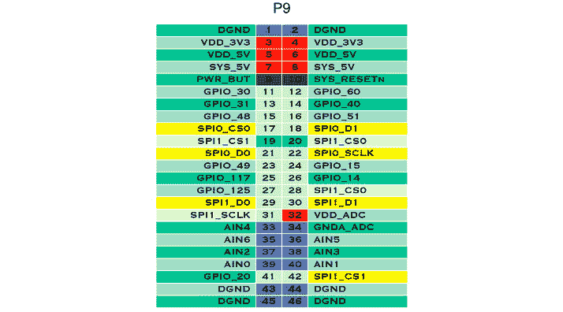

图 12.1-P9 扩展头 SPI 端口

引脚 17、18、21 和 22分配给 SPI0 总线。 引脚 19、20、28、29、30、31 和 42分配给 SPI1 总线。 请注意，端号 42 和 28 复制了 SPI1 的端号 19 和 20 的功能。 我们只能为 SPI1_CS1 和 SPI1_CS0 使用一个引脚。 任何重复的引脚都应禁用或重新调整用途。 另外，请注意，SPI1 有 CS0 和 CS1 引脚，而 SPI0 只有一个 CS0 引脚。 **CS**代表**芯片选择**。 由于每条 SPI 总线都是主从接口，因此拉低 CS 信号线通常会选择发送到总线上的哪个外设。 这种负逻辑被称为*“有效低”*。

以下是连接了两个外设的 Beaglebone Black 的 SPI1 总线框图：

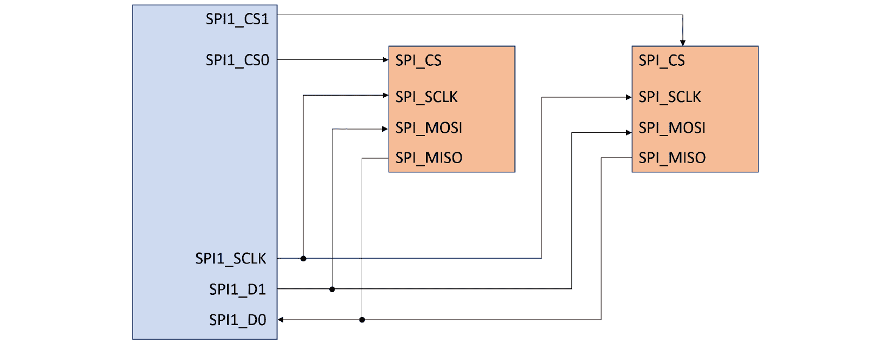

图 12.2-SPI1 总线

如果我们查看Beagle bone Black 的示意图([https://github.com/beagleboard/beaglebone-black/blob/master/BBB_SCH.pdf](https://github.com/beagleboard/beaglebone-black/blob/master/BBB_SCH.pdf))，我们将
看到 P9 扩展接头上的四个引脚(28 到 31)标记为 SPI1：


图 12.3-P9 扩展头示意图

额外的 SPI1 引脚(19、20 和 42)和所有 SPI0 引脚(17、18、21 和 22)已重新用于原理图上的 I2C1、I2C2 和 UART2。 这种备用映射是设备树源文件中定义的管脚复用器配置的结果。 要将丢失的 SPI 信号线从 AM335x 路由到扩展接头上各自的目标引脚，必须应用正确的引脚多路复用器配置。 管脚多路复用可以在运行时进行原型设计，但应该在完成的硬件到达之前转换到编译时间。

除了 CS0，您还会注意到 SPI0 总线还有 SCLK、D0 和 D1 线路。 **SCLK**代表**SPI 时钟**，始终由总线主机(本例中为 AM335x)生成。 通过 SPI 总线传输的数据与该 SCLK 信号同步。 SPI 支持比 I2C 高得多的时钟频率。 D0 数据线对应于**主机输入，从机输出**(**MISO**)。 D1 数据线对应于**主机输出，从机输入**(**MOSI**)。 虽然在软件中 D0 和 D1 都可以分配给 MISO 或 MOSI，但我们将坚持使用这些默认映射。 SPI 是**全双工**接口，这意味着主机和选定的从机都可以同时发送数据。

以下是显示所有四个 SPI 信号方向的框图：


图 12.4-SPI 信号

现在，让我们把注意力从 Beaglebone Black 转移到Zoe-M8Q 上。 我们将从 ZOE-M8 系列数据表开始，该数据表可以从 u-blox 的产品页面[https://www.u-blox.com/en/product/zoe-m8-series](https://www.u-blox.com/en/product/zoe-m8-series)下载。 请跳至描述 SPI 的部分。 它表示 SPI 默认禁用，因为其引脚与 UART 和 DDC 接口共享。 要使能 Zoe-M8Q 上的 SPI，我们必须将 D_SEL 引脚连接到地。 下拉 D_SEL 可将两个 UART 和两个 DDC 引脚转换为四个 SPI 引脚。

在[https://www.sparkfun.com/products/15193](https://www.sparkfun.com/products/15193)的产品页面中选择“**Documents**”选项卡，找到 SparkFun Zoe-M8Q GPS 分流的示意图。 搜索 D_SEL 针脚会发现它位于标有 jp1 的跳线左侧。 闭合跳线将 D_SEL 连接到 GND，从而启用 SPI：

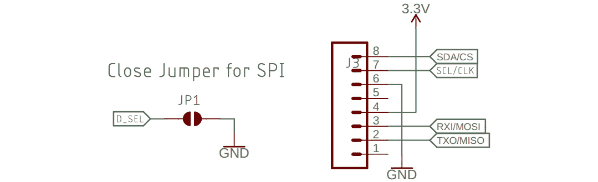

图 12.5-GPS 分支上的 D_SEL 跳线和 SPI 连接器

CS、CLK、MOSI 和 MISO 引脚的连接器与3.3V 和 GND 位于同一位置。 合上跳线并将接头连接到六个引脚上将需要一些焊接。

互连芯片或模块时，请务必检查针脚额定值。 GPS 接线上的 JP2 跳线将 SCL/CLK 和 SDA/CS 引脚连接到 2.2KΩ上拉电阻器。 AM335x 数据手册称，这些输出引脚是 6 mA 驱动器，因此启用其微弱的内部上拉会增加 100µA 的上拉电流。 ZOE-M8Q 在相同引脚上具有 11kΩ上拉，在 3.3V 时增加 300µA。 ΩBreakout 上的 2.2k GPS I2C 上拉增加了 1.5MA，总共 1.9 mA 的上拉电流，这是可以的。

返回到*图 12.1*，请注意 Beaglebone Black 通过其 P9 扩展接头的 3 号和 4 号针脚供电 3.3V。 引脚 1 和 2 以及 43 到 46 都绑在 GND 上。 除了将 GPS 分支上的四条 SPI 线连接到引脚 17、18、21 和 22 外，我们还将 GPS 模块的 3.3V 和 GND 连接到 Beaglebone Black 的 P9 扩展接头上的引脚 3 和 43。

现在我们已经了解了如何连接 Zoe-M8Q，让我们在运行在 Beaglebone Black 上的 Linux 上启用 SPI0 总线。 要做到这一点，最快的方法是从[BeagleBoard.org](http://BeagleBoard.org)安装预构建的 Debian 镜像。

## 在 Beaglebone Black 上安装 Debian

[BeagleBoard.org](http://BeagleBoard.org)为他们的各种 dev主板提供 Debian 图像。 Debian 是一个流行的 Linux 发行版
，它包含一套全面的开源软件包。 这是一个巨大的努力，有来自世界各地的贡献者。 按照嵌入式 Linux 标准，为各种 BeagleBoards 构建 Debian 是非常规的，因为该过程不依赖交叉编译。 而不是尝试自己为 Beaglebone Black 构建 Debian，只需直接从[BeagleBoard.org](http://BeagleBoard.org)下载完成的图像即可。

要下载 Beaglebone Black 的 Debian Buster IoT microSD 卡镜像，请发出 following 命令：

```sh
$ wget https://debian.**BeagleBoard.orgimg/bone-debian-10.3-iot-armhf-2020-04-06-4gb.img.xz
```

在撰写本文时，10.3 是基于 AM335x 的Beaglebone 主板的最新Debian 图像。 主版本号 10 表示 10.3 是 Debian 的 Buster LTS 发行版。 由于 Debian 10.0 最初是在 2019 年 7 月 6 日发布的，它应该会收到从该日期起最长 5 年的更新。

重要音符

如果可能，请从[BeagleBoard.org](http://BeagleBoard.org)下载 10.3 版(也称为 Buster)，而不是从[BeagleBoard.org](http://BeagleBoard.org)下载最新的 Debian 映像。 Beaglebone 引导加载器、内核、DTB 和命令行工具一直在变化，因此这些指令可能不适用于较新的 Debian 发行版。

现在我们已经有了 Beaglebone Black 的 Debian 映像，让我们将其写出到 microSD 卡并引导它。 找到您从[BeagleBoard.org](http://BeagleBoard.org)从 Etcher 下载的`bone-debian-10.3-iot-armhf-2020-04-06-4gb.img.xz`文件，并将其写出到 microSD 卡。 将 microSD 卡插入 Beaglebone Black，并使用 5V 电源接通电源。 接下来，用以太网电缆将 Beaglebone Black 上的以太网电缆插入路由器的空闲端口。 当板载以太网指示灯开始闪烁时，您的 Beaglebone Black 应该处于在线状态。 通过互联网访问，我们可以在 Debian 内部安装软件包和从 Git repos 获取代码。

要从 Linux 主机`ssh`进入 Beaglebone Black，请使用以下代码：

```sh
$ ssh debian@beaglebone.local
```

在`debian`用户密码提示下输入`temppwd`。

重要音符

许多 Beaglebone Black 在板载闪存上已经安装了 Debian，所以即使没有插入 microSD 卡，它们仍然可以引导。 如果在密码提示之前显示`BeagleBoard.org Debian Buster IoT Image 2020-04-06`消息，则 Beaglebone Black 是从 microSD 上的 Debian 10.3 映像启动的。 如果在密码提示之前显示不同的 Debian Release 消息，请验证 microSD 卡是否正确插入。

现在我们使用 Beaglebone Black，让我们看看有哪些 SPI 接口可用。

## 启用蜘蛛

Linux 附带了一个用户空间 API，它提供了对
SPI 设备的`read()`和`write()`访问。 此用户空间 API 称为`spidev`，包含在 Beaglebone Black 的 Debian Buster 映像中。 我们可以通过搜索
`spidev`内核模块来确认这一点：

```sh
debian@beaglebone:~$ lsmod | grep spi
spidev                 20480  0
```

现在，列出可用的 SPI 外围设备地址：

```sh
$ ls /dev/spidev*
/dev/spidev0.0  /dev/spidev0.1  /dev/spidev1.0  /dev/spidev1.1
```

`/dev/spidev0.0`和`/dev/spidev0.1`节点位于 SPI0 总线上，而
`/dev/spidev1.0`和`/dev/spidev1.1`节点位于 SPI1 总线上。 这个项目我们只需要 SPI0 总线。

U-Boot 加载 Beaglebone Black 设备树顶部的覆盖。 我们可以通过编辑 U-Boot 的`uEnv.txt`配置文件来选择要加载的设备树覆盖：

```sh
$ cat /boot/uEnv.txt 
#Docs: http://elinux.org/Beagleboard:U-boot_partitioning_layout_2.0
uname_r=4.19.94-ti-r42
.
.
.
###U-Boot Overlays###
###Documentation: http://elinux.org/Beagleboard:BeagleBoneBlack_Debian#U-Boot_Overlays
###Master Enable
enable_uboot_overlays=1
###
.
.
.
###Disable auto loading of virtual capes (emmc/video/wireless/adc)
#disable_uboot_overlay_emmc=1
#disable_uboot_overlay_video=1
#disable_uboot_overlay_audio=1
#disable_uboot_overlay_wireless=1
#disable_uboot_overlay_adc=1
.
.
.
###Cape Universal Enable
enable_uboot_cape_universal=1
```

确认`enable_uboot_overlays`和`enable_uboot_cape_universal`环境变量均设置为`1`。 前导`#`表示该行中该字符之后的任何内容都将被注释掉。 因此，U-Boot 会忽略前面代码中显示的所有`disable_uboot_overlay_<device>=1`语句。 此配置文件应用于 U-Boot 的环境，因此保存到`/boot/uEnv.txt`的任何更改都需要重新启动才能生效。

重要音符

音频覆盖与 Beaglebone Black 上的 SPI1 总线冲突。 如果要启用 SPI1 上的通信，请取消注释`/boot/uEnv.txt`中的`disable_uboot_overlay_audio=1`。

要列出 U-Boot 已加载的设备树覆盖，请使用以下命令：

```sh
$ cd /opt/scripts/tools
$ sudo ./version.sh | grep UBOOT
UBOOT: Booted Device-Tree:[am335x-boneblack-uboot-univ.dts]
UBOOT: Loaded Overlay:[AM335X-PRU-RPROC-4-19-TI-00A0]
UBOOT: Loaded Overlay:[BB-ADC-00A0]
UBOOT: Loaded Overlay:[BB-BONE-eMMC1-01-00A0]
UBOOT: Loaded Overlay:[BB-NHDMI-TDA998x-00A0]
```

CAPE 通用特性([AM3358](https://github.com/cdsteinkuehler/beaglebone-universal-io))是 https://github.com/cdsteinkuehler/beaglebone-universal-io 版本所独有的。 它提供了对 Beaglebone Black几乎所有硬件 I/O 的访问，而无需我们修改设备树源或重新构建内核。 不同的管脚多路复用器配置在运行时使用`config-pin`命令行工具激活。

要查看所有可用的 ping 组，请使用以下代码：

```sh
$ cat /sys/kernel/debug/pinctrl/*pinmux*/pingroups
```

要仅查看 SPI ping 组，请使用以下代码：

```sh
$ cat /sys/kernel/debug/pinctrl/*pinmux*/pingroups | grep spi
group: pinmux_P9_19_spi_cs_pin
group: pinmux_P9_20_spi_cs_pin
group: pinmux_P9_17_spi_cs_pin
group: pinmux_P9_18_spi_pin
group: pinmux_P9_21_spi_pin
group: pinmux_P9_22_spi_sclk_pin
group: pinmux_P9_30_spi_pin
group: pinmux_P9_42_spi_cs_pin
group: pinmux_P9_42_spi_sclk_pin
```

仅将一个管脚分配给一个 ping 组是不寻常的。 通常，总线的所有 SPI 引脚(CS、SCLK、D0 和 D1)在同一引脚组中多路复用。 我们可以通过查看设备树源(位于 Debian 映像的`/opt/source/dtb-4.19-ti/src/arm`目录中)来确认这种奇怪的一对一引脚到组的关系。

源目录中`am335x-boneblack-uboot-univ.dts`文件包含以下内容：

```sh
#include "am33xx.dtsi"
#include "am335x-bone-common.dtsi"
#include "am335x-bone-common-univ.dtsi"
```

该`.dts`文件与包含的三个`.dtsi`文件一起定义设备树源。 `dtc`工具将这四个源文件编译成一个`am335x-boneblack-uboot-univ.dtb`文件。 U-Boot 还会在此 CAPE 通用设备树的顶部加载设备树覆盖。 这些设备树覆盖的文件扩展名为`.dtbo`。

以下是`pinmux_P9_17_spi_cs_pin`的 ping 组定义：

```sh
P9_17_spi_cs_pin: pinmux_P9_17_spi_cs_pin { pinctrl-single,pins = <
     AM33XX_IOPAD(0x095c, PIN_OUTPUT_PULLUP | INPUT_EN | MUX_MODE0) >; };
```

`pinmux_P9_17_spi_cs_pin`组将 P9 扩展接头上的引脚 17 配置为 SPI0 总线的 CS 引脚。

下面是`P9_17_pinmux`定义，其中引用了`pinmux_P9_17_spi_cs_pin`：

```sh
/* P9_17 (ZCZ ball A16) */
P9_17_pinmux {
     compatible = "bone-pinmux-helper";
     status = "okay";
     pinctrl-names = "default", "gpio", "gpio_pu", "gpio_pd", "gpio_input", "spi_cs", "i2c", "pwm", "pru_uart";
     pinctrl-0 = <&P9_17_default_pin>;
     pinctrl-1 = <&P9_17_gpio_pin>;
     pinctrl-2 = <&P9_17_gpio_pu_pin>;
     pinctrl-3 = <&P9_17_gpio_pd_pin>;
     pinctrl-4 = <&P9_17_gpio_input_pin>;
     pinctrl-5 = <&P9_17_spi_cs_pin>;
     pinctrl-6 = <&P9_17_i2c_pin>;
     pinctrl-7 = <&P9_17_pwm_pin>;
     pinctrl-8 = <&P9_17_pru_uart_pin>;
};
```

请注意，`pinmux_P9_17_spi_cs_pin`组是配置`P9_17_pinmux`的九种不同方式之一。 由于`spi_cs`不是该引脚的默认配置，因此 SPI0总线最初被禁用。

要启用`/dev/spidev0.0`，请运行以下`config-pin`命令：

```sh
$ config-pin p9.17 spi_cs
Current mode for P9_17 is:     spi_cs
$ config-pin p9.18 spi
Current mode for P9_18 is:     spi
$ config-pin p9.21 spi
Current mode for P9_21 is:     spi
$ config-pin p9.22 spi_sclk
Current mode for P9_22 is:     spi_sclk
```

如果遇到权限错误，请重新运行`config-pin`命令并为其添加前缀`sudo`。 输入`temppwd`作为`debian`用户的`password`。 在图书代码归档的
`MELP/Chapter12`下有一个包含这四个`config-pin`命令的`config-spi0.sh`脚本。

Debian 附带安装了Git，因此您可以克隆本书的 ReposiTory 来获取归档文件：

```sh
$ git clone https://github.com/PacktPublishing/Mastering-Embedded-Linux-Programming-Third-Edition.git MELP
```

要在启动 Beaglebone Black 时启用`/dev/spidev0.0`，请使用以下命令
：

```sh
$ MELP/Chapter12/config-spi0.sh
```

`sudo`密码与`debian`登录提示符相同。

Linux 内核源代码随一起提供了一个`spidev_test`程序。 我已经在本书的`MELP/Chapter12/spidev-test`下的代码归档中包含了这个`spidev_test.c`源文件的副本，它是我从[https://github.com/rm-hull/spidev-test](https://github.com/rm-hull/spidev-test)获得的。

要编译`spidev_test`程序，请执行以下命令：

```sh
$ cd MELP/Chapter12/spidev-test
$ gcc spidev_test.c -o spidev_test
```

现在，运行`spidev_test`程序：

```sh
$ ./spidev_test -v 
spi mode: 0x0
bits per word: 8
max speed: 500000 Hz (500 KHz)
TX | FF FF FF FF FF FF 40 00 00 00 00 95 FF FF FF FF FF FF FF FF FF FF FF FF FF FF FF FF FF FF F0 0D  | ......@....?..................?.
RX | 00 00 00 00 00 00 00 00 00 00 00 00 00 00 00 00 00 00 00 00 00 00 00 00 00 00 00 00 00 00 00 00  | ................................
```

`-v`标志是`--verbose`的缩写，显示发送缓冲区的内容。 此版本的`spidev_test`程序默认使用`/dev/spidev0.0`设备，因此不需要传入`--device`参数来选择 SPI0 总线。 SPI 的全双工特性意味着总线主机在发送数据时接收数据。 在这种情况下，RX 缓冲区包含全零，这意味着没有接收到数据。 事实上，甚至不能保证发送缓冲区中的任何数据都已发送。

使用跳线将 Beaglebone Black 的 P9 扩展接头上的插针 18(SPI0_D1)连接到插针 21(SPI0_D0)，如下所示：

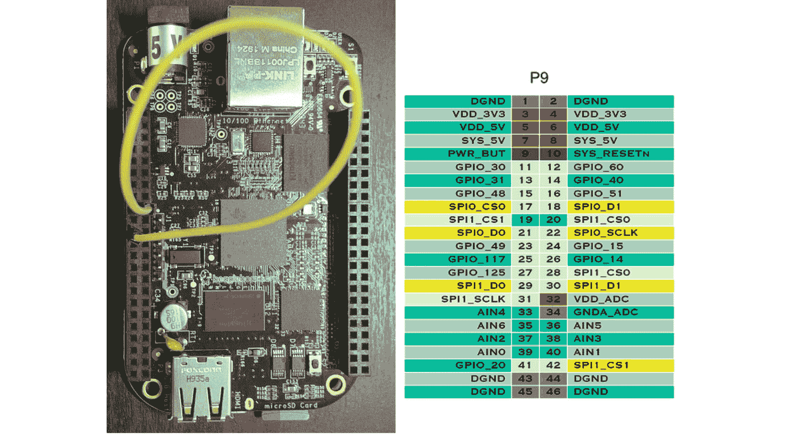

图 12.6-SPI0 环回

P9扩展接头的贴图是定向的，以便当 USB 端口位于底部时，接头位于 Beaglebone Black 的左侧。 从 SPI0_D1 到 SPI0_D0 的跳线通过将 MOSI(主机输出)馈入 MISO(主机输入)形成环回连接。

重要音符

不要忘记在重新启动或重新打开 Beaglebone Black 后重新运行`config-spi0.sh`脚本，以重新启用`/dev/spidev0.0`界面。

环回连接到位后，重新运行`spidev_test`程序：

```sh
$ ./spidev_test -v 
spi mode: 0x0
bits per word: 8
max speed: 500000 Hz (500 KHz)
TX | FF FF FF FF FF FF 40 00 00 00 00 95 FF FF FF FF FF FF FF FF FF FF FF FF FF FF FF FF FF FF F0 0D  | ......@.......................
RX | FF FF FF FF FF FF 40 00 00 00 00 95 FF FF FF FF FF FF FF FF FF FF FF FF FF FF FF FF FF FF F0 0D  | ......@.......................
```

RX 缓冲区的内容现在应该与 TX 缓冲区的内容匹配。 我们已验证`/dev/spidev0.0`接口完全正常工作。 有关运行时管脚多路复用的更多信息，包括 Beaglebone Black 的设备树和覆盖层的起源，我推荐阅读[https://cdn-learn.adafruit.com/downloads/pdf/introduction-to-the-beaglebone-black-device-tree.pdf](https://cdn-learn.adafruit.com/downloads/pdf/introduction-to-the-beaglebone-black-device-tree.pdf)。

## 自定义设备树

`BeagleBoard.org`的 cape通用设备树非常适合原型制作，但像`config-pin`这样的工具不适合生产。当我们出厂一台消费设备时，我们知道包括哪些外围设备。除了从 EEPROM 读取型号和修订号之外，引导过程中不应该涉及硬件发现
。然后 U-Boot 可以根据这一点决定加载什么设备树和覆盖。与选择内核模块一样，设备树的内容是在编译时做出的最佳决定，而不是

最终，我们需要为定制 AM335x 板自定义设备树源。 包括德州仪器在内的大多数 SoC 供应商都提供用于生成设备树源的交互式管脚多路复用器
工具。 我们将使用 Texas Instruments Online SysConfig 工具向我们的 Nova 板添加`spidev`接口。 在[*第 4 章*](04.html#_idTextAnchor085)，*配置和构建内核*的*将 Linux 移植到新的主板*一节中，我们已经为 Nova 定制了设备树，并再次在[*第 6 章*](06.html#_idTextAnchor164)，*选择构建系统，*当我们了解如何为 Buildroot 创建自定义 BSP 时。 这一次，我们将添加到`am335x-boneblack.dts`文件中，而不是逐字复制。

访问[https://dev.ti.com](https://dev.ti.com)并创建一个帐户(如果您还没有帐户)。 您需要 myTI 帐户才能访问在线 SysConfig 工具。

要创建myTI 帐户，请执行以下步骤：

1.  单击登录页面右上角的**登录/注册**按钮。
2.  填写**新用户**表单。
3.  单击**创建帐户**按钮。

要启动 SysConfig 工具，请执行以下步骤：

1.  单击登录页面右上角的**登录/注册**按钮。
2.  在**现有 myTI 用户**下输入您的电子邮件地址和密码进行登录。
3.  点击**Cloud Tools**下的 SysConfig**Launch**按钮。

**启动**按钮将把您带到位于[https://dev.ti.com/sysconfig/#/start](https://dev.ti.com/sysconfig/#/start)的系统配置起始页，您可以将其添加为书签，以便更快地访问。 SysConfig 允许我们将正在工作的设计保存到云中，以便我们以后可以重新访问它们。

要为 AM335x 生成 SPI0 针多路复用器配置，请执行以下步骤：

1.  从**开始新设计**下的**设备**菜单中选择**AM335x**。
2.  保留 AM335x 的默认**部件**和**封装**菜单选项**默认**和**ZCE**不变。
3.  单击**开始**按钮。
4.  从左侧栏中选择**SPI**。
5.  Click the **ADD** button to add an SPI to your design:

    

    图 12.7-添加 SPI 外围设备

6.  将**MySP1**重命名为`SPI0`，方法是在**Name**字段中键入该名称。
7.  Select **SPI0** from the **Use Peripheral** menu:

    

    图 12.8-选择 SPI0

8.  Select **Master SPI with 1 chip select** from the **Use Case** menu:

    

    图 12.9-带 1 个芯片选择的主 SPI

9.  取消选中**CS1**复选框以删除该项目。
10.  单击**Generated Files**下的`devicetree.dtsi`查看设备树源。
11.  Select **Pull Up** from the **Pull Up/Down** menu for **Signals**:

    

    图 12.10-上拉信号

    请注意这对显示的设备树源造成的影响。
    `PIN_INPUT`的所有实例都已用`PIN_INPUT_PULLUP`替换为。

12.  Uncheck the **Rx** checkboxes for **D1**, **SCLK**, and **CS0** since those pins are outputs from the AM335x master, not inputs:

    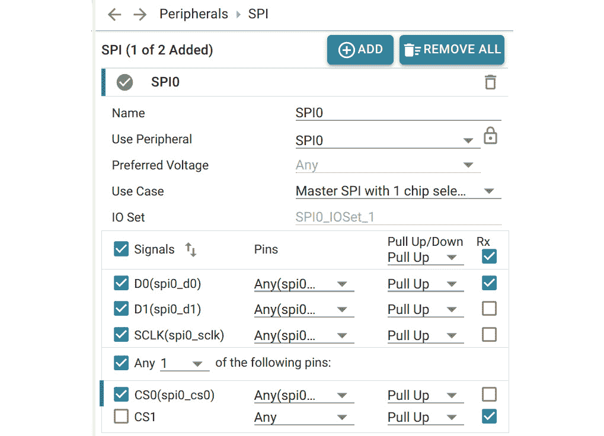

    图 12.11-取消选中处方框

    **D0**引脚对应于 MISO(主机输入，从机输出)，因此保持该引脚的**Rx**处于选中状态。 现在，设备树源中的`spi0_sclk`、`spi0_d1`和`spi0_cs0`引脚应配置为`PIN_OUTPUT_PULLUP`。 回想一下，SPI CS 信号通常为低电平有效，因此需要上拉来防止该线路浮动。

13.  单击`devicetree.dtsi`的软盘图标，将设备树源文件保存到您的机器。
14.  从左上角的**File**菜单中点击**Save as**保存您的设计。
15.  为您的设计文件指定一个描述性名称，如`nova.syscfg`，然后单击**保存**。
16.  保存到计算机的`.dtsi`文件的内容应如下所示：

```sh
&am33xx_pinmux {
      spi0_pins_default: spi0_pins_default {
           pinctrl-single,pins = <
                AM33XX_IOPAD(0x950, PIN_OUTPUT_PULLUP | MUX_MODE0) /* (A18) spi0_sclk.spi0_sclk */
                AM33XX_IOPAD(0x954, PIN_INPUT_PULLUP | MUX_MODE0) /* (B18) spi0_d0.spi0_d0 */
                AM33XX_IOPAD(0x958, PIN_OUTPUT_PULLUP | MUX_MODE0) /* (B17) spi0_d1.spi0_d1 */
                AM33XX_IOPAD(0x95c, PIN_OUTPUT_PULLUP | MUX_MODE0) /* (A17) spi0_cs0.spi0_cs0 */
           >;
      };
      […]
};
```

我省略了可选的睡眠销设置，因为我们不需要它们。 如果我们将前面代码中显示的十六进制管脚地址与`am335x-bone-common-univ.dtsi`中相同 SPI0管脚的地址进行比较，我们会发现它们完全匹配。

`am335x-bone-common-univ.dtsi`中的 SPI0 引脚全部配置如下：

```sh
AM33XX_IOPAD(0x095x, PIN_OUTPUT_PULLUP | INPUT_EN | MUX_MODE0)
```

使用`INPUT_EN`位掩码表明，CAPE 通用设备树中的所有四个 SPI0 引脚都配置为输入和输出，而实际上只有`0x954`处的`spi0_ds0`需要用作输入。

`INPUT_EN`位掩码是`/opt/source/dtb-4.19-ti/include/dt-bindings/pinctrl/am33xx.h`头文件中定义的许多宏之一，可以在 Debian Buster IoT 镜像中找到：

```sh
#define PULL_DISABLE            (1 << 3)
#define INPUT_EN                (1 << 5)
[…]
#define PIN_OUTPUT              (PULL_DISABLE)
#define PIN_OUTPUT_PULLUP       (PULL_UP)
#define PIN_OUTPUT_PULLDOWN     0
#define PIN_INPUT               (INPUT_EN | PULL_DISABLE)
#define PIN_INPUT_PULLUP        (INPUT_EN | PULL_UP)
#define PIN_INPUT_PULLDOWN      (INPUT_EN)
```

在`/opt/source/dtb-4.19-ti include/dt-bindings/pinctrl/omap.h`头文件中定义了更多TI 设备树源宏：

```sh
#define OMAP_IOPAD_OFFSET(pa, offset)   (((pa) & 0xffff) - (offset))
[…]
#define AM33XX_IOPAD(pa, val)           OMAP_IOPAD_OFFSET((pa), 0x0800) (val)
```

现在我们已经正确地多路复用了 SPI0 引脚，接下来将生成的设备树源复制并粘贴到我们的`nova.dts`文件中。 一旦定义了这个新的`spi0_pins_default`Pinggroup，我们就可以通过覆盖该 Pinggroup 与`spi0`设备节点相关联，如下所示：

```sh
&spi0 {
     status = "okay";
     pinctrl-names = "default";
     pinctrl-0 = <&spi0_pins_default>;
     […]
}
```

设备节点名称前的`&`符号表示我们引用的是设备树中的现有节点，因此修改的是设备树中的现有节点，而不是定义新节点。

我已经将完成的`nova.dts`文件包含在本书的代码归档中，位于
`MELP/Chapter12/buildroot/board/melp/nova`目录中。

要使用此设备树为我们的 Nova板构建自定义 Linux 映像，请执行以下步骤：

1.  Copy `MELP/Chapter12/buildroot` over your Buildroot installation:

    ```sh
    $ cp -a MELP/Chapter12/buildroot/* buildroot
    ```

    这将添加`nova_defconfig`文件和`board/melp/nova`目录，或替换`MELP/Chapter06/buildroot`中的文件和目录。

2.  `cd`到安装 Buildroot 的目录：

    ```sh
    $ cd buildroot
    ```

3.  删除所有以前的生成项目：

    ```sh
    $ make clean
    ```

4.  准备好为我们的 Nova 董事会建立形象：

    ```sh
    $ make nova_defconfig
    ```

5.  构建镜像：

    ```sh
    $ make
    ```

构建完成后，映像将写入名为`outpimg/sdcard.img`的文件。 使用 Etcher 将该图像写入 microSD 卡。 请参阅[*第 6 章*](06.html#_idTextAnchor164)，*选择构建系统*中的*简介 Buildroot*中的*目标真实硬件*部分，了解如何执行此操作。 当 Etcher 完成闪烁后，将 microSD 插入 Beaglebone Black。 根文件系统中不包含 SSH 守护进程，因此您需要连接串行电缆才能登录。

要通过串行控制台登录 Beaglebone Black，请执行以下步骤：

1.  将 Linux 主机上的 USB 至 TTL 3.3V 串行电缆插入 Beaglebone Black 的 J1 接口。 确保电缆 FTDI 端的黑线连接到 J1 的针脚 1。 串行端口在 Linux 主机上应显示为`/dev/ttyUSB0`。
2.  启动适当的终端程序，如`gtkterm`、`minicom`或`picocom`，并以`115200`**位/秒(Bps)**的速度将其连接到端口，而不进行流量控制。 `gtkterm`可能是最容易设置和使用的：

    ```sh
    $ gtkterm -p /dev/ttyUSB0 -s 115200
    ```

3.  通过 5V 桶接头为 Beaglebone Black 通电。 您应该会在串行控制台上看到 U-Boot 输出、内核日志输出以及最终的登录提示。
4.  以`root`身份登录，无需密码。

向上滚动或输入`dmesg`以查看引导期间的内核消息。 类似以下内容的内核消息确认通过我们在`nova.dts`中定义的绑定成功探测了`spidev0.0`接口：

```sh
[    1.368869] omap2_mcspi 48030000.spi: registered master spi0
[    1.369813] spi spi0.0: setup: speed 16000000, sample trailing edge, clk normal
[    1.369876] spi spi0.0: setup mode 1, 8 bits/w, 16000000 Hz max --> 0
[    1.372589] omap2_mcspi 48030000.spi: registered child spi0.0
```

出于测试目的，根文件系统附带了`spi-tools`包。 该包由`spi-config`和`spi-pipe`命令行工具组成。

以下是`spi-config`的用法：

```sh
# spi-config -h
usage: spi-config options...
  options:
    -d --device=<dev>  use the given spi-dev character device.
    -q --query         print the current configuration.
    -m --mode=[0-3]    use the selected spi mode:
             0: low idle level, sample on leading edge,
             1: low idle level, sample on trailing edge,
             2: high idle level, sample on leading edge,
             3: high idle level, sample on trailing edge.
    -l --lsb={0,1}     LSB first (1) or MSB first (0).
    -b --bits=[7...]   bits per word.
    -s --speed=<int>   set the speed in Hz.
    -r --spirdy={0,1}  consider SPI_RDY signal (1) or ignore it (0).
    -w --wait          block keeping the file descriptor open to avoid speed reset.
    -h --help          this screen.
    -v --version       display the version number.
```

这里的是`spi-pipe`的用法：

```sh
# spi-pipe -h
usage: spi-pipe options...
  options:
    -d --device=<dev>    use the given spi-dev character device.
    -s --speed=<speed>   Maximum SPI clock rate (in Hz).
    -b --blocksize=<int> transfer block size in byte.
    -n --number=<int>    number of blocks to transfer (-1 = infinite).
    -h --help            this screen.
    -v --version         display the version number.
```

在本章中，我不会使用`spi-tools`，而是依赖于`spidev-test`和我称之为`spidev-read`的同一个程序的修改版本。

现在，我们已经了解了本书中将要介绍的设备树源。 虽然 DTS 的用途非常广泛，但它也可能非常令人沮丧。 `dtc`编译器不是很智能，所以很多设备树源代码调试都是在运行时使用`modprobe`和`dmesg`进行的。 在引脚多路复用时忘记上拉或将输入错误配置为输出可能足以阻止设备探测。 使用带有 SDIO 接口的 Wi-Fi/蓝牙模块尤其具有挑战性。

随着 SPI 的退出，现在是近距离使用 GPS 模块的时候了。 完成 SparkFun Zoe-M8Q GPS 出口的布线后，我们将返回到通用`spidev`接口的主题。

# 用接线板制作原型

现在我们已经有了开发 Beaglebone Black 的 SPI，让我们把注意力转回到 GPS 模块
。 在我们连接 SparkFun Zoe-M8Q GPS 突破口之前，我们需要做一些焊接工作。 焊接需要办公桌空间、材料和相当长的时间投入。

要执行此项目的焊接，您需要以下物品：

*   锥形顶端的烙铁(温度可调)
*   下列任何一种：硅胶汽车仪表盘防滑垫、硅胶烘焙垫或瓷砖
*   一种精细(0.031 英寸规格)的电松香芯焊料
*   一种烙铁支架
*   湿海绵
*   钢丝切割机
*   安全眼镜
*   帮助手工具，以及放大镜和 LED 灯
*   带有#2 刀片的 X-Acto#2 刀或带有#11 刀片的#1 刀

拥有这些物品很不错，但不是必须的：

*   一种绝缘有机硅焊垫
*   焊料芯
*   一块黄铜海绵
*   粘性大头针或类似的油灰状粘合剂
*   牙科工具包
*   尖嘴钳
*   镊子，小钳子

这些项目中的大多数都与 SparkFun 初学者工具包捆绑在一起，但也可以在其他地方以较低的价格购买。 如果您是焊接新手，我还建议您在操作 ZOE-M8Q 之前，先获得一些废弃的 PCB 来练习。 SparkFun GPS Breakout 上的孔很小，需要稳定、精细的触摸。 一个带有放大镜和鳄鱼夹的帮手工具非常有帮助。 当你使用焊料时，一些粘性的大头钉也可以将支撑板固定在坚硬、平坦的表面上。 完成后，用 X-Acto 刀刮掉触点上或附近多余的粘性钉子。

即使你是电子学的新手，我也鼓励你大胆尝试，学习焊接。 你可能需要几天的挫折才能掌握其中的诀窍，但你从建造自己的赛道中获得的满足感是非常值得的。 我推荐阅读 MightyOhm 的免费*焊接很容易*漫画书，作者是 Mitch Altman 和 Andie Nordgren。

以下是我自己的一些有用的焊接技巧。 用黄铜海绵擦拭焊锡尖端可以避免麻烦的氧化。 使用 X-Acto 刀刮掉 PCB 上的任何零星焊料斑点。 用热熨斗熔化硅胶垫子上的焊料，以适应其特性。 最后，处理热焊料时一定要戴上安全眼镜，以免进入眼睛。

## 关闭 SPI 跳线

我们在名为 jp1 的跳线左侧的 SparkFun GPS 接线示意图上找到了 D_SEL 引脚。 将 D_SEL 引脚连接到跳线右侧的 GND 可将 ZOE-M8Q 从 I2C 模式切换到 SPI 模式。 两个 SPI 跳线焊盘上已经有一些焊料了。 我们需要加热焊盘，这样我们才能移动焊料。

翻转接线板可以看到跳投。 请注意，jp1 跳线在主板的左侧中央标有 SPI：


图 12.12-跳线

要关闭SPI 跳线，请执行以下操作：

1.  插上电源，将烙铁加热到华氏 600 度。
2.  用手中的所有鳄鱼夹固定 GPS 突破口。
3.  将你的手放在放大镜和 LED 灯的位置，这样你就可以清楚地看到 SPI 跳线。
4.  将焊针放在 SPI 跳线的左右焊盘上，直到焊料熔化，在两个焊盘之间形成一座桥。
5.  如有必要，请随意添加更多焊料。
6.  用烙铁的尖端熔化跳线焊盘上多余的焊料，并将其从跳线焊盘上取下。

闭合跳线只需要很少的焊料。 如果焊料开始冒烟，就把熨斗的温度调低。 一旦 SPI 跳线关闭，ZOE-M8Q 上的串行和 I2C 通信将被禁用。 接线板顶部的 FTDI 和 I2C 引脚标签不再适用。 使用电路板底面的 SPI 引脚标签。

给小费 / 翻倒 / 倾覆

使用尖端的一侧(也被称为“甜蜜点”)，而不是铁头的尖端，以获得最好的效果。

我们不需要对 JP2 重复相同的焊接过程，因为焊盘
已经桥接在该跳线上。 JP2 的两个 2.2kΩ
I2C 上拉电阻器各有一个单独的焊盘。 请注意，JP2 位于 JP1 的正上方，并在中断板上标记为 I2C。

现在SPI 跳线已关闭，让我们连接 GNSS 天线。

## 安装 GNSS 天线

陶瓷或 Molex粘性 GNSS 天线可帮助 ZOE-M8Q 获得 GPS 定位。 U.FL 接头易碎，应小心使用。 将接线板平放在坚硬的表面上，并使用放大镜确保天线正确放置。

要将 GNSS 天线连接到 U.FL 连接器，请执行以下步骤：

1.  对齐电缆，使凹式连接器和一端均匀地放置在电路板上凸式连接器的表面上。
2.  将手指轻轻放在堆叠的连接器上，确保母连接器没有摇晃。
3.  从上方检查两个堆叠的连接器，确保它们彼此居中。
4.  用手指中心牢牢按住接头中心，直到感觉到两个接头锁定到位。

既然天线已连接，我们就可以连接 SPI 接头了。

## 连接 SPI 接头

我们将使用 6 根凸形到凹形跳线将 SparkFun GPS 突破口连接到
Beagleboard Black。 跳线的凸端插入 Beaglebone Black 上的 P9 扩展接头。 凹头的两端插入一排直开的插头，我们将把这些插头焊接到插线板上。 在接头插针就位的情况下进行通孔焊接可能会很困难，因为插针在孔中几乎没有留出空间让焊料和针尖滑进去。 这就是为什么我推荐这个项目使用细规格(0.031 英寸或更小)焊料的原因。

如果你没有操作小型电子元件的经验，你应该首先练习将一些直接分离的接头焊接到废弃的 PCB 上。 稍加准备就可以避免损坏和更换昂贵的 Zoe-M8Q GPS 模块。 正确的焊点应该围绕接头引脚流动，并填满孔洞，形成一个火山形状的土堆。 焊点需要接触孔周围的金属环。 针脚和金属环之间的任何间隙都可能导致连接不良。

要准备好 SparkFun GPS 出口以便您可以连接 SPI 标题，请按照
以下步骤操作：

1.  折断一排八个插头销。
2.  折断一排四个插头销。
3.  通过接线板下侧的 SPI 孔插入 8 行。
4.  通过与插接板底面
    上的 SPI 行相对的孔插入四行。 此接头仅用于在
    焊接时保持电路板稳定。
5.  用你手中的鳄鱼夹固定 GPS 突破口。
6.  将手放在放大镜和 LED 灯的位置，以便您可以清楚地看到接线板顶部的八排 FTDI 和 I2C 孔。
7.  插入并将您的烙铁加热至 600 至 650°F(含铅焊料)或 650 至 700°F(无铅焊料)。

对标有 SDA、SCL、GND、3V3、RXI 和 TXO 的转接板顶部的六个孔执行以下步骤：

1.  将一个非常小的焊料球涂在热熨斗的尖端，以帮助准备接头。
2.  通过用熨斗的尖端接触插头销和金属环的边缘来加热孔周围的金属环边缘。
3.  在熨斗尖端保持不动的情况下，将焊料送入接头，直到孔被填满。
4.  用熨斗的尖端慢慢拉起熔化的焊料，形成一个小土堆。
5.  用 X-Acto 刀刮掉任何散落的焊料斑点，并使用焊料芯去除孔之间意外的焊接桥。
6.  用湿海绵或黄铜海绵清除熨斗尖端上形成的任何黑色氧化。

重复这些步骤，直到所有六个针脚都焊接到孔中。 完成后，接线板的顶部应如下所示：

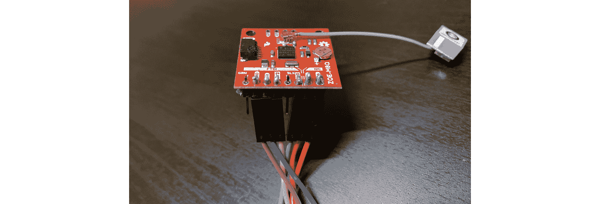

图 12.13-焊点

请注意，这张照片中已经连接了跳线，尽管我们还没有接触到它们。 每排八个标记为 NC 的两个孔不需要焊接，因为它们没有连接到任何东西。

## 连接 SPI 跳线

翻转开口板，使底面再次可见。 通过这样做，我们可以连接跳线。 对于 GND 使用黑色或灰色导线，对于 3v3 使用红色或橙色导线，以避免将它们混合在一起并损坏您的接线板。 对其他导线使用不同的颜色也很有帮助，这样我们就不会混淆 SPI 线。

以下是将我的六根跳线插入插线板下侧的插头插针时的母端：

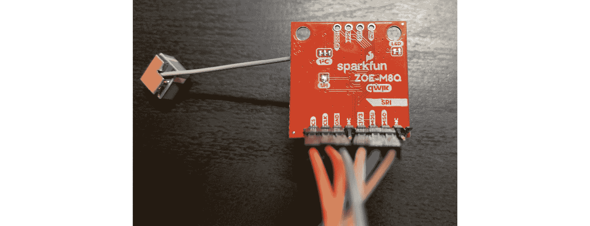

图 12.14-SPI 跳线的母端

要将 SPI 跳线的公端连接到 Beaglebone Black 上的 P9 扩展接头，请执行以下步骤：

1.  断开 Beaglebone Black 的电源。
2.  将 GPS 的接地线连接到 P9 上的引脚 1。
3.  将 GPS 上的 CS 线连接到 P9 上的针脚 17。
4.  将 GPS 的 CLK 线连接到 P9 上的 22 针。
5.  将 3v3 导线从 GPS 连接到 P9 的引脚 3。
6.  将 MOSI 线从 GPS 连接到 P9 上的 18 号针脚。
7.  将 GPS 上的 MISO 线连接到 P9 上的 21 号针脚上。

通常，最好先连接 GND 线，然后再连接任何其他线。 这可以保护 Beaglebone 的 I/O 线路不受 GPS 突破口上可能积聚的任何静电放电的影响。

连接时，六根跳线的凸端应如下所示：


图 12.15-SPI 跳线的凸端

在我的例子中，连接到引脚 1 的灰色导线是 GND，连接到引脚 3 的黄色导线是 3v3。 连接到 18 号针脚的蓝线是我的 GPS 突破口上的 MOSI。 请注意，不要将 3v3 导线插入 P9 上 VDD_3v3 引脚正下方的任何 VDD_5V 引脚中，否则可能会损坏您的接线板。

要启用Beaglebone Black 上的 SPI0 总线并打开 GPS 出口，请执行以下步骤：

1.  将 Debian Buster IoT microSD 卡插入您的 BeaGlebone Black。
2.  通过连接 5V 电源为 Beaglebone Black 通电。
3.  用以太网线将主板插入路由器的端口，将 Beaglebone Black 连接到互联网。
4.  在 Beaglebone Black 中 SSH 为`debian`：

    ```sh
    $ ssh debian@beaglebone.local
    ```

5.  密码为`temppwd`。
6.  导航到本章的目录，该目录可以在本书的存档中找到：

    ```sh
    $ cd MELP/Chapter12
    ```

7.  启用`/dev/spidev0.0`接口：

    ```sh
    $ sudo ./config-spi0.sh
    ```

导航到`spidev-test`源目录并连续运行`spidev_test`程序几次：

```sh
debian@beaglebone:~$ cd MELP/Chapter12/spidev-test
$ ./spidev_test
$ ./spidev_test
```

按*向上箭头*键使我们不必重新键入上一个命令。 在第二次尝试时，您应该会在 RX 缓冲区中看到以`$GNRMC`开头的 NMEA 字符串：

```sh
$ ./spidev_test 
spi mode: 0x0
bits per word: 8
max speed: 500000 Hz (500 KHz)
RX | 24 47 4E 52 4D 43 2C 2C 56 2C 2C 2C 2C 2C 2C 2C 2C 2C 2C 4E 2A 34 44 0D 0A 24 47 4E 56 54 47 2C  | $GNRMC,,V,,,,,,,,,,N*4D..$GNVTG,
```

如果您在 RX 缓冲区中看到类似于此处所示的 NMEA 语句，则一切都按计划进行。 祝贺你!。 这个项目最困难的部分现在已经结束了。 剩下的就是“仅仅是软件”，正如我们在业内喜欢说的那样。

如果`spidev_test`没有收到来自 gps 模块的 nmea 语句([https://en.wikipedia.org/wiki/NMEA_0183](https://en.wikipedia.org/wiki/NMEA_0183))，下面是我们应该问自己的一些问题：

1.  Is the cape universal device tree loaded?

    使用`sudo`到
    在`/opt/scripts/tools`下运行`version.sh`脚本进行验证。

2.  Did we run the `config-spi0` script without errors?

    如果遇到权限错误，请使用`sudo`重新运行`config-spi0`。 任何后续的`No such file or directory`错误都意味着 U-Boot 无法
    加载 CAPE 通用树。

3.  Is the power LED on the breakout board lighting up red?

    如果没有，则 3v3 未连接，因此 GPS 出口未通电。 如果你有一个万用表，那么你可以用它来确定 GPS Breakout 是否真的接收 Beaglebone Black 的 3.3V 电压。

4.  Is the GND jumper wire from the GPS Breakout connected to pin 1 or 2 on P9?

    GPS 突破口将不会在正确接地的情况下运行。

5.  Are there any loose jumper wires on either end?

    其余四条导线(CS、SCLK、MISO 和 MOSI)对于正常工作的 SPI 接口至关重要。

6.  Are the MOSI and MISO jumper wires swapped on either end?

    就像在 UART 上交换 TX 和 RX 行一样，这个错误是出了名的容易犯。 用彩色标记我们的跳线很有帮助，但用胶带给它们贴上名字的标签就更好了。

7.  Are the CS and SCLK jumper wires swapped on either end?

    为我们的跳线选择不同的颜色可以帮助我们避免类似的错误。

如果对所有这些问题的回答都通过了，那么我们现在就可以连接逻辑分析仪了。 如果您没有逻辑分析仪，那么我建议您重新检查 jp1 跳线和所有六个焊点。 确保 jp1 跳线焊盘正确连接。 填充插头销与其周围的金属环之间的任何间隙。 清除任何可能会使两个相邻引脚短路的多余焊料。 在可能缺少焊料的地方添加一些焊料。 一旦您对此返工感到满意，请重新连接跳线，然后重新尝试此练习。 如果运气好的话，这一次的结果会更好或不同。

本练习的成功完成结束了本项目所需的所有焊接和布线。 如果您急于看到成品投入使用，您可以跳过下一节，直接跳到*通过 SPI*接收 NMEA 消息一节。 一旦您将 NMEA 数据从 GPS 模块传输到终端窗口，我们就可以从这里停止的地方继续学习 SPI 信号和数字逻辑。

# 用逻辑分析仪探测 SPI 信号

即使您成功地从您的 GPS 模块接收到 NMEA，您也应该附加一个逻辑分析仪，如 Saleae Logic 8(如果您有的话)。 探测 SPI 信号有助于我们理解 SPI 协议是如何工作的，并在出错时充当强大的调试助手。 在本节中，我们将使用 Saleae Logic 8 对 Beaglebone Black 和 Zoe-M8Q 之间的 SPI 信号进行采样。 如果四个 SPI 信号中的任何一个信号出现明显故障，逻辑分析器就应该让这个错误变得显而易见。

Saleae Logic 8 需要一台带 USB 2.0 端口的笔记本电脑或台式电脑。 Saleae Logic 1 软件可用于 Linux、Mac OS X 和 Windows。 Linux 版本的 Logic 附带了一个`installdriver.sh`脚本，该脚本授予软件访问设备的权限。 在 Logic 安装的`Drivers`目录中找到该脚本并从命令行运行它，这样就不需要每次都使用`sudo`启动 Logic。 在安装文件夹中创建`Logic`可执行文件的快捷方式，并将其放在桌面或启动栏上，以加快访问速度。

在系统上安装 Logic 1 软件后，使用随附的高速 USB 电缆连接到该设备。 启动`Logic`应用，等待软件连接并配置设备。 当逻辑窗口显示顶部已**连接**时，我们就可以开始连接测试台了。 用你的拇指在每个测试夹子的宽端向下按以伸展抓取器，然后松开以卡住销子。 使用放大率读取通孔旁边的标签，并确保测试夹牢牢地缠绕在各自的针脚上。

要使用 Saleae Logic 8 组装 SPI 测试台，请执行以下步骤：

1.  Connect the nine-pin cable harness to the logic analyzer. Align the cable harness so that the gray lead points at the ground symbol and the black lead points at the **1** are on the underside of the logic analyzer, as shown here:

    

    图 12.16-Saleae Logic 8

2.  将测试夹连接到灰色、橙色、红色、棕色和黑色导线的末端。 每个测试夹子都有两个金属引脚，可以插入导线末端的连接器中。 只将这些引脚中的一个连接到导线上。 黑色、棕色、红色和橙色引线对应于逻辑分析仪中的前四个通道。 灰色导线始终连接到 GND。
3.  断开Beaglebone Black 与 5V电源的连接，使其关闭。
4.  将除 3v3 外的所有跳线的母端从我们焊接到 GPS 接线上的插头针脚中拔出。
5.  用橙色引线上的夹子抓住 GPS 引线上的 CS 引脚。
6.  用红色引线上的夹子抓住 GPS 出口上的 SCLK 针脚。
7.  用灰色引线上的夹子抓住 GPS 引线上的接地引脚。
8.  跳过 NC 和 3V3 引脚，因为我们不会探测这些引脚。
9.  用黑色引线上的夹子抓住 GPS 引线上的 MOSI 引脚。
10.  用棕色引线上的夹子抓住 GPS Breakout 上的味增别针。
11.  Reconnect the female ends of the jumper wires to the header pins we soldered onto the GPS Breakout. If the jumper wires are already connected, then just slide the female ends up the header pins a bit and attach the test clips. Push the female ends down onto the pins so that they do not slip off easily. The finished assembly should look something like this:

    

    图 12.17-用于探测的测试夹子

    在我的例子中，黄色跳线是 3v3，所以没有附加测试夹。 蓝色跳线是 MOSI，由逻辑分析仪的黑色引线探测。

12.  将 Beaglebone Black 重新连接至 5V 电源。 GPS 分支应通电，板载电源 LED 应亮起红色。

要配置 Logic 8，使其在四个 SPI 通道上采样，请执行以下步骤：

1.  启动 Logic 应用并等待其通过 USB 端口连接到逻辑分析仪。
2.  Click on the **+** sign in the **Analyzers** pane to add an analyzer:

    

    图 12.18-添加分析器

3.  从**添加分析器**弹出菜单中选择**SPI**。
4.  Click the **Save** button in the **Analyzer Settings** dialog:

    

    图 12.19-分析器设置

    **CPOL**和**CPHA**代表时钟极性和时钟相位。 CPOL 为 0 表示时钟在不活动时为低，而 CPOL 为 1 表示时钟在不活动时为高。 CPHA 为 0 表示数据在时钟前沿有效，而 CPHA
    为 1 表示数据在时钟后沿有效。 有四种不同的 SPI 模式可用：模式 0(CPOL=0，CPHA=0)、模式 1(CPOL=0，CPHA=1)、模式 2(CPOL=1，CPHA=1)和模式 3(CPOL=1，CPHA=0)。 ZOE-M8Q 默认为 SPI 模式 0。

5.  Click on the cog button next to **Channel 4** on the left sidebar to bring up the **Channel Settings** pop-up menu:

    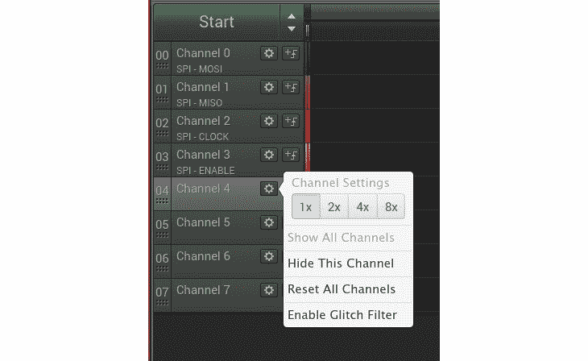

    图 12.20-隐藏此通道

6.  从**通道设置**菜单中选择**隐藏此通道**。
7.  对通道 5、6 和 7 重复*步骤 5*和*6*，以便只有通道 0 到 3 可见。
8.  单击左侧栏上通道 0(MOSI)旁边的齿轮按钮，调出**通道设置**弹出菜单。
9.  Select **4x** from the **Channel Settings** menu:

    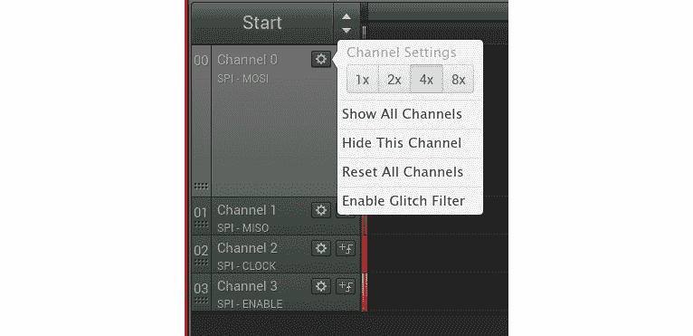

    图 12.21-放大通道

10.  对通道 1 至 3(MISO、时钟和启用)重复*步骤 8*和*9*，以放大这些信号图形。
11.  单击左侧侧栏上通道 3(启用)齿轮按钮右侧的按钮，调出**触发设置**弹出菜单。 使能对应于 SPI CS，因此我们希望在接收到来自该通道的事件时开始采样。
12.  Select the falling edge symbol as the trigger from the **Trigger Settings** menu:

    

    图 12.22-选择下降沿触发器

13.  单击左上角**开始**按钮上的上/下箭头符号，设置采样速度和持续时间。
14.  将速度降低到**2 MS/s**，并将持续时间设置为**50 毫秒**：


图 12.23-降低速度和持续时间

根据经验，采样率应该至少是带宽的四倍。 按照这种方法，1 MHz SPI 端口需要的最低采样速率为 4 MS/s。由于`spidev_test`将 SPI 端口的速度设置为 500 kHz，因此 2 MS/s 的采样速率应该刚好可以跟上。 欠采样会导致不规则的时钟信号。 Beaglebone Black 上的 SPI 端口的运行速度可高达 16 MHz。 事实上，16 MHz 是我们的自定义`nova.dts`中的默认速度`spi0.0`，如`dmesg`所示。

要从 Beaglebone Black 捕捉 SPI 传输，请点击左上角的**Start**按钮。 如果 CS 信号运行正常，则在运行`spidev_test`程序之前不应开始捕获。

当从`debian@bealglebone`终端执行`spidev_test`时，应触发采样，并在**逻辑**窗口中出现如下图形：

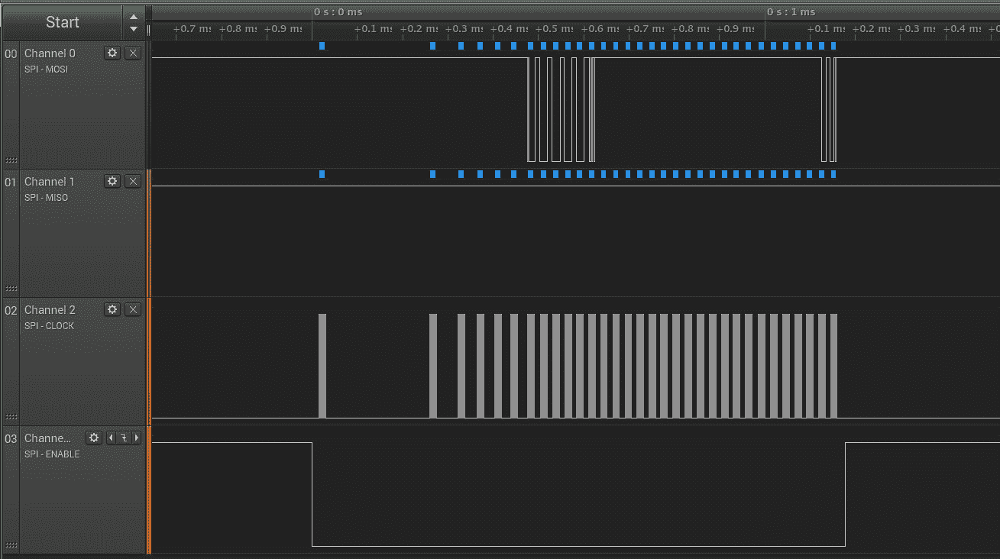

图 12.24-spidev_test 变速箱

使用鼠标上的滚轮可以放大和缩小信号图形中任何有趣的部分。 请注意，只要通道 0(MOSI)上的 Beaglebone Black 发送数据，通道 3 上的使能图形就会降为低电平。 SPI 的 CS 信号通常为**有效低**，因此当没有数据传输时，使能图跳高。 如果使能图保持高电平，则不会向 GPS 模块发送更多数据，因为该外设永远不会在 SPI 总线上使能。

以下是频道 0 上一段有趣的 MOSI 图表的特写：


图 12.25-MOSI 网段

注意，记录的**0x40 0x00 0x00 0x00 0x95**字节序列与`spidev_test`的默认 Tx 缓冲区的内容相匹配。 如果您在通道 1 上看到相同的字节序列，则 MOSI 和 MISO 导线可能在您的电路
中的某个位置互换。

以下是 SPI 传输的末尾：

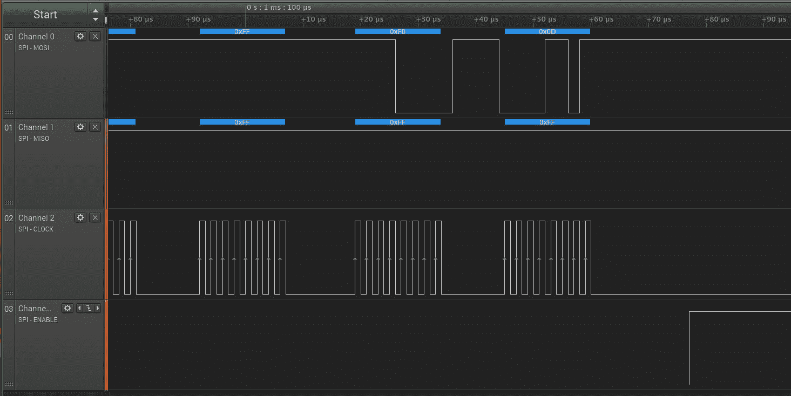

图 12.26-spidev_test 传输结束

请注意，该数据段通道 0(MOSI)的最后两个字节为 0xF0 和 0x0D，与默认发送缓冲器中的情况相同。 此外，请注意，每当传输一个字节时，通道 2 上的时钟信号都会振荡固定的周期数。 如果时钟信号看起来不规则，那么要么是正在发送的数据丢失或损坏，要么是您的采样率不够快。 通道 1(MISO)的信号图形在整个会话期间保持高电平，因为在第一次 SPI 传输时没有收到来自 GPS 模块的 NMEA 消息。

如果通道 3(使能)上的信号设置为逻辑 0 状态，则表明正在探测的引脚在未设置`PULL_UP`位的情况下进行了多路复用。 当 CS 信号无效时，`PULL_UP`位的作用类似于上拉电阻器，使线路保持高电平，因此术语“低电平有效”。 如果您在 2 以外的通道上看到看起来像时钟信号的东西，则可能是我们探测了错误的引脚，或者是将 SCLK 换成了另一条线。 如果信号图与最后三个图中的图像匹配，则我们已成功验证 SPI 是否按预期运行。

现在，我们的嵌入式武器库中又多了一个强大的工具。 除 SPI 外，逻辑 8 还可用于探测和分析 I2C 信号。 在下一节中，我们将再次使用它来检查从 GPS 模块接收的 NMEA 消息。

# 通过 SPI 接收 NMEA 消息

NMEA 是大多数 GPS 接收机支持的数据消息格式。 默认情况下，ZOE-M8Q 输出 NMEA 语句。 这些句子是 ASCII 文本，以`$`字符开头，后跟逗号分隔的字段。 原始 NMEA 消息并不总是易于阅读，因此我们将使用解析器向数据字段添加有用的注释。

我们要做的是从`/dev/spidev0.0`接口读取来自 ZOE-M8Q 的 NMEA 语句流。 由于 SPI 是全双工的，这也意味着写入`/dev/spidev0.0`，尽管我们可以简单地一遍又一遍地写入相同的 0xFF 值。 有一个叫做`spi-pipe`的程序就是为做这类事情而设计的。 它和`spi-config`一起是`spi-tools`包的一部分。 我没有依赖于`spi-pipe`，而是选择修改`spidev-test`，以便它将来自 GPS 模块的 ASCII 输入流式传输到标准输出。 我的`spidev-read`程序的源代码可以在本书的代码归档中找到，位于`MELP/Chapter12/spidev-read`目录中。

要编译`spidev_read`程序，请使用以下命令：

```sh
debian@beaglebone:~$ cd MELP/Chapter12/spidev-read
$ gcc spidev_read.c -o spidev_read
```

现在，运行`spidev_read`程序：

```sh
$ ./spidev_read 
spi mode: 0x0
bits per word: 8
max speed: 500000 Hz (500 KHz)
$GNRMC,,V,,,,,,,,,,N*4D
$GNVTG,,,,,,,,,N*2E
$GNGGA,,,,,,0,00,99.99,,,,,,*56
$GNGSA,A,1,,,,,,,,,,,,,99.99,99.99,99.99*2E
$GNGSA,A,1,,,,,,,,,,,,,99.99,99.99,99.99*2E
$GPGSV,1,1,00*79
$GLGSV,1,1,00*65
$GNGLL,,,,,,V,N*7A
[…]
^C
```

您应该每秒看到一次 NMEA 语句。 按*Ctrl+C*取消流并返回到命令行提示符。

让我们用 Logic 8 捕获这些 SPI 传输：

1.  单击左上角的**Start**按钮上的向上/向下箭头符号更改采样持续时间。
2.  将新持续时间设置为`3`秒。
3.  单击左上角的**开始**按钮。
4.  再次运行`spidev_read`程序。

逻辑软件应在 3 秒后停止捕获，**Logic**窗口中应出现类似于以下内容的图形：

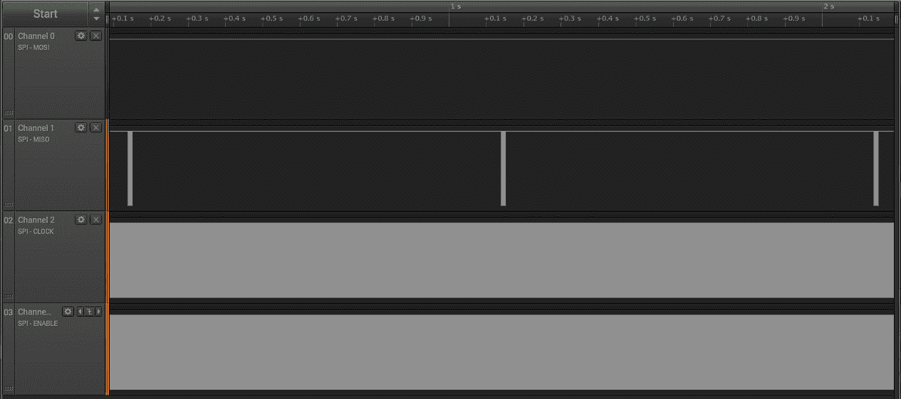

图 12.27-spidev_read 传输

我们可以清楚地看到第一频道(MISO)上 NMEA 句子的三个突发点，恰好相隔 1 秒。

放大看一下以下 NMEA 句子中的一句：

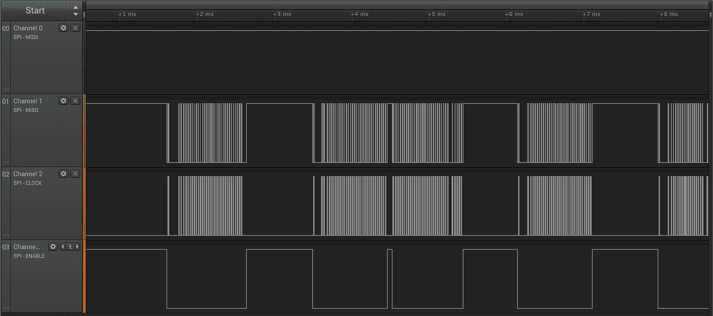

图 12.28-NMEA 句子段

请注意，MISO 通道上的数据现在与使能信号中的下降和时钟信号上的振荡一致。 `spidev_read`程序仅将`0xFF`字节写入 MOSI，因此通道 0 上没有活动。

我已经包括了一个用 Python 编写的 NMEA 解析器脚本，以及`spidev_read`源代码。 该`parse_nmea.py`脚本依赖于`pynmea2`库。

要在 Beaglebone Black 上安装`pynmea2`，请使用以下命令：

```sh
$ pip3 install pynmea2
Looking in indexes: https://pypi.org/simple, https://www.piwheels.org/simple
Collecting pynmea2
  Downloading https://files.pythonhosted.org/packages/88/5f/a3d09471582e710b4871e41b0b7792be836d6396a2630dee4c6ef44830e5/pynmea2-1.15.0-py3-none-any.whl
Installing collected packages: pynmea2
Successfully installed pynmea2-1.15.0
```

要将`spidev_read`的输出通过管道传输到 NMEA 解析器，请使用以下命令：

```sh
$ cd MELP/Chapter12/spidev-read
$ ./spidev_read | ./parse_nmea.py 
```

解析的 NMEA 输出如下所示：

```sh
<RMC(timestamp=None, status='V', lat='', lat_dir='', lon='', lon_dir='', spd_over_grnd=None, true_course=None, datestamp=None, mag_variation='', mag_var_dir='') data=['N']>
<VTG(true_track=None, true_track_sym='', mag_track=None, mag_track_sym='', spd_over_grnd_kts=None, spd_over_grnd_kts_sym='', spd_over_grnd_kmph=None, spd_over_grnd_kmph_sym='', faa_mode='N')>
<GGA(timestamp=None, lat='', lat_dir='', lon='', lon_dir='', gps_qual=0, num_sats='00', horizontal_dil='99.99', altitude=None, altitude_units='', geo_sep='', geo_sep_units='', age_gps_data='', ref_station_id='')>
<GSA(mode='A', mode_fix_type='1', sv_id01='', sv_id02='', sv_id03='', sv_id04='', sv_id05='', sv_id06='', sv_id07='', sv_id08='', sv_id09='', sv_id10='', sv_id11='', sv_id12='', pdop='99.99', hdop='99.99', vdop='99.99')>
<GSA(mode='A', mode_fix_type='1', sv_id01='', sv_id02='', sv_id03='', sv_id04='', sv_id05='', sv_id06='', sv_id07='', sv_id08='', sv_id09='', sv_id10='', sv_id11='', sv_id12='', pdop='99.99', hdop='99.99', vdop='99.99')>
<GSV(num_messages='1', msg_num='1', num_sv_in_view='00')>
<GSV(num_messages='1', msg_num='1', num_sv_in_view='00')>
<GLL(lat='', lat_dir='', lon='', lon_dir='', timestamp=None, status='V', faa_mode='N')>
[…]
```

我的 GPS模块看不到任何卫星，也无法获得固定位置。 这可能是由于许多原因，比如选择了错误的 GPS 天线，或者没有清晰的天空视线。 如果您正在经历类似的失败，这是可以接受的。 射频很复杂，本章的目的只是为了证明我们可以在 GPS 模块工作的情况下进行 SPI 通信。 现在我们已经做到了这一点，我们可以开始试验备用 GPS 天线和 Zoe-M8Q 的更多高级功能，例如它对更丰富的 Ubx 消息协议的支持。

随着 NMEA 数据现在流向终端，我们的项目完成了。 我们成功地验证了 Beaglebone Black 可以通过 SPI 与 Zoe-M8Q 进行通信。 如果您跳过了*使用逻辑分析仪探测 SPI 信号*部分，现在是继续该练习的好时机。 与 I2C 一样，大多数 SoC 都支持 SPI，因此值得熟悉，特别是当您的应用需要高速外设时。

# 摘要

在本章中，我们学习了如何将外围设备与流行的 SoC 集成。 要做到这一点，我们必须使用从数据表和原理图中收集的知识来复用引脚并修改设备树源。 在没有成品硬件的情况下，我们不得不依靠分路板并进行一些焊接，以便将部件与开发板连接在一起。 最后，我们学习了如何使用逻辑分析仪来验证和排除电信号故障。 现在我们有了可以工作的硬件，我们可以开始开发我们的嵌入式应用了。

接下来的两章都是关于系统启动和`init`程序的不同选项，从简单的 BusyBox`init`到更复杂的系统，如 System V`init`、`systemd`和 BusyBox 的`runit`。 您选择的`init`程序可能会在引导时间和容错方面对产品的用户体验产生重大影响。

# 进一步阅读

以下资源提供了有关本章中介绍的主题的详细信息：

*   *SPI 接口简介*，Piyu Dhaker：[https://www.analog.com/en/analog-dialogue/articles/introduction-to-spi-interface.html](https://www.analog.com/en/analog-dialogue/articles/introduction-to-spi-interface.html)
*   *焊接很容易*，作者：Mitch Altman，Andie Nordgren 和 Jeff Keyzer：[HTTPS：//mightyohm.com/blog/2011/04/焊接很容易-漫画书](https://mightyohm.com/blog/2011/04/soldering-is-easy-comic-book)
*   *SparkFun GPS Breakout(ZOE-M8Q 和 SAM-M8Q)连接指南*，作者：Elias the SparkFun：[https://learn.sparkfun.com/tutorials/sparkfun-gps-breakout-zoe-m8q-and-sam-m8q-hookup-guide](https://learn.sparkfun.com/tutorials/sparkfun-gps-breakout-zoe-m8q-and-sam-m8q-hookup-guide)