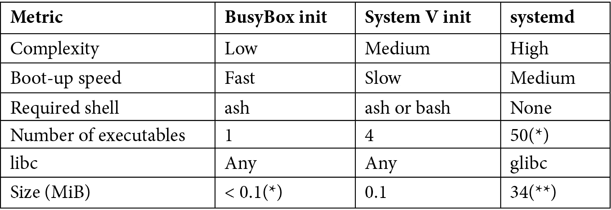

# *第 13 章*：启动-init 程序

在[*第 4 章*](04.html#_idTextAnchor085)，*配置和构建内核*中，我们研究了内核如何引导到它启动第一个程序`init`的位置。 在[*第 5 章*](05.html#_idTextAnchor122)，*构建根文件系统*，以及[*第 6 章*](06.html#_idTextAnchor164)，*选择构建系统*中，我们研究了创建不同复杂性的根文件系统，所有这些都包含一个`init`程序。 现在，是更详细地查看`init`程序的时候了，并发现为什么它对
系统的其余部分如此重要。

`init`有许多可能的实现。 在本章中，我将描述三个主要的组件：BusyBox`init`、System V`init`和`systemd`。 对于每一种情况，我都会概述它的工作原理和最适合的系统类型。 这其中的一部分是平衡大小、复杂性和灵活性之间的权衡。 我们将学习如何使用 BusyBox`init`和 System V`init`启动守护进程。 我们还将学习如何向`systemd`添加执行相同操作的服务。

在本章中，我们将介绍以下主题：

*   在内核引导之后
*   介绍`init`计划
*   BusyBox`init`
*   系统 V`init`
*   `systemd`

# 技术要求

要按照示例操作，请确保您具备以下条件：

*   一种基于 Linux 的主机系统
*   Buildroot 2020.02.9 LTS 版本
*   Yocto 3.1(邓费尔)LTS 版本

您应该已经为[*第 6 章*](06.html#_idTextAnchor164)，*选择构建系统*安装了 Buildroot 的 2020.02.9 LTS 版本。 如果没有，请参考*Buildroot 用户手册*([https://buildroot.org/downloads/manual/manual.html](https://buildroot.org/downloads/manual/manual.html))的*系统要求*部分，然后再按照[*第 6 章*](06.html#_idTextAnchor164)中的说明在您的 LINUX 主机上安装 Buildroot。

您应该已经为[*第 6 章*](06.html#_idTextAnchor164)，*选择构建系统*构建了 Yocto 的 3.1(Dunfall)LTS 发行版。 如果没有，请参考*Yocto Project Quick Build*指南([https://www.yoctoproject.org/docs/current/brief-yoctoprojectqs/brief-yoctoprojectqs.html](https://www.yoctoproject.org/docs/current/brief-yoctoprojectqs/brief-yoctoprojectqs.html))的*Compatible Linux Distribution*和*Build Host Packages*部分，然后根据[*第 6 章*](06.html#_idTextAnchor164)中的说明在您的 LINUX 主机上构建 Yocto。

本章的所有代码都可以在本书的 GitHub 存储库的`Chapter13`文件夹中找到：[https://github.com/PacktPublishing/Mastering-Embedded-Linux-Programming-Third-Edition](https://github.com/PacktPublishing/Mastering-Embedded-Linux-Programming-Third-Edition)。

# 在内核引导之后

我们在[*第 4 章*](04.html#_idTextAnchor085)，*Configuring and Building the Kernel*中看到了内核引导代码如何查找根文件系统(`initramfs`或内核命令行上`root=`指定的文件系统)，然后执行一个程序，缺省情况下，`initramfs`的根文件系统为`/init`，常规文件系统的默认文件系统为`/sbin/init`。 `init`程序具有`root`权限，并且由于它是第一个运行的进程，因此它的**进程 ID**(**PID**)为`1`。 如果由于某种原因无法启动`init`，内核将死机。

`init`程序是所有其他进程的祖先，如下所示，在一个简单的嵌入式 Linux 系统上运行`pstree`命令：

```sh
# pstree -gn
init(1)-+-syslogd(63)
        |-klogd(66)
        |-dropbear(99)
        `-sh(100)---pstree(109)
```

`init`程序的任务是控制用户空间中的引导进程并将其设置为运行。 它可能与运行 Shell 脚本的`shell`命令一样简单-在[*第 5 章*](05.html#_idTextAnchor122)，*构建根文件系统*的开头有一个这样的示例-但在大多数情况下，您将使用专用的`init`守护进程来执行以下任务：

*   在引导期间，在内核转移控制之后，`init`程序启动其他守护程序，并配置系统参数和其他使系统进入工作状态所需的设置。
*   或者，它在允许
    登录 shell 的终端上启动登录守护进程，比如`getty`。
*   它采用由于其直接父进程终止而变成孤立的进程，并且线程组中没有其他进程。
*   它通过捕获`SIGCHLD`信号并收集返回值来响应`init`的任何直接子进程的终止，以防止它们成为僵尸进程。我将在[*第 17 章*](17.html#_idTextAnchor473)，*了解进程和线程*中更多地讨论僵尸。
*   或者，它还可以重新启动那些已终止的守护进程。
*   它处理系统关机。

换句话说，`init`管理系统从启动到关闭的生命周期。 有一种观点认为，`init`非常适合处理其他运行时
事件，例如新硬件和模块的加载和卸载。 这就是`systemd`所做的。

# 介绍初始化程序

您是在嵌入式设备中最有可能遇到的三个`init`程序是 BusyBox`init`、System V`init`和`systemd`。 Buildroot 可以选择以 BusyBox`init`作为缺省值构建所有这三个选项。 Yocto 项目允许您轻松地在系统 V`init`和系统 V`systemd`之间进行选择，并将系统 V`init`作为默认设置。 虽然 Yocto 微不足道的发行版附带了 BusyBox`init`，但大多数其他分布层没有。

下表提供了一些用于比较这三个指标的指标：



(*)BusyBox`init`是 BusyBox 的单个可执行文件的一部分，该文件针对磁盘上的大小
进行了优化。

(**)基于`systemd`的 Buildroot 配置。

一般说来，从 BusyBox`init`到`systemd`，灵活性和复杂性都会增加。

# BusyBox 初始化

**BusyBox**有一个最小的`init`程序，该程序使用配置文件`/etc/inittab`，
定义在启动时启动程序和在关闭时停止程序的规则。 通常，
实际工作是由 shell 脚本完成的，按照惯例，这些脚本放在
`/etc/init.d`目录中。

`init`以读取`/etc/inittab`开始。 其中包含要运行的程序列表，每行一个，格式如下：

```sh
<id>::<action>:<program>
```

这些参数的作用如下：

*   `id`：这是命令的控制终端。
*   `action`：这包括运行该命令的条件，如下面的列表所示。
*   `program`：这是要运行的程序。

操作如下：

*   `sysinit`：当`init`在任何其他类型的动作
    之前启动时运行程序。
*   `respawn`：运行程序，如果程序终止则重新启动。 它通常用于将程序作为守护程序运行。
*   `askfirst`：这与`respawn`相同，但它将消息`Please press Enter to activate this console`打印到控制台，并在按下*Enter*后运行程序。 它用于在不提示输入用户名或密码的情况下在
    终端上启动交互式 shell。
*   `once`：运行一次程序，但如果程序终止，则不会尝试重新启动它。
*   `wait`：运行程序并等待其完成。
*   `restart`：当`init`接收到`SIGHUP`信号时运行程序，指示它应该重新加载`inittab`文件。
*   `ctrlaltdel`：当`init`接收到`SIGINT`信号时运行程序，通常是按控制台上的*Ctrl*+*Alt*+*Del*。
*   `shutdown`：在`init`关闭时运行程序。

下面是一个小示例，它挂载`proc`和`sysfs`，并在
串行接口上运行一个 shell：

```sh
null::sysinit:/bin/mount -t proc proc /proc
null::sysinit:/bin/mount -t sysfs sysfs /sys
console::askfirst:-/bin/sh
```

对于希望启动少量守护进程并可能在串行终端上启动登录 shell 的简单项目，手动编写脚本很容易。 如果您正在创建自己的**卷**(**Ryo**)嵌入式 Linux，这将是合适的。 但是，您会发现，随着要配置的内容数量的增加，手写的`init`脚本很快就会变得不可维护。 它们不是非常模块化，因此每次添加或删除新组件时都需要更新。

## 构建 root 初始化脚本

Buildroot 多年来一直在有效地利用 BusyBox`init`。 Buildroot 在`/etc/init.d/`中有两个脚本，名为`rcS`和`rcK`。 第一个脚本在启动时运行，并迭代`/etc/init.d/`中名称以大写`S`开头后跟两位数的所有脚本，并按的数字顺序运行它们。 这些是启动脚本。 `rcK`脚本在关机时运行，并以大写`K`开头，后跟两位数字迭代所有脚本，并按数字顺序运行它们。 这些是杀戮脚本。

有了这些，Buildroot 包就可以很容易地提供它们自己的启动和终止脚本，使用两位数来规定它们应该运行的顺序，这样系统就变得可扩展了。 如果您使用的是 Buildroot，则这是透明的。 如果没有，您可以将其用作编写您自己的 BusyBox`init`脚本的模型。

与 BusyBox`init`一样，System V`init`依赖于`/etc/init.d`内部的 shell 脚本和一个`/etc/inittab`配置文件。 虽然这两个`init`系统在许多方面相似，但系统 V`init`有更多的功能和更长的历史。

# 系统 V 初始化

这个`init`程序的灵感来自 Unix system V 的程序，因此可以追溯到 20 世纪 80 年代中期。 Linux 发行版中最常见的版本最初是由 Miquel van Smoorenburg 编写的。 直到最近，它还是几乎所有台式机和服务器发行版以及相当数量的嵌入式系统的`init`守护进程。 然而，近年来，它已被`systemd`所取代，我将在下一节中描述这一点。

我刚才描述的 BusyBox`init`守护进程只是 System V`init`的精简版本。 与 BusyBox`init`相比，System V`init`有两个优势：

*   首先，引导脚本是以众所周知的模块化格式编写的，这使得在构建时或运行时添加新包变得很容易。
*   其次，它有**运行级别**的概念，允许在从一个运行级别切换到另一个运行级别时一次性启动或停止程序集合。

共有八个运行级别，编号从`0`到`6`，外加`S`：

*   `S`：运行启动任务
*   `0`：停止系统
*   `1`至`5`：可通用
*   `6`：重新启动系统

级别`1`到`5`可以随意使用。 在桌面 Linux 发行版上，它们通常按如下方式分配：

*   `1`：单用户
*   `2`：无网络配置的多用户
*   `3`：具有网络配置的多用户
*   `4`：未使用
*   `5`：多用户图形化登录

`init`程序启动由`/etc/inittab`中的`initdefault`行给出的默认运行级别，如下所示：

```sh
id:3:initdefault:
```

您可以在运行时使用`telinit [runlevel]`命令更改运行级别，该命令会向`init`发送一条消息。 您可以使用`runlevel`命令查找当前运行级别和上一个运行级别。 下面是一个例子：

```sh
# runlevel
N 5
# telinit 3
INIT: Switching to runlevel: 3
# runlevel
5 3
```

最初，`runlevel`命令的输出为`N 5`，表示没有以前的运行级别，因为启动后运行级别没有更改，而当前运行级别为`5`。 更改运行级别后，输出为`5 3`，表明已经有
从`5`到`3`的转换。

`halt`和`reboot`命令分别切换到运行级别`0`和`6`。 您可以通过在内核命令行中指定一个从`0`到`6`的单个数字作为
来覆盖默认的运行级别。 例如，要强制运行级别为单用户，您可以将`1`附加到内核命令行，如下所示：

```sh
console=ttyAMA0 root=/dev/mmcblk1p2 1
```

每个运行级都有许多停止程序的脚本(称为终止脚本)和另一个启动程序的组(启动脚本)。 当进入新的运行级别时，`init`首先运行新级别中的终止脚本，然后运行新级别中的启动脚本。 当前正在运行且在新运行级别中既没有启动脚本也没有终止脚本的守护进程将被发送`SIGTERM`信号。 换句话说，切换运行级别上的默认操作是终止守护进程，除非被告知要终止守护进程。

事实上，运行级别在嵌入式 Linux 中使用的并不多：大多数设备只是引导到默认的运行级别并停留在那里。 我有一种感觉，部分原因是大多数人没有意识到这一点。

给小费 / 翻倒 / 倾覆

运行级别是在模式之间切换的一种简单方便的方式，例如，从生产模式切换到维护模式。

系统 V`init`是 Buildroot 和 Yocto 项目中的一个选项。 在这两种情况下，`init`脚本都去掉了任何`bash`shell 细节，因此它们将与 BusyBox`ash`shell 一起工作。 然而，Buildroot 通过将 BusyBox`init`程序替换为 System V`init`并添加一个模仿 BusyBox 行为的`inittab`来进行某种程度上的欺骗。 Buildroot 不实现运行级别，除非切换到级别`0`或`6`会停止或重新启动系统。

接下来，让我们看一下的一些细节。 以下示例取自 Yocto Project 3.1 版本。 其他发行版实现`init`脚本的方式可能略有不同。

## inittab

`init`程序从读取`/etc/inttab`开始，该`/etc/inttab`包含定义在每个运行级别上发生的事情的个条目。 该格式是我在上一节中描述的 BusyBox`inittab`的扩展版本，这并不奇怪，因为 BusyBox 首先从 System V 借用了它。

`inittab`中每行的格式如下：

```sh
id:runlevels:action:process
```

字段如下所示：

*   `id`：最多四个字符的唯一标识符。
*   `runlevels`：应为其执行此条目的运行级别。 这在 BusyBox`inittab`中为空。
*   `action`：下一段给出的关键字之一。
*   `process`：要运行的命令。

操作与 BusyBox`init`：`sysinit`、`respawn`、`once`、`wait`、`restart`、`ctrlaltdel`和`shutdown`相同。 但是，系统 V`init`没有特定于 BusyBox 的`askfirst`。

例如，这是由`qemuarm`机器的 Yocto Project 目标`core-image-minimal`提供的完整`inittab`：

```sh
# /etc/inittab: init(8) configuration.
# $Id: inittab,v 1.91 2002/01/25 13:35:21 miquels Exp $
# The default runlevel.
id:5:initdefault:
# Boot-time system configuration/initialization script.
# This is run first except when booting in emergency (-b) mode.
si::sysinit:/etc/init.d/rcS
# What to do in single-user mode.
~~:S:wait:/sbin/sulogin
# /etc/init.d executes the S and K scripts upon change
# of runlevel.
#
# Runlevel 0 is halt.
# Runlevel 1 is single-user.
# Runlevels 2-5 are multi-user.
# Runlevel 6 is reboot.
l0:0:wait:/etc/init.d/rc 0
l1:1:wait:/etc/init.d/rc 1
l2:2:wait:/etc/init.d/rc 2
l3:3:wait:/etc/init.d/rc 3
l4:4:wait:/etc/init.d/rc 4
l5:5:wait:/etc/init.d/rc 5
l6:6:wait:/etc/init.d/rc 6
# Normally not reached, but fallthrough in case of emergency.
z6:6:respawn:/sbin/sulogin
AMA0:12345:respawn:/sbin/getty 115200 ttyAMA0
# /sbin/getty invocations for the runlevels
#
# The "id" field MUST be the same as the last
# characters of the device (after "tty").
#
# Format:
# <id>:<runlevels>:<action>:<process>
#
1:2345:respawn:/sbin/getty 38400 tty1
```

第一个条目`id:5:initdefault`将默认值`runlevel`设置为`5`。 下一个条目`si::sysinit:/etc/init.d/rcS`在引导时运行`rcS`脚本。 稍后会有更多关于这方面的信息。 再往前一点，有一组以`l0:0:wait:/etc/init.d/rc 0`开头的 6 个条目。 每次运行级别发生变化时，它们都会运行`/etc/init.d/rc`脚本。 此脚本负责处理启动脚本和
终止脚本。

在接近`inittab`的末尾，有一个条目，它运行`getty`守护进程，在输入运行级别`1`到`5`时在`/dev/ttyAMA0`上生成
登录提示，从而允许您登录并获得交互式 shell：

```sh
AMA0:12345:respawn:/sbin/getty 115200 ttyAMA0
```

`ttyAMA0`设备是我们用 QEMU 模拟的 ARM 多功能板上的串行控制台；对于其他开发板，它将有所不同。 还有一个条目要在`tty1`上运行`getty`，该条目在输入运行级别`2`到`5`时触发。 这是一个虚拟控制台，如果您使用`CONFIG_FRAMEBUFFER_CONSOLE`或`VGA_CONSOLE`构建内核，则通常会将其映射到图形屏幕。 桌面 Linux 发行版通常在虚拟终端`1`到`6`上产生 6 个`getty`守护进程，您可以使用组合键*Ctrl*+*Alt*+*F1*到*Ctrl*+*Alt*+*F6*来选择它们，虚拟终端`7`为图形屏幕保留。 Ubuntu 和 Arch Linux 是值得注意的例外，因为它们使用虚拟终端`1`处理图形。 虚拟终端很少在嵌入式设备上使用。

`sysinit`条目运行的是的`/etc/init.d/rcS`脚本只不过是输入运行级别`S`：

```sh
#!/bin/sh
[…]
exec /etc/init.d/rc S
```

因此，输入的第一个运行级别是`S`，然后是默认运行级别`5`。 请注意，运行级别`S`不会被记录，也不会被`runlevel`命令显示为先前的运行级别。

## init.d 脚本

需要响应运行级更改的每个组件在`/etc/init.d`中都有一个脚本来执行更改。 脚本应该有两个参数：`start`和`stop`。 稍后我会举一个例子来说明这一点。

运行级处理脚本`/etc/init.d/rc`将它要切换到的运行级作为
参数。 对于每个运行级别，都有一个名为`rc<runlevel>.d`的目录：

```sh
# ls -d /etc/rc*
/etc/rc0.d /etc/rc2.d /etc/rc4.d /etc/rc6.d
/etc/rc1.d /etc/rc3.d /etc/rc5.d /etc/rcS.d
```

在那里，您将找到一组以大写`S`开头，后跟两位数字的脚本，您还可以找到以大写`K`开头的脚本。 这两个脚本分别是开始脚本和终止脚本。 以下是 runlevel`5`的脚本示例：

```sh
# ls /etc/rc5.d
S01networking S20hwclock.sh S99rmnologin.sh S99stop-bootlogd
S15mountnfs.sh S20syslog
```

这些实际上是指向`init.d`中相应脚本的符号链接。 `rc`脚本首先运行以`K`开头的所有脚本，添加`stop`参数，然后运行以`S`开头的那些脚本，添加`start`参数。 同样，两位数的代码提供了脚本应该运行的顺序。

## 添加新的后台进程

假设您有一个名为`simpleserver`的程序，该程序被编写为传统的 Unix 守护进程；换句话说，它派生并在后台运行。 这种
程序的代码在`MELP/Chapter13/simpleserver`中。 您将需要这样的`init.d`脚本，您可以在`MELP/Chapter13/simpleserver-sysvinit`中找到该脚本：

```sh
#! /bin/sh 

case "$1" in 
      start) 
           echo "Starting simpelserver" 
           start-stop-daemon -S -n simpleserver -a /usr/bin/simpleserver 
           ;; 
     stop) 
           echo "Stopping simpleserver" 
           start-stop-daemon -K -n simpleserver 
           ;; 
     *) 
           echo "Usage: $0 {start|stop}" 
           exit 1 
esac 

exit 0
```

`start-stop-daemon`是一个帮助器函数，它可以更容易地操作这样的后台进程。 它最初来自 Debian 安装程序包`dpkg`，但大多数嵌入式系统都使用 BusyBox 的安装包。 它使用`-S`参数启动守护进程，确保任何时候都不会有超过一个实例在运行。 要停止守护进程，可以使用`-K`参数，该参数会使它发送一个信号(默认情况下是`SIGTERM`)，以指示守护进程该终止了。

要使`simpleserver`可操作，请将脚本复制到名为
`/etc/init.d/simpleserver`的目标目录，并使其可执行。 然后，从要运行此程序的每个运行级别添加链接；在本例中，仅添加默认运行级别`5`：

```sh
# cd /etc/init.d/rc5.d
# ln -s ../init.d/simpleserver S99simpleserver
```

数字`99`表示这将是最后启动的程序之一。 请记住，可能还有其他以`S99`开头的链接，在这种情况下，`rc`脚本将只按词法顺序运行它们。

在嵌入式设备中，很少会过于担心关机操作，但如果需要执行某些操作，请将删除链接添加到级别`0`和`6`：

```sh
# cd /etc/init.d/rc0.d
# ln -s ../init.d/simpleserver K01simpleserver
# cd /etc/init.d/rc6.d
# ln -s ../init.d/simpleserver K01simpleserver
```

我们可以避开运行级别和顺序，以便更直接地测试和调试`init.d`脚本。

## 启动和停止服务

您可以通过直接调用中的脚本与`/etc/init.d`中的脚本进行交互。 以下是使用`syslog`脚本的示例，该脚本控制`syslogd`和`klogd`守护进程：

```sh
# /etc/init.d/syslog --help
Usage: syslog { start | stop | restart }
# /etc/init.d/syslog stop
Stopping syslogd/klogd: stopped syslogd (pid 198)
stopped klogd (pid 201)
done
# /etc/init.d/syslog start
Starting syslogd/klogd: done
```

所有脚本都实现`start`和`stop`，它们也应该实现`help`。 有些还实现了`status`，它会告诉您服务是否正在运行。 仍然使用 System V`init`的主流发行版有一个名为`service`的命令来启动和停止服务，该命令隐藏了直接调用脚本的细节。

System V`init`是一个简单的`init`守护进程，已经为 Linux 管理员服务了几十年。 虽然运行级别提供了比 BusyBox`init`更复杂的程度，但 System V`init`仍然缺乏监视服务并在需要时重新启动它们的能力。 随着 system V`init`开始显示出它的年龄，大多数流行的 Linux 发行版都转移到了`systemd`。

# 系统 ID

`systemd`、[https://www.freedesktop.org/wiki/Software/systemd/](https://www.freedesktop.org/wiki/Software/systemd/)将自身定义为*系统和服务管理器*。 该项目是由Lennart Poetling 和 Kay Sievers 于 2010 年发起的，目的是创建一套集成的工具，用于管理基于`init`守护进程的 Linux 系统。 它还包括设备管理(`udev`)和日志记录等。 `systemd`是最先进的，而且仍在快速发展。 它在桌面和服务器 Linux 发行版上很常见，在嵌入式 Linux 系统上也越来越流行，特别是在更复杂的设备上。 那么，对于嵌入式系统，它有什么比 System V`init`更好的呢？

*   配置更简单、更符合逻辑(一旦您理解了)。 与 System V`init`有时令人费解的 shell 脚本不同，`systemd`具有以明确定义的格式编写的单元配置文件。
*   服务之间有明确的依赖关系，而不是仅仅设置脚本运行顺序的两位数代码。
*   很容易设置每个服务的权限和资源限制，这对安全性很重要。
*   它可以监控服务，并在需要时重新启动服务。
*   服务并行启动，潜在地缩短了启动时间。

这里既不可能也不适合对`systemd`进行完整的描述。 与 System V`init`一样，我将根据 Yocto Project3.1 版本`systemd`版本`244`生成的配置示例，重点介绍嵌入式用例。
我将简要介绍一下，然后向您展示一些具体的示例。

## 用 Yocto Project 和 Buildroot 构建 systemd

Yocto Project 中的默认`init`后台进程是System V。要选择`systemd`，请将以下行添加到您的`conf/local.conf`：

```sh
INIT_MANAGER = "systemd"
```

Buildroot 默认使用BusyBox`init`。 您可以通过在**系统配置**|**初始化系统**菜单中选择`systemd`至`menuconfig`。 您还必须将工具链配置为对 C 库使用`glibc`，因为`systemd`不支持`uClibc-ng`或`musl`。 此外，内核的版本和配置也有限制。 在`systemd`源代码顶层的`README`文件中有一个完整的库和内核依赖项列表。

## 介绍目标、服务和单位

在描述`systemd`的工作原理之前，我需要介绍以下三个关键概念：

*   **单元**：描述目标、服务和其他几项内容的配置文件。 单位是包含属性和值的文本文件。
*   **服务**：可以启动和停止的守护进程，非常类似于 System V`init`服务。
*   **目标**：一组服务，类似于系统 V`init`运行级，但比系统 V`init`运行级更通用。 有一个默认目标，即在
    启动时启动的服务组。

您可以使用`systemctl`命令更改状态并了解正在发生的情况。

### 单位

配置的基本项目是机组文件。 单元文件位于三个不同的位置：

*   `/etc/systemd/system`：本地配置
*   `/run/systemd/system`：运行时配置
*   `/lib/systemd/system`：分布范围的配置

查找设备时，`systemd`会按该顺序搜索目录，一旦找到匹配项就停止，并允许您通过在`/etc/systemd/system`中放置同名设备来覆盖分布范围内设备的行为。 您可以通过创建一个空的或链接到`/dev/null`的本地文件来完全禁用设备。

所有单元文件都以标记为`[Unit]`的部分开始，该部分包含基本信息和从属关系。 作为示例，这里是 D-BUS 服务的`Unit`部分`/lib/systemd/system/dbus.service`：

```sh
[Unit]
Description=D-Bus System Message Bus
Documentation=man:dbus-daemon(1)
Requires=dbus.socket
```

除了对文档的描述和参考之外，还存在对通过`Requires`关键字表示的`dbus.socket`单位的依赖关系。 这告诉`systemd`在启动 D-BUS 服务时创建一个本地套接字。

`Unit`部分中的依赖关系通过关键字`Requires`、`Wants`和`Conflicts`表示：

*   `Requires`：此设备所依赖的设备列表，这些设备在此设备启动时启动。
*   `Wants`：较弱形式的`Requires`；列出的设备会启动，但如果其中任何一个发生故障，当前设备不会停止。
*   `Conflicts`：负依赖；列出的单元在此单元启动时停止，反之，如果其中一个单元启动，则此单元停止。

这三个关键字定义**传出依赖项**。 它们主要用于在目标之间创建依赖关系。 还有一组称为**传入依赖项**的依赖项，用于在*服务*和*目标*之间创建链接。 换句话说，传出依赖项用于创建系统从一种状态转到另一种状态时需要启动的目标列表，传入依赖项用于确定在任何特定状态下应该启动或停止的服务。 传入的依赖关系是由`WantedBy`关键字创建的，我将在接下来的关于*添加您自己的服务*的小节中描述这一点。

处理依赖关系会生成应该启动或停止的单元列表。
`Before`和`After`关键字确定它们的启动顺序。 停止顺序正好与开始顺序相反：

*   `Before`：在列出的机组之前启动本机组。
*   `After`：在列出的机组后启动本机组。

在以下示例中，`After`指令确保在网络子系统启动后启动 Web 服务器：

```sh
[Unit]
Description=Lighttpd Web Server
After=network.target
```

在没有`Before`或`After`指令的情况下，单元将并行启动或停止，没有特定的顺序。

### 服务 / 宗教仪式 / 成套餐具 / 服役

**服务**是可以启动和停止的守护进程，相当于 System V`init`服务。 服务是一种名称以`.service`结尾的单元文件类型，例如`lighttpd.service`。

服务单元有一个`[Service]`部分，描述了它应该如何运行。 以下是`lighttpd.service`中的相关部分：

```sh
[Service]
ExecStart=/usr/sbin/lighttpd -f /etc/lighttpd/lighttpd.conf -D
ExecReload=/bin/kill -HUP $MAINPID
```

这些是启动和重新启动服务时要运行的命令。 您可以在此处添加更多
配置点，因此请参阅`systemd.service(5)`的手册页。

### 目标

**目标**是对服务(或其他类型的单元)进行分组的另一种类型的单元。 目标
在这方面是元服务，并且还充当同步点。 目标
只有依赖项。 目标的名称以`.target`结尾，例如，
`multi-user.target`。 目标是期望的状态，它执行与系统 V`init`运行级别相同的角色。 例如，这是`multi-user.target`的完整单位：

```sh
[Unit]
Description=Multi-User System
Documentation=man:systemd.special(7)
Requires=basic.target
Conflicts=rescue.service rescue.target
After=basic.target rescue.service rescue.target
AllowIsolate=yes
```

这意味着基本目标必须在多用户目标之前启动。 它还说，由于与救援目标冲突，启动救援目标将导致多用户目标首先停止。

## systemd 如何引导系统

现在，我们可以看到`systemd`是如何实现引导的。 由于`/sbin/init`被象征性地链接到`/lib/systemd/systemd`，因此内核运行`systemd`。 它运行默认目标`default.target`，该目标始终是指向所需目标的链接，例如`multi-user.target`用于文本登录，`graphical.target`用于图形环境。 例如，如果默认目标是`multi-user.target`，您将找到此符号链接：

```sh
/etc/systemd/system/default.target -> /lib/systemd/system/multi-user.target
```

可以通过在内核命令行
上传递`system.unit=<new target>`来覆盖默认目标。 您可以使用`systemctl`查找默认目标，如下所示：

```sh
# systemctl get-default
multi-user.target
```

启动目标(如`multi-user.target`)会创建一个依赖关系树，使系统进入工作状态。 在一个典型的系统中，`multi-user.target`依赖于`basic.target`，而`basic.target`依赖于`sysinit.target`，而`sysinit.target`依赖于需要提前启动的服务。 可以使用`systemctl list-dependencies`打印文本图形。

您还可以使用以下内容列出所有服务及其当前状态：

```sh
# systemctl list-units --type service
```

您可以使用以下命令对目标执行相同的操作：

```sh
# systemctl list-units --type target
```

既然我们已经看到了系统的依赖关系树，那么我们如何将额外的服务插入到该树中呢？

## 添加您自己的服务

使用与前面相同的`simpleserver`示例，这里的是一个服务单位，您可以在`MELP/Chapter13/simpleserver-systemd`中找到它：

```sh
[Unit]
Description=Simple server
[Service]
Type=forking
ExecStart=/usr/bin/simpleserver
[Install]
WantedBy=multi-user.target
```

`[Unit]`部分仅包含说明，以便在使用`systemctl`和其他命令列出
时正确显示。 没有依赖关系；正如我所说的，它
非常简单。

`[Service]`部分指向可执行文件，并有一个标志指示它是派生的。 如果它更简单并在前台运行，`systemd`将为我们执行守护进程，而不需要`Type=forking`。

`[Install]`部分在`multi-user.target`
上创建传入依赖项，以便在系统进入多用户模式时启动我们的服务器。

一旦机组保存在`/etc/systemd/system/simpleserver.service`、
中，您就可以使用`systemctl start simpleserver`和`sytemctl stop simpleserver`命令启动和停止它。 您还可以使用`systemctl`
查找其当前状态：

```sh
# systemctl status simpleserver
simpleserver.service - Simple server
  Loaded: loaded (/etc/systemd/system/simpleserver.service; disabled)
  Active: active (running) since Thu 1970-01-01 02:20:50 UTC; 8s ago
Main PID: 180 (simpleserver)
  CGroup: /system.slice/simpleserver.service
          └─180 /usr/bin/simpleserver -n
Jan 01 02:20:50 qemuarm systemd[1]: Started Simple server.
```

此时，它将仅根据命令启动和停止，如下所示。 要使其持久化，需要向目标添加个永久依赖项。 这就是单元中`[Install]`部分的用途；它说明当启用此服务时，它将依赖于`multi-user.target`，因此将在引导时启动。 您可以使用`systemctl enable`启用它，如下所示：

```sh
# systemctl enable simpleserver
Created symlink from /etc/systemd/system/multiuser.target.wants/simpleserver.service to /etc/systemd/system/simpleserver.service.
```

现在，您可以看到服务如何添加依赖项，而不必继续编辑目标单元文件。 目标可以有一个名为`<target_name>.target.wants`的目录，该目录可以包含指向服务的链接。 这与将依赖单元添加到目标中的`[Wants]`列表完全相同。 在本例中，您会发现此链接已创建：

```sh
/etc/systemd/system/multi-user.target.wants/simpleserver.service -> /etc/systemd/system/simpleserver.service
```

如果这是一项重要的服务，则可能需要在它失败时重新启动它。 您可以通过将此标志添加到`[Service]`部分来完成此操作：

```sh
Restart=on-abort
```

`Restart`的其他选项有`on-success`、`on-failure`、`on-abnormal`、`on-watchdog`、`on-abort`或`always`。

## 添加看门狗

在嵌入式设备中，看门狗是的常见要求：如果关键服务停止工作，您需要采取行动，通常是通过重置系统。 在大多数嵌入式 SoC 上，都有一个硬件看门狗，可通过`/dev/watchdog`器件节点访问。 **看门狗**在启动时使用超时进行初始化，然后必须在该时间段内重置，否则看门狗将被触发，系统将重新启动。 与看门狗驱动程序的接口在`Documentation/watchdog`的内核源代码中描述，驱动程序的代码在`drivers/watchdog`中。

如果有两个或多个关键服务需要由监视器保护
，就会出现问题。 `systemd`有一个有用的功能，可以在多个服务之间分发监视程序。

`systemd`可以配置为期待来自服务的常规`keepalive`调用，并在未收到调用时采取操作，从而创建针对每个服务的软件监视器。 要使其正常工作，
您必须向守护进程添加代码以发送`keepalive`消息。 它需要
检查`WATCHDOG_USEC`环境变量中的非零值，然后在此时间内调用`sd_notify(false, "WATCHDOG=1")`(建议看门狗超时的一半)。 在`systemd`源代码中有一些示例。

要在服务单元中启用看门狗，请将如下内容添加到
`[Service]`部分：

```sh
WatchdogSec=30s
Restart=on-watchdog
StartLimitInterval=5min
StartLimitBurst=4
StartLimitAction=reboot-force
```

在本例中，服务预期每 30 秒调用一次`keepalive`。 如果发送失败，服务将被重启，但如果在 5 分钟内重启次数超过 4 次，`systemd`将强制立即重启。 同样，在`systemd.service(5)`手册页中有这些设置的完整说明。

像这样的看门狗负责单个服务，但如果`systemd`本身出现故障、内核崩溃或硬件锁定怎么办？ 在这些情况下，我们需要告诉`systemd`使用看门狗驱动程序：只需将`RuntimeWatchdogSec=NN`加到`/etc/systemd/system.conf.systemd`，这将在该时间段内重置看门狗，因此如果`systemd`由于某种原因失败，系统将重置。

## 对嵌入式 Linux 的影响

`systemd`有很多在嵌入式 Linux 中很有用的特性，包括我在本简要描述中没有提到的许多特性，比如使用片的资源控制(在`systemd.slice(5)`和`systemd.resource-control(5)`的手册页中介绍)、设备管理(`udev(7)`)和系统日志记录工具(`journald(5)`)。

您必须平衡它的大小：即使只有核心组件`systemd`、`udevd`和`journald`的最小构建，它也接近 10MIB 的存储，包括共享库。

您还必须记住，`systemd`开发紧跟内核和`glibc`，因此它不能在比`systemd`发布时间早一到两年的内核和`glibc`上工作。

# 摘要

每个 Linux 设备都需要某种`init`程序。 如果您设计的系统在启动时只需启动少量守护进程，并且在启动后保持相当静态，那么 BusyBox`init`就足以满足您的需求。 如果您使用 Buildroot 作为构建系统，这通常是个不错的选择。

另一方面，如果您的系统在引导时或运行时具有
服务之间的复杂依赖关系，并且您有存储空间，那么`systemd`将是最佳选择。 即使没有复杂性，`systemd`在处理看门狗、远程日志记录等方面也有一些有用的特性，因此您当然应该认真考虑它。

同时，系统 V`init`继续存在。 这是很好理解的，对于我们来说重要的每个组件都已经存在`init`脚本。 它仍然是 Yocto 项目参考分布(POKY)的默认`init`。

在减少引导时间方面，对于类似的工作负载，`systemd`比 System V`init`更快。 但是，如果您正在寻找一种非常快速的引导方式，那么这两种方式都不能用最少的引导脚本来击败简单的 BusyBox`init`。

在下一章中，我们将仔细研究一个鲜为人知的、非常适合嵌入式 Linux 系统的`init`系统。 BusyBox`runit`提供了`systemd`的功能和灵活性
，而不会增加复杂性和开销。 如果 Buildroot 是您选择的构建系统
，而 BusyBox`init`不能满足您的需求，那么有很多理由考虑使用 BusyBox`runit`。 我们将了解这些原因，并在此过程中获得更多使用 Buildroot 的实践经验。

# 进一步阅读

*   *systemd System and Service Manager*: [https://www.freedesktop.org/wiki/Software/systemd/](https://www.freedesktop.org/wiki/Software/systemd/)

    在前面的 URL 页面底部有很多有用的链接。