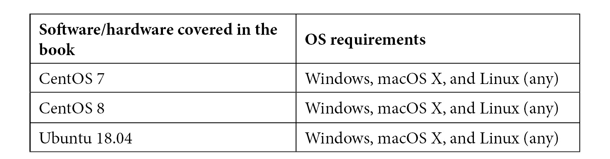

# 零、前言

*掌握 KVM 虚拟化*这本书应该会让您在读完这本书的过程中获得“从零到英雄”的地位。 这本书收集了 KVM 必须提供的所有内容，既面向 DevOps 读者，也面向普通系统管理读者和开发人员。 我们希望，通过阅读这本书，您将能够理解 KVM 的内部工作原理的一切，以及更高级的概念和介于两者之间的一切。 无论您是刚刚开始使用 KVM 虚拟化，还是已经很好地开始了，您都可以在本书的页面上找到一些有价值的信息。

# 这本书是给谁看的

本书面向 Linux 初学者和专业人士，因为它不一定要求事先具备 Linux 的高级知识。 我们会在你浏览这本书的时候带你去那里--这是学习过程中不可或缺的一部分。 如果您对 KVM、OpenStack、Elk Stack、Eucalyptus 或 AWS 感兴趣，我们可以为您介绍。

# 这本书涵盖了哪些内容

[*第 1 章*](01.html#_idTextAnchor016)，*了解 Linux 虚拟化*讨论了不同类型的虚拟化、管理器类型和 Linux 虚拟化概念(Xen 和 KVM)。 在本章中，我们试图从高层次的角度解释 Linux 虚拟化的一些基础知识，以及它如何适应云环境。

[*第 2 章*](02.html#_idTextAnchor029)，*KVM as a Virtualization Solution*首先讨论虚拟化概念和虚拟化环境的需求，解释虚拟化的基本硬件和软件方面，以及虚拟化的各种方法。 在本章中，我们开始讨论 KVM 和 libvirt，这两个概念我们将在本书中使用。

[*第 3 章*](03.html#_idTextAnchor049)，*安装 KVM Hypervisor、libvirt 和 oVirt*，通过引入一些新概念(包括可用于管理虚拟化 Linux 基础架构的 GUI oVirt)，对[*第 2 章*](02.html#_idTextAnchor029)进行了扩展。 我们将带您完成检查所使用的硬件是否与 KVM 兼容的过程，介绍一些用于虚拟机部署的基本命令，然后继续解释如何在相同的场景中使用 oVirt。

[*第 4 章*](04.html#_idTextAnchor062)*Libvirt Networking*解释了 libvirt 如何与各种网络概念交互-不同模式下的虚拟交换机、如何使用 CLI 工具管理 libvirt 网络、TAP 和 TUN 设备、Linux 桥接和 Open vSwitch。 在此之后，我们将讨论使用 SR-IOV 的更极端的网络示例，这个概念应该可以让我们获得最低的延迟和最高的吞吐量，并且在每一毫秒都很重要的情况下使用。

[*第 5 章*](05.html#_idTextAnchor079)，*Libvirt Storage*非常重要，因为存储概念在构建虚拟化和云环境时非常重要。 我们将讨论 KVM 支持的每种存储类型-本地存储池、NFS、iSCSI、SAN、Cave、Gluster、多路径和冗余、虚拟磁盘类型等。 我们还向您展示了存储的未来-NVMe 和 NVMeoF 是我们讨论的一些技术。

[*第 6 章*](06.html#_idTextAnchor108)，*虚拟显示设备和协议*讨论了各种虚拟机显示类型、远程协议(包括 VNC 和 Spice)以及 NoVNC，NoVNC 确保了显示的便携性，因为我们可以通过使用 NoVNC 在 Web 浏览器中使用虚拟机控制台。

[*第 7 章*](07.html#_idTextAnchor125)，*虚拟机：安装、配置和生命周期管理*介绍了部署和配置 KVM 虚拟机的其他方法，以及迁移过程，这对于任何类型的生产环境都非常重要。

[*第 8 章*](08.html#_idTextAnchor143)，*创建和修改 VM 磁盘、模板和快照*讨论了各种虚拟机映像类型、虚拟机模板化过程、快照的使用，以及使用快照时的一些用例和最佳实践。 它还将作为下一章的介绍，在下一章中，我们将以更精简的方式使用模板和虚拟机磁盘，通过使用`cloud-init`和`cloudbase-init`在引导后自定义虚拟机。

[*第 9 章*](09.html#_idTextAnchor165)，*使用 cloud-init 定制虚拟机*讨论了云环境中最基本的概念之一-如何在引导后定制虚拟机映像/模板。 Cloud-init 在几乎所有的云环境中都被用来进行引导后的 Linux 虚拟机配置，我们将解释它是如何工作的，以及如何使其在您的环境中工作。

[*第 10 章*](10.html#_idTextAnchor182)，*自动化 Windows 访客部署和自定义*是[*第 9 章*](09.html#_idTextAnchor165)的继续，重点介绍 Microsoft Windows 虚拟机模板化和引导后自定义。 为此，我们使用 cloudbase-init，这一概念与 cloud-init 基本相同，但仅适用于基于 Microsoft 的操作系统。

[*第 11 章*](11.html#_idTextAnchor191)，*用于编排和自动化的可解析和脚本*带我们了解了可解析之旅的第一部分-部署 AWX 和可解析，并描述了如何在我们基于 KVM 的环境中使用这些概念。 这只是现代 IT 中采用的 Ansible 使用模型之一，因为整个 DevOps 和基础设施即代码的故事在世界各地的 IT 基础设施中得到了更多的曝光。

[*第 12 章*](12.html#_idTextAnchor209)，*使用 OpenStack 横向扩展 KVM*讨论了基于 KVM 构建云环境的过程。 OpenStack 是在使用 KVM 时实现这一点的标准方法。 在本章中，我们将讨论所有 OpenStack 构建块和服务，如何从头开始部署它，并描述如何在生产环境中使用它。

[*第 13 章*](13.html#_idTextAnchor238)，*通过 AWS 横向扩展 KVM*，带我们踏上通过使用**Amazon Web Services**(**AWS**)使用公共云和混合云概念的旅程。 与几乎所有其他章节一样，这是一个非常实用的章节，您还可以用它来了解 AWS 的概念，这将是在本章末尾使用 Eucalyptus 部署混合云基础架构的关键。

[*第 14 章*](14.html#_idTextAnchor259)，*监视 KVM 虚拟化平台*介绍了一个非常流行的通过**Elasticsearch，Logstash，Kibana**(**ELK**)堆栈进行监视的概念。 它还将引导您完成设置 ELK 堆栈并将其与您的 KVM 基础架构集成的整个过程，直至最终结果-使用仪表板和 UI 来监控您的基于 KVM 的环境。

[*第 15 章*](15.html#_idTextAnchor276)，*KVM 的性能调整和优化*讨论了在基于 KVM 的环境中通过解构所有基础设施设计原则并(正确)使用它们来进行调整和优化的各种方法。 我们在这里介绍了许多高级主题-NUMA、KSM、CPU 和内存性能、CPU 固定、VirtIO 的调优，以及块和网络设备。

[*第 16 章*](16.html#_idTextAnchor302)，*KVM 平台故障排除指南*从基础知识开始-KVM 服务和日志记录故障排除，并解释了 KVM 和 oVirt、Ansible 和 OpenStack、Eucalyptus 和 AWS 的各种故障排除方法。 这些都是我们在写这本书时在生产环境中遇到的现实问题。 在本章中，我们主要讨论与本书每一章相关的问题，包括与快照和模板相关的问题。

# 充分利用这本书

我们假设至少具备 Linux 的基本知识和以前安装虚拟机的经验作为本书的先决条件。



# 行动中的代码

本书的代码实际操作视频可在[https://bit.ly/32IHMdO](https://bit.ly/32IHMdO)上查看。

# 下载彩色图片

我们还提供了一个 PDF 文件，其中包含本书中使用的屏幕截图/图表的彩色图像。 您可以在此处下载：[http://www.packtpub.com/sites/default/files/downloads/9781838828714_ColorImages.pdf](http://www.packtpub.com/sites/default/files/downloads/9781838828714_ColorImages.pdf)

# 使用的惯例

本书中使用了许多文本约定。

`Code in text`：指示文本中的代码字、数据库表名、文件夹名、文件名、文件扩展名、路径名、虚拟 URL、用户输入和 Twitter 句柄。 下面是一个示例：“我们需要做的只是取消注释位于`/etc/logstash`文件夹中的配置文件中定义的一个管道。”

代码块设置如下：

```sh
<memoryBacking>
    <locked/>
</memoryBacking>
```

当我们希望您注意代码块的特定部分时，相关行或项将以粗体显示：

```sh
POWER TTWU_QUEUE NO_FORCE_SD_OVERLAP RT_RUNTIME_SHARE NO_LB_MIN NUMA 
NUMA_FAVOUR_HIGHER NO_NUMA_RESIST_LOWER
```

**粗体**：表示您在屏幕上看到的新术语、重要单词或单词。 例如，菜单或对话框中的单词显示在文本中，如下所示。 这里有一个例子：“按下**Refresh**按钮后，页面上应该会出现新的数据。”

提示或重要说明

看起来就像这样。

# 保持联系

欢迎读者的反馈。

**一般反馈**：如果您对本书的任何方面有疑问，请在邮件主题中提及书名，并向我们发送电子邮件至[customercare@Packtpub.com](mailto:customercare@packtpub.com)。

**勘误表**：虽然我们已经竭尽全力确保内容的准确性，但错误还是会发生。 如果您在这本书中发现了错误，请向我们报告，我们将不胜感激。 请访问[www.Packtpub.com/support/errata](http://www.packtpub.com/support/errata)，选择您的图书，单击勘误表提交表链接，然后输入详细信息。

**盗版**：如果您在互联网上遇到任何形式的非法复制我们的作品，请您提供地址或网站名称，我们将不胜感激。 请通过[Copyright@Packt.com](mailto:copyright@packt.com)联系我们，并提供该材料的链接。

**如果您有兴趣成为一名作者**：如果有一个您擅长的主题，并且您有兴趣撰写或投稿一本书，请访问[Auths.Packtpub.com](http://authors.packtpub.com)。

# 评论

请留下评论。 一旦你阅读并使用了这本书，为什么不在你购买它的网站上留下评论呢？ 这样，潜在读者就可以看到并使用您不偏不倚的意见来做出购买决定，我们 Packt 可以了解您对我们产品的看法，我们的作者也可以看到您对他们的书的反馈。 谢谢!

有关 Packt 的更多信息，请访问[Packt.com](http://packt.com)。