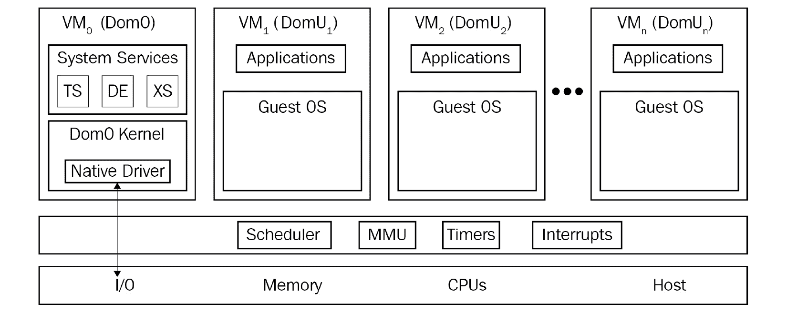

# *第 1 章*：了解 Linux 虚拟化

虚拟化是一种开启了向 IT 整合的重大技术转变的技术，它将资源和云作为更加集成、自动化和协调的虚拟化版本提供更高效的使用，不仅侧重于虚拟机，还侧重于其他服务。 本书共有 16 章，所有章节都包含了基于内核的虚拟机(KVM)虚拟化的所有重要方面。 我们将从虚拟化概念和 Linux 虚拟化的历史等基本 KVM 主题开始，然后继续讨论 KVM 中的高级主题，如自动化、协调、虚拟网络、存储和故障排除。 本章将让您深入了解 Linux 虚拟化中的主流技术及其相对于其他技术的优势。

在本章中，我们将介绍以下主题：

*   Linux 虚拟化及其基本概念
*   虚拟化的类型
*   虚拟机管理程序/VMM
*   开源虚拟化项目
*   Linux 虚拟化在云中为您提供了什么

# Linux 虚拟化以及它是如何开始的

虚拟化是创建虚拟化资源并将其映射到物理资源的概念。 此过程可以使用特定的硬件功能(通过某种分区控制器进行分区)或软件功能(虚拟机管理程序)来完成。 因此，举个例子，如果您有一台基于台基于 PC 的物理服务器，其中有 16 个内核在运行虚拟机管理程序，那么您可以轻松地创建一个或多个虚拟机，每个虚拟机都有两个内核，然后启动它们。 关于您可以启动的虚拟机数量的限制是基于供应商的。 例如，如果您运行的是 Red Hat Enterprise Virtualizationv4.x(一个基于 KVM 的裸机管理程序)，则可以使用多达 768 个逻辑 CPU 核心或线程(您可以在[https://access.redhat.com/articles/906543](https://access.redhat.com/articles/906543)上阅读有关这方面的更多信息)。 在任何情况下，虚拟机管理程序都将成为*的首选对象*，它将尽可能高效地进行管理，以便所有虚拟机工作负载都能在 CPU 上获得尽可能多的时间。

我清楚地记得我在 2004 年写了第一篇关于虚拟化的文章。 AMD 在 2003 年刚刚推出了它的第一款消费级 64 位 CPU(Athlon 64，Opteron)，它让我大吃一惊。 英特尔在推出 64 位 CPU 时仍有些犹豫--缺少 64 位微软 Windows 操作系统可能也与此有关。 Linux 已经推出了对 64 位的支持，但这是基于 PC 的市场上许多新事物的曙光。 虚拟化本身并不是什么革命性的想法，因为其他公司已经有了可以进行虚拟化数十年的非 x86 产品(例如，IBM CP-40 及其 1967 年的 S/360-40)。 但对于个人电脑市场来说，这无疑是一个新的想法，它正处于一个奇怪的阶段，许多事情同时发生。 正如您可以想象的那样，切换到市场上出现的具有多核 CPU 的 64 位 CPU，然后从 DDR1 切换到 DDR2，然后从 PCI/ISA/AGP 切换到 PCI Express，是一段具有挑战性的时期。

具体地说，我记得考虑过各种可能性--先运行一个操作系统，然后再运行几个操作系统，那该有多酷。 在出版业工作，你可能会想象这会给任何人的工作流程带来多少好处，我记得当时真的很兴奋。

经过大约 15 年的发展，我们现在在虚拟化解决方案方面拥有了一个竞争激烈的市场-Red Hat 与 KVM、Microsoft 与 Hyper-V、VMware 与 ESXi、Oracle 与 Oracle VM，以及 Google 和其他关键参与者争夺用户和市场主导地位。 这导致了各种云解决方案的开发，如 EC2、AWS、Office 365、Azure、vCloud Director 和适用于各种云服务的 vRealize Automation。 总而言之，对 IT 来说，这 15 年是非常富有成效的 15 年，你说呢？

但是，追溯到 2003 年 10 月，随着 IT 行业发生的所有变化，对于本书和 Linux 虚拟化总体来说，有一件事非常重要：引入了第一个用于 x86 体系结构的开源 Hypervisor，称为**Xen**。 它支持各种 CPU 体系结构(安腾、x86、x86_64 和 ARM)，可以运行各种操作系统-Windows、Linux、Solaris 和一些风格的 BSD-它仍然是一些供应商的首选虚拟化解决方案，例如 Citrix(XenServer)和 Oracle(Oracle VM)。 我们将在本章稍后讨论更多关于 Xen 的技术细节。

开源市场上最大的企业参与者 Red Hat 在 2007 年发布的 Red Hat Enterprise Linux5 的初始版本中包含了 Xen 虚拟化。 但是 Xen 和 Red Hat 并不是天作之合，尽管 Red Hat 发布了 Xen 的 Red HatEnterprise Linux5 发行版，但 Red Hat 在 2010 年在 Red Hat Enterprise Linux6 中切换到了**KVM**，这在当时是一个非常冒险的举动。 实际上，从 Xen 迁移到 KVM 的整个过程始于前一个版本，5.3/5.4 版本，这两个版本都是在 2009 年发布的。 把事情放在上下文中，KVM 在当时是一个相当年轻的项目，只有几年的历史。 但发生这种情况的合理原因有很多，从*Xen 不在主线内核中，KVM 是*，到政治原因(Red Hat 希望对 Xen 开发产生更大的影响，但这种影响正在随着时间的推移而逐渐消退)。

从技术上讲，KVM 使用一种不同的模块化方法，将 Linux 内核转换为支持的 CPU 体系结构的全功能管理程序。 当我们说*支持的 CPU 架构*时，我们谈论的是 KVM 虚拟化的基本要求-CPU 需要支持硬件虚拟化扩展，称为 AMD-V 或 Intel VT。 为了让事情简单一点，我们只能说，您真的必须非常努力地寻找不支持这些扩展的现代 CPU。 例如，如果您在服务器或台式 PC 上使用 Intel CPU，那么支持硬件虚拟化扩展的第一批 CPU 可以一直追溯到 2006 年(至强 LV)和 2008 年(酷睿 i7920)。 同样，我们将深入了解有关 KVM 的更多技术细节，并在本章稍后和下一章中提供 KVM 和 Xen 之间的比较。

# 虚拟化类型

有各种类型的虚拟化解决方案，所有这些解决方案都针对不同的用例，取决于这样一个事实：我们正在虚拟化硬件或软件堆栈的不同部分，即*您正在虚拟化的*。 同样值得注意的是，根据*如何虚拟化*，有不同类型的虚拟化-通过分区、完全虚拟化、半虚拟化、混合虚拟化或基于容器的虚拟化。

因此，让我们首先根据*您要虚拟化的*来介绍当今 IT 中的五种不同类型的虚拟化：

*   **桌面虚拟化**(**虚拟桌面基础设施**e**(VDI)**)：这个被许多企业公司使用，并为许多场景提供了巨大的优势，因为用户不依赖于他们正在使用的特定设备来访问他们的桌面系统。 他们可以从手机、平板电脑或计算机进行连接，而且他们通常可以从任何地方连接到虚拟化桌面，就像他们坐在工作场所使用硬件计算机一样。 优势包括更轻松、集中的管理和监控、更简单的更新工作流程(您可以在 VDI 解决方案中更新数百台虚拟机的基本映像，并在维护时间内将其重新链接到数百台虚拟机)，简化的部署流程(台式机、工作站或笔记本电脑上不再进行物理安装，以及集中化应用管理的可能性)，以及更轻松地管理合规性和安全相关选项。
*   **服务器虚拟化**：目前绝大多数 IT 公司都在使用它。 它提供了服务器虚拟机与物理服务器的良好整合，同时与常规物理服务器相比，它还提供了许多其他运营优势-更易于备份、更节能、在服务器之间移动工作负载方面更自由等。
*   **应用虚拟化**：这通常使用某种流/远程协议技术(如 MicrosoftApp-V)或某些解决方案来实现，这些解决方案可以将应用打包到卷中，这些卷可以装载到虚拟机上，并针对一致的设置和交付选项进行配置，例如 VMware App 卷。
*   **网络虚拟化**(和一个更广泛的基于云的概念，称为**软件定义网络****(SDN)**)：这是一种技术，它创建独立于物理网络设备(如交换机)的虚拟网络。 在更大的范围内，SDN 是网络虚拟化理念的延伸，可以跨越多个站点、位置或数据中心。 根据 SDN 的概念，整个网络配置都是在软件中完成的，您不一定需要特定的物理网络配置。 网络虚拟化的最大优势在于，您可以轻松管理跨越多个位置的复杂网络，而无需对网络数据路径上的所有物理设备进行大规模的物理网络重新配置。 此概念将在[*第 4 章*](04.html#_idTextAnchor062)、*libvirt Networking*和[*第 12 章*](12.html#_idTextAnchor209)、*使用 OpenStack 横向扩展 KVM*中解释。
*   **存储虚拟化**(以及一个较新的概念**软件定义存储(SDS)**)：这是一种技术，它从我们可以作为单个存储设备集中管理的池化物理存储设备中创建虚拟存储设备。 这意味着我们将创建某种抽象层，将存储设备的内部功能与计算机、应用和其他类型的资源隔离开来。 作为其扩展，SDS 通过将控制和管理平面从底层硬件中抽象出来，并向虚拟机和应用提供不同类型的存储资源(块、文件和基于对象的资源)，将存储软件堆栈与其运行于其上的硬件分离。

如果您查看这些虚拟化解决方案并将其大规模扩展(提示：云)，您就会意识到您将需要各种工具和解决方案来*有效地*管理不断增长的基础设施，从而开发出各种自动化和协调工具。 其中一些工具将在本书后面介绍，例如[*第 11 章*](11.html#_idTextAnchor191)，*Ansible for Orcheation and Automation*中的 Ansible。 就目前而言，让我们只是说，您不能仅仅依靠标准实用程序(脚本、命令，甚至 GUI 工具)来管理包含数千台虚拟机的环境。 您肯定需要与虚拟化解决方案紧密集成的更加程序化、API 驱动的方法，因此开发了 OpenStack、OpenShift、Ansible 和**Elasticsearch、Logstash、Kibana**(**ELK**)堆栈，我们将在[*第 14 章*](14.html#_idTextAnchor259)，*使用 elk Stk 监控 KVM 虚拟化平台*

如果我们谈论的是*我们如何*将虚拟机虚拟化为对象，则有不同类型的虚拟化：

*   **分区**：这是一种类型的虚拟化，在这种虚拟化中，CPU 被分成不同的部分，每个部分都作为单独的系统工作。 这种类型的虚拟化解决方案将服务器隔离为多个分区，每个分区可以运行单独的操作系统(例如，**IBM Logical Partitions(LPAR)**)。
*   **Full virtualization**: In full virtualization, a virtual machine is used to simulate regular hardware while not being aware of the fact that it's virtualized. This is done for compatibility reasons – we don't have to modify the guest OS that we're going to run in a virtual machine. We can use a software- and hardware-based approach for this.

    **基于软件的**：使用二进制转换来虚拟化敏感指令集的执行，同时使用软件模拟硬件，这会增加开销并影响可伸缩性。

    **基于硬件的**：在与 CPU 的虚拟化功能(AMD-V、Intel VT)对接时，从等式中删除二进制转换，这反过来意味着指令集直接在主机 CPU 上执行。 这就是 KVM 所做的(以及其他流行的虚拟机管理程序，如 ESXi、Hyper-V 和 Xen)。

*   **半虚拟化**：这是一种虚拟化类型，在这种虚拟化中，来宾操作系统了解它正在被虚拟化的事实，需要修改它以及它的驱动程序，以便它可以在虚拟化解决方案之上运行。 同时，它不需要 CPU 虚拟化扩展即可运行虚拟机。 例如，Xen 可以作为半虚拟化解决方案工作。
*   **混合虚拟化**：这是一种虚拟化类型，它使用完全虚拟化和半虚拟化的最大优点-客户操作系统可以原封不动(完全)运行的事实，以及我们可以在虚拟机中插入额外的半虚拟化驱动程序来处理虚拟机工作的某些特定方面(最常见的是 I/O 密集型内存工作负载)。 Xen 和 ESXi 也可以在混合虚拟化模式下工作。
*   **基于容器的虚拟化**：这是一种使用容器的应用虚拟化。 容器是一个对象，它将应用及其所有依赖项打包在一起，以便在不需要虚拟机或管理程序的情况下向外扩展和快速部署应用。 请记住，有些技术可以同时作为虚拟机管理程序和容器主机运行。 这类技术的一些例子包括 Docker 和 Podman(在 Red Hat Enterprise Linux8 中替代 Docker)。

接下来，我们将学习如何使用虚拟机管理程序。

# 使用虚拟机管理程序/虚拟机管理器

顾名思义，**Virtual Machine Manager(VMM)**或 Hypervisor 是一款负责监控和控制虚拟机或来宾操作系统的软件。 管理程序/VMM 负责确保不同的虚拟化管理任务，如提供虚拟硬件、虚拟机生命周期管理、迁移虚拟机、实时分配资源、定义虚拟机管理策略等。 VMM/虚拟机管理程序还负责高效地控制物理平台资源，如内存转换和 I/O 映射。 虚拟化软件的主要优势之一是它能够在同一物理系统或硬件上运行多个来宾操作系统。 这多个来宾系统可以在同一操作系统上，也可以在不同的操作系统上。 例如，在同一物理系统上可以有多个 Linux 来宾系统作为来宾运行。 VMM 负责分配这些来宾操作系统所请求的资源。 必须根据来宾操作系统的配置将系统硬件(如处理器、内存等)分配给这些来宾操作系统，VMM 可以处理此任务。 因此，VMM 是虚拟化环境中的关键组件。

根据类型，我们可以将虚拟机管理程序分为类型 1 或类型 2。

## 第 1 类和第 2 类虚拟机管理程序

根据虚拟机管理程序驻留在系统中的位置，或者换句话说，系统中是否存在底层的操作系统，虚拟机管理程序主要分为类型 1 或类型 2 的虚拟机管理程序。 但是，对于类型 1 和类型 2 的虚拟机管理程序没有明确或标准的定义。 如果 VMM/虚拟机管理程序直接在硬件上运行，则其通常被认为是类型 1 虚拟机监控程序。 如果存在操作系统，并且 VMM/虚拟机管理程序作为单独的层运行，则它将被视为类型 2 虚拟机管理程序。 再说一次，这个概念值得商榷，没有标准的定义。 类型 1 管理程序直接与系统硬件交互；它不需要任何主机操作系统。 您可以直接将其安装在裸机系统上，并使其为托管虚拟机做好准备。 类型 1 虚拟机监控程序也称为**裸机**、**嵌入式**或**本机虚拟机监控程序**。 OVirt-node、VMware ESXi/vSphere 和**Red Hat Enterprise Virtualization Hypervisor**(**RHEV-H**)是类型 1 Linux虚拟机管理程序的示例。 下图说明了第 1 类虚拟机监控程序的设计概念：

图 1.1-类型 1 虚拟机管理程序设计

以下是类型 1 虚拟机管理程序的优势：

*   易于安装和配置
*   体积小；经过优化，可将大部分物理资源提供给托管来宾(虚拟机)
*   由于只附带运行虚拟机所需的应用，因此产生的开销较少
*   更安全，因为一个来宾系统中的问题不会影响虚拟机管理程序上运行的其他来宾系统

但是，类型 1 虚拟机管理程序不支持自定义。 通常，当您尝试在其上安装任何第三方应用或驱动程序时，会有一些限制。

另一方面，类型 2 虚拟机管理程序驻留在操作系统之上，允许您进行大量定制。 类型 2 管理程序是，也称为托管管理程序，它们的操作依赖于主机操作系统。 类型 2 虚拟机管理程序的主要优势是广泛的硬件支持，因为底层主机操作系统控制硬件访问。 下图说明了第 2 类虚拟机监控程序的设计概念：

图 1.2-类型 2 虚拟机管理程序设计

我们什么时候使用第 1 类虚拟机管理程序与第 2 类虚拟机管理程序？ 这主要取决于我们是否已经在要部署虚拟机的服务器上运行操作系统。 例如，如果我们已经在工作站上运行 Linux 桌面，我们可能不会格式化工作站并安装虚拟机管理程序-这没有任何意义。 这是类型 2 虚拟机管理程序用例的一个很好的例子。 众所周知的第 2 类虚拟机管理程序包括 VMware Player、Workstation、Fusion 和 Oracle VirtualBox。 另一方面，如果我们的目标是创建一台要用来托管虚拟机的服务器，那么这就是类型 1 虚拟机管理程序的领域。

# 开源虚拟化项目

下表列出了 Linux 中的开源虚拟化项目：

图 1.3-Linux 中的开源虚拟化项目

在接下来的几节中，我们将讨论 Xen 和 KVM，它们是 Linux 中领先的开源虚拟化解决方案。

## Xen

Xen最初是剑桥大学的一个研究项目。 Xen 的第一次公开发布是在 2003 年。 后来，剑桥大学这个项目的负责人 Ian Pratt 与 Simon Crosby(也来自剑桥大学)共同创立了一家名为 XenSource 的公司。 这家公司开始以开源方式开发该项目。 2013 年 4 月 15 日，Xen 项目作为协作项目被转移到 Linux 基金会。 Linux 基金会推出了 Xen 项目的新商标，以区别于旧 Xen 商标的任何商业使用。 有关这方面的更多详细信息，请参阅[https://xenproject.org/](https://xenproject.org/)。

Xen 虚拟机管理程序已移植到许多处理器系列，如 Intel IA-32/64、x86_64、PowerPC、ARM、MIPS 等。

Xen 的核心概念有四个主要构建块：

*   **Xen 管理程序**：Xen 的组成部分，它处理物理硬件和虚拟机之间的相互通信。 它处理所有中断、时间、CPU 和内存请求以及硬件交互。
*   **Dom0**：Xen 的控制域，它控制虚拟机的环境。 它的主要部分被称为 QEMU，这是一款通过执行二进制翻译来模拟 CPU 来模拟常规计算机系统的软件。
*   **管理实用程序**：我们用来管理整个 Xen 环境的命令行实用程序和 GUI 实用程序。
*   **虚拟机**(无特权域，Domu)：我们在 Xen 上运行的来宾。

如下图中的所示，Dom0 是一个完全独立的实体，它控制其他虚拟机，而所有其他虚拟机都可以使用虚拟机管理程序提供的系统资源彼此堆叠在一起：

图 1.4-Xen

我们将在本书后面提到的一些管理工具实际上也能够与 Xen 虚拟机一起工作。 例如，可以使用`virsh`命令轻松地连接和管理 Xen 主机。 另一方面，oVirt 是围绕 KVM 虚拟化设计的，这肯定不是管理基于 Xen 的环境的首选解决方案。

## KVM

KVM 代表了最新一代的开源虚拟化。 该项目的目标是创建一个现代虚拟机管理程序，它以前几代技术的经验为基础，并利用当今可用的现代硬件(VT-x、AMD-V 等)。

当您安装 KVM 内核模块时，KVM 只是简单地将 Linux 内核转变为管理程序。 但是，由于标准 Linux 内核是系统管理程序，因此它受益于对标准内核所做的更改(内存支持、调度程序等)。 针对这些 Linux 组件的优化，例如 3.1 内核中的调度程序、4.20+内核中对嵌套虚拟化的改进、用于缓解 Spectre 攻击的新功能、对 AMD 安全加密虚拟化的支持、4/5.x 内核中的英特尔 IGPU 直通等，都会让虚拟机管理程序(主机操作系统)和 Linux 来宾操作系统受益。 对于 I/O 仿真，KVM 使用用户端软件 QEMU；这是一个执行硬件仿真的用户端程序。

QEMU 模拟处理器和一长串外围设备(如磁盘、网络、VGA、PCI、USB、串行/并行端口等)，以构建可安装来宾操作系统的完整虚拟硬件。 此仿真由 KVM 提供支持。

# Linux 虚拟化在云中为您提供了什么

云是*这个时髦的词*，在过去 10 年左右的时间里，几乎所有与 IT 相关的讨论都是云的一部分。 如果我们回顾一下云的历史，我们可能会意识到这样一个事实：亚马逊是云市场的第一个关键参与者，在 2006 年发布了**Amazon Web Services**(**AWS**)和**Amazon Elastic Compute Cloud**(**EC2**)。 Google云平台于 2008 年发布，Microsoft Azure 于 2010 年发布。 就**基础设施即服务**(**IaaS**)云模型而言，这些是目前最大的 IaaS 云提供商，尽管还有其他云提供商(IBM 云、AWS 上的 VMware 云、甲骨文云和阿里巴巴云等)。 如果你仔细阅读这个列表，你很快就会意识到这些云平台中的大多数都是基于 Linux 的(举个例子，Amazon 使用 Xen 和 KVM，而 Google Cloud 使用 KVM 虚拟化)。

目前，有三个主要的开源云项目使用 Linux 虚拟化为私有云和/或混合云构建 IaaS 解决方案：

*   **OpenStack**：完全开源云操作系统，由几个开源子项目组成，提供创建 IaaS 云的所有构建块。 KVM(Linux 虚拟化)是 OpenStack 部署中使用最多(支持最好)的虚拟机管理程序。 它由与供应商无关的 OpenStack 基金会管理。 如何使用 KVM 构建 OpenStack 云将在[*第 12 章*](12.html#_idTextAnchor209)，*使用 OpenStack 横向扩展 KVM*中详细说明
*   **CloudStack**此是另一个由**Apache Software Foundation**(**ASF**)控制的开源云项目，用于构建和管理高度可扩展的多租户IaaS 云，并与 EC2/S3API 完全兼容。 尽管 Xen 支持所有顶级 Linux 虚拟机管理程序，但大多数 CloudStack 用户选择 Xen，因为它与 CloudStack 紧密集成。
*   **Eucalyptus**：这是一款与 AWS 兼容的私有云软件，供组织在中使用，以降低其公共云成本并重新控制安全性和性能。 它同时支持 Xen 和 KVM 作为计算资源提供商。

在讨论 OpenStack 时，除了我们在本章到目前为止已经讨论的技术细节之外，还有其他重要的问题需要考虑。 当今 IT 中最重要的概念之一是，通过使用能够同时使用不同解决方案的某种管理层，实际上能够运行包含各种类型的解决方案(如虚拟化解决方案)的环境(纯虚拟化环境或云环境)。 让我们以 OpenStack 为例来说明这一点。 如果您通读 OpenStack 文档，您很快就会发现 OpenStack 支持 10 多种不同的虚拟化解决方案，包括：

*   科索沃核查团
*   Xen(通过 libvirt)
*   LXC(Linux 容器)
*   Microsoft Hyper-V
*   VMware ESXi
*   CitrixXenServer
*   **用户模式 Linux**(**UML**)
*   PowerVM(IBM Power 5-9 平台)
*   Virtuozzo(可以使用虚拟机、存储和容器的超融合解决方案)
*   Z/VM(针对 IBM Z 和 IBM LinuxONE 服务器的虚拟化解决方案)

这为我们带来了多云环境，这些环境可以跨越不同的 CPU 架构、不同的虚拟机管理程序以及虚拟机管理程序等其他技术-所有这些都在相同的管理工具集下。 这只是使用 OpenStack 可以做的一件事。 我们将在本书后面回到 OpenStack 的主题，特别是在[*第 12 章*](12.html#_idTextAnchor209)，*使用 OpenStack 横向扩展 KVM*中。

# 摘要

在本章中，我们介绍了虚拟化的基础知识及其不同类型。 牢记虚拟化在当今大规模 IT 世界中的重要性是有益的，因为了解如何将这些概念联系在一起以创建更大的图景-大型虚拟化环境和云环境是一件好事。 基于云的技术将在稍后更详细地介绍--把我们到目前为止提到的当作一个入门级内容来对待；主菜还在后面。 但下一章属于我们这本书的主星-KVM 虚拟机管理程序及其相关实用程序。

# 问题

1.  存在哪些类型的虚拟机管理程序？
2.  什么是集装箱？
3.  什么是基于容器的虚拟化？
4.  什么是 OpenStack？

# 进一步阅读

有关本章内容的更多信息，请参阅以下链接：

*   什么是 kvm？：[https://www.redhat.com/en/topics/virtualization/what-is-KVM](https://www.redhat.com/en/topics/virtualization/what-is-KVM)
*   KVM 虚拟机管理程序：[https://www.linux-kvm.org/page/Main_Page](https://www.linux-kvm.org/page/Main_Page)
*   OpenStack 平台：[HTTPS：//www.openstack.org](https://www.openstack.org)
*   XEN 项目：[https://xenproject.org/](https://xenproject.org/)