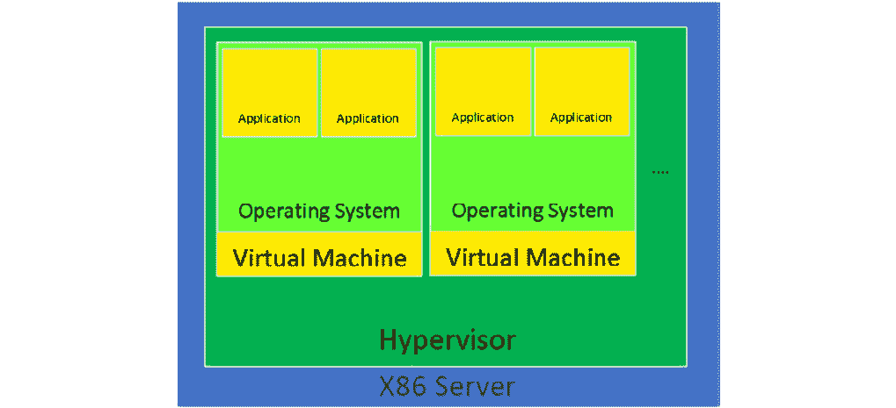
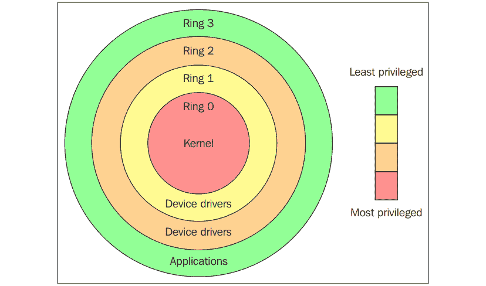
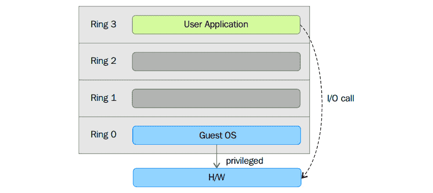
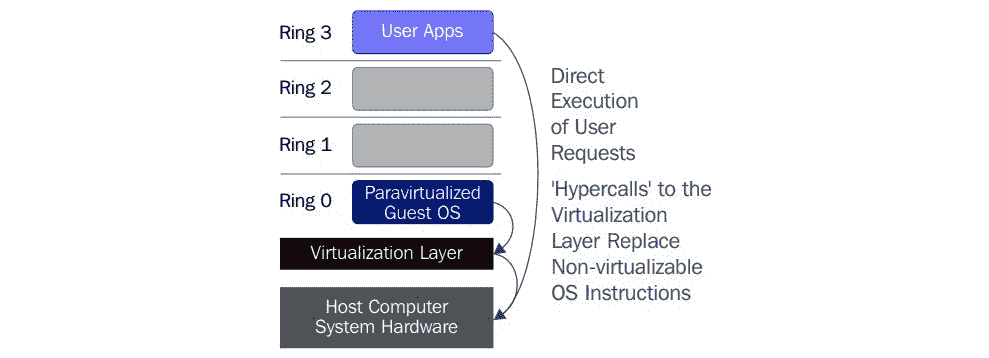
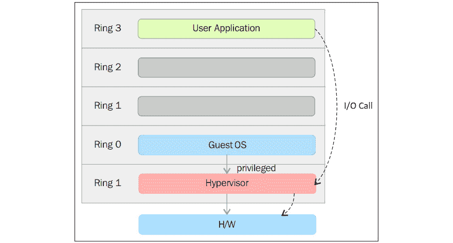
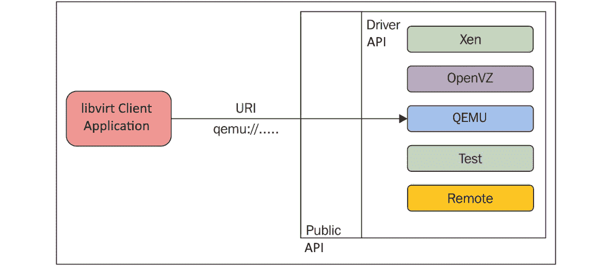
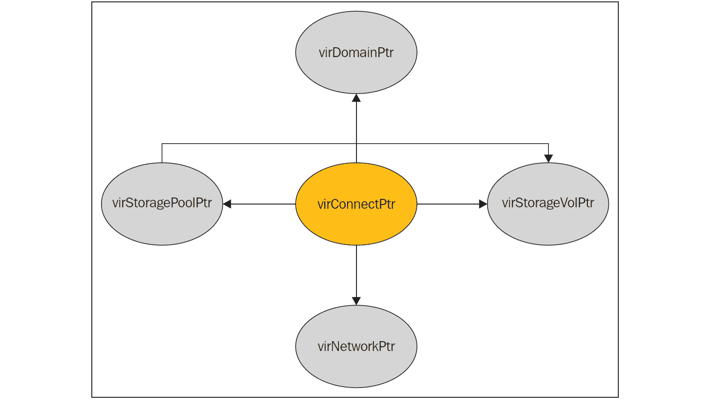
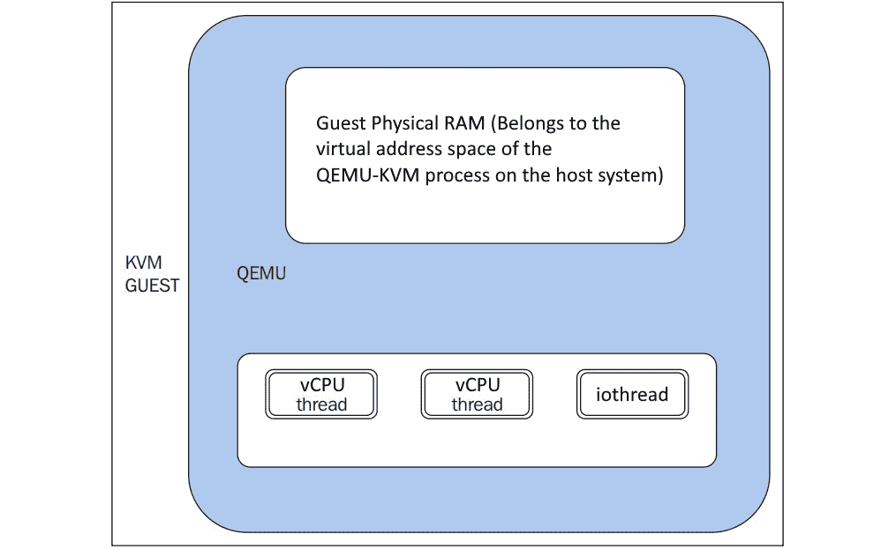

# *第 2 章*：将 KVM 作为虚拟化解决方案

在本章中，我们将讨论虚拟化的概念及其通过 libvirt、**Quick Emulator**(**QEMU**)和 KVM 实现。 实际上，如果我们想要解释虚拟化是如何工作的，以及为什么 KVM 虚拟化是 21 世纪 IT 的重要组成部分，我们必须从解释多核 CPU 和虚拟化的技术背景开始；如果不深入研究 CPU 和操作系统的理论，我们就不可能做到这一点，这样我们才能了解我们真正想要的是什么-虚拟机管理程序是什么，以及虚拟化实际是如何工作的。

在本章中，我们将介绍以下主题：

*   虚拟化作为一个概念
*   Libvirt、qemu 和 KVM 的内部工作方式
*   所有这些如何相互通信以提供虚拟化

# 虚拟化作为一个概念

虚拟化是一种将硬件与软件解耦的计算方法。 它为各种工作负载之间的资源拆分和共享提供了一种更好、更高效和更程序化的方法，这些工作负载包括运行操作系统的虚拟机以及运行在其上的应用。

如果我们将过去的传统物理计算与虚拟化进行比较，我们可以说，通过虚拟化，我们可以在同一硬件(同一物理服务器)上运行多个来宾操作系统(多个虚拟服务器)。 如果我们使用的是类型 1 虚拟机管理程序(请参见[*第 1 章*](01.html#_idTextAnchor016)，*了解 Linux 虚拟化*)，这意味着虚拟机管理程序将负责让虚拟服务器访问物理硬件。 这是因为有多个虚拟服务器使用与同一物理服务器上的其他虚拟服务器相同的硬件。 这通常由某种调度算法支持，该调度算法在虚拟机管理程序中以编程方式实现，以便我们可以从同一物理服务器获得更高的效率。

## 虚拟环境与物理环境

让我们尝试可视化这两种方法-物理方法和虚拟方法。 在物理服务器中，我们正在服务器硬件上安装操作系统，并在该操作系统上运行应用。 下图显示了此方法的工作原理：


图 2.1-物理服务器

在虚拟化世界中，我们运行的是虚拟机管理程序(如 KVM)，虚拟机位于该虚拟机管理程序之上。 在这些虚拟机中，我们运行相同的操作系统和应用，就像在物理服务器中一样。 虚拟化方法如下图所示：



图 2.2-虚拟机管理程序和两台虚拟机

在各种情况下，仍然需要物理方法。 例如，世界各地的物理服务器上仍有数千个应用，因为这些服务器*不能*虚拟化。 *它们不能虚拟化有不同的原因。 例如，最常见的原因实际上是最简单的原因--可能这些应用运行的操作系统不在虚拟化软件供应商支持的操作系统列表上。 这可能意味着您不能虚拟化操作系统/应用组合，因为该操作系统不支持某些虚拟化硬件，通常是网络或存储适配器。 同样的一般概念也适用于云--正如我们将在本书后面描述的那样，将东西移到云上并不总是最好的想法。*

 *## 为什么虚拟化如此重要？

我们现在运行的许多应用不能很好地扩展(添加更多的 CPU、内存或其他资源)-它们只是没有以这种方式编程，或者不能真正并行化。 这意味着，如果应用不能使用其可支配的所有资源，服务器将有大量的*空闲空间*-这一次，我们不是在谈论磁盘空闲空间；我们实际上指的是*计算*空闲空间，即 CPU 和内存级别的空闲空间。 这意味着我们没有充分利用我们付费购买的服务器的功能--目的是让它得到充分利用，而不是部分利用。

效率和程序化方法如此重要还有其他原因。 事实是，除了 2003-2005 年间关于 CPU 频率吹嘘的权利(*等于*CPU 速度)的新闻发布战之外，英特尔和 AMD 在*单核*CPU 的概念开发方面遇到了障碍。 在不严重影响 CPU 供电方式的情况下，它们无法在 CPU 上塞入同样多的附加元素(无论是用于执行还是高速缓存)和/或提高单核的速度。 这意味着，最终，这种方法会损害 CPU 及其运行的整个系统的可靠性。 如果你想了解更多，我们建议你去查找关于英特尔的 NetBurst 架构 CPU(例如，Prescott 内核)和他们的弟弟奔腾 D(Smithfield 内核)的文章，奔腾 D(Smithfield 内核)基本上是两个 Prescott 内核粘合在一起，所以最终结果是一个双核 CPU。 A*非常非常热的*双核 CPU。

在此之前的几代人中，英特尔和 AMD 根据*让每个系统有多个执行单元*原则尝试和测试了其他技术。 例如，我们有英特尔奔腾 Pro 双插槽系统以及 AMD 皓龙双插槽和四插槽系统。 当我们开始讨论虚拟化的一些非常重要的方面时(例如，**非统一内存访问**(**NUMA**))，我们将在本书的后面部分回到这些方面。

因此，无论从哪个角度来看，当 PC CPU 在 2005 年开始拥有多核处理器时(AMD 率先推出服务器多核 CPU，英特尔率先推出台式机多核 CPU)，这是前进的唯一理性之路。 这些核心更小，效率更高(耗电量更少)，通常是更好的长期方法。 当然，这意味着如果微软和甲骨文等公司想要使用他们的应用并获得多核服务器的好处，就必须对操作系统和应用进行大量修改。

总而言之，对于基于 PC 的服务器，从 CPU 的角度来看，切换到多核 CPU 是开始致力于虚拟化的好时机，因为虚拟化是我们今天所了解和喜爱的概念。

在进行这些开发的同时，CPU 还增加了其他功能-例如，可以处理特定类型操作的额外 CPU 寄存器。 很多人听说过 MMX、SSE、SSE2、SSE3、SSE4.x、AVX、AVX2、AES 等指令集。 这些在今天都非常重要，因为它们给了我们*卸载*特定指令类型到特定 CPU 寄存器的可能性。 这意味着这些指令不必像通用串行设备那样在 CPU 上运行，这样执行这些任务的速度会更慢。 相反，可以将这些指令发送到专门用于这些指令的特定 CPU 寄存器。 可以把它想象成在 CPU芯片上有单独的迷你加速器，可以运行软件堆栈的某些部分，而不会占用一般的 CPU 流水线。 其中一项新增功能是针对英特尔的**虚拟机扩展**(**VMX**)，或**AMD 虚拟化**(**AMD-V**)，这两者都使我们能够为各自的平台提供基于硬件的全面虚拟化支持。

## 虚拟化的硬件要求

在 PC 上引入基于软件的虚拟化之后，在硬件和软件方面都取得了很大的发展。 正如我们在上一章中提到的，最终的结果是 CPU 拥有更多的功能和更强大的功能。 这导致了对硬件辅助虚拟化的大力推动，从纸面上看，这似乎是一条更快、更先进的道路。 举个例子，在 2003-2006 年的时间框架内，有一大堆 CPU 不支持硬件辅助虚拟化，比如 Intel Pentium 4、Pentium D、最初的 AMD Athlons、Turion、Durons 等等。 直到 2006 年，英特尔和 AMD 才将硬件辅助虚拟化作为一种功能，在各自的 CPU 上得到了更广泛的应用。 此外，拥有 64 位 CPU 需要一些时间，而且在 32 位体系结构上运行硬件辅助虚拟化几乎没有兴趣。 出现这种情况的主要原因是，您分配的内存不能超过 4 GB，这严重限制了将虚拟化作为概念使用的范围。

记住所有这些，以下是我们现在必须遵守的要求，这样我们才能运行具有完全硬件辅助虚拟化支持的现代虚拟机管理程序：

*   **二级地址转换、快速虚拟化索引、扩展页表(SLAT/RVI/EPT)支持**：这是虚拟机管理程序使用的 CPU 技术，因此它可以拥有虚拟到物理内存地址的映射。 虚拟机在可以分散在物理内存上的虚拟内存空间中运行，因此通过使用额外的映射，如 SLAT/EPT(通过额外的**转换后备缓冲器**或**TLB**实现)，您可以减少内存访问的延迟。 如果我们没有这样的技术，我们将不得不通过物理内存访问计算机内存的物理地址，这将是混乱、不安全和容易延迟的。 为避免混淆，EPT 是英特尔在其 CPU 中使用 SLAT 技术的名称(AMD 使用 RVI 术语，而英特尔使用 EPT 术语)。
*   **英特尔 VT 或 AMD-V 支持**：如果英特尔 CPU 具有 VT(或 AMD CPU 具有 AMD-V)，则意味着它支持硬件虚拟化扩展和完全虚拟化。
*   **长模式支持**，这意味着 CPU 支持 64 位。 如果没有 64 位架构，虚拟化基本上毫无用处，因为您只有 4 GB 内存可以提供给虚拟机(这是 32 位架构的限制)。 通过使用 64 位架构，我们可以分配更多的内存(取决于我们使用的 CPU)，这意味着有更多的机会向虚拟机提供内存，如果没有内存，整个虚拟化概念在 21 世纪的 IT 领域就没有任何意义。
*   **实现输入/输出内存管理单元(IOMMU)虚拟化的可能性(如 AMD-Vi、Intel VT-d 和 ARM 上的 Stage 2 表)**，这意味着我们允许虚拟机直接访问外围硬件(显卡卡、存储控制器、网络设备等)。 必须在 CPU 和主板芯片组/固件端启用此功能。
*   **执行****单根输入输出虚拟化**(**SR/IOV**)的可能性，这允许我们将一个 PCI Express 设备(例如，以太网端口)直接转发到多个虚拟机。 SR-IOV 的关键方面是它能够通过称为**虚拟功能**(**VFS**)的功能与多个虚拟机共享一个物理设备。 此功能需要硬件和驱动程序支持。
*   **可以进行 PCI Passthrough**，这意味着我们可以将连接到服务器主板的 PCI Express 连接卡(例如，视频卡)呈现给虚拟机，就像该卡通过称为**Physical Functions**(**PFS**)的功能直接连接到虚拟机一样。 这意味着绕过连接通常通过的各种虚拟机管理程序级别。
*   **可信平台模块(TPM)支持**，通常作为附加的主板芯片实现。 使用 TPM 在安全性方面有很多优势，因为它可用于提供加密支持(即创建、保存和保护密钥的使用)。 在 Linux 世界中，TPM 与 KVM 虚拟化的使用引起了相当多的议论，这导致英特尔在 2018 年夏天开源了 TPM2 堆栈。

当讨论 SR-IOV 和 PCI 通过时，请确保您注意到称为 PF 和 VF 的核心功能。 这两个关键字将更容易记住*在哪里*(在物理或虚拟级别上)和*如何(直接或通过虚拟机管理程序)将*设备转发到它们各自的虚拟机。 这些功能对于企业空间和相当多的特定场景非常重要。 仅举个例子，如果没有这些功能，就不可能有一个带有工作站级虚拟机的**虚拟桌面基础架构**(**VDI**)解决方案，您可以使用它来运行 AutoCAD 和类似的应用。 这是因为 CPU 上的集成显卡速度太慢，无法正常运行。 这就是开始向服务器添加 GPU 的时候-这样您就可以使用虚拟机管理程序将*整个*GPU 或*部分*转发到一个或多个虚拟机。

在系统内存方面，还需要考虑各种问题。 AMD 在 Athlon 64 中开始将内存控制器集成到 CPU 中，这比英特尔早了几年(英特尔在 2008 年推出的 Nehalem CPU 内核中率先做到了这一点)。 将内存控制器集成到 CPU 中意味着，当 CPU 访问内存进行内存 I/O 操作时，您的系统延迟更短。 在此之前，内存控制器被集成到所谓的北桥芯片中，这是系统主板上的一个独立芯片，负责所有快速总线和内存。 但这意味着额外的延迟，特别是当您试图将这一原则扩展到多插槽、多核 CPU 时。 此外，随着 Socket 939 上 Athlon 64 的推出，AMD 转向了双通道内存架构，这现在是台式机和服务器市场上熟悉的主题。 三通道和四通道内存控制器是服务器的事实标准。 一些最新的 Intel Xeon CPU 支持六通道内存控制器，AMD EPYC CPU 也支持八通道内存控制器。 这会对整体内存带宽和延迟产生巨大影响，进而又会对物理和虚拟服务器上的内存敏感型应用的速度产生巨大影响。

为什么这很重要？ 通道越多，延迟越低，从 CPU 到内存的带宽就越大。 对于当今 IT 领域(例如数据库)中的许多工作负载来说，这是非常非常理想的。

## 虚拟化的软件要求

既然我们已经介绍了虚拟化的基本硬件方面，让我们继续讨论虚拟化的软件方面。 要做到这一点，我们必须涵盖一些计算机科学的行话。 这就是说，让我们从一种叫做保护环的东西开始。 在计算机科学中，存在各种分级保护域/特权环。 这些机制基于访问计算机系统中的资源时实施的安全性来保护数据或故障。 这些保护域有助于计算机系统的安全。 通过将这些保护环想象为指令区，我们可以通过下图来表示它们：



图 2.3-保护环(来源：[https://en.wikipedia.org/wiki/Protection_ring](https://en.wikipedia.org/wiki/Protection_ring))

如上图所示，保护环按从最高权限到最低权限的顺序编号。 环 0 是具有最高权限的级别，它直接与物理硬件交互，例如 CPU 和内存。 资源(如内存、I/O 端口和 CPU 指令)通过这些特权环受到保护。 环 1 和环 2 大多未使用。 大多数通用系统只使用两个环，即使它们运行的硬件提供比这更多的 CPU 模式。 两种主要的 CPU 模式是内核模式和用户模式，这两种模式也与进程的执行方式有关。 您可以通过以下链接了解更多信息：[https://access.redhat.com/sites/default/files/attachments/processstates_20120831.pdf](https://access.redhat.com/sites/default/files/attachments/processstates_20120831.pdf)。 从操作系统的角度来看，环 0 称为内核模式/管理程序模式，环 3 称为用户模式。 正如您可能已经假设的那样，应用在环 3 中运行。

Linux 和 Windows 等操作系统使用管理程序/内核和用户模式。 由于对内存、CPU 和 I/O 端口的访问受限，此模式在不调用内核或没有内核帮助的情况下几乎不能对外部世界执行任何操作。 内核可以在特权模式下运行，这意味着它们可以在环 0 上运行。 要执行专门的功能，用户模式代码(在环 3 中运行的所有应用)必须执行对管理程序模式甚至内核空间的系统调用，其中操作系统的可信代码将执行所需的任务，并将执行返回到用户空间。 简而言之，操作系统在正常环境中以环 0 运行。 它需要最高特权级别来执行资源管理并提供对硬件的访问。 下图说明了这一点：



图 2.4-系统调用至管理程序模式

0 以上的环在称为无保护的处理器模式下运行指令。 管理程序/**虚拟机监视器**(**VMM**)需要访问主机的内存、CPU 和 I/O 设备。 由于只允许在环 0 中运行的代码执行这些操作，因此它需要在特权最高的环(即环 0)中运行，并且必须放在内核旁边。 如果没有特定的硬件虚拟化支持，管理程序或 VMM 将在环 0 中运行；这基本上会阻止虚拟机的操作系统在环 0 中运行。 因此，虚拟机的操作系统必须驻留在环 1 中。安装在虚拟机上的操作系统也应该访问所有资源，因为它不知道虚拟化层；要实现这一点，它必须运行在环 0 中，这与 VMM 类似。 由于一次只能有一个内核在环 0 中运行，来宾操作系统必须以较少的权限在另一个环中运行，或者必须修改才能在用户模式下运行。

这导致了我们前面提到的两种称为完全虚拟化和半虚拟化的虚拟化方法的引入。 现在，让我们试着用更专业的方式来解释它们。

### 完全虚拟化

在完全虚拟化中，特权指令被仿真以克服在环 1 中运行的客户操作系统和在环 0 中运行的 VMM 所产生的限制。 在第一代 x86 虚拟机中实施了完全虚拟化。 它依靠二进制翻译等技术来捕获和虚拟化某些敏感且不可虚拟化指令的执行。 也就是说，在二进制翻译中，一些系统调用被解释并动态重写。 下图描述了客户操作系统如何通过环 1 访问主机硬件以获取特权指令，以及非特权指令是如何在没有环 1 参与的情况下执行的：


图 2.5-二进制转换

使用这种方法，关键指令被发现(在运行时静态或动态地)，并替换为 VMM 中的陷阱，这些陷阱将在软件中仿真。 与在本地虚拟化架构上运行的虚拟机相比，二进制转换可能会带来很大的性能开销。 这可以在下图中看到：


图 2.6-完全虚拟化

然而，如上图所示，当我们使用完全虚拟化时，我们可以使用未经修改的来宾操作系统。 这意味着我们不必更改客户内核，使其在 VMM 上运行。 当客户内核执行特权操作时，VMM 提供 CPU 仿真来处理和修改受保护的 CPU 操作。 但是，正如我们前面提到的，与另一种虚拟化模式(称为半虚拟化)相比，这会导致性能开销。

### 半虚拟化

在半虚拟化中，需要修改来宾操作系统以允许这些指令访问环 0。 换句话说，需要修改操作系统以通过*后端*(超级调用)路径在 VMM/虚拟机管理程序和来宾之间通信：



图 2.7-半虚拟化

半虚拟化([API](https://en.wikipedia.org/wiki/Paravirtualization))是一种技术，其中虚拟机管理程序提供一个 https://en.wikipedia.org/wiki/Paravirtualization，来宾虚拟机的 OS 调用该 API，这需要修改主机 OS。 特权指令调用与 VMM 提供的 API 函数交换。 在这种情况下，修改后的客户操作系统可以在环 0 中运行。

如您所见，在此技术下，客户内核被修改为在 VMM 上运行。 换句话说，客户内核知道它已经虚拟化了。 本应在环 0 中运行的特权指令/操作已被称为超级调用的调用所取代，该调用与 VMM 对话。 这些超级调用调用 VMM，以便它代表客户内核执行任务。 由于客户内核可以通过超级调用直接与 VMM 通信，因此与完全虚拟化相比，此技术可带来更高的性能。 但是，这需要一个专门的客户内核，该内核能够感知半虚拟化，并附带所需的软件支持。

半虚拟化和完全虚拟化的概念曾经是一种常见的虚拟化方式，但不是以最好的、可管理的方式。 这就是硬件辅助虚拟化发挥作用的地方，正如我们将在下一节中描述的那样。

### 硬件辅助虚拟化

英特尔和 AMD 意识到，由于设计和维护解决方案的性能开销和复杂性，完全虚拟化和半虚拟化是 x86 架构上虚拟化的主要挑战(由于本书的范围仅限于 x86 架构，我们将在此处主要讨论该架构的演变)。 英特尔和 AMD 独立开发了 x86 架构的新处理器扩展，分别称为 Intel VT-x 和 AMD-V。 在 Itanium 架构上，硬件辅助虚拟化称为 VT-I。 硬件辅助虚拟化是一种平台虚拟化方法，旨在通过硬件功能高效地使用完全虚拟化。 不同的供应商对这项技术有不同的称呼，包括加速虚拟化、硬件虚拟机和本机虚拟化。

为了更好地支持虚拟化，英特尔和 AMD 分别引入了**虚拟化技术**(**VT**)和**安全虚拟机**(**SVM**)作为 IA-32 指令集的扩展。 这些扩展允许 VMM/系统管理程序运行客户操作系统，该客户操作系统期望在内核模式下、在较低特权环中运行。 硬件辅助的虚拟化不仅提出了新的指令，还引入了一个新的特权访问级别，称为环-1，虚拟机管理程序/VMM 可以在这里运行。 因此，客户虚拟机可以在环 0 中运行。 借助硬件辅助的虚拟化，操作系统无需任何仿真或操作系统修改即可直接访问资源。 虚拟机管理程序或 VMM 现在可以在新引入的特权级别(环-1)下运行，客户操作系统在环 0 上运行。 此外，与上述其他技术相比，借助硬件辅助虚拟化，VMM/虚拟机管理程序更加轻松，需要执行的工作更少，从而降低了性能开销。 这种直接在环-1 中运行的能力可以用下图描述：



图 2.8-硬件辅助虚拟化

简而言之，这种支持虚拟化的硬件为我们提供了构建 VMM 的支持，并确保了客户操作系统的隔离。 这有助于我们实现更好的性能，并避免设计虚拟化解决方案的复杂性。 现代虚拟化技术使利用此功能来提供虚拟化。 KVM 就是一个例子，我们将在本书中详细讨论这一问题。

现在我们已经讨论了虚拟化的硬件和软件方面，让我们看看所有这些都如何应用于作为虚拟化技术的 KVM。

# libvirt、qemu 和 kvm 的内部工作原理

Libvirt、QEMU 和 KVM 之间的交互为我们提供了本书中介绍的全部虚拟化功能。 它们是 Linux 虚拟化难题中最重要的一块，因为每一块都有自己的角色。 让我们来描述一下他们做什么，以及他们是如何相互作用的。

## libvirt

在使用 kvm 时，您最有可能首先使用它的主**应用编程接口**(**API**)，称为libvirt([https://libvirt.org](https://libvirt.org))。 但是 libvirt 还有其他功能--它是也是一个守护进程和一个用于不同管理程序的管理工具，其中一些我们在前面提到过。 用于与 libvirt 交互的最常用工具之一是，称为 virt-manager([Gnome](http://virt-manager.org))，这是一个基于 http://virt-manager.org 的图形实用程序，您可以使用它来管理本地和远程管理程序的各个方面(如果您愿意的话)。 Libvirt 的 CLI实用程序称为`virsh`。 请记住，您可以通过 libvirt 管理远程虚拟机监控程序，因此您不仅限于本地虚拟机监控程序。 这就是为什么 virt-manager 有一个名为`--connect`的附加参数。 Libvirt 也是其他各种 kvm 管理工具的一部分，比如 oVirt([http://www.ovirt.org](http://www.ovirt.org))，我们将在下一章讨论这些工具。

Libvirt 库的目标是为管理运行在虚拟机管理程序上的虚拟机提供一个通用且稳定的层。 简而言之，作为管理层，它负责提供执行虚拟机配置、创建、修改、监视、控制、迁移等管理任务的 API。 在 Linux 中，您会注意到一些进程是守护进程。 Libvirt 进程也是守护进程，它被称为`libvirtd`。 与使用任何其他守护进程一样，`libvirtd`根据请求向其客户端提供服务。 让我们尝试理解当 libvirt 客户端(如`virsh`或 virt-manager)从`libvirtd`请求服务时究竟发生了什么。 根据客户机传递的连接 URI(在下一节中讨论)，`libvirtd`打开到管理程序的连接。 这是 ho，客户端的`virsh`或 virt 管理器要求`libvirtd`开始与虚拟机管理程序对话。 在本书的范围内，我们的目标是了解 KVM 虚拟化技术。 因此，最好从 QEMU/KVM 虚拟机管理程序的角度来考虑它，而不是讨论来自`libvirtd`的其他一些虚拟机管理程序通信。 当您看到 QEMU/KVM 而不是 QEMU 或 KVM 作为底层管理程序名称时，您可能会感到有点困惑。 但别担心--一切都会在适当的时候变得明朗。 QEMU 和 KVM 之间的连接将在接下来的章节中讨论。 现在，只需知道有一个同时使用 QEMU 和 KVM 技术的虚拟机管理程序。

### 通过 virsh 连接到远程系统

下面是远程连接的`virsh`二进制文件的一个简单的命令行示例：

```sh
virsh --connect qemu+ssh://root@remoteserver.yourdomain.com/system list ––all
```

现在让我们来看一下源代码。 我们可以从 libvirt Git 存储库获得 libvirt 源代码：

```sh
[root@kvmsource]# yum -y install git-core
[root@kvmsource]# git clone git://libvirt.org/libvirt.git
```

克隆存储库后，您可以在存储库中看到以下文件层次结构：


图 2.9-QEMU 源内容，通过 Git 下载

Libvirt 代码基于 C 编程语言；但是，libvirt 具有不同语言的语言绑定，如`C#`、`Java`、`OCaml`、`Perl`、`PHP`、`Python`、`Ruby`等。 有关这些绑定的更多详细信息，请参考[https://libvirt.org/bindings.html](https://libvirt.org/bindings.html)。 源代码中的主要(和少数)目录是`docs`、`daemon`、`src`等。 Libvirt 项目有很好的文档记录，文档可以在源代码资源库和[http://libvirt.org](http://libvirt.org)中找到。

Libvirt 使用基于*驱动程序的体系结构*，使 libvirt 能够与各种外部管理程序通信。 这意味着 libvirt 具有用于与其他虚拟机管理程序和解决方案(如 LXC、Xen、QEMU、VirtualBox、Microsoft Hyper-V、bhyve(BSD 虚拟机管理程序)、IBM PowerVM、OpenVZ(开放式 Virtuozzo 基于容器的解决方案)等)交互的内部驱动程序，如下图所示：



图 2.10-基于驱动程序的体系结构

连接到各种虚拟化解决方案的能力让我们从`virsh`命令中获得了更多的可用性。 这在混合环境中可能非常有用，例如，如果您从同一系统同时连接到 KVM 和 Xen 虚拟机管理程序。

与上图一样，有一个向外界公开的**公共 API**。 根据客户端传递的连接 URI(例如，`virsh --connect QEMU://xxxx/system`)，在初始化库时，此公共 API 在后台使用内部驱动程序。 是的，libvirt 中有不同类别的驱动程序实现。 例如，有`hypervisor`、`interface`、`network`、`nodeDevice`、`nwfilter`、`secret`、`storage`等。 请参考 libvirt 源代码中的`driver.h`，了解与不同驱动程序相关的驱动程序数据结构和其他函数。

以下面的例子为例：

```sh
struct _virConnectDriver {
    virHypervisorDriverPtr hypervisorDriver;
    virInterfaceDriverPtr interfaceDriver;
    virNetworkDriverPtr networkDriver;
    virNodeDeviceDriverPtr nodeDeviceDriver;
    virNWFilterDriverPtr nwfilterDriver;
    virSecretDriverPtr secretDriver;
    virStorageDriverPtr storageDriver;
     };
```

`struct`字段是不言而喻的，并传达每个字段成员表示哪种类型的驱动程序。 正如您可能假设的那样，其中一个重要或主要的驱动程序是系统管理程序驱动程序，它是 libvirt 支持的不同系统管理程序的驱动程序实现。 驱动程序被分类为**主要**和**次要**驱动程序。 管理程序驱动程序是主驱动程序的一个示例。 下面的列表让我们对 libvirt 支持的管理程序有了一些了解。 换句话说，以下虚拟机监控程序存在虚拟机监控程序级别的驱动程序实现(请查看`README`和 libvirt 源代码)：

*   `bhyve`：BSD 虚拟机管理程序
*   `esx/`：使用基于 SOAP 的 vSphere API 支持 VMware ESX 和 GSX
*   `hyperv/`：使用 WinRM 支持 Microsoft Hyper-V
*   `lxc/`：Linux 原生容器
*   `openvz/`：使用 CLI 工具的 OpenVZ 容器
*   `phyp/`：IBM Power Hypervisor 通过 SSH 使用 CLI 工具
*   `qemu/`：使用 QEMU CLI/显示器的 QEMU/KVM
*   `remote/`：通用 libvirt 原生 RPC 客户端
*   `test/`：用于测试的*模拟*驱动程序
*   `uml/`：用户模式 Linux
*   `vbox/`：使用原生 API 的 VirtualBox
*   `vmware/`：使用`vmrun`工具的 VMware Workstation and Player
*   `xen/`：使用超级调用、XenD SEXPR 和 XenStore 的 Xen
*   `xenapi`：使用`libxenserver`的 Xen

之前我们提到过，还有二级司机。 不是所有驱动程序，而是一些辅助驱动程序(见下文)由多个虚拟机管理程序共享。 也就是说，目前这些辅助驱动程序由管理程序(如 LXC、OpenVZ、QEMU、UML 和 Xen 驱动程序)使用。 ESX、Hyper-V、Power Hypervisor、Remote、Test 和 VirtualBox 驱动程序都直接实施辅助驱动程序。

次要级别驱动程序的示例包括以下内容：

*   `cpu/`：CPU 功能管理
*   `interface/`：主机网络接口管理
*   `network/`：虚拟 NAT 网络
*   `nwfilter/`：网络流量过滤规则
*   `node_device/`：主机设备枚举
*   `secret/`：秘密管理
*   `security/`：强制访问控制驱动程序
*   `storage/`：存储管理驱动程序

Libvirt 主要参与常规管理操作，例如创建和管理虚拟机器(来宾域)。 执行这些操作需要额外的辅助驱动程序，例如接口设置、防火墙规则、存储管理和 API 的常规配置。 以下内容来自[https://libvirt.org/api.html](https://libvirt.org/api.html)：

OnDevice 应用获取到虚拟机管理程序的 virConnectPtr 连接，然后可用于管理虚拟机管理程序的可用域和相关虚拟化资源(如存储和网络)。所有这些资源都公开为第一类对象，并连接到虚拟机管理程序连接(以及可用的节点或群集)。

下图显示了 API 导出的五个主要对象以及它们之间的连接关系：



图 2.11-导出的 API 对象及其通信

让我们详细介绍 libvirt 代码中可用的主要对象。 Libvirt 中的大多数函数都使用这些对象进行操作：

*   `virConnectPtr`：如前所述，libvirt 必须连接到虚拟机管理程序并执行操作。 到虚拟机管理程序的连接已表示为此对象。 该对象是 libvirt API 中的核心对象之一。
*   `virDomainPtr`：虚拟机或来宾系统在 libvirt 代码中通常称为域。 `virDomainPtr`表示活动/定义的域/虚拟机的对象。
*   `virStorageVolPtr`：存在对域/来宾系统公开的不同存储卷。 `virStorageVolPtr`通常表示其中一个卷。
*   `virStoragePoolPtr`：导出的存储卷是其中一个存储池的一部分。 此对象表示其中一个存储池。
*   `virNetworkPtr`：在 libvirt 中，我们可以定义不同的网络。 单个虚拟网络(活动/定义状态)由`virNetworkPtr`对象表示。

现在您应该对 libvirt 实现的内部结构有了一些了解；可以进一步扩展：


图 2.12-libvirt 源代码

我们感兴趣的领域是 QEMU/KVM。 那么，让我们进一步探讨一下。 在 libvirt 源代码存储库的`src`目录中，有一个用于 QEMU 管理程序驱动程序实现代码的目录。 请注意源文件，如`qemu_driver.c`，它包含用于管理 QEMU 来宾的核心驱动程序方法。

请参见以下示例：

```sh
static virDrvOpenStatus qemuConnectOpen(virConnectPtr conn,
                                    virConnectAuthPtr auth ATTRIBUTE_UNUSED,
                                    unsigned int flags)
```

Libvirt 使用不同的驱动程序代码来探测底层管理程序/仿真器。 在本书的上下文中，负责查找 QEMU/KVM 存在的 libvirt 组件是 QEMU 驱动程序代码。 该驱动程序探测`qemu-kvm`二进制文件和`/dev/kvm`设备节点，以确认 KVM 完全虚拟化的硬件加速客户机可用。 如果这些文件不可用，则使用二进制文件(如`qemu`、`qemu-system-x86_64`、`qemu-system-mips`、`qemu-system-microblaze`等)验证 QEMU 仿真器(没有 KVM)的可能性。

验证可以在`qemu_capabilities.c`中看到：

```sh
from  (qemu_capabilities.c)
static int virQEMUCapsInitGuest ( ..,  .. ,  virArch hostarch,  virArch guestarch)
{
...
binary = virQEMUCapsFindBinaryForArch (hostarch, guestarch);
...
native_kvm = (hostarch == guestarch);
x86_32on64_kvm = (hostarch == VIR_ARCH_X86_64 &&  guestarch == VIR_ARCH_I686);
...
if (native_kvm || x86_32on64_kvm || arm_32on64_kvm || ppc64_kvm) {
    const char *kvmbins[] = {
        "/usr/libexec/qemu-kvm", /* RHEL */
        "qemu-kvm", /* Fedora */
        "kvm", /* Debian/Ubuntu */    …};
...
kvmbin = virFindFileInPath(kvmbins[i]); 
...
virQEMUCapsInitGuestFromBinary (caps, binary, qemubinCaps, kvmbin, kvmbinCaps,guestarch);                 
...
}
```

然后，执行 KVM 启用，如以下代码片段所示：

```sh
int virQEMUCapsInitGuestFromBinary(..., *binary, qemubinCaps, *kvmbin, kvmbinCaps, guestarch)
{
……...
  if (virFileExists("/dev/kvm") && (virQEMUCapsGet(qemubinCaps, QEMU_CAPS_KVM) ||
      virQEMUCapsGet(qemubinCaps, QEMU_CAPS_ENABLE_KVM) ||     kvmbin))
      haskvm = true;
```

基本上，libvirt 的 QEMU 驱动程序在不同的发行版和不同的路径中查找不同的二进制文件-例如，RHEL/Fedora 中的`qemu-kvm`。 此外，它还根据主机和客户的体系结构组合找到了合适的 QEMU 二进制文件。 如果同时找到 QEMU 二进制文件和 KVM，那么 KVM 是完全虚拟化的，并且硬件加速的来宾将可用。 Libvirt 还负责形成 qemu-kvm 进程的整个命令行参数。 最后，在形成整个命令行(`qemu_command.c`)参数和输入之后，libvirt 调用`exec()`来创建 qemu-kvm 进程：

```sh
util/vircommand.c
static int virExec(virCommandPtr cmd) {
…...
  if (cmd->env)
    execve(binary, cmd->args, cmd->env);
  else
    execv(binary, cmd->args);
```

在 KVMland 中，有一种误解，认为 libvirt 直接使用 KVM 内核模块公开的设备文件(`/dev/kvm`)，并指示 KVM 通过 KVM 提供的不同`ioctl()`函数调用进行虚拟化。 这的确是一种误解！ 如前所述，libvirt 生成 qemu-kvm 进程，并且 qemu 与 KVM 内核模块对话。 简而言之，QEMU 通过与 KVM 内核模块公开的`/dev/kvm`设备文件不同的`ioctl()`与 KVM 对话。 要创建虚拟机(例如，`virsh create`)，libvirt 所做的全部工作就是派生一个 QEMU 进程，该进程将创建虚拟机。 请注意，`libvirtd`会为每个虚拟机启动单独的 qemu-kvm 进程。 虚拟机的属性(CPU 数量、内存大小、I/O 设备配置等)在位于`/etc/libvirt/qemu`目录中的单独 XML 文件中定义。 这些 XML 文件包含 QEMU-KVM 进程开始运行虚拟机所需的所有必要设置。 Libvirt 客户端通过`libvirtd`正在监听的`AF_UNIX socket /var/run/libvirt/libvirt-sock`发出请求。

我们列表中的下一个主题是 QEMU-它是什么，它是如何工作的，以及它如何与 KVM 交互。

## QEMU

QEMU 是由 Fabrice Bellard(FFmpeg 的创建者)编写的。 它是一款免费软件，主要是根据 GNU 的**通用公共许可证**(**GPL**)许可的。 QEMU 是一个通用的开源机器仿真器和虚拟器。 用作机器模拟器时，QEMU 可以在另一台机器(如您自己的 PC)上运行为一台机器(如 ARM 板)制作的操作系统和程序。

通过使用动态翻译，它获得了非常好的性能(参见[https://www.qemu.org/](https://www.qemu.org/))。 让我重新表述上一段，并给出更具体的解释。 QEMU 实际上是执行硬件虚拟化的托管虚拟机管理程序/VMM。 你糊涂了吗？ 如果是这样的话，别担心。 在本章结束时，您将对此有一个更好的了解，特别是当您浏览了每个相互关联的组件，并将这里使用的执行虚拟化的整个路径关联起来时。 QEMU 可以充当模拟器或虚拟器。

### 作为仿真器的 QEMU

在前面的章中，我们讨论了二进制翻译。 当 QEMU 作为仿真器运行时，它能够在不同的机器类型上运行为一种机器类型制作的操作系统/程序。 这怎麽可能？ 它只使用二进制翻译方法。 在这种模式下，QEMU 通过动态二进制转换技术模拟 CPU，并提供一组设备模型。 因此，它可以使用不同的架构运行不同的未经修改的来宾操作系统。 这里需要二进制翻译，因为客户代码必须在主机 CPU 中执行。 执行此工作的二进制翻译器称为**微代码生成器**(**TCG**)；它是一个**即时**(**JIT**)编译器。 它将为给定处理器编写的二进制代码转换为另一种形式的二进制代码(如 X86 中的 ARM)，如下图所示(来自维基百科的 tcg 信息位于[https://en.wikipedia.org/wiki/QEMU#Tiny_Code_Generator](https://en.wikipedia.org/wiki/QEMU#Tiny_Code_Generator))：


图 2.13-QEMU 中的 TCG

通过使用这种方法，QEMU 可以牺牲一些执行速度来获得更广泛的兼容性。 请记住，如今大多数环境都基于不同的操作系统，这似乎是一种明智的权衡。

### QEMU 作为虚拟器

这是模式，在该模式下，QEMU 直接在主机 CPU 上执行客户代码，从而实现本机性能。 例如，在 Xen/KVM 管理程序下工作时，QEMU 可以在此模式下运行。 如果 KVM 是底层虚拟机管理程序，则 QEMU 可以虚拟化 Power PC、S390、x86 等嵌入式来宾操作系统。 简而言之，使用前面提到的二进制转换方法，QEMU 能够在没有 KVM 的情况下运行。 与 KVM 支持的硬件加速虚拟化相比，这种执行速度会更慢。 在任何模式下，无论是作为虚拟器还是仿真器，QEMU*不仅仿真处理器，还仿真不同的外围设备，比如磁盘、网络、VGA、PCI、串行和并行端口、USB 等等。 除了这个 I/O 设备仿真之外，在使用 KVM 时，qemu-kvm 还会创建和初始化虚拟机。 如下图所示，它还为客户的每个**虚拟 CPU**(**vCPU**)初始化不同的 POSIX 线程。 它还提供了一个框架，用于在 qemu-kvm 的用户模式地址空间内模拟虚拟机的物理地址空间：*


图 2.14-作为虚拟化程序的 QEMU

为了在物理 CPU 中执行客户代码，QEMU 使用 POSIX 线程。 也就是说，个来宾 vCPU 在主机内核中作为 POSIX 线程执行。 这本身就带来了很多好处，因为从高层次的角度来看，这些只是主机内核的一些进程。 从另一个角度来看，KVM 虚拟机管理程序的用户空间部分是由 QEMU 提供的。 QEMU 通过 KVM 内核模块运行客户代码。 在使用 KVM 时，QEMU 还执行 I/O 仿真、I/O 设备设置、实时迁移等。

QEMU 打开 KVM 内核模块公开的设备文件(`/dev/kvm`)，并在其上执行`ioctl()`函数调用。 请参考 KVM 的下一节，以了解有关这些`ioctl()`函数调用的更多信息。 总之，KVM 利用 QEMU 成为一个完整的虚拟机管理程序。 KVM 是处理器提供的硬件虚拟化扩展(VMX 或 SVM)的加速器或推动者，因此它们与 CPU 体系结构紧密耦合。 间接地，这意味着虚拟系统还必须使用相同的体系结构来利用硬件虚拟化扩展/功能。 一旦启用，它肯定会提供比其他技术(如二进制翻译)更好的性能。

我们的下一步是检查 QEMU 如何适应整个 KVM 故事。

## QEMU-KVM 内件

在开始研究 QEMU 内部结构之前，让我们先克隆 QEMU Git存储库：

```sh
# git clone git://git.qemu-project.org/qemu.git
```

克隆后，您可以看到 repo 中的文件层次结构，如以下屏幕截图所示：


图 2.15-QEMU 源代码

一些重要的数据结构和`ioctl()`函数调用组成了 QEMU 用户空间和 KVM 内核空间。 一些重要的数据结构有`KVMState`、`CPU{X86}State`、`MachineState`等。 在我们进一步探讨内部结构之前，我想指出详细介绍它们超出了本书的范围；但是，我将给出足够的指导来理解幕后发生的事情，并给出更多的参考以作进一步的解释。

## 数据结构

在本节中，我们将讨论 QEMU 的一些重要数据结构。 `KVMState`结构包含 QEMU 中虚拟机表示的重要文件描述符。 例如，它包含虚拟机文件描述符，如以下代码所示：

```sh
struct KVMState      ( kvm-all.c ) 
{           …..
  int fd;
  int vmfd;
  int coalesced_mmio;
    struct kvm_coalesced_mmio_ring *coalesced_mmio_ring; ….}
```

Qemu-kvm 维护一个`CPUX86State`结构列表，每个 vCPU 对应一个结构。 通用寄存器(以及 RSP 和 RIP)的内容是`CPUX86State`的一部分：

```sh
struct CPUState {
…..
  int nr_cores;
  int nr_threads;
  …
  int kvm_fd;
           ….
  struct KVMState *kvm_state;
  struct kvm_run *kvm_run
}
```

此外，`CPUX86State`查看标准寄存器以进行异常和中断处理：

```sh
typedef struct CPUX86State ( target/i386/cpu.h )
 {
  /* standard registers */
  target_ulong regs[CPU_NB_REGS];
….
  uint64_t system_time_msr;
  uint64_t wall_clock_msr;
…….
  /* exception/interrupt handling */
  int error_code;
  int exception_is_int;
…...
}
```

存在各种`ioctl()`函数调用：`kvm_ioctl()`、`kvm_vm_ioctl()`、`kvm_vcpu_ioctl()`、`kvm_device_ioctl()`等等。 有关函数定义，请访问 QEMU 源代码 Repo 中的`KVM-all.c`。 这些`ioctl()`函数调用从根本上映射到系统 KVM、虚拟机和 vCPU 级别。 这些`ioctl()`函数调用类似于按 KVM 分类的`ioctl()`函数调用。 我们将在深入研究 KVM 内部时讨论这个问题。 要访问 KVM 内核模块公开的这些`ioctl()`函数调用，qemu-kvm 必须打开`/dev/kvm`，生成的文件描述符存储在`KVMState->fd`中：

*   `kvm_ioctl()`：这些`ioctl()`函数调用主要在`KVMState->fd`参数上执行，其中`KVMState->fd`携带打开`/dev/kvm`得到的文件描述符-如下例所示：

    ```sh
    kvm_ioctl(s, KVM_CHECK_EXTENSION, extension);
    kvm_ioctl(s, KVM_CREATE_VM, type);
    ```

*   `kvm_vm_ioctl()`：这些`ioctl()`函数调用主要在`KVMState->vmfd`参数上执行-如下例所示：

    ```sh
    kvm_vm_ioctl(s, KVM_CREATE_VCPU, (void *)vcpu_id);
    kvm_vm_ioctl(s, KVM_SET_USER_MEMORY_REGION, &mem);
    ```

*   `kvm_vcpu_ioctl()`：这些`ioctl()`函数调用主要在`CPUState->kvm_fd`参数上执行，该参数是 KVM 的 vCPU 文件描述符-如下例所示：

    ```sh
    kvm_vcpu_ioctl(cpu, KVM_RUN, 0);
    ```

*   `kvm_device_ioctl()`：这些`ioctl()`函数调用主要在设备`fd`参数上执行-如下例所示：

    ```sh
    kvm_device_ioctl(dev_fd, KVM_HAS_DEVICE_ATTR, &attribute) ? 0 : 1;
    ```

`kvm-all.c`是考虑 QEMU KVM 通信时的重要源文件之一。

现在，让我们继续看一下 QEMU 如何在 KVM 虚拟化环境中创建和初始化虚拟机和 vCPU。

`kvm_init()`是打开 KVM 设备文件的函数，如以下代码所示，它还填充`KVMState`的`fd [1]`和`vmfd [2]`：

```sh
static int kvm_init(MachineState *ms)
{ 
…..
KVMState *s;
      s = KVM_STATE(ms->accelerator);
    …
    s->vmfd = -1;
    s->fd = qemu_open("/dev/kvm", O_RDWR);   ----> [1]
    ..
     do {
          ret = kvm_ioctl(s, KVM_CREATE_VM, type); --->[2]
        } while (ret == -EINTR);
     s->vmfd = ret;
….
      ret = kvm_arch_init(ms, s);   ---> ( target-i386/kvm.c: ) 
.....
  }
```

正如您在前面的代码中看到的，带有`KVM_CREATE_VM`参数的`ioctl()`函数调用将返回`vmfd`。 一旦 QEMU 有了`fd`和`vmfd`，就需要再填充一个文件描述符，即`kvm_fd`或`vcpu fd`。 让我们来看看 QEMU 是如何填充的：

```sh
main() ->
              -> cpu_init(cpu_model);      [#define cpu_init(cpu_model) CPU(cpu_x86_init(cpu_model)) ]
                  ->cpu_x86_create()
         ->qemu_init_vcpu
                      ->qemu_kvm_start_vcpu()
               ->qemu_thread_create
        ->qemu_kvm_cpu_thread_fn()
          -> kvm_init_vcpu(CPUState *cpu)
int kvm_init_vcpu(CPUState *cpu)
{
  KVMState *s = kvm_state;
  ...
            ret = kvm_vm_ioctl(s, KVM_CREATE_VCPU, (void *)kvm_arch_vcpu_id(cpu));
  cpu->kvm_fd = ret;   --->   [vCPU fd]
  ..
  mmap_size = kvm_ioctl(s, KVM_GET_VCPU_MMAP_SIZE, 0);
cpu->kvm_run = mmap(NULL, mmap_size, PROT_READ | PROT_WRITE, MAP_SHARED,  cpu->kvm_fd, 0);  [3]
...
  ret = kvm_arch_init_vcpu(cpu);   [target-i386/kvm.c]
              …..
}
```

一些内存页在 qemu-kvm 进程和 KVM 内核模块之间共享。 您可以在`kvm_init_vcpu()`函数中看到这样的映射。 也就是说，每个 vCPU 有两个主机内存页，为 QEMU 用户空间进程和 KVM 内核模块`kvm_run`和`pio_data`之间的通信提供了通道。 还要理解，在执行这些返回前面的`fds`的`ioctl()`函数调用期间，Linux 内核会分配一个文件结构和相关的匿名节点。 我们将在稍后讨论 KVM 时讨论内核部分。

我们已经看到 vCPU 是由 qemu-kvm 创建的`posix`个线程。 要运行来宾代码，这些 vCPU 线程执行一个以`KVM_RUN`作为参数的`ioctl()`函数调用，如以下代码所示：

```sh
int kvm_cpu_exec(CPUState *cpu) {
   struct kvm_run *run = cpu->kvm_run;
  ..
  run_ret = kvm_vcpu_ioctl(cpu, KVM_RUN, 0);
           ...
}
```

同样的函数`kvm_cpu_exec()`还定义了当控制用`VM exit`从 KVM 返回到 qemu-kvm 用户空间时需要执行的操作。 尽管我们稍后将讨论 KVM 和 QEMU 如何相互通信以代表客户执行操作，但让我在这里谈谈这一点。 KVM 是英特尔(Intel)和 AMD 等供应商提供的硬件扩展的推动者，它们的虚拟化扩展包括 SVM 和 VMX。 KVM 使用这些扩展直接在主机 CPU 上执行客户代码。 但是，如果发生事件-例如，作为操作的一部分，客户内核代码访问由 QEMU 模拟的硬件设备寄存器-那么 KVM 必须退出回 QEMU 并传递控制。 然后，QEMU 可以模拟操作的结果。 有不同的退出原因，如以下代码所示：

```sh
  switch (run->exit_reason) {
          case KVM_EXIT_IO:
            DPRINTF("handle_io\n");
             case KVM_EXIT_MMIO:
            DPRINTF("handle_mmio\n");
   case KVM_EXIT_IRQ_WINDOW_OPEN:
            DPRINTF("irq_window_open\n");
      case KVM_EXIT_SHUTDOWN:
            DPRINTF("shutdown\n");
     case KVM_EXIT_UNKNOWN:
    ...
   	  case KVM_EXIT_INTERNAL_ERROR:
    …
   	case KVM_EXIT_SYSTEM_EVENT:
            switch (run->system_event.type) {
              case KVM_SYSTEM_EVENT_SHUTDOWN:
        case KVM_SYSTEM_EVENT_RESET:
case KVM_SYSTEM_EVENT_CRASH:
```

现在我们已经了解了 QEMU-KVM 的内部结构，让我们讨论一下 QEMU 中的线程模型。

## QEMU 中的线程模型

QEMU-KVM 是一个多线程、事件驱动(带有大锁)的应用。 重要线索如下：

*   主线
*   虚拟磁盘 I/O 后端的工作线程
*   每个 vCPU 对应一个线程

对于每个虚拟机，都有一个 QEMU 进程在主机系统中运行。 如果来宾系统关闭，此进程将被销毁/退出。 除了 vCPU 线程之外，还有一些专用的 I/O 线程运行 SELECT(2)事件循环来处理 I/O，例如网络数据包和磁盘 I/O 完成。 I/O 线程也是由 QEMU 产生的。 简而言之，情况将是这样的：



图 2.16+KVM 来宾

在我们进一步讨论这个问题之前，总是有一个关于来宾系统的物理内存的问题：它位于哪里？ 事情是这样的：客户 RAM 是在 QEMU 进程的虚拟地址空间内分配的，如上图所示。 也就是说，客户的物理 RAM 在 QEMU 进程地址空间内。

重要音符

有关线程的更多详细信息可以从位于[blog.vmsplice.net/2011/03/qemu-internals-overall-architecutre-and-html?m=1](http://blog.vmsplice.net/2011/03/qemu-internals-overall-architecutre-and-html?m=1)的线程模型获取。

事件循环线程也称为`iothread`。 事件循环用于计时器、文件描述符监视等。 `main_loop_wait()`是 QEMU 主事件循环线程。 这个主事件循环线程负责主循环服务，包括文件描述符回调、下半部分和计时器(在`qemu-timer.h`中定义)。 下半部分类似于立即执行但开销较低的计时器，并且调度它们是无等待、线程安全和信号安全的。

在我们结束QEMU 代码库之前，我想指出设备代码主要有两个部分。 例如，目录块包含块设备代码的主机端，`hw/block/`包含设备仿真代码。

## KVM

有一个通用的内核模块，称为`kvm.ko`，还有基于硬件的内核模块，如`kvm-intel.ko`(基于 Intel 的系统)和`kvm-amd.ko`(基于 AMD 的系统)。 因此，KVM 将加载`kvm-intel.ko`(如果存在`vmx`标志)或`kvm-amd.ko`(如果存在`svm`标志)模块。 这会将 Linux 内核转变为虚拟机管理程序，从而实现虚拟化。

KVM 将名为`/dev/kvm`的设备文件公开给应用，以便它们可以利用提供的`ioctl()`函数调用系统调用。 QEMU 利用这个设备文件与 KVM 对话，并创建、初始化和管理虚拟机的内核模式上下文。

在前面，我们提到 qemu-kvm 用户空间在 qemu/kvm 的用户模式地址空间中托管虚拟机的物理地址空间，其中包括内存映射的 I/O。kvm 帮助我们实现这一点。 在 KVM 的帮助下，可以实现更多的功能。 以下是一些例子：

*   模拟某些 I/O 设备；例如，(通过*MMIO*)每个 CPU 的本地 APIC 和系统范围的 IOAPIC。
*   模拟某些*特权*(系统寄存器 CR0、CR3 和 CR4 的读/写)指令。
*   通过`VMENTRY`运行客户代码并在`VMEXIT`处理*拦截的事件*的便利性。
*   *将*个事件(如虚拟中断和页面错误)注入到虚拟机的执行流中，依此类推。 这也是在 KVM 的帮助下实现的。

KVM 不是一个完整的虚拟机监控程序；但是，在 QEMU 和仿真器(针对 I/O 设备仿真和 BIOS 稍作修改的 QEMU)的帮助下，它可以成为一个完整的虚拟机监控程序。 KVM 需要支持硬件虚拟化的处理器才能运行。 使用这些功能，KVM 将标准 Linux 内核转变为管理程序。 当 KVM 运行虚拟机时，每个虚拟机都是一个普通的 Linux进程，显然可以由主机内核调度到 CPU 上运行，就像主机内核中存在的任何其他进程一样。 在[*第 1 章*](01.html#_idTextAnchor016)，*了解 Linux 虚拟化*中，我们讨论了不同的 CPU 执行模式。 您可能还记得，主要有用户模式和内核/管理程序模式。 KVM 是 Linux 内核中的一个虚拟化特性，它允许 QEMU 等程序直接在主机 CPU 上安全地执行来宾代码。 这仅在主机 CPU 支持目标体系结构时才有可能。

但是，KVM 引入了另一种模式，称为来宾模式。 简而言之，来宾模式允许我们执行来宾系统代码。 它既可以运行来宾用户，也可以运行内核代码。 在支持虚拟化的硬件的支持下，KVM 虚拟化了进程状态、内存管理等。

#### 从 CPU 角度看虚拟化

利用其硬件虚拟化能力，处理器通过对主机和来宾 OS 使用**虚拟机控制结构**(**VMCS**)和**虚拟机控制块**(**VMCB**)来管理处理器状态，并且它还代表虚拟化 OS 管理 I/O 和中断。 也就是说，随着这种类型硬件的引入，诸如 CPU 指令截取、寄存器读/写支持、存储器管理支持(**扩展页表**(**EPTS**)和**嵌套分页表**(**NPT**))、中断处理支持(APICv)、IOMMU 等任务进入画面。 KVM 使用标准的 Linux 调度器、内存管理和其他服务。 简而言之，KVM 所做的就是帮助用户空间程序利用硬件虚拟化功能。 在这里，您可以将 qemu 视为一个用户空间程序，因为它可以很好地集成到不同的用例中。 当我说*硬件加速虚拟化*时，我主要指的是 Intel VT-X 和 AMD-VS SVM。 引入虚拟化技术处理器带来了名为**VMX**的额外指令集。

使用英特尔的 VT-X，VMM 在*VMX 根操作模式*下运行，而来宾(未修改的操作系统)在*VMX 非根操作模式*下运行。 此 VMX 为 CPU 带来了额外的虚拟化特定指令，如`VMPTRLD`、`VMPTRST`、`VMCLEAR`、`VMREAD`、`VMWRITE`、`VMCALL`、`VMLAUNCH`、`VMRESUME`、`VMXOFF`和`VMXON`。 **虚拟化模式**(**VMX**)由`VMXON`开启，并可由`VMXOFF`禁用。 要执行客户代码，我们必须使用`VMLAUNCH`/`VMRESUME`指令并保留`VMEXIT`。 但是等等，留下什么？ 它是从非根操作到根操作的过渡。 显然，当我们进行此转换时，需要保存一些信息以便稍后提取。 英特尔提供了一种称为 VMCS 的结构来促进这种过渡；它处理大部分虚拟化管理功能。 例如，在`VMEXIT`的情况下，退出原因将记录在此结构内。 现在，我们如何从该结构中读取或写入？`VMREAD`和`VMWRITE`指令用于读取或写入各自的字段。

在此之前，我们讨论了 SLAT/EPT/AMD-Vi。 如果没有 EPT，虚拟机管理程序必须退出虚拟机才能执行地址转换，这会降低性能。 正如我们在英特尔基于虚拟化的处理器的操作模式中注意到的那样，AMD 的 SVM 也有两种操作模式，它们只有主机模式和来宾模式。 正如您可能已经假设的那样，虚拟机管理程序在主机模式下运行，而来宾系统在来宾模式下运行。 显然，在访客模式下，某些指令可能会导致`VMEXIT`异常，这些异常的处理方式特定于进入访客模式的方式。 这里应该有一个与VMCS 等价的结构，它被称为 VMCB；如前所述，它包含了`VMEXIT`的原因。 AMD 添加了 8 个新的指令操作码来支持 SVM。 例如，`VMRUN`指令开始客户操作系统的操作，`VMLOAD`指令从 VMCB 加载处理器状态，`VMSAVE`指令将处理器状态保存到 VMCB。 这就是 AMD 引入嵌套分页的原因，它类似于英特尔的 EPT。

当我们讨论硬件虚拟化扩展时，我们谈到了 VMCS 和 VMCB。 当我们考虑硬件加速虚拟化时，这些都是重要的数据结构。 这些控制块在`VMEXIT`场景中特别有用。 并不是每个操作都允许来宾执行；同时，如果虚拟机管理程序代表来宾执行所有操作，也很困难。 虚拟机控制结构(如 VMCS 或 VMCB)控制此行为。 允许来宾执行某些操作，例如更改隐藏控制寄存器中的某些位，但不允许执行其他操作。 这清楚地提供了对允许来宾做什么和不允许做什么的细粒度控制。 VMCS 控制结构还提供对中断传递和异常的控制。 之前，我们说过`VMEXIT`的退出原因记录在 VMCS 中；它还包含一些关于它的数据。 例如，如果对控制寄存器的写访问导致退出，则关于源寄存器和目标寄存器的信息将记录在那里。

请注意 VMCS 或 VMCB 存储客户配置细节，例如机器控制位和处理器寄存器设置。 我建议您从源头上检查结构定义。 管理程序还使用这些数据结构来定义来宾执行时要监视的事件。 这些事件可以被拦截。 请注意，这些结构位于主机存储器中。 在使用`VMEXIT`时，访客状态保存在 VMCS 中。 如前所述，`VMREAD`指令从 VMCS 读取指定字段，而`VMWRITE`指令将指定字段写入 VMCS。 另外，请注意，每个 vCPU 有一个 VMCS 或 VMCB。 这些控制结构是主机存储器的一部分。 VCPU 状态记录在这些控制结构中。

#### KVM API

如前所述，有三种主要类型的函数调用。 内核文档说明如下(您可以在[https://www.kernel.org/doc/Documentation/virtual/kvm/api.txt](https://www.kernel.org/doc/Documentation/virtual/kvm/api.txt)查看)：

三组 ioctl 组成了 KVM API。 KVM API 是一组用于控制虚拟机各个方面的 ioctls。 这些 ioctls 属于三个类：

-system ioctls：查询和设置全局属性，影响整个 KVM 子系统。 此外，系统 ioctl 用于创建虚拟机。

-device ioctls：用于设备控制，从产生 VM 创建的同一上下文执行。

-VM ioctls：这些查询和设置影响整个虚拟机的属性-例如，内存布局。 此外，虚拟机 ioctl 用于创建虚拟 CPU(VCPU)。 它从用于创建 VM 的同一进程(地址空间)运行 VM ioctls。

-vCPU ioctls：这些查询和设置控制单个虚拟 CPU 操作的属性。 它们从用于创建 vCPU 的同一线程运行 vCPU ioctls。

要了解有关 KVM 公开的`ioctl()`函数调用和属于特定的`fd`组的`ioctl()`函数调用的更多信息，请参阅`KVM.h`。

请参见以下示例：

```sh
/*  ioctls for /dev/kvm fds: */
#define KVM_GET_API_VERSION     _IO(KVMIO,   0x00)
#define KVM_CREATE_VM           _IO(KVMIO,   0x01) /* returns a VM fd */
…..
/*  ioctls for VM fds */
#define KVM_SET_MEMORY_REGION   _IOW(KVMIO,  0x40, struct kvm_memory_region)
#define KVM_CREATE_VCPU         _IO(KVMIO,   0x41)
…
/* ioctls for vcpu fds  */
#define KVM_RUN                   _IO(KVMIO,   0x80)
#define KVM_GET_REGS            _IOR(KVMIO,  0x81, struct kvm_regs)
#define KVM_SET_REGS            _IOW(KVMIO,  0x82, struct kvm_regs)
```

现在让我们讨论匿名 inode 和文件结构。

#### 匿名信息节点和文件结构

以前，当我们讨论 QEMU 时，我们说 Linux 内核分配文件结构并设置其`f_ops`和匿名 inode。 让我们看一下`kvm_main.c`文件：

```sh
static struct file_operations kvm_chardev_ops = {
      .unlocked_ioctl = kvm_dev_ioctl,
      .llseek         = noop_llseek,
      KVM_COMPAT(kvm_dev_ioctl),
};
 kvm_dev_ioctl () 
    switch (ioctl) {
          case KVM_GET_API_VERSION:
              if (arg)
                    	goto out;
              r = KVM_API_VERSION;
              break;
          case KVM_CREATE_VM:
              r = kvm_dev_ioctl_create_vm(arg);
              break;
          case KVM_CHECK_EXTENSION:
              r = kvm_vm_ioctl_check_extension_generic(NULL, arg);
              break;
          case KVM_GET_VCPU_MMAP_SIZE:
  .    …..
}
```

与`kvm_chardev_fops`类似，有`kvm_vm_fops`和`kvm_vcpu_fops`：

```sh
static struct file_operations kvm_vm_fops = {
        .release        = kvm_vm_release,
        .unlocked_ioctl = kvm_vm_ioctl,
…..
        .llseek         = noop_llseek,
};
static struct file_operations kvm_vcpu_fops = {
      .release        = kvm_vcpu_release,
      .unlocked_ioctl = kvm_vcpu_ioctl,
….
      .mmap           = kvm_vcpu_mmap,
      .llseek         = noop_llseek,
};
```

索引节点分配可以如下所示：

```sh
      anon_inode_getfd(name, &kvm_vcpu_fops, vcpu, O_RDWR | O_CLOEXEC);
```

现在让我们来看一下数据结构。

## 数据结构

从 KVM 内核模块的角度来看，每个虚拟机都由一个`kvm`结构表示：

```sh
include/linux/kvm_host.h : 
struct kvm {
  ...
      struct mm_struct *mm; /* userspace tied to this vm */
           ...
      struct kvm_vcpu *vcpus[KVM_MAX_VCPUS];
          ....
      struct kvm_io_bus __rcu *buses[KVM_NR_BUSES];
….
      struct kvm_coalesced_mmio_ring *coalesced_mmio_ring;
  …..
}
```

正如您在前面的代码中看到的，`kvm`结构包含指向`kvm_vcpu`结构的指针数组，这些指针对应于 qemu-kvm 用户空间中的`CPUX86State`结构。 `kvm_vcpu`结构由公共部分和特定于 x86 架构的部分组成，该部分包括寄存器内容：

```sh
struct kvm_vcpu {
  ...
      struct kvm *kvm;
      int cpu;
…..
      int vcpu_id;
  …..
   	struct kvm_run *run;
  …...
      struct kvm_vcpu_arch arch;
  …
}
```

`kvm_vcpu`结构的 x86 体系结构特定部分包含在虚拟机退出后可以保存访客寄存器状态的字段，并且可以在虚拟机条目之前从这些字段加载访客寄存器状态：

```sh
arch/x86/include/asm/kvm_host.h
struct kvm_vcpu_arch {
..
      unsigned long regs[NR_VCPU_REGS];
      unsigned long cr0;
      unsigned long cr0_guest_owned_bits;
      …..
   	struct kvm_lapic *apic;  /* kernel irqchip context */
   	..
struct kvm_mmu mmu;
..
struct kvm_pio_request pio;
void *pio_data;
..
      /* emulate context */
  struct x86_emulate_ctxt emulate_ctxt;
  ...
      int (*complete_userspace_io)(struct kvm_vcpu *vcpu);
  ….
}
```

正如您在前面的代码中看到的，`kvm_vcpu`有一个关联的`kvm_run`结构，用于 QEMU 用户空间和 KVM 内核模块之间的通信(与`pio_data`)，如前所述。 例如，在`VMEXIT`的上下文中，为了满足虚拟硬件访问的仿真，KVM 必须返回到 QEMU 用户空间进程；KVM 将信息存储在`kvm_run`结构中，以便 QEMU 获取信息：

```sh
/include/uapi/linux/kvm.h:
/* for KVM_RUN, returned by mmap(vcpu_fd, offset=0) */
struct kvm_run {
        /* in */
...
        /* out */
...
        /* in (pre_kvm_run), out (post_kvm_run) */
...
      union {
              /* KVM_EXIT_UNKNOWN */
...
              /* KVM_EXIT_FAIL_ENTRY */
...
              /* KVM_EXIT_EXCEPTION */
...
              /* KVM_EXIT_IO */
struct {
#define KVM_EXIT_IO_IN  0
#define KVM_EXIT_IO_OUT 1
...
              } io;
...
}
```

`kvm_run`结构是一个重要的数据结构；正如您在前面的代码中看到的，`union`包含许多退出原因，如`KVM_EXIT_FAIL_ENTRY`、`KVM_EXIT_IO`等。

当我们讨论硬件虚拟化扩展时，我们谈到了 VMCS 和 VMCB。 当我们考虑硬件加速虚拟化时，这些都是重要的数据结构。 这些控制块在`VMEXIT`场景中特别有用。 并不是每个操作都允许来宾执行；同时，如果虚拟机管理程序代表来宾执行所有操作，也很困难。 虚拟机控制结构(如 VMCS 或 VMCB)控制行为。 允许来宾执行某些操作，例如更改隐藏控制寄存器中的某些位，但不允许执行其他操作。 这清楚地提供了对允许来宾做什么和不允许做什么的细粒度控制。 VMCS 控制结构还提供对中断传递和异常的控制。 之前，我们说过`VMEXIT`的退出原因记录在 VMCS 中；它还包含一些关于它的数据。 例如，如果对控制寄存器的写访问导致退出，则关于源寄存器和目标寄存器的信息将记录在那里。

在深入研究 vCPU 执行流程之前，让我们先看一下一些重要的数据结构。

英特尔特定的实施在`vmx.c`中，AMD 特定的实施在`svm.c`中，具体取决于我们拥有的硬件。 如您所见，下面的`kvm_vcpu`是`vcpu_vmx`的一部分。 `kvm_vcpu`结构主要分为公共部分和特定于体系结构的部分。 公共部分包含所有支持的体系结构通用的数据，并且是特定于体系结构的-例如，特定于 x86 体系结构的(来宾保存的通用寄存器)部分包含特定于特定体系结构的数据。 如前所述，`kvm_vCPUs`、`kvm_run`和`pio_data`与用户空间共享。

`vcpu_vmx`和`vcpu_svm`结构(下面提到)有一个`kvm_vcpu`结构，它由一个特定于 x86 体系结构的部分(`struct 'kvm_vcpu_arch'`)和一个公共部分组成，并且还相应地指向`vmcs`和`vmcb`结构。 让我们先检查一下 Intel(`vmx`)结构：

```sh
vcpu_vmx structure
struct vcpu_vmx {
      struct kvm_vcpu     *vcpu;
        ...
      struct loaded_vmcs  vmcs01;
     struct loaded_vmcs   *loaded_vmcs;
    ….
    }
```

同样，接下来让我们检查 AMD(`svm`)结构：

```sh
vcpu_svm structure
struct vcpu_svm {
        struct kvm_vcpu *vcpu;
        …
struct vmcb *vmcb;
….
    }
```

`vcpu_vmx`或`vcpu_svm`结构由以下代码路径分配：

```sh
kvm_arch_vcpu_create()
   	   ->kvm_x86_ops->vcpu_create
                 ->vcpu_create()  [.vcpu_create = svm_create_vcpu, .vcpu_create = vmx_create_vcpu,]
```

请注意，VMCS 或 VMCB 存储来宾配置细节，如机器控制位和处理器寄存器设置。 我建议您从源头上检查结构定义。 管理程序还使用这些数据结构来定义来宾执行时要监视的事件。 这些事件可以被截取，并且这些结构在主机存储器中。 在`VMEXIT`时，客户状态保存在 VMCS 中。 如前所述，`VMREAD`指令从 VMCS 读取一个字段，而`VMWRITE`指令将该字段写入其中。 另外，请注意，每个 vCPU 有一个 VMCS 或 VMCB。 这些控制结构是主机存储器的一部分。 VCPU 状态记录在这些控制结构中。

# _vCPU 的执行

最后，我们进入了 vCPU 执行流程，这有助于我们将所有东西放在一起，并理解在幕后发生了什么。

我希望您没有忘记，QEMU 为来宾的 vCPU 和`ioctl()`创建了一个 POSIX 线程，该线程负责运行 CPU 并具有`KVM_RUN arg (#define KVM_RUN _IO(KVMIO, 0x80))`。 VCPU 线程执行`ioctl(.., KVM_RUN, ...)`来运行客户代码。 因为这些是 POSIX 线程，所以 Linux 内核可以像调度系统中的任何其他进程/线程一样调度这些线程。

让我们看看这一切是如何运作的：

```sh
Qemu-kvm User Space:
kvm_init_vcpu ()
    kvm_arch_init_vcpu()
       qemu_init_vcpu()
          qemu_kvm_start_vcpu()
             qemu_kvm_cpu_thread_fn()
    while (1) {
        if (cpu_can_run(cpu)) {
                r = kvm_cpu_exec(cpu);
                      }
        }
kvm_cpu_exec (CPUState *cpu)
    ->       run_ret = kvm_vcpu_ioctl(cpu, KVM_RUN, 0);
```

根据底层架构和硬件，KVM 内核模块会初始化不同的结构，其中之一是`vmx_x86_ops/svm_x86_ops`(属于`kvm-intel`或`kvm-amd`模块)。 它定义了当 vCPU 处于上下文中时需要执行的不同操作。 KVM 根据为硬件加载的 KVM 模块(`kvm-intel`或`kvm-amd`)利用`kvm_x86_ops`矢量指向这些矢量中的任何一个。 `run`指针定义了来宾 vCPU 运行开始时需要执行的功能，`handle_exit`定义了在`VMEXIT`时需要执行的操作。 让我们检查一下 Intel(`vmx`)结构：

```sh
static struct kvm_x86_ops vmx_x86_ops = {
    ...
      .vcpu_create = vmx_create_vcpu,
      .run = vmx_vcpu_run,
      .handle_exit = vmx_handle_exit,
…
}
```

现在，让我们看看 AMD(`svm`)结构：

```sh
static struct kvm_x86_ops svm_x86_ops = {
      .vcpu_create = svm_create_vcpu,
       .run = svm_vcpu_run,
      .handle_exit = handle_exit,
..
}
```

`run`指针相应地指向`vmx_vcpu_run`或`svm_vcpu_run`。 `svm_vcpu_run`或`vmx_vcpu_run`函数执行保存 KVM 主机寄存器、加载客户操作系统寄存器和`SVM_VMLOAD`指令的工作。 当 QEMU KVM 用户空间代码通过`syscall`进入内核时，我们在`vcpu run`的时候介绍了它的执行过程。 然后，在文件操作结构之后，它调用`kvm_vcpu_ioctl()`；这根据它定义的`ioctl()`函数调用定义要执行的操作：

```sh
static long kvm_vcpu_ioctl(struct file *file,
                         unsigned int ioctl, unsigned long arg)  {
      switch (ioctl) {
        case KVM_RUN:
    ….
           kvm_arch_vcpu_ioctl_run(vcpu, vcpu->run);
        ->vcpu_load
            -> vmx_vcpu_load
                 ->vcpu_run(vcpu);
        ->vcpu_enter_guest
                             ->vmx_vcpu_run
                     ….
}
```

我们将通过`vcpu_run()`来了解它是如何到达`vmx_vcpu_run`或`svm_vcpu_run`的：

```sh
static int vcpu_run(struct kvm_vcpu *vcpu) {
….
      for (;;) {
              if (kvm_vcpu_running(vcpu)) {
                        r = vcpu_enter_guest(vcpu);
                } else {
                        r = vcpu_block(kvm, vcpu);
              }
```

一旦进入`vcpu_enter_guest()`，您就可以看到当它在 KVM 中进入来宾模式时发生的一些重要调用：

```sh
static int vcpu_enter_guest(struct kvm_vcpu *vcpu) {
...
      kvm_x86_ops.prepare_guest_switch(vcpu);
      vcpu->mode = IN_GUEST_MODE;
      __kvm_guest_enter();
      kvm_x86_ops->run(vcpu);
                             [vmx_vcpu_run or svm_vcpu_run ]
      vcpu->mode = OUTSIDE_GUEST_MODE;
      kvm_guest_exit();
      r = kvm_x86_ops->handle_exit(vcpu);
                             [vmx_handle_exit or handle_exit ]
…
}
```

您可以从`vcpu_enter_guest()`函数看到`VMENTRY`和`VMEXIT`的高级图片。 也就是说，`VMENTRY`(`[vmx_vcpu_run or svm_vcpu_run]`)只是在 CPU 中执行的客户操作系统；在此阶段可能会发生不同的拦截事件，从而导致`VMEXIT`。 如果发生这种情况，任何`vmx_handle_exit`或`handle_exit`函数调用都将开始调查此退出原因。 在前面的章节中，我们已经讨论了产生`VMEXIT`的原因。 一旦存在`VMEXIT`，就会分析退出原因并采取相应的行动。

`vmx_handle_exit()`是负责处理退出原因的功能：

```sh
static int vmx_handle_exit(struct kvm_vcpu *vcpu, , fastpath_t exit_fastpath)
{
….. }
static int (*const kvm_vmx_exit_handlers[])(struct kvm_vcpu *vcpu) = {
      [EXIT_REASON_EXCEPTION_NMI]         = handle_exception,
      [EXIT_REASON_EXTERNAL_INTERRUPT]    = handle_external_interrupt,
      [EXIT_REASON_TRIPLE_FAULT]          = handle_triple_fault,
      [EXIT_REASON_IO_INSTRUCTION]        = handle_io,
      [EXIT_REASON_CR_ACCESS]             = handle_cr,
      [EXIT_REASON_VMCALL]                = handle_vmcall,
      [EXIT_REASON_VMCLEAR]               = handle_vmclear,
      [EXIT_REASON_VMLAUNCH]            	= handle_vmlaunch,
…
}
```

`kvm_vmx_exit_handlers[]`是由`exit reason`索引的虚拟机退出处理程序表。 与英特尔类似，`svm`代码具有`handle_exit()`：

```sh
static int handle_exit(struct kvm_vcpu *vcpu, fastpath_t exit_fastpath)
{
      struct vcpu_svm *svm = to_svm(vcpu);
      struct kvm_run *kvm_run = vcpu->run;
      u32 exit_code = svm->vmcb->control.exit_code;
….
      return svm_exit_handlers[exit_code](svm);
}
```

`handle_exit()`具有`svm_exit_handler`数组，如下节所示。

如果需要，KVM必须回退到用户空间(QEMU)来执行仿真，因为一些指令必须在 QEMU 仿真设备上执行。 例如，为了模拟 I/O 端口访问，控制转到用户空间(QEMU)：

```sh
kvm-all.c:
static int (*const svm_exit_handlers[])(struct vcpu_svm *svm) = {
      [SVM_EXIT_READ_CR0]                   = cr_interception,
      [SVM_EXIT_READ_CR3]                   = cr_interception,
      [SVM_EXIT_READ_CR4]                   = cr_interception,
….
}
switch (run->exit_reason) {
        case KVM_EXIT_IO:
              DPRINTF("handle_io\n");
                /* Called outside BQL */
              kvm_handle_io(run->io.port, attrs,
                            (uint8_t *)run + run->io.data_offset,
                          run->io.direction,
                      	    run->io.size,
                      	    run->io.count);
              ret = 0;
            break;
```

这一章有位的大量源代码。 有时，挖掘和检查源代码几乎是理解事物如何工作的唯一途径。 希望这一章节能够做到这一点。

# 摘要

在本章中，我们介绍了 KVM 的内部工作原理及其在 Linux 虚拟化中的主要合作伙伴-libvirt 和 QEMU。 我们讨论了各种类型的虚拟化-二进制转换、完全虚拟化、半虚拟化和硬件辅助虚拟化。 我们检查了一些内核、QEMU 和 libvirt 源代码，以便从内部了解它们之间的交互*。 这为我们提供了必要的技术诀窍，使我们能够理解本书后面的主题-从如何创建虚拟机和虚拟网络到将虚拟化理念扩展到云概念的方方面面。 理解这些概念还将使您更容易从企业公司的角度理解虚拟化的关键目标-如何正确设计物理和虚拟基础设施，本书将缓慢但肯定地将其作为一个概念介绍。 既然我们已经介绍了有关虚拟化工作原理的基础知识，现在是时候转到一个更实际的主题了--如何部署 KVM 虚拟机管理程序、管理工具和 oVirt。 我们将在下一章中介绍这一点。*

# 问题

1.  什么是半虚拟化？
2.  什么是完全虚拟化？
3.  什么是硬件辅助虚拟化？
4.  Libvirt 的主要目标是什么？
5.  KVM 是做什么的？ 那 QEMU 呢？

# 进一步阅读

有关本章内容的更多信息，请参阅以下链接：

*   二进制翻译：[https://pdfs.semanticscholar.org/d6a5/1a7e73f747b309ef5d44b98318065d5267cf.pdf](https://pdfs.semanticscholar.org/d6a5/1a7e73f747b309ef5d44b98318065d5267cf.pdf)
*   虚拟化基础知识：[http://dsc.soic.indiana.edu/publications/virtualization.pdf](http://dsc.soic.indiana.edu/publications/virtualization.pdf)
*   KVM：[HTTPS：//www.redhat.com/en/主题/虚拟化/What-is-KVM](https://www.redhat.com/en/topics/virtualization/what-is-KVM)
*   Qemu：[https://www.qemu.org/](https://www.qemu.org/)
*   了解完全虚拟化、半虚拟化和硬件帮助：[https://www.vmware.com/content/dam/digitalmarketing/vmware/en/pdf/techpaper/VMware_paravirtualization.pdf](https://www.vmware.com/content/dam/digitalmarketing/vmware/en/pdf/techpaper/VMware_paravirtualization.pdf)*