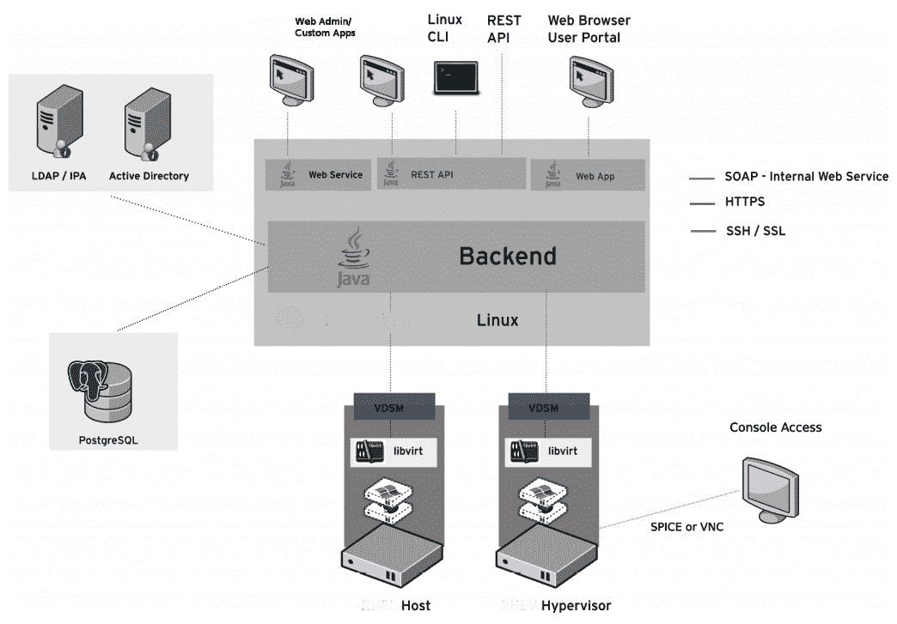
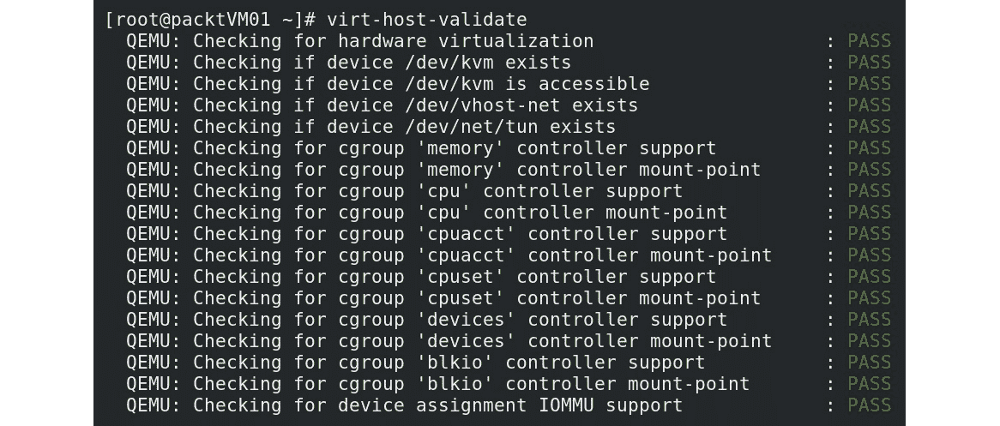
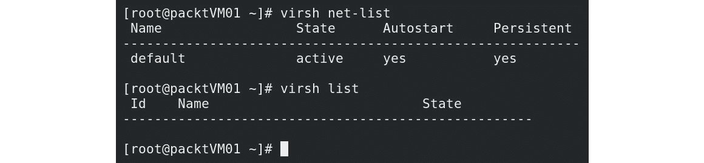
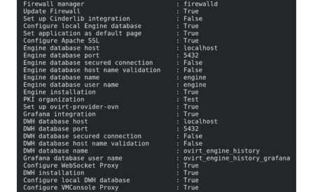
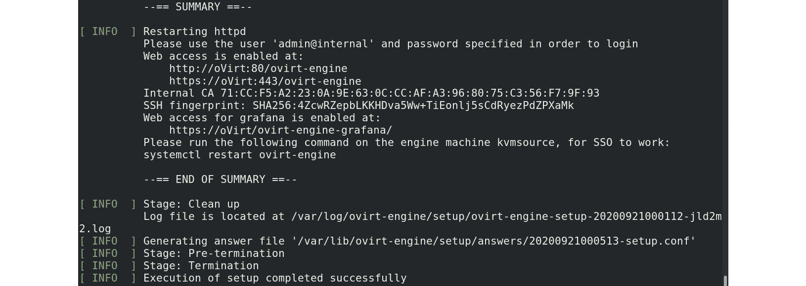

# 三、安装 KVM 虚拟机管理器、libvirt 和 oVirt

本章让您深入了解本书的主要主题，即**内核虚拟机**(**KVM**)及其管理工具 libvirt 和 oVirt。 我们还将学习如何使用 CentOS 8 的基本部署从头开始完全安装这些工具。您会发现这是一个非常重要的主题，因为在某些情况下，您只是没有安装所有必要的实用程序-尤其是 oVirt，因为它是整个软件堆栈中完全独立的一部分，并且是 KVM 的免费管理平台。 由于 oVirt 有很多可移动的部分--基于 Python 的守护进程和支持实用程序、库和 GUI 前端--我们将提供一个分步指南，以确保您可以轻松安装 oVirt。

在本章中，我们将介绍以下主题：

*   熟悉 QEMU 和 libvirt
*   熟悉 oVirt
*   安装 QEMU、libvirt 和 oVirt
*   使用 QEMU 和 libvirt 启动虚拟机

我们开始吧!

# 了解 qemu 和 libvirt

在[*第 2 章*](02.html#_idTextAnchor029)，*KVM as a Virtualization Solution*中，我们开始讨论 KVM、QEMU 和各种可用于管理基于 KVM 的虚拟化平台的其他实用程序。 作为一个机器仿真器，我们将使用 QEMU，这样我们就可以在任何受支持的平台上创建和运行我们的虚拟机--无论是作为仿真器还是虚拟器。 我们将把时间集中在第二种模式上，即使用 QEMU 作为虚拟器。 这意味着我们将能够直接在低于它的硬件 CPU 上执行我们的虚拟机代码，这意味着本机或接近本机的性能和更少的开销。

请记住，整个 KVM 堆栈是作为模块构建的，因此 QEMU 也使用模块化方法就不足为奇了。 多年来，这一直是 Linux 世界的核心原则，它进一步提高了我们使用物理资源的效率。

当我们在 QEMU 上添加 libvirt 作为管理平台时，我们可以访问一些很酷的新实用程序，比如`virsh`命令，我们可以使用它来执行虚拟机管理、虚拟网络管理等等。 我们将在本书后面讨论的一些实用程序(例如，oVirt)使用 libvirt 作为一组标准化的库和实用程序来实现它们的 GUI 魔术-基本上，它们使用 libvirt 作为 API。 我们还可以出于各种目的访问其他命令。 例如，我们将使用一个名为`virt-host-validate`的命令来检查我们的服务器是否与 KVM 兼容。

# 熟悉 oVirt

请记住，相当大比例的 Linux 系统管理员所做的大部分工作都是通过命令行实用程序、libvirt 和 KVM 完成的。 它们为我们提供了一套很好的工具，可以从命令行执行我们需要的所有操作，这一点我们将在本章的下一部分中看到。 但是，我们也会得到关于基于 GUI 的管理是什么样子的*提示*，因为我们将在本章后面简要讨论 Virtual Machine Manager。

但是，这仍然不包括这样一种情况：您拥有大量基于 KVM 的主机、数百台虚拟机、数十个互连它们的虚拟网络，以及装满与 KVM 环境集成所需的存储设备的机架。 当您向外扩展环境时，使用上述实用程序只会将您带入痛苦的世界。 主要原因相当简单--我们还没有引入任何类型的*集中式*软件包来管理基于 KVM 的环境。 我们所说的集中化是指字面意义上的集中化--我们需要某种软件解决方案，能够连接到多个虚拟机管理器并管理它们的所有功能，包括网络、存储、内存和 CPU，或者我们有时所说的虚拟化*四大支柱*。 这类软件最好有某种类型的 GUI 界面，我们可以通过它*集中管理我们所有的 KVM 资源，因为--嗯--我们都是人。 我们中相当多的人更喜欢图片而不是文字，互动也只喜欢文字管理，特别是在规模上。*

 *这就是 oVirt 项目的用武之地。 OVirt 是用于管理我们的 KVM 环境的开源平台。 它是一个基于 GUI 的工具，在后台有很多活动部件--引擎运行在基于 Java 的 WildFly 服务器(过去称为 JBoss)上，前端使用 GWT 工具包，等等。 但所有这些功能都是为了让一件事成为可能--让我们从一个集中的、基于 Web 的管理控制台管理基于 KVM 的环境。

从管理的角度来看，oVirt 有两个主要的构建块-引擎(我们可以使用 GUI 界面连接到它)和它的代理(用于与主机通信)。 让我们简要描述一下它们的功能。

OVirt 引擎是一种集中式服务，可用于执行我们在虚拟化环境中所需的任何操作-管理虚拟机、移动它们、创建映像、存储管理、虚拟网络管理等等。 此服务用于管理 oVirt 主机，为此，它需要与这些主机上的某些内容进行通信。 这就是 oVirt 代理(Vdsm)发挥作用的地方。

OVirt 引擎的一些可用的高级功能包括：

*   虚拟机的实时迁移
*   映像管理
*   虚拟机的导出和导入(OVF 格式)
*   **虚拟到虚拟转换(V2V)**
*   高可用性(从群集中其余主机上的故障主机重新启动虚拟机)
*   资源监控

显然，我们需要将 oVirt 代理和相关实用程序部署到我们的主机上，这些主机将成为我们环境的主要部分，我们将在其中托管所有东西-虚拟机、模板、虚拟网络等等。 为此，oVirt 通过名为**vdsm**的代理使用特定的基于代理的机制。 这是一个我们将部署到 CentOS 8 主机上的代理，这样我们就可以将它们添加到 oVirt 的清单中，这又意味着我们可以使用 oVirt 引擎 GUI 来管理它们。 Vdsm 是一个基于 Python 的代理，oVirt 引擎使用它来直接与 KVM 主机通信，然后 vdsm 可以与本地安装的 libvirt 引擎对话，以执行所有必要的操作。 它还用于配置目的，因为需要配置主机才能在 oVirt 环境中使用，以便配置虚拟网络、存储管理和访问等。 此外，vdsm 还集成了**内存过量使用管理器**(**MOM**)，以便可以高效地管理虚拟化主机上的内存。

用图形的术语来说，这就是 oVirt 的体系结构：



图 3.1-oVirt 体系结构(来源：http://ovirt.org)

我们将在下一章介绍如何安装 oVirt。 如果您曾经听说或使用过名为 Red Hat Enterprise Virtualization 的产品，它可能看起来非常非常熟悉。

# 安装 qemu、libvirt 和 oVirt

让我们从一些基本信息开始讨论如何安装 qemu、libvirt 和 oVirt：

*   我们将将 CentOS 8 用于本书中的所有内容(除了在撰写本文时只支持 CentOS 7 的一些零碎内容之外)。
*   我们的默认安装配置文件始终是**Server with GUI**，前提是我们将涵盖 GUI 和文本模式实用程序，以执行本书中要执行的几乎所有操作。
*   我们需要在带有 GUI 的默认*服务器上安装的所有内容都将手动安装，这样我们就有了一个完整的分步指南来指导我们所做的每件事。*
*   我们将在本书中介绍的所有示例都可以安装在具有 16 个物理核心和 64 GB 内存的单个物理服务器上。 如果您修改了一些数字(分配给虚拟机的核心数量、分配给某些虚拟机的内存量等)，您可以使用 6 核笔记本电脑和 16 GB 内存来实现这一点，前提是您不是一直在运行所有虚拟机。 如果您在完成本章之后关闭了虚拟机，并在下一章中启动必要的虚拟机，您就不会有什么问题了。 在我们的例子中，我们使用了一台惠普 ProLiant DL380p Gen8，这是一款易于找到的二手服务器，而且价格相当便宜。

在完成服务器的基本安装-选择安装配置文件、分配网络配置和 root 密码，以及添加其他用户(如果需要)-之后，我们面临着一个无法进行虚拟化的系统，因为它没有运行 KVM 虚拟机所需的所有实用程序。 因此，我们要做的第一件事是简单地安装必要的模块和基础应用，这样我们就可以检查我们的服务器是否与 KVM 兼容。 因此，请以管理用户身份登录到您的服务器，并发出以下命令：

```sh
yum module install virt
dnf install qemu-img qemu-kvm libvirt libvirt-client virt-manager virt-install virt-viewer -y
```

我们还需要告诉内核我们将使用 IOMMU。 这是通过编辑`/etc/default/grub`文件、找到`GRUB_CMDLINE_LINUX`并在该行末尾添加一条语句来实现的：

```sh
intel_iommu=on
```

在添加该行之前，不要忘记添加单个空格。 下一步是重新启动，因此，我们需要做的是：

```sh
systemctl reboot
```

通过发出这些命令，我们安装了运行基于 KVM 的虚拟机所需的所有库和二进制文件，并使用 virt-manager(GUI libvirt 管理实用程序)来管理我们的 KVM 虚拟化服务器。

此外，通过添加 IOMMU 配置，我们可以确保主机可以看到 IOMMU，并且在我们使用`virt-host-validate`命令时不会抛出错误

之后，通过发出以下命令来检查我们的主机是否符合所有必要的 KVM 要求：

```sh
virt-host-validate
```

该命令通过多个测试来确定我们的服务器是否与兼容。 我们应该得到如下输出：



图 3.2-virt-host-验证输出

这表明我们的服务器已经为 KVM 做好了准备。 因此，下一步，既然已经安装了所有必要的 qemu/libvirt 实用程序，就需要做一些飞行前检查，看看我们安装的所有东西是否都正确部署，并且工作正常。 我们将运行`virsh net-list`和`virsh list`命令来执行此操作，如以下屏幕截图所示：



图 3.3-测试 KVM 虚拟网络并列出可用虚拟机

通过使用这两个命令，我们检查了我们的虚拟化主机是否具有正确配置的默认虚拟网络交换机/网桥(下一章将对此进行详细介绍)，以及是否有任何虚拟机正在运行。 我们有缺省网桥，没有虚拟机，所以一切都是正常的。

## 在 KVM 中安装第一台虚拟机

现在，我们可以开始将我们的 KVM 虚拟化服务器用于其主要目的-运行虚拟机。 让我们首先在我们的主机上部署一个虚拟机。 为此，我们将 CentOS 8.0ISO 文件复制到名为`/var/lib/libvirt/images`的本地文件夹中，我们将使用该文件夹创建第一台虚拟机。 我们可以从命令行使用以下命令执行此操作：

```sh
virt-install --virt-type=kvm --name MasteringKVM01 --vcpus 2 --ram 4096 --os-variant=rhel8.0 --cdrom=/var/lib/libviimg/ CentOS-8-x86_64-1905-dvd1.iso  --network=default --graphics vnc --disk size=16
```

这里的一些参数可能有点令人费解。 让我们从`--os-variant`参数开始，该参数描述您希望使用`virt-install`命令安装哪个访客操作系统。 如果要获取支持的访客操作系统列表，请运行以下命令：

```sh
osinfo-query os
```

`--network`参数与我们的默认虚拟网桥相关(我们在前面提到过)。 我们肯定希望我们的虚拟机是联网的，所以我们选择了这个参数来确保它开箱即可联网。

在启动`virt-install`命令之后，我们应该会看到一个 VNC 控制台窗口，以完成安装过程。 然后，我们可以选择使用的语言、键盘、时间和日期以及安装目的地(单击选定的磁盘，然后按左上角的**完成**)。 我们还可以通过转到**Network&Host Name**，单击**Off**按钮上的，选择**Done**(然后切换到**on**位置)来激活网络，并将我们的虚拟机连接到底层网桥(*默认*)。 之后，我们可以按**开始安装**，让安装过程结束。 在等待这种情况发生的同时，我们可以单击**root password**并为我们的管理用户分配一个 root 密码。

如果所有这一切在您看来有点像*体力劳动*，我们能感受到您的痛苦。 想象一下，必须部署数十台虚拟机，然后单击所有这些设置。 我们已经不在 19 世纪了，所以肯定有更简单的方法来做这件事。

## 自动安装虚拟机

到目前为止，要以更自动化的方式完成这些工作，最简单也是最容易的方法是创建并使用名为**kickstart**的文件。 Kickstart 文件基本上是一个文本配置文件，我们可以使用它来配置服务器的所有部署设置，无论我们谈论的是物理服务器还是虚拟服务器。 唯一需要注意的是，kickstart 文件需要预先准备好并广泛使用-无论是在网络(Web)上还是在本地磁盘上。 还支持其他选项，但这些是最常用的选项。

出于我们的目的，我们将使用网络上可用的 kickstart 文件(通过 Web 服务器)，但我们将对其进行一些编辑，使其可用，并将其留在`virt-install`可以使用的网络上。

当我们安装物理服务器时，作为安装过程(称为`anaconda`)的一部分，在我们的`/root`目录中保存了一个名为`anaconda-ks.cfg`的文件。 这是一个 kickstart 文件，其中包含物理服务器的完整部署配置，然后我们可以将其用作为虚拟机创建新 kickstart 文件的基础。

要做到这一点，在 CentOS7 中最简单的方法是部署一个名为`system-config-kickstart`的实用程序，该实用程序在 CentOS8 中不再可用。在[https://access.redhat.com/labs/kickstartconfig/](https://access.redhat.com/labs/kickstartconfig/)中有一个名为 Kickstart Generator 的替代在线实用程序，但您需要拥有该实用程序的 Red Hat 客户门户帐户。 所以，如果你没有这个功能，你就不得不编辑一个现有的 kickstart 文件。 这不是很难，但可能需要一点努力。 我们需要正确配置的最重要的设置与我们将从其安装虚拟机的*位置*有关-在网络上或从本地目录(就像我们在第一个`virt-install`示例中所做的那样，通过使用本地磁盘上的 CentOS ISO)。 如果我们要使用本地存储在服务器上的 ISO 文件，那么配置就很简单。 首先，我们将部署 Apache web 服务器，这样我们就可以在线托管我们的 kickstart 文件(这将在稍后派上用场)。 因此，我们需要以下命令：

```sh
dnf install httpd 
systemctl start httpd
systemctl enable httpd
cp /root/anaconda-ks.cfg /var/www/html/ks.cfg
chmod 644 /var/www/html/ks.cfg
```

在开始部署过程之前，使用 vi 编辑器(或您喜欢的任何其他编辑器)将 kickstart 文件(`/var/www/html/ks.cfg`)中的第一个配置行编辑为`ignoredisk --only-use=vda`，类似于`ignoredisk --only-use=sda`。 这是因为虚拟 KVM 机器不对设备使用`sd*`命名，而是使用`vd`命名。 这样，任何管理员在连接到物理服务器或虚拟服务器后，都可以更容易地确定他们是在管理物理服务器还是虚拟服务器。

通过编辑 kickstart 文件并使用这些命令，我们安装并启动了`httpd`(Apache web 服务器)。 然后，我们永久启动它，这样它就会在每次服务器重新启动后启动。 然后，我们将默认的 kickstart 文件(`anaconda-ks.cfg`)复制到 Apache 的`DocumentRoot`目录(Apache 从中提供文件的目录)并更改权限，以便当客户端请求该文件时，Apache 可以实际读取该文件。 在我们的示例中，将使用它的*客户端*将是`virt-install`命令。 我们用来说明这一特性的服务器的 IP 地址是`10.10.48.1`，这就是我们将用于 kickstart URL 的地址。 请记住，默认的 KVM 网桥使用 IP 地址`192.168.122.1`，您可以使用`ip`命令轻松检查该地址：

```sh
ip addr show virbr0
```

此外，可能需要在物理服务器上更改一些防火墙设置(接受 HTTP 连接)，以便安装程序可以成功获取 kickstart 文件。 那么，让我们试一试。 在本示例和下面的示例中，请密切注意`--vcpus`参数(我们的虚拟机的虚拟 CPU 核心数)，因为您可能希望根据您的环境更改该参数。 换句话说，如果您没有 4 个内核，请确保减少内核数量。 我们只是以此为例：

```sh
virt-install --virt-type=kvm --name=MasteringKVM02 --ram=4096 --vcpus=4 --os-variant=rhel8.0 --location=/var/lib/libviimg/ CentOS-8-x86_64-1905-dvd1.iso --network=default --graphics vnc --disk size=16 -x "ks=http://10.10.48.1/ks.cfg"
```

重要音符

请注意我们更改的参数。 在这里，我们必须使用`--location`参数，而不是`--cdrom`参数，因为我们要将 kickstart 配置注入引导过程(必须这样做)。

部署过程完成后，我们的服务器上应该有两个功能齐全的虚拟机`MasteringKVM01`和`MasteringKVM02`，可以在将来的演示中使用。 第二个虚拟机(`MasteringKVM02`)将与第一个虚拟机具有相同的 root 密码，因为我们没有更改 kickstart 文件中的任何内容，除了虚拟磁盘选项。 因此，在部署之后，我们可以使用`MasteringKVM01`机器上的 root 用户名和密码登录到我们的`MasteringKVM02`机器。

如果我们想更进一步，我们可以创建一个带有循环的 shell 脚本，该脚本将使用索引自动为虚拟机指定唯一名称。 我们可以通过使用`for`循环及其计数器轻松地实现这一点：

```sh
#!/bin/bash
for counter in {1..5}
do 
	echo "deploying VM $counter"
virt-install --virt-type=kvm --name=LoopVM$counter --ram=4096 --vcpus=4 --os-variant=rhel8.0 --location=/var/lib/libviimg/CentOS-8-x86_64-1905-dvd1.iso --network=default --graphics vnc --disk size=16 -x "ks=http://10.10.48.1/ks.cfg"
done
```

当我们执行此脚本时(不要忘记将其`chmod`设置为`755`！)，我们应该会得到 10 个名为`LoopVM1-LoopVM5`的虚拟机，它们都具有相同的设置，其中包括相同的 root 密码。

如果我们使用的是 GUI 服务器安装，我们可以使用 GUI 实用程序来管理我们的 KVM 服务器。 其中一个实用程序称为**Virtual Machine Manager**，它是一个图形实用程序，使您可以执行基本管理所需的几乎所有操作：操作虚拟网络和虚拟机、打开虚拟机控制台等。 该实用程序可以从 GNOME 桌面访问-您可以使用桌面上的 Windows 搜索键，键入`virtual`，单击**Virtual Machine Manager**，然后开始使用它。 Virtual Machine Manager 如下所示：


图 3.4-虚拟机管理器

既然我们已经介绍了个基本的命令行实用程序(`virsh`和`virt-install`)，并且已经有了一个非常易于使用的 GUI 应用(Virtual Machine Manager)，那么让我们从这个角度来考虑一下我们所说的关于 oVirt 以及管理大量主机、虚拟机、网络和存储设备的内容。 现在，让我们讨论如何安装 oVirt，然后我们将使用它以更集中的方式管理基于 KVM 的环境。

## 安装 oVirt

安装 oVirt 有不同的方法。 我们既可以将其部署为自托管引擎(通过驾驶舱 Web 界面或 CLI)，也可以通过基于软件包的安装将其部署为独立应用。 让我们在本例中使用第二种方式-在虚拟机中进行独立安装。 我们将把安装分为两部分：

1.  安装 oVirt 引擎以实现集中管理
2.  在基于 CentOS 8 的主机上部署 oVirt 代理

首先，让我们来处理 oVirt 引擎部署。 部署非常简单，人们通常使用一台虚拟机来实现这一目的。 请记住，oVirt 不支持 CentOS 8，因此在我们的 CentOS 8 虚拟机中，我们需要输入几个命令：

```sh
yum install https://resources.ovirt.org/pub/yum-repo/ovirt-release44.rpm
yum -y module enable javapackages-tools pki-deps postgresql:12
yum -y update
yum -y install ovirt-engine
```

同样，这只是安装部分；到目前为止，我们还没有进行任何配置。 所以，这就是我们合乎逻辑的下一步。 我们需要启动一个名为`engine-setup`的 shell 应用，它将向我们提出大约 20 个问题。 它们相当具有描述性，而解释实际上是由引擎设置直接提供的，因此以下是我们在测试环境中使用的设置(FQDN 在您的环境中会有所不同)：



图 3.5-oVirt 配置设置

输入`OK`后，引擎设置将启动。 最终结果应该如下所示：



图 3.6-oVirt 引擎设置摘要

现在，我们应该能够通过使用 Web 浏览器并将其指向安装摘要中提到的 URL 来登录到 oVirt 引擎。 在安装过程中，我们被要求提供`admin@internal`用户的密码-这是我们将用于管理环境的 oVirt 管理用户。 OVirt Web 界面非常易于使用，目前，我们只需登录到 Administration Portal(在您尝试登录之前，可以在 oVirt Engine Web GUI 上直接找到一个链接)。 登录后，我们应该会看到 oVirt GUI：


图 3.7-oVirt 引擎管理门户

我们在屏幕左侧有各种选项卡-**Dashboard**、**Compute**、**Network**、**Storage**和**Administration**-和。

*   **Dashboard**：默认登录页。 它包含最重要的信息，即我们环境健康状况的直观表示，以及一些基本信息，包括我们正在管理的虚拟数据中心的数量、群集、主机、数据存储域等。
*   **计算**：我们转到此页面来管理主机、虚拟机、模板、池、数据中心和集群。
*   **网络**：我们转到此页面来管理我们的虚拟化网络和配置文件。
*   **存储**：我们转到此页面来管理存储资源，包括磁盘、卷、域和数据中心。
*   **Administration**：用于管理用户、配额等。

我们将在[*第 7 章*](07.html#_idTextAnchor125)，*虚拟机-安装、配置和生命周期管理*中处理更多与 oVirt 相关的操作，这都是关于 oVirt 的。 但现在，让我们保持 oVirt 引擎的正常运行，这样我们以后就可以重新使用它，并将其用于我们基于 KVM 的虚拟化环境中的所有日常操作。

# 使用 qemu 和 libvirt 启动虚拟机

在部署过程之后，我们可以开始管理我们的台虚拟机。 我们将使用`MasteringKVM01`和`MasteringKVM02`作为的例子。 让我们使用`virsh`命令和`start`关键字启动它们：


图 3.8-使用 virsh start 命令

假设我们从 shell 脚本示例创建了所有五台虚拟机，并且让它们保持开机状态。 我们可以通过发出一个简单的`virsh list`命令轻松地检查它们的状态：


图 3.9-使用 virsh list 命令

如果我们想要正常地关闭`MasteringKVM01`虚拟机，我们可以使用`virsh shutdown`命令来执行此操作：


图 3.10-使用 virsh shutdown 命令

如果我们想要强制关闭`MasteringKVM02`个虚拟机，可以使用`virsh destroy`命令：


图 3.11-使用 virsh 销毁命令

如果我们想要完全删除虚拟机(例如，`MasteringKVM02`)，通常需要首先(优雅地或强制地)关闭它，然后使用`virsh undefine`命令：


图 3.12-使用 virsh DESTORY 和 UNDEFINE 命令

请记住，您实际上可以先做`virsh undefine`，然后做`destroy`，最终结果将是相同的。 但是，这可能会违反*预期行为*，即在实际删除对象之前先关闭该对象。

我们刚刚学习了如何使用`virsh`命令来管理虚拟机--启动和停止--有力而优雅。 在接下来的章中，我们将学习如何管理 KVM 网络和存储，当我们开始使用`virsh`命令扩展我们对的知识时，这个将派上用场。

我们也可以从 GUI 中执行所有这些操作。 您可能还记得，在本章早些时候，我们安装了一个名为`virt-manager`的包。 这实际上是一个用于管理 KVM 主机的 GUI 应用。 让我们用它来玩更多的虚拟机。 这是`virt-manager`的基本 GUI 界面：


图 3.13-virt 管理器 GUI-我们可以看到已注册的虚拟机列表并开始管理它们

如果我们想要在虚拟机上执行常规操作-启动、重新启动、关机、关闭-我们只需右键单击它并从菜单中选择该选项。 要使所有操作变得可见，首先，我们必须启动一个虚拟机；否则，在可用的七个操作中，只有四个操作可用-**运行**、**克隆**、**删除**和**打开**。 **暂停**、**关闭**子菜单和**迁移**选项将呈灰色显示，因为它们只能在已开机的虚拟机上使用。 因此，例如，在我们启动`MasteringKVM01`之后，可用选项的列表将变得更大：


图 3.14-virt-manager 选项-打开虚拟机后，我们现在可以使用更多选项

在本书中，我们将使用`virt-manager`进行各种操作，因此请确保您熟悉它。 在许多情况下，这将使我们的管理工作变得更小一些。

# 摘要

在这一章中，我们为本书其余章节将要做的几乎所有事情奠定了一些基本的基础和前提条件。 我们学习了如何安装 KVM 和 libvirt 堆栈。 我们还学习了如何将 oVirt 部署为管理 KVM 主机的 GUI 工具。

接下来的几章将带我们进入一个更具技术性的方向，因为我们将涵盖网络和存储概念。 要做到这一点，我们必须后退一步，学习或回顾我们之前关于网络和存储的知识，因为这些对于虚拟化，尤其是云来说都是极其重要的概念。

# 问题

1.  我们如何验证我们的主机是否符合 KVM 要求？
2.  OVirt 的默认登录页面名称是什么？
3.  我们可以从命令行使用哪个命令来管理虚拟机？
4.  我们可以从命令行使用哪个命令来部署虚拟机？

# 进一步阅读

有关本章内容的更多信息，请参阅以下链接：

*   KickStart 生成器：[https://access.redhat.com/labs/kickstartconfig/](https://access.redhat.com/labs/kickstartconfig/)。 提醒您一下，您需要拥有 RedHat 支持帐户才能访问此链接。
*   OVirt：[https://www.ovirt.org/](https://www.ovirt.org/)。*