# 五、Libvirt 存储

本章让您深入了解 KVM 使用存储的方式。 具体地说，我们将讨论运行虚拟机的主机内部的存储和*共享存储*。 这里不要让术语让您感到困惑--在虚拟化和云技术中，术语*共享存储*指的是多个虚拟机管理器可以访问的存储空间。 正如我们稍后将解释的，实现这一目标的三种最常见的方法是使用块级、共享级或对象级存储。 我们将使用 NFS 作为共享级存储的示例，使用**Internet 小型计算机系统接口**(**iSCSI**)和**光纤通道**(**FC**)作为块级存储的示例。 在基于对象的存储方面，我们将使用 Ceph.。 GlusterFS 现在也是常用的，所以我们将确保我们也讨论这一点。 为了将一切都包装在一个易于使用和易于管理的盒子中，我们将讨论一些开源项目，它们可能会在练习和创建测试环境时对您有所帮助。

在本章中，我们将介绍以下主题：

*   存储简介
*   存储池
*   NFS 存储和存储
*   ISCSI 和 SAN 存储
*   存储冗余和多路径
*   Gluster 和 Cave 作为 KVM 的存储后端
*   虚拟磁盘映像和格式化以及基本 KVM 存储操作
*   存储领域的最新发展-NVMe 和 NVMeOF

# 存储简介

与大多数 IT 人员至少对网络有基本了解的不同，存储往往是非常不同的。 简而言之，是的，它往往会更复杂一些。 涉及到大量参数、不同的技术和…。 老实说，有大量不同类型的配置选项和强制执行它们的人。 还有一大堆*个问题。 以下是其中一些：*

 **   我们应该为每个存储设备配置一个或两个 NFS 共享吗？
*   我们应该为每个存储设备创建一个或两个 iSCSI 目标？
*   我们应该创建一个还是两个 FC 目标？
*   每个目标有多少个**个逻辑单元号**(**个 LUN**)？
*   我们应该使用什么样的集群大小？
*   我们应该如何进行多路径？
*   我们应该使用数据块级存储还是共享级存储？
*   我们应该使用数据块级存储还是对象级存储？
*   我们应该选择哪种技术或解决方案？
*   我们应该如何配置缓存？
*   我们应该如何配置分区或掩蔽？
*   我们应该使用多少台交换机？
*   我们是否应该在存储级别上使用某种集群技术？

正如您所看到的，问题不断堆积，而我们几乎没有触及表面，因为还有关于使用哪个文件系统、我们将使用哪个物理控制器来访问存储以及哪种类型的布线的问题-它只是变成了一个变量的大杂烩，有许多潜在的答案。 更糟糕的是，这些答案中的许多都可能是正确的--而不仅仅是其中的一个。

让我们把基础水平的数学去掉吧。 在企业级环境中，共享存储通常*是环境中最昂贵的*部分，也可能*对虚拟机性能产生最大的负面影响*，同时*是该环境中超额订阅最多的资源*。 让我们想一想这一点--每台开机的虚拟机都会不断地用 I/O 操作冲击我们的存储设备。 如果我们有 500 台虚拟机在一台存储设备上运行，我们对该存储设备的要求是不是有点太高了？

同时，某种类型的共享存储概念是虚拟化环境的关键支柱。 基本原则非常简单--有很多高级功能可以更好地与共享存储配合使用。 此外，如果共享存储可用，许多操作会快得多。 更重要的是，当我们没有将虚拟机存储在执行它们的相同位置时，有如此多简单的高可用性选择。

另外，如果我们正确设计共享存储环境，我们可以轻松避免**单点故障**(**SPOF**)的情况。 在企业级环境中，避免 SPOF 是关键的设计原则之一。 但是，当我们开始在*购买*清单上添加交换机、适配器和控制器时，我们的经理或客户通常会开始感到头疼。 我们谈论的是性能和风险管理，而他们谈论的是价格。 我们谈论的事实是，他们的数据库和应用需要在 I/O 和带宽方面得到适当的支持，他们认为您可以凭空创造出这一点。 只需挥动你的魔杖，我们就有了：无限的存储性能。

但你的客户肯定会试图强加给你的最好的，也是我们一直以来最喜欢的苹果与橙子的比较是这样的，…。 *“在我的笔记本电脑中，闪亮的新 1 TB NVMe 固态硬盘的 IOPS 是 50,000 美元存储设备的 1000 多倍，性能是 50,000 美元存储设备的 5 倍多，而成本却低了 100 倍！您完全不知道自己在做什么！”*

如果你去过那里，我们很同情你。 你很少会看到这么多关于一个盒子里的硬件的讨论和争执。 但它是一个盒子里必不可少的硬件，这是一场很棒的战斗。 因此，让我们解释 libvirt 在存储访问方面使用的一些关键概念以及如何使用它。 然后，让我们利用我们的知识从我们的存储系统中提取尽可能多的性能，并使用它来执行 libvirt。

在本章中，我们将通过安装和配置示例介绍几乎所有这些存储类型。 其中每一个都有自己的用例，但通常情况下，将由您选择要使用的内容。

因此，让我们开始了解这些受支持的协议，并了解如何配置它们。 在介绍存储池之后，我们将讨论NFS，这是一种用于虚拟机存储的典型共享级协议。 然后，我们将转向数据块级协议，如 iSCSI 和 FC。 然后，我们将转向冗余和多路径，以提高存储设备的可用性和带宽。 我们还将介绍用于 KVM 虚拟化的不太常见的文件系统(如 Cave、Gluster 和 GFS)的各种用例。 我们还将讨论目前事实趋势的新发展。

# 存储池

当你第一次开始使用存储设备时--即使它们是更便宜的盒子--你也会面临一些选择。 他们会要求您进行一些配置-选择 RAID 级别、配置热备盘、固态硬盘缓存……这是一个过程。 同样的过程也适用于从头开始构建数据中心或扩展现有数据中心的情况。 您必须配置存储才能使用它。

当涉及到存储时，管理器有点*挑剔*，因为它们支持的存储类型和不支持的存储类型。 例如，微软的 Hyper-V 支持用于虚拟机存储的 SMB 共享，但并不真正支持用于虚拟机存储的 NFS 存储。 VMware 的 vSphere 虚拟机管理器支持 NFS，但不支持 SMB。 原因很简单-开发虚拟机管理器的公司选择并限定其虚拟机管理器将支持的技术。 然后，由各种 HBA/控制器供应商(Intel、Mellanox、QLogic 等)为该虚拟机管理器开发驱动程序，并由存储供应商决定在其存储设备上支持哪种类型的存储协议。

从 CentOS 的角度来看，支持多种不同的存储池类型。 以下是其中的一些内容：

*   **基于逻辑卷管理器**(**LVM**)的存储池
*   基于目录的存储池
*   基于分区的存储池
*   基于 GlusterFS 的存储池
*   基于 iSCSI 的存储池
*   基于磁盘的存储池
*   基于 HBA 的存储池，使用 SCSI 设备

从 libvirt 的角度来看，存储池可以是 libvirt 管理的目录、存储设备或文件。 这将我们引向 10 种以上不同的存储池类型，您将在下一节中看到这一点。 从虚拟机的角度来看，libvirt 管理虚拟机存储，虚拟机使用这些存储以便它们有能力存储数据。

另一方面，oVirt 的看法略有不同，因为它有自己的服务，可以与 libvirt 协作，从数据中心的角度提供集中的存储管理。 *数据中心视角*似乎是一个有点奇怪的术语。 但是想想看--数据中心是某种*更高级别的*对象，您可以在其中看到您的所有资源。 数据中心使用*存储*和*虚拟机管理器*为我们提供虚拟化所需的所有服务-虚拟机、虚拟网络、存储域等。 基本上，从数据中心的角度来看，您可以看到属于该数据中心的所有主机上都发生了什么。 但是，从主机级别看不到另一台主机上正在发生的事情。 无论从管理角度还是从安全角度来看，这都是完全合乎逻辑的层次结构。

OVirt 可以集中管理这些不同类型的存储池(随着时间的推移，该列表可能会变大或变小)：

*   **网络文件系统**(**NFS**)
*   加入时间：清华大学 2007 年 01 月 25 日下午 3：33
*   ISCSI
*   足球俱乐部
*   本地存储(直接连接到 KVM 主机)
*   GlusterFS 导出
*   符合 POSIX 标准的文件系统

让我们先来关注一些术语：

*   **Brtfs**是一种类型的文件系统，它支持快照、RAID 和类似 LVM 的功能、压缩、碎片整理、在线调整大小以及许多其他高级功能。 在发现它的 RAID5/6 很容易导致数据丢失后，它就被弃用了。
*   **ZFS**是一种文件系统，它支持 Brtfs 所做的一切，外加读和写缓存。

CentOS 有一种处理存储池的新方法。 尽管仍处于技术预览状态，但通过这个名为**Stratis**的新工具进行完整的配置是值得的。 基本上，几年前，RedHat 终于放弃了将 Brtfs 推向未来版本的想法，并开始开发 Stratis。 如果您曾经使用过 ZFS，那么这可能就是本文要解决的问题--一组易于管理的、类似 ZFS 的卷管理实用程序，Red Hat 可以在将来的版本中支持它。 此外，就像 ZFS 一样，基于 Stratis 的池也可以使用缓存；因此，如果您想要将 SSD 专用于池缓存，实际上也可以这样做。 如果您一直期望 RedHat 支持 ZFS，那么有一个基本的 Red Hat 策略会阻碍您的工作。 具体地说，ZFS 不是 Linux 内核的一部分，主要是因为许可原因。 对于这些情况，Red Hat 有一个策略--如果它不是内核(上游)的一部分，那么他们既不提供也不支持它。 就目前情况来看，这不会在短期内发生。 这些政策也反映在 CentOS 中。

## 本地存储池

另一方面，Stratis 现在可用。 我们将使用它通过创建存储池来管理我们的本地存储。 创建池需要我们事先设置分区或磁盘。 在创建池之后，我们可以在其上创建卷。 我们只需要非常小心一件事-尽管 Stratis 可以管理 XFS 文件系统，但我们不应该直接从文件系统级别更改 Stratis 管理的 XFS 文件系统。 例如，不要直接从基于 XFS 的命令重新配置或重新格式化基于 Stratis 的 XFS 文件系统，因为这样会对系统造成严重破坏。

Stratis 支持各种不同类型的块存储设备：

*   硬盘和固态硬盘
*   ISCSI LUN
*   LVM
*   卢克斯
*   MD RAID
*   设备映射器多路径
*   NVMe 设备

让我们从头开始安装 Stratis，这样我们就可以使用它了。 让我们使用以下命令：

```sh
yum -y install stratisd stratis-cli
systemctl enable --now stratisd
```

第一个命令安装 Stratis 服务和相应的命令行实用程序。 第二个将启动并启用 Stratis 服务。

现在，我们将通过一个完整的示例来说明如何使用 Stratis 配置您的存储设备。 我们将介绍这种分层方法的一个示例。 因此，我们要做的是：

*   使用 MD RAID 创建软件 RAID10+备件。
*   从该 MD RAID 设备创建一个 Stratis 池。
*   将缓存设备添加到池中以使用 Stratis 的缓存功能。
*   创建一个 Stratis 文件系统并将其挂载到本地服务器上。

这里的前提很简单-通过 MD RAID 的软件 RAID10+SPARE 将近似于常规的生产方法，在这种方法中，您将有某种硬件 RAID 控制器向系统呈现单个块设备。 我们将向池中添加一个缓存设备来验证缓存功能，因为如果我们使用 ZFS，我们很可能也会这样做。 然后，我们将在该池之上创建一个文件系统，并在以下命令的帮助下将其装载到本地目录：

```sh
mdadm --create /dev/md0 --verbose --level=10 --raid-devices=4 /dev/sdb /dev/sdc /dev/sdd /dev/sde --spare-devices=1 /dev/sdf2
stratis pool create PacktStratisPool01 /dev/md0
stratis pool add-cache PacktStratisPool01 /dev/sdg
stratis pool add-cache PacktStratisPool01 /dev/sdg
stratis fs create PackStratisPool01 PacktStratisXFS01
mkdir /mnt/packtStratisXFS01
mount /stratis/PacktStratisPool01/PacktStratisXFS01 /mnt/packtStratisXFS01
```

这个挂载的文件系统是XFS 格式的。 然后，我们可以通过 NFS 导出轻松使用此文件系统，这正是我们在 NFS 存储课程中要做的。 但现在，这只是一个如何使用 Stratis 创建池的示例。

我们已经介绍了本地存储池的一些基础知识，这使我们更接近我们的下一个主题，即如何从 libvirt 的角度使用池。 所以，这将是我们的下一个话题。

## Libvirt 存储池

Libvirt 管理其个自己的存储池，这是为了一件事--为虚拟机磁盘和相关数据提供个不同的存储池。 请记住，libvirt 使用底层操作系统支持的内容，因此它支持不同存储池类型的负载也就不足为奇了。 一张图片胜过千言万语，所以下面是从 virt-manager 创建 libvirt 存储池的屏幕截图：

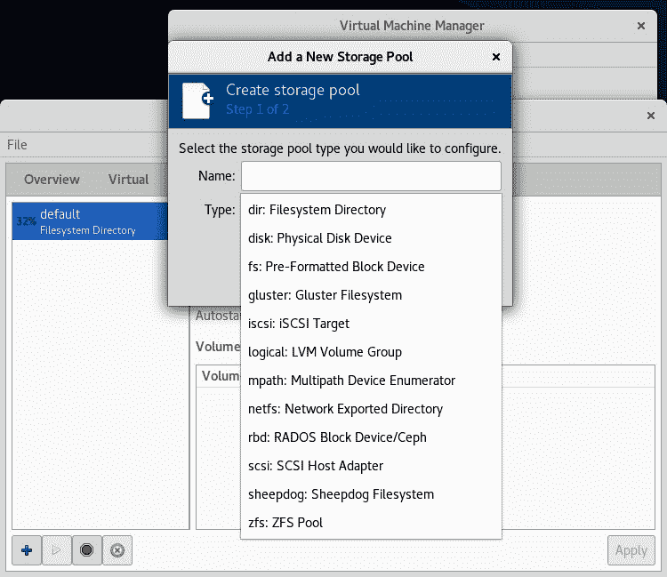

图 5.1-libvirt 支持的不同存储池类型

Libvirt已经有一个预定义的默认存储池，它是本地服务器上的一个目录存储池。 此默认池位于`/var/lib/libvirt/images`目录中。 这表示我们将保存本地安装的虚拟机中的所有数据的默认位置。

在以下部分中，我们将创建各种不同类型的存储池-基于 NFS 的池、iSCSI 和 FC 池，以及 Gluster 和 Ceph 池：总共 9 码。 我们还将解释何时使用它们中的每一个，因为涉及到不同的使用模式。

# <

作为一种协议，NFS 从 80 年代中期就开始出现了。 它最初是由 Sun Microsystems 开发的，作为一种共享文件的协议，直到今天它也一直在使用。 实际上，它仍在开发中，这对于一项如此*老*的技术来说是相当令人惊讶的。 例如，NFS 4.2 版于 2016 年问世。 在此版本中，NFS 收到了非常大的更新，如下所示：

*   **服务器端复制**：通过在 NFS 服务器之间直接执行克隆来显著提高 NFS 服务器之间的克隆操作速度的功能
*   **稀疏文件**和**空间预留**：这些功能增强了 NFS 处理具有未分配块的文件的方式，同时关注容量，以便我们可以在需要写入数据时保证空间可用性
*   **应用数据块支持**：帮助将文件作为块设备(磁盘)使用的应用的功能
*   更好的 pNFS 实施

V4.2 中还增强了其他一些功能，但目前，这已经足够了。 您可以在 IETF 的 RFC7862 文档([https://tools.ietf.org/html/rfc7862](https://tools.ietf.org/html/rfc7862))中找到有关这方面的更多信息。 我们将把注意力集中在 NFS v4.2 的实现上，因为这是 NFS 目前所能提供的最好的功能。 它也恰好是 CentOS 8 支持的默认 NFS 版本。

我们要做的第一件事是安装必要的软件包。 我们将通过使用以下命令来实现这一点：

```sh
yum -y install nfs-utils
systemctl enable --now nfs-server
```

第一个命令安装运行 NFS 服务器所需的实用程序。 第二个将启动它并永久启用它，以便 NFS 服务在重启后可用。

我们的下一个任务是配置要通过 NFS 服务器共享的内容。 为此，我们需要*导出*一个目录，并通过网络使其可供我们的客户端使用。 为此，NFS 使用配置文件`/etc/exports`。 假设我们想要创建一个名为`/exports`的目录，然后将其共享给`192.168.159.0/255.255.255.0`网络中的客户端，并且我们希望允许他们在该共享上写入数据。 我们的`/etc/exports`文件应该如下所示：

```sh
/mnt/packtStratisXFS01	192.168.159.0/24(rw)
exportfs -r
```

这些配置选项告诉我们的 NFS 服务器要导出哪个目录(`/exports`)、要导出到哪些客户端(`192.168.159.0/24`)以及要使用哪些选项(`rw`表示读写)。

其他一些可用的选项包括：

*   `ro`：只读模式。
*   `sync`：同步 I/O 操作。
*   `root_squash`：来自`UID 0`和`GID 0`的所有 I/O 操作都映射到可配置的匿名 UID 和 GID(`anonuid`和`anongid`选项)。
*   `all_squash`：来自任何 UID 和 GID 的所有 I/O 操作都映射到匿名 UID 和 GID(`anonuid`和`anongid`选项)。
*   `no_root_squash`：来自`UID 0`和`GID 0`的所有 I/O 操作都映射到`UID 0`和`GID 0`。

如果需要将多个选项应用于导出的目录，请在它们之间加上逗号，如下所示：

```sh
/mnt/packtStratisXFS01	192.168.159.0/24(rw,sync,root_squash)
```

您可以使用完全限定的域名或短主机名(如果它们可以通过 DNS 或任何其他机制进行解析)。 此外，如果您不喜欢使用前缀(`24`)，可以使用常规网络掩码，如下所示：

```sh
/mnt/packtStratisXFS01 192.168.159.0/255.255.255.0(rw,root_squash)
```

现在我们已经配置了 NFS 服务器，让我们看看如何配置 libvirt 以将该服务器用作存储池。 一如既往，有几种方法可以做到这一点。 我们可以只使用池定义创建一个 XML 文件，并使用`virsh pool-define --file`命令将其导入到 KVM 主机。 以下是配置文件示例：

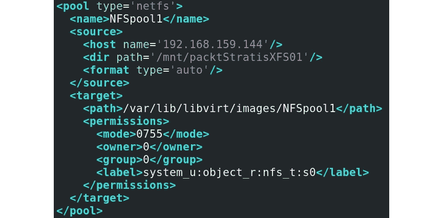

图 5.2-NFS 池的 XML 配置文件示例

让我们解释一下这些配置选项：

*   `pool type`：`netfs`表示我们将使用 NFS 文件共享。
*   `name`：池名称，因为 libvirt 使用池作为命名对象，就像虚拟网络一样。
*   `host`：我们连接到的 NFS 服务器的地址。
*   `dir path`：我们通过`/etc/exports`在 NFS 服务器上配置的 NFS 导出路径。
*   `path`：要将 NFS 共享装载到的 KVM 主机上的本地目录。
*   `permissions`：用于挂载此文件系统的权限。
*   `owner`和`group`：用于挂载的UID 和 GID(这就是我们之前使用`no_root_squash`选项导出文件夹的原因)。
*   `label`：此文件夹的 SELinux 标签-我们将在[*第 16 章*](16.html#_idTextAnchor302)，*KVM 平台故障排除指南*中讨论此问题。

如果我们愿意，我们可以很容易地通过 Virtual Machine Manager GUI 来做同样的事情。 首先，我们必须选择正确的类型(NFS 池)并为其命名：

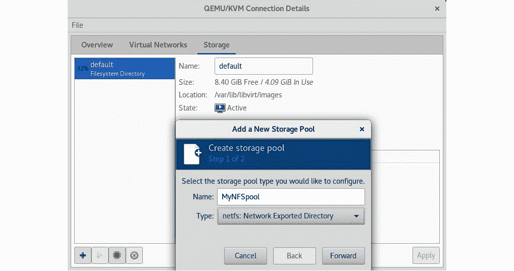

图 5.3-选择 NFS 池类型并为其命名

单击**Forward**之后，我们可以转到最后一个配置步骤，在该步骤中，我们需要告诉向导我们要从哪台服务器装载 NFS 共享：

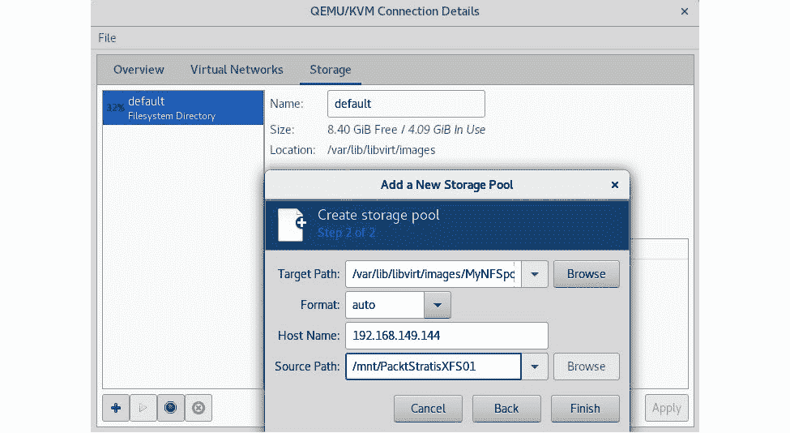

图 5.4-配置 NFS 服务器选项

当我们完成这些配置选项(**主机名**和**源路径**)的键入后，我们可以按**Finish**，这将意味着退出向导。 此外，我们之前的配置屏幕(仅包含**默认**存储池)现在还列出了我们新配置的池：


图 5.5-列表中显示新配置的 NFS 池

我们何时在 libvirt 中使用基于 NFS 的存储池？用途是什么？ 基本上，我们可以很好地将它们用于与存储安装映像相关的任何事情-ISO 文件、虚拟软盘文件、虚拟机文件等等。

请记住，尽管不久前似乎 NFS 几乎从企业环境中消失了，但 NFS 仍然存在。 实际上，随着 NFS4.1、4.2 和 pNFS 的推出，它在市场上的前景看起来甚至比几年前更好。 这是一个非常熟悉的协议，有很长的历史，在许多情况下它仍然很有竞争力。 如果您熟悉 VMware 虚拟化技术，VMware 在 ESXi 6.0 中引入了一种称为虚拟卷的技术。 这是一种基于对象的存储技术，既可以使用基于数据块的协议，也可以使用基于 NFS 的协议，对于某些场景来说，这是一个非常引人注目的使用案例。 但现在，让我们转到块级技术，如 iSCSI 和 FC。

# 帖子主题：回复：iSCSI 和 SAN 存储

长期以来，将 iSCSI 用于个虚拟机存储一直是家常便饭。 即使您考虑到 iSCSI 不是实现存储的最有效方式这一事实，它仍然被广泛接受，您会发现它无处不在。 效率受到影响的原因有两个：

*   ISCSI 将 SCSI 命令封装到常规 IP 包中，这意味着分段和开销，因为 IP 包具有非常大的报头，这意味着效率较低。
*   更糟糕的是，它是基于 TCP 的，这意味着存在序列号和重传，这可能会导致排队和延迟，而且环境越大，您通常越会感觉到这些影响对虚拟机性能的影响。

话虽如此，它基于以太网堆栈的事实使得部署基于 iSCSI 的解决方案变得更容易，同时也带来了一些独特的挑战。 例如，有时很难向客户解释对虚拟机流量和 iSCSI 流量使用相同的网络交换机不是最好的想法。 更糟糕的是，客户有时会被省钱的愿望蒙蔽双眼，以至于他们不明白自己的工作违背了自己的最佳利益。 尤其是在网络带宽方面。 我们中的大多数人都去过那里，试图解决客户的问题，比如*“但我们已经有一台千兆以太网交换机了，为什么还需要比这个更快的交换机呢？”*

事实是，在 iSCSI 的错综复杂的情况下，更多就是更多。 磁盘/缓存/控制器端的速度越快，网络端的带宽越大，创建速度更快的存储系统的机会就越大。 所有这些都会对我们的虚拟机性能产生重大影响。 正如您将在*存储冗余和多路径*部分中看到的那样，您实际上可以自己构建一个非常好的存储系统-包括 iSCSI 和 FC。 当您尝试创建某种测试实验室/环境以供您发展 KVM 虚拟化技能时，这可能会非常有用。 您也可以将这些知识应用于其他虚拟化环境。

ISCSI 和 FC 体系结构非常相似-它们都需要目标(iSCSI 目标和 FC 目标)和启动器(ISCS 启动器和 FC 启动器)。 在此术语中，目标是*服务器*组件，发起方是*客户端*组件。 简单地说，启动器连接到目标，以访问通过该目标呈现的数据块存储。 然后，我们可以使用启动器的标识来*限制*启动器能够在目标上看到的内容。 这就是在比较iSCSI 和 FC 时术语开始有所不同的地方。

在 iSCSI 中，启动器的身份可以由四个不同的属性定义。 这些建议如下：

*   **iSCSI 限定名称**(**IQN**)：这是所有启动器和目标在 iSCSI 通信中具有的唯一名称。 我们可以将其与常规基于以太网的网络中的 MAC 或 IP 地址进行比较。 您可以这样想-IQN 对于 iSCSI 来说就像 MAC 或 IP 地址对于基于以太网的网络一样。
*   **IP 地址**：每个启动器将使用不同的 IP 地址连接到目标。
*   **MAC 地址**：每个发起方在第 2 层上都有不同的 MAC 地址。
*   **完全限定域名**(**FQDN**)：这表示由 DNS 服务解析的服务器的名称。

从 iSCSI 目标的角度来看(取决于其实现)，您可以使用这些属性中的任何一个来创建配置，该配置将告诉 iSCSI 目标可以使用哪些 IQN、IP 地址、MAC 地址或 FQDN 连接到它。 这就是所谓的*掩蔽*，因为通过使用这些身份并将它们与 LUN 配对，我们可以*掩蔽*启动器可以在 iSCSI 目标上*看到*的内容。 LUN 只是我们通过 iSCSI 目标向启动器导出的原始数据块容量。 LUN 采用*索引*或*编号*，通常从 0 开始。 每个 LUN 编号代表启动器可以连接到的不同存储容量。

例如，我们可以让 iSCSI 目标具有三个不同的 LUN-`LUN0`(20 GB)、`LUN1`(40 GB)和`LUN2`(60 GB)。 这些都将托管在同一存储系统的 iSCSI 目标上。 然后，我们可以将 iSCSI 目标配置为接受 IQN 以查看所有 LUN，将另一个 IQN 配置为仅看到`LUN1`，并将另一个 IQN 配置为仅看到`LUN1`和`LUN2`。 这实际上是我们现在要配置的内容。

让我们从配置 iSCSI 目标服务开始。 为此，我们需要安装`targetcli`包，并配置服务(称为`target`)以运行：

```sh
yum -y install targetcli
systemctl enable --now target
```

请注意防火墙配置；您可能需要将其配置为允许在端口`3260/tcp`上进行连接，该端口是 iSCSI 目标门户使用的端口。 因此，如果您的防火墙已启动，请键入以下命令：

```sh
firewall-cmd --permanent --add-port=3260/tcp ; firewall-cmd --reload
```

就要使用的存储后端而言，Linux 上的 iSCSI 有三种可能性。 我们可以使用常规文件系统(如 XFS)、块设备(硬盘)或 LVM。 所以，这正是我们要做的。 我们的场景将如下所示：

*   `LUN0`(20 GB)：基于 XFS 的文件系统，在`/dev/sdb`设备上
*   `LUN1`(40 GB)：硬盘，在`/dev/sdc`设备上
*   `LUN2`(60 GB)：LVM，在`/dev/sdd`设备上

因此，在我们安装了必要的软件包并配置了目标服务和防火墙之后，我们应该开始配置我们的 iSCSI 目标。 我们只需启动`targetcli`命令并检查状态，这应该是一张白板，因为我们才刚刚开始这个过程：

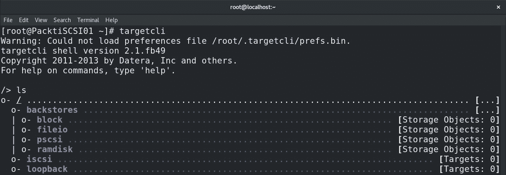

图 5.6-targetcli 起点-空配置

让我们从循序渐进的过程开始：

1.  So, let's configure the XFS-based filesystem and configure the `LUN0` file image to be saved there. First, we need to partition the disk (in our case, `/dev/sdb`):

    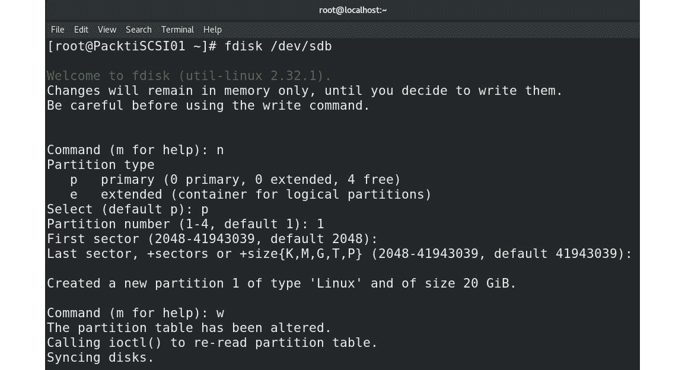

    图 5.7-XFS 文件系统的/dev/sdb 分区

2.  The next step is to format this partition, create and use a directory called `/LUN0` to mount this filesystem, and serve our `LUN0` image, which we're going to configure in the next steps:

    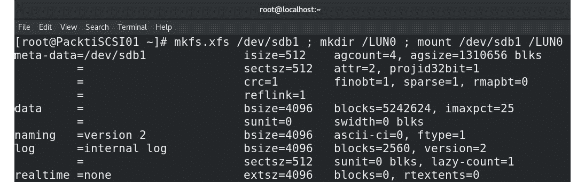

    图 5.8-格式化 XFS 文件系统，创建目录，并将其挂载到该目录

3.  The next step is configuring `targetcli` so that it creates `LUN0` and assigns an image file for `LUN0`, which will be saved in the `/LUN0` directory. First, we need to start the `targetcli` command:

    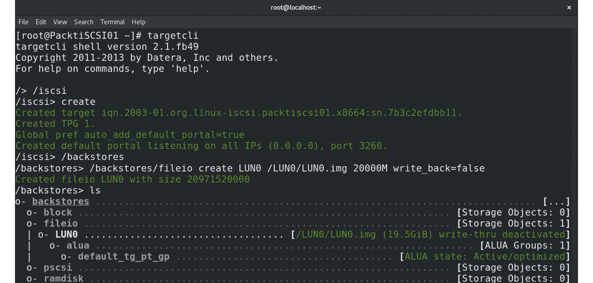

    图 5.9-创建 iSCSI 目标 LUN0 并将其作为文件托管

4.  接下来，让我们配置将使用`/dev/sdc1`(使用上一个示例创建分区)的基于数据块设备的 LUN 后端-`LUN2`，并检查当前状态：


图 5.10-创建 LUN1，直接从数据块设备托管它

因此，现在配置了`LUN0`和`LUN1`及其各自的后端。 让我们通过配置 LVM 来完成这些工作：

1.  First, we are going to prepare the physical volume for LVM, create a volume group out of that volume, and display all the information about that volume group so that we can see how much space we have for `LUN2`:

    

    图 5.11-为 LVM 配置物理卷，构建卷组，并显示有关该卷组的信息

2.  The next step is to actually create the logical volume, which is going to be our block storage device backend for `LUN2` in the iSCSI target. We can see from the `vgdisplay` output that we have 15,359 4 MB blocks available, so let's use that to create our logical volume, called `LUN2`. Go to `targetcli` and configure the necessary settings for `LUN2`:

    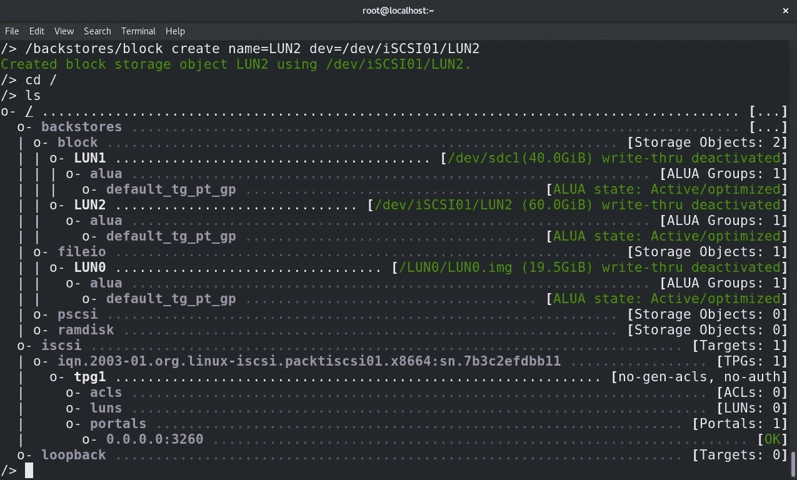

    图 5.12-使用 LVM 后端配置 LUN2

3.  让我们停在这里一秒钟，切换到 KVM 主机(iSCSI 启动器)配置。 首先，我们需要安装 iSCSI 启动器，它是名为`iscsi-initiator-utils`的软件包的一部分。 因此，让我们使用`yum`命令安装：

    ```sh
    yum -y install iscsi-initiator-utils
    ```

4.  接下来，我们需要配置启动器的 IQN。 我们通常希望该名称让人想起主机名，因此，看到我们主机的 FQDN 是`PacktStratis01`，我们将使用它来配置 IQN。 为此，我们需要编辑`/etc/iscsi/initiatorname.iscsi`文件并配置`InitiatorName`选项。 例如，让我们将其设置为`iqn.2019-12.com.packt:PacktStratis01`。 `/etc/iscsi/initiatorname.iscsi`文件的内容如下：

    ```sh
    InitiatorName=iqn.2019-12.com.packt:PacktStratis01
    ```

5.  Now that this is configured, let's go back to the iSCSI target and create an **Access Control List** (**ACL**). The ACL is going to allow our KVM host's initiator to connect to the iSCSI target portal:

    

    图 5.13-创建 ACL，以便 KVM 主机的启动器可以连接到 iSCSI 目标

6.  接下来，我们需要将预先创建的基于文件和基于数据块的设备发布到iSCSI 目标 LUN。 因此，我们需要这样做：


图 5.14-将基于文件和基于数据块的设备添加到 iSCSI 目标 LUN 0、1 和 2

最终结果应该如下所示：


图 5.15-最终结果

至此，一切都配置好了。 我们需要返回到 KVM 主机并定义将使用这些 LUN 的存储池。 要做到这一点，最简单的方法是使用池的 XML 配置文件。 因此，下面是我们的示例配置 XML 文件；我们将其命名为`iSCSIPool.xml`：

```sh
<pool type='iscsi'>
  <name>MyiSCSIPool</name>
  <source>
    <host name='192.168.159.145'/>
    <device path='iqn.2003-01.org.linux-iscsi.packtiscsi01.x8664:sn.7b3c2efdbb11'/>
  </source>
  <initiator>
   <iqn name='iqn.2019-12.com.packt:PacktStratis01' />
</initiator>
  <target>
    <path>/dev/disk/by-path</path>
  </target>
</pool>
```

让我们一步一步地解释该文件：

*   `pool type= 'iscsi'`：我们告诉 libvirt 这是一个 iSCSI 池。
*   `name`：池名称。
*   `host name`：iSCSI 目标的 IP 地址。
*   `device path`：iSCSI 目标的 IQN。
*   启动器部分中的 IQN 名称：启动器的 IQN。
*   `target path`：将装载 iSCSI 目标的 LUN 的位置。

现在，我们要做的就是定义、启动和自动启动新的 iSCSI 支持的 KVM 存储池：

```sh
virsh pool-define --file iSCSIPool.xml
virsh pool-start --pool MyiSCSIPool
virsh pool-autostart --pool MyiSCSIPool
```

可通过`virsh`轻松检查配置的目标路径部分。 如果我们在 KVM 主机中键入以下WING 命令，我们将从刚刚配置的`MyiSCSIPool`池中获得可用 LUN 的列表：

```sh
virsh vol-list --pool MyiSCSIPool
```

此命令的结果如下：

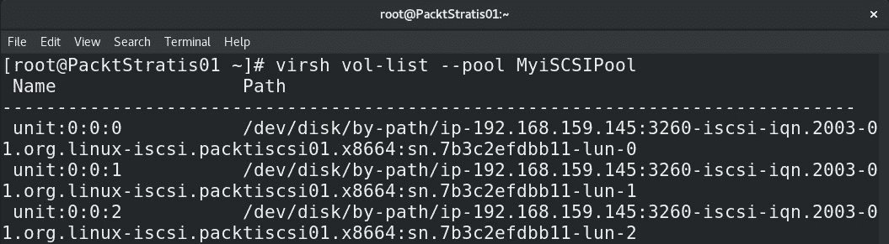

图 5.16-我们的 iSCSI 池 LUN 的运行时名称

如果此输出让您稍微想起 VMware vSphere 虚拟机管理器存储运行时名称，那么您肯定是在正确的轨道上。 当我们开始部署虚拟机时，我们将能够在[*第 7 章*](07.html#_idTextAnchor125)、*虚拟机-安装、配置和生命周期管理*中使用这些存储池。

# 存储冗余和多路径

冗余是 IT 关键字之一，任何单个组件故障都可能给公司或其客户带来大问题。 避免 SPOF 的总体设计原则是我们应该始终坚持的。 归根结底，任何网络适配器、电缆、交换机、路由器或存储控制器都不会永远工作。 因此，在我们的设计中计算冗余有助于我们的 IT 环境在其正常生命周期中发挥作用。

同时，冗余还可以与多路径相结合，以确保更高的吞吐量。 例如，当我们将物理主机连接到具有两个控制器(每个控制器有四个 FC 端口)的 FC 存储时，我们可以使用四条路径(如果存储是主动-被动)或八条路径(如果它是主动-主动)来连接从该存储设备导出到主机的相同 LUN。 这为我们提供了多个额外的 LUN 访问选项，此外，它还为我们提供了更高的可用性，即使在出现故障的情况下也是如此。

例如，让常规 KVM 主机执行 iSCSI 多路径操作相当复杂。 在文档方面存在多个配置问题和空白，这样的配置的支持性令人怀疑。 但是，也有一些产品使用开箱即支持的 KVM，例如 oVirt(我们之前介绍过)和**Red Hat Enterprise Virtualization Hypervisor**(**RHEV-H**)。 因此，让我们在 iSCSI 上使用 oVirt作为这个示例。

在执行此操作之前，请确保已执行以下操作：

*   您的虚拟机管理器主机将添加到 oVirt 清单中。
*   您的虚拟机管理器主机有两个独立于管理网络的附加网卡。
*   ISCSI 存储在与两个额外的虚拟机管理器网卡相同的第 2 层网络中有两个额外的网卡。
*   对 iSCSI 存储进行配置，使其至少具有一个目标和一个 LUN，其配置方式将使虚拟机管理器主机能够连接到它。

因此，当我们在 oVirt 中执行此操作时，我们需要做几件事。 首先，从网络的角度来看，创建一些存储网络将是一个好主意。 在我们的示例中，我们将为 iSCSI 分配两个网络，并将其命名为`iSCSI01`和`iSCSI02`。 我们需要打开 oVirt 管理面板，将鼠标悬停在**Network**上，然后从菜单中选择**Networks**。 这将打开**新建逻辑网络**向导的弹出窗口。 因此，我们只需要将网络命名为`iSCSI01`(对于第一个网络)，取消选中**VM network**复选框(因为这不是一个虚拟机网络)，然后转到**Cluster**选项卡，在那里我们取消选中**Required All**复选框。 对`iSCSI02`网络再次重复整个过程：

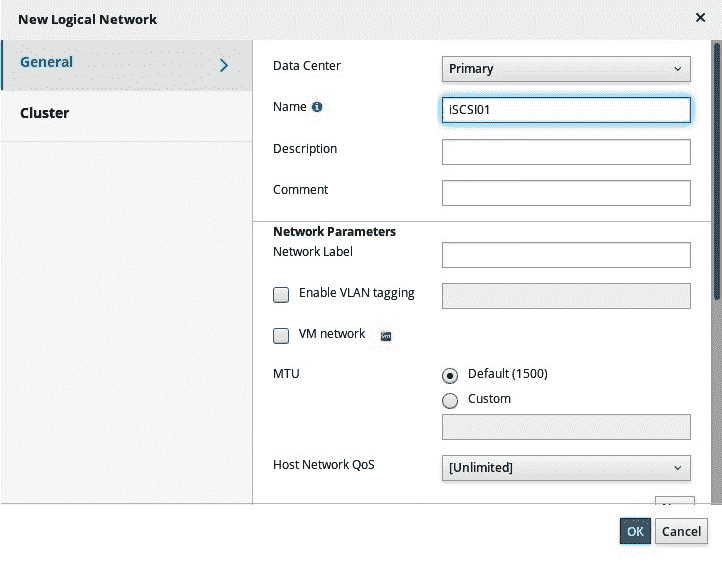

图 5.17-为 iSCSI 绑定配置网络

下一步是将这些网络分配给主机网络适配器。 转到`compute/hosts`，双击您添加到 oVirt 清单中的主机，选择**网络接口**选项卡，然后单击右上角的**设置主机网络**图标。 在 UI 中，在第二个网络接口上拖放`iSCSI01`，在第三个网络接口上拖放`iSCSI02`。 第一个网络接口已经被 oVirt 管理网络占用。 它应该看起来像这样：


图 5.18-将虚拟网络分配给虚拟机管理器的物理适配器

在关闭窗口之前，请确保单击`iSCSI01`和`iSCSI02`上的*铅笔*符号，为这两个虚拟网络设置 IP 地址。 分配可将您连接到相同或不同子网上的 iSCSI 存储的网络配置：


图 5.19-在数据中心级别创建 iSCSI 绑定

现在，您已经配置了 iSCSI 绑定。 我们配置的最后一部分是启用它。 同样，在 oVirt GUI 中，转到**Compute**|**Data Centers**，双击选择您的数据中心，然后转到**iSCSI Multipathing**选项卡：


图 5.20-在数据中心级别配置 iSCSI 多路径

单击右上角的**Add**按钮并浏览向导。 具体地说，在弹出窗口的顶部选择`iSCSI01`和`iSCSI02`网络，在下方选择 iSCSI 目标。

既然我们已经介绍了存储池、NFS 和 iSCSI 的基础知识，我们可以继续使用一种标准的开源方式来部署存储基础设施，即使用 Gluster 和/或 Cave。

# Gluster 和 Cave 作为 KVM 的存储后端

还有其他高级类型的文件系统可以用作 libvirt 存储后端。 那么，现在让我们来讨论其中的两个-Gluster 和 Cave。 稍后，我们还将检查 libvirt 如何使用 GFS2。

## 光泽

Gluster 是一种分布式文件系统，通常用于高可用性场景。 与其他文件系统相比，它的主要优势在于它是可扩展的，它可以使用复制和快照，它可以在任何服务器上工作，并且它可以用作共享存储的基础-例如，通过 NFS 和 SMB。 它是由一家名为 Gluster Inc.的公司开发的，该公司于 2011 年被 RedHat 收购。 然而，与 Cave 不同的是，它是一种*文件*存储服务，而 Cave 提供了基于*块*和*对象*的存储。 针对基于数据块的设备的基于对象的存储意味着直接到 LUN 的二进制存储。 不涉及文件系统，这在理论上意味着更少的开销，因为没有文件系统、文件系统表和其他可能减慢 I/O 进程的构造。

让我们首先配置 Gluster 以显示其使用 libvirt 的用例。 在生产中，这意味着至少安装三台 Gluster 服务器，这样我们才能实现高可用性。 Gluster 配置非常简单，在我们的示例中，我们将创建三台 CentOS7 计算机，用于托管 Gluster 文件系统。 然后，我们将在虚拟机管理器主机上挂载该文件系统，并将其用作本地目录。 我们可以直接从 libvirt 使用 GlusterFS，但其实现不如通过 Gluster 客户端服务使用 GlusterFS，将其挂载为本地目录，并在 libvirt 中直接用作目录池。

我们的配置如下所示：


图 5.21-Gluster 群集的基本设置

那么，让我们将其投入到生产中。 在配置 Gluster 并将其公开给 KVM 主机之前，我们必须在所有服务器上发出大量命令。 让我们从`gluster1`开始。 首先，我们将进行系统范围的更新和重启，为 Gluster 安装准备核心操作系统。 在所有三台 CentOS 7 服务器中键入以下命令：

```sh
yum -y install epel-release*
yum -y install centos-release-gluster7.noarch
yum -y update
yum -y install glusterfs-server
systemctl reboot
```

然后，我们可以开始部署必要的存储库和包、格式化磁盘、配置防火墙等。 在所有服务器中键入以下命令：

```sh
mkfs.xfs /dev/sdb
mkdir /gluster/bricks/1 -p
echo '/dev/sdb /gluster/bricks/1 xfs defaults 0 0' >> /etc/fstab
mount -a
mkdir /gluster/bricks/1/brick
systemctl disable firewalld
systemctl stop firewalld
systemctl start glusterd
systemctl enable glusterd
```

我们还需要进行一些网络配置。 如果这三个服务器能够*相互解析*就好了，这意味着要么配置一个 DNS 服务器，要么向我们的`/etc/hosts`文件中添加几行。 我们来做后一种吧。 将以下行添加到您的`/etc/hosts`文件：

```sh
192.168.159.147 gluster1
192.168.159.148 gluster2
192.168.159.149 gluster3
```

对于配置的下一部分，我们只需登录到第一台服务器，并将其用作我们的 Gluster 基础设施的实际管理服务器。 键入以下命令：

```sh
gluster peer probe gluster1
gluster peer probe gluster2
gluster peer probe gluster3
gluster peer status
```

前三个命令应该会让您进入`peer probe: success`状态。 第三个命令应返回类似以下内容的输出：


图 5.22-确认 Gluster 服务器已成功对等

现在已经完成了这一部分的配置，我们可以创建 Gluster 分布式文件系统了。 我们可以通过键入以下命令序列来完成此操作：

```sh
gluster volume create kvmgluster replica 3 \ gluster1:/gluster/bricks/1/brick gluster2:/gluster/bricks/1/brick \ gluster3:/gluster/bricks/1/brick 
gluster volume start kvmgluster
gluster volume set kvmgluster auth.allow 192.168.159.0/24
gluster volume set kvmgluster allow-insecure on
gluster volume set kvmgluster storage.owner-uid 107
gluster volume set kvmgluster storage.owner-gid 107
```

然后，我们可以出于测试目的将 Gluster 挂载为 NFS 目录。 例如，我们可以为所有成员主机(`gluster1`、`gluster2`和`gluster3`)创建名为`kvmgluster`的分布式命名空间。 我们可以使用以下命令来完成此操作：

```sh
echo 'localhost:/kvmgluster /mnt glusterfs \ defaults,_netdev,backupvolfile-server=localhost 0 0' >> /etc/fstab
mount.glusterfs localhost:/kvmgluster /mnt
```

Gluster 部分现在已准备好，因此我们需要返回到 KVM 主机，并通过键入以下命令将 Gluster 文件系统挂载到其中：

```sh
wget \ https://download.gluster.org/pub/gluster/glusterfs/6/LATEST/CentOS/gl\ usterfs-rhel8.repo -P /etc/yum.repos.d
yum install glusterfs glusterfs-fuse attr -y
mount -t glusterfs -o context="system_u:object_r:virt_image_t:s0" \ gluster1:/kvmgluster /var/lib/libviimg/GlusterFS 
```

我们必须密切关注服务器和客户端上的 Gluster 版本，这就是为什么我们下载了 CentOS8 的 Gluster 存储库信息(我们在 KVM 服务器上使用它)并安装了必要的 Gluster 客户端包。 这使我们能够使用最后一个命令挂载文件系统。

现在我们已经完成了配置，我们只需要将该目录添加为 libvirt 存储池。 让我们通过使用带有存储池定义的 XML 文件来实现这一点，该文件包含以下条目：

```sh
<pool type='dir'>
  <name>glusterfs-pool</name>
  <target>
    <path>/var/lib/libviimg/GlusterFS</path>
    <permissions>
      <mode>0755</mode>
      <owner>107</owner>
      <group>107</group>
      <label>system_u:object_r:virt_image_t:s0</label>
    </permissions>
  </target>
</pool> 
```

假设我们将该文件保存在当前目录中，并且该文件名为`gluster.xml`。 我们可以使用以下`virsh`命令在 libvirt 中导入并启动它：

```sh
virsh pool-define --file gluster.xml
virsh pool-start --pool glusterfs-pool
virsh pool-autostart --pool glusterfs-pool
```

我们应该在引导时自动挂载此池，以便 libvirt 可以使用它。 因此，我们需要在`/etc/fstab`中添加以下行：

```sh
gluster1:/kvmgluster       /var/lib/libviimg/GlusterFS \ glusterfs   defaults,_netdev  0  0
```

使用基于目录的方法，我们可以避免 libvirt(及其 GUI 界面`virt-manager`)在 Gluster 存储池中遇到的两个问题：

*   我们可以使用 Gluster 的故障转移功能，它将由我们直接安装的 Gluster 实用程序自动管理，因为 libvirt 还不支持它们。
*   我们将避免手动创建虚拟机磁盘*，这是 libvirt 实现 Gluster 支持的另一个限制，而基于目录的存储池支持它没有任何问题。*

 *我们提到*故障转移*似乎很奇怪，因为我们似乎没有将其配置为前面任何步骤的一部分。 实际上，我们有。 当我们发出最后一个 mount 命令时，我们使用 Gluster 的内置模块建立到*First*Gluster 服务器的连接。 这反过来意味着，在此连接之后，我们获得了有关整个 Gluster 池的所有详细信息，我们对其进行了配置，使其托管在三台服务器上。 如果发生任何类型的故障-我们可以很容易地模拟-此连接将继续工作。 我们可以通过关闭任何 Gluster 服务器来模拟此场景，例如-`gluster1`。 您将看到，即使`gluster1`关闭，我们挂载的 Gluster 目录所在的本地目录仍然有效。 让我们看看实际情况(默认超时时间是 42 秒)：


图 5.23-Gluster 故障切换正在工作；第一个节点已关闭，但我们仍能获得文件

如果我们想采取更积极的行动，我们可以通过在任何 Gluster 服务器上发出以下命令，将此超时时间缩短到-例如-2 秒：

```sh
gluster volume set kvmgluster network.ping-timeout number
```

`number`部分以秒为单位，通过为其分配一个较低的数字，我们可以直接影响故障转移过程的积极程度。

现在一切都配置好了，我们可以开始使用 Gluster 池来部署虚拟机了，我们将在[*第 7 章*](07.html#_idTextAnchor125)、*虚拟机-安装、配置和生命周期管理*中进一步讨论这一点。

由于 Gluster 是一个可用于 libvirt 的基于文件的后端，因此描述如何使用高级块级和对象级存储后端是很自然的。 这就是塞夫的用武之地，所以让我们现在就来做这件事。

## 塞夫

CJoseph可以充当基于文件、基于块和基于对象的存储。 但在很大程度上，我们通常将其用作基于块或基于对象的存储。 同样，这是一款开源软件，可以在任何服务器(或虚拟机)上运行。 在其核心中，Cave 在可伸缩散列(**CRUSH**)下运行名为**受控复制的算法。 该算法试图以伪随机的方式跨目标设备分发数据，在 Cave 中，它由一个集群映射(一个压缩映射)进行管理。 我们可以通过添加更多节点来轻松地向外扩展 Cave，这将以最小的方式重新分发数据，以确保尽可能少的复制量。**

名为**可靠自主分布式对象存储**(**RADOS**)的内部 Cave 组件用于快照、复制和精简配置。 这是一个由加州大学开发的开源项目。

就架构而言，Ceph 有三项主要服务：

*   **Cephmon**：用于集群监视、粉碎映射和**对象存储守护进程**(**OSD**)映射。
*   **CJoseph-osd**：这个处理实际的数据存储、复制和恢复。 它至少需要两个节点；出于集群原因，我们将使用三个节点。
*   **CJoseph-mds**：元数据服务器，在 Cave 需要文件系统访问时使用。

根据最佳实践，请确保您在设计 Cave 环境时始终牢记关键原则-所有数据节点都需要具有相同的配置。 这意味着相同的内存量、相同的存储控制器(不要使用 RAID 控制器，如果可能的话，只使用没有 RAID 固件的普通 HBA)、相同的磁盘，等等。 这是在您的环境中确保恒定级别的 Cave 性能的唯一方法。

CJoseph 的一个非常重要的方面是数据放置以及放置组是如何工作的。 放置组为我们提供了一个机会来拆分我们创建的对象，并以最佳方式将它们放置在 OSD 中。 换言之，我们配置的配置组数量越多，我们将获得更好的平衡。

那么，让我们从头开始配置 Ceph.。 我们将再次遵循最佳实践，使用五台服务器部署 Cave-一台用于管理，一台用于监控，三台 OSD。

我们的配置如下所示：


图 5.24-我们基础架构的基本 CJoseph 配置

确保这些主机可以通过 DNS 或`/etc/hosts`相互解析，并且您将它们全部配置为使用相同的 NTP 源。 确保使用以下命令更新所有主机：

```sh
yum -y update; reboot
```

此外，请确保您以*root*用户身份在所有主机中键入以下命令。 让我们首先部署包，创建管理员用户，并授予他们访问`sudo`的权限：

```sh
rpm -Uhv http://download.ceph.com/rpm-jewel/el7/noarch/ceph-release-1-1.el7.noarch.rpm
yum -y install ceph-deploy ceph ceph-radosgw
useradd cephadmin
echo "cephadmin:ceph123" | chpasswd
echo "cephadmin ALL = (root) NOPASSWD:ALL" | sudo tee /etc/sudoers.d/cephadmin
chmod 0440 /etc/sudoers.d/cephadmin
```

禁用 SELinux 将使我们在此演示中的工作变得更轻松，就像清除防火墙一样：

```sh
sed -i 's/SELINUX=enforcing/SELINUX=disabled/g' /etc/selinux/config
systemctl stop firewalld
systemctl disable firewalld
systemctl mask firewalld
```

让我们将主机名添加到`/etc/hosts`，以便用户更轻松地进行管理：

```sh
echo "192.168.159.150 ceph-admin" >> /etc/hosts
echo "192.168.159.151 ceph-monitor" >> /etc/hosts
echo "192.168.159.152 ceph-osd1" >> /etc/hosts
echo "192.168.159.153 ceph-osd2" >> /etc/hosts
echo "192.168.159.154 ceph-osd3" >> /etc/hosts
```

将最后的`echo`部分更改为适合您的环境的部分-主机名和 IP 地址。 我们只是把它作为我们环境中的一个例子。 下一步是确保我们可以使用管理主机连接到所有主机。 要做到这一点，最简单的方法是使用 SSH 密钥。 因此，在`ceph-admin`上，以 root 身份登录并键入`ssh-keygen`命令，然后一直按*Enter*键。 它应该看起来像这样：


图 5.25-为根用户生成 SSH 密钥以用于 CJoseph 设置

我们还需要将此密钥复制到所有主机。 因此，再次在`ceph-admin`上使用`ssh-copy-id`将密钥复制到所有主机：

```sh
ssh-copy-id cephadmin@ceph-admin
ssh-copy-id cephadmin@ceph-monitor
ssh-copy-id cephadmin@ceph-osd1
ssh-copy-id cephadmin@ceph-osd2
ssh-copy-id cephadmin@ceph-osd3
```

当 SSH 询问您时，接受所有密钥，并使用`ceph123`作为密码，这是我们在前面的一个步骤中选择的。 在完成所有这些工作之后，在开始部署 CJoseph 之前，我们还需要在`ceph-admin`上执行最后一步-我们必须配置 SSH，以使用`cephadmin`用户作为默认用户登录到所有主机。 为此，我们将在`ceph-admin`上以 root 身份转到`.ssh`目录，并创建一个名为`config`的文件，其中包含以下内容：

```sh
Host ceph-admin
        Hostname ceph-admin
        User cephadmin
Host ceph-monitor
        Hostname ceph-monitor
        User cephadmin
Host ceph-osd1
        Hostname ceph-osd1
        User cephadmin
Host ceph-osd2
        Hostname ceph-osd2
        User cephadmin
Host ceph-osd3
        Hostname ceph-osd3
        User cephadmin
```

这是一个很长的预配置，不是吗？ 现在是实际开始部署 Cave 的时候了。 第一步是配置`ceph-monitor`。 因此，在`ceph-admin`上键入以下命令：

```sh
cd /root
mkdir cluster
cd cluster
ceph-deploy new ceph-monitor
```

由于我们选择了具有三个 OSD 的配置，因此需要配置 CJoseph，使其使用这两台额外的主机。 因此，在`cluster`目录中，编辑名为`ceph.conf`的文件，并在末尾添加以下两行：

```sh
public network = 192.168.159.0/24
osd pool default size = 2
```

这将确保我们只能将我们的示例网络(`192.168.159.0/24`)用于 CJoseph，并且我们在原来的 OSD 之上有两个额外的 OSD。

现在一切都准备好了，我们必须发出一系列命令来配置 CJoseph。 因此，再次在`ceph-admin`上键入以下命令：

```sh
ceph-deploy install ceph-admin ceph-monitor ceph-osd1 ceph-osd2 ceph-osd3
ceph-deploy mon create-initial
ceph-deploy gatherkeys ceph-monitor
ceph-deploy disk list ceph-osd1 ceph-osd2 ceph-osd3
ceph-deploy disk zap ceph-osd1:/dev/sdb  ceph-osd2:/dev/sdb  ceph-osd3:/dev/sdb
ceph-deploy osd prepare ceph-osd1:/dev/sdb ceph-osd2:/dev/sdb ceph-osd3:/dev/sdb
ceph-deploy osd activate ceph-osd1:/dev/sdb1 ceph-osd2:/dev/sdb1 ceph-osd3:/dev/sdb1
```

让我们逐个描述这些命令：

*   第一个命令启动实际的部署过程-对于 admin、monitor 和 OSD 节点，并安装所有必要的软件包。
*   第二个和第三个命令配置监视主机，使其准备好接受外部连接。
*   这两个磁盘命令都是关于磁盘准备的-CJoseph 将清除我们分配给它的磁盘(每个 OSD 主机`/dev/sdb`)，并在这些磁盘上创建两个分区，一个用于 CJoseph 数据，另一个用于 CJoseph 日志。
*   最后两个命令准备好这些文件系统以供使用，并激活 CJoseph。 如果您的`ceph-deploy`脚本在任何时候停止，请检查您的 DNS 以及`/etc/hosts`和`firewalld`配置，因为这通常是问题所在。

我们需要向我们的 KVM 主机公开Cave，这意味着我们必须进行一些额外的配置。 我们将把 CJoseph 作为对象池公开给我们的 KVM 主机，因此我们需要创建一个池。 让我们称它为`KVMpool`。 连接到`ceph-admin`，并发出以下命令：

```sh
ceph osd pool create KVMpool 128 128
```

该命令将创建一个名为`KVMpool`的池，包含 128 个放置组。

下一步涉及到从安全的角度处理 Ceph.。 我们不想让任何人连接到这个池，所以我们将创建一个密钥，用于对 CJoseph 进行身份验证，我们将在 KVM 主机上使用该密钥进行身份验证。 我们通过键入以下命令来执行此操作：

```sh
ceph auth get-or-create client.KVMpool mon 'allow r' osd 'allow rwx pool=KVMpool'
```

它将向我们抛出一条状态消息，大概是这样的：

```sh
key = AQB9p8RdqS09CBAA1DHsiZJbehb7ZBffhfmFJQ==
```

然后我们可以切换到 KVM 主机，在那里我们需要做两件事：

*   定义一个秘密-一个将 libvirt 链接到 Ceph 用户的对象-通过这样做，我们将创建一个具有**通用唯一标识符**(**UUID**)的秘密对象。
*   当我们定义 Cave 存储池时，使用该秘密的 UUID 将其链接到 Cave 密钥。

完成这两个步骤的最简单方法是使用 libvirt 的两个 XML 配置文件。 那么，让我们创建这两个文件。 让我们将第一个命名为`secret.xml`，其内容如下：

```sh
   <secret ephemeral='no' private='no'>
   <usage type='ceph'>
     <name>client.KVMpool secret</name>
   </usage>
</secret>
```

确保通过键入以下命令保存并导入此 XML 文件：

```sh
virsh secret-define --file secret.xml
```

在您按下*Enter*键之后，此命令将抛出一个 UUID。 请将该 UUID 复制并粘贴到安全的地方，因为我们将在池 XML 文件中使用它。 在我们的环境中，第一个`virsh`命令抛出以下输出：

```sh
Secret 95b1ed29-16aa-4e95-9917-c2cd4f3b2791 created
```

我们需要为该秘密赋值，以便当 libvirt 尝试使用该秘密时，它知道要使用哪个*密码*。 这实际上是我们在 Cave 级别上创建的密码，当我们使用`ceph auth get-create`时，它给了我们密钥。 因此，既然我们已经拥有了秘密 UUID 和 CJoseph 密钥，我们就可以将它们组合起来创建一个完整的身份验证对象。 在 KVM 主机上，我们需要键入以下命令：

```sh
virsh secret-set-value 95b1ed29-16aa-4e95-9917-c2cd4f3b2791 AQB9p8RdqS09CBAA1DHsiZJbehb7ZBffhfmFJQ==
```

现在，我们可以创建 Ceph 池文件了。 让我们将配置文件命名为`ceph.xml`，其内容如下：

```sh
   <pool type="rbd">
     <source>
       <name>KVMpool</name>
       <host name='192.168.159.151' port='6789'/>
       <auth username='KVMpool' type='ceph'>
         <secret uuid='95b1ed29-16aa-4e95-9917-c2cd4f3b2791'/>
       </auth>
     </source>
   </pool>
```

因此，此文件中使用了上一步中的 UUID 来引用哪个秘密(标识)将用于 Cep 池访问。 现在，如果我们想永久使用池(在 KVM 主机重新启动之后)，我们需要执行标准过程-导入池，启动它，然后自动启动它。 因此，让我们在 KVM 主机上使用以下命令序列来执行此操作：

```sh
virsh pool-define --file ceph.xml
virsh pool-start KVMpool
virsh pool-autostart KVMpool
virsh pool-list --details
```

最后一个命令应该会产生类似以下内容的输出：


图 5.26-检查池的状态；Cave 池已配置好，可以使用了

既然我们的 KVM 主机可以使用 CJoseph 对象池，我们就可以在上面安装一个虚拟机了。 我们将在[*第 7 章*](07.html#_idTextAnchor125)，*虚拟机-安装、配置和生命周期管理*中再次讨论这一点。

# 虚拟磁盘映像和格式以及基本 KVM 存储操作

磁盘映像是存储在主机文件系统上的标准文件。 它们很大，充当访客的虚拟化硬盘。 您可以使用`dd`命令创建这样的文件，如图所示：

```sh
# dd if=/dev/zero of=/vms/dbvm_disk2.img bs=1G count=10
```

下面是这个命令的翻译：

使用 1G 大小的块(`bs`=块大小)将数据(`dd`)从`/dev/zero`的输入文件(`if`)(几乎无限的零供应)复制到`/vms/dbvm_disk2.img`(磁盘映像)的输出文件(`of`)，并仅重复此(`count`)一次(`10`)。

重要提示：

`dd`被认为是一个需要大量资源的命令。 它可能会导致主机系统上出现 I/O 问题，因此最好先检查主机系统的可用空闲内存和 I/O 状态，然后再运行它。 如果系统已经加载，请将块大小降低到 MB，然后增加计数以匹配所需的文件大小(使用`bs=1M`、`count=10000`而不是`bs=1G`、`count=10`)。

`/vms/dbvm_disk2.img`是前面命令的结果。 该映像现在已经预先分配了 10 GB，可以作为引导盘或第二个磁盘与访客一起使用。 同样，您也可以创建精简配置的磁盘映像。 预分配和精简资源调配(稀疏)是磁盘分配方法，您也可以将其称为以下格式：

*   **预分配**：预分配的虚拟磁盘在创建时立即分配空间。 这通常意味着写入速度比精简配置的虚拟磁盘更快。
*   **精简配置**：在此方法中，将根据需要为卷分配空间-例如，如果您创建了一个稀疏分配的 10 GB 虚拟磁盘(磁盘映像)。 最初，它只会从您的存储中占用几 MB 空间，并在接收到来自虚拟机的写操作时增长到 10 GB 大小。 这允许存储过量使用，这意味着*从存储角度伪造*可用容量。 此外，当存储空间被填满时，这可能会在以后导致问题。 要创建精简配置的磁盘，请将`seek`选项与`dd`命令配合使用，如以下命令所示：

    ```sh
    dd if=/dev/zero of=/vms/dbvm_disk2_seek.imgbs=1G seek=10 count=0
    ```

每种方式都有自己的优点和缺点。 如果您正在寻找 I/O 性能，请选择预分配格式，但如果您有非 IO 密集型负载，请选择精简资源调配。

现在，您可能想知道如何识别某个虚拟磁盘使用的磁盘分配方法。 有一个很好的实用程序可以找出这一点：`qemu-img`。 此命令允许您读取虚拟映像的元数据。 还支持新建磁盘和进行低级格式转换。

## 获取图像信息

`qemu-img`命令的`info`参数显示有关磁盘映像的信息，包括映像的绝对路径、文件格式以及虚拟和磁盘大小。 通过从 QEMU 的角度查看虚拟磁盘大小，并将其与磁盘上的映像文件大小进行比较，您可以很容易地确定正在使用的磁盘分配策略。 作为示例，让我们看一下我们创建的两个磁盘映像：

```sh
# qemu-img info /vms/dbvm_disk2.img
image: /vms/dbvm_disk2.img
file format: raw
virtual size: 10G (10737418240 bytes)
disk size: 10G
# qemu-img info /vms/dbvm_disk2_seek.img
image: /vms/dbvm_disk2_seek.img
file format: raw
virtual size: 10G (10737418240 bytes)
disk size: 10M
```

请参阅两个磁盘的`disk size`行。 它显示`/vms/dbvm_disk2.img`的`10G`，而对于`/vms/dbvm_disk2_seek.img`，它显示的是`10M`MiB。 这是因为第二个磁盘使用精简资源调配格式。 虚拟大小是访客看到的，磁盘大小是磁盘在主机上保留的空间。 如果两个大小相同，则表示磁盘已预分配。 不同意味着磁盘使用精简资源调配格式。 现在，让我们将磁盘映像附加到虚拟机；您可以使用`virt-manager`或 CLI 替代方案`virsh`附加它。

## 使用 virt-manager 连接磁盘

从主机系统的图形桌面环境启动 virt-manager。 还可以使用 SSH 远程启动 IT，如以下命令所示：

```sh
ssh -X host's address
[remotehost]# virt-manager
```

因此，让我们使用 Virtual Machine Manager 将磁盘连接到虚拟机：

1.  在 Virtual Machine Manager 主窗口中，选择要添加辅助磁盘的虚拟机。
2.  转到虚拟硬件详细信息窗口，单击对话框左下角的**Add Hardware**按钮。
3.  In **Add New Virtual Hardware**, select **Storage** and select the **Create a disk image for the virtual machine** button and virtual disk size, as in the following screenshot:

    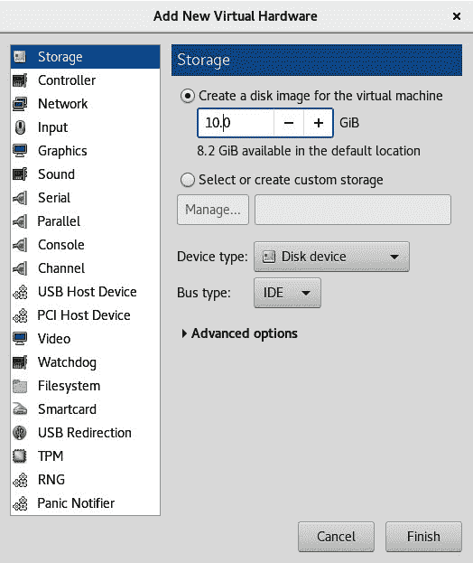

    图 5.27-在 virt-manager 中添加虚拟磁盘

4.  If you want to attach the previously created `dbvm_disk2.img` image, choose **Select** or create custom storage, click on **Manage**, and either browse and point to the `dbvm_disk2.img` file from the `/vms` directory or find it in the local storage pool, then select it and click **Finish**.

    重要提示：

    在这里，我们使用了磁盘映像，但您可以自由使用主机系统上存在的任何存储设备，例如 LUN、整个物理磁盘(`/dev/sdb`)或磁盘分区(`/dev/sdb1`)或 LVM 逻辑卷。 我们可以使用之前配置的任何存储池将此映像存储为文件或对象，或者直接存储到数据块设备。

5.  单击**Finish**按钮将选择的磁盘映像(文件)作为第二个磁盘附加到使用默认配置的虚拟机。 使用`virsh`命令可以快速执行相同的操作。

使用 virt-manager 创建虚拟磁盘非常简单-只需点击几下鼠标和一些输入即可。 现在，让我们看看如何通过命令行-即通过使用`virsh`-来实现这一点。

## 使用 virsh 连接磁盘

`virsh`是一个非常强大的命令行替代工具，可以替代 virt-manager。 您可以通过一个图形界面(如 virt-manager)在一秒钟内执行一个需要几分钟才能执行的操作。 它提供了一个`attach-disk`选项来将新的磁盘设备连接到虚拟机。 `attach-disk`提供了许多开关：

```sh
attach-disk domain source target [[[--live] [--config] | [--current]] | [--persistent]] [--targetbusbus] [--driver driver] [--subdriversubdriver] [--iothreadiothread] [--cache cache] [--type type] [--mode mode] [--sourcetypesourcetype] [--serial serial] [--wwnwwn] [--rawio] [--address address] [--multifunction] [--print-xml]
```

然而，在正常情况下，以下条件足以执行热添加磁盘连接到虚拟机：

```sh
# virsh attach-disk CentOS8 /vms/dbvm_disk2.img vdb --live --config
```

这里，`CentOS8`是执行磁盘附加的虚拟机。 然后是磁盘映像的路径。 `vdb`是在访客操作系统内可见的目标磁盘名称。 `--live`表示在虚拟机运行时执行该操作，`--config`表示在重启后永久附加该操作。 NOT添加`--config`开关将使磁盘保持连接，直到重新启动。

重要提示：

热插拔支持：应该在 Linux 访客操作系统中加载`acpiphp`内核模块，以便识别热添加的磁盘；`acpiphp`提供传统热插拔支持，而`pciehp`提供本机热插拔支持。 `pciehp`取决于`acpiphp`。 加载`acpiphp`将自动加载`pciehp`作为依赖项。

您可以使用`virsh domblklist <vm_name>`命令快速确定一个虚拟机连接了多少个 vDisk。 下面是一个例子：

```sh
# virsh domblklist CentOS8 --details
Type Device Target Source
------------------------------------------------
file disk vda /var/lib/libviimg/fedora21.qcow2
file disk vdb /vms/dbvm_disk2_seek.img
```

这清楚地表明，连接到虚拟机的两个 vDisk 都是文件镜像。 它们对访客操作系统分别显示为`vda`和`vdb`，并且位于主机系统上磁盘映像路径的最后一列。

接下来，我们将了解如何创建 ISO 库。

## 创建 ISO 映像库

虽然虚拟机上的访客操作系统可以通过执行主机的 CD/DVD 驱动器到虚拟机的传递从物理介质安装，但这不是最有效的方法。 与从硬盘读取 ISO 相比，从 DVD 驱动器读取较慢，因此更好的方法是将用于安装虚拟机操作系统和应用的 ISO 文件(或逻辑 CD)存储在基于文件的存储池中，并创建 ISO 映像库。

要创建 ISO 映像库，可以使用 virt-manager 或`virsh`命令。 让我们看看如何使用`virsh`命令创建 ISO 映像库：

1.  首先，在主机系统上创建一个目录来存储`.iso`镜像：

    ```sh
    # mkdir /iso
    ```

2.  设置正确的权限。 它应该属于权限设置为`700`的 root 用户。 如果 SELinux 处于强制模式，则需要设置以下上下文：

    ```sh
    # chmod 700 /iso
    # semanage fcontext -a -t virt_image_t "/iso(/.*)?"
    ```

3.  Define the ISO image library using the `virsh` command, as shown in the following code block:

    ```sh
    # virsh pool-define-as iso_library dir - - - - "/iso"
    # virsh pool-build iso_library
    # virsh pool-start iso_library
    ```

    在前面的示例中，我们使用名称`iso_library`来演示如何创建包含 ISO 映像的存储池，但您可以随意使用任何名称。

4.  验证池(ISO 映像库)是否已创建：

    ```sh
    # virsh pool-info iso_library
    Name: iso_library
    UUID: 959309c8-846d-41dd-80db-7a6e204f320e
    State: running
    Persistent: yes
    Autostart: no
    Capacity: 49.09 GiB
    Allocation: 8.45 GiB
    Available: 40.64 GiB
    ```

5.  现在，您可以将`.iso`图像复制或移动到`/iso_lib`目录。
6.  将`.iso`文件复制到`/iso_lib`目录后，刷新池，然后检查其内容：

    ```sh
    # virsh pool-refresh iso_library
    Pool iso_library refreshed
    # virsh vol-list iso_library
    Name Path
    ------------------------------------------------------------------
    ------------
    CentOS8-Everything.iso /iso/CentOS8-Everything.iso
    CentOS7-EVerything.iso /iso/CentOS7-Everything.iso
    RHEL8.iso /iso/RHEL8.iso
    Win8.iso /iso/Win8.iso
    ```

7.  这将列出目录中存储的所有 ISO 映像及其路径。 这些 ISO 映像现在可以直接与虚拟机一起用于访客操作系统安装、软件安装或升级。

创建 ISO 映像库是当今企业事实上的规范。 最好有一个集中存放所有 ISO 镜像的地方，如果您需要跨不同位置进行同步，这样可以更容易地实现某种同步方法(例如，`rsync`)。

## 删除存储池

删除存储池相当容易。 请注意，删除存储域不会删除任何文件/数据块设备。 它只是将存储与 virt-manager 断开。 必须手动删除文件/数据块设备。

我们可以通过 virt-manager 或使用`virsh`命令删除存储池。 让我们首先看看如何通过 virt-manager 来实现：


图 5.28-删除池

首先，选择红色停止按钮以停止池，然后单击带有**X**的红色圆圈以删除池。

如果你想使用`virsh`，那就更简单了。 假设我们想要删除前一个屏幕截图中名为`MyNFSpool`的存储池。 只需键入以下命令：

```sh
virsh pool-destroy MyNFSpool
virsh pool-undefine MyNFSpool
```

创建存储池后的下一个逻辑步骤是创建存储卷。 从逻辑角度来看，存储卷将存储池分割为更小的部分。 现在让我们来学习如何做到这一点。

## 创建存储卷

存储卷创建于存储池之上，并作为虚拟磁盘连接到虚拟机。 要创建存储卷，请启动存储管理控制台，导航到 virt-manager，然后单击**编辑**|**连接详细信息**|**存储**并选择要在其中创建新卷的存储池。 单击创建新卷按钮(**+**)：


图 5.29-为虚拟机创建存储卷

接下来，提供新卷的名称，为其选择磁盘分配格式，然后单击**Finish**按钮以构建该卷，并准备将其附加到虚拟机。 您可以使用常用的 virt-manager 或`virsh`命令附加它。 Libvirt 支持几种磁盘格式(`raw`、`cow`、`qcow`、`qcow2`、`qed`和`vmdk`)。 使用适合您环境的磁盘格式，并在`Max Capacity`和`Allocation`字段中设置适当的大小，以决定是使用预分配的磁盘分配，还是使用精简配置。 如果您在**最大容量**和**分配**中保持相同的磁盘大小，它将被预分配，而不是精简配置。 请注意，`qcow2`格式不支持厚盘分配方法。

在[*第 8 章*](08.html#_idTextAnchor143)，*创建和修改 VM 磁盘、模板和快照*中，详细说明了所有磁盘格式。 现在，只需了解`qcow2`是专门为 KVM 虚拟化设计的磁盘格式。 它支持创建内部快照所需的高级功能。

## 使用 virsh 命令创建卷

使用`virsh`命令创建卷的语法如下：

```sh
# virsh vol-create-as dedicated_storage vm_vol1 10G
```

其中，`dedicated_storage`是存储池，`vm_vol1`是卷名，10 GB 是大小：

```sh
# virsh vol-info --pool dedicated_storage vm_vol1
Name: vm_vol1
Type: file
Capacity: 1.00 GiB
Allocation: 1.00 GiB
```

创建存储卷的`virsh`命令和参数几乎是相同的，无论它是在哪种类型的存储池上创建的。 只需为`--pool`开关输入相应的输入即可。 现在，让我们看看如何使用`virsh`命令删除卷。

## 使用 virsh 命令删除卷

使用`virsh`命令删除卷的语法为，如下所示：

```sh
# virsh vol-delete dedicated_storage vm_vol2
```

执行此命令将从`dedicated_storage`存储池中删除`vm_vol2`卷。

我们存储之旅的下一步是展望未来，因为我们在本章中提到的所有概念多年来都是众所周知的，有些甚至已经有几十年了。 存储世界正在发生变化，并朝着新的有趣的方向发展，所以接下来让我们来讨论一下这一点。

# 存储领域的最新发展-NVMe 和 NVMeOF

在过去 20 年左右的时间里，到为止，存储界在技术方面最大的颠覆是推出了**固态硬盘**(**固态硬盘**)。 现在，我们知道很多人已经习惯了在他们的电脑上安装它们--笔记本电脑、工作站，无论我们使用哪种类型的设备。 但同样，我们讨论的是虚拟化存储以及整个企业存储概念，这意味着我们常规的 SATA 固态硬盘无法入围。 尽管很多人在托管 ZFS 池(用于缓存)的中端存储设备和/或手工存储设备中使用它们，但其中一些概念在最新一代的存储设备中有其自身的生命力。 这些设备正在从根本上改变技术的工作方式，并在使用哪些协议、协议的速度有多快、延迟降低了多少以及如何实现存储分层方面重塑了现代 IT 历史的一部分-分层是一个根据功能(通常是速度)区分不同存储设备或其存储池的概念。

让我们以存储世界的发展方向为例，简要解释一下我们在这里讨论的内容。 除此之外，存储领域还在乘着虚拟化、云和 HPC 领域的风口浪尖前行，因此这些概念并不奇怪。 它们已经存在于你今天可以买到的现成的存储设备中。

固态硬盘的引入极大地改变了我们访问存储设备的方式。 这一切都与性能和延迟有关，而像**高级主机控制器接口**(**AHCI**)这样的旧概念(我们现在市场上的许多 SSD 仍在积极使用)，并不足以处理 SSD 所具有的性能。(**Advanced Host Controller Interface**(**AHCI**)，我们今天仍在市场上的许多 SSD 上积极使用这些概念)。 AHCI 是普通硬盘(机械磁盘或普通磁盘轴)通过软件与 SATA 设备通信的标准方式。 然而，其中的关键部分是*硬盘*，这意味着柱面、磁头扇区-SSD 没有的东西，因为它们不旋转，也不需要这种范例。 这意味着必须创建另一个标准，这样我们才能以更本地的方式使用固态硬盘。 这就是**Non-Volatile Memory Express**(**NVMe**)要做的事情--在不使用从 SATA 到 AHCI 再到 PCI Express 的转换的情况下，弥合固态硬盘的能力和实际能力之间的差距(以此类推)，这就是**Non-Volatile Memory Express**(**NVMe**)的全部目的。

固态硬盘的快速发展和 NVMe 的集成使企业存储的巨大进步成为可能。 这意味着必须发明新的控制器、新的软件和全新的架构来支持这种范式转变。 随着越来越多的存储设备将 NVMe 集成到各种目的(主要用于缓存，然后也用于存储容量)，显然还有其他问题需要解决。 第一个是我们连接存储设备的方式，这些存储设备可以为我们的虚拟化、云或 HPC 环境提供如此巨大的容量。

在过去 10 年左右的时间里，许多人认为 FC 将从市场上消失，许多公司对不同的标准进行了对冲-iSCSI、iSCSI over RDMA、NFS over RDMA 等等。 这背后的理由似乎足够确凿：

*   FC 非常昂贵-它需要单独的物理交换机、单独的布线和单独的控制器，所有这些都需要大量资金。
*   这涉及许可-例如，当您购买具有 40 个 FC 端口的 Brocade 交换机时，这并不意味着您可以开箱即用，因为有许可证可以获得更多端口(8 端口、16 端口等等)。
*   FC 存储设备价格昂贵，通常需要更昂贵的磁盘(带 FC 连接器)。
*   配置 FC 需要广博的知识和/或培训，因为在不了解概念和交换机供应商提供的 CLI 的情况下，您不能简单地为企业级公司配置 FC 交换机堆栈，此外，您还不知道该企业的需求是什么。
*   FC 作为一种协议，其加速开发以达到新速度的能力一直很差。 简而言之，在 FC 从 8 Gbit/s 发展到 32 Gbit/s 的过程中，以太网从 1 Gbit/s 发展到了 25、40、50 和 100 Gbit/s 的带宽。 已经有关于 400Gbit/s 以太网的讨论，也有首批支持该标准的设备。 这通常会让客户感到担忧，因为更高的数字意味着更好的吞吐量，至少在大多数人的心目中是这样。

但现在市场上正在发生的事情*告诉我们一个完全不同的故事--不仅是 FC 回来了，而且它带着使命回来了。 企业存储公司已经接受了这一点，并开始推出*级*级的存储设备(作为第一阶段，在 NVMe 固态硬盘的帮助下)。 这种性能需要转移到我们的虚拟化、云和 HPC 环境中，这就需要在最低延迟、设计以及质量和可靠性方面尽可能好的协议，而 FC 具备所有这些条件。*

 *这导致了第二阶段，在这个阶段，NVMe 固态硬盘不仅被用作缓存设备，而且还被用作容量设备。

请注意，现在，存储内存/存储互连市场上正在酝酿一场大战。 有多种不同的标准试图与英特尔的英特尔**快速路径互连**(**QPI**)竞争，这是一项在英特尔 CPU 中使用了十多年的技术。 如果这是一个您感兴趣的主题，在本章末尾的*进一步阅读*部分有一个链接，您可以在那里找到更多信息。 从本质上讲，QPI 是一种低延迟、高带宽的点对点互连技术，是当今服务器的核心。 具体地说，它处理 CPU、CPU 和内存、CPU 和芯片组之间的通信，等等。 这是英特尔在摆脱**前端总线**(**FSB**)和集成芯片组的内存控制器后开发的一项技术。 FSB 是在内存和 I/O 请求之间共享的总线。 这种方法有更高的延迟，没有很好的伸缩性，带宽更低，并且在内存和 I/O 端发生大量 I/O 的情况下会出现问题。 在切换到内存控制器是 CPU 的一部分(因此，内存直接连接到 CPU)的体系结构之后，英特尔最终必须转向这种概念。

如果您更熟悉 AMD CPU，那么 QPI 之于 Intel 就像内置内存控制器的 CPU 上的 HyperTransport 总线之于 AMD CPU。

随着 NVMe 固态硬盘变得更快，PCI Express 标准也需要更新，这就是为什么人们如此期待最新版本(PCIe 4.0-最近开始发货的第一批产品)的原因。 但现在，焦点已经转移到另外两个需要解决的问题上，存储系统才能正常工作。 让我们简要描述一下它们：

*   第一个问题很简单。 对于普通计算机用户，在 99%或更多的情况下，一个或两个 NVMe 固态硬盘就足够了。 实际上，普通计算机用户需要更快的 PCIe 总线的唯一真正原因是为了更快的显卡。 但对于存储设备制造商来说，这是完全不同的。 他们希望生产在单个存储系统中拥有 20 个、30 个、50 个、100 个、500 个 NVMe 固态硬盘的企业级存储设备-他们现在就想要，因为固态硬盘作为一种技术已经成熟，并且可以广泛使用。
*   第二个问题更为复杂。 雪上加霜的是，最新一代的固态硬盘(例如，基于英特尔 Optane 的固态硬盘)可以提供更低的延迟和更高的吞吐量。 随着技术的发展，这种情况只会变得更糟*(甚至更低的延迟，更高的吞吐量)。 对于当今的服务--虚拟化、云和 HPC--存储系统必须能够处理我们能处理的任何负载。 只有在互连能够处理存储设备(QPI、FC 等)的情况下，这些技术才能真正改变游戏规则，因为存储设备可以变得更快。 其中两个源自英特尔 Optane 的概念-**存储类内存**(**SCM**)和**永久内存**(**PM**)是存储公司和客户希望在其存储系统中采用的最新技术，而且速度更快。*
**   第三个问题是如何将所有带宽和 I/O 功能传输到使用它们的服务器和基础设施。 这就是创建**NVMe over Fabric**(**NVMe-of**)概念的原因，目的是尝试在存储基础架构堆栈上工作，使 NVMe 对其消费者来说更高效、更快。*

 *如果你从概念的角度来看这些进步，几十年来很明显，类似 RAM 的存储器是我们在过去几十年中拥有的最快、延迟最低的技术。 我们将工作负载尽可能多地转移到 RAM 也是合乎逻辑的。 请考虑内存中的数据库(如 Microsoft SQL、SAP HANA 和 Oracle)。 他们已经在这个街区转悠了好几年了。

这些技术从根本上改变了我们对存储的看法。 基本上，我们不再讨论基于技术的存储分层(SSD 与 SAS 或 SATA)，也不再讨论完全的速度，因为速度是毋庸置疑的。 最新的存储技术讨论了*延迟*方面的存储分层。 原因非常简单-假设您是一家存储公司，并且您构建了一个使用 50 个 SCM 固态硬盘来存储容量的存储系统。 对于高速缓存，唯一合理的技术是 RAM，几百千兆字节。 在这样的设备上使用存储分层的唯一方法是，基本上通过*在软件中模拟*存储分层，通过创建额外的技术来产生类似分层的服务，这些服务基于排队、处理缓存中的优先级(RAM)以及类似的概念。 为什么？ 因为如果您使用相同的 SCM 固态硬盘作为容量，并且它们提供相同的速度和 I/O，那么您就没有一种基于技术或功能的分层方式。

让我们使用可用的存储系统来进一步说明这一点。 最能说明我们观点的设备是 Dell/EMC 的 PowerMax 系列存储设备。 如果您加载 NVMe 和 SCM 固态硬盘，最大的型号(8000)可以扩展到 1500 万 IOPS(！)、350 GB/s 的吞吐量(延迟低于 100 微秒)和高达 4 PB 的容量。 想一想这些数字。 然后添加另一个数字-在前端，它最多可以有 256 个 FC/FICON/iSCSI 端口。 就在最近，Dell/EMC 为其发布了新的 32 Gbit/s FC 模块。 较小的 PowerMax 型号(2000)可以处理 750 万 IOPS，延迟小于 100 微秒，并可扩展到 1 PB。 它还可以执行所有*常见的 EMC 功能*-复制、压缩、重复数据删除、快照、NAS 功能等等。 因此，这不仅仅是市场营销的话题；这些设备已经面世，正在被企业客户使用：


图 3.30-PowerMax 2000-它看起来很小，但却很有力

这些都是未来非常重要的概念，因为越来越多的制造商生产类似的设备(而且他们正在进行中)。 我们完全期待基于 KVM 的世界在大规模环境中接受这些概念，特别是对于使用 OpenStack 和 OpenShift 的基础架构。

# 摘要

在本章中，我们介绍并配置了 libvirt 的各种开源存储概念。 我们还讨论了行业标准方法，如 iSCSI 和 NFS，因为它们通常用于不基于 KVM 的基础架构。 例如，我们在本章涵盖的主题列表中，基于 VMware vSphere 的环境可以使用 FC、iSCSI 和 NFS，而基于 Microsoft 的环境只能使用 FC 和 iSCSI。

下一章将介绍与虚拟显示设备和协议相关的主题。 我们将深入介绍 VNC 和 SPICE 协议。 我们还将介绍用于虚拟机连接的其他协议。 所有这些都将帮助我们理解使用虚拟机所需的全部基础知识，我们在过去的三章中介绍了这些基础知识。

# 问题

1.  什么是存储池？
2.  NFS 存储如何与 libvirt 配合使用？
3.  ISCSI 如何与 libvirt 配合使用？
4.  我们如何在存储连接上实现冗余？
5.  除了 NFS 和 iSCSI 之外，我们还可以将什么用于虚拟机存储？
6.  通过 libvirt，我们可以将哪个存储后端用于基于对象的存储？
7.  我们如何创建与 KVM 虚拟机一起使用的虚拟磁盘映像？
8.  使用 NVMe 固态硬盘和 SCM 设备如何改变我们创建存储层的方式？
9.  为虚拟化、云和 HPC 环境提供第 0 层存储服务的基本问题是什么？

# 进一步阅读

有关本章内容的更多信息，请参阅以下链接：

*   RHEL8 文件系统和存储的新特性：[https://www.redhat.com/en/blog/whats-new-rhel-8-file-systems-and-storage](https://www.redhat.com/en/blog/whats-new-rhel-8-file-systems-and-storage)
*   O 虚拟存储：[https://www.ovirt.org/documentation/administration_guide/#chap-Storage](https://www.ovirt.org/documentation/administration_guide/#chap-Storage)
*   RHEL 7 存储管理指南：[https://access.redhat.com/documentation/en-us/red_hat_enterprise_linux/7/html/storage_administration_guide/index](https://access.redhat.com/documentation/en-us/red_hat_enterprise_linux/7/html/storage_administration_guide/index)
*   RHEL 8 管理存储设备：[https://access.redhat.com/documentation/en-us/red_hat_enterprise_linux/8/html/managing_storage_devices/index](https://access.redhat.com/documentation/en-us/red_hat_enterprise_linux/8/html/managing_storage_devices/index)
*   OpenFabrics CCIX、Gen-Z、OpenCAPI(概述和比较)：[https://www.openfabrics.oimg/eventpresos/2017presentations/213_CCIXGen-Z_BBenton.pdf](https://www.openfabrics.oimg/eventpresos/2017presentations/213_CCIXGen-Z_BBenton.pdf)****