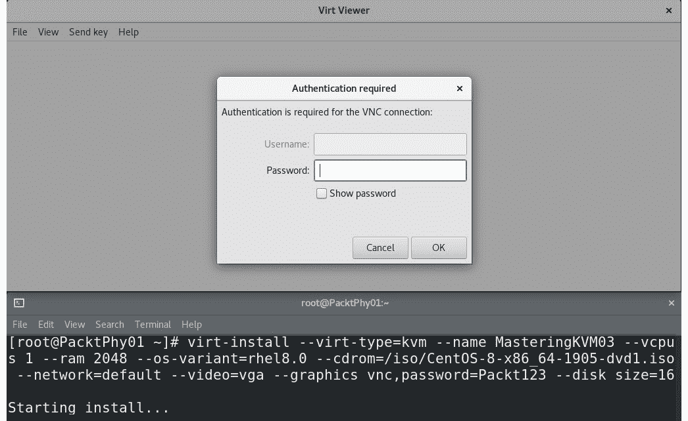
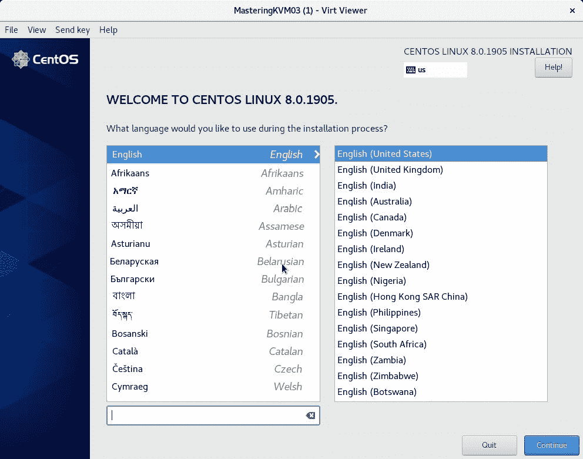
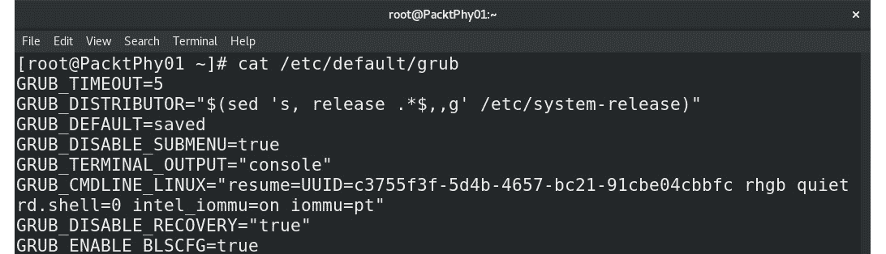
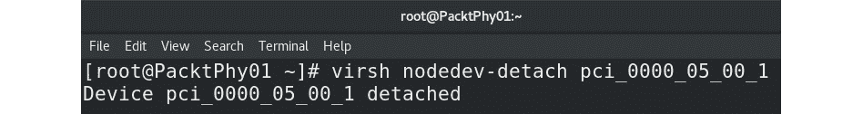
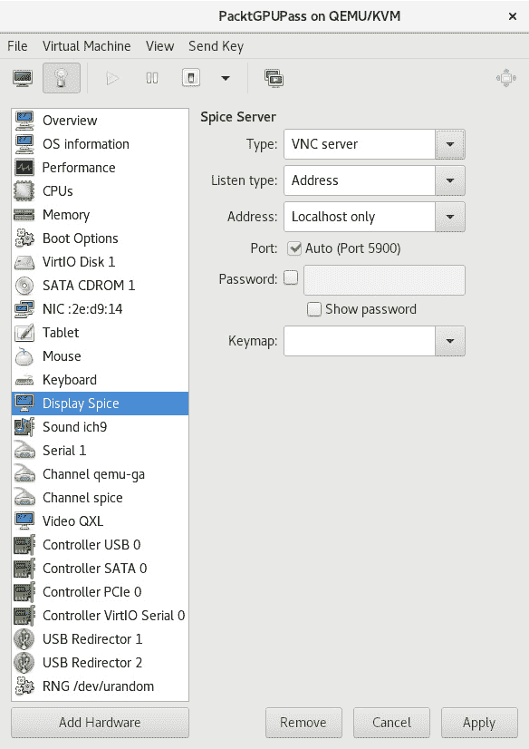
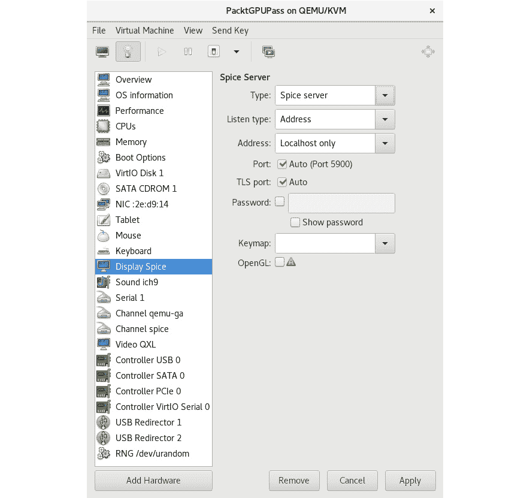
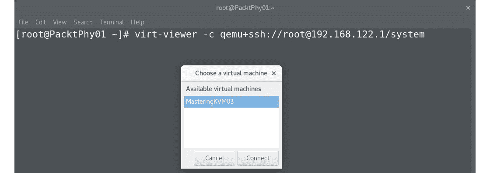
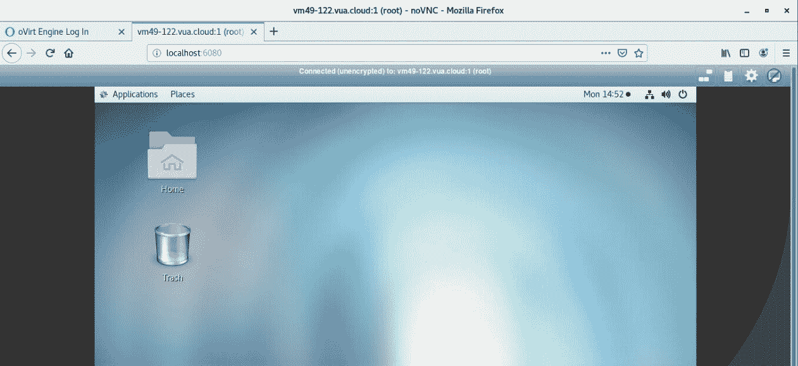
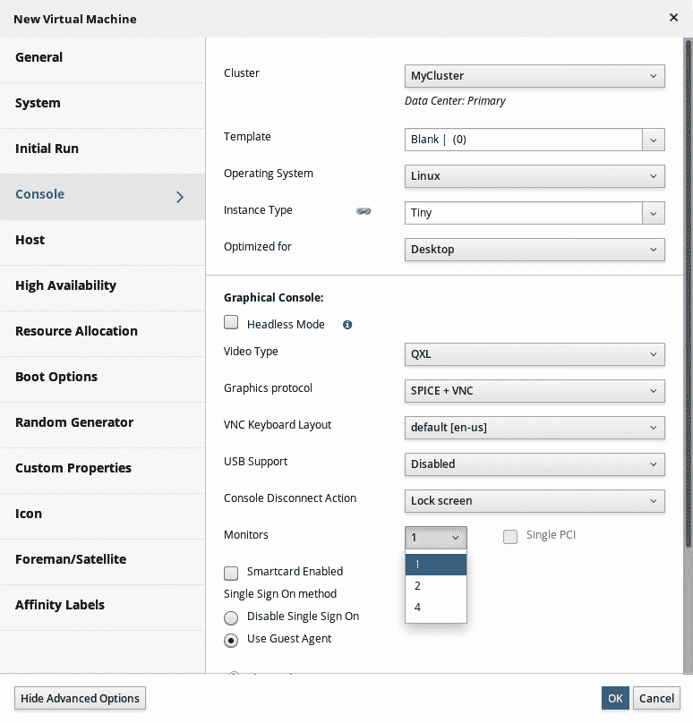

# *第 6 章*：虚拟显示设备和协议

在本章中，我们将讨论使用虚拟显卡和协议访问虚拟机的方式。 我们可以在虚拟机中使用几乎 10 个可用的虚拟显示适配器，并且可以使用多种可用的协议和应用程序来访问我们的虚拟机。 如果我们暂时忘记了 SSH 和任何一种基于控制台的访问，那么市场上有各种协议可以用来访问我们虚拟机的控制台，例如 VNC、SPICE 和 noVNC。

在基于 Microsoft 的环境中，我们倾向于使用**远程桌面协议**(**RDP**)。 如果我们谈论的是**虚拟桌面基础架构**(**VDI**)，那么还有更多的协议可用-**PC over IP**(**PCoIP**)、VMware BLAST 等。 其中一些技术提供额外的功能，例如更大的颜色深度、加密、音频和文件系统重定向、打印机重定向、带宽管理以及 USB 和其他端口重定向。 这些都是在当今基于云的世界中实现远程桌面体验的关键技术。

所有这些都意味着我们必须花更多的时间和精力来了解各种显示设备和协议，以及如何配置和使用它们。 我们不希望出现因为选择了错误的虚拟显示设备而看不到虚拟机显示的情况，或者我们试图打开控制台查看虚拟机内容但控制台没有打开的情况。

在本章中，我们将介绍以下主题：

*   使用虚拟机显示设备
*   讨论远程显示协议
*   使用 VNC 显示协议
*   使用 SPICE 显示协议
*   通过 NoVNC 获得显示器便携性
*   我们开始吧!

# USIng 虚拟机显示设备

要使图形在虚拟机上工作，QEMU 需要为其虚拟机提供两个组件：虚拟图形适配器和从客户端访问图形的方法或协议。 让我们从虚拟图形适配器开始讨论这两个概念。 最新版本的 QEMU 有八种不同类型的虚拟/仿真图形适配器。 所有这些都有一些相似之处和不同之处，所有这些都可以在支持的功能和/或分辨率或其他更多技术细节方面有所不同。 因此，让我们对它们进行描述，看看我们将偏爱哪些特定虚拟显卡的使用情形：

*   **TCX**：可用于旧 SUN 操作系统的 SUN TCX 虚拟图形卡。
*   **Cirrus**：基于旧 Cirrus Logic GD5446 VGA 芯片的虚拟显卡。 它可以与 Windows 95 之后的任何来宾操作系统一起使用。
*   **std**：标准的VGA 卡，可用于 Windows XP 之后的来宾操作系统的高分辨率模式。
*   **VMware**：VMware 的SVGA 图形适配器，在 Linux 来宾操作系统和用于 Windows 操作系统的 VMware 工具安装中需要额外的驱动程序。
*   **QXL**：我们在使用 SPICE 远程显示协议时需要使用的事实上的标准半虚拟图形卡，我们将在本章稍后详细介绍。 这款虚拟显卡还有一个较旧的版本，名为 QXL VGA，它缺少一些更高级的功能，同时提供了更低的开销(它使用的内存更少)。
*   **Virtio**：一个基于 virgl 项目的准虚拟3D 虚拟图形卡，它为 QEMU 客户操作系统提供 3D 加速。 它有两种不同的类型(VGA 和 GPU)。 Virtio-vga 通常用于需要多显示器支持和 OpenGL 硬件加速的场合。 Virtio-GPU 版本没有内置的标准 VGA 兼容模式。
*   **CG3**：一种虚拟显卡，我们可以在较旧的基于 SPARC 的来宾操作系统上使用。
*   **无**：在来宾操作系统中禁用图形卡。

配置虚拟机时，您可以在启动或创建虚拟机时选择这些选项。 在 CentOS 8 中，分配给新创建的虚拟机的默认虚拟图形卡是**QXL**，如下面的新虚拟机配置截图所示：


图 6.1-来宾操作系统的默认虚拟显卡-QXL

此外，默认情况下，我们可以为任何给定的虚拟机选择以下三种类型的虚拟图形卡，因为这些虚拟图形卡通常是为我们预先安装在任何为虚拟化配置的 Linux 服务器上的：

*   QXL
*   视频图形阵列
*   维蒂奥

由于各种原因，在 KVM 虚拟化中运行的一些新操作系统不应该使用较旧的图形卡适配器。 例如，从 Red Hat Enterprise Linux/CentOS 7 开始，就有人建议不要在 Windows 10 和 Windows Server 2016 上使用 CIRRUS 虚拟显卡。 出现这种情况的原因与虚拟机的不稳定有关，也与以下事实有关-例如，您不能将全高清分辨率的显示器与 CIRRUS 虚拟显卡一起使用。 如果您开始安装这些客户操作系统，请确保您使用的是 QXL 显卡，因为它提供最佳的性能和与 SPICE 远程显示协议的兼容性。

理论上，您仍然可以在一些*真的*老客户操作系统(更早的 Windows NT，如 4.0 和更老的客户客户操作系统，如 Windows XP)上使用 CIRRUS 虚拟图形卡，但仅此而已。 对于其他一切，最好是使用 STD 或 QXL 驱动程序，因为它们提供了最佳的性能和加速支持。 此外，这些虚拟显卡还提供更高的显示分辨率。

还有一些其他虚拟图形卡可用于 QEMU，例如用于各种**片上系统**(**SoC**)设备、ati VGA、Bochs 等的嵌入式驱动程序。 其中一些经常被使用，比如 SoC-只要记住世界上所有的覆盆子 PI 和 BBC Micro：BITS 就知道了。 这些新的虚拟图形选项通过**物联网**(**IoT**)进一步扩展。 因此，我们有很多充分的理由应该密切关注这个市场领域正在发生的事情。

让我们通过一个例子来说明这一点。 假设我们想要创建一个新的虚拟机，该虚拟机将根据我们访问其虚拟显示的方式为其分配一组自定义参数。 如果您还记得在[*第 3 章*](03.html#_idTextAnchor049)，*安装 KVM Hypervisor、libvirt 和 ovirt*中，我们讨论了各种 libvirt 管理命令(`virsh`、`virt-install`)，我们还使用`virt-install`和一些自定义参数创建了一些虚拟机。 让我们对这些进行补充，并使用一个类似的示例：

```sh
virt-install --virt-type=kvm --name MasteringKVM01 --vcpus 2  --ram 4096 --os-variant=rhel8.0 --/iso/CentOS-8-x86_64-1905-dvd1.iso --network=default --video=vga --graphics vnc,password=Packt123 --disk size=16
```

下面是将要发生的事情：



图 6.2-创建了带有 VGA 虚拟显卡的 KVM 虚拟机。 在这里，VNC 要求指定密码

在我们输入密码(`Packt123`，在 virt-install 配置选项中指定)之后，我们将面对这个屏幕：



图 6.3-VGA 显示适配器及其低默认(640x480)初始分辨率-这是我们所有 80 年代长大的人都熟悉的分辨率

话虽如此，我们只是使用作为如何向`virt-install`命令添加高级选项的示例-具体地说，就是如何安装具有特定虚拟显卡的虚拟机。

还有其他更高级的概念，使用我们安装在计算机或服务器上的真实显卡将其*功能*直接转发给虚拟机。 正如我们前面提到的，这对于 VDI 等概念非常重要。 让我们花点时间讨论这些概念，并使用一些真实的示例和比较来更大范围地了解 VDI 解决方案的复杂性。

## VDI 场景中的物理和虚拟显卡

正如我们在[*第 1 章*](01.html#_idTextAnchor016)，*了解 Linux 虚拟化*中讨论的，VDI 是一个概念，它使用客户端操作系统的虚拟化范例。 这意味着最终用户可以通过运行为其保留*或*池化*的客户端操作系统(例如，Windows 8.1、Windows 10 或 Linux Mint)将*直接连接到他们的虚拟机，这意味着多个用户可以访问相同的虚拟机并通过附加的 VDI 功能访问他们的*数据*。**

 *现在，如果我们谈论的是大多数商务用户，他们只需要一台我们戏称为*打字机*的东西。 该使用模型涉及用户使用客户端 OS 来读写文档、电子邮件和浏览互联网的场景。 对于这些使用情形，如果我们要使用任何基于供应商的解决方案(VMware 的 Horizon、Citrix Xen Desktop 或 Microsoft 的基于远程桌面服务的 VDI 解决方案)，我们都可以使用其中的任何一种解决方案。

然而，有一个很大的*但是*。 如果场景包括数百名需要访问 2D 和/或 3D 视频加速的用户，会发生什么情况？ 如果我们为一家创建设计(建筑、管道、石油和天然气以及视频制作)的公司设计 VDI 解决方案，会发生什么情况？ 运行基于 CPU 和基于软件的虚拟显卡卡的 VDI 解决方案将一事无成，尤其是在规模上。 这是Xen Desktop 和 Horizon功能更丰富的地方，如果我们在谈论技术水平的话。 老实说，基于 KVM 的方法在显示选项方面并不落后，只是它们落后于其他一些企业级特性，我们将在后面的章节中讨论这些特性，例如[*第 12 章*](12.html#_idTextAnchor209)、*使用 OpenStack 横向扩展 KVM*。

基本上，我们可以使用三个概念来获得虚拟机的显卡性能：

*   我们可以使用基于 CPU 的软件渲染器。
*   我们可以为特定的虚拟机预留一个 GPU(PCI 直通)。
*   我们可以对 GPU 进行*分区*，这样我们就可以在多个虚拟机中使用它。

仅以VMware Horizon 解决方案作为的比喻，这些解决方案将称为 CPU 渲染、**虚拟直接图形加速**(**vDGA**)和**虚拟共享图形加速**(**vSGA**)。 或者，在 Citrix，我们谈论的是 HDX 3D Pro。 在 CentOS8 中，我们谈论的是共享显卡场景中的*中介设备*。

如果我们谈论的是 PCI Passthrough，它绝对可以提供最佳的性能，因为您可以使用 PCI-Express 显卡，将其直接转发到虚拟机，在来宾操作系统中安装本地驱动程序，并完全拥有完整的显卡。 但这带来了四个问题：

*   您只能将该 PCI-Express 图形卡转发到*台*台虚拟机。
*   例如，由于服务器在可升级性方面可能受到限制，您不能在一台物理服务器上运行 50 台这样的虚拟机，因为您无法在一台服务器上安装 50 块显卡(物理上或 PCI-Express 插槽方面)，在典型的 2U 机架式服务器中通常最多可容纳 6 块显卡。
*   如果您使用刀片式服务器(例如，HP c7000)，情况会更糟，因为如果您打算使用额外的显卡，则每个刀片式服务器机箱的服务器密度将减少一半，因为这些显卡只能安装在双高刀片式服务器上。
*   您将花费大量资金将任何类型的解决方案扩展到数百个个个虚拟桌面，或者更糟糕的是数千个个虚拟桌面。

如果我们讨论的是对物理显卡进行分区以便可以在多个虚拟机中使用的共享方法，则会产生另一组问题：

*   您在使用哪种显卡方面受到更多限制，因为支持这种使用模式的显卡大约有 20 块(其中一些包括 NVIDIA GRID、Quadro、Tesla 卡，以及几块 AMD 和 Intel 卡)。
*   如果您与 4 台、8 台、16 台或 32 台虚拟机共享同一显卡，您必须意识到这样一个事实，即您将与多台虚拟机共享同一个 GPU，从而降低性能。
*   与 DirectX、OpenGL、CUDA 和视频编码卸载的兼容性不会像您预期的那样好，您可能会被迫使用这些标准的旧版本。
*   根据供应商和解决方案的不同，可能需要额外的许可。

我们列表中的下一个主题是如何以更高级的方式使用 GPU-通过使用 GPU 分区概念向多个虚拟机提供 GPU 的各个部分。 让我们以NVIDIAGPU为例来解释是如何工作和配置的。

以 NVIDIA vGPU 为例进行 GPU 分区

让我们使用一个示例来了解如何使用场景，在该场景中，我们将 GPU(NVIDIA VGPU)与基于 KVM 的虚拟机进行分区。 此过程与我们在[*第 4 章*](04.html#_idTextAnchor062)，*Libvirt Networking*中讨论的 SR-IOV 过程非常相似，在该过程中，我们使用支持的英特尔网卡向 CentOS 主机呈现虚拟功能，然后将其作为 KVM 虚拟网桥的上行链路呈现给我们的虚拟机。

首先，我们需要检查我们使用的是哪种显卡，并且必须是支持的显卡(在我们的例子中，我们使用的是特斯拉 P4)。 让我们使用`lshw`命令检查我们的显示设备，它应该类似于以下内容：

```sh
# yum -y install lshw
# lshw -C display
*-display
       description: 3D controller
       product: GP104GL [Tesla P4]
       vendor: NVIDIA Corporation
       physical id: 0
       bus info: pci@0000:01:00.0
       version: a0
       width: 64 bits
       clock: 33MHz
       capabilities: pm msi pciexpress cap_list
       configuration: driver=vfio-pci latency=0
       resources: irq:15 memory:f6000000-f6ffffff memory:e0000000-efffffff memory:f0000000-f1ffffff
```

此命令的输出告诉我们，我们有一个支持 3D 的 GPU-具体地说，就是基于 NVIDIA GP104GL 的产品。 它告诉我们该设备已经在使用`vfio-pci`驱动程序。 此驱动程序是**虚拟化函数**(**VF**)的本机 SR-IOV 驱动程序。 这些功能是 SR-IOV 功能的核心。 我们将使用这款支持 SR-IOV 的 GPU 来描述这一点。

我们需要做的第一件事--我们所有的 NVIDIA GPU 用户多年来一直在做的--是将新驱动程序列入黑名单，这会阻碍。 如果我们打算永久使用 GPU 分区，我们需要永久地这样做，这样服务器启动时才不会加载它。 但请注意-这有时可能会导致意外行为，例如服务器启动，并且没有任何真正的原因不显示任何输出。 因此，我们需要为`modprobe`创建一个将 nouveau 驱动程序列入黑名单的配置文件。 让我们在`/etc/modprobe.d`目录中创建一个名为`nouveauoff.conf`的文件，内容如下：

```sh
blacklist nouveau
options nouveau modeset 0
```

然后，我们需要强制服务器重新创建在服务器启动时加载的`initrd`映像，并重新引导服务器以使更改生效。 我们将使用`dracut`命令执行此操作，后跟一个常规的`reboot`命令：

```sh
# dracut –-regenerate-all –force
# systemctl reboot
```

重新启动后，让我们检查 NVIDIA 显卡的`vfio`驱动程序是否已加载，如果已加载，请检查 vGPU 管理器服务：

```sh
# lsmod | grep nvidia | grep vfio
nvidia_vgpu_vfio 45011 0
nvidia 14248203 10 nvidia_vgpu_vfio
mdev 22078 2 vfio_mdev,nvidia_vgpu_vfio
vfio 34373 3 vfio_mdev,nvidia_vgpu_vfio,vfio_iommu_type1
# systemctl status nvidia-vgpu-mgr
vidia-vgpu-mgr.service - NVIDIA vGPU Manager Daemon
   Loaded: loaded (/usr/lib/systemd/system/nvidia-vgpu-mgr.service; enabled; vendor preset: disabled)
   Active: active (running) since Thu 2019-12-12 20:17:36 CET; 0h 3min ago
 Main PID: 1327 (nvidia-vgpu-mgr)
```

我们需要创建一个 UUID，我们将使用该 uuid 向 KVM 虚拟机呈现我们的虚拟功能。 为此，我们将使用`uuidgen`命令：

```sh
uuidgen
c7802054-3b97-4e18-86a7-3d68dff2594d
```

现在，让我们将此 UUID 用于将共享我们的 GPU 的虚拟机。 为此，我们需要创建一个 XML 模板文件，我们将以复制粘贴的方式将其添加到虚拟机的现有 XML 文件中。 让我们称其为`vsga.xml`：

```sh
<hostdev mode='subsystem' type='mdev' managed='no' model='vfio-pci'>
  <source>
    <address uuid='c7802054-3b97-4e18-86a7-3d68dff2594d'/>
  </source>
</hostdev>
```

使用这些设置作为模板，只需将完整内容复制粘贴到任何虚拟机的 XML 文件中，您就可以在该文件中访问我们的共享 GPU。

我们需要讨论的下一个概念是与 SR-IOV 完全相反的概念，在 SR-IOV 中，我们将一个设备分割成多个部分，以将这些部分呈现给虚拟机。 在 GPU传递中，我们获取*整个*设备，并将其直接呈现给*一个*对象，即一个虚拟机。 让我们学习如何配置它。

## КолибрипрограммаGPU PCI 直通

与每个高级功能一样，启用 GPU PCI 直通需要按顺序执行多个步骤。 通过按正确的顺序执行这些步骤，我们可以直接将此硬件设备呈现给虚拟机。 让我们解释并执行这些配置步骤：

1.  To enable GPU PCI passthrough, we need to configure and enable IOMMU – first in our server's BIOS, then in our Linux distribution. We're using Intel-based servers, so we need to add `iommu` options to our `/etc/default/grub` file, as shown in the following screenshot:

    

    图 6.4-将 intel_IOMMU IOMMU=pt 选项添加到 GRUB 文件

2.  下一步是重新配置 GRUB 配置并重新启动它，这可以通过键入以下命令来实现：

    ```sh
    # grub2-mkconfig -o /etc/grub2.cfg
    # systemctl reboot
    ```

3.  After rebooting the host, we need to acquire some information – specifically, ID information about the GPU device that we want to forward to our virtual machine. Let's do that:

    

    图 6.5-使用 lspci 显示相关配置信息

    在我们的使用案例中，我们希望将 Quadro2000 卡转发到我们的虚拟机，因为我们正在使用 GT740 连接我们的显示器，而 Quadro 卡目前没有任何工作负载或连接。 因此，我们需要注意两个数字；即 `0000:05:00.0`和`10de:0dd8`。

    我们需要这两个 ID，每个 ID 都用来定义我们想要使用哪个设备以及在哪里使用。

4.  The next step is to explain to our host OS that it will not be using this PCI express device (Quadro card) for itself. In order to do that, we need to change the GRUB configuration again and add another parameter to the same file (`/etc/defaults/grub`):

    

    图 6.6-将 pci-stub.ids 选项添加到 GRUB，以便它在引导操作系统时忽略此设备

    同样，我们需要重新配置 GRUB 并在此之后重新启动服务器，因此键入以下命令：

    ```sh
    # grub2-mkconfig -o /etc/grub2.cfg
    # systemctl reboot
    ```

    此步骤标志着*物理*服务器配置的结束。 现在，我们可以进入该过程的下一个阶段，即如何在我们的虚拟机中使用现已完全配置的 PCI 通过设备。

5.  Let's check if everything was done correctly by using the `virsh nodedev-dumpxml` command on the PCI device ID:

    

    图 6.7-检查 KVM 堆栈是否可以看到我们的 PCIe 设备

    在这里，我们可以看到 QEMU 看到两个函数：`0x1`和`0x0`。 `0x1`函数实际上是 GPU 设备的*音频*芯片，我们不会在我们的过程中使用它。 我们只需要`0x0`函数，也就是 GPU 本身。 这意味着我们需要掩饰它。 我们可以使用以下命令执行此操作：

    

    图 6.8-卸下 0x1 设备，使其不能用于通过

6.  Now, let's add the GPU via PCI passthrough to our virtual machine. For this purpose, we're using a freshly installed virtual machine called `MasteringKVM03`, but you can use any virtual machine you want. We need to create an XML file that QEMU will use to know which device to add to a virtual machine. After that, we need to shut down the machine and import that XML file into our virtual machine. In our case, the XML file will look like this:

    

    图 6.9-包含 KVM 的 GPU PCI 直通定义的 XML 文件

7.  The next step is to attach this XML file to the `MasteringKVM03` virtual machine. We can do this by using the `virsh attach-device` command:

    

    图 6.10-将 XML 文件导入域/虚拟机

8.  在上一步之后，我们可以启动虚拟机，登录，并检查虚拟机是否看到我们的 GPU：


图 6.11-检查我们虚拟机中的 GPU 可见性

下一个合乎逻辑的步骤是为 Linux 版的这块卡安装 NVIDIA 驱动程序，这样我们就可以自由地将它用作我们的独立 GPU。

现在，让我们继续到另一个与远程显示协议相关的重要主题。 在本章的前一部分中，我们也绕过了这个主题，但现在我们要正面解决这个问题。

# 讨论远程显示协议

正如我们前面提到的，有不同的虚拟化解决方案，所以有种不同的方法访问*台*台虚拟机是很正常的。 如果你看看虚拟机的历史，我们有许多不同的显示协议来解决这个特定的问题。 那么，让我们来讨论一下这段历史。

## 远程显示协议历史记录

将会有人对这一前提提出异议，但远程协议一开始是纯文本协议。 无论从哪种角度来看，串行文本模式终端在我们有 X Windows 或类似于微软、苹果和基于 UNIX 的世界中的 GUI 的任何东西之前就已经出现了。 此外，telnet 和 rlogin 协议也可用于访问远程显示，这一事实也是毋庸置疑的。 碰巧我们使用 telnet 和 rlogin 访问的远程显示是基于文本的显示。 推而广之，同样的事情也适用于 SSH。 串行终端、文本控制台和基于文本的协议(如 telnet 和 rlogin)是最常用的起点，可以追溯到 20 世纪 70 年代。

20 世纪 70 年代末是计算机历史上的一个重要时期，因为有许多尝试开始为大量的人批量生产个人计算机(例如，1977 年开始的 Apple II)。 在 20 世纪 80 年代，人们开始更多地使用个人电脑，任何 Amiga、Commodore、Atari、Spectrum 或 Amstrad 的粉丝都会告诉你。 请记住，直到施乐之星(1981)和苹果丽莎(1983)才开始出现第一个真正的、公开可用的基于 GUI 的操作系统。 第一个广泛使用的基于苹果的图形用户界面操作系统是 1984 年的 Mac OS System 1.0。 前面提到的大多数其他计算机都使用基于文本的操作系统。 即使是那个时代(以及未来许多年)的游戏，在你玩的时候看起来也像是手绘的。 Amiga 的 Workbench 1.0 于 1985 年发布，凭借其图形用户界面(GUI)和色彩使用模型，它遥遥领先于时代。 然而，1985 年可能会因为其他事情而被人们记住--这是第一个 Microsoft Windows OS(1.0 版)发布的那一年。 后来，又出现了 Windows2.0(1987)、Windows3.0(1990)、Windows3.1(1992)，那时微软已经席卷了操作系统世界。 是的，其他制造商也推出了其他操作系统：

*   苹果：Mac OS System 7(1991)
*   IBM：OS/2v1(1988)、v1.2(1989)、v2.0(1992)、Warp 4(1996)

与 1995 年微软推出 Windows95 时的大风暴相比，所有这些都只是地平线上的一个小点。 这是自以前的版本从命令行启动以来，第一个能够在默认情况下引导至 GUI 的 Microsoft 客户端操作系统。 然后是 Windows98 和 XP，这对微软来说意味着更大的市场份额。 接下来的故事可能对 Vista、Windows7、Windows8 和 Windows10 非常熟悉。

这个故事的重点不是教你操作系统历史本身。 这是关于注意趋势，这很简单。 我们从命令行中的文本界面开始(例如，IBM 和 MS DOS、早期版本的 Windows、Linux、UNIX、Amiga、Atari 等)。 然后，我们慢慢转向更可视化的界面(GUI)。 随着网络、GPU、CPU 和监控技术的进步，我们已经达到了一个阶段，在这个阶段，我们需要一款 4K 分辨率的闪亮显示器，具有 400 万像素的分辨率、低延迟、强大的 CPU 能力、美妙的色彩和特定的用户体验。 这种用户体验需要是即时的，我们使用的是本地操作系统还是远程操作系统(VDI、云或任何后台技术)都无关紧要。

这意味着除了我们刚才提到的所有硬件组件外，还需要开发其他(软件)组件。 具体地说，需要开发的是高质量的远程显示协议，现在这些协议也必须能够扩展到基于浏览器的使用模式。 人们不希望被迫安装额外的应用程序(客户端)来访问他们的远程资源。

## 远程显示协议类型

让我们只提到现在市场上非常活跃的一些协议*：*

 **   Microsoft Remote Desktop Protocol/Remote FX：由 Remote Desktop Connection 使用，此多通道协议允许我们连接到基于 Microsoft 的虚拟机。
*   VNC：Virtual Network Computing 的缩写，这是一个远程桌面共享系统，它通过传输鼠标和键盘事件来访问远程计算机。
*   SPICE：Simple Protocol for Independent Computing Environment 的缩写，这是另一种可用于访问远程计算机的远程显示协议。 它是由被红帽收购的 Qumranet 开发的。

如果我们将我们的列表进一步扩展到正在用于 VDI 的协议，则该列表将进一步增加：

*   Teradici PCoIP(PC Over IP)：一种基于 UDP 的 VDI 协议，我们可以使用该协议访问 VMware、Citrix 和基于 Microsoft 的 VDI 解决方案上的虚拟机
*   VMware BLAST Extreme：VMware 针对基于 VMware Horizon 的 VDI 解决方案的 PcoIP 解决方案
*   Citrix HDX：Citrix 的虚拟桌面协议。

当然，也有其他可用但使用不多且重要性较低的应用程序，例如：

*   科罗拉多州 CodeCraft
*   OpenText 超越 TurboX
*   NoMachine
*   FreeNX
*   阿帕奇鳄梨酱
*   Chrome 远程桌面
*   Miranex

常规远程协议和功能齐全的 VDI 协议之间的主要区别与附加功能有关。 例如，在 PCoIP、BLAST Extreme 和 HDX 上，您可以微调带宽设置、控制 USB 和打印机重定向(手动或通过策略集中控制)、使用多媒体重定向(用于卸载媒体解码)、Flash 重定向(用于卸载 Flash)、客户端驱动器重定向、串行端口重定向以及许多其他功能。 例如，您不能在 VNC 或远程桌面上执行其中一些操作。

话虽如此，让我们讨论开放源码世界中最常见的两个：VNC 和 SPICE。

# 使用 VNC 显示协议

当通过 libvirt 启用 VNC 图形服务器时，QEMU 会将图形输出重定向到其内置的 VNC 服务器实现。 VNC 服务器将侦听 VNC 客户端可以连接的网络端口。

下面的屏幕截图显示了如何添加 VNC 图形服务器。 只需转到**Virtual Machine Manager**，打开您的虚拟机设置，然后转到左侧的**Display Spice**选项卡：



图 6.12-KVM 虚拟机的 VNC 配置

添加 VNC 图形时，您将看到前面屏幕截图中所示的选项：

*   **类型**：图形服务器的类型。 这里，它是**VNC 服务器**。
*   **地址**：VNC 服务器侦听地址。 它可以是 all、localhost 或 IP 地址。 默认情况下，它仅为**本地主机**。
*   **端口**：VNC 服务器侦听端口。 您可以选择 auto，其中 libvirt 根据可用性定义端口，也可以自己定义一个。 确保它不会造成冲突。
*   **密码**：保护 VNC 访问的密码。
*   **Keymap**：如果您希望使用特定的键盘布局而不是自动检测到的键盘布局，则可以使用`virt-xml`命令行工具执行相同的操作。

例如，让我们向名为`PacktGPUPass`的虚拟机添加 VNC 图形，然后将其 VNC 侦听 IP 修改为`192.168.122.1`：

```sh
# virt-xml MasteringKVM03 --add-device --graphics type=vnc
# virt-xml MasteringKVM03 --edit --graphics listen=192.168.122.1
```

它在`PacktVM01`XML 配置文件中的外观如下所示：

```sh
<graphics type='vnc' port='-1' autoport='yes' listen='192.168.122.1'>
    <listen type='address' address='192.168.122.1'/>
</graphics>
```

您也可以使用`virsh`编辑`PacktGPUPass`并单独更改参数。

## 为什么是 VNC？

当您在局域网上访问虚拟机或直接从控制台访问虚拟机时，您可以使用 VNC。 使用 VNC 在公共网络上公开虚拟机不是一个好主意，因为连接未加密。 如果虚拟机是未安装 GUI 的服务器，则 VNC 是一个很好的选择。 支持 VNC 的另一点是客户端的可用性。 您可以从任何操作系统平台访问虚拟机，因为该平台将提供 VNC 查看器。

# 使用 SPICE 显示协议

与 KVM 一样，独立计算环境的**简单协议**(**SPICE**)是开源虚拟化技术中最好的创新之一。 它将开源虚拟化推向了大型**虚拟桌面基础设施**(**VDI**)实施。

重要注

Qumranet 最初在 2007 年开发了 SPICE，作为一个封闭的源代码基础。 RedHat，Inc.在 2008 年收购了 Qumranet，2009 年 12 月，他们决定在开放源码许可下发布代码，并将该协议视为开放标准。

SPICE 是 Linux 上唯一提供双向音频的开源解决方案。 它具有高质量的 2D 渲染功能，可以利用客户端系统的视频卡。 SPICE 还支持多个高清显示器、加密、智能卡身份验证、压缩和网络上的 USB 通过。 有关功能的完整列表，请访问[http://www.spice-space.org/features.html](http://www.spice-space.org/features.html)。 如果您是开发人员并想了解 SPICE 的内部结构，请访问[http://www.spice-space.org/documentation.html](http://www.spice-space.org/documentation.html)。 如果您计划使用 VDI 或安装需要 GUI 的虚拟机，SPICE 是您的最佳选择。

SPICE 可能与某些较旧的虚拟机不兼容，因为它们不支持 QXL。 在这些情况下，您可以将 SPICE 与其他视频通用虚拟视频卡一起使用。

现在，让我们学习如何将 SPICE 图形服务器添加到我们的虚拟机中。 这可以被认为是开放源码世界中性能最好的虚拟显示协议。

## 添加 SPICE 图形服务器

Libvirt 现在选择 SPICE 作为大多数虚拟机安装的默认图形服务器。 您必须遵循我们前面提到的 VNC 添加 SPICE 图形服务器的相同过程。 只需在下拉列表中将 VNC 更改为 SPICE 即可。 在这里，由于 SPICE 支持加密，您将获得一个选择**TLS 端口**的附加选项：



图 6.13-KVM 虚拟机的 SPICE 配置

要进入此配置窗口，只需编辑虚拟机的设置。 转到**显示 Spice**选项，并从下拉菜单中选择**Spice 服务器**。 所有其他选项都是可选的，因此您不必进行任何额外的配置。

完成前面的过程后，我们已经介绍了有关显示协议的所有必要主题。 现在让我们讨论可以用来访问虚拟机控制台的各种方法。

# 访问虚拟机控制台的方法

有多种方式可以连接到虚拟机控制台。 如果您的环境拥有完全的 GUI 访问权限，那么最简单的方法就是使用 virt-manager 控制台本身。 `virt-viewer`是另一个可以让您访问虚拟机控制台的工具。 如果您尝试从远程位置访问虚拟机控制台，此工具非常有用。 在以下示例中，我们将连接到 IP 为`192.168.122.1`的远程虚拟机管理程序。 该连接通过 SSH 会话进行隧道传输，并且是安全的。

第一步是在您的客户端系统和虚拟机管理程序之间设置一个没有密码的身份验证系统：

1.  On the client machine, use the following code:

    ```sh
    # ssh-keygen
    # ssh-copy-id root@192.168.122.1
    # virt-viewer -c qemu+ssh://root@192.168.122.1/system
    ```

    您将看到虚拟机管理程序上可用的虚拟机列表。 选择您必须访问的一个，如以下截图所示：

    

    图 6.14-虚拟机访问的 virt-viewer 选择菜单

2.  To connect to a VM's console directly, use the following command:

    ```sh
    # virt-viewer -c qemu+ssh://root@192.168.122.1/system MasteringKVM03
    ```

    如果您的环境仅限于文本控制台，那么您必须依赖您最喜欢的`virsh`，更具体地说，是`virsh console vm_name`。 这需要在虚拟机操作系统内进行一些额外的配置，如以下步骤所述。

3.  If your Linux distro is using GRUB (not GRUB2), append the following line to your existing boot Kernel line in `/boot/grub/grub.conf` and shut down the virtual machine:

    ```sh
    console=tty0 console=ttyS0,115200
    ```

    如果您的 Linux 发行版使用的是 GRUB2，那么步骤就会变得有点复杂。 请注意，以下命令已在 Fedora22 虚拟机上进行了测试。 对于其他发行版，配置 GRUB2 的步骤可能会有所不同，但 GRUB 配置文件所需的更改应该保持不变：

    ```sh
    # cat /etc/default/grub (only relevant variables are shown)
    GRUB_TERMINAL_OUTPUT="console"
    GRUB_CMDLINE_LINUX="rd.lvm.lv=fedora/swap rd.lvm.lv=fedora/root rhgb quiet"
    ```

    更改后的配置如下：

    ```sh
    # cat /etc/default/grub (only relevant variables are shown)
    GRUB_TERMINAL_OUTPUT="serial console"
    GRUB_CMDLINE_LINUX="rd.lvm.lv=fedora/swap rd.lvm.lv=fedora/root console=tty0 console=ttyS0"
    # grub2-mkconfig -o /boot/grub2/grub.cfg
    ```

4.  现在，关闭虚拟机。 然后，使用`virsh`：

    ```sh
    # virsh shutdown PacktGPUPass
    # virsh start PacktGPUPass --console
    ```

    重新启动
5.  Run the following command to connect to a virtual machine console that has already started:

    ```sh
    # virsh console PacktGPUPass
    ```

    您也可以从远程客户端执行此操作，如下所示：

    ```sh
    # virsh -c qemu+ssh://root@192.168.122.1/system console PacktGPUPass
    Connected to domain PacktGPUPass:
    Escape character is ^]
    ```

在某些情况下，我们看到控制台命令停留在`^]`。 要解决此问题，请多次按*Enter*键以查看登录提示。 有时，当您想要捕获引导消息以进行故障排除时，配置文本控制台非常有用。 使用*ctrl+]*退出控制台。

我们的下一个主题将把我们带到 noVNC 的世界，这是另一个基于 VNC 的协议，与常规的*VNC 相比，它有几个主要优势。 现在让我们讨论一下这些优点以及 noVNC 的实现。*

 *# 通过 noVNC 获得显示器可移植性

所有这些显示协议都依赖于能够访问某种类型的客户端应用程序和/或其他软件支持，从而使我们能够访问虚拟机控制台。 但是，当我们无法访问所有这些附加功能时会发生什么呢？ 如果我们只能以文本模式访问我们的环境，但我们仍然希望对虚拟机的连接进行基于 GUI 的管理，会发生什么情况？

进入 noVNC，这是一个基于 HTML5 的 VNC 客户端，你可以通过兼容 HTML5 的网络浏览器使用，这对市场上几乎所有的网络浏览器*来说都是花哨的话题*。 它支持所有最流行的浏览器，包括移动浏览器，以及加载其他功能，例如：

*   剪贴板复制-粘贴
*   支持分辨率缩放和大小调整
*   它在 MPL 2.0 许可下是免费的
*   它相当容易安装，支持身份验证，并且可以通过 HTTPS 轻松安全地实施

如果您想让 noVNC 正常工作，您需要两件事：

*   配置为接受 VNC 连接的虚拟机，最好完成一些配置-例如，密码和正确设置的网络接口以连接到虚拟机。 您可以自由使用`tigervnc-server`，将其配置为接受特定用户在端口`5901`上的连接，并将该端口和服务器的 IP 地址用于客户端连接。
*   客户端计算机上的 noVNC 安装，您可以从 Epel 资料库下载，也可以作为`zip/tar.gz`包直接从 Web 浏览器运行。 要安装它，我们需要键入以下命令序列：

    ```sh
    yum -y install novnc
    cd /etc/pki/tls/certs
    openssl req -x509 -nodes -newkey rsa:2048 -keyout /etc/pki/tls/certs/nv.pem -out /etc/pki/tls/certs/nv.pem -days 365
    websockify -D --web=/usr/share/novnc --cert=/etc/pki/tls/certs/nv.pem 6080 localhost:5901 
    ```

最终结果如下所示：


图 6.15СобработельныйNoVNC 控制台配置屏幕

在这里，我们可以使用特定控制台的 VNC 服务器密码。 输入密码后，我们会得到如下结果：



图 6.16-noVNC 控制台正在运行-我们可以看到虚拟机控制台，并使用它来处理我们的虚拟机

我们还可以在 oVirt 中使用所有这些选项。 在安装 oVirt 期间，我们只需在引擎设置阶段选择一个个附加选项：

```sh
--otopi-environment="OVESETUP_CONFIG/websocketProxyConfig=bool:True"
```

此选项将使 oVirt 能够在现有 SPICE 和 VNC 之上使用 noVNC 作为远程显示客户端。

让我们看一个在 oVirt 中使用几乎所有我们在本章中讨论的选项配置虚拟机的示例。 密切关注**监视器**配置选项：



图 6.17-oVirt 还支持我们在本章中讨论的所有设备

如果我们单击**图形协议**子菜单，我们将获得使用 SPICE、VNC、noVNC 及其各种组合的选项。 此外，在屏幕底部，我们还提供了多个监视器的可用选项，这些监视器是我们希望在遥控器上看到的。 如果我们想要一个高性能的多显示器远程控制台，这可能非常有用。

看到 noVNC 也集成到 noVNC 中，您可以将其视为即将发生的事情的征兆。 从这个角度想一想-多年来，IT 中与管理应用程序相关的一切都在稳步转向基于 Web 的应用程序。 同样的事情发生在虚拟机控制台上是合乎逻辑的。 这也已经在其他供应商的解决方案中实现了，所以看到这里使用 noVNC 并不令人惊讶。

# 摘要

在本章中，我们介绍了用于显示虚拟机数据的虚拟显示设备和协议。 我们还深入研究了 GPU 共享和 GPU 直通，这是运行 VDI 的大规模虚拟化环境的重要概念。 我们讨论了这些场景的一些优点和缺点，因为它们往往实现起来相当复杂，并且需要大量资源-包括财务资源。 想象一下，必须为 100 台虚拟机执行 PCI 直通以实现 2D/3D 加速。 这实际上需要购买 100 块显卡，这在财务上是一个很大的要求。 在我们讨论的其他主题中，我们介绍了可用于控制台访问虚拟机的各种显示协议和选项。

在下一章中，我们将带您了解一些常规的虚拟机操作-安装、配置和生命周期管理，包括讨论快照和虚拟机迁移。

# 问题

1.  我们可以使用哪些类型的虚拟机显示设备？
2.  与 VGA 相比，使用 QXL 虚拟显示设备的主要优势是什么？
3.  GPU 共享的好处和缺点是什么？
4.  GPU PCI 直通有哪些优势？
5.  与 VNC 相比，SPICE 的主要优势是什么？
6.  为什么要使用 noVNC？

# 进一步阅读

有关本章内容的更多信息，请参阅以下链接：

*   配置和管理虚拟化：[https://access.redhat.com/documentation/en-us/red_hat_enterprise_linux/8/html/configuring_and_managing_virtualization/index](https://access.redhat.com/documentation/en-us/red_hat_enterprise_linux/8/html/configuring_and_managing_virtualization/index)
*   QEMU 文档：[HTTPS：//www.qemu.org/Documentation/](https://www.qemu.org/documentation/)
*   NVIDIA 虚拟图形处理器软件文档：\\t0GRID 抯：//docs.nvidia.com/GRID/LATEST/GRID-VGPU-RELEASE-NOTES-RED-HAT-el-kvm/index.html
*   使用 IOMMU 组：[https://access.redhat.com/documentation/en-us/red_hat_enterprise_linux/7/html/virtualization_deployment_and_administration_guide/app-iommu](https://access.redhat.com/documentation/en-us/red_hat_enterprise_linux/7/html/virtualization_deployment_and_administration_guide/app-iommu)***