# *第 7 章*：虚拟机：安装、配置和生命周期管理

在本章中，我们将讨论通过命令提示符和/或**图形用户界面**(**GUI**)安装和配置**虚拟机**(**虚拟机**)的不同方法。 我们将更深入地研究一些我们已经使用过的工具和实用程序(`virt-manager`、`virt-install`、oVirt)，并以我们从前面章节中学到的知识为基础。 然后，我们将对虚拟机迁移进行冗长的讨论，这是虚拟化最基本的方面之一，因为在没有迁移选项的情况下使用虚拟化几乎是不可想象的。 为了能够为 VM 迁移配置我们的环境，我们还将使用[*第 4 章*](04.html#_idTextAnchor062)、*Libvirt Networking*和[*第 5 章*](05.html#_idTextAnchor079)、*Libvirt Storage*中讨论的主题，因为 VM 迁移需要满足一些前提条件。

在本章中，我们将介绍以下主题：

*   使用`virt-manager`、使用`virt`命令创建新虚拟机
*   使用 oVirt 创建新虚拟机
*   配置您的虚拟机
*   在虚拟机中添加和删除虚拟硬件
*   正在迁移虚拟机

# 使用 virt-manager 创建新虚拟机

`virt-manager`(用于管理 VM 的 GUI 工具)和`virt-install`(用于管理 VM 的命令行实用程序)是**基于内核的 VM**(**KVM**)虚拟化中的两个最常用的实用程序。 通过使用它们，我们几乎可以对我们的虚拟机执行所有操作-创建、启动、停止、删除等等。 在前面的章节中，我们已经有机会使用这两个实用程序，但是我们需要对这个主题采取更加结构化的方法，因为它们提供了大量还没有机会讨论的附加选项。 我们还将添加一些其他实用程序，它们是`virt-*`命令栈的一部分，非常有用。

让我们从`virt-manager`及其熟悉的 GUI 开始。

## 使用 virt-manager

`virt-manager`是用于管理 KVM VM 的 GUI实用程序。 它非常直观且易于使用，尽管我们稍后会描述它的功能有点欠缺。 这是主`virt-manager`窗口：

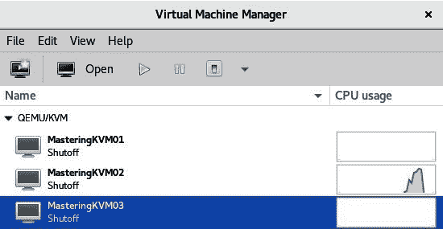

图 7.1-Virt-Manager 主窗口

从此屏幕截图中，我们已经可以看到此服务器上安装了三个 VM。 我们可以使用顶级菜单(**文件**、**编辑**、**查看**和**帮助**)进一步配置我们的 KVM 服务器和/或 VM，以及连接到网络上的其他 KVM 主机，如以下屏幕截图所示：

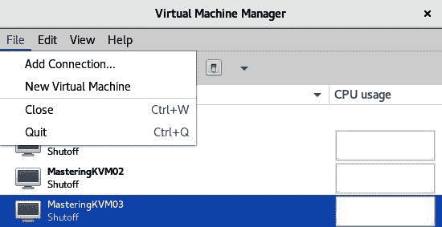

图 7.2-使用 Add Connection…连接到其它 KVM 主机。 选择权

在我们选择**Add Connection…之后。** 选项，我们将看到一个连接到外部主机的向导，我们只需输入一些基本信息--用户名(必须是具有管理权限的用户)和远程服务器的主机名或**Internet 协议**(**IP**)地址。 在此之前，我们还需要在本地计算机上配置**Secure Shell**(**SSH**)密钥，并将密钥复制到该远程计算机，因为这是`virt-manager`的默认身份验证方法。 该过程如以下屏幕截图所示：

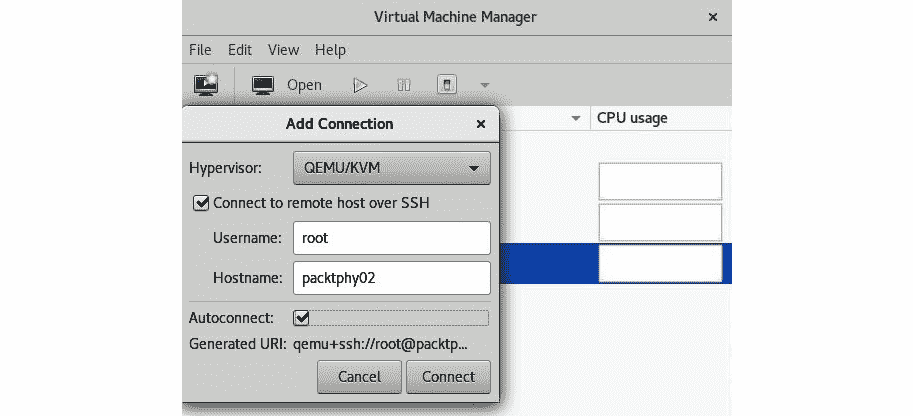

图 7.3-连接到远程 KVM 主机

此时，您可以通过右键单击主机名并选择**New**来启动在该远程 KVM 主机上自由安装 VM(如果您选择这样做)，如以下屏幕截图所示：

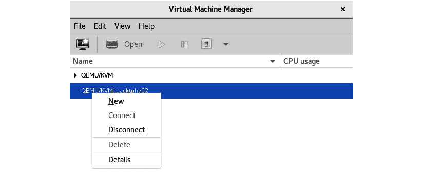

图 7.4-在远程 KVM 主机上创建新虚拟机

由于此向导与在本地服务器上安装 VM 的向导相同，因此我们将一次性介绍这两种情况。 **New VM**向导的第一步是选择*，在其中*您将从安装 VM*。 正如您在下面的屏幕截图中看到的，有四个可用选项：*


图 7.5-选择引导介质

选项如下：

*   如果您的本地计算机(或作为物理设备)上已经有**国际标准化组织**(**ISO**)文件可用，请选择第一个选项。
*   如果要从网络安装，请选择第二个选项。
*   如果在您的环境中设置了**预引导执行环境**(**PXE**)，并且可以从网络引导 VM 安装，请选择第三个选项。
*   如果您有一个 VM 磁盘，并且您只想将其作为您正在定义的 VM 的基础，请选择第四个选项。

通常，我们谈论的是网络安装(第二种选择)或 PXE 引导的网络安装(第三种选择)，因为这些都是生产中最流行的用例。 原因很简单-绝对没有理由将本地磁盘空间浪费在 ISO 文件上，这些文件现在已经相当大了。 例如，CentOS 8 v1905 ISO 文件的大小约为 8**GB**(**GB**)。 如果您需要能够安装多个操作系统，或者甚至这些操作系统的多个版本，最好只为 ISO 文件提供某种集中式存储空间。

在基于VMware**ESX 集成**(**ESXi**)的基础设施中，人们通常使用 ISO 数据存储或内容库来实现此功能。 在基于 Microsoft Hyper-V 的基础架构中，人们通常拥有**服务器消息块**(**SMB**)文件共享，其中包含 VM 安装所需的 ISO 文件。 每台主机都有一个操作系统 ISO 的副本是没有意义的，所以某种共享方法要方便得多，而且是一种很好的节省空间的机制。

假设我们正在从网络(**HyperText Transfer Protocol**(**HTTP**)、**HyperText Transfer Protocol Secure**(**HTTPS**)或**File Transfer Protocol**(**FTP**))安装个 VM(**HyperText Transfer Protocol**(**HTTP**)、**HyperText Transfer Protocol**(**HTTPS**))。 我们需要几个条件才能继续，如下所示：

*   来自的**统一资源定位符**(**URL**)，我们可以完成安装-在我们的示例中，我们将使用[http://mirror.linux.duke.edu/pub/centos](http://mirror.linux.duke.edu/pub/centos)。 从该链接中选择最新的`8.x.x`目录，然后转到`BaseOS/x86_64/os`。
*   显然，要有功能正常的互联网连接--越快越好，因为我们将从前面的 URL 下载所有必要的安装包。
*   或者，我们可以打开**URL Options**三角形，并对内核行使用其他选项-最常见的是具有如下内容的 kickstart 选项：

    ```sh
    ks=http://kickstart_file_url/file.ks
    ```

那么，让我们将其键入，如下所示：


图 7.6-URL 和来宾操作系统选择

请注意，我们*手动*选择了**Red Hat Enterprise Linux 8.0**作为目标客户操作系统，因为`virt-manager`当前没有从我们指定的 URL将 CentOS 8(1905)识别为客户操作系统。 如果该操作系统在当前可识别的操作系统列表中，我们只需选中**Automatic Detect from Installation Media/Source**复选框，有时需要重新选中和取消选中该复选框，然后才能正常工作。

单击**Forward**按钮后，我们将面对此 VM 的内存和**中央处理器**(**CPU**)设置。 同样，您可以从两个不同的方向进行操作，如下所示：

*   选择最少的个资源(例如，1**个虚拟 CPU**(**vCPU**)和 1 GB 内存)，然后如果需要更多 CPU 马力和/或更多内存，则在以后更改。
*   选择适当数量的资源(例如，2 个 vCPU 和 4 GB 内存)，并考虑具体使用情况。 例如，如果此虚拟机的预期使用情形是文件服务器，则如果您向其添加 16 个 vCPU 和 64 GB 内存，您将不会获得非常高的性能，但在其他使用情形中，这可能是合适的。

下一步是配置 VM 存储。 有两个可用选项，我们可以在下面的屏幕截图中看到：


图 7.7♥配置虚拟机存储

为 VM 选择适当的*存储设备非常重要，因为如果不这样做，将来可能会遇到各种问题。例如，如果您将 VM 放在生产环境中错误的存储设备上，则必须将该 VM 的存储迁移到另一个存储设备，这是一个乏味且耗时的过程，如果您在源或目标存储设备上运行大量 VM，则会产生一些严重的副作用。 首先，这将严重影响他们的表现。 然后，如果您的环境中有某种动态工作负载管理机制，它可能会在您的基础架构中触发额外的 VM 或VM 存储移动。 VMware 的**Distributed Resource Scheduler**(**DRS**)/Storage DRS、Hyper-V Performance和资源优化(通过**System Center Operations Manager**(**SCOM**)集成)以及 oVirt/Red Hat Enterprise Virtualization 群集调度策略等功能就是这样做的。 因此，采用*三思而后行*策略可能是这里的正确方法。*

 *如果选择第一个可用选项，**为虚拟机**创建磁盘镜像，`virt-manager`将在其默认位置创建 VM 硬盘-对于**Red Hat Enterprise Linux**(**RHEL**)和CentOS，即在`/var/lib/libvirt/images`目录中。 确保您有足够的空间容纳您的 VM 硬盘。 假设我们在`/var/lib/libvirt/images`目录及其底层分区中有 8 GB 的可用空间。 如果我们保留前一个屏幕截图中的所有内容，我们会收到一条错误消息，因为我们试图在只有 8 GB 可用空间的本地磁盘上创建一个 10 GB 的文件。

再次单击**Forward**按钮之后，我们进入了 VM 创建过程的最后一步，在此我们可以选择 VM 名称(如`virt-manager`中所示)，在安装过程之前自定义配置，并选择 VM 将使用的虚拟网络。 我们将在本章稍后介绍虚拟机的硬件定制。 单击**完成**后，如以下屏幕截图所示，您的虚拟机将准备好部署，并在我们安装操作系统后使用：


图 7.8-最后的 virt-manager 配置步骤

使用`virt-manager`创建一些 VM 肯定不是一项困难的任务，但在实际生产环境中，您不一定会发现服务器上安装了 GUI。 因此，我们合乎逻辑的下一项任务是了解用于管理 VM 的命令行实用程序-具体地说，就是`virt-*`命令。 接下来我们来做这件事。

## 使用 virt-*命令

如前所述，我们需要学习一些新命令来掌握基本 VM 管理任务。 为此，我们提供了`virt-*`命令堆栈。 让我们简要回顾一下其中一些最重要的选项，并学习如何使用它们。

### 虚拟查看器

由于我们以前已经大量使用了`virt-install`命令(请参阅[*第 3 章*](03.html#_idTextAnchor049)，*安装基于内核的虚拟机(KVM)虚拟机管理程序、libvirt 和 ovirt*，其中我们使用此命令安装了相当多的 VM)，因此我们将介绍其余的命令。

让我们从`virt-viewer`开始，因为我们以前使用过这个应用程序。 每次双击`virt-viewer`中的虚拟机时，我们都会打开一个虚拟机控制台，而这恰好是此过程背景中的`virt-viewer`。 但是，如果我们想要在 shell 中使用`virt-viewer`--就像人们经常做的那样--我们需要更多关于它的信息。 那么，让我们举几个例子。

首先，让我们通过运行以下命令连接到名为`MasteringKVM01`的本地 KVM，该 KVM 驻留在我们当前作为`root`连接到的主机上：

```sh
# virt-viewer --connect qemu:///system MasteringKVM01
```

我们还可以在`kiosk`模式下连接到 VM，这意味着当我们关闭连接到的 VM 时，`virt-viewer`将关闭。 为此，我们将运行以下命令：

```sh
# virt-viewer --connect qemu:///system MasteringKVM01 --kiosk --kiosk-quit on-disconnect
```

如果我们需要连接到*远程*主机，我们也可以使用`virt-viewer`，但我们需要几个附加选项。 对远程系统进行身份验证的最常见方式是通过 SSH，因此我们可以执行以下操作：

```sh
# virt-viewer --connect qemu+ssh://username@remote-host/system VirtualMachineName
```

如果我们配置 SSH 密钥并将其复制到`username@remote-host`，则前面的命令不会要求我们输入密码。 但如果没有，它将要求我们输入两次密码-建立到虚拟机管理程序的连接，然后建立到VM**虚拟网络计算**(**VNC**)会话的连接。

### Virt-XML

我们列表中的下一个命令行实用程序是`virt-xml`。 我们可以将其与`virt-install`命令行选项一起使用来更改 VM 配置。 让我们从一个基本示例开始-让我们只启用虚拟机的引导菜单，如下所示：

```sh
# virt-xml MasgteringKVM04 --edit --boot bootmenu=on
```

然后，让我们分三步向虚拟机添加精简配置的磁盘-首先，创建磁盘本身，然后将其连接到虚拟机并检查是否一切正常。 输出可以在下面的屏幕截图中看到：

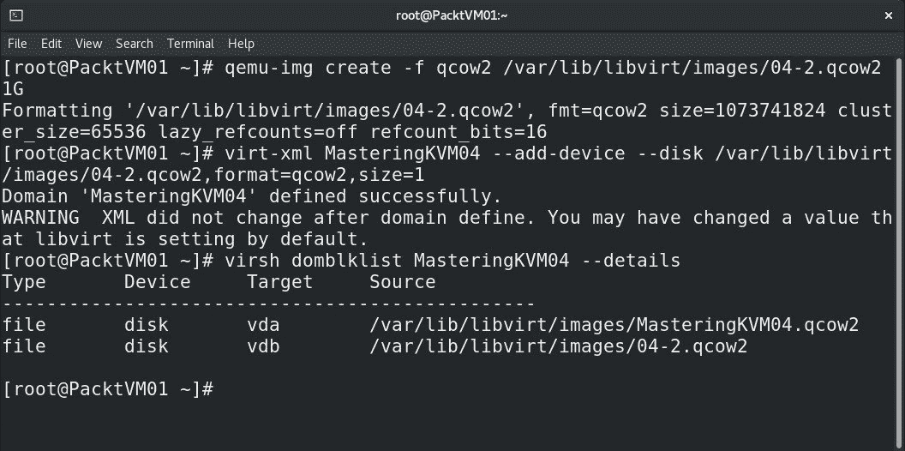

图 7.9-将精简资源调配 QEMU 写入时拷贝(Qco2)格式的虚拟磁盘添加到虚拟机

正如我们所看到的，`virt-xml`是非常有用的。 通过使用它，我们向虚拟机添加了另一个虚拟磁盘，这是它能做的最简单的事情之一。 我们可以使用它将任何额外的 VM 硬件部署到现有 VM。 我们还可以使用它来编辑 VM 配置，这在较大的环境中非常方便，特别是当您必须编写脚本并自动执行此类过程时。

### 虚拟克隆

现在让我们用几个例子来检查`virt-clone`。 比方说，我们只需要一种快速、简单的方法来克隆现有的虚拟机，而不需要任何额外的麻烦。 我们可以做到以下几点：

```sh
# virt-clone --original VirtualMachineName --auto-clone
```

因此，这将生成一个名为`VirtualMachineName-clone`的 VM，我们可以立即开始使用它。 让我们来看看这一点的实际情况，如下所示：

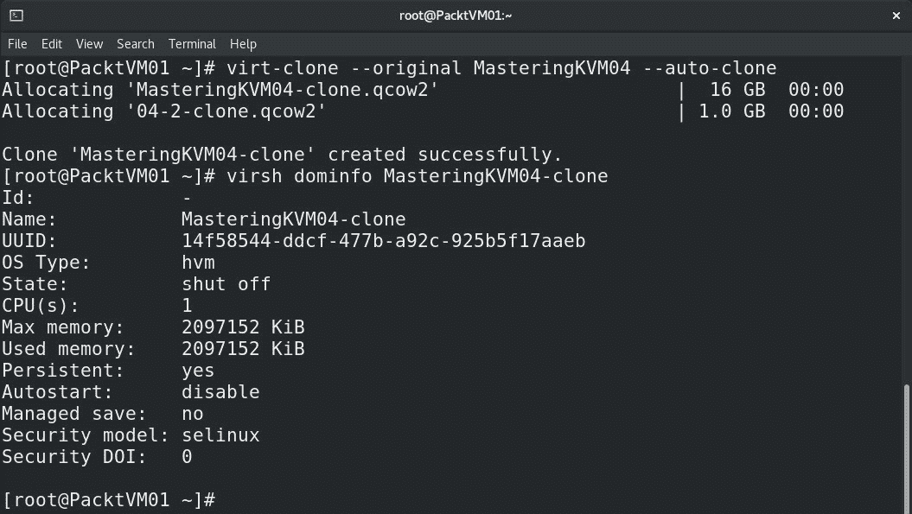

图 7.10-使用 virt-clone 创建虚拟机克隆

让我们看看这个如何可以更多地*定制*。 通过使用`virt-clone`，我们将通过克隆名为`MasteringKVM04`的虚拟机来创建名为`MasteringKVM05`的虚拟机，还将自定义虚拟磁盘名称，如以下屏幕截图所示：


图 7.11-自定义虚拟机创建：自定义虚拟机名称和虚拟硬盘文件名

现实生活中有种情况需要您将 VM 从一种虚拟化技术转换为另一种虚拟化技术。 大部分工作实际上是将 VM 磁盘格式从一种格式转换为另一种格式。 这就是`virt-convert`的全部意义所在。 让我们来了解一下它是如何工作的。

### Qemu-img

现在让我们检查一下我们如何将虚拟磁盘转换为另一种格式，以及如何将 VM*配置文件*从一种虚拟化方法转换为另一种虚拟化方法。 我们将使用一个空的 VMware VM 作为源，并将其`vmdk`虚拟磁盘和`.vmx`文件转换为新格式，如以下屏幕截图所示：


图 7.12-将 VMware 虚拟磁盘转换为用于 KVM 的 qco2 格式

如果我们面临涉及在这些平台之间移动或转换 VM 的项目，我们需要确保使用这些实用程序，因为它们易于使用和理解，并且只需要一点时间。 例如，如果我们有一个 1**TB**(**TB**)VMware虚拟磁盘(**VM 磁盘**(**VMDK**)和平面 VMDK 文件)，将该文件转换为`qcow2`格式可能需要小时，因此我们必须耐心等待。 此外，我们还需要随时准备编辑`vmx`配置文件，因为从`vmx`格式到`kvm`格式的转换过程并不像我们预期的那样 100%顺利。 在此过程中，将创建一个新的配置文件。 KVM VM 配置文件的默认目录是`/etc/libvirt/qemu`，我们可以很容易地在该目录中看到**Extensible Markup****Language**(**XML**)文件-这些是我们的 KVM 配置文件。 文件名代表`virsh`列表输出中的 VM 名称。

CentOS 8 中还有一些新的实用程序，使我们不仅可以更轻松地管理本地服务器，还可以更轻松地管理 VM。 驾驶舱 Web 界面就是其中之一-它能够在 KVM 主机上执行基本的 VM 管理。 我们所需要做的就是通过 Web 浏览器连接到它，在讨论 oVirt 设备的部署时，我们在[*第 3 章*](03.html#_idTextAnchor049)，*安装基于内核的 VM(KVM)虚拟机管理程序、libvirt 和 ovirt*中提到了此 Web 应用程序。 那么，让我们通过使用 Cockit 来熟悉一下 VM 管理。

## 使用驾驶舱创建新虚拟机

要使用 Cocket 对我们的服务器及其 VM 进行管理，我们需要安装并启动 Cocket 及其其他软件包。 让我们从这个开始，如下所示：

```sh
yum -y install cockpit*
systemctl enable --now cockpit.socket
```

之后，我们可以启动 Firefox 并将其指向`https://kvm-host:9090/`，因为这是可以到达驾驶舱的默认端口，并使用 root 密码以`root`身份登录，这将显示以下**用户界面**(**UI**)：


图 7.14-驾驶舱 Web 控制台，我们可以使用它来部署虚拟机

在前面的步骤中，当我们安装`cockpit*`时，我们还安装了`cockpit-machines`，这是驾驶舱 Web 控制台的一个插件，使我们能够在驾驶舱 Web 控制台中管理`libvirt`个 VM。 因此，在我们单击**VM**之后，我们可以轻松地看到我们以前安装的所有 VM，打开它们的配置，并通过一个简单的向导安装新的 VM，如以下屏幕截图所示：


图 7.15-驾驶舱虚拟机管理

VM 安装向导非常简单-我们只需配置新 VM 的基本设置，即可开始安装，如下所示：

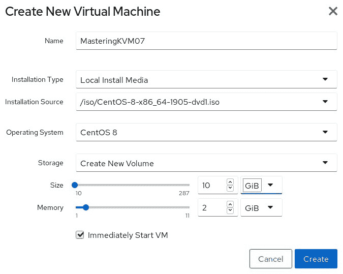

图 7.16-从驾驶舱 Web 控制台安装 KVM VM

既然我们已经介绍了如何在本地*安装 VM*-这意味着没有某种集中式管理应用程序-让我们返回并检查如何通过 oVirt 安装 VM。

# 使用 oVirt 创建新虚拟机

如果我们将主机添加到 oVirt，当我们登录到它时，我们可以转到**Compute-VMs**，并使用一个简单的向导开始部署 VM。 因此，单击该菜单中的**New**按钮后，我们就可以这样做了，我们将进入以下屏幕：

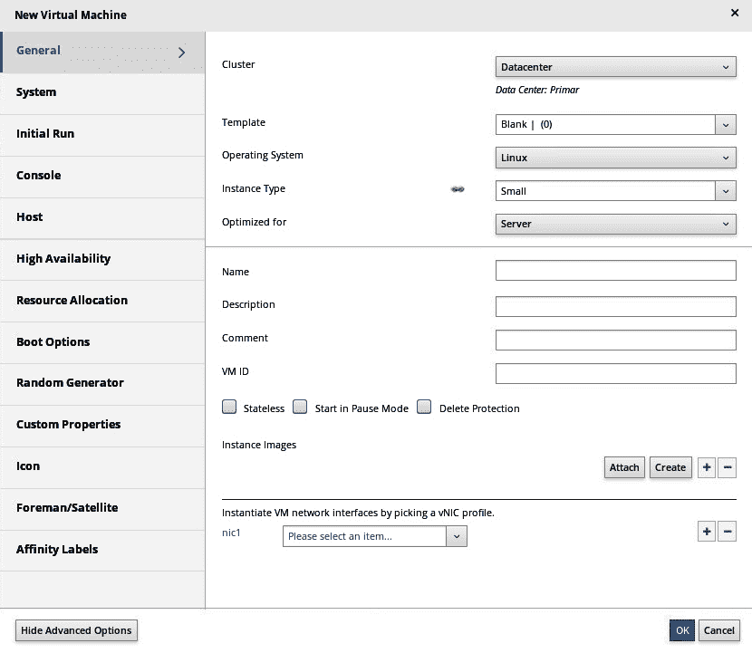

图 7.17-oVirt 中的新建虚拟机向导

考虑到oVirt 是一个针对 KVM 主机的集中式管理解决方案，与 KVM 主机上的本地 VM 安装相比，我们拥有*加载*的额外选项-我们可以选择将托管此 VM 的群集；我们可以使用模板、配置优化和实例类型、配置**高可用性**(**HA**)、资源分配、引导选项...。 基本上，这就是我们戏称的*选项瘫痪*，尽管这是为了我们自己的利益，因为集中式解决方案总是与任何一种本地解决方案略有不同。

至少，我们必须配置常规 VM 属性-名称、操作系统和 VM 网络接口。 然后，我们将转到**SYSTEM**选项卡，在此我们将配置内存大小和虚拟 CPU 计数，如下面的屏幕截图所示：

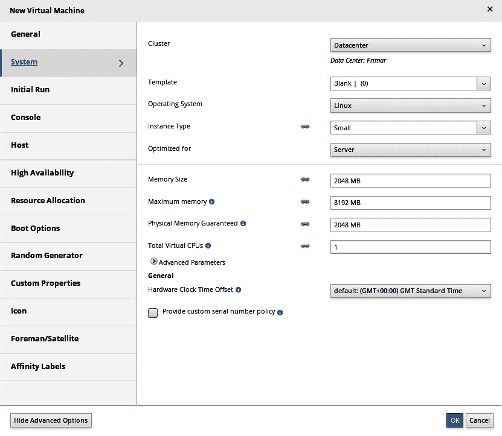

图 7.18-选择虚拟机配置：虚拟 CPU 和内存

我们肯定要配置引导选项-附加 CD/ISO，添加虚拟硬盘，并配置引导顺序，如以下屏幕截图所示：

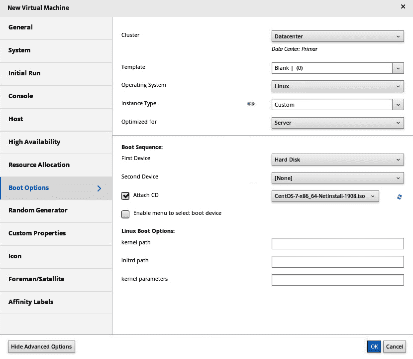

图 7.19-在 oVirt 中配置虚拟机引导选项

我们可以使用`sysprep`或`cloud-init`自定义虚拟机安装后配置，我们将在[*第 9 章*](09.html#_idTextAnchor165)、*使用 cloud-init 自定义虚拟机*中讨论。

下面是 oVirt 中的基本配置：


图 7.20-从 oVirt 安装 KVM VM：确保选择正确的引导选项

实际上，如果您管理的环境有两到三台以上的KVM 主机，那么您将希望使用某种集中式实用程序来管理它们。 OVirt 在这方面真的很好，所以不要跳过它。

现在，我们已经以各种不同的方式完成了整个部署过程，现在是考虑 VM 配置的时候了。 请记住，VM 是一个具有许多重要属性(如虚拟 CPU 数量、内存量、虚拟网卡等)的对象，了解如何自定义 VM 设置非常重要。 所以，让我们把它作为下一个话题。

# 配置您的虚拟机

当我们使用`virt-manager`时，如果您一直走到最后一步，您可以选择一个有趣的选项，那就是**Customize Configuration Being Install**选项。 如果您在安装后检查虚拟机配置，则可以访问相同的配置窗口。 因此，无论我们走哪条路，我们都将面对分配给我们刚刚创建的 VM 的每个 VM 硬件设备的完整配置选项，如下面的屏幕截图所示：

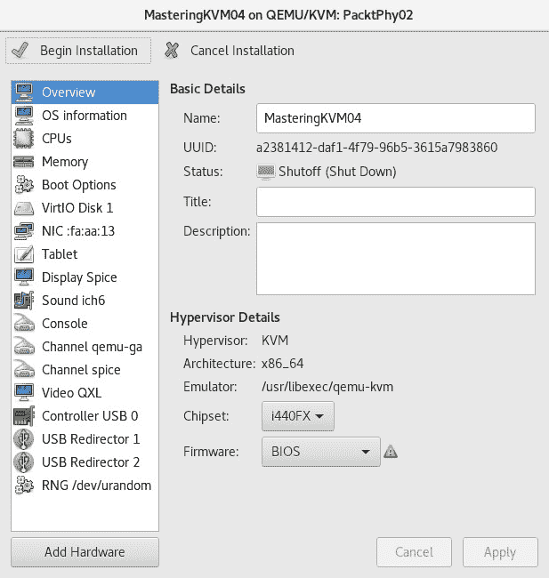

图 7.21-虚拟机配置选项

例如，如果我们单击左侧的**CPU**选项，您将看到可用的 CPU 数量(当前和最大分配)，我们还会看到一些相当高级的选项，如**CPU 拓扑**(**插槽**/**内核**/**线程**)。 这使我们能够配置特定的**非均匀存储器访问**(**NUMA**)配置选项。 配置窗口如下所示：


图 7.22Собработается虚拟机中央处理器配置

这是 VM 配置的*非常*重要的部分，特别是当您正在设计承载虚拟服务器负载的环境时。 此外，如果虚拟化服务器托管**输入/输出**(**I/O**)密集型应用程序(如数据库)，则变得更加重要。 如果您想了解更多这方面的信息，可以查看本章末尾*进一步阅读*部分的链接，因为它将为您提供大量关于 VM 设计的附加信息。

然后，如果我们打开**Memory**选项，我们可以更改内存分配-同样，以浮点形式(当前和最大分配)进行更改。 我们将在稍后开始使用`virt-*`命令时讨论这些选项。 下面是`virt-manager`**存储器**配置选项的外观：

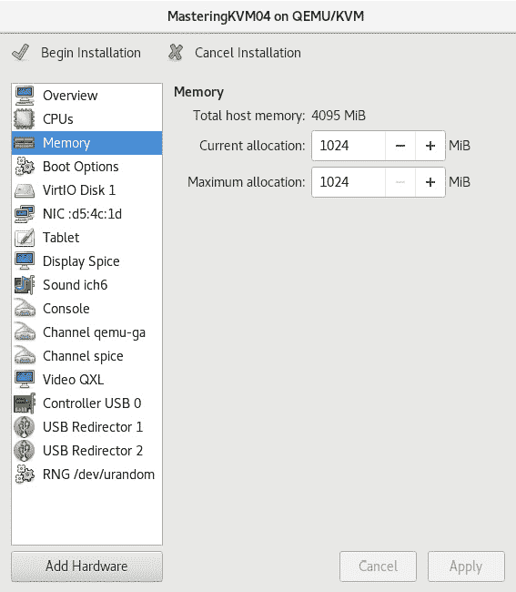

图 7.23-虚拟机内存配置

`virt-manager`中提供的一个最重要的配置选项集位于**Boot Options**子菜单中，如以下屏幕截图所示：

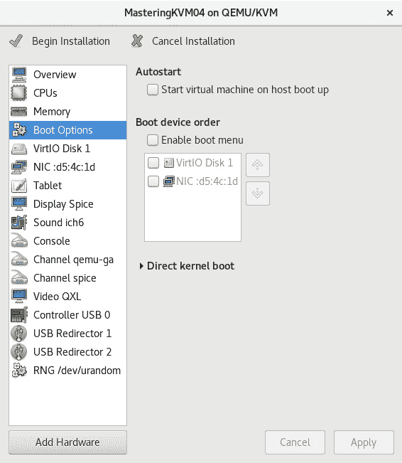

图 7.24-虚拟机引导配置选项

在那里，您可以做两件非常重要的事情，如下所示：

*   选择要随主机自动启动的此虚拟机
*   启用引导菜单并选择引导设备和引导设备优先级

就配置选项而言，到目前为止，`virt-manager`功能最丰富的配置菜单是虚拟存储菜单-在我们的示例中，是**VirtIO Disk 1**。 如果我们单击该选项，我们将获得以下配置选项选择：


图 7.25-配置虚拟机硬盘和存储控制器选项

让我们看看这些配置选项中的一些选项的意义是什么，如下所示：

*   **磁盘总线**-这里通常有五个选项，**VirtIO**是默认的(也是最好的)选项。 与 VMware、ESXi 和 Hyper-V 一样，KVM 有不同的虚拟存储控制器可用。 例如，VMware 具有 BusLogic、LSI Logic、ParaVirtual 和其他类型的虚拟存储控制器，而 Hyper-V 具有**集成驱动电子设备**(**IDE**)和**小型计算机系统接口**(**SCSI**)控制器。 此选项定义VM 将在其来宾操作系统内看到的存储控制器。
*   **存储格式**-有两种格式：`qcow2`和`raw`(`dd`类型格式)。 最常见的选项是`qcow2`，因为它为虚拟机管理提供了最大的灵活性-例如，它支持精简配置和快照。
*   `Cache`模式-有六种类型：`writethrough`、`writeback`、`directsync`、`unsafe`、`none`和`default`。 这些模式解释了如何将数据从源自虚拟机的 I/O 写入到虚拟机下方的存储底层。 例如，如果我们使用的是`writethrough`，I/O 将被缓存到 KVM 主机上，并被写入 VM 磁盘。 另一方面，如果我们使用`none`，主机上没有缓存(磁盘`writeback`缓存除外)，数据直接写入 VM 磁盘。 不同的模式有不同的优缺点，但通常情况下，`none`是虚拟机管理的最佳选择。 您可以在*进一步阅读*一节中了解更多关于它们的信息。
*   `IO`模式-有两种模式：`native`和`threads`。 根据此设置，VM I/O 将通过内核异步 I/O 或通过用户空间中的线程池(也是默认值)写入。 在使用`qcow2`格式时，通常认为`threads`模式更好，因为`qcow2`格式首先分配扇区，然后写入扇区，这将占用分配给 VM 的 vCPU，并直接影响 I/O 性能。
*   `Discard`模式-这里有两种可用的模式，称为`ignore`和`unmap`。 如果选择`unmap`，当您从 VM 中删除文件(转换为释放`qcow2`VM 磁盘文件中的空间)时，`qcow2`VM 磁盘文件将收缩以反映新释放的容量。 根据您应用的 Linux 发行版、内核和内核补丁和**Quick Emulator**(**QEMU**)版本的不同，此函数*可能只在 SCSI 磁盘总线上可用。 QEMU 4.0+版本支持。*
*   `Detect zeroes`-有三种模式可用：`off`、`on`和`unmap`。 如果选择`unmap`，零写入将被转换为取消映射操作(如丢弃模式中所述)。 如果将其设置为`on`，操作系统的零写入将转换为特定的零写入命令。

在任何给定虚拟机的生命周期内，我们都很有可能重新配置它。 无论这是否意味着添加或删除虚拟硬件(当然，通常是添加)，它都是 VM 生命周期的一个重要方面。 所以，让我们学习如何管理它。

# 在您的虚拟机中添加和删除虚拟硬件

通过使用 VM配置屏幕，我们可以轻松添加其他硬件，或删除硬件。 例如，如果我们点击左下角的**Add Hardware**按钮，我们就可以轻松地添加设备-比方说，虚拟网卡。 以下屏幕截图说明了此过程：


图 7.26-单击 Add Hardware(添加硬件)后，我们可以选择要添加到虚拟机的虚拟硬件设备

另一方面，如果我们选择一个虚拟硬件设备(例如，**Sound ich6**)并按下随后出现的**Remove**按钮，我们也可以在确认要删除此虚拟硬件设备后删除此虚拟硬件设备，如以下屏幕截图所示：

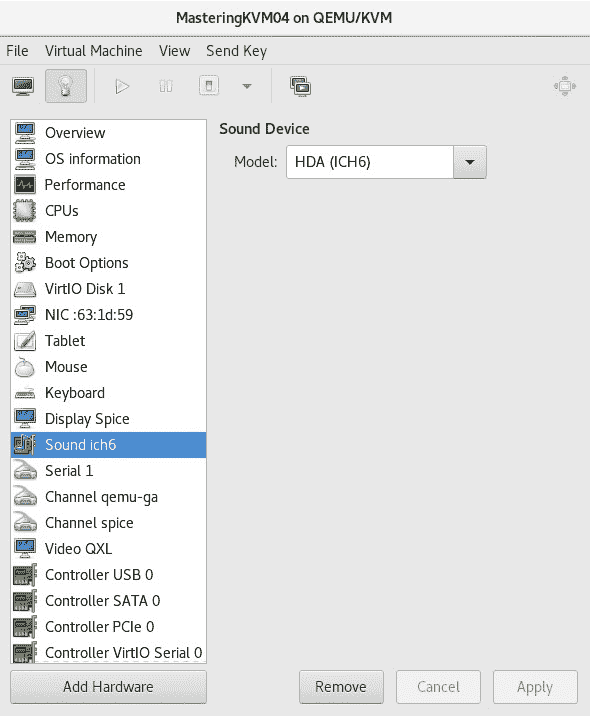

图 7.27-删除虚拟机硬件设备的流程：在左侧选择该设备，然后单击删除

如您所见，添加和删除 VM 硬件就像1-2-3 一样简单。 我们以前在使用虚拟网络和存储([*第 4 章*](04.html#_idTextAnchor062)，*Libvirt Networking*)时实际上触及过这个主题，但在这里，我们使用了 shell 命令和 XML 文件定义。 如果您想了解更多有关这方面的信息，请查看这些示例。

虚拟化关乎灵活性，能够将虚拟机放置在我们环境中的任何给定主机上是其中很大的一部分。 考虑到这一点，虚拟机迁移是虚拟化的功能之一，可用作虚拟化及其众多优势的营销海报。 虚拟机迁移到底是关于什么的？ 这就是我们接下来要学习的。

# 迁移虚拟机

简而言之，迁移使您能够将虚拟机从一台物理机移动到另一台物理机，停机时间非常短或没有停机。 我们还可以移动虚拟机存储，这是一种资源占用类型的操作，需要仔细规划并在可能的情况下在下班后执行，这样才不会尽可能地影响其他虚拟机的性能。

有各种不同类型的迁移，如下所示：

*   脱机(冷)
*   在线(实时)
*   暂停迁徙

还有各种不同类型的在线迁移，具体取决于您要移动的内容，如下所示：

*   虚拟机的计算部分(将虚拟机从一台 KVM 主机移动到另一台 KVM 主机)
*   虚拟机的存储部分(将虚拟机文件从一个存储池移动到另一个存储池)
*   两者(同时将虚拟机从一个主机移动到另一个主机，并将存储池移动到另一个存储池)

如果您只使用普通 KVM 主机，与使用 oVirt 或 Red Hat Enterprise Virtualization 相比，在支持哪些迁移方案方面存在一些差异。 如果您想要执行实时存储迁移，则不能直接在 KVM 主机上执行，但如果 VM 关闭，您可以很容易地执行此操作。 如果您需要实时存储迁移，则必须使用 oVirt 或 Red Hat Enterprise Virtualization。

我们讨论了**单根输入输出虚拟化**(**SR-IOV**)、**外围组件互连**(**PCI**)设备直通、**虚拟图形处理单元**(**vGPU**)以及类似的概念(在[*第 2 章*](02.html#_idTextAnchor029)、*KVM as a Virus。 和[*第四章*](04.html#_idTextAnchor062)，*Libvirt Networking*)。 在 CentOS8 中，您不能实时迁移分配给正在运行的 VM 的 VM。*

无论是什么用例，我们都需要意识到这样一个事实：迁移需要以`root`用户或属于`libvirt`用户组的用户身份执行(Red Hat 将其称为系统与用户`libvirt`会话)。

VM 迁移是您的武器库中有价值的工具有不同的原因。 其中一些原因是显而易见的，另一些则不那么明显。 让我们试着解释一下 VM 迁移的不同用例及其好处。

## 虚拟机迁移的优势

VM 实时迁移的最重要优势如下：

*   **延长正常运行时间和减少停机时间**-精心设计的虚拟化环境将为您的应用程序提供最长的正常运行时间。
*   **节能环保**-您可以在非工作时间根据虚拟机的负载和使用情况轻松将其整合到数量较少的虚拟机管理程序。 迁移虚拟机后，您可以关闭未使用的虚拟机管理程序。
*   **通过在不同的虚拟机管理程序之间移动虚拟机来简化硬件/软件升级过程**-一旦您能够在不同的物理服务器之间自由移动您的虚拟机，就会获得无数好处。

VM 迁移需要进行适当的规划才能到位。 迁移需要满足一些基本要求。 让我们一个接一个地看一看。

生产环境的迁移要求如下：

*   虚拟机应使用在共享存储上创建的存储池。
*   在两个虚拟机管理程序(源和目标虚拟机管理程序)上，存储池的名称和虚拟磁盘的路径应该保持相同。

查看[*第 4 章*](04.html#_idTextAnchor062)、*Libvirt Networking*和[*第 5 章*](05.html#_idTextAnchor079)、*Libvirt Storage*，提醒您如何使用共享存储创建存储池。

和往常一样，这里有一些适用的规则。 这些内容相当简单，因此我们需要在开始迁移过程之前了解它们。 这些建议如下：

*   可以使用在非共享存储上创建的存储池执行实时存储迁移。 您只需保持相同的存储池名称和文件位置，但在生产环境中仍建议使用共享存储。
*   如果有非托管虚拟磁盘连接到使用**光纤通道**(**FC**)、**Internet 小型计算机系统接口**(**iSCSI**)、**逻辑卷管理器**(**LVM**)等的虚拟机，则两个虚拟机管理程序上应提供相同的存储。
*   虚拟机使用的虚拟网络应该在两个虚拟机管理程序上都可用。
*   为网络通信配置的网桥应该在两个虚拟机管理程序上都可用。
*   如果虚拟机管理程序上的`libvirt`和`qemu-kvm`的主要版本不同，迁移可能会失败，但您应该能够将运行在具有较低版本`libvirt`或`qemu-kvm`的虚拟机管理程序上的虚拟机迁移到具有较高版本的这些软件包的虚拟机管理程序，而不会出现任何问题。
*   源虚拟机管理程序和目标虚拟机管理程序上的时间都应同步。 强烈建议您使用相同的**网络时间协议**(**NTP**)或**精确时间协议**(**PTP**)服务器同步虚拟机管理程序。
*   重要的是，系统使用**域名系统**(**DNS**)服务器进行名称解析。 在`/etc/hosts`上添加主机详细信息将不起作用。 您应该能够使用`host`命令解析主机名。

在规划虚拟机迁移环境时，我们需要牢记一些前提条件。 在很大程度上，所有虚拟化解决方案的这些前提条件都是相同的。 让我们讨论这些前提条件，以及接下来如何为 VM 迁移设置我们的环境。

## 设置环境

让我们构建环境来执行VM 迁移-包括离线迁移和实时迁移。 下图描述了使用共享存储运行虚拟机的两台标准 KVM 虚拟化主机：


图 7.28-共享存储上的虚拟机

我们首先设置一个共享存储。 在本例中，我们将**网络文件系统**(**NFS**)用于共享存储。 我们将使用 NFS，因为它设置起来很简单，因此可以帮助您轻松地遵循迁移示例。 在实际生产中，建议使用基于 iSCSI 或基于 FC 的存储池。 当文件很大且 VM 执行繁重的 I/O 操作时，NFS 不是一个好的选择。 Gluster 是 NFS 的一个很好的替代方案，我们建议您尝试一下。 Gluster 在`libvirt`中集成良好。

我们将在 CentOS8 服务器上创建一个 NFS 共享。 它将托管在`/testvms`目录中，我们将通过 NFS 导出该目录。 服务器的名称为`nfs-01`。 (在我们的示例中，`nfs-01`的 IP 地址是`192.168.159.134`)

1.  第一步是从`nfs-01`创建并导出`/testvms`目录，然后关闭 SELinux(查看[*第 5 章*](05.html#_idTextAnchor079)、*Libvirt Storage*、Cave 部分)：

    ```sh
    # mkdir /testvms
    # echo '/testvms *(rw,sync,no_root_squash)' >> /etc/exports
    ```

2.  然后，通过执行以下代码在防火墙中允许 NFS 服务：

    ```sh
    # firewall-cmd --get-active-zones
    public
    interfaces: ens33
    # firewall-cmd --zone=public --add-service=nfs
    # firewall-cmd --zone=public --list-all
    ```

3.  启动 NFS 服务，如下所示：

    ```sh
    # systemctl start rpcbind nfs-server
    # systemctl enable rpcbind nfs-server
    # showmount -e
    ```

4.  确认可以从 KVM 虚拟机管理程序访问共享。 在我们的例子中，它是`PacktPhy01`和`PacktPhy02`。 运行以下代码：

    ```sh
    # mount 192.168.159.134:/testvms /mnt
    ```

5.  如果挂载失败，请在 NFS 服务器上重新配置防火墙并重新检查挂载。 这可以通过使用以下命令来完成：

    ```sh
    firewall-cmd --permanent --zone=public --add-service=nfs
    firewall-cmd --permanent --zone=public --add-service=mountd
    firewall-cmd --permanent --zone=public --add-service=rpc-bind
    firewall-cmd -- reload
    ```

6.  从两个虚拟机管理程序验证 NFS 装入点后，即可卸载卷，如下所示：

    ```sh
    # umount /mnt
    ```

7.  在`PacktPhy01`和`PacktPhy02`上，创建名为`testvms`的存储池，如下所示：

    ```sh
    # mkdir -p /var/lib/libviimg/testvms/
    # virsh pool-define-as --name testvms --type netfs --source-host 192.168.159.134 --source-path /testvms --target /var/lib/libviimg/testvms/
    # virsh pool-start testvms
    # virsh pool-autostart testvms
    ```

现在，在两个虚拟机管理程序上创建并启动了`testvms`存储池。

在下一个示例中，我们将隔离迁移和虚拟机流量。 强烈建议您在生产环境中进行此隔离，特别是在执行大量迁移时，因为这会将要求苛刻的进程分流到单独的网络接口，从而释放其他拥塞的网络接口。 因此，这主要有两个原因：

*   **Network performance**: The migration of a VM uses the full bandwidth of the network. If you use the same network for the VM traffic network and the migration network, the migration will choke that network, thus affecting the servicing capability of the VM. You can control the migration bandwidth, but it will increase the migration time.

    下面是我们创建隔离的方式：

    ```sh
    PacktPhy01 -- ens36 (192.168.0.5) <--switch------> ens36 (192.168.0.6) -- PacktPhy02
        ens37 -> br1 <-----switch------> ens37 -> br1
    ```

    `ens192``PacktPhy01`和`PacktPhy02`上的接口用于迁移和管理任务。 它们分配了 IP 并连接到网络交换机。 在`PacktPhy01`和`PacktPhy02`上使用`ens224`创建`br1`桥。 `br1`未分配 IP 地址，仅用于 VM 流量(VM 连接到的交换机的上行链路)。 它还连接到(物理)网络交换机。

*   **安全原因**：出于安全原因，始终建议您将管理网络和虚拟网络隔离。 您不希望您的用户扰乱您的管理网络，因为您可以在其中访问虚拟机管理程序并进行管理。

我们将讨论三个最重要的场景-离线迁移、非实时迁移(挂起)和实时迁移(在线)。 然后，我们将把存储迁移作为一个需要额外规划和深谋远虑的单独场景来讨论。

## 离线迁移

顾名思义，在脱机迁移期间，VM 的状态将是，要么关闭，要么挂起。 然后，虚拟机将在目标主机上恢复或启动。 在此迁移模型中，`libvirt`仅将 VM 的 XML 配置文件从源 KVM 主机复制到目标 KVM 主机。 它还假设您已经创建了相同的共享存储池，并且可以在目标上使用。 作为迁移过程的第一步，您需要在参与的 KVM 虚拟机管理程序上设置双向无密码 SSH 身份验证。 在我们的示例中，它们被称为`PacktPhy01`和`PacktPhy02`。

对于以下练习，请暂时禁用**安全增强型 Linux**(**SELinux**)。

在`/etc/sysconfig/selinux`中，使用您喜欢的编辑器修改以下代码行：

```sh
SELINUX=enforcing
```

需要修改如下：

```sh
SELINUX=permissive
```

此外，在命令行中，作为`root`，我们需要将 SELinux 模式临时设置为 PERMISSIVE，如下所示：

```sh
# setenforce 0
```

在`PacktPhy01`上，作为`root`运行以下命令：

```sh
# ssh-keygen
# ssh-copy-id root@PacktPhy02
```

在`PacktPhy02`上，作为`root`运行以下命令：

```sh
# ssh-keygen
# ssh-copy-id root@PacktPhy01
```

现在，您应该能够以`root`身份登录到这两个虚拟机管理程序，而无需键入密码。

让我们将已经安装的`MasteringKVM01`从`PacktPhy01`离线迁移到`PacktPhy02`。 迁移命令的常规格式如下所示：

```sh
# virsh migrate migration-type options name-of-the-vm-destination-uri
```

在`PacktPhy01`上，运行以下代码：

```sh
[PacktPhy01] # virsh migrate --offline --verbose –-persistent MasteringKVM01 qemu+ssh://PacktPhy02/system
Migration: [100 %]
```

在`PacktPhy02`上，运行以下代码：

```sh
[PacktPhy02] # virsh list --all
# virsh list --all
Id Name State
----------------------------------------------------
- MasteringKVM01 shut off
[PacktPhy02] # virsh start MasteringKVM01
Domain MasteringKVM01 started
```

当虚拟机位于共享存储上并且其中一台主机出现某种问题时，您也可以在另一台主机上手动注册虚拟机。 这意味着，在修复了最初出现问题的主机上的问题之后，您可能会在两个虚拟机管理程序上注册相同的个虚拟机。 当您在没有像 oVirt 这样的集中式管理平台的情况下手动管理 KVM 主机时，就会发生这种情况，而这种情况是不允许的。 那么，如果你处在那种情况下会发生什么呢？ 让我们讨论一下这个场景。

### 如果我在两个虚拟机管理程序上意外启动虚拟机，该怎么办？

意外地在两个虚拟机管理程序上启动虚拟机可能是系统管理员的噩梦。 这可能会导致 VM 文件系统损坏，尤其是当 VM 内部的文件系统不支持群集时。 `libvirt`的开发人员对此进行了思考，并提出了一种锁定机制。 事实上，他们想出了两种锁定机制。 启用后，这些将阻止虚拟机在两个虚拟机管理程序上同时启动。

两种锁定机构如下：

*   `lockd`：`lockd`利用`POSIX fcntl()`建议锁定功能。 它是由`virtlockd`守护进程启动的。 它需要一个共享文件系统(最好是 NFS)，共享同一存储池的所有主机都可以访问该文件系统。
*   `sanlock`：这是由 oVirt 项目使用的。 它使用 DISK`paxos`算法来维护连续续订的租约。

对于仅支持`libvirt`的实现，我们更喜欢`lockd`而不是`sanlock`。 对于 oVirt，最好使用`sanlock`。

### 启用锁定

对于符合POSIX 的基于映像的存储池，您可以通过在`/etc/libvirt/qemu.conf`或两个虚拟机管理程序上取消注释以下命令来轻松启用`lockd`：

```sh
lock_manager = "lockd" 
```

现在，在两个虚拟机管理程序上启用并启动`virtlockd`服务。 另外，在两个虚拟机管理程序上重新启动`libvirtd`，如下所示：

```sh
# systemctl enable virtlockd; systemctl start virtlockd
# systemctl restart libvirtd
# systemctl status virtlockd
```

在`PacktPhy02`上启动`MasteringKVM01`，如下所示：

```sh
[root@PacktPhy02] # virsh start MasteringKVM01
Domain MasteringKVM01 started
```

在`PacktPhy01`上启动相同的`MasteringKVM01`VM，如下所示：

```sh
[root@PacktPhy01] # virsh start MasteringKVM01
error: Failed to start domain MasteringKVM01
error: resource busy: Lockspace resource '/var/lib/libviimg/ testvms/MasteringKVM01.qcow2' is locked
```

启用`lockd`的另一种方法是使用磁盘文件路径的散列。 锁定保存在通过 NFS 或类似共享导出到虚拟机管理程序的共享目录中。 当您有使用多路径**逻辑单元号**(**LUN**)创建和连接的虚拟磁盘时，这非常有用。 在这种情况下不能使用`fcntl()`。 我们建议您使用下面详细介绍的方法来启用锁定。

在 NFS 服务器上，运行以下代码(确保您首先没有从该 NFS 服务器运行任何虚拟机！)

```sh
mkdir /flockd
# echo "/flockd *(rw,no_root_squash)" >> /etc/exports
# systemctl restart nfs-server
# showmount -e
Export list for :
/flockd *
/testvms *
```

将以下代码添加到`/etc/fstab`中的两个虚拟机管理程序中，并键入其余命令：

```sh
# echo "192.168.159.134:/flockd /var/lib/libvirt/lockd/flockd nfs rsize=8192,wsize=8192,timeo=14,intr,sync" >> /etc/fstab
# mkdir -p /var/lib/libvirt/lockd/flockd
# mount -a
# echo 'file_lockspace_dir = "/var/lib/libvirt/lockd/flockd"' >> /etc/libvirt/qemu-lockd.conf
```

重新启动两个虚拟机管理程序，并在重新启动后，验证`libvirtd`和`virtlockd`守护程序是否在两个虚拟机管理程序上正确启动，如下所示：

```sh
[root@PacktPhy01 ~]# virsh start MasteringKVM01
Domain MasteringKVM01 started
[root@PacktPhy02 flockd]# ls
36b8377a5b0cc272a5b4e50929623191c027543c4facb1c6f3c35bacaa745 5ef
51e3ed692fdf92ad54c6f234f742bb00d4787912a8a674fb5550b1b826343 dd6
```

`MasteringKVM01`有两个虚拟磁盘，一个从 NFS 存储池创建，另一个直接从 LUN 创建。 如果我们尝试在`PacktPhy02`虚拟机管理程序主机上为其通电，`MasteringKVM01`将无法启动，如以下代码片段所示：

```sh
[root@PacktPhy02 ~]# virsh start MasteringKVM01
error: Failed to start domain MasteringKVM01
error: resource busy: Lockspace resource '51e3ed692fdf92ad54c6f234f742bb00d4787912a8a674fb5550b1b82634 3dd6' is locked
```

使用跨多个主机系统可见的 LVM 卷时，最好基于与每个卷关联的**通用唯一标识符**(**UUID**)进行锁定，而不是基于其路径。 设置以下路径会导致`libvirt`对 LVM 执行基于 UUID 的锁定：

```sh
lvm_lockspace_dir = "/var/lib/libvirt/lockd/lvmvolumes"
```

使用跨多个主机系统可见的 SCSI 卷时，最好根据与每个卷关联的 UUID(而不是其路径)进行锁定。 设置以下路径会导致`libvirt`对 SCSI 执行基于 UUID 的锁定：

```sh
scsi_lockspace_dir = "/var/lib/libvirt/lockd/scsivolumes"
```

与`file_lockspace_dir`一样，前面的目录也应该与管理程序共享。

重要音符

如果由于锁定错误而无法启动 VM，只需确保它们没有在任何地方运行，然后删除锁定文件。 再次启动虚拟机。 在`lockd`主题中，我们稍微偏离了迁移。 让我们回到迁移问题上来。

## 实时或在线迁移

在这种类型的迁移中，VM 在源主机上运行时被迁移到目标主机。 该过程对于使用虚拟机的用户是不可见的。 他们甚至不会知道他们正在使用的虚拟机已经转移到了另一台主机上。 实时迁移是使虚拟化如此流行的主要功能之一。

KVM 中的迁移实施不需要来自 VM 的任何支持。 这意味着您可以实时迁移任何虚拟机，而不管它们使用的是哪种操作系统。 KVM 实时迁移的一个独特功能是它几乎完全独立于硬件。 理想情况下，您应该能够将运行在配备**Advanced Micro Devices**(**AMD**)处理器的虚拟机管理程序上的虚拟机实时迁移到基于英特尔的虚拟机管理程序。

我们并不是说这在 100%的情况下都有效，也不是说我们以任何方式建议使用这种类型的混合环境，但在大多数情况下，这应该是可能的。

在我们开始这个过程之前，让我们更深入地了解一下幕后发生的事情。 当我们进行实时迁移时，我们是在用户访问实时虚拟机时移动它。 这意味着当您进行实时迁移时，用户不会感觉到 VM 可用性受到任何干扰。

实时迁移是一个由五个阶段组成的复杂过程，即使这些过程中没有一个向系统管理员公开。 `libvirt`将在发出 VM 迁移操作后执行必要的工作。 下面的列表说明了VM 迁移所经历的阶段：

1.  **准备目标**：当您启动实时迁移时，源`libvirt`(`SLibvirt`)将与目标`libvirt`(`DLibvirt`)联系，提供要实时转移的 VM 的详细信息。 `DLibvirt`将此信息传递给底层 QEMU，并提供相关选项以启用实时迁移。 QEMU 将通过在`pause`模式下启动 VM 来启动实际的实时迁移过程，并将在**传输控制协议**(**TCP**)端口上启动侦听 VM 数据。 一旦目的地准备就绪，`DLibvirt`将通知`SLibvirt`，并提供QEMU 的详细信息。 此时，源位置的 QEMU 已准备好传输 VM 并连接到目标 TCP 端口。
2.  **Transferring the VM**: When we say transferring the VM, we are not transferring the whole VM; only the parts that are missing at the destination are transferred—for example, the memory and the state of the virtual devices (VM state). Other than the memory and the VM state, all other virtual hardware (virtual network, virtual disks, and virtual devices) is available at the destination itself. Here is how QEMU moves the memory to the destination:

    A)虚拟机将在源端继续运行，在目标端以`pause`模式启动相同的虚拟机。

    B)它会一次性将 VM 使用的所有内存转移到目的地。 传输速度取决于网络带宽。 假设虚拟机使用 10**千兆字节**(**GiB**)；使用**安全复制协议**(**SCP**)将 10 GiB 的数据传输到目的地所需的时间相同。 在默认模式下，它将使用全部带宽。 这就是我们将管理网络与 VM 流量网络分离的原因。

    C)一旦整个内存到达目的地，QEMU 就开始传输脏页(尚未写入磁盘的页)。 如果它是一个繁忙的虚拟机，脏页的数量将会很多，移动它们需要时间。 请记住，脏页将始终存在，并且在运行的 VM 上不存在零脏页的状态。 因此，当脏页达到较低阈值(50 页或更少)时，QEMU 将停止传输脏页。

    QEMU 还会考虑个其他因素，比如迭代次数、生成的脏页的数量等等。 这也可以由以毫秒为单位的`migrate-setmaxdowntime`确定。

3.  **停止源主机上的 VM**：一旦脏页数量达到上述阈值，QEMU 将停止源主机上的 VM。 它还将同步虚拟磁盘。
4.  **转移 VM 状态**：在此阶段，QEMU 将尽快将 VM 的虚拟设备和剩余脏页的状态转移到目的地。 在这个阶段我们不能限制带宽。
5.  **继续 VM**：在目的地，VM 将从暂停状态恢复。 虚拟**网络接口控制器**(**NIC**)变为活动，网桥将向发送免费的**地址解析协议**(**ARPS**)来宣布更改。 收到网桥的通知后，网络交换机将更新其各自的 ARP 缓存，并开始将 VM 的数据转发到新的虚拟机管理程序。

请注意，*步骤 3、4 和 5*将在毫秒内完成。 如果发生一些错误，QEMU 将中止迁移，并且 VM 将继续在源虚拟机管理程序上运行。 在整个迁移过程中，来自两个参与虚拟机管理程序的`libvirt`服务将监控迁移过程。

我们的名为`MasteringKVM01`的虚拟机现在可以在`PacktPhy01`上安全运行，并启用了`lockd`。 我们将从`MasteringKVM01`实时迁移到`PacktPhy02`。

我们需要打开用于迁移的必要 TCP 端口。 您只需要在目标服务器上执行此操作，但最好在您的整个环境中执行此操作，这样您就不必在将来需要时逐个对这些配置更改进行微观管理。 基本上，您必须对默认分区(在我们的示例中为`public`分区)使用以下`firewall-cmd`命令打开所有参与的虚拟机管理程序上的端口：

```sh
# firewall-cmd --zone=public --add-port=49152-49216/tcp --permanent
```

检查两台服务器上的名称解析，如下所示：

```sh
[root@PacktPhy01 ~] # host PacktPhy01
PacktPhy01 has address 192.168.159.136
[root@PacktPhy01 ~] # host PacktPhy02
PacktPhy02 has address 192.168.159.135
[root@PacktPhy02 ~] # host PacktPhy01
PacktPhy01 has address 192.168.159.136
[root@PacktPhy02 ~] # host PacktPhy02
PacktPhy02 has address 192.168.159.135
```

检查并验证连接的所有个虚拟磁盘在目标上是否都可用，这些虚拟磁盘位于个相同路径上，具有相同的存储池名称。 这也适用于连接的非托管(iSCSI 和 FC LUN 等)虚拟磁盘。

检查并验证目标上可用的 VM 使用的所有网桥和虚拟网络。 之后，我们可以通过运行以下代码开始迁移过程：

```sh
# virsh migrate --live MasteringKVM01 qemu+ssh://PacktPhy02/system --verbose --persistent
Migration: [100 %]
```

我们的虚拟机仅使用 4,096**MB**(**MB**)内存，因此所有五个阶段都在几秒钟内完成。 `--persistent`选项是可选的，但我们建议添加此选项。

这是迁移过程中`ping`的输出(`10.10.48.24`是`MasteringKVM01`的 IP 地址)：

```sh
# ping 10.10.48.24
PING 10.10.48.24 (10.10.48.24) 56(84) bytes of data.
64 bytes from 10.10.48.24: icmp_seq=12 ttl=64 time=0.338 ms
64 bytes from 10.10.48.24: icmp_seq=13 ttl=64 time=3.10 ms
64 bytes from 10.10.48.24: icmp_seq=14 ttl=64 time=0.574 ms
64 bytes from 10.10.48.24: icmp_seq=15 ttl=64 time=2.73 ms
64 bytes from 10.10.48.24: icmp_seq=16 ttl=64 time=0.612 ms
--- 10.10.48.24 ping statistics ---
17 packets transmitted, 17 received, 0% packet loss, time 16003ms
rtt min/avg/max/mdev = 0.338/0.828/3.101/0.777 ms
```

如果收到以下错误消息，请在连接的虚拟磁盘上将`cache`更改为`none`：

```sh
# virsh migrate --live MasteringKVM01 qemu+ssh://PacktPhy02/system --verbose
error: Unsafe migration: Migration may lead to data corruption if disks use cache != none
# virt-xml MasteringKVM01 --edit --disk target=vda,cache=none
```

`target`是要更改缓存的磁盘。 您可以通过运行以下命令找到目标名称：

```sh
virsh dumpxml MasteringKVM01
```

您可以在执行实时迁移时尝试更多选项，如下所示：

*   `--undefine domain`：用于从 KVM 主机删除 KVM 域的选项。
*   `--suspend domain`：挂起 KVM 域-即暂停 KVM 域，直到我们将其取消挂起。
*   `--compressed`：当我们执行 VM 迁移时，此选项使我们能够压缩内存。 这意味着基于-`comp-methods`参数的迁移过程会更快。
*   `--abort-on-error`：如果迁移过程抛出错误，则会自动停止。 这是一个安全的默认选项，因为它将在迁移过程中可能发生任何类型的损坏的情况下提供帮助。
*   `--unsafe`：有点像与`–abort-on-error`选项相反的极点。 此选项将不惜一切代价强制迁移，即使在出现错误、数据损坏或任何其他不可预见的情况下也是如此。 请非常小心地使用此选项-不要经常使用它，或者在您希望 100%确保 VM 数据一致性是关键前提条件的任何情况下都不要使用它。

您可以在 RHEL 7-虚拟化部署和管理指南中阅读有关这些选项的更多信息(您可以在本章末尾的*进一步阅读*部分中找到链接)。 此外，`virsh`命令还支持以下选项：

*   `virsh migrate-setmaxdowntime <domain>`：迁移虚拟机时，不可避免地会出现虚拟机在短时间内不可用的情况。 例如，由于切换过程的原因，当我们将虚拟机从一台主机迁移到另一台主机，并且我们刚刚达到状态平衡点时(即，当源主机和目标主机具有相同的虚拟机内容，并且准备从源主机清单中删除源虚拟机并使其在目标主机上运行时)，就可能发生这种情况。 基本上，当源虚拟机暂停并终止，而目标主机虚拟机取消暂停并继续时，会发生一小段暂停。 通过使用此命令，KVM 堆栈正在尝试估计此停止阶段将持续多长时间。 这是一个可行的选择，特别是对于非常繁忙的虚拟机，因此在我们迁移它们时会大量更改它们的内存内容。
*   `virsh migrate-setspeed <domain> bandwidth`：我们可以将其视为准**服务质量**(**QoS**)选项。 通过使用它，我们可以设置提供给迁移过程的带宽量(以 MiB/s 为单位)。 如果我们的网络繁忙(例如，如果我们有多个**虚拟局域网**(**VLAN**)跨越同一物理网络，并且我们因此有带宽限制，则这是一个非常好的选择。 较低的数字将减慢迁移过程。
*   `virsh migrate-getspeed <domain>`：我们可以将其视为`migrate-setspeed`命令的*获取信息*选项，以检查我们为`virsh migrate-setspeed`命令分配了哪些设置。

如您所见，从技术角度来看，迁移是一个复杂的过程，并且有多个不同类型和负载的附加配置选项，您可以将其用于管理目的。 话虽如此，但它仍然是虚拟化环境的一项重要功能，很难想象没有它就可以工作。

# 摘要

在本章中，我们介绍了创建虚拟机和配置虚拟机硬件的不同方法。 我们还详细介绍了虚拟机迁移，以及实时和离线虚拟机迁移。 在下一章中，我们将使用虚拟机磁盘、虚拟机模板和快照。 理解这些概念非常重要，因为它们将使您更轻松地管理虚拟化环境。

# 问题

1.  我们可以使用哪些命令行工具在`libvirt`中部署虚拟机？
2.  我们可以使用哪些 GUI 工具在`libvirt`中部署虚拟机？
3.  在配置我们的虚拟机时，我们应该注意哪些配置方面？
4.  在线和离线虚拟机迁移有什么不同？
5.  虚拟机迁移和虚拟机存储迁移有什么不同？
6.  我们如何配置迁移过程的带宽？

# 进一步阅读

有关本章内容的更多信息，请参阅以下链接：

*   使用`virt-manager`管理虚拟机：[https://virt-manager.org/](https://virt-manager.org/)
*   OVirt-安装 Linux 虚拟机：[HTTPS：//www.ovirt.org/Documentation/VMM-GUIDE/CHAP-INSTALLING_LINUX_VIRTUAL_Machines.html](https://www.ovirt.org/documentation/vmm-guide/chap-Installing_Linux_Virtual_Machines.html)
*   克隆虚拟机：[https://access.redhat.com/documentation/en-us/red_hat_enterprise_linux/8/html/configuring_and_managing_virtualization/cloning-virtual-machines_configuring-and-managing-virtualization](https://access.redhat.com/documentation/en-us/red_hat_enterprise_linux/8/html/configuring_and_managing_virtualization/cloning-virtual-machines_configuring-and-managing-virtualization)
*   迁移虚拟机：[https://access.redhat.com/documentation/en-us/red_hat_enterprise_linux/8/html/configuring_and_managing_virtualization/migrating-virtual-machines_configuring-and-managing-virtualization](https://access.redhat.com/documentation/en-us/red_hat_enterprise_linux/8/html/configuring_and_managing_virtualization/migrating-virtual-machines_configuring-and-managing-virtualization)
*   高速缓存：[https：//access.redhat.com/Documentation/en-us/red_hat_Enterprise_linux/7/HTML/Virtualization_Tuning_and_Optimization_Guide/Sect-Virtualization_Tuning_Optimization_Guide-block io-caching](https://access.redhat.com/documentation/en-us/red_hat_enterprise_linux/7/html/virtualization_tuning_and_optimization_guide/sect-virtualization_tuning_optimization_guide-blockio-caching)
*   NUMA 和内存位置对 Microsoft SQL Server 2019 性能的影响：[https://www.daaam.info/Downloads/Pdfs/proceedings/proceedings_2019/049.pdf](https://www.daaam.info/Downloads/Pdfs/proceedings/proceedings_2019/049.pdf)
*   虚拟化部署和管理指南：[https://access.redhat.com/documentation/en-us/red_hat_enterprise_linux/7/html/virtualization_deployment_and_administration_guide/index](https://access.redhat.com/documentation/en-us/red_hat_enterprise_linux/7/html/virtualization_deployment_and_administration_guide/index)*