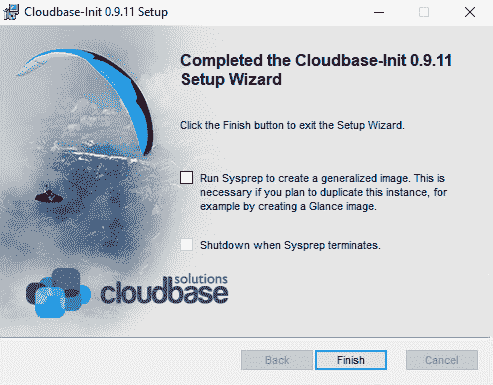
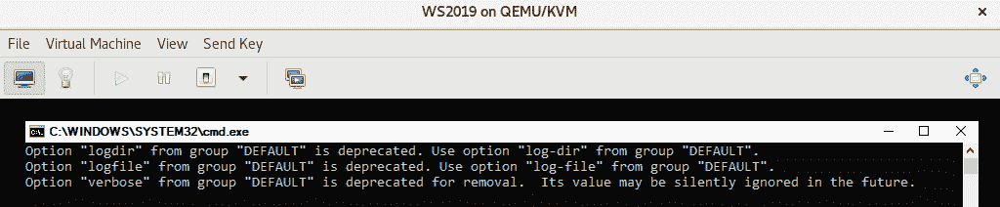
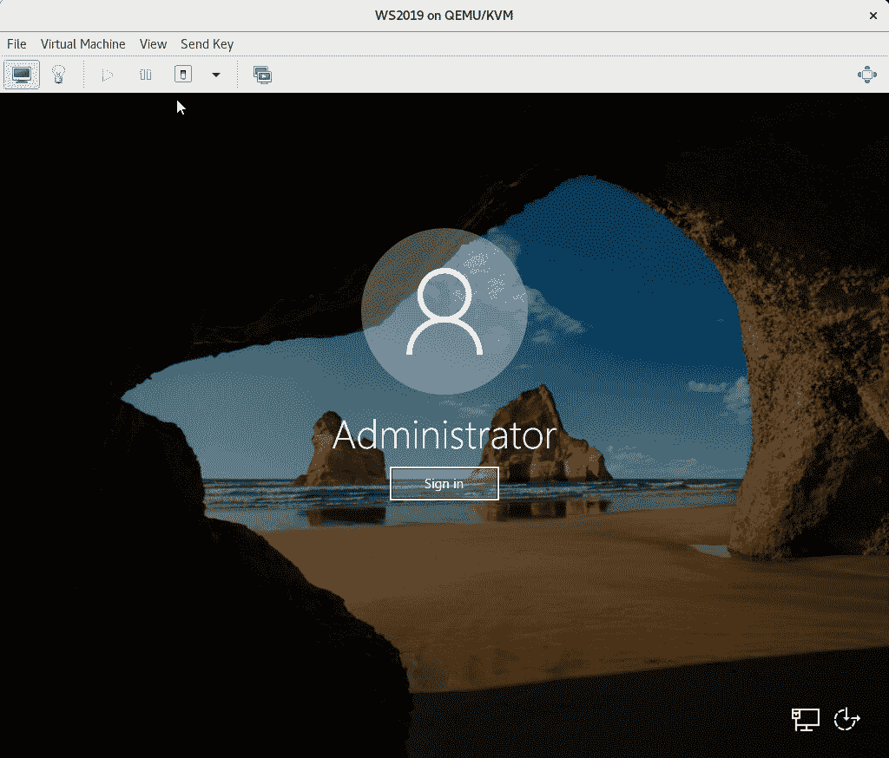
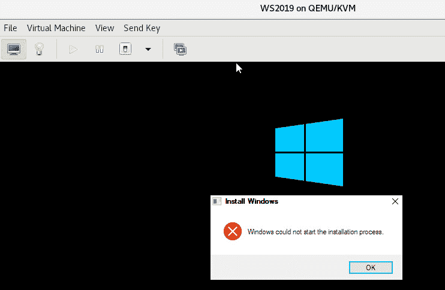

# 十、自动化 Windows 访客部署和自定义

既然我们已经介绍了在 KVM 中部署基于 Linux 的**虚拟机**(**VM**)的不同方法，现在是将我们的重点转向 Microsoft Windows 的时候了。 具体地说，我们将在 KVM 上运行的 Windows Server 2019 计算机上工作，并介绍部署和自定义 Windows Server 2019 VM 的前提条件和不同场景。 本书不是基于**虚拟桌面基础架构**(**VDI**)和桌面操作系统的概念，它们需要与虚拟化服务器操作系统完全不同的场景、方法和技术实现。

在本章中，我们将介绍以下主题：

*   在 KVM 上创建 Windows 虚拟机的前提条件
*   使用`virt-install`实用程序创建 Windows 虚拟机
*   使用`cloudbase-init`自定义 Windows 虚拟机
*   `cloudbase-init`自定义示例
*   常见`cloudbase-init`自定义问题疑难解答

# 在 KVM 上创建 Windows 虚拟机的前提条件

当开始在 KVM 虚拟化上安装访客操作系统时，我们总是有相同的起点。 我们需要以下任一项：

*   包含操作系统安装的 ISO 文件
*   具有 VM 模板的映像
*   要克隆和重新配置的现有虚拟机

让我们从头开始吧。 在本章中，我们将创建一个 Windows Server 2019 虚拟机。 选择版本是为了与市场上最新发布的微软服务器操作系统保持联系。 我们的目标是部署 Windows Server 2019 VM 模板，以便稍后用于更多部署和`cloudbase-init`，此安装过程的首选工具是`virt-install`。 如果您需要安装较旧版本(2016 或 2012)，您需要了解两个事实：

*   它们开箱即可在 CentOS 8 上获得支持。
*   安装过程与我们的 Windows Server 2019 虚拟机相同。

如果要使用 Virtual Machine Manager 部署 Windows Server 2019，请确保正确配置虚拟机。 这包括为访客操作系统安装选择正确的 ISO 文件，并为`virtio-win`驱动程序连接另一个虚拟 CD-ROM，以便您可以在安装过程中安装它们。 确保您的 VM 在本地 KVM 主机上有足够的磁盘空间(建议使用 60 GB 以上)，并且它有足够的马力来运行。 从两个虚拟 CPU 和 4 GB 内存开始，因为以后可以很容易地更改这一点。

在我们的场景中，下一步是创建一个 Windows VM，我们将在本章中使用它通过`cloudbase-init`进行自定义。 在真实的生产环境中，我们需要在其中进行尽可能多的配置-驱动程序安装、Windows 更新、常用应用等等。 所以，让我们先做这件事。

# 使用 virt-install 实用程序创建 Windows 虚拟机

我们需要做的第一件事是确保已经准备好安装`virtio-win`驱动程序-如果没有安装驱动程序，虚拟机将无法正常工作。 因此，让我们首先安装该程序包和`libguestfs`程序包，以防您的服务器上尚未安装它们：

```sh
yum –y install virtio-win libguestfs*
```

然后，就可以开始部署我们的 VM 了。 以下是我们的设置：

*   Windows Server 2019 ISO 位于`/iso/windows-server-2019.iso`。
*   `virtio-win`ISO 文件位于默认系统文件夹`/usr/share/virtio-win/virtio-win.iso`中。
*   我们将在默认系统文件夹`/var/lib/libvirt/images`中创建一个 60 GB 的虚拟磁盘。

现在，让我们开始安装过程：

```sh
virt-install --name WS2019 --memory=4096 --vcpus 2 --cpu host --video qxl --features=hyperv_relaxed=on,hyperv_spinlocks=on,hyperv_vapic=on --clock hypervclock_present=yes --disk /var/lib/libviimg/WS2019.qcow2,format=qcow2,bus=virtio,cache=none,size=60 --cdrom /iso/windows-server-2019.iso --disk /usr/share/virtio-win/virtio-win.iso,device=cdrom --vnc --os-type=windows --os-variant=win2k19 --accelerate --noapic 
```

当安装过程开始时，我们必须单击几次**下一步**，然后才能进入配置屏幕，在该屏幕中我们可以选择要安装访客操作系统的磁盘。 在屏幕左侧的底部，有一个名为**Load Driver**的按钮，我们现在可以重复使用它来安装所有必要的`virtio-win`驱动程序。 确保取消选中**隐藏与此计算机硬件不兼容的驱动程序**复选框。 然后，从指定的目录中逐个添加以下驱动程序，并用鼠标选择：

*   `AMD64\2k19`：**Red Hat VirtIO SCSI 控制器**。
*   `Balloon\2k19\amd64`：**VirtIO 气球驱动程序**。
*   `NetKVM\2k19\AMD64`：**Red Hat VirtIO 以太网适配器**。
*   `qemufwcfg\2k19\amd64`：**QEMU FWCfg 设备**。
*   `qemupciserial\2k19\amd64`：**QEMU 串行 PCI 卡**。
*   `vioinput\2k19\amd64`：**VirtIO Input Driver**和**VirtIO Input Driver Helper**；选择这两个选项。
*   `viorng\2k19\amd64`：**VirtIO RNG 设备**。
*   `vioscsi\2k19\amd64`：**Red Hat VirtIO SCSI 直通控制器**。
*   Колибрипрограмметсяпрограммированияпрограммется.
*   `viostor\2k19\amd64`：**Red Hat VirtIO SCSI 控制器**。

之后，单击**下一步**，等待安装过程完成。

您可能会问自己：*为什么我们在安装过程这么早就对此进行微观管理，而我们本可以在以后执行此操作？*答案是双重的-如果我们稍后执行此操作，我们将会遇到以下问题：

*   有个机会--至少对于某些操作系统--在安装开始之前，我们无法加载所有必要的驱动程序，这可能意味着安装将崩溃。
*   我们在**设备管理器**中会有大量的黄色感叹号，这通常会让人感到厌烦。

按照部署后的情况，我们的设备管理器很满意，安装也很成功：


图 10.1-从一开始就安装操作系统和所有驱动程序

唯一强烈推荐的安装后配置是在引导 VM 之后从`virtio-win.iso`安装访客代理。 您将在虚拟 CD-ROM 的`guest-agent`目录中找到一个`.exe`文件，您只需单击**下一步**按钮，直到安装完成。

现在我们的 VM 已经准备好了，我们需要开始考虑定制。 具体地说，大规模定制，这是云中 VM 部署的正常使用模式。 这就是为什么我们需要使用`cloudbase-init`，这是我们的下一步。

# 使用 cloudbase-init 自定义 Windows 虚拟机

如果您有机会了解[*第 9 章*](09.html#_idTextAnchor165)，*使用 cloud-init 自定义虚拟机*，我们讨论了一个名为`cloud-init`的工具。 我们将其用于客户操作系统定制，特别是针对 Linux 机器。 `cloud-init`在基于 Linux 的环境中大量使用，特别是在基于 Linux 的云中，用于执行云 VM 的初始化和配置。

`cloudbase-init`背后的理念是相同的，但它是针对 Windows 客户操作系统的。 它的基本服务在我们引导 Windows 客户操作系统实例时启动，并读取配置信息并对其进行配置/初始化。 在本章的稍后部分，我们将展示几个`cloudbase-init`操作的示例。

`cloudbase-init`能做什么？ 特性列表相当长，因为`cloudbase-init`的核心是模块化方法，所以它提供了许多插件和解释器，可以用来扩展其覆盖范围：

*   它可以执行自定义命令和脚本，这些命令和脚本通常是用 PowerShell 编写的，不过也支持常规的 CMD 脚本。
*   它可以与 PowerShell 远程处理和**Windows 远程管理**(**WinRM**)服务一起使用。
*   它可以管理和配置磁盘，例如进行卷扩展。
*   It can do basic administration, including the following:

    A)创建用户和密码

    B)设置主机名

    C)配置静态网络

    D)配置 MTU 大小

    E)分配许可证

    F)使用公钥

    G)同步时钟

我们之前提到过，我们的 Windows Server 2019 虚拟机将用于`cloudbase-init`定制，因此这是我们的下一个主题。 让我们为`cloudbase-init`准备好我们的 VM。 我们将通过下载并安装`cloudbase-init`安装程序来实现这一点。 我们可以通过将互联网浏览器指向[https://cloudbase-init.readthedocs.io/en/latest/intro.html#download](https://cloudbase-init.readthedocs.io/en/latest/intro.html#download)来找到`cloudbase-init`安装程序。 安装非常简单，它可以以常规的图形用户界面方式和静默方式工作。 如果您习惯于使用 Windows Server Core 或首选静默安装，您可以使用以下命令使用 MSI 安装程序进行静默安装：

```sh
msiexec /i CloudbaseInitSetup.msi /qn /l*v log.txt
```

请确保查看`cloudbase-init`文档以了解更多配置选项，因为安装程序支持其他运行时选项。 它位于[https://cloudbase-init.readthedocs.io/en/latest/](https://cloudbase-init.readthedocs.io/en/latest/)。

让我们继续使用 GUI 安装程序，因为它使用起来更简单，特别是对于初次使用的用户。 首先，安装程序将询问许可协议和安装位置--只是一些常见的问题。 然后，我们将看到以下选项屏幕：


图 10.2-基本配置屏幕

它要求我们做的是授予创建`cloudbase-init`配置文件(包括`cloudbase-init-unattend.conf`和`cloudbase-init.conf`)的权限，同时考虑到这个特定的未来用户。 此用户将是本地`Administrators`组的成员，并将在我们开始使用新映像时用于登录。 这将反映在我们的两个配置文件中，所以如果我们在这里选择`Admin`，那就是要创建的用户。 它还询问我们是否希望将`cloudbase-init`服务作为`LocalSystem`服务运行，我们选择该服务是为了简化整个过程。 原因非常简单--这是我们可以为我们的`cloudbase-init`服务提供的最高级别的权限，以便它们可以执行它的操作。 翻译：然后，`cloudbase-init`服务将作为`LocalSystem`服务帐户运行，该帐户可以无限制地访问所有本地系统资源。

最后一个配置屏幕将询问我们如何运行 sysprep。 通常，我们在这里不选中**run sysprep 来创建通用映像**框，因为我们首先需要创建一个`cloudbase-init`定制文件，然后运行 sysprep。 因此，请让以下窗口保持打开状态：



图 10.3-cloudbase-init 安装向导完成

现在已经安装并配置了服务`cloudbase-init`服务，让我们创建一个定制文件，该文件将使用`cloudbase-init`配置此 VM。 同样，确保此配置屏幕保持打开状态(具有已完成的设置向导)，以便我们可以在完成创建`cloudbase-init`配置时轻松启动整个过程。

# cloudbase-init 定制示例

完成安装过程后，将在我们的安装位置创建一个包含一组文件的目录。 例如，在我们的 VM 中，创建了一个名为`c:\Program Files\Cloudbase Solutions\Cloudbase-init\`的目录，它具有以下子目录集：

*   `bin`：一些二进制文件的安装位置，如`elevate`、`bsdtar`、`mcopy`、`mdir`等。
*   `conf`：我们将使用的三个主要配置文件的位置，这将在稍后讨论。
*   `LocalScripts`：我们希望在引导后运行的 PowerShell 和类似脚本的默认位置。
*   `Log`：默认情况下我们将存储`cloudbase-init`日志文件的位置，以便我们可以调试任何问题。
*   `Python`：部署 Python 本地安装的位置，以便我们也可以使用 Python 编写脚本。

我们来关注一下`conf`目录，它包含我们的配置文件：

*   `cloudbase-init.conf`
*   `cloudbase-init-unattend.conf`
*   `unattend.xml`

`cloudbase-init`的工作方式相当简单-它在 Windows sysprep 阶段使用`unattend.xml`文件通过`cloudbase-init-unattend.conf`配置文件执行`cloudbase-init`。 默认的`cloudbase-init-unattend.conf`配置文件易于阅读，我们可以使用`cloudbase-init`项目提供的示例，逐步解释默认配置文件：

```sh
[DEFAULT]
# Name of the user that will get created, group for that user
username=Admin
groups=Administrators
firstlogonbehaviour=no
inject_user_password=true  # Use password from the metadata (not random).
```

配置文件的下一部分是关于设备的-具体地说，检查哪些设备可能存在配置驱动器(元数据)：

```sh
config_drive_raw_hhd=true
config_drive_cdrom=true
# Path to tar implementation from Ubuntu.
bsdtar_path=C:\Program Files\Cloudbase Solutions\Cloudbase-Init\bin\bsdtar.exe
mtools_path= C:\Program Files\Cloudbase Solutions\Cloudbase-Init\bin\
```

我们还需要配置一些用于日志记录的设置：

```sh
# Logging level
verbose=true
debug=true
# Where to store logs
logdir=C:\Program Files (x86)\Cloudbase Solutions\Cloudbase-Init\log\
logfile=cloudbase-init-unattend.log
default_log_levels=comtypes=INFO,suds=INFO,iso8601=WARN
logging_serial_port_settings=
```

配置文件的下一部分是关于网络的，因此我们将使用 DHCP 来获取示例中的所有网络设置：

```sh
# Use DHCP to get all network and NTP settings
mtu_use_dhcp_config=true
ntp_use_dhcp_config=true
```

我们需要配置脚本驻留的位置，这些脚本与我们可以用作`cloudbase-init`过程一部分的脚本相同：

```sh
# Location of scripts to be started during the process
local_scripts_path=C:\Program Files\Cloudbase Solutions\Cloudbase-Init\LocalScripts\
```

配置文件的最后一部分是关于要加载的服务和插件，以及一些全局设置，例如是否允许`cloudbase-init`服务重新启动系统，以及我们将如何处理`cloudbase-init`关闭过程(`false=graceful service shutdown`)：

```sh
# Services for loading
metadata_services=cloudbaseinit.metadata.services.configdrive.ConfigDriveService, cloudbaseinit.metadata.services.httpservice.HttpService,
cloudbaseinit.metadata.services.ec2service.EC2Service,
cloudbaseinit.metadata.services.maasservice.MaaSHttpService
# Plugins to load
plugins=cloudbaseinit.plugins.common.mtu.MTUPlugin,
        cloudbaseinit.plugins.common.sethostname.SetHostNamePlugin
# Miscellaneous.
allow_reboot=false    # allow the service to reboot the system
stop_service_on_exit=false
```

我们先从一开始就解决几件事吧。 默认配置文件已经包含一些已弃用的设置，因为您很快就会发现这一点。 具体地说，本版本中已经弃用了`verbose`、`logdir`和`logfile`等设置，您可以从下面的屏幕截图中看到，其中`cloudbase-init`抱怨的正是这些选项：



图 10.4-cloudbase-init 抱怨自己的默认配置文件选项

如果我们希望通过使用默认配置文件使用`cloudbase-init`启动 sysprep，我们实际上将获得一个配置得相当好的 VM-它将被 sysprep，它将重置管理员密码，并要求我们在第一次登录时更改它，并删除现有的管理员用户及其目录。 因此，在执行此操作之前，我们需要确保将所有管理员用户设置和数据(文档、安装程序、下载等)保存在安全的位置。 此外，默认配置文件在默认情况下不会重新启动虚拟机，这可能会让您感到困惑。 我们需要手动重新启动虚拟机，以便可以启动整个过程。

同时使用`cloud-init`和`cloudbase-init`的最简单方法是写下在 VM 完成初始化过程时需要对其执行哪些操作的场景。 因此，我们将执行此操作-选择我们希望配置的大量设置，并相应地创建自定义文件。 以下是我们的设置：

*   我们希望 VM 在 sysprep 之后和`cloudbase-init`过程之后要求我们更改密码。
*   我们希望我们的 VM 从 DHCP 获取其所有网络设置(IP 地址、网络掩码、网关、DNS 服务器和 NTP)。
*   我们希望 sysprep 虚拟机，以便它对每个场景和策略都是唯一的。

因此，让我们创建一个`cloudbase-init-unattend.conf`配置文件，它将为我们完成此任务。 配置文件的第一部分取自默认配置文件：

```sh
[DEFAULT]
username=Admin
groups=Administrators
inject_user_password=true
config_drive_raw_hhd=true
config_drive_cdrom=true
config_drive_vfat=true
bsdtar_path=C:\Program Files\Cloudbase Solutions\Cloudbase-Init\bin\bsdtar.exe
mtools_path= C:\Program Files\Cloudbase Solutions\Cloudbase-Init\bin\
debug=true
default_log_levels=comtypes=INFO,suds=INFO,iso8601=WARN
logging_serial_port_settings=
mtu_use_dhcp_config=true
ntp_use_dhcp_config=true
```

当我们决定使用 PowerShell 进行所有脚本编写时，我们为 PowerShell 脚本创建了一个单独的目录：

```sh
local_scripts_path=C:\PS1
```

该文件的其余部分也是从默认配置文件复制的：

```sh
metadata_services=cloudbaseinit.metadata.services.base.EmptyMetadataService
plugins=cloudbaseinit.plugins.common.mtu.MTUPlugin,
        cloudbaseinit.plugins.common.sethostname.SetHostNamePlugin, cloudbaseinit.plugins.common.localscripts.LocalScriptsPlugin,cloudbaseinit.plugins.common.userdata.UserDataPlugin
allow_reboot=false    
stop_service_on_exit=false
```

对于`cloudbase-init.conf`文件，我们所做的唯一更改是选择了正确的本地脚本路径(原因稍后会提到)，因为我们将在下一个示例中使用此路径：

```sh
[DEFAULT]
username=Admin
groups=Administrators
inject_user_password=true
config_drive_raw_hhd=true
config_drive_cdrom=true
config_drive_vfat=true
```

此外，我们的默认配置文件的一部分包含用于`tar`、`mtools`和调试的路径：

```sh
bsdtar_path=C:\Program Files\Cloudbase Solutions\Cloudbase-Init\bin\bsdtar.exe
mtools_path= C:\Program Files\Cloudbase Solutions\Cloudbase-Init\bin\
debug=true
```

配置文件的这一部分也取自默认配置文件，我们只更改了`local_scripts_path`，以便将其设置为我们用来填充 PowerShell 脚本的目录：

```sh
first_logon_behaviour=no
default_log_levels=comtypes=INFO,suds=INFO,iso8601=WARN
logging_serial_port_settings=
mtu_use_dhcp_config=true
ntp_use_dhcp_config=true
local_scripts_path=C:\PS1
```

然后，我们可以返回到`cloudbase-init`安装屏幕，选中 sysprep 选项，然后单击**Finish**。 在启动 sysprep 进程并完成它之后，这是最终的结果：



图 10.5-当我们按下登录时，我们将被要求更改管理员的密码

现在，让我们更进一步，把事情复杂化一点。 假设您想要执行相同的过程，但是需要额外的 PowerShell 代码来执行一些额外的配置。 请考虑以下示例：

*   它应该创建另外两个名为`packt1`和`packt2`的本地用户，并将预定义密码设置为`Pa$$w0rd`。
*   它应该创建一个名为`students`的新本地组，并将`packt1`和`packt2`作为成员添加到该组。
*   它应该将主机名设置为`Server1`。

使我们能够做到这一点的 PowerShell 代码应该包含以下内容：

```sh
Set-ExecutionPolicy -ExecutionPolicy Unrestricted -Force
$password = "Pa$$w0rd" | ConvertTo-SecureString -AsPlainText -Force
New-LocalUser -name "packt1" -Password $password
New-LocalUser -name "packt2" -Password $password
New-LocalGroup -name "Students"
Add-LocalGroupMember -group "Students" -Member "packt1","packt2"
Rename-Computer -NewName "Server1" -Restart
```

看一下脚本本身，它的功能如下所示：

*   将 PowerShell 执行策略设置为无限制，以便宿主不会停止脚本执行(默认情况下会停止)。
*   从明文字符串(`Pa$$w0rd`)创建密码变量，该变量将转换为可与`New-LocalUser`PowerShell cmdlet 一起使用以创建本地用户的安全字符串。
*   `New-LocalUser`是创建本地用户的 PowerShell cmdlet。 必选参数包括用户名和密码，这就是我们创建安全字符串的原因。
*   `New-LocalGroup`是创建本地组的 PowerShell cmdlet。
*   `Add-LocalGroupMember`是一个 PowerShell cmdlet，允许我们创建新的本地组并向其中添加成员。
*   `Rename-Computer`是更改 Windows 计算机主机名的 PowerShell cmdlet。

我们还需要以某种方式从`cloudbase-init`调用此代码，因此需要将此代码添加为脚本。 最常见的情况是，我们将使用`cloudbase-init`安装文件夹中名为`LocalScripts`的目录。 让我们调用此脚本`userdata.ps1`，将前面提到的内容保存到文件夹中，如`.conf`文件(`c:\PS1`)中所定义，并在文件顶部添加一个`cloudbase-init`参数：

```sh
# ps1
$password = "Pa$$w0rd" | ConvertTo-SecureString -AsPlainText -Force
New-LocalUser -name "packt1" -Password $password
New-LocalUser -name "packt2" -Password $password
New-LocalGroup -name "Students"
Add-LocalGroupMember -group "Students" -Member "packt1","packt2"
Rename-Computer -NewName "Server1" –Restart
```

再次启动`cloudbase-init`过程(可以通过启动`cloudbase-init`安装向导并像我们在上一个示例中那样完成该过程)之后，以下是关于用户的最终结果：


图 10.6-创建了 Packt1 和 Packt2 用户，并将其添加到 PowerShell 脚本创建的组中

我们可以清楚地看到创建了`packt1`和`packt2`用户，以及一个名为`Students`的组。 然后我们可以看到`Students`组有两个成员-`packt1`和`packt2`。 另外，在设置服务器名称方面，我们有以下几个方面：


图 10.7-Slika 1.也可以通过 PowerShell 脚本更改服务器名称

使用`cloudbase-init`确实不简单，在时间和修补方面需要一些投资。 但之后，这将使我们的工作变得容易得多--不再被迫一遍又一遍地做这样的徒步任务应该是一种足够的奖励，这就是为什么我们需要稍微谈一谈故障排除的原因。 我们确信，当您提高`cloudbase-init`的使用率时，您会遇到这些问题。

# 排除常见的 cloudbase-init 自定义问题

坦率地说，您可以坦率地说，`cloudbase-init`文档并没有那么好。 寻找如何执行 PowerShell 或 Python 代码的示例充其量也是困难的，而官方页面在这方面实际上并没有提供任何帮助。 因此，让我们讨论一下在使用`cloudbase-init`时发生的一些最常见的错误。

尽管这似乎有违直觉，但我们让`cloudbase-init`使用最新的开发版本而不是最新的稳定版本要成功得多。 我们不确定问题出在哪里，但最新的开发版本(在撰写本文时，这是版本 0.9.12.dev125)一开始就为我们工作。 在 0.9.11 版本中，我们甚至在启动 PowerShell 脚本时都遇到了很大的问题。

除了这些问题，当你了解`cloudbase-init`的时候，你肯定还会遇到其他问题。 第一个是重启循环。 这个问题真的很常见，而且几乎总是因为两个原因而发生：

*   配置文件中的错误-模块或选项的错误名称，或类似的东西
*   作为要在`cloudbase-init`进程中执行的外部脚本调用的某些外部文件(位置或语法)中存在错误

在配置文件中出错是经常发生的事情，它会使`cloudbase-init`进入一种奇怪的状态，结果如下：



图 10.8？配置错误

这种情况我们已经见过很多次了。 真正的问题是，有时需要数小时的等待，有时需要多次重启，但这不仅仅是常规的重启循环。 看起来`cloudbase-init`真的在做一些事情-CMD 启动了，你在里面或屏幕上都没有看到错误，但它一直在做一些事情，然后就像这样结束了。

您可能会遇到的其他问题甚至更加棘手-例如，当`cloudbase-init`在 sysprep/`cloudbase-init`过程中重置密码失败时。 如果您手动更改`cloudbase-init`服务正在使用的帐户密码，就会发生这种情况(因此，为什么使用`LocalSystem`更好)。 这将导致整个`cloudbase-init`过程失败，其中一部分可能是重置密码失败。

发生这种情况还有一个更加模糊的原因--有时我们使用`services.msc`控制台手动管理系统服务，并故意禁用我们不能立即识别的服务。 如果您将`cloudbase-init`服务设置为禁用，它的处理过程也会失败。 这些服务需要具有自动启动优先级，不应手动重新配置为禁用。

由于某些安全策略(例如，如果密码不够复杂)，重置密码失败也可能发生。 这就是为什么我们在 PowerShell 脚本中使用了更复杂的密码，因为我们大多数系统工程师很久以前就学到了这一点。

此外，有时公司有不同的安全策略，这可能会导致某些负责管理`cloudbase-init`服务的管理应用(例如软件清单)停止或完全卸载该服务。

我们能遇到的最令人沮丧的错误是`cloudbase-init`进程没有从其指定的文件夹启动脚本。 在花费数小时完善需要添加到定制过程中的 Python、`bash`、cmd 或 PowerShell 脚本之后，看到这种情况总是令人抓狂。 为了能够使用这些脚本，我们需要使用能够调用并执行外部脚本的特定插件。 这就是为什么我们通常使用`UserDataPlugin`--无论是出于执行还是调试的原因--因为它可以执行所有这些脚本类型，并给出一个错误值，然后我们可以将其用于调试目的。

最后一件事-确保您没有将 PowerShell 代码直接插入到`conf`文件夹中的`cloudbase-init`配置文件中。 您只会得到一个重启循环作为奖励，所以要小心。

# 摘要

在本章中，我们讨论了 Windows 虚拟机定制，这一主题与 Linux 虚拟机定制同等重要。 也许更重要的是，要记住市场份额数据以及很多人在云环境中使用 Windows 的事实。

既然我们已经涵盖了使用 VM、模板和定制方面的所有基础，现在是时候引入一种不同的方法来进行额外的定制了，该方法是对`cloud-init`和`cloudbase-init`的补充。 因此，下一章是关于这种方法的，它是基于 Ansible 的。

# 问题

1.  我们需要在 Windows 访客操作系统上安装哪些驱动程序，才能在 KVM 虚拟机管理器上创建 Windows 模板？
2.  我们需要在 Windows 访客操作系统上安装哪个代理才能更好地查看虚拟机的性能数据？
3.  什么是 sysprep？
4.  `cloudbase-init`是用来做什么的？
5.  `cloudbase-init`的常规用例有哪些？

# 进一步阅读

有关详细信息，请参阅以下链接：

*   微软`LocalSystem`客户文档：[https://docs.microsoft.com/en-us/windows/win32/ad/the-localsystem-account](https://docs.microsoft.com/en-us/windows/win32/ad/the-localsystem-account)
*   `cloudbase-init`文档：[https：//cloudbase-init.readthedocs.io/en/Latest/Intro.html](https://cloudbase-init.readthedocs.io/en/latest/intro.html)
*   `cloudbase-init`插件文档：[https://cloudbase-init.readthedocs.io/en/latest/plugins.html](https://cloudbase-init.readthedocs.io/en/latest/plugins.html)
*   `cloudbase-init`服务文档：[https：//cloudbase-init.readthedocs.io/en/Latest/services.html](https://cloudbase-init.readthedocs.io/en/latest/services.html)