# 十四、监控 KVM 虚拟化平台

当您从一个只有几个对象要管理的环境(例如，KVM 主机)迁移到一个有数百个对象要管理的环境时，您会开始问自己非常重要的问题。 最突出的问题之一是，*我如何在不做大量手动工作和使用一些 GUI 报告选项的情况下监视我的数百个对象呢？*这个问题的答案是**Elasticsearch，Logstash，Kibana**(**ELK**)堆栈(**Elasticsearch，Logstash，Kibana**(**ELK**))。 在本章中，我们将了解这些软件解决方案可以为您和您的基于 KVM 的环境做些什么。

在这些隐晦的名称背后，有一些技术可以解决您在运行多台服务器时可能遇到的许多问题。 尽管您可以运行 ELK 堆栈来监视一个服务，但这样做毫无意义。 本章中提供的建议和解决方案适用于涉及多个设备和服务器的所有项目，不仅适用于在 KVM 上运行的项目，而且本质上也适用于任何能够生成任何类型日志的项目。 我们将从一般情况下如何将 KVM 作为虚拟化平台进行监控的基础知识开始。 然后，我们将讨论 ELK 堆栈，包括它的构建块和安装，然后再讨论它的高级配置和定制。

在本章中，我们将介绍以下主题：

*   监控 KVM 虚拟化平台
*   开源 ELK 解决方案简介
*   设置和集成麋鹿堆栈
*   配置数据收集器和聚合器
*   创建自定义利用率报告
*   我们开始吧!

# 监控 KVM 虚拟化平台

当我们谈到运行执行任何类型处理的系统时，我们很快就会遇到监控并确保我们的系统在给定的参数集内运行的问题。

当我们创建一个运行工作负载的系统时，它将不可避免地产生关于正在发生的一切的某种数据。 这些数据在其范围内几乎是无限的--一台刚刚联机的服务器，如果没有一个*有用的*任务运行，它将创建某种类型的日志或服务数据，例如已使用的内存量、正在启动或停止的服务、剩余的磁盘空间量、正在连接和断开连接的设备等等。

当我们开始运行任何有用的任务时，日志只会变得更大。

拥有一个良好而详细的日志意味着我们可以发现系统在这个时刻发生了什么；它是否正确运行，我们是否需要做些什么来使它运行得更好？ 如果发生了意想不到的事情，日志可以帮助我们确定实际问题所在，并为我们指明解决方案的方向。 正确配置的日志甚至可以帮助我们在错误开始产生问题之前发现错误。

假设您有一个一周又一周变得越来越慢的系统。 让我们进一步假设我们的问题与系统上安装的应用的内存分配有关。 但我们也假设这个内存分配不是恒定的，而是随着使用系统的用户数而变化。 如果您查看任意时间点，您可能会注意到分配的用户数和内存。 但是，如果您只是在不同的时间进行测量，您将很难理解内存和用户数量之间存在什么样的相关性--分配的内存量是与用户数量成线性关系，还是呈指数关系呢？ 如果我们看到 100 个用户正在使用 100MB 的内存，这是否意味着 1000 个用户将使用 1000MB？

但让我们假设我们以相等的间隔记录内存量和用户数。

我们没有做任何复杂的事情；每隔几秒钟，我们就记录下测量的时间、分配的内存量和使用系统的用户数。 我们正在创建一个称为数据集的东西，它由**个数据点**组成。 使用数据点与我们在前面的示例中所做的没有什么不同，但是一旦我们有了数据集，我们就可以进行趋势分析。 基本上，我们可以分析不同的时间段，比较用户数量和他们实际使用的内存量，而不是查看问题的一小部分。 这将为我们提供有关系统实际如何使用内存以及在什么时候出现问题(即使我们现在没有问题)的重要信息。

这种方法甚至可以帮助我们发现和解决不明显的问题，例如备份每月完成一次花费的时间太长，其余时间正常工作。 这种能力使我们能够发现趋势并分析数据和系统性能，这就是日志记录的全部意义所在。

简而言之，任何一种监控都可以归结为两件事：从我们试图监控的事物收集数据和分析这些数据。

监控可以是在线的，也可以是离线的。 当我们试图创建某种警报系统时，或者当我们试图建立能够对过程中的变化做出反应的自我纠正系统时，在线监控非常有用。 然后，我们可以尝试纠正问题，或者关闭或重新启动系统。 运营团队通常使用在线监控，以确保一切正常运行，并记录系统可能出现的问题。

离线监控要复杂得多。 离线监控使我们能够将所有数据收集到日志中，稍后分析这些日志，并推断趋势，找出可以对系统做些什么以使其变得更好。 但事实是，就实时活动而言，它总是*延迟*，因为离线方法要求我们*下载*，然后*分析*日志。 这就是为什么我们更喜欢实时日志摄取，这是需要在线完成的事情。 这就是为什么了解麋鹿堆栈是如此重要的原因。

通过将所有这些小块--实时日志摄取、搜索、分析和报告--整合到一个较大的堆栈中，ELK 使我们更容易实时监控我们的环境。 让我们来学习一下怎么做。

# 开源 ELK 解决方案简介

我们在前面提到过，ELK 代表 Elasticsearch、Logstash 和 Kibana，因为这三个应用或系统是完整监控和报告解决方案的构建块。 每个部分都有自己的用途和执行的功能-Logstash 将所有数据收集到一个一致的数据库中，Elasticsearch 能够快速浏览 Logstash 存储的所有数据，Kibana 在这里将搜索结果转变为既有信息又有视觉吸引力的东西。 说了这么多，麋鹿最近改名了。 尽管它仍然被称为 Elk Stack(麋鹿堆栈)，几乎整个互联网都会这样称呼它，但是 Elk 堆栈现在被命名为 Elastic Stack(弹性堆栈)，唯一的原因是，在撰写本文时，该堆栈中还包括第四个组件。 这个组件被称为 Beats，它代表着对整个系统的重大添加。

但让我们从头开始，试着用它的创造者描述它的方式来描述整个系统。

## 弹性搜索

创建并在社区获得支持的第一个组件是 Elasticsearch，它被创建为一个灵活的、可伸缩的系统，用于索引和搜索大型数据集。 ElasticSearch 用于数千种不同的目的，包括在文档、网站或日志中搜索特定内容。 它的主要卖点和很多人开始使用它的原因是它既灵活又可伸缩，同时速度极快。

当我们想到搜索时，通常会想到创建某种查询，然后等待数据库返回某种形式的答案。 在复杂的搜索中，问题通常是等待，因为必须调整我们的查询并等待它们产生结果，这让人精疲力竭。 由于许多现代数据科学依赖于非结构化数据的概念，这意味着我们需要搜索的许多数据没有固定的结构，或者根本没有结构，因此在这个数据池中创建一种快速搜索的方法是一个棘手的问题。

想象一下，你需要在图书馆里找到一本特定的书。 此外，假设您没有普通图书馆拥有的所有图书、作者、出版信息和其他所有内容的数据库；您只能搜索所有图书本身。

是否有一个工具能够识别这些书籍中的模式，并且可以告诉您诸如*谁写了这本书之类的问题的答案？*或*所有超过 200 页的书籍中有多少次提到 KVM？*是一件非常有用的事情。 这就是一个好的搜索解决方案所做的。

如果我们想要快速高效地管理一个或多个物理和虚拟服务器的群集，则能够搜索运行 Apache Web 服务器且特定 IP 地址请求的特定页面出现问题的计算机是必不可少的。

当我们监控单个数据点(例如跨数百台主机的内存分配)时，系统信息也是如此。 即使展示这些数据也是一个问题，如果没有正确的工具，实时搜索几乎是不可能的。

ElasticSearch 确实做到了：它为我们创造了一种快速浏览大量几乎没有结构化的数据，然后得出有意义的结果的方法。 Elasticsearch 的不同之处在于其可伸缩性，这意味着您可以使用它在笔记本电脑上创建搜索查询，然后只需在搜索 PB 数据的多节点实例上运行这些查询即可。

ElasticSearch 也很快，这不仅仅是节省时间的事情。 通过创建和修改查询，然后了解其结果，能够更快地获取搜索结果，从而使您能够更多地了解数据。

由于这只是对 elk 实际功能的简单介绍，我们将切换到下一个组件 Logstash，稍后再回来搜索。

## Logstash

Logstash 的目的很简单。 它设计为能够消化生成数据的任意个日志和事件，并存储它们以备将来使用。 存储后，它可以将它们以多种格式导出，如电子邮件、文件、HTTP 和其他格式。

关于 Logstash 的工作方式，重要的是它在接受不同输入流方面的通用性。 它并不局限于只使用日志；它甚至可以接受 Twitter 提要等内容。

## 基巴纳

旧麋鹿堆栈的最后一部分是 Kibana。 如果 Logstash 是存储，Elasticsearch 用于计算，那么 Kibana 就是输出引擎。 简而言之，Kibana 是一种使用 Elasticsearch 查询结果来创建视觉上令人印象深刻且高度可定制的布局的方法。 尽管 Kibana 的输出通常是某种仪表板，但它的输出可以是很多东西，这取决于用户创建新布局和可视化数据的能力。 话虽如此，不要害怕--互联网为几乎所有可以想象到的情景提供了至少部分(如果不是全部)解决方案。

接下来，我们要做的是完成 ELK 堆栈的基本安装，展示它的功能，为您指明正确的方向，并演示最流行的*节拍*-**节拍**。

在许多方面，使用 ELK 堆栈与*运行*服务器相同-您需要做什么取决于您实际想要完成什么；运行 ELK 堆栈只需要几分钟，但真正的工作才从这里开始。

当然，为了充分理解 ELK 堆栈在真实环境中是如何使用的，我们需要首先部署和设置它。 我们下一步就这么做。

# 设置和集成麋鹿堆栈

值得庆幸的是，Elasticsearch 团队已经准备好了我们需要安装的几乎所有东西。 除了 Java 之外，所有的东西都在他们的站点上进行了很好的分类和记录。

您需要做的第一件事是安装 Java-elk 依赖于 Java 来运行，所以我们需要安装它。 Java 有两个不同的安装候选：来自 Oracle 的官方候选和开源 OpenJDK。 因为我们试图留在开源生态系统中，所以我们将安装 OpenJDK。 在本书中，我们使用 CentOS8 作为我们的平台，因此`yum`包管理器将被广泛使用。

让我们从必备包开始。 安装 Java 所需的唯一必备程序包是`java-11-OpenJDK-devel`程序包(用当前版本的 OpenJDK 替换“11”)。 因此，在这里，我们需要运行以下命令：

```sh
yum install java-11-openjdk-devel
```

发出该命令后，您应该会得到如下结果：


图 14.1-安装主要必备组件之一-Java

安装后，我们可以通过运行以下命令来验证安装是否成功以及 Java 是否正常工作：

```sh
java -version
```

这是个预期输出：

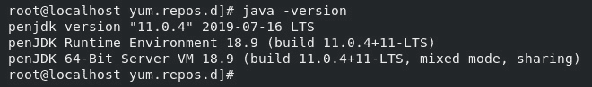

图 14.2-检查 Java 版本

输出应该是当前版本的 Java，并且没有错误。 除了验证 Java 是否正常工作之外，这一步对于验证指向 Java 的路径设置是否正确非常重要-如果您在其他一些发行版上运行，则可能需要手动设置路径。

既然 Java 已经安装好并准备就绪，我们就可以继续安装 ELK 堆栈了。 下一步是配置 Elasticsearch 和其他服务的安装源：

1.  We need to create a file in `/etc/yum.repos.d/` named `elasticsearch.repo` that will contain all the information about our repository:

    ```sh
    [Elasticsearch-7.x]
    name=Elasticsearch repository for 7.x packages
    baseurl=https://artifacts.elastic.co/packages/7.x/yum
    gpgcheck=1
    gpgkey=https://artifacts.elastic.co/GPG-KEY-Elasticsearch
    enabled=1
    autorefresh=1
    type=rpm-md
    ```

    保存文件。 这里重要的是，存储库是 GPG 签名的，所以我们需要导入它的密钥并应用它，以便在下载包时可以对其进行验证。

    您要安装的文件不是免费软件。 ElasticSearch 有两个截然不同的免费版本和付费订阅模式。 使用此存储库中的文件，您将获得基于订阅的安装，该安装将在*Basic*模式下运行，该模式是免费的。 在撰写本文时，Elastic 有四种订阅模式--一种是开源的，基于 Apache License 2.0，并且是免费的；其余的都是封闭源代码，但提供了额外的功能。 目前，这些订阅被命名为基本订阅、金牌订阅和白金订阅。 基本版是免费的，而其他型号需要按月付费订阅。

    您将不可避免地问，为什么要选择开源而不是 Basic，或者反之亦然，因为它们都是免费的。 虽然它们都有相同的核心，但 Basic 更高级，因为它提供了核心安全功能和更多在日常使用中可能很重要的东西，特别是如果你想要 Kibana 可视化的话。

2.  让我们继续安装并导入必要的 GPG 密钥：

    ```sh
    rpm --import https://artifacts.elastic.co/GPG-KEY-elasticsearch
    ```

3.  Now, we are ready to do some housekeeping on the system side and grab all the changes in the repository system:

    ```sh
    sudo yum clean all
    sudo yum makecache
    ```

    如果一切正常，我们现在可以通过运行以下命令来安装`elasticsearch`：

    ```sh
    sudo yum install elasticsearch 
    ```

    `elasticsearch`或任何其他服务都不会自动启动或启用。 我们必须为它们中的每一个手动执行此操作。 我们现在就开始吧。

4.  The procedure to start and enable services is standard and is the same for all three services:

    ```sh
    sudo systemctl daemon-reload 
    sudo systemctl enable elasticsearch.service 
    sudo systemctl start elasticsearch.service 
    sudo systemctl status elasticsearch.service 
    sudo yum install kibana
    sudo systemctl status kibana.service 
    sudo systemctl enable kibana.service 
    sudo systemctl start kibana.service 
    sudo yum install logstash
    sudo systemctl start logstash.service 
    sudo systemctl enable logstash.service 
    ```

    最后要做的是安装*BEATS*，这是通常安装在受监控服务器上的服务，可以配置为在系统上创建和发送重要指标。 我们现在就开始吧。

5.  出于本演示的目的，我们将全部安装它们，尽管我们不会全部使用它们：

    ```sh
    sudo yum install filebeat metricbeat packetbeat heartbeat-elastic auditbeat
    ```

在这之后，我们应该有一个功能系统。 让我们来快速地概述一下。

Kibana 和 Elasticsearch都作为 Web 服务在不同的端口上运行。 我们将通过 Web 浏览器(使用 URL`http://localhost:9200`和`http://localhost:5601`)与 Kibana 交互，因为可视化发生在这里：


图 14.3-检查 Elasticsearch 服务

现在，我们可以在端口`5601`上连接 to Kibana：

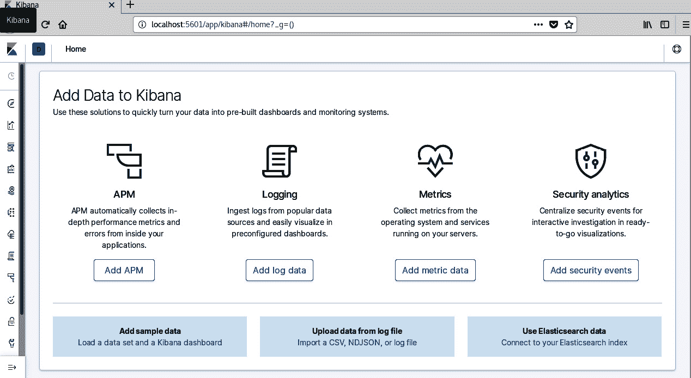

图 14.4-成功连接到 Kibana

至此，部署流程成功完成。 我们合乎逻辑的下一步应该是创建一个工作流程。 我们现在就开始吧。

## 工作流

在本节中，我们将建立一个工作流-我们将创建日志和指标，这些日志和指标将被接收到 Logstash 中，通过 Elasticsearch 进行查询，然后以 Kibana 可视化表示。

默认情况下，Kibana 在端口`5601`上运行，该端口可以在配置中更改。

但这对我意味着什么？ 这对 KVM 意味着什么？

使用弹性堆栈的最大卖点是灵活性和易用性。 无论我们在几十台 KVM 主机中运行一台、10 台还是 1,000 台机器，我们都可以在生产中对它们一视同仁，并建立稳定的监控工作流。 使用极其简单的脚本，我们可以创建完全自定义的指标并快速显示它们，我们可以观察趋势，甚至可以创建近乎实时的监控系统。 所有这一切，基本上都是免费的。

让我们创建一个简单的监视器，该监视器将转储运行 ELK 的主机系统的系统指标。 我们已经安装了 Metricbeat，所以剩下的唯一事情就是配置服务以将数据发送到 Elasticsearch。 数据被发送到 Elasticsearch，而不是 Logstash，这仅仅是因为服务互操作的方式。 可以同时发送到 Logstash 和 Elasticsearch，所以我们需要在这里做一些简单的解释。

根据定义，Logstash 是存储发送给它的数据的服务。 ElasticSearch 搜索该数据并与 Logstash 通信。 如果我们将数据发送到 Logstash，我们没有做错什么；我们只是转储数据以供以后分析。 但是发送到 Elasticsearch 给了我们另一个特性--我们不仅可以发送数据，还可以以模板的形式发送有关数据的信息。

另一方面，Logstash 能够在接收数据之后和存储数据之前立即执行数据转换，因此，如果我们需要解析 GeoIP 信息、更改主机名称等，我们可能会使用 Logstash 作为主要目的地。 记住这一点，不要设置 MetricBeat，使其同时向 Elasticsearch 和 Logstash 发送数据；您只会获得存储在数据库中的重复数据。

使用 ELK 很简单，我们不费任何力气就已经安装到这一步了。 当我们开始分析数据时，才是真正问题开始的时候。 即使是来自 MetricBeat 的简单且格式完美的数据也可能很难可视化，特别是如果我们是第一次这样做的话。 为 Elasticsearch 和 Kibana 预制模板可以节省大量时间。

请看下面的屏幕截图：


图 14.5-MetricBeat 控制面板

只需不超过 10 分钟的设置即可获得像这样的完整仪表板。 让我们一步一步地来看这个。

我们已经安装了 Metricbeat，只需要对其进行配置，但在此之前，我们需要配置 Logstash。 我们只需要定义一个*管道*。

那么，数据该如何转化呢？

到目前为止，我们还没有详细介绍 Logstash 是如何工作的，但是要创建我们的第一组数据，我们需要了解 Logstash 的一些内部工作原理。 Logstash 使用管道的概念来定义数据一旦被接收，在数据被发送到 Elasticsearch 之前会发生什么。

每条管道都有两个必需的元素和一个可选的元素：

*   输入始终是管道中的第一个，旨在从源接收数据。
*   输出是管道中的最后一个元素，它输出数据。
*   过滤器是一个可选元素，它位于输入和输出之间，以便根据我们可以定义的规则修改数据。

所有这些元素都可以从插件列表中选择，以便我们创建一个针对特定目的进行调整的最佳管道。 让我们一步一步地来看这个。

我们需要做的只是取消注释位于`/etc/logstash`文件夹中的配置文件中定义的一个管道。

整个堆栈使用 YAML 作为配置文件结构的标准，因此每个配置文件都以`.yml`扩展名结束。 这一点很重要，这样才能理解所有没有此扩展名的文件在这里作为配置的示例或某种模板；只有扩展名为`.yml`的文件才会被解析。

要配置 Logstash，只需打开`logstash.yml`并取消注释与第一个管道(称为`main`)相关的所有行。 我们不需要做其他任何事。 文件本身位于`/etc/logstash`文件夹中，在进行以下更改后应该如下所示：

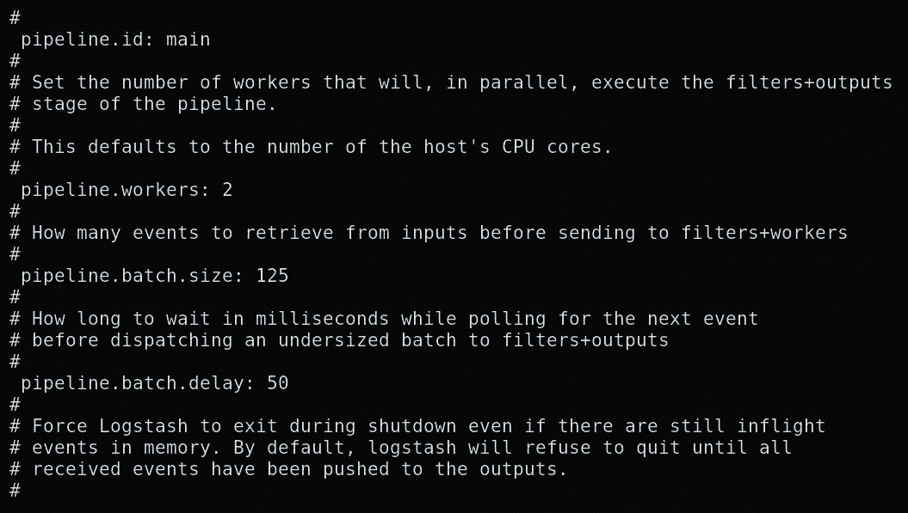

图 14.6-logstash.yml 文件

我们需要做的下一件事是配置 MetricBeat。

# 配置数据收集器和聚合器

在前面的步骤中，我们设法部署了 Metricbeat。 现在，我们需要开始实际配置。 因此，让我们一步一步地了解配置过程：

1.  Go to `/etc/metricbeat` and open `metricbeat.yml`.

    取消将`elasticsearch`定义为 MetricBeat 目标的行的注释。 现在，我们还需要改变一件事。 找到包含以下内容的行：

    ```sh
    setup.dashboards.enabled: false 
    ```

    将前面的行更改为以下内容：

    ```sh
    setup.dashboards.enabled: true
    ```

    我们需要这样做才能加载到仪表板，以便可以使用它们。

2.  The rest of the configuration is done from the command line. Metricbeat has a couple of commands that can be run, but the most important is the following one:

    ```sh
    metricbeat setup
    ```

    此命令将完成初始设置。 设置的这一部分可能是整个初始配置中最重要的部分-将仪表板模板推送到 Kibana。 这些模板将使您只需单击几下即可启动和运行，而不是学习如何进行可视化和从头开始配置。 您最终将不得不这样做，但对于本例，我们希望让事情尽可能快地运行。

3.  One more command that you need right now is the following one:

    ```sh
    metricbeat modules list
    ```

    这将为您提供 Metricbeat 已经为不同服务准备的所有模块的列表。 继续并启用其中两个选项`logstash`和`kvm`：

    ```sh
    metricbeat modules enable kvm
    metricbeat modules enable logstash
    ```

`logstash`模块的名称令人困惑，因为它不打算将数据推送到 Logstash；相反，它的主要目的是报告 Logstash 服务，并使您能够通过 Logstash 监视它。 听起来很迷惑吗？ 让我们重新表述一下：此模块使 Logstash 能够监视自身。 或者更准确地说，它使 BEATS 能够监控弹性堆栈的一部分。

KVM 模块是模板，它使您能够收集与 KVM 相关的不同指标。

应该就是这里了。 作为预防措施，键入以下命令以检查 MetricBeat 的配置：

```sh
metricbeat test config 
```

如果前面的命令运行正常，请使用以下命令启动 MetricBeat 服务：

```sh
systemctl start metricbeat 
```

现在，您已经有了一个正在运行的服务，它正在主机上收集数据-与运行 KVM 并将数据转储到 Elasticsearch 的服务相同。 这是至关重要的，因为我们将使用所有这些数据来创建可视化和仪表板。

## 在 Kibana 创建图表

现在，使用`localhost:5601`作为地址在浏览器中打开 Kibana。 屏幕左侧应该有一个基于图标的菜单。 转到**堆栈管理**并查看**Elasticsearch 索引管理**。

应该有一个名为`metricbeat-`*<somenumber>*的活动索引。 在此特定示例中，*<somenumber>*将是 metricbeat 的当前版本和日志文件中第一个条目的日期。 这完全是任意的，只是确保您知道该实例何时启动的默认设置。

在与此名称相同的行中，应该有一些数字：我们感兴趣的是文档计数-数据库保存的对象数量。 就目前而言，如果不是零，我们就没问题。

现在，转到**Dashboard**页面，并打开**MetricBeat 系统概述 ECS**仪表板。 它将显示大量表示 CPU、内存、磁盘和网络使用情况的可视化小部件：

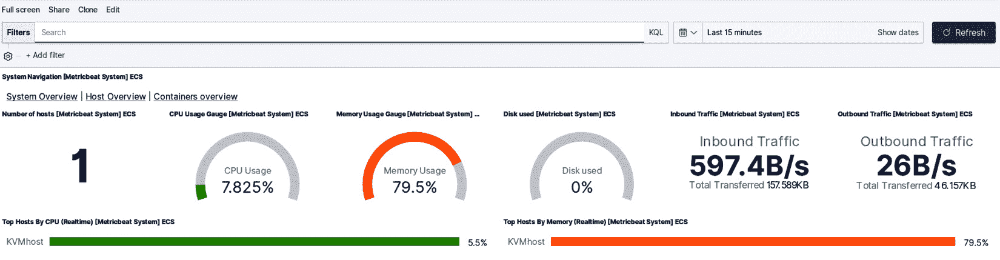

图 14.7-ECS 控制面板概述

现在，您可以单击**主机概述**并查看有关您的系统的更多数据。 尝试使用仪表板和不同的设置。 此仪表板上最有趣的项目之一是屏幕右上角的项目-定义我们感兴趣的时间跨度的项目。 我们可以创建自己的预设，也可以使用其中一个预设，例如`last 15 minutes`。 单击**刷新**按钮后，页面上应显示新数据。

至此，您现在已经对 Kibana 有了足够的了解，可以开始使用了，但是我们仍然无法可视化 KVM 数据。 下一步是创建一个涵盖这一点的仪表板。

但在我们做这件事之前，先想想你能用我们到目前为止学到的东西做些什么。 您不仅可以监视安装了 KVM 堆栈的本地系统，还可以监视任何能够运行 MetricBeat 的系统。 您唯一需要知道的是 ELK 堆栈的 IP 地址，这样您就可以向其发送数据。 Kibana 将自动处理可视化来自不同系统的所有不同数据，我们稍后将看到这一点。

## 创建自定义利用率报告

从版本 7 开始，弹性堆栈引入了强制性检查，旨在确保最低限度的安全性和功能遵从性，特别是当我们开始在生产中使用 ELK 时。

乍一看，这些检查可能会让您感到困惑--我们引导您完成的安装可以正常工作，但突然之间，当您尝试配置某些设置时，一切都会失败。 这是故意的。

在以前的版本中，会执行这些检查，但会在配置项丢失或配置错误时标记为警告。 从版本 7 开始，当系统处于生产状态且配置不正确时，这些检查将触发错误。 此状态自动表示，如果配置不正确，您的安装将无法工作。

ELK 有两种不同的操作模式：*开发*和*生产*。 在第一次安装时，假定您处于开发模式，因此大多数功能都是开箱即用的。

一旦进入生产模式，情况就会发生很大变化--需要显式设置安全设置和其他配置选项才能使堆栈正常工作。

诀窍在于没有明确的模式更改-生产设置和与它们相关联的检查由配置中的某些设置触发。 我们的想法是，一旦重新配置了从安全角度来看可能很重要的内容，就需要重新正确地配置所有内容。 这将防止您忘记一些可能成为生产中的大问题的东西，并迫使您至少从一开始就有一个稳定的配置。 有禁用检查的开关，但在任何情况下都不建议这样做。

需要注意的主要问题是绑定接口--默认安装将所有内容绑定到`localhost`或本地环回接口，这对于生产来说是完全合适的。 一旦您的 Elasticsearch 能够形成集群，并且可以通过简单地重新配置 HTTP 和传输通信的网络地址来触发它，您就必须注意检查并重新配置整个系统以使其正常工作。 有关详细信息，请参考 https://www.elastic.co/上提供的文档，从[https://www.elastic.co/guide/index.html](https://www.elastic.co/guide/index.html)开始。

例如，在弹性堆栈中配置集群及其所需的所有内容都超出了本书的范围-在我们的配置中，我们将停留在*单节点集群*的范围内。 此解决方案是专门为可以使用单个节点，或者更准确地说，可以使用覆盖堆栈所有功能的单个计算机实例的情况而创建的。 在正常部署中，您将在集群中运行弹性堆栈，但实现细节将取决于您的配置及其需求。

我们需要警告您两个关键点-防火墙和 SELinux 设置由您决定。 所有服务都使用标准 TCP 进行通信。 不要忘记，要使服务运行，必须正确配置网络。

现在我们已经了解了，让我们回答一个简单的问题：我们需要做什么才能使弹性堆栈与多台服务器一起工作？ 让我们一点一滴地讨论这个场景。

### 弹性搜索

转到配置文件(`/etc/elasticsearch/elasticsearch.yml`)，并在发现部分中添加一行：

```sh
discovery.type: single-node
```

使用此部分不是强制性的，但当您稍后必须返回到配置时，使用此部分会有所帮助。

此选项将告诉 Elasticsearch集群中只有一个节点，它将使 Elasticsearch 忽略与集群及其网络相关的所有检查。 此设置还将使此节点自动成为主节点，因为 Elasticsearch 依赖于拥有控制集群中所有内容的主节点。

更改`network.host:`下的设置，使其指向将在上使用 Elasticsearch 的接口的 IP 地址。 默认情况下，它指向 localhost，在网络中不可见。

重新启动 Elasticsearch 服务，并确保它正在运行并且没有生成错误：

```sh
sudo systemctl restart elasticsearch.service 
```

使其正常工作后，请从本地计算机检查该服务是否运行正常。 最简单的方法是执行以下操作：

```sh
curl -XGET <ip_address>:9200 
```

响应应为`.json`格式的文本，其中包含有关服务器的信息。

重要音符

弹性堆栈有三个(或四个)部分或*个服务*。 在我们的所有示例中，其中三个(Logstash、Elasticsearch 和 Kibana)在同一台服务器上运行，因此不需要额外的配置来适应网络通信。 在正常配置中，这些服务可能在独立的服务器上运行，并在多个实例中运行，具体取决于我们试图监视的服务的工作负载和配置。

### 罗斯塔什

Logstash 的默认安装是`/etc/logstash`文件夹中名为`logstash-sample.conf`的文件。 此包含一个简单的 Logstash 管道，当我们使用 Logstash 作为 BEATS 的主要目的地时使用。 我们将在稍后讨论这一点，但目前，请将此文件复制到`/etc/logstash/conf.d/logstash.conf`，并在您刚刚复制的文件中更改 Elasticsearch 服务器的地址。 它应该看起来像这样：

```sh
hosts => ["http://localhost:9200"]. 
```

将`localhost`更改为您的服务器的正确 IP 地址。 这将使 Logstash 侦听端口`5044`并将数据转发到 Elasticsearch。 重新启动服务并验证其是否正在运行：

```sh
sudo systemctl restart logstash.service 
```

现在，让我们学习如何配置 Kibana。

### 基巴纳

Kibana 也有一些需要更改的设置，但在执行此操作时，需要记住有关此服务的几件事：

*   就其本身而言，Kibana 是一项通过 HTTP 协议(或 HTTPS，取决于配置)提供可视化和数据的服务。
*   At the same time, Kibana uses Elasticsearch as its backend in order to get and work with data. This means that there are two IP addresses that we must care about:

    A)第一个是将用于显示 Kibana 页面的地址。 默认情况下，这是端口`5601`上的本地主机。

    B)另一个 IP 地址是将处理查询的 Elasticsearh 服务。 默认设置也是 localhost，但需要将其更改为 Elasticsearch 服务器的 IP 地址。

包含配置详细信息的文件为`/etc/kibana/kibana.yml`，您至少需要进行以下更改：

*   `server.host`：这需要指向 Kibana 将在其中放置其页面的 IP 地址。
*   `elasticsearch.hosts`：这需要指向要执行查询的主机(或集群，或多个主机)。

重新启动服务，仅此而已。 现在，登录 Kibana 并测试是否一切正常。

为了让您更熟悉 Kibana，我们将尝试建立一些基本的系统监控，并展示如何监控多台主机。 我们将配置两个*节拍*：MetricBeat 和 FileBeat。

我们已经配置了 Metricbeat，但它是针对 localhost 的，所以让我们先修复它。 在`/etc/metricbeat/metricbeat.yml`文件中，重新配置输出，以便将数据发送到`elasticsearch`地址。 您只需更改主机 IP 地址，因为其他所有内容都保持不变：

```sh
# Array of hosts to connect to
Hosts: ["Your-host-IP-address:9200"]
```

请确保将`Your-host-IP-address`更改为您正在使用的 IP 地址。

配置文件节拍基本相同；我们需要使用`/etc/filebeat/filebeat.yml`来配置它。 由于所有节拍都使用相同的概念，因此 fileBeat 和 MetricBeat(以及其他节拍)都使用模块来提供功能。 在这两个文件中，核心模块都被命名为`system`，因此在 fileBeat 中使用以下命令启用它：

```sh
filebeat modules enable system
```

对 metricbeat 使用以下命令：

```sh
metricbeat modules enable system
```

我们之前在第一个示例中提到了这一点，但您可以通过运行以下命令来测试您的配置：

```sh
filebeat test config
```

您还可以使用以下命令：

```sh
metricbeat test config
```

两个节拍都应该说配置是`ok`。

此外，您还可以检查输出设置，这将显示输出设置的实际内容以及它们的工作方式。 如果您仅使用本书配置系统，则会出现警告，提醒您连接没有 TLS 保护，否则，输出应使用您在配置文件中设置的 IP 地址。

要测试输出，请使用以下命令：

```sh
filebeat test output
```

您还可以使用以下命令：

```sh
metricbeat test output
```

对您要监视的每个系统重复所有这些操作。 在我们的示例中，我们有两个系统：一个运行 KVM，另一个运行 Kibana。 我们还在另一个系统上设置了 Kibana 来测试 syslog 以及它通知我们注意到的问题的方式。

我们需要配置 fileBeat 和 MetricBeat 才能将数据发送到 Kibana。 我们将为此编辑`filebeat.yml`和`metricbeat.yml`文件，方法是更改这两个文件的以下部分：

```sh
setup.kibana
   host: "Your-Kibana-Host-IP:5601" 
```

在运行 Beats 之前，在全新安装时，您需要将仪表板上传到 Kibana。 您只需要为每个 Kibana 安装执行一次此操作，并且只需要从您监视的系统之一执行此操作-模板将工作，无论它们是从哪个系统上传的；它们将只处理进入 Elasticsearch 的数据。

要执行此操作，请使用以下命令：

```sh
filebeat setup
```

您还需要使用以下命令：

```sh
metricbeat setup
```

这将需要几秒钟甚至一分钟的时间，具体取决于您的服务器和客户端。 一旦它说它创建了仪表板，它就会显示它创建的所有仪表板和设置。

现在，您几乎已经准备好查看Kibana 将显示的所有数据：


图 14.8-摘自 Kibana 仪表板

在开始之前，您还需要了解一些关于时间和时间戳的信息。 右上角的日期/时间选取器允许您选择自己的时间跨度或预定义的时间间隔之一：


图 14.9-日期/时间选取器

重要音符

请始终记住，显示的时间是您访问 Kibana 的浏览器/机器时区的*本地*。

日志中的所有时间戳对于发送日志的机器来说都是*本地的*。 Kibana 将尝试匹配时区并转换生成的时间戳，但如果您正在监控的机器上的实际时间设置不匹配，则尝试建立事件的时间表将会出现问题。

让我们假设您已经运行了 fileBeat 和 MetricBeat。 你能用这些做什么？ 事实证明，有很多：

*   第一件事是发现你的数据里有什么。 在 Kibana 中按下**Discover**按钮(它看起来像一个小指南针)。 如果一切正常，右侧应该会显示一些数据。
*   在您刚刚单击的图标右侧，一个垂直空白处将填满 Kibana 从数据中获得的所有属性。 如果您看不到任何内容或缺少某些内容，请记住，您选择的时间跨度会缩小将在此视图中显示的数据范围。 尝试将间隔重新调整为**最近 24 小时**或**最近 30 天**。

显示属性列表后，您可以快速确定每个属性在您刚刚选择的数据中出现的次数-只需单击任何属性并选择**Visualize**。 还请注意，单击该属性后，Kibana 将向您显示最后 500 条记录中的前五个不同的值。 这是一个非常有用的工具，如果您需要知道，例如，哪些主机正在显示数据，或者有多少个不同的操作系统版本。

特定属性的可视化只是一个开始-请注意，当您将鼠标悬停在属性名称上时，名为**Add**的按钮是如何出现的？ 试着点击它。 右侧将开始形成一个表格，其中只填充了您选择的属性，并按时间戳排序。 默认情况下，这些值不会自动刷新，因此时间戳将是固定的。 您可以选择任意数量的属性，然后保存此列表或稍后打开它。

下一件事我们需要看的是个别的可视化。 我们不打算深入讨论太多细节，但是您可以使用预定义的可视化类型在数据集之外创建您自己的可视化。 同时，您并不局限于只使用预定义的内容-还可以使用 JSON 和脚本，以便进行更多的定制。

我们需要了解的下一件事是仪表盘。

根据特定的数据集，或者更准确地说，根据您正在监视的特定机器集，其中一些机器将具有仅涵盖特定机器所做或拥有的事情的属性。 一个例子是 AWS 上的虚拟机-它们将拥有一些仅在 AWS 环境中有用的信息。 这在我们的配置中并不重要，但是您需要了解数据中可能有一些属性对于一组特定的机器来说是唯一的。 对于初学者，请选择其中一个系统指标；**系统导航 ECS**用于 MetricBeat 或**Dashboard ECS**用于 FileBeat。

这些仪表板以多种方式显示有关您的系统的大量信息。 试着四处点击，看看你能推断出什么。

MetricBeat 仪表板更多地面向正在运行的系统，并关注内存和 CPU 分配。 您可以单击和过滤大量信息，并以不同的方式显示这些信息。 以下是 MetricBeat 的截图，让您可以大致了解它的样子：

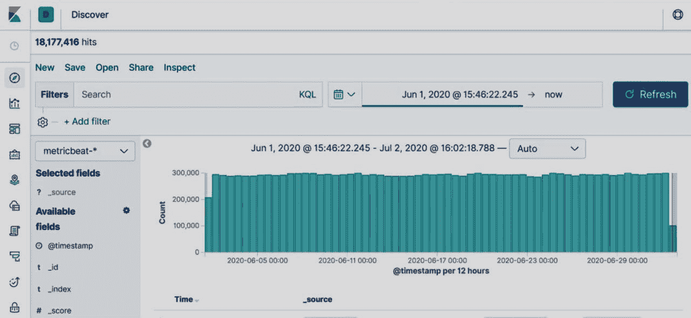

图 14.10-节拍仪表板

FileBeat 仪表板更倾向于分析发生了什么并确定趋势。 让我们从系统日志条目部分开始，查看 fileBeat 仪表板中的几个摘录：

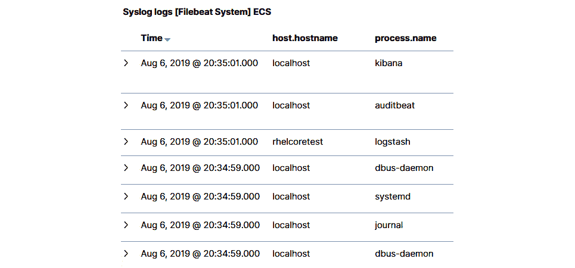

图 14.11-文件节拍系统日志条目部分

乍一看，你会注意到几件事。 我们显示的是两个系统的数据，这些数据是不完整的，因为它覆盖了我们设置的时间间隔的一部分。 此外，我们还可以看到一些进程比其他进程更频繁地运行和生成日志。 即使我们对特定系统一无所知，我们现在也可以看到日志中显示了一些进程，它们可能不应该出现在日志中：

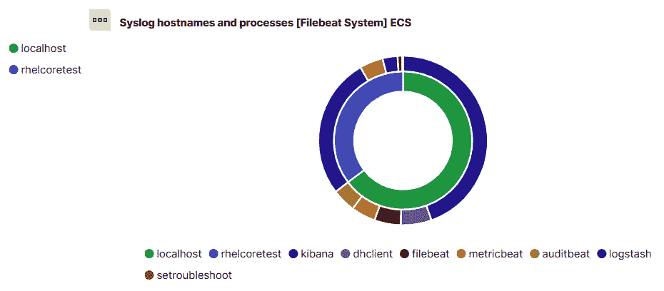

图 14.12-文件节拍交互式甜甜圈图表

让我们来看看`setroubleshoot`。 单击进程名称。 在打开的窗口中，单击放大镜。 这将仅隔离此进程，并在屏幕底部仅显示其日志。

我们可以在上快速看到`setroubleshoot`正在向哪台主机写入日志(包括写入日志的频率和原因)。 这是发现潜在问题的快速方法。 在这种特殊情况下，显然应该在此系统上执行一些操作来重新配置 SELinux，因为它会生成异常并阻止某些应用访问文件。

让我们沿着垂直导航栏移动，并指出一些其他有趣的功能。

从上到下，下一个重要功能是**Canvas**-它使我们能够使用正在收集的数据集的数据创建实时演示文稿。 界面与其他演示程序类似，但重点在于直接在幻灯片中使用数据和几乎实时地生成幻灯片。

下一个是**Maps**。 这是 7.0 版的新增功能，允许我们创建数据的地理表示。

**接下来是机器学习**-它使您能够处理数据，并使用它来“训练”过滤器，并用它们创建管道。

**基础设施**也很有趣--当我们提到仪表板时，我们谈论的是灵活性和定制化。 基础架构是一个模块，它使我们能够以最少的努力进行实时监控，并观察重要的指标。 您可以将重要数据显示为表格、气球状界面或图形。 数据可以用其他方式求平均值或表示，所有这些都可以通过一个高度直观的界面来完成。

心跳是另一个高度专业化的主板-顾名思义，它是跟踪和报告正常运行时间数据，并快速注意到是否有东西离线的最简单的方式。 清点主机要求在我们要监视的每个系统上安装心跳服务。

**SIEM**应该有一个更彻底的解释：如果我们认为仪表板是多用途的，那么 SIEM 正好相反；创建它是为了能够跟踪所有可归类为与安全相关的系统上的所有事件。 本模块将在搜索 IP、网络事件、源、目的地、网络流量和所有其他数据时解析数据，并创建有关您正在监视的计算机上发生的情况的简单易懂的报告。 它甚至提供异常检测功能，使弹性堆栈能够作为高级安全目的的解决方案。 此功能是付费的，需要支付最高的层级才能运行。

**堆栈监视器**是另一个值得注意的板，因为它使您能够实际看到弹性堆栈的所有不同部分中正在发生的事情。 它将显示所有服务的状态、它们的资源分配和许可证状态。 **Logs**功能特别有用，因为它跟踪堆栈正在生成的哪种类型的日志数量，如果有问题，它可以快速指出问题。

此模块还为服务生成统计数据，使我们能够了解如何优化系统。

**已经提到了底部的最后一个图标-管理**-它允许管理集群及其部件。 在这里，我们可以看到是否有我们期待的指标，是否有数据流入，我们是否可以优化一些东西，等等。 这也是我们可以管理许可证和创建系统配置快照的地方。

## 麋鹿和 KVM

最后但并非最不重要的一点是，让我们创建一个系统量规，它将向我们显示来自 KVM 虚拟机管理器的参数，然后以几种方式将其可视化。 实现这一点的先决条件是正在运行的 KVM 虚拟机管理器、安装了 KVM 模块的 metricbeat，以及支持从 metricbeat 接收数据的弹性堆栈配置。 让我们来了解一下 ELK 在这个特定用例中的配置：

1.  First, go to the hypervisor and open a `virsh` shell. List all the available domains, choose a domain, and use the `dommemstat –-domain <domain_name>` command.

    结果应该是这样的：

    

    图 14.13-域的 dommemtest

2.  Open Kibana and log in, go to the **Discover** tab, and select `metric*` as the index we are working with. The left column should populate with attributes that are in the dataset that metricbeat sends to this Kibana instance. Now, look at the attributes and select a couple of them:

    

    图 14.14-选择 Kibana 中的属性

    您可以使用按钮选择字段，只要您将鼠标光标悬停在任何字段上，该按钮就会立即出现。 取消选择它们也是如此：

    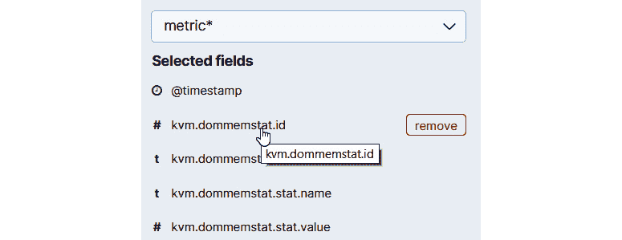

    图 14.15-在 Kibana 中添加属性

3.  For now, let's stick with the ones we selected. To the right of the column, a table is formed that contains only the fields you selected, enabling you to check the data that the system is receiving. You may need to scroll down to see the actual information since this table will display all the data that was received that has at least one item that has a value. Since one of the fields is always a timestamp, there will be a lot of rows that will not contain any useful data for our analysis:

    

    图 14.16-检查选定的字段

    我们在这里看到的是，我们获得的数据与在受监控服务器上运行命令行得到的数据相同。

    我们需要的是一种使用这些结果作为数据来显示我们的图表的方法。 单击屏幕左上角的**保存**按钮。 使用稍后可以找到的名称；我们使用的是`dommemstat`。 保存搜索。

4.  Now, let's build a gauge that will show us the real-time data and a quick visualization of one of the values. Go to **Visualize** and click **Create new visualization**:

    

    图 14.17-创建新的可视化效果

    选择`area`图表。 然后，在下一个屏幕上，查找并选择我们的数据源：

    

    图 14.18-选择可视化信号源

    这将创建一个窗口，所有设置在左侧，最终结果在右侧。 目前，我们所看到的没有任何意义，所以让我们配置我们需要什么来显示我们的数据。 有几种方法可以实现我们想要的结果：我们将使用直方图和过滤器来快速显示未使用内存值是如何随时间变化的。

5.  We are going to configure the *y* axis to show average data for `kvm.dommemstat.stat.value`, which is the attribute that holds our data. Select **Average** under **Aggregation** and `kvm.dommemstat.stat.value` as the field we are aggregating. You can create a custom label if you want to:

    

    图 18.19-选择指标属性

    这仍然是不正确的；我们需要添加时间戳来查看我们的数据是如何随时间变化的。 我们需要将**日期直方图**类型添加到*x*轴并使用它：

    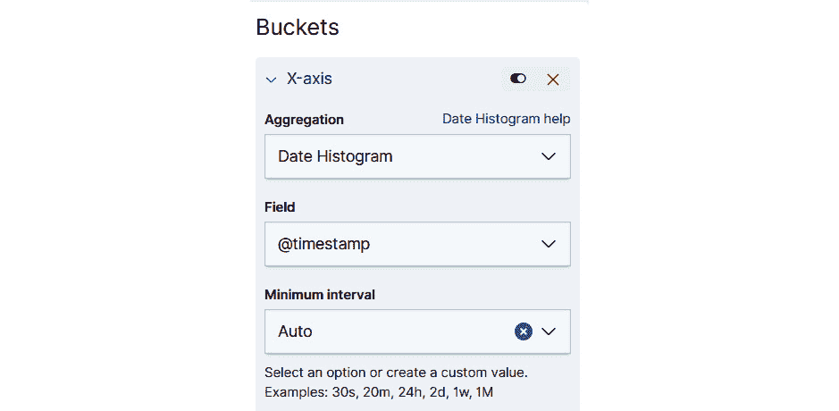

    图 14.20-选择聚合类型

6.  Before we finish this visualization, we need to add a filter. The problem with data that is received from the KVM metricbeat module is that it uses one attribute to hold different data – if we want to know what the number in the file we are displaying actually means, we need to read its name from `kvm.dommemstat.stat.name`. To accomplish this, just create a filter called `kvm.dommemstat.stat.name:"unused"`.

    刷新可视化后，我们的数据应该正确地显示在右侧：

    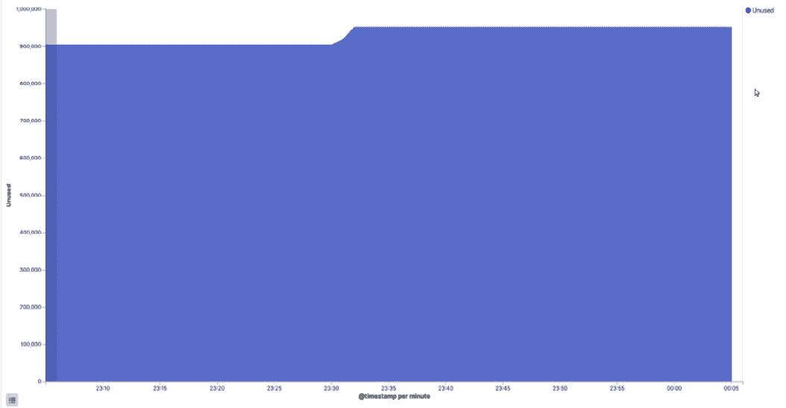

    图 14.21-正确的可视化效果

7.  We need to save this visualization using the **Save** button, give it a name that we will be able to find later, and repeat this process but instead of filtering for `unused`, filter for `usable`. Leave all the settings identical to the first visualization.

    让我们构建一个仪表板。 打开**Dashboard**选项卡，然后单击第一个屏幕上的**Add new Dashboard**。 现在，将我们的两个可视化视图添加到这个仪表板。 您只需找到正确的可视化并单击它；它将显示在仪表板上。

    因此，我们有两个简单的仪表板在运行：

    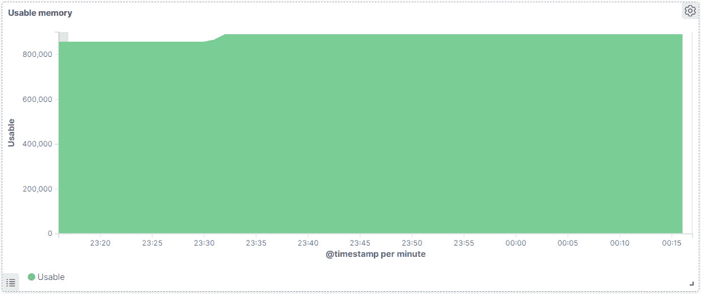

    图 14.22-完成的仪表板显示可用内存

    UI 中的第二个仪表板(实际上就在第一个仪表板旁边)是未使用的内存仪表板：

    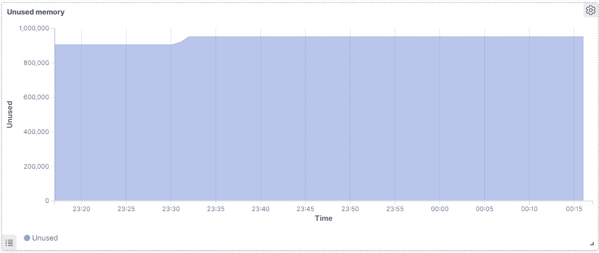

    图 14.23-完成的仪表板显示未使用的内存

8.  保存此仪表板，以便以后使用。 仪表板的所有元素都可以自定义，并且仪表板可以由任意数量的可视化内容组成。 Kibana 让你可以自定义你看到的几乎所有东西，并将大量数据组合在一个屏幕上，以便于监控。 我们只需要更改一件事就可以使它成为良好的监控仪表板，那就是让它自动刷新。 单击屏幕右侧的日历图标，然后选择自动刷新间隔。 我们决定`5 seconds`：

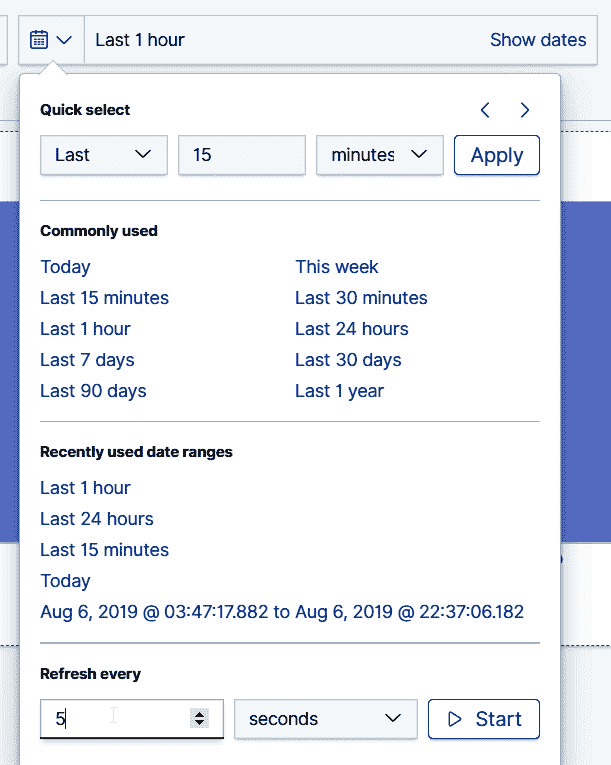

图 14.24-选择与时间相关的参数

既然我们已经做到了这一点，我们就可以反思这样一个事实，即构建这个仪表板确实简单明了。 这只花了我们几分钟的时间，而且很容易读懂。 想象一下，与此相比，在文本模式中经历了数百兆字节的日志文件。 实际上没有竞争，因为我们能够使用之前部署的 ELK 堆栈来监控有关 KVM 的信息，这就是本章的全部要点。

# 摘要

Kibana 使您能够做的是创建自定义仪表板，这些仪表板可以并排显示不同计算机的数据，因此 KVM 只是我们提供的众多选项之一。 例如，根据您的需要，您可以显示 KVM 虚拟机管理器及其上运行的所有主机的磁盘使用情况，或其他一些指标。 弹性堆栈是一种灵活的工具，但与所有工具一样，它需要时间来掌握。 本章只介绍了弹性配置的基本知识，因此我们强烈建议您进一步阅读这个主题-除了 KVM 之外，ELK 还可以用来监控几乎所有生成任何类型数据的东西。

下一章是关于 KVM 虚拟机的性能调优和优化的，这是我们没有真正触及的主题。 有相当多的内容需要讨论--虚拟机计算大小、优化性能、磁盘、存储访问和多路径、优化内核和虚拟机设置，仅举几例。 我们的环境越大，所有这些课题都将变得更加重要。

# 问题

1.  我们使用 MetricBeat 做什么？
2.  我们为什么要用基巴纳？
3.  在安装 ELK 堆栈之前，基本前提是什么？
4.  我们如何向基巴纳添加数据？

# 进一步阅读

有关本章内容的更多信息，请参阅以下链接：

*   ELK 堆栈：[https://www.elastic.co/what-is/elk-stack](https://www.elastic.co/what-is/elk-stack)
*   ELK 堆栈文档：[https://www.elastic.co/guide/index.html](https://www.elastic.co/guide/index.html)
*   Kibana 文档：[https：//www.astic tic.co/Guide/en/kibana/current/index.html](https://www.elastic.co/guide/en/kibana/current/index.html)
*   MetricBeat 文档：[https://www.elastic.co/guide/en/beats/metricbeat/current/index.html](https://www.elastic.co/guide/en/beats/metricbeat/current/index.html)