# *第 15 章*：KVM 的性能调整和优化

当我们考虑虚拟化时，总会有一些问题不断出现。 其中一些可能非常简单，比如我们将从虚拟化中获得什么？ 这会让事情变得简单吗？ 备份是否更容易？ 但是，一旦我们使用了一段时间的虚拟化，也会出现更复杂的问题。 我们如何在计算级别上提高速度？ 有没有办法做更多的优化？ 我们可以额外调整什么来提高存储或网络的速度？ 我们是否可以引入一些配置更改，使我们能够在不投入大量资金的情况下更好地利用现有基础设施？

这就是性能调整和优化对我们的虚拟化环境如此重要的原因。 正如我们将在本章中发现的那样，有很多不同的参数需要考虑-特别是如果我们从一开始就没有正确地设计东西，通常情况就是这样。 所以，我们将首先讨论设计这个主题，解释为什么它不应该只是一个纯粹的反复试验的过程，然后继续通过不同的设备和子系统来分解这个思维过程。

在本章中，我们将介绍以下主题：

*   调整虚拟机 CPU 和内存性能-NUMA
*   内核同页合并
*   Virtio 设备调谐
*   数据块 I/O 调整
*   网络 I/O 调整

# 这一切都与设计有关

在我们生活的许多其他方面，我们经常重复一些基本的模式。 我们在 IT 行业通常也是这样做的。 当我们刚开始做某件事的时候，我们不擅长它是完全正常的。 例如，当我们开始进行任何一种运动的训练时，我们通常都没有坚持几年后变得那么好。 当我们开始音乐训练的时候，通常在上了几年音乐学校之后，我们会做得更好。 同样的原则也适用于 IT--当我们开始做 IT 时，我们远远没有随着时间的推移而变得更好，主要是*经验*。

作为人类，我们真的很善于把*智力防御*放在我们学习的路上。 我们真的很擅长说*我会从我的错误中学习*-我们通常把这一点和*结合起来，让我一个人呆着*。

问题是--已经有如此多的知识，不使用它将是愚蠢的。 这么多人已经经历了与我们相同或相似的过程；利用这种经历为我们带来好处将是徒劳无益的*而不是*。 此外，既然我们可以从比我们经验丰富得多的人那里学到更多东西，为什么还要浪费时间在这整个*我要从我的错误*学到的东西上呢？

当我们开始使用虚拟化时，我们通常从小规模开始。 例如，我们首先安装托管虚拟化解决方案，如 VMware Player、Oracle VirtualBox 或类似的解决方案。 然后，随着时间的推移，我们转向具有两个**个虚拟机**(**个虚拟机**)的虚拟机管理程序。 随着我们周围基础设施的增长，我们开始遵循线性模式，试图让基础设施像过去那样工作*，当它还小的时候*，这是一个错误。 IT 领域没有什么是线性的-增长、成本、用于管理的时间…。 什么事也没有。 事实上，解构这一点相当简单--随着环境的发展，存在更多的相互依赖，这意味着一件事影响另一件事，进而影响另一件事，以此类推。 这种无穷无尽的影响矩阵是人们经常忘记的东西，特别是在设计阶段。

重要提示：

这真的很简单：线性设计不会给您带来任何好处，而正确的设计是性能调优的基础，这使得以后要做的性能调优工作要少得多。

在本书的前面部分(在[*第 2 章*](02.html#_idTextAnchor029)，*KVM as a Virtualization Solution*)中，我们提到了**非一致内存访问**(**NUMA**)。 具体地说，我们提到 NUMA配置选项是 VM 配置的*非常重要的部分，特别是当您正在设计托管虚拟服务器负载的环境时。* 让我们用几个例子来进一步阐述这一点。 这些示例将为我们提供一个很好的基础，让我们从*英里的高度*来看待性能调优和优化中的最大问题，并描述如何使用好的设计原则让我们摆脱许多不同类型的麻烦。 我们有意使用基于微软的解决方案作为例子--不是因为我们信奉使用它们，而是因为一个简单的事实。 我们有很多广泛可用的文档可以作为我们的优势--设计文档、最佳实践、较短的文章等等。 所以，让我们使用它们。

## 总体硬件设计

假设您刚刚开始设计新的虚拟化环境。 当您现在从您的渠道合作伙伴订购服务器时-无论他们是谁-您需要从一个大列表中选择一个型号。 哪个品牌真的无关紧要--有很多款式可供选择。 您可以选择`1U`(所谓的*披萨盒*)服务器，根据型号的不同，这些服务器大多有一个或两个 CPU。 然后，您可以选择`2U`服务器、`3U`服务器…。 这份名单会呈指数级增长。 假设您选择了一台具有一个 CPU 的`2U`服务器。

在下一步中，您将选择内存量-比方说 96 GB 或 128 GB。 你下了订单，几天或几周后，你的服务器就会送到。 打开它，您会意识到一些事情-所有的 RAM 都连接到`CPU1`个内存通道。 你把它放进你的记忆库，忘掉它，然后进入下一阶段。

然后，问题变成了一些非常平淡无奇的环境的微观管理。 服务器的 BIOS 版本、虚拟机管理程序级别上的驱动程序以及 BIOS 设置(电源管理、C 状态、Turbo Boost、超线程、各种与内存相关的设置、不允许内核自行关闭等)都会对虚拟机监控程序上运行的虚拟机的性能产生巨大影响。 因此，最好的做法是首先检查我们的硬件是否有更新的 BIOS/固件版本，并检查制造商和其他相关文档，以确保 BIOS 设置尽可能优化。 然后，也只有到那时，我们才能开始*勾选*一些物理和部署程序-在机架中部署我们的服务器，安装操作系统和我们需要的一切，并开始使用它。

假设一段时间后，您意识到您需要进行一些升级并订购一些 PCI Express 卡-两个基于主机的单端口光纤通道 8 Gbit/s 适配器、两个单端口 10 Gbit/s 以太网卡和两个 PCI Express NVMe 固态硬盘。 例如，通过订购这些卡，您希望添加一些功能-访问光纤通道存储，并通过将这两种功能从 1 Gb/s 网络切换到 10 Gb/s 网络来加快备份过程和虚拟机迁移。 你下订单，几天或几周后，你的新 PCI Express 卡就会送到。 您打开它们，关闭服务器，将其从机架中取出，然后安装这些卡。 `2U`服务器通常有两个甚至三个 PCI Express 转接卡的空间，这些转接卡可有效地用于连接其他 PCI Express 设备。 假设您使用第一个 PCI Express Riser 卡部署前两个卡-光纤通道控制器和 10 Gbit/s 以太网卡。 然后，注意到您没有足够的 PCI Express 接口将所有东西都连接到第一个 PCI Express Riser 卡，因此使用第二个 PCI Express Riser 卡来安装两个 PCI Express NVMe 固态硬盘。 您可以拧下所有东西，合上服务器盖，将服务器放回机架，然后重新通电。 然后，您返回到笔记本电脑并连接到服务器，徒劳地试图格式化您的 PCI Express NVMe 固态硬盘并将其用于新的 VM 存储。 您意识到您的服务器无法识别这些 SSD。 你问问自己-这是怎么回事？ 我的服务器坏了吗？

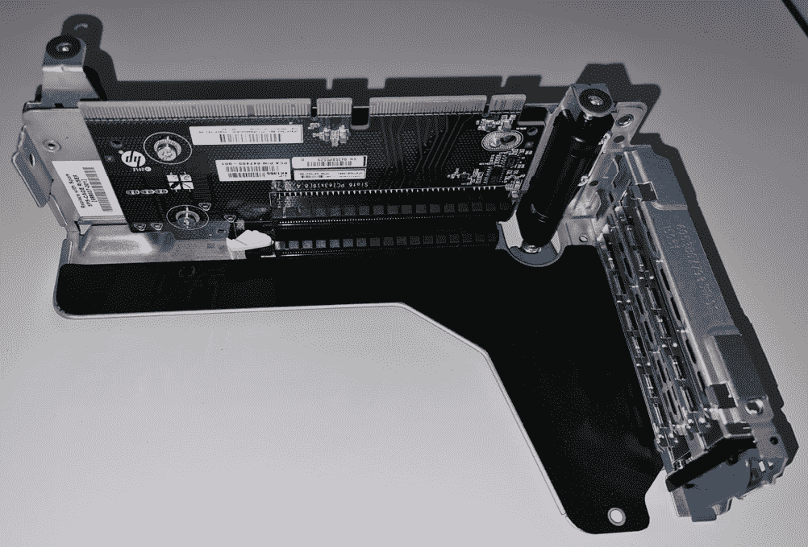

图 15.1-DL380p G8 的 PCI Express Riser 卡-您必须将 PCI Express 卡插入插槽

您打电话给您的销售代表，告诉他们您认为服务器出现故障，因为它无法识别这些新的固态硬盘。 您的销售代表将您与售前技术人员联系起来；您听到另一方发出的笑声和以下信息：“嗯，您看，您不能这样做。如果您想在服务器上使用第二个 PCI Express Riser 卡，您必须在第二个 CPU 插槽中配备 CPU 套件(CPU 和散热器)，并为第二个 CPU 配备内存。订购这两件东西，将它们放入您的服务器中，您的 PCI Express NVMe 固态硬盘将不会出现任何问题。”

当你结束电话交谈时，你的头上会留下一个问号-*这是怎么回事？ 为什么我需要将第二个 CPU 和内存连接到其内存控制器才能使用某些 PCI Express 卡？*

这其实与两件事有关：

*   您不能使用卸载的 CPU 的内存插槽，因为该内存需要一个内存控制器，该控制器位于 CPU 内部。
*   您不能在未安装的 CPU 上使用 PCI Express，因为将 PCI Express Riser 卡连接到 CPU 的 PCI Express 通道不一定是由芯片组提供的-CPU 也可以用于 PCI Express 通道，而且通常是这样的，特别是对于最快的连接，您很快就会了解到这一点。

我们知道这很令人困惑；我们可以感受到你的痛苦，就像我们在那里一样。 遗憾的是，您将不得不在我们这里多住一段时间，因为情况会变得更加令人困惑。

在[*第 4 章*](04.html#_idTextAnchor062)，*Libvirt Networking*中，我们了解了如何使用 Intel x540-AT2 网络控制器配置 SR-IOV。 我们提到在配置 SR-IOV 时使用的是 HP ProLiant DL380p G8 服务器，因此我们在这里的示例中也使用该服务器。 如果你看一下该服务器的规格，你会注意到它使用的是*英特尔 C600*芯片组。 如果您随后访问英特尔的方舟网站([https://ark.intel.com](https://ark.intel.com))并搜索有关 C600 的信息，您会注意到它有五个不同的版本(C602、C602J、C604、C606 和 C608)，但是最奇怪的部分是它们都只支持 8 个 PCI Express2.0 通道。 请记住，服务器规范清楚地说明该服务器支持 PCI Express 3.0，这真的会让人感到困惑。 这怎么可能，这里使用的是哪种诡计？ 是的，PCI Express 3.0 卡几乎总能以 PCI Express 2.0 的速度工作，但如果直截了当地说*此服务器支持 PCI Express 3.0*，然后发现它通过提供 PCI Express 2.0 级别的性能(每个 PCI Express 通道的速度慢两倍)来支持它，那将是一种误导。

只有当您转到 HP ProLiant DL380p G8 QuickSpecs 文档并找到该文档的特定部分(*扩展插槽*部分，其中包含您可以使用的三种不同类型的 PCI Express 提升板的说明)时，我们需要的所有信息实际上都已详细说明给我们。 让我们使用 PCI Express 提升板的所有详细信息作为参考和说明。 基本上，主 Riser 卡有两个 PCI Express v3.0 插槽，由处理器 1(x16 加 x8)提供，第三个插槽(PCI Express 2.0 x8)由芯片组提供。 对于可选的 Riser 卡，它说明所有插槽都由 CPU 提供(x16 加上 x8 乘以 2)。 实际上，有些型号可以有三个 PCI Express Riser 卡，对于第三个 Riser 卡，处理器 2 还提供所有 PCI Express 通道(x16 乘以 2)。

这都是*非常重要的*。 这是许多情况下性能瓶颈的一个巨大因素，这就是为什么我们的示例围绕两个 PCI Express NVMe 固态硬盘的想法。 我们想和你一起走完全程。

因此，在这一点上，我们可以对我们的示例服务器的实际标准硬件设计进行一次有意义的讨论。 如果我们打算将这些 PCI Express NVMe 固态硬盘用于虚拟机的本地存储，那么我们大多数人都会优先考虑这一点。 这意味着我们绝对希望将这些设备连接到 PCI Express 3.0 插槽，这样它们就不会受到 PCI Express 2.0 速度的瓶颈。 如果我们有两个 CPU，那么我们最好使用两个 PCI Express 提升板中的*第一个 PCI Express 插槽*来实现这一特定目的。 原因很简单-它们与*PCI Express3.0 兼容*，并且它们是由 CPU 提供的*。 同样，这是*非常重要的*--这意味着它们是*直接连接*到 CPU 的，没有通过芯片组的*增加的延迟*。 因为，在一天结束时，CPU 是所有东西的中心集线器，从 VM 到 SSD 再往返的数据都将通过 CPU。 从设计的角度来看，我们绝对应该利用我们知道这一点的事实，将我们的 PCI Express NVMe 固态硬盘*本地*连接到我们的 CPU。*

下一步与光纤通道控制器和 10 Gbit/s 以太网控制器相关。 8 Gbit/s 光纤通道控制器的大量负载与 PCI Express 2.0 兼容。 同样的情况也适用于 10Gbit/s 以太网适配器。 因此，这又是一个优先事项。 如果您经常使用我们的示例服务器上的光纤通道存储，逻辑表明您会希望将新的闪亮的光纤通道控制器放在尽可能快的位置。 这将是我们两个 PCI Express 提升板上的第二个 PCI Express 插槽。 同样，第二个 PCI Express 插槽都是由 CPU(处理器 1 和处理器 2)提供的，所以现在我们只剩下 10 Gbit/s 的以太网适配器了。 我们在示例场景中说过，我们将使用这些适配器进行备份和虚拟机迁移。 如果通过芯片组上的网络适配器完成备份，则备份不会受到太大影响。 VM 迁移可能对此有点敏感。 因此，您将第一个 10 Gbit/s 以太网适配器连接到主 Riser 卡上的第三个 PCI Express 插槽(用于备份，由芯片组提供)。 然后，还将第二个 10 Gbit/s 以太网适配器连接到第二个 Riser 卡上的第三个 PCI Express 插槽(处理器 2 提供的 PCI Express 通道)。

关于硬件方面的设计，我们才刚刚开始，我们已经有了如此丰富的信息要处理。 现在让我们进入与 VM 设计相关的设计的第二阶段。 具体地说，我们将讨论如何创建从头开始正确设计的新 VM。 但是，如果我们要这样做，我们需要知道将为哪个应用程序创建此 VM。 就这一点而言，我们将创建一个场景。 我们将使用我们创建的虚拟机在运行 Windows Server 2019 的虚拟机之上托管 Microsoft SQL 数据库群集中的节点。 当然，VM 将安装在 KVM 主机上。 这是一位客户交给我们的任务。 由于我们已经完成了总体硬件设计，现在我们将重点介绍 VM 设计。

## Колибрипрограммется

创建一个 VM 很简单-我们只需转到`virt-manager`，单击几次，就完成了。 这同样适用于 oVirt、RedHat Enterprise Virtualization Manager、OpenStack、VMware 和微软虚拟化解决方案…。 每个地方的情况都大同小异。 问题是正确地设计 VM。 具体地说，问题在于创建一个 VM，该 VM 将进行预调优，以便在非常高的级别上运行应用程序，然后只剩下少量的配置步骤，我们可以在服务器或 VM 端采取这些步骤来提高性能-前提是稍后的大部分优化过程将在操作系统或应用程序级别上完成。

因此，人们通常通过以下两种方式之一开始创建 VM-要么从头开始创建 VM，并将*XYZ*数量的资源添加到 VM，要么使用模板，正如我们在[*第 8 章*](08.html#_idTextAnchor143)，*创建和修改 VM 磁盘、模板和快照*中所解释的那样，这将节省大量时间。 无论我们使用哪种方式，都会为我们的虚拟机配置一定数量的资源。 然后，我们记住要将此 VM 用于(SQL)的用途，因此我们将 CPU 数量增加到例如 4 个，将内存量增加到 16 GB。 我们将该虚拟机放入服务器的本地存储中，将其假脱机，然后开始部署更新、配置网络、重新启动虚拟机并为最后的安装步骤做好一般准备，该步骤实际上是安装我们的应用程序(SQL Server 2016)以及与之配套的一些更新。 完成后，我们开始创建数据库，并继续执行下一组需要完成的任务。

接下来，让我们从设计和调优的角度来看看这个过程。

# 调整虚拟机 CPU 和内存性能

上述过程有一些非常简单的问题。 有些只是的工程问题，而有些则是更多的程序性问题。 让我们来讨论一下：

*   IT 领域几乎没有*一刀切的*解决方案。 每个客户端的每个虚拟机都有一组不同的环境，并且处于由不同设备、服务器等组成的不同环境中。 不要试图加快这一过程来给人留下深刻印象，因为这肯定会在以后成为一个问题。
*   完成部署后，请停止。 学习吸气、呼气和停下来思考的练习--或者等待一个小时甚至一天。 请记住，您设计 VM 的目的是什么。
*   在允许在生产中使用虚拟机之前，请检查其配置。 虚拟 CPU 数量、内存、存储位置、网络选项、驱动程序、软件更新-一切。
*   可以在安装阶段之前或在模板阶段(即克隆虚拟机之前)进行大量预配置。 如果是要迁移到新环境的现有环境，*收集有关旧环境的信息*。 了解数据库大小、正在使用的存储以及人们对数据库服务器和使用它们的应用程序的性能的满意度。

在整个过程结束时，学会从*英里高*的角度来看待您所做的与 IT 相关的工作。 从质量保证的角度来看，IT 应该是高度结构化、程序化的工作类型。 如果你以前做过什么，学会记录你在安装时做的事情和你所做的更改。 文档--就目前而言--是 IT 最大的致命弱点之一。 编写文档将使您在将来面对相同(较少)或类似(更频繁)的场景时更容易重复该过程。 向伟人学习--举个例子，如果贝多芬不详细地记录他日复一日所做的事情，我们对贝多芬的了解就会少得多。 是的，他出生于 1770 年，今年将是他出生 250 周年，那是很久以前的事了，但这并不意味着 250 年前的惯例是不好的。

现在，您的虚拟机已配置好并投入生产，几天或几周后，您会接到公司的电话，他们问为什么性能*不是很好*。 为什么它不能像在物理服务器上一样工作？

根据经验，当您在 Microsoft SQL 上寻找性能问题时，这些问题大致可以分为四类：

*   您的 SQL 数据库内存有限。
*   您的 SQL 数据库存储有限。
*   您的 SQL 数据库只是配置错误。
*   您的 SQL 数据库受 CPU 限制。

根据我们的经验，第一类和第二类很容易解决 80-85%的 SQL 性能问题。 第三种可能会占到 10%，而最后一种则相当罕见，但它仍然会发生。 请牢记这一点，从基础架构的角度来看，在设计数据库 VM 时，您应该始终首先查看 VM 内存和存储配置，因为它们是迄今为止最常见的原因。 从那时起，问题就像滚雪球一样堆积如山。 具体地说，SQL VM 性能低于平均水平的一些最常见的关键原因是内存位置(从 CPU 角度看)和存储问题-延迟/IOPS 和带宽是问题。 那么，让我们来逐一描述一下。

我们需要解决的第一个问题是(有趣的是)与*地理*相关。 数据库的内存内容应尽可能接近分配给其 VM 的 CPU 核心，这一点非常重要。 这就是 NUMA 的全部意义所在。 在 KVM上，我们只需进行一点配置，就可以轻松地解决这个特定问题。 假设我们选择我们的虚拟机使用四个虚拟 CPU。 我们的测试服务器采用 Intel Xeon E5-2660v2 处理器，每个处理器都有 10 个物理核心。 请记住，我们的服务器有两个这样的至强处理器，我们总共有 20 个内核可供使用。

我们有两个基本问题要回答：

*   我们的虚拟机的这四个核心与下面的 20 个物理核心有何关联？
*   这与虚拟机的内存有什么关系？我们如何对其进行优化？

这两个问题的答案都取决于*我们的*配置。 默认情况下，我们的虚拟机可能分别使用来自两个物理处理器的两个内核，并将自己的内存分布在这两个处理器或 3+1 上。这些配置示例都不是很好。 您需要的是将所有虚拟 CPU 核心放在*个*物理处理器上，并且希望这些虚拟 CPU 核心使用这四个物理核心的本地内存--直接连接到底层物理处理器的内存控制器。 我们刚才描述的是 NUMA 背后的基本思想-让节点(由 CPU 核心组成)充当具有本地内存的虚拟机的计算块构建。

如果可能，您希望为该 VM 保留所有内存，这样它就不会在 VM 之外的某个地方进行交换。 在 KVM 中，VM 外部*将在 KVM 主机交换空间中。 始终访问真实 RAM 内存是一个与性能和 SLA 相关的配置选项。 如果 VM 使用一点底层交换分区作为其内存，它将不会具有相同的性能。 请记住，交换通常是在某种类型的本地 RAID 阵列、SD 卡或类似介质上完成的，与实际 RAM 内存相比，它们在带宽和延迟方面要慢很多个数量级。 如果您需要有关此问题的高级声明，请不惜一切代价避免在 KVM 主机上过量使用内存。 CPU 也是如此，这是任何其他类型的虚拟化解决方案(不仅仅是 KVM)上常用的最佳实践。*

此外，对于关键资源(如数据库 VM)，将*个 vCPU*固定到特定的物理核心绝对是有意义的。 这意味着我们可以使用特定的物理核心来运行 VM，并且我们应该配置在相同主机*而不是*上运行的其他 VM 来使用这些核心。 这样，我们将*为单个 VM 保留*这些 CPU 核心，从而将所有内容配置为最高性能，使其不受物理服务器上运行的其他 VM 的影响。

是的，有时候经理和公司所有者会因为这个最佳实践而不喜欢你(好像你是罪魁祸首)，因为它需要适当的规划和足够的资源。 但这是他们不得不接受的--或者不接受，无论他们喜欢哪种。 我们的工作是让 IT 系统尽可能好地运行。

虚拟机设计有其基本原则，如 CPU 和内存设计、NUMA 配置、设备配置、存储和网络配置等。 让我们从一种基于 CPU 的高级功能开始，逐步介绍所有这些主题，如果使用得当，该功能可以帮助我们的系统尽可能好地运行-CPU 锁定。

## CPU 钉住

CPU 锁定只不过是在 vCPU 和主机的物理 CPU 核心之间设置*亲和性*的过程，以便 vCPU 将仅在该物理 CPU 核心上执行。 我们可以使用`virsh vcpupin`命令将 vCPU 绑定到物理 CPU 核心或物理 CPU 核心的子集。

在执行 vCPU 固定时，有几种最佳做法：

*   如果来宾 vCPU 的数量超过单个 NUMA 节点 CPU，则不要使用默认固定选项。
*   如果物理 CPU 分布在不同的 NUMA 节点上，最好创建多个来宾，并将每个来宾的 vCPU 固定到同一 NUMA 节点中的物理 CPU。 这是因为访问不同的 NUMA 节点或跨多个 NUMA 节点运行会对性能产生负面影响，特别是对于内存密集型应用程序。

让我们来看看 vCPU 钉住的步骤：

1.  Execute `virsh nodeinfo` to gather details about the host CPU configuration:

    

    图 15.2-有关我们的 KVM 节点的信息

2.  The next step is to get the CPU topology by executing the `virsh capabilities` command and check the section tagged `<topology>`:

    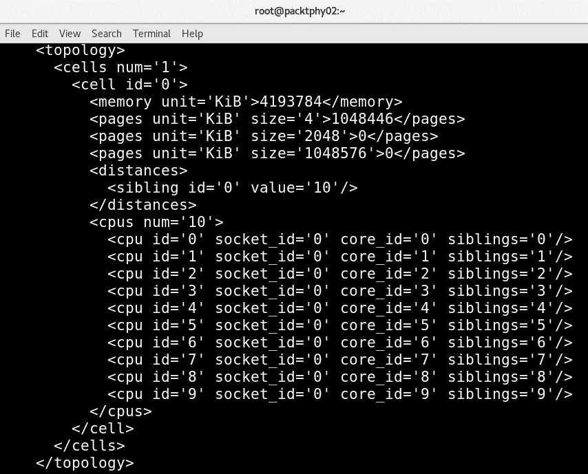

    图 15.3-所有可见物理 CPU 核心的 virsh 功能输出

    一旦我们确定了主机的拓扑，下一步就是开始固定 vCPU。

3.  Let's first check the current affinity or pinning configuration with the guest named `SQLForNuma`, which has four vCPUs:

    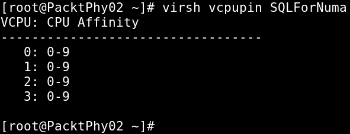

    图 15.4-检查默认 vcpupin 设置

    让我们通过使用 CPU 钉住来改变这一点。

4.  Let's pin `vCPU0` to physical core 0, `vCPU1` to physical core 1, `vCPU2` to physical core 2, and `vCPU3` to physical core 3:

    

    图 15.5-配置 CPU 固定

    通过使用`virsh vcpupin`，我们更改了此 VM 的固定虚拟 CPU 分配。

5.  让我们在此虚拟机上使用`virsh dumpxml`来检查配置更改：


图 15.6-CPU 固定虚拟机配置更改

请注意`virsh`命令中列出的 CPU 亲和性和正在运行的来宾的 XML 转储中的`<cputune>`标记。 正如 XML 标记所说，这属于来宾的 CPU 调优部分。 还可以为特定 vCPU 而不是单个物理 CPU 配置一组物理 CPU。

有几件事需要记住。 VCPU 固定可以提高性能；但是，这取决于主机配置和系统上的其他设置。 请确保您进行了足够的测试并验证了设置。

您还可以使用`virsh vcpuinfo`来验证锁定。 `virsh vcpuinfo`命令的输出如下所示：

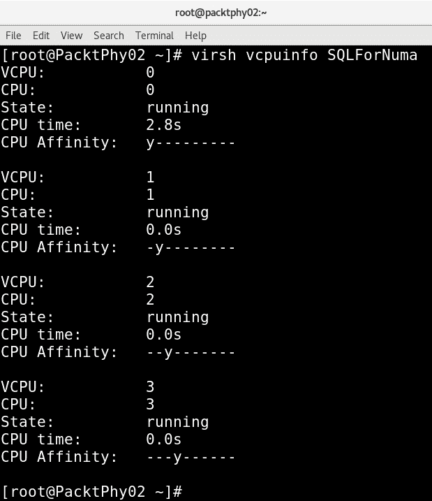

图 15.7-我们虚拟机的 virsh vcpuinfo

如果我们在繁忙的主机上执行此操作，将会产生后果。 有时，由于这些设置，我们实际上无法启动我们的 SQL机器。 因此，为了更好地(SQL VM 正在工作，而不是不想启动)，我们可以将内存模式配置从`strict`更改为`interleave`或`preferred`，这将放松对此 VM 严格使用本地内存的坚持。

现在让我们研究一下内存调优选项，因为它们是下一个要讨论的合乎逻辑的事情。

## 使用内存

对于大多数环境来说，内存是一种宝贵的资源，不是吗？ 因此，应该通过调整内存来实现内存的有效使用。 优化 KVM 内存性能的第一条规则是，在安装过程中为来宾分配的资源不能超过它将使用的资源。

我们将更详细地讨论以下内容：

*   内存分配
*   调谐记忆调谐
*   内存备份

让我们首先解释如何为虚拟系统或来宾配置内存分配。

### 内存分配

为了使分配过程简单，我们将再次考虑`virt-manager`**libvirt 客户端。 可以从以下屏幕截图所示的窗口进行内存分配：**

 **

图 15.8-虚拟机内存选项

正如您在前面的屏幕截图中看到的，有两个主要选项：**当前分配**和**最大分配**：

*   **最大分配**：客户的运行时最大内存分配。 这是来宾运行时可以分配给它的最大内存。
*   **当前分配**：客户总是使用多少内存。 由于内存膨胀的原因，我们可以将此值设置为低于最大值。

`virsh`命令可用于调整这些参数。 相关的`virsh`命令选项为`setmem`和`setmaxmem`。

### 调谐记忆调谐

内存调优选项被添加到来宾配置文件的`<memtune>`下。

其他内存调优选项可在[http://libvirt.org/formatdomain.html#elementsMemoryTuning](http://libvirt.org/formatdomain.html#elementsMemoryTuning)找到。

管理员可以手动配置来宾的内存设置。 如果省略`<memtune>`配置，则默认内存设置适用于来宾。 此处使用的`virsh`命令如下所示：

```sh
# virsh memtune <virtual_machine> --parameter size parameter
```

它可以具有以下任意值；此最佳做法在手册页中有详细说明：

```sh
--hard-limit       The maximum memory the guest can use.
--soft-limit       The memory limit to enforce during memory contention.
--swap-hard-limit  The maximum memory plus swap the guest can use.  This has to be more than hard-limit value provided. 
--min-guarantee    The guaranteed minimum memory allocation for the guest.
```

可以获取为`memtune`参数设置的默认值/当前值，如下所示：

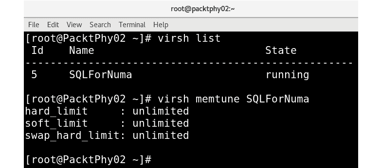

图 15.9-检查虚拟机的 memtune 设置

设置`hard_limit`时，不应将此值设置得太低。 这可能会导致 VM 被内核终止的情况。 这就是为什么为 VM(或任何其他进程)确定正确的资源量是一个设计问题。 有时候，恰当地设计东西看起来像是黑暗的艺术。

有关如何设置这些参数的更多信息，请参见以下截图中的`memtune`命令的帮助输出：


图 15.10-检查 virsh help memtune

由于我们已经讨论了内存分配和调优，最后一个选项是内存备份。

### 内存备份

下面的是内存备份的来宾 XML 表示：

```sh
<domain>     ...
  <memoryBacking>
    <hugepages>
    <page size="1" unit="G" nodeset="0-3,5"/>
    <page size="2" unit="M" nodeset="4"/>
    </hugepages>
    <nosharepages/>
    <locked/>
</memoryBacking>     ...
  </domain>
```

您可能已经注意到，内存备份有三个主要的选项：`locked`、`nosharepages`和`hugepages`。 让我们从`locked`开始，逐一介绍它们。

#### 锁 / 扣住 / 过船闸 / 隐藏

在 KVM 虚拟化中，客户内存位于 KVM 主机中的`qemu-kvm`进程的进程地址空间中。 根据主机的要求，Linux 内核可以随时换出这些客户内存分页，这就是`locked`可以提供帮助的地方。 如果将来宾的内存备份选项设置为`locked`，主机将不会换出属于虚拟系统或来宾的内存页。 启用此选项时，主机系统内存中的虚拟内存页将被锁定：

```sh
<memoryBacking>
    <locked/>
</memoryBacking>
```

我们需要使用`<memtune>`来设置`hard_limit`。 计算很简单-无论客户需要多少内存量加上开销。

#### 非共享页面

以下是来宾配置文件中的`nosharepages`的 XML 表示：

```sh
<memoryBacking>
    <nosharepages/>
</memoryBacking>
```

当存储器页相同时，存在能够实现存储器共享的不同机制。 像**内核同页合并**(**KSM**)这样的技术在客户系统之间共享页面。 `nosharepages`选项指示虚拟机管理程序禁用此来宾的共享页-也就是说，设置此选项将阻止主机在来宾之间对内存执行重复数据消除。

#### 大页页

第三个也是最后一个选项是`hugepages`，它可以用 XML 格式表示，如下所示：

```sh
<memoryBacking>
</hugepages>
</memoryBacking>
```

在 Linux 内核中引入 HugePages 以提高内存管理的性能。 内存以称为页的块进行管理。 不同的架构(i386、ia64)支持不同的页面大小。 我们不必使用 x86CPU 的默认设置(4KB 内存页)，因为我们可以使用更大的内存页(2MB 到 1 GB)，这是一种称为 HugePages 的特性。 CPU 的称为**存储器管理单元**(**MMU**)的部分通过使用列表来管理这些页。 这些页面通过页表引用，并且每个页面在页表中都有一个引用。 当系统想要处理大量内存时，主要有两种选择。 其中之一涉及增加硬件 MMU 中的页表条目的数量。 第二种方法增加默认页面大小。 如果我们选择增加页表条目的第一种方法，它的成本非常高。

在处理大量内存时，第二种也是更有效的方法是使用 HugePages 或通过使用 HugePages 增加页面大小。 每台服务器具有不同的内存量意味着需要不同的页面大小。 缺省值在大多数情况下都是可以的，而如果我们有大量内存(数百 GB 甚至 TB)，那么巨大的内存页(例如，1 GB)会更有效率。 这意味着在引用内存页方面减少了*个管理性的*工作，而实际获取这些内存页的内容花费了更多的时间，这可以显著提高性能。 大多数已知的 Linux 发行版都可以使用 HugePages 来管理大量内存。 进程可以使用 HugePages 内存支持，通过增加对**转换查找缓冲器**(**TLB**)的 CPU 缓存命中率来提高性能，如[*第 2 章*](02.html#_idTextAnchor029)，*KVM 作为虚拟化解决方案*中所述。 您已经知道，来宾系统只是 Linux 系统中的进程，因此 KVM 来宾有资格执行同样的操作。

在我们继续之前，我们还应该提到**透明 HugePages**(**THP**)。 THP 是一个抽象层，根据应用程序请求自动分配 HugePages 大小。 THP 支持可以完全禁用，只能在`MADV_HUGEPAGE`区域内启用(以避免消耗更多内存资源的风险)，也可以在系统范围内启用。 在系统中配置 THP 有三个主要选项：`always`、`madvise`和`never`：

```sh
# cat/sys/kernel/mm/transparent_hugepage/enabled [always] madvise never
```

从前面的输出中，我们可以看到我们服务器中的当前 THP 设置是`madvise`。 其他选项可以通过使用以下命令之一启用：

```sh
echo always >/sys/kernel/mm/transparent_hugepage/enabled
echo madvise >/sys/kernel/mm/transparent_hugepage/enabled
echo never >/sys/kernel/mm/transparent_hugepage/enabled 
```

简而言之，这些值的含义如下：

*   `always`：始终使用 THP。
*   `madvise`：仅在标有`MADV_HUGEPAGE`的**虚拟内存区**(**VMA**)中使用HugePages。
*   `never`：禁用该功能。

性能的系统设置由 THP 自动优化。 通过使用内存作为缓存，我们可以获得性能优势。 当 THP 就位时，可以使用静态 HugePages，换句话说，THP 不会阻止它使用静态方法。 如果我们不将 KVM 虚拟机管理程序配置为使用静态 HugePages，它将使用 4KB 的透明 HugePages。 使用 HugePages 作为 KVM 客户内存的优势在于，用于页表的内存更少，TLB 未命中也更少；显然，这提高了性能。 但请记住，当使用 HugePages 作为来宾内存时，您不能再交换或膨胀来宾内存。

让我们快速了解一下如何在 KVM 设置中使用静态 HugePages。 首先，让我们检查一下当前的系统配置-很明显，该系统中的 HugePages 大小当前设置为 2MB：


图 15.11-检查 HugePages 设置

我们主要讨论从 HugePages 开始的所有属性，但值得一提的是`AnonHugePages`属性是什么。 `AnonHugePages`属性告诉我们系统级别的当前 THP 使用情况。

现在，让我们将 KVM 配置为使用自定义 HugePages 大小：

1.  通过运行以下命令或从`sysfs`获取当前显式的`hugepages`值，如下所示：

    ```sh
    #  cat /proc/sys/vm/nr_hugepages
    0
    ```

2.  We can also use the `sysctl -a |grep huge` command:

    

    图 15.12-sysctl hugepages 设置

3.  As the HugePage size is 2 MB, we can set hugepages in increments of 2 MB. To set the number of hugepages to 2,000, use the following command:

    ```sh
    # echo 2000 > /proc/sys/vm/nr_hugepages
    ```

    分配给大页面的总内存不能被不支持大页面的应用程序使用-也就是说，如果过度分配大页面，主机系统的正常操作可能会受到影响。 在我们的示例中，2048*2MB 相当于 4096MB 的内存，我们在执行此配置时应该有可用的内存。

4.  We need to tell the system that this type of configuration is actually OK and configure `/etc/security/limits.conf` to reflect that. Otherwise, the system might refuse to give us access to 2,048 hugepages times 2 MB of memory. We need to add two lines to that file:

    ```sh
    soft	memlock	<value>
    hard	memlock	<value>
    ```

    `<value>`参数将取决于我们要进行的配置。 如果我们想要根据我们的 2048*2MB 示例配置所有内容，`<value>`将是 4,194,304(或 4096*1024)。

5.  要使其持久化，可以使用以下命令：

    ```sh
    # sysctl -w vm.nr_hugepages=<number of hugepages>
    ```

6.  然后，装载`fs`大页面，重新配置虚拟机，并重新启动主机：

    ```sh
     # mount -t hugetlbfs hugetlbfs /dev/hugepages
    ```

通过在 VM 配置文件中添加以下设置来重新配置 HugePage 配置的来宾：

```sh
<memoryBacking>
</hugepages>
</ memoryBacking> 
```

现在是关闭虚拟机并重新启动主机的时候了。 在虚拟机内部，执行以下操作：

```sh
# systemctl poweroff
```

在主机上，执行以下操作：

```sh
# systemctl reboot
```

在主机重新启动和虚拟机重新启动之后，它现在将开始使用巨型页面。

下一个主题与在多个 VM 之间共享内存内容有关，称为 KSM。 这项技术被大量用于*节省*内存。 在任何给定时刻，当多个 VM 在虚拟化主机上供电时，这些 VM 很有可能具有相同的内存块内容(它们具有相同的内容)。 那么，就没有理由多次存储相同的内容。 通常，我们将 KSM 称为应用于内存的重复数据消除过程。 让我们学习如何使用和配置 KSM。

# 熟悉 KSM

KSM 是一种允许在系统上运行的不同进程之间共享相同页面的功能。 我们可能会假设由于某些原因而存在相同的页面-例如，如果有多个进程是从相同的二进制文件或类似的文件中派生出来的。 然而，没有这样的规则。 KSM 扫描这些相同的内存页面，合并**写入时复制**(**COW**)共享页面。 CoW 只是一种机制，当尝试更改多个进程共享和公用的内存区域时，请求更改的进程将获得一个新副本，并将更改保存在其中。

尽管合并后的 COW 共享页面可由所有进程访问，但每当进程尝试更改内容(写入该页面)时，该进程都会获得一个包含所有更改的新副本。 至此，您应该已经了解，通过使用 KSM，我们可以减少物理内存消耗。 在 KVM 上下文中，这确实可以增加价值，因为客户系统是系统中的`qemu-kvm`进程，并且所有 VM 进程都有大量相似内存的可能性很大。

要使 KSM 正常工作，进程/应用程序必须向 KSM 注册其内存页。 在 KVM-land 中，KSM 允许客户共享相同的内存页，从而实现内存消耗的改善。 这可能是某种类型的应用程序数据、库或任何其他经常使用的数据。 此共享页面或内存标记为`copy on write`。 简而言之，KSM 避免了内存复制，当 KVM 环境中存在类似的来宾操作系统时，它非常有用。

通过使用预测理论，KSM 可以提供更高的内存速度和利用率。 大多数情况下，这些公共共享数据存储在缓存或主存中，从而减少了 KVM 来宾的缓存未命中。 此外，KSM 可以减少总体客户内存占用，因此，在某种程度上，它允许用户在 KVM 设置中过量使用内存，从而提供更高的可用资源利用率。 但是，我们必须记住，KSM 需要更多的 CPU 资源来识别重复页面并执行共享/合并等任务。

在前面，我们提到了，流程必须标记*页*，以表明它们是 KSM 操作的合格候选者。 标记可以通过基于`MADV_MERGEABLE`标志的进程来完成，我们将在下一节讨论这一点。 您可以在`madvise`手册页中了解此标志的用法：

```sh
# man 2 madvise
MADV_MERGEABLE (since Linux 2.6.32)
Enable Kernel Samepage Merging (KSM) for the pages in the range specified by addr and length. The kernel regularly scans those areas of user memory that have been marked as mergeable, looking for pages with identical content.  These are replaced by a single write-protected page (that is automatically copied if a process later wants to update the content of the page).  KSM merges only private anonymous pages (see mmap(2)).
The KSM feature is intended for applications that generate many instances of the same data (e.g., virtualization systems such as KVM).  It can consume a lot of processing   power; use with care.  See the Linux kernel source file Documentation/ vm/ksm.txt for more details.
The MADV_MERGEABLE and MADV_UNMERGEABLE operations are available only if the kernel was configured with CONFIG_KSM.
```

因此，内核必须配置 KSM，如下所示：


图 15.13-检查 KSM 设置

KSM 作为`qemu-kvm`包的一部分进行部署。 有关 KSM 服务的信息可以从`sysfs`文件系统的`/sys`目录中获取。 此位置有不同的可用文件，反映当前的 KSM 状态。 这些是由内核动态更新的，它具有 KSM 使用情况和统计信息的精确记录：


图 15.14-sysfs 中的 KSM 设置

在接下来的部分中，我们将讨论`ksmtuned`服务及其配置变量。 因为`ksmtuned`是控制 KSM 的服务，所以它的配置变量类似于我们在`sysfs`文件系统中看到的文件。 有关更多详细信息，请查看[https://www.kernel.org/doc/html/latest/admin-guide/mm/ksm.html](https://www.kernel.org/doc/html/latest/admin-guide/mm/ksm.html)。

也可以使用`virsh`命令调整这些参数。 `virsh node-memory-tune`命令为我们完成这项工作。 例如，以下命令指定共享内存服务进入休眠状态之前要扫描的页数：

```sh
# virsh node-memory-tune --shm-pages-to-scan number
```

与任何其他服务一样，`ksmtuned`服务也将日志存储在日志文件`/var/log/ksmtuned`中。 如果我们将`DEBUG=1`添加到`/etc/ksmtuned.conf`，我们将获得来自任何类型的 KSM 调优操作的日志。 有关详细信息，请参阅[https://www.kernel.org/doc/Documentation/vm/ksm.txt](https://www.kernel.org/doc/Documentation/vm/ksm.txt)。

启动 KSM 服务后(如下所示)，您可以根据 KSM 服务的实际情况观察值的变化：

```sh
# systemctl start ksm
```

然后我们可以检查`ksm`服务的状态，如下所示：

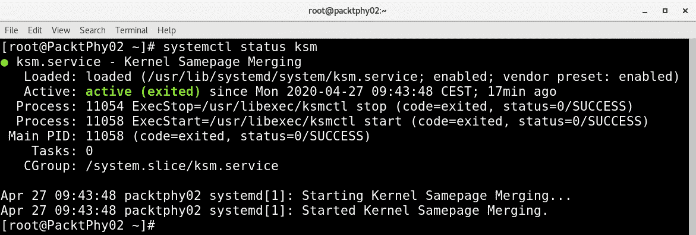

图 15.15-KSM 服务命令和 PS 命令输出

一旦启动了 KSM 服务，并且我们的主机上运行了多个虚拟机，我们就可以通过多次使用以下命令查询`sysfs`来检查更改：

```sh
cat /sys/kernel/mm/ksm/*
```

让我们更详细地研究`ksmtuned`服务。 `ksmtuned`服务的设计使其经历一个动作周期并调整 KSM。 这一动作循环在循环中继续其工作。 每当创建或销毁来宾系统时，libvirt 都会通知`ksmtuned`服务。

`/etc/ksmtuned.conf`文件是`ksmtuned`服务的配置文件。 以下是可用的配置参数的简要说明。 您可以看到这些配置参数与`sysfs`中的 KSM 文件匹配：

```sh
# Configuration file for ksmtuned.
# How long ksmtuned should sleep between tuning adjustments
# KSM_MONITOR_INTERVAL=60
# Millisecond sleep between ksm scans for 16Gb server.
# Smaller servers sleep more, bigger sleep less.
# KSM_SLEEP_MSEC=10
# KSM_NPAGES_BOOST - is added to the `npages` value, when `free memory` is less than `thres`. 
# KSM_NPAGES_BOOST=300
# KSM_NPAGES_DECAY - is the value given is subtracted to the `npages` value, when `free memory` is greater than `thres`. 
# KSM_NPAGES_DECAY=-50
# KSM_NPAGES_MIN - is the lower limit for the `npages` value.
# KSM_NPAGES_MIN=64
# KSM_NPAGES_MAX - is the upper limit for the `npages` value.
# KSM_NPAGES_MAX=1250
# KSM_THRES_COEF - is the RAM percentage to be calculated in parameter `thres`.
# KSM_THRES_COEF=20
# KSM_THRES_CONST - If this is a low memory system, and the `thres` value is less than `KSM_THRES_CONST`, then reset `thres` value to `KSM_THRES_CONST` value.
# KSM_THRES_CONST=2048
```

KSM 旨在提高性能并允许内存过量使用。 它在大多数环境中都可用于此目的；但是，在某些设置或环境中，KSM 可能会带来性能开销-例如，如果您有几个虚拟机在您启动时具有相似的内存内容，并且在启动后会加载大量内存密集型操作，则 KSM 可能会带来性能开销。 这将产生问题，因为 KSM 首先会非常努力地减少内存占用，然后会浪费时间来覆盖多个虚拟机之间的所有内存内容差异。 此外，有人担心 KSM 可能会打开一个通道，可能会被用来在客户之间泄露信息，这在过去几年里已经有了很好的记录。 如果您有这些顾虑，或者如果您看到/体验到 KSM 无助于提高工作负载的性能，则可以将其禁用。

要禁用 KSM，请通过执行以下命令停止系统中的`ksmtuned`和`ksm`服务：

```sh
# systemctl stop ksm
# systemctl stop ksmtuned
```

我们已经了解了 CPU 和内存的不同调优选项。 我们需要介绍的下一个大主题是 NUMA 配置，其中 CPU 和内存配置都成为更大故事或上下文的一部分。

# 使用 NUMA 调整 CPU 和内存

在我们开始为支持 NUMA 的系统调优CPU 和内存之前，让我们先看看什么是 NUMA 以及它是如何工作的。

可以将 NUMA 看作一个系统，其中您有多条系统总线，每条总线服务于一小部分处理器和相关内存。 每组处理器都有自己的内存，可能还有自己的 I/O 通道。 可能无法停止或阻止跨这些组运行 VM 访问。 这些组中的每一个都称为**NUMA 节点**。

在此概念中，如果进程/线程在 NUMA 节点上运行，则同一节点上的内存称为本地内存，驻留在不同节点上的内存称为外部/远程内存。 这种实现与**对称多处理器系统**(**SMP**)不同，在对称多处理器系统(**SMP**)中，所有存储器的访问时间对于所有 CPU 都是相同的，因为存储器访问是通过集中式总线进行的。

讨论 NUMA 的一个重要话题是 NUMA 比率。 NUMA 比率衡量的是 CPU 访问本地内存的速度与访问远程/外部内存的速度相比。 例如，如果 NUMA 比率为 2.0，则 CPU 访问远程内存的时间是它的两倍。 如果 NUMA 比率为 1，这意味着我们使用的是 SMP。 该比率越大，VM 内存操作在获取(或保存)必要数据之前必须付出的延迟代价(开销)就越大。 在我们深入探讨调优之前，让我们先讨论一下系统的 NUMA 拓扑。 显示当前 NUMA 拓扑的最简单方法之一是通过`numactl`命令：


图 15.16-numactl-H 输出

前面的`numactl`输出表明系统中有 10 个 CPU，它们属于单个 NUMA 节点。 它还列出了与每个 NUMA 节点关联的内存和节点距离。 当我们讨论 CPU 钉住时，我们使用`virsh`功能显示了系统的拓扑。 要获得 NUMA 拓扑的图形视图，您可以使用名为`lstopo`的命令，该命令在基于 CentOS/Red Hat 的系统中随`hwloc`包提供：

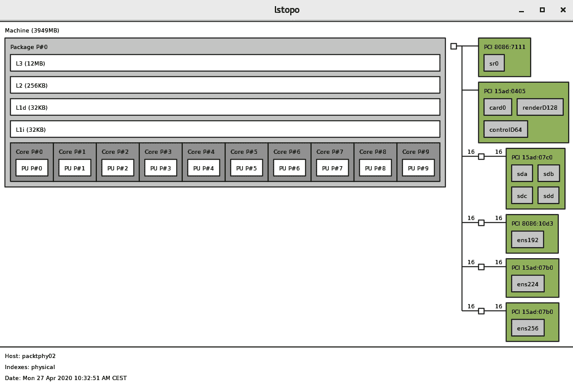

图 15.17-可视化 NUMA 拓扑的 lstopo 命令

此屏幕截图还显示了与NUMA 节点相关联的 PCI 设备。 例如，`ens*`(网络接口)设备连接到 NUMA 节点 0。 一旦我们有了系统的 NUMA 拓扑并了解了它，我们就可以开始调优它，特别是针对 KVM 虚拟化设置。

## NUMA 内存分配策略

通过修改 VM XML配置文件，我们可以进行 NUMA 调优。 Tuning NUMA 引入了名为`numatune`的新元素标记：

```sh
<domain>   ...
    <numatune>
      <memory mode="strict" nodeset="1-4,^3"/>
    </numatune>   ...
</domain>
```

这也可以通过`virsh`命令进行配置，如图所示：

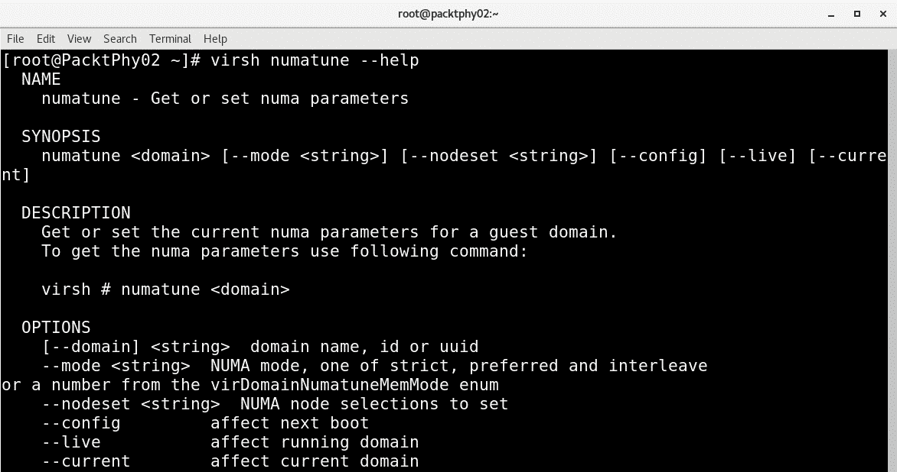

图 15.18-使用 virsh numatune 配置 NUMA 设置

此标记的 XML表示如下所示：

```sh
<domain>
 …
  <numatune>
    <memory mode="strict" nodeset="1-4,^3"/>
    <memnode cellid="0" mode="strict" nodeset="1"/>
    <memnode cellid="2" mode="preferred" nodeset="2"/>
  </numatune>   ...
</domain>
```

即使名为`numatune`的元素是可选的，也可以通过控制域进程的 NUMA 策略来调整 NUMA 主机的性能。 该可选元素的主要子标签是`memory`和`nodeset`。 关于这些子标记的一些说明如下：

*   `memory`: This element describes the memory allocation process on the NUMA node. There are three policies that govern memory allocation for NUMA nodes:

    A)`Strict`：当 VM 尝试分配内存而该内存不可用时，分配将失败。

    B)`Interleave`：节点集定义的跨 NUMA 节点的轮询分配。

    C)`Preferred`：VM尝试从首选节点分配内存。 如果该节点没有足够的内存，它可以从剩余的 NUMA 节点中分配内存。

*   `nodeset`：指定服务器上可用的 NUMA 节点列表。

这里的一个重要属性是*位置*，如以下 URL 所述-[https://libvirt.org/formatdomain.html](https://libvirt.org/formatdomain.html)：

“属性位置可用于指示域进程的内存放置模式，它的值可以是”static“或”auto“，默认为 vCPU 的位置，或者如果指定了 nodeset，则为”static“。”auto“表示域进程只从查询 numad 返回的咨询节点集中分配内存，如果指定了属性 nodeset 的值将被忽略。如果 vCPU 的位置是‘auto’，并且没有指定 numatune，则默认的数字会带有位置‘auto’和模式‘Strict

我们需要小心使用这些声明，因为有适用的继承规则。 例如，如果我们指定`<nodeset>`元素，则`<numatune>`和`<vcpu>`元素缺省为相同的值。 因此，我们绝对可以配置不同的 CPU 和内存调优选项，但也要注意这些选项可以继承的事实。

在 NUMA 上下文中考虑 CPU 固定时，需要考虑更多事项。 我们在本章前面讨论了 CPU 固定的基础，因为它为我们的虚拟机提供了更好的、可预测的性能，并可以提高缓存效率。 举个例子，假设我们想要尽可能快地运行一个 VM。 谨慎的做法是在可用的最快存储空间上运行它，该存储空间将位于我们固定 CPU 核心的 CPU 插槽上的 PCI Express 总线上。 如果我们没有使用该虚拟机本地的 NVMe SSD，我们可以使用存储控制器来实现相同的功能。 但是，如果我们用来访问虚拟机存储的存储控制器物理连接到另一个 CPU 插槽，则会导致延迟。 对于延迟敏感型应用程序来说，这意味着性能会受到很大影响。

然而，我们也需要意识到另一个极端-如果我们做了太多的钉住，它可能会在未来产生其他问题。 例如，如果我们的服务器在体系结构上不同(具有个相同数量的核心和内存)，迁移 VM 可能会出现问题。 我们可以创建一个场景，在此场景中，我们迁移的虚拟机将 CPU 核心固定到迁移过程的目标服务器上不存在的核心上。 因此，我们始终需要谨慎对待环境的配置，以免走得太远。

我们列表中的下一个主题是`emulatorpin`，它可以用来将我们的`qemu-kvm`仿真器固定到特定的 CPU 内核，这样它就不会影响我们的 VM 内核的性能。 让我们学习如何配置它。

## 了解仿真器

选项`emulatorpin`也属于 CPU 调优类别。 它的 XML 表示如下所示：

```sh
<domain>   ...
    <cputune>     …..       <emulatorpin cpuset="1-3"/>      …..
    </cputune>   ...
</domain>
```

元素`emulatorpin`是可选的，用于将仿真器(`qemu-kvm`)固定到主机物理 CPU。 这不包括来自虚拟机的 vCPU 或 IO 线程。 如果省略此参数，则默认情况下，仿真器将固定到主机系统的所有物理 CPU。

重要提示：

请注意，在调整支持 NUMA 的系统时，应同时配置`<vcpupin>`、`<numatune>`和`<emulatorpin>`，以实现最佳的确定性性能。

在我们结束这一节之前，还有几件事需要介绍：来宾系统 NUMA 拓扑和使用 NUMA 的海量内存备份。

可以使用来宾 XML 配置中的`<numa>`元素指定来宾 NUMA 拓扑；有人称其为虚拟 NUMA：

```sh
  <cpu>      ...
    <numa>
      <cell id='0' cpus='0-3' memory='512000' unit='KiB'/>
      <cell id='1' cpus='4-7' memory='512000' unit='KiB' />     </numa>         ...
</cpu>
```

`cell id`元素告诉 VM 使用哪个 NUMA 节点，而`cpus`元素配置特定的核心(或多个核心)。 元素的作用是：分配每个节点的内存量。 每个 NUMA 节点从`0`开始按编号索引。

在前面，我们讨论了`memorybacking`元素，可以指定该元素在来宾配置中使用大页。 当 NUMA 出现在设置中时，`nodeset`属性可用于配置每个 NUMA 节点的特定大小，这可能会很方便，因为它将给定来宾的 NUMA 节点绑定到特定的大小：

```sh
<memoryBacking>
    <hugepages>
      <page size="1" unit="G" nodeset="0-2,4"/>
      <page size="4" unit="M" nodeset="3"/>
    </hugepages>
</memoryBacking>
```

这种类型的配置可以优化内存性能，因为客户 NUMA 节点可以根据需要移动到托管 NUMA 节点，同时客户可以继续使用主机分配的大页面。

NUMA 调优还必须考虑 PCI 设备的 NUMA 节点位置，特别是当 PCI 设备从主机传递到来宾时。 如果相关的 PCI 设备附属于远程 NUMA 节点，这可能会影响数据传输，从而损害性能。

显示 NUMA 拓扑和 PCI 设备从属关系的最简单方法是使用我们前面讨论的`lstopo`命令。 同一命令的非图形形式也可用于发现此配置。 请参考前面的部分。

## KSM 和 NUMA

我们在前面的小节中详细讨论了 KSM。 KSM 是 NUMA 感知的，它可以管理在多个 NUMA 节点上发生的 KSM进程。 如果您还记得，当我们从`sysfs`获取 KSM 条目时，我们遇到了一个名为`merge_across_node`的`sysfs`条目。 这是我们可以用来管理这个过程的参数：

```sh
#  cat /sys/kernel/mm/ksm/merge_across_nodes
1
```

如果此参数设置为`0`，则 KSM 仅合并来自同一 NUMA 节点的内存页。 如果它设置为`1`(这里就是这种情况)，它将跨个 NUMA 节点合并*。 这意味着在远程 NUMA 节点上运行的 VM CPU 在访问 KSM 合并的页面时会遇到延迟。*

显然，您知道 Guest XML 条目(`memorybacking`元素)，它用于请求系统管理程序禁用来宾共享页面。 如果您不记得了，请重新参考内存调优一节，了解该元素的详细信息。 即使我们可以手动配置 NUMA，也有一种叫做自动 NUMA 平衡的东西。 我们之前确实提到过，但让我们看看这个概念涉及到什么。

## 自动 NUMA 平衡

自动 NUMA 平衡的主要目标是提高在 NUMA 感知系统中运行的不同应用程序的性能。 其设计背后的策略很简单：如果应用程序对运行 vCPU 的 NUMA 节点使用本地内存，它将具有更好的性能。 通过使用自动 NUMA 平衡，KVM 尝试移动 vCPU，以便它们位于 vCPU 正在使用的内存地址的本地(尽可能多)。 当自动 NUMA 平衡处于活动状态时，这全部由内核自动完成。 在具有 NUMA 属性的硬件上启动时，将启用自动 NUMA 平衡。 主要条件或准则如下：

*   `numactl --hardware`：显示多个节点
*   `cat /sys/kernel/debug/sched_features`：在标志中显示 NUMA

要说明第二点，请参见以下代码块：

```sh
#  cat /sys/kernel/debug/sched_features
GENTLE_FAIR_SLEEPERS START_DEBIT NO_NEXT_BUDDY LAST_BUDDY CACHE_HOT_BUDDY 
WAKEUP_PREEMPTION ARCH_POWER NO_HRTICK NO_DOUBLE_TICK LB_BIAS NONTASK_
POWER TTWU_QUEUE NO_FORCE_SD_OVERLAP RT_RUNTIME_SHARE NO_LB_MIN NUMA 
NUMA_FAVOUR_HIGHER NO_NUMA_RESIST_LOWER
```

我们可以通过以下方式检查系统中是否启用了该功能：

```sh
#  cat /proc/sys/kernel/numa_balancing
1
```

显然，我们可以通过以下方式禁用自动 NUMA 平衡：

```sh
# echo 0 > /proc/sys/kernel/numa_balancing
```

自动 NUMA 平衡机制根据算法和数据结构的数量工作。 此方法的内部结构基于以下内容：

*   NUMA 提示页面错误
*   NUMA 页面迁移
*   伪交织
*   故障统计
*   任务放置
*   任务分组

KVM 来宾的最佳实践或建议之一是将其资源限制在单个 NUMA 节点上的资源量。 简而言之，这避免了在 NUMA 节点上不必要地拆分虚拟机，这可能会降低性能。 让我们从检查当前的 NUMA 配置开始。 有多个可用选项可以做到这一点。 让我们从`numactl`命令、NUMA 守护进程和`numastat`开始，然后返回到使用众所周知的命令`virsh`。

## numactl 命令

确认 NUMA 可用性的第一个选项使用`numactl`命令，如下所示：

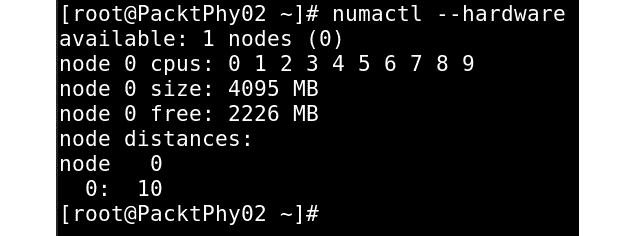

图 15.19-numactl 硬件输出

这只列出了一个节点。 即使这表示 NUMA 不可用，也可以通过运行以下命令进一步澄清：

```sh
# cat /sys/kernel/debug/sched_features
```

如果系统不支持 NUMA，这将*不会*列出 NUMA 标志。

通常，不要使 VM*比单个 NUMA 节点所能提供的宽*。 即使 NUMA 可用，vCPU 也会绑定到 NUMA 节点，而不是绑定到特定的物理 CPU。

## 了解 Numad 和 Numastat

`numad`手册页说明以下内容：

Numad 是一个守护程序，用于控制使用 NUMA 拓扑的系统上 CPU 和内存的有效使用。

`numad`也称为自动**NUMA 亲和性管理守护进程**。 它不断监视系统上的 NUMA 资源，以便动态提高 NUMA 性能。 同样，`numad`手册页说明了以下内容：

“Numad 是一个用户级守护程序，它提供放置建议和进程管理，以便在采用 NUMA 拓扑的系统上有效使用 CPU 和内存。”

`numad`是监视 NUMA 拓扑和资源使用情况的系统守护进程。 它将尝试定位进程，以实现高效的 NUMA 局部性和亲和性，并动态调整以适应不断变化的系统条件。 `numad`还提供指导，帮助管理应用程序为其进程初始手动绑定 CPU 和内存资源。 请注意，`numad`主要用于服务器整合环境，其中可能有多个应用程序或多个虚拟来宾在同一服务器系统上运行。 当进程可以在系统的 NUMA 节点的子集中进行本地化时，`numad`最有可能产生积极影响。 例如，如果整个系统专用于大型内存数据库应用程序，特别是当内存访问可能仍然不可预测时，`numad`可能不会提高性能。

要根据 NUMA 拓扑自动调整和调整 CPU 和内存资源，我们需要运行`numad`。 要将`numad`用作可执行文件，只需运行以下命令：

```sh
# numad
```

您可以检查是否已启动，如图所示：


图 15.20-检查 Numad 是否处于活动状态

一旦执行了`numad`二进制文件，它将开始对齐，如下面的屏幕截图所示。 在我们的系统中，我们运行以下虚拟机：


图 15.21-列出正在运行的虚拟机

您可以使用`numastat`命令(将在下一节中介绍)来监视运行`numad`服务前后的差异。 它将使用以下命令持续运行：

```sh
# numad -i 0
```

我们可以随时停止它，但这不会更改由`numad`配置的 NUMA 关联状态。 现在让我们转到`numastat`。

`numactl`软件包提供`numactl`二进制/命令，`numad`软件包提供`numad`二进制/命令：

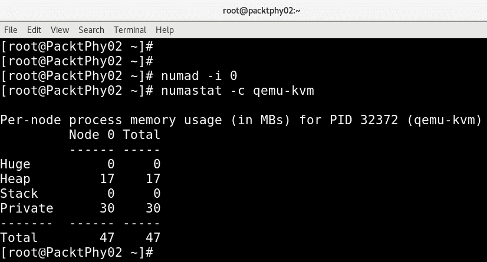

图 15.22-qemu-kvm 进程的 numastat 命令输出

重要提示：

在将 VM 转移到生产环境之前，我们使用的众多内存调优选项必须使用不同的工作负载进行彻底测试。

在我们跳到下一个主题之前，我们只想提醒您我们在本章前面提出的一点。 使用固定的资源实时迁移 VM 可能很复杂，因为您必须在目标主机上拥有某种形式的兼容资源(及其数量)。 例如，目标主机的 NUMA 拓扑不必与源主机的 NUMA 拓扑对齐。 在调优 KVM 环境时，应该考虑这一事实。 不过，自动 NUMA 平衡可能在一定程度上有助于手动固定访客资源。

# Virtio 设备调整

在虚拟化世界中，通常会与裸机系统进行比较。 准虚拟化驱动程序增强了来宾的性能，并试图保持近乎裸机的性能。 建议对完全虚拟化的来宾使用半虚拟化驱动程序，特别是当来宾正在运行 I/O 繁重的任务和应用程序时。 **Virtio**是一个用于虚拟 IO 的 API，由 Rusted Russell 开发以支持他自己的虚拟化解决方案，称为`lguest`。 引入 Virtio 是为了实现 IO 虚拟化虚拟机管理程序的通用框架。

简而言之，当我们使用半虚拟化驱动程序时，VM OS 知道它下面有一个虚拟机管理程序，因此使用前端驱动程序来访问它。 前端驱动程序是访客系统的一部分。 当存在仿真设备并且有人想要为这些设备实现后端驱动程序时，虚拟机管理程序将执行此工作。 前端和后端驱动程序通过基于 virtio 的路径进行通信。 Virtio 驱动程序是 KVM 用作半虚拟化设备驱动程序的驱动程序。 基本架构如下所示：


图 15.23-Virtio 架构

主要有两层(虚拟队列和虚拟环)来支持来宾和虚拟机管理程序之间的通信。

**虚拟队列**和**虚拟环**(**vring**)是 Virtio 中的传输机制实现。 Virt Queue(Virtio)是连接前端和后端驱动程序的队列接口。 每个 virtio 设备都有自己的 virt 队列，来自客户系统的请求被放入这些 virt 队列。 每个 virt 队列都有自己的环，称为 vring，它是 QEMU 和客户之间映射内存的位置。 在 KVM 来宾中可以使用不同的 virtio 驱动程序。

这些设备是在 QEMU 中仿真的，驱动程序是 Linux 内核的一部分，或者是为 Windows 客户提供的额外软件包。 设备/驱动程序对的一些示例如下：

*   `virtio-net`：virtio 网络设备是虚拟以太网卡。 `virtio-net`为此提供了驱动程序。
*   `virtio-blk`：virtio block设备是一个简单的虚拟块设备(即磁盘)。 `virtio-blk`为虚拟块设备提供块设备驱动程序。
*   `virtio-balloon`：virtio 内存气球设备是用于管理客户内存的设备。
*   `virtio-scsi`：virtio SCSI 主机设备将一个或多个磁盘组合在一起，并允许使用 SCSI 协议与它们通信。
*   `virtio-console`：virtio控制台设备是在来宾和主机用户空间之间进行数据输入和输出的简单设备。
*   `virtio-rng`：virtio 熵设备为客户使用提供高质量的随机性，等等。

通常，您应该在 KVM 设置中使用这些 virtio 设备以获得更好的性能。

# 块 I/O 调整

回到基本问题-虚拟机的虚拟磁盘可以是块设备，也可以是映像文件。 为了获得更好的 VM 性能，基于块设备的虚拟磁盘比驻留在远程文件系统(如 NFS、GlusterFS 等)上的镜像文件更可取。 然而，我们不能忽视文件后端帮助 virt 管理员更好地管理来宾磁盘，并且在某些情况下非常有用。 根据我们的经验，我们注意到大多数用户都使用磁盘镜像文件，特别是在性能不是很重要的情况下。 请记住，可以连接到虚拟机的虚拟磁盘总数是有限制的。 同时，不限制混合使用数据块设备和文件，并将其用作同一来宾的存储磁盘。

来宾将虚拟磁盘视为其存储。 当来宾操作系统内的应用程序将数据写入来宾系统的本地存储时，它必须经过几个层。 也就是说，该 I/O 请求必须遍历客户操作系统的存储和 I/O 子系统上的文件系统。 之后，`qemu-kvm`进程将其从来宾操作系统传递给虚拟机管理程序。 一旦 I/O 进入虚拟机管理程序的范围内，它就会像在主机操作系统中运行的任何其他应用程序一样开始处理 I/O。 在这里，您可以看到 I/O 必须通过的层数才能完成 I/O 操作。 因此，数据块设备后端的性能优于映像文件后端。

以下是我们对磁盘后端和基于文件或映像的虚拟磁盘的观察：

*   文件映像是主机文件系统的一部分，与数据块设备后端相比，它会为 I/O 操作带来额外的资源需求。
*   使用稀疏映像文件有助于过度分配主机存储，但其使用会降低虚拟磁盘的性能。
*   使用磁盘映像文件时，来宾存储分区不正确可能会导致不必要的 I/O 操作。 这里，我们提到的是标准分区单元的对齐。

在本章开始时，我们讨论了 virtio 驱动程序，它们可以提供更好的性能。 因此，建议您在配置磁盘时使用 virtio 磁盘总线，而不是 IDE 总线。 `virtio_blk`驱动程序使用 virtio API 为存储 I/O 设备提供高性能，从而提高存储性能，尤其是在大型企业存储系统中。 我们讨论了[*第 5 章*](05.html#_idTextAnchor079)，*Libvirt Storage*中提供的不同存储格式；但是，主要的存储格式是`raw`和`qcow`格式。 当您使用`raw`格式时，将获得最佳性能。 使用`qcow`时，格式层显然会带来性能开销。 因为格式层有时必须执行一些操作，例如，如果您想要增长一个`qcow`镜像，它必须分配新的集群，依此类推。 但是，如果您希望使用快照等功能，则可以选择`qcow`。 这些额外的设施以图像格式`qcow`提供。 可以在[http://www.Linux-kvm.org/page/Qcow2](http://www.Linux-kvm.org/page/Qcow2)找到一些性能比较。

I/O 调整有三个选项可以考虑，我们在[*第 7 章*](07.html#_idTextAnchor125)、*虚拟机-安装、配置和生命周期管理*中进行了讨论：

*   缓存模式
*   I/O 模式
*   I/O 调谐设备

让我们简要介绍一下一些 XML 设置，以便可以在我们的 VM 上实现它们。

缓存选项设置可以反映在来宾 XML 中，如下所示：

```sh
<disk type='file' device='disk'>
<driver name='qemu' type='raw' cache='writeback'/> 
```

I/O 模式配置的 XML 表示类似于以下内容：

```sh
<disk type='file' device='disk'>
<driver name='qemu' type='raw' io='threads'/> 
```

关于 I/O 调整，有几点补充说明：

*   可能需要限制每个来宾的磁盘 I/O，特别是当我们的设置中存在多个来宾时。
*   如果一个来宾让主机系统忙于处理由此产生的大量磁盘 I/O(嘈杂的邻居问题)，这对其他来宾来说是不公平的。

一般来说，系统/Virt 管理员有责任确保所有运行的来宾获得足够的资源来工作-换句话说，**服务质量**(**QOS**)。

尽管磁盘 I/O 不是保证 QoS 必须考虑的唯一资源，但这也有一定的重要性。 调优 I/O 可以防止来宾系统独占共享资源并降低在同一主机上运行的其他来宾的性能。 这实际上是要求，特别是当主机系统服务于**虚拟专用服务器**(**VPS**)或类似类型的服务时。 KVM 提供了在不同级别(吞吐量和 I/O 量)上进行 I/O 调节的灵活性，我们可以针对每个数据块设备进行调节。 这可以通过`virsh blkdeviotune`命令实现。 可以使用此命令设置的不同选项如下所示：

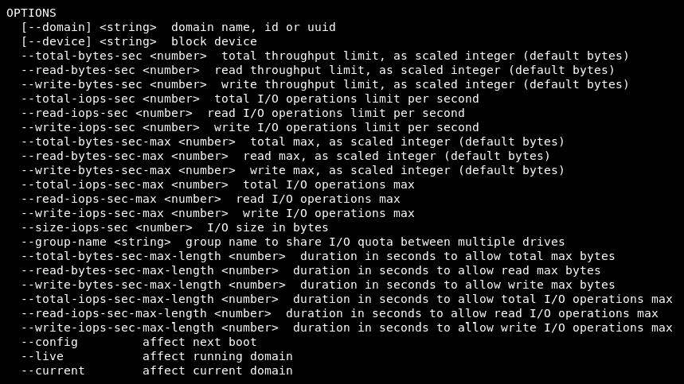

图 15.24-virsh blkdeviotune-help 命令摘录

有关`total-bytes-sec`、`read-bytes-sec`、`writebytes-sec`、`total-iops-sec`等参数的详细信息很容易从前面的命令输出中理解。 它们也记录在`virsh`命令手册页中。

例如，要将名为`SQLForNuma`的虚拟机上的`vdb`磁盘限制为每秒 200 次 I/O 操作和每秒 50 MB 吞吐量，请运行以下命令：

```sh
# virsh blkdeviotune SQLForNuma vdb --total-iops-sec 200 --total-bytes-sec 52428800
```

接下来，我们来看一下网络 I/O 调优。

# 网络 I/O 调整

我们在大多数 KVM 环境中看到的是，来自来宾的所有网络流量都将采用单一网络路径。 不会有任何流量隔离，这会在大多数 KVM设置中造成拥塞。 作为网络调优的第一步，我们建议尝试使用不同的网络或专用网络进行管理、备份或实时迁移。 但是，当您的流量有多个网络接口时，请尽量避免同一网络或网段有多个网络接口。 如果这确实在起作用，请应用此类设置中常见的一些网络调整；例如，使用`arp_filter`来控制 ARP 流量。 当虚拟机具有多个网络接口并且正在积极使用它们来回复 ARP 请求时，就会发生 ARP 流量，因此我们应该执行以下操作：

```sh
echo 1 > /proc/sys/net/ipv4/conf/all/arp_filter 
```

之后，您需要编辑`/etc/sysctl.conf`以使此设置持久。

有关 ARP 流量的更多信息，请参考[http://linux-ip.net/html/ether-arp.html#ether-arp-flux](http://linux-ip.net/html/ether-arp.html#ether-arp-flux)。

可以在驱动程序级别进行额外的调优；也就是说，到目前为止，我们知道 virtio 驱动程序提供了比模拟设备 API 更好的性能。 因此，显然应该考虑在来宾系统中使用`virtio_net`驱动程序。 当我们使用`virtio_net`驱动程序时，它在`qemu`中有一个后端驱动程序，负责从访客网络启动的通信。 尽管性能更好，但这方面的一些更多增强引入了名为`vhost_net`的新驱动程序，该驱动程序为 KVM 提供内核内 virtio 设备。 尽管 vhost 是一个通用框架，可以由不同的驱动程序使用，但网络驱动程序`vhost_net`是最早的驱动程序之一。 下面的图表将使这一点更加清晰：


图 15.25-vhost_net 体系结构

正如您可能已经注意到的，使用新的通信路径确实减少了上下文切换的数量。 好消息是，来宾系统中不需要额外的配置来支持 vhost，因为前端驱动程序没有变化。

`vhost_net`减少拷贝操作，降低延迟和 CPU 使用率，从而产生更好的性能。 首先，必须将名为`vhost_net`的内核模块(请参阅下一节中的屏幕截图)加载到系统中。 因为这是主机系统内的字符设备，所以它会在主机上创建名为`/dev/vhost-net`的设备文件。

## 如何打开它

当 QEMU 使用`-netdev tap,vhost=on`启动时，它将通过使用`ioctl()`调用实例化`vhost-net`接口。 此初始化过程将`qemu`与`vhost-net`实例绑定，以及功能协商等其他操作：

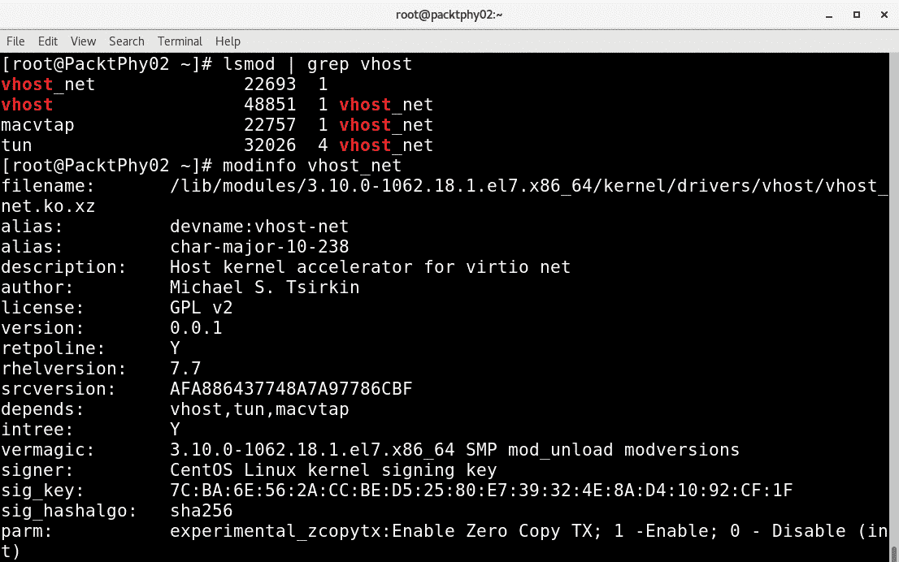

图 15.26-检查 vhost 内核模块

`vhost_net`模块可用的参数之一是`experimental_ zcopytx`。 它是做什么的？ 此参数控制称为网桥零拷贝传输的东西。 让我们看看这意味着什么(如[http://www.google.com/patents/US20110126195](http://www.google.com/patents/US20110126195)所述)：

一种用于在虚拟化环境中提供零拷贝传输的系统包括管理程序，其接收与与客户应用相关联的数据分组有关的客户操作系统(OS)请求，其中该数据分组驻留在客户 OS 的缓冲器或客户应用的缓冲器中，并且具有在联网堆栈处理期间创建的至少部分报头。 管理程序还向网络设备驱动器发送经由网络设备在网络上传输数据分组的请求，其中该请求标识驻留在客户 OS 的缓冲器或客户应用的缓冲器中的数据分组，并且管理程序抑制将数据分组复制到管理程序缓冲器。

如果您的环境使用较大的数据包大小，则配置此参数可能会产生明显的效果。 当来宾与外部网络通信时，通过配置此参数可以降低主机 CPU 开销。 在以下场景中，这不会影响性能：

*   宾客沟通
*   宾主通信
*   小数据包工作负载

此外，还可以通过启用多队列`virtio-net`来提高性能。 有关更多信息，请查看[https://fedoraproject.org/wiki/Features/MQ_virtio_net](https://fedoraproject.org/wiki/Features/MQ_virtio_net)。

使用`virtio-net`时的瓶颈之一是它的单个 RX 和 TX 队列。 即使有更多 vCPU，网络吞吐量也会受到此限制的影响。 `virtio-net`是一种单队列类型的队列，因此开发了多队列`virtio-net`。 在引入此选项之前，虚拟 NIC 无法利用 Linux 内核中提供的多队列支持。

通过在前端和后端驱动程序中引入多队列支持，解除了这一瓶颈。 这还有助于来宾使用更多 vCPU 进行扩展。 要使用两个队列启动来宾，可以将`queues`参数指定给`tap`和`virtio-net`，如下所示：

```sh
# qemu-kvm -netdev tap,queues=2,... -device virtio-net-pci,queues=2,...
```

等效的来宾 XML 如下所示：

```sh
<interface type='network'>
    <source network='default'/>
    <model type='virtio'/>
    <driver name='vhost' queues='M'/>
</interface>
```

这里，`M`可以是`1`到`8`，因为内核最多支持多队列分路设备的 8 个队列。 在客户内部为`qemu`配置之后，我们需要使用`ethtool`命令启用多队列支持。 通过`ethtool`(其中`K`的值是从`1`到`M`)启用多队列，如下所示：

```sh
# ethtool -L eth0 combined 'K'
```

您可以查看以下链接，查看多队列`virtio-net`何时提供最大的性能优势：[https://access.redhat.com/documentation/en-us/red_hat_enterprise_linux/7/html/virtualization_tuning_and_optimization_guide/sect-virtualization_tuning_optimization_guide-networking-techniques](https://access.redhat.com/documentation/en-us/red_hat_enterprise_linux/7/html/virtualization_tuning_and_optimization_guide/sect-virtualization_tuning_optimization_guide-networking-techniques)。

不要盲目使用上述URL 中提到的选项-请测试对您的设置的影响，因为在这种情况下，即使网络吞吐量令人印象深刻，CPU 消耗也会更大。

## KVM 来宾计时最佳实践

计时有不同的机制。 最著名的技术之一是**网络时间协议**(**NTP**)。 通过使用 NTP，我们可以非常精确地同步时钟，即使在使用具有抖动(可变延迟)的网络时也是如此。 在虚拟化环境中需要考虑的一件事是这样一条准则：来宾时间应该与虚拟机管理程序/主机同步，因为它会影响很多来宾操作，如果它们不同步，可能会导致不可预测的结果。

不过，实现时间同步有不同的方法；这取决于您的设置。 我们已经看到人们使用 NTP，使用`hwclock –s`从硬件时钟设置系统时钟，等等。 这里需要考虑的第一件事是尝试使 KVM 主机时间同步和稳定。 您可以使用类似 NTP 的协议来实现这一点。 一旦就位，客人的时间必须保持同步。 尽管有不同的机制可以做到这一点，但最好的选择是使用`kvm-clock`。

### KVM-时钟

`kvm-clock`也称为虚拟化感知(半虚拟化)时钟设备。 当使用`kvm-clock`时，来宾向虚拟机管理程序询问当前时间，从而保证稳定和准确的计时。 该功能是通过来宾注册页面并与管理程序共享地址来实现的。 这是来宾和虚拟机管理程序之间的共享页面。 系统管理程序会不断更新此页面，除非系统要求其停止。 客人只要想要时间信息，就可以随时阅读此页面。 但是，请注意，虚拟机管理程序应支持`kvm-clock`以供来宾使用。 有关更多详细信息，请查看[https://lkml.org/lkml/2010/4/15/355](https://lkml.org/lkml/2010/4/15/355)。

默认情况下，大多数较新的 Linux 发行版使用 CPU 寄存器**Time Stamp Counter**(**TSC**)作为时钟源。 您可以通过以下方法验证访客内部是否配置了 TSC 或`kvm_clock`：

```sh
[root@kvmguest ]$  cat /sys/devices/system/clocksource/clocksource0/current_clocksource
tsc
```

您还可以在 Linux 上使用`ntpd`或`chrony`作为时钟源，这需要最少的配置。 在您的 Linux VM 中，编辑`/etc/ntpd.conf`或`/etc/chronyd.conf`并修改*服务器*配置行，以按 IP 地址指向您的 NTP 服务器。 然后，只需启用并启动您正在使用的服务(我们在这里使用`chrony`作为示例)：

```sh
systemctl enable chronyd
systemctl start chronyd
```

还有另一个更新的协议正在大力推动时间同步，它被称为**精确时间协议**(**PTP**)。 如今，这正在成为在主机级使用的事实上的标准服务。 目前市场上的许多网卡都直接在硬件(如网络接口卡)中支持该协议。 因为它基本上是基于硬件的，所以它应该比`ntpd`或`chronyd`更精确。 它使用网络接口、外部来源和计算机系统时钟上的时间戳进行同步。

安装所有必要的必备组件只需一条`yum`命令即可启用和启动服务：

```sh
yum -y install linuxptp
systemctl enable ptp4l
systemctl start ptp4l
```

默认情况下，`ptp4l`服务将使用`/etc/sysconfig/ptp4l`配置文件，该文件通常绑定到第一个网络接口。 如果您想使用其他网络接口，最简单的做法是编辑配置文件，更改接口名称，然后通过`systemctl`重新启动服务。

现在，从虚拟机的角度来看，我们可以通过执行一些配置来帮助它们实现时间同步。 我们可以将`ptp_kvm`模块添加到全局 KVM 主机配置中，这将使我们的 PTP 作为服务提供给`chronyd`作为时钟源。 这样，我们就不需要做很多额外的配置。 因此，只需将`ptp_kvm`作为字符串添加到默认 KVM 配置中，如下所示：

```sh
echo ptp_kvm > /etc/modules-load.d/kvm-chrony.conf
modprobe ptp_kvm
```

通过这样做，将在`/dev`目录中创建一个`ptp`设备，然后我们可以将其用作`chrony`时间源。 将以下行添加到`/etc/chrony.conf`并重新启动`chronyd`：

```sh
refclock PHC /dev/ptp0 poll 3 dpoll -2 offset 0
systemctl restart chronyd
```

通过使用 API 调用，所有个 Linux 虚拟机都能够从运行它们的物理主机获取时间。

现在，我们已经介绍了性能调优和优化方面的大量 VM 配置选项，现在是时候摆脱所有这些小步骤，专注于更大的图景了。 到目前为止，我们在 VM 设计方面介绍的所有内容(与 CPU、内存、NUMA、virtio、块、网络和时间配置相关)都与我们使用它的目的一样重要。 回到我们最初的场景-SQL VM-让我们看看如何根据要在其上运行的软件来正确配置我们的 VM。

## 基于软件的设计

还记得我们最初的场景吗？其中涉及一个基于 Windows Server 2019 的虚拟机，该虚拟机应该是 Microsoft SQLServer 集群中的一个节点。 我们在调优方面介绍了很多设置，但是还有更多的事情要做--更多。 我们需要问几个问题。 我们越早问这些问题越好，因为它们将对我们的设计产生关键影响。

我们可能会问以下几个问题：

*   对不起，亲爱的客户，您说*群集*是什么意思，因为有不同的 SQL Server 群集方法？
*   您拥有或计划购买哪些 SQL 许可证？
*   您是否需要主动-主动、主动-被动、备份解决方案或其他什么？
*   这是单站点群集还是多站点群集？
*   您到底需要哪些 SQL 功能？
*   你有哪些执照，愿意花多少钱？
*   您的应用程序是否能够使用 SQL 集群(例如，在多站点场景中)？
*   你们有什么样的存储系统？
*   您的存储系统可以提供多少 IOPS？
*   您的存储延迟如何？
*   您是否有不同层的存储子系统？
*   就 IOPS 和延迟而言，这些层的服务级别是什么？
*   如果您有多个存储层，我们是否可以根据最佳做法创建 SQL 虚拟机-例如，将数据文件和日志文件放在单独的虚拟磁盘上？
*   您是否有足够的磁盘容量来满足您的要求？

这些只是许可、群集和存储相关的问题，它们不会消失。 他们需要毫不犹豫地被问到，我们需要在部署之前得到真正的答案。 我们刚才提到了 14 个问题，但实际上还有很多问题。

此外，我们还需要考虑 VM 设计的其他方面。 谨慎的做法是问一些问题，如以下几个问题：

*   您可以为 SQL VM 提供多少内存？
*   您有哪些服务器，它们使用哪些处理器，每个插槽有多少内存？
*   您是否在使用任何最新一代的技术，例如永久内存？
*   您是否有关于设计此 SQL 基础设施所针对的查询规模和/或数量的任何信息？
*   在这个项目中，钱是一个重要的决定性因素吗(因为它将影响许多设计决策，因为 SQL 是按内核授权的)？ 此外，还有标准定价与企业定价的问题。

这一堆问题实际上指向虚拟机设计的一个非常、非常重要的部分，它与内存、内存位置、CPU 和内存之间的关系有关，也是数据库设计中最基本的问题之一-延迟。 这在很大程度上与正确的 VM 存储设计有关-正确的存储控制器、存储系统、缓存设置等，以及 VM 计算设计-这一切都与 NUMA 有关。 我们已经在本章中解释了所有这些设置。 因此，要正确配置我们的 SQL VM，下面列出了我们应该遵循的高级步骤：

*   使用正确的 NUMA 设置和本地内存配置虚拟机。 出于许可原因，从四个 vCPU 开始，然后确定是否需要更多 vCPU(例如，如果您的虚拟机 CPU 受限，您将从性能图表和基于 SQL 的性能监控工具中看到)。
*   如果要保留 CPU 容量，请使用 CPU 固定，以便物理服务器的 CPU 上的特定 CPU 核心始终用于 SQL VM，并且仅限于此。 将其他虚拟机隔离到剩余的*个*个核心。
*   为 SQL VM 预留内存，这样它就不会交换内存，因为只使用实际 RAM 内存可以保证性能流畅，不会受到嘈杂邻居的影响。
*   如有必要，请按虚拟机配置 KSM，并避免在 SQL 虚拟机上使用它，因为它可能会引入延迟。 在设计阶段，请确保购买尽可能多的 RAM 内存，这样内存就不会成为问题，因为如果服务器没有足够的内存，这将是一个非常昂贵的性能问题。 不要*过量使用*内存。
*   为虚拟机配置多个虚拟硬盘，并将这些硬盘放入能够提供延迟、开销和缓存方面所需服务级别的存储中。 请记住，操作系统磁盘不一定需要写缓存，但数据库和日志磁盘将从中受益。
*   从主机到存储设备使用单独的物理连接，并调整存储以获得尽可能高的性能。 不要超额订阅-无论是在链路级别(太多虚拟机通过相同的基础架构连接到*个相同的*存储设备)还是在数据存储区级别(不要将一个数据存储区放在一个存储设备上并将所有虚拟机存储在上面，因为这会对性能产生负面影响-隔离工作负载、通过多个链路创建多个目标以及使用掩蔽和分区)。
*   配置多路径、负载平衡和故障转移-可以从您的存储中获得尽可能高的性能，当然也要有冗余性。
*   安装正确的 virtio 驱动程序，必要时使用 vhost 驱动程序或 SR-IOV，并将每个级别的开销降至最低。
*   调整虚拟机来宾操作系统-关闭不必要的服务，将电源配置文件切换到`High Performance`(由于某些原因，大多数 Microsoft 操作系统都有将电源配置文件设置为`Balanced`模式的默认设置)。 调整 BIOS 设置，并从上到下检查固件和操作系统更新-所有内容。 在更新和更改配置时记下笔记、测量、基准测试，并使用以前的基准测试作为基准，以便您知道要走哪条路。
*   使用 iSCSI 时，请像大多数使用情形一样配置巨型帧，这将对存储性能产生积极影响，并确保您查看存储设备供应商的文档，了解有关这方面的任何最佳做法。

本章的要点如下--不要仅仅因为客户要求你安装应用程序就盲目地安装它。 以后它会困扰着你，解决任何类型的问题和抱怨都会困难得多。 慢慢来，做好这件事。 阅读文档为整个过程做好准备，因为文档随处可见。

# 摘要

在本章中，我们做了一些深入研究，深入到了 KVM 性能调优的领域。 我们讨论了许多不同的技术，从简单的技术(如 CPU 固定)到复杂得多的技术(如 NUMA 和正确的 NUMA 配置)。 不要因此而犹豫不决，因为学习设计是一个过程，正确的设计是一项可以通过学习和经验不断改进的技艺。 这样想吧--建筑师在设计世界上最高的摩天大楼时，不是每一座新的最高建筑都把球门柱越移越远吗？

在下一章(本书的最后一章)中，我们将讨论对您的环境进行故障排除。 这至少部分与本章有关，因为我们还将对一些与性能相关的问题进行故障排除。 在切换到故障排除章节之前，反复阅读本章-这将对您的整个学习过程非常非常有益。

# 问题

1.  什么是 CPU 钉住？
2.  KSM 是做什么的？
3.  我们如何提高数据块设备的性能？
4.  我们如何调整网络设备的性能？
5.  我们如何在虚拟化环境中同步时钟？
6.  我们如何配置 NUMA？
7.  我们如何配置 NUMA 和 KSM 以协同工作？

# 进一步阅读

有关详细信息，请参阅以下链接：

*   RedHat Enterprise Linux 7-在 RHEL 物理机上安装、配置和管理 VM：[https://access.redhat.com/documentation/en-us/red_hat_enterprise_linux/7/html/virtualization_deployment_and_administration_guide/index](https://access.redhat.com/documentation/en-us/red_hat_enterprise_linux/7/html/virtualization_deployment_and_administration_guide/index)
*   VCPU 锁定：[http://libvirt.org/formatdomain.html#elementsCPUTuning](http://libvirt.org/formatdomain.html#elementsCPUTuning)
*   Ksm 内核文档：[https://www.kernel.org/doc/Documentation/vm/ksm.txt](https://www.kernel.org/doc/Documentation/vm/ksm.txt)
*   帖子主题：Re：Колибриобработельныйпрограммированияпрограммированияпрограммется
*   自动 NUMA 平衡：[https://www.redhat.com/files/summit/2014/summit2014_riel_chegu_w_0340_automatic_numa_balancing.pdf](https://www.redhat.com/files/summit/2014/summit2014_riel_chegu_w_0340_automatic_numa_balancing.pdf)
*   Virtio1.1 规范：[http://docs.oasis-open.org/virtio/virtio/v1.1/virtio-v1.1.html](http://docs.oasis-open.org/virtio/virtio/v1.1/virtio-v1.1.html)
*   ARP 流量：[http：//linux-ip.net/html/ether-arp.html#ether-arp-Flux](http://Linux-ip.net/html/ether-arp.html#ether-arp-flux)
*   发帖主题：Re：Колибриобработельныйпрограммированияпрограмма。
*   RHEL 7 上的 libvirt NUMA 优化：[https://access.redhat.com/documentation/en-us/red_hat_enterprise_linux/7/html/virtualization_tuning_and_optimization_guide/sect-virtualization_tuning_optimization_guide-numa-numa_and_libvirt](https://access.redhat.com/documentation/en-us/red_hat_enterprise_linux/7/html/virtualization_tuning_and_optimization_guide/sect-virtualization_tuning_optimization_guide-numa-numa_and_libvirt)**