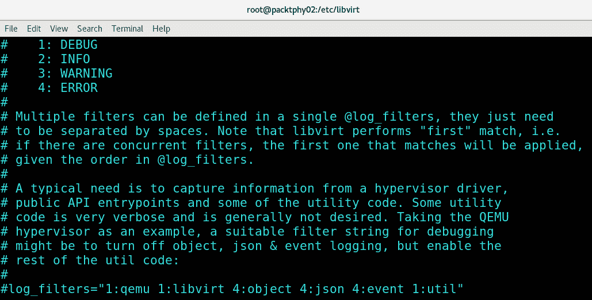
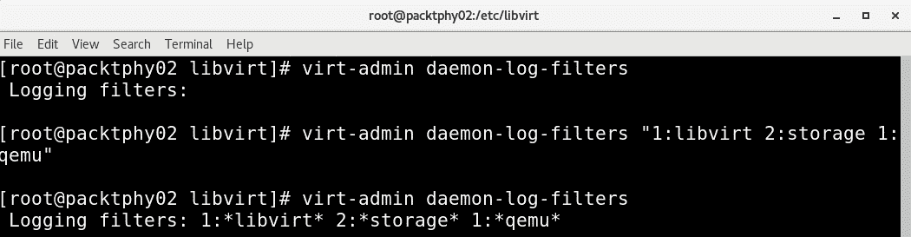

# *第 16 章*：KVM 平台故障排除指南

如果你从[*第 1 章*](01.html#_idTextAnchor016)，*了解 Linux 虚拟化*一直读到这本书，那么你就会知道我们在本书中一起经历了*很多*--成百上千页的概念和实践方面，包括配置示例、文件和命令--无所不包。 700 页左右。 到目前为止，我们几乎完全忽略了故障排除作为这一过程的一部分。 我们这样做的前提并不是所有的东西都能在 Linux 上运行*，而且我们没有任何问题，而且在从头到尾看这本书的过程中，我们达到了*涅槃*的状态。*

这是一次充满各种问题的旅程。 有些是我们自己的错误，不值一提。 我们犯的这些错误(您肯定也会犯更多错误)主要是因为我们(在命令或配置文件中)输入了错误的内容。 基本上，人类在 IT 中扮演着重要角色。 但其中一些问题相当令人沮丧。 例如，实施 SR-IOV 需要大量时间，因为我们必须在硬件、软件和配置级别找到不同类型的问题才能使其正常工作。 正如我们稍后将解释的那样，oVirt 相当古怪。 委婉地说，桉树很有趣。 虽然我们以前经常使用它*，但 cloudbase-init 确实很复杂，需要我们花费大量时间和精力，事实证明这并不是因为我们做了什么-它只是 cloudbase-init 版本。 但总体而言，这只是进一步证明了我们上一章中的一个一般性观点-阅读书籍、文章和博客文章中的各种 IT 主题-是从一开始就正确配置许多东西的一个非常好的方法。 但即便如此，您仍需要进行一些故障排除，才能使一切都完美无瑕。*

 *一旦你安装了一项服务并开始使用它，一切都会变得很棒和令人惊叹，但这种情况在第一次就很少发生。 我们在本书中使用的所有内容实际上都是为了使我们能够测试不同的配置并获取必要的屏幕截图，但同时，我们希望确保它们能够以更结构化、更程序化的方式进行实际安装和配置。

那么，让我们从一些与服务、包和日志记录相关的简单事情开始。 然后，我们将继续介绍故障排除的更高级概念和工具，并通过我们在此过程中介绍的各种示例进行描述。

在本章中，我们将介绍以下主题：

*   验证 KVM 服务状态
*   KVM 服务日志记录
*   启用调试模式日志记录
*   高级故障排除工具
*   KVM 问题故障排除的最佳实践

# 验证 KVM 服务状态

我们从所有示例中最简单的示例开始-验证 KVM 服务状态及其对主机配置的一些正常影响。

在[*第 3 章*](03.html#_idTextAnchor049)，*安装 KVM Hypervisor、libvirt 和 ovirt*中，我们通过安装`virt module`并使用`dnf`命令部署各种包，对整个 KVM 堆栈进行了基本安装。 有几个原因说明这最终可能不是一个好主意：

*   A lot of servers, desktops, workstations, and laptops come pre-configured with virtualization turned off in BIOS. If you're using an Intel-based CPU, make sure that you find all the VT-based options and enable them (VT, VT-d, VT I/O). If you're using an AMD-based CPU, make sure that you turn on AMD-V. There's a simple test that you can do to check if virtualization is enabled. If you boot any Linux live distribution, go to the shell and type in the following command:

    ```sh
    cat /proc/cpuinfo | egrep "vmx|svm"
    ```

    如果您已经安装了 Linux 主机和我们在[*第 3 章*](03.html#_idTextAnchor049)，*安装 KVM 虚拟机管理程序、libvirt 和 ovirt*中提到的相应软件包，则还可以使用以下命令：

    ```sh
    virt-host-validate
    ```

    如果您没有从该命令获得任何输出，那么您的系统要么不支持虚拟化(可能性较小)，要么没有打开虚拟化功能。 请确保检查您的 BIOS 设置。

*   您的网络配置和/或程序包存储库配置可能未正确设置。 正如我们将在本章反复说明的那样，请从最简单的事情开始--不要开始试图寻找某些东西不起作用的超级复杂原因的旅程。 保持简单。 对于网络测试，请尝试在一些知名服务器(如 google.com)上使用`ping`命令。 对于存储库问题，请确保检查您的`/etc/yum.repos.d`目录。 尝试使用`yum clean all`和`yum update`命令。 除了 CentOS/Red Hat 之外，存储库问题更有可能发生在其他一些发行版上，但它们仍然可能发生。
*   After the deployment process has finished successfully, make sure that you start and enable KVM services by using the following commands:

    ```sh
    systemctl enable libvirtd libvirt-guests
    systemctl start libvirtd libvirt-guests
    ```

    通常，我们忘记启动并启用`libvirt-guests`服务，然后在重新启动主机后感到非常惊讶。 未启用`libvirt-guests`的结果很简单。 启动时，它会在您启动关闭时挂起您的虚拟机，并在下一次引导时恢复它们。 换句话说，如果您不启用它们，您的虚拟机将不会在下次重启后恢复。 另外，请查看其配置文件`/etc/sysconfig/libvirt-guests`。 它是一个简单的文本配置文件，使您能够配置至少三个非常重要的设置：`ON_SHUTDOWN`、`ON_BOOT`和`START_DELAY`。 让我们来解释一下这些内容：

    A)通过使用`ON_SHUTDOWN`设置，我们可以选择关闭您的主机时虚拟机会发生什么情况，因为它接受`shutdown`和`suspend`等值。

    B)`ON_BOOT`选项正好相反-它告诉`libvirtd`是否需要在主机引导时启动所有虚拟机，无论它们的自动启动设置是什么。 它接受像`start`和`ignore`这样的值。

    C)第三个选项`START_DELAY`允许您在主机启动时设置多个虚拟机开机操作之间的超时值(以秒为单位)。 它接受数值，其中`0`是并行启动的值，*所有其他(正)数字*是它在启动下一个虚拟机之前等待的秒数。

考虑到这一点，至少有三件事需要记住：

*   Make sure that these two services are actually running by typing in the following commands:

    ```sh
    systemctl status libvirtd
    systemctl status libvirt-guests
    ```

    至少需要启动`libvirtd`，我们才能创建或运行 KVM 虚拟机。

*   如果您正在配置 SR-IOV 等更高级的设置，请确保阅读服务器手册以选择与 SR-IOV 兼容的正确插槽。 最重要的是，确保您有一个兼容的 PCI Express 卡和正确配置的 BIOS。 否则，你就不能让它工作了。
*   启动 libvirt 服务时，它通常附带某种预定义的防火墙配置。 请记住这一点，以防您决定禁用 libvirt 服务，因为防火墙规则几乎始终存在。 这可能需要一些额外的配置。

故障排除之旅的下一步将检查一些日志文件。 有很多可供选择的-kvm 有自己的，oVirt 有自己的，Eucalyptus、elk 等等。 因此，请确保您非常了解这些服务，以便您可以针对您试图排除故障的情况检查正确的日志文件。 让我们从 KVM 服务日志记录开始。

# KVM 服务日志记录

在讨论KVM 服务日志记录时，我们需要注意几个位置：

*   假设您在 GUI 中以 root 用户身份登录，并启动了 virt-manager。 这意味着您在`/root/.cache/virt-manager`目录中有一个`virt-manager.log`文件。 它真的很冗长，所以通读时要有耐心。
*   `/etc/libvirt/libvirtd.conf`文件是 libvirtd 的配置文件，包含许多有趣的选项，但一些最重要的选项实际上几乎位于文件的末尾，与审计相关。 您可以选择注释掉的选项(`audit_level`和`audit_logging`)来满足您的需要。
*   `/var/log/libvirt/qemu`目录包含曾经在 KVM 主机上创建的所有虚拟机的日志和轮换日志。

此外，请确保签出名为`auvirt`的命令。 它非常方便，因为它告诉您有关 KVM 主机上的虚拟机的基本信息-包括仍然在那里和/或成功运行的虚拟机，以及我们试图安装但失败的虚拟机。 它从审计日志中提取数据，您还可以使用它来显示我们需要的特定虚拟机的信息。 它还有一个非常调试级别的选项，称为`--all-events`，如果您想要检查任何曾经是(或现在仍然是)KVM 主机上的对象的虚拟机的每一个细节。

# 启用调试模式日志记录

登录 KVM 还有另一种方法：配置调试日志。 在我们刚才提到的 libvirtd 配置文件中，您可以使用其他设置来配置此选项。 因此，如果我们向下滚动到`Logging controls`部分，以下是我们可以使用的设置：

*   `log_level`
*   `log_filters`
*   `log_outputs`

让我们一步一步地解释一下。 第一个选项-`log_level`-描述日志详细程度。 自 libvirt 版本 4.4.0 以来，该选项已弃用。 在该文件的`Logging controls`部分中，有硬编码到该文件中的附加文档，以使事情变得更容易。 对于此特定选项，文档如下所述：


图 16.1-在 libvirtd.conf 中记录控件

人们通常做的是查看输出的第一部分(日志级别描述)，转到最后一行(`Iog_level`)，将其设置为 1，保存，重新启动`libvirtd`服务，然后完成操作。 问题在于中间的文本部分。 它特别说明了`journald`进行了速率限制，这样它就不会受到仅来自一个服务的日志的冲击，并指示我们改用`log_filters`设置。

让我们这样做，然后-让我们使用`log_filters`。 在配置文件中稍低一点的位置，有一个部分如下所示：



图 16.2-libvirtd.conf 中的日志记录过滤器选项

这为我们提供了各种选项，我们可以使用这些选项为每个对象类型设置不同的日志记录选项，这非常棒。 它为我们提供了在所需级别增加我们感兴趣的内容的冗余度的选项，同时将其他对象类型的冗余度保持在最低水平。 我们需要做的是删除最后一行的注释部分(`#log_filters="1:qemu 1:libvirt 4:object 4:json 4:event 1:util"`应该变成`log_filters="1:qemu 1:libvirt 4:object 4:json 4:event 1:util"`)，并配置它的设置，使它们符合我们的要求。

第三个选项与我们希望调试日志输出文件所在的位置有关：


图 16.3-libvirtd.conf 中的记录输出选项

重要注

更改其中任何设置后，我们需要确保通过键入`systemctl restart libvirtd`命令重新启动`libvirtd`服务。

如果我们只对客户端日志感兴趣，则需要将名为`LIBVIRT_LOG_OUTPUTS`的环境变量设置为如下所示(假设我们希望进行调试级别的日志记录)：

```sh
export LIBVIRT_LOG_OUTPUTS="1:file:/var/log/libvirt_guests.log"
```

所有这些选项在下一次`libvirtd`服务重新启动之前都有效，这对于永久设置非常方便。 但是，当我们需要进行一些动态调试时，我们可以使用一个运行时选项，而无需求助于永久配置。 这就是为什么我们有一个名为`virt-admin`的命令。 我们可以用它来设置我们自己的设置。 例如，让我们看看如何使用它来获取当前设置，然后如何使用它来设置临时设置：



图 16.4-运行时 libvirtd 调试选项

我们还可以通过发出以下命令来删除这些设置：

```sh
virt-admin daemon-log-filters ""
```

这是我们在完成调试后明确推荐的内容。 我们不想无缘无故地使用我们的日志空间。

就直接调试虚拟机而言-除了这些日志记录选项-我们还可以使用串行控制台仿真来挂接到虚拟机控制台。 如果我们不能以任何其他方式访问虚拟机，特别是如果我们的环境中没有使用 GUI(在生产环境中通常就是这种情况)，我们就会这样做。 访问控制台的方式如下：

```sh
virsh console kvm_domain_name
```

在前面的命令中，`kvm_domain_name`是我们希望通过串行控制台连接到的虚拟机的名称。

# 高级故障排除工具

根据主题(网络、硬件和软件问题或特定的应用程序问题)的不同，我们可以使用不同的工具来解决我们环境中的问题。 让我们简要回顾一下其中的一些方法，并在排除故障时牢记本书的各个章节：

*   OVirt 问题
*   有关快照和模板的问题
*   虚拟机自定义问题
*   Accessibles
*   OpenStack 问题
*   桉树和 AWS 组合问题
*   麋鹿堆栈问题

有趣的是，在处理 KVM 虚拟化时，我们通常不会遇到网络问题。 从 KVM 网桥一直到打开 vSwitch，它都有很好的文档记录，这只是一个遵循文档的问题。 唯一的例外是与防火墙规则相关的规则，这可能很麻烦，特别是在处理 oVirt 和远程数据库连接时，同时保持最小的安全占用空间。 如果您对此感兴趣，请确保查看以下链接：[https://www.ovirt.org/documentation/installing_ovirt_as_a_standalone_manager_with_remote_databases/#dns-requirements_SM_remoteDB_deploy](https://www.ovirt.org/documentation/installing_ovirt_as_a_standalone_manager_with_remote_databases/#dns-requirements_SM_remoteDB_deploy)。

这篇文章后面有一个很大的端口表，描述了哪些端口用于什么协议以及它们使用哪些协议。 此外，还有一个需要在 oVirt 主机级别配置的端口表。 如果您要将 oVirt 投入生产，我们建议您使用本文。

## oVirt

在处理 oVirt 时，我们经常会遇到两个常见问题：

*   *安装问题*：在引擎设置中键入安装选项并正确配置时，我们需要放慢速度。
*   *更新问题*：这些问题可能与未正确更新 oVirt 或底层系统有关。

安装问题非常容易排除，因为它们通常发生在我们刚刚开始部署 oVirt 时。 这意味着我们可以享受停止安装过程并从头开始的奢侈。 其他的一切都会变得过于混乱和复杂。

然而，更新问题值得特别提及。 让我们来处理 oVirt 更新问题的两个子集，并更详细地解释它们。

更新 oVirt 引擎本身需要做我们大多数人都不喜欢做的事情-阅读成堆的文档。 我们需要检查的第一件事是我们运行的是哪个版本的 oVirt。 例如，如果我们运行的是 4.3.0 版本，并且我们想要升级到 4.3.7，那么这是一个非常简单的次要更新路径。 我们需要首先备份 oVirt 数据库：

```sh
engine-backup --mode=backup --file=backupfile1 --log=backup.log
```

我们这样做只是为了防患于未然。 然后，稍后，如果确实有什么东西损坏，我们可以使用以下命令：

```sh
engine-backup --mode=restore --log=backup.log --file=backupfile1 --provision-db --provision-dwh-db --no-restore-permissions 
```

如果您没有部署 DWH 服务及其数据库，则可以忽略`--provision-dwh-db`选项。 然后，我们可以执行标准程序：

```sh
engine-upgrade-check
yum update ovirt\*setup\*
engine-setup
```

这应该需要大约 10 分钟，而且不会造成任何伤害。 但是，为了安全起见，并在这样做之前备份数据库仍然是最好的。

但是，如果我们要从某个旧版本的 oVirt 迁移到最新版本-比如说，从版本 4.0.0、4.1.0 或 4.2.0 迁移到版本 4.3.7-那就是完全不同的过程了。 我们需要访问 ovirt.org 网站并通读文档。 例如，假设我们正在从 4.0 更新到 4.3。 Ovirt.org 上有描述所有这些过程的文档。 您可以从这里开始：[https://www.ovirt.org/documentation/upgrade_guide/](https://www.ovirt.org/documentation/upgrade_guide/)。

这将给我们提供 20 个左右的子步骤，我们需要完成这些步骤才能成功升级。 请小心和耐心，因为这些步骤是按照非常清晰的顺序编写的，需要以这种方式执行。

现在我们已经介绍了升级方面的 oVirt 故障排除，让我们深入研究*操作系统和软件包升级*，因为这是一个完全不同的讨论，需要考虑更多。

请记住，oVirt 有其自己的先决条件，从 CPU、内存和存储要求到防火墙和存储库要求，我们不能盲目地使用如下所示的系统范围命令：

```sh
yum -y update
```

我们不能指望 oVirt 对此感到满意。 它就是不会，这种情况在我们身上已经发生过很多次了，无论是在生产环境中还是在写这本书的时候。 我们需要检查要部署哪些包，并检查它们是否与 oVirt 存在某种相互依赖的关系。 如果有这样的软件包，您需要确保执行我们在本章前面提到的引擎备份过程。 它会把你从很多问题中解救出来。

不仅仅是 oVirt 引擎可能是个问题-*更新 oVirt 清单中的 KVM 主机*也可能是相当戏剧性的。 通过 oVirt 引擎或我们的手动安装过程在主机上部署的 oVirt 代理(`vdsm`)及其组件也有自己的相互依赖关系，可能会受到系统范围的`yum -y update`命令的影响。 因此，在接受升级之前，请先拉上手刹，因为这可能会给以后带来很大的痛苦。 确保检查`vdsm`日志(通常位于`/var/log/vdsm`目录中)。 当您试图破译`vdsm`出了什么问题时，这些日志文件非常有用。

## oVirt 和 KVM 存储问题

我们遇到的大多数存储问题通常与向主机呈现的 LUN 或共享有关。 具体地说，当您处理数据块存储(光纤通道或 iSCSI)时，我们需要确保不从主机分区或掩蔽 LUN，因为主机看不到它。 同样的原理也适用于 NFS 共享、Gluster、CEPH 或我们正在使用的任何其他类型的存储。

除了这些预配置问题之外，最常见的问题与故障转移有关--一种通向存储设备的路径出现故障的情况。 如果我们稍微向外扩展存储或存储网络基础架构，我们就会非常高兴-我们添加了额外的适配器、额外的交换机、配置的多路径(MPIO)等等。 请确保查看存储设备供应商的文档，并遵循特定存储设备的最佳实践。 请相信我们-iSCSI 存储配置及其默认设置与配置光纤通道存储截然不同，尤其是在涉及多路径时。 例如，当将 MPIO 与 iSCSI 一起使用时，如果您正确配置它，它会更令人愉快和更快。 您将在本章末尾的*进一步阅读*一节中找到有关此过程的更多详细信息。

如果您使用基于 IP 的存储，请确保指向您的存储设备的多条路径使用个独立的 IP 子网，因为其他任何情况都不是好主意。 类似 LACP 的技术和 iSCSI 不能同时工作，您将排除一项不适合存储连接且工作正常的技术的故障，而您却认为它不适用于存储连接。 我们需要知道我们正在排除什么故障；否则，排除故障就没有意义了。 为 iSCSI 创建 LACP 等同于仍然为 iSCSI 连接使用一条路径，这意味着浪费不会主动使用的网络连接，除非在故障转移的情况下。 为此，您并不真的需要 LACP 或类似的技术。 一个值得注意的例外可能是刀片式服务器，因为您在刀片式服务器上的升级选项非常有限。 但即便如此，*我们需要更多带宽从主机到存储*问题的解决方案是获得更快的网络或光纤通道适配器。

## 快照和模板问题-虚拟机自定义

老实说，在从事各种虚拟化技术(包括 Citrix、Microsoft、VMware、Oracle 和 Red Hat)的多年工作中，我们看到了很多不同的快照问题。 但是，只有当您开始在企业 IT 部门工作，并了解到操作、安全和备份过程有多么复杂时，您才会开始意识到创建快照这样的*简单*过程有多危险。

我们已经看到了如下情况：

*   备份应用程序不想启动，因为虚拟机有一个快照(通用快照)。
*   快照不想删除和组装。
*   多个快照不想删除和组装。
*   由于奇怪的原因，快照会使虚拟机崩溃。
*   快照使虚拟机崩溃的原因是正当的(存储上磁盘空间不足)
*   快照会使在虚拟机中运行的应用程序崩溃，因为该应用程序不知道如何在快照之前进行自我整理并进入脏状态(VSS、同步问题)
*   快照稍有误用，就会发生问题，我们需要进行故障排除
*   快照被严重滥用，总会发生一些事情，我们需要进行故障排除

最后一种场景发生的频率远远超出预期，因为如果获得许可，人们真的倾向于展示他们拥有的快照数量。 我们已经看到具有 20 多个快照的虚拟机在生产环境中运行，人们抱怨它们太慢。 在这种情况下，您所能做的就是吸气、呼气、耸耸肩，然后问：“您希望这 20 多个快照能提高您的虚拟机的速度吗？”

通过这一切，让我们度过所有这些问题的是三个基本原则：

*   真正了解快照在任何给定技术上的工作原理。
*   确保每次我们想到使用快照时，都会先检查虚拟机所在的数据存储区上的可用存储空间量，然后检查虚拟机是否已有快照。
*   不断重复这句口头禅：*快照并不是我们所有客户的备份*，一遍又一遍地重复，并用额外的文章和链接猛烈抨击它们，解释它们为什么需要停止快照，即使这意味着拒绝某人甚至拒绝拍摄快照的许可。

实际上，在我们遇到的许多环境中，最后这个已经成为事实上的策略。 我们甚至看到一些公司在处理快照时实施了全面的政策，声明公司的政策是在有限的时间内最多拥有一到两个快照。 例如，在 VMware 环境中，您可以分配一个虚拟机高级属性，该属性将最大快照数设置为 1(使用名为`snapshot.maxSnapshots`的属性)。 在 KVM 中，您将不得不在这些情况下使用基于存储的快照，并希望存储系统具有基于策略的功能，可以将快照数量设置为某个值。 但是，这种情况与在许多环境中使用基于存储的快照的想法背道而驰。

模板和虚拟机定制是另一个完全不同的故障排除领域。 除了我们在第 8 章，*创建和修改 VM 磁盘、模板和快照*中提到的与在 Windows 计算机上连续使用`sysprep`相关的警告之外，模板化很少会产生问题。 如今，创建 Linux 模板非常简单，人们使用`virt-sysprep`、`sys-unconfig`或自定义脚本来实现这一点。 但下一步-与虚拟机定制相关-是完全不同的事情。 在使用 cloudbase-init 时尤其如此，因为 cloud-init 多年来一直是在云环境中预配置 Linux 虚拟机的标准方法。

以下是我们在使用 cloudbase-init 时遇到的一些问题的简短列表：

*   由于`Cannot load user profile: the device is not ready`，cloudbase-init 失败。
*   域加入不可靠。
*   网络设置过程中出错。
*   通过 cloudbase-init 重置 Windows 密码。
*   获取 cloudbase-init 以从指定目录执行 PowerShell 脚本。

这些问题和其他问题中的绝大多数都与 cloudbase-init 有非常糟糕的文档这一事实有关。 它确实有一些配置文件示例，但大多数都与 API 或编程方法有关，而不是通过示例实际解释如何创建某种配置。 此外，正如我们在[*第 10 章*](10.html#_idTextAnchor182)，*自动化 Windows 来宾部署和定制*中提到的，不同版本存在各种问题。 然后我们选择了预发布版本，该版本开箱即用，配置文件不适用于稳定版本。 但总的来说，我们在尝试使其正常工作时遇到的最大问题与如何使其与 PowerShell 正确配合有关。 如果我们让它正确地执行PowerShell 代码，我们几乎可以在基于 Windows 的系统上配置任何我们想要的东西，所以这是一个大问题。 有时，它不想从 Windows 系统盘上的随机目录执行 PowerShell 脚本。

确保你使用本书中的例子作为你的起点。 我们有意在[*第 10 章*](10.html#_idTextAnchor182)，*自动化 Windows 来宾部署和自定义*中尽可能简单地提供示例，其中包括已执行的 PowerShell 代码。 然后，展开你的翅膀飞起来--做任何需要做的事情。 当您使用基于 Microsoft 的解决方案(包括本地解决方案和混合解决方案)时，PowerShell 会让一切变得更简单、更自然。

## 使用 Ansible 和 OpenStack 时出现问题

我们与 Ansible 和 OpenStack 的第一次互动发生在几年前--Ansible 是在 2012 年推出的，OpenStack 是在 2010 年推出的。 我们一直认为这两个都是非常酷的工具包，尽管有一些问题。 其中一些小问题与快速开发(OpenStack)有关，每个版本都要解决大量的 bug。

在这个问题上，我们和很多人争执不下--前一天，这个话题跟*我们习惯用傀儡有关，我们为什么需要*？！；第二天是*啊，这个语法太复杂了*；第二天又是另一个东西，又是另一个…。 这通常只是因为 Ansible 体系结构在体系结构方面比所有这些体系结构都要简单得多，而且在语法方面要稍微复杂一些--至少在开始时是这样。 使用 Ansible，一切都与语法有关，因为我们确信您要么知道，要么很快就会知道。

排除 Ansible 攻略的故障通常是一个过程，有 95%的可能性是我们在配置文件中拼写错误或键入错误。 我们谈论的是最初的阶段，在这个阶段，你已经有机会与 Ansible 合作一段时间了。 请确保重新检查 Ansible 命令的输出，并使用它们的输出。 从这个意义上说，它真的很棒。 您不需要进行复杂的配置(例如，使用`libvirtd`)就可以从执行的过程和剧本中获得可用的输出。 这让我们的工作轻松多了。

对 OpenStack 进行故障排除是一种完全不同的蠕虫罐头。 有一些详细记录的 OpenStack 问题，这些问题也可能与特定的设备有关。 让我们使用其中的一个例子-查看以下链接了解使用 NetApp 存储时的问题：[https://netapp-openstack-dev.github.io/openstack-docs/stein/appendices/section_common-problems.html](https://netapp-openstack-dev.github.io/openstack-docs/stein/appendices/section_common-problems.html)。

下面是的一些示例：

*   创建卷失败
*   克隆卷失败
*   卷连接失败
*   卷上载到映像操作失败
*   卷备份和/或恢复失败

然后，对于示例，请查看以下链接：

*   [https：//docs.openstack.org/cinder/queens/configuration/block-storage/drivers/ibm-storwize-svc-driver.html](https://docs.openstack.org/cinder/queens/configuration/block-storage/drivers/ibm-storwize-svc-driver.html)
*   [https：//www.ibm.com/support/knowledgecenter/STHGUJ_8.2.1/com.ibm.storwize.v5100.821.doc/storwize_openstack_matrix.html](https://www.ibm.com/support/knowledgecenter/STHGUJ_8.2.1/com.ibm.storwize.v5100.821.doc/storwize_openstack_matrix.html)

正如您可能已经推断出的那样，OpenStack 在存储方面非常非常挑剔。 这就是为什么存储公司通常会为他们自己的存储设备创建参考体系结构，以便在基于 OpenStack 的环境中使用。 请查看 HPE 和 Dell EMC 提供的这两份文档，作为该方法的很好示例：

*   [https：//www.redhat.com/cms/managed-files/cl-openstack-hpe-synergy-ceph-reference-architecture-f18012bf-201906-en.pdf](https://www.redhat.com/cms/managed-files/cl-openstack-hpe-synergy-ceph-reference-architecture-f18012bf-201906-en.pdf)
*   [https：//docs.openstack.org/cinder/rocky/configuration/block-storage/drivers/dell-emc-unity-driver.html](https://docs.openstack.org/cinder/rocky/configuration/block-storage/drivers/dell-emc-unity-driver.html)

最后一个警告与最难克服的障碍有关-OpenStack 版本升级。 我们可以给你讲很多关于这个话题的恐怖故事。 话虽如此，我们在这里也有部分责任，因为作为用户，我们部署了各种第三方模块和实用程序(基于供应商的插件、分支、未经测试的解决方案等)，忘记了使用它们，然后当升级过程失败时，我们真的会感到惊讶和恐惧。 本文回顾了我们在本书中关于记录环境的多次讨论。 这是我们将在本章后面的最后一次重温的主题。

## 依赖关系

每个管理员都完全知道，几乎每个服务都有一些依赖关系--要么是依赖于该特定服务运行的服务，要么是我们的服务工作所需的服务。 在使用包时，依赖关系也是一件重要的事情-包管理器的全部意义在于严格关注需要安装的内容以及依赖于它的内容，这样我们的系统才能正常工作。

大多数管理员犯的错误是忘记了，在较大的系统中，依赖关系可能会跨越多个系统、群集甚至数据中心。

每门介绍 OpenStack 的课程都有关于启动、停止和验证不同 OpenStack 服务的专门课程。 原因很简单-OpenStack 通常运行在大量节点(数百个，有时数千个)上。 有些服务必须在每个节点上运行，有些服务是一组节点需要的，有些服务在每个节点实例上都是重复的，有些服务只能作为单个实例存在。

了解每个服务的基础知识以及它如何归入整个 OpenStack 架构不仅在安装整个系统时至关重要，而且在调试 OpenStack 上无法工作的原因时也是最重要的。 至少阅读一次文档以*连接点*。 同样，本章末尾的*进一步阅读*部分包含的链接将为您指明有关 OpenStack 的正确方向。

OpenStack 是文档中包含*如何正确重启运行 X 的计算机？*的系统之一。 原因很简单，因为整个系统很复杂-系统的每个部分都有它所依赖的东西和依赖它的东西-如果有什么东西坏了，你不仅需要了解系统的这个特定的部分是如何工作的，而且还需要了解它如何影响其他所有东西。 但是，所有这些都有一线希望--在一个正确配置的系统中，很多都是冗余的，所以有时候，修复某些东西最简单的方法就是重新安装它。

这可能总结了整个故障排除故事-尝试修复一个简单的系统通常比修复一个复杂的系统更复杂、更耗时。 了解它们是如何工作的是最重要的部分。

## 桉树故障排除

如果说一旦我们开始安装过程，一切都按照手册进行，那将是一种谎言--大部分都是这样做的，我们非常确定，如果您遵循我们记录的步骤，您将得到一个工作正常的服务或系统，但在任何时候，都可能--也将--出现问题。 这就是您需要做可以想象到的最复杂的事情-故障排除的时候。 但是你怎么做到这一点呢？ 信不信由你，有一种或多或少系统化的方法可以让您解决几乎任何问题，而不仅仅是与 KVM/OpenStack/AWS/Eucalyptus 相关的问题。

### 收集信息

在我们做任何事情之前，我们需要做一些研究。 这是大多数人做错事的时刻，因为最明显的答案就是上网搜索问题。 看看这张截图：


图 16.5-Eucalyptus 日志，第一部分-干净、清晰且易于阅读-在 Eucalyptus 中完成的每个过程在日志中都清晰可见

如果你还没有注意到，互联网上充斥着几乎任何可以想象到的问题的现成解决方案，其中很多都是错误的。 这有两个原因：大多数从事解决方案的人不了解问题是什么，所以一旦他们找到了解决他们特定问题的任何解决方案，他们就干脆停止解决它。 换句话说，许多 IT 人员试图将从 A 点(问题)到 B 点(解决方案)的路径想象为激光束-超级平坦，尽可能短的路径，沿途没有障碍。 一切都很好很干脆，一旦激光束原理停止工作，我们的故障排除思维过程就会被设计得乱七八糟。 这是因为，在 IT 行业，事情很少会那么简单。

例如，以 DNS 配置错误导致的任何问题为例。 其中大多数问题可以通过在*hosts*文件中创建一个条目来*求解*。 这种解决方案通常是有效的，但同时，几乎在任何可以想象到的水平上都是错误的。 这样解决的问题只在一台机器上解决--那台机器上有特定的 HOSTS 文件。 而且 DNS 仍然配置错误；我们刚刚创建了一个快速的、未记录在案的解决方法，可以在我们的特定情况下使用。 其他每台有同样问题的机器都需要用这种方式打补丁，而且我们的修复很可能会在以后制造更多的问题。

真正的解决方案显然是找出问题的根源，并用 DNS 解决问题，但这样的解决方案在互联网上很少见。 这主要是因为互联网上的大多数评论者不熟悉很多服务，而快速修复基本上是他们唯一能够应用的服务。

互联网大部分错误的另一个原因是因为著名的*重新安装修复了问题*解决方案。 Linux 在那里有更好的记录，因为使用它的人不太倾向于通过擦除和重新安装系统来解决所有问题，但是你会发现大多数针对 Windows 问题的解决方案都会有至少一次简单的*重新安装来修复它*。 与只提供一个始终有效的随机修复相比，这种*重新安装*方法要糟糕得多。 这不仅意味着您将浪费大量时间重新安装所有内容，还意味着您的问题最终可能会得到解决，也可能不会得到解决，具体取决于问题的实际情况。

因此，我们要给出的第一条简短建议是，*不要盲目相信互联网*。

好的，但是你到底应该做什么呢？ 我们来看一下：

1.  *Gather information about the problem*. Read the error message, read the logs (if the application has logs), and try to turn on debug mode if at all possible. Get some solid data. Find out what is crashing, how it is crashing, and what problems are causing it to crash. Take a look at the following screenshot:

    

    图 16.6-桉树日志，第二部分-同样，干净、清晰和易于阅读-有关更新内容和位置的信息消息

2.  *阅读文档*。 你正在尝试做的事情是否得到了支持？ 系统正常运行的前提条件是什么？ 你错过什么了吗？ 高速缓存磁盘？ 一定数量的内存？ 是依赖于您的特定系统的基本服务吗？ 依赖项是库还是附加包？ 固件升级？

有时，会遇到更大的问题，特别是在写得很差的文档中-*在传递*时可能会提到一些关键的系统依赖项，可能会导致整个系统崩溃。 例如，以外部识别服务为例--可能您的目录使用了*错误的字符集*，当特定用户以特定方式使用它时，会导致系统崩溃。 始终确保您了解您的系统是如何互连的。

接下来，检查您的系统。 如果您要安装新系统，请检查前提条件。 您是否有足够的*磁盘空间*和*内存*？ 您的应用程序所需的所有服务是否都随时可用且工作正常？

上网搜索一下。 我们之前提到过，互联网对所有可能的问题都有一个简单的、不正确的解决方案，但它通常也会在错误的解决方案中隐藏正确的解决方案。 在用大量关于你的特定系统和你的特定问题的数据武装自己之后，互联网很快就会成为你的朋友。 既然你了解问题所在，你就会明白提供给你的解决方案是完全错误的。

现在，让我们讨论一下我们在故意安装 Eucalyptus 时产生的一个实际问题，只是为了向您展示文档有多重要。

我们在[*第 13 章*](13.html#_idTextAnchor238)，*通过 AWS*向您展示了如何安装 Eucalyptus-我们不仅完成了安装过程，还介绍了如何使用这项令人惊叹的服务。 如果你想让学到一些不该做的事情，那就继续读下去。 我们将为您提供一个精心设计的场景，一个不成功的 Eucalyptus 安装无法完成，因为我们*创造性地忘记了执行一些我们知道需要执行的步骤*。 让我们这样说吧-我们以人的身份行事，使用*浏览文档*的方法，而不是*实际坐下来阅读文档*。 这听起来耳熟吗？

安装 Eucalyptus 应该是一项简单的任务，因为它的安装本质上是一个应用脚本的练习。 Eucalyptus 甚至在该项目的首页上写道：*只需运行此脚本*。

但事实要复杂得多-Eucalyptus 绝对可以仅使用此脚本安装，但必须满足某些先决条件。 当然，在您匆忙测试新服务时，您可能会像我们一样忽略阅读文档，因为我们已经有过使用 Eucalyptus 的经验。

我们配置了系统，开始了安装，但我们遇到了问题。 确认初始配置步骤后，我们的安装失败，并出现错误，指出无法解析特定地址：`192.168.1.1.nip.io`。

DNS 是 IT 基础设施中问题的主要来源之一，我们很快就开始调试-我们首先想看到的是这个特定地址是什么。 IT 中实际上有一种说法-*它总是 DNS*。 它看起来像本地地址，所以我们开始 ping 它，它看起来没问题。 但是为什么 DNS 会涉及 IP 地址呢？ DNS 应该解析域名，而不是 IP 地址。 然后，我们求助于文档，但收效甚微。 我们发现的唯一一件事是 DNS 必须工作才能使整个系统工作。

然后，是时候尝试和调试 DNS 了。 首先，我们尝试从安装它的机器解析它。 DNS 返回超时。 我们在另一台机器上进行了尝试，得到了意想不到的响应-`127.0.0.1.nip.io`解析为`127.0.0.1`，这意味着本地主机。 基本上，我们要求互联网上的 DNS 给我们一个地址，它将我们引导到我们的本地系统。

因此，我们遇到了一个我们不理解的错误，一个地址解析为我们意想不到的 IP 地址，两个不同的系统对同一命令表现出完全不同的行为。 我们将注意力转向正在安装的机器，发现它配置错误-根本没有配置 DNS。 机器不仅无法解析我们的*奇怪的*IP 地址，而且无法解析任何内容。

我们通过指向正确的 DNS 服务器修复了该问题。 然后，以真正的 IT 方式，我们重新启动了安装，这样我们就能够完成这一部分，并且一切正常，至少看起来是这样。 但是发生了什么呢？ 为什么本地服务要解析如此奇怪的名称？为什么要解析这些名称？

我们转到互联网上，看了看我们神秘的名字末尾的域名。 我们发现，服务`nip.io`实际上做的正是我们观察到的事情-当被要求提供由本地子网范围(由`RFC 1918`定义)中的 IP 地址组成的特定名称时，它返回相同的 IP。

我们的下一个问题是--为什么？

在进一步阅读之后，您将意识到这里的诀窍是什么-Eucalyptus 使用 DNS 名称与其所有组件通信。 作者非常明智地选择了不将单个地址硬编码到应用程序中，因此系统的所有服务和节点都必须有一个真实的 DNS 注册名称。 在正常的多节点、多服务器安装中，这就像一个魔咒--每个服务器和每个节点首先向其相应的 DNS 服务器注册，Eucalyptus 将尝试解决这些问题，以便它可以与机器通信。

我们安装的是一台拥有所有服务的机器，这使得安装变得更容易，但是节点没有单独的名称，甚至我们的机器也可能没有注册到 DNS。 所以，安装程序做了一个小把戏。 它将本地 IP 地址转换为完全有效的域名，并确保我们可以解析它们。

因此，现在我们知道发生了什么(解析过程无法工作)和原因(我们的 DNS 服务器设置被破坏)，但我们也理解了为什么首先需要 DNS。

这就引出了下一点-*不要假设任何东西*。

当我们进行故障排除，然后跟进 DNS 问题时，我们的安装崩溃了。 Eucalyptus 是一个复杂的系统，其安装也是一件相当复杂的事情-它会自动更新您运行它的机器，然后它会安装看似数千个软件包，然后它会下载、配置和运行一小批映像和虚拟软件包。 为了保持整洁，用户不会看到正在发生的所有事情，只看到最重要的部分。 安装程序甚至有一个漂亮的 ASCII 图形屏幕，让你忙个不停。 在某种程度上一切正常，但是突然，我们的安装完全崩溃了。 我们得到的只是一个巨大的堆栈跟踪，看起来像是属于 Python 语言。 我们重新运行了安装，但再次失败。

在这一点上的问题是，我们不知道为什么会发生这一切，因为安装需要 CentOS 7 的最小安装。我们在虚拟机上运行我们的测试，实际上我们进行了最小安装。

我们重新尝试从头开始安装。 重新安装整台机器花了几分钟时间，我们重试了安装。 结果是一样的-一次失败的安装，给我们留下了一个无法使用的系统。 但有一个可能的解决方案-或者更准确地说，是一种理解发生了什么的方法。

与 IT 领域所有伟大的安装者一样，这个安装者还特别为这种可能性保留了一些东西：日志文件。 请看下面的屏幕截图：


图 16.7-当您不阅读 Eucalyptus 文档时，Eucalyptus 安装过程需要时间。 再过一段时间..。 还有更多的..。

这是安装屏幕。 我们看不到任何关于正在发生的事情的真实信息，但是从顶部开始的第三行包含最重要的线索-日志文件的位置。 为了不让你的屏幕被信息淹没，安装程序显示了这个非常漂亮的小图形-咖啡图形(每个在 20 世纪 90 年代和 21 世纪初使用过 IRC 的人现在可能都会笑)，但也会将发生的一切都转储到日志中。 所谓一切，我们指的是一切--每条命令、每一次输入、每一次输出。 这使得调试变得容易-我们只需要滚动到该文件的末尾，并尝试从该点向后返回，看看是什么损坏了。 一旦我们这样做了，解决方案就很简单--我们忘记为机器分配足够的内存。 我们给了它 8 GB 的 RAM，官方规定它至少应该有 16 GB 才能流畅。 有报道称机器运行的 RAM 只有 8 GB，但这完全没有意义--毕竟我们运行的是虚拟化环境。

## AWS 及其冗长，这无济于事

我们想要提到的另一件事是 AWS 以及如何对其进行故障排除。 AWS 是一项令人惊叹的服务，但它有一个很大的问题--它的规模。 有如此多的服务、组件和服务部件，您需要使用这些服务、组件和服务部件才能在 AWS 上运行，因此简单的任务可能会变得非常复杂。 我们的场景涉及到尝试创建一个 EC2 实例，并将其用作示例。

这项任务相对简单，它演示了一个简单的问题可以有一个简单的解决方案，但同时又可以完全不明显。

让我们回到我们想要做的事情上来。 我们有一台机器在本地磁盘上。 我们必须将其转移到云中，然后在其中创建一个正在运行的虚拟机。 这可能是最简单的事情之一。

为此，我们创建了一个 S3 存储桶，并将我们的机器从本地机器放入云中。 但是在我们试着操作机器之后，我们得到的只是一个错误。

像 AWS 这样的服务最大的问题是，它是巨大的，而且没有办法一下子理解所有的事情-你必须一块一块地积累你的知识。 所以，我们又回到了文档中。 AWS 上有两种文档-涵盖每项服务的每个命令和每个选项的广泛帮助和指导性示例。 帮助是令人惊叹的，真的是，但是如果你不知道你在寻找什么，它不会给你带来任何帮助。 这种形式的帮助只有在您对概念有基本理解的情况下才有效。 如果你是第一次做某件事，或者你有一个你以前没有见过的问题，我们建议你找一个你想要做的任务的例子，然后做这个练习。

在我们的例子中，这很奇怪，因为我们所要做的就是运行一个简单的命令。 但是我们的进口还是失败了。 在我们用头撞墙几个小时后，我们决定装作一无所知，然后去做了*如何将虚拟机导入 AWS？*示例。 一切都很顺利。 然后，我们试着进口我们自己的机器，但没有奏效。 命令已复制/粘贴，但仍然不起作用。

然后我们意识到最重要的事情-*我们需要关注细节*。 如果这一思路没有得到适当的实施和执行，我们就会招致一大堆问题自食其果。

## 注重细节

长话短说(这太长了)，我们的错误之处在于我们错误地配置了身份服务。 在 AWS 等云环境中，每个服务都作为独立的域运行，与其他服务完全分离。 当需要执行某些操作时，执行该操作的服务必须获得某种授权。 有一个服务负责这一点-IAM-每个服务的每个请求的明显默认设置是拒绝所有内容。 一旦我们决定需要做什么，我们的工作就是配置适当的访问和授权。 我们知道这一点，因此我们为 EC2 创建了访问 S3 中文件的所有角色和权限。 尽管这听起来可能有些奇怪，但我们必须提供一项我们正在使用的服务，以获取我们上传的文件。 如果您是新手，您可能会认为这是自动完成的，但事实并非如此。

请看下面的小摘录，这些摘录来自 AWS 预定义的非常长的角色列表。 请记住，完整的名单要长得多，而且我们只触及了所有可用角色的皮毛。 以下是名称以字母*A*开头的角色：


图 16.8-AWS 预定义角色

我们错误配置的是角色的名称-要将 VM 导入 EC2 实例，需要名为`vmimport`的安全角色授予 EC2 正确的权限。 我们匆忙配置了一个名为`importvm`的角色。 当我们完成示例时，我们粘贴了示例，一切都很好，但是一旦我们开始使用我们的安全设置，EC2 就无法完成它的工作。 因此，请务必*查看产品文档并仔细阅读*。

## ELK 堆栈故障排除

麋鹿堆栈可以用来有效地监控我们的环境。 它确实需要一些手工劳动，额外的配置，而且有点狡猾，但它仍然可以提供报告、自动报告、通过电子邮件发送报告，以及许多其他有价值的东西。

开箱即用，您不能直接发送报告-您需要进行更多的窥探。 你可以使用 Watcher，但你需要的大部分功能都是商业功能，所以你得花点钱。 还有一些其他方法：

*   为 Kibana/Grafana 使用快照-查看此 URL：[https://github.com/parvez/snapshot](https://github.com/parvez/snapshot)
*   使用 ElastAlert-查看此 url：[https://github.com/Yelp/elastalert](https://github.com/Yelp/elastalert)
*   使用弹性堆栈功能(以前称为 X-Pack)-请查看此网址：[https://www.elastic.co/guide/en/x-pack/current/installing-xpack.html](https://www.elastic.co/guide/en/x-pack/current/installing-xpack.html)

这里还有一个建议：您总是可以通过`rsyslog`集中日志，因为它是一个内置功能。 如果您创建一个集中式日志服务器(例如，Adison LogAnalyzer)，就会有免费的应用程序用于浏览日志文件。 如果与麋鹿打交道看起来有点难处理，但你意识到你需要一些东西，那就从这样的事情开始吧。 它非常容易安装和配置，并提供了一个支持正则表达式的免费 Web 界面，因此您可以浏览日志条目。

# 排除 KVM 问题的最佳实践

在对 KVM 问题进行故障排除时，有一些常识最佳实践。 让我们列出其中的一些：

*   *在配置*中保持简单：在一个站点的三个子网中部署 50 台 OpenStack 主机有什么好处？ 仅仅因为你可以将子网划分到一个 IP 范围的一英寸范围内，并不意味着你应该这样做。 仅仅因为您的服务器上有八个可用连接，并不意味着您应该使用 LACP 将它们全部连接起来才能访问 iSCSI 存储。 考虑端到端配置(例如，iSCSI 网络的巨型帧配置)。 简单的配置几乎总是意味着更简单的故障排除。
*   *保持简单，在故障排除中*：不要先去追逐超复杂的场景。 从简单开始。 从日志文件开始。 检查一下上面写的是什么。 随着时间的推移，利用你的直觉，因为它会发展，你就能相信它。
*   *使用像 elk stack 这样的监控工具*：使用一些东西来持续监控您的环境。 投资一些大屏幕显示器，将其连接到一台单独的计算机上，将显示器挂在墙上，然后花时间为您的环境配置重要的仪表板。
*   *使用报告工具*创建有关您的环境状态的多个自动报告：Kibana 支持报告生成，例如 PDF 格式。 当您监视您的环境时，您会注意到您的环境中的一些*更敏感的*部分，例如存储。 监视可用空间量。 监视从主机到存储的路径活动和丢弃的网络连接。 创建报告并自动将其发送到您的电子邮件。 那里有很多选择，所以使用它们吧。
*   *在配置环境时创建笔记*：如果没有其他问题，请这样做，以便您有一个起点和/或将来的参考，因为经常会有很多更改*在运行中完成*。 当做笔记的过程结束后，创建文档。
*   *创建文档*：使其成为永久的、可读的和尽可能简单的文档。 不要*记住*东西，*把东西写下来*。 把把每件事都写下来作为使命，试着把这种文化传播到你周围。

如果您想以管理员、工程师或 DevOps 工程师的身份在 IT 部门工作，请习惯于让`<insert your favorite drink here>`的大部分时间和许多不眠之夜都可用。 咖啡、百事可乐、可口可乐、柠檬汁、橙汁…。 。 只要能让你的智力魔力流动起来。 有时，学会在很短的一段时间内摆脱一个问题。 当你在想一些与工作完全相反的事情时，解决方案通常会在你的脑海中闪现。

最后，记得在工作时试着玩得开心。 否则，使用 KVM 或任何其他 IT 解决方案的整个考验只会是一条*开放最短路径优先*，通向无情的挫折。 挫折感从来都不是一件有趣的事。 我们更喜欢对着我们的电脑或服务器大喊大叫。 这是有治疗作用的。

# 摘要

在本章中，我们尝试描述一些常见的以及在排除 KVM 故障时可以应用的基本故障排除步骤。 我们还讨论了在使用本书的各个主题时必须处理的一些问题-Eucalyptus、OpenStack、elk 栈、cloudbase-init、存储等等。 这些问题中的大多数是由错误配置引起的，但也有相当多的问题严重缺乏文档。 无论发生什么，都不要放弃。 解决问题，让它正常工作，并在你这样做的时候庆祝。

# 问题

1.  在部署 KVM 堆栈之前，我们需要检查哪些内容？
2.  部署 KVM 堆栈后，我们需要配置什么以确保虚拟机在重启后运行？
3.  我们如何检查 KVM 访客日志文件？
4.  如何永久打开和配置 KVM 调试日志记录？
5.  我们如何在运行时打开和配置 KVM 调试日志记录？
6.  解决 oVirt 安装问题的最佳方法是什么？
7.  解决 oVirt 的次要和主要版本升级问题的最佳方法是什么？
8.  管理 oVirt 引擎和主机更新的最佳方式是什么？
9.  为什么我们需要小心使用快照？
10.  模板和 cloudbase-init 有哪些常见问题？
11.  我们安装桉树的第一步应该是什么？
12.  我们可以在 ELK 堆栈中使用哪些高级监控和报告功能？
13.  在对基于 KVM 的环境进行故障排除时，有哪些最佳做法？

# 进一步阅读

有关本章内容的更多信息，请参阅以下链接：

*   使用 kvm 调试日志记录：[https://wiki.libvirt.org/page/DebugLogs](https://wiki.libvirt.org/page/DebugLogs)
*   OVirt 节点和 oVirt 引擎的防火墙要求：[https://www.ovirt.org/documentation/installing_ovirt_as_a_standalone_manager_with_remote_databases/#dns-requirements_SM_remoteDB_deploy](https://www.ovirt.org/documentation/installing_ovirt_as_a_standalone_manager_with_remote_databases/#dns-requirements_SM_remoteDB_deploy)
*   OVirt 升级指南：[https://www.ovirt.org/documentation/upgrade_guide/](https://www.ovirt.org/documentation/upgrade_guide/)
*   NetApp 和 OpenStack 集成的常见问题：[https://netapp-openstack-dev.github.io/openstack-docs/stein/appendices/section_common-problems.html](https://netapp-openstack-dev.github.io/openstack-docs/stein/appendices/section_common-problems.html)
*   在 OpenStack 中集成 IBM Storwize 系列和 svc 驱动程序：[https://docs.openstack.org/cinder/queens/configuration/block-storage/drivers/ibm-storwize-svc-driver.html](https://docs.openstack.org/cinder/queens/configuration/block-storage/drivers/ibm-storwize-svc-driver.html)
*   集成 IBM Storwize 和 OpenStack：[https://www.ibm.com/support/knowledgecenter/STHGUJ_8.2.1/com.ibm.storwize.v5100.821.doc/storwize_openstack_matrix.html](https://www.ibm.com/support/knowledgecenter/STHGUJ_8.2.1/com.ibm.storwize.v5100.821.doc/storwize_openstack_matrix.html)
*   用于 Red Hat OpenStack Platform on_Hpe Synergy 的 HPE 参考体系结构：[https://www.redhat.com/cms/managed-files/cl-openstack-hpe-synergy-ceph-reference-architecture-f18012bf-201906-en.pdf](https://www.redhat.com/cms/managed-files/cl-openstack-hpe-synergy-ceph-reference-architecture-f18012bf-201906-en.pdf)
*   集成 Dell EMC Unity 和 OpenStack：[https://docs.openstack.org/cinder/rocky/configuration/block-storage/drivers/dell-emc-unity-driver.html](https://docs.openstack.org/cinder/rocky/configuration/block-storage/drivers/dell-emc-unity-driver.html)
*   Red Hat Enterprise Linux 7 的 DM-多路径配置：[https://access.redhat.com/documentation/en-us/red_hat_enterprise_linux/7/html/dm_multipath/mpio_setup](https://access.redhat.com/documentation/en-us/red_hat_enterprise_linux/7/html/dm_multipath/mpio_setup)
*   Red Hat Enterprise Linux 8 的 DM-多路径配置：[https://access.redhat.com/documentation/en-us/red_hat_enterprise_linux/8/pdf/configuring_device_mapper_multipath/Red_Hat_Enterprise_Linux-8-Configuring_device_mapper_multipath-en-US.pdf](https://access.redhat.com/documentation/en-us/red_hat_enterprise_linux/8/pdf/configuring_device_mapper_multipath/Red_Hat_Enterprise_Linux-8-Configuring_device_mapper_multipath-en-US.pdf)
*   对 Kibana/Grafana 使用快照：[https://github.com/parvez/snapshot](https://github.com/parvez/snapshot)
*   使用 ElastantAlert：[HTTPS：//github.com/yelp/elastalert](https://github.com/Yelp/elastalert)
*   使用弹性堆栈功能(以前称为 X-Pack)：[https://www.elastic.co/guide/en/elasticsearch/reference/current/setup-xpack.html](https://www.elastic.co/guide/en/elasticsearch/reference/current/setup-xpack.html)
*   OpenStack 网络故障排除：[https://docs.openstack.org/operations-guide/ops-network-troubleshooting.html](https://docs.openstack.org/operations-guide/ops-network-troubleshooting.html)
*   开放式堆栈计算故障排除：[https://docs.openstack.org/ocata/admin-guide/support-compute.html](https://docs.openstack.org/ocata/admin-guide/support-compute.html)
*   OpenStack 对象存储故障排除：[https://docs.openstack.org/ocata/admin-guide/objectstorage-troubleshoot.html](https://docs.openstack.org/ocata/admin-guide/objectstorage-troubleshoot.html)
*   OpenStack 数据块存储故障排除：[https://docs.openstack.org/ocata/admin-guide/blockstorage-troubleshoot.html](https://docs.openstack.org/ocata/admin-guide/blockstorage-troubleshoot.html)
*   OpenStack 共享文件系统故障排除：[https://docs.openstack.org/ocata/admin-guide/shared-file-systems-troubleshoot.html](https://docs.openstack.org/ocata/admin-guide/shared-file-systems-troubleshoot.html)
*   裸机开放堆栈服务故障排除：[https://docs.openstack.org/ocata/admin-guide/baremetal.html#troubleshooting](https://docs.openstack.org/ocata/admin-guide/baremetal.html#troubleshooting)*