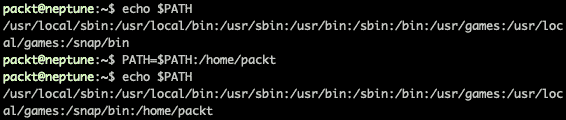
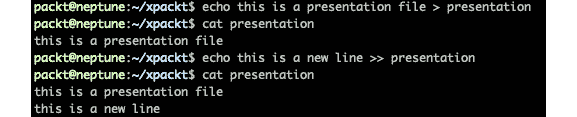
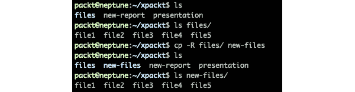
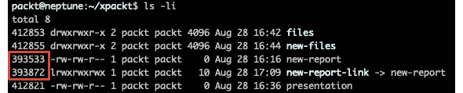
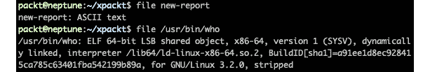
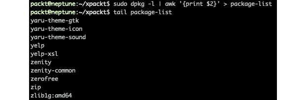

# *第二章*:Linux 文件系统

了解 Linux 文件系统、文件管理基础知识以及 Linux shell 和命令行界面的基础知识对于现代 Linux 专业人员来说是至关重要的。

在本章中，您将学习如何使用 Linux shell 和 Linux 中一些最常见的命令。 您将了解一个基本 Linux 命令的结构以及 Linux 文件系统是如何组织的。 我们将探讨处理文件和目录的各种命令。 同时，我们将向您介绍最常见的命令行文本编辑器。 我们希望在本章结束时，您能够熟练地使用 Linux 命令行终端，并为将来更高级的探索做好准备。

我们将涵盖以下主要议题:

*   Linux shell 简介
*   Linux 文件系统
*   使用文件和目录
*   使用文本编辑器创建和编辑文件

# 技术要求

本章要求在服务器、桌面、PC 或**虚拟机**(**VM**)上安装标准 Linux 发行版。 我们的示例和案例研究使用 Ubuntu 和 CentOS 平台，但是所探讨的命令和示例同样适用于任何其他 Linux 发行版。

# Linux shell 简介

Linux 起源于Unix 操作系统，它的主要优势之一是命令行界面。 在过去，这被称为*壳*。 在 Unix 中，通过`sh`命令调用 shell。 shell 是一个有两个流的程序:一个*输入流*和一个*输出流*。 输入是用户给出的命令，输出是该命令的结果，或者是对该命令的解释。 换句话说，shell 是用户和机器之间的主要接口。

主要 Linux 发行版中的主 shell 称为**Bash**，这是**Bourne 又是 shell**的首字母缩写，以Steve Bourne (Unix 中 shell 的最初创建者)命名。 Ubuntu、Fedora、CentOS、RHEL、Debian 和 openSUSE 都使用 Bash 作为它们的默认 shell。 除了 Bash，在Linux 中还有其他 shell 可用，比如**ksh**、**tcsh**和**zsh**。 在本章中，我们将介绍 Bash shell，因为它是现代 Linux发行版中使用最广泛的 shell。

可以为每个用户分配一个 shell。 同一个系统上的用户可以使用不同的 shell。 检查默认 shell 的一种方法是访问`/etc/passwd`文件。 关于这个文件和用户帐户的更多细节将在[*第四章*](04.html#_idTextAnchor073)，*管理用户和组*中讨论。 现在，知道在哪里查找默认 shell 是很重要的。 在这个文件中，每一行的最后一个字符代表用户的默认 shell。 `/etc/passwd`文件的每一行都列出了一个用户，并详细说明了其 PID、GID、用户名、主目录和基本 shell。 要查看当前用户的默认 shell，请使用您的用户名(在本例中为`packt`)执行以下命令:

```sh
cat /etc/passwd | grep packt
```

输出应该类似于图 2.1*，只是你会看到你的用户名，而不是我们的:*


图 2.1 -显示用户的默认 shell

`/etc/passwd`文件为所有用户提供了许多行，但我们只为用户提取了这一行。

查看当前 shell 的一个更简单的方法是运行以下命令:


图 2.2 -显示 shell 的一种更简单的方法

这将显示正在运行的命令，即 shell。 `$0`是 bash 的一个特殊参数，表示当前正在运行的进程。 如果您安装了其他 shell，则可以根据您的偏好轻松地为用户分配另一个 shell。 然而，如果您了解Bash，那么您将对所有这些都感到满意。

重要提示

*Linux shell 区分大小写* 这意味着您在命令行中键入的所有内容都应该遵守这一点。 例如，前面使用的`cat`命令使用小写字母。 如果键入`Cat`或`CAT`，shell 将无法将其识别为命令。 同样的规则也适用于文件路径。 您将注意到主目录中的默认目录的第一个字母使用大写，如`~/Documents`、`~/Downloads`等。 这些名字不同于`~/documents`或`~/downloads`。

## Bash shell 特性

shell 不仅运行命令。 它有更多的特性，可以让系统管理员在命令行中更加舒适。

### 通配符和元字符

在 Linux 中，通配符被用来匹配文件名。 通配符有三种主要类型:

*   星号(`*`):用于匹配任何无字符或多个字符的字符串。
*   问号(`?`):用于匹配单个字符。
*   括号(`[ ]`):这用于匹配括号内的任何字符。

元字符是在 Linux 和任何基于 unix 的系统中使用的特殊字符。 这些元字符如下:

*   `>`:输出重定向。
*   `>>`:输出重定向。
*   `<`:输入重定向。
*   `<<`:输入重定向。
*   :文件替换通配符(前面已经解释过)。
*   :文件替换通配符(前面已经解释过)。
*   :文件替换通配符(前面已经解释过)。
*   `|`:使用多个命令的管道。
*   `;`:命令执行顺序。
*   `( )`:执行顺序的命令组。
*   `||`:条件执行(OR)。
*   `&&`:条件执行(AND)。
*   `&`:在后台运行命令。
*   `#`:在 shell 中直接使用命令。
*   `$`:变量值扩展。
*   `\`:转义字符。
*   :命令替换。
*   :命令替换。

下面是一些使用前面列表中的元字符的示例。 在第一个示例中，我们在另一个命令中使用一个命令的输出，通过在`ls -l`命令中长时间列出`which ls`命令的输出:


图 2.3 -命令执行和替换的例子

您可以使用管道组合两个命令，将第一个命令的输出作为第二个命令的输入。 在下面的示例中，我们将使用带有`ls -l`命令的`less`命令来显示诸如`/etc`这样的大目录的长列表:

```sh
ls -l /etc | less
```

让我们按顺序执行一些命令。 之后，我们将使用元字符对命令进行分组，并将输出重定向到一个文件。 所有这些都显示在下面的截图中:


图 2.4 -命令序列执行示例

正如您在前面的输出中看到的，可以很容易地使用括号对首先执行的两个命令进行分组。

### 支架扩张

花括号还可以用来展开命令的参数。 括号不仅仅局限于文件名，比如通配符。 它们适用于任何类型的字符串。 在大括号内，可以使用单个字符串、序列或用逗号分隔的多个字符串。

下面是一些使用这种扩展的示例。 首先，我们将使用大括号展开从一个目录中删除两个文件。 其次，我们将展示如何使用大括号展开来创建多个新文件。 假设我们有两个名为`report`和`new-report`的文件，我们想要同时删除它们。 我们将使用以下命令:

```sh
rm ~/xpackt/{report,new-report}
```

要创建共享部分名称的多个文件(例如五个文件)，如`file1`，`file2`，…`file n`，我们将使用以下命令:


图 2.5 -使用大括号展开创建多个文件

大括号扩展是一个强大的工具，它为任何系统管理员的工作流增加了灵活性和强大功能。

### Bash shell 变量

Bash shell 有一些内置的变量，并且提供了定义自己的变量的可能性。 以下是一些标准内置变量的候选列表:

*   `HOME`:用户的主目录(例如`/home/packt`)
*   `LOGNAME`:用户的登录名(例如`packt`)
*   `PWD`:shell 当前的工作目录
*   `OLDPWD`:shell 的前一个工作目录
*   `PATH`:shell 的搜索路径(用冒号分隔的目录列表)
*   `SHELL`:shell 的路径
*   `USER`:用户登录名
*   `TERM`:终端类型

要在 shell 中调用一个变量，您所要做的就是在变量名前面放置一个美元符号`$`。 在您的机器上尝试以下命令:

```sh
echo $SHELL; echo $USER; echo $TERM; echo $PATH; echo $HOME; echo $PWD
```

你也可以分配你自己的 shell 变量，如下面的例子所示:


图 2.6 -分配一个新变量

要查看所有 shell变量，请使用`printenv`命令。 如果列表太长，可以将其重定向到一个文件，如下面的示例所示。 现在你的变量列表在`variables`文件中，你可以通过连接或在文本编辑器(如 vim)中编辑来查看它:

```sh
printenv > ~/variables
```

shell 的变量仅在 shell 内部可用。 如果希望 shell 运行的其他程序知道某些变量，则必须使用`export`命令导出它们。 一旦从 shell 导出变量，它就被称为*环境变量*。

### shell 的搜索路径

`PATH`变量在 Linux 中是一个非常重要的变量。 它帮助 shell 知道所有程序的位置。 当您在 Bash shell 中输入命令时，它首先必须通过 Linux 文件系统搜索该命令。 有些目录已经在`PATH`变量中列出，但是您也可以添加新的目录。 你的加入可能是暂时的，也可能是永久的，取决于你怎么做。 要使目录的路径临时可用，只需将其添加到`PATH`变量中。 在下面的例子中，我们将把`/home/alex`目录添加到`PATH`:



图 2.7 -向 PATH 添加一个新位置

要使任何更改永久，必须修改名为`~/.bash_profile`或`~/.bashrc`的文件中的`PATH`变量。

### 壳牌的别名

Linux shell 支持别名。 它们是为较长命令创建较短命令作为别名的一种非常方便的方法。 例如，在 Ubuntu 中，有一个预定义的别名`ll`，它是`ls -alF`的缩写。 您也可以定义自己的别名。 您可以使它们成为临时的或永久的，类似于变量。 在下面的示例中，我们更改了`ll`命令的别名，如下所示:


图 2.8 -更改命令的别名

这个修改只是临时的，它将在重新启动或 shell 重新启动后恢复为默认值。 如果您想使其永久保存，您应该编辑`~/.bashrc`文件。

## shell 连接

与外壳的连接采用了两种不同类型:`tty`和`pts`。 `tty` 连接被认为是本机连接，其端口直接连接到您的计算机。 用户和计算机之间的连接主要是通过键盘，键盘被认为是一种本机终端设备。 名称`tty`代表*电传打字机*，它是计算机时代开始使用的一种终端。

`pts`连接是通过 SSH 或 Telnet 类型的链路生成。 它的名称代表*伪终端从机*，是由程序(大多数情况下为`ssh`或**xterm**)建立的仿真连接。 它是*伪终端设备*的 slave，即`pty`。

### 虚拟控制台/终端

终端被认为是一个管理进程和其他 I/O 设备(如键盘和屏幕)之间的输入字符串(即命令)的设备。 还有一些伪终端，它们是行为与经典终端相同的仿真终端。 不同之处在于它不直接与设备交互，因为它都是由 Linux 内核模拟的，它将 I/O 传输到一个称为 shell 的程序。

虚拟控制台可以在后台访问和运行，即使没有打开的终端。 访问那些虚拟控制台,您可以使用命令**Ctrl + Alt*+【显示】F1/*【病人】*Ctrl + Alt+*【T15 F2 】 , (...) 【 t16.1】*Ctrl + Alt*+*F5*和**Ctrl + Alt*+*F6*。 这些将分别在您的计算机上打开`tty1,``tty2`、(…)`tty 5`和`tty6`。***

 **我们将使用 Ubuntu 20.04.1 LTS Server VM 安装来解释这一点，但它在 CentOS 8 中也是一样的。 启动虚拟机并提示使用用户名和密码登录后，屏幕上的第一行将类似如下输出:

```sh
Ubuntu 20.04.1 LTS ubuntu-server tty1
```

如果您按下上述任意组合键，您将看到终端从`tty1`变为任何其他`tty`实例。 例如，如果你按*Ctrl*+*Alt*+*F6*，你会看到:

```sh
Ubuntu 20.04.1 LTS ubuntu-server tty6
```

因为我们使用的是 Ubuntu 的服务器版本，所以我们没有安装 GUI。 但是如果你使用的是桌面版，你可以使用*Ctrl*+*Alt*+*F7*进入`X graphical`模式。

如果您无法使用上述键盘组合，则有专门的命令用于更改虚拟终端。 该命令称为`chvt`。 尽管我们还没有讨论 shell 命令，但我们将向您展示如何使用它和其他相关命令的示例。 这一行动只能由管理员帐户或通过使用**sudo**(更多细节关于这个在[*第四章*](04.html#_idTextAnchor073),*【显示】)管理用户和组。*

简单地说，`sudo`代表*超级用户做*，允许任何用户以管理权限或其他用户的权限运行程序。

在下面的例子中，我们将在图形环境中使用 CentOS 8。 首先，我们将看到当前使用哪个虚拟终端来更改为另一个而不使用*Ctrl*+*Alt*+*Fn*键。

`who`命令将显示有关当前登录到计算机的用户的信息。 在我们的例子中，它将显示用户`packt`当前正在使用虚拟终端 2(`tty2`):

```sh
who
packt tty2 2020-08-05 16:17 (tty2)
```

现在，通过使用`chvt`命令，我们将向您展示如何切换到第六个虚拟终端。 在运行`sudo chvt 6`之后，系统会提示您提供密码，并立即切换到没有 GUI 的虚拟终端 6(记住，我们在 CentOS 8 中使用 GUI 做这个练习)。 再次运行`who`将显示所有登录的用户和他们使用的虚拟终端。

## 命令行提示符

命令行或shell 提示符是您输入命令的地方。 通常，命令提示符将显示用户名、主机名、当前工作目录和一个表示运行 shell 的用户类型的符号。

下面是来自 Ubuntu 20.04.1 LTS 的一个示例:

```sh
packt@neptune:~$ _
```

下面是 CentOS 8 的一个例子:

```sh
[packt@localhost ~]$ _
```

下面是对输出的简短解释:

*   `packt`为当前登录的用户名。
*   `neptune`和`localhost`是主机名。
*   `~`表示主目录(称为波浪线)。
*   `$`表示该用户是普通用户(当您以管理员身份登录时，符号将变为话题标签`#`)。

接下来让我们看看shell 命令类型。

## Shell 命令类型

shell 使用命令工作，并且它使用两种类型:内部命令和外部命令。 内部命令是在 shell 内部构建的命令。 外部设备单独安装。 如果您想检查正在使用的命令的类型，可以使用`type`命令。 例如，您可以检查命令`cd`(更改目录)的类型:


图 2.9 -命令类型输出

输出显示`cd`命令是一个内部命令，构建在 shell 内部。 如果您很好奇，您可以找到我们将在下面几节中展示的其他命令的类型。

## 命令结构

我们已经使用了一些命令，但是我们没有解释 Linux 命令的结构。 我们现在就来做，让你能够理解如何使用命令。 简而言之，Unix 和 Linux 命令有以下形式:

*   命令的名字
*   命令的选项
*   命令的参数

在外壳内部，你会有一个像下面这样的一般结构:

```sh
command [-option(s)] [argument(s)]
```

一个简短的例子是`ls`命令的使用(`ls`来自*列表*)。 这个命令是 Linux 中最常用的命令之一。 它列出了文件和目录，可以与选项和参数一起使用，或者作为`ls`。

在前面的例子中，我们以最简单的形式使用了`ls`。 它列出了当前工作目录(`pwd`)的内容。 在本例中，它是主目录，由 shell 提示符中的`~`波浪字符表示。 如果您在主目录中，输出应该类似。

带有`-l`选项(小写 L)的`ls`命令使用长列表格式，为您提供关于当前工作目录(`pwd`)中的文件和目录的额外信息:

```sh
ls -l ; ls -l xpact/
```

在前面的示例中，我们使用`ls -l xpackt/`来显示`~/xpackt`目录的内容。 这里展示的是一种既使用选项又使用属性的命令，而不更改当前工作目录的方法。 如果希望查看 to`~/Downloads`目录的内容，可以将该目录的路径作为参数使用该命令。

## 手册帮助

任何 Linux 系统管理员最好的朋友就是手册。 Linux 中的每个命令都有一个手册页面，该页面向用户提供关于其使用、选项和属性的详细信息。 如果您知道要了解更多信息的命令，只需使用`man`命令进行探索。 例如，对于`ls`命令，您使用`man ls`。

该手册将其命令信息组织成不同的部分，每个部分的命名约定在所有发行版上都是相同的。 简单地说,这些部分`name`,`synopsis`,`configuration`,`description`,`options`,`exit status`,`return value`,`errors`,【显示】,`files`,`versions`,`conforming to`,【病人】,`bugs`,`example`,`authors`,【t16.1】和`see also`。

当你使用手册时，请记住它不是一个一步一步的指南。 一开始可能会混淆的是技术文档。 我们的建议是尽可能多地使用手册页。 在你在网上搜索任何东西之前，试着先阅读手册。 这将是一个很好的练习，您将很快精通 Linux 命令。

与手册页类似，Linux 中的几乎所有命令都有`-help`选项。 您可以使用这个作为快速参考。

有关帮助和帮助页的更多信息，您可以查看每个命令的帮助或手册页。 试试下面的命令:

```sh
$ man man
$ help help
```

现在，我们将在下一节中了解 Linux 文件系统。

# Linux 文件系统

Linux 文件系统由存储在分区或磁盘上的文件的逻辑集合组成。 你的硬盘可以有一个或多个分区。 这些分区通常只包含一个文件系统，它可以扩展到整个磁盘。 一个文件系统可以是`/ (root)`文件系统，另一个可以是`/home`文件系统。 或者，可以只有一个包含所有文件系统的文件系统。

通常，每个分区使用一个文件系统被认为是一种良好的实践，因为它允许逻辑维护和管理。 因为 Linux 中的一切都是文件，所以物理设备(如硬盘驱动器、DVD 驱动器、USB 设备和软盘驱动器)也被视为文件。

## 目录结构

Linux 使用分层的文件系统结构。 它类似于一个倒置的树，根(``/``)位于文件系统的底部。 从这一点开始，所有分支(目录)分布在文件系统中。

**文件系统层次结构标准**(**FHS**)定义类 unix 文件系统的结构。 但是，Linux文件系统还包含一些标准没有定义的目录。

### 从命令行探索 Linux 文件系统

您可以使用`tree`命令自己探索文件系统。 在 CentOS 8 中，它已经安装，但是如果你使用 Ubuntu，你将必须使用以下命令来安装它:

```sh
$ sudo apt install tree
```

不要害怕探索文件系统，因为只查看四周不会造成任何伤害。 只使用`ls`命令列出目录的内容。

我们将在这里向您展示一个示例，因为我们将研究文件系统的一些目录。 我们的测试机器使用的是 Ubuntu 20.04.1 LTS。 我们将通过调用`-L`选项来使用`tree`命令，该选项告诉命令要向下走多少层，最后一个属性表示从哪个目录开始。 因此，该命令将从`root`目录(用正斜杠表示)向下一层:

```sh
$ tree -L 1 /
```

通过使用`ls`命令开始研究结构中的目录，如下所示。 请记住，您即将打开的一些目录将包含大量的文件和/或其他目录，这将使您的终端窗口混乱。

下面是在几乎所有版本的 Linux 上存在的目录。 下面是 Linux 根文件系统的快速概述:

*   `/`:根目录:所有其他目录的根目录。
*   基本命令二进制文件:存放二进制程序的地方。
*   `/boot`:引导加载程序的静态文件:内核、引导加载程序和`initramfs`的存放位置。
*   `/dev`:设备文件:节点到设备的一个内核设备列表。
*   `/etc`:主机特定的系统配置:系统的基本配置文件、引导时间加载脚本、`crontab`、`fstab`设备存储表和`passwd`用户帐户文件。
*   `/home`:用户的主目录:用户文件存放的地方。
*   `/lib`:基本共享库和内核模块:共享库类似于 Windows DLL 中的**Dynamic Link Library**(**DLL**)文件。
*   `/media`:可移动媒体挂载点:用于外部设备和 USB 外部媒体。
*   `/mnt`:临时挂载文件系统的挂载点:用于遗留系统。
*   `/opt`:附加应用软件包:安装*可选*软件的位置。
*   `/proc`:内核管理的虚拟文件系统:一种特殊的目录结构，其中包含系统必需的文件。
*   `/sbin`:基本系统二进制:系统运行的重要程序。
*   `/srv`:本系统提供的业务数据。
*   `/tmp`:临时文件。
*   `/usr`:二级结构:Linux 中包含普通系统用户支持文件的最大目录; `/usr/bin`-系统可执行文件; `/usr/lib`-来自`/usr/bin`的共享库; 源码编译程序不包括在发行版中; /`usr/sbin`-具体的系统管理方案; `/usr/share`-在`/usr/bin`中程序共享的数据，如配置文件、图标、壁纸或声音文件; 系统范围文件的文档。
*   `/var`:可变数据:此处只存储用户可修改的数据，如数据库、打印假脱机文件、用户邮件等; 包含注册系统活动的日志文件。

接下来，我们将了解如何使用这些文件和目录。

# 使用文件和目录

记住，Linux 中的所有东西都是一个文件。 目录也是一个文件。 因此，知道如何与他们合作是至关重要的。 在 Linux 中处理文件意味着使用几个命令进行基本的文件和目录操作、文件查看、文件创建、文件位置、文件属性和链接。 有些命令(这里不讨论，但它们的使用与文件密切相关)将在下一节中介绍。

## 了解文件路径

FHS 中的每个文件都有一个*路径*。 路径是文件的位置(以易读的形式表示)。 在 Linux 中，所有的文件都存储在根目录下，使用 FHS 作为标准来组织它们。 系统内的文件和目录之间的关系通过正斜杠字符(`/`)表示。 在整个计算历史中，它被用作描述地址的符号。 路径实际上是文件的地址。

在 Linux 中有两种路径类型，*相对*路径和*绝对*路径。 绝对路径总是从根目录开始，沿着系统的各个分支一直到所需的文件。 相对路径总是引用当前工作目录并表示其相对路径。 因此，相对路径总是相对于当前工作目录的路径。

绝对路径对于了解何时使用文件非常有用。 经过一些练习，您将了解到最常用文件的路径。 例如，您需要学习的一个文件的路径是`passwd`文件。 它位于`/etc`目录中。 因此，当您要引用它时，您将使用它的绝对路径`/etc/passwd`。 使用该文件的相对路径意味着您要么在它的父目录中，要么在 FHS 中接近的某个地方。

使用相对路径需要了解用于 FHS 的两个特殊字符。 一个特殊字符是点(`.`)，它指向当前目录。 另一个是两个连续的点(`..`)，表示当前目录的父目录。 在使用相对路径时，确保始终检查您所处的目录。 使用`pwd`命令显示当前的工作目录。

使用相对路径的一个很好的例子是当您已经在父目录中并且需要引用它时。 如果您需要查看存储在`passwd`文件中的系统帐户列表，可以使用相对路径引用它。 在这个练习中，我们在主目录中:


图 2.10 -与当前工作目录相关的文件路径

首先，我们使用`pwd`命令检查当前的工作目录，输出是主目录的路径`/home/packt`。 其次，我们试图从主目录中使用`cat`(连接)命令显示`passwd`文件的内容，但是输出是一个错误消息，说在我们的主目录中没有这样的文件或目录。 我们使用了相对路径，它总是相对于我们当前的工作目录，因此出现了错误。 再次，我们使用双连续点特殊字符来表示文件及其相对路径。

提示

总是使用键盘上的*Tab*键进行自动补全，并检查您输入的路径是否正确。 在前面的例子中，我们键入`../../etc`并按下*Tab*，这将自动完成一个正斜杠。 然后，我们键入我们要查找的文件的前两个字母，并再次按下*Tab*。 这显示了以`pa`开始的`/etc`目录中的文件列表。 看到`passwd`在那里，我们知道路径是正确的，所以我们又输入了两个`s`字符，并再次按下*Tab*。 这为我们完成了命令，我们按下*Enter*/*Return*来执行命令。

最后一个命令的路径是相对于我们的主目录和翻译如下:*连接文件名称*`passwd`*,位于*`/etc`【显示】目录的父目录(两个点)的父目录(第二两个点)我们的当前目录(家)。 因此，`/etc/passwd`绝对路径被转换为到我们的主目录的相对路径，就像这样:`../../etc/passwd`。

## 基本文件操作

每天，作为系统管理员，您将操作文件。 这包括创建、复制、移动、列出、删除、链接等等。 这些操作的基本命令已经在本章中讨论过了，但是现在是时候深入了解它们的使用、选项和属性的更多细节了。 下面将详细介绍其他更高级的命令。

### 创建文件

在某些情况下需要创建新文件。 您可以使用`touch`命令创建一个新的空文件。 当您使用它时，它将创建一个以您为文件所有者的新文件，其大小为 0，因为它是一个空文件。 在下面的例子中，我们在`~/xpackt/`目录中创建了一个名为`new-report`的新文件。

`touch`还可以修改文件的修改时间，但不改变文件本身。 注意我们第一次创建`new-report`文件时的初始时间与使用`touch`命令后的新时间之间的差异:


图 2.11 -使用 touch 命令创建和修改文件

您也可以通过`touch`命令中的`-a`选项来更改访问时间。 默认情况下，`ls`命令的长列表只显示修改/创建时间。 如果您想查看访问时间，可以使用`- time`选项中的`atime`参数:


图 2.12 -使用触摸改变访问时间

修改、创建和访问时间戳非常有用，特别是在使用`find`这样的命令时。 它们为您提供了一个更细化的*搜索模式。*

 *#### echo 命令

还可以使用重定向和`echo`命令创建文件。 `echo`是一个将字符串作为参数输出到标准输出(屏幕)的命令。 例如，如果你使用如下截图所示的命令，它将打印文本到屏幕上:


图 2.13 -使用 echo 命令打印到标准输出(屏幕)

在前面的屏幕截图中，您可以看到将`text`打印到屏幕上的三种不同方式。 它们都有相同的输出。 `echo`命令的输出可以通过输出重定向直接写入文件:



图 2.14 -使用带有输出重定向的 echo

在前面的示例中，我们将文本从`echo`命令重定向到演示文件。 它在开始时不存在，因此由命令自动创建。 第一个`echo`命令使用`>`操作符向文件添加一行。 第二个`echo`命令使用`>>`操作符在文件末尾追加一个新的文本行。

### 清单文件

我们之前已经使用了`ls`命令的一些示例，因此您对它有些熟悉。 我们介绍了`-l`选项作为命令结构的一个示例。 因此，我们不会在这里进一步讨论它。 我们将探索这个基本和有用的命令的新选项:

*   `ls -lh`:`-l`选项以扩展格式列出文件，而`-h`选项以人类可读的形式显示文件，其大小以千字节或兆字节而不是字节为单位。
*   `ls -la`:`-a`选项显示所有文件，包括隐藏文件。 结合`-l`选项，输出将是所有文件及其详细信息的列表。
*   `ls -ltr`:`-t`选项根据文件的修改时间对文件进行排序，最新的显示在第一个; `-r`选项反转排序的顺序。
*   `ls – lS`:`-S`选项根据文件的大小对文件进行排序，最大的文件优先。
*   `ls -R`:`-R`选项以递归模式显示当前或指定目录的内容。

让我们在下一节中研究长列表。

### 长清单

的长清单`ls`命令现在应该解释一点,即使更多的细节将在第四章[*【4】【5】,*管理用户和组。 下面是我们的主目录中列出的不同文件类型的一些摘录:**](04.html#_idTextAnchor073)

```sh
ls -la
total 80
drwxr-xr-x 16 packt packt 4096 sep 13 01:15 .
drwxr-xr-x  3 root  root  4096 sep  8 11:58 ..
-rw-------  1 packt packt  945 sep 18 23:38 .bash_history
-rw-r--r--  1 packt packt  220 sep  8 11:58 .bash_logout
-rw-r--r--  1 packt packt 3771 sep  8 11:58 .bashrc
[…]
```

在输出中，命令后的第一行显示了所列目录中的块数量。 之后，每一行代表一个文件或子目录，详细信息如下:

*   第一个字符是文件的类型:目录的`d`，文件的`:`，链接的`l`，字符设备的`c`，块设备的`b`。
*   下面的 9 个字符表示权限(详见[*第四章*](04.html#_idTextAnchor073)，*管理用户和组*)。
*   那个文件的硬链接。
*   所有者的 PID 和 GID(详见[*第四章*](04.html#_idTextAnchor073)，*管理用户和组*)。
*   文件的大小(这个数字取决于它是否是人类可读的格式)。
*   文件最后一次修改的时间。
*   文件或目录的名称。

下一节是关于复制和移动文件。

### 复制和移动文件

在 Linux 操作系统下，复制文件时，使用`cp`命令。 `mv`命令在文件系统中移动文件。 该命令也用于重命名文件。

要复制一个文件，你可以用最简单的方式使用`cp`命令:

```sh
cp oldfile newfile
```

这里的`oldfile`是要复制的文件的名称，`newfile`是目标文件的名称。 您还可以在一个已经存在的目录中复制多个文件。 如果目标目录不存在，shell 将通知您目标不是目录。

现在让我们看看一些变化。

#### cp -

`-a`选项通过保留所有属性和链接，以递归模式复制整个目录层次结构。 在下面的示例中，我们使用`-a`选项将整个`xpackt`目录复制到一个新创建的名为`backup`的目录:


图 2.15 -使用带有-a 选项的 copy 命令

下一个选项是`cp -r`。

#### cp - r

此选项类似于`-a`，但它不保留属性，只保留符号链接。

#### cp - p

`-p`选项保留文件的权限和时间戳。 否则，只要以最简单的形式使用`cp`，文件的副本将由用户拥有，并带有执行复制操作时的时间戳。

移动文件是通过`mv`命令完成的。 它要么用于将文件和目录从一个目的地移动到另一个目的地，要么用于重命名文件。

#### cp - r

`-R`选项允许您递归地复制目录。 在下面的示例中，我们将使用`ls`命令显示`~/xpackt/`目录的内容，然后使用`cp -R`命令将`/files`目录的内容复制到`/new-files`目录。 `/new-files`目录不存在。 `cp -R`命令创建了它:



图 2.16 -使用 cp - r 命令

您可以通过访问手册页面了解许多其他选项。 请随意探索它们，并在日常任务中使用它们。

### 使用链接

链接在 Linux 中是一个引人注目的选择。 它们可以被用作保护原始文件的一种手段，或者只是作为一种工具，在没有单独的硬拷贝的情况下保存一个文件的多个副本。 可以将其视为为同一文件创建替代名称的工具。

命令是`ln`，它可以用来创建两种类型的链接:

*   符号链接
*   硬链接

这两个链接是指向原始文件的不同类型的文件。 在符号链接的情况下，它是指向原始文件的物理文件，而硬链接是指向原始文件的虚拟文件。

符号链接**用于已经存在的原始文件; 它们被链接并且有相同的内容。 此外，它可以跨越不同的文件系统和物理媒体，这意味着它可以链接到其他驱动器或具有不同类型文件系统的分区上的原始文件。 使用的命令如下:**

```sh
ln -s [original_filename] [link_filename]
```

下面是一个示例，我们列出了`~/xpackt`目录的内容，然后使用`ln -s`命令创建到`new-report`文件的符号链接，然后再次列出内容:


图 2.17 -使用符号链接

您可以看到所创建的链接名为`new-report-link`，并且用一个箭头`->`直观地表示，这个箭头显示了它所指向的原始文件。 您还可以区分两个文件(链接文件和原始文件)之间的大小差异。 权限也是不同的。 这是一种知道它们是两个不同的物理文件的方法。 要再次检查它们是否是不同的物理文件，可以使用`ls -i`命令为每个文件显示**inode**。 在下面的示例中，您可以看到`new-report`和`new-report-link`具有不同的索引节点:



图 2.18 -比较符号链接和原始文件的索引节点

如果您想知道链接指向何处而又不想使用`ls -l`，可以使用`readlink`命令。 它在 Ubuntu 和 CentOS 中都可用。 该命令的输出只是符号链接所指向的文件的名称。 它只在符号链接的情况下工作:


图 2.19 - readlink 命令输出

在前面的示例中，您可以看到输出显示`new-report-link`文件是指向名为`new-report`的文件的符号链接。

一个**硬链接**是另一个虚拟文件，它指向原始文件。 它们在物理上是一样的。 这个命令只是没有任何选项的`ln`:

```sh
ln [original-file] [linked-file]
```

在下面的示例中，我们为`new-report`文件创建了一个硬链接，并将其命名为`new-report-hl`。 在输出中，您将看到它们具有相同的大小、相同的 inode，并且在使用`echo`和输出重定向更改原始文件之后，这些更改对两个文件都可用。 这两个文件的表示方式与符号链接不同。 它们在你的列表中显示为两个不同的文件，没有视觉帮助来显示指向哪个文件:


图 2.20 -使用硬链接

本质上，硬链接是链接到原始文件的 inode。 您可以将其视为一个文件的新名称，类似于对其进行重命名，但不完全相同。

### 删除文件

在 Linux 中，您可以使用移除(`rm`)命令删除文件。 在最简单的形式中，使用`rm`命令时不带选项。 要对删除项目的方式进行更多控制，可以使用`-i`、`-f`和`-r`选项。

#### rm -我

此选项通过在删除前询问您是否接受来启用交互模式:


图 2.21 -交互式删除文件

在前面的示例中，我们使用`-i`选项删除了在前一节中创建的硬链接。 当被要求互动时，你有两个选择。 您可以通过键入`y`(yes)或`n`(no)来批准操作以取消操作。

#### rm - f

`-f`选项强制删除文件，不需要与用户进行任何交互:


图 2.22 -强制删除文件

我们删除了先前使用`rm -f`命令创建的符号链接。 它没有征求我们的批准，直接删除了文件。

#### rm - r

该选项以递归方式删除文件，用于删除多个文件和目录。 例如，我们将尝试删除`xpackt`目录中的`new-files`目录。 当以最简单的方式使用`rm`命令时，输出将显示一个错误，说它不能删除目录。 但当与`-r`选项一起使用时，目录将立即删除:


图 2.23 -递归删除目录

重要提示

我们建议*在使用`remove`命令时要格外小心*。 最具破坏性的方式是使用`rm -rf`。 这将删除任何东西，文件和目录，没有警告。 注意了，因为已经没有回头路了。 一旦使用，伤害就会造成。

很多时候，删除文件就像一条单行道，没有回头路。 这使得删除文件的过程变得非常重要，在删除之前进行备份可以为你节省很多不必要的压力。

### 创建目录

在 Linux 中，您可以使用`mkdir`命令创建一个新目录:


图 2.24 -创建一个新目录

如果你想一次创建更多的目录和子目录，你需要使用`-p`选项(来自父目录的`p`):

```sh
mkdir -p reports/month/day
```

然后使用`ls -R`命令查看目录结构:

```sh
ls -R reports/
```

目录在 Linux 中也是文件，只是它们有特殊的属性。 它们对于组织文件系统是必不可少的。 对于这个有用的工具的更多选项，请随意访问手册页。

### 删除目录

用于删除目录的 Linux 命令称为`rmdir`。 默认情况下，它只删除空目录。 让我们看看如果我们试图删除一个不为空的目录会发生什么:


图 2.25 -使用 rmdir 命令

这是 shell 中的一项预防措施，因为删除非空目录可能会产生灾难性的后果，正如我们在使用`rm`命令时看到的那样。 `rmdir`命令不像`rm`那样有`-i`选项。 使用`rmdir`命令删除目录的唯一方法是首先手动删除其中的文件。

## 文件查看命令

由于 Linux 中的所有内容都是一个文件，因此能够查看和处理文件内容对任何系统管理员来说都是一项重要的资产。 在本章中，我们将学习查看文件的命令，因为几乎所有文件都包含文本，在某种程度上，这些文本应该是可读的。

### cat 命令

在我们前面的一些示例中很快就使用了这个命令。 它是由**conCATenate**缩短而来，用于将文件的内容打印到屏幕上。 下面是连接`/etc/papersize`文件的另一个例子:


图 2.26 -使用 cat 命令的示例

`cat`命令有几个可用选项，我们在这里不介绍这些选项，因为在大多数情况下，最纯粹的形式是最常用的。 要了解更多细节，请参阅手册页。

### 更少的命令

有些时候，一个文件有太多的文本，它将覆盖多个屏幕，并且仅使用`cat`将很难在终端上查看。 这就是使用`less`命令的方便之处。 它一次显示一个屏幕。 屏幕的意义，完全取决于终端窗口的大小。 让我们以`/etc/passwd`文件为例。 它可能有多行，您无法在一个屏幕中容纳这些行。 你可以使用以下命令:

```sh
$ less /etc/passwd
```

当您按*进入*时，文件的内容将显示在您的屏幕上。 要浏览它，你可以使用以下键:

*   *空格*:向前移动一屏。
*   *进入*:向前移动一行。
*   *b*:向后移动一屏。
*   */*:进入搜索模式; 这将在您的文件中向前搜索。
*   *?* :搜索模式; 这将在您的文件中向后搜索。
*   *v*:用默认编辑器编辑你的文件。
*   *g*:跳转到文件的开头。
*   *G*:跳转到文件末尾。
*   *q*:退出输出。

`less`命令有许多可供使用的选项。 我们建议您查阅手册页的这个命令。

### 头命令

当您只想将文本文件的开头(头)打印到屏幕上时，这个命令非常方便。 默认情况下，它只打印文件的前 10 行。 您可以使用相同的`/etc/passwd`文件进行头部练习，并执行以下命令。 看会发生什么。 它打印前 10 行，然后退出命令，将您带回到 shell 提示符:

```sh
head /etc/passwd
```

这个命令的一个有用选项是打印文件的行数不超过 10 行。 为此，您可以使用`-n`参数，或者仅仅使用`–`与您想要打印的行数:


图 2.27 -使用 head 命令

作为系统管理员，许多其他选项对您的工作也很有用，但我们在这里不介绍它们。 你可以自己去探索它们。

### 尾巴命令

`tail`命令与`head`命令类似，只是在默认情况下，它打印文件的最后 10 行。 尾巴被积极地用于积极地观察不断变化的日志文件。 它可以在其他应用程序写入文件时打印文件的最后几行。 选项类似于`head`命令的选项:

```sh
tail -f /var/log/syslog
```

使用`-f`选项将使命令在写入`/var/log/syslog`文件时监视该文件。 它将以有效的方式将文件的内容显示到屏幕上。 要退出该屏幕，您需要按*Ctrl*+*C*返回 shell 提示符。

## 文件属性命令

有时候仅仅查看文件的内容是不够的，您需要关于该文件的额外信息。 您还可以使用其他一些方便的命令，我们将它们描述如下。

### stat 命令

该命令提供的信息比`ls`更多。 下面的示例显示了相同文件的`ls`和`stat`输出的比较:


图 2.28 -使用 stat 命令

这将为您提供关于名称、大小、块数量、文件类型、inode、链接数量、权限、UID 和 GID 以及`atime`、`mtime`和`ctime`的更多信息。 关于它的更多信息，请参阅手册页。

### 文件命令

这个命令只是报告文件的类型。 下面是一个文本文件和命令文件的例子:



图 2.29 -使用 file 命令

Linux 不像其他一些操作系统那样依赖于文件扩展名和类型。 在这方面，`file`命令主要通过文件内容来确定文件类型。

重要提示

还有一些其他重要命令，如`umask`、`chown`、`chmod`和`chgrp`，它们分别用于更改或设置默认的创建模式、所有者、模式(访问权限)和组。 这里将简要介绍它们，因为它们涉及到设置文件的属性，但要了解更详细的描述，请参考[*第四章*](04.html#_idTextAnchor073)、*管理用户和组*。

### 文件所有权和权限

在 Linux 中，文件安全性是由所有权和权限设置的。 文件的所有权由文件的所有者和所有者组决定。 根据所有者判断，文件的所有权有三种类型分配给它:*用户*、*组*和*其他*。 在大多数情况下，用户是文件的所有者。 创建文件的人就是文件的所有者。 用户可以通过`chown`命令修改。 当设置组所有权时，您确定组中每个人的权限。 这是使用`chgrp`命令设置的。 当涉及到其他用户时，引用是指该系统上的其他所有人，那些没有创建文件、不是文件所有者、也不属于所有者组的人。 *其他*又称*世界*。

除了设置用户所有权外，系统还必须知道如何确定用户行为，这是通过使用权限来实现的。 我们将使用`ls -l`命令快速回顾一下文件的属性:


图 2.30 -长列表输出

在前面的示例中，您看到目录中文件的两种不同类型的权限。 每行有 12 个字符，用于保留特殊的属性和权限。 在这 12 个例子中，只有 10 个在前面的例子中使用。 其中 9 个代表权限，第一个代表文件类型。 有三个简单易记的权限缩写:

*   `r`为只读权限。
*   `w`为写权限。
*   `x`为执行权限。
*   `-`是不允许的。

这九个字分为三个区域，每个区域由三个字组成。 前三个字符保留给用户权限，后三个字符保留给组权限，最后三个字符代表其他或世界权限。

文件类型也有它们的代码，如下:

*   `d`:目录
*   `-`:文件
*   `l`:符号链接
*   `p`:命名管; 一种促进程序间通信的特殊文件
*   `s`:一种 socket，类似于管道，但具有双向和网络通信功能
*   `b`:块设备; 一种与硬件设备对应的文件
*   `c`:字符装置; 类似于块设备

权限字符串是一个 10 位的字符串。 第一个位保留给文件类型。 接下来的 9 位通过将它们划分为 3 位数据包来确定权限。 每个包用八进制数表示(因为八进制数有 3 个字节)。 因此，权限用 2 的幂表示:

*   `read`等于 2 ^ 2(2 的 2 次方)等于 4。
*   `write`是 2 ^ 1(2 的 1 次方)，等于 2。
*   `execute`是 2 ^ 0(2 的零次方)，等于 1。

在这方面，文件权限应该按照下图表示:


图 2.31 -文件权限说明

在上面的图中，权限显示为一个由 9 个字符组成的字符串，就像您在`ls -la`输出中看到的那样。 该行被分为三个不同的部分，一个用于所有者/用户，一个用于组，一个用于 other/world。 它们显示在前两行。 另外两行显示权限类型(`read`、`write`和`execute`)以及下面的八进制数。

这很有用，因为它将八进制表示与权限的字符表示联系起来。 因此，如果您要将显示为`rwx r-x`的权限转换为八进制，根据前面的图，您可以很容易地说它是`755`。 这是因为对于第一个组，也就是所有者，您让所有的人都处于活动状态(`rwx`)，也就是说 4+2+1=7。 对于第二组，您只有两个活动权限，即`r`和`x`，即 4+1=5。 最后，对于最后一组，您还可以激活两个权限，类似于第二组(`r`和`x`)，即 4+1=5。 现在您知道了八进制的许可是`755`。

作为练习，你应该尝试将以下权限转换为八进制:

*   `rwx rwx`
*   `rwx r-x`
*   `rwx r-x - - -`
*   `rwx - - - - - -`
*   `rw- rw- rw-`
*   `rw- rw- r - -`
*   `rw- rw- - - -`
*   `rw- r- - r- -`
*   `rw- r- - - - -`
*   `rw- - - - - - -`
*   `r - - - - - - - -`

关于`chown`、`chgrp`和`chmod`命令的更多细节将在[*第 4 章*](04.html#_idTextAnchor073)、*管理用户和组*中给出。

### 文件压缩和归档命令

在 Linux 中，用于归档的标准工具称为`tar`，来自磁带归档。 它最初在 Unix 中用于将文件写入外部磁带设备以进行归档。 现在，在 Linux 中，它还被用于以压缩格式写入文件。 除`tar`存档外，其他流行的存档格式是`gzip`和`bzip`用于压缩存档，以及来自 Windows 的`zip`。

#### tar 命令

此命令与选项一起使用，并且在默认情况下不提供压缩功能。 要使用压缩，我们需要使用特定的选项。 这里是一些最有用的论据可用`tar`:

*   `tar -c`:创建存档
*   `tar -r`:向已经存在的归档文件追加文件
*   `tar -u`:只将更改的文件追加到现有存档
*   将一个存档附加到另一个存档的末尾
*   :列出存档的内容
*   `tar -x`:提取归档内容
*   `tar -z`:对归档文件使用`gzip`压缩
*   `tar -j`:对归档文件使用`bzip2`压缩
*   `tar -v`:使用详细模式，在屏幕上打印额外的信息
*   `tar -p`:恢复提取文件的原始权限和所有权
*   `tar -f`:输出文件名

有可能在你的日常任务中，你将不得不把这些论点结合在一起。

例如，要创建`files`目录的存档，我们使用`-cvf`参数组合，如下所示:

```sh
tar -cvf files-archive.tar files/
```

创建的归档文件没有被压缩。 要使用压缩，我们需要添加`-z`或`-j`参数。 接下来，我们将为`gzip`压缩算法使用`-z`选项。 使用下面的命令，然后使用`ls -l`命令比较两个归档文件的大小。 作为一般规则，建议为归档文件使用扩展名:

```sh
tar -czvf gzipped-archived.tar.gz files
```

Linux 中还有其他有用的归档工具，但是`tar`仍然是最常用的一个。 请随意探索其他的。

### 文件定位命令

在 Linux 中定位文件对任何系统管理员来说都是一项基本任务。 由于 Linux 系统包含大量文件，查找文件可能是一项令人生畏的任务。 尽管如此，您仍有方便的工具可以使用，知道如何使用它们将是您最大的资产之一。 在这些命令中，我们将展示`locate`、`which`、`whereis`和`find`。

#### locate 命令

`locate`命令没有被默认安装在 Ubuntu 上。 要安装它，使用以下命令:

```sh
sudo apt install mlocate
```

这个命令创建系统上所有文件位置的索引。 因此，当您执行该命令时，它将在数据库中搜索您的文件。 它使用`updatedb`命令作为它的伙伴。

在开始使用 locate 命令之前，应该执行`updatedb`来更新位置数据库。 完成之后，就可以开始定位文件了。 在下面的例子中，我们将定位任何名称中包含`new-report`的文件:


图 2.32 -使用 locate 命令

如果我们要搜索具有更通用名称的文件，例如`presentation`，输出将太长且不相关。 下面是一个例子，我们使用输出重定向到一个文件和`wc`(单词计数)命令只显示文件的行数、单词数和字节数到标准输出:


图 2.33 -使用带有输出重定向的 locate 命令和 wc 命令

在上述输出中，该文件有 348 行。 文件内的单词使用准确的数字，因为路径之间没有空格，所以每一行都被检测为单个单词。 该文件有 27,271 字节。 更多选择，请参考手册页。

#### 该命令

该命令在 shell 的搜索路径中定位一个可执行文件(程序或命令)。 例如，要定位`ls`命令，输入以下命令:

```sh
which ls
```

输出将显示`ls`命令的位置。 现在尝试使用`cd`命令:

```sh
which cd
```

您将看到没有输出。 这是因为`cd`命令构建在 shell 内部，并且没有其他位置可以显示该命令。

#### 那儿离命令

该命令只查找可执行文件、文档文件和源代码文件。 因此，它可能无法找到您想要的内容，因此要谨慎使用。 让我们搜索两个命令，`cd`和`ls`:

```sh
whereis cd; whereis ls
```

`cd`命令的输出没有显示任何相关信息，因为它是一个内置的 shell 命令。 对于`ls`命令，输出将显示命令本身和手册页面的位置。

#### find 命令

这个命令是 Linux 中最强大的命令之一。 它可以根据一定的条件搜索目录和子目录中的文件。 它有 50 多个选项。 它的主要缺点是语法，因为它在某种程度上不同于其他 Linux 命令。 了解`find`命令如何工作的最好方法是通过示例。 这就是为什么我们将向您展示大量使用这个命令的示例，希望您能够熟练地使用它。 要查看其强大的选项，请参阅手册页。

重要提示

由于我们将使用下面的所有示例来搜索根目录中的文件，因此您将收到许多权限被拒绝的错误。 您可以通过使用 sudo 或 root 用户来克服这些问题，但我们建议只有在您对自己的操作有信心时才这样做。 您可能会遇到一个特定的错误，即使是作为根用户运行:`find: '/run/user/1000/gvfs' : Permission denied`。 不要害怕，你并没有做错什么。 这个错误指出在 FUSE 中无法访问 GNOME 的虚拟文件系统 GVFS 的挂载点。 如果你需要关于这件事的更多信息，请随时告诉我。

在根目录中查找名称中包含`e100`字符串的所有文件，并将它们打印到标准输出:

```sh
find / -name e100 -print
/usr/lib/firmware/e100
```

在根目录中查找名称中包含`file`字符串且类型为`file`的所有文件，并将结果打印到标准输出:

```sh
find / -name file -type f -print
/usr/share/bash-completion/completions/file
/usr/bin/file
/usr/lib/apt/methods/file
/snap/core18/1705/usr/share/bash-completion/completions/file
/snap/core18/1885/usr/share/bash-completion/completions/file
```

只在`/opt`、`/usr`和`/var`目录中查找名称中包含`print`字符串的所有文件:

```sh
find /opt /usr /var -name print -type f -print
```

找到根目录中扩展名为`.conf`的所有文件:

```sh
find / type f -name "*.conf"
```

查找根目录中所有名称中有`file`字符串且没有扩展名的文件:

```sh
find / -type f -name "file*.*"
```

在根目录中查找扩展名为`.c`、`.sh`和`.py`的所有文件，并将列表添加到名为`findfile`的文件中:

```sh
find / -type f \( -name "*.c" -o -name "*.sh" -o -name "*.py" \) > findfile
```

在根目录中找到所有扩展名为`.c`的文件，对它们进行排序，并将它们添加到一个文件中:

```sh
find / -type f -name "*.c" -print | sort > findfile2
```

查找根目录下的所有文件，权限设置为`0664`:

```sh
find / -type f -perm 0664
```

查找根目录中所有对其所有者具有只读权限的文件:

```sh
find / -type f -perm /u=r
```

找到根目录下所有可执行的文件:

```sh
find / -type f -perm /a=x
```

找到根目录中 2 天前修改过的所有文件:

```sh
find / -type f -mtime 2
```

查找根目录下过去 2 天内被访问过的所有文件:

```sh
find / -type f -atime 2
```

查找所有在过去 2 到 5 天内修改过的文件:

```sh
find / -type f -mtime +2 -mtime -5
```

找到最近 10 分钟内修改过的所有文件:

```sh
find / -type f -mmin -10
```

查找过去 10 分钟内创建的所有文件:

```sh
find / -type f -cmin -10
```

找到最近 10 分钟内被访问过的所有文件

```sh
find / -type f -amin -10
```

找到所有大小为 5mb 的文件:

```sh
find / -type f -size 5M
```

找到所有大小在 5 到 10 MB 之间的文件:

```sh
find / -type f -size +5M -size -10M
```

找到所有的空文件和空目录:

```sh
find / -type f -empty
find / -type d -empty
```

在`/etc`目录中找到所有最大的文件，并将前 5 个文件打印到标准输出。 请考虑到这个命令可能会占用大量资源。 不要尝试对整个根目录这样做，因为你可能会耗尽系统内存:

```sh
find /etc -type f -exec ls -l {} \; | sort -n -r | head -5
```

查找`/etc`目录下最小的前 5 个文件:

```sh
find /etc -type f -exec ls -s {} \; | sort -n | head -5
```

你可以随心所欲地尝试各种类型的`find`选项。 命令是非常宽容和强大的。 小心使用。

### 文本处理命令

文本操作可能是 Linux 最好的资产。 它提供了大量的工具来处理命令行的文本。 一些更重要和广泛使用的是`grep`，`tee`，以及更强大的`sed`和`awk`。

#### grep 命令

这是 Linux 中最强大的命令之一。 它也是非常有用的。 它具有在文本文件中搜索字符串的能力。 它也有许多强大的选项:

*   `grep -v`:显示不符合搜索条件的行。
*   `grep -l`:只显示符合条件的文件名。
*   `grep -L`:只显示符合*不符合*标准的行。
*   `grep -c`:一个计数器，显示符合条件的行数。
*   `grep -n`:显示找到字符串的行号。
*   `grep -i`:不区分大小写。
*   `grep -R`:在目录结构内递归搜索。
*   `grep -E`:使用扩展正则表达式。
*   `grep -F`:使用严格的字符串列表代替正则表达式。

下面是一些如何使用`grep`命令的示例。

找出最后一次使用`sudo`命令的时间:

```sh
sudo grep sudo /var/log/auth.log
```

从`/etc`目录中搜索文本文件中的`packt`字符串:

```sh
grep -R packt /etc
```

显示匹配找到的确切线:

```sh
grep -Rn packt /etc
```

如果您不想看到找到匹配的每个文件的文件名，请使用`-h`选项。 然后，`grep`将只显示找到匹配的行:

```sh
grep -Rh packt /etc
```

若要只显示找到匹配的文件的名称，请使用`-l`:

```sh
grep -Rl packt /etc
```

`grep`很可能与壳管结合使用。 这里有一些例子。

如果希望只查看当前工作目录中的目录，可以将`ls`命令输出管道到`grep`。 在下面的例子中，我们只列出了以字母`d`开头的行，它表示目录:

```sh
ls -la | grep '^d'
```

如果你想显示你的 CPU 的模型，你可以使用以下命令:

```sh
cat /proc/cpuinfo | grep -i 'Model'
```

作为 Linux 系统管理员，您会发现`grep`是您最亲密的朋友之一，所以不要害怕深入挖掘它的选项和隐藏的瑰宝。

#### tee 命令

这个命令非常类似于`cat`命令。 基本上，它做同样的事情，通过不做任何修改地将标准输入复制到标准输出，但它还将其复制到一个或多个文件中。

在下面的例子中，我们使用了`wc`命令来计算`/home/packt/`变量文件中的行数。 我们使用`-a`选项(如果文件已经存在，则追加)将输出管道连接到`tee`命令，该选项将其写入一个名为`no-variables`的新文件，并同时将其打印到标准输出:

```sh
wc -l variables | tee -a no-variables
```

`tee`在文件操作命令方面不太受欢迎。 虽然它非常强大，但它的使用很容易被忽视。 尽管如此，我们还是鼓励你尽可能多地使用它的力量。

#### sed 和 awk 命令

`sed`不仅仅是一个简单的命令。 它是一种数据流编辑器，它根据预先提供的一组严格的规则来编辑文件。 根据这些规则，命令逐行读取文件，然后操纵文件内的数据。 `sed`是一个非交互式的流编辑器，它根据脚本进行更改，在这方面，它非常适合一次编辑更多文件或执行单调的重复性任务。 `sed`命令结构如下:

```sh
sed 's/regex/replacement/flag'
```

`sed`的一个常见用例是用于文本替换。 还有许多其他的用例我们不在这里讨论，但是如果您觉得有必要更多地了解`sed`工具，可以在网上和出版物中找到很多很好的材料。

下面是一些最常见的用例`sed`。

在文本文件中用另一个名称替换一个名称。 对于本例，我们将在`~/xpackt/`目录中使用一个名为`poem`的新文件。 在里面，我们生成了一首随机的诗。 任务是将文件中的名称`Jane`替换为`Elane`。 字母`g`作为命令的标志，指定操作应该是全局的，就像应用于整个文本文档一样。 结果如下:


图 2.34 -使用 sed 命令替换文本文件中的字符串

如果您使用`cat`命令检查原始文件，您将看到`sed`只将更改后的名称结果发送到标准输出，而没有对原始文件进行任何更改。 要使对文件的更改成为永久性的，您必须使用`-i`属性。

在下面的示例中，我们将在每行开头添加三个新空格，并将输出重定向到一个新文件。 我们将使用与以前相同的`poem`文件。 文件的开头用`^`字符表示:


图 2.35 -使用 sed 添加空格

我们将使用`sed`只显示文件中的第二行，并使用显示除第二行以外的所有行:


图 2.36 -使用 sed 显示文件中的特定行

只显示文件(在本例中为`/etc/passwd`文件)中介于 4 到 6 之间的行:


图 2.37 -使用 sed 显示文本文件中的特定行数

这里有一个更实际的练习。 我们将显示 Ubuntu 中没有注释的`/etc/apt/sources.list`内容。 为此，使用以下命令:

```sh
sed '/^#/g' /etc/apt/sources.list
```

作为练习，自己检查输出。

`awk`不仅仅是一个简单的命令; 它是一种模式匹配语言。 它是一种成熟的编程语言，是 Perl 的基础。 它用于从文本文件中提取数据，语法类似于 c。它将文件视为由字段和记录组成。 `awk`命令的总体结构如下:

```sh
awk '/search pattern 1/ {actions} /search pattern 2/ {actions}' file
```

本书无法展示`awk`的真正威力，因此我们将只展示几个简单的示例，以证明其对未来系统管理员的实用性。

作为第一个例子，我们将生成一个包含 Ubuntu 安装的所有包名称的列表。 我们只需要打印每个包的名称，而不需要打印所有其他细节。 为此，我们将使用以下命令:



图 2.38 -使用 awk 生成包名列表

通常，要查看 Ubuntu 中已安装的软件包，我们需要运行`dpkg -l`命令。 在前面的示例中，我们将该命令的输出管道连接到`awk`命令，该命令打印出`dpkg -l`输出(`'{print $2}'`)的第二列(字段)。 然后，我们将所有内容重定向到一个名为`package-list`的新文件，并使用`tail`命令查看新创建文件的最后 10 行。

`sed`和`awk`都是非常强大的工具，我们只是触及了它们所能做的事情的皮毛。 请随意深入挖掘这两个很棒的工具。

## 使用文本编辑器来创建和编辑文件

Linux 有几个可以使用的命令行文本编辑器。 其中有**纳米**、**emacs**、**vim**等。 这些是最常用的。 还有**pico**，**joe**，和**ed**作为文本编辑器，使用频率比前面提到的那些要低。 我们将介绍 vim，因为您很有可能在您所使用的任何 Linux 系统上找到它。 然而，当前的趋势是用 nano 取代 vim 作为默认的文本编辑器。 例如，Ubuntu 默认没有安装 vim，但是 CentOS 有。 Fedora 目前正在考虑将 nano 作为默认文本编辑器。 因此，您可能想学习 nano，但出于遗留目的，vim 是一个非常有用的工具。

### 使用 vim 编辑文本文件

Vim 是 vi 的改进版本，vi 是 Unix 的默认文本编辑器。 这是一个非常强大的编辑工具。 这种能力带来了许多选项，可以用来减轻您的工作，而这可能是压倒性的。 在本章中，我们将向您介绍文本编辑器的基本命令，以帮助您熟练地使用它。

Vim 是一个基于模式的编辑器，因为它的操作是围绕不同的模式组织的。 简单地说，这些模式如下:

*   `command`模式为默认模式，等待命令。
*   `insert`模式为文本插入模式。
*   `replace`模式为文本替换模式。
*   `search`模式是搜索文档的特殊模式。

让我们看看如何在这些模式之间切换。

#### 切换模式

当您第一次打开 vim 时，将被引入一个空编辑器，该编辑器只显示有关所使用版本的信息和一些帮助命令。 您处于`command`模式。 这意味着 vim 正在等待命令进行操作。

要激活`insert`模式，按键盘上的*i*键。 您将能够在光标的当前位置开始插入文本。 您也可以按*a*(用于追加)开始编辑到光标位置的右侧。 *i*和*a*都将激活`insert`模式。 按*Esc*键退出当前模式。 它会让你回到`command`模式。

如果您打开一个文件，其中已经包含文本，而在`command`模式下，您可以使用箭头键来导航该文件。 vim 继承了 vi 工作流,您还可以使用*h(左),*j(向下),【T6 k】*(向上),和【显示】l(右)。 在终端键盘还没有单独的方向键的时候，这些键都是遗留下来的。*

 *当您仍处于`command`模式(默认模式)时，您可以通过按键盘上的*r*激活`replace`模式。 您可以替换光标所在位置的字符。

在`command`模式下，按*/*键激活`search`模式。 进入模式后，可以开始键入搜索字符串，然后按*Enter*。

还有`last line`模式和`ex command`模式。 按*:*激活此模式。 这是一个扩展模式，其中的命令有`w`用于保存文件，`q`用于退出，或者`wq`用于同时保存和退出。

#### 基本 vim 命令

下面是常用 vim 命令的列表。 在`command`模式下可以使用:

*   `yy`:复制一个文本块(拉)。
*   `p`:粘贴复制的块。
*   `u`:取消上次操作。
*   `x`:删除右边的下一个字符(相对于光标的位置)
*   `X`:删除前一个字符(相对于光标的位置)。
*   `dd`:删除光标所在的整行。
*   `h`:向左移动光标。
*   `l`:向右移动光标。
*   `k`:向上移动光标。
*   `j`:向下移动光标。
*   `w`:将光标右移到下一个单词的开头。
*   `b`:将光标向左移动到前一个单词的开头。
*   `^`:移动光标到行首。
*   `$`:移动光标到行尾。
*   `gg`:移动光标到文档的开头。
*   `G`:移动光标到文档末尾。
*   `: n`:移动光标到行号*n.*
*   `i`:插入光标位置之前。
*   `I`:插入行首。
*   `a`:附加在光标右侧。
*   `A`:追加到行尾。
*   `o`:插入到下一行的开头。
*   `/`:激活`search`模式并查找字符串。
*   `?`:从光标位置向后搜索。
*   `n`:显示搜索字符串的下一个位置。
*   `N`:显示搜索字符串的前一个位置。
*   `:wq`:保存更改并退出 vim(写入并退出)。
*   `:q!`:强制退出(退出)不保存。
*   `:w!`:强制保存(写)，不退出。
*   `ZZ`:保存并退出。
*   `:w file`:保存为一个新文件(`file`将是新的文件名)。

对于 Linux 新手来说，Vim 可能相当可怕。 如果您更喜欢其他编辑器，也没有什么可羞愧的，因为有大量的可供选择。 现在，我们将向你展示纳米的一瞥。

### 纳米文本编辑器

Vim 是一个强大的文本编辑器，知道如何使用它对任何系统管理员来说都是一件很重要的事情。 然而，还有其他文本编辑器同样强大，甚至更容易使用。

这就是 nano 的情况，它默认安装在 Ubuntu 和 CentOS 中，并且可以直接在这两种操作系统上使用。 在`.bashrc`文件中没有使用`$EDITOR`变量设置默认编辑器。 然而，在 Ubuntu 中，你可以使用以下命令检查系统上的默认编辑器:


图 2.39 -检查 Ubuntu 上的默认文本编辑器

您可以在 Ubuntu 和 CentOS 上使用`nano`命令来调用 nano 编辑器。 当您输入命令时，nano 编辑器将打开，界面非常简单。

在本节中，我们了解了不同的编辑器及其命令。

# 总结

在本章中，您已经学习了如何使用 Linux 中最常用的命令。 现在，您知道了如何管理(创建、删除、复制和移动)文件，文件系统是如何组织的，如何使用目录，以及如何查看文件内容。 现在您已经了解了 shell 和基本权限。 您学到的技能将帮助您管理任何 Linux 发行版中的文件和编辑文本文件。 您已经学习了如何使用 vim，它是 Linux 中使用最广泛的命令行文本编辑器之一。 这些技能将帮助您学习如何使用其他文本编辑器，如 nano 和 emacs。 在本书的几乎每一章以及作为系统管理员的日常工作中，您都将使用这些技能。

在下一章中，您将学习如何管理包，包括如何在基于 Debian 和 Red hat 的发行版中安装、删除和查询包。 这个技能对任何管理员都很重要，必须是任何基本培训的一部分。

# 问题

在第二章中，我们介绍了 Linux 文件系统和作为整本书基础的基本命令。 这里有一些问题供你测试你的知识和进一步的实践:

1.  What is the command that creates a compressed archive with all the files inside the `/etc` directory that use the `.conf` extension?

    提示:如本章所示，使用`tar`命令。

2.  What is the command that lists the first five files inside `/etc` and sorts them by dimension in descending order?

    提示:结合`find`和`sort`、`head`使用。

3.  What command creates a hierarchical directory structure?

    提示:按照本章所示使用`mkdir`。

4.  What is the command that searches for files with three different extensions inside root?

    提示:使用`find`命令。

5.  Find out which commands inside Linux have the **Set owner User ID** (**SUID**) set up.

    提示:使用带有`-perm`参数的`find`命令。

6.  What is the command that lists all the installed packages on a system?

    提示:结合`dpkg`和`awk`，输出重定向。

7.  Which command is used to create a file with 1,000 lines of randomly generated words (one word per line)?

    提示:使用`shuf`命令(本章中没有显示)。

8.  Perform the same exercise as before, but this time generate a file with 1,000 randomly generated numbers.

    提示:使用`for`循环。

9.  How do you find out when sudo was last used and which commands were executed by it?

    提示:使用`grep`命令。

# 进一步阅读

有关本章内容的更多资料，请参阅以下资料:

*   *Linux 基础*，*Oliver Pelz*，*Packt Publishing*
*   *掌握 Ubuntu Server -第二版*，*Jay LaCroix*，*packagpublishing********