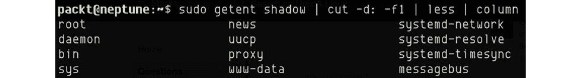
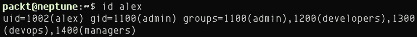
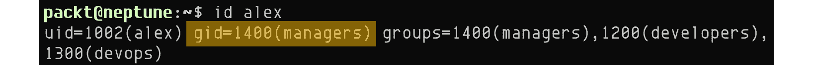
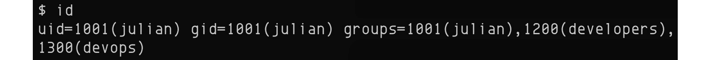
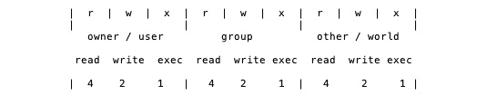
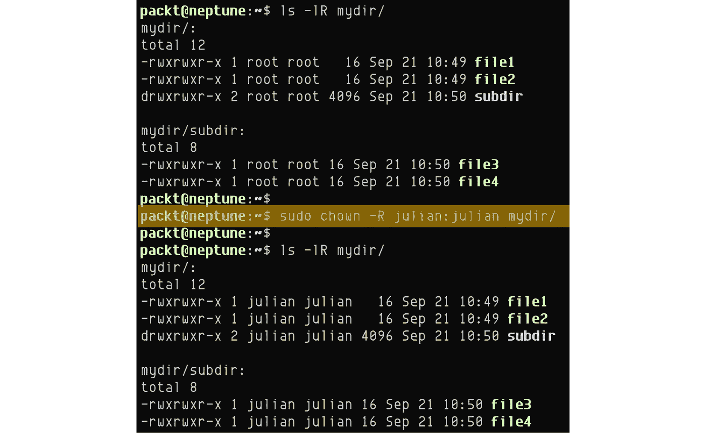

# 四、管理用户和组

Linux 是一个多用户、多任务操作系统，这意味着多个用户可以在共享平台资源的同时访问操作系统，内核同时独立地为每个用户执行任务。 Linux 提供了必要的隔离和安全机制，以避免多个用户访问或删除彼此的文件。

当多个用户访问系统时，权限就起作用了。 我们将了解**权限**如何在 Linux 中工作，以及它们的基本读、写和执行原则。 我们将向您介绍具有完全访问操作系统资源权限的*超级用户*(`root`)帐户的概念。

在此过程中，我们将对所学的主题采取动手实践的方法，通过实际例子进一步加深对关键概念的吸收。 本章涵盖以下主题:

*   管理用户
*   管理组
*   管理权限

我们希望在本章结束时，您将熟悉用于创建、修改和删除用户和组的命令行实用程序，同时熟练地处理文件和目录权限。

让我们快速看一下学习本章所必需的技术要求。

# 技术要求

我们需要一个可以工作的 Linux 发行版安装在虚拟机(**VM**)或桌面平台上。 如果你还没有一个，[*第 1 章*](01.html#_idTextAnchor014)*安装 Linux，*将带你完成相关的过程。 在本章中，我们将使用 Ubuntu 或 CentOS，但使用的大多数命令和示例都适用于任何其他 Linux 平台。

# 管理用户

在这个上下文中，用户是使用计算机或系统资源的任何人。 在最简单的形式中,Linux 用户*或*用户帐户是被一个名称和一个**惟一标识符**,被称为【显示】UID。**

 *从纯技术角度来看，在 Linux 中我们有以下几种类型的用户:

*   **普通**(或普通)用户—通用的日常用户帐户，主要适用于个人使用和常见的应用和文件管理任务，对系统范围内的资源具有有限的访问权限。 一个普通用户帐户通常有一个*登录*shell 和一个*home*目录。
*   **系统**用户——这些用户与普通用户帐户相似，除了他们可能没有登录 shell 或主目录。 系统帐户通常分配给后台应用服务，主要是出于安全原因和限制与相关资源关联的攻击表面——例如，处理公共请求的 web 服务器守护进程应该作为系统帐户运行，理想情况下不需要登录或`root`特权。 因此，通过 web 服务器暴露的可能的漏洞将严格隔离于关联系统帐户的有限操作领域。
*   **超级用户**-这些是特权用户帐户，具有对系统资源的完全访问权限，包括创建、修改和删除用户帐户的权限。 `root`用户是超级用户的一个例子。

在 Linux 操作系统中，只有具有`sudo`权限的`root`用户或用户(**sudoers**)才能创建、修改或删除用户帐户。

## 理解 sudo

在 Linux 中，`root`用户是默认的超级用户帐户，它可以在系统上执行任何操作。 理想情况下，出于安全和安全方面的原因，通常应该避免在系统上充当`root`。 在`sudo`中，Linux 提供了一种机制*将*的普通用户帐户提升为超级用户特权，并使用了额外的安全层。 这样，通常使用`sudo`用户而不是`root`用户。

`sudo`是一个命令行实用程序，允许被允许的用户使用超级用户或其他用户的安全特权执行命令(取决于本地系统的安全策略)。 `sudo`最初代表*超级用户做*，因为它最初实现了只作为超级用户，但后来扩展到不仅支持超级用户，还支持其他(受限的)用户模拟。 因此，它也被称为*替代用户做*。 然而，由于在 Linux 管理任务中经常使用，它被认为是*超级用户执行*。

Linux 中大多数用于管理用户的命令行工具都需要`sudo`特权，除非相关任务由`root`用户执行。 如果我们想避免使用根上下文，那么在我们拥有一个具有超级用户特权的用户帐户之前，我们不能真正地继续本章的其余部分——特别是创建一个用户。 所以，让我们先来看看这个“先有鸡还是先有蛋”的情况。

大多数 Linux 发行版在安装期间除了`root`之外，还创建了一个具有超级用户特权的额外用户帐户。 如前所述，其原因是为高架操作提供额外的安全层。 检查用户帐户是否具有`sudo`权限的最简单方法是在终端中运行以下命令，同时使用相关用户帐户登录:

```sh
sudo -v
```

根据`sudo`手册(`man sudo`)，`-v`选项将导致`sudo`更新用户的缓存凭证，并在缓存凭证过期时对用户进行身份验证。

如果用户(例如`julian`)在本地机器上没有超级用户特权(例如`neptune`)，上述命令将产生以下(或类似)错误:

```sh
Sorry, user julian may not run sudo on neptune.
```

在最近的 Linux 发行版中，`sudo`命令的执行通常会在有限的时间内授予更高的权限。 例如，Ubuntu 有 15 分钟的`sudo`提升跨度，在此之后，`sudo`用户将需要再次认证。 如果在`sudo`缓存凭据超时期间执行`sudo`的后续调用，可能不会提示输入密码。

如果我们没有默认的超级用户帐户，我们总是可以使用根上下文来创建新用户(参见下一章)并将其提升为**sudoer**特权。 我们将在本章后面的*创建超级用户*部分了解更多。

现在，让我们看看如何创建、修改和删除用户。

## 创建、修改、删除用户

在本节中，我们将探索一些命令行工具和一些用于管理用户的常见任务。 在 Ubuntu 和 CentOS 中显示了示例命令和过程，但同样的原则适用于任何其他 Linux 发行版。 一些用户管理**命令行界面**(【显示】**CLI)工具可能不同或可能不是在特定的 Linux 平台上(例如,`useradd`是不可以在高山应该使用 Linux 和`adduser`相反)。 请查看您选择的 Linux 发行版的文档中对应的命令。**

### 创建用户

要创建用户，我们可以使用`useradd`或`adduser`命令，尽管在某些 Linux 发行版(例如 Debian 或 Ubuntu)上，推荐的方法是使用`adduser`命令而不是低级的`useradd`实用程序。 我们将在本节中介绍这两种方法。

`adduser`是一个使用`useradd`的 Perl 脚本—基本上是`useradd`命令的一个扩展—具有用户友好的引导配置。 这两个命令行工具在 Ubuntu 和 CentOS 中都是默认安装的。 让我们简要地看一下这些命令。

#### 使用 useradd 创建用户

`useradd`命令的语法为，如下所示:

```sh
useradd [OPTIONS] USER
```

在最简单的调用中，以下命令创建一个用户帐户(`julian`):

```sh
sudo useradd julian
```

用户信息存储在`/etc/passwd`文件中。 以下是`julian`的相关用户数据:

```sh
cat /etc/passwd | grep julian
```

在我们的例子中，输出如下:


图 4.1 -使用 useradd 创建的用户记录

让我们分析一下相关的用户记录。 每个条目由冒号(`:`)分隔，列在这里:

*   `julian`:用户名
*   `x`:加密的密码(密码散列存储在`/etc/shadow`中)
*   `1001`:UID
*   `1001`:用户**组 ID**(**组 ID**)
*   (在本例中，为空)**General Electric Comprehensive Operating Supervisor**(**GECOS**)字段(例如，显示名称)将在下面解释
*   `/home/julian`:用户主文件夹
*   `/bin/sh`: The default login shell for user

    重要提示

    GECOS 字段是一个以逗号分隔的属性字符串，反映关于用户帐户的一般信息(例如，真实姓名; 公司; 电话号码)。 在 Linux 操作系统中，GECOS 字段是用户记录中的第五个字段。 更多信息见[https://en.wikipedia.org/wiki/Gecos_field](https://en.wikipedia.org/wiki/Gecos_field)。

我们也可以使用`getent`命令来检索上述用户信息，如下所示:

```sh
getent passwd julian
```

要查看与用户关联的 UID(`uid`)、GID(`gid`)和组成员关系，可以使用`id`命令，如下所示:

```sh
id julian
```

这个命令给我们以下输出:


图 4.2 - UID 信息

通过简单调用`useradd`，该命令使用一些直接默认值(如枚举值)创建用户(`julian`)，而其他与用户相关的数据为空—例如，我们还没有为用户指定全名或密码。 另外，虽然主目录有一个默认值(例如，`/home/julian`)，但除非使用`-m`或`--create-home`选项调用`useradd`命令，否则不会创建实际的文件系统文件夹，如下所示:

```sh
sudo useradd -m julian
```

如果没有主目录，常规的用户将无法将其文件保存在系统的私有位置。 另一方面，有些系统帐户可能不需要主目录，因为它们没有登录 shell。 例如,数据库服务器(例如,PostgreSQL)可能会与非根系统帐户(例如,`postgres`),只需要访问数据库资源在特定位置(例如,`/var/lib/pgsql`),通过控制其他许可机制(例如,**安全增强型 Linux**(**SELinux**)。

对于我们的普通用户，如果我们还想指定一个全名(display name)，命令会变成这样:

```sh
sudo useradd -m -c "Julian" julian
```

`useradd`的`-c, --comment`选项参数需要一个*注释*，也称为**GECOS**字段(我们的用户记录中的第五个字段)，有多个逗号分隔的值。 在本例中，我们指定全名(例如`Julian`)。 有关更多信息，请查看`useradd`手册(`man useradd`)或`useradd --help`。

用户仍不会有密码,因此,就没有办法为用户登录(例如,通过一个**图形用户界面(GUI**)或**【显示】Secure Shell (SSH****)。 要为`julian`创建密码，我们调用`passwd`命令，如下所示:******

```sh
sudo passwd julian
```

你应该看到如下的输出:


图 4.3 -创建或更改用户密码

`passwd`命令将提示输入新用户的密码。 设置了密码后，将有一个新条目添加到`/etc/shadow`文件中。 该文件存储每个用户的安全密码散列(不是密码!)。 只有超级用户可以访问该文件的内容。 以下是为用户`julian`检索相关信息的命令:

```sh
sudo getent shadow julian
```

还可以使用以下命令:

```sh
sudo cat /etc/shadow | grep julian
```

设置好密码后，一般情况下用户可以登录系统(通过 SSH 或 GUI)。 如果 Linux 发行版有 GUI，新用户将显示在登录屏幕上。 下面是 Ubuntu 的截图:


图 4.4 -新用户登录 Ubuntu

如前所述，通过`useradd`命令，我们可以对创建用户帐户的方式进行低级粒度控制，但有时我们可能更喜欢用户友好的方法。 输入`adduser`命令。

#### 使用 adduser 创建用户

`adduser`命令是`useradd`的 Perl 包装器。 `adduser`命令的语法如下所示:

```sh
adduser [OPTIONS] USER
```

`sudo`可能提示输入超级用户密码。 `adduser`将提示输入新用户的密码和其他用户相关信息(如图*图 4.5*所示)。

我们用`adduser`创建一个新用户账号`julian`，如下:

```sh
sudo adduser julian
```

上面的命令输出如下:


图 4.5 - adduser 命令

在 CentOS 中，前面对`adduser`命令的调用将简单地运行，而不提示用户输入密码或任何其他信息。

我们可以看到`/etc/passwd`中与`getent`相关的用户条目如下:

```sh
getent passwd julian
```

下面是输出:


图 4.6 -使用 getent 查看用户信息

在前面的示例中，我们创建了一个普通用户帐户。 管理员或超级用户也可以将普通用户的权限提升为超级用户。 让我们来看看。

### 创建一个超级用户

当一个普通用户被赋予运行`sudo`的能力时，他们就成为超级用户。 让我们假设通过*创建用户*一节中所示的任何示例创建了一个常规用户。

将用户提升为超级用户(或*sudoer*)需要一个`sudo`组成员。 在 Linux 中，`sudo`组是为具有更高权限或`root`权限的用户保留的系统组。 要使用户`julian`成为 sudoer，只需将用户添加到`sudo`组，如下所示:

```sh
sudo usermod -aG sudo julian
```

`usermod`的`-aG`选项指示命令将用户`(-a, --append`)附加到指定的组`(-G, --group`中——在本例中是`sudo`。

要验证我们的用户现在是 sudoer，首先通过运行以下命令确保相关的用户信息反映了`sudo`成员资格:

```sh
id julian
```

这给了我们以下输出:


图 4.7 -查找用户的 sudo 成员

输出显示`groups`标记中的`sudo`组成员身份(GID)为`27(sudo)`。

验证用户`julian`的`sudo`访问权限，运行如下命令:

```sh
su - julian
```

上面的命令提示输入用户`julian`的密码。 成功的登录通常会验证超级用户上下文。 或者，用户(`julian`)可以在其终端会话中运行`sudo -v`命令来验证`sudo`特权。 有关超级用户特权的更多信息，请参见本章前面的*理解 sudo*一节。

由于创建了多个用户，系统管理员可能希望查看或列出系统中的所有用户。 在下一节中，我们将提供一些完成此任务的方法。

#### 查看用户

超级用户有几种方法可以查看系统中配置的所有用户。 如前所述，用户信息存储在`/etc/passwd`和`/etc/shadow`文件中。 除了简单地查看这些文件外，我们还可以解析它们并使用下面的命令只提取用户名:

```sh
cat /etc/passwd | cut -d: -f1 | less
```

或者，我们可以解析`/etc/shadow`文件，如下所示:

```sh
sudo cat /etc/shadow | cut -d: -f1 | less
```

在前面的命令中，我们从相关文件中读取内容(使用`cat`)。 接下来，我们将结果管道到基于分隔符的解析(在`:`分隔符上使用`cut`)，并选择第一个字段`(-f1`。 最后，我们使用`less`命令选择结果的分页显示。

注意对`shadow`文件使用`sudo`，因为只有超级用户才能访问，这是由于密码散列数据的敏感性。 或者，我们可以使用`getent`命令来检索用户信息。

下面的命令列出了系统中配置的所有用户:

```sh
getent passwd
```

上述命令读取的是`/etc/passwd`文件。 或者，我们可以从`/etc/shadow`中检索相同的信息，如下所示:

```sh
sudo getent shadow
```

对于这两个命令，我们可以进一步将`getent`输出管道到`| cut -d: -f1`，只列出用户名，如下所示:

```sh
sudo getent shadow | cut -d: -f1 | less | column
```

输出类似如下(摘录):



图 4.8 -查看用户名

创建新用户后，管理员或超级用户可能需要更改某些与用户相关的信息，例如密码、密码过期、全名或登录 shell。 接下来，我们来看一下完成这项任务的一些最常见的方法。

### 修改用户

超级用户可以通过`usermod`命令修改用户设置，语法如下:

```sh
usermod [OPTIONS] USER
```

本节中的示例适用于我们之前使用`useradd`命令的最简单调用创建的用户(`julian`)。 如前一节所述，`/etc/passwd`中的相关用户记录没有用户的全名，用户也没有密码。

让我们为我们的用户(`julian`)更改以下设置:

*   全名:到`Julian`(最初为空)。
*   主文件夹:移动到`/local/julian`(从默认的`/home/julian`)。
*   登录 shell:`/bin/bash`(从默认`/bin/sh`开始)。

下面显示了更改所有上述信息的命令行实用程序:

```sh
sudo usermod -c "Julian" -d /local/julian -m -s /bin/bash julian
```

下面是命令选项，简要说明:

*   `-c, --comment "Julian"`:完整用户名。
*   `-d, --home local/julian`:用户的新主目录。
*   `-m, --move`:将当前主目录的内容移动到新位置。
*   `-s, --shell /bin/sh`:用户登录 shell。

使用`getent`命令检索的相关更改如下所示:

```sh
getent passwd julian
```

我们得到以下输出:


图 4.9 - getent 反映了用户的变化

下面是使用`usermod`命令行实用程序更改用户设置的更多示例。

#### 更改用户名

`usermod`的`-l, --login`选项参数指定一个新的登录用户名。 下面的命令将用户名从`julian`更改为`balog`(即从名改为姓)，如下所示:

```sh
sudo usermod -l "balog" julian
```

在生产环境中，前面的命令可能更复杂，因为我们可能还希望更改用户的显示名称和主目录(出于一致性原因)。 在前面的*使用 useradd*部分创建用户的示例中，我们展示了`-d, --home`和`-m, --move`选项参数，它们将适应这些更改。

#### 锁定或解锁用户

超级用户或管理员可以通过`usermod`的`-L, --lock`选项选择暂时或永久锁定某个用户，如下所示:

```sh
sudo usermod -L julian
```

由于上面的命令，用户`julian`的登录尝试将被拒绝。 如果用户尝试以 SSH 方式进入 Linux 机器，他们将得到一个**Permission denied, please try again**错误消息。 此外，如果 Linux 平台有 GUI，那么相关的用户名将从登录屏幕上删除。

为了解锁用户，我们调用`-U, --unlock`选项参数，如下所示:

```sh
sudo usermod -U julian
```

该命令恢复了该用户的系统访问权限。

有关`usermod`实用程序的更多信息，请查看相关文档(`man usermod`)或命令行帮助(`usermod --help`)。

虽然推荐的修改用户设置的方法是通过`usermod`命令行实用程序，但一些用户可能会发现手动编辑`/etc/passwd`文件更容易。 下面一节将展示如何做到这一点。

#### 通过/etc/passwd 修改用户

超级用户也可以手动编辑`/etc/passwd`文件，通过更新相关行来修改用户数据。 尽管可以使用您选择的文本编辑器(例如`nano`)进行编辑，但我们建议使用`vipw`命令行实用程序以获得更安全的方法。 `vipw`启用所需的锁以防止可能的数据损坏——例如，如果超级用户在普通用户更改密码的同时执行更改操作。

下面的命令通过提示首选的文本编辑器(例如`nano`或`vim`)来启动`/etc/passwd`文件的编辑:

```sh
sudo vipw
```

例如，我们可以通过编辑以下行来更改用户`julian`的设置:

```sh
julian:x:1001:1001:Julian,,,:/home/julian:/bin/bash
```

冒号(`:`)分隔字段的含义已经在前面的*使用 useradd*部分中描述过。 这些字段都可以在`/etc/passwd`文件中手工更改，导致更改等同于相应的`usermod`调用。

有关`vipw`命令行实用程序的更多信息，您可以参考相关的系统手册(`man vipw`)。

用户帐户的另一项相对常见的管理任务是更改密码或设置密码过期时间。 虽然`usermod`可以通过`-p`或`--password`选项更改用户密码，但它需要加密的散列字符串(而不是明文密码)。 生成加密的密码哈希值将是一个额外的步骤。 一种更简单的方法是使用`passwd`实用程序。

超级用户(管理员)可以修改用户(例如`julian`)的密码，命令如下:

```sh
sudo passwd julian
```

有时，管理员需要从系统中删除特定的用户。 下一节将展示完成此任务的两种方法。

### 删除用户

将用户从系统中删除的最常见方法是使用`userdel`命令行工具。 `userdel`命令的一般语法如下所示:

```sh
userdel [OPTIONS] USER
```

例如，要删除用户`julian`，超级用户将运行以下命令:

```sh
sudo userdel -f -r julian
```

下面是命令选项，简要说明:

*   `-f, --force`:删除用户主目录中的所有文件，即使不属于该用户
*   `-r, --remove`:删除用户的主目录和邮件假脱机

`userdel`命令从系统中删除相关的用户数据，包括用户的主目录(在使用`-f`或`--force`选项调用时)以及`/etc/passwd`和`/etc/shadow`文件中的相关条目。

还有另一种方法，它在一些奇怪的清理场景中可能很方便。 下一节将展示如何做到这一点。

#### 通过/etc/passwd 和/etc/shadow 删除用户

超级用户可以编辑`/etc/passwd`和`/etc/shadow`文件，并为用户手动删除相应的行(例如`julian`)。 请注意，这两个文件必须被编辑一致和完整删除相关用户帐户。

使用`vipw`命令行实用程序编辑`/etc/passwd`文件，如下所示:

```sh
sudo vipw
```

删除以下行(针对用户`julian`):

```sh
julian:x:1001:1001:Julian,,,:/home/julian:/bin/bash
```

接下来，在`vipw`中使用`-s`或`--shadow`选项编辑`/etc/shadow`文件，如下:

```sh
sudo vipw -s
```

删除以下行(针对用户`julian`):

```sh
julian:$6$xDdd7Eay/RKYjeTm$Sf.../:18519:0:99999:7:::
```

在编辑完上述文件后，超级用户可能还需要删除被删除用户的主目录，如下所示:

```sh
sudo rm -rf /home/julian
```

有关`userdel`实用程序的更多信息，请查看相关文档(`man userdel`)或命令行帮助(`userdel --help`)。

到目前为止所学的用户管理概念和命令只适用于系统中的单个用户。 当系统中的多个用户具有相同的访问级别或权限属性时，它们被统称为一个组。 可以将组视为独立的组织单元，我们可以创建、修改或删除。 我们还可以定义和修改与组关联的用户成员关系。 下一节重点讨论组管理内部。

# 群组管理

Linux 使用组来组织用户。 简单地说，组是共享一个公共属性的用户集合。 这些群体的例子可以是*员工*、*开发人员*、*管理人员*，等等。 在 Linux 中，组由 GID 唯一标识。 同一组内的用户使用相同的 GID。

从用户的角度来看，这里概述了两种类型的组:

*   **主组**—用户的初始(默认)登录组
*   **补充组**—用户也是成员的组列表; 又称**次级组**

每个 Linux 用户都是主组的成员。 一个用户可以属于多个补充组，也可以不属于任何补充组。 换句话说，每个 Linux 用户都有一个强制性的主组，一个用户可以有多个或没有补充的组成员关系。

从实际的角度来看，我们可以将组看作是对一定数量的用户进行协作的宽松上下文。 设想一个拥有特定于开发人员的资源的*开发人员*组。 这个组中的每个用户都可以访问这些资源。 *开发人员*组以外的用户可能没有访问权限，除非他们使用组密码进行身份验证(如果组有组密码的话)。

在下一节中，我们将提供如何管理组和设置用户组成员关系的详细示例。 大多数相关命令需要超级用户或`sudo`权限。

## 组的创建、修改、删除

虽然我们的主要焦点仍然是组管理任务，但一些相关操作仍然涉及到用户相关的命令。 `groupadd`、`groupmod`和`groupdel`等命令行实用程序的目标分别是创建、修改和删除组。 另一方面，`useradd`和`usermod`命令在将用户与组关联时带有特定于组的选项。 我们还将向您介绍`gpasswd`，这是一个专门用于组管理的命令行工具，它结合了与用户和组相关的操作。

记住这一点后，让我们看看如何创建、修改和删除组，以及如何为用户操作组成员关系。

### 创建组

要创建一个新组，超级用户调用`groupadd`命令行实用程序。 下面是相关命令的基本语法:

```sh
groupadd [OPTIONS] GROUP
```

让我们创建一个新组(`developers`)，默认设置如下:

```sh
sudo groupadd developers
```

组信息存储在`/etc/group`文件中。 以下是`developers`组的相关数据:

```sh
cat /etc/group | grep developers
```

该命令输出如下:


图 4.10 -具有默认属性的组

让我们分析一下相关的小组记录。 每个条目由冒号(`:`)分隔，列在这里:

*   `developers`:组名
*   `x`:加密密码(密码散列存储在`/etc/gshadow`中)
*   `1002`:gid

我们也可以使用`getent`命令检索前面的组信息，如下所示:

```sh
getent group developers
```

超级用户可以使用`groupadd`和`-g, --gid`选项参数创建具有特定 GID 的组。 例如，下面的命令创建 GID 为`1200`的`developers`组:

```sh
sudo groupadd -g 1200 developers
```

有关`groupadd`命令行实用程序的更多信息，请参阅相关文档(`man groupadd`)。

组相关数据存储在`/etc/group`和`/etc/gshadow`文件中。 `/etc/group`文件包含通用组成员信息，而`/etc/gshadow`文件存储每个组的加密密码散列。

让我们简单看一下组密码。

#### 理解组密码

默认情况下，在使用`groupadd`命令(例如`groupadd developers`)的最简单调用创建组时，组没有密码。 尽管`groupadd`支持加密的密码(通过`-p, --password`选项参数)，但这需要一个额外的步骤来生成安全的密码散列。 有一种创建组密码的更好、更简单的方法:使用`gpasswd`命令行实用工具。

下面的命令为`developers`组创建密码:

```sh
sudo gpasswd developers
```

我们会被提示输入并重新输入密码。

`gpasswd`是一个命令行工具，用于帮助完成日常的组管理任务。

组密码的目的是保护对组资源的访问。 当组成员之间共享组密码时，组密码本质上是不安全的，但是 Linux 管理员可以选择保持组密码私有，而组成员在组的安全上下文中不受阻碍地协作。

这里快速解释一下它是如何工作的。 当特定组(例如`developers`)的成员登录到该组时(使用`newgrp`命令)，不会提示用户输入组密码。 当不属于该组的用户试图登录时，将提示他们输入组密码。

一般情况下，一个组可以有管理员、成员和密码。 作为组管理员的组的成员可以使用`gpasswd`而不需要提示输入密码，只要他们已经登录到组。 另外，组管理员不需要超级用户权限来为其所属的组执行组管理任务。

在下一节中，我们将进一步研究`gpasswd`，进一步关注组管理任务，以及将用户添加到组和从组中删除用户。 但是现在，让我们将注意力严格地放在组级别上，看看如何修改用户组。

### 修改组

修改组的定义的最常见方法是通过`groupmod`命令行实用程序。 下面是该命令的基本语法:

```sh
groupmod [OPTIONS] GROUP
```

更改组定义时最常见的操作与 GID、组名和组密码有关。 让我们来看看这些变化。 假设前面创建的组名为`developers`，GID 为`1200`。要将 GID 更改为`1002`，超级用户调用带有`-g, --gid`选项参数的`groupmod`命令，如下所示:

```sh
sudo groupmod -g 1002 developers
```

要将组名从`developers`更改为`devops`，我们调用`-n, --new-name`选项，如下所示:

```sh
sudo groupmod -n devops developers
```

我们可以使用以下命令验证对`devops`组的上述更改:

```sh
getent group devops
```

该命令产生以下结果:


图 4.11 -验证组的更改

要修改`devops`的组密码，最简单的方法是使用`gpasswd`，如下所示:

```sh
sudo gpasswd devops
```

提示输入并重新输入密码:

要删除`devops`的组密码，我们使用`-r, --remove-password`选项调用`gpasswd`命令，如下所示:

```sh
sudo gpasswd -r devops
```

有关`groupmod`和`gpasswd`的更多信息，请参阅这些实用程序(`man groupmod`和`man gpasswd`)的系统手册，或者只需为每个实用程序调用`-h, --help`选项。

接下来，我们来看一下如何删除组。

### 删除组

要删除组，我们使用命令行实用程序`groupdel`。 相关语法显示在这里:

```sh
groupdel [OPTIONS] GROUP
```

默认情况下，Linux 强制主组和与该主组关联的用户之间的引用完整性。 在删除主组的用户之前，不能删除已分配为某些用户的主组的组。 换句话说，在默认情况下，Linux 不希望留给用户一个悬空的主 gid。

例如，假设用户`julian`将主组设置为`devops`，尝试删除`devops`组将导致错误，如下所示:


图 4.12 -试图删除一个主组

超级用户可以选择*强制*删除一个主组，通过`-f, --force`选项调用`groupdel`，但这是不明智的。 该命令将导致主 gid 孤立的用户，并可能在系统中出现安全漏洞。 对这些用户的维护和删除也会成为问题。

超级用户可以运行带有`-g, --gid`选项参数的`usermod`命令，以*更改*用户的主组。 应该为每个用户调用该命令。 下面是从`devops`主组中删除用户`julian`的示例。 首先，让我们为用户获取当前数据，如下所示:

```sh
id julian
```

下面是输出:


图 4.13 -检索用户的当前主组

`usermod`命令的`-g, --gid`选项参数同时接受*GID*和组*名称*。 指定的组必须已经存在于系统中，否则命令将失败。 如果要更改主要组(例如，改为`developers`)，只需在`-g, --gid`选项参数中指定组名，如下所示:

```sh
sudo usermod -g developers julian
```

但是，让我们假设我们不希望将用户`julian`与一个特定的主组关联，但是我们需要为`usermod -g`指定一个主组。 解决这个难题的最简单方法是创建一个名为`julian`的组，其 GID 与 UID 匹配(在本例中为`1001`)，如下所示:

```sh
sudo groupadd -g 1001 julian
```

现在我们已经定义了`julian`*组*，我们可以安全地修改`julian`*用户*，使其拥有专属的主组，如下所示:

```sh
sudo usermod -g julian
```

我们可以通过以下命令验证主要组是否反映了更改:

```sh
id julian
```

现在输出显示`julian`的**UID**为**GID**，如下所示:


图 4.14 -更改用户的主组

此时，可以安全删除组`devops`，如下所示:

```sh
sudo groupdel devops
```

有关`groupdel`命令行实用程序的更多信息，请查看相关的系统手册(`man groupdel`)，或者简单地调用`groupdel --help`。

#### 通过/etc/group 修改组

管理员也可以通过手动编辑`/etc/group`文件，通过更新相关行来修改组数据。 尽管可以使用您选择的文本编辑器(例如`nano`)进行编辑，但为了更安全，我们建议使用`vigr`命令行实用工具。 `vigr`类似于`vipr`(用于修改`/etc/passwd`)，并设置安全锁以防止在组数据的并发更改期间可能发生的数据损坏。

下面的命令通过提示首选文本编辑器(例如`nano`或`vim`)来打开`/etc/group`文件进行编辑:

```sh
sudo vigr
```

例如，我们可以通过编辑以下行来更改`developers`组的设置:

```sh
developers:x:1200:julian,alex
```

当使用`vigr`命令删除组时，还会提示我们删除组阴影文件(`/etc/gshadow`)中的相应条目。 相关命令调用`-s`或`--shadow`选项，如下所示:

```sh
sudo vigr -s
```

有关`vigr`实用程序的更多信息，请参阅相关的系统手册(`man vigr`)。

与大多数 Linux 任务一样，前面的所有任务都可以通过不同的方式来完成。 所选择的命令是最常见的，但在某些情况下，可能会有更合适的不同方法。

在下一节中，我们将了解如何将用户添加到主组和辅助组，以及如何从这些组中删除用户。

### 用户和组

到目前为止，我们只创建了没有关联用户的组。 空用户组没有多大用处，所以让我们向它们添加一些用户。

#### 向组中添加用户

在开始将用户添加到组之前，我们先创建几个组。 在下面的示例中，我们通过指定组的 GID(通过`groupadd`命令的`-g, --gid`选项参数)来创建组:

```sh
sudo groupadd -g 1100 admin
sudo groupadd -g 1200 developers
sudo groupadd -g 1300 devops
```

接下来，我们创建两个用户(`alex`和`julian`)，并将它们添加到刚刚创建的一些组中。 我们会有`admin`组设置为*主组为用户,而`developers`和`devops`组被定义为*二次【显示】(*或*补充)*【病人】。 代码可以在这里看到:***

```sh
sudo useradd -g admin -G developers,devops alex
sudo useradd -g admin -G developers,devops julian
```

`useradd`命令的`-g, --gid`选项参数指定(唯一的)主组(`admin`)。 `-G, --groups`选项参数提供次要组名(`developers`，`devops`)的逗号分隔列表(中间不包含空格)。

我们可以使用下面的命令验证两个用户的组成员资格:

```sh
id alex
id julian
```

上述命令输出如下:



图 4.15 -验证用户的组成员身份

可以看到，`gid`属性显示了主要的组成员:`gid=100(admin)`。 `groups`属性表示补充(次要)组:`groups=1100(admin),1200(developers),1300(devops)`。

由于用户分散在多个组中，管理员有时会面临在组之间移动用户的任务。 下面的部分将展示如何进行此操作。

#### 跨组移动和删除用户

在前面的示例的基础上构建，让假设管理员希望将用户`alex`移动(或添加)到名为`managers`的新辅助组。 请注意，根据前面的示例，用户`alex`将`admin`作为主要组，而`developers`/`devops`作为次要组(参见*图 4.17*中`id alex`命令的输出)。

让我们先用 GID`1400`创建`managers`组。 代码可以在这里看到:

```sh
sudo groupadd -g 1400 managers
```

接下来，将现有用户`alex`添加到`managers`组。 我们使用带有`-G, --groups`选项参数的`usermod`命令来指定用户与相关联的辅助组。

将*附加*辅助组给用户的最简单方法是调用`usermod`命令的`-a, --append`选项，如下所示:

```sh
sudo usermod -a -G managers alex
```

前面的命令将为用户`alex`保留现有的辅助组，同时添加新的`managers`组。 或者，我们可以运行以下命令:

```sh
sudo usermod -G developers,devops,managers alex
```

在前面的命令中，我们指定了多个组(中间没有空格!)

重要提示

我们保留了现有的次级组(`developers`/`devops`)，*将*附加到以逗号分隔的次级组`managers`。 如果我们只指定了`managers`组，用户`alex`将从`developers`和`devops`次要组中删除*。*

 *要验证用户`alex`现在是`managers`组的一部分，运行以下命令:

```sh
id alex
```

下面是命令的输出:


图 4.16 -验证用户与 managers 组相关联

我们可以看到，`groups`属性(高亮显示)包括`managers`组:`1400(managers)`的相关条目。

类似地，如果我们想要*从`developers`和`devops`次要组中删除*用户`alex`，使只与`managers`次要组相关联，我们将运行以下命令:

```sh
sudo usermod -G managers alex
```

下面是输出:


图 4.17 -验证用户的辅助组

`groups`标记现在显示主要组`admin`(默认情况下)和`managers`次要组。

从所有次要组中删除用户`alex`的命令如下所示:

```sh
sudo usermod -G '' alex
```

`usermod`命令有一个空字符串(`''`)作为`-G, --groups`选项参数，以确保没有与用户关联的辅助组。 我们可以使用以下命令验证用户`alex`没有更多的从属组成员身份:

```sh
id alex
```

下面是输出:


图 4.18 -验证用户没有辅助组

正如我们所看到的，`groups`标记只包含`1100(admin)`主 GID，默认情况下它总是为用户显示。

如果管理员选择从主组中删除用户`alex`或将其分配给其他主组，则必须运行带`-g, --gid`选项参数的`usermod`命令并指定主组名。 对于用户来说，主组总是必须存在的。

例如，要将用户`alex`移动到`managers`主组，管理员将运行以下命令:

```sh
sudo usermod -g managers alex
```

相关的用户数据变成这样:

```sh
id alex
```

该命令输出如下:



图 4.19 -验证用户已经被分配了新的主组

图 4.21*中用户记录的`gid`属性反映了新的主组`gid=1400(managers)`。*

如果管理员选择配置用户`alex`没有一个特定的主要群体,他们必须首先创建一个独家*【T7 组】(命名为`alex`,为了方便)的 UID 和 GID 的匹配用户`alex`(`1002`),如下:*

```sh
sudo groupadd -g 1002 alex
```

现在，通过指定刚刚创建的独占主组(`alex`)，可以将用户`alex`从当前主组(`managers`)中删除，如下所示:

```sh
sudo usermod -g alex
```

相关的用户记录变成这样:

```sh
id alex
```

下面是输出:


图 4.20 -验证用户已从主要组中删除

用户记录的`gid`属性反映独占的主组(与用户匹配):`gid=1002(alex)`。 我们的用户不再属于任何其他主组。

对于 Linux 管理员来说，跨组添加、移动和删除用户可能成为越来越艰巨的任务。 随时知道哪些用户属于哪些组是有价值的信息，对于报告目的和用户自动化工作流都是如此。 下面的部分提供了一些用于查看用户和组数据的命令。

#### 查看用户和组

在本节中，我们提供了一些可能有用的命令来检索组和组成员信息。 在我们进入任何命令之前，我们应该记住组信息存储在`/etc/group`和`/etc/gshadow`文件中。 其中，前者拥有我们最感兴趣的信息。

我们可以解析`/etc/group`文件来检索所有组，如下所示:

```sh
cat /etc/group | cut -d: -f1 | column | less
```

该命令产生以下输出(摘录):


图 4.21 -检索所有组名

类似的命令可以使用`getent`，如下所示:

```sh
getent group | cut -d: -f1 | column | less
```

我们可以通过以下命令检索单个组(例如`developers`)的信息:

```sh
getent group developers
```

下面是输出:


图 4.22 -检索单个组的信息

前一个命令的输出还显示了`developers`组(`julian`、`alex`)的成员。

要列出特定用户所属的所有组，可以使用`groups`命令。 例如，下面的命令列出了用户`alex`所属的所有组:

```sh
groups alex
```

下面是命令的输出:


图 4.23 -检索用户的组成员信息

上一个命令的输出显示用户`alex`的组，从主组(`admin`)开始。

用户可以使用`groups`命令行实用工具检索自己的组成员身份，而不需要指定组名。 在管理员(超级用户)用户`packt`的终端会话中执行如下命令:

```sh
groups
```

该命令会得到以下结果:


图 4.24 -当前用户的组

还有许多其他方法和命令来检索与用户和组相关的信息。 我们希望前面的示例提供了关于在哪里以及如何查找这些信息的基本概念。

接下来，让我们看看用户如何切换或登录到特定的组。

#### 登录会话组

当用户登录系统时，组成员上下文自动设置为用户的主组。 一旦用户登录，任何用户发起的任务(如创建文件或运行程序)都与用户的主要组成员权限相关联。 用户还可以选择访问其他组中的资源，这些组也是用户的成员(即补充组或辅助组)。 要切换组上下文或使用新的组成员身份登录，用户调用`newgrp`命令行实用工具。

`newgrp`命令的基本语法是:

```sh
newgrp GROUP
```

在下面的示例中，我们假设一个用户(`julian`)是多个组的成员——`admin`作为主要组，`developers`/`devops`作为次要组:

```sh
id julian
```

下面是输出:


图 4.25 -拥有多个组成员的用户

让我们暂时模拟用户`julian`。 当以`julian`登录时，默认的登录会话具有以下用户和组上下文:

```sh
whoami
```

在我们的例子中，输出如下:


图 4.26 -获取当前用户

`whoami`命令提供当前 UID(请参阅`man whoami`或`whoami --help`命令的详细信息)，如下所示:

```sh
groups
```

下面是输出:


图 4.27 -获取当前用户的组

`groups`命令显示当前用户所属的所有组(请参阅`man groups`或`groups --help`命令的详细信息)。

用户还可以通过调用`id`命令查看自己的 id (user 和 gid)，如下所示:

```sh
id
```

下面是输出:



图 4.28 -查看当前用户和 GID 信息

对`id`命令的各种调用提供了有关当前用户和组会话的信息。 下面的命令(带有`-g, --group`选项)检索用户当前组会话的 ID:

```sh
id -g
1100
```

在我们的示例中，前面的命令显示了`1100`—用户的主组对应的 GID，即`admin`(参见*图 4.30*中的`gid`属性)。 登录时，默认的组会话始终是用户对应的主组。 例如，如果用户要创建一个文件，文件权限属性将反映主组的 ID。 我们将在*管理权限*一节中更详细地了解文件权限。

现在，我们将当前用户的组会话切换到`developers`，如下所示:

```sh
newgrp developers
```

当前组会话产生如下结果:

```sh
id -g
1200
```

GID 对应于`developers`辅助 GID，如图 4.30:`1200(developers)`中的`groups`标签所示。 如果用户现在创建了任何文件，那么相关的文件权限属性将具有`developers`GID。

如果用户试图登录到他们不是其中一员的组(例如，`managers`)，`newgrp`命令提示输入`managers`组的密码，如下所示:

```sh
newgrp managers
```

上面的命令提示输入超级用户密码。

如果我们的用户拥有`managers`组密码，或者如果他们是超级用户，那么组登录尝试将会成功。 否则，用户将被拒绝访问`managers`组的资源。

我们在此结束管理用户和组的主题。 本节中使用的相关管理任务的示例当然包罗万象。 在这些情况中，有多种方法可以使用不同的命令或方法来实现相同的结果。

到目前为止，您应该相对熟练地管理用户和组，并且熟悉使用各种命令行实用程序来操作相关的更改。 用户和组以关系方式管理，其中用户属于一个组，或者组与用户关联。 我们还了解到创建和管理用户和组需要超级用户特权。 在 Linux 中，用户数据存储在`/etc/passwd`和`/etc/shadow`文件中，而组信息存储在`/etc/group`和`/etc/gshadow`文件中。 除了使用专用的命令行实用程序外，还可以通过手动编辑上述文件来修改用户和组。

接下来，我们将转向多用户组环境的安全性和隔离上下文。 在 Linux 中，相关的功能是由系统级访问层完成的，该访问层控制特定用户和组对文件和目录的读、写和执行权限。

下一节将探讨与这些权限相关的管理和管理任务。

# 权限管理

Linux 的一个关键原则是能够允许多个用户访问系统，同时执行独立的任务。 这个多用户、多任务环境的平稳运行是通过权限控制的。 Linux 内核为底层安全性和隔离模型提供了一个健壮的框架。 在用户级别，专用工具和命令行实用程序帮助 Linux 用户和系统管理员完成相关的权限管理任务。

对于一些 Linux 用户，尤其是初学者，Linux 权限有时可能会令人困惑。 本节试图阐明 Linux 中关于文件和目录权限的一些关键概念。 您将了解访问文件和目录的基本权限*权限*—*读*、*写*和*执行*权限。 我们将使用系统级命令行实用程序，探讨一些查看和更改权限的基本管理任务。

本节中讨论的大多数主题应该与用户和组密切相关。 相关习语可以很简单,比如*用户可以读取或更新一个文件*,*一组能够访问这些文件和目录*或*用户可以执行这个计划。*

 *让我们从基础开始，介绍文件和目录权限。

## 文件和目录权限

在 Linux 中，权限可以视为对一个文件或目录进行操作的*权限*或*权限*。 基本权限，或*权限属性*概述如下:

*   **Read**-A*Read*permissionon a file 允许用户查看文件内容。 在目录上，read 权限允许用户列出目录的内容。
*   **Write**-A*Write*permissionon a file 允许用户修改文件的内容。 对于目录，写权限允许用户通过增加、删除、重命名文件等方式修改目录内容。
*   **Execute**-*Execute*或*可执行*权限允许用户运行该文件指定的相关脚本、应用或服务。 对于目录，执行权限允许用户进入该目录并将其设置为当前工作目录(使用`cd`命令)。

首先，让我们看看如何显示文件和目录的权限。

### 查看权限

查看文件或目录权限的最常见的方式是使用`ls`命令行实用程序。 这个命令的基本语法是:

```sh
ls [OPTIONS] FILE|DIRECTORY
```

下面是使用`ls`命令查看`/etc/passwd`文件权限的示例:

```sh
ls -l /etc/passwd
```

该命令输出如下:


图 4.29 -查看/etc/passwd 文件的权限

根据`ls`文档(`man ls`)，`ls`命令的`-l`选项使用*长列表格式*提供详细的输出。

让我们分析一下输出，如下所示:

```sh
-rw-r--r-- 1 root 3056 Sep 17 07:57 /etc/passwd
```

我们有 9 个段，由单个空白字符(分隔符)分隔。 这些是概述在这里:

*   `-rw-r--r--`:文件访问权限
*   `1`:硬链接数
*   `root`:文件的所有者
*   `root`:文件所属的组
*   `3056`:文件大小
*   `Sep`:文件创建的月份
*   `17`:文件创建的月份
*   `07:57`:文件创建的时间
*   `/etc/passwd`:文件名

让我们检查文件访问权限字段(`-rw-r--r--`)。 文件访问权限定义为一个 10 个字符的字段，分组如下:

*   第一个字符(属性)是为文件类型保留的(参见*文件类型*一节，下一节)。
*   接下来的九个字符代表一个 9-bit 字段,定义三个属性的有效权限三个序列(比特):*用户所有者权限,*组所有者权限,和*所有其他用户的权限(见*【T7 许可属性】部分,下一个)。****

 *让我们看一下文件类型。

#### 文件类型

文件类型属性列在这里:

*   `d`:目录
*   `-`:普通文件
*   `l`:符号链接
*   `p`:命名管道，一种特殊的文件，用于促进程序之间的通信
*   `s`:一种 socket，类似于管道，但具有双向网络通信
*   `b`:块设备，即与硬件设备对应的文件
*   `c`:字符设备，类似于块设备

让我们仔细看看权限属性。

#### 许可属性

如前所述，访问权限由一个 9 位字段表示，该字段由三个序列组成，每个序列有 3 位，定义如下:

*   **位 1-3**:*用户*所有者权限
*   **bits 4-6**:*Group*所有者权限
*   **bits 7-9**:*所有*其他用户(或*world*)权限

每个权限属性都是相关三比特序列的二进制表示中的位标志。 它们既可以表示为一个字符，也可以表示为一个等效的数值，也称为*八进制*值，这取决于它们所代表的位的范围。

下面是权限属性及其各自的八进制值:

*   `r`:*Read*permission; 2 ^ 2 =`4`(位 2 设置)
*   `w`:*Write*permission: 2 ^ 1 =`2`(bit 1 set)
*   `x`:*Execute*permission: 2 ^ 0 =`1`(bit 0 set)
*   `-`:*No*permission:`0`(No bits set)

最终确认的数字是，也称为文件权限的*八进制值*(参见*文件权限示例*节)。 下面是文件权限属性的说明:



图 4.30 -文件权限属性

接下来，让我们考虑一些例子。

#### 文件权限的例子

现在，让我们回过头来评估`/etc/passwd`:`-rw-r--r--`的文件访问权限，如下所示:

*   `-`:第一个字符(字节)表示文件类型(在本例中是常规文件)。
*   `rw-`:接下来的三个字符序列表示用户所有者权限(在本例中为 read(`r`); 写(`w`); 八进制值=`4`(`r`)+`2`(`w`)=`6`(【显示】))。
*   `r--`:下一个 3 字节序列定义组所有者权限(在本例中为 read(`r`); 八进制值=`4`(`r`))。
*   `r--`:最后三个字符表示系统中所有其他用户的权限(在本例中为 read(`r`); 八进制值=`4`(`r`))。

由以上信息可知，`/etc/passwd`文件访问权限的八进制值为`644`。 或者，我们可以使用`stat`命令查询八进制值，如下所示:

```sh
stat --format '%a' /etc/passwd
```

该命令输出如下:


图 4.31 -使用 stat 命令获取权限属性

`stat`命令用来显示文件或文件系统的状态。 选项参数`--format`以八进制格式(`'%a'`)指定输出的访问权限。

下面是一些访问权限的示例，以及它们对应的八进制值和描述。 为了清晰起见，故意用空格分隔三个字符的序列。 前面的文件类型被省略了:

*   `rwx`(`777`):读取、写入、执行所有用户，包括所有者、组和世界。
*   `rwx r-x`(`755`):对所有用户读取、执行; 文件所有者具有写权限。
*   `rwx r-x ---`(`750`):对所有者和组进行读取、执行; 所有者有写权限，而其他人没有访问权限。
*   `rwx --- ---`(`700`):对所有者进行读、写、执行; 其他人都没有权限。
*   `rw- rw- rw-`(`666`):为所有用户读取、写入; 没有执行权限
*   `rw- rw- r--`(`664`):读，写给所有人和组; 为别人阅读。
*   `rw- rw- ---`(`660`):读，写给所有人和组; 其他人没有权限。
*   `rw- r-- r--`(`644`):读，写; 为小组和其他人阅读。
*   `rw- r-- ---`(`640`):读，写; 阅读组; 对其他人没有许可。
*   `rw- --- ---`(`600`):读，写; 对组和其他人没有权限。
*   `r-- --- ---`(`400`):供业主阅读; 对其他人没有许可。

读、写和执行是最常见的文件访问权限类型。 在某些情况下，特别是在用户模拟情况下，访问权限可能涉及一些特殊的权限属性。 让我们来看看它们。

### 特殊权限

在 Linux 中，文件和目录的所有权通常由创建它们的用户或组的 UID 和 GID 决定。 同样的原则也适用于应用和进程——它们由启动它们的用户拥有。 特殊权限用于在需要时更改此默认行为。

下面是特殊的权限标志，以及它们各自的八进制值:

*   `setuid`:2 ^ 2 =`4`(bit 2 set)
*   `setgid`:2 ^ 1 =`2`(位 1 组)
*   `sticky`:2 ^ 0 =`1`(位 0 设置)

当设置了这些特殊位的任何一个时，访问权限的总八进制数将有一个额外的数字，前导(高阶)数字对应于特殊的权限的八进制值。

让我们来看看这些特殊的权限标志，并分别提供示例。

#### setuid 许可

通过设置`setuid`位，当可执行文件启动时，它将以文件所有者的特权而不是启动它的用户的特权运行。 例如，如果可执行文件归`root`所有，并由*常规*用户启动，则它将以`root`特权运行。 当使用不当或可能利用底层进程的漏洞时，`setuid`权限可能会带来潜在的安全风险。

在文件访问权限字段中，`setuid`位可以有以下任一表示:

*   `s`*替换*对应的可执行位(`x`)(当可执行位存在时)
*   `S`(大写`S`)表示非可执行文件

`setuid`权限可以通过以下`chmod`命令设置(例如，对于`myscript`可执行文件):

```sh
chmod u+s myscript
```

结果文件权限显示在这里(包括八进制值):`-rwsrwxr-x`(`4775`)。 下面是相关的命令行输出:


图 4.32 - setuid 权限

有关`setuid`的更多信息，请访问[https://en.wikipedia.org/wiki/Setuid](https://en.wikipedia.org/wiki/Setuid)或参考`chmod`命令行实用工具文档(`man chmod`)。

#### setgid 许可

虽然`setuid`控制用户模拟权限，但`setgid`对组模拟权限具有类似的效果。

位设置为`setgid`的可执行文件以拥有该文件的组的权限运行，而不是与启动该文件的用户相关联的组。 换句话说，进程的 GID 与文件的 GID 相同。

当在一个目录上使用`setgid`位时，该位将改变默认的所有权行为，即在目录中创建的文件将拥有父目录的组所有权，而不是与创建它们的用户相关联的组所有权。 当与父目录的所有者组相关联的所有用户都可以更改文件时，这种行为在文件共享的情况下就足够了。

`setgid`权限可以通过以下`chmod`命令设置(例如，对于`myscript`可执行文件):

```sh
chmod g+s myscript
```

结果文件权限显示在这里(包括八进制值):`-rwxrwsr-x`(`2775`)。

命令行输出如下所示:


图 4.33 - setgid 权限

有关`setgid`的更多信息，请访问[https://en.wikipedia.org/wiki/Setuid](https://en.wikipedia.org/wiki/Setuid)或参考`chmod`命令行实用工具文档(`man chmod`)。

#### 粘性的许可

`sticky`位对文件没有影响位。 对于具有`sticky`权限的目录，只有该目录的用户属主或组属主才能删除或重命名该目录下的文件。 对目录具有写访问权限的用户或组，以用户或组的所有权方式，不能删除或修改目录中的文件。 当目录属于特权组，其成员共享对该目录中的文件的写访问权限时，`sticky`权限非常有用。

`sticky`权限可以通过以下`chmod`命令设置(例如，对于`mydir`目录):

```sh
chmod +t mydir
```

得到的目录权限显示在这里(包括八进制值):`drwxrwxr-t`(`1775`)。 命令行输出如下所示:


图 4.34 - sticky 权限

有关`sticky`的更多信息，请访问[https://en.wikipedia.org/wiki/Setuid](https://en.wikipedia.org/wiki/Setuid)或参考`chmod`命令行实用工具文档(`man chmod`)。

到目前为止，我们主要关注权限类型及其表示。 在下一节中，我们将探讨用于更改权限的几个命令行工具。

### 改变权限

修改文件和目录的访问权限是 Linux 系统中常见的管理任务。 在本节中，我们将了解一些命令行实用程序，这些实用程序在更改文件和目录的权限和所有权时非常方便。 这些工具安装在任何现代 Linux 发行版中，它们在大多数 Linux 平台上的使用都是类似的。

#### 使用 chmod

`chmod`命令是*更改模式*的缩写，用于设置文件和目录的访问权限。 `chmod`命令既可以由当前用户(所有者)使用，也可以由超级用户使用。

可以通过两种不同的模式来更改权限:相对模式和绝对模式。 让我们来看看每一个。

#### 以相对模式使用 chmod

在相对模式中更改权限可能是中最容易的。 重要的是要记住以下几点:

*   *对于*我们更改权限的用户:`u`=用户(所有者)，`g`=组，`o`=其他人
*   *如何*更改权限:`+`=添加，`-`=删除，`=`=完全相同
*   *更改*权限:`r`= read，`w`= write，`x`= execute

让我们来看看在相对模式下使用`chmod`的几个例子。

在第一个示例中，我们想为所有*其他*(`o`)用户(*世界*)添加写入(`w`)权限到`myfile`，如下所示:

```sh
chmod o+w myfile
```

相关的命令行输出如下所示:


图 4.35 -设置所有其他用户的写权限

在下一个示例中，我们删除`myfile`的当前用户所有者(`u`)的读(`r`)和写(`w`)权限，如下:

```sh
chmod u-rw myufile
```

命令行输出如下所示:


图 4.36 -删除所有者的读写权限

我们在前面的两个示例中都没有使用`sudo`，因为我们是以文件的当前所有者(`packt`)的身份执行操作的。

在下面的示例中，我们假设`myfile`对每个人都具有读、写和执行权限。 然后，我们进行以下更改:

*   删除所有者(`u`)的读(`r`)权限。
*   删除所有者(`u`)和组(`g`)的写权限(`w`)。
*   删除所有其他人(`o`)的读(`r`)、写(`w`)和执行(`x`)权限。

下面的代码片段说明了这一点:

```sh
chmod u-r,ug-w,o-rwx myfile
```

命令行输出如下所示:


图 4.37 -相对模式下 chmod 的相对复杂调用

接下来，让我们看看更改权限的第二种方法:在`absolute`模式下使用`chmod`命令行实用程序，通过指定与访问权限对应的八进制数。

#### 使用 chmod 的绝对模式

`chmod`的`absolute`模式调用使用*八进制*数一次更改所有权限属性。 此方法的*绝对*指定是由于更改权限而没有对现有权限的任何引用，只需简单地分配与访问权限对应的八进制值。

下面是有效权限对应的八进制值的快速列表:

*   `7``rwx`:读、写、执行
*   `6``rw-`:读，写
*   `5``r-w`:读，执行
*   `4``r--`:读
*   `3``-wx`:写，执行
*   `2``-w-`:写
*   `1``--x`:执行
*   `0``---`:无权限

在下面的示例中，我们将`myfile`的权限更改为对所有人的读(`r`)、写(`w`)和执行(`x`)权限:

```sh
chmod 777 myfile
```

相关的更改通过以下命令行输出说明:


图 4.38 -绝对模式下的 chmod 调用

有关`chmod`命令的更多信息，请参考相关文档(`man chmod`)。

现在让我们看看下一个命令行实用程序，它专门用于更改文件和目录的所有权。

#### 使用乔恩

`chown`命令用于设置文件和目录的所有权。 通常，`chmod`命令只能使用*超级用户*特权(即通过*sudoer*)运行。 普通用户只能更改其文件的*组*所有权，且仅当他们是目标组的成员时。

下面显示了`chown`命令的语法:

```sh
chown [OPTIONS] [OWNER][:[GROUP]] FILE
```

通常，我们使用用户*和*组所有权调用`chown`命令—例如，如下所示:

```sh
sudo chown julian:developers myfile
```

相关的命令行输出如下所示:


图 4.39 - chown 命令的简单调用

`chown`最常见的用途之一是通过`-R, --recursive`选项用于*递归模式*调用。 下面的示例将`mydir`(目录)中最初属于 root 的所有文件的所有权权限更改为`julian`:

```sh
sudo chown -R julian:julian mydir/
```

相关修改如下所示:



图 4.40 -以递归模式调用 ls 和 chown

有关`chown`命令的更多信息，请参考相关文档(`man chown`)。

接下来，让我们简要地看一下一个类似的命令行实用程序，它专门用于更改组所有权。

#### 使用 chgrp

`chgrp`命令用于更改文件和目录的*组*的所有权。 在 Linux 中，文件和目录通常属于一个用户(所有者)或一个组。 我们可以使用`chown`命令行实用程序设置用户所有权，而可以使用`chgrp`设置组所有权。

`chgrp`的语法如下:

```sh
chgrp [OPTIONS] GROUP FILE
```

下面的示例将`myfile`的组所有权更改为`developers`组:

```sh
sudo chgrp developers myfile
```

这些变化如下所示:


图 4.41 -使用 chgrp 更改组所有权

由于当前用户(`packt`)不是`developers`组的管理员，所以使用超级用户权限(`sudo`)调用了前面的命令。

有关`chgrp`实用程序的更多信息，请参考该工具的命令行帮助(`chgrp --help`)。

#### 使用 umask

`umask`命令用于查看或设置系统默认的*文件模式掩码*。 文件模式表示用户创建的任何新文件和目录的默认权限。 例如，Ubuntu 中的默认文件模式掩码如下:

*   `0002`为普通用户
*   `0022`为`root`用户

作为 Linux 中的一般规则，新文件和目录的*默认权限*用以下公式计算:

*   `0666 – umask`:普通用户创建的新文件
*   `0777 – umask`:普通用户创建的新目录

根据前面的公式，在 Ubuntu 上我们有以下默认权限:

*   文件(普通用户):`0666 – 0002 = 0664`
*   目录(普通用户):`0777 – 0002 = 0775`
*   文件(`root`):`0666 – 0022 = 0644`
*   目录(`root`):`0777 – 0022 = 0755`

在下面的例子中，运行在 Ubuntu 上，我们使用一个普通用户(`packt`)的终端会话创建一个文件(`myfile`)和一个目录(`mydir`)。 然后，我们查询每个和的`stat`命令，验证默认权限与前面为普通用户(文件:`664`，目录:`775`)枚举的值匹配。

让我们先从默认文件权限开始，如下所示:

```sh
touch myfile
stat --format '%a' myfile
```

相关输出如下所示:


图 4.42 -普通用户的默认文件权限(664)

接下来，让我们验证默认目录权限，如下所示:

```sh
mkdir mydir
stat --format '%a' mydir
```

相关输出如下所示:


图 4.43 -普通用户的默认目录权限(775)

下面是 Linux 系统上最典型的`umask`值列表:


图 4.44 - Linux 上典型的 umask 值

有关`umask`实用程序的更多信息，请参考该工具的命令行帮助(`umask --help`)。

文件和目录权限对于安全环境至关重要。 用户和进程应该完全在由权限控制的隔离和安全约束范围内操作，以避免无意或故意干扰系统资源的使用和所有权。

解释权限可能是一项艰巨的任务。 本节的目的是澄清一些相关的复杂之处，我们希望您在日常 Linux 管理任务中处理文件和目录权限时会感到更舒服。

# 总结

在本章中，我们探讨了 Linux 中与管理用户和组相关的一些基本概念。 我们了解了文件和目录权限以及多用户环境的不同访问级别。 对于每个主要主题，我们关注基本的管理任务，提供各种实际示例，并使用典型的命令行工具进行日常的用户访问和权限管理操作。

管理用户和组以及相关的文件系统权限是 Linux 管理员不可或缺的技能。 我们希望，在本章中获得的知识将使你走上成为一个熟练的超级用户的轨道。

在下一章中，我们将通过探索进程、守护进程和进程间通信机制，继续我们掌握 Linux 内部机制的旅程。 需要记住的一个重要方面是，进程和守护进程也由用户或组拥有。 在本章中学习的技能将帮助我们在研究系统中任何给定时间的*谁运行什么*时导航相关领域。

# 问题

以下是总结本章主要内容的一些想法和问题:

1.  Linux 是一个多用户和多任务操作系统。 权限提供了相关的隔离和安全上下文，以保护用户资源免受无意访问。
2.  什么是超级用户?
3.  考虑一个用于创建用户的命令行实用程序。 你能想到另外一个吗?
4.  `-rw-rw-r—`访问权限的八进制值是多少?
5.  主要群体和次要(补充)群体有什么区别?
6.  如何更改用户的主目录的所有权?
7.  可以在不删除主目录的情况下将用户从系统中删除吗? 如何?*******