# *第十章*:灾难恢复、诊断和故障处理

在本章中，您将学习如何在灾难恢复场景中执行系统备份和恢复，以及如何诊断和排除一系列常见问题。 如果每个 Linux 系统管理员希望为最坏的情况(如停电、盗窃或硬件故障)做好准备，那么他们都需要掌握这些技能。 世界的 IT 骨干运行在 Linux 上，我们需要为生活中遇到的任何事情做好准备。

在本章中，我们将涵盖以下主要主题:

*   灾难恢复计划
*   备份和恢复系统
*   介绍常见的 Linux 故障诊断工具

# 灾难恢复规划

风险管理是每个企业或个人的一项重要资产。 这对于参与系统管理的每个人来说都是巨大的责任。 对所有企业来说，风险管理应该是更广泛的**风险管理策略**的一部分。 IT 领域存在各种类型的风险，从直接影响数据中心或业务地点的自然灾害开始，一直到网络安全威胁。 IT 在公司内部的足迹在过去十年中呈指数级增长。 现在，没有一项活动在其背后不涉及某种类型的 IT 操作，无论是在小企业、大公司、政府机构，还是卫生或教育公共部门，只是举几个例子。 每个活动都有其独特的方式，所以它需要特定类型的评估。 不幸的是，风险管理(主要是关于信息安全领域)演变成一种通用的实践，它基于 IT 管理应该实现的检查清单。

## 非常简短的风险管理介绍

什么是风险管理? 简而言之，风险管理由特定的操作组成，这些操作旨在减轻任何可能影响企业整体连续性的威胁。 风险管理过程对每个 IT 部门都至关重要。

作为一个基础，一个**风险管理策略**应该有五个不同的步骤:

1.  **识别风险**:识别可能影响您正在进行的 IT 操作的可能威胁和漏洞。
2.  **分析风险**:在深入研究的基础上，决定风险的大小。
3.  **评估风险**:这都是关于评估风险对您的操作可能产生的影响; 立即采取的行动是根据风险的影响对其作出反应。 这需要在操作的每个级别上执行真正的操作。
4.  **应对风险**:这将激活您的**灾难恢复计划****(DRPs)**，结合预防和减轻风险的策略。
5.  **风险监测与评估**:必须采取严厉的监测与评估策略。 这将确保所有 IT 团队都知道如何应对风险，并且拥有隔离风险和执行公司基础设施的工具和能力。

风险管理框架最初出现在美国是由于 2002 年开始实施的**联邦信息系统现代化法案****(FISMA)**法律。 这是美国**国家标准与技术研究所(NIST)**开始为网络安全评估在所有美国政府机构中创建新标准和方法的时候。 因此，安全认证和合规性对每一个 Linux 发行版提供商来说都是至关重要的，因为它们认为自己是企业和政府领域中有价值的竞争对手。 与之前讨论的美国认证机构类似，英国和俄罗斯也有其他机构开发特定的安全认证。

在这方面,所有主要从 Red Hat Linux分布,SUSE,从国家标准和规范的认证,英国国家网络安全中心****(成都市)**或**俄罗斯联邦服务技术和出口控制**【显示】(FSTEC)。**

 **风险管理框架,根据 NIST SP 800 - 37 - r2 (NIST 官方网站:https://csrc.nist.gov/publications/detail/sp/800-37/rev-2/final),有七个步骤,开始准备框架的执行,监控组织的系统每天。 我们不会详细讨论这些步骤; 相反，我们将在本章的末尾提供 NIST 官方文档的链接。 简而言之，风险管理框架由几个重要的分支组成，例如:

*   **库存**:对所有可用的现场系统进行彻底的库存，以及所有软件解决方案的列表。
*   **系统分类**:此评估与可用性、完整性和机密性有关的每个数据类型的影响级别。
*   **安全控制**:须详细程序对成百上千的计算机系统的安全,NIST 的安全控制下可以找到 SP800-53r4(下面是一个链接到 NIST 官方网站:https://csrc.nist.gov/publications/detail/sp/800-53/rev-4/final)。
*   **风险评估**:一个系列步骤，涵盖威胁源识别、漏洞识别、影响确定、信息共享、风险监控和定期更新。
*   **系统安全计划**:基于每次安全控制以及如何评估未来行动，包括其实施和有效性的报告。
*   **认证、认可、评估和授权**:审查安全的过程评估并突出未来行动计划中详细列出的安全问题和有效决议。
*   **行动计划**:这是一个工具，用于跟踪安全弱点并应用正确的响应程序。

当涉及到信息技术时，存在许多类型的风险，包括硬件故障、软件错误、垃圾邮件和病毒、人为错误以及自然灾害(火灾、洪水、地震、飓风等)。 还有一些更具有犯罪性质的风险，包括安全漏洞、告密者、员工不诚实、企业间谍或其他任何可以被视为网络犯罪的风险。

风险评估对于任何业务都是极其重要的，IT 管理人员应该非常认真地对待风险评估。 既然我们已经解决了风险评估的一些概念，现在是时候解释它到底是什么了。 风险评估又称风险计算或风险分析。

## 风险计算

风险评估是为可能的威胁和漏洞寻找和计算解决方案的行动。 每个解决方案都具有一定的影响业务的影响。 在风险评估级别上，了解这种影响的公式是有用的。 以下是一些你在谈论风险影响时应该知道的基本术语:

*   **年预期损失****(ALE)**，其中定义 1 年内预期的损失。
*   **单次损失预期值****(SLE)**，其中表示任何给定时间的预期损失。
*   **年发生率****(ARO)**是指一年内发生危险事件的可能性。
*   **风险计算公式**为 SLE x ARO = ALE。 公式中的每个元素都将提供一个货币值，因此最终结果也表示为货币值。
*   **平均故障间隔时间****(MTBF)**用于度量预期故障与可修复故障之间的时间。
*   **平均故障时间****(MTTF)**是不可修复故障的平均时间。
*   **平均恢复时间****(MTTR)**衡量受影响系统修复所需的时间。
*   **恢复时间目标****(RTO)**表示为停机分配的最大时间。
*   **恢复点目标****(RPO)**定义了系统需要恢复的时间。

了解这些术语将帮助您理解风险评估，以便您可以在需要时或在需要时执行完整的文档化评估。 风险评估基于两种主要类型的行动(或者更好的说法，策略):主动行动和非主动行动。

主动采取的措施如下:

*   **风险规避**:基于风险识别和寻找快速解决方案以避免其缓解
*   **风险缓解**:基于为减少可能风险的发生而采取的行动
*   **风险转移**:与外部实体分享风险可能的结果
*   **风险威慑**:在可能发生的风险发生之前，用恐吓的行动打击

唯一的非主动动作如下:

*   **风险接受**:如果其他主动行动可能超过风险所造成的损害的成本，则接受风险。

这里描述的策略可以应用于与通用的本地计算相关的风险，但现在，云计算正在缓慢而肯定地接管世界。 那么，这些风险策略如何应用到云计算中呢? 在云计算中，您使用第三方的基础设施，但使用您自己的数据。 虽然我们将在[*第十二章*](12.html#_idTextAnchor212)、*云计算要领*中开始讨论云计算中的 Linux，但我们现在将介绍一些概念。 正如我们前面提到的，云将基础设施操作从本地环境转移到更大的参与者，如 Amazon、Microsoft 或谷歌。 这通常可以被视为外包。 这意味着当您在本地运行服务时的一些威胁现在转移到第三方。

现在有三种主要的云模式已经成为科技媒体的热门词汇:

*   **软件即服务****(SaaS)**:针对希望降低IT 成本并依赖软件订阅的公司的解决方案。 一些的SaaS 解决方案包括**Slack**、**Microsoft 365**、**谷歌 Apps**和**Dropbox**等。
*   **平台即服务****(PaaS)**:你得到客户应用程序使用另一个国家的基础设施,运行时,和依赖关系也被称为应用程序平台。 此可以在公共云上、私有云上或混合解决方案上。 一些PaaS 的例子**微软 Azure【病人】,**AWSλ**,**谷歌应用程序引擎【t16.1】,**SAP 云平台**,**Heroku**,**Red Hat OpenShift**。****
*   **基础设施即服务****(IaaS)**:这些是在线运行的服务，提供高级的**应用程序编程接口****(api)**。 其中值得注意的示例为**OpenStack**。

关于所有这些技术的详细信息将在[*第 12 章*](12.html#_idTextAnchor212)、*云计算要点*中提供，但对于本章的目的，我们已经提供了足够的信息。 云计算的主要风险在于数据集成和兼容性。 这些都是您仍然必须克服的风险，因为大多数其他风险不再是您所关心的，它们已转移给管理基础设施的第三方。 风险计算可以通过不同的方式进行管理，这取决于公司使用的 IT 场景。 当您使用本地场景并在内部管理所有组件时，风险评估变得相当具有挑战性。 当您使用 IaaS、PaaS 和 SaaS 场景时，随着职责逐渐转移到外部实体，风险评估变得不那么具有挑战性。

任何关心网络和系统安全的个人或每一个 IT 经理都应该认真对待风险评估。 这时就要执行灾难恢复计划。 一个好的灾难恢复计划和策略的基础是有一个有效的风险评估。

## 设计容灾恢复计划

一个**灾难恢复计划****(DRP)**是围绕事故发生时应该采取的步骤构建的。 在大多数情况下，灾难恢复计划是业务连续性计划的一部分。 这决定了一个公司应该如何继续在一个运行的基础设施上运行。

每个灾难恢复计划都需要从开始，首先是**准确的硬件清单**，然后是软件应用程序清单和单独的数据清单。 这其中最重要的部分是为了备份所有使用过的信息而设计的策略。

就所使用的硬件而言，必须有一个针对标准化硬件的明确策略。 这将确保故障硬件可以很容易地被替换。 这种策略确保了一切都能工作并得到优化。 标准化硬件当然有很好的驱动程序支持，这在 Linux 世界中是非常重要的。 然而，使用标准化硬件将极大地限制诸如**带自己的设备****(BYOD)**等实践，因为员工只需要使用雇主提供的硬件。 使用标准化硬件的同时，还需要使用特定的软件应用程序，这些软件应用程序由公司的 IT 部门设置和配置，用户提供的输入有限。

IT 部门的责任是巨大的，他们在将 IT 恢复策略设计为灾难恢复计划的一部分时扮演着重要的角色。 关键**公差**停机时间和损失的数据应该基于定义的最小可接受的****恢复点目标(RPO)**和【显示】恢复时间目标**(RTO)**。**

 **确定**角色**(谁负责什么)是一个好的灾难恢复计划的另一个关键步骤。 这样，实施计划的响应时间就会大大缩短，并且在发生风险的时候，每个人都知道自己的责任。 在这种情况下，有一个好的沟通策略是至关重要的。 在组织金字塔的每一层执行清晰的程序将提供清晰的沟通、集中的决策和后备人员的继任计划。

灾难恢复计划需要每年至少进行两次彻底测试，以证明其效率。 计划外的停机和中断会对业务产生负面影响，无论是在企业内部还是在任何多云环境中。 为最坏的情况做好准备是很重要的。 因此，在下面几节中，我们将向您展示一些用于故障诊断 Linux 的最佳工具和实践。

# 备份和恢复系统

灾难可能随时发生。 风险无处不在。 在这方面，备份您的系统是极其重要的，需要定期进行。 实践良好的预防总是比从数据丢失中恢复更好，并通过艰苦的方式了解这一点。

备份和恢复需要基于深思熟虑的策略，并需要考虑 RTO 和 RPO 因素。 RTO 应该回答一些基本问题，比如恢复丢失的数据的速度有多快，以及这将如何影响业务操作，而 RPO 应该回答一些问题，比如您可以承受多少数据丢失。

备份有不同的类型和方法。 以下是一些例子:

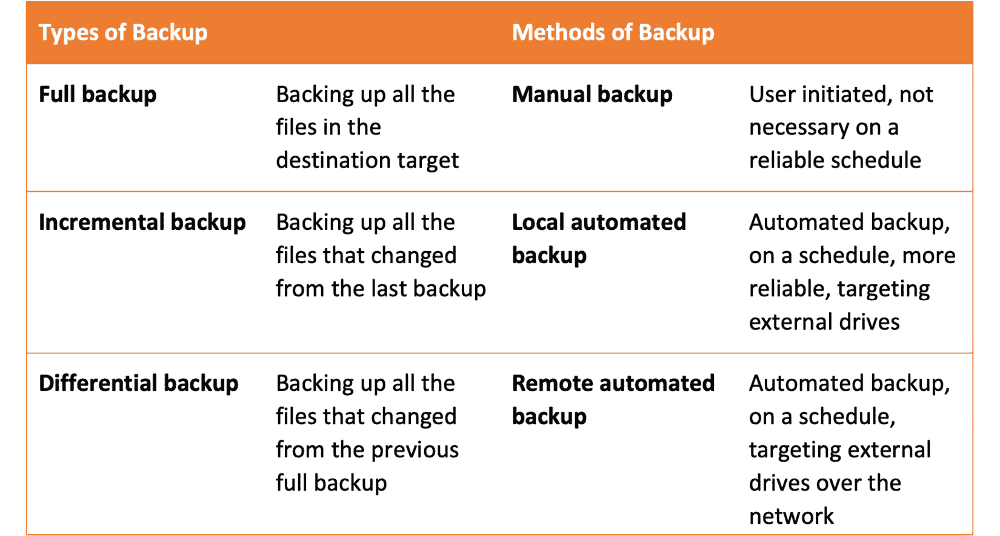

图 10.1 -备份方法和类型

在做备份时，请记住以下规则:

*   **321 规则**，这意味着您应该始终在两个独立的媒体上保存三个数据副本。 一个备份应该始终保持在站点之外(在不同的地理位置)。 这也被称为“三规则”;它可以适用于任何东西，如 312、322、311 或 323。
*   **备份检查**是非常相关的，但大多数时候被忽略了。 它检查数据的完整性和有效性。
*   清晰且文档化的备份策略和流程对 IT团队中使用相同实践的每个人都是有益的。

在下一节中，我们将介绍一些用于完全 Linux 系统备份的知名工具，从集成在操作系统内部的工具开始，到同样适用于家庭和企业使用的第三方解决方案。

## 磁盘克隆解决方案

对于备份，一个好的选择是克隆整个硬盘驱动器或保存敏感数据的几个分区。 Linux为这项工作提供了大量多才多艺的工具。 其中有`dd`命令、`ddrescue`命令和**放松恢复****(ReaR)**软件工具。

### dd 命令

最知名的磁盘备份命令之一是`dd`命令。 我们在前面的[*第六章*](06.html#_idTextAnchor111)，*Working with Disks and Filesystems*中讨论过这个问题。 让我们回顾一下如何在备份和恢复场景中使用它。 `dd`命令用于一个块一个块地从源文件系统复制到目标文件系统，而不考虑文件系统类型。

让我们学习如何克隆整个磁盘。 我们在网络上有一个系统，它有一个 120gb 的 SSD 驱动器，我们想把它备份到 128gb 的 u 盘上。 使用`dd`命令，我们需要确保源文件适合目标文件。 由于我们的磁盘大小非常相似，首先，我们将运行`fdisk -l`命令来确保磁盘大小是正确的:

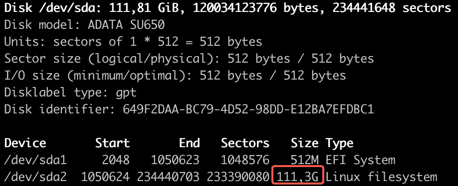

图 10.2 -使用 fdisk -l 来验证源磁盘的大小

在上图中可以看到源磁盘的大小。 目标磁盘的屏幕截图如下:


图 10.3 -使用 fdisk -l 来验证目标磁盘的大小

既然我们知道大小是合适的，并且源文件可以放入目标文件中，我们将继续克隆整个磁盘。 我们将源磁盘`/dev/sda`克隆到目标磁盘`/dev/sdb`:

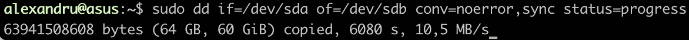

图 10.4 -使用 dd 克隆整个硬盘

命令中显示的选项如下:

*   `if=/dev/sda`表示输入文件，在本例中是源硬盘驱动器。
*   `if=/dev/sdb`表示输出文件，即目标 USB 驱动器。
*   表示允许命令继续忽略错误的指令。
*   `sync`表示用 0 填充输入错误块的指令，以便始终同步数据偏移量。
*   `status=progress`显示关于传输过程的统计信息。

请记住，这个操作可能需要一段时间才能完成。 在我们的系统中，完成这个任务需要 200 分钟。 我们在操作只完成了一半的情况下拍摄了前面的截图。 在下一节中，我们将向您展示如何使用`ddrescue`。

### ddrescue 命令

`ddrescue`命令是另一个可以用于克隆磁盘的工具。 该工具从一个设备或文件复制到另一个设备或文件，第一次尝试只复制良好和正常的部分。 如果您的磁盘出现故障，您可能需要使用`ddrescue`两次，因为第一次它将只复制正常扇区并将错误映射到目标文件。 第二次，它将只复制坏扇区，所以最好为几次读取尝试添加一个选项，以确保无误。 在 Ubuntu 上，没有默认安装`ddrescue`实用程序。 要安装它，使用以下`apt`命令:

```sh
sudo apt install gddrescue
```

我们将在以前使用的相同系统上使用`ddrescue`并克隆相同的驱动器。 命令如下:

```sh
sudo ddrescue -n /dev/sda /dev/sdb rescue.map --force 
```

输出如下:

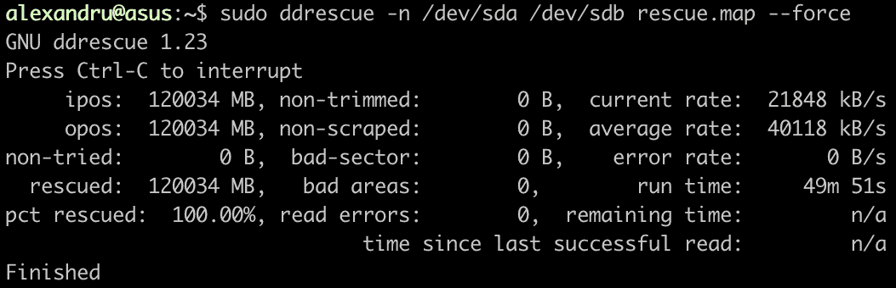

图 10.5 -使用 ddrescue 克隆硬盘

我们使用带有`--force`选项的`ddrescue`命令来确保目的地上的所有内容都将被覆盖。 这个操作也很耗时，所以要做好准备，这将是一个漫长的操作。 在我们的例子中，它几乎花了 1 个小时完成。 接下来，我们将向您展示如何使用另一个有用的工具:ReaR 实用程序。

### 使用 Relax-and-Recover(后)

**ReaR**是用 Bash 编写的功能强大的灾难恢复和系统迁移工具。 它被企业级发行版(如 RHEL 和 SLES)所使用，也可以安装在 Ubuntu 上。 它被设计为易于使用和设置。 它与本地引导加载程序集成，以及`cron`调度程序或监控工具，如**Nagios**。 欲了解更多详情，请访问官方网站[http://relax-and-recover.org/about/](http://relax-and-recover.org/about/)。

要在 Ubuntu 上安装它，使用以下命令:

```sh
sudo apt install rear
```

安装包之后，您需要知道主配置文件的位置。 它被称为`/etc/rear/local.conf`，所有的配置选项都应该写入其中。 ReaR 默认生成 ISO 文件，但它也支持 Samba (CIFS)、USB 和 NFS 作为备份目的地。

#### 使用 ReaR 备份到本地 NFS 服务器

作为示例，我们将向您展示如何备份到 NFS 服务器。 在我们的网络上，我们已经在我们的一台 Ubuntu 机器(Neptune)上设置了一个 NFS 服务器，这意味着我们将能够使用它作为我们的备份服务器，并将本地华硕系统作为要备份的生产机器。

首先，我们必须相应地配置 NFS 服务器。 我们希望您仍然记得如何配置 NFS 共享(在[*第 8 章*](08.html#_idTextAnchor152)、*配置 Linux 服务器*中介绍)，但如果您不记得，这里有一个简短的提示。 NFS 的配置文件是`/etc/exports`，它存储关于共享位置的信息。 在添加任何关于 ReaR 备份共享位置的新信息之前，请先添加一个新目录。 在首次设置 NFS 服务器时，我们使用了`/home/export/`目录。 在该目录中，我们将为我们的 rear 备份创建一个新目录。 创建新目录的命令如下:

```sh
sudo mkdir /home/export/rear 
```

现在，更改目录的所有权。 如果所有者保持`root`，ReaR 将没有权限将备份写到此位置。 使用以下命令更改所有权:

```sh
sudo chown -R nobody:nogroup /home/export/rear/
```

创建目录之后，使用您喜欢的编辑器打开`/etc/exports`文件，并为备份目录添加一个新行。 它应该看起来像下面截图中的最后一个:


图 10.6 -在/etc/exports NFS 文件中添加新行

引入新行后，重新启动 NFS 服务并使用`-s`选项运行`exportfs`命令。 输出如下所示:

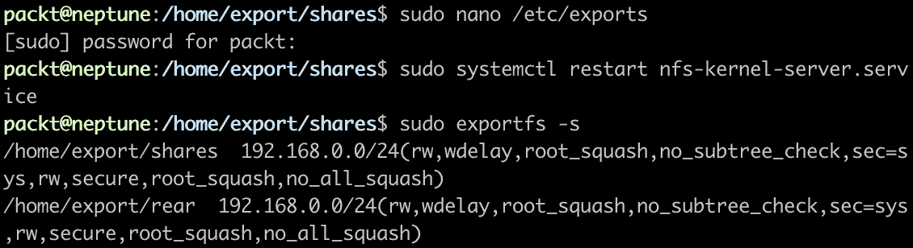

图 10.7 -重新启动 NFS 服务并导出新的共享目录

在设置 NFS 服务器之后，回到本地计算机并开始编辑 ReaR 配置文件，以便使用备份服务器。 编辑`/etc/rear/local.conf`文件并添加如下输出所示的行。 使用你自己系统的 IP 地址，而不是你在下面截图中看到的那个:


图 10.8 -编辑/etc/rear/local.conf 文件

这里显示的行表示以下内容:

*   `OUTPUT`:可引导的映像类型，在我们的示例中是 ISO
*   `OUTPUT_URL`:备份目标，包括 NFS、CIFS、FTP、RSYNC 和 FILE
*   `BACKUP` :所使用的备份方法，在本例中是 NETFS，这是默认的 ReaR 方法
*   `BACKUP_URL`:备份目标的位置

现在，运行带有`-v`和`-d`选项的`mkbackup`命令:

```sh
sudo rear -v -d mkbackup
```

输出会很大，所以我们不会在这里展示给你。 该命令将花费大量时间来完成。 完成之后，您可以检查 NFS 目录以查看其输出。 备份应该在那里:

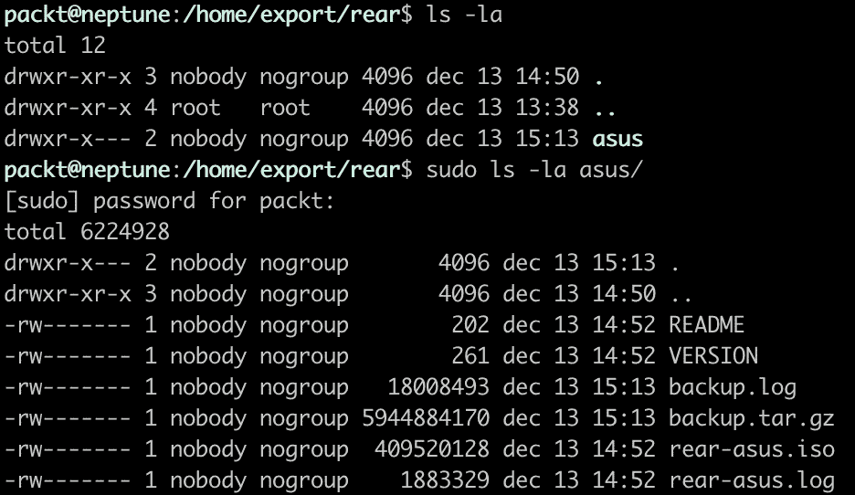

图 10.9 -检查 NFS 服务器上的备份

在 NFS 服务器上写入了几个文件。 其中，称为`rear-asus.iso`的是实际备份，在需要进行系统恢复时将使用该备份。 还有一个名为`backup.tar.gz`的文件，其中包含我们华硕机器上的所有文件。

重要提示

ReaR 的命名约定如下。 该名称将由术语`rear-`组成，然后是系统的`hostname`和`.iso`扩展。 我们的系统的主机名是`asus`，这就是为什么在本例中备份文件被称为`rear-asus.iso`。

在 NFS 服务器上写入备份之后，您就可以通过使用带有在 NFS 服务器上写入的 ISO 映像的 USB 磁盘或 DVD 来恢复系统。

#### 使用 ReaR 备份到 USB

也有选项直接备份在 u 盘上。 将硬盘插入 USB 接口，使用`rear format /dev/sdb`命令格式化硬盘。 输出如下:


图 10.10 -使用 ReaR 格式化 USB 卡

现在，我们需要修改`/etc/rear/local.conf`文件并对其进行调整，使其使用 USB 作为备份目的地。 这些新行应该如下所示:


图 10.11 -在/etc/rear/local.conf 文件中添加新行

使用实例备份 u 盘中的系统。

```sh
rear -v mkbackup
```

手术需要相当长的时间，所以要有耐心。 一旦它完成，ISO 和`tar.gz`文件将在 USB 驱动器上。

要恢复系统，您需要从 USB 驱动器启动并选择第一个选项`Recover "hostname"`。 这里，主机名是您备份的计算机的主机名。

系统备份和恢复是两个非常重要的任务，对于任何 Linux 系统管理员来说都应该是必不可少的。 知道如何执行这些任务可以节省公司、客户的数据、时间和金钱。 最小的停机时间和快速有效的响应应该是每个**首席技术官(CTO)**表中最重要的资产。 在良好的缓解做法方面，备份和恢复战略应始终具有坚实的基础。 在这方面，强大的诊断工具集和故障诊断知识对每个系统管理员总是很有用。 这就是为什么在下一节中，我们将向您展示 Linux 中一些最好的诊断工具。

# 介绍常见的 Linux 故障诊断工具

Linux 的开放性是它最好的资产之一。 这为大量的解决方案打开了大门，这些解决方案可以用于手头的任何任务。 因此，Linux 系统管理员可以使用许多诊断工具。 根据您希望诊断系统的哪个部分，有几个可用的工具。 故障排除本质上是基于特定工具生成的诊断来解决问题。 为了减少要涵盖的诊断工具的数量，我们将在本节将问题缩小到以下类别:

*   引导问题
*   一般的系统问题
*   网络问题
*   硬件问题

每个类别都有特定的诊断工具。 我们将首先向您展示一些最广泛使用的。

## 故障排除引导问题的工具

要理解可能影响引导过程的问题，了解引导过程是如何工作的是很重要的。 我们还没有详细介绍这一点，所以请注意我们将告诉您的所有内容。

### 引导过程

所有主要的 Linux 发行版，如Ubuntu、CentOS、OpenSUSE、Debian、Fedora 和 RHEL，都使用**GRUB2**作为的默认引导加载程序，`systemd`作为其默认的*init*系统。 在 GRUB2 初始化和`systemd`启动到位之前，Linux 引导过程还有几个阶段。

启动顺序如下:

1.  **基本输入输出系统****(BIOS)****上电自检****(POST)**
2.  **Grand Unified Bootloader version 2****(GRUB2)**Bootloader 初始化
3.  GNU / Linux 内核初始化
4.  `systemd`初始化系统

BIOS POST 是一个专用于硬件初始化和测试的进程，它适用于每台 PC，无论它使用的是 Linux 还是 Windows。 BIOS 是为了确保 PC 机内的每个硬件部件都能正常工作。 当 BIOS 无法启动时，通常是硬件问题或兼容性问题。 BIOS 搜索磁盘的引导记录,比如**主引导记录****(MBR)**或**GUID 分区表【显示】**(GPT)**,并加载到内存中。**

GRUB2 初始化是 Linux 开始发挥作用的地方。 这是系统将内核加载到内存中的阶段。 如果有多个操作系统可用，它可以在几个不同的内核之间进行选择。 一旦内核被加载到内存中，它就会控制引导过程。

内核是一个自提取归档文件。 一旦被提取，它就会运行到内存中并加载`init`系统，即 Linux 上所有其他进程的父进程。

称为`systemd`的`init`系统首先挂载文件系统并访问所有可用的配置文件。

在引导过程中，可能会出现问题。 在下一节中，我们将告诉您，如果灾难来袭，您的引导加载程序无法启动，该怎么办。

### 修复 GRUB2

如果 GRUB2 崩溃，您将无法访问您的系统。 这就需要进行 GRUB 修复。 在这个阶段，一个可启动的 USB 驱动器将会拯救你。 我们有一个 Ubuntu 20.04 活动磁盘，我们将在本例中使用它。 以下是你应该遵循的步骤:

1.  插上电源，启动系统。
2.  打开 BIOS，选择可启动盘作为主启动设备，并重新启动。
3.  从屏幕上的窗口中选择**Try Ubuntu**选项。
4.  进入 Ubuntu 实例后，打开一个 Terminal 和`sudo fdisk -l`，检查磁盘和分区。
5.  选择安装了 GRUB2 的，并使用以下命令:

    ```sh
    sudo mount -t ext4 /dev/sda1 /mnt
    ```

6.  安装 GRUB2:

    ```sh
    sudo chroot /mnt
    grub-install /dev/sda
    grub-install –recheck /dev/sda
    update-grub
    ```

7.  使用以下命令卸载分区:

    ```sh
    exit
    sudo unmount /mnt
    ```

8.  重新启动计算机。

处理引导加载程序是非常敏感的。 注意所有的细节，注意你输入的所有命令。 否则，一切都会偏离正轨。 在下一节中，我们将向您展示一些用于一般系统问题的诊断工具。

## 故障排除一般系统问题的工具

系统问题可以是不同类型和复杂性的。 了解处理这些问题的工具是至关重要的。 在本节中，我们将介绍 Linux 发行版提供的默认工具。 对于任何 Linux 系统管理员来说，基本的故障排除知识都是必要的，因为在常规操作过程中可能(并且将会)发生问题。

一般系统问题意味着什么? 基本上，这些是关于磁盘空间、内存使用、系统负载和运行进程的问题。

### 磁盘相关问题的命令

磁盘，无论是还是 hdd 或 ssd，都是系统的重要组成部分。 它们为您的数据、文件和任何类型的软件(包括操作系统)提供必要的空间。 我们将不讨论与硬件相关的问题，因为这将是未来一节的主题，该节将称为*用于故障诊断硬件问题的工具*。 相反，我们将讨论与磁盘空间相关的问题。 最常见的诊断工具已经安装在任何 Linux 系统上，它们由以下命令表示:

*   `du`:显示文件和目录的磁盘空间利用率的实用程序
*   `df`:显示目录磁盘使用情况的实用程序

下面是使用`df`实用程序和`-h`选项的示例。 以人类可读的格式显示磁盘使用情况，磁盘大小以千字节、兆字节和千兆字节表示:


图 10.12 -执行 df -h 命令查看磁盘空间使用情况

如果其中一个磁盘耗尽了空间，它将显示在输出中。 在我们的示例中，这不是问题，但是该工具仍然与找出哪些可用磁盘的空闲可用空间存在问题有关。

当磁盘已满或几乎已满时，可以应用几个修复程序。 如果您必须删除一些文件，我们建议您从您的`/home`目录中删除它们。 尽量不要删除重要的系统文件。 以下是解决可用空间问题的一些想法:

*   使用`rm`命令(可以选择使用`-rf`)或`rmdir`命令删除不需要的文件。
*   使用`rsync`命令将文件移动到外部驱动器(或云)。
*   找出您的`/home`目录中使用最多空间的目录。

下面是使用`du`实用程序查找`/home`目录中的最大目录的示例。 我们使用两个管道将`du`命令的输出传输到`sort`命令，最后传输到带有`5`选项的`head`命令(因为我们希望显示五个最大的目录，而不是全部):

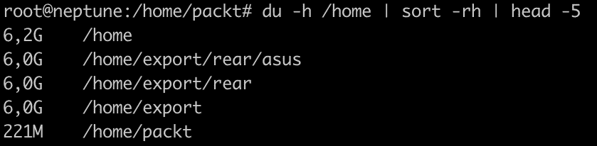

图 10.13 -在/home 目录中找到最大的目录

可能存在使用`inodes`的数量问题，而不是空间问题。 您可以使用`df -i`命令查看是否已经用完`inodes`:


图 10.14 -检查是否用光了 inode

除了这里显示的命令,每个 Linux 发行版的默认值,还有许多其他开源工具对磁盘空间的问题,比如**pydf**,**分手**,**sfdisk**,**iostat**,【显示】和基于 gui Gparted 应用程序。

### 内存使用问题的命令

内存过载，加上、CPU 加载和磁盘使用，是影响整个系统性能的因素。 使用特定工具检查系统负载是极其重要的。 Linux 中检查 RAM 统计信息的默认工具叫做`free`，它可以在任何主流发行版中访问:


图 10.15 -在 Linux 中使用 free 命令

如上面的屏幕截图所示，使用`free`命令(带有`-h`选项用于人类可读的输出)会显示如下:

*   `total`:内存总量
*   `used`:已使用的内存，计算为总内存减去缓冲内存、缓存内存和空闲内存
*   `free`:空闲或未使用的内存
*   `shared`:`tmpfs`使用的内存
*   `buff/cache`:内核缓冲区和页面缓存所使用的内存
*   `available`:新应用程序可用的内存量

通过这种方式，您可以找到与更高内存使用相关的特定问题。 不断检查服务器上的内存使用情况对于了解资源是否得到有效使用非常重要。

另一种检查内存使用情况的方法是使用`top`命令，如下图所示:


图 10.16 -使用 top 命令检查内存使用情况

在使用`top`命令时，屏幕上有几个部分可用。 输出是动态的，在某种意义上它是不断变化的，显示关于系统上运行的进程的实时信息。 内存部分显示了关于所使用的总内存、空闲内存和缓冲内存的信息。 默认情况下，所有信息都以兆字节显示，以便于阅读和理解。

另一个显示内存信息(以及其他有价值的系统信息)的命令是`vmstat`:

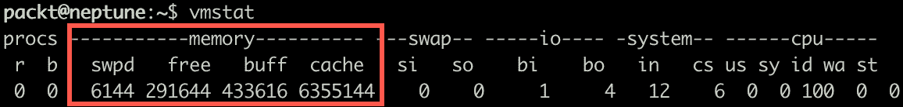

图 10.17 -使用没有选项的 vmstat

默认情况下，`vmstat`显示进程、内存、交换板、磁盘和 CPU 使用情况。 内存信息从第二列开始显示，包含如下详细信息:

*   `swpd`:虚拟内存的使用量
*   `free`:有多少内存可用
*   `buff`:正在用于缓冲的内存数量
*   `cache`:用于缓存的内存数量

`vmstat`命令有几个可用选项。 要了解所有选项以及输出中的所有列代表什么，请使用以下命令访问各自的手动页面:

```sh
man vmstat
```

可以与`vmstat`一起使用的选项有`-a`和`-s`，以显示关于内存的不同信息。 通过使用`vmstat -a`，输出将显示当前内存和未激活内存:


图 10.18 -使用 vmstat -a 显示活动内存和非活动内存

使用`vmstat -s`将显示详细的内存、CPU 和磁盘统计信息。 这里显示了输出中一些内存统计信息的摘录:

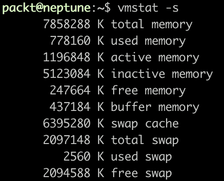

图 10.19 -使用带有-s 选项的 vmstat 进行内存统计

本节中讨论的所有命令对于故障诊断任何内存问题都是必不可少的。 您可能还可以使用其他版本，但这些版本是您在任何 Linux 发行版中默认会找到的。

然而，还有一个在本节中值得一提:`sar`命令。 这可以通过`sysstat`包安装在 Ubuntu 中。 因此，请使用如下命令安装包:

```sh
sudo apt install sysstat
```

安装包后，为了能够使用`sar`命令显示系统内存使用的详细统计信息，您需要启用`sysstat`服务。 它需要积极地收集数据。 默认情况下，服务每 10 分钟运行一次，并将日志保存在`/var/log/sysstat/saXX`目录中。 每个目录都以服务运行的日期命名。 例如，如果我们在 12 月 16 日运行`sar`命令，服务将查找`/var/log/sysstat/sa16`中的数据。 我们在 12 月 16 日启动服务之前运行`sar`命令，错误输出如下:


图 10.20 -在启动 sysstat 服务之前运行 sar 命令

因此，要启用数据收集，首先启动并启用`sysstat`服务:

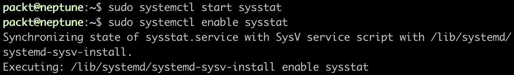

图 10.21 -启动和启用 sysstat 服务

重要提示

在系统重启的情况下，默认情况下服务可能不会重启，即使执行了上述命令。 为了克服这个问题，在 Ubuntu 上，你应该编辑/`etc/default/sysstat`文件，将 ENABLED 状态从 false 更改为 true。

服务的名称是**系统活动数据收集器(sadc)**，它对包和服务使用`sysstat`名称。

使用`sar`命令，您可以实时生成不同的报表。 例如，如果我们想每 2 秒生成 5 次内存报告，我们将使用`-r`选项，如下面的截图所示:


图 10.22 -使用`sar`命令实时生成内存统计信息

输出每 2 秒显示一行，每行 5 次，最后显示一个平均行。 它是一个强大的工具，不仅可以用于内存统计。 还有用于 CPU 和磁盘统计的选项。

总的来说，在本节中，我们介绍了用于故障诊断内存问题的最重要的工具。 在下一节中，我们将介绍用于解决一般系统负载问题的工具。

### 用于系统负载问题的命令

与我们在前几节中讨论的类似，在本节中，我们将讨论系统负载问题。 用于其他类型问题的一些工具也可以用于系统加载问题。 例如，当我们试图确定系统的延迟时，`top`命令是最广泛使用的命令之一。 所有其他工具，如`vmstat`和`sar`，也可用于 CPU 和系统负载故障排除。

故障诊断系统负载的基本命令是`uptime`。 正常运行时间的输出通常在最后显示三个值。 这些值表示 1、5 和 15 分钟的负载平均值。 平均负载可以让您清楚地了解系统进程的情况。

如果您有一个单一的 CPU 系统，平均负载为 1 意味着该 CPU 处于满载状态。 如果这个数字更高，这意味着负载比 CPU 所能处理的要高得多，这可能会给您的系统带来很大压力。 因此，进程将需要更长的时间来执行，系统的整体性能将受到影响。

高平均负载意味着应用程序同时运行多个线程。 然而，一些负载问题不仅仅是过度拥挤的 CPU 造成的——它们可能是 CPU 负载、磁盘 I/O 负载和内存负载的综合影响。 在这种情况下，用于诊断系统负载问题的瑞士军刀是`top`命令。 `top`命令的输出根据系统的负载不断地实时变化:

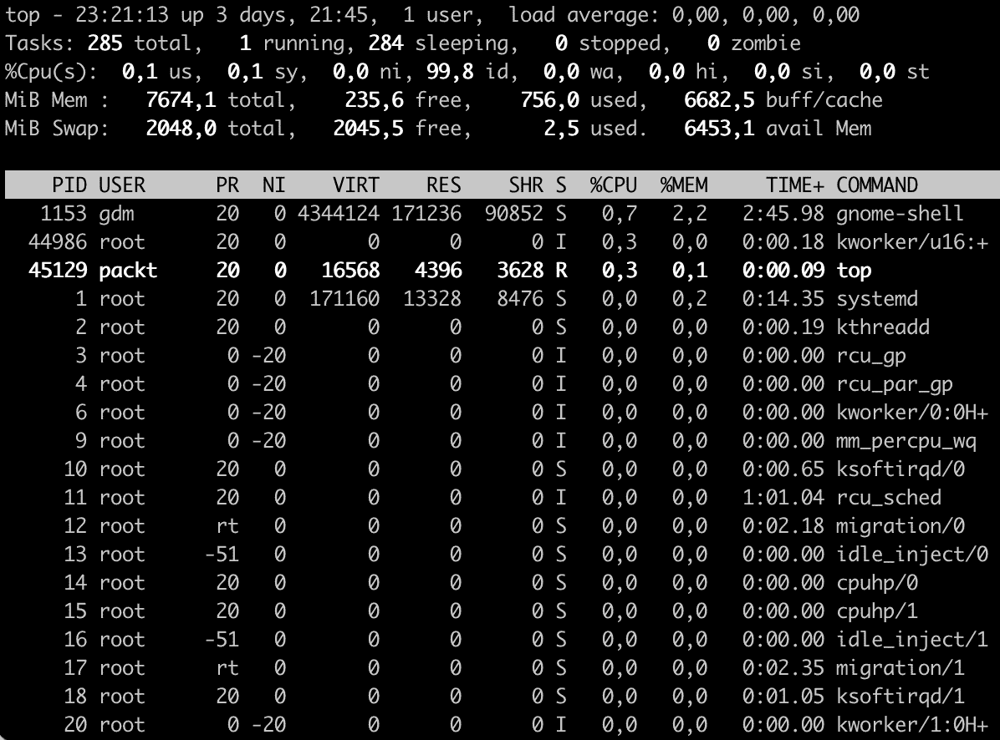

图 10.23 -运行 top 来解决系统负载问题

默认情况下，`top`根据进程占用的 CPU 数量对其进行排序。 它以交互模式运行，有时，输出很难在屏幕上看到。 您可以将输出重定向到一个文件，并使用`-b`选项以批处理模式使用该命令。 这种模式只在指定的次数下更新命令。 以批处理方式运行`top`命令:

```sh
top -b -n 1 | tee top-command-output
```

对于没有经验的 Linux 用户来说，`top`命令可能有点吓人。 这就是为什么我们要稍微解释一下输出:

*   `us`:用户 CPU 时间
*   `sy`:系统 CPU 时间
*   `ni`:良好的 CPU 时间
*   `id`:CPU 空闲时间
*   `wa`:输入/输出等待时间
*   `hi`:CPU 硬件中断时间
*   `si`:CPU 软件中断时间
*   `st`:CPU 窃取时间

另一个有用的工具诊断 CPU 使用情况和硬盘输入/输出时间是`iostat`:

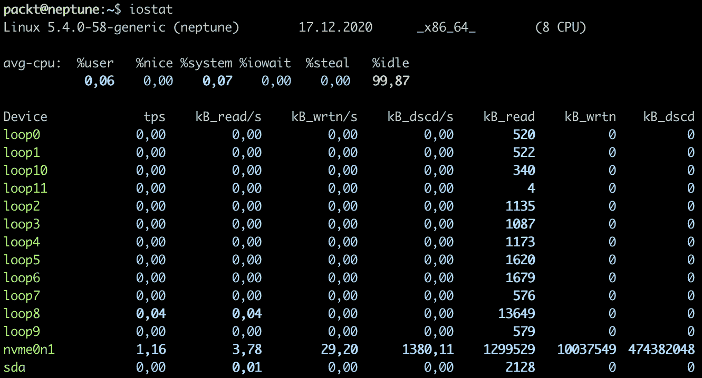

图 10.24 - iostat 的输出

CPU 统计信息类似于`top`的输出。 I/O 统计数据显示在 CPU 统计数据下面。 下面是每一列代表的内容:

*   `tps`:每秒传输到设备(I/O 请求)
*   `kB_read/s`:从设备读取的数据量(以块数为单位，单位为千字节)
*   `kB_wrtn/s`:写入设备的数据量(以块数为单位，单位为千字节)
*   `kB_dscd/s`:设备丢弃的数据量(单位为千字节)
*   `kB_read`:读取的总块数
*   `kB_wrtn`:写块总数
*   `kB_dscd`:丢弃的块总数

有关`iostat`命令的更多信息，请使用以下命令阅读相应的手册页:

```sh
man iostat
```

除了`iostat`命令之外，您还可以使用另一个命令`iotop`。 它不是默认安装在 Ubuntu 上，但你可以安装它。 首先，用下面的命令搜索包:


图 10.25 -搜索 iotop 包

然后，您可以使用以下命令安装它:

```sh
sudo apt install iotop
```

一旦安装了这个包，你需要`sudo`特权来运行它:


图 10.26 -运行 iotop 命令

您还可以运行服务来排除系统负载问题，类似于我们使用它来排除内存问题的方式。 默认情况下，`sar`将输出当前一天的 CPU 统计信息:


图 10.27 -运行 sar 来诊断 CPU 负载

在上面的截图中，`sar`每 2 秒运行 5 次。 此时，我们的本地网络服务器负载并不重，但是您可以想象，当该命令在频繁使用的服务器上运行时，输出将是不同的。 正如我们在前一节中指出的，`sar`命令有几个选项，这些选项在寻找潜在问题的解决方案时可能非常有用。 运行`man sar`命令，查看包含所有可用选项的手动页面。

还有许多其他工具可以用于一般的系统故障排除。 使用本节中展示的工具，我们仅仅触及了这个主题的表面。 如果您觉得有必要，我们建议您搜索更多用于一般系统故障排除的工具。 否则，这里提供的这些已经足够您生成关于可能的系统问题的可行报告。

特定于网络的问题将在下一节中讨论。

## 网络故障处理工具

排除网络问题几乎占系统管理员工作的 80%——甚至更多。 这些数字并没有得到任何官方研究的支持，更多的是实践经验的见解。 由于大多数服务器和云问题都与网络有关，因此最佳的工作网络意味着减少停机时间，让客户和系统管理员感到满意。

在本节中我们将介绍的工具是所有主要 Linux 发行版中的默认工具。 所有这些工具讨论了[*第七章*](07.html#_idTextAnchor126)*,网络对于 Linux,*[*第八章【显示】*](08.html#_idTextAnchor152),*配置 Linux 服务器*、【病人】和*第 9 章*,【t16.1】获得 Linux,所以我们只会的名字一遍从解决问题的角度来看。 让我们分析一下在特定的 TCP/IP 层上应该使用的工具。 还记得 TCP/IP 模型中有多少层吗? 有五层可用，我们将从第一层开始。 作为一种良好的实践，最好通过堆栈来进行网络故障排除，从应用层一直到物理层。

### 诊断层 1

很多时候，由于网络的复杂性，问题往往会出现。 网络对日常生活至关重要。 我们到处都在使用它们，从无线智能手表到智能手机，再到电脑，再到云计算。 世界各地的一切都是连接在一起的，这使我们的生活更美好，而系统管理员的生活更艰难一些。 在这个相互连接的世界中，事情很容易出错，需要对网络问题进行故障排除。

`ping`命令是最基本的测试工具之一，也是大多数系统管理员最先使用的工具之一。 名称来自分组 InterNet Groper，它提供基本的连接测试。 让我们在一个本地服务器上进行测试，看看是否一切正常。 我们将使用`ping`命令的`-c`选项运行四个测试。 输出如下:


图 10.28 -使用 ping 命令运行基本测试

Ping 正在向目的地(在本例中是`google.com`)发送简单的 ICMP 包，并等待响应。 一旦它被接收并且没有数据包丢失，这意味着一切工作正常。 `ping`命令可以用来测试到本地网络系统和远程网络的连接。 它是第一个用于测试和隔离可能问题的工具。

有时候，使用`ping`命令进行简单的测试是不够的。 在本例中，另一个通用命令是`ip`命令。 你可以用检查物理层是否有任何问题:


图 10.29 -使用 ip 命令显示物理接口的状态

在上图中，可以看到以太网接口(`state UP`)运行正常，而无线接口(`state DOWN`)运行不正常。 它在任何其他系统上都可能不同，我们可以使用下面的命令带来一个接口。 在我们的例子中，我们将使用以下命令打开无线接口:

```sh
ip link set wlp0s20f3 up
```

执行该命令后，可以查看接口的状态。

```sh
ip link show
```

如果您可以直接访问服务器或系统，您可以直接检查线路是否连接。 如果您碰巧正在使用无线连接(不推荐)，则需要使用和`ip`命令。

另一个有用的工具是`ethtool`。 Ubuntu 默认没有安装，所以你需要安装它才能使用它。 安装完成后，要检查以太网接口，运行如下截图所示的命令:


图 10.30 -使用 ethtool 命令

通过使用`ethtool`，我们可以检查一个连接是否达到了正确的速度。 在前面的示例中，您可以看到，在我们的示例中，服务器已经正确地协商了一个完整的 1,000 Mbps 全双工连接。 在下一节中，我们将向您展示如何诊断第 2 层堆栈。

### 诊断层 2

TCP/IP 协议栈中的第二层称为数据链路层。 它通常负责局域网的连接。 在这个阶段可能发生的大多数问题都是由于不正确的 IP 到 MAC 地址映射造成的。 可以在此实例中使用的一些工具包括`ip`命令和`arp`命令。 `arp`命令,来自【显示】**地址解析协议(ARP)**,用于地图 IP 地址与 MAC 地址(3)层(第二层)。在 Ubuntu,【病人】`arp`命令可以通过`net-tools`包。 首先，使用以下命令进行安装:

```sh
sudo apt install net-tools
```

可以使用`arp`命令查看 ARP 表内的表项，如下图所示:

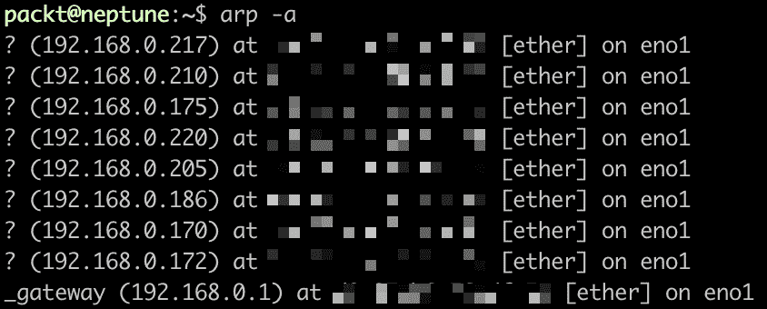

图 10.31 -使用 arp 命令映射 arp 表项

`arp`命令的输出将显示所有连接的设备，以及它们的 IP 和 MAC 地址的详细信息。 注意，出于隐私考虑，MAC 地址被模糊处理了。

与`arp`命令类似，您可以使用`ip neighbor show`命令，如下所示:

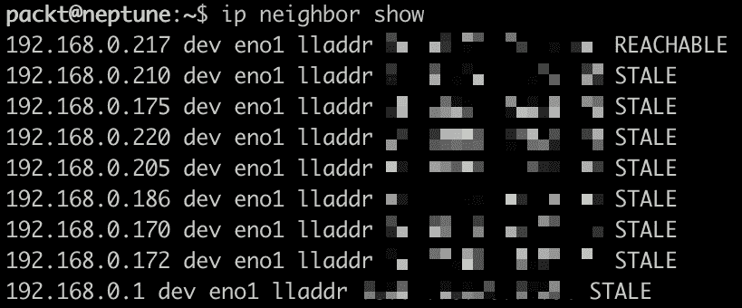

图 10.32 -使用 ip 命令显示 ARP 表项

`ip`命令可以用来删除 ARP 表项，如下所示:

```sh
ip neighbor delete IP dev eno1
```

这里，`IP`是您想要从列表中删除的IP。

`arp`和`ip`命令都有类似的输出。 它们是功能强大的命令，对于排除可能的第 2 层问题非常有用。 在下一节中，我们将向您展示如何诊断第 3 层堆栈。

### 诊断第三层

在第 3 层，我们只处理 IP 地址。 我们已经了解了这里要使用的工具，例如`ip`命令、`ping`命令、`traceroute`命令和`nslookup`命令。 因为我们已经讨论了`ip`和`ping`命令，所以这里只讨论如何使用`traceroute`和`nslookup`。 Ubuntu 中没有默认安装`traceroute`命令。 你必须使用以下命令安装它:

```sh
sudo apt install traceroute
```

默认情况下，`nslookup`包已经在 Ubuntu 中可用。 首先，要查看路由表，查看不同路由的网关列表，我们可以使用`ip route`命令:


图 10.33 -使用 ip route show 命令显示路由表

`ip route`命令中显示为默认网关。 如果它丢失或配置不正确，就会出现问题。

`traceroute`工具用于检测流量从源到目的的路径。 下面的输出显示了数据包从我们的本地网关到谷歌的服务器的路径:


图 10.34 -使用 traceroute 进行路径跟踪

`traceroute`工具为，用于检测流量从源到目的的路径。 数据包在发送时和返回源时通常没有相同的路由。 数据包被发送到网关进行处理，然后通过特定的路由发送到目的地。 当数据包超过本地网络时，`traceroute`工具可能不能准确地表示它们的路由，因为它所依赖的数据包可以被路径上的许多网关过滤(ICMP TTL Exceeded 数据包通常被过滤)。

与 traceroute 类似，还有一个更新的工具**tracepath**。 它默认安装在 Ubuntu 上，是`traceroute`的替代品。 它被认为更可靠，因为它使用 UDP 端口进行跟踪，而`traceroute`使用不太可靠的 ICMP 协议。 `Tracepath`可以与`-n`选项一起使用，以显示 IP 地址而不是主机名。 下面是一个例子:


图 10.35 -使用 tracepath 命令

进一步检查网络问题可能导致错误的 DNS 解析，其中主机只能通过 IP 地址访问，而不能通过主机名访问。 要解决这个问题，即使它不是第 3 层协议，也可以使用`nslookup`命令和`ping`命令:


图 10.36 -使用 nslookup 进行 IP 和 DNS 故障排除

上述输出显示`nslookup`命令与`ping`命令具有相同的 IP，这意味着一切正常。 如果在输出中显示了不同的 IP，那么您的主机配置有问题。 在下一节中，我们将向您展示如何诊断第 4 层和第 5 层堆栈。

### 诊断第 4 和第 5 层

最后两个层，第 4 层(传输)和第 5 层(应用)，将主要为应用提供主机到主机的通信服务。 这就是为什么我们将以简略的方式介绍它们。 的两个最著名的从第四层协议**【病人】**传输控制协议(TCP)和**【t16.1】**用户数据报协议(UDP)、使用和实现在每个操作系统可用。 TCP 和 UDP 覆盖了互联网上的所有流量。 用于排除第 4 层问题的一个重要工具是`ss`命令。 `ss`命令是`netstat`的最新替换，用于查看所有网络套接字的列表。 因此，列表可以有很大的大小，所以您可以使用几个命令选项来减少它。 例如，您可以使用`-t`选项只查看 TCP 套接字，使用`-u`选项查看 UDP 套接字，使用`-x`选项查看 Unix 套接字。 因此，要查看 TCP 和 UDP 套接字信息，我们将使用`ss`命令，如下图所示:

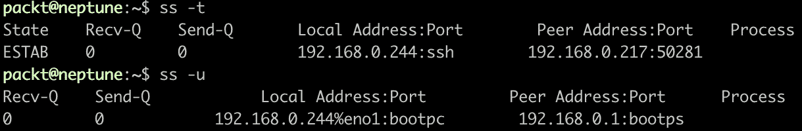

图 10.37 -使用 ss 命令列出 TCP 和 UDP socket

此外，要查看系统上的所有监听套接字，可以使用`-l`选项。 这一个，结合`-u`和`-t`选项，将显示您的系统上所有的 UDP 和 TCP 侦听套接字。 以下是摘录自一个更长的清单:

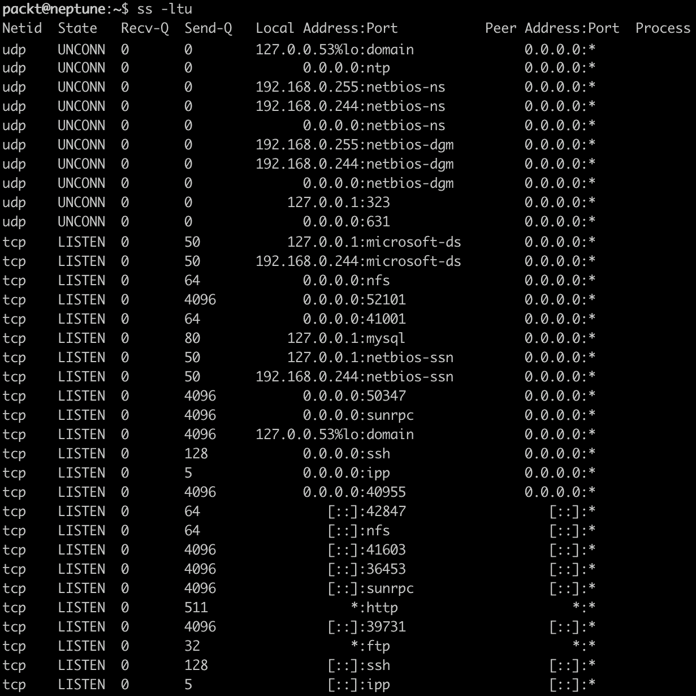

图 10.38 -监听套接字列表

当您想要验证可用的套接字和处于`LISTEN`状态的套接字时，`ss`命令对于网络故障诊断非常重要。 系统管理员的工具箱中不应该缺少这个工具。 5 层,应用层,是由应用程序使用的协议,我们将记住协议(如****动态主机配置协议(DHCP)**,在【显示】**超文本传输协议(HTTP),【病人】和文件传输协议(FTP**)。 由于诊断第 5 层主要是应用程序故障诊断过程，因此将不在本节中涵盖d。******

 ****在下一节中，我们将简要地讨论硬件故障排除问题。

## 硬件故障排除工具

故障排除硬件问题的第一步是检查硬件。 查看系统硬件详细信息的一个非常好的工具是`dmidecode`命令。 该命令用于以人类可读的格式读取每个硬件组件的详细信息。 每一块硬件都有特定的 DMI 代码，这取决于它的类型。 此代码特定于 SMBIOS。 下面是可用的所有硬件代码的列表。 SMBIOS 使用的代码有 45 个，如下:

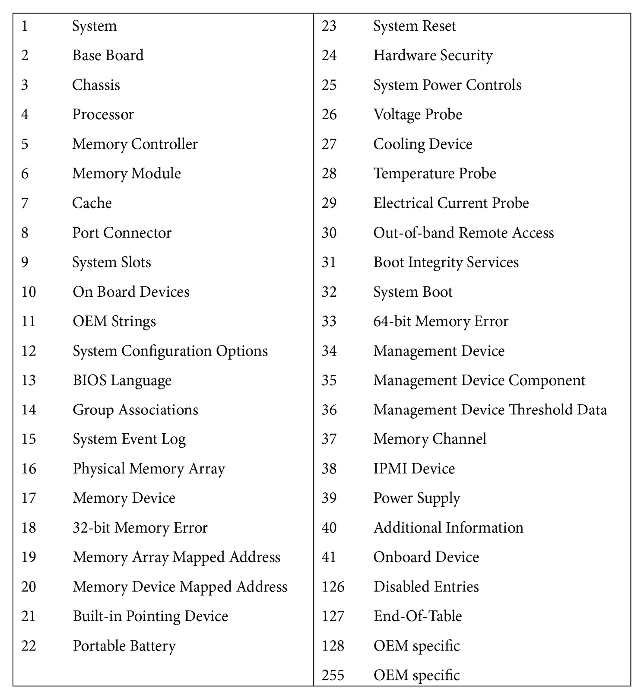

要查看关于系统内存的详细信息，您可以使用带有`-t`选项(来自 TYPE)的`dmidecode`命令和代码 17(对应于内存设备的)。 我们系统中的一个例子如下:

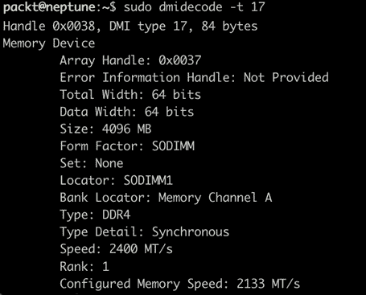

图 10.39 -使用 dmidecode 查看内存信息

要查看关于其他硬件组件的详细信息，请结合特定代码使用该命令。 其他快速故障排除工具包括`lspci`、`lsblk`和`lscpu`等命令。 这些命令的输出可能会非常大，不能放在一个屏幕上:


图 10.40 - lsblk 命令的输出

`lsblk`命令的输出显示关于系统上正在使用的磁盘和分区的信息。 `lscpu`命令将显示 CPU 的详细信息:

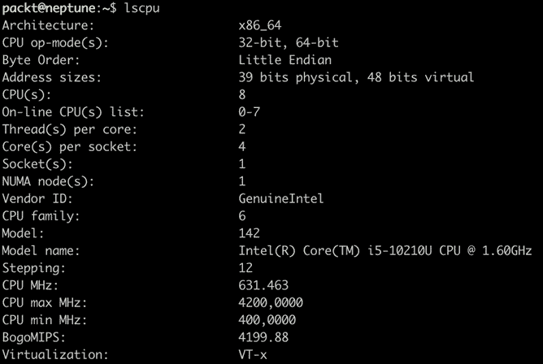

图 10.41 - lscpu 的输出

在对硬件问题进行故障排除时，快速查看一下内核的日志可能会很有用。 为此，使用以下示例中的`dmesg`命令:

```sh
dmesg | more
```

如您所见，硬件故障排除与所有其他类型的故障排除一样重要且具有挑战性。 解决与硬件相关的问题是任何系统管理员工作的一个组成部分。 这包括不断检查硬件部件，用新部件替换故障部件，并确保它们顺利运行。

# 总结

在本章中，我们强调了灾难恢复计划、备份和恢复策略以及故障排除各种系统问题的重要性。 当灾难发生时，每个系统管理员都应该能够将他们的知识应用到实践中。 不同类型的故障最终会影响正在运行的服务器，因此应尽快提供解决方案，以确保最小的停机时间并防止数据丢失。

本章代表了本书中*高级服务器管理*部分的高潮部分。 在下一章中，我们将向您介绍云计算作为当今和未来计算景观的一个自然步骤和顶峰。

# 练习

在我们深入到云部分并查看任何 Linux 发行版上的故障排除问题之前，让我们测试一下您现在已经知道的所有内容。 故障排除是解决问题的最佳方法，下面的问题可以测试您的基本和高级 Linux 管理的全部知识:

1.  试着为你的私人网络或小企业起草一个 DRP。
2.  使用 321 规则备份您的整个系统。
3.  找出您的系统中使用 CPU 最多的前 10 个进程。
4.  找出您系统中使用 RAM 最多的前 10 个进程。

# 进一步阅读

*   Ubuntu 20.04 LTS 官方文档:[https://ubuntu.com/server/docs](https://ubuntu.com/server/docs)
*   RHEL 8 官方文档:[https://access.redhat.com/documentation/en-us/red_hat_enterprise_linux/8/](https://access.redhat.com/documentation/en-us/red_hat_enterprise_linux/8/)
*   SUSE 官方文档:[https://documentation.suse.com/](https://documentation.suse.com/)********