# 十三、使用 AWS 和 Azure 部署到云

近年来，我们看到了从本地计算平台到私有和公共云的重大转变。 在一个不断变化和加速的世界中，在高度可伸缩、高效和安全的基础设施中部署和运行应用对各地的企业和组织都至关重要。 另一方面，与当前的公共云产品相比，维护本地计算资源同等级别的安全性和性能所需的成本和专业知识几乎不合理。 无论大小，越来越多的企业和团队正在采用公共云服务，尽管大型企业采取行动的速度相对较慢。

云计算的最佳隐喻之一是应用服务*on tap*。 你的应用需要更多资源吗? 只需*打开水龙头*并提供所需的任意数量的虚拟机或实例(水平伸缩)。 或者，对于某些实例，您可能需要更多的 cpu 或内存(垂直扩展)。 当你不再需要资源时，只需*关掉水龙头*。

公共云服务以相对较低的速率提供所有这些功能，减少了维护容纳这些功能的本地基础设施可能带来的操作开销。

本章将向您介绍**Amazon Web Services**(**AWS**)和 Microsoft Azure——两个主要的公共云提供商——并提供一些在云中部署应用的实际指导。 特别地，我们将关注典型的云管理工作负载，使用 web 管理控制台和命令行界面。

在本章的最后，你将知道如何使用 AWS 管理控制台、AWS CLI、Azure web 门户和 Azure CLI 来管理你的云资源，这是我们这个时代最流行的两个云提供商。 您还将了解如何在云中创建和启动资源，从而在性能和成本之间取得合理的平衡。

我们希望 Linux 管理员——新手和有经验的都一样——会发现本章的内容是相关的和新鲜的。 当我们探索 AWS 和 Azure 云工作负载时，我们的重点纯粹是实用的。 我们将不再比较这两者，因为这样的努力已经超出了本章的范围。 为了让旅程不那么无聊，我们还将避免在描述 AWS 和 Azure 管理任务之间保持完美的对称。 我们都知道 AWS 是最先进入公共云领域的。 其他主要的云提供商紧随其后，采用，偶尔改进底层的范例和工作流。 在我们首先介绍 AWS 时，我们将讨论一些云供应概念(例如区域和**可用区域**(**az**))，它们在很多方面与 Azure 非常相似。

最后，我们将把使用 AWS 或 Azure 的最终选择留给您。 我们把地图给你。 这条路是你的。

以下是你将要学习的一些关键话题:

*   使用 AWS 控制台
*   理解 AWS EC2 配置类型
*   创建和管理 AWS EC2 实例
*   使用 AWS CLI
*   介绍 Azure web 门户
*   在 Azure 中创建虚拟机
*   在 Azure 中管理虚拟机和相关的云资源
*   使用 Azure CLI

# 技术要求

如果你想跟随实际的例子，本章需要 AWS 和 Azure 帐户。 两家云提供商都提供免费订阅服务:

*   AWS Free Tier:[https://aws.amazon.com/free](https://aws.amazon.com/free)
*   Microsoft Azure 免费账号:[https://azure.microsoft.com/en-us/free/](https://azure.microsoft.com/en-us/free/)

您还需要一台带有您选择的 Linux 发行版的本地机器来安装和试验 AWS CLI 和 Azure CLI 实用程序。 AWS 和 Azure 的 web 控制台驱动的管理任务需要一个现代的 web 浏览器，并且您可以访问任何平台上的相关门户。 要运行 AWS 和 Azure CLI 命令，您需要一个 Linux 命令行终端，并具有使用 shell 的中级水平。

接下来，让我们从我们的第一个竞争者 AWS EC2 开始。

# 使用 AWS EC2

AWS**弹性计算云**(**EC2**)是一种可伸缩的计算基础设施，允许用户租赁虚拟计算平台和服务来运行他们的云应用。 近年来，AWS EC2 因其出色的性能和可扩展性以及相对经济的服务计划而受到极大的欢迎。 本节提供一些基本的功能知识，帮助您开始部署和管理运行应用的 AWS EC2 实例。 特别地，我们将为您介绍以下内容:

*   EC2 实例类型——区分不同的供应和相关的定价层
*   **Amazon Machine Images**(**AMI**)-启动 EC2 实例所需的功能单元
*   访问 EC2 实例——使用 SSH 连接和 SCP 在 EC2 实例之间传输文件
*   使用 EBS 快照备份和恢复 EC2 实例
*   使用 AWS CLI

在本节结束时，您将基本了解 AWS EC2 以及如何选择、部署和管理 EC2 实例。

让我们从启动 EC2 实例开始。

## 创建 AWS EC2 实例

AWS EC2 提供了各种实例类型，每种类型都有其配置、容量、定价和用例模型。 在不同的 EC2 实例类型之间进行选择并不总是简单的。 本节将简要描述每种 EC2 实例类型，使用它们的一些优缺点，以及如何选择最具成本效益的解决方案。 对于每种实例类型，我们将向您展示如何使用 AWS 控制台启动一个实例。 接下来，我们将看看两个基本的 EC2 部署特性——*AMIs*和*安置组*——它们允许您在部署和扩展 EC2 实例时精通并灵活应变。

接下来让我们看看 EC2 实例类型。

### 介绍 AWS EC2 实例类型

我们可以从两个角度来看待 EC2 实例类型:

*   **Provisioning**—EC2 实例的容量和计算能力
*   **Pricing**—运行 EC2 实例的费用

当您选择 EC2 实例时，您必须同时考虑两者。 让我们简要地看一下这些选项。

#### EC2 实例配置选项

每个 EC2 实例配置类型的主要区别特性是计算能力，如下所示:

*   CPU 或**虚拟 CPU**(**vCPU**)
*   随机存取存储器(内存)
*   存储(磁盘容量)

一些 EC2 实例类型还提供**图形处理单元**(**GPU)或**现场可编程门阵列(FPGA**【显示】)计算功能。******

 **下面是基于配置的 EC2 实例类型的快速枚举:

*   **通用**-适用于广泛的工作负载，具有平衡的 CPU 供应，内存和存储。 实例类:`m4`,`m5`,`m5a`,`m5ad`,`m5d`,`m5dn`,`m5n`,`m5zn`、【显示】,`m6gd`,`mac1`,`t2`,【病人】,`t3a`,`t4g`。 例如，一个`m4.large`实例有 2 个 vcpu 和 8gb 内存。
*   **计算优化**-理想的计算绑定应用与高性能处理。 实例类:`c4`,`c5`,`c5a`,`c5ad`,`c5d`,`c5n`,`c6g`,`c6gd`,【显示】。 例如，一个`c4.large`实例有 2 个 vcpu 和 3.75 GB 内存。
*   **内存优化**-设计用于具有大内存数据集的高性能工作负载。 实例类:`r4`,`r5`,`r5a`,`r5ad`,`r5b`,`r5d`,`5dn`,`r5n`、【显示】,`r6gd`,`u-6tb1`,`u-12tb1`,【病人】,`u-24tb1`,`x1`,`x1e`,【t16.1】。 例如:`r4.large`实例有 2 个 vcpu, 15.25 GB 内存。
*   **存储优化**-适用于在本地存储上运行具有高顺序读写操作的工作负载和大数据集。 实例类别:`d2`，`d3`，`d3en`，`h1`，`i3`，`i3en`。 例如，一个`d2.xlarge`实例有 4 个 vcpu 和 30.5 GB 内存。
*   **加速计算**-适用于使用硬件加速实现特定功能，如图形处理、浮点计算和数据模式匹配。 实例类:`p2`,`p3`,`g2`,`g3`,`g3s`,`g4ad`,`g4dn`,`f1`,【显示】。 例如，一个`p2.xlarge`实例有 4 个 vcpu、61 GB 内存和 1 个加速器(即协处理器或 GPU)。

EC2 实例配置类型的详细视图超出了本章的范围。 您可以在这里浏览相关信息:[https://docs.aws.amazon.com/AWSEC2/latest/UserGuide/instance-types.html](https://docs.aws.amazon.com/AWSEC2/latest/UserGuide/instance-types.html)。 除了配置之外，您还必须考虑 EC2 实例的定价模型。 接下来让我们看看 EC2 的购买选项。

#### EC2 实例购买选项

在撰写本文时，基于购买选项的 EC2 实例类型如下:

*   **按需实例**—您为每秒的计算能力付费，无需长期承诺。
*   **保留实例**—如果长期设置特定的实例属性，比如`type`和`region`，那么与按需实例相比，保留实例可以节省大量资源。
*   **现货实例**—这些 EC2 实例可以以比按需实例更低的价格进行重用。
*   **专用实例**—这些 EC2 实例运行在分配给单支付者帐户的**虚拟私有云**(**VPC**)中。

我们将在下面几节中介绍前面的每一种 EC2 实例类型。 对于每一种类型，我们都展示了一个启动相应实例的示例。 但是在创建实例之前，我们将看看另一个关于 EC2 实例的关键概念——*az*。

### EC2 可用性区域

AWS EC2 服务在全球多个地点可用，称为*区域*。 地区包括*美国西俄勒冈*(`us-west-2`)和*亚太孟买*(`ap-south-1`)。 EC2 在一个区域中定义了多个**az**，实质上是一个或多个数据中心。 就底层基础设施而言，区域之间是完全隔离的，以提供容错和高可用性。 如果某个 Region 不可用，则只有该 Region 内的 EC2 实例不可达。 其他区域及其 EC2 实例将继续不间断地工作。 下面是 AWS 中的区域和 az 的简单说明:


图 13.1 - AWS EC2 可用分区

类似地，az 相互连接，同时在 Region 内提供高可用性和容错 EC2 服务。 启动 EC2 实例将在 AWS 控制台中选择的当前 Region 中创建它。 当管理 EC2 实例时，AWS EC2 管理员可以在不同的 region 之间切换。 在 EC2 管理控制台中，只有所选 Region 中的实例是可见的。 EC2 管理员通常会根据访问 EC2 实例的用户的地理位置选择 Region。

现在，我们已经初步了解了如何基于定价启动各种 EC2 实例类型。 让我们先看看按需实例。

### 按需 EC2 实例

AWSEC2*按需实例*使用*现收现付*定价模型来计算每秒的资源使用情况，不需要长期合约。 按需实例最适合试验不确定的工作负载，其中资源使用情况不完全已知(例如在开发期间)。 例如，随需应变实例的灵活性要比保留实例付出更高的代价。

让我们启动一个按需实例。 首先，我们登录到 AWS 控制台[https://console.aws.amazon.com](https://console.aws.amazon.com)。 在仪表板的右上角，我们选择首选区域，在本例中为 US West(**Oregon**):

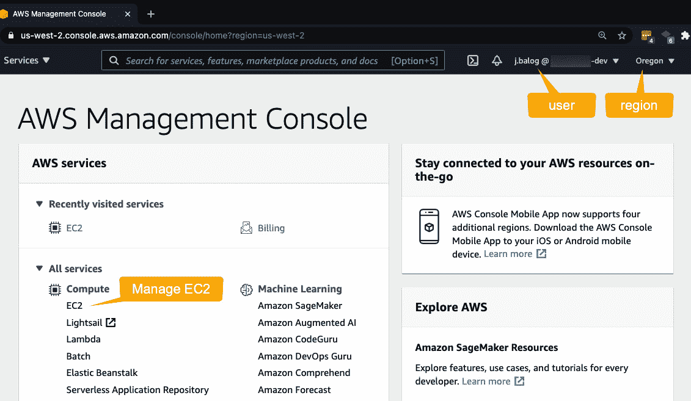

图 13.2 - AWS 管理控制台

接下来，我们将选择 EC2 服务。 **Launch instance**按钮将开始一步一步地创建我们的按需实例:

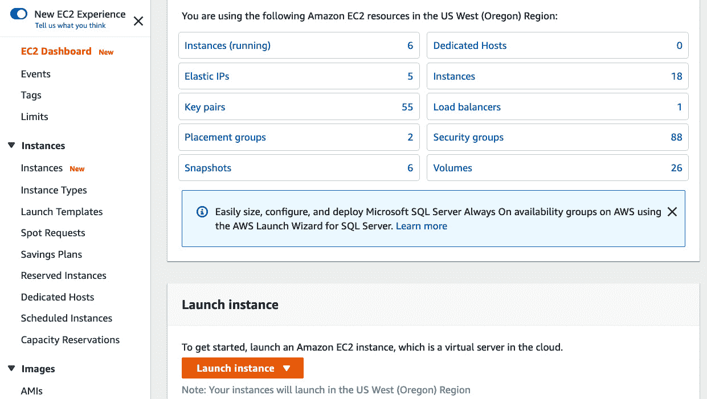

图 13.3 -启动按需 EC2 实例

让我们一起来看看这个过程。

#### 步骤 1:选择一个 Amazon 机器映像(AMI)

在这个屏幕上，我们选择一个 AMI 和我们选择的 Linux 发行版。 我们建议使用节约成本的**免费分级**AMI。 让我们为我们的 EC2 实例选择**Amazon Linux 2 AMI**:

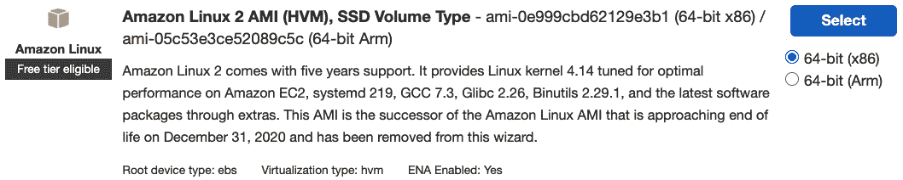

图 13.4 -为 EC2 实例选择 AMI

按下**Select**按钮将进入下一步。

#### 步骤 2:选择实例类型

这里，我们根据供应需求选择实例类型。 我们将选择`t2.micro`类型，它也是符合**的空闲层**，具有 1 vCPU 和 1 GB 内存(RAM):

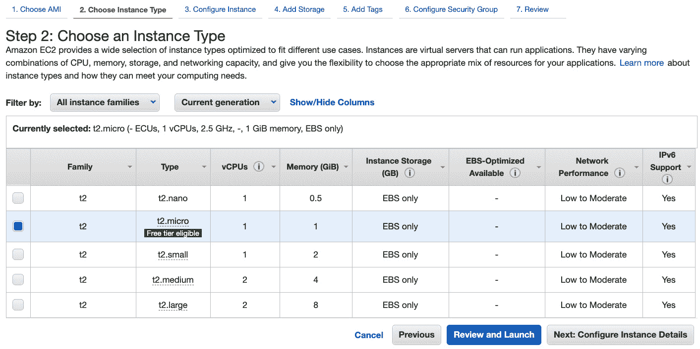

图 13.5 -选择 EC2 实例类型

此时，我们已经准备好通过按**Review and launch**按钮来启动实例。 或者，我们可以遵循进一步的配置步骤; 否则，EC2 将分配一些默认值。 让我们快速浏览一下这些步骤。

#### 步骤 3:配置实例详细信息

在这个页面上，我们可以选择我们想要启动的 EC2 实例的数量，配置网络设置，并选择我们实例的操作系统级关闭行为，这只是其中的几个选项。 对于任何配置选项，你都可以通过按下它旁边的信息按钮来获得详细的描述:


图 13.6 -配置 EC2 实例详细信息

在接下来的步骤中，我们将查看附加到 EC2 实例的存储设备。

#### 步骤 4:添加存储

在这个页面上，我们选择我们希望在我们的实例上可用的存储空间的数量，可以是本地磁盘或卷挂载:


图 13.7 -向 EC2 实例添加存储

在下一步中，我们将使用特定的信息标记 EC2 实例。

#### 步骤 5:添加标签

在本页上，我们定义键值对来标记或标识我们的实例。 当我们管理大量 EC2 实例时，标签将有助于用户友好地查找和过滤操作。 例如，如果我们想要将 EC2 实例标识为*Packt*环境的一部分，我们可以创建一个具有以下键值对的标签:

*   **键**:`env`
*   **值**:`packt`

我们可以给一个给定的实例添加多个标签(键-值对):


图 13.8 -向 EC2 实例添加标签

在下一步中，我们将配置与实例相关的安全设置。

#### 步骤 6:配置安全组

在这个页面上，我们配置了一组防火墙规则，控制进出 EC2 实例的入站和出站流量:


图 13.9 -配置 EC2 实例的安全组

在最后一步中，我们检查配置设置并启动 EC2 实例。

#### 第七步:复习

在这个页面上，我们总结了我们的 EC2 实例配置。 我们可以在启动实例之前编辑和更改任何设置:


图 13.10 -查看并启动 EC2 实例

当启动 EC2 实例时，我们被要求创建或选择一个证书密钥对，用于远程 SSH 访问我们的实例:


图 13.11 -选择或创建 SSH 访问的证书密钥对

让我们创建一个新的证书密钥对，并将其命名为`packt-ec2`。 将相关文件(`packt-ec2.pem`)下载到本地机器上的一个安全位置，在那里您可以使用`ssh`命令访问您的 EC2 实例:

```sh
ssh -i aws/packt-ec2.pem ec2-user@EC2_INSTANCE
```

在本章后面，我们将进一步研究如何通过 SSH 连接到我们的 EC2 实例。

按下**Launch Instances**按钮将创建并启动 EC2 实例。 下一个屏幕将显示一个**View Instances**按钮，该按钮将把您带到显示当前区域实例的 EC2 仪表板。 您还可以根据各种实例属性(包括标记)筛选视图。 例如，通过`env: packt`标签进行过滤，我们将获得刚才创建的 EC2 实例的视图:


图 13.12 - EC2 实例处于运行状态

有关按需实例的更多信息，请访问[https://docs.aws.amazon.com/AWSEC2/latest/UserGuide/ec2-on-demand-instances.html](https://docs.aws.amazon.com/AWSEC2/latest/UserGuide/ec2-on-demand-instances.html)。

现在我们已经学习了启动 EC2 实例的基础知识——即一个按需实例*——接下来让我们看看*保留实例*。*

 *### 保留 EC2 实例

对于保留的实例，我们将特定类型的 EC2 计算能力租给特定的时间。 这个期限被称为*期限*，可以是 1 年或 3 年的承诺。 以下是购买预留实例时需要预先设置的主要特征:

*   **平台**-如`Linux`
*   **可用分区**-如`us-west-2`
*   **租户**-运行在**默认**(共享)或**专用**硬件上
*   **Offering Class** – the options are as follows:

    a)**标准**-一个定义良好的选项集的普通保留实例

    b)**可转换**-允许特定的更改，例如修改实例类型(例如，从`t2.large`到`t2.xlarge`)

*   **实例类型**-例如`t2.large`
*   **期限**—如`1`年
*   **支付选项**-**全部预付**，**部分预付**，或**不预付**

有了这些选项和其中的不同层次，您的成本取决于所涉及的云计算资源和服务的持续时间。 例如，如果你选择全部预付，你会得到一个更好的折扣。 从前面提到的选项中选择最终是一项节约成本和灵活性的实践。

与购买预留实例类似的是一个移动电话计划:您决定所有您想要的选项，然后在一定的时间内做出承诺。 使用保留实例，您在进行更改方面的灵活性较低，但可以显著节省成本——与按需实例相比，有时可节省 75%。

要启动一个保留实例，请转到 AWS 控制台中的 EC2 仪表板，并在左侧面板的**Instances**下选择**保留实例**，然后单击**购买保留实例**按钮。 下面是一个购买保留 EC2 实例的例子:

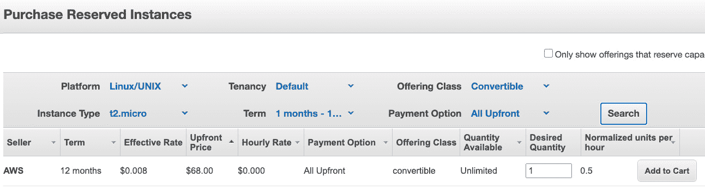

图 13.13 -购买一个保留的 EC2 实例

有关 EC2 保留实例的更多信息，请访问[https://docs.aws.amazon.com/AWSEC2/latest/UserGuide/ec2-reserved-instances.html](https://docs.aws.amazon.com/AWSEC2/latest/UserGuide/ec2-reserved-instances.html)。

我们已经了解到，保留实例是按需 EC2 实例的一种经济有效的替代方案。 让我们进一步研究通过使用现货实例来降低成本的另一种方法。

### EC2 现货实例

一个*点实例*是未使用的实例，等待被出租。 如果相关成本不高于您愿意为您的现货实例支付的成本，那么现货实例空闲的时间长短取决于 EC2 中所请求的容量的一般可用性。 与按需 EC2 定价相比，AWS 提供高达 90%的折扣。

使用现场实例的主要警告是，当所需容量不再以最初商定的速率提供时，可能出现*无空缺*的情况。 在这种情况下，现场实例将关闭(并可能在其他地方租用)。 AWS EC2 在停止 spot 实例之前提供了 2 分钟的警告。 这段时间应该用于正确地终止在实例中运行的应用工作流。

Spot 实例最适合于非关键任务，在这些任务中，应用处理可能在任何时刻无意中中断，随后恢复，而不会造成相当大的损坏或数据丢失。 此类作业可能包括数据分析、批处理和可选任务。

要启动 spot 实例，请转到您的**EC2**仪表板，并在左侧菜单中选择**spot Requests**。 在**实例**下，点击**请求点实例**:


图 13.14 -启动 EC2 spot 实例

关于启动一个现场实例的详细的解释超出了本章的范围。 AWS EC2 控制台在描述和协助相关选项方面做得很好。 有关现场实例的更多信息，请访问[https://docs.aws.amazon.com/AWSEC2/latest/UserGuide/using-spot-instances.html](https://docs.aws.amazon.com/AWSEC2/latest/UserGuide/using-spot-instances.html)。

默认情况下，EC2 实例运行在共享硬件上，这意味着多个 AWS 客户拥有的实例共享同一台机器(或虚拟机)。 如果您想要一个专用平台来运行 EC2 实例，该怎么办? 接下来让我们看看专用实例。

### EC2 专用实例

特定的业务要求应用在专用的硬件上运行，而不与任何人共享平台。 AWS EC2 提供了*专用主机*和*专用实例*来适应这个用例。 如您所料，专用实例的开销要比其他实例类型大。 那么，我们为什么要关心租赁这样的实例呢?

有些企业，特别是金融、卫生和政府机构的企业，根据法律要求满足处理敏感数据的严格监管要求，或为运行其应用获得基于硬件的许可证。

使用专用实例*而没有*专用主机，EC2 将保证您的应用运行在专门为您提供的 hypervisor 上，但它不会强制执行*固定的*机器或硬件集。 换句话说，您的一些实例可能运行在不同的物理主机上。 在**专用**实例之外选择**专用主机**总是需要一个完全专用的环境——管理程序和主机——来专门运行您的应用，而不需要与其他 AWS 客户共享底层平台。

要启动一个专用实例，您可以按照本章前面的*EC2 按需实例*小节中描述的启动按需 EC2 实例的相同步骤开始。 在**步骤 3:配置实例详细信息**中，对于**租户**，您将选择**Dedicated - Run a Dedicated instance**，如下截图所示:


图 13.15 -启动一个专用的 EC2 实例

如果要在专用主机上运行专用的实例，必须首先创建专用主机。 在**EC2**仪表板上，在左侧菜单的**Instances**下，选择**Dedicated Hosts**:


图 13.16 -创建专用 EC2 主机

按照 EC2 向导根据您的首选项分配专用主机。 创建您的主机后,你可能会启动专用实例如前所述,选择**专用主机,一个专用的主机上启动该实例**选择**租赁**在**第三步:配置实例细节**。

有关专用主机的更多信息，请访问[https://aws.amazon.com/ec2/dedicated-hosts/](https://aws.amazon.com/ec2/dedicated-hosts/)。 对于专用实例，请参见[https://aws.amazon.com/ec2/pricing/dedicated-instances/](https://aws.amazon.com/ec2/pricing/dedicated-instances/)。

我们在这里总结一下 AWS EC2 实例类型。 详情请访问[https://docs.aws.amazon.com/AWSEC2/latest/UserGuide/Instances.html](https://docs.aws.amazon.com/AWSEC2/latest/UserGuide/Instances.html)。

接下来，我们来看看 AMIs。 从一个创造性的比喻来看，AMI 是 EC2 实例孵化的卵子。

### 介绍 Amazon 机器映像(AMIs)

AMI 本质上是一个 EC2*机器模板*，您可以从它启动实例。 AMI 通常捆绑一个操作系统，但它也可以封装任何具有特定功能的软件包或应用。 以下是 AMI 的主要组成部分:

*   **根卷模板**-存储卷或*硬盘驱动器*，包含引导实例的映像，包括操作系统文件和应用
*   **启动权限**-指定*谁*可以使用 AMI -允许基于 AMI 启动实例的 AWS 帐户
*   **块设备映射**—一组额外的存储卷(根卷之外)，用于存储额外的数据，如日志

创建 AMI 也称为*注册*AMI。 您可以跨多个 az 复制 AMI，或者与其他用户共享它。 ami 是高度可定制的。 您可以从另一个 AMI 开始构建 AMI，修改它，然后启动和保存(或注册)它以供特定的使用。 与实例一样，您可以为您的 ami 分配自定义标记以用于标识目的，或者保持它们的组织，例如版本控制(例如*version: 1.0*)。 当您不再需要 AMI 时，您可以*注销*AMI 以释放资源。

对于初学者 AWS EC2 帐户，您可能还没有自己的 AMI。 AWS Marketplace 有无数 ami 可供选择，其中许多是免费的。 您可以从现有的 AMI 开始，然后构建自己的 AMI。 Amazon Linux ami 是一个很好的起点。 它们是免费的，维护良好，定期更新，并由亚马逊支持。 您还可以选择基于标准 Linux 发行版(如 RHEL 或 Ubuntu)的 ami。

您可以从正在运行的 EC2 实例中创建 AMI，通过选择您的实例，在**Actions**菜单中，选择**Image and Templates**，然后选择**create Image**:


图 13.17 -从一个实例创建一个 AMI

通过单击相关的信息图标，系统将提示您为实例命名，并输入描述以及与 AMI 相关的其他选项，相关的 EC2 仪表板屏幕上已经详细记录了这些选项。

有关 ami 的更多信息，请访问[https://docs.aws.amazon.com/AWSEC2/latest/UserGuide/AMIs.html](https://docs.aws.amazon.com/AWSEC2/latest/UserGuide/AMIs.html)。

接下来，我们将看看 EC2 实例的另一个重要组件——*布局组*——它控制您的实例如何在 EC2 基础结构中分布，以实现高可用性和优化的工作负载。

### 介绍 AWS EC2 安置组

*放置组*允许您指定如何跨底层 EC2 硬件或管理程序放置您的 EC2 实例，根据您的需求提供分组或单独实例的策略。 安置小组是免费的。

有三种类型的安置小组可供选择:

*   集群
*   传播
*   分区

让我们快速浏览每一种类型并查看它们的用例。

#### 集群放置组

使用集群放置组，实例被放置在单个 AZ(数据中心)中。 它们最适合实例之间的低延迟、高吞吐量通信，但不适合与外部世界进行通信。 具有高性能计算或数据复制的应用将从集群布局中获得很大好处，但 web 服务器就没有那么多好处了。

#### 传播组位置

当您启动多个 EC2 实例时，始终有可能它们最终会运行在相同的物理机器或 hypervisor 上。 当单点故障(如硬件)对您的应用至关重要时，这可能是不可取的。 分散放置组提供了实例之间的硬件隔离。 换句话说，如果在一个扩展布局组中启动多个实例，就可以保证它们将运行在不同的物理机器上。 在 EC2 硬件故障的罕见情况下，只有一个实例会受到影响。

#### 分区放置组

分区布局组将以逻辑结构(分区)对实例进行分组，并在分区之间进行硬件隔离，但不是在实例级别。 我们可以把这个模型看作是集群和分散安置组之间的一种混合。 当您在一个分区放置组中启动多个实例时，EC2 将尽力在分区之间均匀地分配实例。 例如，如果您有 4 个分区和 12 个实例，EC2 将在每个节点(分区)中放置 3 个实例。 我们可以将分区看作是由多个实例组成的计算单元。 在发生硬件故障的情况下，隔离的分区实例仍然可以彼此通信，但不能跨分区。 分区放置组在单个逻辑分区中最多支持 7 个实例。

要创建安置组，请在 EC2 仪表板的左侧菜单中选择**安置组**，在**网络&安全**下，点击**创建安置组**按钮。 在下一个屏幕上，您将为**安置组**和**安置策略**指定一个名称。 您还可以添加标记(键-值对)来组织或标识您的位置组。 完成后，点击**创建组**按钮:

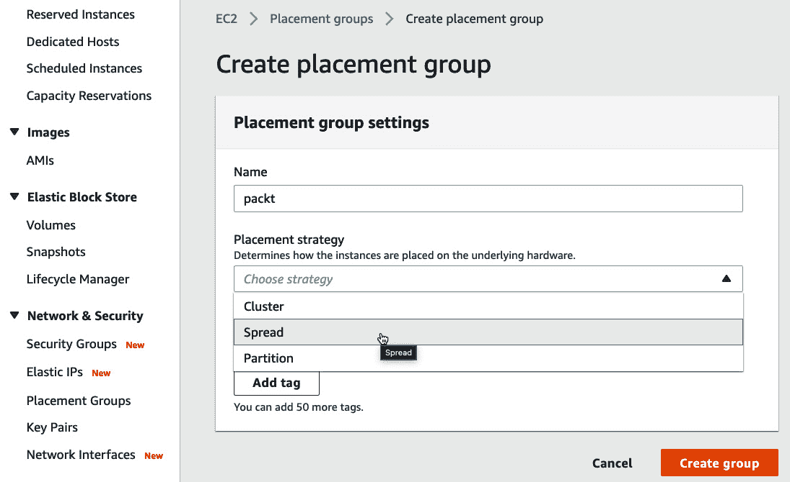

图 13.18 -从一个实例创建一个 AMI

有关 EC2 安置组的详情，请浏览[https://docs.aws.amazon.com/AWSEC2/latest/UserGuide/placement-groups.html](https://docs.aws.amazon.com/AWSEC2/latest/UserGuide/placement-groups.html)。

现在我们已经熟悉了各种 EC2 实例类型，让我们看看如何使用我们的实例。

## 使用 AWS EC2 实例

在本节中，我们简要地了解一些与您的实例相关的基本操作和管理概念。 首先，让我们看一下 EC2 实例的生命周期。

### EC2 实例的生命周期

在使用或管理 EC2 实例时，理解从启动到运行、休眠、关闭或终止的过渡阶段非常重要。 每一种状态都会影响计费和我们访问实例的方式:

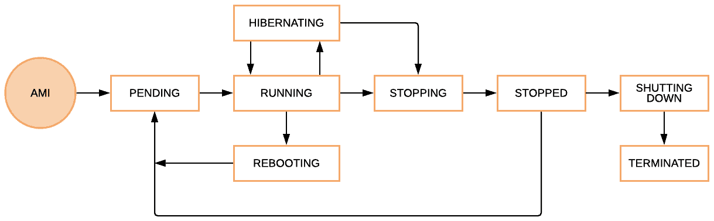

图 13.19 - EC2 实例的生命周期

**PENDING**状态对应于实例的启动和初始化阶段。 从**PENDING**到**RUNNING**的转换并不总是立即进行的，而且可能需要一段时间才能使在实例中运行的应用响应。 EC2 在**RUNNING**状态下开始计费实例，直到转换到**STOPPED**状态。

在**RUNNING**状态下，如果需要，我们可以重新启动实例。 在**REBOOTING**状态期间，EC2 总是在相同的主机上返回我们的实例，而停止和重新启动并不总是保证实例拥有相同的主机。

在**STOPPED**状态下，我们将不再为实例收费，但是将会有与附加到实例的任何额外存储(根卷除外)相关的成本。

当不再需要实例时，可以在**停止**或**HIBERNATING**状态之间进行选择。 通过**hibernate**，我们避免了**PENDING**状态在启动时潜在的延迟。 如果不再使用实例，可以选择终止它。 在终止时，没有更多的费用与实例有关。 当终止一个实例时，在它被永久删除之前，它可能仍然会在 EC2 仪表板中显示一段时间。

我们可以使用 SSH 连接到正在运行状态的 EC2 实例。 在下一节中，我们将向您展示如何操作。

### 连接到 AWS EC2 实例

在中，EC2 实例通常用于运行特定的应用或一组应用。 相关平台的管理和维护通常需要终端接入。 使用 AWS EC2 控制台和 SSH 终端，我们在 EC2 实例上执行管理任务。 我们称之为*控制平面*(或*管理平面*)访问。

运行在 EC2 实例上的应用还可以公开它们的特定端点(端口)，以便与外部世界通信。 我们称之为*数据平面*访问，EC2 使用安全组来控制相关的网络流量。

在本节中，我们简要介绍控制平面和数据平面访问。 特别地，我们将涵盖以下主题:

*   使用 SSH 连接到 EC2 实例
*   通过安全组控制网络流量
*   使用 SCP 与 EC2 实例进行文件传输

首先，让我们看看如何通过 SSH 连接到 EC2 实例。

#### 通过 SSH 连接到 EC2 实例

在 EC2 实例中使用 SSH 允许我们像管理网络上的任何本地机器一样管理它。 相关的 SSH 命令如下:

```sh
ssh -i SSH_KEY ec2-user@EC2_INSTANCE
```

`SSH_KEY`表示我们在启动实例时创建并下载的本地系统上的私钥文件。 参见*EC2 按需实例*部分(在*步骤 7:回顾*中)。

`ec2-user`是 EC2 分配给 AMI Linux 实例的默认用户。 不同的 ami 可能有不同的用户名进行连接。 您应该与您选择的 AMI 供应商一起检查用于 SSH 的默认用户名。

`EC2_INSTANCE`表示 EC2 实例的公网 IP 地址或 DNS 名称。 你可以在你的实例的 EC2 仪表板中找到这些:

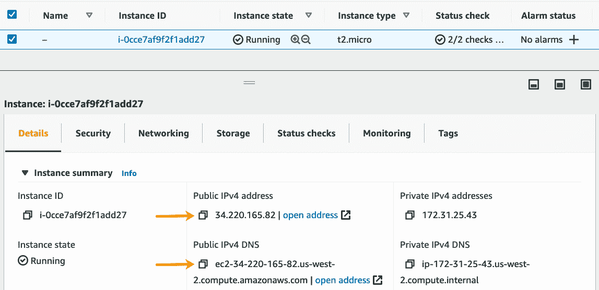

图 13.20 - EC2 实例的公网 IP 地址和 DNS 名称

在我们的例子中，SSH 命令如下:

```sh
ssh -i aws/packt-ec2.pem ec2-user@34.220.165.82
```

但是在我们连接之前，我们需要为我们的私钥文件设置正确的权限，这样它就不会被公开查看:

```sh
chmod 400 aws/packt-ec2.pem
```

如果不这样做，将导致在尝试连接时出现未受保护的密钥文件错误。 如果您需要回顾一下这些命令，请单击**EC2**仪表板顶部的**Connect**按钮，并选择 EC2 实例:


图 13.21 -连接到 EC2 实例

在下一个屏幕上，在**SSH 客户端**选项卡上，您将看到连接到 EC2 实例所需的步骤和命令:

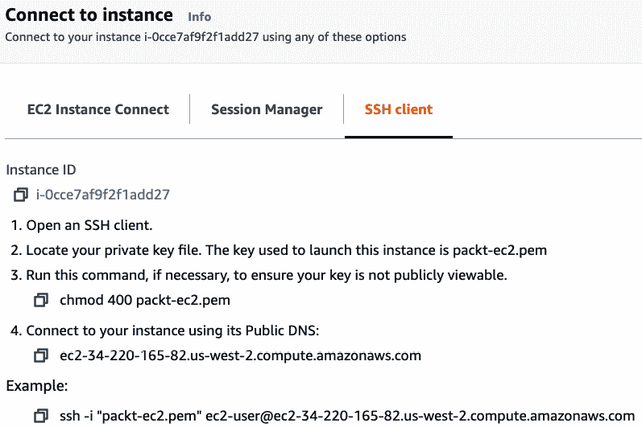

图 13.22 - SSH 客户端命令连接到 EC2 实例

成功连接到 EC2 实例的 SSH 会产生以下输出:

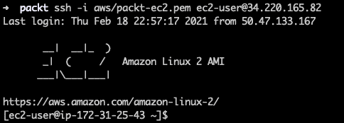

图 13.23 -用 SSH 连接到 EC2 实例

此时，我们可以与 EC2 实例交互，就像它是一台标准机器一样。

接下来，让我们看看如何控制对在 EC2 实例中运行的应用的网络访问。

#### 通过安全组控制网络流量

安全组定义了一组过滤入、出 EC2 实例的网络流量的规则。 当我们创建一个实例时，AWS EC2 自动为它创建一个默认的**安全组**。 相关的设置可以在**安全性详细信息**窗格中看到，在**安全性**选项卡上选择了我们的实例:


图 13.24 - EC2 实例的安全设置

您可以编辑安全设置(**入站规则**和**出站规则**，点击相应的**安全组 ID**:

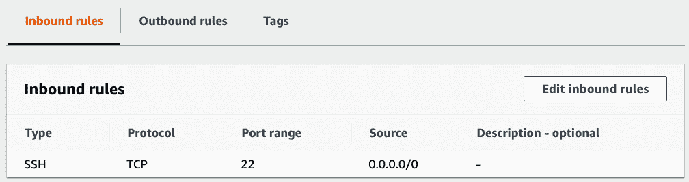

图 13.25 -编辑 EC2 实例的安全设置

例如，如果你在你的实例中运行一个 web 服务器，你可以为 HTTP 和 HTTPS 连接添加入站规则:

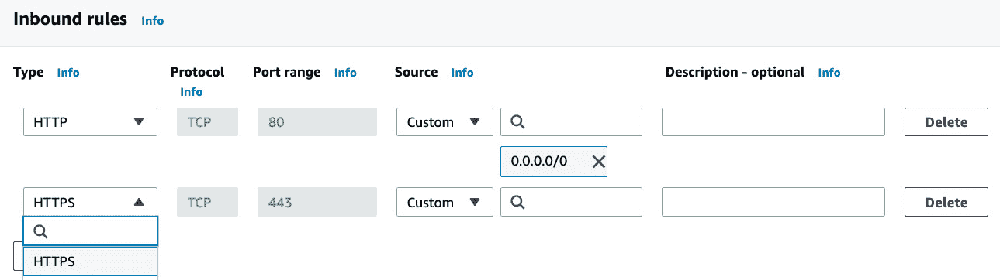

图 13.26 -为 EC2 实例添加用于 HTTP 和 HTTPS 访问的入站规则

管理在 EC2 实例中运行的 OS 平台和应用需要执行各种管理任务。 有些情况下，我们必须将文件复制到实例或从实例复制文件。 在下一节中，我们将向您展示如何操作。

#### 使用 SCP 进行文件传输

要在 EC2 实例之间来回传输文件，我们使用`scp`实用程序。 `scp`使用**安全复制协议**(**SCP**)在网络主机之间安全地传输文件。

下面的命令将一个本地文件(`README.md`)复制到远程 EC2 实例:

```sh
scp -i aws/packt-ec2.pem README.md ec2-user@34.220.165.82:/~
```

该文件被复制到 EC2 实例上的`ec2-user`的主文件夹`(/home/ec2-user`中。 将`README.md`文件从远端实例传输到本地目录的反向操作如下:

```sh
scp -i aws/packt-ec2.pem ec2-user@34.220.165.82:~/README.md .
```

我们应该注意，`scp`命令调用类似于`ssh`，其中我们通过`-i`(标识文件)参数指定私钥文件(`aws/packt-ec2.pem`)。

接下来，我们将研究管理和扩展 EC2 实例的另一个关键方面——存储卷。

### 使用 EC2 存储卷

存储卷是 EC2 实例中的设备挂载，提供额外的磁盘容量(额外的成本)。 例如，您可能需要为大型文件缓存或广泛的日志记录提供额外的存储，或者您可能选择为 EC2 实例之间共享的关键数据挂载网络附加的存储。

您可以将 EC2 存储卷看作模块化硬盘驱动器。 您可以根据需要装载或卸载它们。

EC2 提供两种类型的存储卷:

*   实例存储
*   **弹性块存储**(T2】EBS)

了解如何使用存储卷可以让您在应用增长时做出更好的决策。 让我们先看一下实例存储卷。

#### 实例存储卷

实例存储卷是直接(物理地)连接到 EC2 实例的磁盘。 因此，您可以连接到实例的实例存储卷的最大大小和数量受到实例类型的限制。 例如，一个经过存储优化的*i3*实例最多可以附加 8 x 1.9 TB SSD 磁盘，而一个通用*m5d*实例最多只能增加 4 个驱动器，每个驱动器的容量为 900 GB。 参见[https://aws.amazon.com/ec2/instance-types/](https://aws.amazon.com/ec2/instance-types/)了解更多关于实例容量的信息。

如果它是根卷(OS 平台引导实例的卷)，则不需要额外的成本。

并非所有的 EC2 实例类型都支持实例存储卷。 例如，通用的*t2*实例类型只支持 EBS 存储卷。 另一方面，如果希望将存储扩展到超出实例存储所允许的最大容量，则必须使用 EBS 卷。

实例存储卷上的数据仅保存在 EC2 实例中。 如果您的实例停止或终止，或者它出现故障，那么您的所有数据都将丢失。 要用 EC2 实例存储和持久化关键数据，您必须选择 EBS。 所以，让我们接下来看看 EBS 的容量。

#### EBS 卷

EBS 卷是灵活且高性能的网络连接存储设备，可以服务于根卷系统和 EC2 实例上的附加卷挂载。 一个 EBS 根卷一次只能连接到一个 EC2 实例。 一个 EC2 实例可以在任何时候挂载多个 EBS 卷。 通过使用 Multi-Attach，一个 EBS 卷还可以一次附加到多个 EC2 实例。 有关 EBS 多连接的更多信息，请参见[https://docs.aws.amazon.com/AWSEC2/latest/UserGuide/ebs-volumes-multi.html](https://docs.aws.amazon.com/AWSEC2/latest/UserGuide/ebs-volumes-multi.html)。

当您创建 EBS 卷时，它将在实例的 AZ 内自动复制，以最小化延迟和数据丢失。 有了 EBS，您可以通过 Amazon CloudWatch 免费实时监控驱动器运行状况和统计数据。 EBS 还支持加密数据存储，以满足最新的数据加密监管标准。

EC2 存储卷由 Amazon 的**简单存储服务**(**S3**)或**弹性文件系统**(**EFS**)基础设施支持。 有关 EC2 存储类型的更多信息，请访问[https://docs.aws.amazon.com/AWSEC2/latest/UserGuide/Storage.html](https://docs.aws.amazon.com/AWSEC2/latest/UserGuide/Storage.html)。

现在，让我们创建并配置一个 EBS 存储卷，并将其连接到 EC2 实例。 以下是我们将遵循的步骤:

1.  创建卷。
2.  将卷挂载到 EC2 实例。
3.  使用 EC2 实例支持的文件系统格式化卷。
4.  在 EC2 实例中创建一个卷挂载点。

我们将从第一步开始，即创建 EBS 卷。

#### 创建 EBS 卷

在 EC2 仪表板中，转到左侧导航窗格中**Elastic Block Store**下的**Volumes**，然后单击顶部的**Create Volume**按钮:

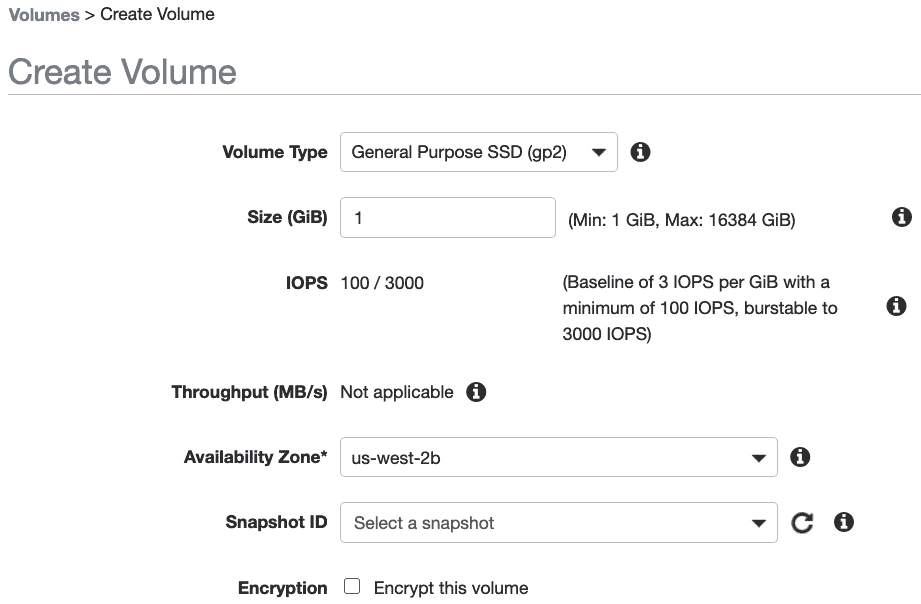

图 13.27 -创建 EBS 卷

输入您选择的**卷类型**、**大小**和**可用分区**的值。 确保您选择 EC2 实例所在的 AZ。 如果要从以前的 EC2 实例备份(快照)恢复卷，还可以包括**快照 ID**。 我们将在本章后面讨论使用 EBS 快照进行备份/恢复。

完成后按**创建音量**按钮。 如果一切顺利，您将获得一个带有新的 EBS 卷 ID 的**卷成功创建**消息。

接下来，我们将把卷附加到 EC2 实例。

#### 将卷附加到 EC2 实例

点击**卷 ID**，或者从左侧导航栏中选择卷，在**Elastic Block Store**和**Volumes**下。 点击**Actions**按钮，选择**Attach Volume**:


图 13.28 -将 EBS 卷挂载到 EC2 实例

在下一个屏幕上，在**实例**字段中输入您的 EC2 实例 ID(或用于搜索的名称标签):


图 13.29 -输入 EC2 实例 ID 来挂载卷

完成后按**附加**按钮。 几分钟后，EC2 将初始化您的 EBS 卷，并且**状态**变为**正在使用**:


图 13.30 -新的 EBS 卷已经准备好

卷设备现在已经准备好了，但是我们需要使用文件系统对它进行格式化。 下面我们将描述这个过程。

#### 格式化的体积

让我们 SSH 到连接卷的 EC2 实例:

```sh
ssh -i aws/packt-ec2.pem ec2-user@34.220.165.82
```

接下来，我们使用`lsblk`命令行实用程序检索 EC2 实例中可用的驱动器，以列出块设备:

```sh
lsblk
```

输出如下:


图 13.31 - EC2 实例中的本地卷

通过观察体积的大小，我们可以立即判断出我们刚刚添加的体积——`xvdf`和`1G`。 另一个卷(`xvda`)是我们的`t2.micro`实例的原始根卷。

接下来让我们检查新的 EBS 卷(`xvdf`)上是否有文件系统:

```sh
sudo file -s /dev/xvdf
```

输出是`/dev/xvdf: data`，这意味着该卷还没有文件系统:

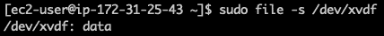

图 13.32 -新 EBS 卷上没有文件系统

让我们在卷上构建一个文件系统，使用`mkfs`(*make filesystem*)命令行实用工具:

```sh
sudo mkfs -t xfs /dev/xvdf
```

我们使用`xfs`文件系统类型调用`-t`(`--type`)参数。 `XFS`是大多数 Linux 发行版支持的高性能日志文件系统，其中一些发行版默认安装了它。

上面的命令输出如下:


图 13.33 -在 EBS 卷上构建一个新的文件系统

如果我们使用以下命令检查文件系统，我们应该看到文件系统的详细信息，而不是空数据:

```sh
sudo file -s /dev/xvdf
```

输出如下:


图 13.34 - EBS 卷上的新文件系统

卷驱动器现在被格式化了。 让我们的本地文件系统可以访问它。

#### 创建卷挂载点

我们将挂载点命名为`packt`，并在根目录下创建它:

```sh
sudo mkdir /packt
sudo mount /dev/xvdf /packt
```

此时，EBS 卷已经挂载，当我们访问`/packt`目录时，我们正在访问 EBS 卷:


图 13.35 -访问 EBS 卷

EBS 卷可能包含我们希望保留的关键数据。 接下来让我们看看如何使用 EBS 快照进行灾难恢复。

### 使用 EBS 快照

当您使用 EBS 时，您可能会遇到需要对数据进行长期备份或准备灾难恢复的情况。 我们还应该注意，对于特定的 EC2 实例类型(例如通用用途实例)，根卷(您的系统)是 EBS，如果您的实例遇到意外故障，您可能需要备份。 EC2 实例的完全备份超出了本章的范围。

让我们看看如何使用快照备份 EBS 卷。 以下是步骤:

1.  创建当前卷的快照。
2.  将快照挂载到新卷上。
3.  从 EC2 实例中卸载当前卷。
4.  将新卷附加到 EC2 实例。

让我们从第一步开始。

#### 创建一个快照

在您的 EC2 仪表板中，转到左侧导航菜单中**Elastic Block Store**下的**Volumes**，并选择您想要备份的 EBS 卷。 在我们的示例中，让我们创建根卷的快照，即在**大小**下有 8 GB 的卷。 接下来，点击**Actions**按钮，选择**Create Snapshot**:


图 13.36 -创建 EBS 卷的快照

在接下来的屏幕中，输入快照的描述(例如`packt-backup`)，然后单击**创建快照**按钮:


图 13.37 -描述您的 EBS 快照

快照创建成功后，EC2 将显示**Create snapshot Request Succeeded**消息，并显示相应的**快照 ID**。 您可以通过在左侧导航菜单中的**Elastic Block Store**下选择**snapshots**来管理 EC2 仪表板中的当前快照。

快照需要一个可消耗的卷。 在下一步中，我们将创建一个新卷并将快照附加到它。

#### 将快照绑定到卷

让我们从定位我们的快照到**快照**管理页面，然后复制相应的**快照 ID**。 我们将在下一步重用(复制/粘贴)快照 ID:


图 13.38 -复制快照 ID

现在，转到您的**卷**，在左侧导航菜单的**弹性块存储**下，点击**创建卷**。 将之前复制的快照 ID 粘贴到**快照 ID**字段中。 确保您的新 EBS 卷的**可用分区**匹配您将其附加到的 EC2 实例:


图 13.39 -从现有的快照 ID 创建一个新的 EBS 卷

您的新 EBS 卷将显示创建它的快照 ID。 其状态为**可用**:


图 13.40 -从快照创建的新 EBS 卷

现在有一个带有快照的*独立*卷。 要在不同的 EC2 实例中使用这个卷，或者以后在相同的实例中恢复它，我们需要从实例中卸载当前卷。 在下一节中，我们将向您展示如何操作。

#### 分离一个卷

在本例中，由于正在卸载根卷，因此需要停止 EC2 实例。 对于非根卷，我们可以在卸载/附加操作期间让 EC2 实例继续运行。

因此，让我们先停止 EC2 实例。 在 EC2 仪表板中，我们转到**Instances**，选择我们的 EC2 实例，右键单击并选择**Stop instance**。 接下来，我们将从实例中分离现有的 EBS 卷。 在 EC2 仪表盘中，转到**Volumes**，选择当前正在使用的**volume**，右键单击，选择**Detach volume**。 确认操作并等待卷被卸载。

现在是备份恢复过程的最后一步，将包含快照的新卷附加到 EC2 实例。

#### 附加一个卷

选择刚刚从 EBS 快照中创建的新卷，右键单击并选择**Attach volume**:

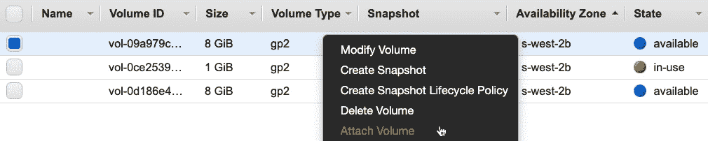

图 13.41 -附加从快照创建的新 EBS 卷

在**Attach Volume**屏幕中，您必须在**instance**字段中指定 EC2 实例的 ID，如图*图 13.29*所示。 您可能还需要确保**设备**字段与您之前的根卷(`/dev/xvda`)具有相同的设备 ID，如图*图 13.31*所示:

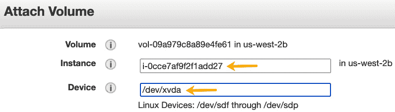

图 13.42 -将新的 EBS 卷附加为根卷

重新连接新的卷后，我们可以启动 EC2 实例。 转到**Instances**菜单，右键单击 EC2 实例，然后选择**Start instance**。

重要提示

当您重新启动 EC2 实例时，EC2 可能会使您的机器在不同的主机上启动，而且很可能您将拥有不同的公共 IP 地址。

实例启动并运行后，确保可以连接到 SSH。 在我们的例子中，EC2 实例的新公共 IP 地址已经更改，因此我们必须相应地调整 SSH 命令。

您可能还想删除旧的 EBS 卷(如果您不再使用它)，这样您就不用为它付费。 进入“**卷**”界面，选中未使用的卷，右键单击，选择“**删除卷**”。

我们在这里结束对 AWS EC2 控制台和相关管理操作的探索。 要获得关于 EC2 的全面参考，请参考 Amazon EC2 文档[https://docs.aws.amazon.com/ec2](https://docs.aws.amazon.com/ec2)。

到目前为止，提供的 EC2 管理任务只使用 AWS 控制台。 如果您希望自动化 EC2 工作负载，您可能希望采用 AWS CLI，这是一个用于管理 AWS 资源的统一工具。 让我们接下来看看。

## 使用 AWS CLI

安装 AWS CLI，请访问[https://aws.amazon.com/cli/](https://aws.amazon.com/cli/)。 在撰写本文时，AWS CLI 的最新版本是版本 2。 对于本章中的示例，我们使用 Ubuntu 机器按照[https://docs.aws.amazon.com/cli/latest/userguide/install-cliv2-linux.html](https://docs.aws.amazon.com/cli/latest/userguide/install-cliv2-linux.html)中的说明安装 AWS CLI。

我们将从下载 AWS CLI v2 软件包(`awscliv2.zip`)开始:

```sh
curl "https://awscli.amazonaws.com/awscli-exe-linux-x86_64.zip" -o "awscliv2.zip"
```

接下来，我们解压缩并安装 AWS CLI:

```sh
unzip awscliv2.zip
sudo ./aws/install
```

现在，系统上应该安装了`aws`命令行实用程序。 让我们检查一下版本:

```sh
aws --version
```

输出如下:


图 13.43 -检查 AWS CLI 版本

您可以通过调用 help 来开始探索 AWS CLI:

```sh
aws help
```

要使用`aws`实用程序管理 AWS EC2 资源，首先需要配置本地环境，以建立与 AWS 端点之间所需的信任。

### 配置 AWS CLI

要在本地机器上配置本地 AWS 环境，运行以下命令:

```sh
aws configure
```

前面的命令将提示您一些信息，如下面的输出所示:


图 13.44 -配置本地 AWS CLI 环境

AWS CLI 配置要求您的**AWS Access Key ID**和**AWS Secret Access Key**。 您可以通过登录到您的 AWS 帐户来生成或检索这些密钥。 在 AWS 控制台的右上角选择您的帐户名称旁边的下拉菜单，然后选择**我的安全凭证**。 如果你还没有你的访问密钥生成,去**AWS 我凭证**选项卡,在【显示】访问键 CLI, SDK,【病人】API 访问,点击**创建访问密钥**按钮。 你必须将你的 AWS 密钥 ID 和秘密存储在一个安全的地方，以便以后重用:


图 13.45 -创建 AWS 访问密钥

在 AWS CLI 配置向导中，我们还将**默认区域名称**设置为`us-west-2`。 您可能希望进入您所选择的区域，或者将其保留为默认值(`None`)。 如果没有指定默认区域，那么每次调用`aws`命令时都必须输入它。

现在，我们已经准备好使用 AWS CLI。 让我们从列出 EC2 实例开始。

### 查询 EC2 实例

命令提供 EC2 实例的详细信息:

```sh
aws ec2 describe-instances
```

前面的命令提供了相当大的 JSON 输出，其中包含默认区域(`us-west-2`)中所有 EC2 实例的详细信息。 或者，我们可以用`--region`参数指定区域:

```sh
aws ec2 describe-instances --region us-west-2
```

我们可以更有创造性地使用`--filters`参数，只列出匹配特定键值标记的 EC2 实例，例如`env: packt`，我们之前用`--filters`参数标记实例:

```sh
aws ec2 describe-instances \
  --filters "Name=tag-key,Values=env" \
  --filters "Name=tag-value,Values=packt"
```

第一个`--filters`参数指定键(`tag-key=env`)，第二个指向值(`tag-value=packt`)。

结合`aws`和`jq`(*JSON 查询*)命令，我们只能提取我们想要的 JSON 字段。 例如，下面的命令列出了标记为`env:packt`的 EC2 实例的`InstanceId`、`ImageId`和`BlockDeviceMappings`字段:

```sh
aws ec2 describe-instances \
  --filters "Name=tag-key,Values=env" \
  --filters "Name=tag-value,Values=packt" | \
  jq '.Reservations[].Instances[] | { InstanceId, ImageId, BlockDeviceMappings }'
```

如果您的 Linux 机器上没有`jq`实用程序，请使用以下命令安装它:

*   **sudo apt install -y jq # on Ubuntu**
*   **在 RHEL/CentOS 上安装 yum install -y jq #**

上述`aws`命令的输出信息如下:

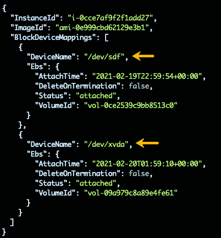

图 13.46 -查询 EC2 实例

我们应该注意输出 JSON 中的`DeviceName`属性，它反映了我们在前一节中管理的块设备(`/dev/sdf`和`/dev/xvda`)，当我们将 EBS 卷附加到我们的实例时。

我们可以通过任何属性过滤`aws ec2 describe-instances`命令的输出。 例如，下面的命令通过 AMI`image-id`过滤 EC2 实例:

```sh
aws ec2 describe-instances \
  --filters "Name=image-id,Values=ami-0e999cbd62129e3b1"
```

请注意，过滤器中使用的属性名称是相应的*驼式*JSON 属性:`image-id`与`ImageId`的*连字符*转换。 在编写过滤查询时，您必须记住这条规则。 下面是前一个命令输出的摘录:


图 13.47 -通过映像 ID 过滤 EC2 实例

接下来，让我们计划使用当前机器和相同的安全组启动一个相同 AMI 类型的新 EC2 实例。

### 创建 EC2 实例

获取当前实例(`i-0cce7af9f2f1add27`)的安全组:

```sh
aws ec2 describe-instances \
  --filters "Name=instance-id,Values=i-0cce7af9f2f1add27" \
  --query "Reservations[].Instances[].SecurityGroups[]"
```

输出如下:


图 13.48 -检索 EC2 实例的安全组

要直接检索的`GroupId`，我们可以运行以下程序:

```sh
aws ec2 describe-instances \
  --filters "Name=instance-id,Values=i-0cce7af9f2f1add27" \
  --query "Reservations[].Instances[].SecurityGroups[].GroupId"
```

在这种情况下，输出如下:

```sh
[
    "sg-085a5bad81621f926"
]
```

我们使用`--query`参数来指定我们正在寻找的字段(`GroupId`)的确切 JSON 路径:

```sh
Reservations[].Instances[].SecurityGroups[].GroupId
```

参数`--query`的使用在某种程度上类似于输出到`jq`命令的管道，但它没有那么多用途。

要使用我们选择的 AMI 类型和先前的安全组 ID 启动一个新实例，我们使用`aws ec2 run-instances`命令:

```sh
aws ec2 run-instances \
  --image-id ami-0e999cbd62129e3b1\
  --count 1 \
  --instance-type t1.micro \
  --key-name packt-ec2 \
  --security-group-ids sg-085a5bad81621f926 \
  --placement AvailabilityZone=us-west-2b
```

以下是对参数的简要解释:

*   `image-id`- AMI 图像 ID(`ami-0e999cbd62129e3b1`); 我们使用与之前在 AWS EC2 web 控制台中创建的实例相同的 AMI 类型(*Amazon Linux*)。
*   `count`-要启动的实例数(`1`)。
*   `instance-type`—EC2 实例类型(`t1.micro`)。
*   `key-name`-连接到新实例时使用的 SSH 私钥文件(`packt-ec2`)的名称; 我们正在重用我们在 AWS 控制台中用第一个 EC2 实例创建的 SSH 密钥文件。
*   `security-group-ids`-附加到实例的安全组; 我们正在重用连接到当前实例(`sg-085a5bad81621f926`)的安全组。
*   `--placement`-放置实例的 AZ(`AvailabilityZone=us-west-2b`)。

下面是命令输出的一段摘录，表明我们的新实例已经启动，其`InstanceID`的值为`i-0e1692c9dfdf07a8d`:


图 13.49 -启动一个新的 EC2 实例

接下来，让我们使用命令行标记我们的新实例。

### 标记 EC2 实例

下面的命令用`env:packt`键值标记我们的新实例:

```sh
aws ec2 create-tags \
  --resources i-0e1692c9dfdf07a8d \
  --tags Key=env,Value=packt
```

现在，我们可以根据前面提到的标签查询实例:

```sh
aws ec2 describe-instances \
  --filters "Name=tag-key,Values=env" \
  --filters "Name=tag-value,Values=packt" \
  --query "Reservations[].Instances[].InstanceId"
```

输出显示了我们的两个 EC2 实例:

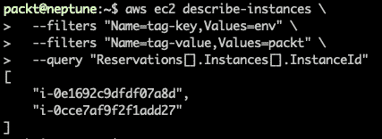

图 13.50 -通过标记查询 EC2 实例 id

让我们看看如何向我们的实例添加额外的存储。

### 向 EC2 实例添加额外的存储

首先，我们需要创建一个新的存储设备。 以下命令在 US West(`us-west-2b`)AZ 中创建一个通用 SSD(`gp2`)卷类型，大小为 8gb:

```sh
aws ec2 create-volume \
  --volume-type gp2 \
  --size 8 \
  --availability-zone us-west-2b
```

命令回显信息如下:

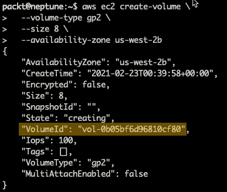

图 13.51 -创建一个新卷

请注意`VolumeId`—我们将在附加到实例时使用它。

重要提示

请确保将卷创建在与实例相同的 AZ 中。 否则，您将无法将其附加到 EC2 实例。 在我们的例子中，AZ 是`us-west-2b`。

下一个命令使用`/dev/sdf`设备标识符将音量连接到我们的实例(`i-0e1692c9dfdf07a8d`):

```sh
aws ec2 attach-volume \
  --volume-id vol-0b05bf6d96810cf80 \
  --instance-id i-0e1692c9dfdf07a8d \
  --device /dev/sdf
```

输出如下:


图 13.52 -将卷附加到实例

您需要记住，卷不是用文件系统初始化的，您必须在 EC2 实例中手动初始化，正如本章前面的*EBS 卷*部分所建议的那样。

接下来，我们将展示如何终止 EC2 实例。

### 终止 EC2 实例

要终止 EC2 实例，我们将使用`aws ec2 terminate-instance`命令。 注意，终止一个实例会导致该实例的删除。 不能重新启动已终止的实例。 我们可以使用`aws ec2 stop-instances`命令停止实例，直到稍后使用。

下面的命令将终止 ID 为`i-0e1692c9dfdf07a8d`的实例:

```sh
aws ec2 terminate-instances --instance-ids i-0e1692c9dfdf07a8d
```

输出声明我们的实例是`shutting down`(从之前的`running` 状态):


图 13.53 -终止一个实例

实例最终转换为`terminated`状态，并且在 AWS EC2 控制台中不再可见。 AWS CLI 仍然会将它列在实例中，直到 EC2 最终将它处理掉。 根据 AWS，终止的实例在终止后一小时内仍然可见。 在通过 AWS CLI 执行查询和管理操作时，丢弃处于`terminated`或`shutting-down`状态的实例始终是一个良好的实践。

我们在这里结束了 AWS EC2 的旅程，让我们承认，我们只触及了 AWS 中云管理工作负载的表面。 我们学习了一些关于 EC2 资源的基本概念。 接下来，我们研究了典型的云管理任务，例如启动和管理实例、添加和配置额外的存储以及使用 EBS 快照进行灾难恢复。 最后，我们使用标准操作的亲身实践示例来探索 AWS CLI，包括查询和启动 EC2 实例、创建并向实例添加额外存储，以及终止实例。

本节讨论的主题提供了对 AWS EC2 云资源的基本了解，并帮助系统管理员在管理相关工作负载时做出更好的决策。 高级用户可能会发现 AWS CLI 示例是在 EC2 中自动化他们的云管理工作流的一个很好的起点。

现在让我们把焦点转向下一个公共云服务的竞争者，微软的 Azure。

# 与 Microsoft Azure 合作

*Microsoft Azure*又称*Azure*，是微软推出的一种公共云服务，用于在云中构建和部署应用服务。 Azure 以相对较低的成本提供了高度可扩展**IaaS**的完整服务，满足了从小型团队到大型商业企业(包括金融、卫生和政府机构)的广泛用户和业务需求。

在这一节中，我们将探索一些使用 Azure 的非常基本的部署工作流，例如:

*   创建 Linux 虚拟机
*   管理虚拟机大小
*   向虚拟机添加额外的存储空间
*   在资源组之间移动虚拟机
*   重新部署虚拟机
*   使用 Azure CLI

在学习本章内容的同时，你需要一个 Azure 账户来获得实践经验。 我们鼓励您创建一个免费的 Azure 帐户，它将为您提供 12 个月的免费流行服务，并在前 30 天提供 200 美元的信贷，以支付您的资源成本。 在 Azure[https://azure.microsoft.com](https://azure.microsoft.com)注册一个免费账户:


图 13.54 -创建一个免费 Azure 帐户

创建了免费 Azure 帐户后，请访问[https://portal.azure.com](https://portal.azure.com)以访问 Azure 门户。 您可能希望启用左侧门户导航菜单的停靠视图，以便快速方便地访问您的资源。 在本章中，我们将为屏幕截图使用停靠视图。 进入右上角的**门户设置**齿轮，选择**Docked**为门户菜单的默认模式:


图 13.55 -启用 Azure 门户菜单的停靠视图

让我们在 Azure 中创建我们的第一个资源——一个**Red Hat Enterprise Linux**(**RHEL**)虚拟机。

## 创建虚拟机

在 Azure 门户中的资源向导的指导下，我们将遵循一个逐步的过程。 以下是步骤:

1.  创建计算资源
2.  创建资源组。
3.  配置实例详细信息。
4.  配置 SSH 访问。
5.  验证和部署虚拟机。

让我们从第一步开始，为虚拟机创建计算资源。

### 创建计算资源

从点击左侧导航菜单中的**创建资源**选项开始，或者在主窗口的**Azure services**下:


图 13.56 -在 Azure 中创建一个新资源

下一个屏幕将带我们到 Azure 市场，在那里我们可以搜索我们的资源选择。 您可以搜索相关的关键字，也可以根据要查找的资源类型缩小选择范围。 让我们缩小选择范围，选择**Compute**，然后从最上面的选项中选择**Red Hat Enterprise Linux**。 你可以点击**了解更多**图像的详细描述:


图 13.57 -选择 RHEL 虚拟机

当我们选择**Red Hat Enterprise Linux**时，将引导我们完成配置和创建 RHEL 虚拟机的过程，从一个资源组开始。

### 配置资源组

首先，我们需要指定与虚拟机关联的**订阅**和**资源组**。 Azure 资源组是与特定部署相关的资产的集合，包括存储、网络接口、安全组等等。 假设这是我们的第一个虚拟机，我们将创建一个新的资源组，并将其命名为`packt-demo`。 如果我们有一个之前创建的资源组，我们可以在这里指定它:


图 13.58 -创建一个新的资源组

接下来，我们设置与实例相关的各种属性，例如**虚拟机名称**、**区域**和**大小**。

### 配置实例细节

我们将虚拟机命名为`packt-rhel`，并将其放置在**(US) West US**区域，最接近我们的实例将要运行的地理位置。 我们机器的大小将直接影响到相关成本:

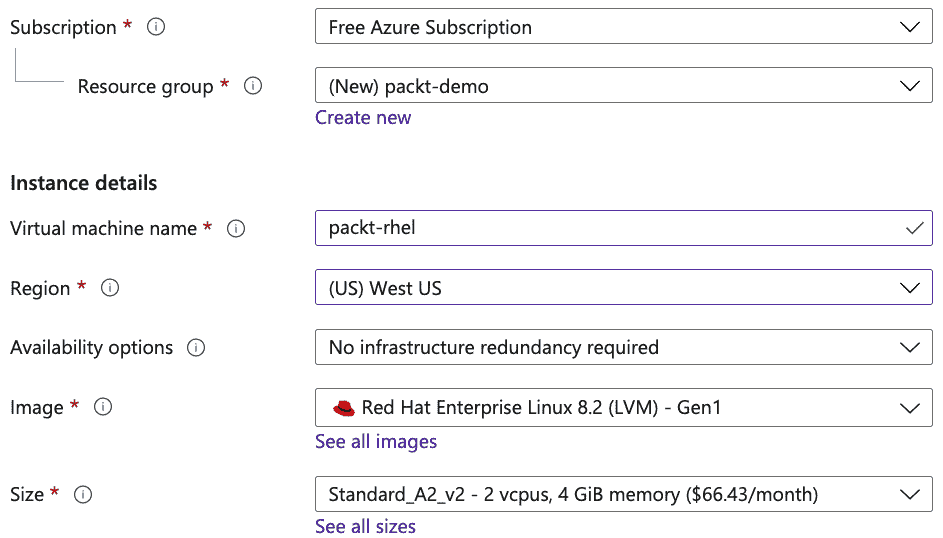

图 13.59 -虚拟机的实例详细信息

也可以选择**See all images**或**See all sizes**浏览**Image**和**Size**的不同选项。 Azure 还为各种资源提供了*定价计算器*在线工具，在[https://azure.microsoft.com/en-us/pricing/calculator/](https://azure.microsoft.com/en-us/pricing/calculator/)。

在下一步中，我们被要求配置一个 SSH 密钥，以便终端访问我们的实例。

### 配置 SSH 访问

在这一步中，我们使用公钥身份验证启用 SSH。 将**用户名**设置为`packt`，将**密钥对名称**设置为`packt-rhel`:


图 13.60 -启用 SSH 身份验证到虚拟机

最后，我们为实例设置**入站端口规则**以允许 SSH 访问。 例如，如果我们的机器将运行一个 web 服务器应用，我们也可以启用 HTTP 和 HTTPS 访问:

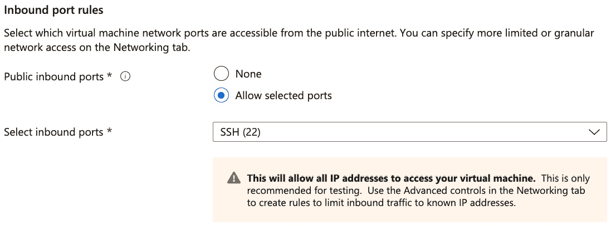

图 13.61 -启用 SSH 访问虚拟机

现在，我们已经准备好创建虚拟机了。 向导可以进一步介绍指定与实例关联的*磁盘*和*网络*配置的其他步骤。 现在，我们将保留它们的默认值，并继续进行最后一步——检查配置和部署虚拟机。

### 验证和部署虚拟机

我们点击**Review + create**按钮，开始验证过程:


图 13.62 -检查并创建虚拟机

接下来，部署向导将验证我们的虚拟机配置。 在的几分钟内，如果一切顺利，我们将得到一个带有产品详细信息和实例每小时费率的**验证通过**消息。 通过点击**Create**，我们同意相关的法律条款，我们的虚拟机将很快部署:


图 13.63 -创建虚拟机

在这个过程中，我们会被提示下载 SSH 私钥来访问我们的实例:

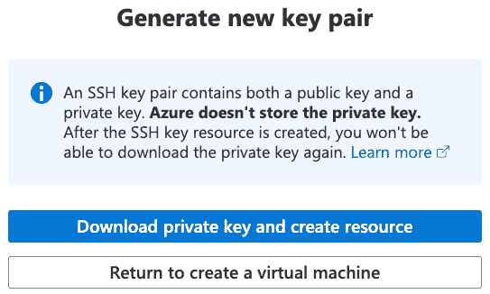

图 13.64 -下载用于访问虚拟机的 SSH 私钥

如果部署成功完成，我们将看到一个简短的弹出消息，其中包含**部署成功**和一个**Go to resource**按钮，该按钮将带我们进入新的虚拟机:

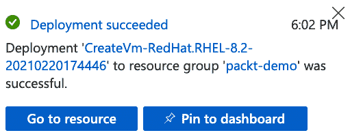

图 13.65 -成功部署虚拟机

我们还会得到一份关于部署细节的简短报告。 相关资源也可以在左侧导航菜单的**所有资源**视图中看到:

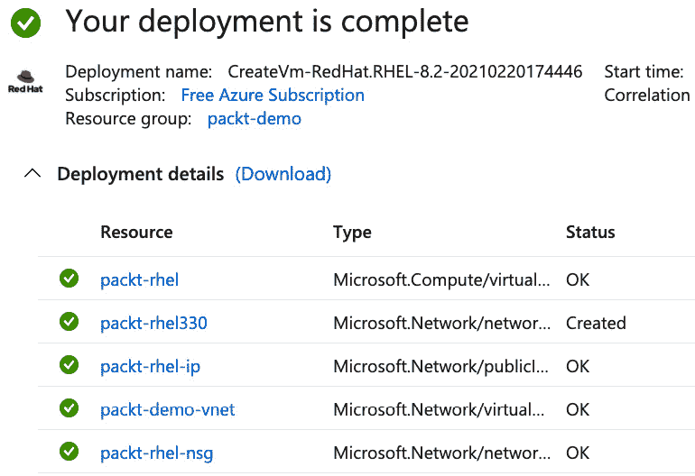

图 13.66 -部署细节

让我们快速看一下用虚拟机部署创建的每个资源:

*   `packt-rhel`—虚拟机主机
*   `packt-rhel330`-虚拟机的网络接口(或网络接口卡)
*   `packt-rhel-ip`-虚拟机的 IP 地址
*   `packt-demo-vnet`-资源组关联的虚拟网络(`packt-demo`)
*   `packt-rhel-nsg`-**网络安全组**(**NSG**)控制入站和出站访问和访问我们的实例

当实例放在现有资源组中时，Azure 将为每个虚拟机创建一组前面提到的资源类型，除了与资源组对应的虚拟网络。 我们不应该忘记，我们还创建了一个新的资源组(`packt-demo`)，它没有显示在部署报告中。

让我们尝试连接到新创建的实例(`packt-rhel`)。 转到左侧导航窗格中的**虚拟机**，选择实例(`packt-rhel`):


图 13.67 - Virtual machines 视图中的新实例

在**Overview**选项卡中，我们将看到虚拟机的基本细节，包括**公网 IP 地址**(`104.40.68.161`):

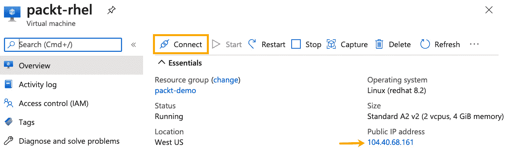

图 13.68 - Virtual machines 视图中的新实例

现在我们已经部署了虚拟机，我们想要确保可以通过 SSH 访问它。

### 使用 SSH 连接到虚拟机

在我们连接之前，我们需要设置我们的 SSH 私钥文件的权限，所以它是不公开可见的:

```sh
chmod 400 azure/packt-rhel.pem
```

接下来，我们用下面的命令连接到我们的 Azure RHEL 实例:

```sh
ssh -i azure/packt-rhel.pem packt@104.40.68.161
```

我们使用在创建实例时指定的 SSH 密钥(`packt-rhel.pem`)和管理员帐户(`packt`)。 或者，您可以单击虚拟机的**Overview**选项卡中的**Connect**按钮，然后单击**SSH**。 这个操作将弹出一个视图，您可以在其中看到前面的命令，并将它们复制/粘贴到终端中。

成功连接到的 RHEL 实例应该产生以下输出:

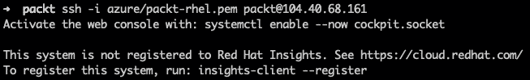

图 13.69 -连接到 RHEL 虚拟机

现在我们在 Azure 中创建了第一个虚拟机，让我们看看在虚拟机的生命周期中执行的一些最常见的管理操作。

## 管理虚拟机

随着应用的发展，承载应用的虚拟机所需的计算能力和容量也在发展。 作为系统管理员，我们应该准确地知道如何使用云资源。 Azure 提供了必要的工具来监视虚拟机的运行状况和性能。 这些工具可以在虚拟机管理页面的**Monitoring**选项卡中找到。

较小的虚拟机具有相对较少的虚拟 cpu 数量和较少的内存，可能会对应用性能产生负面影响。 另一方面，过大的实例会产生不必要的成本。 调整虚拟机的大小是 Azure 中的常见操作。 让我们看看怎么做。

### 更改虚拟机的大小

Azure 使其相对容易地调整虚拟机的大小。 在门户中，转到**Virtual Machines**，选择您的实例，然后单击**Settings**下的**Size**:

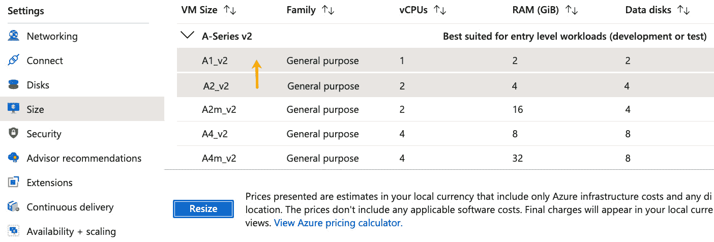

图 13.70 -改变虚拟机的大小

我们的虚拟机器(`packt-rhel`)的大小为**A2_v2**(2 个 vcpu, 4 GB RAM)。 我们可以选择大小。 出于演示目的，让我们将大小调整到较低的**A1_v2**容量(1 vCPU, 2 GB RAM)。 我们选择**A1_v2**选项，并单击**调整**按钮。 降低实例的大小也会节省成本。 Azure 将在调整大小时停止并重新启动我们的虚拟机。 在更改大小之前，最好先停止机器，以避免实例中可能出现的数据不一致。

Azure 中虚拟化工作负载的显著特性之一是通过向虚拟机添加额外的数据磁盘来扩展(包括存储容量)的能力。 我们可以添加现有的数据磁盘或创建新的数据磁盘。

接下来让我们看看如何向虚拟机添加辅助数据磁盘。

### 添加额外的存储

Azure 可以在不停止机器的情况下，动态地向我们的实例添加磁盘。 我们可以向虚拟机添加两种类型的磁盘:*数据磁盘*和*托管磁盘*。

让我们首先添加一个数据磁盘。

#### 添加数据磁盘

添加一个新的数据磁盘我们的虚拟机,去**虚拟机在左侧导航菜单,并选择您的实例,单击**磁盘下****设置**,然后点击【显示】创建和附加一个新的磁盘:**

 **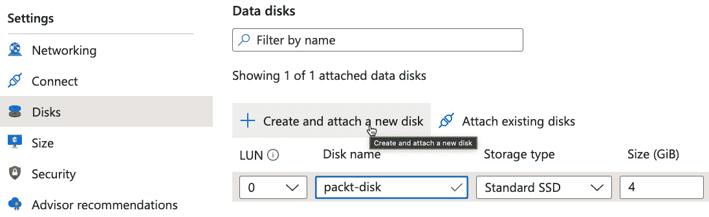

图 13.71 -向虚拟机添加数据磁盘

的磁盘属性,把**逻辑单元号**(**LUN)按原样(自动分配),指定磁盘名称**【显示】(如`packt-disk`),**存储类型**和【病人】大小(如`4`GB)。 完成后点击**保存**:

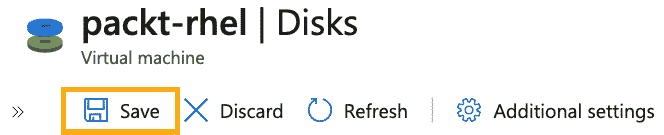

图 13.72 -保存数据磁盘设置

此时，我们已经将新磁盘连接到我们的虚拟机，但是磁盘还没有用文件系统初始化。 我们需要遵循本章前面描述的 AWS 存储卷的类似过程来初始化数据磁盘。 参见*EBS 卷*节。 让我们简单地浏览一下相关的命令。

通过 SSH 连接到我们的虚拟机:

```sh
ssh -i azure/packt-rhel.pem packt@104.40.68.161
```

列出当前的块设备:

```sh
lsblk
```

在输出中识别新的数据磁盘。 我们的磁盘大小为 4 GB，相关的块设备为`sdc`:


图 13.73 -为新数据磁盘识别块设备

验证块设备是否为空:

```sh
sudo file -s /dev/sdc
```

输出为`/dev/sdc: data`，这意味着数据磁盘还不包含文件系统。 接下来，用一个`XFS`文件系统初始化卷:

```sh
sudo mkfs -t xfs /dev/sdc
```

最后，创建一个挂载点(`/packt`)并挂载新卷:

```sh
sudo mkdir /packt
sudo mount /dev/sdc /packt
```

现在我们可以使用新的数据磁盘进行常规的文件存储。

我们应该注意，数据磁盘只会在虚拟机的生命周期内被持久化。 当虚拟机暂停、停止或终止时，数据磁盘将不可用。 当机器被终止时，数据磁盘将永久丢失。

对于持久存储，我们需要使用*托管磁盘*，其行为类似于网络附加存储。 接下来，我们将一个托管磁盘附加到虚拟机。

#### 添加受管磁盘

让我们从创建托管磁盘开始。 在 Azure 门户中，点击**创建资源**，在 Azure Marketplace 中搜索`managed disks`。 在纳管的磁盘资源上单击**创建**。 在下一个屏幕上,输入**包含我们的虚拟机资源组**(`packt-demo`),管理磁盘名称`packt-man`,【病人】地区我们的资源(`(US) West US`),和我们的磁盘的大小(**256 年镶条**,【t16.1】标准 SSD):

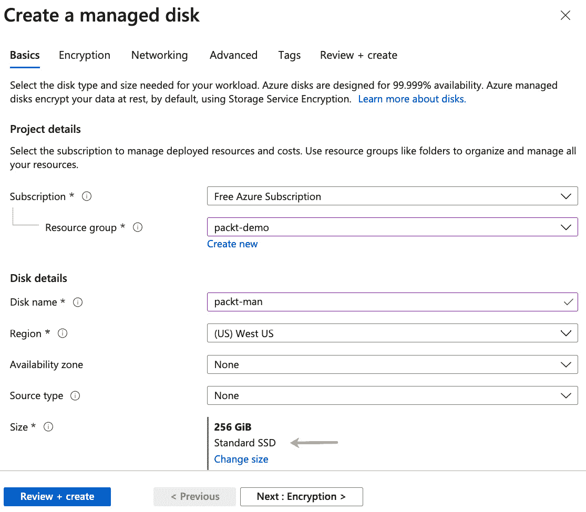

图 13.74 -创建托管磁盘

在选择磁盘大小时，您还可以在**标准**(SSD 或 HDD)和**高级**存储类型之间进行选择。 在选择**高级**之前，请确保您的虚拟机支持高级存储磁盘。 有关存储类型的更多信息，请访问[https://docs.microsoft.com/en-us/azure/virtual-machines/disks-types](https://docs.microsoft.com/en-us/azure/virtual-machines/disks-types)。

前面的设置足以创建我们的托管磁盘。 您可以选择执行以下步骤并指定加密和网络选项。 完成后点击**Review + create**。 Azure 将验证新资源的部署，并提示我们创建托管磁盘。

接下来，我们将把托管磁盘添加到虚拟机中。 这个过程非常类似于添加数据磁盘，除了我们指定**附加现有磁盘**来添加我们的托管磁盘。 注意，托管磁盘可能需要一段时间才能用于挂载。 此外，Azure 将大写资源的名称(对于示例，`PACKT-MAN`):


图 13.75 -绑定托管磁盘

选择被管理的磁盘(`PACKT-MAN`)，单击顶部菜单栏中的**保存**。 新磁盘将显示在之前添加到虚拟机的数据磁盘旁边:


图 13.76 -绑定到虚拟机的磁盘

初始化托管存储卷上的文件系统的其余步骤与数据磁盘类似，我们不会再讨论它们。

Azure 云中的另一个典型操作是跨资源组移动虚拟机。 假设我们有一个登台环境和一个生产环境，在某些时候，我们可能想要将一个虚拟机从一个转移到另一个。 在下一节中，我们将向您展示如何操作。

### 移动虚拟机

在 Azure 中，跨资源组移动虚拟机器是一个相对简单的过程。 以下是步骤:

1.  创建新的资源组。
2.  选择要移动的资源。
3.  移动资源。

让我们从第一步开始，创建要将虚拟机移动到的新资源组。 如果您的目标资源组已经创建，您可以跳过此步骤。

#### 创建新的资源组

我们将从创建一个新的资源组开始。 在 Azure 门户的左侧导航窗格中选择**资源组**，然后单击**创建**:

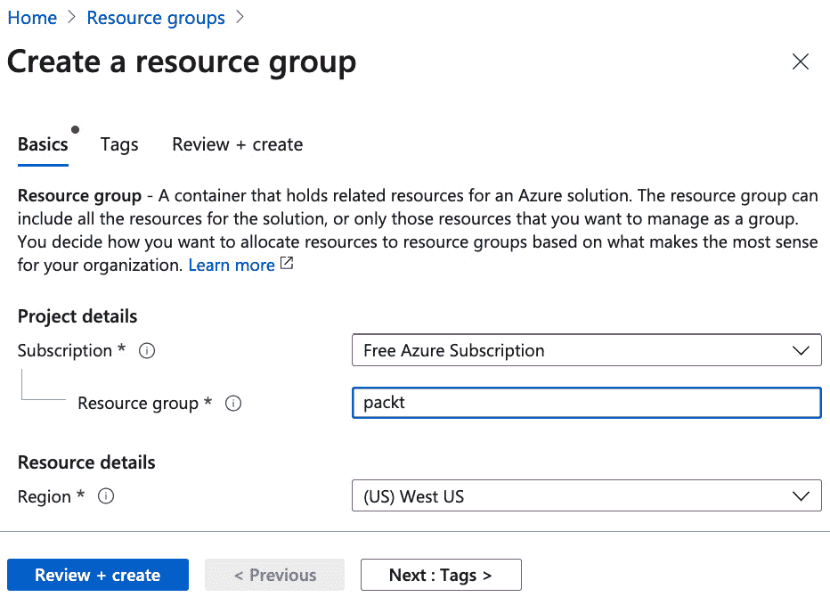

图 13.77 -创建一个新的资源组

我们将命名我们的新资源组`packt`，并在定义其他资产的同一个区域(`(US) West US`)中创建它。 完成后按**Review + create**。 作为练习，您还可以在新的资源组中创建另一个基于 Ubuntu 的虚拟机(例如`packt-ubuntu`)。

在下一步中，我们选择要移动的资源。

#### 选择要移动的资源

我们在左侧导航菜单中选择**资源组**，并选择我们想要将资产移出的资源组(`packt-demo`)。 在这里，我们选择要移动到另一个资源组的所有资源。 例如，我们可以只选择`packt-rhel`虚拟机，而将其他相关资源留在现有资源组中。 为了保持一致性，我们选择与`pack-rhel`虚拟机相关的所有资源，除了`packt-rhel`SSH 密钥。 在 Azure 中，跨资源组移动 SSH 密钥是不允许的，这很可能是出于安全原因。

选择完成,单击省略号(**…**),在右上角的资源菜单,选择**,选择**移动到另一个资源组**:**

 **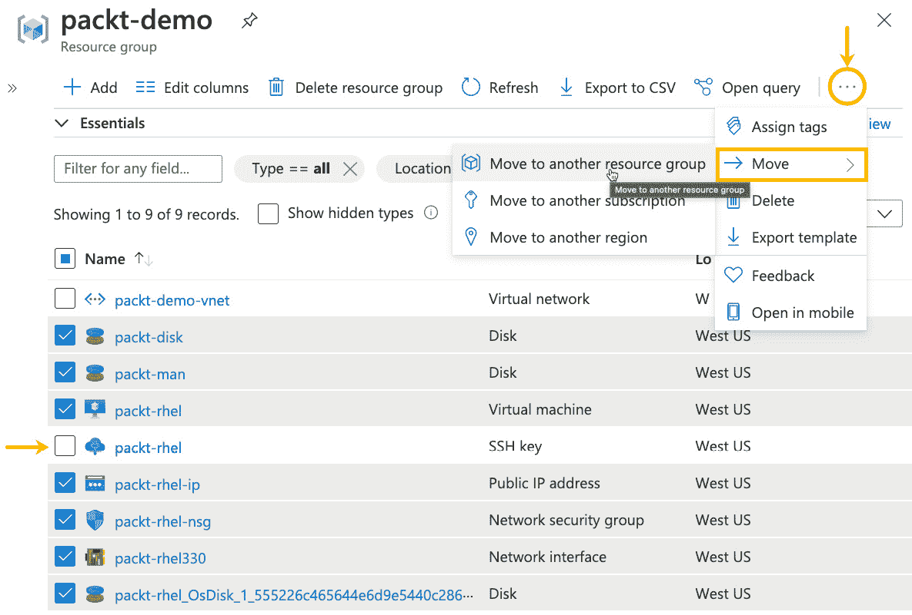

图 13.78 -选择要移动的资源

现在我们准备进行最后一步。

#### 移动资源

我们输入目标资源组(`packt`)的名称。 我们还必须承认，任何引用我们将要移动的资源的自动化脚本都必须进行更新，以反映新的资源组。 在点击**OK**按钮之前，我们仍然可以取消选中列表中我们不想移动的项目:

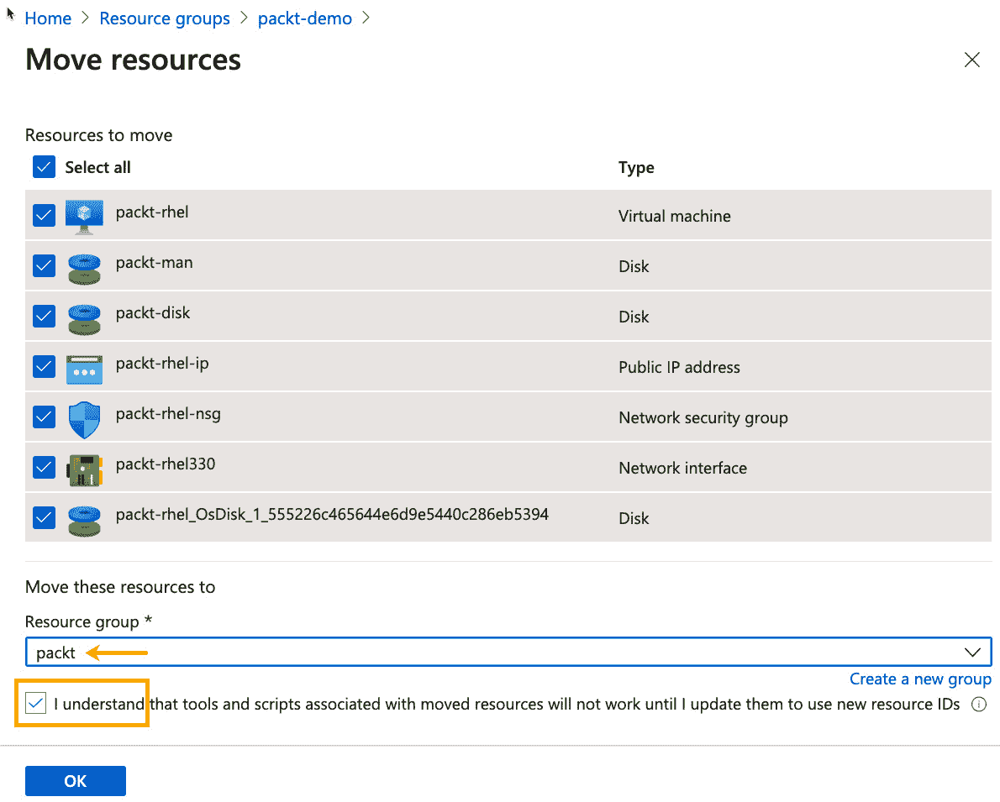

图 13.79 -移动资源

在一个快速验证过程之后，我们要移动到新资源组的项目将开始从旧资源组中消失。 点击原资源组顶部菜单栏中的**Refresh**按钮，最终视图将只显示未移动的资源:


图 13.80 -刷新旧的资源组

将切换到新的资源组(`packt`)，我们将看到我们刚刚移动的资源相应放置:


图 13.81 -新资源组中的资产(局部视图)

在虚拟机的生命周期中，我们可能偶尔会遇到连接到实例的问题，比如在无法访问主机或本地数据中心故障的极少数情况下。 Azure 有一个方便的特性，允许我们重新部署虚拟机。 重新部署将把实例放在同一个资源组中的新主机或新数据中心中，使其立即可用。 接下来让我们看看如何重新部署虚拟机。

### 重新部署虚拟机

要使用 Azure 门户启动重新部署，请转到左侧导航菜单中的**虚拟机**并选择您的虚拟机(例如`packt-rhel`)。 接下来，在**设置**刀片中，在**支持+故障排除**下选择**重新部署+重新应用**，然后点击**重新部署**:


图 13.82 -重新部署虚拟机

在重新部署过程中，Azure 将关闭机器，将其移动到 Azure 基础设施中的一个新节点，然后重新启动机器，所有配置选项和相关资源都完好无损。

到目前为止，我们已经在 Azure 门户中执行了所有这些管理操作。 如果您想要使用脚本自动化云中的工作负载，该怎么办? Azure 提供了专门的命令行界面来管理云中的资源。 下面我们来看看 Azure CLI。

## 使用 Azure CLI

首先，让我们在我们选择的平台上安装 Azure CLI。 按照下面的说明:[https://docs.microsoft.com/en-us/cli/azure/install-azure-cli](https://docs.microsoft.com/en-us/cli/azure/install-azure-cli)。 我们将为 Linux 选择 Azure CLI，并为了演示目的，将其安装在 Ubuntu 机器上。 相关指令在这里捕获:[https://docs.microsoft.com/en-us/cli/azure/install-azure-cli-linux](https://docs.microsoft.com/en-us/cli/azure/install-azure-cli-linux)。 从多个可用的安装选项中，我们将使用以下命令:

```sh
curl -sL https://aka.ms/InstallAzureCLIDeb | sudo bash
```

安装完成后，我们可以使用`az`命令调用 Azure CLI:

```sh
az help
```

通过以上命令可以查看`az`实用工具使用的详细帮助信息。 在执行任何管理操作之前，我们需要用 Azure 凭证验证 CLI。 下面的命令将相应地设置本地 Azure CLI 环境:

```sh
az login
```

我们将看到一条包含验证码和 URL([https://microsoft.com/devicelogin](https://microsoft.com/devicelogin))的消息，以访问并输入代码:


图 13.83 -初始化 Azure CLI 环境

现在，我们已经准备好使用 Azure CLI 进行管理操作了。 让我们在`westus`区域中创建一个新的资源组`packt-dev`:

```sh
az group create --name packt-dev --location westus
```

使用命令创建资源组成功后，输出如下:


图 13.84 -创建一个新的资源组

接下来，我们在刚才创建的区域中启动一个名为`packt-ubuntu-dev`的 Ubuntu 虚拟机:

```sh
az vm create \
  --resource-group packt-dev \
  --name packt-ubuntu-dev \
  --image UbuntuLTS \
  --admin-username packt \
  --generate-ssh-keys
```

让我们快速浏览一下前面的每个命令行选项:

*   `resource-group`-创建虚拟机所在的资源组(`packt-dev`)的名称
*   `name`-虚拟机的名称(`packt-ubuntu-dev`)
*   `image`-要使用的 Linux 发行版(`UbuntuLTS`)
*   `admin-username`-计算机管理员帐户的用户名(`packt`)
*   `generate-ssh-keys`-生成一个新的 SSH 密钥对来访问我们的虚拟机

该命令输出如下:


图 13.85 -创建一个新的虚拟机

正如输出所建议的，SSH 密钥文件已经自动生成并放置在本地机器的`~/.ssh`目录中，以允许 SSH 访问新创建的虚拟机。 `JSON`输出还提供了机器的公共 IP 地址:

```sh
"publicIpAddress": "168.62.197.46"
```

下面的命令列出了所有的虚拟机:

```sh
az vm list
```

要获取关于特定虚拟机(`packt-ubuntu-dev`)的信息，我们运行以下命令:

```sh
az vm show \
  --resource-group packt-dev \
  --name packt-ubuntu-dev
```

要重新部署一个现有的虚拟机(例如`packt-ubuntu-dev`)，我们运行以下命令:

```sh
az vm redeploy \
  --resource-group packt-dev \
  --name packt-ubuntu-dev
```

删除虚拟机(`packt-ubuntu-dev`):

```sh
az vm delete \
  --resource-group packt-dev \
  --name packt-ubuntu-dev
```

您可能已经注意到，对于与虚拟机相关的命令(`az vm`)，我们还需要指定虚拟机所属的资源组。

对 Azure CLI 的的全面研究超出了本章的范围。 有关的详细信息，请访问 Azure CLI 在线文档门户[https://docs.microsoft.com/en-us/cli/azure/](https://docs.microsoft.com/en-us/cli/azure/)。

以上就是我们使用 AWS 和 Azure 覆盖的公共云部署。 我们已经涵盖了一个广阔的领域，而只是粗略地了解了云管理工作负载的表面。 我们鼓励您在这些初步知识的基础上进一步探索，从 AWS 和 Azure 云文档开始。 这些链接见*进一步阅读*部分，以及其他有价值的资源。

现在，让我们来总结一下到目前为止您对 AWS 和 Azure 的了解。

# 总结

AWS 和 Azure 在灵活的计算能力、存储和网络方面提供了大致类似的功能集，并采用现收现付的定价方式。 它们共享公共云的基本元素——弹性、自动伸缩、自助服务供应、安全和身份访问管理。 本章严格地从实用的角度探讨了这两个云提供商，重点关注日常云管理任务的典型部署和管理方面。

我们讨论了启动和终止新实例或虚拟机等主题。 我们研究了如何调整实例的大小以适应更高或更低的计算容量，以及通过创建和附加额外的块设备(卷)来扩展存储。 最后，我们使用 CLI 工具为各种云管理工作负载编写脚本。

此时，您应该熟悉 AWS 和 Azure web 管理控制台和 CLI 工具。 您已经了解了一些典型云管理任务的基础知识，以及一些关于供应云资源的基本概念。 总之，通过参与云本地管理工作流，您已经为现代 Linux 管理员提供了一套特殊的技能。 结合到目前为止在前几章中构建的知识，您正在为本地、公共和混合云系统管理组装一个有价值的 Linux 管理工具带。

在下一章中，我们将进一步探讨这个挑战，并向您介绍如何使用 Kubernetes 的容器工作流和服务来管理应用部署。

# 问题

以下是你在本章所学到的一些概念的快速回顾，作为一个小测验:

1.  AZ 是什么?
2.  在`t2.small`和`t2.micro`AWS EC2 实例类型之间，哪一种性能更好?
3.  您已经在`us-west-1a`AZ 中启动了 AWS EC2 实例，并计划挂载在`us-west-1b`中创建的 EBS 卷。 它会工作吗?
4.  Azure 中有两个虚拟机和一个块设备(存储)，它们都在同一个资源组中。 您需要将存储连接到两个虚拟机。 它会工作吗? 它能在 AWS 中工作吗?
5.  您在 Azure 中拥有一个带有标准 SSD 存储的虚拟机，并计划将托管磁盘与高级 SSD 存储连接起来。 它会工作吗?
6.  连接到 AWS EC2 实例或 Azure 虚拟机的 SSH 命令是什么?
7.  您决定停止一个 EC2 实例。 稍后，重新启动实例，不能再使用相同的公共 IP 地址连接到 SSH。 发生了什么事?
8.  为什么要重新部署 Azure 虚拟机?
9.  列出虚拟机的 Azure CLI 命令是什么? 那么等效的 AWS CLI 命令呢?
10.  启动新的 EC2 实例的 AWS CLI 命令是什么?
11.  用于删除虚拟机的 Azure CLI 命令是什么?

# 进一步阅读

下面是一些进一步探索 AWS 和 Azure 云主题的资源:

*   AWS EC2:[https://docs.aws.amazon.com/ec2/index.html](https://docs.aws.amazon.com/ec2/index.html)
*   Azure:[https://docs.microsoft.com/en-us/azure](https://docs.microsoft.com/en-us/azure)
*   *AWS for System Administrators*，*Prashant Lakhera*，*Packt Publishing*([https://www.packtpub.com/product/aws-for-system-administrators/9781800201538](https://www.packtpub.com/product/aws-for-system-administrators/9781800201538))
*   *学习 AWS——第二版*、*Aurobindo Sarkar*,*阿米特·沙阿*,*Packt 出版*(【显示】https://www.packtpub.com/product/learning-aws-second-edition/9781787281066)
*   *学习 Microsoft Azure*，*Geoff weber - cross*，*Packt Publishing*([https://www.packtpub.com/product/learning-microsoft-azure/9781782173373](https://www.packtpub.com/product/learning-microsoft-azure/9781782173373))
*   *学习微软 Azure:实习培训(视频)*,*维贾伊赛*,*Packt 出版*(【https://www.packtpub.com/product/learning-microsoft-azure-a-hands-on-training-video/9781800203921 T6】)*******