# *第十四章*:使用 Kubernetes 部署应用程序

无论您是管理容器化应用程序的经验丰富的系统管理员，还是自动化应用程序编排工作流的 DevOps 工程师，Kubernetes 都可能是您的选择平台。 本章将向您介绍 Kubernetes，并指导您完成构建和配置 Kubernetes 集群的基本过程。 我们将使用 Kubernetes 在一个安全且高可用性的环境中运行和扩展一个简单的应用程序。 您还将了解如何使用命令行界面与 Kubernetes 交互。

在本章结束时，您将知道如何安装、配置和管理 Kubernetes 集群，无论是本地部署还是使用公有云提供商(如 AWS 和 Azure)的托管服务。 我们还将展示如何使用 Kubernetes 部署和扩展应用程序。

以下是本章将要讨论的主题的简要概述:

*   介绍 Kubernetes、体系结构和 API 对象模型
*   在桌面、本地虚拟机和公共云环境(AWS 和 Azure)中安装和配置 Kubernetes
*   使用`kubectl`命令行工具与 Kubernetes 一起工作
*   使用命令式和声明式部署模型使用 Kubernetes 部署应用程序

# 技术要求

一般来说，您应该熟悉 Linux 和命令行界面。 对 TCP/IP 网络和 Docker 容器的良好掌握将大大有助于您更容易地学习 Kubernetes。

如果您想跟随实际示例学习，那么探索云中的 Kubernetes 部分需要 AWS 和 Azure 帐户。 你可以在以下连结注册免费订阅:

*   AWS Free Tier:[https://aws.amazon.com/free](https://aws.amazon.com/free)
*   Microsoft Azure 免费账号:[https://azure.microsoft.com/en-us/free/](https://azure.microsoft.com/en-us/free/)

您还需要一台带有您选择的 Linux 发行版的本地桌面计算机来安装和试验本章中使用的 CLI 工具。

我们将用相当大的一部分讨论如何使用虚拟机构建 Kubernetes 集群。 一个具有几个 CPU 内核和至少 8 GB RAM 的强大桌面系统将允许您在桌面上复制相关环境。 您还需要一个桌面管理程序，例如*Virtual Box*或*VMware Fusion*。 或者，您可以选择使用 Kubernetes 探索更轻量级的仅用于桌面的环境，我们也将介绍它。

现在，让我们一起开始探索 Kubernetes 吧。

# Kubernetes 的介绍

Kubernetes是一个开放源码*容器编排器*，最初由谷歌开发。 假设一个应用程序使用了容器化的微服务，一个容器编排系统提供了以下特性:

*   **弹性编制**:自动启动和停止应用程序服务(容器)基于具体要求和条件——例如,推出多个 web 服务器实例与越来越多的请求,最终终止服务器请求的数量低于某一阈值时
*   **工作负载管理**:最优地跨底层集群部署和分发应用程序服务，以确保强制依赖和冗余——例如，在每个集群节点上运行 web 服务器端点以实现高可用性
*   **基础设施抽象**:提供容器运行时、网络连接和负载平衡能力——例如，在多个 web 服务器容器之间分配负载，并使用数据库应用程序容器自动配置底层网络连接
*   **声明配置**:描述和确保*期望状态*的多层应用程序——例如,一个 web 服务器应该准备好服务请求只有当数据库后端已经启动并运行,和底层存储

工作负载编排的一个经典例子是视频点播流媒体服务。 随着热门的新电视节目的高需求，流媒体请求的数量将大大超过常规季的平均水平。 有了 Kubernetes，我们可以根据流媒体会话的数量来扩展 web 服务器的数量。 我们还可以控制一些中间层组件可能的向外扩展，比如数据库实例(服务于身份验证请求)和存储缓存(服务于流)。 当电视节目不再流行，并且请求数量显著减少时，Kubernetes 终止剩余的实例，自动减少应用程序部署的占用空间，从而降低底层成本。

下面是使用 Kubernetes 部署应用程序的一些关键好处:

*   **快速部署**:使用*声明式*或*命令式*配置模型，应用程序容器的创建和启动速度相对较快(我们将在本章后面看到)。
*   **快速迭代**:应用程序升级相对简单，底层基础设施只需无缝地替换相关容器。
*   **快速恢复**:如果应用程序崩溃或不可用，Kubernetes 通过替换相关容器自动将应用程序恢复到所需的状态。
*   **降低了操作成本**:Kubernetes 的集装箱化环境和基础设施抽象以相对较低的资源运行应用程序，产生了最小的管理和维护工作。

既然我们已经介绍了 Kubernetes，接下来让我们看看它的基本工作原理。

## 了解 Kubernetes 架构

Kubernetes 工作模式的核心有三个主要概念:

*   **声明配置**或**期望状态**:这个概念描述了整个应用程序状态和microservices,部署所需的容器和相关资源,包括网络、存储、和负载平衡器,实现运行应用程序的功能状态。
*   **控制器**或**控制器循环**:这个概念的显示器所需的状态系统和需要纠正措施在需要的时候,比如替换失败的应用程序容器或添加额外的资源扩展工作负载。
*   **API 对象模型**:这个概念代表实际的实现你所期望的状态,使用各种配置对象和交互——**应用程序编程接口(API**【T7)】——【显示】这些对象之间的关系。****

 **为了更好地了解 Kubernetes 的内部结构，我们需要更仔细地研究 Kubernetes 对象模型和相关 API。

## 介绍 Kubernetes 对象模型

Kubernetes体系结构定义了一组表示系统期望状态的对象。 在这个上下文中，*对象*是描述子系统的*行为*的程序术语。 多个对象通过 API 相互交互，随着时间的推移形成所需的状态。 换句话说，Kubernetes 对象模型是所需状态的编程表示。

那么 Kubernetes 中的这些物体是什么呢? 我们将简要列举一些更重要的因素，并在接下来的章节中进一步阐述:

*   API server
*   豆荚
*   控制器
*   服务
*   存储
*   网络

我们使用这些 API 对象来配置系统的状态，可以使用*声明式*模型，也可以使用*命令式*模型。 使用*声明式*模型，我们*描述*系统的状态，通常使用配置文件或清单(YAML 或 JSON 格式)。 这样的配置可以包括和部署多个 API 对象，并将系统视为一个整体。

另一方面，*命令式*配置模型使用单独的命令来配置和部署特定的 API 对象，通常作用于单个目标或子系统。

让我们先来看看 API 服务器——Kubernetes 对象模型的核心部分。

### API 服务器介绍

API 服务器是 Kubernetes 对象模型的核心hub，它充当系统所需状态的管理端点。 API 服务器使用 JSON 有效负载公开一个 HTTP REST 接口。 其他 API 对象在内部可以访问*，在外部可以访问*，通过配置和管理工作流。**

 **API 服务器本质上是与 Kubernetes 集群交互的网关，从外部和内部都是如此。 系统管理员连接到 API 服务器端点来配置和管理 Kubernetes 集群，通常是通过 CLI。 在内部，KubernetesAPI 对象连接到 API 服务器以提供其状态的更新。 作为回报，API服务器可以进一步调整 API 对象的内部配置以达到预期的状态。

API 对象是 Kubernetes 集群内部配置或期望状态的构建块。 接下来让我们看看其中的一些 API 对象。

### 介绍吊舱

在 Kubernetes 中，**Pod**代表基本*工作单元*，作为单个或多容器应用程序运行。 在 Kubernetes 中，一个Pod 也被称为调度的*单元。 换句话说，保证同一个 Pod 中的容器部署在同一个集群节点上。*

Pod 本质上表示应用程序服务网格中的一个微服务(或服务)。 考虑一个经典的 web 应用程序的例子，我们可能有以下 pod 在集群中运行:

*   web 服务器(Nginx)
*   身份验证(库)
*   数据库(PostgreSQL)
*   存储(NAS)

每个服务(或应用程序)都在它们的 Pod 中运行。 同一个应用程序(例如，web 服务器)的多个 pod 组成一个*ReplicaSet*。 接下来，我们将在*介绍控制器*一节中更深入地研究 ReplicaSets。

豆荚的一个基本特征是它们的*短命*性质。 一旦一个荚果被终止，它就永远消失了。 没有荚果在库伯内特被重新部署。 因此，Pods 不持久化任何状态，除非它们使用持久存储或本地卷来保存数据。

此外，吊舱是一个*原子单位*——它们要么被部署，要么不被部署。 对于单个容器 Pod，原子性几乎是给定的。 对于多容器 Pod，原子性意味着仅在部署了每个组成容器时才部署 Pod。 如果任何容器未能部署，将不会部署 Pod，因此没有 Pod。 如果一个运行的多容器 Pod 中的一个容器失败，整个 Pod 将被终止。

可以部署并运行 Pod，但这并不一定意味着 Pod 中的应用程序或服务是健康的。 Kubernetes 使用*探针*监测 Pod 内应用的*生命值*。 例如，web 服务器 Pod 可以有一个探测，它检查特定的 URL，并根据响应决定它是否正常。

Kubernetes 使用控制器跟踪 pod 的状态。 接下来让我们看看控制器。

### 引入控制器

Kubernetes 中的**控制器**是*控制回路*，负责保持系统处于期望的状态或使系统更接近期望的状态。 例如，控制器可能检测到某个 Pod 没有响应，并在终止旧 Pod 的同时请求部署新的 Pod。

控制器还可以在*Pod 副本*集合中添加或删除特定类型的 Pod。 这样的控制器被称为**ReplicaSets**，它们的职责是根据应用程序的当前状态容纳特定数量的 Pod 副本。 例如，假设一个应用程序需要三个 web 服务器 pod，而其中一个不可用。 在这种情况下，ReplicaSet 控制器确保删除失败的 Pod，并使用一个新的 Pod 代替它。

在 Kubernetes 中部署应用程序时，我们通常不会直接使用 ReplicaSets 来创建 Pods。 我们使用*部署*控制器来代替。 给定 Kubernetes 的声明式模型，我们可以定义一个包含一个或多个 replicaset 的部署。 部署控制器的任务是创建具有所需数量 pod 的 ReplicaSet 并管理 ReplicaSet 状态，换句话说，就是加载哪个容器映像以及创建 pod 的数量。

部署控制器还可以管理从一个 ReplicaSet 到另一个 ReplicaSet 的转换，这是在推出或升级场景中使用的功能。 假设我们有一个 ReplicaSet(`v1`)，其中有几个 pod，它们都运行应用程序的版本 1，我们想将它们升级到版本 2。 记住，荚果不能*再生*或*升级*。 相反，我们将定义第二个 ReplicaSet(`v2`)，创建版本 2 Pods。 部署控制器将关闭`v1`ReplicaSet 并打开`v2`。 Kubernetes 无缝地进行了首次展示，几乎没有服务中断。 部署控制器管理`v1`和`v2`ReplicaSets之间的转换，如果需要，甚至回滚转换。

Kubernetes 中还有许多其他控制器类型，我们鼓励您在[https://kubernetes.io/docs/concepts/workloads/controllers/](https://kubernetes.io/docs/concepts/workloads/controllers/)中探索它们。

当应用程序向外扩展或终止时，将部署或删除相关的 pod。 *Services*提供对 Pods 动态而短暂的世界的访问。 接下来我们将讨论服务。

### 介绍服务

服务提供对运行在 pod 中的应用程序的持久访问。 通过将流量路由到相应的应用程序端点，确保 Pods 是可访问的，这是 Services 的责任。 换句话说，服务为与 pod 通信提供了网络抽象，例如 IP 地址、路由和 DNS 解析。 当Pods 根据系统的期望状态被部署或终止时，Kubernetes 动态更新 Pods 的服务端点，在访问相关应用程序时尽量减少或不中断。 当用户和应用程序访问服务端点的持久 IP 地址时，该服务将确保路由信息是最新的，并且将流量专门路由到运行和健康的 Pods。 还可以利用服务来平衡 Pods 之间的应用程序流量，并根据需求向上或向下伸缩 Pods。

到目前为止，我们已经了解了控制应用程序服务的部署、访问和生命周期的 Kubernetes API 对象。 那么应用程序需要的持久数据呢? 下面我们来看看 Kubernetes 的仓库。

### 介绍存储

Kubernetes为在集群中运行的应用程序提供了各种存储类型。 最常见的是**卷**和**持续性卷**。 由于 Pod 的短暂性，当 Pod 终止时，使用卷存储在 Pod 中的应用程序数据将丢失。 *持久性卷*是在 Kubernetes 集群级别定义和管理的，它们独立于 Pods。 需要持久状态的应用程序(Pods)将使用**persistentvolumecclaim**保留一个持久卷(特定大小)。 当使用持久卷的Pod 终止时，替换旧 Pod 的新 Pod 将从持久卷中检索当前状态，并将继续使用底层存储。 更多关于Kubernetes 存储类型的信息，请参考[https://kubernetes.io/docs/concepts/storage/](https://kubernetes.io/docs/concepts/storage/)。

现在我们已经熟悉了 Kubernetes API 对象模型，让我们快速了解一下 Kubernetes 集群的架构。

## Kubernetes 星系团的解剖

Kubernetes 集群由一个*控制平面节点*和一个或多个*工作节点*组成。 下面的图表展示了 Kubernetes 架构的高级视图:

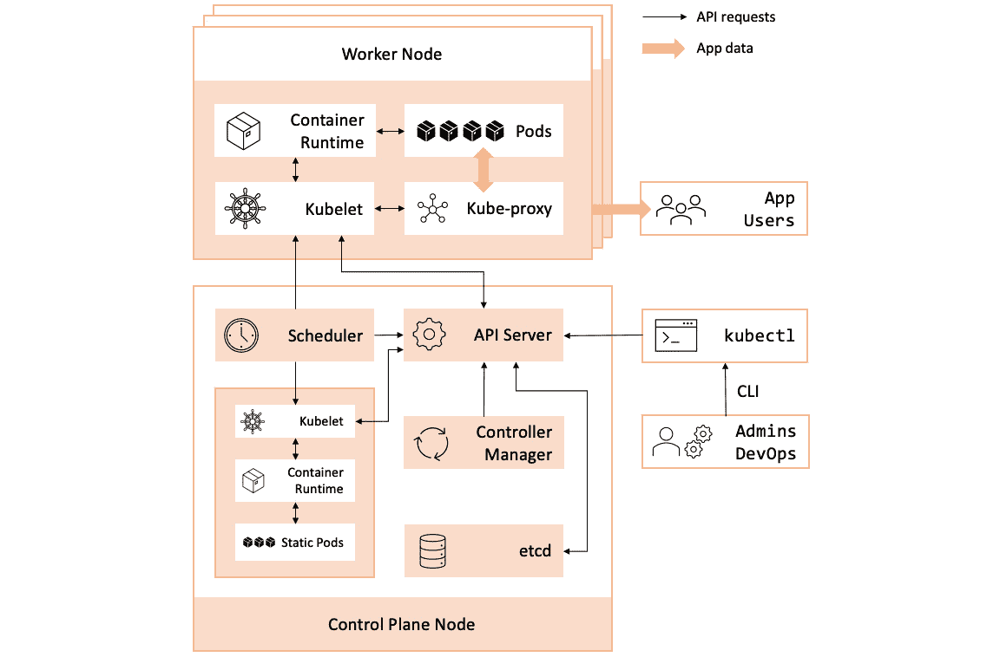

图 14.1 - Kubernetes 架构

接下来，让我们详细看看 Kubernetes 集群节点，从 Control Plane 节点开始。

### 介绍 Kubernetes 控制平面

*Kubernetes 控制平面*提供用于部署和编排应用程序工作负载的基本服务，并且它运行在 Kubernetes 集群中的专用节点*控制平面节点*上。 控制平面节点，也称为*主节点*，实现 Kubernetes 集群的核心组件，如资源调度和监控。 它也是集群管理的主要访问点。 下面是控制平面节点的关键子系统:

*   **API 服务器**:Kubernetes API 对象之间的中心通信枢纽; 它还提供了可以通过 CLI 或 Kubernetes web 管理控制台(仪表板)访问的集群管理端点。
*   调度程序**:根据资源分配和管理策略，决定何时以及在哪个节点上部署 pod。**
***   **控制器管理器**:维护控制回路，监视和塑造系统所需的状态。*   **etcd**，也称为**集群存储**，是一个高度可用的持久化数据库，维护 Kubernetes 集群和相关 API 对象的状态; `etcd`中的信息以键-值对的形式存储。*   **kubectl**:用于管理 Kubernetes 集群并与之交互的主要管理 CLI; `kubectl`直接与 API 服务器通信，可以远程连接到集群。**

 **Kubernetes 控制平面的详细架构概述超出了本章的范围。 您可以在[https://kubernetes.io/docs/concepts/architecture/](https://kubernetes.io/docs/concepts/architecture/)上更详细地了解相关概念。

接下来，让我们简要地看一下 Kubernetes 节点——Kubernetes 集群的主力节点。

### 介绍 Kubernetes 节点

在Kubernetes 集群中,**节点**——也被称为**w**——**工作节点运行实际应用豆荚和【显示】保持完整的生命周期。 节点提供 Kubernetes 的计算能力，并确保在部署和运行 pod 时，工作负载在集群中均匀分布。 节点可以配置为物理(裸金属)或虚拟机。**

让我们列举 Kubernetes 节点的关键元素:

*   **Kubelet**:处理控制平面请求(从调度程序)部署和启动应用程序 pod; Kubelet还监视节点和 Pod 状态，向 API 服务器报告相关的更改
*   **Kube-Proxy**:动态为在 Pods 中运行的应用程序配置虚拟网络环境; 它负责路由网络流量，提供负载均衡，维护 Services 和 pod 的 IP 地址
*   **容器运行时**:为 Pods 提供运行时环境作为应用程序容器; 使用**容器运行时界面**(**中国国际广播电台)与容器引擎背后的【显示】(**containerd**和【病人】码头工人**)

所有上述服务运行在 Kubernetes 集群的每个*节点上，包括 Control Plane 节点。 控制平面中的这些组件是特殊用途的 pod 所需要的，提供特定的控制平面服务，如 DNS、ingress(负载均衡)和 dashboard (web 控制台)。*

有关 Kubernetes 节点和相关架构概念的更多信息，请访问[https://kubernetes.io/docs/concepts/architecture/nodes/](https://kubernetes.io/docs/concepts/architecture/nodes/)。

现在，我们已经熟悉了一些关键概念和集群组件，让我们准备安装和配置 Kubernetes。

# 安装和配置 Kubernetes

在安装或使用 Kubernetes 之前，您必须决定要使用的基础设施是本地云还是公共云。 其次，您必须在**基础设施即服务**(**IaaS**)或**平台即服务**(**PaaS**)模型之间进行选择。 使用 IaaS，您必须自己在物理(裸机)或虚拟机上安装、配置、管理和维护 Kubernetes 集群。 相关的操作努力不是直截了当的，应该仔细考虑。 如果您选择一个 PaaS 解决方案(所有主要的公共云提供商都提供此解决方案)，那么您将只能执行管理任务，而不必承担维护底层基础设施的负担。

在本章中，我们将介绍 Kubernetes 的 IaaS 和 PaaS 部署。 对于 IaaS，我们将使用一个运行 Ubuntu 虚拟机的本地桌面环境。 然后，我们将看看在 AWS 和 Azure 中的 Kubernetes。

对于本地安装，我们也可以在 Kubernetes 的轻量级桌面版本和具有多个节点的成熟集群之间进行选择。 接下来让我们看看 Kubernetes 最常见的桌面版本。

## 在桌面上安装 Kubernetes

如果您只想用 Kubernetes 做实验，那么桌面版可能符合要求。 桌面风格的 Kubernetes 通常在您的本地机器上部署一个单节点集群。 根据您所选择的平台——Windows、macOS 或 Linux——您有许多 Kubernetes 引擎可供选择。 这里只是一些:

*   **Docker Desktop**(macOS, Windows):[https://www.docker.com/products/docker-desktop](https://www.docker.com/products/docker-desktop)
*   **minikube**(Linux, macOS, Windows):[https://minikube.sigs.k8s.io/docs/](https://minikube.sigs.k8s.io/docs/)
*   **Microk8s**(Linux, macOS, Windows):[https://microk8s.io/](https://microk8s.io/)
*   **k3 (Linux): https://k3s.io/**

在本节中，我们将向您展示如何安装 Microk8s，这是编写本文时流行的 Kubernetes 桌面引擎之一。 Microk8s 可以通过 Snap store 安装。 让我们先把它安装到 Ubuntu 上。

### 在 Ubuntu 上安装 Microk8s

例如，在Ubuntu 20.04 上，我们可以使用以下命令来安装:

```sh
sudo snap install microk8s --classic
```

Microk8s 的成功安装应该会产生以下结果:


图 14.2 -在 Linux 上运行 Microk8s

要在没有`sudo`权限的情况下访问 Microk8s CLI，您必须将本地用户帐户添加到`microk8s`组，并使用以下命令修复`~/.kube`目录的权限:

```sh
sudo usermod -aG microk8s $USER
sudo chown -f -R $USER ~/.kube
```

这些更改将在下一次登录时生效，您可以将`microk8s`命令行实用程序与非`sudo`调用一起使用。 例如，显示工具的帮助信息如下:

```sh
microk8s help
```

要获取本地单节点 Microk8s Kubernetes 集群的状态，我们运行以下命令:

```sh
microk8s status
```

Microk8s 在 RHEL/CentOS 上的安装步骤非常相似，只有一些细微的区别。 让我们接下来看看这个。

### Installing Microk8s on RHEL/CentOS

在RHEL/CentOS 上，我们必须首先启用 Snap store。 Snap 通过**Extra Packages for Enterprise Linux**(**EPEL**)提供。 我们使用以下命令安装EPEL 存储库:

```sh
sudo yum install -y epel-release
```

接下来，我们将安装 Snap:

```sh
sudo yum install -y snapd
```

安装了 Snap 后，我们需要做一些调整来启用 Snap 通信套接字和经典的 Snap 支持:

```sh
sudo systemctl enable --now snapd.socket
sudo ln -s /var/lib/snapd/snap /snap
```

现在，我们准备使用`snap`安装 Microk8s:

```sh
sudo snap install microk8s --classic
```

请注意，对于**microk8s**CLI 的非 sudo 调用，您需要修复所需的权限，如*在 Ubuntu*上安装 microk8s 部分所示。

Kubernetes桌面引擎非常适合在平台上学习和试验，但是它们与真实的生产环境相距甚远。 接下来，我们将介绍如何使用虚拟机安装 Kubernetes 集群。

## 在虚拟机上安装 Kubernetes

在本节中，我们将通过在 Ubuntu**虚拟机**(**虚拟机**)上部署 Kubernetes 集群，使更接近真实的 Kubernetes环境——尽管规模要小得多。 您可以使用任何 hypervisor，如 Oracle VirtualBox 或 VMware Fusion，它们都在本书的[*第一章*](01.html#_idTextAnchor014)，*安装 Linux*中描述。

我们将为每个 VM 提供 2 个 vCPU 内核、2 GB RAM 和 20 GB 磁盘容量。 您可以按照[*第 1 章*](01.html#_idTextAnchor014)、*安装 Linux*中的*安装 Ubuntu*部分描述的步骤，使用您选择的 hypervisor。

在深入了解 Kubernetes 集群安装细节之前，让我们快速查看一下我们的实验室环境。

### 准备实验室环境

以下是我们的虚拟机环境的规格:

**Hypervisor**:VMware Fusion

**Kubernetes 群**:1 个**控制平面**(**CP**)节点; 三个工人节点

**CP 节点**:

*   `k8s-cp1`:`172.16.191.6`

**工作节点**:

*   `k8s-n1`:`172.16.191.8`
*   `k8s-n2`:`172.16.191.9`
*   `k8s-n3`:`172.16.191.10`

**虚拟机**:Ubuntu Server 20.04.2, 2 个 vcpu, 2gb RAM, 20gb 磁盘

**用户**:`packt`(在所有节点上)，启用 SSH 访问

在 Ubuntu Server 安装向导中，我们在每个 VM 节点上设置用户名和主机名。 另外，确保在提示时启用 OpenSSH 服务器。 您的 VM IP 地址很可能与规范中的不同，但这并不重要。 您也可以选择为您的虚拟机使用静态 IP 地址。

要在集群中简化主机名解析，请编辑每个节点上的`/etc/hosts`文件并添加相关记录。 例如，在 Control Plane 节点(`k8s-cp1`)上有以下`/etc/hosts`文件:


图 14.3 - CP 节点上的/etc/hosts 文件(k8s-cp1)

在生产环境中,启用了防火墙集群节点,我们必须确保以下规则配置为接受集群中的网络流量(根据[https://kubernetes.io/docs/setup/production-environment/tools/kubeadm/install-kubeadm/](https://kubernetes.io/docs/setup/production-environment/tools/kubeadm/install-kubeadm/)):


图 14.4 - Kubernetes 集群节点使用的端口

下面的章节假设您已经按照上述规格发放并运行了虚拟机。 在执行下一步之前，您可以对虚拟机进行一些初始快照。 如果安装出现任何问题，您可以恢复到初始状态并重新启动。

下面是我们安装 Kubernetes 集群的步骤:

*   禁用交换
*   安装**容器**
*   安装 Kubernetes 包:`kubelet`，`kubeadm`，`kubectl`

我们必须在每个集群节点上执行这些步骤。 相关命令也可以在 GitHub 上附带的章节源代码中找到。

让我们从第一步开始，在每个节点上禁用内存交换。

#### 禁用交换

在 Linux 平台上，Kubernetes**kubelet**不能在启用`swap`的情况下工作。 见[https://github.com/kubernetes/kubernetes/issues/53533](https://github.com/kubernetes/kubernetes/issues/53533)。 `swap`是内存满时使用的磁盘空间。

要立即禁用`swap`，我们运行以下命令:

```sh
sudo swapoff -a
```

为了在系统重新启动时保持禁用的`swap`，我们需要注释掉`/etc/fstab`中的`swap`相关条目。 您可以通过手动编辑`/etc/fstab`或使用以下命令来完成此操作:

```sh
sudo sed -i '/\s*swap\s*/s/^\(.*\)$/# \1/g' /etc/fstab
```

您可能需要再次检查`/etc/fstab`中的*所有*`swap`条目是否被禁用:

```sh
cat /etc/fstab
```

我们可以看到在我们的`/etc/fstab`文件中注释掉了`swap`挂载点:

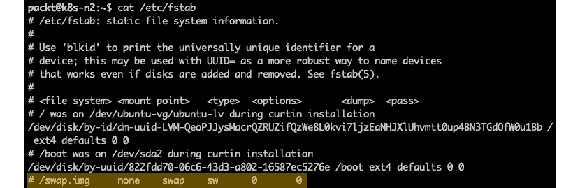

图 14.5 -在/etc/fstab 中禁用交换项

请记住在集群中的每个节点上运行上述命令。 接下来，我们将看看如何安装 Kubernetes 容器运行时。

#### 安装 containerd

在 Kubernetes 的最新版本中，`containerd`是默认的容器运行时。 `containerd`实现了**容器运行时接口**(**CRI**)，由 Kubernetes 容器引擎抽象层要求。 相关的安装过程并不简单，我们将遵循撰写本文时 Kubernetes 官方文档中描述的步骤:[https://kubernetes.io/docs/setup/production-environment/container-runtimes/](https://kubernetes.io/docs/setup/production-environment/container-runtimes/)。 这些步骤可能随时更改，所以请务必检查最新的程序。

我们将从安装一些`containerd`先决条件开始。 我们使用`modprobe`启用`br_netfilter`和`overlay`内核模块:

```sh
sudo modprobe br_netfilter
sudo modprobe overlay
```

我们还确保这些模块在系统重启时加载:

```sh
cat <<EOF | sudo tee /etc/modules-load.d/containerd.conf
br_netfilter
overlay
EOF
```

接下来，我们应用 CRI 所需的`sysctl`参数，这些参数在系统重新启动时也保持不变:

```sh
cat <<EOF | sudo tee /etc/sysctl.d/99-kubernetes-cri.conf
net.bridge.bridge-nf-call-iptables = 1
net.ipv4.ip_forward = 1
net.bridge.bridge-nf-call-ip6tables = 1
EOF
```

我们希望上述更改立即生效，无需重新启动系统:

```sh
sudo sysctl --system
```

在安装任何新包之前，让我们确保`apt`存储库是最新的:

```sh
sudo apt-get update
```

现在，我们准备安装`containerd`:

```sh
sudo apt-get install -y containerd
```

接下来，我们生成一个默认的`containerd`配置:

```sh
sudo mkdir -p /etc/containerd
containerd config default | sudo tee /etc/containerd/config.toml
```

我们需要稍微修改一下默认的`containerd`配置，以便在容器运行时(`runc`)中使用`systemd``cgroup`驱动程序。 之所以需要此更改，是因为底层平台(Ubuntu)使用`systemd`作为服务管理器。

用您选择的编辑器打开`/etc/containerd/config.toml`文件，如下所示:

```sh
sudo nano /etc/containerd/config.toml
```

找到以下部分:

```sh
[plugins."io.containerd.grpc.v1.cri".containerd.runtimes.runc]
```

然后，添加突出显示的行，*调整*适当的缩进(*非常重要!* ):

```sh
[plugins."io.containerd.grpc.v1.cri".containerd.runtimes.runc]
  ...
  [plugins."io.containerd.grpc.v1.cri".containerd.runtimes.runc.options]
  SystemdCgroup = true
```

下面是最终的配置存根:


图 14.6 -修改容器配置

保存`/etc/containerd/config.toml`文件并重新启动`containerd`:

```sh
sudo systemctl restart containerd
```

安装`containerd`并配置好，接下来我们可以继续安装 Kubernetes 包。

#### 安装 Kubernetes 包

我们将遵循[https://kubernetes.io/docs/setup/production-environment/tools/kubeadm/install-kubeadm/](https://kubernetes.io/docs/setup/production-environment/tools/kubeadm/install-kubeadm/)中描述的步骤。 这个过程可能会随着时间的推移而改变，所以请确保查看最新的。

让我们从安装 Kubernetes`apt`存储库所需的包开始:

```sh
sudo apt-get install -y apt-transport-https ca-certificates curl
```

接下来，我们下载谷歌`apt`知识库**GNU Privacy Guard**(**GNU**)签名密钥:

```sh
sudo curl -sfSLo /usr/share/keyrings/kubernetes-archive-keyring.gpg https://packages.cloud.google.com/apt/doc/apt-key.gpg
```

下一个命令将 Kubernetes`apt`存储库添加到我们的系统中:

```sh
echo "deb [signed-by=/usr/share/keyrings/kubernetes-archive-keyring.gpg] https://apt.kubernetes.io/ kubernetes-xenial main" | sudo tee /etc/apt/sources.list.d/kubernetes.list
```

让我们来读一下我们刚刚添加的新存储库中可用的包:

```sh
sudo apt-get update
```

我们现在准备安装 Kubernetes 包:

```sh
sudo apt-get install -y kubelet kubeadm kubectl
```

我们希望版本的这些包*固定*，以避免通过系统安全补丁进行无意更新，等等。 Kubernetes 包应该只使用集群升级过程进行更新。 我们使用`apt-mark hold`命令来固定 Kubernetes 包的版本，包括`containerd`:

```sh
sudo apt-mark hold containerd kubelet kubeadm kubectl
```

最后，确保在系统启动(reboot)时启用了`containerd`和`kubelet`服务:

```sh
sudo systemctl enable containerd
sudo systemctl enable kubelet
```

现在我们已经完成了 Kubernetes 包的安装，让我们检查节点 Services 的状态。 我们首先检索`containerd`服务的状态:

```sh
sudo systemctl status containerd
```

`containerd`应积极跑步:


图 14.7 -容器运行状态

接下来，让我们来检查一下`kubelet`服务的状态:

```sh
sudo systemctl status kubelet
```

此时，状态显示`exited`应该是*，毫不奇怪*:


图 14.8 - kubelet 在没有集群配置的情况下崩溃

`kubelet`正在寻找尚未设置的Kubernetes 集群。 我们可以看到，`kubelet`试图启动和激活自己，但一直崩溃，因为它无法定位所需的配置。

接下来，我们将使用`kubeadm`引导(初始化)Kubernetes 集群。 在继续下一节之前，请按照前面的步骤在所有集群节点上安装所需的 Kubernetes 包。

### 引入 kubeadm

`kubeadm`是一个帮助器，用于创建 Kubernetes 集群，本质上有两个调用:

*   `kubadm init`:*引导*或正在初始化 Kubernetes 集群
*   `kubadm join`:*向 Kubernetes 集群中添加*一个节点

不带参数的`kubadm init`的默认调用执行以下任务:

*   它进行初步(T0)飞行前*系统检查*。
*   它将创建一个*证书颁发机构*。
*   它生成`kubeconfig`文件。
*   它生成*静态 Pod*舱单。
*   它*等待*来启动静态 pod。
*   *污染*控制平面节点。
*   它生成一个*引导令牌*。
*   它启动*附加豆荚*。

下面让我们简要描述每一个任务。

#### 运行的初步检查

在最初始的阶段，`kubadm init`确保我们拥有最少的系统资源，包括 CPU 和内存、所需的用户权限以及受支持的符合 cri 的容器运行时。 如果其中任何一个检查失败，`kubeadm init`将停止创建集群的执行。 如果检查成功，`kubadm`接下来将创建**证书颁发机构**(**CA**)。

#### 创建证书颁发机构

`kubeadm init`创建一个自签名 CA, Kubernetes 使用它生成在集群中进行身份验证和运行受信任工作负载所需的证书。 CA 文件存储在`/etc/kubernetes/pki`/目录下，在加入集群时分发到每个节点上。 在生成 CA 之后，`kubadm`继续处理 kubeconfig 文件。

#### 生成 kubeconfig 文件

kubeconfig*文件是 Kubernetes 集群组件用于定位、通信和与 API 服务器进行身份验证的配置文件。 `kubeadm init`创建一个默认的 kubeconfig 文件集来引导集群。 kubeconfig 文件存放在`/etc/kubernetes/`目录下。 接下来，`kubadm`生成静态 Pod 舱单。*

 *#### 生成静态吊舱舱单

**静态 pod**是特定于系统的Pods，专门运行在 Control Plane 节点上，由`kubelet`守护进程管理。 静态 pod 的例子包括 API 服务器、控制器管理器、调度器和`etcd`。 静态 Pod 舱单是描述控制平面 Pod 的配置文件。 `kubeadm init`在集群引导过程中生成静态 Pod 清单。 清单文件存储在`/etc/kubernetes/manifests/`目录下。 `kubelet`服务监视此位置，并在找到清单时部署相应的静态 Pod。 在生成静态 Pod 清单之后，`kubeadm`等待静态 Pod 启动。

#### 等待静舱启动

在`kubelet`守护进程部署静态 pod 后，`kubeadm`查询`kubelet`以获取静态 pod 的状态。 当静态 pod 启动并运行时，`kubeadm init`继续下一阶段，*污染*控制平面节点。

#### 污染控制平面节点

**污染**是*的进程，从运行的用户 pod 中排除*节点。 Kubernetes 环境中相反的概念是*耐受*——控制 pod 对特定集群节点的亲和性。 `kubeadm init`遵循 Kubernetes 的最佳实践，污染控制平面，以避免用户 pod 运行在控制平面节点。 显而易见的原因是将控制平面的资源专门用于特定于系统的工作负载。 接下来，`kubeadm init`生成一个引导令牌。

#### 生成引导令牌

**引导令牌**是简单承载令牌，用于将新节点加入Kubernetes 集群。 `kubeadm init`生成一个引导令牌，该令牌可与受信任节点共享以加入集群。 最后，`kubeadm init`继续启动 Kubernetes 附加组件。

#### 从附加豆荚

Kubernetes 集群插件是特定的控制平面组件(Pods)，扩展了集群的功能。 默认情况下，`kubadm init`创建并部署*DNS*和*kube-proxy*插件 pod。

Kubernetes 集群的引导过程的各个阶段是高度可定制的。 `kubeadm init`在不调用附加参数的情况下，将按前面的顺序运行所有任务。 或者，系统管理员可以调用带有不同选项参数的`kubeadm`命令来控制和运行所提到的任何阶段。

有关`kubeadm`的更多信息，请参考实用程序关于以下命令的帮助:

```sh
kubeadm help
```

有关使用`kubeadm`引导 Kubernetes 集群的更多信息，您可以参考 Kubernetes 官方文档[https://kubernetes.io/docs/setup/production-environment/tools/kubeadm/](https://kubernetes.io/docs/setup/production-environment/tools/kubeadm/)。

在下一节中，我们将使用`kubeadm`引导一个 Kubernetes 集群来生成一个集群配置文件，然后调用`kubeadm init`来使用这个配置。 接下来，我们将通过创建 Kubernetes Control Plane 节点来引导集群。

### 创建 Kubernetes 控制平面节点

以下是我们将使用创建控制平面节点的步骤:

*   下载一个清单文件来配置 pod 的覆盖网络; 我们将为 Kubernetes 使用*Calico*网络插件。
*   使用`kubeadm`生成一个默认的集群配置 YAML 文件，并调整它以匹配我们的环境。
*   使用修改后的集群配置文件和指向`containerd`的选项参数作为 Kubernetes 集群中选择的容器引擎调用`kubeadm init`。
*   为当前用户设置管理 Kubernetes 集群所需的权限。
*   使用`kubectl`到应用*Calico*过度网络配置。

现在，让我们开始工作并配置我们的 Kubernetes 控制平面节点。 以下命令在 VM 环境中的`k8s-cp1`主机上执行。 正如主机名所建议的，我们选择`k8s-cp1`作为 Kubernetes 集群的 Control Plane 节点。

我们将从下载*印花布*舱单*覆盖网络*开始。 覆盖网络,也被称为**软件定义网络**(**SDN)是一个逻辑网络层提供一个安全的和【显示】之间的无缝网络通信豆荚物理网络,可能无法访问配置。 探索集群网络的内部结构超出了本章的范围，但我们鼓励您在[https://kubernetes.io/docs/concepts/cluster-administration/networking/](https://kubernetes.io/docs/concepts/cluster-administration/networking/)阅读更多内容。 您还可以找到对 Calico 网络扩展的引用。 要下载相关的清单，我们运行以下命令:**

```sh
curl https://docs.projectcalico.org/manifests/calico.yaml -O
```

该命令下载当前目录(`/home/packt/`)中的`calico.yaml`文件，我们将使用`kubectl`在稍后的过程中配置 Pod 网络。

接下来，让我们使用文本编辑器打开`calico.yaml`文件，查找以下行(从 3672 行开始):

```sh
# - name: CALICO_IPV4POOL_CIDR
#   value: "192.168.0.0/16"
```

`CALICO_IPV4POOL_CIDR`指向与 pod 相关的网络范围。 如果相关的子网与您的本地环境有任何冲突，您将不得不在这里更改它。 我们将保持设置不变。

接下来，我们将使用`kubeadm`创建一个默认的集群配置文件。 集群配置文件描述了我们正在构建的 Kubernetes 集群的设置。 让我们将这个文件命名为`k8s-config.yaml`:

```sh
kubeadm config print init-defaults | tee k8s-config.yaml
```

您可以安全地忽略在相关输出开始处显示的关于丢失 Docker 运行时的警告。 我们将使用`containerd`作为集装箱发动机，接下来做相应的调整:

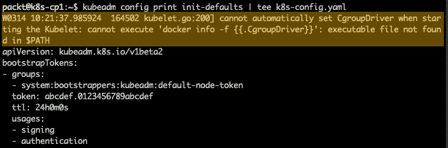

图 14.9 -创建集群配置文件(忽略 Docker 警告)

让我们回顾一下刚刚生成的`k8s-config.yaml`文件，并指出需要进行的一些更改。 我们将从配置参数`localAPIEndpoint.advertiseAddress`开始——API 服务器端点的 IP 地址。 默认值是`1.2.3.4`，我们需要将其更改为运行 Control Plane 节点(`k8s-cp1`)的虚拟机的 IP 地址，在本例中为`172.16.191.6`。 参考本章前面的*准备实验室环境*部分。 你必须把 IP 地址匹配你的环境:


图 14.10 -修改 advertiseAddress 配置参数

您可以手动编辑`k8s-config.yaml`文件，也可以使用以下命令执行上述更改:

```sh
sed -i 's/  advertiseAddress: 1.2.3.4/  advertiseAddress: 172.16.191.6/' k8s-config.yaml
```

我们需要做的下一个更改是将`nodeRegistration.criSocket`配置参数指向`containerd`套接字`(/run/containerd/containerd.sock`:


图 14.11 -更改 criSocket 配置参数

等效命令如下:

```sh
sed -i 's/  criSocket: \/var\/run\/dockershim.sock/  criSocket: \/run\/containerd\/containerd.sock/' k8s-config.yaml
```

接下来，我们更改`kubernetesVersion`参数以匹配 Kubernetes 环境的版本:


图 14.12 -更改 kubernetesVersion 参数

默认值是`1.20.0`，但是根据`kubeadm`，我们的 Kubernetes 版本是`1.20.4`:

```sh
kubeadm version
```

相关输出如下:


图 14.13 -检索 Kubernetes 的当前版本

要更改`k8s-config.yaml`中的`kubernetesVersion`参数，我们运行以下命令:

```sh
sed -i 's/kubernetesVersion: v1.20.0/kubernetesVersion: v1.20.4/' k8s-config.yaml
```

我们对集群配置文件的最后修改将`kubelet`的`cgroup`驱动程序设置为`systemd`，以匹配`containerd`的`cgroup`驱动程序。 请注意`systemd`是底层平台的服务管理器(在 Ubuntu 中)，因此需要将相关的服务控制交给 Kubernetes 守护进程。 相应的配置块在`k8s-config.yaml`中还没有出现。 我们可以使用以下命令手动将其添加到文件或的末尾:

```sh
cat <<EOF | cat >> k8s-config.yaml
---
apiVersion: kubelet.config.k8s.io/v1beta1
kind: KubeletConfiguration
cgroupDriver: systemd
EOF
```

最终的配置块如下:


图 14.14 -指向 kubelet 的 cgroup 驱动程序到 systemd

现在，我们准备引导 Kubernetes 集群。 我们使用指向集群配置文件(`k8s-config.yaml`)的`--config`选项调用`kubeadm init`命令，使用指向`containerd`套接字的`--cri-socket`选项参数:

```sh
sudo kubeadm init \
    --config=k8s-config.yaml \
    --cri-socket /run/containerd/containerd.sock
```

没有指定`--cri-socket`选项会导致飞行前错误，由于`kubeadm`中当前的错误仍然假设 Docker 是容器引擎，导致 Docker 运行时丢失。 `kubeadm`的未来版本可能会修复此行为。

执行该命令需要几分钟的时间。 Kubernetes 集群的成功引导完成如下输出:

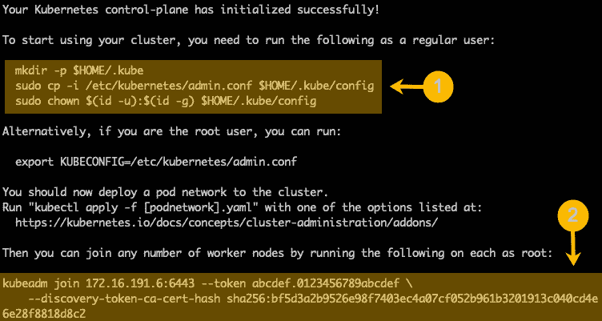

图 14.15 -成功引导 Kubernetes 集群

此时，我们的 Kubernetes 控制平面节点已经启动并运行。 在输出中，我们突出显示了以下命令的相关摘录:

*   将当前用户配置为 Kubernetes 集群管理员(**1**)
*   加入新的节点到 Kubernetes 集群(**2**)

我们建议花些时间检查完整的输出，并识别每个`kubeadm init`任务的相关信息，如本章前面的*介绍 kubeadm*一节所捕获的那样。

接下来，为了将当前用户配置为 Kubernetes 集群管理员，我们运行以下命令:

```sh
mkdir -p ~/.kube
sudo cp -i /etc/kubernetes/admin.conf ~/.kube/config
sudo chown $(id -u):$(id -g) ~/.kube/config
```

在我们的集群启动并运行之后，让我们部署*Calico*网络清单来创建 Pod 网络:

```sh
kubectl apply -f calico.yaml
```

上述命令将创建 Pod 覆盖网络相关的资源集合。 现在，我们准备通过使用`kubectl`命令来列出系统中的所有 pod 来第一次窥视集群的状态:

```sh
kubectl get pods --all-namespaces
```

该命令输出如下:

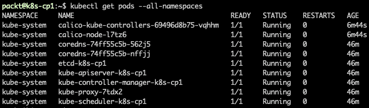

图 14.16 -在 Kubernetes 集群中取回 pod

`--all-namespaces`选项可以跨集群中的所有资源组检索 pod。 Kubernetes 使用*名称空间*来组织资源。 目前，在我们的集群中运行的唯一 pod 是*系统 pod*，因为我们还没有部署任何用户 pod。

查询当前集群中的节点:

```sh
kubectl get nodes
```

输出显示`k8s-cp1`作为 Kubernetes 集群中配置的唯一节点，作为 Control Plane 节点运行:


图 14.17 -列出 Kubernetes 集群中的当前节点

您可能还记得引导 Kubernetes 集群之前的，`kubelet`服务不断地崩溃(并试图重新启动)。 当集群启动并运行时，`kubelet`守护进程的状态应该是*活动的*和*运行的*:

```sh
sudo systemctl status kubelet
```

输出如下所示:


图 14.18 -集群中一个健康的 kubelet

我们鼓励您查看在`/etc/kubernetes/manifests/`目录中为每个集群组件创建的清单:

```sh
ls /etc/kubernetes/manifests/
```

输出显示了描述静态(系统)Pods 的配置文件，对应于*API 服务器*、*控制器管理器*、*调度程序*和`etcd`:

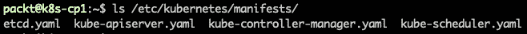

图 14.19 - /etc/kubernetes/manifests/中的静态 Pod 配置文件

您也可以查看`/etc/kubernetes`中的`kubeconfig`文件:

```sh
ls /etc/kubernetes/
```

您可能还记得本章前面介绍 kubeadm 一节，集群组件使用`kubeconfig`文件与 API 服务器进行通信和身份验证。

接下来，我们将工作节点添加到 Kubernetes 集群中。

### 加入一个节点到 Kubernetes 集群

如前所述，在向 Kubernetes 集群添加节点之前，您将需要运行本章前面*准备实验室环境*一节中描述的初步步骤。

要将一个节点加入到集群中，我们需要在 Kubernetes 集群成功引导时生成的*引导令牌*和*发现令牌 CA 证书哈希*。 在使用`kubadm init`引导过程结束时的输出中提供了与相关`kubadm join`命令相关的令牌。 参考本章前面的*创建 Kubernetes 控制平面节点*一节。

请记住，引导令牌将在 24 小时内到期。 如果您忘记复制该命令，您可以在控制平面节点的终端(在`k8s-cp1`上)运行以下命令来检索相关信息:

*   Retrieve the current bootstrap tokens:

    ```sh
    kubeadm token list
    ```

    输出显示了我们的令牌(`abcdef.0123456789abcdef`):

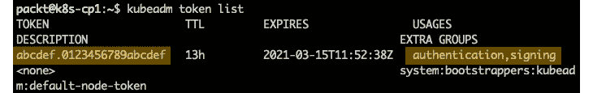

图 14.20 -获取当前引导令牌

*   Get the CA certificate hash:

    ```sh
    openssl x509 -pubkey \
        -in /etc/kubernetes/pki/ca.crt | \
        openssl rsa -pubin -outform der 2>/dev/null | \
        openssl dgst -sha256 -hex | sed 's/^.* //'
    ```

    输出如下:

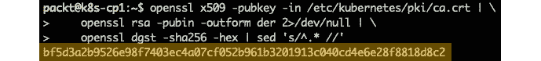

图 14.21 -获取 CA 证书哈希值

你也可以通过下面的命令生成一个新的引导令牌:

```sh
kubeadm token create
```

如果你选择生成一个新的令牌，你可以使用下面的流线型命令打印出完整的`kubeadm join`命令和所需的参数:

```sh
kubeadm token create --print-join-command
```

在接下来的步骤中，我们将使用引导过程末尾的输出中显示的初始令牌。 因此，让我们切换到节点的命令行终端(在`k8s-n1`上)并运行以下命令:

1.  Make sure to invoke `sudo`, or the command will fail with insufficient permissions:

    ```sh
    sudo kubeadm join 172.16.191.6:6443 \
        --token abcdef.0123456789abcdef \
        --discovery-token-ca-cert-hash sha256:bf5d3a2b9526e 98f7403ec4a07cf052b961b3201913c040cd4e6e28f8818d8c2
    ```

    该命令通常在几秒钟内完成，输出如下(摘录):

    

    图 14.22 -加入一个节点到集群

2.  As the output suggests, we can check the status of the current nodes in the cluster with the following command in the Control Plane node terminal (`k8s-cp1`):

    ```sh
    kubectl get nodes
    ```

    输出显示了添加到集群的新节点(`k8s-n1`):

    

    图 14.23 -添加到集群的新节点(k8 -n1

3.  We encourage you to repeat the process of joining the other two cluster nodes (`k8s-n2` and `k8s-n3`). During the join, while the Control Plane Pods are being deployed on the new node, you may temporarily see a `NotReady` status for the new node if you query the nodes on the Control Plane node (`k8s-cp1`):

    ```sh
    kubectl get nodes --watch
    ```

    调用`--watch`选项会不断刷新输出:


图 14.24 -连接节点时的临时 NotReady 状态

最后，我们应该在`kubectl get nodes`命令(在`k8s-cp1`控制平面节点上)的输出中显示`Ready`的所有三个节点:

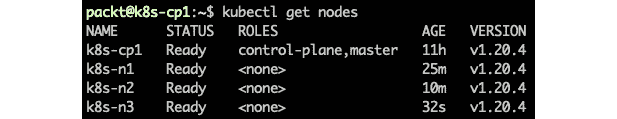

图 14.25 -所有节点都在运行的 Kubernetes 集群

我们完成了 Kubernetes 集群的安装，使用一个 Control Plane 节点和三个 worker 节点。 我们使用本地(本地)VM 环境，但同样的过程也适用于运行在私有或公共云中的托管 IaaS 解决方案。

接下来，我们将把*管理的*Kubernetes 服务作为主要云提供商提供的 SaaS 产品。

## 在云中运行 Kubernetes

托管的Kubernetes 服务在公共云提供商中相当常见。 下面是 Kubernetes 在中提供的一些主要云产品:

*   Amazon**Elastic Kubernetes Service**(**EKS**:[https://docs.aws.amazon.com/eks/index.html](https://docs.aws.amazon.com/eks/index.html)
*   **Azure Kubernetes Service**(**AKS**):[https://azure.microsoft.com/en-us/services/kubernetes-service/](https://azure.microsoft.com/en-us/services/kubernetes-service/)
*   **谷歌 Kubernetes Engine**(**GKE**):[https://cloud.google.com/kubernetes-engine](https://cloud.google.com/kubernetes-engine)

在本节中，我们将重点关注使用 Amazon EKS 和 Microsoft AKS 的 Kubernetes 部署。 部署托管 Kubernetes 集群的过程基本上是相同的，不管云提供商是谁:

*   使用 CLI 或 web 管理控制台与云提供商进行身份验证。
*   部署 Kubernetes 集群。
*   下载集群`kubeconfig`文件。
*   使用`kubectl`对 API 服务器进行身份验证，并与集群进行交互。

如果你想尝试本节中的实践示例，你需要有一个 AWS 和一个 Azure 帐户。 两个云提供商都提供免费订阅:

*   AWS Free Tier:[https://aws.amazon.com/free](https://aws.amazon.com/free)
*   Microsoft Azure 免费账号:[https://azure.microsoft.com/en-us/free/](https://azure.microsoft.com/en-us/free/)

让我们首先在 Amazon EKS 上创建一个 Kubernetes 集群。

### 展开前顾

我们假设您有一个 AWS 帐户，并在本地 Linux 桌面上安装了 AWS CLI。 相关说明请参见[*第 13 章*](13.html#_idTextAnchor239)*使用 AWS 和 Azure 部署到云*中的*Working with the AWS CLI*部分。

在本节中，我们将使用 RHEL/CentOS 系统与 Amazon EKS 交互。 操作系统或 Linux 发行版是无关紧要的，因为有用于与集群通信的**AWS**和`kubectl`CLI 抽象，而相同的步骤将适用于任何其他平台。

重要提示

在部署带有 EKS 的 Kubernetes 集群之前，我们需要将**Amazon EKS 集群 IAM 角色**分配到我们的 AWS 帐户。 请参照[https://docs.aws.amazon.com/eks/latest/userguide/service_IAM_role.html#create-service-role](https://docs.aws.amazon.com/eks/latest/userguide/service_IAM_role.html#create-service-role)的相关说明。

启用了所需的 EKS 集群 IAM 角色后，我们可以通过以下两种方式在 EKS 中部署 Kubernetes 集群:

*   **AWS web 控制台**
*   【t】aws cli
*   `eksctl`

创建 EKS 集群最简单的方法是使用`eksctl`命令行实用程序—Amazon EKS:[https://docs.aws.amazon.com/eks/latest/userguide/eksctl.html](https://docs.aws.amazon.com/eks/latest/userguide/eksctl.html)的官方 CLI。

现在让我们下载并安装`eksctl`到我们的 Linux 系统:

```sh
curl --silent --location "https://github.com/weaveworks/eksctl/releases/latest/download/eksctl_$(uname -s)_amd64.tar.gz" | tar xz -C /tmp
sudo mv /tmp/eksctl /usr/local/bin/
```

您可以通过调用相关的帮助来探索`eksctl`的功能:

```sh
eksctl help
```

`eksctl`专注于在 Amazon EKS 上部署和拆除 Kubernetes 集群，同时自动化 AWS 中相关的云资源管理任务。 `eksctl`不是像`kubectl`那样的 Kubernetes 集群管理工具。 在端到端集群管理工作负载中，这两个 CLI 实用程序最好是互补的。

接下来，通过观察 Linux 安装指令[https://kubernetes.io/docs/tasks/tools/install-kubectl-linux/](https://kubernetes.io/docs/tasks/tools/install-kubectl-linux/)，在系统上安装`kubectl`:

```sh
curl -LO "https://dl.k8s.io/release/$(curl -L -s https://dl.k8s.io/release/stable.txt)/bin/linux/amd64/kubectl"
sudo install -o root -g root -m 0755 kubectl /usr/local/bin/kubectl
```

如果没有安装`kubectl`，`eksctl`仍然可以工作，但是会警告我们集群管理能力有限。

要在 EKS 上创建一个 Kubernetes 集群，我们运行以下命令:

```sh
eksctl create cluster \
    --name k8s-packt \
    --nodes 2 \
    --node-volume-size 20 \
    --region us-west-2 \
    --managed
```

让我们简要地解释一下前面命令的每个部分:

*   `eksctl create cluster`:在 Amazon EKS 上创建 Kubernetes 集群
*   `--name k8s-packt`:集群名称(`k8s-packt`)
*   `--nodes 2`:集群中的节点数(默认值为 2)
*   `--node-volume-size 20`:节点的卷大小，单位为 GB(默认为 80gb)
*   `--region us-west-2`:集群部署的地理位置
*   `--managed`:在集群中创建一个 eks 管理的节点组(用于自动更新等)

该命令可能需要 15 分钟才能完成，有时甚至更长。 它将创建和部署所需的所有为集群资源,包括**虚拟私有云**(**VPC**),安全组,网络,**弹性 IP**(**EIP【显示】),集群节点 EC2 实例。**

完成后，命令输出将显示关于我们的集群的一些相关信息，包括集群节点的状态和`kubeconfig`文件的位置:


图 14.26 -在 EKS 上创建 Kubernetes 集群

我们可以立即使用`kubectl`与我们的 EKS 集群交互。 确保我们当前的`kubeconfig`上下文在 EKS 集群上设置:

```sh
kubectl config get-contexts
```

输出显示当前`kubeconfig`上下文的星号(`*`)，标记我们的 EKS 集群(`k8s-packt.us-west-2.eksctl.io`):

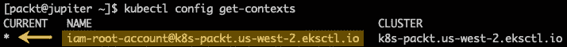

图 14.27 -检查当前 kubeconfig 上下文

下面的命令在从同一个`kubectl`终端管理多个 Kubernetes 集群时非常有用。 要将`kubeconfig`上下文切换到我们的 EKS 集群，我们运行以下命令:

```sh
kubectl config use-context \
    iam-root-account@k8s-packt.us-west-2.eksctl.io
```

下面让我们来看看我们的集群节点:

```sh
kubectl get nodes
```

输出显示了两个工作节点，而 Control Plane 节点隐藏在视图中。 这是因为控制平面完全由 EKS 管理:


图 14.28 -在 EKS 上检索集群节点

下面的命令列出了我们的 EKS 集群中的所有 pod:

```sh
kubectl get pods --all-namespaces
```

输出只显示了附加组件 pod，因为还没有部署用户 pod。 控制舱从视图中隐藏:

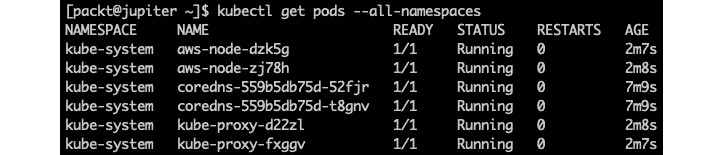

图 14.29 -在 EKS 上提取集群吊舱

要删除一个 EKS 集群，我们调用带有集群名称的`eksctl delete cluster`:

```sh
eksctl delete cluster --name k8s-packt
```

该命令将从 EKS 中删除我们的 Kubernetes 集群，并释放所有相关的云资源。

(我们现在还不删除集群。)

我们也可以在 AWS 控制台的**EKS 集群**视图中管理我们的集群:

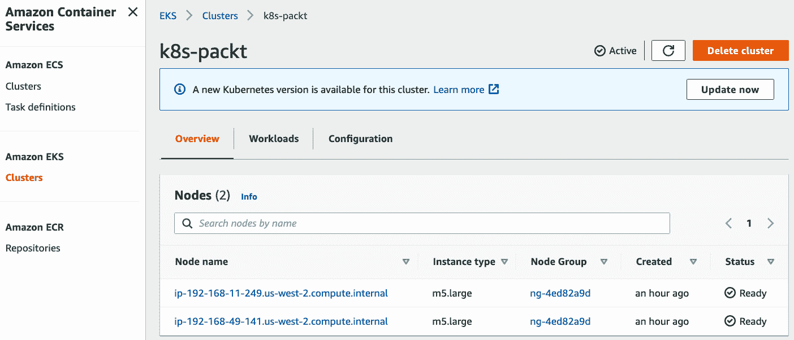

图 14.30 -在 AWS 控制台中管理 EKS 集群

在结束本节之前，让我们看看如何用EKS 集群信息更新`kubeconfig`。 也许我们在另一台机器上创建了 EKS 集群，并希望将所有集群管理合并到本地`kubectl`环境中。 或者，我们可能希望为集群管理使用不同的用户帐户或**身份和访问管理**(**IAM**)角色。 下面的小节提供了一种快速、简单的方法来完成这项任务。

### 连接 EKS 集群

假设我们使用旧系统创建了一个EKS 集群，并希望使用全新的笔记本电脑进行集群管理。 让我们将旧系统命名为*木星*，新笔记本电脑命名为*海王星*。 在 Neptune 上，我们已经管理 AKS 上的 Kubernetes 集群(我们将在下一节中查看)。 在选择 EKS 和 AKS 集群上下文时，最好在 Neptune 的`kubeconfig`上同时拥有两个集群管理端点。

我们将首先在 Neptune 上安装 AWS CLI。 接下来，我们使用以下命令配置本地 AWS 环境:

```sh
aws configure
```

相关过程被描述在*使用 AWS CLI*的[*第十三章*](13.html#_idTextAnchor239),*部署到云与 AWS 和 Azure*。 如果您使用的 AWS 帐户与 Jupyter 环境中的不同，请确保它启用了 Amazon EKS 集群角色并能够访问集群资源。

我们现在已经准备好更新海王星上的`kubeconfig`与 EKS 集群背景。 假设我们之前创建的 EKS 集群(`k8s-packt`)，命令如下:

```sh
aws eks update-kubeconfig \
    --name k8s-packt \
    --region us-west-2
```

让我们来看看当前的`kubeconfig`上下文:

```sh
kubectl config get-contexts
```

输出显示本地`kubeconfig`文件包含我们的 Amazon EKS 集群，并且它也是当前(默认)上下文:


图 14.31 -使用 EKS 集群上下文更新 kubeconfig

现在，我们可以在相同的`kubectl`环境中管理 EKS 和 AKS 上的两个集群。 EKS 集群的上下文名称包含集群的**Amazon 资源名称**(**ARN**)。 让我们把它重命名为更用户友好的东西(`k8s-packt-eks`):

```sh
kubectl config rename-context \
    arn:aws:eks:us-west-2:106842557074:cluster/k8s-packt \
    k8s-packt-eks
```

如果我们查询本地的`kubeconfig`文件，输出显示更新的 EKS 集群上下文:


图 14.32 -重命名 EKS 集群上下文

在我们可能的场景中，我们将`kubeconfig`环境整合到一个新机器(Neptune)上，用于管理 EKS 和 AKS 集群。 我们假设 Neptune 已经配置了 AKS 集群管理。 让我们回到过去，在 AKS 上创建一个 Kubernetes 集群。

### 展开 Kubernetes 的 AKS

在本节中，我们假设您在本地 Linux 桌面上安装了 AzureCLI。 相关说明请参考[*第 13 章*](13.html#_idTextAnchor239)、*使用 AWS 和 Azure 部署到云*中的*使用 Azure CLI*部分。

我们将使用安装了 Azure CLI 并配置了免费(试用)Azure 帐户的 Ubuntu 机器。 在终端，首先登录你的 Azure 账户:

```sh
az login
```

按照上一节中描述的验证步骤进行操作。 成功登录后，我们将继续为 Kubernetes 服务创建一个资源组(`k8s-packt`):

```sh
az group create --name "k8s-packt" --location westus
```

我们为资源指定了我们的本地地理位置(`westus`)。 你可以使用你选择的区域。 如果资源组创建成功，我们应该在命令输出中看到`"provisioningState": "Succeeded"`:


图 14.33 -在 Kubernetes 集群上创建资源

接下来，我们查询我们位置可用的Kubernetes版本:

```sh
az aks get-versions --location westus -o table
```

输出显示了可用的 Kubernetes 版本，以及 Azure 支持的相应升级:


图 14.34 -获取 Kubernetes 版本的位置

我们可以为 Kubernetes 集群选择一个特定的版本，或者让 Azure 选择默认值。 下面的命令创建一个名为`k8s-packt`的集群，其中有两个节点使用默认的 Kubernetes 版本:

```sh
az aks create \
    --resource-group "k8s-packt" \
    --name "k8s-packt" \
    --generate-ssh-keys \
    --node-count 2
```

下面是该命令和相关参数的简要说明:

*   `az aks create`:在 AKS 中创建 Kubernetes 集群
*   `--resource-group`:Kubernetes 集群所属的资源组(`k8s-packt`)
*   `--name`:Kubernetes 集群的名称(`k8s-packt`)
*   `--generate-ssh-keys`:创建用于访问集群节点的 SSH 密钥对
*   `--node-count`:集群中的节点数(`2`)

我们可以选择使用`--kubernetes-version`参数指定 Kubernetes 版本。

命令可能需要几分钟才能完成。 我们应该在成功部署的相关 JSON 输出中看到`"provisioningState": "Succeeded"`。 在其他相关数据中，我们还可以看到我们的集群的 Kubernetes 版本(`"kubernetesVersion": "1.18.14"`)。

以下步骤需要使用`kubectl`命令行实用程序。 我们假设您已经在您的系统上安装了它。 如果没有，你可以按照[https://kubernetes.io/docs/tasks/tools/#kubectl](https://kubernetes.io/docs/tasks/tools/#kubectl)的说明或者使用 Azure CLI 安装`kubectl`:

```sh
az aks install-cli
```

`kubectl`需要访问我们 AKS 集群的 API 服务器端点。 为此，我们必须将相关的`kubeconfig`下载到我们的本地系统中。 下面的命令检索集群凭据并将远程`kubeconfig`合并到本地环境中。 然后使用本地`kubeconfig`连接到远程 AKS 集群，使用基于证书的用户身份验证:

```sh
az aks get-credentials \
    --resource-group "k8s-packt" \
    --name "k8s-packt"
```

提示`k8s-packt`集群的远端`kubeconfig`已经与`/home/packt/.kube/config`中当前用户的配置合并:


图 14.35 -将远程 kubeconfig 与本地环境合并

现在，让我们检索当前用户的`kubeconfig`上下文:

```sh
kubectl config get-contexts
```

正如预期的那样，输出显示`k8s-packt`是我们管理的唯一的 Kubernetes集群。 星号(`*`)将其标记为当前的`kubeconfig`上下文:


图 14.36 -获取当前 kubeconfig 上下文

在管理多个 Kubernetes 集群的情况下，前面的列表将显示各种条目。 有多个配置可供选择，我们可以使用以下命令将当前的`kubeconfig`上下文切换到`k8s-packt`集群:

```sh
kubectl config use-context k8s-packt
```

现在，所有的`kubectl`命令都指向 AKS 中的`k8s-packt`集群。 让我们检索集群节点:

```sh
kubectl get nodes
```

输出显示了我们 AKS 集群的两个 worker 节点:


图 14.37 -获取 AKS 集群的节点

我们应该注意到，没有列出 Control Plane 节点。 这是因为 Azure 隐藏了相关信息，原因很明显，即控制平面是在云中专门管理的，我们不应该篡改它。 pod 也是如此。 由于还没有部署用户 pod，下面的命令将只显示我们 AKS 集群的附加 pod:

```sh
kubectl get pods --all-namespaces
```

没有在输出中列出的控制平面 pod:

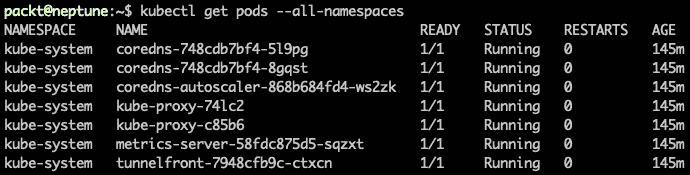

图 14.38 -获取 AKS 集群的 pod

您可以将前面的输出与本章前面*在虚拟机上*节中描述的本地集群的相应结果进行比较。

要删除 AKS 集群(`k8s-packt`)，释放相关云资源，可以执行如下命令:

```sh
az aks delete \
    --resource-group "k8s-packt" \
    --name "k8s-packt"
```

(我们现在还不删除集群。)

到目前为止，我们只使用 Azure CLI 和`kubectl`与 AKS 交互。 我们也可以使用 Azure web portal 在 Kubernetes services**视图中管理我们的`k8s-packt`集群:**

 **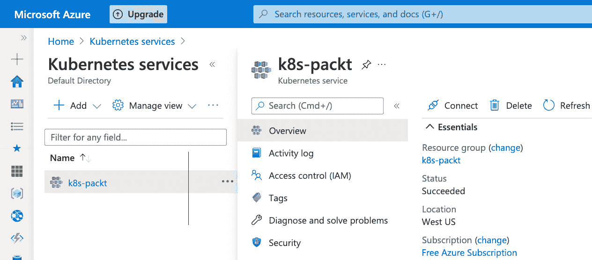

图 14.39 -在 Azure 门户中管理 AKS 集群

现在，让我们考虑的一个假想场景，在这个场景中，我们希望将当前的 AKS 集群管理上下文带到一个不同的机器上，以管理多个 Kubernetes 集群，这些集群可能运行在其他云或本地。

我们将在本章前面的*连接到一个 EKS 集群*一节中参考木星和海王星机器的例子。 假设我们最初使用 Neptune 创建 AKS 集群，但计划使用 Jupyter 作为我们的合并集群管理终端。 木星已经配置了一个 EKS 集群。 让我们来看看如何连接到木星上的 AKS 集群，并管理 EKS 和 AKS 中的 Kubernetes 环境。

### 连接到 AKS 集群

首先，我们需要下载并安装 Azure CLI 到木星上。 在 Azure CLI 就绪后，我们使用`az login`来使用 Azure 进行身份验证。 我们在[*第 13 章*](13.html#_idTextAnchor239)，*部署到云与 AWS 和 Azure*中*使用 Azure CLI*部分描述了相关步骤。

接下来，我们检索 AKS 集群(`k8s-packt`)的访问凭据:

```sh
az aks get-credentials \
  --name k8s-packt \
  --resource-group k8s-packt
```

前面的命令将 AKS 集群的配置与我们本地的`kubeconfig`合并:

```sh
kubectl config get-contexts
```

结果显示，AKS 中有`k8s-packt`组，EKS 中有`k8s-packt-eks`组。 AKS 集群上下文目前是活跃的，如星号(`*`)所示:


图 14.40 -使用 AKS 集群上下文更新 kubeconfig

为了一致性，我们将 AKS 集群上下文重命名为`k8s-packt-aks`，以更好地反映云环境:

```sh
kubectl config rename-context k8s-packt k8s-packt-aks
```

更新后的`kubeconfig`上下文产生以下输出:

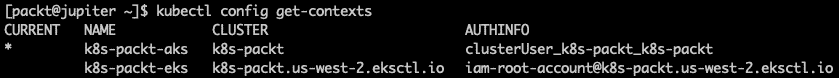

图 14.41 - AKS 和 EKS 相邻的集群上下文

通过我们相对简短的对 EKS 和 AKS 的报道，我们应该注意到，我们只是接触到了在云中部署和管理 Kubernetes 集群的表层。 然而，我们现在正处于一个重要的里程碑，我们在云和本地部署了第一个 Kubernetes 集群。 您熟悉了 Kubernetes 集群架构及其主要系统组件。 我们介绍了`kubeadm`和`kubectl`CLI 工具来与集群交互。 现在，是时候把这些知识应用到一些好的用途上了，并更密切地关注与 Kubernetes 的合作。

在下一节中，我们将深入探讨`kubectl`CLI，并使用它来创建和管理 Kubernetes 资源。 然后，我们将研究如何使用 Kubernetes 中的命令式和声明式部署模型来部署和扩展应用程序。

# 与 Kubernetes 合作

在本节中，我们将使用与 Kubernetes 集群交互的真实示例。 由于我们将在相当大的程度上使用`kubectl`CLI，因此我们将深入研究它的一些更常见的使用模式。 然后，我们将重点放在将应用程序部署到 Kubernetes 集群上。 我们将使用在*在虚拟机上安装 Kubernetes*一节中构建的本地环境。

让我们先来仔细看看`kubectl`及其用法。

## 使用 kubectl

`kubectl`是管理 Kubernetes 集群及其资源的主要工具。 `kubectl`使用 Kubernetes REST API 与集群的 API 服务器端点通信。 `kubectl`命令的一般语法如下:

```sh
kubectl [command] [TYPE] [NAME] [flags]
```

一般来说,`kubectl`**命令执行 CRUD 操作**——*创造*,*读*,*更新【显示】,*和*删除,对 Kubernetes【病人】*资源,如豆荚、部署和服务。**

`kubectl`的基本特性之一是命令输出格式，可以是 YAML、JSON 或纯文本格式。 在创建或编辑应用程序部署清单时，输出格式非常方便。 我们可以将`kubectl`命令(例如创建资源)的 YAML 输出捕获到文件中。 稍后，我们可以重用清单文件以*声明式*的方式执行相同的操作(或操作序列)。 这让我们想到 Kubernetes 的两种基本部署模式:

*   **强制部署**:调用单个或多个`kubectl`命令对特定资源进行操作
*   **声明式部署**:使用*清单文件*和*使用`kubectl apply`命令部署*清单文件，通常针对使用单一调用的一组资源

我们将在本章后面的*部署应用程序*一节中更仔细地研究这两种部署模型。 现在，让我们回过头来进一步探讨`kubectl`命令。

下面是一些最常见的`kubectl`命令:

*   `create`，`apply`:命令式/声明式创建资源
*   `get`:读取资源
*   `edit`、`set`:更新资源或对象的特定特性
*   `delete`:删除资源
*   `run`:启动 Pod
*   `exec`:在 Pod 容器中执行命令
*   `describe`:显示资源的详细信息
*   `explain`:提供资源相关文档
*   `logs`:显示 Pod 容器中的日志

`kubectl`命令的两个常用的选项参数也值得一提:

*   `--dry-run`:在不修改系统状态的情况下运行命令，同时仍然提供正常执行的输出
*   `--output`:指定命令输出的各种格式:`yaml`、`json`和`wide`(其他纯文本信息)

在下面几节中，我们将研究使用`kubectl`命令的多个示例。 始终记住命令的一般模式:


图 14.42 - kubectl 的一般使用模式

我们建议您在[https://kubernetes.io/docs/reference/kubectl/overview/](https://kubernetes.io/docs/reference/kubectl/overview/)查看完成`kubectl`命令参考。 当你对`kubectl`越来越熟练的时候，你也可以把相关的备忘单放在手边:[https://kubernetes.io/docs/reference/kubectl/cheatsheet/](https://kubernetes.io/docs/reference/kubectl/cheatsheet/)。

现在，让我们准备我们的`kubectl`环境，以便与前面用虚拟机构建的 Kubernetes 集群交互。 如果您更喜欢在 Control Plane 节点上使用`kubectl`，您可以跳过下一节。

### 正在连接 Kubernetes 集群

在本节中，我们将配置在 Linux 桌面本地运行的`kubectl`CLI，以控制远程 Kubernetes 集群。 您可能还记得，我们的整合`kubeconfig`还包括 EKS 和 AKS 集群上下文。 我们还想在环境中添加(合并)另一个集群配置。 这一次，我们连接到一个本地的 Kubernetes 控制平面，并且我们将使用`kubectl`来更新`kubeconfig`。

以下是我们将采取的步骤:

*   备份当前的`kubeconfig`
*   将远程`kubeconfig`复制到临时位置
*   使用`kubectl`将当前的和新的`kubeconfig`合并到一个临时文件中
*   用更新的文件替换现有的`kubeconfig`
*   清理临时文件

让我们首先在本地 Linux 环境中备份当前的`kubeconfig`:

```sh
cp ~/.kube/config ~/.kube/config.old
```

接下来，我们从控制平面节点(`k8s-cp1`，`172.16.191.6`)复制`kubeconfig`到一个临时位置`(/tmp/config.cp`:

```sh
scp packt@172.16.191.6:~/.kube/config /tmp/config.cp
```

现在，让我们将当前的`kubeconfig`(`.kube/config`)与刚才复制的(`/tmp/config.cp`)合并到一个临时文件(`/tmp/config.new`):

```sh
KUBECONFIG=~/.kube/config:/tmp/config.cp \
    kubectl config view --flatten > /tmp/config.new
```

最后，我们用新的`kubeconfig`替换当前的`kubeconfig`:

```sh
mv /tmp/config.new ~/.kube/config
```

或者，我们可以清理进程中创建的临时文件:

```sh
rm ~/.kube/config.old /tmp/config.cp
```

让我们来看看当前的`kubeconfig`上下文:

```sh
kubectl config get-contexts
```

输出显示了我们新的 Kubernetes 集群，以及相关的安全主体([kubernetes-admin@kubernetes](mailto:kubernetes-admin@kubernetes))和集群名称(`kubernetes`):

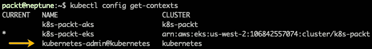

图 14.43 -新的 kubeconfig 上下文，包括本地 Kubernetes 集群

我们还可以看到当前上下文被设置为 AWS EKS 集群(`k8s-packt-eks`)。 为了保持一致性，让我们将本地集群的上下文名称改为`k8s-packt`，并使其成为`kubectl`环境中的默认上下文:

```sh
kubectl config rename-context \
    kubernetes-admin@kubernetes \
    k8s-packt
kubectl config use-context k8s-packt
```

当前的`kubectl`上下文变成了`k8s-packt`，我们现在正在与我们的本地 Kubernetes 集群(`kubernetes`)交互:


图 14.44 -当前上下文设置为本地 Kubernetes 集群

接下来，我们来看一下日常 Kubernetes 管理任务中使用的一些最常见的`kubectl`命令。

### 使用 kubectl

当连接到 Kubernetes 集群时，我们运行的第一个命令如下:

```sh
kubectl cluster-info
```

该命令显示在 Control Plane 节点上监听的 API 服务器的 IP 地址和端口，以及其他信息:

```sh
Kubernetes control plane is running at https://172.16.191.6:6443
```

`cluster-info`命令还可以帮助调试和诊断集群相关问题:

```sh
kubectl cluster-info dump
```

要获取集群节点的详细视图，我们运行以下命令:

```sh
kubectl get nodes --output=wide
```

`--output=wide`(或`-o wide`)标志可以获得关于集群节点的详细信息。 由于空间限制，下图中的输出被裁剪:


图 14.45 -获取集群节点的详细信息(裁剪)

下面的命令检索在默认命名空间中运行的 Pods:

```sh
kubectl get pods
```

到目前为止，我们没有运行任何用户 Pods，该命令返回如下:

```sh
No resources found in default namespace.
```

为了列出所有 pod，我们将`--all-namespaces`标记添加到前面的命令中:

```sh
kubectl --get pods --all-namespace
```

输出显示所有 Pods在系统中运行。 由于这些都是系统 pod，它们与`kube-system`命名空间相关联:


图 14.46 -在系统中获取所有 pod

如果使用`--namespace`标志指定`kube-system`，则会得到相同的输出:

```sh
kubectl get pods --namespace kube-system
```

为了全面了解系统中运行的所有资源，我们运行以下命令:

```sh
kubectl get all --all-namespaces
```

到目前为止，我们只提到了一些比较常见的对象类型，比如节点、Pods 和 Services。 还有很多其他的，我们可以用下面的命令来查看它们:

```sh
kubectl api-resources
```

输出包括 API 对象类型的名称(如`nodes`)、它们的短名称或别名(如`no`)，以及它们是否可以被组织成名称空间(如`false`):


图 14.47 -获取所有 API 对象类型

假设您想了解更多关于特定 API 对象的信息，比如`nodes`。 下面是`explain`命令派上用场的地方:

```sh
kubectl explain nodes
```

输出提供了关于`nodes`API 对象类型的详细文档，包括相关的 API 字段。 其中一个 API 字段是`spec`，它描述了对象的实现细节和行为。 您可以通过以下命令查看相关文档:

```sh
kubectl explain nodes.spec
```

我们鼓励您使用`explain`命令来了解集群中各种 Kubernetes API 对象类型。 请注意，`explain`命令提供了关于*资源类型*的*文档*。 不应将其与`describe`命令混淆，后者显示系统中*资源*的详细信息。

以下命令显示所有*节点的集群节点相关信息，特别是`k8s-n1`节点:*

```sh
kubectl describe nodes
kubectl describe nodes k8s-n1
```

对于每个`kubectl`命令，您可以调用`--help`(或`-h`)来获得特定于上下文的帮助。 下面是一些例子:

```sh
kubectl --help
kubectl config -h
kubectl get pods -h
```

`kubectl`CLI 的命令相对丰富，要精通它可能需要一段时间。 偶尔，你可能会发现自己在寻找一个特定的命令或记住它的正确拼写或使用。 `auto-complete`bash for`kubectl`来拯救。 接下来我们将向您展示如何启用此功能。

### 使 kubectl 自动完成

`kubectl`自动完成,你会得到上下文敏感的建议当你按*选项卡键两次(*选项卡*+*选项卡【显示】),输入`kubectl`命令。**

`kubectl`自动补全功能依赖于**bash 补全**。 大多数 Linux 平台默认启用了**bash 补全**。 否则，您将不得不手动安装相关的软件包。 例如，在 Ubuntu 上，你用以下命令安装它:

```sh
sudo apt-get install -y bash-completion
```

接下来，你需要在你的 shell(或类似的)配置文件中查找`kubectl`自动补全:

```sh
echo "source <(kubectl completion bash)" >> ~/.bashrc
```

这些更改将在您下次登录终端时生效，或者如果您源`bash`配置文件:

```sh
source ~/.bashrc
```

使用`kubectl`自动补全活动，当您在键入命令时按*Tab*+*Tab*，您将得到上下文敏感的建议。 例如，下面的序列提供了所有可用的资源，当你试图创建一个:

```sh
kubectl create [Tab][Tab]
```

自动补全会涉及语法的每个部分:命令、资源(类型、名称)和标志。

现在我们已经了解了更多关于使用`kubectl`命令的知识，现在是时候将注意力转向在 Kubernetes 中部署应用程序了。

## 部署应用程序

当我们介绍`kubectl`命令及其使用模式开始时使用 kubectl 的*部分,我们谈及 Kubernetes 创建应用程序资源的两种方式:*【显示】和*必须声明性*。 快速回顾一下，对于命令式部署，我们遵循`kubectl`命令的*序列*来创建所需的资源并达到所需的集群状态，比如运行应用程序。 声明式部署也可以实现同样的效果，通常使用一个描述多个资源的*清单*文件，使用单个`kubectl``apply`命令。**

在这一节中，我们将在部署一个简单的 web 应用程序时仔细研究这两种模型。 让我们先从命令式模型开始。

### 使用强制部署

让我们首先从创建一个*部署*开始。 根据我们从公共 Docker 注册表(`docker.io/nginxdemos/hello`)中提取的一个演示 Nginx 容器，我们将把我们的部署命名为`packt`:

```sh
kubectl create deployment packt --image=nginxdemos/hello
```

命令输出显示我们的部署已经成功创建:

```sh
deployment.apps/packt created
```

我们刚刚用 ReplicaSet 创建了一个部署，其中包含一个运行 web 服务器应用程序的 Pod。 我们应该注意到，我们的应用程序是由应用程序部署堆栈(`deployment.apps`)中的*控制器管理器*管理的。 或者，我们可以使用以下命令部署一个简单的应用程序 Pod(`packt-web`):

```sh
kubectl run packt-web --image=nginxdemos/hello
```

输出表明，我们的应用程序 Pod(在本例中为*独立*或*裸*Pod(`pod/packt-web`)不是部署的一部分:

```sh
pod/packt-web created
```

在本节的后面，我们将看到这个 Pod 不是 ReplicaSet 的一部分，因此不受 Controller Manager 的管理。 让我们通过查询 pod 来查看系统的状态，以获取详细信息:

```sh
kubectl get pods -o wide
```

让我们分析一下输出:


图 14.48 -获取包含详细信息的应用程序 pod

我们可以看到我们的 pod 已经启动并运行，Kubernetes 将它们部署在独立的节点上:

*   `packt-5dc77bb9bf-bnzsc`:集群节点`k8s-n2`
*   `packt-web`:集群节点`k8s-n1`

在不同的节点上运行 Pods 是由于 Kubernetes 集群中的内部负载平衡和资源分配。

控制器管理的应用 Pod 为`packt-5dc77bb9bf-bnzsc`。 Kubernetes 生成一个唯一的名称为我们管理舱通过附加一个*Pod 模板散列**(`5dc77bb9bf`)和 Pod ID*(`bnzsc`)部署的名称(`packt`)。 Pod 模板散列和 Pod ID 在 ReplicaSet 中是唯一的。

相反，独立 Pod(`packt-web`)保持原样，因为它不是应用程序部署的一部分。 让我们用*描述*两个豆荚来获得更多的信息。 我们将首先从托管 Pod 开始。 不要忘记使用`kubectl`自动补全(使用*Tab*+*Tab*):

```sh
kubectl describe pod packt-5dc77bb9bf-bnzsc
```

相关产量比较大。 下面是一些相关的片段:

*   Pod 运行的节点:

    ```sh
    Node: k8s-n2/172.16.191.9
    ```

*   荚果状态:

    ```sh
    Status: Running
    ```

*   豆荚内部 IP 地址:

    ```sh
    IP: 192.168.111.193
    ```

*   控制 Pod 的 ReplicaSet:

    ```sh
    Controlled By: ReplicaSet/packt-5dc77bb9bf
    ```

*   豆荚容器图像:

    ```sh
    Image: docker.io/nginxdemos/hello
    ```

相比之下，单独 Pod(`packt-web`)的相同命令在没有`Controlled By`字段的情况下会略有不同:

```sh
kubectl describe pod packt-web
```

下面是相应的摘录:

*   Pod 运行的节点:

    ```sh
    Node: k8s-n1/172.16.191.8
    ```

*   荚果状态:

    ```sh
    Status: Running
    ```

*   豆荚内部 IP 地址:

    ```sh
    IP: 192.168.215.66
    ```

*   豆荚容器图像:

    ```sh
    Image: docker.io/nginxdemos/hello
    ```

您还可以冒险到任何运行 pod 的集群节点，并仔细查看相关的容器。 让我们以节点`k8s-n1`(`172.15.191.8`)为例，其中运行的是独立 Pod(`packt-web`)。 我们先通过 SSH 进入节点的终端:

```sh
ssh packt@172.16.191.8
```

然后使用`containerd`运行时来查询系统中的容器:

```sh
sudo crictl --runtime-endpoint unix:///run/containerd/containerd.sock ps
```

输出如下所示:


图 14.49 -获取在集群节点上运行的容器

接下来，我们将向您展示如何访问在 Pods 中运行的进程。 让我们切换回本地的`kubectl`环境，并运行以下命令来访问运行`packt-web`Pod 的容器中的 shell:

```sh
kubectl exec -it packt-web -- /bin/sh
```

命令将容器中的*带到*交互式*shell 提示符。 在这里，我们可以像使用终端登录到`packt-web`主机一样运行命令。 交互式会话是使用`-it`选项—*交互式终端*—或`--interactive --tty`生成的。*

让我们运行几个命令，从进程管理器开始:

```sh
ps aux
```

下面是输出的相关摘录，显示了在`packt-web`容器内运行的进程:


图 14.50 -在数据包 web 容器内运行的进程

我们也可以用下面的命令来检索 IP 地址:

```sh
ifconfig | grep 'inet addr:' | cut -d: -f2 | awk '{print $1}' | grep -v '127.0.0.1'
```

输出显示了 pod 的 IP 地址:

```sh
192.168.215.66
```

我们也可以用以下命令检索主机名:

```sh
hostname
```

输出显示 Pod 名称:

```sh
packt-web
```

让我们用`exit`命令离开容器外壳，或者输入*Ctrl*+*D*。 使用`kubectl``exec`命令，我们可以运行 Pod 内的任何进程，假设存在相关进程。

接下来我们将使用`curl`测试`packt-web`应用 Pod。 我们应该注意到，此时访问`packt-web`的 web 服务器端点的唯一方法是通过其内部 IP 地址。 以前，我们使用`kubectl``get pods -o wide`和`describe`命令检索关于 pod 的详细信息，包括 pod 的 IP 地址。 你也可以使用下面的一行代码来获取吊舱的 IP:

```sh
kubectl get pods packt-web -o jsonpath='{.status.podIP}{"\n"}'
```

在我们的例子中，该命令返回`192.168.215.66`。 我们使用`-o jsonpath`输出选项为特定字段`{.status.podIP}`指定 JSON 查询。 请记住，该 pod 的 IP 只能在集群内的*pod 网络*(`192.168.0.0/16`)中访问。 (您可以回顾一下*创建 Kubernetes 控制平面节点*一节，其中我们使用 Pod 网络子网配置了 Calico 网络清单。)

因此，我们需要使用源于 Pod 网络的`curl`命令探测`packt-web`端点。 完成这类任务的一种简单方法是运行带有`curl`实用程序的`test`*Pod*。 下面的命令运行基于`curlimg/curl`Docker 映像的`test`Pod:

```sh
kubectl run test --image=curlimg/curl sleep 600
```

由于对应映像的 Docker*入口点*，我们使用`sleep`命令人为地保持容器*活着，该命令只运行`curl`命令，然后退出。 没有了`sleep`，荚果会不断地冒出来并崩溃。 使用`sleep`命令，我们延迟`curl`入口点的执行，以避免退出。*

 *现在，我们可以使用`test`Pod 针对`packt-web`web 服务器端点运行一个简单的`curl`命令:

```sh
kubectl exec test -- curl http://192.168.215.66
```

我们将得到一个 HTTP 响应和一个相应的*访问日志跟踪*(来自 Pod 中运行的 Nginx 服务器)来记录这个请求。 要查看`packt-web`Pod 上的日志，我们运行以下命令:

```sh
kubectl logs packt-web
```

输出为，如下:

```sh
192.168.57.200 - - [21/Mar/2021:04:52:16 +0000] "GET / HTTP/1.1" 200 7232 "-" "curl/7.75.0-DEV" "-"
```

`packt-web`Pod 的日志由 Nginx 产生并重定向到`stdout`和`stderr`。 我们可以很容易地用以下命令来验证这一点:

```sh
kubectl exec packt-web -- ls -la /var/log/nginx
```

输出显示了相关的符号链接:

```sh
access.log -> /dev/stdout
error.log -> /dev/stderr
```

当你使用完`test`Pod 后，你可以用下面的命令删除它:

```sh
kubectl delete pods test
```

现在，让我们回到以前创建`packt`部署时使用的命令。 不运行它。 这里只是作为一个复习:

```sh
kubectl create deployment packt --image=nginxdemos/hello
```

该命令执行的顺序如下:

1.  它创建了一个部署(`packt`)。
2.  部署创建了一个*ReplicaSet*(`packt-5dc77bb9bf`)。
3.  ReplicaSet 创建了 Pod(`packt-5dc77bb9bf-bnzsc`)。

我们可以通过以下命令来验证:

```sh
kubectl get deployments -l app=packt
kubectl get replicasets -l app=packt
kubectl get pods -l app=packt
```

在前面的命令中，我们使用`--label-columns (-l)`标志通过`app=packt`标签过滤结果，这表示`packt`部署的资源。

我们鼓励您使用`kubectl describe`命令仔细查看这些资源。 在输入命令时不要忘记使用`kubectl`自动补全功能:

```sh
kubectl describe deployment packt | more
kubectl describe replicaset packt | more
kubectl describe pod packt-5dc77bb9bf-bnzsc | more
```

在诊断应用程序或Pod 部署时，`kubectl``describe`命令可能非常有用。 查看相关输出中的*Events*部分，查找 pod 未能启动的线索、错误(如果有的话)，并可能理解出了什么问题。

现在我们已经在 Kubernetes 集群中部署了第一个应用程序，让我们看看如何公开相关的端点。

### 将部署公开为服务

到目前为止，我们已经部署了一个应用程序(`packt`)，使用单个 Pod(`packt-5dc77bb9bf-bnzsc`)运行一个在`80`端口上监听的 Nginx web 服务器。 正如前面所解释的，此时，我们只能在 Pod 网络中访问 Pod，该网络位于集群内部。 在本节中，我们将向您展示如何*公开*应用程序(或部署)，使其可以从外部访问。 Kubernetes 使用了*服务*API 对象，它包括一个*代理*和一个*选择器*，在部署中将网络流量路由到应用程序 Pods。

下面的命令为我们的部署(`packt`)创建一个服务:

```sh
kubectl expose deployment packt \
    --port=80 \
    --target-port=80 \
    --type=NodePort
```

下面是对前面命令标志的简要解释:

*   `--port=80`:在集群内对外暴露`80`端口上的服务
*   `--target-port=80`:映射到应用 Pod 内部的`80`端口
*   `--type=NodePort`:使服务在集群外可用

输出显示了我们刚刚为公开应用程序而创建的服务(`packt`):

```sh
service/packt exposed
```

如果没有`--type=NodePort`标志，服务类型默认为`ClusterIP`，并且服务端点只能在集群内访问。 让我们仔细看看我们的服务(`packt`):

```sh
kubectl get service packt
```

输出显示了分配给服务(`10.103.172.205`)的集群 IP和服务侦听 TCP 流量(`80:32081/TCP`)的端口:

*   port`80`:集群内
*   port`32081`:集群外部的任意节点上

我们应该注意到，集群 IP 只能在集群内部访问，不能从外部访问:


图 14.51 -服务公开包部署

另外，不应该将`EXTERNAL-IP`(`<none>`)误认为是可以访问我们的服务的集群节点的 IP 地址。 外部 IP 通常是由托管 Kubernetes 集群的云提供商配置的负载均衡器 IP 地址(通过`--external-ip`标志进行配置)。

现在我们应该能够通过将浏览器指向端口`32081`上的任何集群节点来访问集群外的应用程序。 要获取具有各自 IP 地址和主机名的集群节点列表，我们可以运行以下命令:

```sh
kubectl get nodes -o jsonpath='{range .items[*]}{.status.addresses[*].address}{"\n"}'
```

输出如下:

```sh
172.16.191.6 k8s-cp1
172.16.191.8 k8s-n1
172.16.191.9 k8s-n2
172.16.191.10 k8s-n3
```

让我们选择控制平面节点(`172.16.191.6/k8s-cp1`)，并在浏览器中输入以下地址:`http://172.16.191.6:32081`。

来自浏览器的 web 请求被定向到服务端点(`packt`)，它将相关的网络数据包路由到应用程序 Pod(`packt-5dc77bb9bf-bnzsc`)。 `packt`web 应用程序响应一个简单的**Nginx Hello World**网页，显示 pod 的内部 IP 地址(`192.168.111.193`)和名称(**packt-5dc77bb9bf-bnzsc**):

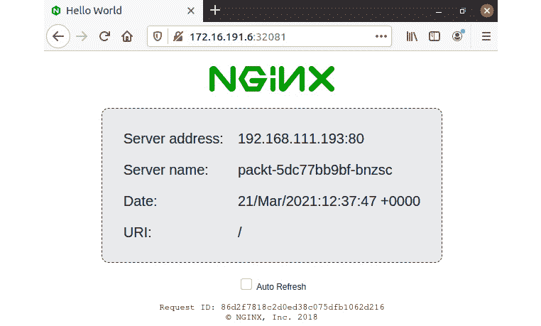

图 14.52 -访问数据包应用程序服务

为了验证 web 页面上的信息是否正确，您可以运行以下`kubectl`命令，检索类似的信息:

```sh
kubectl get pod packt-5dc77bb9bf-bnzsc -o jsonpath='{.status.podIP}{"\n"}{.metadata.name}{"\n"}'
```

假设我们的应用程序有很高的流量，并且我们想要扩展 ReplicaSet 来控制我们的 pod。 我们将在下一节中向您展示如何完成这项任务。

### 扩展应用程序部署

目前，我们在`packt`部署中有一个*单个*Pod。 要获取相关的详细信息，我们运行以下命令:

```sh
kubectl describe deployment packt
```

输出中的相关摘录如下:

```sh
Replicas:       1 current / 1 desired
```

让我们通过以下命令*将*的`packt`部署扩展到*10*`replicas`:

```sh
kubectl scale deployment packt --replicas=10
```

回显信息如下:

```sh
deployment.apps/packt scaled
```

如果我们列出`packt`部署的 pod，我们会看到 10 个 pod 在运行:

```sh
kubectl get pods -l app=packt
```

输出如下:


图 14.53 -扩展部署副本

到应用程序服务端点(`http://172.16.191.6:32081`)的传入请求将在 Pods 之间进行负载平衡。 为了说明这种行为，我们可以在命令行中使用`curl`或*基于文本的浏览器*来避免现代桌面浏览器的缓存相关优化。 为了更好地说明，我们将使用*Lynx*，这是一个简单的基于文本的浏览器。 在我们的 Ubuntu 桌面，我们用以下命令安装它:

```sh
sudo apt-get install -y lynx
```

接下来，我们将 Lynx 指向我们的应用程序端点:

```sh
lynx 172.16.191.6:32081
```

用*Ctrl+R*每隔几秒刷新一次页面，我们观察到服务器地址和名称发生了变化，这是基于当前处理请求的 Pod:

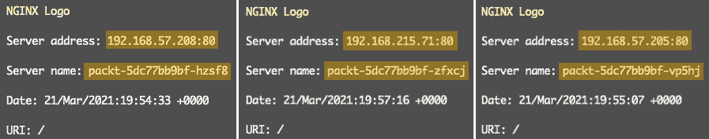

图 14.54 -跨 pod 的负载平衡请求

您可以输入*Q*，然后*输入*退出Lynx 浏览器。

我们可以使用以下命令将部署(`packt`)缩减为三个副本(或任何其他非零正数):

```sh
kubectl scale deployment packt --replicas=3
```

如果我们查询`packt`应用豆荚，我们可以看到剩余的豆荚终止，直到只剩下三个豆荚:

```sh
kubectl get pods -l app=packt
```

输出如下:


图 14.55 -缩放到三个 pod

在结束我们的紧急部署之前，让我们清理一下迄今为止创建的所有资源:

```sh
kubectl delete service packt
kubectl delete deployment packt
kubectl delete pod packt-web
```

下面的命令应该是一个干净的记录:

```sh
kubectl get all
```

输出如下:


图 14.56 -集群处于默认状态

在下一节中，我们将研究如何在 Kubernetes 集群中以声明方式部署资源和应用程序。

### 使用声明式部署

在声明式部署的核心是一个清单文件。 清单文件通常是 YAML 格式，编写它们通常需要混合使用自动生成的代码和手动编辑。 然后使用`kubectl``apply`命令部署清单:

```sh
kubectl apply -f MANIFEST
```

在 Kubernetes 中以声明方式部署资源包括以下几个阶段:

*   创建清单文件
*   更新清单
*   验证清单
*   部署清单
*   在前几个阶段之间迭代

为了说明声明式模型，我们遵循将一个简单的 Hello World web 应用程序部署到集群的示例。 其结果将类似于我们前面使用命令式方法的方法。

因此，让我们从为部署创建一个清单开始。

#### 创建一个清单

当我们命令式地创建`packt`部署*时，我们使用以下命令。 (先别运行它!)*

```sh
kubectl create deployment packt --image=nginxdemos/hello
```

下面的命令将*模拟*相同的进程，而不改变系统状态:

```sh
kubectl create deployment packt --image=nginxdemos/hello \
    --dry-run=client --output=yaml
```

我们使用了以下附加选项(标志):

*   `--dry-run=client`:在本地`kubectl`环境(*客户端*)运行，不修改系统状态
*   `--output=yaml`:将命令输出格式格式化为 YAML

我们可以使用前面命令的输出来分析要对系统进行的更改。 然后我们可以将其重定向到一个文件(`packt.yaml`)，作为我们部署清单的*草案*:

```sh
kubectl create deployment packt --image=nginxdemos/hello \
    --dry-run=client --output=yaml > packt.yaml
```

我们创建了第一个清单文件`packt.yaml`。 从这里开始，我们可以编辑文件以适应更复杂的配置。 现在，我们将保持清单不变，并继续进行声明式部署工作流的下一阶段。

#### 验证一个清单

在部署清单之前，我们建议验证部署，特别是如果您手动编辑文件的话。 编辑错误可能会发生，特别是在处理具有多个缩进级别的复杂 YAML 文件时。

下面的命令验证`packt.yaml`部署清单:

```sh
kubectl apply -f packt.yaml --dry-run=client
```

成功的验证会产生以下输出:

```sh
deployment.apps/packt created (dry run) 
```

如果有任何错误，我们应该编辑清单文件并在部署之前更正它们。 我们的清单看起来很好，那我们就开始部署吧。

#### 部署一个清单

为了部署`packt.yaml`清单，我们使用以下命令:

```sh
kubectl apply -f packt.yaml
```

成功部署将显示以下消息:

```sh
deployment.apps/packt created
```

我们可以使用以下命令检查已部署的资源:

```sh
kubectl get all -l app=packt
```

输出显示声明式创建的`packt`部署资源已经启动并运行:


图 14.57 -声明式创建的部署资源

接下来，我们希望使用服务公开我们的部署。 我们将通过创建、验证和部署服务清单(`packt-svc.yaml`)来重复前面的工作流。 为了简洁起见，我们只列举了相关的命令。

为公开部署(`packt`)的服务创建清单文件(`packt-svc.yaml`):

```sh
kubectl expose deployment packt \
    --port=80 \
    --target-port=80 \
    --type=NodePort \
    --dry-run=client --output=yaml > packt-svc.yaml
```

我们在前面的*将部署暴露为服务*一节中解释了前面的命令。 接下来，我们将验证服务部署清单:

```sh
kubectl apply -f packt-svc.yaml --dry-run=client
```

如果验证成功，我们将部署服务清单:

```sh
kubectl apply -f packt-svc.yaml
```

让我们看看`packt`资源的当前状态:

```sh
kubectl get all -l app=packt
```

输出显示了所有的`packt`应用程序资源，包括在`31168`端口上监听的服务端点(`service/packt`):

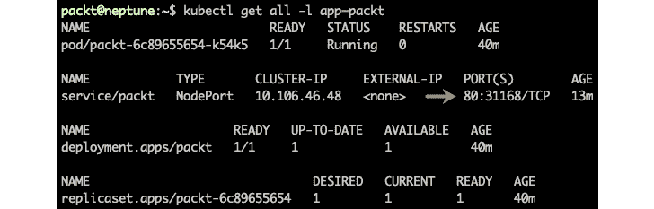

图 14.58 -部署的包应用程序资源

使用浏览器、`curl`或 Lynx，我们可以通过瞄准端口`31168`上的任何集群节点来访问应用程序。 让我们通过将浏览器指向`http://172.16.191:31168`来使用 Control Plane 节点(`k8s-cp1`，`172.16.191.6`):

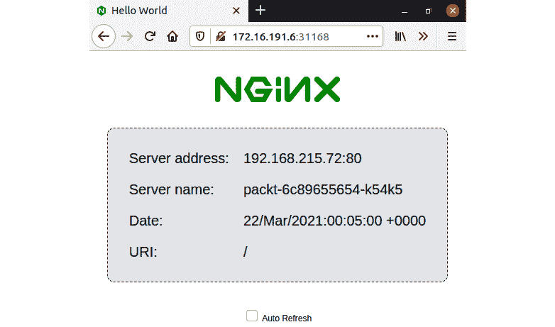

图 14.59 -访问包应用程序端点

如果我们想在应用程序部署中更改资源的现有配置，我们可以更新相关的清单并重新部署。 在下一节中，我们将修改部署以适应扩展场景。

#### 更新清单

假设我们的应用程序正在接受大量的请求，我们想要向部署中添加更多的 pod 来处理流量。 我们需要更改`packt.yaml`清单中的`spec.replicas`配置设置。

使用您选择的编辑器，编辑`packt.yaml`文件并找到以下配置部分:

```sh
spec:
  replicas: 1
```

将由`packt`部署控制的 ReplicaSet 中的其他应用程序 pod 的值从`1`更改为`10`。 配置结果如下:

```sh
spec:
  replicas: 10
```

保存清单文件并使用以下命令重新部署:

```sh
kubectl -f apply packt.yaml
```

输出表明`packt`部署已经被重新配置:

```sh
deployment.apps/packt configured
```

如果我们查询集群中的`packt`资源，我们应该会看到新的 Pods 启动并运行:

```sh
kubectl get all -l app=packt
```

输出显示了我们的`packt`部署的应用程序资源，包括部署在集群中的额外 pod:

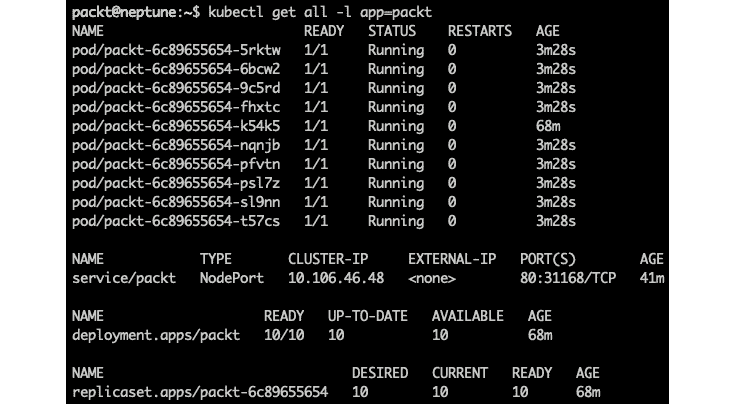

图 14.60 -为应用程序扩展添加了额外的 Pods

我们鼓励您使用扩展环境进行测试，并验证本章前面*伸缩应用程序部署*一节中描述的负载平衡工作负载。

让我们将部署缩减到三个 pod，但这次是通过使用以下命令更新相关的清单*:*

```sh
kubectl edit deployment packt
```

该命令将打开系统中的默认编辑器(**vi**)来进行所需的更改:


图 14.61 -动态地进行部署更改

在保存并退出编辑器后，我们将收到一条消息，提示我们的部署(`packt`)已经更新:

```sh
deployment.apps/packt edited
```

请注意，使用`kubectl``edit`*进行的动态修改不会在部署清单(`packt.yaml`)中反映*。 尽管如此，相关的配置更改仍然保存在集群中(`etcd`)。

我们可以通过以下命令来验证更新后的部署:

```sh
kubectl get deployment packt
```

现在的输出显示在我们的部署中只运行三个 pod:

```sh
NAME    READY   UP-TO-DATE   AVAILABLE   AGE
packt   3/3     3            3           101m
```

在结束之前，让我们再次用下面的命令清理我们的资源，使集群回到默认状态:

```sh
kubectl delete service packt
kubectl delete deployment packt
```

我们已经到达了旅程的终点，但我们相信您将把它提升到下一个层次，并进一步探索 Kubernetes 应用程序部署和扩展的激动人心的领域。 这是一个相对较长的章节，我们几乎没有掠过相关领域的表面。 我们鼓励您探索*中获取的一些资源，进一步阅读*部分，并加强您关于 Kubernetes 环境的一些关键领域的知识，例如网络、安全性和规模。 现在让我们简要总结一下本章所学的内容。

# 总结

本章开始时，我们对 Kubernetes 体系结构和 API 对象模型进行了高层次的概述，介绍了最常见的集群资源，如 pod、部署和服务。 接下来，我们承担了一个相对具有挑战性的任务，即使用虚拟机从头构建一个本地 Kubernetes 集群。 随着我们逐渐熟悉 Kubernetes 的内部架构，我们转移到云上，与 AWS 和 Azure 上的 EKS 和 AKS 托管集群服务合作。 我们探索了各种 CLI 工具，用于在云和本地管理 Kubernetes 集群资源。 在我们的旅程中，我们主要关注使用命令式和声明式部署场景在 Kubernetes 中部署和扩展应用程序。

我们相信，新手 Linux 管理员将从本章所涵盖的材料中获益良多，并在跨混合云和本地分布式环境管理资源、大规模部署应用程序以及使用 CLI 工具方面变得更有知识。 我们相信本章的结构化信息也将帮助经验丰富的系统管理员刷新他们在该领域的一些知识和技能。

我们将停留在应用程序部署领域内，在下一节中，我们将研究 Ansible，这是一个加速应用程序在本地和云端交付的平台。

# 问题

这里有一些问题，可以让你在本章学到的一些概念上有所更新或思考:

1.  列举 Kubernetes 控制平面节点的一些基本服务。 工作节点有何不同?
2.  我们使用什么命令来引导 Kubernetes 集群?
3.  管理 EKS 集群首选的 CLI 是什么? 管理 AKS 集群的 CLI 如何? 这些 CLI 工具与`kubectl`有什么不同?
4.  Kubernetes 中的命令式部署和声明式部署有什么区别?
5.  部署 Pod 的`kubectl`命令是什么? 如何创建一个部署?
6.  在 Pod 容器中访问 shell 的`kubectl`命令是什么?
7.  查询与部署相关的所有资源的`kubectl`命令是什么?
8.  您公开了使用*ClusterIP*服务类型的部署。 您可以访问 Kubernetes 集群之外的服务吗? 为什么?
9.  如何在 Kubernetes 扩展部署? 你能想出完成任务的不同方法(命令)吗?
10.  如何删除与 Kubernetes 部署相关的所有资源?

# 进一步阅读

以下资源可以帮助你进一步巩固你对 Kubernetes 的了解:

*   Kubernetes 文档在线:[https://kubernetes.io/docs/home/](https://kubernetes.io/docs/home/)
*   `kubectl`备忘单:[https://kubernetes.io/docs/reference/kubectl/cheatsheet/](https://kubernetes.io/docs/reference/kubectl/cheatsheet/)
*   Amazon EKS 入门:[https://docs.aws.amazon.com/eks/latest/userguide/getting-started.html](https://docs.aws.amazon.com/eks/latest/userguide/getting-started.html)
*   **Azure Kubernetes Service**(**AKS**):[https://docs.microsoft.com/en-us/azure/aks/](https://docs.microsoft.com/en-us/azure/aks/)
*   *Kubernetes 和码头工人:容器大师级[视频]*、*天蓝色帆布*,*Packt 出版*(【https://www.packtpub.com/product/kubernetes-and-docker-the-container-masterclass-video/9781801075084 T6】)
*   *掌握 Kubernetes——第三版*、*吉吉 Sayfan*,*Packt 出版*(【https://www.packtpub.com/product/mastering-kubernetes-third-edition/9781839211256 T6】)***********