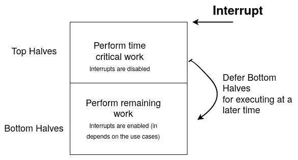

# 一、面向嵌入式开发人员的 Linux 内核概念

作为一个独立的软件，Linux 内核实现了一组功能，这些功能有助于避免重复发明轮子并简化设备驱动的开发。 这些帮助器的重要性在于，上游接受的代码不需要使用这些帮助器。 这是驱动依赖的内核。 我们将在本书中介绍这些核心功能中最流行的部分，尽管也存在其他功能。 在讨论如何保护共享对象和避免争用条件之前，我们将先看一下内核锁定 API。 然后，我们将研究各种可用的工作延迟机制，在这些机制中，您将了解在哪个执行上下文中延迟代码的哪一部分。 最后，您将了解中断是如何工作的，以及如何在 Linux 内核中设计中断处理程序。

本章将介绍以下主题：

*   内核锁定 API 和共享对象
*   工作延迟机制
*   Linux 内核中断管理

我们开始吧!

# 技术要求

要理解和遵循本章的内容，您需要以下内容：

*   具备高级计算机体系结构知识和 C 编程技能
*   Linux 内核 4.19 源代码，可从[https://github.com/torvalds/linux](https://github.com/torvalds/linux)获得

# 内核锁定 API 和共享对象

资源被称为，当它可以被多个竞争者访问时，而不考虑它们的独占。 当它们是独占的时，访问必须同步，以便只有被允许的竞争者才能拥有资源。 这些资源可能是内存位置或外围设备，而竞争者可能是处理器、进程或线程。 操作系统通过原子(即，通过可以中断的操作)修改保存资源当前状态的变量来执行互斥，使其对可能同时访问该变量的所有竞争者可见。 这种原子性保证了修改要么成功，要么根本不成功。 如今，现代操作系统依赖于用于实现同步的硬件(应该允许原子操作)，尽管一个简单的系统可以通过禁用关键代码段周围的中断(并避免调度)来确保原子性。

在本节中，我们将介绍以下两种同步机制：

*   **锁**：用于互斥。 当一个竞争者持有锁时，没有其他竞争者可以持有它(其他竞争者被排除在外)。 内核中最广为人知的锁定原语是自旋锁和互斥锁。
*   **条件变量**：主要用于检测或等待状态更改。 正如我们稍后将看到的，这些在内核中的实现方式不同，主要是在 Linux 内核部分的*等待、感测和阻塞中。*

当涉及到锁定时，这取决于硬件是否允许通过原子操作进行这样的同步。 然后内核使用它们来实现锁定功能。 同步基元是用于协调对共享资源的访问的数据结构。 因为只有一个竞争者可以持有锁(从而访问共享资源)，所以它可能会在与锁关联的资源上执行对其他竞争者看起来是原子的任意操作。

除了处理给定共享资源的独占所有权之外，还有更好的情况是等待资源的状态更改；例如，等待列表包含至少一个对象(其状态随后从空变为非空)或等待任务完成(例如，DMA 事务)。 Linux 内核不实现条件变量。 在我们的用户空间中，我们可以考虑对这两种情况使用条件变量，但为了实现相同甚至更好的效果，内核提供了以下机制：

*   **等待队列**：主要用于等待状态改变。 它被设计成与锁协同工作。
*   **完成队列**：用于等待给定计算完成。

这两种机制都受到 Linux 内核的支持，并且由于减少了组 API(这在开发人员使用时极大地简化了它们的使用)而向驱动公开。 我们将在接下来的几节中讨论这些问题。

## 自旋锁

自旋锁是一种基于硬件的锁定原语。 它依赖于手头硬件的能力来提供原子操作(例如`test_and_set`，在非原子实现中，这将导致读取、修改和写入操作)。 自旋锁本质上是在不允许休眠或根本不需要休眠的原子上下文中使用的(例如，在中断中，或者当您想要禁用抢占时)，但也用作 CPU 间锁定原语。

它是最简单的锁定原语，也是基础锁定原语。 它的工作方式如下：


图 1.1-自旋锁争用流

让我们来看看下面的场景：当正在运行任务 B 的 CPUB 由于 Spinlock 的锁定函数而想要获取 Spinlock，并且这个 Spinlock 已经被另一个 CPU 持有时(假设 CPUA 正在运行任务 A，该任务 A 已经调用了这个 Spinlock 的锁定函数)，那么 CPUB 将简单地围绕 While 循环旋转，从而阻塞任务 B，直到另一个 CPU 释放锁(任务 A 调用 Spinlock 的 Release 函数)。 这种旋转只会在多核机器上发生，这就是为什么前面描述的用例(因为它在单核机器上，涉及多个 CPU)不会发生：任务要么持有自旋锁并继续执行，要么在锁被释放之前不运行。 我过去常说，自旋锁是由 CPU 持有的锁，这与互斥体(我们将在下一节讨论这一点)相对，互斥体是由任务持有的锁。 自旋锁通过禁用本地 CPU(即运行调用自旋锁的锁定 API 的任务的 CPU)上的调度程序来运行。 这也意味着当前在该 CPU 上运行的任务不能被另一个任务抢占，除非 IRQ 没有被禁用(稍后将详细介绍)。 换句话说，自旋锁保护一次只有一个 CPU 可以使用/访问的资源。 这使得自旋锁适用于 SMP 安全和执行原子任务。

重要音符

自旋锁并不是唯一利用硬件原子功能的实现。 例如，在 Linux 内核中，抢占状态取决于每个 CPU 变量，如果该变量等于 0，则表示启用了抢占。 但是，如果它大于 0，这意味着抢占被禁用(`schedule()`变为无效)。 因此，禁用抢占(`preempt_disable(`)包括将当前的每 CPU 变量(实际上是`preempt_count`)加 1，而`preempt_enable()`从变量中减去 1(1)，检查新值是否为 0，并调用`schedule()`。 这些加/减操作应该是原子的，因此依赖于 CPU 能够提供原子加/减功能。

有两种方法创建和初始化自旋锁：一种是静态使用`DEFINE_SPINLOCK`宏(它将声明并初始化自旋锁)，另一种是通过在未初始化的自旋锁上调用`spin_lock_init()`来动态创建和初始化自旋锁。

首先，我们将介绍如何使用`DEFINE_SPINLOCK`宏。 要了解其工作原理，我们必须查看`include/linux/spinlock_types.h`中此宏的定义，如下所示：

```sh
#define DEFINE_SPINLOCK(x) spinlock_t x = __SPIN_LOCK_UNLOCKED(x)
```

这可以按如下方式使用：

```sh
static DEFINE_SPINLOCK(foo_lock)
```

在此之后，可以通过其名称`foo_lock`访问自旋锁。 请注意，它的地址将是`&foo_lock`。 但是，对于动态(运行时)分配，您需要将自旋锁嵌入到更大的结构中，为该结构分配内存，然后在自旋锁元素上调用`spin_lock_init()`：

```sh
struct bigger_struct {    spinlock_t lock;    unsigned int foo;    [...]};
static struct bigger_struct *fake_alloc_init_function(){    struct bigger_struct *bs;    bs = kmalloc(sizeof(struct bigger_struct), GFP_KERNEL);    if (!bs)        return -ENOMEM;    spin_lock_init(&bs->lock);    return bs;}
```

最好尽可能使用`DEFINE_SPINLOCK`。 它提供编译时初始化，并且需要更少的代码行，没有真正的缺点。 在此阶段，我们可以使用`spin_lock()`和`spin_unlock()`内联函数锁定/解锁自旋锁，这两个函数都在`include/linux/spinlock.h`中定义：

```sh
void spin_unlock(spinlock_t *lock)
void spin_lock(spinlock_t *lock)
```

这就是说，以这种方式使用自旋锁是有一些限制的。 尽管自旋锁阻止本地 CPU 上的抢占，但它不能防止该 CPU 被中断占用(因此，执行该中断的处理程序)。 想象一下这样一种情况：CPU 保持“自旋锁”以保护给定的资源，并发生中断。 CPU 将停止其当前任务，并向外分支到该中断处理程序。 到现在为止还好。 现在，假设这个 IRQ 处理程序需要获取相同的自旋锁(您可能已经猜到该资源是与中断处理程序共享的)。 它将无限旋转到位，试图获取已被它抢占的任务锁定的锁。 这种情况被称为僵局。

为了解决此问题，Linux 内核为自旋锁提供了`_irq`个变体函数，除了禁用/启用抢占之外，还禁用/启用本地 CPU 上的中断。 这些函数是`spin_lock_irq()`和`spin_unlock_irq()`，它们的定义如下：

```sh
void spin_unlock_irq(spinlock_t *lock);
void spin_lock_irq(spinlock_t *lock);
```

您可能认为这个解决方案足够了，但事实并非如此。 `_irq`变体部分解决了这个问题。 想象一下，在代码开始锁定之前，处理器上的中断已经被禁用。 因此，当您调用`spin_unlock_irq()`时，您不仅会释放锁，而且还会启用中断。 但是，这可能会以错误的方式发生，因为`spin_unlock_irq()`无法知道锁定前启用了哪些中断，哪些没有启用。

下面是一个简短的示例：

1.  假设中断*x*和*y*在获取自旋锁之前被禁用，而*z*没有。
2.  `spin_lock_irq()`将禁用中断(现在禁用*x*、*y*和*z*)并锁定。
3.  `spin_unlock_irq()`将启用中断。 *x*、*y*和*z*都将被启用，在获取锁之前不是这样。 这就是问题所在。

当从脱离上下文的 IRQ 调用`spin_lock_irq()`时，这使得`spin_lock_irq()`变得不安全，因为它的对等物`spin_unlock_irq()`将幼稚地启用 IRQ，并冒着启用那些在调用`spin_lock_irq()`时未启用的 IRQ 的风险。 只有当您知道中断已启用时，使用`spin_lock_irq()`才有意义；也就是说，您确定没有其他东西可能禁用了本地 CPU 上的中断。

现在，假设您在获取锁并将它们恢复到释放时的状态之前，将中断的状态保存在一个变量中。 在这种情况下，就不会有更多的问题了。 为了实现这一点，内核提供了`_irqsave`个变体函数。 它们的行为与`_irq`相同，同时还保存和恢复中断状态功能。 这些函数是`spin_lock_irqsave()`和`spin_lock_irqrestore()`，定义如下：

```sh
spin_lock_irqsave(spinlock_t *lock, unsigned long flags)
spin_unlock_irqrestore(spinlock_t *lock, unsigned long flags)
```

重要音符

`spin_lock()`和它的所有变体都会自动调用`preempt_disable()`，从而在本地 CPU 上禁用抢占。 另一方面，`spin_unlock()`及其变体调用`preempt_enable()`，它尝试启用(是，尝试！-这取决于其他自旋锁是否锁定，这将影响抢占计数器的值)抢占，如果启用，则在内部调用`schedule()`(取决于计数器的当前值，应为 0)。 `spin_unlock()`则是抢占点，可能会重新启用抢占。

### 禁用中断与仅禁用抢占

虽然禁用中断可能会阻止内核抢占(调度程序的计时器中断将被禁用)，但没有什么能阻止受保护的部分调用调度程序(`schedule()`函数)。 许多内核函数间接调用调度器，例如处理自旋锁的函数。 因此，即使是一个简单的`printk()`函数也可以调用调度器，因为它处理保护内核消息缓冲区的自旋锁。 内核通过增加或减少名为`preempt_count`的内核全局变量和每个 CPU 变量(默认为 0，表示“启用”)来禁用或启用调度程序(执行抢占)。 当此变量大于 0(由`schedule()`函数检查)时，调度程序只返回，不执行任何操作。 每次调用与 SPIN_LOCK*相关的帮助器时，此变量都会增加 1。另一方面，释放 Spinlock(任何`spin_unlock*`系列函数)会将其减去 1，并且每当它达到 0 时，就会调用调度程序，这意味着您的临界区不会是非常原子性的。

因此，如果代码本身不触发抢占，则只能通过禁用中断来保护它不被抢占。 也就是说，锁定自旋锁的代码可能不会休眠，因为没有办法唤醒它(请记住，本地 CPU 上的计时器中断和调度程序是禁用的)。

现在我们已经熟悉了自旋锁及其子实用程序，让我们来看看互斥体，这是我们的第二个锁定原语。

## Mutex

互斥是我们将在本章中讨论的另一个锁定原语。 它的行为类似于自旋锁，唯一的区别是您的代码可以休眠。 如果您试图锁定已被另一个任务持有的互斥体，您的任务将发现自己被挂起，并且只有在该互斥体被释放时才会被唤醒。 这一次没有旋转，这意味着在您的任务等待时，CPU 可以处理其他事情。 正如我前面提到的，*自旋锁是由 CPU 持有的锁，而互斥体是由任务持有的锁*。

互斥是一个简单的数据结构，它嵌入一个等待队列(使竞争者进入睡眠状态)，而自旋锁保护对该等待队列的访问。 下面是`struct mutex`的外观：

```sh
struct mutex {
    atomic_long_t owner;
    spinlock_t wait_lock;
#ifdef CONFIG_MUTEX_SPIN_ON_OWNER
    struct optimistic_spin_queue osq; /* Spinner MCS lock */
#endif
    struct list_head wait_list;
[...]
};
```

在前面的代码中，出于可读性考虑，删除了仅在调试模式下使用的元素。 但是，正如您所看到的，互斥锁构建在自旋锁之上。 `owner`表示实际拥有(持有)锁的进程。 `wait_list`是互斥锁的竞争者进入休眠状态的列表。 `wait_lock`是在竞争者插入并进入睡眠状态时保护`wait_list`的自旋锁。 这有助于在 SMP 系统上保持`wait_list`的一致性。

互斥 API 可以在`include/linux/mutex.h`头文件中找到。 在获取和释放互斥锁之前，必须对其进行初始化。 对于其他内核核心数据结构，可能存在静态初始化，如下所示：

```sh
static DEFINE_MUTEX(my_mutex);
```

下面是`DEFINE_MUTEX()`宏的定义：

```sh
#define DEFINE_MUTEX(mutexname) \
        struct mutex mutexname = __MUTEX_INITIALIZER(mutexname)
```

内核提供的第二种方法是动态初始化。 这可以通过调用低级别的`__mutex_init()`函数来实现，该函数实际上被称为`mutex_init()`的更加用户友好的宏所包装：

```sh
struct fake_data {
    struct i2c_client *client;
    u16 reg_conf;
    struct mutex mutex;
};
static int fake_probe(struct i2c_client *client,                       const struct i2c_device_id *id)
{
    [...]
    mutex_init(&data->mutex);
    [...]
}
```

获取(也称为锁定)互斥锁与调用以下三个函数之一一样简单：

```sh
void mutex_lock(struct mutex *lock);
int mutex_lock_interruptible(struct mutex *lock);
int mutex_lock_killable(struct mutex *lock);
```

如果互斥锁是空闲的(未锁定)，您的任务将立即获取它，而不会进入休眠状态。 否则，您的任务将以取决于您使用的锁定函数的方式进入休眠状态。 使用`mutex_lock()`时，您的任务将处于不可中断的休眠状态(`TASK_UNINTERRUPTIBLE`)，同时等待互斥被释放(以防它被另一个任务持有)。 `mutex_lock_interruptible()`将使您的任务进入可中断的睡眠状态，在此状态下，睡眠可以被任何信号中断。 `mutex_lock_killable()`将允许中断任务的睡眠，但只能由实际终止任务的信号中断。 如果锁已成功获取，则两个函数都返回零。 此外，当锁定尝试被信号中断时，可中断的变体返回`-EINTR`。

无论使用哪种锁定函数，互斥锁拥有者(并且只有拥有者)应该使用`mutex_unlock()`释放互斥锁，定义如下：

```sh
void mutex_unlock(struct mutex *lock);
```

如果希望检查互斥体的状态，可以使用`mutex_is_locked()`：

```sh
static bool mutex_is_locked(struct mutex *lock)
```

该函数只检查互斥锁所有者是否为`NULL`，如果是，则返回 TRUE，否则返回 FALSE。

重要音符

只有在可以保证互斥体不会长时间持有的情况下，才推荐使用`mutex_lock()`。 通常，您应该改用可中断变量。

使用互斥锁时有特定的规则。 最重要的是在内核的互斥 API 头文件`include/linux/mutex.h`中枚举。 以下是其中的一段摘录：

```sh
 * - only one task can hold the mutex at a time
 * - only the owner can unlock the mutex
 * - multiple unlocks are not permitted
 * - recursive locking is not permitted
 * - a mutex object must be initialized via the API
 * - a mutex object must not be initialized via memset or      copying
 * - task may not exit with mutex held
 * - memory areas where held locks reside must not be freed
 * - held mutexes must not be reinitialized
 * - mutexes may not be used in hardware or software interrupt
 *   contexts such as tasklets and timers
```

可以在同一文件中找到完整版。

现在，让我们看看一些情况，在这些情况下，我们可以避免在互斥体处于休眠状态时将其置于休眠状态。 这称为 try-lock 方法。

## try-lock 方法

在某些情况下，如果锁还没有被其他地方持有，我们可能需要获取锁。 这些方法试图获取锁，并立即返回一个状态值(如果我们使用的是自旋锁，则不会旋转；如果我们使用的是互斥锁，则不会休眠)。 这将告诉我们锁是否已成功锁定。 当其他线程持有锁时，如果我们不需要访问受锁保护的数据，则可以使用它们。

Spinlock 和 mutex API 都提供了 try-lock 方法。 它们分别称为`spin_trylock()`和`mutex_trylock()`。 两种方法都在失败时返回 0(锁已锁定)，在成功时返回 1(获取锁)。 因此，将这些函数与一条语句一起使用是有意义的：

```sh
int mutex_trylock(struct mutex *lock)
```

`spin_trylock()`实际上是针对自旋锁的。 如果尚未以与`spin_lock()`方法相同的方式锁定自旋锁定，则它将锁定自旋锁定。 但是，如果自旋锁已锁定，它会立即返回`0`，而不会旋转：

```sh
static DEFINE_SPINLOCK(foo_lock);
[...]
static void foo(void)
{
[...]
    if (!spin_trylock(&foo_lock)) {        /* Failure! the spinlock is already locked */        [...]        return;    }
    /*     * reaching this part of the code means        that the      * spinlock has been successfully locked      */
[...]
    spin_unlock(&foo_lock);
[...]
}
```

另一方面，`mutex_trylock()`以互斥锁为目标。 如果互斥体尚未以与`mutex_lock()`方法相同的方式锁定，它将锁定该互斥体。 但是，如果互斥锁已经锁定，它会立即返回`0`，而不会休眠。 下面是一个这样的示例：

```sh
static DEFINE_MUTEX(bar_mutex);[...]
static void bar (void){
[...]    if (!mutex_trylock(&bar_mutex))        /* Failure! the mutex is already locked */        [...]        return;    }
    /*     * reaching this part of the code means that the mutex has      * been successfully locked      */
[...]    mutex_unlock(&bar_mutex);[...]
}
```

在前面的代码中，try-lock 与`if`语句一起使用，以便驱动可以调整其行为。

## Linux 内核中的等待、感测和阻塞

本节可以命名为*内核休眠机制*，因为我们将要处理的机制涉及将涉及的进程休眠。 设备驱动在其生命周期中可以启动完全独立的任务，其中一些任务依赖于其他任务的完成。 Linux 内核使用`struct completion`项解决了这种依赖关系。 另一方面，可能需要等待特定条件变为真或对象的状态改变。 这一次，内核提供了工作队列来解决这种情况。

### 等待完成或状态更改

您可能不一定只等待资源，而是等待给定对象(共享或非共享)的状态更改或任务完成。 在内核编程实践中，通常会在当前线程之外启动一个活动，然后等待该活动完成。 例如，当您等待使用缓冲区时，补全是`sleep()`的一个很好的替代方案。 它适合于感测数据，就像 DMA 传输一样。 处理完成需要包括`<linux/completion.h>`标头。 其结构如下：

```sh
struct completion {
    unsigned int done;
    wait_queue_head_t wait;
};
```

可以使用静态`DECLARE_COMPLETION(my_comp)`函数静态创建结构完成结构的实例，也可以通过将完成结构包装到动态(在堆上分配的，在函数/驱动的生命周期内有效)数据结构并调用`init_completion(&dynamic_object->my_comp)`来动态创建结构完成结构的实例。 当设备驱动执行某些工作(例如，DMA 事务)而其他工作(例如，线程)需要被通知其完成时，等待程序必须调用先前初始化的结构完成对象上的`wait_for_completion()`才能得到通知：

```sh
void wait_for_completion(struct completion *comp);
```

当代码的另一部分确定工作已经完成(对于 DMA，事务已经完成)时，它可以通过调用`complete()`或`complete_all()`来唤醒正在等待的任何人(需要访问 DMA 缓冲区的代码)，`complete()`只会唤醒一个等待进程，或者`complete_all()`会唤醒所有等待完成的进程：

```sh
void complete(struct completion *comp);
void complete_all(struct completion *comp);
```

一个典型的使用场景如下(此摘录摘自内核文档)：

```sh
CPU#1							CPU#2
struct completion setup_done;
init_completion(&setup_done);
initialize_work(...,&setup_done,...);
/* run non-dependent code */ 		/* do some setup */
[...]							[...]
wait_for_completion(&setup_done); 		complete(setup_done);
```

调用`wait_for_completion()`和`complete()`的顺序并不重要。 作为信号量，Completions API 的设计使它们能够正常工作，即使在`wait_for_completion()`之前调用`complete()`也是如此。 在这种情况下，一旦所有依赖项都得到满足，服务员就会立即继续。

请注意，`wait_for_completion()`将调用`spin_lock_irq()`和`spin_unlock_irq()`，根据*自旋锁*部分，建议不要在中断处理程序内或禁用 IRQ 的情况下使用。 这是因为它会导致启用很难检测到的虚假中断。 此外，默认情况下，`wait_for_completion()`将任务标记为不可中断(`TASK_UNINTERRUPTIBLE`)，使其不响应任何外部信号(甚至取消)。 这可能会阻塞很长一段时间，这取决于它正在等待的活动的性质。

您可能需要在不可中断状态下不执行*等待*，或者至少您可能需要*等待*能够被任何信号或仅由杀死进程的信号中断。 内核提供以下接口：

*   `wait_for_completion_interruptible()`
*   `wait_for_completion_interruptible_timeout()`
*   `wait_for_completion_killable()`
*   `wait_for_completion_killable_timeout()`

`_killable`变体将任务标记为`TASK_KILLABLE`，从而使其仅对实际杀死它的信号作出响应，而`_interruptible`变体将任务标记为`TASK_INTERRUPTIBLE`，允许它被任何信号中断。 `_timeout`变体最多等待指定的超时：

```sh
int wait_for_completion_interruptible(struct completion *done)
long wait_for_completion_interruptible_timeout(
           struct completion *done, unsigned long timeout)
long wait_for_completion_killable(struct completion *done)
long wait_for_completion_killable_timeout(           struct completion *done, unsigned long timeout)
```

由于`wait_for_completion*()`可能处于休眠状态，因此它只能在此进程上下文中使用。 因为`interruptible`、`killable`或`timeout`变量可能在底层作业运行到完成之前返回，所以应该仔细检查它们的返回值，以便您可以采用正确的行为。 可终止和可中断变体如果被中断则返回`-ERESTARTSYS`，如果已完成则返回`0`。 另一方面，如果超时变量被中断，则返回`-ERESTARTSYS`；如果超时，则返回`0`；如果在超时之前完成，则返回到超时之前剩下的 Jiffie 数(至少 1 个)。 请参考内核源代码中的`kernel/sched/completion.c`，了解更多关于这一点的信息，以及本书中不会涉及的更多函数。

另一方面，`complete()`和`complete_all()`从不休眠，内部调用`spin_lock_irqsave()`/`spin_unlock_irqrestore()`，使得 IRQ 上下文中的完成信号完全安全。

### Linux 内核等待队列

等待队列是高级机制，用于处理块 I/O、等待特定条件为真、等待给定事件发生或检测数据或资源可用性。 为了理解它们是如何工作的，让我们来看看`include/linux/wait.h`中的结构：

```sh
struct wait_queue_head {
    spinlock_t lock;
    struct list_head head;
};
```

`wait queue`只不过是一个列表(其中的进程处于休眠状态，以便在满足某些条件时可以唤醒它们)，其中有一个自旋锁来保护对该列表的访问。 当多个进程想要休眠，并且您正在等待一个或多个事件发生以便将其唤醒时，可以使用`wait queue`。 头成员是等待事件的进程列表。 每个想要在等待事件发生时休眠的进程在进入休眠之前都会将自己放在这个列表中。 当一个进程在列表中时，它被称为`wait queue entry`。 当事件发生时，列表上的一个或多个进程被唤醒并移出列表。 我们可以通过两种方式声明和初始化 a`wait queue`。 首先，我们可以使用`DECLARE_WAIT_QUEUE_HEAD`静态声明和初始化它，如下所示：

```sh
DECLARE_WAIT_QUEUE_HEAD(my_event);
```

我们还可以使用`init_waitqueue_head()`动态执行此操作：

```sh
wait_queue_head_t my_event;
init_waitqueue_head(&my_event);
```

任何想要在等待`my_event`发生时休眠的进程都可以调用`wait_event_interruptible()`或`wait_event()`。 大多数情况下，事件只是资源变得可用的事实。 因此，只有在检查了该资源的可用性之后，进程才能进入休眠状态。 为方便起见，这两个函数都使用一个表达式代替第二个参数，以便只有在表达式的计算结果为 False 时才会使进程进入休眠状态：

```sh
wait_event(&my_event, (event_occurred == 1) );
/* or */
wait_event_interruptible(&my_event, (event_occurred == 1) );
```

`wait_event()`和`wait_event_interruptible()`只需在调用时计算条件。 如果条件为假，进程将进入`TASK_UNINTERRUPTIBLE`或`TASK_INTERRUPTIBLE`(对于`_interruptible`变体)状态，并从运行队列中删除。

可能在某些情况下，您不仅需要条件为真，而且需要在等待一定时间后超时。 您可以使用`wait_event_timeout()`来处理此类情况，其原型如下：

```sh
wait_event_timeout(wq_head, condition, timeout)
```

此函数有两种行为，具体取决于是否已超时：

1.  `timeout`已过：如果条件的计算结果为 FALSE，则函数返回 0；如果条件的计算结果为 TRUE，则返回 1。
2.  `timeout`尚未过去：如果条件的计算结果为真，则函数返回剩余时间(以 jiffies 表示-必须至少为 1)。

超时的时间单位是`jiffies`。 因此，您不必费心将秒转换为`jiffies`，您应该使用`msecs_to_jiffies()`和`usecs_to_jiffies()`帮助器，它们分别将毫秒或微秒转换为 jiffie：

```sh
unsigned long msecs_to_jiffies(const unsigned int m)
unsigned long usecs_to_jiffies(const unsigned int u)
```

在对任何可能破坏等待条件结果的变量进行更改后，必须调用适当的`wake_up*`族函数。 也就是说，为了唤醒在等待队列上休眠的进程，您应该调用`wake_up()`、`wake_up_all()`、`wake_up_interruptible()`或`wake_up_interruptible_all()`。 无论何时调用这些函数中的任何一个，都会重新计算条件。 如果此时条件为真，则唤醒`wait queue`中的一个进程(或`_all()`变体的所有进程)，并将其状态设置为`TASK_RUNNING`；否则(条件为假)，不会发生任何事情：

```sh
/* wakes up only one process from the wait queue. */
wake_up(&my_event);
/* wakes up all the processes on the wait queue. */
wake_up_all(&my_event);:
/* wakes up only one process from the wait queue that is in  * interruptible sleep. 
 */ 
wake_up_interruptible(&my_event)
/* wakes up all the processes from the wait queue that
 * are in interruptible sleep.
 */
wake_up_interruptible_all(&my_event);
```

因为它们可以被信号中断，所以您应该检查`_interruptible`变量的返回值。 非零值表示您的睡眠已被某种信号中断，因此驱动应返回`ERESTARTSYS`：

```sh
#include <linux/module.h>#include <linux/init.h>#include <linux/sched.h>#include <linux/time.h>#include <linux/delay.h>#include<linux/workqueue.h>
static DECLARE_WAIT_QUEUE_HEAD(my_wq);static int condition = 0;
/* declare a work queue*/static struct work_struct wrk;
static void work_handler(struct work_struct *work)
{
    pr_info(“Waitqueue module handler %s\n”, __FUNCTION__);
    msleep(5000);
    pr_info(“Wake up the sleeping module\n”);
    condition = 1;
    wake_up_interruptible(&my_wq);
}
static int __init my_init(void)
{
    pr_info(“Wait queue example\n”);
    INIT_WORK(&wrk, work_handler);
    schedule_work(&wrk);
    pr_info(“Going to sleep %s\n”, __FUNCTION__);
    wait_event_interruptible(my_wq, condition != 0);
    pr_info(“woken up by the work job\n”);
    return 0;}
void my_exit(void)
{
    pr_info(“waitqueue example cleanup\n”);
}
module_init(my_init);module_exit(my_exit);MODULE_AUTHOR(“John Madieu <john.madieu@labcsmart.com>”);MODULE_LICENSE(“GPL”);
```

在前面的示例中，当前进程(实际上是`insmod`)将在等待队列中休眠 5 秒，并由工作处理程序唤醒。 `dmesg`的输出如下：

```sh
[342081.385491] Wait queue example
[342081.385505] Going to sleep my_init
[342081.385515] Waitqueue module handler work_handler
[342086.387017] Wake up the sleeping module
[342086.387096] woken up by the work job
[342092.912033] waitqueue example cleanup
```

您可能已经注意到，我没有检查`wait_event_interruptible()`的返回值。 有时(如果不是大多数情况下)，这可能会导致严重的问题。 以下是一个真实的故事：我不得不干预一家公司来修复一个错误，在该错误中，杀死(或向其发送信号)用户空间任务会导致其内核模块导致系统崩溃(死机和重启-当然，系统被配置为在死机时重新启动)。 发生这种情况的原因是因为此用户进程中有一个线程在其内核模块公开的`char`设备上执行`ioctl()`。 这导致在给定标志上调用内核中的`wait_event_interruptible()`，这意味着有一些数据需要在内核中处理(不能使用`select()`系统调用)。

那么，他们的错误是什么呢？ 发送给进程的信号在没有设置标志的情况下使`wait_event_interruptible()`返回(这意味着数据仍然不可用)，其代码没有检查其返回值，也没有重新检查标志或对应该可用的数据执行健全性检查。 访问数据时，就好像设置了标志，实际上取消了对无效指针的引用。

解决方案本可以像使用以下代码一样简单：

```sh
if (wait_event_interruptible(...)){
    pr_info(“catching a signal supposed make us crashing\n”);
    /* handle this case and do not access data */
    [….]
} else {
     /* accessing data and processing it */
    […]
}
```

然而，由于某些原因(对他们的设计有历史意义)，我们必须使其不可中断，这导致我们使用`wait_event()`。 但是，请注意，此函数会使进程进入独占等待(不可中断的休眠)，这意味着它不会被信号中断。 它应该只用于关键任务。 在大多数情况下，建议使用可中断功能。

现在我们已经熟悉了内核锁定 API，我们将了解各种工作延迟机制，所有这些机制在编写 Linux 设备驱动时都会大量使用。

# 工作延时机构

工作延迟是 Linux 内核提供的一种机制。 它允许您将工作/任务推迟到系统的工作负荷允许其平稳运行或在给定时间过去之后。 根据工作类型的不同，延迟任务可以在流程上下文中运行，也可以在原子上下文中运行。 为了弥补中断处理程序的一些限制，通常使用工作延迟来补充中断处理程序，其中一些限制如下：

*   中断处理程序必须尽可能快，这意味着在处理程序中只应执行关键任务，以便稍后系统不忙时可以推迟其余任务。
*   在中断上下文中，我们不能使用阻塞调用。 休眠任务应该在流程上下文中调度。

延迟工作机制允许我们在中断处理程序中执行尽可能少的工作(所谓的*上半部分*，它在中断上下文中运行)，并从中断处理程序调度异步操作(所谓的*下半部分*，它可能-但不总是-在用户上下文中运行)，以便它可以在稍后运行并执行其余操作。 如今，下半部分的概念大多被同化为在流程上下文中运行的延迟工作，因为调度可能休眠的工作是很常见的(不像在中断上下文中运行的少数工作，这是不可能发生的)。 Linux 现在有三种不同的实现：**softIRQs**、**微线程**和**工作队列**。 让我们来看看这些：

*   **SoftIRQ**：它们在原子上下文中执行。
*   **Tasklet**：这些也是在原子上下文中执行的。
*   **工作队列**：这些队列在进程上下文中运行。

在接下来的几节中，我们将详细了解它们中的每一个。

## 软 IRQ

顾名思义，**softIRQ**代表**软件中断**。 这样的处理程序可以抢占系统上除硬件 IRQ处理程序之外的所有其他任务，因为它们是在启用 IRQ 的情况下执行的。 SoftIRQ 旨在用于高频线程化作业调度。 网络和块设备是内核中仅有的两个直接使用软 IRQ 的子系统。 即使 softIRQ 处理程序在启用中断的情况下运行，它们也无法休眠，并且任何共享数据都需要适当的锁定。 在内核源码树中，softIRQ API 被定义为`kernel/softirq.c`，任何希望使用该 API 的驱动都需要包含`<linux/interrupt.h>`。

请注意，您不能动态注册或销毁 softIRQ。 它们是在编译时静态分配的。 此外，softIRQ 的使用仅限于静态编译的内核代码；它们不能用于动态加载的模块。 SoftIRQ 由`<linux/interrupt.h>`中定义的`struct softirq_action`结构表示，如下所示：

```sh
struct softirq_action {
    void (*action)(struct softirq_action *);
};
```

此结构嵌入一个指针，指向在引发`softirq`操作时要运行的函数。 因此，您的 softIRQ 处理程序的原型应该如下所示：

```sh
void softirq_handler(struct softirq_action *h)
```

运行 softIRQ 处理程序会导致执行此操作函数。 它只有一个参数：指向相应`softirq_action`结构的指针。 您可以在运行时通过`open_softirq()`函数注册 softIRQ 处理程序：

```sh
void open_softirq(int nr, 
                   void (*action)(struct softirq_action *))
```

`nr`表示 softIRQ 的索引，也被视为 softIRQ 的优先级(其中`0`是最高的)。 `action`是指向 softIRQ 处理程序的指针。 以下`enum`中列举了所有可能的索引：

```sh
enum
{
    HI_SOFTIRQ=0,   /* High-priority tasklets */    TIMER_SOFTIRQ,  /* Timers */    NET_TX_SOFTIRQ, /* Send network packets */    NET_RX_SOFTIRQ, /* Receive network packets */    BLOCK_SOFTIRQ,  /* Block devices */    BLOCK_IOPOLL_SOFTIRQ, /* Block devices with I/O polling                            blocked on other CPUs */    TASKLET_SOFTIRQ, /* Normal Priority tasklets */    SCHED_SOFTIRQ,   /* Scheduler */    HRTIMER_SOFTIRQ, /* High-resolution timers */    RCU_SOFTIRQ,     /* RCU locking */    NR_SOFTIRQS      /* This only represent the number or                       * softirqs type, 10 actually                       */
};
```

具有较低索引(最高优先级)的软 IRQ 在具有较高索引(最低优先级)的软 IRQ 之前运行。 以下数组中列出了内核中所有可用软 IRQ 的名称：

```sh
const char * const softirq_to_name[NR_SOFTIRQS] = {
    “HI”, “TIMER”, “NET_TX”, “NET_RX”, “BLOCK”, “BLOCK_IOPOLL”,
        “TASKLET”, “SCHED”, “HRTIMER”, “RCU”
};
```

检查`/proc/softirqs`虚拟文件的输出很容易，如下所示：

```sh
~$ cat /proc/softirqs 
                    CPU0       CPU1       CPU2       CPU3       
          HI:      14026         89        491        104
       TIMER:     862910     817640     816676     808172
      NET_TX:          0          2          1          3
      NET_RX:       1249        860        939       1184
       BLOCK:        130        100        138        145
    IRQ_POLL:          0          0          0          0
     TASKLET:      55947         23        108        188
       SCHED:    1192596     967411     882492     835607
     HRTIMER:          0          0          0          0
         RCU:     314100     302251     304380     298610
~$
```

在`kernel/softirq.c`中声明了`struct softirq_action`的`NR_SOFTIRQS`条目数组：

```sh
static struct softirq_action softirq_vec[NR_SOFTIRQS] ;
```

此数组中的每个条目可以包含且仅包含一个 softIRQ。 因此，注册的软 IRQ 最多可以有`NR_SOFTIRQS`(v4.19 中的 10，这是撰写本文时的最后一个版本)：

```sh
void open_softirq(int nr, 
                   void (*action)(struct softirq_action *))
{
    softirq_vec[nr].action = action;
}
```

这方面的一个具体示例是网络子系统，它按如下方式注册所需的软 IRQ(在`net/core/dev.c`中)：

```sh
open_softirq(NET_TX_SOFTIRQ, net_tx_action);
open_softirq(NET_RX_SOFTIRQ, net_rx_action);
```

在注册的 softIRQ 获得运行机会之前，它应该被激活/调度。 为此，您必须调用`raise_softirq()`或`raise_softirq_irqoff()`(如果中断已经关闭)：

```sh
void __raise_softirq_irqoff(unsigned int nr)
void raise_softirq_irqoff(unsigned int nr)
void raise_softirq(unsigned int nr)
```

第一个函数只需设置每个 CPUsoftIRQ 位图中的适当位(`struct irq_cpustat_t`数据结构中的`__softirq_pending`字段，在`kernel/softirq.c`中分配给每个 CPU)，如下所示：

```sh
irq_cpustat_t irq_stat[NR_CPUS] ____cacheline_aligned;
EXPORT_SYMBOL(irq_stat);
```

这允许它在选中该标志时运行。 此处描述的此函数仅用于研究目的，不应直接使用。

`raise_softirq_irqoff`需要在禁用中断的情况下调用。 首先，如前所述，它在内部调用`__raise_softirq_irqoff()`来激活 softIRQ。 然后，它通过`in_interrupt()`宏(只返回`current_thread_info( )->preempt_count`的值，其中 0 表示启用抢占)检查是否从中断(硬或软)上下文中调用了它。 这表明我们不在中断上下文中。 大于 0 的值表示我们处于中断上下文中)。 如果为`in_interrupt() > 0`，则不会执行任何操作，因为我们处于中断上下文中。 这是因为在任何 I/O IRQ 处理程序(ARM 的`asm_do_IRQ()`或 x86 平台的`do_IRQ()`，它调用`irq_exit()`)的退出路径上检查 softIRQ 标志。 这里，软 IRQ 在中断上下文中运行。 但是，如果`in_interrupt() == 0`，则调用`wakeup_softirqd()`。 这负责唤醒本地 CPU`ksoftirqd`线程(它对其进行调度)，以确保 softIRQ 很快运行，但这次是在进程上下文中运行。

`raise_softirq`首先调用`local_irq_save()`(在保存其当前中断标志后禁用本地处理器上的中断)。 然后调用`raise_softirq_irqoff()`，如前所述，在本地 CPU 上调度 softIRQ(请记住，必须在本地 CPU 上禁用 IRQ 的情况下调用此函数)。 最后，它调用`local_irq_restore()`来恢复先前保存的中断标志。

关于软 IRQ，有几点需要记住：

*   软 IRQ 永远不能抢占另一个软 IRQ。 只有硬件中断才能。 在禁用调度程序抢占的情况下以高优先级执行软 IRQ，但在启用 IRQ 的情况下执行软 IRQ。 这使得软 IRQ 适用于系统上最关键的时间和最重要的延迟处理。
*   当处理程序在 CPU 上运行时，此 CPU 上的其他软 IRQ 将被禁用。 但是，SoftIRQ 可以同时运行。 当softIRQ 运行时，另一个 softIRQ(甚至是同一个 softIRQ)可以在另一个处理器上运行。 这是软 IRQ 相对于硬 IRQ 的主要优势之一，也是它们用于可能需要高 CPU 功率的联网子系统的原因。
*   对于软 IRQ 之间的锁定(甚至是在不同 CPU 上运行的同一个 softIRQ)，您应该使用`spin_lock()`和`spin_unlock()`。
*   SoftIRQs are mostly scheduled in the return paths of hardware interrupt handlers. **SoftIRQs that are scheduled outside of the interrupt context will run in a process context if they are still pending when the local** `ksoftirqd` **thread is given the CPU**. Their execution may be triggered in the following cases:

    --通过本地每 CPU 定时器中断(仅在启用了`CONFIG_SMP`的 SMP 系统上)。 有关更多信息，请参见`timer_tick()`、`update_process_times()`和`run_local_timers()`。

    --通过调用`local_bh_enable()`函数(主要由网络子系统调用以处理分组接收/发送软 IRQ)。

    --在任何 I/O IRQ 处理程序的退出路径上(参见`do_IRQ`，它调用`irq_exit()`，然后调用`invoke_softirq()`)。

    --当本地`ksoftirqd`被赋予 CPU 时(即，它已经被唤醒)。

负责遍历并运行 softIRQ 的挂起位图的实际内核函数是`__do_softirq()`，它在`kernel/softirq.c`中定义。 此函数总是在本地 CPU 上禁用中断的情况下调用。 它执行以下任务：

1.  调用后，该函数将当前每个 CPU 挂起的 softIRQ 的位图保存在一个所谓的挂起变量中，并通过`__local_bh_disable_ip`在本地禁用 softIRQ。
2.  然后，它重置当前每个 CPU 的挂起位掩码(已保存)，然后重新启用中断(软 IRQ 在启用中断的情况下运行)。
3.  之后，它进入`while`循环，检查保存的位图中是否有挂起的软 IRQ。 如果没有挂起的 softIRQ，则不会发生任何事情。 否则，它将执行每个挂起的软 IRQ 的处理程序，并注意增加它们的执行统计信息。
4.  执行完所有挂起处理程序后(我们在`while`循环之外)，`__do_softirq()`再次读取每个 CPU 的挂起位掩码(禁用 IRQ 并将其保存到同一挂起变量中所需)，以检查在`while`循环中是否安排了任何 softIRQ。 如果有任何挂起的软 IRQ，整个过程将重新启动(基于`goto`循环)，从*步骤 2*开始。 例如，这有助于处理已重新安排自己的软 IRQ。

但是，如果出现以下情况之一，`__do_softirq()`将不会重复：

*   它已经重复了最多`MAX_SOFTIRQ_RESTART`次，在`kernel/softirq.c`中设置为`10`。 这实际上是软 IRQ 处理循环的限制，而不是前面描述的`while`循环的上限。
*   它占用 CPU 的时间超过了`MAX_SOFTIRQ_TIME`，后者在`kernel/softirq.c`中设置为 2 毫秒(`msecs_to_jiffies(2)`)，因为这会阻止启用调度程序。

如果发生这两种情况之一，`__do_softirq()`将中断其循环并调用`wakeup_softirqd()`来唤醒本地`ksoftirqd`线程，该线程稍后将在进程上下文中执行挂起的 softIRQ。 由于内核中的许多点都调用了`do_softirq`，因此很可能在`ksoftirqd`有机会运行之前，对`__do_softirqs`的另一个调用将处理挂起的 softIRQ。

注意，softIRQ并不总是在原子上下文中运行，但在这个情况下，这是非常具体的。 下一节解释如何以及为什么可以在流程上下文中执行软 IRQ。

### 一句关于 ksoftirqd 的话

`ksoftirqd`是为处理未服务的软件中断而引发的每个 CPU内核线程。 它是在内核引导过程的早期产生的，如`kernel/softirq.c`中所述：

```sh
static __init int spawn_ksoftirqd(void)
{
  cpuhp_setup_state_nocalls(CPUHP_SOFTIRQ_DEAD,                             “softirq:dead”, NULL,
                            takeover_tasklets);
    BUG_ON(smpboot_register_percpu_thread(&softirq_threads));
    return 0;
}
early_initcall(spawn_ksoftirqd);
```

运行`top`命令后，您将能够看到一些`ksoftirqd/n`条目，其中*n*是运行`ksoftirqd`线程的 CPU 的逻辑 CPU 索引。 由于`ksoftirqds`在进程上下文中运行，它们等同于传统的进程/线程，因此它们对 CPU 的竞争要求也是如此。 `ksoftirqd`长时间占用 CPU 可能表示系统负载过重。

现在我们已经看完了 Linux内核中的第一个工作延迟机制，我们将讨论微线程，它是 softIRQ 的替代方案(从原子上下文的角度来看)，尽管前者是使用后者构建的。

## 微线程

Tasklet 是在`HI_SOFTIRQ`和`TASKLET_SOFTIRQ`softIRQ 之上构建的*下半部分*，与唯一的区别是基于`HI_SOFTIRQ`的微线程先于基于`TASKLET_SOFTIRQ`的微线程运行。 这仅仅意味着微线程是软 IRQ，所以它们遵循相同的规则。 *然而，与 softIRQ 不同的是，两个相同的微线程从不同时运行*。 微线程 API 非常基础和直观。

微线程由`<linux/interrupt.h>`中定义的`struct tasklet_struct`结构表示。 此结构的每个实例表示一个唯一的微线程：

```sh
struct tasklet_struct {
    struct tasklet_struct *next; /* next tasklet in the list */
    unsigned long state;         /* state of the tasklet,
                                  * TASKLET_STATE_SCHED or
                                  * TASKLET_STATE_RUN */
    atomic_t count;              /* reference counter */
    void (*func)(unsigned long); /* tasklet handler function */
    unsigned long data; /* argument to the tasklet function */
};
```

`func`成员是将由底层 softIRQ 执行的微线程的处理程序。 它等同于软 IRQ 的`action`，具有相同的原型和相同的参数含义。 `data`将作为其唯一参数通过。

您可以使用`tasklet_init()`函数在 run-ime 时动态分配和初始化微线程。 对于静态方法，可以使用`DECLARE_TASKLET`宏。 您选择的选项将取决于您对微线程的直接或间接引用的需要(或要求)。 使用`tasklet_init()`需要将微线程结构嵌入到一个更大的动态分配的对象中。 默认情况下，可以调度已初始化的微线程-您可以说它已启用。 `DECLARE_TASKLET_DISABLED`是声明默认禁用的微线程的另一种选择，这将需要调用`tasklet_enable()`函数来使微线程成为可调度的。 微线程通过`tasklet_schedule()`和`tasklet_hi_schedule()`函数进行调度(类似于引发 softIRQ)。 您可以使用`tasklet_disable()`禁用微线程。 此函数禁用微线程，仅当微线程终止执行时才返回(假设正在运行)。 在此之后，仍可以调度该微线程，但在再次启用它之前，它不会在 CPU 上运行。 也可以使用称为`tasklet_disable_nosync()`的异步变量，即使没有发生终止也会立即返回。 此外，被禁用多次的微线程应该完全启用相同的次数(由于它的`count`字段，这是允许的)：

```sh
DECLARE_TASKLET(name, func, data)
DECLARE_TASKLET_DISABLED(name, func, data);
tasklet_init(t, tasklet_handler, dev);
void tasklet_enable(struct tasklet_struct*);
void tasklet_disable(struct tasklet_struct *);
void tasklet_schedule(struct tasklet_struct *t);
void tasklet_hi_schedule(struct tasklet_struct *t);
```

内核在两个不同的队列中维护普通优先级和高优先级微线程。 队列实际上是单链表，每个 CPU 都有自己的队列对(低优先级和高优先级)。 每个处理器都有自己的一对处理器。 `tasklet_schedule()`将微线程添加到正常优先级列表，从而使用`TASKLET_SOFTIRQ`标志调度相关的 softIRQ。 利用`tasklet_hi_schedule()`，微线程被添加到高优先级列表，从而利用`HI_SOFTIRQ`标志调度相关联的软 IRQ。 一旦调度了微线程，就设置了它的`TASKLET_STATE_SCHED`标志，并将该微线程添加到队列中。 在执行时，设置`TASKLET_STATE_RUN`标志并移除`TASKLET_STATE_SCHED`状态，从而允许微线程在其执行期间由微线程本身或从中断处理程序内重新调度。

高优先级微线程旨在用于具有低延迟要求的软中断处理程序。 在已调度但尚未开始执行的微线程上调用`tasklet_schedule()`将不会执行，从而导致该微线程只执行一次。 微线程可以重新调度自己，这意味着您可以安全地在微线程中调用`tasklet_schedule()`。 高优先级微线程总是在正常微线程之前执行，应谨慎使用；否则，可能会增加系统延迟。停止微线程就像调用`tasklet_kill()`一样简单，如果当前计划运行该微线程，则它将阻止该微线程再次运行或等待其完成，然后再终止它。 如果微线程重新调度自身，则应在调用此函数之前阻止微线程重新调度自身：

```sh
void tasklet_kill(struct tasklet_struct *t);
```

也就是说，让我们看一下下面的微线程代码用法示例：

```sh
#include <linux/kernel.h>#include <linux/module.h>#include <linux/interrupt.h> /* for tasklets API */
char tasklet_data[] =     “We use a string; but it could be pointer to a structure”;
/* Tasklet handler, that just prints the data */void tasklet_work(unsigned long data){    printk(“%s\n”, (char *)data);}
static DECLARE_TASKLET(my_tasklet, tasklet_function,                       (unsigned long) tasklet_data);static int __init my_init(void){    tasklet_schedule(&my_tasklet);    return 0;}void my_exit(void){    tasklet_kill(&my_tasklet);
}module_init(my_init);module_exit(my_exit);MODULE_AUTHOR(“John Madieu <john.madieu@gmail.com>”);MODULE_LICENSE(“GPL”);
```

在前面的代码中，我们静态声明了我们的`my_tasklet`微线程和在调度此微线程时应该调用的函数，以及将作为参数提供给此函数的数据。

重要音符

因为同一个微线程从不并发运行，所以不需要解决微线程和自身之间的锁定问题。 但是，在两个微线程之间共享的任何数据都应该使用`spin_lock()`和`spin_unlock()`进行保护。 请记住，微线程是在 softIRQ 之上实现的。

## 工作队列

在前面的部分中，我们讨论了微线程，它们是原子延迟机制。 除了原子机制之外，还有一些情况下我们可能想要在延迟任务中休眠。 工作队列允许这样做。

工作队列是一种跨内核广泛使用的异步工作延迟机制，允许内核在进程执行上下文中异步运行专用函数。 这使得它们适合于长时间运行、冗长的任务或需要睡眠的工作，从而改善了用户体验。 在工作队列子系统的核心，有两个数据结构可以解释此机制背后的概念：

*   The work to be deferred (that is, the work item) is represented in the kernel by instances of `struct work_struct`, which indicates the handler function to be run. Typically, this structure is the first element of a user’s structure of the work definition. If you need a delay before the work can be run after it has been submitted to the workqueue, the kernel provides `struct delayed_work` instead. A work item is a basic structure that holds a pointer to the function that is to be executed asynchronously. To summarize, we can enumerate two types of work item structures:

    --`struct work_struct`结构，它安排一个任务在以后运行(在系统允许的情况下尽快运行)。

    --`struct delayed_work`结构，安排任务在至少给定的时间间隔后运行。

*   工作队列本身，由`struct workqueue_struct`表示。 这就是工作所在的结构。 它是一个工作项队列。

除了这些数据结构之外，您还应该熟悉两个通用术语：

*   **工作线程**，它们是一个接一个地执行队列外的功能的专用线程。
*   **工作池**是用于管理工作线程的工作线程(线程池)的集合。

使用工作队列的第一步包括为延迟变量创建一个工作项，由`struct work_struct`或`struct delayed_work`表示，在`linux/workqueue.h`中定义。 内核要么提供用于静态声明和初始化工作结构的`DECLARE_WORK`宏，要么提供用于动态声明和初始化工作结构的`INIT_WORK`宏。 如果需要延迟工时，可以使用`INIT_DELAYED_WORK`宏进行动态分配和初始化，或使用`DECLARE_DELAYED_WORK`进行静态选项：

```sh
DECLARE_WORK(name, function)
DECLARE_DELAYED_WORK(name, function)
INIT_WORK(work, func);
INIT_DELAYED_WORK(work, func);
```

下面的代码显示了我们的工作项结构是什么样子：

```sh
struct work_struct {
    atomic_long_t data;
    struct list_head entry;
    work_func_t func;
#ifdef CONFIG_LOCKDEP
    struct lockdep_map lockdep_map;
#endif
};
struct delayed_work {
    struct work_struct work;
    struct timer_list timer;
    /* target workqueue and CPU ->timer uses to queue ->work */
    struct workqueue_struct *wq;
    int cpu;
};
```

`func`字段属于`work_func_t`类型，它告诉我们有关`work`函数标题的更多信息：

```sh
typedef void (*work_func_t)(struct work_struct *work);
```

`work`是一个输入参数，它对应于与您的工作相关联的工作结构。 如果您提交了延迟的工作，这将对应于`delayed_work.work`字段。 这里，需要使用`to_delayed_work()`函数来获取底层延迟工作结构：

```sh
struct delayed_work *to_delayed_work(struct work_struct *work)
```

工作队列允许您的驱动创建一个内核线程，称为工作线程，以处理延迟的工作。 可以使用以下功能创建新的工作队列：

```sh
struct workqueue_struct *create_workqueue(const char *name                                           name)
struct workqueue_struct
    *create_singlethread_workqueue(const char *name)
```

`create_workqueue()`在系统上为每个 CPU 创建一个专用线程(工作线程)，这可能不是一个好主意。 在 8 核系统上，这将导致创建 8 个内核线程来运行已提交到工作队列的工作。 在大多数情况下，单个系统范围内核线程应该足够了。 在本例中，您应该改用`create_singlethread_workqueue()`，顾名思义，它会创建一个单线程工作队列；也就是说，在系统范围内使用一个工作线程。 正常工作或延迟工作都可以在同一队列中排队。 要计划创建的工作队列上的工作，可以使用`queue_work()`或`queue_delayed_work()`，具体取决于工作的性质：

```sh
bool queue_work(struct workqueue_struct *wq,
                struct work_struct *work)
bool queue_delayed_work(struct workqueue_struct *wq,
                        struct delayed_work *dwork,
                        unsigned long delay)
```

如果工作已在队列中，则这些函数返回 False，否则返回 True。 `queue_dalayed_work()`可用于计划(延迟)在给定延迟内执行的工作。 延迟的时间单位是 Jiffies。 如果您不想费心进行秒到 jiffies的转换，可以使用`msecs_to_jiffies()`和`usecs_to_jiffies()`辅助函数，它们分别将毫秒或微秒转换为 jiffies：

```sh
unsigned long msecs_to_jiffies(const unsigned int m)
unsigned long usecs_to_jiffies(const unsigned int u)
```

以下示例使用 200 毫秒作为延迟：

```sh
schedule_delayed_work(&drvdata->tx_work, usecs_to_                      jiffies(200));
```

可以通过调用`cancel_delayed_work()`、`cancel_delayed_work_sync()`或`cancel_work_sync()`取消提交的工作项：

```sh
bool cancel_work_sync(struct work_struct *work)
bool cancel_delayed_work(struct delayed_work *dwork)
bool cancel_delayed_work_sync(struct delayed_work *dwork)
```

下面介绍这些函数的功能：

*   `cancel_work_sync()`同步取消给定的工作队列条目。 换句话说，它取消`work`并等待其执行完成。 内核保证工作从该函数返回时不会在任何 CPU 上挂起或执行，即使工作迁移到另一个工作队列或重新排队本身也是如此。 如果`work`处于挂起状态，则返回`true`，否则返回`false`。
*   `cancel_delayed_work()`异步取消挂起的工作队列条目(延迟的工作队列条目)。 如果`dwork`处于挂起和取消状态，则返回`true`(一个非零值)；如果未挂起，则返回`false`(可能是因为它实际上正在运行，因此可能在`cancel_delayed_work()`之后仍在运行)。 为了确保工作真正完成，您可能希望使用`flush_workqueue()`，它刷新给定队列中的每个工作项，或者使用`cancel_delayed_work_sync()`，它是`cancel_delayed_work()`的同步版本。

要等待所有工作项完成，可以调用`flush_workqueue()`。 使用完工作队列后，应使用`destroy_workqueue()`将其销毁。 这两个选项都可以在以下代码中看到：

```sh
void flush_workqueue(struct worksqueue_struct * queue);
void destroy_workqueue(structure workqueque_struct *queue);
```

当您等待任何待定工作执行时，`_sync`变量函数休眠，这意味着它们只能从进程上下文中调用。

### 内核共享队列

在大多数情况下，您的代码不一定要有其自己的专用线程集的性能，而且因为`create_workqueue()`为每个 CPU 创建一个工作线程，所以在非常大的多 CPU 系统上使用它可能不是一个好主意。 在这种情况下，您可能希望使用内核共享队列，它有自己的一组预先分配(在引导早期，通过`workqueue_init_early()`函数)用于运行 Works 的内核线程。

这个全局内核工作队列就是所谓的`system_wq`，并在`kernel/workqueue.c`中定义。 每个 CPU 有一个实例，每个实例由名为`events/n`的专用线程支持，其中`n`是线程绑定到的处理器编号。 您可以使用以下函数之一将工作排队到系统的默认工作队列：

```sh
int schedule_work(struct work_struct *work);
int schedule_delayed_work(struct delayed_work *dwork,
                            unsigned long delay);
int schedule_work_on(int cpu, struct work_struct *work);
int schedule_delayed_work_on(int cpu,
                             struct delayed_work *dwork,
                             unsigned long delay);
```

`schedule_work()`立即调度将在当前处理器上的工作线程唤醒后尽快执行的工作。 使用`schedule_delayed_work()`，在延迟计时器滴答作响之后，工作将在将来被放入队列中。 `_on`变体用于在特定 CPU 上调度工作(这不需要是当前 CPU)。 这些函数队列中的每一个都在系统的共享工作队列`system_wq`上工作，它在`kernel/workqueue.c`中定义：

```sh
struct workqueue_struct *system_wq __read_mostly;
EXPORT_SYMBOL(system_wq);
```

要刷新内核全局工作队列(即确保完成给定批次的工作)，可以使用`flush_scheduled_work()`：

```sh
void flush_scheduled_work(void);
```

`flush_scheduled_work()`是在`system_wq`上调用`flush_workqueue()`的包装器。 请注意，在`system_wq`中可能有您尚未提交且无法控制的工作。 因此，完全刷新此工作队列是矫枉过正的做法。 建议改用`cancel_delayed_work_sync()`或`cancel_work_sync()`。

给小费 / 翻倒 / 倾覆

除非您有充分的理由创建专用线程，否则最好使用默认(内核全局)线程。

## 工作队列-新一代

最初的(现在是遗留的)工作队列实现使用了两种工作队列：一种是在系统范围内使用**单线程**的工作队列，另一种是在每个 CPU 上使用**线程的工作队列。 但是，由于 CPU 数量的不断增加，这导致了一些限制：**

*   在非常大的系统上，内核可能在启动 init 之前的引导时耗尽进程 ID(缺省为 32k)。
*   多线程工作队列提供了糟糕的并发管理，因为它们的线程与系统上的其他线程竞争 CPU。 因为有更多的 CPU 竞争者，这就带来了一些开销；也就是说，超过必要的上下文切换。
*   消耗的资源比实际需要的要多得多。

此外，需要动态或细粒度并发级别的子系统必须实现自己的线程池。 因此，我们设计了一个新的工作队列 API，并计划删除旧的工作队列 API(`create_workqueue()`、`create_singlethread_workqueue()`和`create_freezable_workqueue()`)。 但是，这些实际上是对新队列(即所谓的并发管理工作队列)的包装。 这是使用由所有工作队列共享的每 CPU 工作池来实现的，以便自动提供动态且灵活的并发级别，从而为 API 用户抽象此类细节。

### 并发管理的工作队列

并发管理的工作队列是工作队列 API 的升级。 使用这个新 API 意味着您必须在两个宏之间进行选择才能创建工作队列：`alloc_workqueue()`和`alloc_ordered_workqueue()`。 这两个宏都分配一个工作队列并在成功时返回指向它的指针，在失败时返回 NULL。 可以使用`destroy_workqueue()`函数释放返回的工作队列：

```sh
#define alloc_workqueue(fmt, flags, max_active, args...)
#define alloc_ordered_workqueue(fmt, flags, args...)
void destroy_workqueue(struct workqueue_struct *wq)
```

`fmt`是工作队列名称的`printf`格式，而`args...`是`fmt`的参数。 `destroy_workqueue()`将在使用完后在工作队列上调用。 在内核销毁工作队列之前，将首先完成所有当前挂起的工作。 `alloc_workqueue()`基于`max_active`创建工作队列，该工作队列通过限制可在任何给定 CPU 上从该工作队列同时执行的工作(任务)数(处于可运行状态的工作)来定义并发级别。 例如，`max_active`为 5 意味着每个 CPU 最多只能同时执行此工作队列上的五个工作项目。 另一方面，`alloc_ordered_workqueue()`创建以排队顺序(即，FIFO 顺序)逐个处理每个工作项的工作队列。

`flags`控制工作项排队、分配执行资源、计划和执行的方式和时间。 在这个新的 API 中使用了各种标志。 让我们来看看其中的一些：

*   `WQ_UNBOUND`：传统工作队列的每个 CPU 都有一个工作线程，设计用于在提交任务的 CPU 上运行个任务。 内核调度器别无选择，只能总是在定义它的 CPU 上调度一个工作器。 使用这种方法，即使是单个工作队列也可以防止 CPU 空闲和关闭，从而导致功耗增加或调度策略不佳。 `WQ_UNBOUND`关闭此行为。 工作不再绑定到 CPU，因此称为未绑定工作队列。 没有更多的局部性，调度程序可以在它认为合适的任何 CPU 上重新调度 Worker。 调度器现在拥有最终决定权，可以平衡 CPU 负载，特别是对于长时间的、有时是 CPU 密集型的工作。
*   `WQ_MEM_RECLAIM`：此标志用于需要在内存回收路径期间保证前进进度的工作队列(当空闲内存运行到危险的程度时；在此，系统处于内存压力之下)。 在这种情况下，`GFP_KERNEL`分配可能会阻塞和死锁整个工作队列)。 然后，无论内存压力如何，工作队列都保证有一个随时可用的工作线程，即所谓的救援者线程，以便它可以继续进行。 为每个设置了此标志的工作队列分配一个救援器线程。

让我们考虑这样一种情况：我们的工作队列*W*中有三个工作项(*w1*、*w2*和*w3*)。 *w1*做一些工作，然后等待*w3*完成(假设这取决于*w3*的计算结果)。 然后，*w2*(独立于其他变量)进行一些`kmalloc()`分配(`GFP_KERNEL`)。 现在，似乎没有足够的内存。 当*w2*被阻塞时，它仍然占据*W*的工作队列。 这导致*w3*不能运行，尽管在*w2*和*w3*之间没有依赖关系。 由于没有足够的内存可用，因此无法分配新线程来运行*w3*。 预先分配的线程肯定可以解决这个问题，不是通过为*w2*神奇地分配内存，而是通过运行*w3*以便*w1*可以继续其工作，依此类推。 *当有足够的可用内存可供分配时，w2*将尽快继续其进程。 这个预先分配的线程是所谓的救援器线程。 如果您认为工作队列可能在内存回收路径中使用，则必须设置此`WQ_MEM_RECLAIM`标志。 从以下提交开始，该标志将取代旧的`WQ_RESCUER`标志：[https://git.kernel.org/pub/scm/linux/kernel/git/torvalds/linux.git/commit/?id=493008a8e475771a2126e0ce95a73e35b371d277](https://git.kernel.org/pub/scm/linux/kernel/git/torvalds/linux.git/commit/?id=493008a8e475771a2126e0ce95a73e35b371d277)。

*   `WQ_FREEZABLE`：此标志用于电源管理目的。 当系统挂起或休眠时，设置了此标志的工作队列将被冻结。 在冻结路径上，将处理工人的所有当前工作。 冻结完成后，在系统解冻之前不会执行任何新的工作项。 与文件系统相关的工作队列可以使用该标志来确保将对文件所做的修改推送到磁盘或在冻结路径上创建休眠映像，并且在创建休眠映像之后不在磁盘上进行任何修改。 在这种情况下，不可冻结的项目可能会执行不同的操作，从而可能导致文件系统损坏。 例如，所有 XFS 内部工作队列都设置了此标志(请参见`fs/xfs/xfs_super.c`)，以确保一旦冰柜基础设施冻结内核线程并创建休眠映像，就不会在磁盘上进行进一步更改。 如果工作队列可以将任务作为系统休眠/挂起/恢复进程的一部分运行，则不应设置此标志。 关于这个主题的更多信息可以在`Documentation/power/freezing-of-tasks.txt`中找到，也可以通过查看内核的内部`freeze_workqueues_begin()`和`thaw_workqueues()`函数来找到。
*   `WQ_HIGHPRI`: Tasks that have this flag set run immediately and do not wait for the CPU to become available. This flag is used for workqueues that queue work items that require high priority for execution. Such workqueues have worker threads with a high priority level (a lower `nice` value).

    在 CMWQ 的早期，高优先级工作项只是排在全局普通优先级工作列表的前面，以便它们可以立即运行。 现在，普通优先级工作队列和高优先级工作队列之间没有交互，因为每个工作队列都有自己的工作列表和自己的工作池。 高优先级工作队列的工作项目排队到目标 CPU 的高优先级工作池中。 此工作队列中的任务不应阻塞太多。 如果不希望工作项与普通任务或优先级较低的任务竞争 CPU，请使用此标志。 例如，Crypto 和 Block 子系统使用此功能。

*   `WQ_CPU_INTENSIVE`：属于 CPU 密集型工作队列一部分的工作项目可能会消耗大量 CPU 周期，并且不会参与工作队列的并发管理。 相反，它们的执行由系统调度程序管理，就像任何其他任务一样。 这使得该标志对于可能占用 CPU 周期的绑定工作项非常有用。 虽然它们的执行是由系统调度程序控制的，但是它们的执行开始仍然是由并发管理控制的，并且可运行的非 CPU 密集型工作项可能会延迟 CPU 密集型工作项的执行。 实际上，加密和 dm-crypt 子系统使用这样的工作队列。 为了防止此类任务延迟其他非 CPU 密集型工作项目的执行，当工作队列代码确定 CPU 是否可用时，不会考虑这些任务。

为了与旧的工作队列 API 兼容，我们进行了以下映射，以保持此接口与原接口的兼容性：

*   `create_workqueue(name)`映射到`alloc_workqueue(name,WQ_MEM_RECLAIM, 1)`。
*   `create_singlethread_workqueue(name)`映射到`alloc_ordered_workqueue(name, WQ_MEM_RECLAIM)`。
*   `create_freezable_workqueue(name)`映射到`alloc_workqueue(name,WQ_FREEZABLE | WQ_UNBOUND|WQ_MEM_RECLAIM, 1)`。

总而言之，`alloc_ordered_workqueue()`实际上替换了`create_freezable_workqueue()`和`create_singlethread_workqueue()`(根据下面的提交：[https://git.kernel.org/pub/scm/linux/kernel/git/next/linux-next.git/commit/?id=81dcaf6516d8](https://git.kernel.org/pub/scm/linux/kernel/git/next/linux-next.git/commit/?id=81dcaf6516d8))。 使用`alloc_ordered_workqueue()`分配的工作队列未绑定，并将`max_active`设置为`1`。

对于工作队列中的计划项目，已使用`queue_work_on()`排队到特定 CPU的工作项目将在该 CPU 上执行。 已通过`queue_work()`排队的工作项将首选排队的 CPU，尽管不能保证此局部性。

重要注

请注意，`schedule_work()`是在系统工作队列(`system_wq`)上调用`queue_work()`的包装器，而`schedule_work_on()`是围绕`queue_work_on()`的包装器。 另外，请记住`system_wq = alloc_workqueue(“events”, 0, 0);`。 看看内核源代码中`kernel/workqueue.c`中的`workqueue_init_early()`函数，看看其他系统范围的工作队列是如何创建的。

内存回收是内存分配路径上的一种 Linux 内核机制。 这包括在将内存的当前内容抛到其他地方后分配内存。

至此，我们已经看完了工作队列，特别是并发管理的工作队列。 接下来，我们将介绍 Linux 内核中断管理，这是以前的大多数机制都会用到的地方。

# Linux 内核中断管理

除了服务进程和用户请求之外，Linux 内核的另一项工作是管理硬件和与硬件对话。 这要么是从 CPU 到设备，要么是从设备到 CPU。 这是通过中断的方式实现的。 中断是由外部硬件设备发送给处理器的信号，要求立即注意。 在 CPU 看到中断之前，中断控制器应该启用此中断，中断控制器本身是一个设备，其主要任务是将中断路由到 CPU。

中断可能有五种状态：

*   **活动**：已由**处理元件**(**PE**)确认并且正在处理的中断。 在被处理时，同一中断的另一个断言不会作为中断呈现给处理元件，直到初始中断不再有效。
*   **挂起(断言)**：在硬件中被识别为断言的或由软件生成的中断，正在等待目标 PE 处理。 对于大多数硬件设备来说，在其“中断挂起”位被清除之前不生成其他中断是一种常见的行为。 禁用的中断不能挂起，因为它从未被断言，并且被中断控制器立即丢弃。
*   **活动和挂起**：一个中断，它在一次中断断言中处于活动状态，在后续断言中处于挂起状态。
*   **Inactive**：非活动或挂起的中断。 停用可清除中断的活动状态，从而允许在中断处于挂起状态时再次执行该中断。
*   **Disabled/Deactivated**: This is unknown to the CPU and not even seen by the interrupt controller. This will never be asserted. Disabled interrupts are lost.

    重要音符

    有些中断控制器禁用中断意味着屏蔽该中断，反之亦然。 在本书的其余部分，我们将考虑将禁用等同于屏蔽，尽管这并不总是正确的。

在重置时，处理器会禁用所有中断，直到初始化代码再次启用它们(在我们的例子中，这是 Linux 内核的工作)。 通过设置/清除处理器状态/控制寄存器中的位来启用/禁用中断。 在中断断言(中断发生)时，处理器将检查中断是否被屏蔽，如果中断被屏蔽，处理器将不执行任何操作。 一旦取消屏蔽，处理器将挑选一个挂起的中断(如果有的话)(顺序并不重要，因为它会对每个挂起的中断执行此操作，直到它们都得到服务为止)，并将执行与此中断关联的名为**中断服务例程**(**ISR**)的特殊功能。 此 ISR 必须由代码(即我们的设备驱动，它依赖于`kernel irq`核心代码)在称为向量表的特殊位置注册。 就在处理器开始执行此 ISR 之前，它执行一些上下文保存(包括中断的未屏蔽状态)，然后屏蔽本地 CPU 上的中断(中断可以断言，一旦解除屏蔽就会得到服务)。 一旦 ISR 开始运行，我们就可以说中断正在得到服务。

以下是 ARM Linux 上完整的 IRQ 处理流程。 当中断发生且中断在 PSR 中启用时，会发生这种情况：

1.  ARM 内核将禁用本地 CPU 上发生的进一步中断。
2.  然后，ARM 内核将把**当前程序状态寄存器**(**CPSR**)放入**保存的程序状态寄存器**(**SPSR**)，把当前的**程序计数器**(**PC**)放入**链接寄存器**(**LR**)，然后切换到 IRQ 模式。
3.  Finally, the ARM processor will refer to the vector table and jumps to the exception handler. In our case, it jumps to the exception handler of IRQ, which in the Linux kernel corresponds to the `vector_stub` macro defined in `arch/arm/kernel/entry-armv.S`.

    这三个步骤由 ARM 处理器本身完成。 现在，内核开始行动了：

4.  `vector_stub`宏会检查我们在这里使用的处理器模式-内核模式或用户模式-并相应地确定要调用的宏；`__irq_user`或`__irq_svc`。
5.  `__irq_svc()`将在内核堆栈上保存寄存器(从`r0`到`r12`)，然后调用`irq_handler()`宏，如果定义了`CONFIG_MULTI_IRQ_HANDLER`，则调用`handle_arch_irq()`(出现在`arch/arm/include/asm/entry-macro-multi.S`中)，否则调用`arch_irq_handler_default()`，其中`handle_arch_irq`是指向在`arch/arm/kernel/setup.c`中设置的函数的全局指针(从`setup_arch()`函数中)。
6.  现在，我们需要识别硬件 IRQ 号，这就是`asm_do_IRQ()`所做的。 然后，它在硬件 IRQ 上调用`handle_IRQ()`，该硬件-IRQ 又调用`__handle_domain_irq()`，后者将硬件-IRQ 转换为其相应 Linux IRQ 号(`irq = irq_find_mapping(domain, hwirq)`)，并在解码的 Linux IRQ 上调用`generic_handle_irq()`(`generic_handle_irq(irq)`)。
7.  `generic_handle_irq()`将查找对应于已解码的 Linux IRQ(`struct irq_desc *desc = irq_to_desc(irq)`)的 IRQ 描述符结构(Linux 的中断视图)，并对该描述符调用`generic_handle_irq_desc()`，这将导致`desc->handle_irq(desc)`。 `desc->handle_irq`对应于在该 IRQ 映射期间使用`irq_set_chip_and_handler()`设置的高级 IRQ 处理程序。
8.  `desc->handle_irq()`可能导致调用`handle_level_irq()`、`handle_simple_irq()`、`handle_edge_irq()`等。
9.  高级 IRQ 处理程序调用我们的 ISR。
10.  Once the ISR has been completed, `irq_svc` will return and restore the processor state by restoring registers (r0-r12), the PC, and the CSPR.

    重要音符

    返回到*步骤 1*，在中断期间，ARM 内核在本地 CPU 上禁用进一步的 IRQ。 值得一提的是，在早期的 Linux 内核时代，有两类中断处理程序：一类是禁用中断(即设置了旧的`IRQF_DISABLED`标志)的中断处理程序；另一类是启用中断的中断处理程序：然后它们是可中断的。 前者称为**快速处理程序**，而后者称为**慢速处理程序**。 对于后者，中断实际上是由内核在调用处理程序之前重新启用的。由于中断上下文与进程堆栈相比堆栈大小非常小，因此如果我们处于中断上下文中(运行给定的 IRQ 处理程序)，而其他中断持续发生，甚至是正在服务的中断，那么我们可能会遇到堆栈溢出是没有意义的。 [https://git.kernel.org/pub/scm/linux/kernel/git/next/linux-next.git/commit/?id=e58aa3d2d0cc](https://git.kernel.org/pub/scm/linux/kernel/git/next/linux-next.git/commit/?id=e58aa3d2d0cc)的 COMMIT 证实了这一点，它不赞成在启用 IRQ 的情况下运行中断处理程序。 从该补丁程序开始，IRQ 在执行 IRQ 处理程序期间保持禁用状态(在本地 CPU 上 ARM 内核禁用 IRQ 后保持不变)。 此外，从 LinuxV4.1 开始，在[Linux](https://git.kernel.org/pub/scm/linux/kernel/git/next/linux-next.git/commit/?id=d8bf368d0631)提交时已经完全删除了上述标志。[https://git.kernel.org/pub/scm/linux/kernel/git/next/linux-next.git/commit/?id=d8bf368d0631](https://git.kernel.org/pub/scm/linux/kernel/git/next/linux-next.git/commit/?id=d8bf368d0631)

## 设计中断处理程序

现在我们已经熟悉了下半部分和延迟机制的概念，现在是实现中断处理程序的时候了。 在本节中，我们将处理一些细节。 如今，中断处理程序在禁用中断的情况下运行(在本地 CPU 上)这一事实意味着，我们需要尊重 ISR 设计中的某些约束：

*   **执行时间：**由于 IRQ 处理程序在本地 CPU 上禁用中断的情况下运行，因此代码必须尽可能短、尽可能小，并且足够快，以确保在中快速重新启用以前禁用的 CPU 本地中断，以便不会错过其他 IRQ。 耗时的 IRQ 处理程序可能会极大地改变系统的实时属性并使其变慢。
*   **执行上下文**：因为中断处理程序是在原子上下文中执行的，所以休眠(或任何其他可能休眠的机制，如互斥锁、将数据从内核复制到用户空间或从内核复制到用户空间，等等)都是被禁止的。 需要或涉及休眠的代码的任何部分都必须推迟到另一个更安全的上下文(即进程上下文)中。

需要为 IRQ 处理程序提供两个参数：要为其安装处理程序的中断行，以及外围设备的唯一设备标识符(主要用作上下文数据结构；即，指向相关硬件设备的每个设备或专用结构的指针)：

```sh
typedef irqreturn_t (*irq_handler_t)(int, void *);
```

想要启用给定中断并为其注册 ISR 的设备驱动应调用在`<linux/interrupt.h>`中声明的`request_irq()`。 这必须包含在驱动代码中：

```sh
int request_irq(unsigned int irq,
               irq_handler_t handler,
               unsigned long flags,
               const char *name,
               void *dev)
```

虽然前面提到的 API 要求调用者在不再需要 IRQ 时(即在驱动分离时)释放 IRQ，但是您可以使用设备托管变体`devm_request_irq()`，它包含允许它自动释放 IRQ 行的内部逻辑。 它有以下原型：

```sh
int devm_request_irq(struct device *dev, unsigned int irq,
                     irq_handler_t handler,                      unsigned long flags,
                     const char *name, void *dev)
```

除了额外的`dev`参数(它是需要中断的设备)外，`devm_request_irq()`和`request_irq()`都需要以下参数：

*   `irq`，它是中断线(即发布设备的中断号)。 在验证请求之前，内核将确保请求的中断有效，并且它还没有分配给另一个设备，除非两个设备都请求(在标志的帮助下)共享这条 IRQ 线路。
*   `handler`，它是指向中断处理程序的函数指针。
*   `flags`，表示中断标志。
*   `name`，表示生成或声明此中断的设备名称的 ASCII 字符串。
*   `dev`对于每个注册的处理程序都应该是唯一的。 对于共享 IRQ，它不能是`NULL`，因为它用于通过内核 IRQ 内核标识设备。 使用它的最常见方式是提供指向设备结构的指针或指向每个设备的任何数据结构(这对处理程序可能有用)的指针。 这是因为当中断发生时，中断行(`irq`)和该参数都将被传递给注册的处理程序，该处理程序可以使用该数据作为上下文数据进行进一步处理。

`flags`通过以下掩码来破坏 IRQ 线路或其处理程序的状态或行为，这些掩码可以根据您的需要进行或运算，以形成最终所需的位掩码：

```sh
#define IRQF_TRIGGER_RISING    0x00000001
#define IRQF_TRIGGER_FALLING   0x00000002
#define IRQF_TRIGGER_HIGH      0x00000004
#define IRQF_TRIGGER_LOW       0x00000008
#define IRQF_SHARED            0x00000080
#define IRQF_PROBE_SHARED      0x00000100
#define IRQF_NOBALANCING       0x00000800
#define IRQF_IRQPOLL           0x00001000
#define IRQF_ONESHOT           0x00002000
#define IRQF_NO_SUSPEND        0x00004000
#define IRQF_FORCE_RESUME      0x00008000
#define IRQF_NO_THREAD         0x00010000
#define IRQF_EARLY_RESUME      0x00020000
#define IRQF_COND_SUSPEND      0x00040000
```

请注意，标志也可以为零。 让我们来看看一些重要的旗帜。 我将把剩下的留给您在`include/linux/interrupt.h`中探索：

*   `IRQF_TRIGGER_HIGH` and `IRQF_TRIGGER_LOW` flags are to be used for level-sensitive interrupts. The former is for interrupts triggered at high level and the latter is for the low-level triggered interrupts. Level-sensitive interrupts are triggered as long as the physical interrupt signal is high. If the interrupt source is not cleared by the end of its interrupt handler in the kernel, the operating system will repeatedly call that kernel interrupt handler, which may lead platform to hang. In other words, when the handler services the interrupt and returns, if the IRQ line is still asserted, the CPU will signal the interrupt again immediately. To prevent such a situation, the interrupt must be acknowledged (that is, cleared or de-asserted) by the kernel interrupt handler immediately when it is received.

    但是，这些标志在中断共享方面是安全的，因为如果多个设备将线路拉入活动状态，则会发出中断信号(假设 IRQ 已启用或一旦启用)，直到所有驱动都已为其设备提供服务。 唯一的缺点是，如果驱动未能清除其中断源，可能会导致锁定。

*   `IRQF_TRIGGER_RISING` and `IRQF_TRIGGER_FALLING` concern edge-triggered interrupts, rising and falling edges respectively. Such interrupts are signaled when the line changes from inactive to active state, but only once. To get a new request the line must go back to inactive and then to active again. Most of the time, no special action is required in software in order to acknowledge this type of interrupt.

    然而，当使用边沿触发中断时，中断可能会丢失，特别是在共享中断线路的上下文中：如果一个设备将线路拉入活动状态的时间过长，当另一个设备将线路拉入活动状态时，将不会生成边沿，处理器将看不到第二个请求，然后将忽略该请求。 使用共享边沿触发的中断时，如果硬件不解除 IRQ 线路的断言，则不会通知任何共享设备的其他中断。

    重要音符

    作为快速提醒，您可以记住，电平触发的中断表示状态，边沿触发的中断表示事件。此外，当请求中断而不指定`IRQF_TRIGGER`标志时，应假定设置为已配置的*，这可能取决于机器或固件初始化。 在这种情况下，您可以参考设备树(如果在其中指定)，例如查看此*假设的配置*是什么。*

**   `IRQF_SHARED`：这允许在多个设备之间共享中断线路。 但是，需要共享给定中断行的每个设备驱动都必须设置此标志；否则，注册将失败。*   `IRQF_NOBALANCING`：这将中断排除在*IRQ 平衡*之外，是一种以提高性能为目标的跨 CPU 分配/重新定位中断的机制。 这可防止更改此 IRQ 的 CPU 亲和性。 该标志可用于为*时钟源*提供灵活的设置，以防止事件被错误地归因于错误的内核。 这种错误的属性可能会导致 IRQ 被禁用，因为如果处理中断的 CPU 不是触发中断的 CPU，处理程序将返回`IRQ_NONE`。 此标志仅在多核系统上有意义。*   `IRQF_IRQPOLL`：此标志允许使用*irqpol*机制，该机制可以修复中断问题。 这意味着应该将此处理程序添加到已知中断处理程序列表中，在未处理给定中断时可以查找这些中断处理程序。*   `IRQF_ONESHOT`：正常情况下，被服务的实际中断行在其硬 IRQ处理程序完成后启用，无论它是否唤醒线程处理程序。 此标志在硬 IRQ 处理程序完成后保持中断线路禁用。 必须在线程中断上设置此标志(我们稍后将对此进行讨论)，在线程处理程序完成之前，中断行必须保持禁用状态。 在此之后，它将被启用。*   `IRQF_NO_SUSPEND`：这不会在系统休眠/挂起期间禁用 IRQ。 这意味着中断能够将系统从挂起状态中拯救出来。 这样的 IRQ 可以是定时器中断，它可以在系统挂起时触发并需要处理。 整个 IRQ 行都受此标志的影响，因为如果 IRQ 是共享的，则将执行此共享行的所有注册处理程序，而不仅仅是安装此标志的处理程序。 您应该尽量避免同时使用`IRQF_NO_SUSPEND`和`IRQF_SHARED`。*   `IRQF_FORCE_RESUME`：即使设置了`IRQF_NO_SUSPEND`，也会启用系统恢复路径中的 IRQ。*   `IRQF_NO_THREAD`：这可防止中断处理程序被线程化。 此标志覆盖`threadirqs`内核(在 RT 内核上使用，例如在应用`PREEMPT_RT`补丁时)命令行选项，该选项强制每个中断线程化。 引入此标志是为了解决某些中断的不可线程性(例如，计时器，即使强制所有中断处理程序都被线程化，定时器也不能线程化)。*   `IRQF_TIMER`：这将该处理程序标记为特定于系统计时器中断。 它有助于在系统挂起期间不禁用定时器 IRQ，以确保其正常恢复，并且在启用完全抢占(见`PREEMPT_RT`)时不会线程它们。 它只是`IRQF_NO_SUSPEND | IRQF_NO_THREAD`的别名。*   `IRQF_EARLY_RESUME`：这会在系统核心(Sycore)操作恢复时提前恢复 IRQ，而不是在设备恢复时。 转到[https://lkml.org/lkml/2013/11/20/89](https://lkml.org/lkml/2013/11/20/89)查看提交介绍其支持。*

 *我们还必须考虑中断处理程序的返回类型`irqreturn_t`，因为一旦处理程序返回，它们可能涉及进一步的操作：

*   `IRQ_NONE`：在共享中断行上，一旦中断发生，内核 irqcore 就会连续遍历为该行注册的处理程序，并按照它们注册的顺序执行它们。 然后，驱动负责检查发出中断的是否是他们的设备。 如果中断不是来自其设备，则它必须返回`IRQ_NONE`，以便指示内核调用下一个注册的中断处理程序。 该返回值主要用于共享中断行，因为它通知内核中断不是来自我们的设备。 但是，如果给定 IRQ 线路之前的**100,000**个中断中的**99,900**没有得到处理，内核就会假设此 IRQ 以某种方式被卡住，丢弃诊断，并尝试关闭 IRQ。 有关这方面的更多信息，请查看内核源代码树中的`__report_bad_irq()`函数。
*   `IRQ_HANDLED`：如果中断处理成功，则应返回此值。 在线程化 IRQ 上，此值确认中断，而不唤醒线程处理程序。
*   `IRQ_WAKE_THREAD`: On a thread IRQ handler, this value must be returned the by hard-IRQ handler in order to wake the handler thread. In this case, `IRQ_HANDLED` must only be returned by the threaded handler that was previously registered with `request_threaded_irq()`. We will discuss this later in the *Threaded IRQ handlers* section of this chapter.

    重要音符

    在处理程序中重新启用中断时必须非常小心。 实际上，您永远不能从 IRQ 处理程序中重新启用 IRQ，因为这将涉及到允许“中断重入”。 在这种情况下，您有责任解决这个问题。

在驱动的卸载路径中(或者一旦您认为在驱动运行时生命周期中不再需要 IRQ 行，这是相当罕见的)，您必须通过取消注册中断处理程序并潜在地禁用中断行来释放 IRQ 资源。 `free_irq()`接口为您完成此操作：

```sh
void free_irq(unsigned int irq, void *dev_id)
```

也就是说，如果需要单独释放分配有`devm_request_irq()`的 IRQ，则必须使用`devm_free_irq()`。 它有以下原型：

```sh
void devm_free_irq(struct device *dev,                    unsigned int irq,                    void *dev_id)
```

此函数有一个额外的`dev`参数，它是要释放 IRQ 的设备。 这通常与 IRQ 已注册的 IRQ 相同。 除`dev`外，此函数采用与`free_irq()`相同的参数和执行相同的函数。 但是，它应该用来手动释放已使用`devm_request_irq()`分配的 IRQ，而不是`free_irq()`。

`devm_request_irq()`和`free_irq()`都删除处理程序(当涉及到共享中断时由`dev_id`标识)，并禁用该行。 如果中断行是共享的，则只需将处理程序从此 IRQ 的处理程序列表中删除，并在将来删除最后一个处理程序时禁用中断行。 此外，如果可能，在调用此函数之前，您的代码必须确保它所驱动的卡上的中断被真正禁用，因为省略这可能会导致错误的 IRQ。

这里有几件关于中断的事情值得一提，你永远不应该忘记：

*   由于 Linux 中的中断处理程序在本地 CPU 上禁用 IRQ 的情况下运行，并且当前行在所有其他内核中都被屏蔽，因此它们不需要是可重入的，因为在当前处理程序完成之前永远不会收到相同的中断。 但是，所有其他中断(在其他内核上)仍处于启用状态(或者应该说保持不变)，因此，即使当前线路始终处于禁用状态，其他中断以及本地 CPU 上的进一步中断也会继续得到服务。 因此，永远不会同时调用相同的中断处理程序来服务嵌套中断。 这极大地简化了中断处理程序的编写。
*   应尽可能限制需要在禁用中断的情况下运行的临界区。 要记住这一点，请告诉自己，您的中断处理程序中断了其他代码，需要归还 CPU。
*   中断处理程序不能阻止，因为它们不在进程上下文中运行。
*   它们可能不会向/从用户空间传输数据，因为这可能会阻塞。
*   它们可能不会休眠或依赖可能导致休眠的代码，例如调用`wait_event()`、使用`GFP_ATOMIC`以外的任何内容进行内存分配，或者使用互斥/信号量。 线程处理程序可以处理此问题。
*   它们不能触发或调用`schedule()`。
*   Only one interrupt on a given line can be pending (its interrupt flag bits get set when its interrupt condition occurs, regardless of the state of its corresponding enabled bit or the global enabled bit). Any further interrupt of this line is lost. For example, if you are processing an RX interrupt while five more packets are received at the same time, you should not expect five times more interrupts to appear sequentially. You’ll only be notified once. If the processor doesn’t service the ISR first, there’s no way to check how many RX interrupts will occur later. This means that if the device generates another interrupt before the handler function returns `IRQ_HANDLED`, the interrupt controller will be notified of the pending interrupt flag and the handler will get called again (only once), so you may miss some interrupts if you are not fast enough. Multiple interrupts will happen while you are still handling the first one.

    重要音符

    如果中断在禁用(或屏蔽)时发生，则根本不会对其进行处理(在流处理程序中屏蔽)，但会被识别为断言并保持挂起状态，以便在启用(或取消屏蔽)时进行处理。

    中断上下文有自己的堆栈大小(固定且相当低)。 因此，在运行 ISR 时禁用 IRQ 是完全有意义的，因为如果发生太多次抢占，重入可能会导致堆栈溢出。

    中断的不可重入性概念意味着，如果中断已经处于活动状态，则在活动状态被清除之前，它不能再次进入该中断。

### 上半身和下半身的概念

外部设备向 CPU 发送中断请求，以通知特定事件或请求服务。 正如上一节所述，糟糕的中断管理可能会显著增加系统延迟并降低其实时质量。 我们还指出，中断处理(即硬 IRQ 处理程序)必须非常快，不仅要使系统保持响应，而且要确保它不会错过其他中断事件。

请看下图：



图 1.2-中断拆分流

基本思想是将中断处理程序分成两部分。 第一部分是一个函数)，它将运行在所谓的硬 IRQ 上下文中，禁用中断，并执行所需的最少工作(例如执行一些快速健全性检查、对时间敏感的任务、读/写硬件寄存器、处理该数据并在引发该数据的设备上确认中断)。 这第一部分是 Linux 系统上所谓的上半部分。 然后，上半部分调度一个(有时是线程化的)处理程序，该处理程序随后运行所谓的下半部分函数，并重新启用中断。 这是中断的第二部分。 然后，下半部分可以执行耗时的任务(例如缓冲处理)-根据延迟机制可能休眠的任务。

这种拆分将极大地提高系统的响应能力，因为禁用 IRQ 所花费的时间将减少到最小。 当下半部分在内核线程中运行时，它们会与运行队列中的其他进程竞争 CPU。 此外，可以设置它们的实时属性。 上半部分实际上是使用`request_irq()`注册的处理程序。 当使用`request_threaded_irq()`时，正如我们将在下一节中看到的，上半部分是提供给函数的第一个处理程序。

如前所述，下半部分表示从中断处理程序中调度的任何任务(或工作)。 下半部分的设计使用了一个工作延迟机制，这是我们之前看到的。 根据您选择的是哪一个，它可以在(软件)中断上下文中运行，也可以在进程上下文中运行。 这包括*软 IRQ*、*微线程、工作队列*和*线程化 IRQ*。

重要音符

Tasklet 和 SoftIRQ 实际上并不适合所谓的“线程中断”机制，因为它们在自己的特殊上下文中运行。

由于 softIRQ处理程序在禁用调度程序抢占的情况下以高优先级运行，因此它们在完成之前不会将 CPU 让给进程/线程，因此在使用它们进行下半部分委派时必须小心。 现在，由于分配给特定进程的时间量可能会有所不同，因此对于 softIRQ 处理程序应该花费多长时间才能完成没有严格的规则，这样就不会因为内核无法将 CPU 时间分配给其他进程而使系统变慢。 我要说的是，这应该不会超过一半的即兴演讲。

硬 IRQ 处理程序(上半部分)必须尽可能快，而且大多数情况下，它应该只读写 I/O 内存。 任何其他计算都应该推迟到下半部分，它的主要目标是执行上半部分未执行的任何耗时且最少的中断相关工作。 关于上半部分和下半部分之间的重新划分工作，没有明确的指导方针。 以下是一些建议：

*   硬件相关工作和时间敏感型工作应在上半部分完成。
*   如果这项工作不需要中断，就在上半部分进行。
*   在我看来，其他的一切都可以推迟--也就是在下半部分执行--这样它就可以在启用中断的情况下运行，并且在系统不那么繁忙的时候运行。
*   如果硬 IRQ 处理程序足够快，可以在几微秒内一致地处理和确认中断，那么完全不需要使用下半部分委托。

接下来，我们将查看线程化 IRQ 处理程序。

### 线程化 IRQ 处理程序

引入线程化中断处理程序是为了减少在中断处理程序中花费的时间，并将其余工作(即处理)推迟到内核线程。 因此，上半部分(硬 IRQ 处理程序)将包括快速健全性检查，例如确保中断来自其设备，并相应地唤醒下半部分。 线程中断处理程序在其自己的线程中运行，或者在其父线程(如果有)的线程中运行，或者在单独的内核线程中运行。 此外，专用内核线程可以设置其实时优先级，尽管它以正常的实时优先级运行(即，如`kernel/irq/manage.c`中的`setup_irq_thread()`函数所示的`MAX_USER_RT_PRIO/2`)。

线程化中断背后的一般规则很简单：使硬 IRQ 处理程序尽可能少，并将尽可能多的工作推迟到内核线程(最好是所有工作)。 如果要请求线程中断处理程序，则应使用`request_threaded_irq()`(在`kernel/irq/manage.c`中定义)：

```sh
int 
request_threaded_irq(unsigned int irq, 
                     irq_handler_t handler,
                     irq_handler_t thread_fn, 
                     unsigned long irqflags,
                     const char *devname, 
                     void *dev_id)
```

此函数接受两个特殊参数`handler`和`thread_fn`。 其他参数与`request_irq()`的相同：

*   `handler`在中断上下文中发生中断时立即运行，并充当硬 IRQ 处理程序。 它的工作通常包括读取中断原因(在设备的状态寄存器中)，以确定是否或如何处理中断(这在 MMIO 设备上很常见)。 如果中断不是来自其设备，则此函数应返回`IRQ_NONE`。 此返回值通常只在共享中断行上有意义。 在另一种情况下，如果该硬 IRQ 处理程序能够针对一组中断原因足够快地完成中断处理(这不是通用规则，但假设不超过 0.5 秒-即，如果定义快速值的`CONFIG_HZ`设置为 1,000，则不超过 500µs)，则它应在处理后返回`IRQ_HANDLED`以确认中断。 不属于此时间段的中断处理应推迟到线程化 IRQ 处理程序。 在这种情况下，硬 IRQ 处理程序应该返回`IRQ_WAKE_T HREAD`以唤醒线程处理程序。 仅当还注册了`thread_fn`处理程序时，返回`IRQ_WAKE_THREAD`才有意义。
*   `thread_fn`是硬 IRQ 处理函数返回`IRQ_WAKE_THREAD`时添加到调度程序运行队列的线程处理程序。 如果在设置`handler`时`thread_fn`为`NULL`，并且返回`IRQ_WAKE_THREAD`，则在硬 IRQ 处理程序的返回路径上，除了显示一条简单的警告消息外，不会发生任何事情。 有关更多信息，请查看内核源代码中的`__irq_wake_thread()`函数。 当`thread_fn`与运行队列上的其他进程竞争 CPU 时，它可能会立即执行，也可能在将来系统负载较少时执行。 此函数在成功完成中断处理过程后应返回`IRQ_HANDLED`。 在此阶段，关联的 kthread 将从运行队列中移除，并处于阻塞状态，直到它再次被硬 IRQ 函数唤醒。

如果`handler`为`NULL`和`thread_fn != NULL`，则内核将安装默认的硬 IRQ 处理程序。 这是默认的主处理程序。 它是一个几乎为空的处理程序，它只返回`IRQ_WAKE_THREAD`，以便唤醒将执行`thread_fn`处理程序的相关内核线程。 这使得将中断处理程序的执行完全转移到进程上下文成为可能，从而防止有缺陷的驱动(有缺陷的 IRQ 处理程序)破坏整个系统并减少中断延迟。 专用的处理程序的kthread 将在`ps ax`中可见：

```sh
/*
 * Default primary interrupt handler for threaded interrupts is  * assigned as primary handler when request_threaded_irq is  * called with handler == NULL. Useful for one-shot interrupts.
 */
static irqreturn_t irq_default_primary_handler(int irq,                                                void *dev_id)
{
    return IRQ_WAKE_THREAD;
}
int 
request_threaded_irq(unsigned int irq, 
                     irq_handler_t handler,
                     irq_handler_t thread_fn,
                     unsigned long irqflags,
                     const char *devname, 
                     void *dev_id)
{
    [...]
    if (!handler) {
        if (!thread_fn)
            return -EINVAL;
        handler = irq_default_primary_handler;
    }
    [...]
}
EXPORT_SYMBOL(request_threaded_irq);
```

重要音符

现在，`request_irq()`只是对`request_threaded_irq()`进行包装，将`thread_fn`参数设置为`NULL`。

请注意，当您从硬 IRQ 处理程序(无论返回值是什么)返回时，中断在中断控制器级别得到确认，从而允许您考虑其他中断。 在这种情况下，如果中断尚未在设备级别得到确认，则中断将一次又一次地触发，导致级别触发中断的堆栈溢出(或永远停留在硬 IRQ 处理程序中)，因为发出设备仍断言中断行。 在线程 IRQ 出现之前，当您需要在线程中运行下半部分时，您会在唤醒线程之前指示上半部分在设备级别禁用 IRQ。 这样，即使控制器准备接受另一个中断，设备也不会再次引发该中断。

`IRQF_ONESHOT`标志解决了这个问题。 它必须在使用线程中断时设置(在`request_threaded_irq()`调用时)；否则，请求将失败，并显示以下错误：

```sh
pr_err(
 “Threaded irq requested with handler=NULL and !ONESHOT for irq %d\n”,
 irq);
```

有关这方面的更多信息，请查看内核源码树中的`__setup_irq()`函数。

以下是介绍`IRQF_ONESHOT`标志的消息的摘录，并解释了它的作用(整个消息可以在[http://lkml.iu.edu/hypermail/linux/kernel/0908.1/02114.html](http://ebay.co.uk)中找到)：

“它允许驱动在硬中断上下文处理程序已执行且线程已被唤醒后请求不取消屏蔽中断(在控制器级别)。 执行线程处理程序函数后，中断行将被取消屏蔽。“

重要音符

如果省略了`IRQF_ONESHOT`标志，则必须提供一个硬 IRQ 处理程序(您应该在其中禁用中断行)；否则，请求将失败。

仅线程IRQ 的示例如下所示：

```sh
static irqreturn_t data_event_handler(int irq, void *dev_id)
{
    struct big_structure *bs = dev_id;
    process_data(bs->buffer);
    return IRQ_HANDLED;
}
static int my_probe(struct i2c_client *client,
                    const struct i2c_device_id *id)
{
    [...]
    if (client->irq > 0) {
        ret = request_threaded_irq(client->irq,
                               NULL,
                               &data_event_handler,
                               IRQF_TRIGGER_LOW | IRQF_ONESHOT,
                               id->name,
                               private);
        if (ret)
            goto error_irq;
    }
    [...]
    return 0;
error_irq:
    do_cleanup();
    return ret;
}
```

在前面的示例中，我们的设备位于 I2C 总线上。 因此，访问可用数据可能会导致其休眠，因此不应在硬 IRQ 处理程序中执行此操作。 这就是我们的处理程序参数为`NULL`的原因。

给小费 / 翻倒 / 倾覆

如果需要在多个设备之间共享线程化 ISR 处理的 IRQ 线路(例如，某些 SoC 在其内部 ADC 和触摸屏模块之间共享相同的中断)，则必须实现硬 IRQ 处理程序，该处理程序应检查您的设备是否引发了中断。 如果中断确实来自您的设备，则应在设备级别禁用中断并返回`IRQ_WAKE_THREAD`以唤醒线程处理程序。 中断应该在线程处理程序的返回路径中的设备级别重新启用。 如果中断不是来自您的设备，您应该直接从硬 IRQ 处理程序返回`IRQ_NONE`。

此外，如果一个司机在线路上设置了`IRQF_SHARED`或`IRQF_ONESHOT`标志，则共享该线路的每个其他司机必须设置相同的标志。 `/proc/interrupts`文件列出 IRQ 及其每个 CPU 的处理、在请求步骤中给定的 IRQ 名称，以及为该中断注册 ISR 的驱动的逗号分隔列表。

线程 IRQ 是中断处理的最佳选择，因为它们可能占用太多的 CPU 周期(大多数情况下超过一瞬间)，例如批量数据处理。 线程 IRQ 允许单独管理其关联线程的优先级和 CPU 亲和性。 因为这个概念来自实时内核树(来自*Thomas Gleixner*)，所以它满足了实时系统的许多要求，比如允许使用细粒度优先级模型和减少内核中的中断延迟。

看一下`/proc/irq/IRQ_NUMBER/smp_affinity`，它可用于获取或设置相应的`IRQ_NUMBER`亲和性。 此文件返回并接受位掩码，该位掩码表示哪些处理器可以处理已为此 IRQ 注册的 ISR。 例如，通过这种方式，您可以决定将硬 IRQ 与一个 CPU 的亲和性设置为与另一个 CPU 的亲和性，同时将线程处理程序的亲和性设置为与另一个 CPU 的亲和性。

### 请求上下文 IRQ

请求IRQ 的驱动必须事先知道中断的性质，并决定其处理程序是否可以在硬 IRQ 上下文中运行，以便相应地调用`request_irq()`或`request_threaded_irq()`。

当请求由离散和非基于 MMIO 的中断控制器(如 I2C/SPI GPIO 扩展器)提供的 IRQ 线路时，会出现问题。 由于访问这些总线可能导致它们休眠，因此在硬 IRQ 上下文中运行如此缓慢的控制器的处理程序将是一场灾难。 由于驱动不包含有关中断线路/控制器性质的任何信息，因此 IRQ 内核提供`request_any_context_irq()`API。 此函数确定中断控制器/线路是否可以休眠，并调用适当的请求函数：

```sh
int request_any_context_irq(unsigned int irq,
                            irq_handler_t handler,
                            unsigned long flags,
                            const char *name,
                            void *dev_id)
```

`request_any_context_irq()`和`request_irq()`具有相同的接口，但语义不同。 根据底层上下文(硬件平台)，`request_any_context_irq()`选择使用`request_irq()`的硬 IRQ 处理方法或使用`request_threaded_irq()`的线程处理方法。 它在失败时返回负错误值，而在成功时，它返回`IRQC_IS_HARDIRQ`(表示使用 Hardi-RQ 处理)或`IRQC_IS_NESTED`(表示使用线程版本)。 使用此函数，中断处理程序的行为在运行时决定。 有关更多信息，请通过以下链接查看在内核中介绍它的注释：[https://git.kernel.org/pub/scm/linux/kernel/git/next/linux-next.git/commit/?id=ae731f8d0785](https://git.kernel.org/pub/scm/linux/kernel/git/next/linux-next.git/commit/?id=ae731f8d0785)。

使用`request_any_context_irq()`的的优点是，您不需要关心 IRQ 处理程序中可以做什么。 这是因为处理程序将在其中运行的上下文取决于提供 IRQ 线的中断控制器。 例如，对于基于 GPIO-IRQ 的设备驱动，如果 GPIO 属于位于 I2C 或 SPI 总线上的控制器(在这种情况下，GPIO 访问可能休眠)，则处理程序将被线程化。 否则(GPIO 访问可能不会休眠，并被内存映射，因为它属于 SoC)，处理程序将在硬 IRQ 上下文中运行。

在下面的示例中，设备需要一条映射到 GPIO 的 IRQ 线路。 驱动不能假设给定的 GPIO 线是内存映射的，因为它来自 SoC。 它也可能来自独立的 I2C 或 SPI GPIO 控制器。 一个不错的做法是在这里使用`request_any_context_irq()`：

```sh
static irqreturn_t packt_btn_interrupt(int irq, void *dev_id)
{
    struct btn_data *priv = dev_id;
    input_report_key(priv->i_dev,
                     BTN_0,
                     gpiod_get_value(priv->btn_gpiod) & 1);
    input_sync(priv->i_dev);
    return IRQ_HANDLED;
}
static int btn_probe(struct platform_device *pdev)
{
    struct gpio_desc *gpiod;
    int ret, irq;
    gpiod = gpiod_get(&pdev->dev, “button”, GPIOD_IN);
    if (IS_ERR(gpiod))
        return -ENODEV;
    priv->irq = gpiod_to_irq(priv->btn_gpiod);
    priv->btn_gpiod = gpiod;
    [...]
    ret = request_any_context_irq(
                  priv->irq,
                  packt_btn_interrupt,
                  (IRQF_TRIGGER_FALLING | IRQF_TRIGGER_RISING),
                  “packt-input-button”,
                  priv);
    if (ret < 0)
        goto err_btn;
return 0;
err_btn:
    do_cleanup();
    return ret;
}
```

前面的代码非常简单，但由于有了`request_any_context_irq()`，所以非常安全，它可以防止我们误解底层 GPIO 的类型。

### 使用工作队列来推迟下半部分

由于我们已经讨论了工作队列 API，因此我们将在这里提供一个如何使用它的示例。 这个例子并不是没有错误，而且还没有经过测试。 这只是一个演示，强调了通过工作队列实现下半部延迟的概念。

让我们从定义包含进一步开发所需元素的数据结构开始：

```sh
struct private_struct {
    int counter;
    struct work_struct my_work;
    void __iomem *reg_base;
    spinlock_t lock;
    int irq;
    /* Other fields */
    [...]
};
```

在前面的数据结构中，我们的工作结构由`my_work`元素表示。 我们在这里没有使用指针，因为我们需要使用`container_of()`宏来获取指向初始数据结构的指针。 接下来，我们可以定义将在工作线程中调用的方法：

```sh
static void work_handler(struct work_struct *work)
{
    int i;
    unsigned long flags;
    struct private_data *my_data =
              container_of(work, struct private_data, my_work);
   /*
    * let’s proccessing at least half of MIN_REQUIRED_FIFO_SIZE
    * prior to re-enabling the irq at device level, and so that
    * buffer further data
    */
    for (i = 0, i < MIN_REQUIRED_FIFO_SIZE, i++) {
        device_pop_and_process_data_buffer();
        if (i == MIN_REQUIRED_FIFO_SIZE / 2)
            enable_irq_at_device_level();
    }
    spin_lock_irqsave(&my_data->lock, flags);
    my_data->buf_counter -= MIN_REQUIRED_FIFO_SIZE;
    spin_unlock_irqrestore(&my_data->lock, flags);
}
```

在前面的代码中，我们在缓冲了足够的数据后开始数据处理。 现在，我们可以提供IRQ 处理程序，它负责调度我们的工作，如下所示：

```sh
/* This is our hard-IRQ handler.*/
static irqreturn_t my_interrupt_handler(int irq, void *dev_id)
{
    u32 status;
    unsigned long flags;
    struct private_struct *my_data = dev_id;
    /* Let’s read the status register in order to determine how
     * and what to do
     */
    status = readl(my_data->reg_base + REG_STATUS_OFFSET);
    /*
     * Let’s ack this irq at device level. Even if it raises      * another irq, we are safe since this irq remain disabled      * at controller level while we are in this handler
     */
    writel(my_data->reg_base + REG_STATUS_OFFSET,
          status | MASK_IRQ_ACK);
    /*
     * Protecting the shared resource, since the worker also      * accesses this counter
     */
    spin_lock_irqsave(&my_data->lock, flags);
    my_data->buf_counter++;
    spin_unlock_irqrestore(&my_data->lock, flags);
    /*
     * Ok. Our device raised an interrupt in order to inform it      * has some new data in its fifo. But is it enough for us      * to be processed
     */
    if (my_data->buf_counter != MIN_REQUIRED_FIFO_SIZE)) {
        /* ack and re-enable this irq at controller level */
        return IRQ_HANDLED;
    } else {
        /*
         * Right. prior to schedule the worker and returning          * from this handler, we need to disable the irq at          * device level
         */
        writel(my_data->reg_base + REG_STATUS_OFFSET,
               MASK_IRQ_DISABLE);
               schedule_work(&my_work);
    }
      /* This will re-enable the irq at controller level */
      return IRQ_HANDLED;
};
```

IRQ 处理程序代码中的注释足够有意义。 `schedule_work()`是安排我们工作的函数。 最后，我们可以编写我们的`probe`方法，它将请求我们的 IRQ 并注册上一个处理程序：

```sh
static int foo_probe(struct platform_device *pdev)
{
    struct resource *mem;
    struct private_struct *my_data;
    my_data = alloc_some_memory(sizeof(struct private_struct));
    mem = platform_get_resource(pdev, IORESOURCE_MEM, 0);
    my_data->reg_base =
        ioremap(ioremap(mem->start, resource_size(mem));
    if (IS_ERR(my_data->reg_base))
        return PTR_ERR(my_data->reg_base);
     /*
      * work queue initialization. “work_handler” is the       * callback that will be executed when our work is       * scheduled.
      */
     INIT_WORK(&my_data->my_work, work_handler);
     spin_lock_init(&my_data->lock);
     my_data->irq = platform_get_irq(pdev, 0);
     if (request_irq(my_data->irq, my_interrupt_handler,
                     0, pdev->name, my_data))
         handler_this_error()
     return 0;
}
```

前面的探测方法的结构无疑表明我们面对的是平台设备驱动。 这里使用了通用 IRQ 和工作队列 API 来初始化我们的工作队列并注册我们的处理程序。

### 从中断处理程序内锁定

如果资源在个或多个使用上下文(kthread、work、线程 IRQ 等)之间共享，并且仅与线程下半部分共享(即，硬 IRQ 从不访问它们)，则互斥锁是可行的方法，如下例所示：(t=

```sh
static int my_probe(struct platform_device *pdev)
{
    int irq;
    int ret;
    irq = platform_get_irq(pdev, i);
    ret = devm_request_threaded_irq(dev, irq, NULL,                                     my_threaded_irq,
                                    IRQF_ONESHOT, dev_                                    name(dev),
                                    my_data);
    [...]
    return ret;
}
static irqreturn_t my_threaded_irq(int irq, void *dev_id)
{
    struct priv_struct *my_data = dev_id;
    /* Save FIFO Underrun & Transfer Error status */
    mutex_lock(&my_data->fifo_lock);
    /* accessing the device’s buffer through i2c */
    [...]
    mutex_unlock(&ldev->fifo_lock);
    return IRQ_HANDLED;
}
```

在前面的代码中，用户任务(kthread、work 等)和线程化的下半部分在访问资源之前都必须持有互斥体。

前面的案例是最简单的例证。 以下是一些规则，可以帮助您在硬 IRQ 上下文和其他上下文之间锁定：

*   *If a resource is shared between a user context and a hard interrupt handler*, you will want to use the spinlock variant, which disables interrupts; that is, the simple `_irq` or `_irqsave`/`_irq_restore` variants. This ensures that the user context is never preempted by this IRQ when it’s accessing the resource. This can be seen in the following example:

    ```sh
    static int my_probe(struct platform_device *pdev)
    {
        int irq;
        int ret;
        [...]
        irq = platform_get_irq(pdev, 0);
        if (irq < 0)
            goto handle_get_irq_error;
        ret = devm_request_threaded_irq(&pdev->dev, 
                                        irq, 
                                        my_hardirq,
                                        my_threaded_irq,
                                        IRQF_ONESHOT,
                                        dev_name(dev), 
                                        my_data);
        if (ret < 0)
            goto err_cleanup_irq;
        [...]
        return 0;
    }
    static irqreturn_t my_hardirq(int irq, void *dev_id)
    {
        struct priv_struct *my_data = dev_id;
        unsigned long flags;
        /* No need to protect the shared resource */
        my_data->status = __raw_readl(
               my_data->mmio_base + my_data->foo.reg_offset);
        /* Let us schedule the bottom-half */
        return IRQ_WAKE_THREAD;
    }
    static irqreturn_t my_threaded_irq(int irq, void *dev_id)
    {
        struct priv_struct *my_data = dev_id;
        spin_lock_irqsave(&my_data->lock, flags);
        /* Processing the status status */
        process_status(my_data->status);
        spin_unlock_irqrestore(&my_data->lock, flags);
        [...]
        return IRQ_HANDLED;
    }
    ```

    在前面的代码中，硬 IRQ 处理程序不需要持有自旋锁，因为它永远不会被抢占。 只有用户上下文必须保留。 在这种情况下，硬 IRQ 与其对应的线程之间可能不需要保护；即，在请求 IRQ 线路时设置了`IRQF_ONESHOT`标志。 此标志在硬 IRQ 处理程序完成后保持中断禁用。 设置此标志后，IRQ 行将保持禁用状态，直到线程处理程序运行完毕。 这样，硬 IRQ 处理程序和它的线程处理程序将永远不会竞争，并且可能不需要锁定两者之间共享的资源。

*   当资源在用户上下文和 softIRQ 之间共享时，您需要防范两件事：用户上下文可能会被 softIRQ 中断(请记住，softIRQ 在硬 IRQ 处理程序的返回路径上运行)和可以从另一个 CPU 进入关键区域的事实(请记住，同一个 softIRQ 可能在另一个 CPU 上同时运行)。 在这种情况下，您应该使用将禁用 softIRQ 的 Spinlock API 变体；即`spin_lock_bh()`和`spin_unlock_bh()`。 前缀`_bh`表示下半部分。 因为本章没有详细讨论这些 API，所以您可以使用`_irq`甚至`_irqsave`变体，它们也会禁用硬件中断。
*   这同样适用于微线程(因为微线程是在 softIRQ 之上构建的)，唯一的区别是微线程从不并发运行(它从不同时在多个 CPU 上运行)；微线程在设计上是独占的。
*   当涉及到硬 IRQ 和软 IRQ 之间的锁定时，需要注意两件事：软 IRQ 可以被硬 IRQ 中断，并且可以从另一个 CPU 进入临界区域(如果以这种方式设计，则任一种硬 IRQ 都可以进入`1`，相同的软 IRQ 可以进入`2`，或者另一个软 IRQ 可以进入`3`)。 因为在硬 IRQ 处理程序运行时，softIRQ 永远不会运行，所以硬 IRQ 处理程序只需要使用`spin_lock()`和`spin_unlock()`API，这可以防止其他硬处理程序在另一个 CPU 上进行并发访问。 然而，softIRQ 需要使用实际禁用中断的锁定 API-即`_irq()`或`irqsave()`变体-优先选择后者。
*   因为 softIRQ 可能同时运行，所以在两个不同的 softIRQ 之间，甚至在 softIRQ 和自身(在另一个 CPU 上运行)之间可能需要*锁定。 在这种情况下，应使用`spinlock()`/`spin_unlock()`。 无需禁用硬件中断。*

至此，我们已经看完了中断锁定，这意味着我们已经结束了本章。

# 摘要

本章介绍了本书后面几章将使用的一些核心内核功能。 我们讨论的概念涉及到 Linux 内核中断设计和实现的位操作，通过锁定助手和工作延迟机制。 到目前为止，您应该能够决定是否应该将中断处理程序分成两部分，并且知道哪些锁定原语适合您的需要。

在下一章中，我们将介绍 Linux 内核管理资源，这是一个用于将分配的资源管理卸载到内核的接口。*