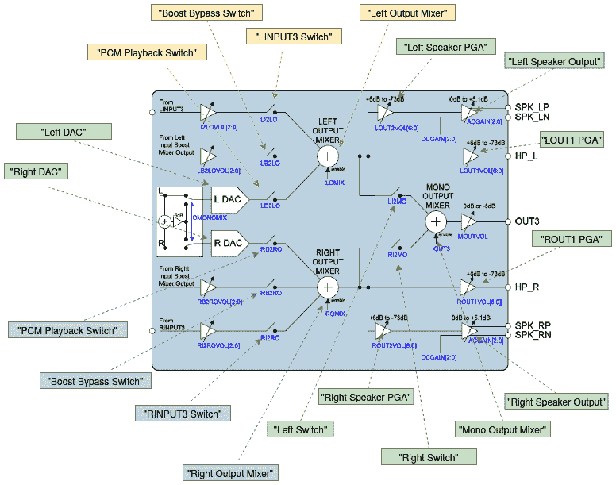

# 五、ALSA SoC 框架——利用编解码器和平台类驱动

音频是一种模拟现象，可以通过各种方式产生。 自人类诞生以来，语音和音频就一直是沟通的媒介。 几乎每个内核都为用户空间应用提供音频支持，作为计算机和人类之间的交互机制。 为了实现这一点，Linux 内核提供了一组 API，称为**ALSA**，它代表**高级 Linux 声音体系结构**。

ALSA 是为台式计算机设计的，没有考虑嵌入式世界的限制。 在处理嵌入式设备时，这增加了很多缺点，例如：

*   编解码器和 CPU 代码之间强耦合，导致移植和代码复制困难。
*   没有标准的方式来处理有关用户音频相关行为的通知。 在移动场景中，用户的音频相关行为频繁，需要特殊的机制。
*   在最初的 ALSA 架构中，没有考虑功率效率。 但对于嵌入式设备(大多数时候是电池供电的)，这是一个关键点，因此需要有一种机制。

这就是 ASOC 的用武之地。 **ALSA 片上系统**(**ASOC**)层的目的是为嵌入式处理器和各种编解码器提供更好的 ALSA 支持。

ASOC 是为解决上述问题而设计的一种新架构，具有以下优点：

*   独立的编解码器驱动，以减少与 CPU 的耦合
*   更方便地配置中央处理器和编解码器之间的音频数据接口**动态音频电源管理**(**DAPM**)，动态控制功耗(更多信息可在此处找到：[https://www.kernel.org/doc/html/latest/sound/soc/dapm.html](https://www.kernel.org/doc/html/latest/sound/soc/dapm.html))
*   减少了弹出和点击，增加了与平台相关的控件

为了实现上述功能，ASOC 将嵌入式音频系统分为三个可重用组件驱动，即**机器类**、**平台类**和**编解码器类**。 其中，平台类和编解码器类是*跨平台*，机器类是*板卡*特定的。 在本章和下一章中，我们将介绍这些组件驱动，处理它们各自的数据结构以及它们是如何实现的。

在这里，我们将介绍 Linux ASOC 驱动体系结构及其不同部分的实现，特别关注以下内容：

*   ASOC 简介
*   编写编解码器类驱动
*   写入平台类 DR 服务器

# 技术要求

*   对设备树概念有扎实的了解
*   熟悉**公共时钟框架**(**CCF**)(在[*第 4 章*](04.html#_idTextAnchor047)*、**冲击公共时钟框架*中讨论)
*   熟悉 regmap API
*   精通 Linux 内核 DMA 框架
*   Linux 内核 v4.19.X 源代码，可从[https://git.kernel.org/pub/scm/linux/kernel/git/stable/linux.git/refs/tags](https://git.kernel.org/pub/scm/linux/kernel/git/stable/linux.git/refs/tags)获得

# ASOC 简介

从体系结构的观点来看，ASOC 子系统元素及其关系可以表示如下：


图 5.1-ASOC 体系结构

上图总结了新的 ASOC 体系结构，在该体系结构中，机器实体包装了平台实体和编解码器实体。

在内核 v4.18 之前的 ASOC 实现中，SoC 音频编解码器设备(现在用`struct snd_soc_codec`表示)和 SoC 平台接口(用`struct snd_soc_platform`表示)及其各自的数字音频接口之间有严格的分离。 然而，编解码器、平台和其他组件之间的相似代码越来越多。 这导致了一种新的通用方法，即**组件**的概念。 所有的驱动都被移到了这个新的通用组件上，平台代码被移除了，所有的东西都被重构了，所以现在我们只谈论`struct snd_soc_component`(可能指编解码器或平台)和`struct snd_soc_component_driver`(指的是它们各自的音频接口 driver)。

现在我们已经介绍了 ASOC 的概念，我们可以更深入地了解细节，首先讨论数字音频接口。

## 加入时间：清华大学 2007 年 01 月 25 日下午 3：33

**数字音频接口**(**DAI**)是总线控制器，它实际将音频数据从一端(例如 SoC)传送到另一端(编解码器)。 ASOC 目前支持当今 SoC 控制器和便携式音频编解码器上的大多数 DAI，例如 AC97、I2S、PCM、S/PDIF 和 TDM。

重要音符

I2S 模块支持六种不同的模式，其中最有用的是 I2S a 和 TDM。

## ASOC 子元素

正如我们在前面看到的，ASOC 系统分为三个元素，每个元素都有一个专用驱动器，如下所述：

*   **Platform**: This refers to the audio DMA engine of the SoC (AKA the platform), such as i.MX, Rockchip, and STM32\. Platform class drivers can be subdivided into two parts:

    --**CPU DAI 驱动**：在嵌入式系统中，通常指的是 CPU 的音频总线控制器(I2S、S/PDIF、AC97 和 PCM 总线控制器，有时集成到一个更大的模块中，即**串行音频接口**(**SAI**))。 它负责在回放时将音频数据从总线 Tx FIFO 传输到编解码器(录制方向相反，从编解码器到总线 Rx FIFO)。 平台驱动定义 DAI 并将它们注册到 ASOC 内核。

    --**PCM DMA 驱动**：PCM 驱动通过覆盖`struct snd_soc_component_driver`(参见`struct snd_pcm_ops`元素)结构公开的函数指针来帮助执行 DMA 操作。 PCM 驱动与平台无关，仅与 SOC DMA 引擎上游 API 交互。 然后，DMA 引擎与平台特定的 DMA 驱动交互，以获得正确的 DMA 设置。

    它负责将**DMA 缓冲器**中的音频数据传送到总线(或端口)Tx FIFO。 这部分的逻辑比较复杂。 接下来的几节将详细说明这一点。

*   **编解码器**：编解码器字面意思是编解码器，但是芯片中有很多功能。 常见的有 AIF、DAC、ADC、混频器、PGA、线路输入和线路输出。 一些高端编解码器芯片还具有回声消除器、噪声抑制和其他组件。 编解码器负责将来自声源的模拟信号转换为处理器可以操作的数字信号(用于捕获操作)，或者将来自声源(CPU)的数字信号转换为回放时人类可以识别的模拟信号。 如果需要，它对音频信号进行相应的调整，并控制音频信号之间的路径，因为芯片中的每个音频信号可能有不同的流动路径。
*   **Machine**：这是系统级表示(实际上是单板)，链接两个音频接口(`cpu_dai`和`codec_dai`)。 该链接在内核中由`struct snd_soc_dai_link`的实例抽象。 在配置链接之后，机器驱动注册(通过`devm_snd_soc_register_card()`)一个`struct snd_soc_card`对象，该对象是声卡的 Linux 内核抽象。 虽然平台和编解码器驱动通常是可重用的，但机器有其几乎不可重用的特定硬件功能。 所谓硬件特性，是指 DAI 之间的链接；通过 GPIO 的开路放大器；通过 GPIO 检测插件；使用 MCLK/EVERENT OSC 等时钟作为 I2S 编解码模块的参考时钟源等。

根据前面的描述，我们可以产生以下 ASOC 方案及其关系：


图 5.2-Linux 音频层和关系

上图是 Linux 内核音频组件之间交互的快照。 既然我们已经熟悉了 ASOC 概念，我们就可以继续讨论 ITS 第一个设备驱动类，它处理编解码器设备。

# 编写编解码器类驱动

为了耦合在一起，机器、平台和编解码器实体需要专用的驱动。 编解码器类驱动是最基本的。 它实现了应该利用编解码器设备并公开其硬件属性的代码，以便用户空间工具(如`amixer`)可以使用它。 编解码器类驱动是并且应该是独立于平台的。 无论平台是什么，都可以使用相同的编解码器驱动。 由于它的目标是特定的编解码器，因此它应该包含音频控件、音频接口功能、编解码器 DAPM 定义和 I/O 功能。 每个编解码器驱动必须满足以下规格：

*   通过定义 DAI 和 PCM 配置提供到其他模块的接口。
*   提供编解码器控制 IO 挂钩(使用 I2C 和/或 SPI)。
*   根据需要公开其他**kControls**(**内核控件**)，以便用户空间实用程序动态控制模块行为。
*   可选)定义 DAPM 小部件并建立动态电源切换的 DAPM 路由，并提供 DAC 数字静音控制。

编解码器驱动包括编解码器设备(实际上是组件)本身和 DAIS 组件，它们在与平台绑定期间使用。 它是独立于平台的。 通过`devm_snd_soc_register_component()`的，编解码器驱动注册`struct snd_soc_component_driver`对象(其实际上是编解码器驱动的实例，其包含指向编解码器的路由、小部件、控件和一组与编解码器相关的函数回调的指针)以及一个或多个`struct snd_soc_dai_driver`，其是可能包含音频流的编解码器 DAI 驱动的实例，例如：

```sh
struct snd_soc_component_driver {
    const char *name;
    /* Default control and setup, added after probe() is run */
    const struct snd_kcontrol_new *controls;
    unsigned int num_controls;
    const struct snd_soc_dapm_widget *dapm_widgets;
    unsigned int num_dapm_widgets;
    const struct snd_soc_dapm_route *dapm_routes;
    unsigned int num_dapm_routes;
    int (*probe)(struct snd_soc_component *);
    void (*remove)(struct snd_soc_component *);
    int (*suspend)(struct snd_soc_component *);
    int (*resume)(struct snd_soc_component *);
    unsigned int (*read)(struct snd_soc_component *,                          unsigned int);
    int (*write)(struct snd_soc_component *, unsigned int,
                     unsigned int);
    /* pcm creation and destruction */
    int (*pcm_new)(struct snd_soc_pcm_runtime *);
    void (*pcm_free)(struct snd_pcm *);
    /* component wide operations */
    int (*set_sysclk)(struct snd_soc_component *component,                      int clk_id, 
                     int source, unsigned int freq, int dir);
    int (*set_pll)(struct snd_soc_component *component,
                   int pll_id, int source,                    unsigned int freq_in,
                   unsigned int freq_out);
    int (*set_jack)(struct snd_soc_component *component,
                    struct snd_soc_jack *jack, void *data);
    [...]
    const struct snd_pcm_ops *ops;
    [...]
    unsigned int non_legacy_dai_naming:1;
};
```

此结构还必须由平台驱动提供。 但是，在 ASOC 核心中，此结构中唯一必需的元素是`name`，因为它用于匹配组件。 以下是结构中元素的含义：

*   `name`：此组件的名称对于编解码器和平台都是必需的。 平台侧可能不需要结构中的其他部件。
*   `probe`：组件驱动探测函数，当机器驱动探测到该组件驱动时(实际上，当机器驱动向 ASOC 内核注册由该组件制成的卡时：见`snd_soc_instantiate_card()`)时，执行该组件驱动探测函数(以便在必要时完成组件初始化)。
*   `remove`：组件驱动未注册时(此组件驱动绑定的声卡未注册时发生)。
*   `suspend`和`resume`：电源管理回调，在系统挂起或恢复阶段调用。
*   `controls`：控制接口指针，如控制音量调节、频道选择等，主要用于编解码器。
*   `set_pll`：设置锁相环的函数指针。
*   `read`：读取编解码器寄存器的函数。
*   `write`：写入编解码器寄存器的函数。
*   `num_controls`：控件中的控件数量，即`snd_kcontrol_new`个对象的数量。
*   `dapm_widgets`：`dapm`小工具指针。
*   `num_dapm_widgets`：`dapm`部分指针的数量。
*   `dapm_routes`：`dapm route`个指针。
*   `num_dapm_routes`：`dapm`路由指针的数量。
*   `set_sysclk`：设置时钟函数指针。
*   `ops`：与平台 DMA 相关的回调，仅当从平台驱动内提供此结构时才需要(仅限 ALSA)；但是，对于 ASOC，在使用通用 PCM DMA 引擎框架时，ASOC 核心通过与专用 ASOC DMA 相关的 API 为您设置此字段。

到目前为止，我们已经在编解码器类驱动的上下文中引入了`struct snd_soc_component_driver`数据结构。 请记住，此结构抽象了编解码器和平台设备，也将在平台驱动上下文中讨论。 不过，在编解码器类驱动的上下文中，我们需要讨论`struct snd_soc_dai_driver`数据结构，它与`struct snd_soc_component_driver`一起抽象编解码器或平台设备及其 DAI 驱动。

## 编解码器 DAI 和 PCM(AKA DSP)配置

本部分是而不是，应该将命名为**DAI 和 PCM**(AKA**DSP**)**配置**，而不使用*编解码器*。 每个编解码器(或者我应该说“组件”)驱动必须公开编解码器(组件)的 DAI 以及它们的功能和操作。 这是通过填充和注册与编解码器上有多少 DAI 一样多的`struct snd_soc_dai_driver`实例来实现的，这些实例必须使用`devm_snd_soc_register_component()`API 导出。 此函数还将指针指向`struct snd_soc_component_driver`，它是组件驱动，所提供的 DAI 驱动将绑定到该组件驱动并将其导出(实际上是插入到`sound/soc/soc-core.c`中定义的 ASOC 全局组件列表`component_list`中)，以便在注册声卡之前，机器驱动可以将其注册到内核。 此结构涵盖每个接口的时钟、格式化和 ALSA 操作，在`include/sound/soc-dai.h`中定义如下：

```sh
struct snd_soc_dai_driver {
    /* DAI description */
    const char *name;
    /* DAI driver callbacks */
    int (*probe)(struct snd_soc_dai *dai);
    int (*remove)(struct snd_soc_dai *dai);
    int (*suspend)(struct snd_soc_dai *dai);
    int (*resume)(struct snd_soc_dai *dai);
[...]
    /* ops */
    const struct snd_soc_dai_ops *ops;
    /* DAI capabilities */
    struct snd_soc_pcm_stream capture;
    struct snd_soc_pcm_stream playback;
    unsigned int symmetric_rates:1;
    unsigned int symmetric_channels:1;
    unsigned int symmetric_samplebits:1;
[...]
};
```

在前面的块中，为了可读性，只列举了结构的主要元素。 以下是它们的含义：

*   `name`：这是 DAI 接口的名称。
*   `probe`：DAI 驱动探测函数，当机器驱动探测到该 DAI 驱动所属的组件驱动时(实际上是机器驱动向 ASOC 内核注册卡时)。
*   `remove`：当此 DAI 驱动所属的组件驱动未注册时调用。
*   `suspend`和`resume`：电源管理回调。
*   `ops`：指向`struct snd_soc_dai_ops`结构，该结构提供配置和控制 DAI 的回调。
*   `capture`：指向表示音频捕获硬件参数的`struct snd_soc_pcm_stream`结构。 此成员描述音频捕获过程中支持的通道数、比特率、数据格式等。 如果不需要捕获功能，则不需要进行初始化。
*   `playback`：音频播放的硬件参数。 此成员描述回放期间支持的通道数、比特率、数据格式等。 如果不需要音频播放功能，则不需要初始化。

实际上，编解码器和平台驱动必须为它们拥有的每个 DAI 注册此结构。 这就是这一节的一般性之处。 机器驱动器稍后使用它来建立编解码器和 SoC 之间的链接。 但是，为了理解整个配置是如何完成的，还需要给其他数据结构一些学习时间：这些数据结构是`struct snd_soc_pcm_stream`和`struct snd_soc_dai_ops`，DES 将在下一节中描述。

### DAI 操作

操作由`struct snd_soc_dai_ops`结构的实例抽象为。 此结构包含一组与 PCM 接口相关的不同事件的回调(也就是说，您很可能希望在音频传输开始之前以某种方式准备设备，因此需要将执行此操作的代码放入`prepare`回调中)或与 DAI 时钟和格式配置相关的回调。 该结构定义如下：

```sh
struct snd_soc_dai_ops {
    int (*set_sysclk)(struct snd_soc_dai *dai, int clk_id,
                      unsigned int freq, int dir);
    int (*set_pll)(struct snd_soc_dai *dai, int pll_id,                    int source,
                   unsigned int freq_in,                    unsigned int freq_out);
    int (*set_clkdiv)(struct snd_soc_dai *dai, int div_id,                       int div);
    int (*set_bclk_ratio)(struct snd_soc_dai *dai,                           unsigned int ratio);
    int (*set_fmt)(struct snd_soc_dai *dai, unsigned int fmt);
    int (*xlate_tdm_slot_mask)(unsigned int slots,
                               unsigned int *tx_mask,                                unsigned int *rx_mask); 
    int (*set_tdm_slot)(struct snd_soc_dai *dai,
                        unsigned int tx_mask,                         unsigned int rx_mask,
                        int slots, int slot_width);
    int (*set_channel_map)(struct snd_soc_dai *dai,
                           unsigned int tx_num,                            unsigned int *tx_slot,
                           unsigned int rx_num,                            unsigned int *rx_slot);
    int (*get_channel_map)(struct snd_soc_dai *dai,
                           unsigned int *tx_num,                            unsigned int *tx_slot,
                           unsigned int *rx_num,                            unsigned int *rx_slot);
    int (*set_tristate)(struct snd_soc_dai *dai, int tristate);
    int (*set_sdw_stream)(struct snd_soc_dai *dai,                           void *stream,
                          int direction);
    int (*digital_mute)(struct snd_soc_dai *dai, int mute);
    int (*mute_stream)(struct snd_soc_dai *dai, int mute,                        int stream);
    int (*startup)(struct snd_pcm_substream *,                    struct snd_soc_dai *);
    void (*shutdown)(struct snd_pcm_substream *,                      struct snd_soc_dai *);
    int (*hw_params)(struct snd_pcm_substream *,
                     struct snd_pcm_hw_params *,                      struct snd_soc_dai *); 
    int (*hw_free)(struct snd_pcm_substream *,                    struct snd_soc_dai *);
    int (*prepare)(struct snd_pcm_substream *,                    struct snd_soc_dai *);
    int (*trigger)(struct snd_pcm_substream *, int,
                   struct snd_soc_dai *);
};
```

这种结构中的回调函数基本上可以分为三类，驱动可以根据实际情况实现部分回调函数。

第一个类收集**个时钟配置回调**，通常由机器驱动调用。 这些回调如下：

*   `set_sysclk`设置 DAI 的主时钟。 如果实现，此回调应从系统或主时钟派生最佳 DAI 位和帧时钟。 机器驱动可以在`cpu_dai`和/或`codec_dai`上使用`snd_soc_dai_set_sysclk()`API 来调用此回调。
*   `set_pll`设置 PLL 参数。 如果实现，此回调应配置并使 PLL 能够基于输入时钟生成输出时钟。 机器驱动可以在`cpu_dai`和/或`codec_dai`上使用`snd_soc_dai_set_pll()`API 来调用此回调。
*   `set_clkdiv`设置时钟分频系数。 机器驱动调用此回调的 API 为`snd_soc_dai_set_clkdiv()`。

第二个回调类是 DAI 的**格式配置回调**，通常由机器驱动调用。 这些回调如下：

*   `set_fmt`设置 DAI 的格式。 机器驱动可以使用`snd_soc_dai_set_fmt()`API 调用此回调(在 CPU 和/或编解码器 DAI 上)，以配置 DAI 硬件音频格式。
*   `set_tdm_slot`：如果 DAI 支持**时分复用**(**TDM**)，则用于设置 TDM 时隙。 调用此回调的机器驱动 API 为`snd_soc_dai_set_tdm_slot()`，以便为 TDM 操作配置指定的 DAI。
*   `set_channel_map`：通道 TDM 映射设置。 机器驱动使用`snd_soc_dai_set_channel_map()`API 为指定的 DAI 调用此回调。
*   `set_tristate`：设置 DAI 引脚的状态，当将同一引脚与其他 DAI 并联使用时，需要设置 DAI 引脚的状态。 它是通过使用`snd_soc_dai_set_tristate()`API 从机器驱动调用的。

最后一个回调类是普通的标准前端，它收集通常由 ASOC 核心调用的 PCM 校正操作。 相关回调如下：

*   `startup`：由 ALSA 在 PCM 子流打开时调用(当有人打开捕获/回放设备时(例如，在设备文件打开时)。
*   `shutdown`：此回调应实现将撤消在启动期间所做的操作的代码。
*   `hw_params`：设置音频流时调用。 `struct snd_pcm_hw_params`包含音频特征。
*   `hw_free`：应撤消在`hw_params`中所做的操作。
*   `prepare`：当 PCM 准备好*时调用此函数。 请参考下面的 PCM 公共状态更改流程，以便了解何时调用此回调。 DMA 传输参数根据与特定硬件平台相关的通道、`buffer_bytes`等进行设置。*
**   `trigger`：在 PCM 启动、停止和暂停时调用。 此回调中的`int`参数是根据事件可以是`SNDRV_PCM_TRIGGER_START`、`SNDRV_PCM_TRIGGER_RESUME`或`SNDRV_PCM_TRIGGER_PAUSE_RELEASE`之一的命令。 驱动可以使用`switch...case`来迭代事件。*   (可选)`digital_mute`：ASOC 内核调用的防流行声音。 例如，当系统被挂起时，它可以由内核调用。*

 *为了弄清楚内核如何调用前面的回调，让我们来看看 PCM 常见状态更改流：

1.  **先启动**：*关闭-->待机-->准备-->在*
2.  **停止**：*开-->准备-->待机*
3.  **恢复**：*待机-->准备-->在*

前面流程中的每个状态都将调用一个回调。 A1l 如上所述，我们可以深入研究硬件配置数据结构，即用于捕获或回放操作的。

### 捕获和播放硬件配置

在捕获或回放操作期间，应设置 DAI 设置(如频道号)和功能，以便配置底层 PCM 流。 您可以通过在编解码器和平台驱动中为每个操作和每个 DAI 填充如下定义的`struct snd_soc_pcm_stream`实例来实现这一点：

```sh
struct snd_soc_pcm_stream {
    const char *stream_name;
    u64 formats;
    unsigned int rates; 
    unsigned int rate_min;
    unsigned int rate_max;
    unsigned int channels_min;
    unsigned int channels_max;
    unsigned int sig_bits;
};
```

该结构的主要构件可以描述如下：

*   `stream_name`：流的名称，可以是`"Playback"`或`"Capture"`。
*   `formats`：支持的数据格式的集合(有效值在前缀为`SNDRV_PCM_FMTBIT_`的`include/sound/pcm.h`中定义)，如`SNDRV_PCM_FMTBIT_S16_LE`或`SNDRV_PCM_FMTBIT_S24_LE`。 如果支持多种格式，则可以组合每种格式，如`SNDRV_PCM_FMTBIT_S16_LE | SNDRV_PCM_FMTBIT_S20_3LE`。
*   `rates`：一组支持的采样率(前缀为`SNDRV_PCM_RATE_`，整个有效值在`include/sound/pcm.h`中定义)，如`SNDRV_PCM_RATE_44100`或`SNDRV_PCM_RATE_48000`。 如果支持多个采样率，则可以增加每个采样率，例如`SNDRV_PCM_RATE_48000 | SNDRV_PCM_RATE_88200`。
*   `rate_min`：支持的最小采样率。
*   `rate_max`：支持的最大采样率。
*   `channels_min`：t 支持的最小通道数。

## 控件的概念

编解码器驱动公开一些可以从用户空间更改的编解码器属性是很常见的。 这些是编解码器控件。 当编解码器初始化时，所有定义的音频控件都注册到 ALSA 内核。 音频控件的结构被定义为`include/sound/control.h`的`struct snd_kcontrol_new`。

除 DAI 总线外，编解码器设备大部分时间还配备控制总线、I2C 或 SPI 总线。 为了省去每个编解码器驱动实现其控制访问例程的麻烦，编解码器控制 I/O 已经标准化。 这就是 regmap API 的发源地。 您可以使用 regmap 来抽象控制接口，这样编解码器驱动就不必担心当前的控制方法是什么。 音频编解码器前端在`sound/soc/soc-io.c`中实现。 这依赖于 regmap API，这在[*第 2 章*](02.html#_idTextAnchor030)，*中已经讨论过，它利用 Regmap API 并简化代码。*

编解码器驱动随后需要提供读写接口，以便访问底层编解码器寄存器。 这些回调需要在编解码器组件驱动`struct snd_soc_component_driver`的`.read`和`.write`字段中设置。 以下是可用于访问组件寄存器的高级 API：

```sh
int snd_soc_component_write(struct                             snd_soc_component *component,
                            unsigned int reg, unsigned int val)
int snd_soc_component_read(struct snd_soc_component *component,
                           unsigned int reg,                            unsigned int *val)
int snd_soc_component_update_bits(struct                                   snd_soc_component *component, 
                                  unsigned int reg,                                   unsigned int mask,                                   unsigned int val)
int snd_soc_component_test_bits(struct                                 snd_soc_component *component, 
                                unsigned int reg,   
                                unsigned int mask,       
                                unsigned int value)
```

前面中的每个帮助器都是自描述的。 在我们深入研究控件实现之前，请注意控件框架由几种类型组成：

*   一个简单的开关控件，它是寄存器中的单个逻辑值
*   一种立体声控制，它是上一种简单开关控制的立体声版本，可同时控制寄存器中的两个逻辑值
*   混合器控件，它是多个简单控件的组合，其输出是其输入的混合
*   MUX 控件-与前面提到的混音器控件相同，但可以从多个控件中选择一个

在 ALSA 中，通过定义如下的`struct snd_kcontrol_new`结构抽象控件：

```sh
struct snd_kcontrol_new {
    snd_ctl_elem_iface_t iface;
    unsigned int device;
    unsigned int subdevice;	
    const unsigned char *name;
    unsigned int index;
    unsigned int access;
    unsigned int count;
    snd_kcontrol_info_t *info;
    snd_kcontrol_get_t *get;
    snd_kcontrol_put_t *put;
    union {
        snd_kcontrol_tlv_rw_t *c;
        const unsigned int *p;
    } tlv;
    [...]
};
```

以下是上述数据结构中字段的描述：

*   `iface`字段指定控件类型。 它的类型是`snd_ctl_elem_iface_t`，这是`SNDRV_CTL_ELEM_IFACE_XXX`的枚举，其中`XXX`可以是`MIXER`、`PCM`，依此类推。 可在此处找到可能值的列表：[https://elixir.bootlin.com/linux/v4.19/source/include/uapi/sound/asound.h#L848](https://elixir.bootlin.com/linux/v4.19/source/include/uapi/sound/asound.h#L848)。 如果控件与声卡上的特定设备紧密关联，则可以使用`HWDEP`、`PCM`、`RAWMIDI`、`TIMER`或`SEQUENCER`，并使用设备和子设备(即设备中的子流)字段指定设备号。
*   `name`是控件的名称。 此字段具有重要作用，允许按名称对控件进行分类。 ALSA 以某种方式标准化了一些控件名称，我们将在*控件命名约定*部分详细讨论。
*   `index`字段用于保存卡上的控件数量。 如果声卡上有多个编解码器，并且每个编解码器都有一个同名的控件，那么我们可以通过`index`来区分这些控件。 当`index`为 0 时，可以忽略该差异化策略。
*   `access`以`SNDRV_CTL_ELEM_ACCESS_XXX`的形式包含控件的访问权限。 每一位代表一种可与多个 OR 运算组合的访问类型。 `XXX`可以是`READ`、`WRITE`或`VOLATILE`，依此类推。 可以在此处找到可能的位掩码：[https://elixir.bootlin.com/linux/v4.19/source/include/uapi/sound/asound.h#L858](https://elixir.bootlin.com/linux/v4.19/source/include/uapi/sound/asound.h#L858)。
*   `get`是用于读取控件的当前值并将其返回给用户空间中的应用的回调函数。
*   `put`是用于将应用的控件值设置为控件的回调函数。
*   回调函数`info`用于获取有关 CONT 角色的详细信息。
*   `tlv`字段提供控件的元数据。

### 控件命名约定

ALSA 希望控件以某种方式命名。 为了实现这一点，ALSA 预定义了一些常用的源(如 Master、PCM、CD、Line 等)、方向(表示控件的数据流，如播放、捕获、旁路、旁路捕获等)和功能(根据控件的功能，如 Switch、Volume、Route 等)。 请注意，没有定义方向意味着控件是双向的(回放和捕获)。

有关 ALSA 控件命名的更多详细信息，请参阅下面的链接：[https://www.kernel.org/doc/html/v4.19/sound/designs/control-names.html](https://www.kernel.org/doc/html/v4.19/sound/designs/control-names.html)。

### 控制元数据

有些混音器控制需要以**分贝**(**分贝**)提供信息。 我们可以使用`DECLARE_TLV_xxx`宏定义一些包含此信息的变量，然后将 CONTROL`tlv.p`字段指向这些变量，最后将`SNDRV_CTL_ELEM_ACCESS_TLV_READ`标志添加到 ACCESS 字段。

**TLV**字面意思是**类型长度值**(或**标签长度值**)，并且是一种编码方案。 ALSA 已采用此方法来定义分贝范围/刻度容器。 例如，`DECLARE_TLV_DB_SCALE`将定义有关混音器控件的信息，其中控件的值中的每一步都以恒定的分贝量改变分贝值。 让我们以下面的为例：

```sh
static DECLARE_TLV_DB_SCALE(db_scale_my_control, -4050, 150,                             0);
```

根据`include/sound/tlv.h`中此宏的定义，前面的示例可以扩展为以下内容：

```sh
static struct snd_kcontrol_new my_control devinitdata = {
    [...]
    .access =
     SNDRV_CTL_ELEM_ACCESS_READWRITE |      SNDRV_CTL_ELEM_ACCESS_TLV_READ,
    [...]
    .tlv.p = db_scale_my_control,
};
```

宏的第一个参数表示要定义的变量的名称；第二个参数表示此控件可以接受的最小值，单位为`0.01`dB。 第三个参数是改变的步长，也是以`0.01`dB 为步长。 如果在控制处于最小值时执行静音操作，则需要将第四个参数设置为`1`。 请查看`include/sound/tlv.h`以查看可用的宏。

声卡注册时，调用`snd_ctl_dev_register()`函数以保存有关控制设备的相关信息，并使其可供用户使用。

### 定义 KCONTROLS

KControls 由 ASOC 核心使用来导出音频控件(如开关、音量、*MUX…)。 到用户空间。 这意味着，例如，当用户空间应用(如 PulseAudio)在没有插入耳机的情况下关闭耳机或打开扬声器时，操作将由 kcontrol 在内核中处理。 正常的 kcontrol 不参与电源管理(DAPM)。 它们专门用于控制非基于电源管理的元素，如音量电平、增益电平等。 使用适当的宏设置控件后，必须使用`snd_soc_add_component_controls()`方法将它们注册到系统控件列表，其原型如下：

```sh
int snd_soc_add_component_controls(
                       struct snd_soc_component *component,
                       const struct snd_kcontrol_new *controls, 
                       unsigned int num_controls);
```

在前面的原型中，`component`是为其添加控件的组件，`controls`是要添加的控件数组，`num_controls`是数组中需要添加的条目数。

为了了解该 API 有多简单，让我们看一下下面的示例，它定义了一些控件：

```sh
static const DECLARE_TLV_DB_SCALE(dac_tlv, -12750, 50, 1);
static const DECLARE_TLV_DB_SCALE(out_tlv, -12100, 100, 1);
static const DECLARE_TLV_DB_SCALE(bypass_tlv, -2100, 300, 0);
static const struct snd_kcontrol_new wm8960_snd_controls[] = {
    [...]
    SOC_DOUBLE_R_TLV("Playback Volume", WM8960_LDAC,                      WM8960_RDAC, 0,
                     255, 0, dac_tlv),
    SOC_DOUBLE_R_TLV("Headphone Playback Volume", WM8960_LOUT1,
                      WM8960_ROUT1, 0, 127, 0, out_tlv),
    SOC_DOUBLE_R("Headphone Playback ZC Switch", WM8960_LOUT1,
                      WM8960_ROUT1, 7, 1, 0),
    SOC_DOUBLE_R_TLV("Speaker Playback Volume", WM8960_LOUT2, 
                      WM8960_ROUT2, 0, 127, 0, out_tlv),
    SOC_DOUBLE_R("Speaker Playback ZC Switch", WM8960_LOUT2, 
                      WM8960_ROUT2, 7, 1, 0),
    SOC_SINGLE("Speaker DC Volume", WM8960_CLASSD3, 3, 5, 0),
    SOC_SINGLE("Speaker AC Volume", WM8960_CLASSD3, 0, 5, 0),
    SOC_ENUM("DAC Polarity", wm8960_enum[1]),
    SOC_SINGLE_BOOL_EXT("DAC Deemphasis Switch", 0,                         wm8960_get_deemph, 
                        wm8960_put_deemph),
    [...]
    SOC_SINGLE("Noise Gate Threshold", WM8960_NOISEG, 3, 31, 0),
    SOC_SINGLE("Noise Gate Switch", WM8960_NOISEG, 0, 1, 0),
    SOC_DOUBLE_R_TLV("ADC PCM Capture Volume", WM8960_LADC,
                      WM8960_RADC, 0, 255, 0, adc_tlv),
    SOC_SINGLE_TLV("Left Output Mixer Boost Bypass Volume",
                      WM8960_BYPASS1, 4, 7, 1, bypass_tlv),
};
```

将注册上述控制的对应代码如下：

```sh
snd_soc_add_component_controls(component, wm8960_snd_controls,
                              ARRAY_SIZE(wm8960_snd_controls));
```

以下是定义具有这些预置宏定义的 COMMOnn 使用的控件的方法 t。

SOC_SINGLE(xname，reg，Shift，max，Invert)

要设置一个简单的开关，我们可以使用`SOC_SINGLE`。 这是最简单的控件：

```sh
#define SOC_SINGLE(xname, reg, shift, max, invert) \
{  .iface = SNDRV_CTL_ELEM_IFACE_MIXER, .name = xname, \
   .info = snd_soc_info_volsw, .get = snd_soc_get_volsw,\
   .put = snd_soc_put_volsw, \
   .private_value = SOC_SINGLE_VALUE(reg, shift, max, invert) }
```

这种类型的控件只有一种设置，通常用于组件开关。 宏定义的参数说明如下：

*   `xname`：控件的名称。
*   `reg`：控件对应的寄存器地址。
*   `Shift`：寄存器`reg`中该控制的偏移量控制位(应用更改的位置)。
*   `max`：控件设置的值范围。 一般来说，如果控制位只有`1`位，那么就有`max=1`位，因为可能的值只有`0`和`1`。
*   `invert`：设置的值是否反转。

让我们来研究一下下面的例子：

```sh
SOC_SINGLE("PCM Playback -6dB Switch", WM8960_DACCTL1, 7, 1,            0),
```

在上一个示例中，`PCM Playback -6dB Switch`是控件的名称。 `WM8960_DACCTL1`(在`wm8960.h`中定义)是编解码器(WM8960 芯片)中的寄存器地址，允许您控制此开关：

*   `7`表示`DACCTL1`寄存器中的`7th`位用于启用/禁用 DAC 6DB 衰减。
*   `1`表示只有一个启用或禁用选项。
*   `0`表示您设置的值没有反转。

#### SOC_SINGLE_TLV(xname，reg，Shift，max，invert，tlv_array)

此宏设置具有级别的开关。 它是`SOC_SINGLE`的扩展，用于定义具有增益控制的控制，如音量控制、均衡器等。 在本例中，左输入音量控制范围为 000000(`-17.25`dB)至 111111(`+30`dB)。 每一步为`0.75`dB，即总共`63`步：

```sh
SOC_SINGLE_TLV("Input Volume of LINPUT1",
               WM8960_LINVOL, 0, 63, 0, in_tlv),
```

`in_tlv`(表示控件元数据)的小数位数声明如下：

```sh
static const DECLARE_TLV_DB_SCALE(in_tlv, -1725, 75, 0);
```

在上面，`-1725`表示控制范围从`-17.25dB`开始。 `75`表示每一步为`0.75dB`，`0`表示从 0 开始的步骤 start。 对于某些音量控制情况，第一步是“静音”，sTep 从`1`开始。 因此，前面代码中的`0`应该替换为`1`。

#### SOC_DOUBLE_R(xname，reg_left，reg_right，xShift，xmax，xinvert)

`SOC_DOUBLE_R`是`SOC_SINGLE`的立体声版本。 的不同之处在于，`SOC_SINGLE`只控制一个变量，而`SOC_DOUBLE`可以同时控制一个寄存器中的两个相似变量。 我们可以用它来同时控制左右声道。

因为还有一个通道，所以该参数有一个对应的移位值。 以下是一个示例：

```sh
SOC_DOUBLE_R("Headphone ZC Switch", WM8960_LOUT1,
             WM8960_ROUT1, 7, 1, 0),
```

#### SOC_DOUBLE_R_TLV(xname，reg_Left，reg_right，xShift，xmax，xinvert，tlv_array)

`SOC_DOUBLE_R_TLV`是是`SOC_SINGLE_TLV`的立体声版本。 下面是它的用法示例：

```sh
SOC_DOUBLE_R_TLV("PCM DAC Playback Volume", WM8960_LDAC,
                 WM8960_RDAC, 0, 255, 0, dac_tlv),
```

#### 搅拌器控件

混音器控件用于路由音频通道的控制。 它由多个输入和一个输出组成。 多个输入可以自由混合在一起以形成混合输出：

```sh
static const struct snd_kcontrol_new left_speaker_mixer[] = {
    SOC_SINGLE("Input Switch", WM8993_SPEAKER_MIXER, 7, 1, 0),
    SOC_SINGLE("IN1LP Switch", WM8993_SPEAKER_MIXER, 5, 1, 0),
    SOC_SINGLE("Output Switch", WM8993_SPEAKER_MIXER, 3, 1, 0),
    SOC_SINGLE("DAC Switch", WM8993_SPEAKER_MIXER, 6, 1, 0),
};
```

前述混频器使用`WM8993_SPEAKER_MIXER`寄存器的第三、第五、第六和第七位来控制四个输入的打开和关闭。

#### 发帖主题：Re：Колибри0.7.0

此宏定义单个枚举控制，其中`xreg`是要修改以应用设置的寄存器，`xshift`是寄存器中的控制位偏移量，`xmask`是控制位大小，`xtexts`是指向描述每个设置的字符串数组的指针。 当控制选项为某些文本时使用此选项。

例如，我们可以设置文本的数组，如下所示：

```sh
static const char  *aif_text[] = { 
    "Left" , "Right"
};
```

然后定义枚举，如下所示：

```sh
static const struct	soc_enum aifinl_enum =
    SOC_ENUM_SINGLE(WM8993_AUDIO_INTERFACE_2, 15, 2, aif_text);
```

现在，我们已经完成了控件的概念，这些控件用于更改音频设备的属性，我们将了解如何利用它并利用音频设备的电源属性。

## DAPM 的概念

现代声卡由许多独立的独立组件组成。 每个组件都有可以独立供电的功能单元。 问题是，嵌入式系统在大多数情况下都是由电池供电的，需要最低功耗模式。 手工管理电源域依赖关系可能会很繁琐，而且容易出错。 **动态音频电源管理**(**DAPM**)的目标是始终将音频子系统的功耗降至最低。 DAPM 用于有电源控制的设备，如果不需要电源管理，则可以跳过 DAPM。 只有与电源相关的东西才会进入 DAPM-也就是说，如果它们是有电源控制的东西，或者如果它们控制了通过芯片的音频路由(因此让内核决定需要打开芯片的哪些部分)。

DAPM 位于 ASOC 核心中(这意味着电源切换是从内核内部完成的)，并在音频流/路径/设置更改时激活，使其对所有用户空间应用完全透明。

在前几节中，我们介绍了控件的概念以及如何处理它们。 但是，kcontrol 本身并不参与音频电源管理。 正常的 kcontrol 具有以下特征：

*   自描述和不能描述每个 kcontrol 之间的连接关系。
*   缺乏电源管理机制。
*   缺少对播放、停止、开机和关机等音频事件做出响应的时间处理机制。
*   缺少 POP-POP 声音预防机制，因此应由用户程序注意每个 kcontrol 的通电和断电顺序。
*   手动，因为音频路径中涉及的所有控件都不能自动关闭。 当音频路径不再有效时，需要用户空间干预。

DAPM 引入了小部件的概念，以解决上述问题。 小部件是基本的 DAPM 单元。 因此，所谓的小部件可以理解为对 kcontrol 的进一步升级和封装。

Widget 是 kcontrol 和动态电源管理的组合，还具有音频路径的链接功能。 它可以与其邻居小部件具有动态连接关系。

DAPM 框架通过`struct snd_soc_dapm_widget`结构对小部件进行抽象，在`include/sound/soc-dapm.h`中定义如下：

```sh
struct snd_soc_dapm_widget {
    enum snd_soc_dapm_type id;
    const char *name;
    const char *sname;
[...]
    /* dapm control */
    int reg;	/* negative reg = no direct dapm */
    unsigned char shift;
    unsigned int mask;
    unsigned int on_val;
    unsigned int off_val;
[...]
    int (*power_check)(struct snd_soc_dapm_widget *w);
    /* external events */
    unsigned short event_flags;
    int (*event)(struct snd_soc_dapm_widget*,
                 struct snd_kcontrol *, int);
    /* kcontrols that relate to this widget */
    int num_kcontrols;
    const struct snd_kcontrol_new *kcontrol_news;
    struct snd_kcontrol **kcontrols;
    struct snd_soc_dobj dobj;
    /* widget input and output edges */
    struct list_head edges[2];
    /* used during DAPM updates */
    struct list_head dirty;
[...]
}
```

出于可读性的考虑，前面的代码片断中仅列出了相关字段，以下是它们的说明：

*   `id`类型为`enum snd_soc_dapm_type`，表示小部件的类型，如`snd_soc_dapm_output`、`snd_soc_dapm_mixer`等。 完整列表在`include/sound/soc-dapm.h`中定义。
*   `name`是小部件的名称。
*   `shift`和`mask`用于控制微件的电源状态，对应于寄存器地址`reg`。
*   `on_val`和`off_val`值表示用于更改小工具当前电源状态的值。 它们分别对应于何时打开和何时关闭。
*   `event`表示 DAPM 事件处理回调函数指针。 每个小部件都与一个由`**kcontrols`指向的 kcontrol 对象相关联。
*   `*kcontrol_news`是组成此 kcontrol 的控件数组，`num_kcontrols`是其中的条目数。 这三个字段用于描述小部件中包含的 kcontrol 控件，例如混音器控件或 MUX 控件。
*   `dirty`用于在小部件的状态为 c 挂起时将该小部件插入脏列表。 然后扫描该 dirty 列表，以便执行整个路径的更新。

### 定义小部件

与普通的 kcontrol 一样，DAPM 框架为我们提供了大量的辅助宏来定义各种小部件控件。 这些宏定义可以根据小部件的类型和它们所在的域扩展到多个字段。 它们是，如下所示：

*   **编解码域**：如`VREF`和`VMID`等；它们提供参考电压控件。 这些小部件通常在编解码器探测/移除回调中进行控制。
*   **平台/机器域**：这些小部件通常是需要物理连接的平台或板(实际上是机器)的输入/输出接口，例如耳机、扬声器和麦克风。 也就是说，因为这些接口在每个电路板上可能不同，它们通常由机器驱动配置，并响应异步事件，例如，当插入耳机时。 它们还可以由用户空间应用控制，以某种方式打开和关闭它们。
*   **音频路径域**：通常，指的是，即控制编解码器内部音频路径的 MUX、混合器和其他窗口小部件。 这些控件可以根据用户空间的连接关系自动设置电源状态，例如`alsamixer`和`amixer`。
*   **音频流域**：它们需要处理音频数据流，如 ADC、DAC 等。 启动和停止流播放/捕获时分别启用和禁用，例如`aplay`和`arecord`。

所有 DAPM 电源切换决策都是根据机器特定的音频路由图自动做出的，该路由图由每个音频组件(包括内部编解码器组件)之间的 I 互连组成。

#### 编解码域fi定义

DAPM 框架只为此域提供了一个宏：

```sh
/* codec domain */
#define SND_SOC_DAPM_VMID(wname) \
    .id = snd_soc_dapm_vmid, .name = wname,     .kcontrol_news = NULL, \
    .num_kcontrols = 0}
```

#### DefiNing 平台域小部件

平台域的 Widget 分别对应于信号发生器、输入引脚、输出引脚、麦克风、耳机、扬声器和线路输入接口。 DAPM 框架为平台域小部件提供了许多辅助定义宏。 这些定义如下：

```sh
#define SND_SOC_DAPM_SIGGEN(wname) \
{   .id = snd_soc_dapm_siggen, .name = wname,     .kcontrol_news = NULL, \
    .num_kcontrols = 0, .reg = SND_SOC_NOPM }
#define SND_SOC_DAPM_SINK(wname) \
{   .id = snd_soc_dapm_sink, .name = wname,     .kcontrol_news = NULL, \
    .num_kcontrols = 0, .reg = SND_SOC_NOPM }
#define SND_SOC_DAPM_INPUT(wname) \
{   .id = snd_soc_dapm_input, .name = wname,     .kcontrol_news = NULL, \
    .num_kcontrols = 0, .reg = SND_SOC_NOPM }
#define SND_SOC_DAPM_OUTPUT(wname) \
{   .id = snd_soc_dapm_output, .name = wname,     .kcontrol_news = NULL, \
    .num_kcontrols = 0, .reg = SND_SOC_NOPM }
#define SND_SOC_DAPM_MIC(wname, wevent) \
{   .id = snd_soc_dapm_mic, .name = wname,     .kcontrol_news = NULL, \
    .num_kcontrols = 0, .reg = SND_SOC_NOPM, .event = wevent, \
    .event_flags = SND_SOC_DAPM_PRE_PMU |      SND_SOC_DAPM_POST_PMD}
#define SND_SOC_DAPM_HP(wname, wevent) \
{   .id = snd_soc_dapm_hp, .name = wname,     .kcontrol_news = NULL, \
    .num_kcontrols = 0, .reg = SND_SOC_NOPM, .event = wevent, \
    .event_flags = SND_SOC_DAPM_POST_PMU |      SND_SOC_DAPM_PRE_PMD}
#define SND_SOC_DAPM_SPK(wname, wevent) \
{   .id = snd_soc_dapm_spk, .name = wname,     .kcontrol_news = NULL, \
    .num_kcontrols = 0, .reg = SND_SOC_NOPM, .event = wevent, \
    .event_flags = SND_SOC_DAPM_POST_PMU |      SND_SOC_DAPM_PRE_PMD}
#define SND_SOC_DAPM_LINE(wname, wevent) \
{   .id = snd_soc_dapm_line, .name = wname,     .kcontrol_news = NULL, \
    .num_kcontrols = 0, .reg = SND_SOC_NOPM, .event = wevent, \
    .event_flags = SND_SOC_DAPM_POST_PMU |      SND_SOC_DAPM_PRE_PMD}
#define SND_SOC_DAPM_INIT_REG_VAL(wreg, wshift, winvert) \
    .reg = wreg, .mask = 1, .shift = wshift, \
    .on_val = winvert ? 0 : 1, .off_val = winvert ? 1 : 0
```

在前面的代码中，这些宏中的大多数字段都是通用的。 将`reg`字段设置为`SND_SOC_NOPM`(定义为`-1`)的事实意味着这些小工具没有用于控制小工具电源状态的寄存器控制位。 `SND_SOC_DAPM_INPUT`和`SND_SOC_DAPM_OUTPUT`用于定义编解码器驱动器内的编解码器芯片的输出和输入管脚。 从我们可以看到，`MIC`、`HP`、`SPK`和`LINE`微件响应`SND_SOC_DAPM_POST_PMU`(微件上电后)和`SND_SOC_DAPM_PMD`(BEFoRe 微件断电)事件，这些微件通常在机器驱动中定义。

#### Defi更新音频路径域小部件

这种小部件通常是重新打包普通的 kcontrol，并用音频路径和电源管理功能扩展它们。 这个扩展以某种方式使这种小部件能够识别 DAPM。 此域中的小部件将包含一个或多个不同于普通 kcontrol 的 kcontrol。 有一些启用了 DAPM 的 kcontrol。 这些不能使用标准方法定义，即基于`SOC_*-b`的宏控件。 它们需要使用 DAPM 框架提供的定义宏进行定义。 我们稍后将在*defining DAPM kControls*部分详细讨论它们。 但是，以下是这些小部件的定义宏：

```sh
#define SND_SOC_DAPM_PGA(wname, wreg, wshift, winvert,\ 
                         wcontrols, wncontrols) \
{   .id = snd_soc_dapm_pga, .name = wname, \
    SND_SOC_DAPM_INIT_REG_VAL(wreg, wshift, winvert), \
    .kcontrol_news = wcontrols, .num_kcontrols = wncontrols}
#define SND_SOC_DAPM_OUT_DRV(wname, wreg, wshift, winvert,\
                               wcontrols, wncontrols) \
{   .id = snd_soc_dapm_out_drv, .name = wname, \ 
    SND_SOC_DAPM_INIT_REG_VAL(wreg, wshift, winvert), \
    .kcontrol_news = wcontrols, .num_kcontrols = wncontrols}
#define SND_SOC_DAPM_MIXER(wname, wreg, wshift, winvert, \
                              wcontrols, wncontrols)\
{   .id = snd_soc_dapm_mixer, .name = wname, \ 
    SND_SOC_DAPM_INIT_REG_VAL(wreg, wshift, winvert), \
    .kcontrol_news = wcontrols, .num_kcontrols = wncontrols}
#define SND_SOC_DAPM_MIXER_NAMED_CTL(wname, wreg,                                      wshift, winvert, \
                                     wcontrols, wncontrols)\
{   .id = snd_soc_dapm_mixer_named_ctl, .name = wname, \
    SND_SOC_DAPM_INIT_REG_VAL(wreg, wshift, winvert), \
    .kcontrol_news = wcontrols, .num_kcontrols = wncontrols}
#define SND_SOC_DAPM_SWITCH(wname, wreg, wshift, winvert, wcontrols) \
{   .id = snd_soc_dapm_switch, .name = wname, \ 
    SND_SOC_DAPM_INIT_REG_VAL(wreg, wshift, winvert), \
    .kcontrol_news = wcontrols, .num_kcontrols = 1}
#define SND_SOC_DAPM_MUX(wname, wreg, wshift,                          winvert, wcontrols) \
{   .id = snd_soc_dapm_mux, .name = wname, \
    SND_SOC_DAPM_INIT_REG_VAL(wreg, wshift, winvert), \
    .kcontrol_news = wcontrols, .num_kcontrols = 1}
#define SND_SOC_DAPM_DEMUX(wname, wreg, wshift,                            winvert, wcontrols) \
{   .id = snd_soc_dapm_demux, .name = wname, \ 
    SND_SOC_DAPM_INIT_REG_VAL(wreg, wshift, winvert), \
    .kcontrol_news = wcontrols, .num_kcontrols = 1}
```

与平台和编解码域小部件不同，需要分配`reg`和`shift`字段，表示这些小部件有相应的电源控制寄存器。 当扫描和更新音频路径时，DAPM 框架使用这些寄存器来控制微件的电源状态。 它们的电源状态是动态分配的，在需要时(在有效音频路径上)通电，在不需要时(在非活动音频路径上)断电。 这些小部件需要执行与前面介绍的混合器、多路复用器等相同的功能。 事实上，这是由它们包含的 kcontrol 控件完成的。 驱动代码必须在定义小部件之前定义 kcontrol，然后将`wcontrols`和`num_kcontrols`参数传递给这些辅助定义宏。

这些宏还有另一个变体，它有一个指向事件处理程序的指针。 这样的宏有`_E`后缀。 它们是`SND_SOC_DAPM_PGA_E`、`SND_SOC_DAPM_OUT_DRV_E`、`SND_SOC_DAPM_MIXER_E`、`SND_SOC_DAPM_MIXER_NAMED_CTL_E`、`SND_SOC_DAPM_SWITCH_E`、`SND_SOC_DAPM_MUX_E`和`SND_SOC_DAPM_VIRT_MUX_E`。 建议您查看内核源代码，以查看[https://elixir.bootlin.com/linux/v4.19/source/include/sound/soc-dapm.h#L136](https://elixir.bootlin.com/linux/v4.19/source/include/sound/soc-dapm.h#L136)中的 IR 定义。

#### 定义音频流域

这些控件主要包括音频输入/输出接口、ADC/DAC 和时钟线路。 从音频界面小部件开始，如下所示：

```sh
#define SND_SOC_DAPM_AIF_IN(wname, stname, wslot, wreg, wshift, winvert) \
{  .id = snd_soc_dapm_aif_in, .name = wname, .sname = stname, \
   SND_SOC_DAPM_INIT_REG_VAL(wreg, wshift, winvert), }
#define SND_SOC_DAPM_AIF_IN_E(wname, stname, wslot, wreg, \
                             wshift, winvert, wevent, wflags) \
{  .id = snd_soc_dapm_aif_in, .name = wname, .sname = stname, \
   SND_SOC_DAPM_INIT_REG_VAL(wreg, wshift, winvert), \
   .event = wevent, .event_flags = wflags }
#define SND_SOC_DAPM_AIF_OUT(wname, stname, wslot, wreg, wshift, winvert) \
{ .id = snd_soc_dapm_aif_out, .name = wname, .sname = stname, \ 
     SND_SOC_DAPM_INIT_REG_VAL(wreg, wshift, winvert), }
#define SND_SOC_DAPM_AIF_OUT_E(wname, stname, wslot, wreg, \
                             wshift, winvert, wevent, wflags) \
{ .id = snd_soc_dapm_aif_out, .name = wname, .sname = stname, \
     SND_SOC_DAPM_INIT_REG_VAL(wreg, wshift, winvert), \
     .event = wevent, .event_flags = wflags }
```

在前面的宏定义列表中，`SND_SOC_DAPM_AIF_IN`和`SND_SOC_DAPM_AIF_OUT`分别是音频接口输入和输出。 前者定义到接收要传递到 DAC 的音频的主机的连接，后者定义到传输从 ADC 接收的音频的主机的连接。 `SND_SOC_DAPM_AIF_IN_E`和`SND_SOC_DAPM_AIF_OUT_E`是它们各自的事件变体，允许在`wflags`中启用的事件之一发生时调用`wevent`。

现在是与 ADC/DAC 相关的小部件，以及与时钟相关的小部件，定义如下：

```sh
#define SND_SOC_DAPM_DAC(wname, stname, wreg,                          wshift, winvert) \
{    .id = snd_soc_dapm_dac, .name = wname, .sname = stname, \ 
     SND_SOC_DAPM_INIT_REG_VAL(wreg, wshift, winvert) }
#define SND_SOC_DAPM_DAC_E(wname, stname, wreg, wshift, \
                           winvert, wevent, wflags) \
{    .id = snd_soc_dapm_dac, .name = wname, .sname = stname, \ 
     SND_SOC_DAPM_INIT_REG_VAL(wreg, wshift, winvert), \
     .event = wevent, .event_flags = wflags}
#define SND_SOC_DAPM_ADC(wname, stname, wreg,                          wshift, winvert) \
{    .id = snd_soc_dapm_adc, .name = wname, .sname = stname, \ 
     SND_SOC_DAPM_INIT_REG_VAL(wreg, wshift, winvert), }
#define SND_SOC_DAPM_ADC_E(wname, stname, wreg, wshift,\
                           winvert, wevent, wflags) \
{    .id = snd_soc_dapm_adc, .name = wname, .sname = stname, \ 
     SND_SOC_DAPM_INIT_REG_VAL(wreg, wshift, winvert), \
     .event = wevent, .event_flags = wflags}
#define SND_SOC_DAPM_CLOCK_SUPPLY(wname) \
{    .id = snd_soc_dapm_clock_supply, .name = wname, \
    .reg = SND_SOC_NOPM, .event = dapm_clock_event, \
    .event_flags = SND_SOC_DAPM_PRE_PMU | SND_SOC_DAPM_POST_PMD }
```

在前面的宏列表中，`SND_SOC_DAPM_ADC`和`SND_SOC_DAPM_DAC`分别是 ADC 和 DAC 小部件。 前者用于根据需要控制 ADC 的通电和关断，后者则针对 DAC。 前者通常与设备上的捕获流相关联，例如“Left Capture(左捕获)”或“Right Capture(右捕获)”，而后者通常与重放流(例如，“Left Playback(左回放)”或“Right Playback(右回放)”)相关联。 寄存器设置定义单个寄存器和位位置，翻转时将打开或关闭 ADC/DAC。 您还应该注意到它们的事件变体`SND_SOC_DAPM_ADC_E`和`SND_SOC_DAPM_DAC_E`。 `SND_SOC_DAPM_CLOCK_SUPPLY`是用于连接到时钟框架的供应小部件变体。

还有其他小部件类型没有提供定义宏，并且不会在我们到目前为止介绍的任何域中结束。 它们是`snd_soc_dapm_dai_in`、`snd_soc_dapm_dai_out`和`snd_soc_dapm_dai_link`。

此类小部件是在 DAI 注册时从 CPU 或编解码器驱动隐式创建的。 换句话说，无论何时注册 DAI，DAPM 核心都会根据要注册的 DAI 的流创建类型为`snd_soc_dapm_dai_in`或类型为`snd_soc_dapm_dai_out`的小部件。 通常，这两个小部件都会连接到编解码器中流名称相同的小部件。 此外，当机器驱动决定将编解码器和 CPU DAI 绑定在一起时，此将在 DAPM fr 中返回 sult，以创建类型为`snd_soc_dapm_dai_link`的小部件来描述连接的电源状态。

#### 路径的概念-小部件之间的连接器

Widget 的意思是将它们彼此链接起来，以便构建一个功能正常的音频流路径。 也就是说，为了维护音频状态，需要跟踪两个小部件之间的连接。 为了描述两个小部件之间的补丁，DAPM 核心使用`struct snd_soc_dapm_path`数据结构，定义如下：

```sh
/* dapm audio path between two widgets */
struct snd_soc_dapm_path {
    const char *name;
    /*
     * source (input) and sink (output) widgets
     * The union is for convenience,      * since it is a lot nicer to type
     * p->source, rather than p->node[SND_SOC_DAPM_DIR_IN]
     */
    union {
        struct {
            struct snd_soc_dapm_widget *source;
            struct snd_soc_dapm_widget *sink;
        };
        struct snd_soc_dapm_widget *node[2];
    };
    /* status */
    u32 connect:1; /* source and sink widgets are connected */
    u32 walking:1; /* path is in the process of being walked */
    u32 weak:1; /* path ignored for power management */
    u32 is_supply:1;  /* At least one of the connected widgets                        is a supply */
    int (*connected)(struct snd_soc_dapm_widget *source, struct  
                     snd_soc_dapm_widget *sink);
    struct list_head list_node[2];
    struct list_head list_kcontrol;
    struct list_head list;
};
```

此结构抽象了两个小部件之间的链接。 它的`source`字段指向连接的开始小部件，而它的`sink`字段指向连接的到达小部件。 微件的输入和输出(即端点)可以连接到多条路径。 所有输入的`snd_soc_dapm_path` 结构通过`list_node[SND_SOC_DAPM_DIR_IN]`字段挂起在微件的源列表中，而所有输出的`snd_soc_dapm_path`结构存储在微件的接收器列表中，即`list_node[SND_SOC_DAPM_DIR_OUT]`。 连接从信源到信宿，原理非常简单。 只需记住连接路径是这样的：*开始小部件的输出-->路径数据结构的输入*和*路径数据结构的输出-->到达端小部件输入*。

在卡注册时，`list`字段将在声卡的路径列表标题字段中结束。 此列表允许声卡跟踪它可以使用的所有可用路径。 最后，`connected`字段允许您实现自己的自定义方法来检查路径的当前连接状态。

重要音符

`SND_SOC_DAPM_DIR_IN`和`SND_SOC_DAPM_DIR_OUT`分别是`0`和`1`的枚举数。

您可能永远不想直接处理路径。 但是，这里引入这个概念是为了教育学，因为它将帮助我们理解下一节。

#### 路由小部件互连的概念

本章前面介绍的路径的概念是对此路径的介绍。 从前面的讨论中，我们可以介绍路由的概念。 路由连接至少由起始微件、跳线路径、宿微件组成，并且在 DAPM 中使用`struct snd_soc_dapm_route`结构来描述这样的连接：

```sh
struct snd_soc_dapm_route {
    const char *sink;
    const char *control;
    const char *source;
    /* Note: currently only supported for links where source is
     a supply */
    int (*connected)(struct snd_soc_dapm_widget *source,
                     struct snd_soc_dapm_widget *sink);
};
```

在上述数据结构中，`sink`指向到达控件的名称字符串，`source`指向起始控件的名称字符串，`control`指向负责控制连接的 kcontrol 名称字符串，`connected`定义自定义连接检查回调。 这个结构的含义很明显：`source`通过`kcontrol`连接到`sink`，并且可以调用`connected`回调函数来检查连接状态。

使用以下方案定义路由：

```sh
{Destination Widget, Switch, Source Widget},
```

这意味着`Source Widget`通过`Swtich`连接到`Destination Widget`。 这样，DAPM 核心将在需要激活连接时关闭开关，并且源小部件和目标小部件也将通电。 有时，这种联系可能是直接的。 在这种情况下，`Switch`应该是`NULL`。 然后，您将拥有类似以下内容的内容：

```sh
{end point, NULL, starting point},
```

您应该直接使用名称字符串来描述连接关系、所有定义的路由，最后，您必须注册到 DAPM 核心。 DAPM 核心将根据这些名称找到相应的小部件，然后 dyn 友好地生成所需的`snd_soc_dapm_path`来描述两个小部件之间的连接。 在接下来的几节中，我们将了解如何创建路由。

#### Defining DAPM kcontrol

正如前面的节中提到的，音频路径域中的混音器或 MUX 类型的小部件由几个 kcontrol 组成，必须使用基于 DAPM 的宏来定义。 DAPM 使用这些 kcontrol 来完成音频路径。 然而，对于小部件来说，这项任务远不止于此。 DAPM 还动态管理这些音频路径的连接关系，以便可以根据这些连接关系控制这些小部件的电源状态。 如果这些 kcontrol 是以常规方式定义的，那么这是不可能的，因此 DAPM 为我们提供了另一组定义宏来定义小部件中包含的 kcontrol：

```sh
#define SOC_DAPM_SINGLE(xname, reg, shift, max, invert) \
{  .iface = SNDRV_CTL_ELEM_IFACE_MIXER, .name = xname, \
   .info = snd_soc_info_volsw, \
   .get = snd_soc_dapm_get_volsw,    .put = snd_soc_dapm_put_volsw, \
   .private_value = SOC_SINGLE_VALUE(reg, shift, max, invert) } 
#define SOC_DAPM_SINGLE_TLV(xname, reg, shift, max, invert,                             tlv_array) \
{  .iface = SNDRV_CTL_ELEM_IFACE_MIXER, .name = xname, \
   .info = snd_soc_info_volsw, \
   .access = SNDRV_CTL_ELEM_ACCESS_TLV_READ | \
             SNDRV_CTL_ELEM_ACCESS_READWRITE, \
   .tlv.p = (tlv_array), \
   .get = snd_soc_dapm_get_volsw,  
   .put = snd_soc_dapm_put_volsw, \
   .private_value = SOC_SINGLE_VALUE(reg, shift, max, invert) } 
#define SOC_DAPM_ENUM(xname, xenum) \
{  .iface = SNDRV_CTL_ELEM_IFACE_MIXER, .name = xname, \
   .info = snd_soc_info_enum_double, \
   .get = snd_soc_dapm_get_enum_double, \
   .put = snd_soc_dapm_put_enum_double, \
   .private_value = (unsigned long)&xenum}
#define SOC_DAPM_ENUM_VIRT(xname, xenum) \
{  .iface = SNDRV_CTL_ELEM_IFACE_MIXER, .name = xname, \
   .info = snd_soc_info_enum_double, \
   .get = snd_soc_dapm_get_enum_virt, \
   .put = snd_soc_dapm_put_enum_virt, \
   .private_value = (unsigned long)&xenum} 
#define SOC_DAPM_ENUM_EXT(xname, xenum, xget, xput) \
{  .iface = SNDRV_CTL_ELEM_IFACE_MIXER, .name = xname, \
   .info = snd_soc_info_enum_double, \
   .get = xget, \
   .put = xput, \
   .private_value = (unsigned long)&xenum }
#define SOC_DAPM_VALUE_ENUM(xname, xenum) \
{  .iface = SNDRV_CTL_ELEM_IFACE_MIXER, .name = xname, \
   .info = snd_soc_info_enum_double, \
   .get = snd_soc_dapm_get_value_enum_double, \
   .put = snd_soc_dapm_put_value_enum_double, \
   .private_value = (unsigned long)&xenum }
#define SOC_DAPM_PIN_SWITCH(xname) \
{  .iface = SNDRV_CTL_ELEM_IFACE_MIXER,    .name = xname " Switch" , \
   .info = snd_soc_dapm_info_pin_switch, \
   .get = snd_soc_dapm_get_pin_switch, \
   .put = snd_soc_dapm_put_pin_switch, \
   .private_value = (unsigned long)xname }
```

可以看到，`SOC_DAPM_SINGLE`是相当于标准控制的`SOC_SINGLE`的 DAPM，`SOC_DAPM_SINGLE_TLV`对应于`SOC_SINGLE_TLV`，依此类推。 与普通的 kcontrol 相比，DAPM 的 kcontrol 只替换了`info`、`get`和`put`回调函数。 DAPM kcontrol 提供的`put`回调函数不仅更新控件本身的状态，还将此更改传递给相邻的 DAPM kcontrol。 相邻的 DAPM kcontrol 将把该改变传递给它自己的邻居 DAPM kcontrol，知道在音频路径的末端，通过改变 widget 之一的连接状态，扫描和测试与其相关联的所有窗口小部件，以查看它们是否仍在活动音频路径中，从而动态地改变它们的电源状态。 这就是 DAPM 的本质。

#### 创建小部件和路由

前面的部分介绍了许多辅助宏。 然而，这只是理论上的，没有解释如何定义我们实际系统所需的小部件，也没有解释如何定义小部件之间的连接关系。 这里，我们以沃尔夫森的编解码芯片**WM8960**为例来理解这个过程：



图 5.3-WM8960 内部音频路径和控件

以前面的图为例，从 WolfsonWM8960 编解码器芯片中，第一步是使用 Helper 宏来定义小部件所需的 DAPM kcontrol：

```sh
static const struct snd_kcontrol_new wm8960_loutput_mixer[] = {
    SOC_DAPM_SINGLE("PCM Playback Switch", WM8960_LOUTMIX, 8,                    1, 0),
    SOC_DAPM_SINGLE("LINPUT3 Switch", WM8960_LOUTMIX, 7, 1, 0),
    SOC_DAPM_SINGLE("Boost Bypass Switch", WM8960_BYPASS1, 7,                    1, 0),
};
static const struct snd_kcontrol_new wm8960_routput_mixer[] = { 
    SOC_DAPM_SINGLE("PCM Playback Switch", WM8960_ROUTMIX, 8,                    1, 0),
    SOC_DAPM_SINGLE("RINPUT3 Switch", WM8960_ROUTMIX, 7, 1, 0),
    SOC_DAPM_SINGLE("Boost Bypass Switch", WM8960_BYPASS2, 7,                    1, 0),
};
static const struct snd_kcontrol_new wm8960_mono_out[] = { 
    SOC_DAPM_SINGLE("Left Switch", WM8960_MONOMIX1, 7, 1, 0),
    SOC_DAPM_SINGLE("Right Switch", WM8960_MONOMIX2, 7, 1, 0),
};
```

在前面的中，我们定义了`wm8960`中的左右输出声道的混频器控件，以及单声道输出混频器：`wm8960_loutput_mixer`、`wm8960_routput_mixer`和`wm8960_mono_out`。

第二步包括定义实际的小部件，包括第一步中定义的 DAPM 控件：

```sh
static const struct snd_soc_dapm_widget wm8960_dapm_widgets[] = {
    [...]
    SND_SOC_DAPM_INPUT("LINPUT3"),
    SND_SOC_DAPM_INPUT("RINPUT3"),
    SND_SOC_DAPM_SUPPLY("MICB", WM8960_POWER1, 1, 0, NULL, 0),
    [...]
    SND_SOC_DAPM_DAC("Left DAC", "Playback", WM8960_POWER2, 8,                     0),
    SND_SOC_DAPM_DAC("Right DAC", "Playback", WM8960_POWER2, 7,                      0),
    SND_SOC_DAPM_MIXER("Left Output Mixer", WM8960_POWER3, 3,                        0,
                       &wm8960_loutput_mixer[0],                        ARRAY_SIZE(wm8960_loutput_mixer)),
    SND_SOC_DAPM_MIXER("Right Output Mixer", WM8960_POWER3, 2,                       0,
                       &wm8960_routput_mixer[0],                        ARRAY_SIZE(wm8960_routput_mixer)),
    SND_SOC_DAPM_PGA("LOUT1 PGA", WM8960_POWER2, 6, 0, NULL,                      0),
    SND_SOC_DAPM_PGA("ROUT1 PGA", WM8960_POWER2, 5, 0, NULL,                      0),
    SND_SOC_DAPM_PGA("Left Speaker PGA", WM8960_POWER2,
                     4, 0, NULL, 0),
    SND_SOC_DAPM_PGA("Right Speaker PGA", WM8960_POWER2,
                     3, 0, NULL, 0),
    SND_SOC_DAPM_PGA("Right Speaker Output", WM8960_CLASSD1,
                     7, 0, NULL, 0);
    SND_SOC_DAPM_PGA("Left Speaker Output", WM8960_CLASSD1,
                     6, 0, NULL, 0),
    SND_SOC_DAPM_OUTPUT("SPK_LP"),
    SND_SOC_DAPM_OUTPUT("SPK_LN"),
    SND_SOC_DAPM_OUTPUT("HP_L"),
    SND_SOC_DAPM_OUTPUT("HP_R"),
    SND_SOC_DAPM_OUTPUT("SPK_RP"),
    SND_SOC_DAPM_OUTPUT("SPK_RN"),
    SND_SOC_DAPM_OUTPUT("OUT3"),
};
static const struct snd_soc_dapm_widget wm8960_dapm_widgets_out3[] = {
    SND_SOC_DAPM_MIXER("Mono Output Mixer", WM8960_POWER2, 1,                       0,
                       &wm8960_mono_out[0],                        ARRAY_SIZE(wm8960_mono_out)),
};
```

在此步骤中，为每个左通道和右通道以及通道选择器定义了一个 MUX 小部件：它们是左输出混合器、右输出混合器和单声道输出混合器。 我们还为左扬声器和右扬声器定义了一个混合器小部件：`SPK_LP`、`SPK_LN`、`HP_L`、`HP_R`、`SPK_RP`、`OUT3`和`SPK_RN`。 具体的混合器控制由上一步中定义的`wm8960_loutput_mixer`、`wm8960_routput_mixer`和`wm8960_mono_out`完成。 这三个小部件都有电源属性，因此当这些小部件中的一个(或多个)在一个有效的音频路径中时，DAPM 框架可以通过它们各自寄存器的位 7 和/或 8 来控制其电源状态。

第三步是定义这些小部件的连接路径：

```sh
static const struct snd_soc_dapm_route audio_paths[] = {
   [...]
   {"Left Output Mixer", "LINPUT3 Switch", "LINPUT3"},
   {"Left Output Mixer", "Boost Bypass Switch",     "Left Boost Mixer"},
   {"Left Output Mixer", "PCM Playback Switch", "Left DAC"},
   {"Right Output Mixer", "RINPUT3 Switch", "RINPUT3"},
   {"Right Output Mixer", "Boost Bypass Switch",     "Right Boost Mixer"},
   {"Right Output Mixer", "PCM Playback Switch", "Right DAC"},
   {"LOUT1 PGA", NULL, "Left Output Mixer"},
   {"ROUT1 PGA", NULL, "Right Output Mixer"},
   {"HP_L", NULL, "LOUT1 PGA"},
   {"HP_R", NULL, "ROUT1 PGA"},
   {"Left Speaker PGA", NULL, "Left Output Mixer"},
   {"Right Speaker PGA", NULL, "Right Output Mixer"},
   {"Left Speaker Output", NULL, "Left Speaker PGA"},
   {"Right Speaker Output", NULL, "Right Speaker PGA"},
   {"SPK_LN", NULL, "Left Speaker Output"},
   {"SPK_LP", NULL, "Left Speaker Output"},
   {"SPK_RN", NULL, "Right Speaker Output"},
   {"SPK_RP", NULL, "Right Speaker Output"},
};
static const struct snd_soc_dapm_route audio_paths_out3[] = {
   {"Mono Output Mixer", "Left Switch", "Left Output Mixer"},
   {"Mono Output Mixer", "Right Switch", "Right Output Mixer"},
   {"OUT3", NULL, "Mono Output Mixer"}
};
```

通过第一步的定义，我们知道`"Left output Mux"`和`"right output Mux"`分别有三个输入管脚，`"Boost Bypass Switch"`、`"LINPUT3 Switch"`(或`"RINPUT3 Switch"`)和`"PCM Playback Switch"`。 `"Mono Output Mixer"`只有两个输入选择管脚，分别是`"Left Switch"`和`"Right Switch"`。 因此，很明显，前面路径定义的含义如下：

*   `"Left Boost Mixer"`通过`"Boost Bypass Switch"`连接到`"Left Output Mixer"`。
*   `"Left DAC"`通过`"PCM Playback Switch"`连接到`"Left Output Mixer"`。
*   `"RINPUT3"`通过`"RINPUT3 Switch"`连接到`"Right Output Mixer"`。
*   `"Right Boost Mixer"`通过`"Boost Bypass Switch"`连接到`"Right Output Mixer"`。
*   `"Right DAC"`通过`"PCM Playback Switch"`连接到`"Right Output Mixer"`。
*   `"Left Output Mixer"`连接到`"LOUT1 PGA"`。 但是，此链路没有交换机控制。
*   `"Right Output Mixer"`连接到`"ROUT1 PGA"`，没有开关控制此连接。

并不是所有的联系都已经描述过了，但是这个想法是存在的。 第四步是在编解码器驱动的探测回调中注册这些小部件和路径：

```sh
static int wm8960_add_widgets(struct                               snd_soc_component *component)
{
    [...]
    struct snd_soc_dapm_context *dapm =  
                        snd_soc_component_get_dapm(component);
    struct snd_soc_dapm_widget *w;
    snd_soc_dapm_new_controls(dapm, wm8960_dapm_widgets, 
                         ARRAY_SIZE(wm8960_dapm_widgets));
    snd_soc_dapm_add_routes(dapm, audio_paths, 
                         ARRAY_SIZE(audio_paths)); 
    [...]
    return 0;
}
static int wm8960_probe(struct snd_soc_component *component)
{
    [...]
    snd_soc_add_component_controls(component,                                    wm8960_snd_controls,
                              ARRAY_SIZE(wm8960_snd_controls));
    wm8960_add_widgets(component);
    return 0;
}
static const struct snd_soc_component_driver      soc_component_dev_wm8960 = {
    .probe	= wm8960_probe,
    .set_bias_level = wm8960_set_bias_level,
    .suspend_bias_off	= 1,
    .idle_bias_on = 1,
    .use_pmdown_time = 1,
    .endianness	= 1,
    .non_legacy_dai_naming	= 1,
};
static int wm8960_i2c_probe(struct i2c_client *i2c,
                            const struct i2c_device_id *id)
{
    [...]
    ret = devm_snd_soc_register_component(&i2c->dev, 
                                     &soc_component_dev_wm8960,                                     &wm8960_dai, 1);
    return ret;
}
```

在前面的示例中，控件、小部件和路由注册被推迟到组件驱动的探测回调中。 此帮助确保只有在机器驱动探测到组件 i 时才创建这些元素。 在机器驱动中，我们可以以相同的方式定义和注册特定于电路板的窗口小部件和路径信息。

### 编解码器组件注册

设置编解码器组件后，必须将其注册到系统中，这样才能将其用于设计用途。 为此，您应该使用`devm_snd_soc_register_component()`。 此功能将在需要时自动进行注销/清理。 以下是它的原型：

```sh
int devm_snd_soc_register_component(struct device *dev,
                     const struct                      snd_soc_component_driver *cmpnt_drv, 
                     struct snd_soc_dai_driver *dai_drv,                      int num_dai)
```

以下是编解码器注册的示例，摘录自`wm8960`编解码器驱动。 组件驱动首先定义如下：

```sh
static const struct snd_soc_component_driver      soc_component_dev_wm8900 = {
    .probe	= wm8900_probe,
    .suspend = wm8900_suspend,
    .resume = wm8900_resume,
    [...]
    /* control, widget and route setup */
    .controls	= wm8900_snd_controls,
    .num_controls	= ARRAY_SIZE(wm8900_snd_controls),
    .dapm_widgets	= wm8900_dapm_widgets,
    .num_dapm_widgets	= ARRAY_SIZE(wm8900_dapm_widgets),
    .dapm_routes 	= wm8900_dapm_routes,
    .num_dapm_routes	= ARRAY_SIZE(wm8900_dapm_routes),
};
```

组件驱动容器包含`dapm`路由和小部件，以及一组控件。 然后，通过`struct snd_soc_dai_ops`提供编解码器`dai`回调，如下所示：

```sh
static const struct snd_soc_dai_ops wm8900_dai_ops = {
    .hw_params	= wm8900_hw_params,
    .set_clkdiv	= wm8900_set_dai_clkdiv,
    .set_pll	= wm8900_set_dai_pll,
    .set_fmt	= wm8900_set_dai_fmt,
    .digital_mute	= wm8900_digital_mute,
};
```

这些编解码器`dai`回调分配给编解码器`dai`驱动的(通过`ops`字段)，以便将注册到 ASOC 内核，如下所示：

```sh
#define WM8900_RATES (SNDRV_PCM_RATE_8000  |\                      SNDRV_PCM_RATE_11025 |\  
                      SNDRV_PCM_RATE_16000 |\                      SNDRV_PCM_RATE_22050 |\ 
                      SNDRV_PCM_RATE_44100 |\                      SNDRV_PCM_RATE_48000)
#define WM8900_PCM_FORMATS \
    (SNDRV_PCM_FMTBIT_S16_LE | SNDRV_PCM_FMTBIT_S20_3LE | \ 
     SNDRV_PCM_FMTBIT_S24_LE)
static struct snd_soc_dai_driver wm8900_dai = {
    .name = "wm8900-hifi",
    .playback = {
        .stream_name = "HiFi Playback",
        .channels_min = 1,
        .channels_max = 2,
        .rates = WM8900_RATES,
        .formats = WM8900_PCM_FORMATS,
    },
    .capture = {
        .stream_name = "HiFi Capture",
        .channels_min = 1,
        .channels_max = 2,
        .rates = WM8900_RATES,
        .formats = WM8900_PCM_FORMATS,
    },
    .ops = &wm8900_dai_ops,
};
static int wm8900_spi_probe(struct spi_device *spi)
{
    [...]
    ret = devm_snd_soc_register_component(&spi->dev, 
                                     &soc_component_dev_wm8900,                                      &wm8900_dai, 1);
    return ret;
}
```

当机器驱动探测到这个编解码器时，将调用编解码器组件驱动(`wm8900_probe`)的探测回调，它们将完成编解码器驱动的初始化。 该编解码器设备驱动的完整版位于 Linux 内核源代码中的`sound/soc/codecs/wm8900.c`。

现在我们熟悉了编解码器类驱动及其体系结构。 我们还了解了如何导出编解码器属性、如何构建音频路由以及如何实现 DAPM 功能。 编解码器驱动本身非常无用，尽管它管理编解码器设备。 IT 需要绑定到平台驱动，这是我们将要学习的下一个驱动类。

# 编写平台类驱动

平台驱动注册 PCM 驱动、CPU DAI 驱动及其操作功能，为 PCM 组件预先分配缓冲区，并根据需要设置回放和捕获操作。 换句话说，平台驱动包含该平台的音频 DMA 引擎和音频接口驱动(例如，I2S、AC97 和 PCM)。

平台驱动以构成平台的 SoC 为目标。 它涉及平台的 DMA 和 CPU DAI，前者是如何在 SoC 中的每个块之间传输音频数据，后者是 CPU 用来向/从编解码器发送/携带音频数据的路径。 这样的驱动有两个重要的数据结构：`struct snd_soc_component_driver`和`struct snd_soc_dai_driver`。 前者负责 DMA 数据管理，后者负责 DAI 的参数配置。 但是，在处理编解码器类驱动时，已经描述了这两种数据结构 E。 因此，本部分将只处理与平台代码相关的其他概念。

## CPU DAI 驱动

由于与编解码器驱动一样，也重构了平台代码，因此 CPU DAI 驱动必须分别导出组件驱动的实例和 DAI 驱动的实例`struct snd_soc_component_driver`和`struct snd_soc_dai_driver`。

在平台方面，大部分工作都可以由内核完成，特别是对于与 DMA 相关的内容。 因此，CPU DAI 驱动通常只在组件驱动结构中提供接口名称，而让内核完成其余工作。 以下是在`sound/soc/rockchip/rockchip_spdif.c`中实现的 RockChip SPDIF 驱动的示例：

```sh
static const struct snd_soc_dai_ops rk_spdif_dai_ops = {
    [...]
};
/* SPDIF has no capture channel */
static struct snd_soc_dai_driver rk_spdif_dai = {
    .probe = rk_spdif_dai_probe,
    .playback = {
        .stream_name = "Playback",
[...]
    },
    .ops = &rk_spdif_dai_ops,
};
/* fill in the name only */
static const struct snd_soc_component_driver rk_spdif_component = {
    .name = "rockchip-spdif",
};
static int rk_spdif_probe(struct platform_device *pdev)
{
    struct device_node *np = pdev->dev.of_node;
    struct rk_spdif_dev *spdif;
    int ret;
[...]
    spdif->playback_dma_data.addr = res->start + SPDIF_SMPDR;
    spdif->playback_dma_data.addr_width =     DMA_SLAVE_BUSWIDTH_4_BYTES; 
    spdif->playback_dma_data.maxburst = 4;
    ret = devm_snd_soc_register_component(&pdev->dev, 
                                          &rk_spdif_component,                                           &rk_spdif_dai, 1);
    if (ret) {
        dev_err(&pdev->dev, "Could not register DAI\n");
        goto err_pm_runtime;
     }
    ret = devm_snd_dmaengine_pcm_register(&pdev->dev, NULL, 0);
    if (ret) {
        dev_err(&pdev->dev, "Could not register PCM\n");
        goto err_pm_runtime;
    }
    return 0;
}
```

在前面的节选中，`spdif`是驾驶员状态数据结构。 我们可以看到，组件驱动中只填写了名称，组件驱动和 DAI 驱动都是通过`devm_snd_soc_register_component()`的方式照常注册的。 必须根据实际 DAI 属性设置`struct snd_soc_dai_driver`，必要时应设置 e`dai_ops`。 但是，很大一部分设置是由`devm_snd_dmaengine_pcm_register()`完成的，它将根据提供的`dma_data`设置组件驱动的 PCM 操作。 这将在下一节中详细说明。

## 平台 DMA 驱动 AKA PCM DMA 驱动

在一个健全的生态系统中，我们有几种类型的设备：PCM、MIDI、混音器、音序器、计时器和等等。 这里，PCM 指的是脉冲编码调制，但它指的是处理基于样本的数字音频的设备，即不是 MIDI 等。 PCM 层(ALSA 核心的一部分)负责执行所有数字音频工作，如准备卡进行捕获或回放、启动与设备之间的传输等。 简而言之，如果你想播放或捕捉声音，你需要一个 PCM。

PCM 驱动通过覆盖`struct snd_pcm_ops`结构公开的函数指针来帮助执行 DMA 操作。 它与平台无关，仅与 SOC DMA 引擎上游 API 交互。 然后，DMA 引擎与平台特定的 DMA 驱动交互，以获得正确的 DMA 设置。 `struct snd_pcm_ops`是一个结构，它包含一组回调，这些回调与有关 PCM 接口的不同事件有关。

在处理 ASOC(而不是纯粹的 ALSA)时，只要使用通用的 PCM DMA 引擎框架 work，就永远不需要按原样实例化这个结构。 ASOC 核心为您实现了这一点。 查看以下调用堆栈：*snd_soc_register_card->snd_soc_instantiate_card->soc_probe_link_dais->soc_new_pcm*。

### 音频 DMA 接口

SoC 的每个音频总线驱动负责通过该 API 提供 DMA 接口。 例如，驱动器分别位于`sound/soc/fsl/`、*`sound/soc/fsl/fsl_sai.c`、`sound/soc/fsl/fsl_spdif.c`和`sound/soc/fsl/fsl_ssi.c`的基于 i.MX 的 SoC(例如 ESAI、SAI、SPDIF 和 SSI)上的音频总线就是这种情况。*

 *音频 DMA 驱动通过`devm_snd_dmaengine_pcm_register()`注册。 此函数用于为设备注册 a`struct snd_dmaengine_pcm_config`。 以下是它的原型：

```sh
int devm_snd_dmaengine_pcm_register(
                        struct device *dev,
                        const struct                         snd_dmaengine_pcm_config *config, 
                        unsigned int flags);
```

在前面的原型中，`dev`是 PCM 设备的父设备，通常为`&pdev->dev`。 `config`是特定于平台的 PCM 配置，类型为`struct snd_dmaengine_pcm_config`。 这个结构需要详细描述。 `flags`表示描述如何处理 DMA 通道的其他标志。 大多数情况下，它是`0`。 但是，可能的值在`include/sound/dmaengine_pcm.h`中定义，并且都以`SND_DMAENGINE_PCM_FLAG_`为前缀。 常用的有`SND_DMAENGINE_PCM_FLAG_HALF_DUPLEX`、`SND_DMAENGINE_PCM_FLAG_NO_DT`和`SND_DMAENGINE_PCM_FLAG_COMPAT`。 前者表示 PCM 为半双工，DMA 通道在捕获和回放之间共享。 第二个命令要求内核不要尝试通过设备树请求 DMA 通道。 最后一个表示将使用自定义回调来请求 DMA 通道。 注册后，通用 PCM DMA 引擎框架将构建一个合适的`snd_pcm_ops`，并用它设置组件驱动的`.ops`字段。

Linux 中的经典 DMA 操作流程如下：

1.  `dma_request_channel`：用于分配从通道。
2.  `dmaengine_slave_config`：设置特定于从机和控制器的参数。
3.  `dma_prep_xxxx`：获取事务的描述符。
4.  `dma_cookie = dmaengine_submit(tx)`：提交事务，抓取 DMA cookie。
5.  `dma_async_issue_pending(chan)`：开始传输并等待回叫通知。

在 ASOC 中，设备树用于将 DMA 通道映射到 PCM 设备。 `devm_snd_dmaengine_pcm_register()`通过基于设备树的接口`dmaengine_pcm_request_chan_of()`请求 DMA 通道。 为了执行*步骤 1*至*3*，需要向 PCM DMA 引擎内核提供附加信息。 这可以通过填充将被赋予注册功能的`struct snd_dmaengine_pcm_config`或者通过让 PCM DMA 引擎框架从系统的 DMA 引擎核心检索信息来实现。 *步骤 4*和*5*由 PCM DMA 引擎内核透明地处理。

下面是`struct snd_dma_engine_pcm_config`的外观：

```sh
struct snd_dmaengine_pcm_config {
    int (*prepare_slave_config)(                        struct snd_pcm_substream *substream,
                        struct snd_pcm_hw_params *params,
                        struct dma_slave_config *slave_config);
    struct dma_chan *(*compat_request_channel)(
                          struct snd_soc_pcm_runtime *rtd,
                          struct snd_pcm_substream *substream);
    [...]
    dma_filter_fn compat_filter_fn;
    struct device *dma_dev;
    const char *chan_names[SNDRV_PCM_STREAM_LAST + 1];
    const struct snd_pcm_hardware *pcm_hardware;
    unsigned int prealloc_buffer_size;
};
```

上面的数据结构主要涉及 DMA 通道管理、缓冲区管理和通道配置：

*   `prepare_slave_config`: This callback is used to fill in the DMA `slave_config` (of type `struct dma_slave_config`, which is the DMA slave channel runtime config) for a PCM sub-stream. It will be called from the PCM driver's `hwparams` callback. Here, you can use `snd_dmaengine_pcm_prepare_slave_config`, which is a generic `prepare_slave_config` callback for platforms that make use of the `snd_dmaengine_dai_dma_data` struct for their DAI DMA data. This generic callback will internally call `snd_hwparams_to_dma_slave_config` to fill in the slave config based on `hw_params`, followed by `snd_dmaengine_set_config_from_dai_data` to fill in the remaining fields based on the DAI DMA data.

    使用通用回调方法时，应从 CPU DAI 驱动的`.probe`回调中调用`snd_soc_dai_init_dma_data()`(给定 DAI 特定的捕获和回放 DMA 数据配置，类型为`struct snd_dmaengine_dai_dma_data`)，该回调将设置`cpu_dai->playback_dma_data`和`cpu_dai->capture_dma_data`字段。 `snd_soc_dai_init_dma_data()`方法只是为作为参数给定的 DAI 设置 DMA 设置(用于捕获、回放或两者)。

*   `compat_request_channel`：用于为不使用设备树的平台请求 DMA 通道。 如果设置，`.compat_filter_fn`将被忽略。
*   `compat_filter_fn`：当为不使用设备树的平台请求 DMA 通道时，它用作过滤函数。 过滤器参数将是 DAI 的 DMA 数据。
*   `dma_dev`：这允许为注册 PCM 驱动的设备以外的设备请求 DMA 通道。 如果设置，将在此设备(而不是 DAI 设备)上请求 DMA 通道。
*   `chan_names`：这是请求捕获/回放 DMA 频道时使用的名称数组。 这在默认`"tx"`和`"rx"`通道名称不适用时非常有用，例如，如果硬件模块支持多个通道，每个通道都有不同的 DMA 通道名称。
*   `pcm_hardware`：本介绍 PCM 硬件功能。 如果未设置，则依靠内核填充从 DMA 引擎信息派生的正确标志。 此字段的类型为`struct snd_pcm_hardware`，将在下一节中介绍。
*   `prealloc_buffer_size`：这是预先分配的音频缓冲区的大小。

PCM DMA 配置可能不会提供给注册 API(可能是`NULL`)，而注册将是`ret = devm_snd_dmaengine_pcm_register(&pdev->dev, NULL, 0)`。 在这种情况下，您应该通过`snd_soc_dai_init_dma_data()`提供捕获和回放 DAI DMA 通道配置，如前所述。 通过使用这种方法，其他元素将从系统核心派生出来。 例如，为了请求 DMA 通道，PCM DMA 引擎核心将依赖于设备树，假设捕获和回放 DMA 通道名称分别为`"rx"`和`"tx"`，除非在`flags`中设置了标志`SND_DMAENGINE_PCM_FLAG_HALF_DUPLEX`，在这种情况下，它将认为捕获和回放与使用设备树节点中名为`rx-tx`的相同 DMA 通道相同。

DMA 通道设置也将从系统 DMA 引擎派生。 下面是`snd_soc_dai_init_dma_data()`的外观：

```sh
static inline void snd_soc_dai_init_dma_data(                                       struct snd_soc_dai *dai,
                                       void *playback,                                        void *capture)
{
    dai->playback_dma_data = playback;
    dai->capture_dma_data = capture;
}
```

虽然`snd_soc_dai_init_dma_data()`接受捕获和回放作为`void`类型，但传递的值实际上应该是`struct snd_dmaengine_dai_dma_data`类型，在`include/sound/dmaengine_pcm.h`中定义如下：

```sh
struct snd_dmaengine_dai_dma_data {
    dma_addr_t addr;
    enum dma_slave_buswidth addr_width;
    u32 maxburst;
    unsigned int slave_id;
    void *filter_data;
    const char *chan_name;
    unsigned int fifo_size;
    unsigned int flags;
};
```

此结构表示 DAI 通道的 DMA 通道数据(或 CONFIG 或任何您喜欢的)。 您应该引用标头 r，其中定义了其字段的含义。 此外，您还可以查看其他驱动，了解有关如何设置此数据结构的更多详细信息。

### PCM 硬件配置fi配置

当 PCM DMA 引擎内核未自动从系统馈送 DMA 设置时，平台 PCM 驱动可能需要提供 PCM 硬件设置，这些设置描述硬件如何布局 PCM 数据。 这些设置通过`snd_dmaengine_pcm_config.pcm_hardware`字段提供，该字段的类型为`struct snd_pcm_hardware`，定义如下：

```sh
struct snd_pcm_hardware {
    unsigned int info;
    u64 formats;
    unsigned int rates;
    unsigned int rate_min;
    unsigned int rate_max;
    unsigned int channels_min;
    unsigned int channels_max;
    size_t buffer_bytes_max;
    size_t period_bytes_min;
    size_t period_bytes_max;
    unsigned int periods_min;
    unsigned int periods_max;
    size_t fifo_size;
};
```

此结构描述了平台本身的硬件限制(或者应该说，它设置了允许的参数)，例如可以支持的通道数/采样率/数据格式、DMA 支持的周期大小范围、周期计数范围等。 在上述数据结构中，范围值、最小周期和最大周期取决于 DMA 控制器、DAI 硬件和编解码器的功能。 以下是每个字段的详细含义：

*   `info`包含此 PCM 的类型和功能。 可能的值都是在`include/uapi/sound/asound.h`中定义的位标志(这意味着用户代码应该包括`<sound/asound.h>`)作为`SNDRV_PCM_INFO_XXX`。 例如，`SNDRV_PCM_INFO_MMAP`表示硬件支持`mmap()`系统调用。 至少在这里，您必须指定是否支持`mmap`系统调用，以及支持哪种交错格式。 当支持`mmap()`系统调用时，在此处添加`SNDRV_PCM_INFO_MMAP`标志。 当硬件支持交错或非交错格式时，必须分别设置`SNDRV_PCM_INFO_INTERLEAVED`或`SNDRV_PCM_INFO_NONINTERLEAVED`标志。 如果两者都支持，您也可以同时设置。
*   `formats`字段包含支持的格式(`SNDRV_PCM_FMTBIT_XXX`)的位标志。 如果硬件支持多种格式，则应使用所有 OR 位。
*   `rates`字段包含支持速率(`SNDRV_PCM_RATE_XXX`)的位标志。
*   `rate_min`和`rate_max`定义最小和最大采样率。 这应该以某种方式对应于比特速率。
*   您可能已经猜到，`channel_min`和`channel_max`定义了通道的最小和最大数量。
*   `buffer_bytes_max`定义最大缓冲区大小(以字节为单位)。 没有`buffer_bytes_min`字段，因为它可以根据最小周期大小和最小周期数计算。 同时，`period_bytes_min`和 `period_bytes_max`以字节为单位定义周期的最小和最大大小。
*   `periods_max`和`periods_min`定义缓冲区中的最大和最小周期数。

其他领域需要引入期间的概念。 该周期定义产生 PCM 中断的大小。 一个时期的概念是非常重要的。 句点基本上描述了一个中断。 它将硬件提供数据的“块”大小合计为：

*   `period_bytes_min`是写入的 DMA 的最小传输大小，即中断之间处理的字节数。 例如，如果 DMA 最少可以传输 2,048 个字节，则应将其写入`2048`。
*   `period_bytes_max`是 DMA 的最大传输大小，也就是中断之间处理的最大字节数。 例如，如果 DMA 最多可传输 4,096 个字节，则应写入`4096`。

下面是来自 STM32 I2S DMA 驱动(在`sound/soc/stm/stm32_i2s.c`中定义的)的此类 PCM 约束的示例：

```sh
static const struct snd_pcm_hardware stm32_i2s_pcm_hw = {
    .info = SNDRV_PCM_INFO_INTERLEAVED | SNDRV_PCM_INFO_MMAP,
    .buffer_bytes_max = 8 * PAGE_SIZE,
    .period_bytes_max = 2048,
    .periods_min = 2,
    .periods_max = 8,
};
```

一旦设置好，这个结构应该在`snd_dmaengine_pcm_config.pcm_hardware`字段中结束，然后再将`struct snd_dmaengine_pcm_config`对象传递给`devm_snd_dmaengine_pcm_register()`。

以下是播放流程，显示了涉及的组件和 PCM 数据流：


图 5.4-ASOC 音频播放流程

上图显示了每一步涉及的音频播放流程和块。 我们可以看到，音频数据从用户复制到 DMA 缓冲区，然后 DMA 事务将数据移入平台音频 TX FIFO，平台音频 TX FIFO 通过其与编解码器的链接(通过各自的 DAI)将该数据发送到负责通过扬声器播放音频的编解码器。 捕获操作与扬声器换成麦克风的流程相反。

这让我们结束了对平台类驱动的处理。 我们已经看到了它与编解码器类驱动共享的数据结构和概念。 请注意，编解码器和平台驱动都需要链接在一起，以便从系统的角度构建真实的音频路径。 根据 ASOC 架构，这必须在另一个类驱动中完成，即所谓的机器驱动，这是下一章的主题。

# 摘要

在本章中，我们分析了 ASOC 体系结构。 在此基础上，分别研究了编解码器驱动和平台驱动。 通过了解这些主题，我们了解了几个概念，如控件和小部件。 我们已经看到了 ASOC 框架与经典 PC ALSA 系统的不同之处，主要是在代码可重用性和实现电源管理方面。

最后但并非最不重要的一点是，我们已经看到平台和编解码器驱动不能独立工作。 它们需要由负责注册最终音频设备的机器驱动绑定在一起，这将是下一章的主要主题。**