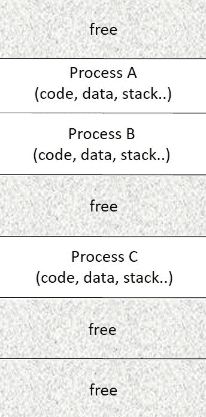
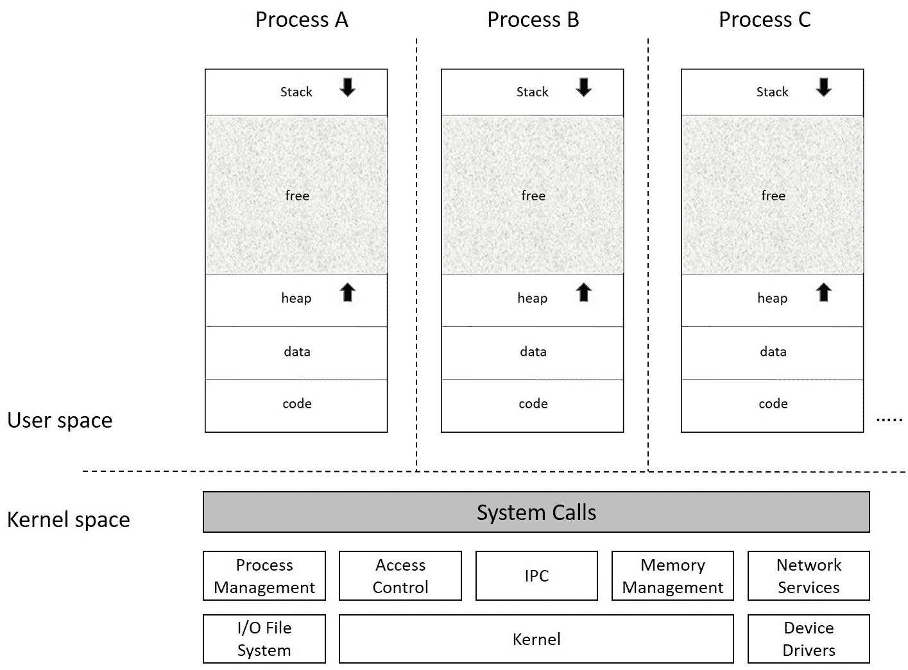
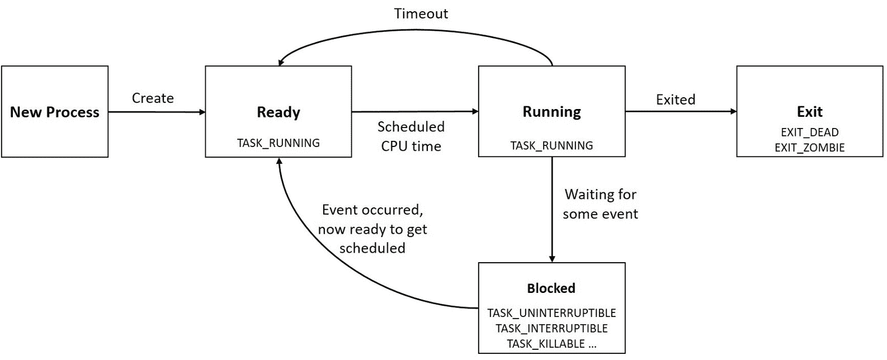
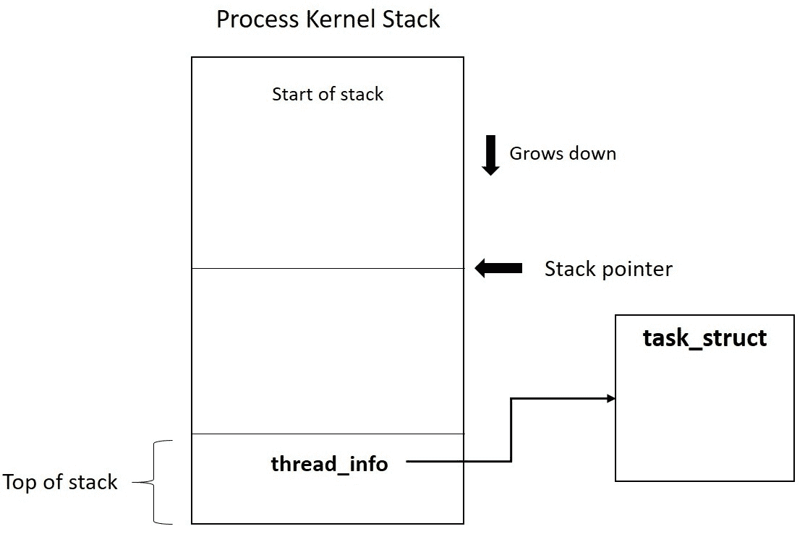
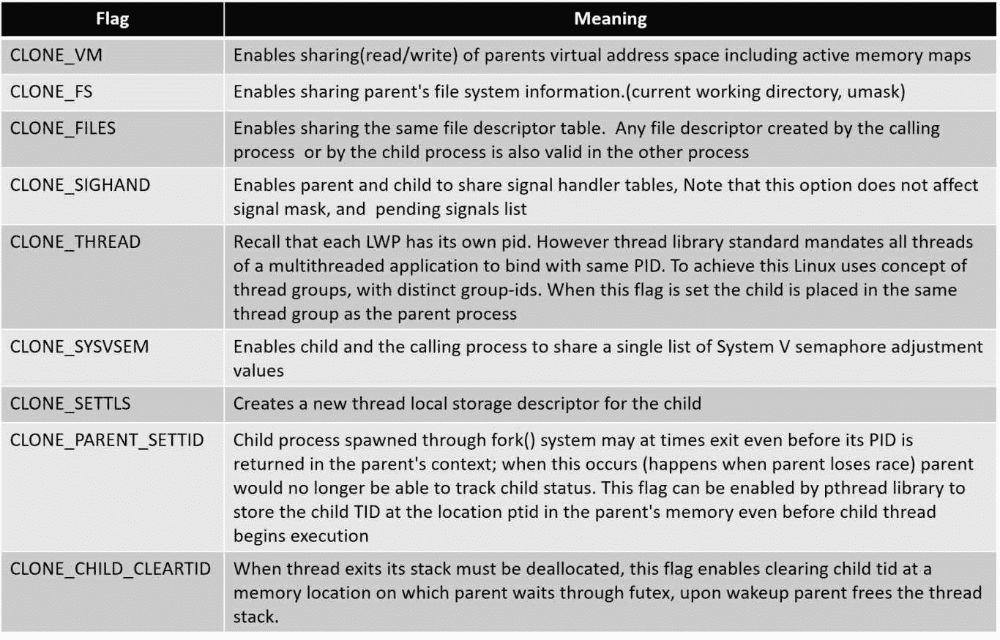
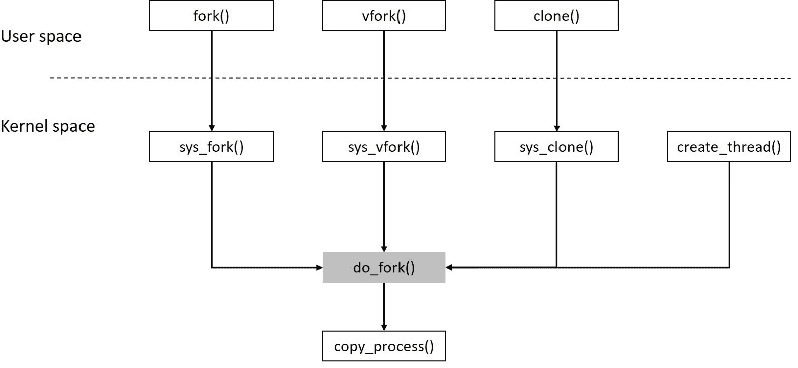

# 一、理解进程、地址空间和线程

当在当前进程上下文中调用内核服务时，它的布局为更详细地研究内核开辟了正确的道路。 我们在本章的工作集中于理解进程和内核为其提供的底层生态系统。 在本章中，我们将探讨以下概念：

*   要处理的程序
*   工艺布局布局
*   虚拟地址空间
*   内核和用户空间
*   流程 API
*   流程描述符
*   内核堆栈管理
*   丝线
*   Linux 线程 API
*   数据结构
*   命名空间和 cgroup

# 流程

从本质上讲，计算系统是为高效运行用户应用而设计、开发并经常进行调整的。 进入计算平台的每个元素都旨在实现有效和高效的应用运行方式。 换句话说，计算系统的存在是为了运行不同的应用。 应用可以在专用设备中作为固件运行，也可以在由系统软件(操作系统)驱动的系统中作为“进程”运行。

就其核心而言，进程是内存中程序的运行实例。 从程序到进程的转换发生在程序(在磁盘上)被提取到内存中以供执行时。

程序的二进制映像包含**代码**(及其所有二进制指令)和**数据**(包含所有全局数据)，它们被映射到具有适当访问权限(读、写和执行)的不同内存区域。 除了代码和数据之外，进程还被分配了额外的内存区域，称为**栈**(用于分配带有自动变量和函数参数的函数调用帧)和*堆*，用于在运行时进行动态分配。

同一程序的多个实例可以通过它们各自的内存分配而存在。 例如，对于具有多个打开的选项卡(运行同时浏览会话)的 Web 浏览器，内核将每个选项卡视为一个进程实例，并分配唯一的内存。

下图表示内存中的进程布局：



# 称为地址空间的错觉

现代计算平台有望有效地处理过多的进程。 因此，操作系统必须为物理内存(通常是有限的)内的所有竞争进程分配唯一内存，并确保其可靠执行。 在多个进程竞争并同时执行的情况下(*多任务*)，操作系统必须确保保护每个进程的内存分配不被其他进程意外访问。

为了解决这个问题，内核在进程和物理内存之间提供了一个抽象级别，称为*虚拟**地址空间*。 虚拟地址空间是进程的内存视图；它是正在运行的程序查看内存的方式。

虚拟地址空间造成了一种错觉，即每个进程在执行时都独占整个内存。 这种抽象的内存视图称为*虚拟内存*，由内核的内存管理器与 CPU 的 MMU 协作实现。 每个进程都被赋予一个连续的 32 位或 64 位地址空间，该地址空间由体系结构限定，并且对于该进程是唯一的。 由于每个进程都被 MMU 限制在其虚拟地址空间中，因此进程访问其边界之外的地址区域的任何尝试都将触发硬件故障，从而使内存管理器能够检测并终止违规进程，从而确保保护。

下图描绘了为每个争用进程创建的地址空间假象：


# 内核和用户空间

现代操作系统不仅防止一个进程访问另一个进程，还防止进程意外地访问或操作内核数据和服务(因为内核由所有进程共享)。

操作系统通过将整个内存划分为两个逻辑部分(用户空间和内核空间)来实现这种保护。 这种分叉确保分配了地址空间的所有进程都映射到内存的用户空间部分，并且内核数据和服务在内核空间中运行。 内核与硬件协同实现这种保护。 当应用进程执行来自其代码段的指令时，CPU 在用户模式下运行。 当一个进程打算调用内核服务时，它需要将 CPU 切换到特权模式(内核模式)，这是通过称为 API(应用编程接口)的特殊功能来实现的。 这些 API 使用户进程能够使用特殊的 CPU 指令切换到内核空间，然后通过*系统调用*执行所需的服务。 在完成请求的服务时，内核使用另一组 CPU 指令执行另一个模式切换，这一次是从内核模式返回到用户模式。

System calls are the kernel's interfaces to expose its services to application processes; they are also called *kernel entry points*. As system calls are implemented in kernel space, the respective handlers are provided through APIs in the user space. API abstraction also makes it easier and convenient to invoke related system calls.

下图显示了虚拟化内存视图：



# 流程上下文

当进程通过系统调用请求内核服务时，内核将代表调用方进程执行。 内核现在被认为是在*进程上下文*中执行的。 类似地，内核还响应由其他硬件实体引发的*中断*；在这里，内核在*中断上下文*中执行。 在中断上下文中，内核不代表任何进程运行。

# 流程描述符

从进程诞生到退出，是内核的进程管理子系统执行各种操作，从创建进程、分配 CPU 时间、事件通知到终止时销毁进程。

除了地址空间，内存中的进程还被分配了一个称为*进程描述符*的数据结构，内核使用它来标识、管理和调度进程。 下图描述了内核中的进程地址空间及其各自的进程描述符：


在 Linux 中，进程描述符是`<linux/sched.h>`中定义的`struct task_struct`类型的实例，它是核心数据结构之一，包含进程持有的所有属性、标识详细信息和资源分配条目。 查看`struct task_struct`就像是窥探内核在管理和调度进程时所看到或使用的内容。

由于任务结构包含广泛的数据元素集，这些数据元素与各种内核子系统的功能相关，因此在本章中讨论所有元素的目的和范围将是断章取义的。 我们将考虑与流程管理相关的几个重要元素。

# 流程属性-关键元素

流程属性定义流程的所有关键和基本特征。 这些元素包含流程的状态和标识以及其他重要的关键值。

# 状态 / 国家 / 政府 / 领土

进程从产生到退出可能存在各种状态，称为*进程状态*--它们定义了进程的当前状态：

*   **TASK_RUNNING**(0)：任务正在执行或争用调度程序运行队列中的 CPU。
*   **TASK_INTERRUPTABLE**(1)：任务处于可中断等待状态；它一直处于等待状态，直到等待的条件变为真，例如互斥锁可用、设备准备好 I/O、睡眠时间已过或独占唤醒。 在此等待状态下，为该进程生成的任何信号都会被传送，导致它在满足等待条件之前被唤醒。
*   **TASK_KILLABLE**：这类似于**TASK_INTERRUPTABLE**，不同之处在于中断只能在致命信号上发生，这使得它成为**TASK_INTERRUPTABLE**更好的替代方案。
*   **TASK_UNINTERRUTPIBLE**(2)：任务处于类似于**TASK_INTERRUPTABLE**的不可中断等待状态，不同之处在于向休眠进程生成的信号不会导致唤醒。 当它正在等待的事件发生时，流程转换到**TASK_RUNNING**。 此进程状态很少使用。
*   **TASK_STOPPED**(4)：任务已收到停止信号。 收到 CONTINUE 信号(SIGCONT)后，它将恢复运行。
*   **TASK_TRACED**(8)：进程在被梳理时被称为跟踪状态，可能是由调试器进行的。
*   **exit_zombie**(32)：进程终止，但其资源尚未回收。
*   **EXIT_DEADE**(16)：在父进程使用*WAIT*收集子进程的退出状态后，子进程被终止并释放其持有的所有资源。

下图描述了流程状态：



# 管路及仪表布置图 / 比例-积分-微分 / 新闻处

此字段包含称为**PID**的唯一进程标识符。 Linux 中的 PID 类型为`pid_t`(整数)。 虽然 PID 是一个整数，但默认的最大 PID 数是通过`/proc/sys/kernel/pid_max`接口指定的 32,768 个。 此文件中的值可以设置为任何值，最大值为 2<sup class="calibre27">22</sup>(`PID_MAX_LIMIT`，大约 400 万)。

为了管理 PID，内核使用位图。 该位图允许内核跟踪正在使用的 PID，并为新进程分配唯一的 PID。 每个 PID 由 PID 位图中的一个位标识；PID 的值由其相应位的位置确定。 位图中值为 1 的位表示对应的 PID 在*中使用*，值为 0 的位表示空闲 PID。 每当内核需要分配唯一的 PID 时，它都会查找第一个未设置的位并将其设置为 1，反之，为了释放 PID，它会将相应的位从 1 切换到 0。

# 非常感谢。

此字段包含线程组 ID。 为便于理解，假设在创建新进程时，其 PID 和 TGID 相同，因为该进程恰好是唯一的线程。 当进程产生新线程时，新子进程将获得唯一的 PID，但会继承父进程的 TGID，因为它属于相同的线程组。 TGID 主要用于支持多线程进程。 我们将在本章的线程部分深入研究更多细节。

# 线程信息

此字段保存处理器特定的状态信息，是任务结构的关键元素。 本章后面几节详细介绍了`thread_info`的重要性。

# 标出 / 悬旗于 / 标记

标志字段记录与进程相对应的各种属性。 该字段中的每个位对应于进程生命周期中的各个阶段。 每进程标志在`<linux/sched.h>`中定义：

```sh
#define PF_EXITING           /* getting shut down */
#define PF_EXITPIDONE        /* pi exit done on shut down */
#define PF_VCPU              /* I'm a virtual CPU */
#define PF_WQ_WORKER         /* I'm a workqueue worker */
#define PF_FORKNOEXEC        /* forked but didn't exec */
#define PF_MCE_PROCESS       /* process policy on mce errors */
#define PF_SUPERPRIV         /* used super-user privileges */
#define PF_DUMPCORE          /* dumped core */
#define PF_SIGNALED          /* killed by a signal */
#define PF_MEMALLOC          /* Allocating memory */
#define PF_NPROC_EXCEEDED    /* set_user noticed that RLIMIT_NPROC was exceeded */
#define PF_USED_MATH         /* if unset the fpu must be initialized before use */
#define PF_USED_ASYNC        /* used async_schedule*(), used by module init */
#define PF_NOFREEZE          /* this thread should not be frozen */
#define PF_FROZEN            /* frozen for system suspend */
#define PF_FSTRANS           /* inside a filesystem transaction */
#define PF_KSWAPD            /* I am kswapd */
#define PF_MEMALLOC_NOIO0    /* Allocating memory without IO involved */
#define PF_LESS_THROTTLE     /* Throttle me less: I clean memory */
#define PF_KTHREAD           /* I am a kernel thread */
#define PF_RANDOMIZE         /* randomize virtual address space */
#define PF_SWAPWRITE         /* Allowed to write to swap */
#define PF_NO_SETAFFINITY    /* Userland is not allowed to meddle with cpus_allowed */
#define PF_MCE_EARLY         /* Early kill for mce process policy */
#define PF_MUTEX_TESTER      /* Thread belongs to the rt mutex tester */
#define PF_FREEZER_SKIP      /* Freezer should not count it as freezable */
#define PF_SUSPEND_TASK      /* this thread called freeze_processes and should not be frozen */
```

# 退出代码和退出信号

这些字段包含任务的退出值和导致终止的信号的详细信息。 子进程终止时，父进程将通过`wait()`访问这些字段。

# 科姆 / 人名 / 参见 comms

此字段保存用于启动进程的二进制可执行文件的名称。

# Ptrace

此字段在使用`ptrace()`系统调用将进程置于跟踪模式时启用和设置。

# 流程关系-关键要素

每个进程都可以与父进程相关，从而建立父子关系。 同样，由同一进程产生的多个进程称为*同级进程*。 这些字段确定当前流程如何与另一个流程相关。

# 真实父项和父项(_A)

这些是指向父级任务结构的指针。 对于正常进程，这两个指针引用相同的`task_struct`*；*它们只对使用`posix`线程实现的多线程进程有所不同。 在这种情况下，`real_parent`指的是父线程任务结构，父指的是 SIGCHLD 被传递到的进程任务结构。

# 孩子们（child 的复数）

这是指向子任务结构列表的指针。

# 兄弟，姊妹，同胞

这是指向同级任务结构列表的指针。

# 组长

这是一个指向流程组长任务结构的指针。

# 计划属性-关键元素

所有竞争的进程都必须获得公平的 CPU 时间，这需要基于时间片和进程优先级进行调度。 这些属性包含调度程序在决定哪个进程在竞争时获得优先级时使用的必要信息。

# PRIO 和 STATIC_PRIO

`prio`帮助确定调度进程的优先级。 如果为进程分配了实时调度策略，则此字段保存在`1`到`99`(由`sched_setscheduler()`指定)范围内的进程的静态优先级。 对于正常进程，此字段保存从 NICE 值派生的动态优先级。

# Se、rt 和 dl

每个任务都属于一个调度实体(任务组)，因为调度是在每个实体级别上完成的。 `se`用于所有正常进程，`rt`用于实时进程，`dl`用于截止日期进程。 我们将在关于日程安排的下一章中详细讨论这些属性。

# 政策 / 方针 / 权宜之举 / 保险单

此字段包含有关进程调度策略的信息，有助于确定其优先级。

# 允许的 CPU_

此字段指定进程的 CPU 掩码，即有资格在多处理器系统中调度进程的 CPU。

# RT_ 优先级

此字段指定实时调度策略要应用的优先级。 对于非实时流程，此字段未使用。

# 工艺限制--关键要素

内核施加资源限制，以确保在竞争的进程之间公平分配系统资源。 这些限制保证了随机进程不会垄断资源所有权。 有 16 种不同类型的资源限制，`task structure`指向类型为`struct rlimit`*，*的数组，其中每个偏移量保存特定资源的当前和最大值。

```sh
/*include/uapi/linux/resource.h*/
struct rlimit {
  __kernel_ulong_t        rlim_cur;
  __kernel_ulong_t        rlim_max;
};
These limits are specified in *include/uapi/asm-generic/resource.h* 
 #define RLIMIT_CPU        0       /* CPU time in sec */
 #define RLIMIT_FSIZE      1       /* Maximum filesize */
 #define RLIMIT_DATA       2       /* max data size */
 #define RLIMIT_STACK      3       /* max stack size */
 #define RLIMIT_CORE       4       /* max core file size */
 #ifndef RLIMIT_RSS
 # define RLIMIT_RSS       5       /* max resident set size */
 #endif
 #ifndef RLIMIT_NPROC
 # define RLIMIT_NPROC     6       /* max number of processes */
 #endif
 #ifndef RLIMIT_NOFILE
 # define RLIMIT_NOFILE    7       /* max number of open files */
 #endif
 #ifndef RLIMIT_MEMLOCK
 # define RLIMIT_MEMLOCK   8       /* max locked-in-memory   
 address space */
 #endif
 #ifndef RLIMIT_AS
 # define RLIMIT_AS        9       /* address space limit */
 #endif
 #define RLIMIT_LOCKS      10      /* maximum file locks held */
 #define RLIMIT_SIGPENDING 11      /* max number of pending signals */
 #define RLIMIT_MSGQUEUE   12      /* maximum bytes in POSIX mqueues */
 #define RLIMIT_NICE       13      /* max nice prio allowed to 
 raise to 0-39 for nice level 19 .. -20 */
 #define RLIMIT_RTPRIO     14      /* maximum realtime priority */
 #define RLIMIT_RTTIME     15      /* timeout for RT tasks in us */
 #define RLIM_NLIMITS      16
```

# 文件描述符表-关键元素

在进程的生命周期中，它可以访问各种资源文件来完成其任务。 这会导致打开、关闭、读取和写入这些文件的过程。 系统必须跟踪这些活动；文件描述符元素帮助系统知道进程持有哪些文件。

# 上士 / 同 Flight Sergeant

文件系统信息存储在此字段中。

# 文件夹 / 卷宗 / 文件 / 锉刀

文件描述符表包含指向进程打开以执行各种操作的所有文件的指针。 FILES 字段包含指向此文件描述符表的指针。

# 信号描述符-关键元素

对于处理信号的进程，*任务结构*具有确定必须如何处理信号的各种元素。

# 暗号 / 信号 / 表示 / 起因

它的类型为`struct signal_struct`*，*，它包含与该过程相关的所有信号的信息。

# 签名

它的类型为`struct sighand_struct`*，*，它包含与该进程相关联的所有信号处理程序。

# Sigset_t 阻塞，REAL_BLOCKED

这些元素标识当前被进程屏蔽或阻止的信号。

# 悬而未决的 / 待定的 / 行将发生的

这是类型`struct sigpending`*，*，它标识已生成但尚未传送的信号。

# SAS_SS_SP

此字段包含指向备用堆栈的指针，这有助于信号处理。

# S_ss_s_s_

此字段显示用于信号处理的备用堆栈的大小。

# 内核堆栈

使用由能够同时运行应用的多核硬件驱动的当代计算平台，内置了多个进程在请求相同进程时同时启动内核模式切换的可能性。 为了能够处理这种情况，内核服务被设计为可重入的，允许多个进程介入并使用所需的服务。 这要求请求进程维护其自己的私有内核堆栈，以跟踪内核函数调用序列、存储内核函数的本地数据等。

内核堆栈直接映射到物理内存，要求该布置在物理上处于连续区域中。 对于 x86-32 和大多数其他 32 位系统，内核堆栈的默认大小为 8KB(可以选择在内核构建期间配置 4k 内核堆栈)，在 x86-64 系统上为 16KB。

当在当前进程上下文中调用内核服务时，它们需要在进程提交任何相关操作之前验证进程的特权。 要执行此类验证，内核服务必须能够访问当前进程的任务结构并查看相关字段。 类似地，内核例程可能需要访问当前的`task structure`来修改各种资源结构，如信号处理程序表、查找挂起信号、文件描述符表和内存描述符等。 为了能够在运行时访问`task structure`，当前`task structure`的地址被加载到处理器寄存器(所选寄存器是特定于体系结构的)，并通过名为`current`(在特定于体系结构的内核标题`asm/current.h`中定义)的内核全局宏提供：

```sh
  /* arch/ia64/include/asm/current.h */
  #ifndef _ASM_IA64_CURRENT_H
  #define _ASM_IA64_CURRENT_H
  /*
  * Modified 1998-2000
  *      David Mosberger-Tang <davidm@hpl.hp.com>, Hewlett-Packard Co
  */
  #include <asm/intrinsics.h>
  /*
  * In kernel mode, thread pointer (r13) is used to point to the 
    current task
  * structure.
  */
 #define current ((struct task_struct *) ia64_getreg(_IA64_REG_TP))
 #endif /* _ASM_IA64_CURRENT_H */
 /* arch/powerpc/include/asm/current.h */
 #ifndef _ASM_POWERPC_CURRENT_H
 #define _ASM_POWERPC_CURRENT_H
 #ifdef __KERNEL__
 /*
 * This program is free software; you can redistribute it and/or
 * modify it under the terms of the GNU General Public License
 * as published by the Free Software Foundation; either version
 * 2 of the License, or (at your option) any later version.
 */
 struct task_struct;
 #ifdef __powerpc64__
 #include <linux/stddef.h>
 #include <asm/paca.h>
 static inline struct task_struct *get_current(void)
 {
       struct task_struct *task;

       __asm__ __volatile__("ld %0,%1(13)"
       : "=r" (task)
       : "i" (offsetof(struct paca_struct, __current)));
       return task;
 }
 #define current get_current()
 #else
 /*
 * We keep `current' in r2 for speed.
 */
 register struct task_struct *current asm ("r2");
 #endif
 #endif /* __KERNEL__ */
 #endif /* _ASM_POWERPC_CURRENT_H */
```

然而，在寄存器受限的体系结构中，可供备用的寄存器很少，因此保留寄存器来保存当前任务结构的地址是不可行的。 在这样的平台上，当前进程的`task structure`直接在它拥有的内核堆栈的顶部可用。 通过仅屏蔽堆栈指针的最低有效位，这种方法在定位`task structure`方面具有显著优势。

随着内核的发展，`task structure`变得太大，无法包含在内核堆栈中，而内核堆栈已经受到物理内存(8KB)的限制。 结果，`task structure`被移出了内核堆栈，只保留了定义进程的 CPU 状态和其他低级处理器特定信息的几个关键字段。 然后，这些字段被包装在一个名为`struct thread_info`*的新创建的结构中。* 此结构包含在内核堆栈的顶部，并提供指向当前`task structure`的指针，内核服务可以使用该指针。

以下代码片段显示了 x86 体系结构(内核 3.10)的`struct thread_info`：

```sh
/* linux-3.10/arch/x86/include/asm/thread_info.h */ struct thread_info {
 struct task_struct *task; /* main task structure */
 struct exec_domain *exec_domain; /* execution domain */
 __u32 flags; /* low level flags */
 __u32 status; /* thread synchronous flags */
 __u32 cpu; /* current CPU */
 int preempt_count; /* 0 => preemptable, <0 => BUG */
 mm_segment_t addr_limit;
 struct restart_block restart_block;
 void __user *sysenter_return;
 #ifdef CONFIG_X86_32
 unsigned long previous_esp; /* ESP of the previous stack in case of   
 nested (IRQ) stacks */
 __u8 supervisor_stack[0];
 #endif
 unsigned int sig_on_uaccess_error:1;
 unsigned int uaccess_err:1; /* uaccess failed */
};
```

对于包含与进程相关的信息的`thread_info`，除了`task structure`之外，内核对当前进程结构有多个观点：`struct task_struct`，一个独立于体系结构的信息块，以及`thread_info`，一个特定于体系结构的信息块。 下图描述了**THREAD_INFO**和**TASK_STRUT**：



对于使用`thread_info`*、*的体系结构，修改当前宏的实现以查看内核堆栈的顶部，以获得对当前`thread_info`的引用，并通过它获得对`current task structure`的引用。 以下代码片段显示了用于 x86-64 平台的 Current 的实现：

```sh
  #ifndef __ASM_GENERIC_CURRENT_H
  #define __ASM_GENERIC_CURRENT_H
  #include <linux/thread_info.h>

  #define get_current() (current_thread_info()->task)
  #define current get_current()

  #endif /* __ASM_GENERIC_CURRENT_H */
  /*
  * how to get the current stack pointer in C
  */
  register unsigned long current_stack_pointer asm ("sp");

  /*
   * how to get the thread information struct from C
   */
  static inline struct thread_info *current_thread_info(void)  
  __attribute_const__;

  static inline struct thread_info *current_thread_info(void)
  {
         return (struct thread_info *)
                 (current_stack_pointer & ~(THREAD_SIZE - 1));
  }
```

随着最近`PER_CPU`变量的使用增多，进程调度器被调优为在`PER_CPU`区域中缓存关键的当前进程相关信息。 这一更改允许通过查找内核堆栈快速访问当前进程数据。 下面的代码片段显示了通过`PER_CPU`变量获取当前任务数据的当前宏的实现：

```sh
  #ifndef _ASM_X86_CURRENT_H
  #define _ASM_X86_CURRENT_H

  #include <linux/compiler.h>
  #include <asm/percpu.h>

  #ifndef __ASSEMBLY__
  struct task_struct;

  DECLARE_PER_CPU(struct task_struct *, current_task);

  static __always_inline struct task_struct *get_current(void)
  {
          return this_cpu_read_stable(current_task);
  }

  #define current get_current()

  #endif /* __ASSEMBLY__ */

  #endif /* _ASM_X86_CURRENT_H */
```

`PER_CPU`数据的使用导致了`thread_info`中信息的逐渐减少。 随着`thread_info`尺寸的缩小，内核开发人员正在考虑通过将`thread_info`移到`task structure`来完全摆脱`thread_info`。 由于这涉及到对低级体系结构代码的更改，因此它只针对 x86-64 体系结构实现，其他体系结构也计划效仿。 下面的代码片段仅显示了具有一个元素的`thread_info`结构的当前状态：

```sh
/* linux-4.9.10/arch/x86/include/asm/thread_info.h */
struct thread_info {
 unsigned long flags; /* low level flags */
};
```

# 堆栈溢出问题

与用户模式不同，内核模式堆栈位于直接映射的内存中。 当进程调用可能在内部嵌套很深的内核服务时，它可能会溢出到立即内存范围内。 最糟糕的是内核不会注意到这种情况。 内核程序员通常使用各种调试选项来跟踪堆栈使用情况并检测溢出，但这些方法对于防止生产系统上的堆栈破坏并不方便。 这里也排除了通过使用*保护页*进行的常规保护(因为它浪费了实际的存储器页)。

内核程序员倾向于遵循编码标准--最大限度地减少本地数据的使用，避免递归，以及避免在其他方面进行深度嵌套--以降低堆栈崩溃的可能性。 然而，功能丰富且分层较深的内核子系统的实现可能会带来各种设计挑战和复杂性，特别是对于存储子系统，其中文件系统、存储驱动程序和网络代码可以堆叠在多个层中，从而导致深度嵌套的函数调用。

Linux 内核社区已经考虑了很长时间来防止这样的漏洞，为此，决定将内核堆栈扩展到 16KB(从 3.15 内核开始，扩展到 x86-64)。 内核堆栈的扩展可能会防止某些漏洞，但代价是将大量直接映射的内核内存用于每个进程的内核堆栈。 然而，为了系统的可靠运行，当堆栈破坏出现在生产系统上时，内核应该优雅地处理它们。

在 4.9 版中，内核配备了一个新系统来设置虚拟映射的内核堆栈。 由于当前使用虚拟地址来映射甚至是直接映射的页面，因此内核堆栈实际上并不需要物理上连续的页面。 内核为虚拟映射内存保留一个单独的地址范围，在调用`vmalloc()`时分配该范围内的地址。 此内存范围称为**vmalloc 范围**。 首先，当程序需要巨大的内存块(这些内存块实际上是连续的，但物理上是分散的)时，就会使用这个范围。 使用这一点，内核堆栈现在可以作为单独的页面分配，并映射到 vmalloc 范围。 虚拟映射还可以防止溢出，因为可以为不可访问保护页分配页表条目(而不会浪费实际的页)。 保护页会提示内核在内存溢出时弹出一条 OOPS 消息，并启动针对溢出进程的终止。

带有保护页的虚拟映射内核堆栈目前仅适用于 x86-64 体系结构(似乎还会支持其他体系结构)。 这可以通过选择`HAVE_ARCH_VMAP_STACK`或`CONFIG_VMAP_STACK`构建时选项来启用。

# 流程创建

在内核引导期间，会产生一个名为`init is`的内核线程，该线程又被配置为初始化第一个用户模式进程(同名)。 然后将`init`(PID 1)进程配置为执行通过配置文件指定的各种初始化操作，从而创建多个进程。 进一步创建的每个子进程(可以依次创建自己的子进程)都是*init*进程的后代。 这样创建的流程最终以树状结构或单个层次模型结束。 `shell`是这样一个进程，当程序被调用执行时，它成为用户创建用户进程的界面。

Fork、vfork、exec、clone、wait 和 exit 是创建和控制新进程的核心内核接口。 这些操作通过相应的用户模式 API 调用。

# Fork()

`Fork()`是自传统 Unix 版本开始以来在*NIX 系统中提供的核心“Unix 线程 API”之一。 它的名字很贴切，它从正在运行的进程派生出一个新进程。 当`fork()`成功时，通过复制调用方的`address space`和`task structure`来创建新进程(称为`child`)。 从`fork()`返回时，调用方(父进程)和新进程(子进程)都将继续执行同一代码段中的指令，该代码段在写入时复制。 `Fork()`可能是唯一在调用方进程上下文中进入内核模式的 API，如果成功，则会在调用方和子(新进程)上下文中返回到用户模式。

父级`task structure`的大多数资源条目(如内存描述符、文件描述符表、信号描述符和调度属性)都由子级继承，只有少数属性(如内存锁、挂起信号、活动计时器和文件记录锁)除外(有关异常的完整列表，请参阅 fork(2)手册页)。 子进程被分配一个唯一的`pid`，并将通过其`task structure`*的`ppid`字段引用其父进程的`pid`；*子进程的资源利用率和处理器使用率条目被重置为零。

父进程使用`wait()`系统调用更新子进程的状态，并通常等待子进程终止。 如果未调用`wait()`*、*，则孩子可能会终止并被推入僵尸状态。

# 写入时拷贝(COW)

复制父进程以创建子进程需要克隆子进程的父进程的用户模式地址空间(`stack`、`data`、`code`和`heap`段)和任务结构；这将导致不确定的进程创建时间的执行开销。 更糟糕的是，如果父代和子代都没有在克隆资源上启动任何状态更改操作，则此克隆过程将变得毫无用处。

根据 COW，当创建子对象时，会为其分配一个唯一的`task structure`，所有资源条目(包括页表)都引用父对象的`task structure`，父对象和子对象都具有只读访问权限。 当两个进程中的任何一个进程启动状态更改操作时，资源实际上是重复的，因此名称为*写入时复制*(COW 中的`write`表示状态更改)。 COW 确实带来了效率和优化，因为它将复制进程数据的需要推迟到写入，并且在只进行读取的情况下，它完全避免了这一点。 这种按需复制还可以减少所需的交换分页数量，减少交换所花费的时间，并可能有助于减少请求分页。

# 经理 / 主管人员

有时创建子进程可能没有什么用处，除非它完全运行一个新程序：`exec`系列调用正是为了这个目的。 `exec`用新的可执行二进制文件替换进程中的现有程序：

```sh
#include <unistd.h>
int execve(const char *filename, char *const argv[],
char *const envp[]);
```

`execve`是执行程序二进制文件的系统调用，作为第一个参数传递给它。 第二个和第三个参数是以 NULL 结尾的参数和环境字符串数组，将作为命令行参数传递给新程序。 此系统调用还可以通过各种`glibc`(库)包装器调用，它们被发现更方便、更灵活：

```sh
#include <unistd.h>
extern char **environ;
int execl(const char *path, const char *arg, ...);
int execlp(const char *file, const char *arg, ...);
int execle(const char *path, const char *arg,
..., char * const envp[]);
int execv(const char *path, char *constargv[]);
int execvp(const char *file, char *constargv[]);
int execvpe(const char *file, char *const argv[],
char *const envp[]);
```

命令行用户界面程序(如`shell`)使用`exec`界面启动用户请求的程序二进制文件。

# Vfork()

与`fork()`不同，`vfork()`创建子进程并阻止父进程，这意味着子进程作为单个线程运行，不允许并发；换句话说，父进程暂时挂起，直到子进程退出或调用`exec()`。 子代共享父代的数据。

# Linux 对线程的支持

进程中的执行流被称为**线程**，这意味着每个进程至少有一个执行线程。 多线程意味着流程中存在多个执行上下文流。 使用现代多核体系结构，流程中的多个执行流可以真正并发，从而实现公平的多任务处理。

线程通常被枚举为进程中计划执行的纯用户级实体；它们共享父进程的虚拟地址空间和系统资源。 每个线程维护其代码、堆栈和线程本地存储。 线程由线程库调度和管理，线程库使用称为线程对象的结构来保存唯一的线程标识符，用于调度属性和保存线程上下文。 用户级线程应用通常内存较少，并且是事件驱动应用的首选并发模型。 另一方面，这种用户级线程模型不适合并行计算，因为它们绑定到其父进程绑定到的同一处理器核心上。

Linux 不直接支持用户级线程；相反，它提出了一个替代 API 来枚举称为**l****轻量级进程**(**LWP**)的特殊进程，该进程可以与父进程共享一组已配置的资源，如动态内存分配、全局数据、打开文件、信号处理程序和其他大量资源。 每个 LWP 由唯一的 PID 和任务结构标识，内核将其视为独立的执行上下文。 在 Linux 中，术语线程总是指 LWP，因为由线程库(`Pthreads`)初始化的每个线程都被内核枚举为 LWP。

# 克隆()

`clone()`是用于创建新进程的特定于 Linux 的系统调用；它被视为`fork()`系统调用的通用版本，通过`flags`参数提供更精细的控件来自定义其功能：

```sh
int clone(int (*child_func)(void *), void *child_stack, int flags, void *arg);
```

它提供了二十多个不同的`CLONE_*`标志来控制`clone`操作的各个方面，包括父进程和子进程是否共享资源，如虚拟内存、打开的文件描述符和信号处理。 使用适当的内存地址(作为第二个参数传递)创建子对象，将其用作`stack`(用于存储子对象的本地数据)。 子进程使用其 start 函数(作为第一个参数传递给克隆调用)开始执行。

当进程尝试通过`pthread`库创建线程时，将使用以下标志调用`clone()`：

```sh
/*clone flags for creating threads*/
flags=CLONE_VM|CLONE_FS|CLONE_FILES|CLONE_SIGHAND|CLONE_THREAD|CLONE_SYSVSEM|CLONE_SETTLS|CLONE_PARENT_SETTID|CLONE_CHILD_CLEARTID;
```



`clone()`还可用于创建通常使用`fork()`和`vfork()`派生的常规子进程：

```sh
/* clone flags for forking child */
flags = SIGCHLD;
/* clone flags for vfork child */ 
flags = CLONE_VFORK | CLONE_VM | SIGCHLD;
```

# 内核线程

为了满足运行后台操作的需要，内核会派生线程(类似于进程)。 这些内核线程类似于常规进程，因为它们由任务结构表示并分配了 PID。 与用户进程不同，它们没有映射任何地址空间，并且以内核模式独占运行，这使得它们不能交互。 各种内核子系统使用`kthreads`来运行周期性和异步操作。

所有内核线程都是`kthreadd (pid 2)`的后代，`kthreadd (pid 2)`是由`kernel (pid 0)`在引导期间产生的。 `kthreadd`枚举其他内核线程；它提供接口例程，内核服务可以通过这些例程在运行时动态生成其他内核线程。 可以使用`ps -ef`命令从命令行查看内核线程--它们显示在[方括号]中：

```sh
UID PID PPID C STIME TTY TIME CMD
root 1 0 0 22:43 ? 00:00:01 /sbin/init splash
root 2 0 0 22:43 ? 00:00:00 [kthreadd]
root 3 2 0 22:43 ? 00:00:00 [ksoftirqd/0]
root 4 2 0 22:43 ? 00:00:00 [kworker/0:0]
root 5 2 0 22:43 ? 00:00:00 [kworker/0:0H]
root 7 2 0 22:43 ? 00:00:01 [rcu_sched]
root 8 2 0 22:43 ? 00:00:00 [rcu_bh]
root 9 2 0 22:43 ? 00:00:00 [migration/0]
root 10 2 0 22:43 ? 00:00:00 [watchdog/0]
root 11 2 0 22:43 ? 00:00:00 [watchdog/1]
root 12 2 0 22:43 ? 00:00:00 [migration/1]
root 13 2 0 22:43 ? 00:00:00 [ksoftirqd/1]
root 15 2 0 22:43 ? 00:00:00 [kworker/1:0H]
root 16 2 0 22:43 ? 00:00:00 [watchdog/2]
root 17 2 0 22:43 ? 00:00:00 [migration/2]
root 18 2 0 22:43 ? 00:00:00 [ksoftirqd/2]
root 20 2 0 22:43 ? 00:00:00 [kworker/2:0H]
root 21 2 0 22:43 ? 00:00:00 [watchdog/3]
root 22 2 0 22:43 ? 00:00:00 [migration/3]
root 23 2 0 22:43 ? 00:00:00 [ksoftirqd/3]
root 25 2 0 22:43 ? 00:00:00 [kworker/3:0H]
root 26 2 0 22:43 ? 00:00:00 [kdevtmpfs]
/*kthreadd creation code (init/main.c) */
static noinline void __ref rest_init(void)
{
 int pid;

 rcu_scheduler_starting();
 /*
 * We need to spawn init first so that it obtains pid 1, however
 * the init task will end up wanting to create kthreads, which, if
 * we schedule it before we create kthreadd, will OOPS.
 */
 kernel_thread(kernel_init, NULL, CLONE_FS);
 numa_default_policy();
 pid = kernel_thread(kthreadd, NULL, CLONE_FS | CLONE_FILES);
 rcu_read_lock();
 kthreadd_task = find_task_by_pid_ns(pid, &init_pid_ns);
 rcu_read_unlock();
 complete(&kthreadd_done);

 /*
 * The boot idle thread must execute schedule()
 * at least once to get things moving:
 */
 init_idle_bootup_task(current);
 schedule_preempt_disabled();
 /* Call into cpu_idle with preempt disabled */
 cpu_startup_entry(CPUHP_ONLINE);
}
```

前面的代码显示内核引导例程`rest_init()`使用适当的参数调用`kernel_thread()`例程，以同时派生`kernel_init`线程(然后该线程启动用户模式`init`进程)和`kthreadd`。

`kthread`是一个永久运行的线程，它在名为`kthread_create_list`的列表中查找要创建的新`kthreads`上的数据：

```sh
/*kthreadd routine(kthread.c) */
int kthreadd(void *unused)
{
 struct task_struct *tsk = current;

 /* Setup a clean context for our children to inherit. */
 set_task_comm(tsk, "kthreadd");
 ignore_signals(tsk);
 set_cpus_allowed_ptr(tsk, cpu_all_mask);
 set_mems_allowed(node_states[N_MEMORY]);

 current->flags |= PF_NOFREEZE;

 for (;;) {
 set_current_state(TASK_INTERRUPTIBLE);
 if (list_empty(&kthread_create_list))
 schedule();
 __set_current_state(TASK_RUNNING);

 spin_lock(&kthread_create_lock);
 while (!list_empty(&kthread_create_list)) {
 struct kthread_create_info *create;

 create = list_entry(kthread_create_list.next,
 struct kthread_create_info, list);
 list_del_init(&create->list);
 spin_unlock(&kthread_create_lock);

 create_kthread(create); /* creates kernel threads with attributes enqueued */

 spin_lock(&kthread_create_lock);
 }
 spin_unlock(&kthread_create_lock);
 }

 return 0;
}
```

内核线程是通过调用`kthread_create`或通过其包装器`kthread_run`来创建的，方法是传递定义`kthreadd`(启动例程、启动例程的 ARG 数据和名称)的适当参数。 下面的代码片段显示了`kthread_create`调用`kthread_create_on_node()`，默认情况下会在当前 NUMA 节点上创建线程：

```sh
struct task_struct *kthread_create_on_node(int (*threadfn)(void *data),
 void *data,
 int node,
 const char namefmt[], ...);

/**
 * kthread_create - create a kthread on the current node
 * @threadfn: the function to run in the thread
 * @data: data pointer for @threadfn()
 * @namefmt: printf-style format string for the thread name
 * @...: arguments for @namefmt.
 *
 * This macro will create a kthread on the current node, leaving it in
 * the stopped state. This is just a helper for       
 * kthread_create_on_node();
 * see the documentation there for more details.
 */
#define kthread_create(threadfn, data, namefmt, arg...) 
 kthread_create_on_node(threadfn, data, NUMA_NO_NODE, namefmt, ##arg)

struct task_struct *kthread_create_on_cpu(int (*threadfn)(void *data),
 void *data,
 unsigned int cpu,
 const char *namefmt);

/**
 * kthread_run - create and wake a thread.
 * @threadfn: the function to run until signal_pending(current).
 * @data: data ptr for @threadfn.
 * @namefmt: printf-style name for the thread.
 *
 * Description: Convenient wrapper for kthread_create() followed by
 * wake_up_process(). Returns the kthread or ERR_PTR(-ENOMEM).
 */
#define kthread_run(threadfn, data, namefmt, ...) 
({ 
 struct task_struct *__k 
 = kthread_create(threadfn, data, namefmt, ## __VA_ARGS__); 
 if (!IS_ERR(__k)) 
 wake_up_process(__k); 
 __k; 
})
```

`kthread_create_on_node()`实例化要创建的`kthread`的细节(作为参数接收)到类型`kthread_create_info`的结构中，并将其排在`kthread_create_list`的尾部。 然后它唤醒`kthreadd`并等待线程创建完成：

```sh
/* kernel/kthread.c */
static struct task_struct *__kthread_create_on_node(int (*threadfn)(void *data),
 void *data, int node,
 const char namefmt[],
 va_list args)
{
 DECLARE_COMPLETION_ONSTACK(done);
 struct task_struct *task;
 struct kthread_create_info *create = kmalloc(sizeof(*create),
 GFP_KERNEL);

 if (!create)
 return ERR_PTR(-ENOMEM);
 create->threadfn = threadfn;
 create->data = data;
 create->node = node;
 create->done = &done;

 spin_lock(&kthread_create_lock);
 list_add_tail(&create->list, &kthread_create_list);
 spin_unlock(&kthread_create_lock);

 wake_up_process(kthreadd_task);
 /*
 * Wait for completion in killable state, for I might be chosen by
 * the OOM killer while kthreadd is trying to allocate memory for
 * new kernel thread.
 */
 if (unlikely(wait_for_completion_killable(&done))) {
 /*
 * If I was SIGKILLed before kthreadd (or new kernel thread)
 * calls complete(), leave the cleanup of this structure to
 * that thread.
 */
 if (xchg(&create->done, NULL))
 return ERR_PTR(-EINTR);
 /*
 * kthreadd (or new kernel thread) will call complete()
 * shortly.
 */
 wait_for_completion(&done); // wakeup on completion of thread creation.
 }
...
...
...
}

struct task_struct *kthread_create_on_node(int (*threadfn)(void *data),
 void *data, int node,
 const char namefmt[],
 ...)
{
 struct task_struct *task;
 va_list args;

 va_start(args, namefmt);
 task = __kthread_create_on_node(threadfn, data, node, namefmt, args);
 va_end(args);

 return task;
}
```

回想一下，`kthreadd`根据列表中排队的数据调用`create_thread()`例程来启动内核线程。 此例程创建线程并发出完成信号：

```sh
/* kernel/kthread.c */
static void create_kthread(struct kthread_create_info *create)
{
 int pid;

 #ifdef CONFIG_NUMA
 current->pref_node_fork = create->node;
 #endif

 /* We want our own signal handler (we take no signals by default). */
 pid = kernel_thread(kthread, create, CLONE_FS | CLONE_FILES |  
 SIGCHLD);
 if (pid < 0) {
 /* If user was SIGKILLed, I release the structure. */
 struct completion *done = xchg(&create->done, NULL);

 if (!done) {
 kfree(create);
 return;
 }
 create->result = ERR_PTR(pid);
 complete(done); /* signal completion of thread creation */
 }
}
```

# Do_fork()和 copy_process()

到目前为止讨论的所有进程/线程创建调用都会调用不同的系统调用(除了`create_thread`)来步入内核模式。 所有这些系统调用依次会聚到公共内核`function _do_fork()`中，使用不同的`CLONE_*`标志调用该内核。 `do_fork()`内部依靠`copy_process()`来完成任务。 下图总结了流程创建的调用顺序：

```sh
/* kernel/fork.c */
/*
 * Create a kernel thread.
 */
```

```sh
pid_t kernel_thread(int (*fn)(void *), void *arg, unsigned long flags)
{
 return _do_fork(flags|CLONE_VM|CLONE_UNTRACED, (unsigned long)fn,
 (unsigned long)arg, NULL, NULL, 0);
}

/* sys_fork: create a child process by duplicating caller */
SYSCALL_DEFINE0(fork)
{
#ifdef CONFIG_MMU
 return _do_fork(SIGCHLD, 0, 0, NULL, NULL, 0);
#else
 /* cannot support in nommu mode */
 return -EINVAL;
#endif
}

/* sys_vfork: create vfork child process */
SYSCALL_DEFINE0(vfork)
{
 return _do_fork(CLONE_VFORK | CLONE_VM | SIGCHLD, 0,
 0, NULL, NULL, 0);
}

/* sys_clone: create child process as per clone flags */

#ifdef __ARCH_WANT_SYS_CLONE
#ifdef CONFIG_CLONE_BACKWARDS
SYSCALL_DEFINE5(clone, unsigned long, clone_flags, unsigned long, newsp,
 int __user *, parent_tidptr,
 unsigned long, tls,
 int __user *, child_tidptr)
#elif defined(CONFIG_CLONE_BACKWARDS2)
SYSCALL_DEFINE5(clone, unsigned long, newsp, unsigned long, clone_flags,
 int __user *, parent_tidptr,
 int __user *, child_tidptr,
 unsigned long, tls)
#elif defined(CONFIG_CLONE_BACKWARDS3)
SYSCALL_DEFINE6(clone, unsigned long, clone_flags, unsigned long, newsp,
 int, stack_size,
 int __user *, parent_tidptr,
 int __user *, child_tidptr,
 unsigned long, tls)
#else
SYSCALL_DEFINE5(clone, unsigned long, clone_flags, unsigned long, newsp,
 int __user *, parent_tidptr,
 int __user *, child_tidptr,
 unsigned long, tls)
#endif
{
 return _do_fork(clone_flags, newsp, 0, parent_tidptr, child_tidptr, tls);
}
#endif

```



# 进程状态和终止

在进程的生命周期中，它在最终终止之前会遍历许多状态。 用户必须具有适当的机制，才能根据进程在其生命周期内发生的所有情况进行更新。 Linux 为此提供了一组函数。

# 等待 / 迫不及待 / 推迟

对于由父进程创建的进程和线程，父进程知道子进程/线程的执行状态在功能上可能很有用。 这可以使用`wait`系列系统调用来实现：

```sh
#include <sys/types.h>
#include <sys/wait.h>
pid_t wait(int *status);
pid_t waitpid(pid_t pid, int *status, intoptions);
int waitid(idtype_t idtype, id_t id, siginfo_t *infop, int options)
```

这些系统调用用子进程的状态更改事件更新调用进程。 将通知以下状态更改事件：

*   子女的终止
*   被一个信号停了下来
*   由信号恢复

除了报告状态之外，这些 API 还允许父进程获取已终止的子进程。 终止时的进程将进入僵尸状态，直到直接父进程调用`wait`来获取它。

# 出口 / 通道 / 安全门 / 退场

每一个过程都必须结束。 进程终止可以通过进程调用`exit()`来完成，也可以在 Main 函数返回时完成。 进程也可以在接收到强制其终止的信号或异常时突然终止，例如发送信号终止该进程的`KILL`命令，或者在引发异常时突然终止该进程。 在终止时，该进程将进入退出状态，直到直接父进程获取它。

`exit`调用`sys_exit`系统调用，后者在内部调用`do_exit`例程。 `do_exit`主要执行以下任务(`do_exit`设置许多值并多次调用相关内核例程以完成其任务)：

*   将子级返回的退出代码带给父级。
*   设置`PF_EXITING`标志，表示进程正在退出。
*   清理和回收进程持有的资源。 这包括释放`mm_struct`，如果队列正在等待 IPC 信号量，则从队列中删除，释放文件系统数据和文件(如果有的话)，以及在进程不再可执行时调用`schedule()`。

在`do_exit`之后，进程保持在僵尸状态，进程描述符仍然完好无损，以便父进程收集状态，之后系统将回收资源。

# 命名空间和 cgroup

登录到 Linux 系统的用户可以透明地查看各种系统实体，如全局资源、进程、内核和用户。 例如，有效用户可以访问系统上所有正在运行的进程的 PID(无论它们属于哪个用户)。 用户可以观察系统上是否存在其他用户，并且可以运行命令来查看全局系统全局资源(如内存、文件系统挂载和设备)的状态。 此类操作不会被视为入侵或安全违规，因为始终可以保证一个用户/进程永远不会侵入其他用户/进程。

然而，在一些服务器平台上，这种透明性是不必要的。 例如，考虑云服务提供商提供**PaaS**(**平台即服务**)。 它们提供了一个托管和部署自定义客户端应用的环境。 它们管理运行时、存储、操作系统、中间件和网络服务，让客户管理他们的应用和数据。 PaaS 服务被各种电子商务、金融、在线游戏和其他相关企业使用。

为了对客户端进行高效的隔离和资源管理，PaaS 服务提供商使用各种工具。 它们为每个客户端虚拟化系统环境，以实现安全性、可靠性和健壮性。 Linux 内核提供了 cgroup 和命名空间形式的低级机制，用于构建各种可以虚拟化系统环境的轻量级工具。 Docker 就是这样一个构建在 cgroup 和名称空间之上的框架。

名称空间基本上是抽象、隔离和限制一组进程在各种系统实体(如进程树、网络接口、用户 ID 和文件系统挂载)上的可见性的机制。 名称空间分为几个组，我们现在将看到这些组。

# 装载命名空间

传统上，挂载和卸载操作将更改系统中所有进程都能看到的文件系统视图；换句话说，所有进程都能看到一个全局挂载命名空间。 挂载命名空间限制了在进程命名空间内可见的一组文件系统挂载点，使得挂载命名空间中的一个进程组能够与另一个进程相比具有文件系统列表的独占视图。

# UTS 命名空间

这样可以在 UTS 命名空间中隔离系统的主机和域名。 这使得能够基于各自的命名空间来指导初始化和配置脚本。

# IPC 命名空间

它们将进程与使用 System V 和 POSIX 消息队列区分开来。 这可以防止一个进程从 IPC 命名空间访问另一个进程的资源。

# PID 命名空间

传统上，*nix 内核(包括 Linux)在系统引导期间生成 PID 为 1 的`init`进程，该进程进而启动其他用户模式进程，并被视为进程树的根(树中所有其他进程都从该进程开始)。 PID 名称空间允许进程在其下使用自己的根进程(PID 1 进程)衍生出新的进程树。 PID 命名空间隔离进程 ID 号，并允许在不同的 PID 命名空间中重复 PID 号，这意味着不同 PID 命名空间中的进程可以具有相同的进程 ID。PID 命名空间中的进程 ID 是唯一的，并且从 PID 1 开始按顺序分配。

在容器(轻量级虚拟化解决方案)中使用 PID 名称空间来将带有进程树的容器迁移到不同的主机系统，而无需对 PID 进行任何更改。

# 网络命名空间

这种类型的命名空间提供网络协议服务和接口的抽象和虚拟化。 每个网络命名空间都有自己的网络设备实例，可以使用单独的网络地址进行配置。 为其他网络服务启用隔离：路由表、端口号等。

# 用户命名空间

用户命名空间允许进程在命名空间内外使用唯一的用户和组 ID。 这意味着进程可以在用户名称空间内使用特权用户和组 ID(零)，并在名称空间外继续使用非零的用户和组 ID。

# Cgroup 命名空间

Cgroup 命名空间虚拟化`/proc/self/cgroup`文件的内容。 Cgroup 命名空间内的进程只能查看相对于其命名空间根目录的路径。

# 控制组(C 组)

Cgroup 是限制和测量分配给每个进程组的资源的核心机制。 使用 cgroup，您可以分配 CPU 时间、网络和内存等资源。

与 Linux 中的进程模型类似，在 Linux 中，每个进程都是父进程的子进程，并且从`init`进程相对下降，从而形成单树状结构。cgroup 是分层的，其中子 cgroup 继承父进程的属性，但不同之处在于，单个系统中可以存在多个 cgroup 层次结构，每个 cgroup 层次结构都具有不同的资源特权。

在名称空间上应用 cgroup 会导致将进程隔离到系统内的`containers`中，其中资源受到不同的管理。 每个*容器*都是一个轻量级虚拟机，所有这些虚拟机都作为单独的实体运行，并且对同一系统中的其他实体视而不见。

以下是`namespaces`的 Linux 手册页中描述的命名空间 API：

```sh
clone(2)
The clone(2) system call creates a new process. If the flags argument of the call specifies one or more of the CLONE_NEW* flags listed below, then new namespaces are created for each flag, and the child process is made a member of those namespaces.(This system call also implements a number of features unrelated to namespaces.)

setns(2)
The setns(2) system call allows the calling process to join an existing namespace. The namespace to join is specified via a file descriptor that refers to one of the /proc/[pid]/ns files described below.

unshare(2)
The unshare(2) system call moves the calling process to a new namespace. If the flags argument of the call specifies one or more of the CLONE_NEW* flags listed below, then new namespaces are created for each flag, and the calling process is made a member of those namespaces. (This system call also implements a number of features unrelated to namespaces.)
Namespace   Constant          Isolates
Cgroup      CLONE_NEWCGROUP   Cgroup root directory
IPC         CLONE_NEWIPC      System V IPC, POSIX message queues
Network     CLONE_NEWNET      Network devices, stacks, ports, etc.
Mount       CLONE_NEWNS       Mount points
PID         CLONE_NEWPID      Process IDs
User        CLONE_NEWUSER     User and group IDs
UTS         CLONE_NEWUTS      Hostname and NIS domain name
```

# 简略的 / 概括的 / 简易判罪的 / 简易的

我们了解了 Linux 的一个主要抽象，称为进程*、*，以及促进这种抽象的整个生态系统。 现在的挑战仍然是如何通过提供公平的 CPU 时间来运行大量进程。 由于多核系统采用了具有不同策略和优先级的多个进程，因此对确定性调度的需求是最重要的。

在我们的下一章中，我们将深入研究进程调度，这是进程管理的另一个关键方面，并理解 Linux 调度器是如何设计来处理这种多样性的。