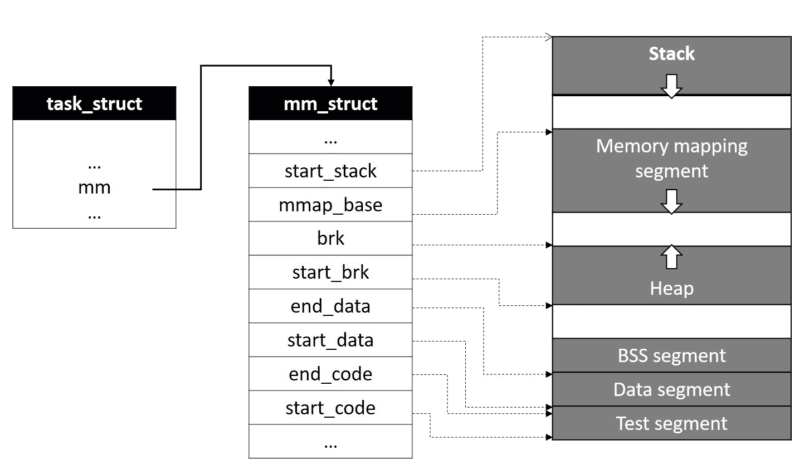
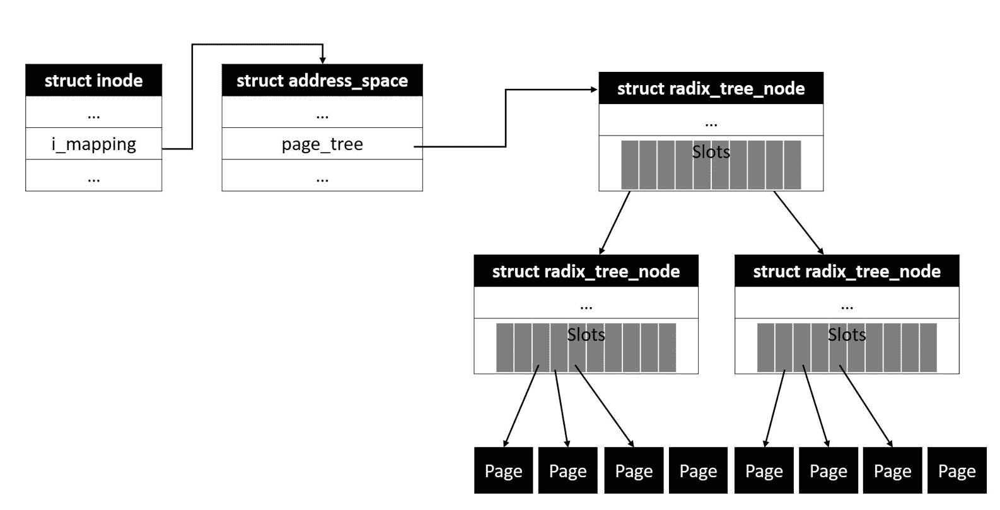

# 虚拟内存管理

在第一章中，我们简要讨论了一个重要的抽象概念*过程。*我们已经讨论了进程虚拟地址空间及其隔离，并且已经遍历了整个内存管理子系统，并且对进入物理内存管理的各种数据结构和算法有了全面的了解。在本章中，让我们用虚拟内存管理和页表的细节来扩展我们对内存管理的讨论。我们将研究虚拟内存子系统的以下方面:

*   处理虚拟地址空间及其段
*   存储器描述符结构
*   内存映射和 VMA 对象
*   文件支持的内存映射
*   页面缓存
*   带页表的地址翻译

# 进程地址空间

下图描述了 Linux 系统中典型进程地址空间的布局，它由一组虚拟内存段组成:


每个段被物理地映射到一个或多个线性存储块(由一个或多个页组成)，并且适当的地址转换记录被放置在进程页表中。在我们深入了解内核如何管理内存映射和构建页表的全部细节之前，让我们简单了解一下地址空间的每个部分:

*   **栈**是最上面的一段，向下扩展。它包含保存局部变量和函数参数的**堆栈框架**；当进入一个被调用的函数时，会在栈顶创建一个新的框架，当当前函数返回时，这个框架就会被销毁。根据函数调用的嵌套级别，总是需要栈段动态扩展以适应新的帧。这种扩展是由虚拟内存管理器通过**页面错误**处理的:当进程试图触及堆栈顶部的未映射地址时，系统会触发页面错误，由内核处理，检查是否适合扩展堆栈。如果当前堆栈利用率在`RLIMIT_STACK`内，则认为是合适的，扩展堆栈。然而，如果当前的利用率是最大的，没有进一步扩展的余地，则分段故障信号被传送到该过程。
*   **Mmap** 是栈下的一段；该段主要用于将文件数据从页面缓存映射到进程地址空间。该段也用于映射共享对象或动态库。用户模式进程可以通过`mmap()`应用编程接口启动新的映射。Linux 内核还支持通过这个段的匿名内存映射，它作为动态内存分配的替代机制来存储进程数据。
*   **堆**段为动态内存分配提供地址空间，允许进程存储运行时数据。内核提供了`brk()`系列的 API，通过这些 API，用户模式进程可以在运行时扩展或收缩堆。然而，大多数特定于编程语言的标准库都实现了堆管理算法，以有效利用堆内存。例如，GNU glibc 实现了堆管理，为分配提供了`malloc()`系列函数。

地址空间的下段- **BSS** 、**数据**和**文本** -与进程的二进制图像相关:

*   **BSS** 存储**未初始化的**静态变量，其值在程序代码中未初始化。BSS 是通过匿名内存映射建立的。
*   **数据**段包含在程序源代码中初始化的全局和静态变量。该段通过映射包含初始化数据的程序二进制映像的一部分来枚举；该映射创建的类型为**私有内存映射**，确保数据变量内存的变化不会反映在磁盘文件上。
*   **文本**段也通过从内存映射程序二进制文件来枚举；该映射属于`RDONLY`类型，导致在尝试写入该段时触发分段故障。

内核支持地址空间随机化工具，如果在构建过程中启用，该工具允许虚拟机子系统为每个新进程随机化**堆栈**、 **mmap** 和**堆**段的开始位置。这为进程提供了非常需要的安全性，防止恶意程序注入错误。黑客程序通常用有效进程内存段的固定起始地址进行硬编码；有了地址空间随机化，这种恶意攻击就会失败。然而，根据底层架构的定义，从应用的二进制文件中枚举的文本段被映射到固定地址；这被配置到链接器脚本中，该脚本在构建程序二进制文件时应用。

# 进程内存描述符

内核在内存描述符结构中维护进程内存段和相应转换表的所有信息，内存描述符结构类型为`struct mm_struct`。过程描述符结构`task_struct`包含一个指向过程内存描述符的指针`*mm`。我们将讨论内存描述符结构的几个重要元素:

```sh
struct mm_struct {
               struct vm_area_struct *mmap; /* list of VMAs */
               struct rb_root mm_rb;
               u32 vmacache_seqnum; /* per-thread vmacache */
#ifdef CONFIG_MMU
             unsigned long (*get_unmapped_area) (struct file *filp, unsigned long addr, unsigned long len,
                                                                                                    unsigned long pgoff, unsigned long flags);
 #endif
            unsigned long mmap_base;               /* base of mmap area */
            unsigned long mmap_legacy_base;  /* base of mmap area in bottom-up allocations */
            unsigned long task_size;                   /* size of task vm space */
            unsigned long highest_vm_end;      /* highest vma end address */
            pgd_t * pgd;  
            atomic_t mm_users;           /* How many users with user space? */
            atomic_t mm_count;           /* How many references to "struct mm_struct" (users count as 1) */
            atomic_long_t nr_ptes;      /* PTE page table pages */
 #if CONFIG_PGTABLE_LEVELS > 2
           atomic_long_t nr_pmds;      /* PMD page table pages */
 #endif
           int map_count;                           /* number of VMAs */
         spinlock_t page_table_lock;      /* Protects page tables and some counters */
         struct rw_semaphore mmap_sem;

       struct list_head mmlist;      /* List of maybe swapped mm's. These are globally strung
                                                         * together off init_mm.mmlist, and are protected
                                                         * by mmlist_lock
                                                         */
        unsigned long hiwater_rss;     /* High-watermark of RSS usage */
         unsigned long hiwater_vm;     /* High-water virtual memory usage */
        unsigned long total_vm;          /* Total pages mapped */
         unsigned long locked_vm;       /* Pages that have PG_mlocked set */
         unsigned long pinned_vm;      /* Refcount permanently increased */
         unsigned long data_vm;          /* VM_WRITE & ~VM_SHARED & ~VM_STACK */
        unsigned long exec_vm;          /* VM_EXEC & ~VM_WRITE & ~VM_STACK */
         unsigned long stack_vm;         /* VM_STACK */
         unsigned long def_flags;
         unsigned long start_code, end_code, start_data, end_data;
         unsigned long start_brk, brk, start_stack;
         unsigned long arg_start, arg_end, env_start, env_end;
        unsigned long saved_auxv[AT_VECTOR_SIZE];               /* for /proc/PID/auxv */
/*
 * Special counters, in some configurations protected by the
 * page_table_lock, in other configurations by being atomic.
 */
        struct mm_rss_stat rss_stat;
      struct linux_binfmt *binfmt;
      cpumask_var_t cpu_vm_mask_var;
 /* Architecture-specific MM context */
        mm_context_t context;
      unsigned long flags;                   /* Must use atomic bitops to access the bits */
      struct core_state *core_state;   /* core dumping support */
       ...
      ...
      ...
 };
```

`mmap_base`指虚拟地址空间中 mmap 段的开始，`task_size`包含虚拟内存空间中任务的总大小。`mm_users`是一个原子计数器，保存共享该内存描述符的 lwp 的计数，`mm_count`保存当前使用该描述符的进程数的计数，VM 子系统确保只有当`mm_count`为零时才会释放内存描述符结构。`start_code`和`end_code`字段包含从程序的二进制文件映射的代码块的开始和结束虚拟地址。类似地，`start_data`和`end_data`标记从程序的二进制文件映射的初始化数据区域的开始和结束。

`start_brk`和`brk`字段表示堆段的开始和当前结束地址；虽然`start_brk`在整个进程生命周期中保持不变，但是`brk`在分配和释放堆内存时会被重新定位。因此，给定时刻活动堆的总大小是`start_brk`和`brk`字段之间的内存大小。元素`arg_start`和`arg_end`包含命令行参数列表的位置，`env_start`和`env_end`包含环境变量的开始和结束位置:



映射到虚拟地址空间中一个段的每个线性存储区域通过类型为`struct vm_area_struct`的描述符来表示。每个虚拟机区域都映射有一个虚拟地址间隔，该间隔包含开始和结束虚拟地址以及其他属性。虚拟机子系统维护代表当前区域的`vm_area_struct(VMA)`节点的链表；该列表按升序排序，第一个节点代表起始虚拟地址间隔，随后的节点包含下一个地址间隔，依此类推。内存描述符结构包括一个指针`*mmap`，它指的是当前映射的虚拟机区域列表。

虚拟机子系统将需要扫描`vm_area`列表，同时对虚拟机区域执行各种操作，例如在映射的地址间隔内寻找特定地址，或者附加表示新映射的新 VMA 实例。这种操作可能耗时且低效，尤其是在大量区域被映射到列表中的情况下。作为一种变通方法，虚拟机子系统维护一个红黑树，以便有效访问`vm_area`对象。内存描述符结构包括红黑树`mm_rb`的根节点。通过这种安排，可以通过在红黑树中搜索新区域的地址间隔之前的区域来快速追加新的虚拟机区域；这消除了显式扫描链表的需要。

`struct vm_area_struct`在内核头`<linux/mm_types.h>`中定义:

```sh
/*
  * This struct defines a memory VMM memory area. There is one of these
  * per VM-area/task. A VM area is any part of the process virtual memory
  * space that has a special rule for the page-fault handlers (ie a shared
  * library, the executable area etc).
  */
 struct vm_area_struct {
               /* The first cache line has the info for VMA tree walking. */
              unsigned long vm_start; /* Our start address within vm_mm. */
               unsigned long vm_end; /* The first byte after our end address within vm_mm. */
              /* linked list of VM areas per task, sorted by address */
               struct vm_area_struct *vm_next, *vm_prev;
               struct rb_node vm_rb;
               /*
                 * Largest free memory gap in bytes to the left of this VMA.
                 * Either between this VMA and vma->vm_prev, or between one of the
                 * VMAs below us in the VMA rbtree and its ->vm_prev. This helps
                 * get_unmapped_area find a free area of the right size.
                */
                 unsigned long rb_subtree_gap;
              /* Second cache line starts here. */
               struct mm_struct   *vm_mm; /* The address space we belong to. */
                pgprot_t  vm_page_prot;       /* Access permissions of this VMA. */
                unsigned long vm_flags;        /* Flags, see mm.h. */
              /*
                 * For areas with an address space and backing store,
                 * linkage into the address_space->i_mmap interval tree.
                 */
                struct {
                              struct rb_node rb;
                              unsigned long rb_subtree_last;
                           } shared;
         /*
                 * A file's MAP_PRIVATE vma can be in both i_mmap tree and anon_vma
                 * list, after a COW of one of the file pages. A MAP_SHARED vma
                 * can only be in the i_mmap tree. An anonymous MAP_PRIVATE, stack
                 * or brk vma (with NULL file) can only be in an anon_vma list.
          */
            struct list_head anon_vma_chain; /* Serialized by mmap_sem & page_table_lock */
           struct anon_vma *anon_vma;        /* Serialized by page_table_lock */
            /* Function pointers to deal with this struct. */
            const struct vm_operations_struct *vm_ops;
            /* Information about our backing store: */
            unsigned long vm_pgoff; /* Offset (within vm_file) in PAGE_SIZE units */
            struct file * vm_file; /* File we map to (can be NULL). */
            void * vm_private_data; /* was vm_pte (shared mem) */
#ifndef CONFIG_MMU
          struct vm_region *vm_region; /* NOMMU mapping region */
 #endif
 #ifdef CONFIG_NUMA
         struct mempolicy *vm_policy; /* NUMA policy for the VMA */
 #endif
        struct vm_userfaultfd_ctx vm_userfaultfd_ctx;
 };
```

`vm_start`包含区域的起始虚拟地址(低位地址)，是映射的第一个有效字节的地址，`vm_end`包含映射区域以外的第一个字节的虚拟地址(高位地址)。因此，可以通过从`vm_end`中减去`vm_start`来计算映射存储区域的长度。指针`*vm_next`和`*vm_prev`指的是下一个和上一个 VMA 列表，而`vm_rb`元素是代表红黑树下的这个 VMA。`*vm_mm`指针指向进程内存描述符结构。

`vm_page_prot`包含区域内页面的访问权限。`vm_flags`是一个位字段，包含映射区域内存的属性。标志位在内核头`<linux/mm.h>`中定义。

| 标志位 | **描述** |
| `VM_NONE` | 指示非活动映射。 |
| `VM_READ` | 如果设置，映射区域中的页面是可读的。 |
| `VM_WRITE` | 如果设置，映射区域中的页面是可写的。 |
| `VM_EXEC` | 这被设置为将内存区域标记为可执行。包含可执行指令的存储块与`VM_READ`一起设置该标志。 |
| `VM_SHARED` | 如果设置，将共享映射区域中的页面。 |
| `VM_MAYREAD` | 表示可以在当前映射的区域上设置`VM_READ`的标志。该标志用于`mprotect()`系统调用。 |
| `VM_MAYWRITE` | 表示可以在当前映射的区域上设置`VM_WRITE`的标志。该标志用于`mprotect()`系统调用。 |
| `VM_MAYEXEC` | 表示可以在当前映射区域设置`VM_EXEC`的标志。该标志用于`mprotect()`系统调用。 |
| `VM_GROWSDOWN` | 映射可以向下增长；栈段被赋予这个标志。 |
| `VM_UFFD_MISSING` | 该标志设置为向虚拟机子系统指示`userfaultfd`已为此映射启用，并设置为跟踪缺页故障。 |
| `VM_PFNMAP` | 该标志被设置为指示存储器区域通过 PFN 跟踪的页面被映射，这与具有页面描述符的常规页面帧不同。 |
| `VM_DENYWRITE` | 设置为指示当前文件映射不可写。 |
| `VM_UFFD_WP` | 该标志设置为向虚拟机子系统指示`userfaultfd`已为此映射启用，并设置为跟踪写保护故障。 |
| `VM_LOCKED` | 当映射内存区域中的相应页面被锁定时设置。 |
| `VM_IO` | 映射设备输入/输出区域时设置。 |
| `VM_SEQ_READ` | 当进程声明它打算顺序访问映射区域内的存储区域时设置。 |
| `VM_RAND_READ` | 当进程声明打算随机访问映射区域内的存储区域时设置。 |
| `VM_DONTCOPY` | 设置为指示虚拟机在`fork()`禁用复制该 VMA。 |
| `VM_DONTEXPAND` | 设置表示当前映射不能在`mremap()`上展开。 |
| `VM_LOCKONFAULT` | 当页面出现故障时，锁定内存映射中的页面。当进程通过`mlock2()`系统调用启用`MLOCK_ONFAULT`时，设置该标志。 |
| `VM_ACCOUNT` | 虚拟机子系统执行额外的检查，以确保在带有此标志的虚拟机上执行操作时有可用的内存。 |
| `VM_NORESERVE` | 虚拟机是否应该抑制记帐。 |
| `VM_HUGETLB` | 指示当前映射包含巨大的 TLB 页面。 |
| `VM_DONTDUMP` | 如果设置，当前 VMA 不包括在核心转储中。 |
| `VM_MIXEDMAP` | 当 VMA 映射包含传统页面框架(通过页面描述符管理)和 PFN 管理的页面时设置。 |
| `VM_HUGEPAGE` | 当 VMA 标记为`MADV_HUGEPAGE`时设置，以指示虚拟机该映射下的页面必须是透明巨大页面(THP)类型。此标志仅适用于私有匿名映射。 |
| `VM_NOHUGEPAGE` | 当 VMA 标有`MADV_NOHUGEPAGE`时设定。 |
| `VM_MERGEABLE` | 当 VMA 标记为`MADV_MERGEABLE`时设置，这将启用内核同页合并(KSM)功能。 |
| `VM_ARCH_1` | 特定于架构的扩展。 |
| `VM_ARCH_2` | 特定于架构的扩展。 |

下图描述了进程的内存描述符结构所指向的`vm_area`列表的典型布局:


如这里所描述的，一些映射到地址空间的内存区域是文件支持的(代码区域形成应用二进制文件、共享库、共享内存映射等等)。文件缓冲区由内核的页面缓存框架管理，该框架实现自己的数据结构来表示和管理文件缓存。页面缓存通过`address_space`数据结构跟踪各种用户模式进程到文件区域的映射。`vm_area_struct`对象的`shared`元素将这个 VMA 枚举到与地址空间相关联的红黑树中。我们将在下一节讨论更多关于页面缓存和`address_space`对象的内容。

虚拟地址空间的区域，如堆、栈和 mmap，是通过匿名内存映射分配的。虚拟机子系统将代表匿名内存区域的进程的所有 VMA 实例分组到一个列表中，并通过类型为`struct anon_vma`的描述符来表示它们。这种结构能够快速访问映射匿名页面的所有流程虚拟机管理程序；每个匿名 VMA 结构的`*anon_vma`指针都指向`anon_vma`对象。

但是，当一个进程分叉一个子进程时，调用方地址空间的所有匿名页面都在写时复制(COW)下与子进程共享。这将导致创建新的虚拟机管理程序(针对子虚拟机管理程序)，这些虚拟机管理程序代表父虚拟机管理程序的相同匿名内存区域。内存管理器需要找到并跟踪所有引用相同区域的虚拟机，以便能够支持取消映射和换出操作。作为解决方案，虚拟机子系统使用另一个称为`struct anon_vma_chain`的描述符，该描述符链接一个流程组的所有`anon_vma`结构。VMA 结构的`anon_vma_chain`元素是匿名 VMA 链的列表元素。

每个 VMA 实例都绑定到类型为`vm_operations_struct`的描述符，该描述符包含对当前 VMA 执行的操作。VMA 实例的`*vm_ops`指针指向操作对象:

```sh
/*
  * These are the virtual MM functions - opening of an area, closing and
  * unmapping it (needed to keep files on disk up-to-date etc), pointer
  * to the functions called when a no-page or a wp-page exception occurs.
  */
 struct vm_operations_struct {
         void (*open)(struct vm_area_struct * area);
         void (*close)(struct vm_area_struct * area);
         int (*mremap)(struct vm_area_struct * area);
         int (*fault)(struct vm_area_struct *vma, struct vm_fault *vmf);
         int (*pmd_fault)(struct vm_area_struct *, unsigned long address,
                                                 pmd_t *, unsigned int flags);
         void (*map_pages)(struct fault_env *fe,
                         pgoff_t start_pgoff, pgoff_t end_pgoff);
         /* notification that a previously read-only page is about to become
          * writable, if an error is returned it will cause a SIGBUS */
         int (*page_mkwrite)(struct vm_area_struct *vma, struct vm_fault *vmf);
    /* same as page_mkwrite when using VM_PFNMAP|VM_MIXEDMAP */
         int (*pfn_mkwrite)(struct vm_area_struct *vma, struct vm_fault *vmf);
/* called by access_process_vm when get_user_pages() fails, typically
          * for use by special VMAs that can switch between memory and hardware
          */
         int (*access)(struct vm_area_struct *vma, unsigned long addr,
                       void *buf, int len, int write);
/* Called by the /proc/PID/maps code to ask the vma whether it
          * has a special name. Returning non-NULL will also cause this
          * vma to be dumped unconditionally. */
         const char *(*name)(struct vm_area_struct *vma);
   ...
   ...
```

当 VMA 被枚举到地址空间中时，分配给`*open()`函数指针的例程被调用。类似地，当 VMA 从虚拟地址空间分离时，分配给`*close()`函数指针的例程被调用。分配给`*mremap()`界面的功能在 VMA 映射的存储区域要调整大小时执行。当 VMA 映射的物理区域不活动时，系统触发页面错误异常，内核的页面错误处理器调用分配给`*fault()`指针的函数，将 VMA 区域的相应数据读入物理页面。

内核支持对存储设备上类似于内存的文件进行直接访问操作(DAX)，如 nvrams、闪存和其他持久内存设备。此类存储设备的驱动程序被实现为直接在存储上执行所有读写操作，而无需任何缓存。当用户进程试图映射来自 DAX 存储设备的文件时，底层磁盘驱动程序直接映射相应的文件页面来处理虚拟地址空间。为了获得最佳性能，用户模式进程可以通过启用`VM_HUGETLB`来映射 DAX 存储中的大型文件。由于支持大页面大小，DAX 文件映射上的页面错误无法通过常规页面错误处理程序来处理，支持 DAX 的文件系统需要为 VMA 的`*pmd_fault()`指针分配适当的错误处理程序。

# 管理虚拟内存区域

内核的虚拟机子系统实现各种操作来操纵进程的虚拟内存区域；这些功能包括创建、插入、修改、定位、合并和删除 VMA 实例。我们将讨论一些重要的套路。

# 找到 VMA

`find_vma()`例程定位 VMA 列表中满足给定地址条件的第一个区域(`addr < vm_area_struct->vm_end`)。

```sh
/* Look up the first VMA which satisfies addr < vm_end, NULL if none. */
struct vm_area_struct *find_vma(struct mm_struct *mm, unsigned long addr)
{
        struct rb_node *rb_node;
        struct vm_area_struct *vma;

        /* Check the cache first. */
        vma = vmacache_find(mm, addr);
        if (likely(vma))
               return vma;

       rb_node = mm->mm_rb.rb_node;
       while (rb_node) {
               struct vm_area_struct *tmp;
               tmp = rb_entry(rb_node, struct vm_area_struct, vm_rb);
               if (tmp->vm_end > addr) {
                        vma = tmp;
                        if (tmp->vm_start <= addr)
                                 break;
                        rb_node = rb_node->rb_left;
               } else
                        rb_node = rb_node->rb_right;
        }
        if (vma)
               vmacache_update(addr, vma);
        return vma;
}
```

该函数首先检查在每个线程的`vma`缓存中找到的最近访问的`vma`中请求的地址。匹配时，它会返回 VMA 的地址，否则它会进入红黑树以找到合适的 VMA。树的根节点位于`mm->mm_rb.rb_node`。通过助手功能`rb_entry()`，验证每个节点在 VMA 虚拟地址区间内的地址。如果找到了起始地址比指定地址低、结束地址比指定地址高的目标 VMA，函数将返回 VMA 实例的地址。如果仍然没有找到合适的 VMA，搜索将继续搜索`rbtree`的左或右子节点。当找到合适的 VMA 时，指向它的指针被更新到`vma`缓存(预期下一次调用`find_vma()`来定位同一区域中的相邻地址)，并且它返回 VMA 实例的地址。

当在现有区域之前或之后添加新区域时(因此也在两个现有区域之间)，内核会将所涉及的数据结构合并到一个结构中，但当然，前提是所有所涉及区域的访问权限都相同，并且从同一个后备存储映射连续的数据。

# 合并 VMA 地区

当一个新的 VMA 紧接在一个具有相同访问属性的现有 VMA 之前或之后映射，并且数据来自一个文件支持的内存区域时，最好将它们合并到一个单一的 VMA 结构中。`vma_merge()`是一个辅助函数，被调用来合并具有相同属性的周围 VMA:

```sh
struct vm_area_struct *vma_merge(struct mm_struct *mm,
                        struct vm_area_struct *prev, unsigned long addr,
                        unsigned long end, unsigned long vm_flags,
                        struct anon_vma *anon_vma, struct file *file,
                        pgoff_t pgoff, struct mempolicy *policy,
                        struct vm_userfaultfd_ctx vm_userfaultfd_ctx)
{
         pgoff_t pglen = (end - addr) >> PAGE_SHIFT;
         struct vm_area_struct *area, *next;
         int err;  
         ...
         ...

```

`*mm`指 VMA 要合并的进程的内存描述符；`*prev`指地址间隔在新区域之前的 VMA；而`addr`、`end`和`vm_flags`包含了新区域的开始、结束和旗帜。`*file`指内存区域映射到新区域的文件实例，`pgoff`指定文件数据内映射的偏移量。

此功能首先检查新区域是否可以与前置区域合并:

```sh
        ...  
        ...
        /*
         * Can it merge with the predecessor?
         */
        if (prev && prev->vm_end == addr &&
                        mpol_equal(vma_policy(prev), policy) &&
                        can_vma_merge_after(prev, vm_flags,
                                            anon_vma, file, pgoff,
                                            vm_userfaultfd_ctx)) {
        ...
        ...
```

为此，它调用一个助手函数`can_vma_merge_after()`，该函数检查前置任务的结束地址是否对应于新区域的开始地址，如果两个区域的访问标志相同，它还检查文件映射的偏移量，以确保它们在文件区域中是连续的，并且两个区域都不包含任何匿名映射:

```sh
                ...                
                ...               
                /*
                 * OK, it can. Can we now merge in the successor as well?
                 */
                if (next && end == next->vm_start &&
                                mpol_equal(policy, vma_policy(next)) &&
                                can_vma_merge_before(next, vm_flags,
                                                     anon_vma, file,
                                                     pgoff+pglen,
                                                     vm_userfaultfd_ctx) &&
                                is_mergeable_anon_vma(prev->anon_vma,
                                                      next->anon_vma, NULL)) {
                                                        /* cases 1, 6 */
                        err = __vma_adjust(prev, prev->vm_start,
                                         next->vm_end, prev->vm_pgoff, NULL,
                                         prev);
                } else /* cases 2, 5, 7 */
                        err = __vma_adjust(prev, prev->vm_start,
 end, prev->vm_pgoff, NULL, prev);

           ...
           ...
}
```

然后检查是否有可能与后续区域合并；为此，它调用助手函数`can_vma_merge_before()`。该函数执行与之前类似的检查，如果发现前置区域和后续区域相同，则调用`is_mergeable_anon_vma()`检查前置区域的任何匿名映射是否可以与后续区域的匿名映射合并。最后，调用另一个辅助函数`__vma_adjust()`来执行最终的合并，这适当地操纵了 VMA 实例。

存在类似类型的辅助函数用于创建、插入和删除内存区域，这些辅助函数从`do_mmap()`和`do_munmap()`作为辅助函数调用，当用户模式应用分别尝试`mmap()`和`unmap()`内存区域时调用。我们将不再进一步讨论这些助手例程的细节。

# 结构地址空间

内存缓存是现代内存管理不可或缺的一部分。简单来说，**缓存**是用于特定需求的页面集合。大多数操作系统都实现了一个**缓冲高速缓存***，这是一个管理用于缓存永久存储磁盘块的内存块列表的框架。缓冲区缓存允许文件系统通过分组和将磁盘同步推迟到适当的时间来最小化磁盘输入/输出操作。*

 *Linux 内核实现了一个**页面缓存**作为缓存机制；简而言之，页面缓存是页面帧的集合，这些页面帧被动态管理以缓存磁盘文件和目录，并通过提供用于交换和按需分页的页面来支持虚拟内存操作。它还处理为特殊文件分配的页面，如 IPC 共享内存和消息队列。读写等应用文件输入/输出调用会导致底层文件系统对页面缓存中的页面执行相关操作。对未读文件的读操作会将请求的文件数据从磁盘提取到页面缓存的页面中，写操作会更新缓存页面中的相关文件数据，然后这些数据被标记为*脏*，并以特定的时间间隔刷新到磁盘。

缓存中包含特定磁盘文件数据的页面组通过类型为`struct address_space`的描述符来表示，因此每个`address_space`实例都充当文件`inode`或块设备文件`inode`所拥有的一组页面的抽象:

```sh
struct address_space {
        struct inode *host; /* owner: inode, block_device */
        struct radix_tree_root page_tree; /* radix tree of all pages */
        spinlock_t tree_lock; /* and lock protecting it */
        atomic_t i_mmap_writable;/* count VM_SHARED mappings */
        struct rb_root i_mmap; /* tree of private and shared mappings */
        struct rw_semaphore i_mmap_rwsem; /* protect tree, count, list */
        /* Protected by tree_lock together with the radix tree */
        unsigned long nrpages; /* number of total pages */
        /* number of shadow or DAX exceptional entries */
        unsigned long nrexceptional;
        pgoff_t writeback_index;/* writeback starts here */
        const struct address_space_operations *a_ops; /* methods */
        unsigned long flags; /* error bits */
        spinlock_t private_lock; /* for use by the address_space */
        gfp_t gfp_mask; /* implicit gfp mask for allocations */
        struct list_head private_list; /* ditto */
        void *private_data; /* ditto */
} __attribute__((aligned(sizeof(long))));
```

`*host`指针指向所有者`inode`，其数据包含在当前`address_space`对象所代表的页面中。例如，如果高速缓存中的页面包含由 Ext4 文件系统管理的文件的数据，则该文件的相应 VFS `inode`将`address_space`对象存储在其`i_data`字段中。文件的`inode`和相应的`address_space`对象存储在 VFS `inode`对象的`i_data`字段中。`nr_pages`字段包含此`address_space`下的页数。

为了高效管理缓存中的文件页面，VM 子系统需要跟踪所有虚拟地址到相同`address_space`区域的映射；例如，许多用户模式进程可能通过`vm_area_struct`实例将共享库的页面映射到它们的地址空间。`address_space`对象的`i_mmap`字段是红黑树的根元素，包含当前映射到此`address_space`的所有`vm_area _struct`实例；由于每个`vm_area_struct`实例都引用各自进程的内存描述符，因此总是有可能跟踪进程引用。

`address_space`对象下包含文件数据的所有物理页面通过基数树进行组织，以便高效访问；`page_tree`字段是`struct radix_tree_root`的一个实例，为页面的基数树提供根元素。该结构在内核头`<linux/radix-tree.h>`中定义:

```sh
struct radix_tree_root {
        gfp_t gfp_mask;
        struct radix_tree_node __rcu *rnode;
};
```

基数树的每个节点都是`struct radix_tree_node`类型；前一个结构的`*rnode`指针指的是树的第一个节点元素:

```sh
struct radix_tree_node {
        unsigned char shift; /* Bits remaining in each slot */
        unsigned char offset; /* Slot offset in parent */
        unsigned int count;
        union {
                struct {
                        /* Used when ascending tree */
                        struct radix_tree_node *parent;
                        /* For tree user */
                        void *private_data;
                };
                /* Used when freeing node */
                struct rcu_head rcu_head;
        };
        /* For tree user */
        struct list_head private_list;
        void __rcu *slots[RADIX_TREE_MAP_SIZE];
        unsigned long tags[RADIX_TREE_MAX_TAGS][RADIX_TREE_TAG_LONGS];
};
```

`offset`字段指定父节点中的节点槽偏移量，`count`保存子节点的总数，`*parent`是指向父节点的指针。每个节点可以通过槽数组引用 64 个树节点(由宏`RADIX_TREE_MAP_SIZE`指定)，其中未使用的槽条目被初始化为空。

为了有效管理地址空间下的页面，内存管理器设置干净页面和脏页面之间的明确区分是很重要的；这可以通过为`radix`树的每个节点的页面分配的**标签**来实现。标记信息存储在节点结构的`tags`字段中，该字段是一个二维数组。数组的第一维区分可能的标签，第二维包含足够数量的无符号长整型元素，以便在节点中为每个页面组织一个位。以下是支持的标签列表:

```sh
/*
 * Radix-tree tags, for tagging dirty and writeback pages within 
 * pagecache radix trees                 
 */
#define PAGECACHE_TAG_DIRTY 0
#define PAGECACHE_TAG_WRITEBACK 1
#define PAGECACHE_TAG_TOWRITE 2
```

Linux `radix`树 API 为`set`、`clear,`和`get`标签提供了各种操作界面:

```sh
void *radix_tree_tag_set(struct radix_tree_root *root,
                                     unsigned long index, unsigned int tag);
void *radix_tree_tag_clear(struct radix_tree_root *root,
                                     unsigned long index, unsigned int tag);
int radix_tree_tag_get(struct radix_tree_root *root,
                                     unsigned long index, unsigned int tag);
```

下图描述了`address_space`对象下的页面布局:



每个地址空间对象都绑定到一组函数，这些函数实现地址空间页面和后台存储块设备之间的各种低级操作。`address_space`结构的`a_ops`指针指的是包含地址空间操作的描述符。VFS 调用这些操作来启动与地址映射和后台存储块设备相关联的高速缓存中的页面之间的数据传输:


# 页面表格

在到达适当的物理存储器区域之前，对进程虚拟地址区域的所有访问操作都经过地址转换。虚拟机子系统维护页表，以将线性页地址转换为物理地址。尽管页表布局是特定于体系结构的，但对于大多数体系结构，内核使用四层分页结构，我们将在本次讨论中考虑 x86-64 内核页表布局。

下图描述了 x86-64 的页表布局:


页全局目录的地址，即顶层页表，被初始化到控制寄存器 cr3 中。这是位分解后的 64 位寄存器:

| 位 | 描述 |
| 2:0 | 忽略 |
| 4:3 | 页面级直写和页面级缓存禁用 |
| 11:5 | 内向的; 寡言少语的; 矜持的 |
| 51:12 | 页面全局目录的地址 |
| 63:52 | 内向的; 寡言少语的; 矜持的 |

在 x86-64 支持的 64 位宽线性地址中，Linux 目前使用 48 位，支持 256 TB 的线性地址空间，这对于当前使用来说已经足够大了。这个 48 位线性地址分为五个部分，前 12 位包含物理帧中存储位置的偏移量，其余部分包含适当页表结构中的偏移量:

| **线性地址位** | **描述** |
| 11:0 (12 位) | 物理页面索引 |
| 20:12 (9 位) | 页表索引 |
| 29:21 (9 位) | 页面中间目录的索引 |
| 38:30 (9 位) | 页面上部目录的索引 |
| 47:39 (9 位) | 页面全局目录的索引 |

每个页表结构可以支持 512 条记录，其中每条记录提供下一级页结构的基址。在给定线性地址的转换期间，MMU 将包含索引的前 9 位提取到页面全局目录(PGD)中，然后将其添加到 PGD 的基址(在 cr3 中找到)；这种查找导致发现页面上部目录(PUD)的基址。接下来，MMU 检索线性地址中找到的 PUD 偏移量(9 位)，并将其添加到 PUD 结构的基址，以到达产生页面中间目录基址(PMD)的 PUD 条目(PUDE)。线性地址中的 PMD 偏移随后被添加到 PMD 的基址，以到达相关的 PMD 条目(PMDE)，这产生了页表的基址。线性地址中发现的页表偏移量(9 位)然后被添加到从 PMD 条目发现的基址，以到达页表条目(PTE)，这又产生所请求数据的物理帧的起始地址。最后，线性地址中的页面偏移量(12 位)被添加到 PTE 发现的基址，以到达要访问的存储位置。

# 摘要

在这一章中，我们重点介绍了与处理虚拟地址空间和内存映射相关的虚拟内存管理的细节。我们讨论了虚拟机子系统的关键数据结构、内存描述符结构(`struct mm_struct`)和 VMA 描述符(`struct vm_area_struct`)。我们查看了页面缓存及其数据结构(`struct address_space`)，用于将文件缓冲区反向映射到各种进程地址空间。最后，我们探讨了在许多架构中广泛使用的 Linux 的页表布局。在对文件系统和虚拟内存管理有了透彻的理解之后，在下一章中，我们将把这个讨论扩展到 IPC 子系统及其资源。*