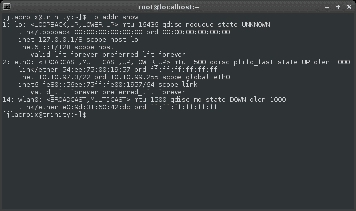
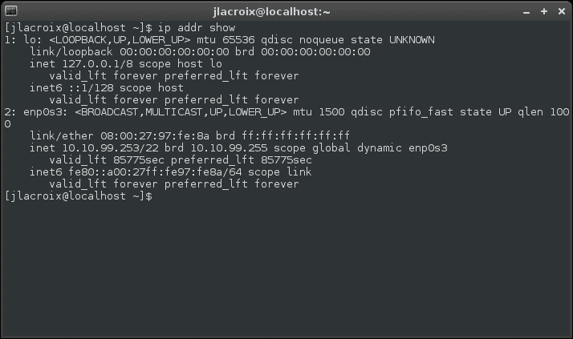
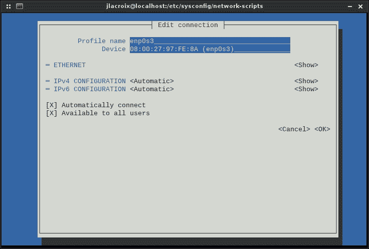

# 二、重温 Linux 网络基础

无论你是有很多 Linux 网络的知识，还是你刚刚开始，我们将在本章完成 Linux 网络的基础知识。 虽然 Linux 中的 TCP/IP 堆栈是使用与其他平台相同的特性实现的，但是使用特定的工具来管理这样的网络。 在这里，我们将讨论 Linux 如何处理 IP 地址、网络设备命名以及使接口向上和向下。 此外，我们将讨论用于管理界面的图形化和非图形化工具。

在本章中，我们将介绍:

*   了解 TCP/IP 协议套件
*   命名网络设备
*   理解 Linux 主机名解析
*   了解 iproute2 和网络工具套件
*   手动管理网口
*   使用网络管理器管理连接

# 了解 TCP/IP 协议套件

TCP/IP 是目前最流行的网络协议。 它不仅是 Internet 的主要协议套件，而且几乎可以在任何支持某种形式的网络连接的设备上找到它。 你的电脑非常了解这个套件，但是现在你的手机，电视，甚至一两个厨房设备都支持这个技术。 它真的无处不在。 虽然 TCP/IP 通常被称为一种协议，但它实际上是由几个单独的协议组成的**协议套件**。 从名称中，我相信您可以推断出其中两个是 TCP 和 IP 协议。 此外，还有第三种协议，UDP，它也是这个协议套件的一部分。

**TCP**是**传输控制协议**的首字母缩写。 它负责将网络传输分解成序列(也称为包或段)，然后将这些序列发送到目标节点，并由另一端的 TCP 重新组装成原始消息。 除了管理数据包外，TCP 还确保它们被正确接收(尽其最大能力)。 它通过**错误纠正**来做到这一点。 如果一个数据包没有被目标接收到，TCP 将重新发送它。 它知道这样做是因为**重传时间**r。

在讨论错误纠正和重传之前，让我们先看看 TCP 用于发送数据的实际过程。 在建立连接时，TCP 执行**三次握手**，该握手由三个特殊的包组成，在通信节点之间发送。 第一个报文，**同步**SYN，由发送端发送给接收端。 本质上，它是节点宣布它想要开始通信的方式。 在接收端，一旦(如果)收到数据包，一个**SYN/ACK**(**同步确认**)报文被发送回发送端。 最后，从发送端向接收端发送一个**ACK**(**acknowledge**)数据包，这是一个全面的验证，证明传输已经全部就绪，可以继续进行。 从这一点开始，连接就建立起来了，两个节点就可以互相发送信息。 然后再发送数据包，这些数据包构成了通信的剩余部分。

如果我们生活在一个完美的世界，这将是所有需要的。 在传输过程中，信息包永远不会丢失，带宽将是无限的，信息包也永远不会在传输过程中损坏。 不幸的是，我们并不是生活在一个完美的世界里，数据包总是会丢失或损坏。 TCP 有内置的特性来处理这些类型的事情。 错误校正有助于确保接收的数据包与发送的数据包是相同的。 TCP 报文中包含校验和，校验和通过算法进行验证。 如果验证失败，则认为报文不正确，丢弃该报文。 这种验证并不完美，所以您刚刚下载的文件仍然可能有一两个错误，但总比没有好。 大多数时候，它工作得很好。

TCP 的流量控制特性处理数据传输的速度。 虽然我们大多数极客都有一套很好的网络硬件，能够处理大量的带宽，但互联网并不是一个一致的地方。 你的超级高端交换机可能能够处理你扔给它的任何东西，但这真的不重要，如果在连接的上游某处有一个弱链接。 网络传输的速度取决于它的最慢点。 当您向另一个节点发送传输时，您只能发送其缓冲区所能容纳的数据。 在某一时刻，它的缓冲区将被填满，然后无法接收任何额外的数据包，直到它处理它已经拥有的数据包。 此时，发送到接收器的任何额外数据包都会被丢弃。 发送方看到它不再接收 ACK 回复，然后后退并减慢它的传输速率。 这是 TCP 使用的方法，以便根据接收节点能够处理的内容来调整传输速度。

流量控制的工作原理是利用所谓的**滑动窗口**。 接收节点指定了所谓的**接收窗口**，它告诉发送方在过载之前能够接收多少数据。 一旦这个接收窗口干涸，发送方将等待接收方澄清它已经准备好再次接收数据。 当然，如果接收端向发送方发送了一个更新，表明它已经准备好接收数据，而发送方从未收到 memo，那么如果发送方一直等待在传输过程中丢失的清除所有信息，就会遇到真正的问题。 幸运的是，我们有一个**持续计时器**来帮助解决这个问题。 本质上，持久计时器表示发送方在需要验证连接仍然是活动的之前愿意等待多长时间。 一旦持续计时器结束，发送方就向接收方发送另一个包，以查看它是否能够处理它。 如果发送了应答，应答包将包含另一个接收窗口，这表明它确实准备好继续对话了。

**IP**(简称**Internet 协议**)处理TCP 要发送或接收的报文的实际发送和接收。 在每个包中，有一个称为**IP 地址**的目的地(我们将在本章中进一步讨论)。 每个连接的网络接口都有自己的 IP 地址，IP 协议将使用该 IP 地址来确定数据包需要去哪里，或者它来自哪个设备。 TCP 和 IP 组成了一个强大的团队。 TCP 将通信分成数据包，IP 负责将它们路由到目的地。

当然，还有**UDP**(简称**用户数据报协议**)，这也是套件的一部分。 它与 TCP 非常相似，因为它将传输分解为数据包。 然而，主要的区别是 UDP 是无连接的**。 这意味着 UDP 不验证任何东西。 它发送数据包，但不保证传输。 如果一个数据包没有被目标接收到，它将不会被重发。**

 **那些第一次学习 UDP 的人可能会问，为什么会考虑这样一个不值得信任的协议。 事实上，在某些情况下，面向连接的协议(如 TCP)可能会给某些类型的传输增加不必要的开销。 其中一个例子是通过 Skype 联系同事，它提供互联网上的音频通话和视频通话。 如果一个包在通信过程中被任何一端丢失，那么重新发送它就没有多大意义了。 你只会听到一两秒钟的静电，重传数据包当然不会改变你听不到一个或两个单词的事实。 在这样的传输中添加错误校正是没有意义的，而且会增加开销。

对 TCP/IP 的整体讨论本身就是一本好书。 在 Linux 中，该协议的处理方式与其他平台非常相似，真正的区别在于如何管理该协议。 在本书中，我们将讨论如何管理这个协议并调整我们的网络。

# 网络设备命名

现在，计算机有多个网络接口是很常见的。 例如，如果您正在使用笔记本电脑(除了超级本)，那么您可能有有线和无线网络接口。 每个网络接口都有自己的 IP 地址，它们彼此独立地运行。 实际上，您甚至可以在多个接口之间路由流量，尽管在大多数 Linux 发行版中，这通常在缺省情况下是禁用的。 就像每个接口都有自己的 IP 地址一样，每个接口也将由系统用自己的设备名称来标识。 在我们进一步讨论这个问题之前，先看看您系统上的设备名称。 打开一个终端，输入以下命令:

```sh
ip addr show

```

你的输出会像这样:



ip 命令的输出，显示网络接口和地址分配

在这个示例中，我们看到列出了三个网络接口。 第一个，`lo`，是本地环回适配器。 第二个清单`eth0`是有线接口。 最后，`wlan0`表示无线接口。 有了这个输出，您可以推断插入了一根网线(`eth0`有一个 IP 地址)，而且它目前没有使用其无线接口(`wlan0`没有列出 IP 地址)。

前面显示的输出来自运行 Debian 的系统。 现在，让我们看看在 CentOS 系统上运行相同命令时的输出:



ip 命令的输出，这次是在 CentOS 系统上运行

你看到区别了吗? 如果查看有线连接，就会发现它的名称与 Debian 示例中的有线连接非常不同。 在 Debian 中，它被命名为`eth0`。 但是在 CentOS 上，它被命名为`enp0s3`。 这就引出了本节的重点:在 CentOS 和 Debian 中网络设备的命名不同。

过去，有线以太网设备的命名以`eth`为前缀，无线设备的命名以`wlan`为前缀。 例如，第一个有线以太网适配器将被标记为`eth0`; 第二个是`eth1`，以此类推。 无线设备的处理也类似，第一个设备是`wlan0`，第二个设备是`wlan1`，以此类推。 对于 Debian，情况仍然如此(即使是在较新的版本中)。 然而，一些使用**systemd**的发行版为网络设备提供了不同的命名方案。 事实上，Debian 9 一旦发布就会改变它的接口命名方案。

这种变化的原因是以前的命名方案有时是不可预测的。 当机器重新启动时，可能会有交叉的网络设备名称，导致混淆哪个接口是哪个接口。 各种分布以他们自己的方式处理这个问题,但 systemd 建于命名方案基于卡片的位置系统的公共汽车,而不是使用名称`eth0`、`eth1`等等设备探测。 如前所述，Debian 仍然使用较旧的命名方案，尽管 Debian 8 也使用了 systemd。 在这本书中，我们将练习系统命令; 然而，systemd 将在[第 5 章](05.html "Chapter 5. Monitoring System Resources")，*监控系统资源*中更彻底地解释，所以如果你还不知道它是如何工作的，不要太担心。

对于第二个示例中使用的 CentOS 机器，有线网卡被指定为`enp0s3`。 那么，这到底意味着什么呢? 首先，我们知道`en`代表以太网，这部分名称是给有线网卡的。 给定名称的其余部分表示网卡在系统总线上的位置。 由于每个有线卡，如果你有一个以上，将驻留在它自己的物理位置，给设备的名称将是可预测的。 如果您要为特定的网络接口编写启动脚本，那么您可以合理地确定要编写脚本来引用适当的设备。

# 理解 Linux 主机名解析

在一个网络上，通过名称查找其他资源要方便得多，而不是记住我们所连接的每个资源的 IP 地址。 默认情况下，如果没有一点配置，通过名称查找主机可能无法发挥作用。 例如，您可以针对您的一台 Linux 机器的名称尝试使用`ping`命令，您可能会得到响应，也可能不会得到响应。 这是因为您正在连接的资源的 DNS 条目可能不存在。 如果没有，你会看到一个类似如下的错误:

```sh
ping: unknown host potato

```

然而，如果你通过它的 IP ping 设备，它很可能会响应:

```sh
64 bytes from 10.10.96.10: icmp_seq=2 ttl=64 time=0.356 ms

```

### 注意事项

按键盘上的*Ctrl*+*C*来中断`ping`命令，因为如果找到连接，它将永远 ping。

这样做的原因是，为了让一个网络主机能够联系到另一个主机，它需要知道自己的 IP 地址。 如果你键入一个名称,而不是一个 IP 地址,机器就会尝试主机名解析,如果有一个有效的进入**域名系统(DNS**)机器试图联系你,你就可以收到回复。 与基于 windows 的微软网络**动态主机配置协议**(**【显示】DHCP)和 DNS 服务器,是很典型的服务器注册一个**动态 DNS 条目【病人】每当它分配一个 IP 地址到主机。 基于 linux 的 DHCP 和 DNS 服务器也能够使用动态 DNS，但在默认情况下不进行配置，管理员也很少启用动态 DNS。 在一个全 Linux 网络或任何不动态分配 DNS 的网络中，这个 ping 很可能会失败。 我们将在[第六章](06.html "Chapter 6. Configuring Network Services")，*配置网络服务*中详细讨论 DNS。****

 ****在大多数情况下，DNS 并不是 Linux 主机解析主机名的首选位置。 还有一个本地保存在系统上的文件(`/etc/hosts`)，您的机器将首先检查该文件。 如果您正在联系的主机的条目没有包含在其中，那么您的机器将联系它配置的主要 DNS 服务器，以便为您输入的名称找到一个 IP 地址。 下面是一个`host`文件的例子:

```sh
127.0.0.1    localhost
127.0.1.1    trinity-debian

# The following lines are desirable for IPv6 capable hosts
::1     localhost ip6-localhost ip6-loopback
ff02::1 ip6-allnodes
ff02::2 ip6-allrouters

```

在呈现的`hosts`文件中，我们可以看到一个`localhost`的条目和一个`trinity-debian`的条目。 这两个以`127.0.x.x`IP 地址开头的条目都代表机器本身。 要测试这一点，请尝试 ping`localhost`和您的机器名称(在本例中为`trinity-debian`)。 不管怎样，你都会得到回复。 这是因为机器知道它的主机名，并且`localhost`使用环回适配器到达它自己。 如果您愿意这样做，您可以在这个文件中创建与 IP 地址匹配的附加名称。 例如，如果您在 IP 地址`10.10.96.10`上有一台名为`potato`的计算机，您可以将其添加到`hosts`文件的末尾，如下所示:

```sh
10.10.96.10 potato

```

从现在开始，您可以通过键入`potato`来到达 IP 地址`10.10.96.10`。 你可以 ping 它，或者甚至把它输入到浏览器的地址栏中(如果机器正在提供网络内容)。 事实上，主机条目甚至不需要是网络中的本地资源。 您甚至可以输入一个外部网站的 IP 地址，并通过不同的名称访问它。 然而，这只在理论上有效——一个设计良好的网站可能无法在这种情况下运行。

虽然首先检查`/etc/hosts`，但是您的 Linux 安装包括一个文件`/etc/nsswitch.conf`，它用来对主机解析发生的顺序做出最终决定。 有问题的行以`hosts`开头，您可以使用以下命令轻松地检查您机器上的主机解析顺序:

```sh
cat /etc/nsswitch.conf |grep hosts

```

你会得到以下输出:

```sh
hosts:          files mdns4_minimal [NOTFOUND=return] dns

```

在这里，我们可以看到系统被设置为首先检查`files`，它代表本地文件，其中包括`/etc/hosts`。 如果搜索的是一个本地域，但没有找到该域，则`NOTFOUND=return`条目将导致终止其余的搜索。 如果您正在搜索其他内容，那么下一个要使用的资源就是 DNS，如图所示，`dns`是最后一个条目。 除非您更改了该文件，否则您的发行版很可能还会被设置为首先在本地主机文件中查找，如果在本地没有找到该资源，则先在 DNS 中查找。

# 了解 net-tools 和 iproute2 套件

很长一段时间以来，**net-tools**已经成为 Linux 系统上用于管理网络连接的工具套件。 网络工具套件包括诸如`ifconfig`、`route`、`netstat`等命令(我们稍后将讨论这些命令)。 net-tools 的问题是它还没有被更新的开发人员超过十年,许多分布选择放弃它的【显示】**iproute2 套件,提供相同的功能(但不同的命令来实现相同的目标)。 尽管网络工具已被弃用，但仍有相当多的发行版包含它。 例如，Debian 同时包含 iproute2 和 net-tools，因此您可以使用来自这两个套件的命令。 在 CentOS 中，iproute2 是存在的，尽管在默认情况下没有安装 net-tools。 如果你想使用旧的网络工具，你可以用下面的命令安装它在 CentOS:**

```sh
# yum install net-tools

```

那么，如果`net-tools`正在被抛弃，为什么还要安装它呢? 许多系统仍然有使用来自 net-tools 套件的命令的脚本，所以它不会很快从 Linux 社区中消失。 学习网络工具，以及更新的 iproute2，将使您轻松适应任何环境。 对于使用旧发行版的旧数据中心来说尤其如此。

让我们看看这些套件的实际应用。 首先，要报告网络连接的基本信息，输入以下命令:

```sh
/sbin/ifconfig

```

您应该看到以下输出:


ifconfig 命令的输出信息

在这里，我们可以看到来自内部有线连接(`eth0`)和环回适配器(`lo`)的统计数据。 我们看到`HWaddr`，它是网卡的**MAC 地址**。 我们还有`inet addr`，它是该卡由**DHCP 服务器**提供的 IP 地址。 此外，我们还可以看到子网掩码`Mask`，在本例中为`255.255.252.0`。 在排除网络问题时，我们将使用这个工具检查这些基本的事情，例如确保我们有一个 IP 地址，并且我们在适当的子网上。 此外，我们还可以看到在接口上发送和接收数据包的数量，以及错误的数量。

在 iproute2 套件中，我们可以通过下面的命令找到大部分相同的信息:

```sh
ip addr show

```

下面是参考机器的输出:


ip addr show 命令的输出信息

正如您可以看到的，报告的信息基本相同，尽管布局略有不同。 例如，一个区别是您看不到发送和接收的数据包的数量，也看不到错误计数(在默认情况下)。 在过去，下面的命令会显示正在使用的 IP 地址以及发送和接收的数据包:

```sh
ip -s addr show

```


添加-s 标志的 ip addr show 命令的输出信息

不幸的是，最近的 iproute2 套件的版本似乎不再显示这些信息(尽管添加了`-s`开关)，但是我们将在本书的后面讨论其他工具。

### 注意事项

除了前面的命令中的`addr`，您还可以输入整个字符串(地址)，例如:

```sh
ip address show

```

输出将是相同的。 这些示例中显示的命令经过了压缩，从而节省了输入时间。

iproute2 套件提供了比这些更多的命令，我们将在本书中继续讨论它们。 现在，重要的是要理解这两个命令套件之间的区别，并注意到网络工具不会永远可用。 在这本书的写作时期，这两种情况都很常见。 然而，iproute2 是未来游戏的名字。

在结束本节之前，iproute2 套件中有一个非常简单的命令，可能会被证明是有用的:

```sh
hostname

```

这个简单的命令只是打印连接 shell 的机器的主机名。 如果您正在使用默认的 bash 提示符，那么很可能您已经知道机器的主机名。 然而，主机名命令至少可以帮助您验证您的设备正在报告您认为应该报告的主机名; 这在处理名称解析问题时很有用。

# 手动管理网络接口

在大多数情况下，在您安装了您想要的 Linux 发行版之后，它会通过 DHCP 接收一个 IP 地址并离开。 无论您使用的是图形化桌面环境还是没有 GUI 的 shell 环境，魔术大多发生在后台。 虽然有 GUI 工具来管理您的网络连接，但是您可以通过图形工具来完成的任何事情都可以通过 shell 来完成。 在服务器的情况下，可能根本就没有图形环境，因此学习如何通过 shell 管理您的网络连接非常重要。 在本节中，我们将讨论在 Debian 中手动配置接口的方法，然后讨论如何在 CentOS 中做同样的事情。

在前一节中，讨论了查找当前 IP 地址的两种方法。 取决于您的发行版是使用 net-tools 还是 iproute2，您可以使用其中一种方法或另一种方法(或两者都使用)。 当然，这是第一步。 你有电话吗? 检查是否有 IP 地址是一个合理的开始。 你也可以利用一个简单的 ping 测试:

```sh
ping www.yahoo.com

```

如果您确实收到了响应，那么很可能您有一个网络连接。 然而，如果您没有得到响应，这并不一定意味着您的网络有问题。 有些站点被配置为不响应 ping 测试。 只要有可能，就用 ping 来代替本地资源(比如本地 DNS 或 DHCP 服务器)。

在 Linux 中，ping 的工作方式与 Windows 略有不同。 对于初学者来说，Linux 中的`ping`命令在默认情况下实际上会一直运行下去。 要破解它，按键盘上的*Ctrl*+*C*。 如果您希望`ping`在进行一定次数的尝试后停止，则添加`-c`标志，并添加希望`ping`尝试的次数。 在本例中，我们的`ping`命令如下所示:

```sh
ping -c 4 www.yahoo.com

```

在这种情况下，`ping`将尝试四次，停止，然后向您报告一些基本的统计数据。

知道如何检查自己是否有联系是一回事，但是当你没有联系的时候你会怎么做呢? 或者，如果您的网络连接是活动的，但报告了无效的信息，您需要重新配置它，该怎么办?

首先，让我们看看如何检查当前配置。 在 Debian 中，默认控制网络设备的文件如下:

```sh
/etc/network/interfaces

```

根据中的几个变量(包括如何配置 Debian 安装)，这个文件的创建方式可能有所不同。 首先，您可能会看到列出了几个接口，例如环回适配器、有线以太网和无线接口。 如果您有多个有线接口，您还会在这里看到其他适配器。 简单地说，这个文件是一个**配置文件**。 它是一个文本文件，其中包含底层 Linux 系统能够理解的信息，并导致按照文件中指定的方式配置设备。

要编辑这样的文件，有许多 Linux 文本编辑器可用，包括基于 GUI 的和基于终端的。 我个人最喜欢的是**vim**，尽管许多管理员通常从**nano**开始。 纳米文本编辑器使用起来相当简单，尽管功能非常少。 另外，vim 比 nano 有更多的特性，但有点难以适应。 随你挑吧。 要在 nano 中打开一个文件，你所需要做的就是键入`nano`和你想编辑的文本文件的名称。 如果文件不存在，如果保存文件，该命令将创建它。 在我们的`/etc/network/interfaces`文件中，命令如下所示:

```sh
# nano /etc/network/interfaces

```

使用纳米仅仅是打开一个文件,使用键盘上的箭头键将插入点移动到你想要类型,按*Ctrl + O**保存文件,并按**Ctrl + X 退出**。 还有更多的特性，但是为了编辑我们的配置文件，这就是我们现在所需要的。 关于 vim 的教程超出了本书的范围，但是如果您愿意，可以随意使用它。*

现在，回到我们的`/etc/network/interfaces`文件的主题。 需要注意的是，以太网和无线适配器不需要这个文件。 如果您在这个文件中看不到任何东西(除了环回设备)，这意味着网络连接正在由**网络管理器**管理。 Network Manager是一个用于管理客户端网络连接的图形化工具(我们将在本章后面讨论)。 出于本节的目的，当您决定在第一次设置 Debian 时包含图形桌面环境时，通常会安装 Network Manager。 如果您确实选择了图形化环境(如 GNOME、Xfce 等)，那么很可能已经为您设置了 Network Manager，并且正在处理配置界面的工作。 如果您的`interfaces`文件除了环回适配器的条目以外是空的，那么这意味着网络管理器正在处理这个任务。

使用 Debian 时，很容易看到安装过程中根本没有安装图形环境。 GUI 通常不是服务器实现其目的所必需的。 典型的 Linux 管理员将使用完成其工作所需的最小包配置服务器，这通常不包括桌面环境。 在这种情况下，网络管理器可能根本不安装。 如果不是，那么`/etc/network/interfaces`文件将负责建立连接。 在其他情况下，可能安装了网络管理器，但被在此文件中配置网络连接的管理员禁用了。

那么，什么时候应该使用网络管理器，什么时候应该在`interfaces`文件中配置连接? 对于终端用户工作站(台式机和笔记本电脑)，Network Manager 几乎总是首选。 对于服务器，最好在`/etc/network/interfaces`中设置配置，特别是在设置静态 IP 地址时。

我们已经讨论了`interfaces`文件是什么，以及什么时候需要使用它。 现在，让我们看看`some`您可能会看到的各种类型的配置。 首先，当只列出本地环回适配器时，让我们看一下`interfaces`文件:

```sh
cat /etc/network/interfaces

# The loopback network interface
auto lo
iface lo inet loopback

```

### 注意事项

注释是用第一个字符`#`声明的，它在解析配置文件时被忽略。 在前面的例子中，第一行被忽略，它只是作为信息。

在本例中，机器很可能正在使用 Network Manager，因为既没有显示有线(通常是`eth0`)接口，也没有显示无线(通常是`wlan0`)接口。 为了验证这一点，我们可以检查网络管理器是否通过以下命令运行:

```sh
ps ax |grep NetworkManager

```

如果 Network Manager 正在运行，你可能会看到这样的输出:

```sh
446 ?        Ssl    0:00 /usr/sbin/NetworkManager --no-daemon

```

这个谜已经解开了; 这台机器使用网络管理器，所以在`/etc/network/interfaces`中没有存储`eth0`或`wlan0`的配置。 现在，让我们看一个来自没有使用 Network Manager 的机器的示例。 要在这样的安装中配置`eth0`，`interfaces`文件应该如下所示:

```sh
# The loopback network interface
auto lo
iface lo inet loopback

# Wired connection eth0
auto eth0
iface eth0 inet dhcp

```

正如我们所看到的，我们仍然有和以前一样的环回入口，但是在文件的末尾，包含了`eth0`的配置细节。 就像在环回入口中一样，我们声明了`auto`，然后是一个接口名称`eth0`，这意味着我们希望接口`eth0`自动出现。 在下一行中，我们澄清了我们希望将`dhcp`用于接口`eth0`，以便它将自动从 DHCP 服务器获取 IP 地址。

在真实的世界中，当我们要做的所有事情都是使用 DHCP 时，没有好的理由放弃 Network Manager 而支持手动配置连接。 但是，这里包含这个示例是因为，在服务器从 DHCP 服务器接收到**静态租期**而不是动态租期的情况下，它实际上是相当常见的。 使用静态租期，DHCP 服务器每次为特定的 MAC 地址提供相同的 IP 地址。 所以在这种情况下，服务器可以有一个指定的 IP 地址，但 IP 地址仍然是由 DHCP 服务器提供的。 这也称为**DHCP 预留**。

当然，也可以(可能更常见)在接口文件中简单地声明一个静态 IP。 接下来我们将探索这种方法。 但静态租赁值得指出，因为它确实带来了额外的好处。 使用静态租期，节点的 IP 配置不会绑定到其安装发行版的配置。 如果从实时媒体引导，或者即使重新安装了分发版，节点在每次接口出现时仍然会收到相同的 IP 地址。 静态租赁权的另一个好处是，您可以在一个中心位置(在 DHCP 服务器上)配置所有节点的静态 ip，而不必跟踪各个机器之间的配置文件。

### 注意事项

需要注意的是，看到接口的`interfaces`文件中列出的`dhcp`并不总是意味着使用了静态租期。 对于 Debian，管理员通常不安装 Network Manager，然后在启动服务器时手动键入`interfaces`文件。

现在，让我们看看一个例子`interfaces`文件，其中静态 IP 已经被手动配置:

```sh
# The loopback network interface
auto lo
iface lo inet loopback

# Wired connection eth0
auto eth0
iface eth0 inet static
 address 10.10.10.12
 netmask 255.255.248.0
 network 10.10.10.0
 broadcast 10.10.10.255
 gateway 10.10.10.1

```

首先，注意下面一行中的变化:

```sh
iface eth0 inet static

```

最后，我们声明`static`而不是`dhcp`。 如果我们忘记修改它，那么配置文件的所有剩余行都将被忽略。

然后，我们声明接口`eth0`的统计信息。 我们设置 IP 地址为`10.10.10.12`，子网掩码为`255.255.248.0`，所连接的网络为`10.10.10.0`，广播 ID 为`10.10.10.255`，网关为`10.10.10.1`。 我们将在本书后面讨论这些值的实际含义，但现在需要注意的是该文件的语法。

因此，现在您可能想知道，既然我们经历了配置界面的麻烦，我们如何使这些更改生效。 为此，您可以使用以下命令:

```sh
# systemctl restart networking.service

```

在 CentOS 中，手动配置网络接口的过程与 Debian 系统有些不同。 首先，我们需要知道我们的机器上安装了哪些接口。 运行以下命令将列出它们，以及当前分配的任何 IP 地址:

```sh
ip addr show

```

在本节中，我将使用`enp0s3`，这是本书所使用的测试机器上的默认值。 如果您的命令不同，请相应地更改这些示例命令。 无论如何，现在我们知道了要使用的接口，让我们配置它。 接下来，导航到以下目录:

```sh
cd /etc/sysconfig/network-scripts

```

如果列出该目录(`ls`命令)中文件的存储位置，应该会看到一个名称与接口名称相匹配的配置文件。 在我们的`enp0s3`示例中，您应该看到一个名为`ifcfg-enp0s3`的文件。

用你选择的文本编辑器打开这个文件，你会看到配置类似如下:

```sh
HWADDR="08:00:27:97:FE:8A"
TYPE="Ethernet"
BOOTPROTO="dhcp"
DEFROUTE="yes"
PEERDNS="yes"
PEERROUTES="yes"
IPV4_FAILURE_FATAL="no"
IPV6INIT="yes"
IPV6_AUTOCONF="yes"
IPV6_DEFROUTE="yes"
IPV6_PEERDNS="yes"
IPV6_PEERROUTES="yes"
IPV6_FAILURE_FATAL="no"
NAME="enp0s3"
UUID="a5e581c4-7843-46d3-b8d5-157dfb2e32a2"
ONBOOT="yes"

```

如您所见，这个默认文件正在使用`dhcp`，它列在第三行中。 为了配置这个连接以使用一个静态地址，我们需要相应地修改文件。 对文件的更改以粗体标记:

```sh
HWADDR="08:00:27:97:FE:8A"
TYPE="Ethernet"
BOOTPROTO="static"
IPADDR=10.10.10.52
NETMASK=255.255.255.0
NM_CONTROLLED=no
DEFROUTE="yes"
PEERDNS="yes"
PEERROUTES="yes"
IPV4_FAILURE_FATAL="no"
IPV6INIT="yes"
IPV6_AUTOCONF="yes"
IPV6_DEFROUTE="yes"
IPV6_PEERDNS="yes"
IPV6_PEERROUTES="yes"
IPV6_FAILURE_FATAL="no"
NAME="enp0s3"
UUID="a5e581c4-7843-46d3-b8d5-157dfb2e32a2"
ONBOOT="yes"

```

这里，我们只对文件做了 4 个更改。 首先，我们将`BOOTPROTO`改为`static`。 然后，我们在它下面添加了以下全新的行:

```sh
IPADDR=10.10.10.52
NETMASK=255.255.255.0
NM_CONTROLLED=no

```

我相信您可以收集到前两行负责的内容。 我们添加的第四行可能也很明显，但以防万一，我们基本上是在告诉我们的系统，我们宁愿不通过网络管理器管理我们的连接，并希望通过这个配置文件自己处理。

当然，为了使这些更改生效，我们需要重新启动网络。 因为 CentOS 使用 systemd(就像 Debian 8)，命令非常相似:

```sh
# systemctl restart network.service

```

就这样了。 我们在 Debian 和 CentOS 中都手动设置了网络接口。

# 使用网络管理器管理连接

虽然我们刚刚经历了手动配置网络接口的麻烦，但这种情况并不总是可取的。 例如，终端用户工作站将受益于 Network Manager 为我们处理这项工作。 对于笔记本电脑及其无线接口，网络管理器比我们大多数人做得更好。

大多数 Linux 发行版通常默认安装网络管理器。 对于 Debian，当您选择图形桌面环境时，通常会安装它。 如果您选择只安装 shell(在安装过程中，您没有选中桌面环境的选项)，那么您可能没有安装它。 当然，执行以下命令(适用于 Debian 和 CentOS):

```sh
ps ax |grep NetworkManager

```

如果您看到网络管理器正在运行，那么就安装了它。 但是为了确保安全，你可以在 Debian 中执行这个命令:

```sh
aptitude search network-manager

```

如果安装了网络管理器，你会看到它如下所示(在它的左边会有一个`i`名称):

在 CentOS 操作系统中，可以通过以下命令检查是否安装了 Network Manager。

```sh
yum list installed |grep NetworkManager

```

如果您正在运行一个桌面环境，您可能在系统托盘中运行一个 Network Manager 实现。 如果是这样，可以通过可用的 GUI 工具轻松地管理您的连接。 根据您所使用的桌面环境的不同，操作说明也会有所不同。 在本节中，我们将讨论一种使用 Network Manager 配置连接的更通用的方法。 该方法使用如下命令:

```sh
nmtui

```

`nmtui`命令允许您在 shell 环境中配置 Network Manager，但是使用类似 gui 的控件。


通过 nmtui 配置系统的网络连接

如果我们点击**编辑一个连接**，我们将看到我们机器上可用接口的列表:


nmtui 界面选择

当我们选择接口时，我们首先会看到一些基本信息。



在 nmtui 中编辑连接的第一个屏幕

编辑IP 地址界面,按向下箭头键选择**<自动>**左边的**IPv4 配置**和*进入*。 然后，按右箭头键选择**<显示>**选项，并展开其余字段。


用 nmtui 编辑一个连接

要编辑一个项目，按向下箭头键到**<添加… >**选项旁边的字段。 它将展开一个文本框，允许您编辑该项。


用 nmtui 编辑一个连接

当完成后，滚动直到下，然后按*在**<OK 上输入***以保存您的更改。 现在你知道了; 您应该能够通过网络管理器管理您的连接，如果您选择这样做的话。

# 总结

在本章中，我们讨论了 Linux 中 TCP/IP 网络的基础知识，甚至手工配置了我们的接口。 我们学习了如何编辑与 Debian 和 CentOS 相关的配置文件，以及如何在这两个平台上重新启动网络。 我们简要地讨论了 systemd 方法，不过我们将在[第 5 章](05.html "Chapter 5. Monitoring System Resources")、*监控系统资源*中更深入地探讨 systemd 方法。 本章是通过使用`nmtui`工具对系统的网络管理器进行配置完成的。

在下一章中，我们将看看如何使用**Secure Shell**(**SSH**)来远程管理我们的系统。******