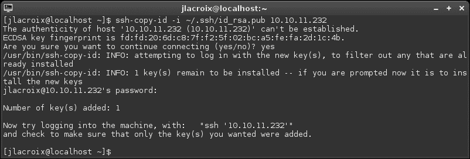

# 第三章。 通过 SSH 在节点之间通信

对于 Linux 网络管理员来说，SSH 是最重要的工具之一。 它允许您远程连接到服务器和其他工作站，并在您最喜欢的终端仿真器中对它们进行工作——所有这些都可以在您舒适的桌子上进行。 虽然 SSH 可能不是适合每一种情况的完美工具，但一旦开始使用它，您就无法想象生活中没有它。

在本章中，我们将探索 SSH 并涵盖以下主题:

*   使用 OpenSSH
*   安装和配置 OpenSSH
*   通过 openssh-client 连接到网络主机
*   OpenSSH 配置文件
*   理解与利用`scp`
*   通过`scp`将文件传输到另一个节点
*   通过 SSH 的隧道传输
*   生成公钥
*   保持 SSH 连接有效
*   探索 SSH 的替代方案——利用 Mosh(移动 shell)

# 使用 OpenSSH

**SSH**或**Secure Shell**是一个非常方便的实用程序。 SSH 并不是在服务器机房中执行任务的绝对要求，但它是使您的工作更轻松的事情之一。 使用 SSH，您可以在不同的 Linux 机器上执行命令，就好像您就坐在它前面一样。 当然，您总是可以走进服务器机房，打开键盘，然后开始工作，但现在的游戏名称是远程管理。 This is especially true if it's your turn to be on call and an issue comes up at the office. 根据问题的性质，SSH 可能允许您在家里(甚至在您的智能手机上)解决问题，而不必长途跋涉到公司的服务器机房。 这还不是全部; SSH 还允许您将文件从一台机器复制到另一台机器，并将实际的存储挂载到服务器上的一个目录，在您的工作站上，可以将该目录视为文件系统的本地部分。

连接到远程主机并打开命令 shell 的概念并不是新的，SSH 也不是第一个这样做的。 其他解决方案，如 telnet 或 rlogin，已经存在很长一段时间了。 SSH 之所以可取，是因为它比早期技术更安全，因为通信是加密的。 SSH 有两个协议，协议 1 和协议 2。 协议 1 在任何情况下都不应该使用，因为它已经不安全了。 利用协议 1 在两台主机之间发送的流量可能会被攻击者拦截。 我们将在[第 9 章](09.html "Chapter 9. Securing Your Network")、*保护您的网络*中讨论 SSH 的这方面，但是现在我想确保您理解不应该使用协议 1 的 SSH 连接。 你不应该提供协议 1 给任何你的主人。 现在，协议 2 是缺省的。

缺省情况下，SSH 协议使用 22 号端口进行通信。 如果此端口被防火墙阻止，您将无法连接。 这在以 windows 为中心的企业中非常常见，因为 SSH 在 Linux/UNIX 世界中更常见。 通过更改 SSH 服务器的配置，您可以将其配置为监听任何您喜欢的端口。 当我们还不会进入如何配置这个(我们将讨论在[第 9 章](09.html "Chapter 9. Securing Your Network"),*保护您的网络),这里提到的因为它重要的是要注意,你可能会遇到一种情况你不能够连接到一个 SSH 服务器,例如, 当端口关闭或已更改为其他端口时。*

 *虽然我提到学习 SSH 实际上并不是在服务器或工作站上执行任务所必需的，但强烈建议您花时间学习它。 不仅使用 Linux 服务器的公司希望您了解它，您也不想错过它的优势。 值得庆幸的是，尽管 SSH 很有用，但它决不是很难学习的。 你可以很容易地在五分钟内学会最基本的功能，或者在一周内学会高级用法。

# 安装和配置 OpenSSH

OpenSSH分为两部分，客户机应用和服务器应用。 在您的发行版中，很可能默认安装了客户机应用。 客户机允许您通过 SSH 连接到其他节点，但是只有客户机不允许其他节点连接到您。 如果您想通过 SSH 访问计算机，那么该计算机还必须安装 SSH 服务器应用。 您选择的发行版可能在默认情况下安装了服务器应用，但大多数发行版都没有。 这是出于安全性考虑——除非您绝对需要让应用运行并侦听连接，否则应该不使用它。 应用越少，别人用来攻击您的攻击面就越小。

在 Debian 中，SSH服务器是安装过程中的一个选项。 如果选择，SSH 的服务器应用将出现并默认启动。 查看 Debian 系统是否安装了 SSH 服务端包。

```sh
aptitude search openssh-server

```

如果输出中第一个字符是`i`，则表示安装成功。 使用如下命令可以查看**sshd**服务是否正在运行:

```sh
ps ax | grep sshd

```

如果服务没有运行，您可以通过在 Debian 上执行以下命令来启动它:

```sh
# systemctl start ssh.service

```

在 Debian 上，可以通过以下命令查看 SSH 服务的状态。

```sh
# systemctl status ssh.service

```

如果它正在运行，输出应该包括`active (running)`:

如果你的系统没有安装 SSH 服务器包，你可以用下面的命令来安装它:

```sh
# apt-get install openssh-server

```

安装包后，使用下面的命令检查服务的状态，看看它是否启用:

```sh
systemctl status ssh.service

```

否则，下次启动机器时它就不会自动启动了。

在 CentOS 中，你还可以使用`systemctl`命令来检查 SSH 服务的状态，尽管守护进程的名称有点不同:

```sh
systemctl status sshd.service

```

在 Debian 中的前一个命令中，该服务被命名为`ssh.service`。 在 CentOS 中，它被命名为`sshd.service`。 在 CentOS 中，默认情况下安装了用于 SSH 的客户端和服务器包，所以当您的 CentOS 系统完成安装时，您应该已经有了它们。 如果你因为某些原因没有安装这个包，你可以通过`yum`来安装:

```sh
# yum install openssh-server

```

安装完成后，请检查服务状态是否开启:

```sh
systemctl status sshd.service

```

如果 SSH 服务未处于 enabled (start on boot)状态，请执行如下命令:

```sh
# systemctl enable sshd.service

```

既然在您的机器上安装了SSH，我们就可以开始使用它了。

## 通过 openssh-client 连接到网络主机

对于这个实验，您至少需要一个Linux 安装并激活 SSH 服务器，另外一个至少安装了 SSH 客户端。 对于客户端，您需要在 CentOS 中安装`openssh-clients`包，或者在 Debian 中安装`openssh-client`包。 SSH 客户端包默认安装在这两个平台上，所以除非包被删除，否则不需要安装它。 对于此活动，在连接的服务器端或客户端上是哪个分发版并不重要。 你可以随意搭配。

接下来，我们需要记录希望连接到的节点的 IP 地址。 无论分布如何，您都应该能够通过执行以下命令来发现 IP 地址:

```sh
ip addr show

```

要通过 SSH 连接到该机器，请对主机的 IP 地址执行`ssh`命令。 例如，如果要连接的主机有一个 IP 地址`192.168.1.201`，则执行以下命令:

```sh
ssh 192.168.1.201

```

只要你的用户名在两边是相同的，该命令应该询问你的密码，然后让你进入。 如果你的用户名在你试图连接的主机上是不同的，添加适当的用户名到命令如下:

```sh
ssh jdoe@192.168.1.201

```

使用 SSH，您可以使用那里存在的任何用户名连接到另一个 Linux 安装，只要您知道它的密码。 实际上，根据供应商如何配置发行版，您甚至可以直接作为根用户登录。 在 CentOS 中，默认启用 root 登录。 在 Debian 中，通过 SSH 进行根登录是不允许的，除非你使用的是 RSA 密钥(我们将在[第 9 章](09.html "Chapter 9. Securing Your Network")，*保护你的网络*中讨论这个问题)。 虽然我们将在这一章中讨论更多关于安全性的问题(包括如何允许/禁止用户)，但现在重要的是要理解允许 root 通过 SSH 访问系统是一个非常糟糕的主意; 我希望在生产服务器和工作站上禁用此功能。 如果您希望现在禁用根访问，请转到相关章节[第 9 章](09.html "Chapter 9. Securing Your Network")，*保护您的网络*，然后回到这里。

SSH 还允许指定主机名而不是 IP 地址。 实际上，主机名是首选方法，因为如果您的网络中有大量的机器，那么很难记住 IP 地址。 SSH 本身不解析主机名; 它依赖于 DNS 来实现。 如果您的网络上的 DNS 服务器有一个 A(地址)记录，您希望连接到的机器，您应该能够使用主机名而不是 IP 地址:

```sh
ssh jdoe@chupacabra

```

### 注意事项

如果计算机在您的网络中没有 DNS 条目，或者您还没有设置 DNS 服务器，请不要担心。 我们将在[第 6 章](06.html "Chapter 6. Configuring Network Services")、*配置网络服务*中讨论如何设置我们自己的 DNS(绑定)服务器。

连接到主机的另一个重要方面是指定端口。 如前所述，默认端口是 22。 如果不指定端口，则假定端口 22。 如果你需要指定一个不同的端口，你可以使用`-p`标志，如下所示:

```sh
ssh -p 6022 jdoe@chupacabra

```

在成功连接之后，您应该有一个到目标机器上 shell 的命令提示符。 从这里开始，您可以安装包、管理用户、配置网络，或者执行任何其他操作，如果您能够亲自登录到计算机上，就可以执行这些操作。 您唯一的限制是您的用户对系统拥有的权限。 如果这是一台属于您的机器，或者您自己设置的机器，并且您知道其根密码，那么您可以做任何您想做的事情。 如果计算机属于其他人，您可能只有修改本地主文件夹的权限。 无论哪种方式，您都成功地使用 SSH 连接到一台机器。 本章的其余章节，以及[第 9 章](09.html "Chapter 9. Securing Your Network")、*保护您的网络*，将在这一基础知识的基础上展开。

# OpenSSH 配置文件

当第一次使用 SSH 时，`.ssh`目录将在您的主目录中创建。 这个目录包含用于您的 SSH 客户机的有用文件，其中包括`known_hosts`、`id_rsa`和`id_rsa.pub`，一旦您生成密钥(我们将在后面执行)。 虽然我们将在本章后面讨论这些文件，但 SSH 客户端还可以识别另一个文件:`config`。 默认情况下不会创建此文件。 如果您自己创建它(遵循正确的语法)，那么 SSH 将识别它。 那么，这个`config`文件做什么呢? 如果您有一个或多个经常连接的主机，您可以使用每个主机的详细信息填充该文件，而不必每次都输入详细信息。 让我们看一个例子`~/.ssh/config`文件。

```sh
Host icarus
Hostname 10.10.10.76
Port 22
User jdoe

Host daedalus
Hostname 10.10.10.88
Port 65000
User duser

Host dragon
Hostname 10.10.10.99
Port 22
User jdoe

```

对于这个文件，SSH将直接识别三个主机:`Icarus`、`Daedalus`和`dragon`。 这与这些机器是否在 DNS 中列出无关。 如果我们输入`ssh icarus`并使用以前的`config`文件，SSH 不仅知道如何访问它(文件中给出了 IP 地址)，而且还知道要使用哪个用户和端口。 即使我们的用户名不是`jdoe`，它也将用于此连接(因为它在文件中列出了)—除非我们在命令字符串中为`ssh`命令指定了一个不同的用户。

在我们的示例文件(`daedalus`)中的第二个条目中，您会注意到它与其他条目有些不同。 首先，港口不同。 对于该文件中的所有其他主机，使用默认值 22。 但是对于`daedalus`，我们发布了一个不同的端口。 如果我们通过 SSH 连接到`daedalus`，它将自动尝试引用的端口。 接下来，您还会注意到这个主机的用户名是不同的。 即使我们的本地用户是`jdoe`，并且我们没有提供不同的用户名，用户`duser`也会被自动使用。 如果愿意，我们可以通过在主机名之前提供`user@`来覆盖它。

由于这个文件默认不存在，我们所需要做的就是使用任何文本编辑器创建它，并将其保存如下:

```sh
~/.ssh/config

```

只要我们正确地输入了它，SSH 就会看到这个文件并允许我们使用它。 然后，我们可以在这个文件中创建自己的主机列表，以便方便地为每个主机提供所需的参数，并允许更容易地进行访问。 去你的实验室试试吧。

# 理解和利用 scp

SSH 实际上有几种用途; 它不仅仅用于连接一台机器到另一台机器，尽管这是最流行的用例。 SSH 还允许您将文件传输到另一台机器，甚至可以将文件从远程机器传输到本地机器。 允许您执行此操作的实用程序是`scp`(**secure copy**)命令，它是 SSH 实用程序套件的一部分。 当然，您也可以通过网络共享传输文件，但是`scp`的美妙之处在于它提供了实时文件传输，不需要共享配置。 `scp`命令简单快捷。 您可以将文件从您的计算机传输到您有权访问的目标计算机文件系统中的任何位置。

`scp`实用程序主要针对那些需要快速传输文件的人，因为它不是文件访问和存储的长期解决方案。 在您需要创建其他人需要访问的存储库的情况下，您通常会设置一个**NFS**或**Samba**共享来实现目标。 然而，`scp`是一个伟大的实用程序，它将证明对您非常有用，无论何时，只要您想简单地将一个文件发送到另一台机器，而不需要配置任何东西。

## 通过 scp 传输文件到另一个节点

让我们give`scp`a try。 与前面的 SSH 活动一样，您至少需要两台机器:一台安装并运行 SSH 服务器，另一台至少安装了客户机。 在这种情况下，只要满足这个简单的需求，分布就不重要。 此外，我们还需要一个用于测试的文件。 该文件可以是较小的文件(如文本文件或图像)，也可以是较大的文件(如 Linux 发行版的 ISO 文件)。 目标是使用`scp`将该文件传输到另一台机器。 让我们看看怎么做。

在本教程中，我将概述一个名为 foo 的机器将一个文件传输到名为 bar 的机器的过程。

首先，让我们看一个简单的例子`scp`:

```sh
scp my-image.jpg 192.168.1.200:/home/jdoe/

```

在该示例中，我们对名为`my-image.jpg`的文件执行了`scp`命令。 接下来，我们列出目标。 在本例中，一台 IP 地址为`192.168.1.200`的机器。 然后，我们输入冒号和我们想要存储文件的路径。 在本例中，我们将把文件复制到`jdoe`的主目录中。

因为我们知道目标机器的名称(`bar`)，所以我们可以使用机器的名称而不是 IP 地址，假设 DNS 服务器可以识别它。 它是在`~/.ssh/config`中配置的，或者是 foo 的`/etc/hosts`文件中的一个条目。 命令如下:

```sh
scp my-image.jpg bar:/home/jdoe

```

我们稍微简化了一下命令，因为我们知道机器的名称。 此外，如果我们打算复制到一个用户的主目录，我们不需要输入目录的名称。 我们可以将命令简化为如下:

```sh
scp my-image.jpg bar:.

```

在这个示例中，我们没有输入`/home/jdoe`，而是用句号替换了路径。 这是可行的，因为假定主目录，除非您为命令指定一个单独的路径。 如果我们使用波浪号(`~`)，也会得到相同的结果:

```sh
scp my-image.jpg bar:~

```

如果我们想要复制的数据是一个完整的目录，而不是一个单独的文件呢? 如果我们试图对目录使用`scp`命令，它将失败。 为了复制整个目录，我们需要添加`-r`标志来执行递归复制:

```sh
scp -r my_dir bar:~

```

现在，将转移`my_dir`目录及其内容。 复制文件时另一个有用的标志是`-p`，它在复制文件时保留修改时间。 如果我们把它和前面的命令结合起来，我们得到:

```sh
scp -rp my_dir bar:~

```

但是，如果这两台机器上的用户名不同，这些命令都会失败。 例如，如果 foo 上登录的用户是`dlong`，而该用户在`bar`上不存在，则命令将失败，因为发送计算机将默认使用当前登录的用户`dlong`。 在这种情况下，另一台计算机会问你三次密码，然后给你一个消息，访问被拒绝。 这是因为您实际上是在为一个不存在的用户输入密码。 如果我们需要为目标指定用户名，命令将类似如下:

```sh
scp my-image.jpg jdoe@bar:~

```

对于新版本的命令，系统将提示您输入`jdoe`密码，然后文件将被复制到接收端`/home/jdoe`。

正如本章前面提到的，SSH 的默认端口(端口 22)在目标上可能没有打开，因为它可能正在侦听其他端口。 使用`scp`，我们可以指定一个不同的端口。 为此，使用`-P`标志。 注意，这是大写的`P`，而不像`ssh`命令使用小写的`-p`来指定端口(在`ssh`和`scp`之间切换时，这可能在一开始会有些混乱)。 例如，这个标志会附加到前面的命令中:

```sh
scp -P 6022 my-image.jpg jdoe@bar:~

```

去你的实验室试试吧。 找到任何类型的文件，并尝试将其传输到另一台 Linux 机器上。 如果你这样做几次，你应该能够很快掌握它的窍门。 关于`scp`的另一个有趣的地方是，如果您已经知道要下载的文件的路径，那么您可以使用它从远程计算机复制文件或目录到本地计算机。 在本节的最后一个示例中，我将从远程主机`bar`复制`myimage.jpg`到我当前的工作目录(我用句号指定):

```sh
scp jdoe@bar:~/myimage.jpg .

```

## SSH 隧道流量

SSH 最有用的特性之一是创建**SSH 隧道**。 SSH 隧道允许您访问来自另一台计算机或服务器的本地服务。 这允许您做一些事情，比如绕过本地 DNS 过滤，甚至访问在公司内部隔离的 IRC 服务器。

### 注意事项

在使用 SSH 隧道时要非常小心。 如果您在工作时无法访问某个资源，或者某个工作资源无法从网络外部访问，那么很可能是网络管理员(如果不是您)以这种方式设置了它。 当绕过限制或从网络外部访问工作资源时，始终确保您具有这样做的权限。

为了使 SSH 隧道有效，您首先需要能够访问您想要访问的服务所在的地方的 SSH。 如果您能够发起一个到包含该服务的网络的正常 SSH 连接，那么创建隧道将没有问题。

在利用 SSH 创建隧道时，命令发生了一些变化。 不只是针对主机名或 IP 地址执行`ssh`命令，还添加了一些其他标志。 首先，我们添加`-L`标志。 这就建立了所谓的绑定地址，这基本上意味着我们获取一个本地端口并将其转发到另一端的特定端口。

这样一个命令字符串的语法应该是这样的:

```sh
ssh -L <local-port>:localhost:<remote-port> <username>@10.10.10.101

```

基本上，我们使用`-L`标志执行 SSH 并使用`localhost`，因为我们打算将本地服务转发给远程服务。 但是，我们在命令的两端夹有一个端口和冒号。 左边的端口是本地端口在 IP 地址的右边，我们有一个冒号，然后是远程端口。 然后使用通常的语法结束该命令，即，输入用户名，然后输入用于连接的网关的 IP 地址。

困惑了吗? 让我们进一步分析并使用一个示例。

默认情况下，VNC(一个图形远程访问程序)使用端口 5900-5902。 如果您想要访问 IP 地址为`10.10.10.101`的远程主机上的桌面环境，使用以下命令:

```sh
ssh -L 5900:localhost:5901 jdoe@10.10.10.101

```

这里，我们将本地机器上的端口`5900`转发到`10.10.10.101`上的端口`5901`。 一旦会话连接起来并建立起来，我们就可以在我们本地机器的 VNC 查看应用中使用以下命令连接到远程端的 VNC 服务:

```sh
localhost:5900

```

只要使用`localhost:5900`，我们就会被转发到我们的远程机器上。 要结束会话，请从 SSH 连接退出。 对于 VNC，我们需要指定使用哪个 VNC 会话。 为了使用 VNC 查看器应用打开一个 VNC 会话到`10.10.10.101`，我们将执行以下命令:

```sh
vncviewer localhost:1

```

但是，如果我们希望连接到的机器或服务位于不同的网关后面，该怎么办? 前面的示例仅在 IP 地址`10.10.10.101`通过 Internet 可路由的情况下有效，或者我们实际上与希望连接到的资源位于同一网络上。 但情况并非总是如此，通常有用的服务不会直接暴露给 Internet。 例如，如果您在家里，并希望连接到工作网络中的一台计算机上的远程桌面协议，前面的示例将不起作用。

在本例中，在办公室中，我们有一台带有远程桌面的计算机，其 IP 地址为`10.10.10.60`。 我们不能从家里直接到这台机器，因为它无法通过互联网路由。 然而，我们碰巧有一个服务器在工作，它实际上是通过外部 IP 地址`66.238.170.50`向 Internet 公开的。 我们可以通过 SSH 直接从主机进入该机器，但是主机`10.10.10.60`在该网络中更远。

在这里，我们可以利用主机`66.238.170.50`来方便我们连接到工作网络内部的`10.10.10.60`。 让我们看一个命令:

```sh
ssh -L 3388:10.10.10.60:3389 jdoe@66.238.170.50

```

在本例中，`jdoe`在主机`66.238.170.50`上拥有一个用户帐户，并希望连接到主机`10.10.10.60`，该主机位于其公司网络内。 本例中，`jdoe`正在将`localhost`上的本地端口`3388`转发到主机`10.10.10.60`上的端口`3389`，但是通过主机`66.238.170.50`建立连接。 现在，用户`jdoe`可以打开远程桌面客户端，并使用以下命令获取连接地址:

```sh
localhost:3388

```

只要 SSH 连接保持打开状态，`jdoe`就可以从本地计算机利用服务器上的远程桌面。 如果 shell 关闭，则连接将终止。

使用 SSH隧道非常有用。 请随意尝试一下，看看哪些服务可以通过您的网络转发。

# 生成公钥

SSH还支持**公钥认证**，在传统密码的基础上，更加安全。 虽然 SSH 使用协议 2 使用的加密很强大，但如果您的密码被泄露或强制使用，即使是世界上最强大的加密也无法拯救您。 这在任务关键型服务器上尤其严重。

利用公钥身份验证允许您使用私钥和公钥关系连接到主机，而不是使用密码。 默认情况下，SSH 允许用户通过用户名/密码组合或用户名/密钥对组合登录。 第一种方法只和密码一样安全。 通过使用公钥身份验证，您可以完全绕过对密码的需要，并且无需提示就可以连接到服务器。 但是，如果服务器仍然接受您的密码作为身份验证的手段，那么公钥身份验证就不是最强大的。

在 SSH 连接的服务器端，可以将其配置为只接受公钥而不是密码的身份验证。 如果禁用了密码身份验证，那么没有人能够暴力使用密码并进入服务器，因为密码将被忽略。 如果攻击者无法访问私钥，那么他或她将无法连接。

使用`ssh-keygen`命令生成密钥对很简单，该命令将指导您完成设置密钥的过程。 在这个过程中，您将被要求创建一个密码短语。 如果您愿意，您可以忽略此提示并简单地按下*Enter*来创建一个没有密码短语的密钥。 然而，这样做会大大降低密钥的安全性。 虽然通过 SSH 连接到主机时，不需要输入任何东西肯定要方便得多，但绝对建议使用密码短语并从增加的安全性中受益。

使用公钥身份验证，将在用户的主目录中创建两个文件:`id_rsa`和`id_rsa.pub`。 这些文件是在执行前面提到的`ssh-keygen`时运行进程时创建的。 命令完成后，这两个文件应该位于主目录的`.ssh`目录中。 `id_rsa`文件是您的私钥。 你应该把它保存在本地，不要在公共场所传播或分享它。 `id_rsa.pub`文件是您的公钥，您可以安全地将其复制到您连接到的其他主机。 从此以后，您将能够使用公钥身份验证连接到另一个主机。

让我们总结一下整个过程。 首先，在登录到本地计算机或主机时，执行`ssh-keygen`并遍历这些步骤。 确保为增加安全性创建一个密码短语。


使用 SSH -keygen 创建 SSH 密钥对

接下来，利用`ssh-copy-id`命令将密钥复制到要连接的远程服务器。 命令语法如下。

```sh
ssh-copy-id -i ~/.ssh/id_rsa.pub <remote host IP or name>

```

这个命令将把您的公钥复制到目标机器上的`~/.ssh`文件夹下的`authorized_keys`文件中。 这个文件存储了机器知道的所有密钥。 如果在运行`ssh-copy-id`进程之前和之后进行检查，您会注意到目标上的`authorized_keys`文件不存在，或者直到执行该命令之后才包含您的键。



使用 ssh-copy-id 将公钥复制到远端主机

如前所述，可以将计算机或服务器配置为不允许通过密码进行身份验证，而只允许公钥身份验证。 这部分将在[第 9 章](09.html "Chapter 9. Securing Your Network")、*保护您的网络*中进一步讨论。 现在，重要的是养成生成、复制和使用键的习惯。 您可以在本地机器上创建一个密钥对，并将公钥复制到您经常连接的服务器上。

# 保持 SSH 连接有效

取决于如何配置您的 SSH 服务器或内部防火墙，您的 SSH 会话可能会在一段时间后自动断开。 可以将 SSH 配置为每隔几秒发送一个特殊的包，以防止连接空闲并成为断开连接的候选者。 如果您有一个使用 SSH 的服务，并且您不想断开连接，那么这将非常有用。 要使用这个调整，我们必须配置`ServerAliveInterval`设置。

有两种配置方法，一种影响您的用户帐户，另一种将在系统范围内部署设置。 首先，让我们研究如何为您的用户帐户配置此功能。

还记得我们在本章前面配置的`~/.ssh/config`文件吗? 在文本编辑器中再次打开它。 这里是这个文件的一个示例，以方便您:

```sh
Host icarus
Hostname 10.10.10.76
Port 22
User jdoe

Host daedalus
Hostname 10.10.10.88
Port 65000
User duser

Host dragon
Hostname 10.10.10.99
Port 22
User jdoe

```

和以前一样，我们有三个系统。 如果我们希望配置一个主机，例如`icarus`，每 60 秒发送一次活包，我们可以添加以下设置:

```sh
Host icarus
ServerAliveInterval 60
Hostname 10.10.10.76
Port 22
User jdoe

```

如果我们希望为我们连接到的所有主机设置`ServerAliveInterval`，我们可以将此选项作为通配符添加到文件的顶部:

```sh
Host *
ServerAliveInterval 60

```

这样，设置将对我们发起连接的所有系统生效。 虽然我们(还)没有讨论它们，但是 SSH 有两个系统级(全局)配置文件。 我们将在本书的后面讨论这些文件，但本节的主题是给你一个快速介绍的机会:

*   `/etc/ssh/ssh_config`:该文件将影响所有进行出站连接的用户。 可以把它看作客户机配置文件。
*   `/etc/ssh/sshd_config`:服务器的全局配置文件。

在这两个文件中配置的任何内容都会影响到任何人。 `ssh_config`文件影响所有出站连接，`sshd_config`影响所有传入连接。 对于本节，我们感兴趣的文件是`ssh_config`文件，因为我们可以通过在其中包含`ServerAliveInterval`来为所有用户设置`ServerAliveInterval`设置。 事实上，无论我们是配置`/etc/ssh/ssh_config`还是本地`~/.ssh/config`文件，选项都是相同的。 只需将其添加到文件的末尾:

```sh
ServerAliveInterval 60

```

当然，我们将在本书的后面进一步探讨如何配置这些选项。 现在，只需记住这两个文件的目的和它们的位置。

# 探索 SSH 的替代方案-利用 Mosh(移动 shell)

当使用开始使用 SSH 时，您可能会立即注意到一个问题:如果您的网络连接中断，可能很难重新控制您正在连接的机器上进行的操作。 这在笔记本电脑上尤其常见，因为你在这类设备上的连接状态会根据你所处的位置或连接到的网络而改变。 当在终端多路复用器(如 tmux 或屏幕)中运行命令时，可以在断开连接后保持工作流活动，有一个可能适合您的 SSH 替代方案。 **Mosh**(**mobile shell**)是 SSH 的另一种选择，它将保持您的远程会话活着，即使您从资源所在的网络断开。 当你重新连接到网络，Mosh 将允许你在你离开的地方重新开始。

在 Debian 中安装 Mosh 非常简单。 只需安装`mosh`包，因为它可以从默认存储库中获得:

```sh
# apt-get install mosh

```

在 CentOS 中，Mosh 无法从该发行版的默认存储库中获得，因此您首先需要添加一个额外的存储库才能使用它。 首先，使用以下命令启用 EPEL 存储库:

```sh
# yum install epel-release

```

然后，您应该能够安装`mosh`包:

```sh
# yum install mosh

```

为了使 Mosh 有效，您不仅需要在本地机器上安装它，还需要在您希望连接到的任何机器上安装它。 语法类似于 SSH:

```sh
mosh jdoe@10.10.10.101

```

像 SSH 一样，我们可以提供`-p`标志来指定要使用的不同端口:

```sh
mosh -p 2222 jdoe@10.10.10.101

```

实际上，Mosh 实际上利用 SSH 来启动连接，然后由 Mosh 程序接管。 连接后，您可以通过移除网络电缆或从无线接入点断开连接来模拟断开。 您将注意到，下次使用 mosh 连接时，您的会话应该与离开时一样。 要了解其神奇之处，请考虑在断开连接之前启动一个进程(例如运行`top`命令)。

虽然有许多方法可以让进程在远程服务器上运行，即使您的会话断开时，Mosh 是更新和更独特的解决方案之一。 试试吧!

# 总结

在本章中，我们讨论了 SSH 的所有荣耀。 我们首先讨论了什么是 SSH 以及它为什么有用，然后我们确保在我们的系统上安装了它。 使用 SSH，我们能够连接到其他 Linux 机器并执行命令。 我们还了解了在`~/.ssh/config`文件中配置主机以及使用`scp`将文件从一个主机传输到另一个主机。 此外，还讨论了 SSH 隧道，并介绍了公钥身份验证。 我们以介绍 Mosh 来结束本章，它是 SSH 的一个简洁的替代方案。

在下一章中，我们将通过设置我们自己的文件服务器来解决文件共享问题。 我们将通过 Samba 和 NFS 设置文件共享，以及每个解决方案的独特之处。 看到你在那里!*