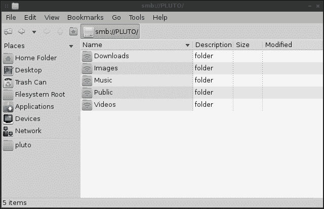

# 四、设置文件服务器

在前一章中，我们介绍了 SSH 并讨论了 SCP。 虽然 SCP 是手动将单个文件从一个地方传输到另一个地方的好方法，但是拥有一个或多个中心位置来存储共享文件会给网络增加很多价值。 无论您是在业务网络上共享重要文件，还是在家庭网络上共享家庭相册，网络上的中央文件存储位置都是一个方便的资产。 在本章中，我们将讨论实现这一目标的三种方法。 我们将首先讨论设计文件服务器时的一些注意事项，然后讨论 NFS、Samba 和 SSHFS。

在本章中，我们将介绍:

*   文件服务器的考虑
*   NFS v3 和 NFS v4
*   设置 NFS 服务器
*   学习 Samba 的基础知识
*   设置 Samba 服务器
*   越来越多的网络共享
*   通过 fstab 和 systemd 自动挂载网络共享
*   使用 SSHFS 创建网络文件系统

# 文件服务器注意事项

与 Linux 世界中的大多数事情一样，实现任何目标的方法都不止一种。 对于每种方法，在实现解决方案之前都有大量的最佳实践和注意事项需要理解。 正如前面提到的,三个最常见的共享文件的方法从一个 Linux 系统,另一个是**网络文件系统(NFS**),**Samba【显示】,**Secure Shell 文件**【病人】系统**(**SSHFS**)。 这三种主要服务于不同的需求，您的网络布局将决定您应该使用哪一种。****

在设计网络文件服务器时，首先要考虑的是需要什么类型的平台来访问它的文件。 在基于 linux 的环境中，NFS 通常是一个很好的选择; 但是，它也不能处理混合环境，所以如果您的网络上有需要共享文件的 Windows 机器，您可能不想选择它。 并不是说你不能在 Windows 系统上访问 NFS 共享(你当然可以)，而是微软限制了 NFS 的可用性(称为**NFS 服务)**，只有是每个 Windows 版本中最昂贵的版本。 如果您使用支持 NFS 的 Windows 版本，那么为 NFS 提供的服务是不错的，但是由于您需要克服额外的许可障碍，因此最好避免使用它。 一般来说，只有当您的网络主要由 UNIX 和 Linux 节点组成时，NFS 才是一个很好的选择。

接下来要考虑的是 Samba。 Samba 允许您在所有三个主要平台(Windows、Linux 和 Mac OSX)之间共享文件，是混合环境中的一个很好的选择。 由于Samba 使用**SMB**协议，所以无论您安装的是什么版本，Windows 系统都能够访问您的 Samba 共享，因此许可证问题不大。 事实上，即使是标准版或家庭版的 Windows 也能够访问这些共享，不需要安装额外的插件。 Samba 的缺点是它处理权限的方式。 在 Windows 和 Linux 节点之间保存文件时，需要做一些额外的工作来处理权限，因此在处理需要保留特定权限的 UNIX 或 Linux 节点时，它并不总是最佳选择。

最后，SSHFS 是另一种主要用于在 Linux 节点之间共享文件的方法。 当然可以从 Windows 连接和访问 SSHFS，但只能使用第三方实用程序，因为 Windows 中不存在内置方法(至少在编写本章的时候)。 SSHFS 的优点在于它的易用性和文件传输是加密的。 虽然加密确实可以帮助您避免窃听，但请记住，SSHFS(就像任何其他解决方案一样)的安全性仅取决于您现有的策略。 但是如果使用得当，SSH(和 SSHFS)是一种从一个节点到另一个节点传输文件的安全方法。 此外，SSHFS 是这里列出的三个最容易运行的方法。 您所需要的只是访问另一个节点和访问一个或多个目录的权限。 这就是您所需要的全部内容，然后您就能够自动地创建一个 SSHFS 连接到您可以访问的任何目录。 SSHFS 的另一个好处是，除了 SSH 本身之外，服务器上没有什么可配置的，而大多数服务器都有可用的 SSH。 还可以非常快速地创建和断开 SSHFS 连接。 我们将在本章后面讨论 SSHFS。

# NFS v3 vs . NFS v4

关于 NFS 的另一个考虑事项是您将要使用的版本。 现在，大多数(如果不是全部的话)Linux 发行版默认使用 NFS v4。 然而，在某些情况下，您的网络上可能有较旧的服务器，您需要能够连接到它们的共享。 虽然 NFS v4 肯定是未来的首选版本，但您可能需要使用旧协议连接到节点。

在这两种情况下，通过编辑`/etc/exports`文件，可以通过 NFS 共享文件服务器上的目录，您将在其中列出您的共享(导出)，每行一个。 我们将在下一节中更详细地讨论这个文件。 但是现在，请记住，`/etc/exports`文件是您声明文件系统上哪些目录可用于 NFS 的地方。 不同版本的 NFS 具有不同的处理文件锁的技术，它们在**idmapd**的引入、性能和安全性方面也有所不同。 还有其他差异如 NFS v4 迁移到 TCP-only(以前版本的协议允许 TCP 或 UDP),是**【显示】状态,在以前的版本**无状态**。**

由于是有状态的，NFS v4 将文件锁定作为协议本身的一部分，而不是像 NFS v3 那样依赖**网络锁管理器**(**NLM**)来提供该功能。 如果 NFS 服务器崩溃或不可用，连接到它的一个或多个节点可能已经打开了文件，这些文件将被锁定到这些节点上。 当 NFS 服务器开始备份时，它会重新建立这些锁，并尝试从崩溃中恢复。 尽管 NFS 服务器在恢复方面做得相当好，但它们并不是完美的，而且有时文件锁定可能成为管理员处理的噩梦。 对于 NFS v4, NLM 已经退役，并且文件锁定是协议本身的一部分，因此可以更有效地处理锁。 然而，它仍然不完美。

那么，您应该使用哪个版本呢? 建议在您的所有节点和服务器上始终使用 NFS v4，除非您正在处理一个使用旧协议的旧服务器，而您仍然需要支持这些协议。

## 设置 NFS 服务器

配置NFS 服务器相对简单。 实际上，您所需要做的就是安装所需的包，创建/`etc/exports`文件，并确保所需的守护进程(服务)正在运行。 在这个活动中，我们将设置一个 NFS 服务器，并从一个不同的节点连接到它。 为了做到这一点，建议您至少使用两台 Linux 机器。 不管这些机器是物理的还是虚拟的，或者它们的任何组合。 如果你已经完成了[第 1 章](01.html "Chapter 1. Setting up Your Environment")，*设置你的环境*，你应该已经有几个节点了; 希望是 Debian 和 CentOS 的混合，因为它们之间的过程有一点不同。

首先，让我们设置 NFS 服务器。 选择一台机器作为 NFS 服务器并安装所需的包。 无论您选择哪种发行版作为服务器还是选择哪种发行版作为客户端，我都将介绍 CentOS 和 Debian 的配置过程。 由于相当多的发行版不是基于 Debian 就是使用与CentOS 相同的配置，这应该适用于大多数发行版。 如果您使用的发行版不遵循任何一个包命名约定，那么您所要做的就是查找要在服务器上为您的特定发行版安装哪个包或元包。 其余的配置应该是相同的，因为 NFS 是相当标准的。

为了在 CentOS 系统上安装所需的软件包，我们将执行以下命令:

```sh
# yum install nfs-utils

```

对于 Debian，我们安装了`nfs-kernel-server`:

```sh
# apt-get install nfs-kernel-server

```

### 注意事项

在安装这些包的过程中，您可能会收到一个错误，认为 NFS 还没有启动，因为文件系统上没有`/etc/exports`。 当您在某些发行版上安装所需的 NFS 包时，这个文件可能不会自动创建。 即使它是自动创建的，该文件也只是一个框架。 如果您确实收到这样的错误，忽略它。 我们将很快创建这个文件。

接下来，我们要确保启用了与 NFS 相关的服务，以便服务器一启动它们就启动。 对于 CentOS 系统，我们将使用以下命令:

```sh
# systemctl enable nfs-server

```

对于 Debian，我们可以通过以下方式启用 NFS:

```sh
# systemctl enable nfs-kernel-server

```

请记住，我们只是在服务器上启用了 NFS 守护进程，这意味着当系统重新启动时，NFS 也将启动(如果我们正确地配置了它)。 然而，我们不需要重启整个服务器才能启动 NFS; 我们可以在创建配置文件后的任何时候开始。 因为我们还没有实际配置 NFS，所以还不需要启动这个守护进程。 我们稍后再做。 实际上，在我们真正创建配置之前，您的发行版可能不会让您启动 NFS。

下一步是确定我们希望在网络上使用服务器上的哪些目录。 您共享的目录基本上取决于您。 Linux 文件系统中的任何内容都可以作为 NFS 导出的候选对象。 然而，一些目录，如`/etc`(包含您的系统配置)或任何其他系统目录，可能最好保持私有。 虽然您可以共享系统上的任何目录，但通常的做法是创建一个单独的目录来存放所有共享，然后在下面创建子目录，然后将这些子目录共享给您的客户机。

例如，您可以在文件系统的根目录(`mkdir /exports`)上创建一个名为`exports`的目录，然后创建其他用户可以访问的目录(如`docs`和`images`)。 这样做的好处在于，您的共享可以从一个地方(`/exports`目录)进行管理，而且 NFS 本身能够将该目录分类为导出根目录(我们将在后面讨论这个问题)。 在继续之前，在文件系统上创建一些用于共享的目录，因为在下一节中我们将把这些目录放在配置文件中。

确定了文件系统中希望共享的目录并创建它们之后，就可以开始实际的配置了。 每个 NFS 共享(称为导出)都是通过在`/etc/exports`文件中为每个希望共享的目录添加一行来配置的。 因为您已经安装了在系统上获取 NFS 所需的包，所以这个文件可能存在，也可能不存在。 根据我的经验，CentOS 不会在安装期间创建这个文件，而 Debian 会。 但是，即使您得到了一个默认的`exports`文件，它也只会包含一些没有任何实际用途的注释掉的代码行。 事实上，在安装过程中，您甚至可能收到一个警告或错误，说没有启动 NFS 守护进程，因为没有找到`/etc/exports`。 这很好，因为我们很快就会创建这个文件。

虽然默认的`exports`文件在不同的发行版之间是不同的(如果它是在默认情况下创建的)，但是创建新导出的格式是相同的，不管您选择的是哪种发行版，因为 NFS 是相当标准的。 添加导出的过程是在您喜欢的文本编辑器中打开`/etc/exports`文件，并将每个导出添加到自己的行中。 任何实际的文本编辑器都可以，只要它是文本编辑器而不是文字处理程序。 例如，如果你是 vim 的粉丝，你可以执行以下命令:

```sh
# vim /etc/exports

```

如果选择`nano`，可以执行以下命令:

```sh
# nano /etc/exports

```

事实上，如果您更喜欢使用 GUI 工具，您甚至可以使用图形文本编辑器，如 Gedit、Kate、Pluma 或 Geany。 在大多数发行版的存储库中都可以找到这些包。

### 注意事项

这可能是不言而喻的，但要编辑`/etc`目录内的文件或根目录下的任何其他文件，您需要在这些命令前加上`sudo`前缀，以便在不以根用户身份登录的情况下编辑它们。 作为最佳实践，建议不要以 root 身份登录，除非绝对必要。 如果以普通用户登录，执行以下命令:

```sh
sudo vim /etc/exports

```

在 Debian 中，您将看到默认的`/etc/exports`文件包含一个注释列表，这可能有助于查看导出的格式化方式。 我们可以通过简单地将它们添加到文件的末尾来创建新的导出，并保留其内容。 如果您希望从一个空白文件开始，您可能需要备份原始文件，以便以后需要引用它。

```sh
# mv /etc/exports /etc/exports.default

```

在您最喜欢的文本编辑器中打开文件后，您就可以开始了。 您希望共享或*导出*的所有目录都应该放在这个文件中，每行一个。 然后，向共享添加参数，以控制如何访问该共享以及由谁访问。 这里有一个示例导出文件与一些示例目录和一些基本配置参数为每个:

```sh
/exports/docs 10.10.10.0/24(ro,no_subtree_check)
/exports/images 10.10.10.0/24(rw,no_subtree_check)
/exports/downloads 10.10.10.0/24(rw,no_subtree_check)

```

从这些导出示例中可以看到，每个导出示例的格式基本上包括我们想要导出的目录、我们想要允许访问的网络地址，以及括号中的一些附加选项。 你可以在这里添加许多选项，我们将在本章的后面讨论其中的一些。 但是，如果您想查看这里可以设置的所有选项，请参考以下`man`命令:

```sh
man exports

```

让我们来讨论一下前面使用的示例`exports`文件的每个部分:

*   `/exports/docs`:第一部分包含我们要导出到网络上其他节点的目录。 如前所述，您几乎可以共享任何您想要的目录。 但是，仅仅因为您*可以*共享目录并不意味着您*应该*共享。 只共享您不介意其他人访问的目录。
*   `10.10.10.0/24`:在这里，我们限制对`10.10.10.0/24`网络中的节点的访问。 网络之外的节点将不能挂载任何这些导出。 在本例中，我们可以使用`10.10.10.0/255.255.255.0`，也可以得到相同的结果。 在我们的示例中，使用了`/24`，它被称为**无类域间路由**(**CIDR**)表示法，这是输入子网掩码的速记法。 当然，CIDR 的含义远不止于此，但是现在，请记住，使用 CIDR 符号而不是子网掩码是为了使示例更简短(另外，它看起来更酷)。
*   `ro`:在第一个导出(文档)中，我将其设置为只读，只是为了告诉您可以这样做。 这可能是不言自明的，但是将目录导出为只读将允许其他人挂载导出并访问其中的文件，但不会对任何内容进行任何更改。
*   `rw`:读写导出允许挂载它的节点创建新文件和修改现有文件(只要用户对文件本身设置了所需的权限)。
*   `no_subtree_check`:虽然这个选项是默认的，我们实际上不需要显式地发出请求，但不包括它可能会在重新启动 NFS 时引起抱怨。 这个选项是与`subtree_check`相反的，而`subtree_check`是现在大部分被避免的。 特别是这个选项，它控制服务器在处理导出操作时是否扫描底层文件系统，这可以稍微提高安全性，但降低可靠性。 由于禁用该选项可以提高可靠性，所以在最近的 NFS 版本中将其设置为默认值。

虽然我没有在任何示例中使用它，但是您将在`/etc/exports`中看到设置的一个常见导出选项是`no_root_squash`。 设置此选项允许终端用户设备上的根用户对导出中包含的文件具有根访问权。 在大多数情况下，这不是一个好主意，但你会时不时地在野外看到这种情况。 这与`root_squash`相反，后者将根用户映射到 nobody。 除非你有很好的理由不这样做，`no_root_squash`就是你想要的。

除了对单个网络的选项进行分类之外，还可以通过将导出的配置添加到同一行中，使导出可用于其他网络。 下面是一个与其他网络共享的`docs`挂载的示例:

```sh
/exports/docs 10.10.10.0/24(ro,no_subtree_check),192.168.1.0/24(ro,no_subtree_check)

```

在这个示例中，我们导出了`/exports/docs`，以便`10.10.10.0/24`网络和`192.168.1.0/24`网络中的节点能够访问它。 虽然我对两者都使用了相同的选项，但您不必这样做。 您甚至可以将导出配置为对一个网络只读，并在需要时对另一个网络进行读写。

到目前为止，我们一直在与整个网络分享我们的出口。 这是通过将允许的 IP 地址的最后 8 个字节设置为`0`来实现的。 对于最后一个示例，任何 IP 地址为`10.10.10.x`或`192.168.1.x`且子网掩码为`255.255.255.0`的节点都有资格访问导出。 然而，您可能并不总是希望允许访问整个网络。 也许您想要允许访问单个节点。 你可以很容易地对单个节点进行分类:

```sh
/exports/docs 10.10.10.191/24(ro,no_subtree_check)

```

在前面的示例中，我们允许 IP 地址为`10.10.10.191`的节点访问导出。 指定一个 IP 地址或网络可以提高安全性，尽管它不是 100%的全覆盖。 然而，在构建安全策略时，限制对绝对需要它的主机的访问是一个很好的开始。 我们将在[第 9 章](09.html "Chapter 9. Securing Your Network")、*保护您的网络*中更详细地讨论安全性。 但是现在，请记住，您可以根据特定的网络或单个 ip 限制对导出的访问。

前面，我们讨论了这样一个事实:从 Version 4 开始，NFS 可以使用一个目录作为它的导出根，也称为 NFS 伪文件系统。 在`/etc/exports`文件中，通过在导出该目录时将`fsid=0`或`fsid=root`作为选项来标识。 在本章中，我们一直使用`/exports`作为 NFS 导出的基础。 如果我们想将这个目录标识为导出根目录，我们将像这样更改`/etc/exports`文件:

```sh
/exports *(ro,fsid=0)
/exports/docs 10.10.10.0/24(ro,no_subtree_check)
/exports/images 10.10.10.0/24(rw,no_subtree_check)
/exports/downloads 10.10.10.0/24(rw,no_subtree_check)

```

一开始，这个概念可能会让人很困惑，所以让我们把它分解一下。 在第一行中，我们确定了导出根:

```sh
/exports *(ro,fsid=0)

```

这里，我们声明`/exports`作为导出根。 现在这是 NFS 文件系统的根。 当然，就 Linux 本身而言，您有一个以`/`开始的完整文件系统，但是就 NFS 而言，它的文件系统现在是从`/exports`开始的。 在这一行中，我们还将`/exports`声明为只读。 我们不希望任何人修改这个目录，因为它是 NFS 根目录。 它也与所有人共享(请注意`*`)，但这并不重要，因为我们为每个导出设置了更细粒度的权限。 有了 NFS 根，客户机现在就可以挂载这些导出，而不需要知道到达导出的完整路径。

例如，用户可以输入以下命令将我们的`downloads`导出挂载到他或她的本地文件系统:

```sh
# mount 10.10.10.100:/exports/downloads /mnt/downloads

```

这就是从本地文件服务器(本例中为`10.10.10.100`)挂载 NFS 导出的方式，使用 NFS 根挂载的是*而不是*。 这要求用户知道该目录位于该服务器上的`/exports/downloads`。 但是有了 NFS 根，我们可以让用户简化`mount`命令，如下所示:

```sh
# mount 10.10.10.100:/downloads /mnt/downloads

```

注意，我们在前面的命令中省略了/exports。 虽然这看起来并不多，但我们基本上是要求服务器提供`downloads`导出，无论它在文件系统上的哪个位置。 `downloads`目录是否位于`/exports/downloads`、`/srv/nfs/downloads`或其他位置都无关紧要。 我们只需请求`downloads`导出，服务器就知道它在哪里，因为我们设置了 NFS 根。

现在我们已经配置了`/etc/exports`文件，最好编辑`/etc/idmapd.conf`配置文件来配置一些额外的选项。 这不是绝对必须的，但绝对是推荐的。 默认的`idmapd.conf`文件不同于不同的发行版，但是每个发行版都包含我们需要在本节中配置的选项。 首先，查找像下面这样的一行(或非常类似):

```sh
# Domain = local.domain

```

首先，需要取消对这一行的注释。 删除`#`符号和末尾的空格，使行以`Domain`开始。 然后，将域设置为与网络上的其他节点相同。 这个域很可能是在安装期间选择的。 如果您不记得您的域名是什么，运行`hostname`命令应该会显示您的域名，它紧跟在您的主机名之后。 对希望能够访问 NFS 导出的每个节点执行此操作。

您可能想知道为什么这是必要的。 当创建用户和组帐户一个 Linux 系统,他们分配了一个**UID**(**【显示】用户 ID)和**GID**(**【病人】组 ID)。 除非以相同的顺序在所有系统上创建用户帐户，否则每个节点上的 UID 和 GID 很可能是不同的。 即使您以相同的顺序创建用户和组帐户，它们仍然可能是不同的。 `idmapd`文件通过将这些 uid 从一个系统映射到另一个系统来帮助我们。 为了让`idmapd`工作，`idmapd`守护进程必须在每个节点上运行，并且该文件也应该配置相同的域名。 在 CentOS 和 Debian 上，这个守护进程运行在`/usr/sbin/rpc.idmapd`下，并与 NFS 服务器一起启动。****

所以，你可能会想; `Nobody-User`和`Nobody-Group`的目的是什么? `nobody`用户运行脚本或命令，如果这些脚本或命令由特权用户运行，将是危险的。 一般情况下，`nobody`用户无法登录系统，且没有主目录。 如果您以`nobody`的方式运行一个进程，那么它的范围将受到限制，如果需要对帐户进行妥协的话。 对于 NFS，`nobody`用户和`nobody`组具有特殊的用途。 如果文件属于一个系统上的特定用户，而在另一个系统上不存在，那么该文件的权限将显示为由`nobody`用户和组拥有。 当没有设置`no_root_squash`时，通过根用户访问文件也是如此。 根据您使用的发行版的不同，这些帐户可能有不同的名称。 在 Debian 中，`Nobody-User`和`Nobody-Group`都默认为`nobody`。 在 CentOS 中，这些都是`nobody`。 您可以在您的`idmapd.conf`文件中看到哪个帐户用于`nobody`用户和`nobody`组。 您不需要重命名这些帐户，但是如果由于某些原因您需要重命名这些帐户，您将需要确保`idmapd.conf`文件具有正确的名称。

现在我们已经配置了 NFS 并准备就绪，那么如何开始使用它呢? 如果您一直在跟踪本文，您可能已经发现我们启用了 NFS 守护进程，但还没有启动它。 既然配置已经就位，没有什么能阻止我们这样做。

在 Debian 上，我们可以通过执行以下命令来启动 NFS 守护进程:

```sh
# systemctl start nfs-kernel-server

```

在 CentOS 上，我们可以执行以下命令:

```sh
# systemctl start nfs-server

```

从这一点开始，我们的 NFS 导出应该是共享的，并准备好了。 在本章的后面，我将解释如何在其他系统上安装这些导出(以及 Samba 共享)。

NFS 中还有一件事值得一提。 每当 NFS 守护进程启动时，都会读取`/etc/exports`文件，这意味着您可以通过重新启动服务器或 NFS 守护进程，在添加新导出之后激活它们。 但是，在生产环境中，不适合重新启动 NFS 或服务器本身。 这将中断当前正在使用它的用户，并可能导致陈旧的挂载，即到网络共享的无效连接(这不是一个好情况)。 幸运的是，在不重新启动 NFS 本身的情况下激活新的导出是很容易的。 简单地执行下面的命令，你就会很好:

```sh
# exportfs -a

```

# 学习 Samba 的基础知识

与NFS 一样，Samba 允许您与网络中的其他计算机共享服务器上的目录。 尽管两者都服务于相同的目的，但它们适合不同的环境和用例。

NFS 是最古老的方法，在 Linux 和 UNIX 世界中广泛使用。 虽然我们确实有更新的解决方案(比如 SSHFS)，但 NFS 是经过实践检验的。 但在混合环境中，这可能不是最好的解决方案。 现在，网络上可能不是每台计算机都运行特定的操作系统，因此可能存在 NFS 访问不可用或不实际的节点。

如前所述，只有更昂贵的 Windows 版本才支持 NFS。 如果你有一个大型的 Windows 机器网络，如果你不需要的话，把它们全部升级到更高的版本将是相当昂贵的。 这是 Samba 最擅长的领域。 Windows、Linux 和 Mac 计算机可以访问通过 Samba 共享的目录。 在 Windows 的情况下，即使是较低端的版本也可以访问 Samba 共享(如 Windows 7 家庭专业版或 Windows 10 核心版)，而无需任何新的安装或购买。

Samba 的缺点是它不能像 NFS 那样处理权限，因此您需要以特殊的方式管理配置文件以尊重权限。 然而，这并不是万无一失的。 例如，Windows 和 Linux/UNIX 系统采用非常不同的权限方案，因此它们在本质上是不兼容的。 在 Samba 的配置文件中，您可以告诉它对新创建的文件使用特定的用户和组权限，甚至可以强制 Samba 将所有权视为与文件实际存储的内容以外的内容。 因此，当然有一些方法可以使 Samba 更好地处理权限，但在本质上不如 Linux 或 UNIX 本机解决方案(如 NFS)好。

至于Samba 服务器如何适应您的网络，基本的经验法则是，只要不需要跨平台兼容性，就在混合环境和 NFS 中使用 Samba。

## 设置 Samba 服务器

在本节中，我们将继续设置 Samba 服务器。 在下一节中，我将解释如何挂载 Samba 共享。 首先，我们需要安装 Samba。 在 CentOS 和 Debian 系统上，这个包被简单地称为`samba`。 所以，通过`apt-get`或`yum`安装那个包，你应该有你需要的一切:

```sh
# yum install samba

```

使用`apt-get`命令如下:

```sh
# apt-get install samba

```

在 Debian 系统上，Samba 一安装就启动。 事实上，它也是启用的，所以每次打开系统时它都会自动启动。 然而在 CentOS 的情况下，它在安装后既没有启用也没有启动。 如果你选择 CentOS 作为你的 Samba 服务器，你需要启用和启动守护进程:

```sh
# systemctl start smb
# systemctl enable smb

```

现在，Samba 已经安装、启用，但还没有配置。 要配置 Samba，我们需要编辑`/etc/samba/smb.conf`文件。 默认情况下，在安装所需的包时立即创建该文件。 但是，默认文件的存在主要是为了向您提供配置示例。 它非常庞大，但是您可能想看一看它，看看以后可能会用到的一些语法示例。 您可以在文本编辑器中打开该文件，或者简单地`cat`在终端上查看该文件:

```sh
cat /etc/samba/smb.conf

```

为了简化，我建议您从一个新的文件开始。 虽然配置示例确实很好，但出于生产目的，我们可能应该使用一个更短的文件。 由于原始文件以后可能会有用，创建一个备份:

```sh
# mv /etc/samba/smb.conf /etc/samba/smb.conf.default

```

接下来，在文本编辑器中简单地打开`smb.conf`文件，这将创建一个新的/空文件，因为我们将原始文件移动到备份文件:

```sh
# vim /etc/samba/smb.conf

```

我们可以从以下基本配置开始:

```sh
[global]
server string = File Server
workgroup = HOME-NET
security = user
map to guest = Bad User
name resolve order = bcast hosts wins
include = /etc/samba/smbshared.conf

```

让我们逐行通过这个配置文件。 首先，我们从`[global]`部分开始，在这里配置将对整个服务器生效的选项。 事实上，这是这个特定文件中唯一的部分。

接下来，我们有`server string`。 `server string`是您在 Windows 系统上浏览网络共享时看到的描述。 例如，您可能会看到一个名为`Documents`的共享，其下方的描述如下: `File Server`。 这个部分不是必需的，但是最好有它。 在商业网络中，这对于概述关于系统的注释很有用，比如它在哪里，或者它用于什么。

然后，设置我们的`workgroup`。 那些曾经是 Windows 系统管理员的人可能对此非常了解。 工作组充当一个名称空间，包含具有特定用途的所有系统。 在实践中，这通常是您的 LAN 的名称。 LAN 内的每台计算机都有相同的工作组名称，因此它们会显示为存在于同一网络中。 在 Windows 系统上浏览共享时，您可能会看到一个工作组列表，双击其中一个工作组，就会看到在该工作区下共享资源的系统列表。 在大多数情况下，您可能希望在每个系统上使用相同的工作组名称，除非您希望分隔资源。 要查看现有系统上的工作组名称，右键单击**我的计算机**或**这台 PC**(取决于您的版本)，然后单击**属性**。 您的工作组名称应该在出现的窗口中列出。


查看 Windows 系统的属性以收集工作组名称，在本例中为 LOCALNET

设置`security = user`告诉 Samba 使用用户的用户名和密码进行身份验证。 如果匹配，则不会提示用户输入密码以访问资源。

`map to``guest = Bad User`告诉 Samba，如果提供的用户名和密码与本地用户帐户不匹配，那么将连接用户视为通过来宾帐户连接的用户。 如果您不希望发生这样的映射，请删除此部分。

接下来，`name resolve order = bcast hosts wins`确定名称解析的顺序。 在这里，我们首先使用广播的名称，然后是`/etc/hosts file`中的主机名映射，然后是`wins`(`wins`在很大程度上已经被 DNS 所取代，这里只包含它是为了兼容性)。 在大多数网络中，这种顺序应该没问题。

最后，在配置文件的末尾有`include = /etc/samba/smbshared.conf`。 基本上，这个允许我们包含另一个配置文件，就好像它是现有配置文件的一部分一样。 在本例中，我们包含了`/etc/samba/smbshared.conf`的内容，一旦 Samba 读取了这一行，它就会读取这些内容。 接下来我们将创建这个文件。 基本上，这允许我们在一个单独的配置文件中指定共享。 这不是必需的，但我认为它使事情更容易管理。 如果愿意，可以将`smbshared.conf`文件的内容包含在`smb.conf`文件中，这样所有内容都在一个文件中。

下面是我为这个活动创建的一个示例`smbshared.conf`。 在你的情况下，你需要做的就是确保这些值匹配你的系统和你选择共享的目录:

```sh
[Music]
## My music collection
 path = /share/music
 public = yes
 writable = no

[Public]
## Public files
 path = /share/public 
 create mask = 0664
 force create mode = 0664
 directory mask = 0777
 force directory mode = 0777
 public = yes
 writable = yes

```

在这里，我创建了两个共享。 每个共享以括号中的名称开头(在浏览此机器上的共享时，将在其他系统上显示该名称)，然后是该共享的配置。 如您所见，我有一个名为`Music`的共享目录，另一个名为`Public`。

要声明到共享的路径，使用`path =`，然后使用该共享对应的目录的路径。 在我的例子中，你可以看到我共享了以下目录:

```sh
/share/music
/share/public

```

接下来，我还通过添加`public = yes`宣布该股票为公开股票。 这意味着客户机可以访问这个共享。 如果我希望客人不能访问它，我可以将其设置为`no`。

在我的音乐分享中，我有`writable = no`。 顾名思义，这将禁用其他计算机在该共享中更改文件的能力。 就我而言，我把我的音乐收藏分享给网络上的其他电脑，但我不想不小心删除音乐文件。

在我的公共股份中，我添加了几个额外的选项:

```sh
 create mask = 0664
 force create mode = 0664
 directory mask = 0777
 force directory mode = 0777

```

这些选项都对应于在该共享中创建新文件时的默认权限。 例如，如果我挂载我的公共共享，然后在那里创建一个目录，它将获得`777`的权限。 如果我创建一个文件，它的权限将是`664`。 当然，您可能不想让您的文件完全打开，因此您可以根据需要更改这些权限。 此选项确保与新创建的目录和文件的权限保持一致。 在网络中，您可能有需要访问这些文件的自动化进程在运行，并且您希望确保每次运行此类进程时都不需要手动更正权限，因此这可能是必要的。

现在您已经创建了自己的 Samba 配置，测试您的配置是一个好主意。 幸运的是，Samba 本身包含一个特殊命令，允许您这样做。 如果在系统上运行`testparm`，它将显示文件中可能存在的语法错误。 然后，它将显示您的配置。 继续在您的系统上运行`testparm`。 如果有任何错误，返回并确保您输入的内容没有问题。 如果一切正常进行，您应该不会看到任何错误，然后您将得到配置的摘要。 在验证了配置之后，重新启动 Samba 守护进程，使更改生效。 要做到这一点，只需在 Debian 系统上运行以下命令:

```sh
# systemctl restart smbd

```

对于 CentOS，使用如下命令:

```sh
# systemctl restart smb

```

现在，您应该能够访问 Windows 或 Linux 系统上的 Samba 共享。 在 Linux 上，大多数 GUI 文件管理器应该允许您浏览网络以获取 Samba 共享。 在 Windows 上，您应该能够打开**我的电脑**或**这台 PC**，然后单击**网络**来浏览具有活动共享的本地联网计算机。 也许一个简单的方法来访问 Windows 机器上的股票是按 Windows 键键盘上紧随其后的是【R T6】打开运行对话框,然后输入【显示】您的 Samba 服务器的名称开头两个反斜杠。 例如，要从 Windows 系统访问我的基于 debian 的文件服务器(Pluto)，我将在运行对话框中输入以下内容，然后按*回车*:

```sh
\\pluto

```

我从那个系统得到了一个股份列表，如下截图所示:


从 Windows 7 PC 上查看 Samba 共享(从 Linux 系统提供)

# 挂载网络共享

到目前为止，在本章中，我们已经创建了 NFS 和 Samba 共享。 但实际上我们还没有获得任何股份。 在本节中，我们将处理这个问题。

在 Linux 中，`mount`命令可以用于挂载几乎所有东西。 无论您连接外部硬盘驱动器、插入 CD 或希望挂载网络共享，`mount`命令都可以充当瑞士军刀，允许您将这些资源挂载到您的系统中。 `mount`命令允许您挂载资源并将其附加到系统上的本地目录。 在大多数情况下，`mount`在使用图形桌面环境的大多数 Linux 系统上自动运行。 如果你插入了闪存盘或某种光学介质，你可能见过这种情况。 在网络共享中，它们不会自动挂载，尽管可以将它们配置为自动挂载。

如果您正在使用安装了桌面环境的系统，也许挂载网络共享最简单的方法是使用 GUI 文件管理器。 如果您单击一个文件共享，它可能会被挂载，并且您将被允许访问它，前提是您在系统上具有必要的权限。 **Nautilus**，**Caja**，**Pcmanfm**，以及**Dolphin**都是流行的 Linux 文件管理器。



pcmanfm 文件管理器，查看来自 Samba 文件服务器的共享

`mount`命令在没有图形化环境的系统上最有用，或者当您希望将资源挂载在默认环境之外的某个地方时，命令最有用。 要使用`mount`命令，给它提供您想要挂载的资源类型，它可以在哪里找到该资源，然后是用于挂载的本地目录。 例如，要挂载一个 NFS 导出，我们可以这样做:

```sh
# mount -t nfs 10.10.10.101:/exports/docs /mnt/docs

```

或者，如前所述，如果我们设置 NFS 根目录，则使用以下命令:

```sh
# mount -t nfs 10.10.10.101:/docs /mnt/docs

```

在该示例中，我们告诉挂载命令，我们要挂载一个 NFS 导出，方法是为它提供`-t`参数，然后为类型提供`nfs`。 在我的实验室中，这个共享存在于一台 IP 地址为`10.10.10.101`的计算机上，接下来我用冒号和我正在访问的系统上的目录提供它。 在本例中，正在访问`10.10.10.101`上的`/exports/docs`。 最后，我有一个本地目录`/mnt/docs`，它存在于我的本地计算机上，我希望将这个共享挂载在这里。 在执行这个命令之后，每次我在本地计算机上访问`/mnt/docs`时，实际上就是在我的文件服务器上访问`/exports/docs`。 在使用这个导出之后，我简单地卸载它:

```sh
# umount /mnt/docs

```

在 Linux 机器上安装 Samba 共享有点复杂。 我将包含一个示例命令，它可以用于从同一服务器挂载 Samba 共享。 但是在讨论这个问题之前，您首先需要在系统上安装必要的包，以便能够挂载 Samba 共享。 在 CentOS 上安装`samba-client`。 在 Debian 上，这个包是`smbclient`。 安装所需的包后，您应该能够通过执行以下命令挂载 Samba 共享:

```sh
# mount -t cifs //10.10.10.101/Videos -o username=jay /mnt/samba/videos

```

如果您需要通过密码访问资源，使用以下命令:

```sh
# mount -t cifs //10.10.10.101/Videos -o username=jay, password=mypassword /mnt/samba/videos

```

如您所见，同样的基本思想也用于装入 Samba 共享。 但是在本例中，我们以不同的方式格式化目标路径，我们使用`cifs`作为文件系统类型，并且还包含用户名(和密码，如果您的 Samba 服务器需要的话)。 与前面的示例一样，我们在命令结束时使用一个要将挂载附加到的本地目录。 在本例中，我为这个共享创建了一个`/mnt/samba/Videos`目录。

# 通过 fstab 和 systemd 自动挂载网络共享

与通过`mount`命令挂载网络共享一样方便的，您可能不希望在每次要使用共享时手动挂载它。 在具有中央文件服务器的网络中，将工作站配置为自动挂载网络共享是有意义的，这样每次引导系统时，共享都会自动挂载并准备就绪。

自动挂载资源的尝试和测试方法是`/etc/fstab`文件。 每个 Linux 系统都有一个`/etc/fstab`文件，所以请继续查看您的文件。 默认情况下，该文件仅包含用于挂载本地资源(如硬盘上的分区)的配置。 标准的做法是向该文件添加额外的配置行，以将从其他硬盘驱动器到网络共享的任何内容挂载到网络共享。

### 注意事项

在编辑您的`/etc/fstab`文件时要小心。 如果您不小心改变了本地硬盘的配置，那么您的系统在下次启动时将无法启动。 在编辑此文件时，请始终谨慎使用。

下面是一个示例`/etc/fstab`文件:

```sh
# root filesystem
UUID=4f60d247-2a46-4e72-a28a-52e3a044cebf       /                   ext4            errors=remount-ro           0 1
# swap
UUID=c9149e0a-26b0-4171-a86e-a5d0ee4f87a7       none                swap            sw                          0 0

```

在我的文件中，**通用唯一标识符**(**UUID**)引用我的本地硬盘分区。 这些在每个系统上都是不同的。 接下来，列出每个装入点。 `/`符号表示文件系统的根，交换分区不需要挂载点，因此将其设置为`none`。

在`/etc/fstab`文件的末尾，我们可以添加在每次启动系统时都可用的附加挂载。 如果我们想添加一个 NFS 共享，我们可以执行以下操作:

```sh
10.10.10.101:/share/music/mnt/music  nfs  users,rw,auto,nolock,x-systemd.automount,x-systemd.device-timeout=10 0 0

```

在第一节中，我们声明服务器的 IP 地址，后跟冒号和导出目录的路径。 在本例中，我在`10.10.10.101`上访问`/share/music`。 下一节是挂载点，因此我将此导出连接到本地系统上的`/home/jay/music`。 接下来，我们将访问的共享指定为`nfs`。 没有惊喜。 最后，我们在配置结束时提供了一些关于如何挂载这个共享的选项。 一个简单的挂载选项是`rw`，它代表读写。 如果我们想防止其中包含的文件被更改，我们可以在这里使用`ro`。

上一个示例中的选项是`x-systemd.automount`。 基本上，这告诉 systemd (Debian 和 CentOS 的默认`init`系统，分别从版本 8 和 7 开始)如果可能的话，我们希望保持这个挂载。 使用此选项，如果由于某些原因断开连接，systemd 将尽力重新挂载该共享。 此外，还可以添加`x-systemd.device-timeout=10`，它告诉系统，如果共享在网络上不可用，则等待时间不要超过 10 秒。 我们以`0 0`结束这一行，因为这不是本地文件系统，在引导时不需要进行一致性检查。

### 注意事项

如果您不使用带有 systemd 的发行版(例如 CentOS 7 和 Debian 8)，则不要包含`x-systemd`选项，因为使用不同`init`系统的发行版无法理解这些选项。

同样，还可以将 Samba共享添加到您的`/etc/fstab`文件中。 这里有一个例子:

```sh
//10.10.10.9/Videos  /samba  cifs  username=jay  0  0

```

在我们继续之前，关于`/etc/fstab`文件的最后一个注意事项。 本节中的示例都假设您希望网络共享自动可用。 然而，情况并非总是如此。 如果您将`noauto`挂载选项添加到`fstab`的配置行中，共享将不会在引导时自动挂载。 将`noauto`添加到我们的 Samba 示例中，`fstab`行将被更改如下:

```sh
//10.10.10.101/Videos  /samba  cifs  noauto,username=jay  0  0 

```

一个 NFS 的例子看起来像这样:

```sh
10.10.10.101:/share/music
/mnt/music    nfs    users,rw,noauto,nolock,x-systemd.device-timeout=10 0 0

```

在一些情况下，这可能是有用的。 一个例子可能是使用笔记本电脑，在那里您不会总是连接到同一个网络。 如果是这种情况，您不会希望您的机器尝试自动挂载一些东西，除非您实际连接到该网络。 通过添加`noauto`作为挂载选项，您可以在任何需要的时候手动挂载资源，而不需要记住冗长的`mount`命令。 例如，要挂载包含在`fstab`文件中的 NFS 导出，您需要执行以下操作:

```sh
# mount /mnt/music

```

相比之下，这比每次挂载导出时输入以下内容要容易得多:

```sh
# mount -t nfs 10.10.10.101:/exports/music/ mnt/music

```

由于我们将导出添加到`fstab`文件中，所以当我们键入一个简化的`mount`命令时，`mount`命令会查找相关的行，就像我们刚才所做的那样。 如果它找到您试图访问的挂载点的配置，它将允许您访问它，而不需要输入整个命令。 即使您不想自动访问远程共享，将它们添加到您的`fstab`文件中仍然是非常方便的。

# 使用 SSHFS 创建网络文件系统

在前一章中，我们讨论了 SSH，是大多数 Linux 管理员每天使用多次的关键实用程序。 但是，虽然它非常适合访问网络上的其他 Linux 系统，但如果远程文件系统是在本地挂载的，它也允许您以的形式访问它们。 这被称为**SSHFS**。 SSHFS 的一个优点是不需要事先澄清任何导出的目录。 如果您能够连接到远程 Linux 服务器并通过 SSH 访问一个目录，那么您就能够自动地在本地挂载它，就好像它是一个网络共享一样。

在Debian 系统上，您可以简单地安装`sshfs`包。 在 CentOS 上，`sshfs`包默认是不可用的。 在您可以在 CentOS 系统上安装`sshfs`之前，您需要添加一个全新的存储库，称为**Enterprise Linux Extra Packages**(**EPEL**)。 要做到这一点，只需安装`epel-release`包:

```sh
# yum install epel-release

```

安装`epel`存储库后，您应该能够安装`sshfs`:

```sh
# yum install sshfs

```

一旦安装，你就可以很容易地在你的本地文件系统上挂载目录:

```sh
sshfs jay@10.10.10.101:/home/jay/docs /home/jay/mnt/docs

```

为了工作，您的用户帐户不仅必须能够访问远程系统，还必须能够访问本地挂载点。 一旦启动该命令，您将看到与通过 SSH 连接到服务器时通常看到的提示类似的提示。 基本上，这就是你正在做的。 不同之处在于，连接在后台保持打开状态，维护远程目录和本地目录之间的关系。

当您需要在远程文件系统上挂载一些东西，但您可能不需要再次或经常访问它时，使用`sshfs`是一个很好的主意。 但与 NFS 和 Samba 共享类似，您实际上可以使用`/etc/fstab`通过 SSHFS 挂载资源。 考虑下面的`fstab`示例:

```sh
jay@10.10.10.101:/home/jay/docs                /home/jay/mnt/docs    fuse.sshfs      defaults,noauto,users,_netdev   0 0

```

正如前面所做的，我们设置了`noauto`，这样我们就可以通过简单地输入:

```sh
mount /home/jay/docs

```

# 总结

在这个内容丰富的章节中，我们讨论了在基于 linux 的网络中访问和共享文件的几种方法。 我们从讨论 NFS 开始，它是在 Linux 和 UNIX 网络中共享文件的一种古老但可靠的方法。 我们还介绍了 Samba，这是一种在混合操作系统环境中共享资源的方法。 我们还讨论了如何手动和自动挂载这些共享。 我们用 SSHFS 结束了我们的讨论，SSHFS 是 SSH 的一个非常方便(但还不出名)的特性，它允许我们按需挂载来自其他系统的目录。

当然，由于依赖于网络中的网络资源，保持每个节点以最佳状态运行是非常重要的。 在下一章中，我们将通过监控系统资源和保持节点正常运行。