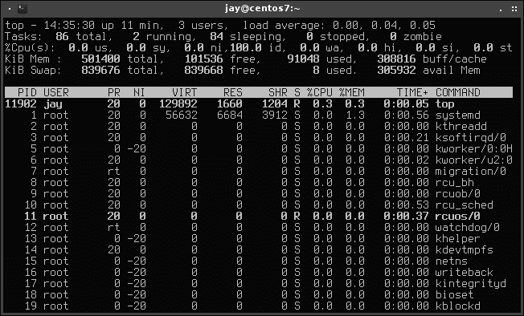
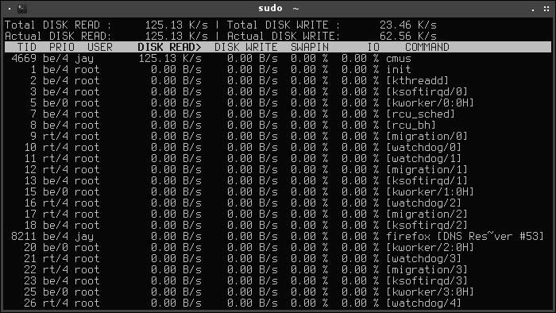
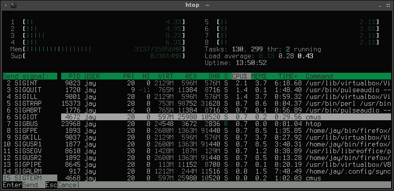
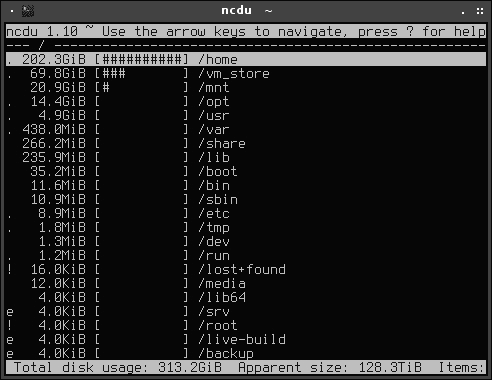
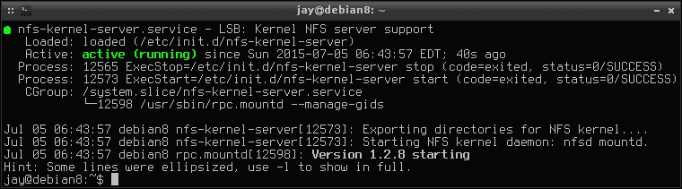

# 第五章。 监控系统资源

随着组织需求的扩大，你的人际网络也会随着增长而变化。 跟踪每个节点上的资源对于稳定性非常重要。 虽然 Linux 可以很好地处理资源，但它只能做这么多。 cpu 可能会被过度利用，磁盘可能会被填满，过多的输入/输出甚至会导致最强的服务器停止运行。 关注这些内容非常重要，特别是当系统用于生产并被其他系统依赖时。

在这一章中，我们将研究检查 Linux 系统上运行的内容并管理其资源的方法，以帮助确保节点是网络上的良好公民。

在本章中，我们将介绍:

*   检查和管理过程
*   理解平均负载
*   检查可用内存
*   使用基于 shell 的资源监视器
*   检查磁盘空间
*   扫描使用存储
*   介绍了日志
*   使用 logrotate 维护日志大小
*   了解 systemd init 系统
*   理解 systemd 日志

# 检查和管理进程

在一个典型的故障排除场景中，您可能有一个行为不当的进程，或者需要对其执行一个操作。 如果您正在为工作站使用图形化桌面环境，您可能会使用 GNOME System Monitor 之类的工具来调查系统上运行的进程，然后杀死问题子进程。 但是，在大多数情况下，您可能没有桌面环境(至少在服务器上没有)，因此您将使用诸如`kill`这样的命令来摆脱任何行为不端的进程。 但是在杀死一个进程之前，您需要知道它的进程标识符(**PID**)。 一个在所有 Linux 系统上都可以查找进程 PID 的方法是打开一个终端，输入`ps`命令。 下面是它的用法示例:

```sh
ps aux

```

除了`ps`之外，如果您碰巧已经知道流程的名称，则通常使用。 在这种情况下，您可以将`ps aux`的输出管道到`grep`中，然后搜索进程。

```sh
ps aux |grep httpd

```

`ps`命令将给您一个正在运行的进程列表。 如果使用`grep`，输出将缩小到与搜索项匹配的进程列表。 您将看到位于第二列中结果中出现的每个进程的`PID`。 在第三列中，您将看到进程占用了多少 CPU，后面的一列是内存使用情况。


ps 辅助程序在 Debian 系统上的输出

`USER`、`STAT`、`START`、`TIME`和`COMMAND`是我们可以从输出中看到的附加列。 虽然`USER`是不言自明的，下面是对其他列标题的简短描述:

*   `STAT`:该字段标识程序的状态，用一个或两个字符的代码表示程序当前的状态。 例如，`S`表示进程正在等待某个事件完成，而`D`是不可中断的睡眠状态，通常与 IO 相关。 要查看完整的列表，请查看`ps`上的手册页面。
*   `START`:这个字段表示进程开始运行的时间。
*   `TIME`:表示进程占用 CPU 的总时间。 每当一个进程到达 CPU 并需要完成工作时，就会根据 CPU 记录时间。
*   `COMMAND`:显示当前进程运行的命令。

现在，您已经知道了如何查找进程的 PID，下面来看一下`kill`命令，在需要关闭无法通过正常方式关闭的程序时，该命令非常有用。 例如，如果你正在运行一个进程 ID 为 25787 的脚本，你可以通过执行以下命令来终止它:

```sh
# kill 25787

```

`kill`命令通过向 PID 发送一个特定的信号来工作。 例如，信号 15 被称为，即**SIGTERM**。 如果对没有任何参数的进程执行`kill`(就像我们在上一个示例中所做的那样)，默认情况下将发送信号 15，它基本上是礼貌地请求进程关闭。 您可以向进程发送 18 种不同的信号，您可以在手册页面中了解这些信号。 为了便于我们在这里讨论，`SIGINT`、`SIGTERM`和`SIGKILL`可能是您最常用的。 通过执行以下命令，可以查看这些信号的列表以及它们的含义:

```sh
man 7 signal

```

要发送特定的信号，请在`kill`命令后键入连字符，然后是要发送的信号。 由于`kill`本身发送信号 15，你可以通过执行下面的命令来做同样的事情:

```sh
# kill -15 25787

```

要发送不同的信号，例如 2(**SIGINT**)，输入以下命令:

```sh
# kill -2 25787

```

如果你*非常*绝望，你可以向进程发送信号 9(**SIGKILL**):

```sh
# kill -9 25787

```

然而，只有当您已经用尽了所有其他选项，并且无论您如何努力都无法使进程关闭时，才应该使用`SIGKILL`。 `SIGKILL`立即关闭过程，但不幸的是，它没有给它一个机会来清理自己之后。 这可能会导致不干净的临时文件和打开的套接字连接留在您的系统上。 更糟糕的是，它实际上会破坏数据库和配置。 因此，我再怎么强调这一点也不为过，如果您不能让进程优雅地关闭，那么`kill -9`绝对应该是您尝试的最后一件事。 尝试您所知道的所有方法，首先优雅地关闭一个进程，然后在考虑使用它之前进行多次尝试。

另一个可以用来终止进程的命令是`killall`命令。 `killall`命令允许您终止系统上匹配特定名称的所有进程。 例如，假设您打开了多个 Firefox 窗口，但程序停止响应。 要立即杀死所有运行在您系统上的 Firefox 实例，只需执行以下命令:

```sh
killall firefox

```

就像这样，你系统上的所有 Firefox 窗口都会立即消失。 可以使用`killall`命令关闭所有共享相同名称的多个进程，并且在运行单个无响应程序或脚本的多个实例的服务器上非常有用。

这几乎就是使用`kill`和`killall`命令的全部内容。 当然，还有更多的选项，手册页将提供更多的信息。 但简而言之，这些就是你将实际使用的变体。 在理想的情况下，您应该永远不需要使用`kill`，并且服务器上运行的所有进程都将毫无疑问地服从您。 不幸的是，我们并不是生活在一个完美的世界中，您可能会比您希望的更频繁地使用这些命令。

# 理解平均负载

对于一个Linux 管理员来说，**平均负载**是您将要学习的最重要的概念之一。 虽然您可能已经知道这个数字表示系统正在经历的负载，但它也表示趋势性能。 使用这个数字，您将能够确定您的系统是不堪重负，还是正在恢复和平静。 实际上，平均负载由三个数字组成，每个数字代表系统在特定时间范围内的平均负载。 第一个数字代表一分钟，第二个代表五分钟，第三个代表 15 分钟。 有许多方法可以查看平均负载，并且它也将显示在大多数 Linux 可用的系统监视器中。 在快照中查看平均负载的一种方法是执行以下命令:

```sh
cat /proc/loadavg

```


查看平均负载

一个更简单的技巧是使用`uptime`命令。 虽然`uptime`命令的主要目的是查看系统运行了多长时间，但它也显示了系统的平均负载。


uptime 命令的输出信息

那么，如何正确地解释这些信息呢? 通过本节中显示的 uptime 命令的屏幕截图，我们可以看到以下数字:

```sh
0.63 0.72 0.71

```

如前所述，前三个数字分别表示系统在 1、5 和 15 分钟期间的负载。 所引用的负载表示在每个时间框架中等待 CPU 或当前使用 CPU 的进程数量。 在本例中使用的系统上，我们可以看到它的负载相对较低。 我们还可以看到平均负载的趋势。 在示例系统上，负载呈上升趋势，但只上升了一点。

一般来说，平均负载越低越好。 但情况并非总是如此; 较低的数字也可能令人不安。 例如，如果您有一个服务器，它应该做大量的工作，但它的平均负载下降到小于 1，这可能是一个原因。 如果负载很低，那么服务器显然不繁忙。 这可能表示一个应该正在运行的进程失败了。 例如，如果您有一个 MySQL 服务器，通常一次查看数百个查询，那么看到服务器突然感到无聊肯定是很奇怪的。 另一方面，平均负载为数百的服务器将如此繁忙，以至于它甚至不可能为您处理登录请求，甚至不可能访问系统!

让我们以为例，看看另一个平均负载。 这是我帮助管理的网络上一个比较繁忙的系统:

```sh
9.75 8.96 5.94

```

在这里，我们可以看到这个系统上的负载比前面的示例高得多。 这也许是我想要调查的。 但关于系统平均负载的一个令人困惑的事情是，这个数字本身并不足以引起警报。 如果这个系统有 10 个核，我就不会这么担心了。 尽管平均负载超过 9，在这种情况下仍有大量的 CPU 来处理工作负载。 但是，我得到输出的系统只有四个核心，所以这是引起警报的原因。 这意味着在这三个时间窗口中，等待 CPU 时间的进程比系统内核中实际拥有的进程还要多。 那不是很好。 但幸运的是，我可以看到系统正在恢复，因为负载正在下降。 在这种情况下，我不会恐慌，但我肯定会继续关注它，以确保它继续恢复。 我可能还会调查系统找出是什么原因导致负荷飙升到如此之高。 也许服务器刚刚完成了一项非常大的工作，但它值得研究。

一般的经验法则是，在系统处于正常的预期负载时记录系统的基线是一个好主意。 您的网络上的每个系统都有一个指定的用途，并且每个系统都有一定的负载，您可以合理地预期您的系统在任何时候都要面对。 如果系统平均负载大大低于基线，或者上升到高于基线的水平，那么您将需要查看并找出发生了什么。 如果负载达到的进程数量超过了需要处理的内核数量，那么就会引起警报。

# 检查可用内存

Linux系统可以很好地处理内存，但是如果进程行为不当或者没有分配足够的内存，事情总是有可能失控。 在系统开始执行缓慢的情况下，检查可用内存可能是您首先要考虑的事情之一。 为此，我们使用`free`命令。 为了使输出更具可读性，您可以添加`-m`选项，该选项以兆字节为单位显示内存使用情况，这可以使输出更易于阅读。 一开始读这个输出可能会感到困惑，不过我相信在我们浏览完输出后，您会发现它很简单。


free 命令的输出信息

当运行`free`命令时，我们将看到三行六列信息。 第一行显示实际的 RAM 使用情况，第二行声明缓冲区，第三行声明交换区使用情况。 在`total`中，我们看到这个系统安装了 7923 MB RAM。 从技术上讲，这个系统有 8gb 的 RAM，不过有一些是留给内核或某种硬件的，这里可能没有显示。 在下一篇专栏文章(`used`)中，我们将看到系统的 RAM 消耗了多少，接着是`free`，它将显示系统的 RAM 有多少未使用。 在前面的示例中，似乎我们的 8gb 中只有 927 MB 空闲，但这并不完全正确。 那么，究竟该如何解释到底有多少内存是空闲的呢?

首先，上的`used`第一行对应实际使用的内存数量，包括缓存的内存。 本质上，Linux 中的内存管理声明了所谓的**磁盘缓存**，这是为尚未写入磁盘的数据预留的一块内存。 您可以在`free -m`命令的输出中看到这一点; 是在`cached`下方最右边的数字。 这个内存并不一定被进程使用; 它的声明是为了让您的系统运行得更快。 如果一个进程启动了，并且它需要比`free`下第一行显示的更多的 RAM, Linux 内核会根据需要将磁盘缓存中的内存让给其他进程。

磁盘缓存有助于提高性能。 当你从磁盘中读取某个内容时，它被存储在磁盘缓存中，然后每次都从那里读取，而不是从磁盘中读取。 例如，假设您每天要查看几次保存在`/home`目录中的文本文件。 第一次读的时候，你是从磁盘上读的。 从这一点开始，它就被存储在磁盘缓存中，每次您希望从这一点继续读取文件时，就从那里访问它。 由于 RAM 比磁盘快，这个文件将每次额外打开一次，因为它只需要从磁盘读取一次，然后继续从磁盘缓存读取。

存储在磁盘缓存中的信息会随着时间的推移而老化。 当磁盘缓存被填满时，存储在那里的最古老的信息会减少，为其他东西腾出空间。 此外，当进程需要内存时，可以随时从缓存中收回内存。 这就是为什么即使看起来缓存有时会占用过多的 RAM，但这并不是一个大问题——应用在需要时从来不会阻止访问这些内存。

回到我们的示例，我们在确定有多少内存可用时想要查看的数字是第二行第二列**中显示的数量。 在本例中，3736 MB 被认为是空闲的。 对于这个特定的系统来说，这是足够的空闲内存。 您应该担心这个数字何时减少，交换开始增加来补偿。 只要您的系统有足够的 RAM 用于指定的用途，swap 就应该很少使用。 少量几乎总是会被使用，但当大量被使用时，这是一个问题。 当您的系统确实开始耗尽内存时，它将开始使用您的交换分区。 因为你的硬盘比你的 RAM 慢很多倍，你不希望这样。 如果发现交换空间被滥用，应该运行某种类型的资源监视器(我们在本章中讨论了其中一些)，以确定是什么在使用交换空间。**

 **为了确保我们对`free`命令的输出有一个全面的理解，让我们从第一行开始研究它包含的所有部分。 我们已经讨论了`total`，它是您的系统已经物理安装的内存总量(减去您的内核或硬件所保留的内存)。 接下来的第一行是`used`，它指的是正在被任何东西使用的内存量，包括缓存。 `free`列正好相反，它指的是没有被任何东西使用的内存。

第一行的最后两个项目是`buffers`和`cache`。 虽然这两个部分没有被任何进程使用，但内核使用它们缓存数据以实现性能优化。 但是，如果一个进程需要更多的内存，那么可以使用这两个数字。 我们已经讨论了磁盘缓存，它是最后一个数字。 `buffers`指的是尚未写入磁盘的数据。 Linux 将以不同的时间间隔运行`sync`将这些信息写入磁盘。 如果愿意，您甚至可以自己运行`sync`命令，尽管这很少是必要的。 缓冲区的概念也是一个关键指标，说明为什么您不想在不卸载之前就从计算机上突然删除外部媒体。 如果您的系统还没有将数据同步到磁盘，那么如果您过早地弹出媒体，您可能会丢失数据。

在第二行，我们有`-/+ buffers cache`(在上面的示例中，它分别是 4186 MB 和 3736 MB)。 这一行的第一个数字(4186 MB)是通过从第一行使用的列(6995 MB)中减去缓冲区和缓存总数(2808 MB)得到的数字。 这给了我们总共 4187 MB，由于舍入的原因，这有点差(由于使用了`-m`标志，所以我们以 MB 为单位查看输出，所以我们差了一点)，但已经足够接近了。 如果我们遵循相同的数学方法，但在`free`命令中没有`-m`标志，结果将是精确的。 第二行上的下一个数字是 3736 MB。正如前面提到的，这是系统实际可以使用的空闲内存数量。 为了得到这个数字，我们从总内存(7923 MB)中减去使用的内存(4186 MB)。

同样，第二行`free`下的内存数量是您在想知道还剩下多少内存时所关心的数字。 然而，理解是如何达到这个数字的，以及 Linux 是如何为我们管理内存的也是很重要的。

# 使用基于 shell 的资源监视器

当您安装带有桌面环境的 Linux 发行版时，可能会有一个与捆绑在一起的图形化系统监视器。 其中流行的是**KSysGuard**和**GNOME 系统监视器**，但还有许多其他的。 在大多数情况下，这些都是很好的工作。 GNOME 系统监视器能够向您显示平均负载、当前正在运行的进程(以及它们的 PID、CPU 百分比、内存等)，以及使用了多少磁盘。 许多图形系统监视器也显示这些信息和更多。 虽然这些工具很好，但典型的基于 linux 的网络中的节点并不总是具有可用的图形用户界面。 幸运的是，通过 shell 有许多不同的资源监视工具可用，而且它们根本不需要您运行桌面环境。 其中一些工具非常棒，以至于在某些情况下，您可能会放弃使用图形工具来实现 shell 工具。 这个类别中流行的工具包括`top`、`htop`、`iotop`和`ncdu`。

首先，我们需要确保在我们的系统上安装了上述工具。 在大多数情况下，`top`已经为我们安装，但是其他的需要手动安装。 您可以通过运行以下命令来验证`top`是否已安装:

```sh
which top

```

您应该看到以下输出:

```sh
/usr/bin/top

```

您可以使用发行版的包管理器来安装其他的包。 对于 Debian，你可以一次性安装它们:

```sh
# apt-get install htop iotop ncdu

```

不幸的是，在 CentOS 中，并不是所有这些包都在默认存储库中可用。 要在 CentOS 上安装这些工具，首先需要添加`epel`存储库，然后才能安装所有的包。 下面列出了要使用的命令:

```sh
# yum install epel-release
# yum install htop iotop ncdu

```

请随意尝试这些工具。 `top`和`htop`命令都将在没有根访问权限的情况下运行。 但是，要使其正常工作，您至少需要使用`sudo`运行`iotop`。 `ncdu`命令将作为普通用户发挥作用，但是将被限制为只查看用户可以访问的资源。 让我们仔细看看这些工具。

这些工具能为我们做什么呢? 首先，`top`是久经考验的; 如果您不是 Linux 新手，您可能已经使用过。 在查看系统上运行的内容时，`top`是非常常见的。 使用`top`，您将看到各种信息，例如正常运行时间、平均加载、使用的内存、使用的交换、缓存等等。 在屏幕的底部，您将看到一个进程列表。 当您完成时，只需按*Q*退出。



在 CentOS 系统上运行的 top 命令

有几种方式可以运行`top`。 通过不带参数运行`top`，您将看到与本节前面所示类似的屏幕。 您将在上面部分看到系统性能的总结，在下面部分看到各种进程。 但是，如果您已经知道要监视哪个进程，那么可以使用`-p`标志和一个 PID 来只监视该进程。 例如，我们可以使用下面的方法来监控 PID 为`12844`的进程:

```sh
top -p 12844

```

默认情况下，`top`命令中的输出每三秒更新一次。 要改变这一点，你可以使用`-d`标志来选择不同的频率(以秒为单位):

```sh
top -d 2

```

如果您愿意，频率可以小于一秒:

```sh
top -d 0.5

```

如果`top`已经在运行，并且您希望更改它更新的频率，则不必关闭它并重新启动它。 您可以在运行时键入`s`，系统会提示您指定一个新的频率。

在`top`中，您可以通过按键盘上的一个键来更改流程列表的排序方式。 如果你输入`P`，你将根据 CPU 使用情况排序; 使用`M`，您可以根据内存使用情况进行排序(这里的大小写问题)。 如果愿意，您甚至可以从这里通过按`k`来终止进程，这将提示您要终止一个 PID。 不过要注意, 当您按下它时，这个默认值是进程列表的顶部，所以请确保在实际输入 PID 之前不要按`Enter`，否则您可能会杀死一个无意的进程。

那么，为什么要使用`top`呢? 管理员使用`top`的主要目的是帮助确定导致系统受到 CPU 或内存限制的原因。 大多数情况下，`top`从来不是解决方案，而是根本原因分析的开始。 您可以立即看到哪个进程正在消耗您的 CPU 或 RAM，但根据上下文，您可能还不知道如何纠正这个问题。 使用`top`，你只能发现罪魁祸首。 不幸的是，`top`可能并不总是向您显示根本原因进程，但当您的系统运行缓慢时，它绝对是非常容易查看的第一个地方。

要开始进行故障排除，顶部的信息将为您提供一个起点，以便查看正在使用的资源。 在`%Cpu(s)`行上，我们可以立即判断系统是否正在遭受**I/O 等待**(`%wa`字段)，这基本上意味着向 CPU 抛出的数量超过了它能够处理的数量。 在这种情况下，任务将备份，平均负载将增加。 空闲时间(或`%id`)是一个越高越好的数字，这意味着您的系统将有空闲的 CPU 时间。

在某些情况下，您可能会发现 CPU 占用过多，但在进程列表中没有显示太多。 在这种情况下，可以使用`iotop`来确定系统是否受 I/O 限制。 使用`iotop`(需要根)，您可以看到有多少数据正在写入或从磁盘读取。 使用左箭头和右箭头，您可以将焦点从一列更改为另一列，这将根据该列对流程列表排序。



在 Debian 系统上运行 iotop

在默认情况下，`iotop`中的进程列表非常拥挤。 你可以通过执行以下命令来精简它:

```sh
# iotop --only

```

通过附加-`only`，您将只看到发生了实际读和写操作的进程。 在本节的`iotop`屏幕截图中，您可以看到有相当多的进程根本没有发生任何活动。 但是使用`-only`，它可能更容易阅读，因为它清理了输出。 您可以在`iotop`运行时激活`-only`，只需按键盘上的*O*即可。 此外，另一个有用的键盘快捷键是可以用`r`改变任何列的排序顺序。

在这一节中，接下来是`htop`。 虽然`top`是在 Linux 系统上查看系统资源的可靠标准，但`htop`正在迅速流行起来。


运行中的 htop 命令

`htop`的基本思想与`top`相同——`top`区域显示当前的 CPU 和内存使用情况，而底部部分提供进程列表。 但`htop`的不同之处在于它呈现这些信息的方式，它更易于阅读，并为 CPU 使用情况的图表提供了一个区域。 除此之外，它还允许您轻松地向进程发送特定的信号。 前面，我们介绍了可以用来结束进程的各种信号。 在这里，我们可以看到同样的概念图解。 要向进程发送信号，请使用键盘上的上下箭头来突出显示进程，然后按*F9*选择特定的信号。 默认选择`SIGTERM`，但是您也可以向进程发送任何其他信号。



准备向 htop 中的进程发送信号

`htop`中的进程列表可以像`iotop`一样排序。 一开始可能不太明显的一点是`htop`支持鼠标输入。 虽然可以使用方向键选择列，但也可以单击它们。

`htop`的另一个好处是它的可定制性。 虽然默认布局对于大多数用例来说都很不错，但是您可以添加额外的仪表。 为此，按*F2*或点击**设置**，你将进入一个菜单，你可以在当前视图中添加或删除仪表。 在`Available Meters`下，突出要添加的内容，按*F5*将其添加到左列，或按*F6*将其添加到右列。 你可能会发现有用的一个仪表是`CPU average`。 一旦你添加了一个新的仪表，你可以通过突出它并按*F7*向上移动或*F8*向下移动来重新定位它。 完成后按*Esc*返回主界面。 这些更改会自动保存，所以下次您打开`htop`时，您的自定义布局将保持不变。

# 扫描已用存储器

几乎每个人都经历过这样一种情况:磁盘空间似乎消失了，没有明确的迹象表明是什么占用了所有的空间。 有多种方法可以排除正在吞噬您的硬盘空间作为早餐的特定内容。 为了查看已挂载文件系统及其使用和空闲空间的概览，请执行`df`命令。 使用`-h`和`df`对大多数人来说更容易阅读，因为它将以 MB 和 GB 显示使用的空间:

```sh
df -h

```

有了这些信息，你就能准确地知道哪些设备正在被使用，以及你的注意力应该集中在哪些容量上。 但是，`df`命令实际上并没有告诉您是什么占用了所有空间; 它只给你一个当前形势的概览。

下一个是`du`。 出于相同的原因，也可以将`du`命令与`-h`配对使用，该命令显示一个目录中使用了多少空间。 您所需要做的就是将`cd`转到您希望检查的目录中，然后运行`du -h`。 为了更容易读取输出，在一个目录中运行以下命令:

```sh
du -hsc *

```

分解这个命令，我们有已经知道的`-h`参数，使得输出更易于阅读。 参数`-s`只显示一个总计，`-c`将在最后为您显示一个总计。 因为我们在命令中使用了星号，所以它将对当前目录中包含的每个子目录运行`du -hsc`。 通过这个命令，您可以确定当前工作目录中的哪些目录占用了最多的空间。

然而，还有比这更好的。 尽管`du -hsc *`非常有用，但您仍然必须为每个子目录手动运行它。 有一些方法可以使用它进行更深入的扫描，但`du`仅用于概述摘要。 更好的方法是安装`ncdu`。 `ncdu`命令不是图形实用程序，因为它不需要图形桌面环境。 但它很容易使用; 您可能认为它实际上是一个图形工具。 一旦在一个特定的目录上启动，它就会进行深入研究，并允许您从那个点开始实际遍历文件系统树，并跟踪使用了所有空间的内容，一直到罪魁祸首。

您不需要是根用户或具有`sudo`权限才能使用`ncdu`，但请记住`ncdu`只能扫描其调用用户具有访问权限的目录。 在某些情况下，您可能需要作为根用户运行它来解决这个问题。 `ncdu`的基本用法很简单; 调用`ncdu`，并提供要扫描的路径。 例如，你可以扫描你的整个文件系统或它的一部分:

```sh
ncdu /

```



使用 ncdu 扫描 CentOS 系统的根文件系统

重要的是要注意，在默认情况下`ncdu`将扫描您提供给它的目录中的所有内容，包括可能挂载的所有内容。 例如，可以挂载 NFS 共享或外部磁盘，但您可能不希望外部挂载影响结果。 幸运的是，这很简单，只要向`ncdu`显示`-x`选项，它会告诉它忽略你在运行扫描时安装的任何东西:

```sh
ncdu -x /

```

扫描完成后，您可以通过按键盘上的上下键遍历结果，然后按*Enter*切换到一个目录。 在`ncdu`内部，您甚至可以删除文件，而不需要运行任何额外的命令，只需简单地按*D*。 这样，您就可以使用相同的工具进行审计和清理。

您可以自由地在自己的系统上运行`ncdu`，并询问您的空闲空间去了哪里。 除非你真的开始删除东西，否则这是无害的，而且会显示一些你可能想要清理的潜在项目。 在实际的服务器上，`ncdu`在诊断磁盘空间的去向时非常有用。

# 日志介绍

默认情况下，Linux几乎记录所有内容。 当出现问题时，这对于开发根本原因分析非常重要。 当您在生产服务器上遇到问题时，您需要做的就是确定问题开始的时间，然后读取日志文件，了解在此期间系统上发生的事情的类型。 Linux 日志是非常有用的。

但是现在，Linux 处理日志记录的方式正在改变。 随着 systemd 的兴起(它现在是大多数 Linux 发行版的默认 init 系统)，它接管了几乎所有的事务，包括日志记录。 在过去，每当您想要读取日志时，您都会进入`/var/log`，这是一个包含各种纯文本格式日志文件的目录。 在 Debian 和 CentOS 上，你仍然可以在`/var/log`中找到日志，所以你仍然可以像我们以前一样利用它们来进行故障排除。 但目前还不确定它还能保留多久。

许多人可能认为 systemd 接管日志记录是件坏事。 毕竟，让 init 系统负责这么多的系统维护工作，会让它有更多的工作要执行，这可能会让它太过紧张。 但是 syslog(前一种方法)的一个问题是，在如何创建或命名日志方面，从一个发行版到另一个发行版没有一致性。 例如，Debian 系统包括`auth.log`，而 CentOS 没有。 都有`dmesg`和只有 CentOS 有一个`boot.log`文件。 这使得故障排除成为一个复杂的环境。

systemd 方法(我们将在后面讨论)提供了在不同发行版之间更加一致的方法。 因此，虽然 systemd 在系统中承担了大量的责任，但它的范围可能确实很窄，一致性绝对是受欢迎的。

Debian 和 CentOS 都有一个日志文件，当用户登录到系统时使用，即使她或他通过 SSH 登录。 在 CentOS 中，该日志位于`/var/log/secure`。 Debian 使用`/var/log/auth.log`来实现这个目的。 如果您需要知道谁在何时登录了您的系统，那么您应该查看这些日志以便找出答案。 在这两个平台上，您都可以找到`/var/log/messages`，其中包含大量有用信息，例如进程的输出、网络激活、服务启动等等。 当谈到硬件故障排除时，`/var/log/dmesg`是一个值得关注的地方。 事实上，`/var/log/dmesg`有自己的命令。 在系统的任何地方键入`dmesg`(即使当前工作目录不是`/var/log`)，也会显示相同的日志。

使用`tail -f`可以很容易地接近实时地跟踪`/var/log`中的日志文件。 `tail`的`-f`标志并不特别局限于日志文件。 它允许您在写入日志文件时显示日志文件的输出。 在对系统进行故障诊断时，`tail -f`是必不可少的。 例如，如果您有一个无法登录系统的用户，您可以在 Debian 系统上运行以下操作，以便在他们尝试登录时监视`auth.log`文件。 这样，你就可以看到系统为他们失败的登录尝试注册的错误信息:

```sh
# tail -f /var/log/auth.log

```

从那里的，随着`auth.log`的更新，结果将立即显示在您的终端中。 结束时，只需按*Ctrl*+*C*停止输出。 您可以对系统中的任何日志或任何文本文件执行此操作。 这对于许多故障诊断策略非常有用，因为您可能想要调查的大多数流程都会将其活动记录到至少一个日志中。

# 使用 logrotate 维护日志大小

正如您所知道的，当涉及故障排除时，日志至关重要。 Linux 通常在记录您想要知道的几乎所有内容方面做得很好，但是随着时间的推移，这些日志实际上会增加。 在生产服务器上，如果不加以检查，日志文件的增长失控并占用服务器的所有空闲空间是一个非常现实的问题。 除了占用磁盘空间外，在文本编辑器中很难打开一个巨大的日志文件以查看其内容，这使得故障诊断更加困难。 超过 500gb 的日志文件不仅会占用大量的空间; 如果您试图打开它，可能会导致系统挂起，并且在日志文件达到非常大的大小后将其传输到另一个服务器进行分析也是不现实的。

在大多数情况下，在更新的 Linux 发行版上，过多的日志文件并不像过去那样是一个问题。 有了 syslog，就没有自动维护。 如果您既没有自己清理日志，也没有设置一些东西来为您旋转日志，那么您肯定需要关注它们。 现在，**期刊**为我们处理这个问题。 但是对于 Debian 和 CentOS，这可能是一个混合的包。 这是因为，尽管 systemd 日志为我们在最流行的 Linux 发行版的更新版本上记录日志，但出于兼容性考虑，syslog 仍然被使用。 因此，我们仍然需要处理日志旋转，即使所有的部分都已经准备好了。 日志是未来的趋势，尽管 syslog 目前仍在 Enterprise Linux 发行版中用于兼容性。

日志旋转是将现有的日志文件重命名，并让该进程写入一个全新的空日志文件的过程。 以前的日志文件都可以保留，如果愿意，也可以只保留其中的一部分。 对于企业系统来说，拥有特定的保留策略并不罕见。 压缩以前的日志是一种常见的做法，这会节省大量磁盘空间。 这就是 logrotate 发挥作用的地方。 我们可以在服务器上运行这个过程来自动交换日志文件，并(作为一个选项)压缩备份副本。

在设计 Linux 网络时，重要的是要理解每个服务器需要运行哪些进程，并从一开始就考虑这些进程的日志记录需求。 在服务器进入生产环境之前安装和配置 logrotate 是一种很好的做法。 如果服务器在生产过程中耗尽了可用空间，绝对不是一种好的体验，首先要知道正在运行的进程创建了哪些日志文件，并准备好处理它们，这是一个好主意。 在配置日志记录时，重要的是要考虑公司的保留需求(如果有的话)。

在我的实验室使用的CentOS 系统上，`logrotate`默认安装为。 Debian 也安装了它。 要在您的系统上验证这一点，只需运行以下命令:

```sh
which logrotate

```

在 CentOS 上，`logrotate`二进制位于`/usr/sbin`，而 Debian 将其存储在`/usr/sbin`。 如果`which`命令没有显示输出，您可能需要使用发行版的包管理器来安装`logrotate`包。

在 Debian 和 CentOS 的默认安装中，`logrotate`已经被配置为每天运行。 当它这样做时，它检查`/etc/logrotate.d`目录以寻找指令，然后执行它们。 设置`logrotate`规则的配置相当简单。 如果您需要示例语法，请参考您自己的系统。 默认情况下，会为您创建几个`logrotate`脚本。 一个例子就是 Debian 的包管理器`apt`。 当你在 Debian 系统上安装包时，它会被记录在下面的地方:

```sh
/var/log/apt/history.log

```

如果您查看此文件，您应该看到您或其他用户最近执行的包安装的结果。 默认情况下，Debian 系统上存在以下文件来处理该日志的旋转:

```sh
/etc/logrotate.d/apt

```

在 Debian 8 上，该文件包含以下内容:

```sh
/var/log/apt/term.log {
 rotate 12
 monthly
 compress
 missingok
 notifempty
}

/var/log/apt/history.log {
 rotate 12
 monthly
 compress
 missingok
 notifempty
}

```

如您所见，这个用于`logrotate`的配置文件不仅处理我们前面提到的`history.log`，而且还处理`term.log`。 该配置的每个部分都以要检查的`logrotate`路径开始，后面是括号内的各个选项。

### 注意事项

`term.log`文件显示了运行 apt 实例时所看到的实际终端输出。

在选项中，我们可以看到`rotate 12`，这意味着最多将保留 12 个备份日志文件。 接下来，我们将看到`monthly`，它详细描述了日志实际旋转的频率。 尽管`logrotate`被默认配置为每天运行，但它将遵循各个配置中包含的指令，并且只有在满足条件时才进行旋转。 `compress`选项告诉`logrotate`压缩备份的文件，这在大多数情况下可能是您想要的。 与未压缩的实时日志相比，压缩的日志文件占用的空间非常小，因此这是需要考虑的问题。 `missingok`告诉`logrotate`即使遇到丢失的日志文件也要继续运行。 否则，它会显示一个错误。 最后，我们有`notifempty`，它简单地告诉`logrotate`如果日志文件是空的，就不要去处理它。

### 注意事项

您可以通过阅读其手册页来查看`logrotate`配置选项的完整列表:

```sh
man logrotate

```

虽然对于 CentOS 和 Debian 附带的一些服务，`logrotate`有一些相当不错的默认配置，但是您需要考虑为您所设置的任何新服务创建配置。 要做到这一点，最简单的方法是遵循示例文件中显示的格式，这些文件已经存储在`/etc/logrotate.d`中。 这很简单，只要在配置块的开头写上想要`logrotate`处理的文件的路径，后面加上花括号中的选项。 不需要重新启动服务，也不需要使用特殊命令激活新配置。 下次运行`logrotate`时，它将检查`/etc/logrotate.d`目录中的新配置，如果没有错误就运行它们。

# 了解 systemd init 系统

如今，在相当多的 Linux 发行版中，init 系统已经切换到 systemd。 Debian 和 CentOS 分别从 Version 8 和 Version 7 开始就是这样，但其他发行版，如 Fedora、Ubuntu、Arch Linux 和其他发行版也已经发生了转变。 虽然一些管理员更喜欢 sysvinit，它是以前占主导地位的 init 系统，但是 systemd 提供了比旧系统更多的改进。

使用 systemd，您用来启动进程的命令现在有所不同，尽管大多数旧的命令(目前)仍然有效。 在 Debian 7 系统上使用 sysvinit，您可以使用以下命令重启 Samba:

```sh
/etc/init.d/samba restart

```

然而，在 systemd 中，我们现在使用`systemctl`到`start`、`stop`或`restart`一个进程:

```sh
# systemctl restart samba

```

sysvinit 管理进程的风格在 CentOS 和 Debian 中是一样的，现在仍然是一样的。 在撰写本文时，两者都已切换到 systemd。 但是旧的`/etc/init.d/<process-name> restart|stop|start`命令在 Debian 和 CentOS 的当前版本中仍然可以使用，但是没有使用 sysvinit(已经不存在了)，这些命令只是被转换为 systemd 命令。 如果您要运行旧的 sysvinit 样式命令，您可能会在输出中看到一些文本，通知您系统正在使用`systemctl`。 虽然这对于兼容性来说很好(依赖于 sysvinit 样式命令的脚本可能仍然可以工作)，但这不会永远存在。 学习 systemd 非常重要，因为一旦移除 sysvinit 兼容层，您就不能再依赖旧的方法了。 幸运的是，systemd 的基础知识很快就能学会。

要用 systemd 启动一个进程，执行`systemctl`，然后执行您想要执行的操作，再执行您想要对其执行操作的进程。 正如前面在 Samba 中所做的那样，我们执行了`systemctl restart samba`。 但是我们也可以使用`systemctl stop samba`停止 samba，或者我们可以通过执行`systemctl start samba`作为根来启动 samba。

systemd init 系统还允许您启用或禁用一个进程。 启用的进程将在系统启动时启动。 一个被禁用的进程只有在您手动启动时才会启动。 根据分布，进程(或单元，如 systemd 调用它们)在默认情况下可能不启用。 例如，在 CentOS 上，您可以安装 Samba，但是除非您告诉它这样做，否则它不会自动启动。 在 Debian 系统上，很大程度上假定既然您安装了什么东西，您可能希望它运行，因此它将在默认情况下启用新安装的进程。 不管怎样，假设一个进程会自动从 systemd 开始都不是一个好主意。 要找到答案，使用以下命令:

```sh
systemctl status <process>

```



使用 systemctl 检查一个单元的状态

使用`systemctl`检查状态可以提供大量有用的信息，通常比使用 sysvinit 检查进程状态要多。 首先，您可以查看一个单元是否正在运行。 在前面的屏幕截图中，我们可以看到`nfs-kernel-server`正在运行。 此外，status 还给我们提供了几行日志输出，所以如果在启动一个单元时出现任何问题，我们可能会在那里发现错误。

您可能想知道如何确定一个单元是否配置为在系统启动时自动启动。 Systemd 也让这变得简单。 我们可以使用`is-enabled`和`systemctl`来确定该单元是否启用。 例如，为了确保`ssh`守护进程被配置为自动启动，我们将在 Debian 系统上发出以下命令:

```sh
systemctl is-enabled ssh

```

要显示系统中的所有单元以及它们是如何配置的，运行以下命令:

```sh
systemctl list-unit-files

```

要启用一个单元，将`enable`作为参数传递给`systemctl`。 类似地，您可以对`disable`执行同样的操作，以确保单元不会在引导时启动。 因此，在 Debian 系统上，`systemctl enable ssh`将配置`ssh`守护进程在引导时启动，而`systemctl disable ssh`将确保它不在引导时启动。 CentOS 也一样，只是用`sshd`代替`ssh`。 虽然不同的单元名称在 Linux 系统之间可能很烦人，但请始终记住，您可以使用前面提到的`systemctl list-unit-files`来查看注册到系统的单元列表以及它们的名称。

简而言之，这几乎就是使用`systemctl`管理 Linux 系统上的进程(单元)所需的所有知识。 在大多数情况下，启动、停止、启用和禁用单元涵盖了大多数用例。 有关更高级的用法，请参阅`systemctl`的手册页。

### 注意事项

Systemd也处理电源管理。 您可以使用选项`reboot`、`poweroff`和`suspend`以及`systemctl`来启动、关闭或暂停整个系统。

# 理解系统日志

systemd 的另一个组件是日志记录，它处理日志记录。 日志的 systemd 方法支持二进制日志，这与以前使用的简单文本文件的方法完全不同。 由于许多采用了 systemd 的发行版仍处于过渡阶段，您可能仍然会在`/var/log`中看到文本文件日志，就像在`/etc/init.d`中看到初始化脚本一样。 我们总是建议在可能的情况下使用 systemd 方法，因为这是当前发行版正在走向的解决方案。

日志日志可以通过`journalctl`命令查看。 此外，可以通过`journalctl`命令使用各种选项来缩小输出范围或执行某些操作。 例如，可以使用`journalctl -f`跟踪系统上的新日志输出，类似于使用`tail -f`对存储在`/var/log`中的日志文件执行同样的操作。 此外，您可以使用`journalctl`来显示特定 PID 的输出。 要做到这一点，只需使用`journalctl`、`PID=`和 PID。 例如，要查看 PID`11753`的输出，可以执行以下命令:

```sh
journalctl PID=11753

```

此外，你可以使用单元的名称来显示它的输出:

```sh
journalctl -u sshd

```

虽然`journalctl`使用起来相对简单，但是对于习惯于以前的 syslog 日志风格的用户来说，他们会很高兴地知道，您仍然可以(至少现在)导航到`/var/log`并在那里阅读日志。 例如，`dmesg`命令和日志仍然有效。 但是，虽然`journalctl`和二进制日志的概念可能需要一段时间才能习惯，但我相信通过实践您会发现它实际上非常方便。

# 总结

在本章中，我们介绍了管理系统资源和查看日志的各种方法。 我们从管理流程的概述开始，并讨论了平均负载。 然后，我们讨论了监视系统的内存。 此外，我们还研究了基于 shell 的系统监视器，如`top`和`htop`。 我们还讨论了磁盘使用情况和`ncdu`，这是一个允许扫描文件系统并以一种易于使用的方式查看其使用情况的整洁工具。 我们还讲了`logrotate`和`systemd`。

在下一章中，我们将看看如何管理基于 linux 的网络。 这将包括配置 DHCP、DNS、NTP，以及使用`exim`在网络上发送电子邮件和发布共享服务。**