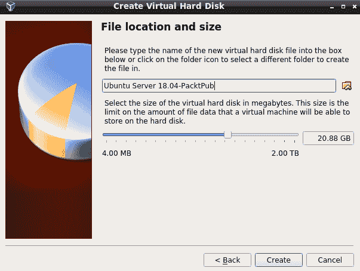
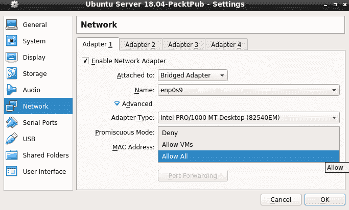
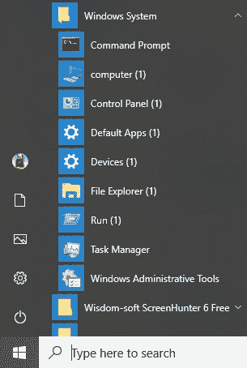
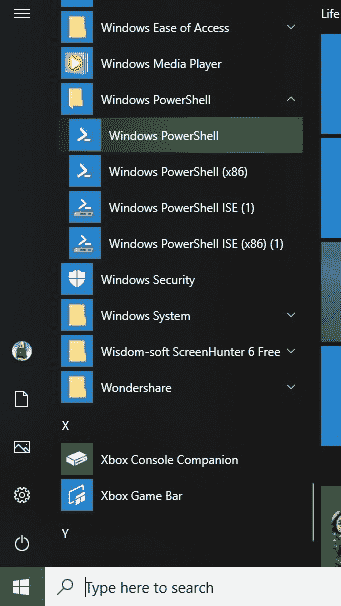
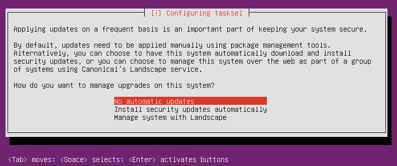

# 在虚拟环境中运行 Linux

所以，你可能会问自己:*为什么我需要学习 Linux 安全？Linux 不是已经安全了吗？毕竟不是 Windows。*但事实是，原因有很多。

在安全性方面，Linux 确实比 Windows 有一定的优势。其中包括以下内容:

*   与 Windows 不同，Linux 是作为一个多用户操作系统从头开始设计的。因此，在 Linux 系统上，用户安全性往往会好一点。
*   Linux 在管理用户和非特权用户之间提供了更好的隔离。这让入侵者更难对付，也让用户更难不小心用一些讨厌的东西感染 Linux 机器。
*   Linux 比 Windows 更能抵抗病毒和恶意软件感染。某些 Linux 发行版带有内置机制，例如红帽和 CentOS 中的 SELinux，以及 Ubuntu 中的 AppArmor，可以防止入侵者控制系统。
*   Linux 是一个免费的开源软件。这使得任何有能力审计 Linux 代码的人都可以寻找 bug 或后门。

但是即使有这些优势，Linux 也和人类创造的其他东西一样。也就是说，它并不完美。

以下是我们将在本章中介绍的主题:

*   展望威胁前景
*   为什么每个 Linux 管理员都需要了解 Linux 安全性
*   介绍一下威胁形势，并举例说明攻击者有时是如何入侵 Linux 系统的
*   了解信息技术安全新闻的资源
*   物理、虚拟和云设置之间的差异
*   使用 VirtualBox 设置 Ubuntu Server 和 CentOS 虚拟机，并在 CentOS 虚拟机中安装**企业 Linux 额外软件包** ( **EPEL** )存储库
*   创建虚拟机快照
*   在 Windows 主机上安装 Cygwin，以便 Windows 用户可以从其 Windows 主机连接到虚拟机
*   使用 Windows 10 Bash 外壳访问 Linux 系统
*   如何保持你的 Linux 系统的更新

# 展望威胁前景

如果您在过去几年中一直关注信息技术新闻，您可能会看到至少几篇关于攻击者如何危害 Linux 服务器的文章。例如，虽然 Linux 确实不容易受到病毒感染，但也有几次攻击者在 Linux 服务器上植入了其他类型的恶意软件。这些案例包括以下内容:

*   **僵尸网络恶意软件**:这导致服务器加入由远程攻击者控制的僵尸网络。其中一个比较著名的案例是将 Linux 服务器加入一个僵尸网络，该网络对其他网络发起了**拒绝服务** ( **DoS** )攻击。
*   **Ransomware** :这是为了加密用户数据，直到服务器所有者支付赎金。但是即使支付了费用，也不能保证数据可以恢复。
*   **Cryptocoin 挖矿软件**:这导致它所植入的服务器的 CPU 额外的工作，消耗更多的能量。被挖掘的加密硬币会被植入该软件的攻击者所利用。

当然，还有很多不涉及恶意软件的漏洞，例如攻击者找到了窃取用户凭据、信用卡数据或其他敏感信息的方法。

Some security breaches come about because of plain carelessness. Here's an example of where a careless Adobe administrator placed the company's private security key on a public security blog: [https://arstechnica.com/information-technology/2017/09/in-spectacular-fail-adobe-security-team-posts-private-pgp-key-on-blog/](https://arstechnica.com/information-technology/2017/09/in-spectacular-fail-adobe-security-team-posts-private-pgp-key-on-blog/).

# 为什么会发生安全漏洞？

无论您运行的是 Linux、Windows 还是其他什么，安全漏洞的原因通常都是一样的。它们可能是操作系统中的安全漏洞，也可能是运行在该操作系统上的应用程序中的安全漏洞。通常，如果管理员及时应用安全更新，与 bug 相关的安全漏洞是可以防止的。

另一个大问题是服务器配置不佳。一个标准的、现成的 Linux 服务器配置实际上是非常不安全的，可能会导致很多问题。服务器配置不佳的一个原因仅仅是缺乏经过适当培训的人员来安全地管理 Linux 服务器。(当然，这对本书的读者来说是个好消息，因为——相信我——这里不乏高薪的 IT 安全工作。)

现在，除了服务器和桌面上的 Linux 之外，我们现在还有属于**物联网** ( **物联网**)的设备上的 Linux。这些设备存在许多安全问题，很大程度上是因为人们不知道如何安全地配置它们。

当我们浏览这本书时，我们将看到如何以正确的方式开展业务，使我们的服务器尽可能安全。

# 关注安全新闻

如果你在信息技术行业，即使你不是安全管理员，你也会想了解最新的安全新闻。在互联网时代，这很容易做到。

第一，专门做网络安全新闻的网站相当多。例子包括数据包风暴安全和黑客新闻。常规的技术新闻网站和 Linux 新闻网站，如 Ars Technica、Fudzilla、The Register、ZDNet 和 LXer，也有关于网络安全漏洞的报道。而且，如果你宁愿看视频也不愿意阅读，你会发现有很多好的 YouTube 频道，比如 *BeginLinux Guru* 。

最后，不管您使用的是哪一个 Linux 发行版，一定要及时了解您的 Linux 发行版的新闻和最新文档。发行版维护者应该有办法让你知道他们的产品是否出现了安全问题。

安全新闻网站的链接如下:

*   **分组风暴安全**:[https://packetstormsecurity.com/](https://packetstormsecurity.com/)
*   **黑客新闻**:[https://thehackernews.com/](https://thehackernews.com/)

一般技术新闻网站的链接如下:

*   **Ars 技术类**:[https://arstechnica . com/](https://arstechnica.com/)
*   复子兰 : [https://www .复子兰. com/](https://www.fudzilla.com/)
*   **登记册**:[https://www.theregister.co.uk/](https://www.theregister.co.uk/)
*   **zdnet**:[https://www . zdnet . com/](https://www.zdnet.com/)

您可以查看一些通用的 Linux 学习资源以及 Linux 新闻网站:

*   **轻拍**:[http://轻拍. com/](http://lxer.com/)
*   **YouTube 上的 BeginLinux Guru**:[https://www.youtube.com/channel/UC88eard_2sz89an6unmlbeA](https://www.youtube.com/channel/UC88eard_2sz89an6unmlbeA) (完全披露:我是举世闻名的 BeginLinux Guru。)

当你看这本书的时候，有一件事要永远记住，那就是你能看到的唯一一个完全 100%安全的操作系统将被安装在一台永远不会开机的电脑上。

# 物理、虚拟和云设置之间的差异

所以你可以做动手实验，我将向你介绍虚拟机的概念。这只是在另一个操作系统中运行一个操作系统的一种方式。因此，无论您在主机上运行的是 Windows、macOS 还是 Linux 都没有关系。无论如何，你可以运行一个可以用来练习的 Linux 虚拟机，如果它被破坏了，你就不用担心了。

甲骨文的 VirtualBox 是我们将要使用的，它非常适合我们将要做的事情。在企业环境中，您会发现其他形式的虚拟化软件更适合在数据中心中使用。在过去，服务器硬件一次只能处理一件事，这意味着您必须让一台服务器运行 DNS，另一台运行 DHCP，等等。如今，我们的服务器有大量的内存、大量的驱动器空间，每个处理器有多达 64 个内核。因此，现在在每台服务器上安装多个虚拟机更便宜、更方便，每个虚拟机都有自己的特定工作。这也意味着，您不仅需要担心托管这些虚拟机的物理服务器的安全性，还需要担心每个虚拟机的安全性。另一个问题是，您需要确保虚拟机之间保持适当的隔离，尤其是那些包含敏感数据的虚拟机。

然后是云。许多不同的机构提供云服务，个人或公司可以创建一个 Windows 或他们选择的 Linux 发行版的实例。在云服务上安装 Linux 发行版时，您必须马上做一些事情来增强安全性。(这是我们将在[第 6 章](06.html)、 *SSH 硬化*中介绍的内容。)并意识到，当您在云服务上设置服务器时，您总是会更加关注适当的安全性，因为它将有一个连接到狂野而混乱的互联网的接口。(除了为公众服务的服务器，您的内部服务器通常与互联网隔离。)

抛开我们的介绍性材料，让我们进入正题，首先介绍一下我们的虚拟化软件。

# 介绍 VirtualBox 和 Cygwin

每当我写作或教学时，我都非常努力不为学生提供治疗失眠的方法。在这本书里，只要有必要，你会看到一些理论，但我主要喜欢提供好的、实用的信息。还会有大量循序渐进的实验和偶尔的幽默。

做实验的最好方法是使用 Linux 虚拟机。我们将做的大部分事情可以应用于任何 Linux 发行版，但是我们也将做一些特定于**红帽企业 Linux** ( **RHEL** )或 Ubuntu Linux 的事情。(RHEL 最适合企业使用，而 Ubuntu 最适合云部署。)

Red Hat is a billion-dollar company, so there's no doubt about where they stand in the Linux market. But since Ubuntu Server is free of charge, we can't judge its popularity strictly on the basis of its parent company's worth. The reality is that Ubuntu Server is the most widely used Linux distribution for deploying cloud-based applications.

See here for details: [http://www.zdnet.com/article/ubuntu-linux-continues-to-dominate-openstack-and-other-clouds/](http://www.zdnet.com/article/ubuntu-linux-continues-to-dominate-openstack-and-other-clouds/).

由于红帽是收费产品，我们将替换 CentOS 7 和 CentOS 8，它们是从红帽源代码构建的，是免费的。(我们同时使用 CentOS 7 和 CentOS 8，因为它们之间存在一些差异，并且在未来相当长的一段时间内都将得到支持。)

对于 Ubuntu，我们将关注 18.04 版本，因为它是最新的**长期支持** ( **LTS** )版本。新的 LTS 版本的 Ubuntu 在每个偶数年的 4 月份发布，非 LTS 版本在每个奇数年的 4 月份和每年的 10 月份发布。对于生产使用，你会主要想坚持 LTS 版本，因为非 LTS 版本有时会有点问题。

有几种不同的虚拟化平台可以使用，但我自己更喜欢的选择是 VirtualBox。

VirtualBox 适用于 Windows、Linux 和 Mac 主机，并且对所有主机都是免费的。它具有您必须在其他平台上付费的功能，例如创建虚拟机快照的能力。

我们将要做的一些实验将要求您模拟创建从主机到远程 Linux 服务器的连接。如果你的主机是 Linux 或者 Mac，你只需要打开终端，使用内置的**安全外壳** ( **SSH** )工具。如果您的主机运行的是 Windows，您将需要安装某种 Bash shell，您可以通过安装 Cygwin 或使用 Windows 10 Pro 内置的 Bash shell 来完成。

# 在 VirtualBox 中安装虚拟机

对于那些从未使用过 VirtualBox 的人来说，这里有一个快速指南可以帮助你们:

1.  下载并安装 VirtualBox 和 VirtualBox 扩展包。你可以从 https://www.virtualbox.org/买到。
2.  下载 Ubuntu Server 18.04、CentOS 7、CentOS 8 的安装`.iso`文件。你可以从[https://Ubuntu . com/download/alternative-downloads # alternative-Ubuntu-server-installer](https://ubuntu.com/download/alternative-downloads#alternate-ubuntu-server-installer)和[https://www.centos.org/](https://www.centos.org/)获得。(请注意，对于 Ubuntu 18.04，您需要使用这个替代安装程序。从主下载页面获得的默认安装程序缺少完成练习所需的一些功能。)
3.  启动虚拟对话框，然后单击屏幕顶部的新建图标。根据要求填写信息。将虚拟驱动器大小增加到 20 GB，但将其他所有内容保留为默认设置，如下图所示:



4.  启动新的虚拟机。点击对话框左下角的文件夹图标，导航到您存储下载的`.iso`文件的目录。选择 Ubuntu 国际标准化组织文件或 CentOS 国际标准化组织文件，如下图所示:


5.  单击对话框上的开始按钮开始安装操作系统。请注意，对于 Ubuntu 服务器，您不会安装桌面界面。对于 CentOS 7 虚拟机，根据需要选择 KDE 桌面或 GNOME 桌面。对于 CentOS 8，你唯一的桌面选择就是 GNOME。(我们将完成至少一个需要 CentOS 机器桌面界面的练习。)
6.  安装 Ubuntu 时，当您到达以下屏幕时，选择安装 Ubuntu 服务器:


7.  对其他 Linux 发行版重复该过程。
8.  通过输入以下命令更新 Ubuntu 虚拟机:

```sh
sudo apt update
sudo apt dist-upgrade
```

9.  暂停更新 CentOS 虚拟机，因为我们将在下一个练习中进行更新。
10.  对于 Ubuntu，在配置任务屏幕上选择无自动更新，并在软件选择屏幕上选择安装 OpenSSH 服务器。

When installing Ubuntu, you'll be asked to create a normal user account and password for yourself. It won't ask you to create a root user password, but will instead automatically add you to the `sudo` group so that you'll have admin privileges.

When you get to the user account creation screen of the CentOS installer, be sure to check the Make this user administrator box for your own user account, since it isn't checked by default. It will offer you the chance to create a password for the root user, but that's entirely optional—in fact, I never do.

此处显示了 RHEL 8 安装程序的用户帐户创建屏幕，该屏幕与 CentOS 7 和 CentOS 8 上的屏幕相同:


对于 Ubuntu 18.04，您将通过几个不言自明的屏幕来设置您的真实姓名、用户名和密码。Ubuntu 安装程序会自动将您的用户帐户添加到`sudo`组，这将赋予您完全的管理员权限。

这是 Ubuntu 18.04 的用户帐户创建屏幕:


所以，现在，让我们换个话题，继续看 CentOS 7。

# 在 CentOS 7 虚拟机上安装 EPEL 存储库

虽然 Ubuntu 软件包库几乎包含了本课程所需的所有内容，但我们可以说，CentOS 软件包库是缺乏的。要获得 CentOS 实践实验室所需的软件包，您需要安装 EPEL 存储库。(EPEL 项目由 Fedora 团队负责。)当您在红帽和 CentOS 系统上安装第三方存储库时，您还需要安装优先级包并编辑`.repo`文件，为每个存储库设置适当的优先级。这将防止来自第三方存储库的包覆盖官方的红帽和 CentOS 包，如果它们恰好同名的话。以下步骤将帮助您安装所需的软件包并编辑`.repo`文件:

1.  安装 EPEL 需要的两个软件包都在普通的 CentOS 7 存储库中。运行以下命令:

```sh
sudo yum install yum-plugin-priorities epel-release
```

2.  安装完成后，导航至`/etc/yum.repos.d`目录，在自己喜欢的文本编辑器中打开`CentOS-Base.repo`文件。在`base`、`updates`和`extras`部分的最后一行之后，添加一行`priority=1`。在`centosplus`部分的最后一行之后，添加一行`priority=2`。保存文件并关闭编辑器。您编辑的每个部分都应该如下所示(除了适当的名称和优先级编号):

```sh
 [base]
  name=CentOS-$releasever - Base
  mirrorlist=http://mirrorlist.centos.org/?
  release=$releasever&arch=$basearch&repo=os&infra=$infra
  #baseurl=http://mirror.centos.org/centos/
  $releasever/os/$basearch/
  gpgcheck=1
  gpgkey=file:///etc/pki/rpm-gpg/RPM-GPG-KEY-CentOS-7
  priority=1
```

3.  打开`epel.repo`文件进行编辑。在`epel`部分的最后一行之后，添加一行`priority=10`。在每个剩余部分的最后一行之后，添加一行`priority=11`。
4.  通过运行以下命令更新系统，然后创建已安装和可用软件包的列表:

```sh
sudo yum upgrade
sudo yum list > yum_list.txt
```

现在，让我们继续看 CentOS 8。

# 在 CentOS 8 虚拟机上安装 EPEL 存储库

要在 CentOS 8 上安装 EPEL 存储库，您只需运行以下命令:

```sh
sudo dnf install epel-release
```

没有像 CentOS 7 和更早版本那样的优先级包，所以我们不必担心配置存储库优先级。

软件包安装完成后，使用以下命令创建可用软件包列表:

```sh
sudo dnf upgrade
sudo dnf list > dnf_list.txt
```

接下来，让我们配置我们的网络。

# 为 VirtualBox 虚拟机配置网络

我们的一些培训场景将要求您模拟创建到远程服务器的连接。您可以通过使用主机连接到虚拟机来实现这一点。首次在 VirtualBox 上创建虚拟机时，网络设置为 NAT 模式。为了从主机连接到虚拟机，您需要将虚拟机的网络适配器设置为桥接适配器模式。你可以这样做:

1.  关闭您已经创建的所有虚拟机。
2.  在虚拟机管理器屏幕上，打开虚拟机的设置对话框。
3.  单击网络菜单项，并将连接到设置从网络地址转换更改为桥接适配器，如下图所示:


4.  展开“高级”项目，并将“混杂模式”设置更改为“允许全部”，如下图所示:



5.  重新启动虚拟机，并将其设置为使用静态 IP 地址。

If you assign static IP addresses from the high end of your subnet range, it will be easier to prevent conflicts with low-number IP addresses that get handed out from your internet gateway.

# 使用 VirtualBox 创建虚拟机快照

使用虚拟机的一个好处是，如果您搞砸了什么，您可以创建一个快照并回滚到它。使用 VirtualBox，通过执行以下步骤，这很容易做到:

1.  在 VirtualBox 管理器屏幕的右上角，单击快照按钮。

2.  在屏幕左侧，单击拍摄图标，弹出快照对话框。要么填写所需的快照名称，要么接受默认名称。或者，您可以创建描述，如下图所示:


3.  对虚拟机进行更改后，您可以通过关闭虚拟机、突出显示快照名称并单击恢复按钮回滚到快照。

# 使用 Cygwin 连接到您的虚拟机

如果您的主机是 Linux 或 Mac 机器，您只需打开主机的终端，并使用已经存在的工具连接到虚拟机。但是，如果您运行的是一台 Windows 机器，您将需要某种 Bash shell 及其网络工具。Windows 10 Pro 现在有一个由 Ubuntu 提供的 Bash 外壳，如果你愿意，你可以使用它。但是如果你没有 Windows 10 Pro，或者你更喜欢用别的东西，你可能会考虑 Cygwin。

Cygwin 是红帽公司的一个项目，是一个为 Windows 构建的免费开源 Bash shell。它是免费的，容易安装。

# 在您的 Windows 主机上安装 Cygwin

以下是让您与 Cygwin 合作的快速方法:

1.  在你的主机浏览器中，从[http://www.cygwin.com/](http://www.cygwin.com/)下载适合你的 Windows 版本的`setup*.exe`文件。
2.  双击安装图标开始安装。在大多数情况下，只需接受默认值，直到您进入软件包选择屏幕。(唯一的例外是您选择下载镜像的屏幕。)
3.  在包选择屏幕的顶部，从“视图”菜单中选择“类别”。
4.  展开网络类别，如下图所示:


5.  向下滚动，直到看到 openssh 包。在“新建”列下，单击“跳过”(这将导致出现一个版本号来代替“跳过”)，如下图所示:


6.  选择合适的软件包后，您的屏幕应该如下所示:


7.  在右下角，单击“下一步”。如果弹出“解决依赖关系”屏幕，也请单击该屏幕上的“下一步”。

8.  保留您下载的安装文件，因为您稍后将使用它来安装更多软件包或更新 Cygwin。(当您打开 Cygwin 时，任何更新的包都将显示在“视图”菜单上的“挂起”视图中。)
9.  从 Windows“开始”菜单打开 Cygwin 后，您可以根据需要调整其大小，并使用 *Ctrl* + +或 *Ctrl* + -组合键调整字体大小。

接下来，我们将看看 Windows 10 Bash 外壳。

# 使用 Windows 10 Pro Bash 外壳与 Linux 虚拟机接口

如果您使用的是视窗 10 专业版或视窗 10 企业版，您的操作系统中已经内置了一个 SSH 客户端。

那么，让我们看看如何做到这一点:

1.  为此，您可以从 Windows 系统菜单中打开传统的命令提示符，如下所示:



2.  然后，只需像在 Mac 或 Linux 机器上一样输入 SSH 命令，如下所示:


3.  更好的选择是使用 Windows PowerShell，而不是普通的命令提示符。就像你在这里看到的:



4.  和以前一样，让我们用它来登录我的 Orange Pi 设备，如下所示:


如果可以选择，请使用 PowerShell 而不是命令提示符。PowerShell 更接近 Linux Bash shell 的体验，有了它你会开心很多。

# Cygwin 对 Windows Bash shell

Cygwin 和 Windows 10 内置的 SSH 客户端各有利弊。为了支持 Cygwin，您可以安装各种各样的软件包，以任何您想要的方式对其进行定制。此外，如果你坚持使用 Windows 10 家庭版或——但愿不会——Windows 7，你可以使用 Cygwin。

为了支持 Windows 10 内置 SSH 客户端，事实是在 Windows 10 的专业版和企业版上，它已经存在了。此外，如果您需要访问您的普通窗口文件夹，它更容易使用，因为 Cygwin 将您困在它自己的沙盒目录结构中。

# 保持 Linux 系统的更新

花些时间仔细阅读常见漏洞和暴露数据库，你很快就会明白为什么保持系统更新如此重要。是的，事实上，您甚至会发现我们心爱的 Linux 存在安全缺陷，如下图所示:


更新一个 Linux 系统只需要一两个简单的命令，通常比更新一个 Windows 系统更快，痛苦更小。

You can find the Common Vulnerabilities and Exposures database here:

[https://cve.mitre.org/](https://cve.mitre.org/).

All of you conscientious, dedicated Linux administrators will definitely want to become familiar with this site.

# 更新基于 Debian 的系统

让我们看看如何更新基于 Debian 的系统:

1.  在 Debian 及其许多子代(包括 Ubuntu)上，运行两个命令，如下所示:

```sh
sudo apt update
sudo apt dist-upgrade
```

2.  有时，您还需要删除一些不再需要的旧包。你怎么知道？别紧张。当您登录到系统时，命令行上会出现一条消息。要删除这些旧包，只需运行以下命令:

```sh
sudo apt auto-remove
```

接下来，我们将为 Ubuntu 配置自动更新。

# 为 Ubuntu 配置自动更新

Ubuntu 18.04 LTS 的一个新特性是你可以配置它来自动安装安全更新，这是 Ubuntu 16.04 LTS 没有的。您可以在安装程序屏幕上看到:



不过，我必须承认，我对此有复杂的感觉。我的意思是，很高兴安全更新得到安装，而我不必做任何事情，但许多这些更新需要重新启动系统才能生效。默认情况下，Ubuntu 系统不会在安装更新后自动重启。如果您保持这种方式，当您登录系统时，您会看到一条关于它的消息。但是如果你愿意，你可以设置 Ubuntu 在自动更新后自动重启。以下是如何做到这一点:

1.  进入`/etc/apt/apt.conf.d`目录，在自己喜欢的文本编辑器中打开`50unattended-upgrades`文件。在 *68 号线*附近，你会看到一条线，上面写着:

```sh
//Unattended-Upgrade::Automatic-Reboot "false";
```

2.  通过删除前导斜线取消对该行的注释，并将`false`更改为`true`，如下所示:

```sh
Unattended-Upgrade::Automatic-Reboot "true";
```

3.  有了这个新的配置，Ubuntu 现在将在自动更新过程完成后立即重新启动。如果您希望机器在特定时间重新启动，请向下滚动到第 *73* 行，您将看到这一行代码:

```sh
//Unattended-Upgrade::Automatic-Reboot-Time "02:00";
```

4.  因为这一行是用它的一对前导斜线注释掉的，所以它目前没有效果。要让机器在凌晨 2:00 重新启动，只需取消对这一行的注释。要让它在晚上 10:00 重新启动，取消对该行的注释并将时间更改为`22:00`，如下所示:

```sh
Unattended-Upgrade::Automatic-Reboot-Time "22:00";
```

当然，有一个古老的、基本的规则，即在没有首先在测试系统上进行测试的情况下，不应该在生产系统上安装系统更新。任何操作系统供应商偶尔都会向您提供有问题的更新，包括 Ubuntu。(我知道你在说什么:*传吧，唐尼*。)Ubuntu 自动更新功能与基本规则直接对立。如果启用了自动更新，如果您选择这样做，禁用它们是非常容易的:

1.  要禁用自动更新，只需进入`/etc/apt/apt.conf.d`目录，在你喜欢的文本编辑器中打开`20auto-upgrades`文件。你会看到的是:

```sh
APT::Periodic::Update-Package-Lists "1";
APT::Periodic::Unattended-Upgrade "1";
```

2.  将第二行的参数更改为`0`，这样文件现在将如下所示:

```sh
APT::Periodic::Update-Package-Lists "1";
APT::Periodic::Unattended-Upgrade "0";
```

现在，系统仍然会检查更新，并在有更新时在登录屏幕上显示一条消息，但不会自动安装它们。当然，不用说，你需要定期检查你的系统，看看是否有更新。如果您确实希望启用自动更新，请确保启用自动重新启动，或者每周至少登录系统几次，看看是否需要重新启动。

3.  如果您想查看是否有任何安全相关的更新可用，但不想查看任何非安全更新，请使用`unattended-upgrade`命令，如下所示:

```sh
sudo unattended-upgrade --dry-run -d
```

4.  要手动安装安全相关更新而不安装非安全更新，只需运行以下代码行:

```sh
sudo unattended-upgrade -d
```

If you're running some form of desktop Ubuntu on a workstation that gets shut down after every use, you can enable the automatic updates if you like, but there's no need to enable automatic reboots.

Also, if you're running a non-Ubuntu flavor of Debian, which would include Raspbian for the Raspberry Pi, you can give it the same functionality as Ubuntu by installing the `unattended-upgrades` package. Just run the following line of code:

`sudo apt install unattended-upgrades`

您也可以使用`apt`命令仅安装安全更新，但这需要将`apt`输出管道传输到一组复杂的文本过滤器中，以屏蔽非安全更新。使用`unattended-upgrade`命令要容易得多。

I said before that we should always test updates on a test system before we install them on a production system, and that certainly does hold true for corporate servers. But what do we do when we have a whole bunch of IoT devices that we need to keep updated, especially if these devices are all over the place out in the field and in consumer devices?

In the wonderful world of IoT, the ARM CPU versions of Ubuntu, Raspbian, and Debian are the most popular Linux distros for use on the various Pi devices, including the ubiquitous Raspberry Pi. If you have lots of IoT devices in the field and in consumer devices, you might not have direct control over them once they've been deployed or sold. They still need to be kept updated, so setting up unattended updates with automatic rebooting would certainly be advantageous. But keep in mind that in the world of IoT, we have to be concerned about safety as well as security. So, for example, if you have devices that are set up as some sort of critical, safety-related industrial controller, then you most likely don't want the device to automatically reboot after doing automatic updates. But if you're a television vendor who installs Linux on smart televisions, then definitely set them up to automatically update and to automatically reboot themselves after an update.

# 更新基于红帽 7 的系统

对于基于红帽的系统，包括 CentOS 和 Oracle Linux，没有可以在安装过程中设置的自动更新机制。因此，使用默认配置，您需要自己执行更新:

1.  要更新基于红帽 7 的系统，只需运行以下命令:

```sh
sudo yum upgrade
```

2.  有时，您可能只想看看是否有任何与安全相关的更新可以安装。为此，请运行以下命令:

```sh
sudo yum updateinfo list updates security
```

3.  如果有任何安全更新可用，您将在命令输出的末尾看到它们。在我刚刚测试的系统上，只有一个可用的安全更新，如下所示:

```sh
FEDORA-EPEL-2019-d661b588d2 Low/Sec. nagios-common-4.4.3-1.el7.x86_64

updateinfo list done
```

4.  如果您只想安装安全更新，请运行以下命令:

```sh
sudo yum upgrade --security
```

5.  现在，假设您需要一个 CentOS 系统来自动更新自己。你很幸运，因为有一个包裹。安装并启用它，通过运行以下命令启动它:

```sh
sudo yum install yum-cron

sudo systemctl enable --now yum-cron
```

6.  要进行配置，进入`/etc/yum`目录，编辑`yum-cron.conf`文件。在文件的顶部，您将看到以下内容:

```sh
[commands]
# What kind of update to use:
# default = yum upgrade
# security = yum --security upgrade
# security-severity:Critical = yum --sec-severity=Critical upgrade
# minimal = yum --bugfix update-minimal
# minimal-security = yum --security update-minimal
# minimal-security-severity:Critical = --sec-severity=Critical update-minimal
update_cmd = default
```

这里列出了我们可以进行的各种升级。最后一行显示我们将更新所有内容。

7.  假设您只希望自动应用安全更新。只需将最后一行更改为以下内容:

```sh
update_cmd = security
```

8.  在 *15* 和 *20* 线上，你会看到这条线:

```sh
download_updates = yes
apply_updates = no
```

这表明默认情况下，`yum-cron`仅设置为自动下载更新，而不是安装更新。

9.  如果您希望自动安装更新，请将`apply_updates`参数更改为`yes`。

Note that unlike Ubuntu, there's no setting to make the system automatically reboot itself after an update.

10.  最后，我们来看一下`yum-cron`的邮件设置，您可以在`yum-cron.conf`文件的 *48* 到 *57* 行找到，如下图所示:

```sh
[email]
# The address to send email messages from.
# NOTE: 'localhost' will be replaced with the value of system_name.
email_from = root@localhost

# List of addresses to send messages to.
email_to = root

# Name of the host to connect to to send email messages.
email_host = localhost
```

如您所见，`email_to =`行被设置为向根用户帐户发送消息。如果你想用自己的账号接收信息，只需在这里更改即可。

11.  要查看邮件，您需要安装一个邮件阅读器程序，如果还没有安装的话。(如果在安装操作系统时选择了最小安装，则尚未安装。)你最好的办法是安装`mutt`，就像这样:

```sh
sudo yum install mutt
```

12.  当你打开`mutt`查看一条消息，你会看到类似这样的内容:


13.  与所有操作系统一样，某些更新需要重新启动系统。你怎么知道系统什么时候需要重启？当然是用`needs-restarting`命令。首先，你需要确保`needs-restarting`安装在你的系统上。用下面一行代码来完成:

```sh
sudo yum install yum-utils
```

一旦安装好软件包，有三种方法可以使用`needs-restarting`。如果您只是在没有任何选项开关的情况下运行该命令，您将看到需要重新启动的服务和需要您重新启动机器的包。您也可以使用`-s`或`-r`选项，如下所示:

| **命令** | **解释** |
| `sudo needs-restarting` | 这显示了需要重新启动的服务，以及系统可能需要重新启动的原因。 |
| `sudo needs-restarting -s` | 这仅显示需要重新启动的服务。 |
| `sudo needs-restarting -r` | 这仅显示了系统需要重新启动的原因。 |

接下来，我们将更新基于红帽 8 的系统。

# 更新基于红帽 8 的系统

旧的`yum`实用程序已经存在了几乎永远，它是一个很好的，努力工作的实用程序。但它确实有其偶尔的怪癖，有时它会慢得令人难以忍受。但不用担心。我们红帽的英雄们终于为此做了些什么，用`dnf`取代了`yum`。现在，`dnf`已经在 Fedora 发行版上测试了几年，现在是 RHEL 8 家族的一部分。因此，当您使用 CentOS 8 虚拟机时，您将使用`dnf`而不是`yum`。让我们看看如何做到这一点:

1.  在大多数情况下，您使用`dnf`的方式与使用`yum`的方式相同，具有相同的参数和选项。例如，要进行系统升级，只需运行以下命令:

```sh
sudo dnf upgrade
```

2.  `yum`和`dnf`的主要功能区别在于`dnf`有不同的自动更新机制。您现在将安装`dnf-automatic`软件包，而不是安装`yum-cron`软件包，如下所示:

```sh
sudo dnf install dnf-automatic
```

3.  在`/etc/dnf`目录中，您将看到`automatic.conf`文件，您将使用与为 CentOS 7 配置`yum-cron.conf`文件相同的方式来配置该文件。`dnf-automatic`不再像以前的`yum-cron`那样做裙带工作，而是使用`systemd`定时器工作。首次安装`dnf-automatic`时，定时器被禁用。启用它，并通过运行以下代码行启动它:

```sh
sudo systemctl enable --now dnf-automatic.timer
```

4.  通过键入以下代码行来验证它是否正在运行:

```sh
sudo systemctl status dnf-automatic.timer
```

5.  如果它成功启动，您应该会看到如下内容:

```sh
[donnie@redhat-8 ~]$ sudo systemctl status dnf-automatic.timer
 dnf-automatic.timer - dnf-automatic timer
   Loaded: loaded (/usr/lib/systemd/system/dnf-automatic.timer; enabled; vendor preset: disabled)
   Active: active (waiting) since Sun 2019-07-07 19:17:14 EDT; 13s ago
  Trigger: Sun 2019-07-07 19:54:49 EDT; 37min left

Jul 07 19:17:14 redhat-8 systemd[1]: Started dnf-automatic timer.
[donnie@redhat-8 ~]$
```

For more details about `dnf-automatic`, type the following command:

`man dnf-automatic`

仅此而已。

Automatic updating sounds like a good thing, right? Well, it is in some circumstances. On my own personal Linux workstations, I always like to turn it off. That's because it drives me crazy whenever I want to install a package, and the machine tells me that I have to wait until the update process finishes. In an enterprise, it might also be desirable to disable automatic updates, so that administrators can have more control over the update process.

在企业环境中进行更新有一些特殊的注意事项。接下来让我们看看它们。

# 管理企业中的更新

当您第一次安装任何 Linux 发行版时，它将被配置为访问自己的包存储库。这允许用户安装任何软件包或直接从这些普通的发行版库中安装更新。这对家庭或小型企业来说很好，但对企业来说就不那么好了。

在企业环境中，还有两个额外的注意事项:

*   您希望限制最终用户可以安装的软件包。
*   在允许更新安装到生产网络之前，您总是希望在单独的测试网络上测试更新。

由于这些原因，企业通常会设置自己的存储库服务器，这些服务器只具有批准的包和批准的更新。网络上的所有其他机器将被配置为从它们那里获取包和更新，而不是从普通的发行版存储库中。(这里我们不讨论如何设置内部存储库服务器，因为这是一个更适合 Linux 管理书籍的主题。)

Ubuntu has always been one of the more innovative Linux distros, but it's also had more than its fair share of quality-control problems. In its early days, there was at least one Ubuntu update that completely broke the operating system, requiring the user to re-install the operating system. So, yeah, in any mission-critical environment, test those updates before putting them into production.

我想我们的介绍章节就到这里了。让我们把事情总结一下，好吗？

# 摘要

因此，我们已经为 Linux 安全和强化之旅开了一个好头。在这一章中，我们了解了为什么知道如何保护和加固 Linux 系统和知道如何保护和加固 Windows 系统一样重要。我们提供了几个例子来说明配置不佳的 Linux 系统是如何被破坏的，我们还提到学习 Linux 安全性可能对你的职业生涯有好处。然后，我们研究了在云服务上将 Linux 服务器设置为虚拟机时的一些特殊注意事项。之后，我们研究了如何使用 VirtualBox、Cygwin 和 Windows 10 Bash shell 设置虚拟化实验室环境。我们通过快速查看如何保持您的 Linux 系统更新来总结事情。

在下一章中，我们将研究锁定用户帐户，并确保错误的人永远不会获得管理权限。到时候见。

# 问题

1.  因为 Linux 比 Windows 设计得更安全，所以我们永远不用担心 Linux 的安全性。

A.真
B .假

2.  关于物联网设备上的 Linux，以下哪一项是正确的？

A.他们太多了。他们正在接管世界。
C .配置不安全的太多了。
D .他们的配置非常安全，会让安全从业者失业。

3.  关于企业中的自动操作系统更新，以下哪一项是正确的？

A.您应该始终启用它们。
B .它们违反了在生产网络上安装更新之前先在测试网络上测试更新的基本规则。
C .与手动更新不同，自动
更新后，您永远不必重新启动系统。
D .对于物联网设备，启用自动更新没有用。

# 进一步阅读

*   **Linux 安全**:[https://linuxsecurity.com/](https://linuxsecurity.com/)
*   【VirtualBox 官方网站:[https://www.virtualbox.org/](https://www.virtualbox.org/)
*   **Ubuntu“备用安装程序”下载页面**:[https://Ubuntu . com/download/alternative-downloads # Alternate-Ubuntu-server-Installer](https://ubuntu.com/download/alternative-downloads#alternate-ubuntu-server-installer)
*   **官方 CentOS 页面**:[https://www.centos.org/](https://www.centos.org/)
*   **RHEL 文档(这也适用于 CentOS)**:[https://access . RedHat . com/documentation/en-us/red _ hat _ enterprise _ Linux/8/](https://access.redhat.com/documentation/en-us/red_hat_enterprise_linux/8/)
*   **如何在 Ubuntu Server 18.04** 上设置自动更新:[https://libre-software.net/ubuntu-automatic-updates/](https://libre-software.net/ubuntu-automatic-updates/)
*   **在 RHEL 7 和 CentOS 7 中启用自动更新**:[https://linuxaria . com/how to/启用自动更新 centos-7 和-rhel-7](https://linuxaria.com/howto/enabling-automatic-updates-in-centos-7-and-rhel-7)
*   **管理和监控 RHEL 8 的安全更新**:[https://access . RedHat . com/documentation/en-us/red _ hat _ enterprise _ Linux/8/html/management _ and _ Monitoring _ Security _ Updates/index](https://access.redhat.com/documentation/en-us/red_hat_enterprise_linux/8/html/managing_and_monitoring_security_updates/index)