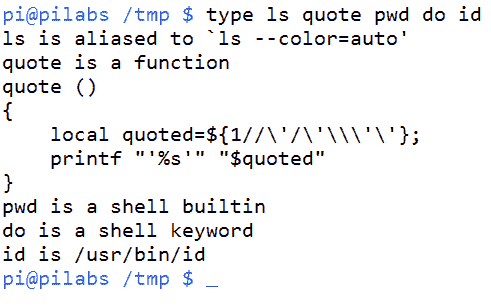
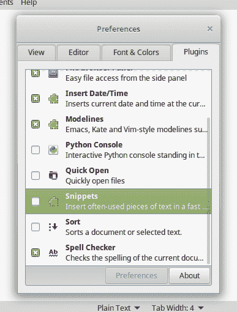
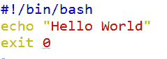
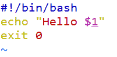
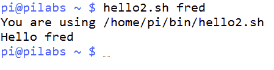
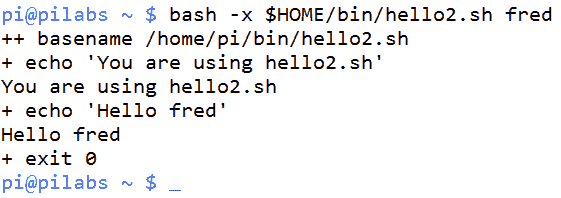
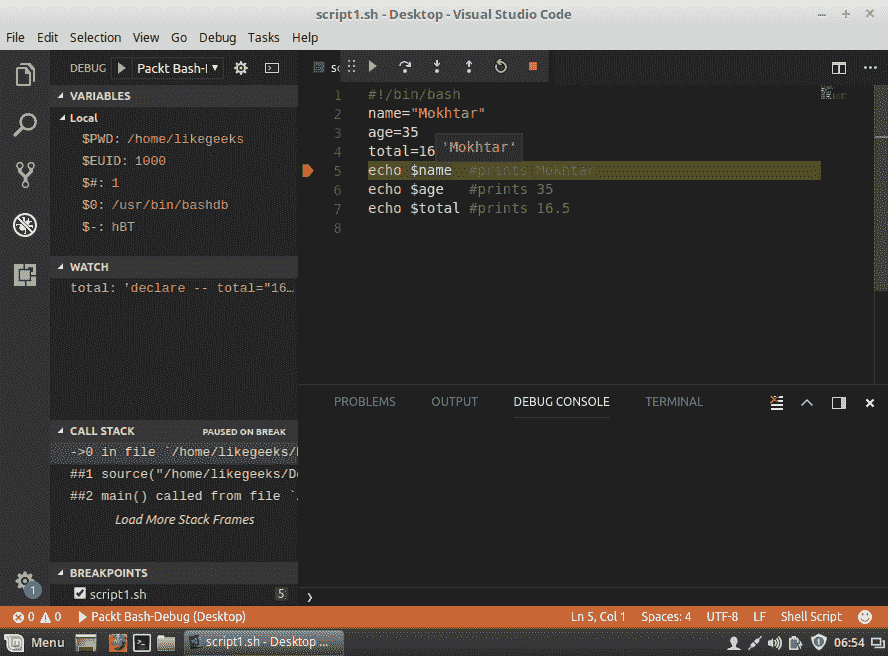

# 一、使用 Bash 编写脚本的内容和原因

欢迎来到 bash 脚本编写的内容和原因。 在本章中，您将发现 Linux 中 shell 的类型以及我们选择 bash 的原因。 您将了解 bash 是什么，如何编写第一个 bash 脚本，以及如何运行它。 此外，您将看到如何配置 Linux 编辑器，例如 vim 和 nano，以便键入代码。

与其他脚本语言一样，变量是编码的基本块。 您将学习如何声明整数、字符串和数组等变量。 此外，您将了解如何导出这些变量并将它们的范围扩展到正在运行的流程之外。

最后，您将看到如何使用 Visual Studio code 可视化地调试代码。

本章将涵盖以下主题:

*   Linux shell 的类型
*   什么是 bash 脚本?
*   bash 命令层次结构
*   为脚本编写准备文本编辑器
*   创建和执行脚本
*   声明变量
*   变量作用域
*   命令替换
*   调试脚本

# 技术要求

您需要一个正在运行的 Linux 机器。 使用哪个发行版并不重要，因为现在所有 Linux 发行版都附带 bash shell。

下载并安装 Visual Studio Code，它是微软免费提供的。 您可以从这里下载:[https://code.visualstudio.com/](https://code.visualstudio.com/)。

你可以使用 VS Code 作为编辑器，而不是 vim 和 nano; 由你决定。

我们更喜欢使用 VS Code，因为它有很多特性，比如代码自动完成、调试等等。

安装`bashdb`，这是 bash 调试插件所需的包。 如果你正在使用基于 Red hat 的发行版，你可以这样安装:

```sh
$ sudo yum install bashdb  
```

如果你使用的是基于 debian 的发行版，你可以这样安装:

```sh
$ sudo apt-get install bashdb 
```

安装 VS Code 插件，名为 bash debug，从[https://marketplace.visualstudio.com/items?itemName=rogalmic.bash-debug](https://marketplace.visualstudio.com/items?itemName=rogalmic.bash-debug)。 这个插件将用于调试 bash 脚本。

本章的源代码可在此下载:

[https://github.com/PacktPublishing/Mastering-Linux-Shell-Scripting-Second-Edition/tree/master/Chapter01](https://github.com/PacktPublishing/Mastering-Linux-Shell-Scripting-Second-Edition/tree/master/Chapter01)

# Linux shell 的类型

如您所知，Linux 由一些主要部分组成，例如内核、shell 和 GUI 界面(Gnome、KDE 等)。

shell 翻译您的命令并将它们发送给系统。 大多数 Linux 发行版都附带许多 shell。

每个 shell 都有自己的特性，其中一些在今天的开发人员中非常流行。 以下是一些受欢迎的例子:

*   **Sh shell**:这被称为 Bourne shell，这是在 70 年代由一个叫 Stephen Bourne 的家伙在 at&T 实验室开发的。 这个 shell 提供了许多特性。
*   **Bash shell**:也称为 Bourne shell，这是非常流行的，并且与 sh shell 脚本兼容，所以您可以运行您的 sh 脚本而不需要更改它们。 我们将在这本书中使用这个壳。
*   **Ksh shell**:也称为 Korn shell，与 sh 和 bash 兼容。 Ksh 提供了一些对 Bourne shell 的增强。
*   **Csh 和 tcsh**:Linux 是用 C 语言构建的，这促使伯克利大学的开发人员开发了一个 C 风格的 shell，其语法类似于 C 语言。 Tcsh 对 csh 增加了一些微小的增强。

现在我们知道 shell 的类型，也知道我们将使用 bash，那么什么是 bash 脚本呢?

# 什么是 bash 脚本?

bash 脚本的基本思想是执行多个命令来自动化特定的作业。

正如你可能知道的，你可以通过用分号(`;`)分隔从 shell 中运行多个命令:

```sh
ls ; pwd 
```

前一行是一个迷你 bash 脚本。

运行第一个命令，然后运行第二个命令的结果。

您在 bash 脚本中键入的每个关键字实际上都是一个 Linux 二进制(程序)，甚至是`if`语句、`else`或`while`循环。 它们都是 Linux 可执行文件。

可以说 shell 是将这些命令绑定在一起的粘合剂。

# bash 命令层次结构

在使用 bash shell 时，当您舒适地坐在提示符前急切地等待输入命令时，您很可能会认为，这只是键入*回车*键的简单问题。 你应该知道不要这样想，因为事情从来都不像我们想象的那么简单。

# 命令类型

例如，如果我们输入`ls`来列出文件，就可以认为我们正在运行这个命令。 这是有可能的，但我们经常使用化名。 别名存在于内存中，作为命令或带有选项的命令的快捷方式; 在我们检查文件之前就使用了这些别名。 Bash 的内置`type`命令可以在这里帮助我们。 `type`命令将显示在命令行输入的给定单词的命令类型。 命令的类型如下:

*   别名
*   函数
*   Shell 的内置
*   关键字
*   文件

这个列表也代表了搜索它们的顺序。 正如我们所看到的，直到最后才搜索可执行文件`ls`。

下面的命令演示了简单使用类型:

```sh
$ type ls
ls is aliased to 'ls --color=auto'  
```

我们可以进一步扩展，以显示给定命令的所有匹配:

```sh
$ type -a ls
ls is aliased to 'ls --color=auto'
ls is /bin/ls 
```

如果只需要输入输出，可以使用`-t`选项。 当我们需要在脚本中测试命令类型并且只需要返回类型时，这是很有用的。 这排除了多余的信息，从而使我们人类更容易阅读。 考虑以下命令和输出:

```sh
$ type -t ls
alias  
```

输出是清晰和简单的，这正是计算机或脚本所需要的。

内置的`type`也可用于识别 shell 关键字，如`if`和`case`。 下面的命令显示了对多个参数和类型使用`type`:

```sh
$ type ls quote pwd do id  
```

命令的输出如下截图所示:



您还可以看到，在使用`type`时遇到函数时，函数定义会被打印出来。

# 命令的路径

Linux 只在提供了程序的完整或相对路径时才会在`PATH`环境中检查可执行文件。 通常，除非当前目录在`PATH`中，否则不会搜索当前目录。 通过将目录添加到`PATH`变量中，可以将当前目录包含在`PATH`中。 如下命令示例所示:

```sh
$ export PATH=$PATH:.
```

这会将当前目录追加到`PATH`变量的值; `PATH`中的每一项用冒号分隔。 现在，您的`PATH`已经被更新为包含当前工作目录，并且每次更改目录时，脚本都可以轻松执行。 一般来说，将脚本组织到一个结构化的目录层次结构中可能是个好主意。 考虑在主目录中创建一个名为`bin`的子目录，并将脚本添加到该文件夹中。 将`$HOME/bin`添加到`PATH`变量将使您能够根据名称查找脚本，而不需要文件路径。

下面的命令行列表将只创建目录，如果它不存在:

```sh
$ test -d $HOME/bin || mkdir $HOME/bin  
```

虽然前面的命令行列表不是严格必要的，但它确实表明 bash 中的脚本并不局限于实际的脚本，我们可以直接在命令行中使用条件语句和其他语法。 从我们的观点来看，无论您是否有`bin`目录，前面的命令都将工作。 使用`$HOME`变量可以确保该命令在不考虑当前文件系统上下文的情况下工作。

在阅读本书的过程中，我们将把脚本添加到`$HOME/bin`目录中，以便不管工作目录是什么，都可以执行脚本。

# 为脚本编写准备文本编辑器

在本书中，我们将致力于 Linux Mint，这将包括脚本的创建和编辑。 当然，您可以选择您希望编辑脚本的方式，也可以使用图形化编辑器，因此我们将在 gedit 中显示一些设置。 在本章中，我们将对一个 Red Hat 系统进行一次访问，以显示 gedit 的屏幕截图。

此外，我们将使用 Visual Studio Code 作为现代 GUI 编辑器来编辑和调试我们的脚本。

为了使命令行编辑器更容易使用，我们可以启用选项，并且可以通过隐藏的配置文件持续使用这些选项。 Gedit 和其他 GUI 编辑器及其菜单将提供类似的功能。

# 配置 vim

编辑命令行通常是必须的，并且是开发人员日常生活的一部分。 在编辑器中设置通用选项使工作变得更简单，从而提供我们所需的可靠性和一致性，这有点像脚本本身。 我们将在 vi 或 vim 编辑器文件`$HOME/.vimrc`中设置一些有用的选项。

我们设置的选项如下表所示:

*   `set showmode`:确保当我们处于插入模式时可以看到
*   `set nohlsearch`:不突出显示搜索过的单词
*   `set autoindent`:我们经常缩进代码; 这允许我们返回到最后一个缩进级别，而不是每个换行符的新行开始
*   `set tabstop=4`:将制表符设置为四个空格
*   `set expandtab`:将制表符转换为空格，这在文件迁移到其他系统时很有用
*   `syntax on`:注意，这并不使用`set`命令，而是用于打开语法高亮显示

当设置了这些选项后，`$HOME/.vimrc`文件应该如下所示:

```sh
set showmode 
set nohlsearch 
set autoindent 
set tabstop=4 
set expandtab 
syntax on 
```

# 配置纳米

纳米文本编辑器越来越重要，它是许多系统的默认编辑器。 就我个人而言，我不喜欢它的导航功能，也不喜欢它缺少导航功能。 可以使用与 vim 相同的方式定制它。 这一次，我们将编辑`$HOME/.nanorc`文件。 你编辑的文件应该如下所示:

```sh
set autoindent 
set tabsize 4 
include /usr/share/nano/sh.nanorc 
```

最后一行启用 shell 脚本的语法高亮显示。

# 配置中

图形化编辑器，例如 gedit，可以使用首选项菜单来配置，而且非常简单。

启用 tab 间距设置为 4 个空格和扩展 tab 到空格可以使用 Preferences | Editor 选项卡完成，如下图所示:


You can download the example code files from your account at [http://www.packtpub.com](http://www.packtpub.com) for all the Packt Publishing books you have purchased. If you purchased this book elsewhere, you can visit [http://www.packtpub.com/support](http://www.packtpub.com/support) and register to have the files e-mailed directly to you.

另一个非常有用的特性是在 Preferences | Plugins 选项卡上。 这里，我们可以启用 Snippets 插件，它可以用于插入代码示例。 如下截图所示:



在本书的其余部分中，我们将学习命令行和 vim; 请随意使用与您工作得最好的编辑器。 我们现在已经为创建好的脚本奠定了基础，而且，尽管在 bash 脚本中空格、制表符和空格并不重要，但是具有一致空格的布局良好的文件很容易阅读。 当我们在本书后面讨论 Python 时，您会意识到在某些语言中，空格对语言来说是很重要的，最好及早养成良好的习惯。

# 创建和执行脚本

编辑器已经准备就绪，现在可以快速地创建和执行脚本了。 如果你读这本书之前有一些经验，我们会警告你，我们将从基础开始，但我们也会包括位置参数; 你可以按照自己的节奏继续前进。

# 你好世界!

如您所知，几乎必须从一个`Hello World`脚本开始，我们不会让您失望。 我们将首先创建一个新脚本`$HOME/bin/hello1.sh`。 该文件的内容应如下截图所示:



我们希望你没有在这方面做太多的挣扎; 毕竟只有三行。 我们鼓励您在阅读时浏览示例，以真正帮助您灌输良好的动手实践信息。

*   `#!/bin/bash`:通常，这总是脚本的第一行，被称为 shebang。 shebang 以注释开始，但是系统仍然使用这一行。 shell 脚本中的注释有`#`符号。 shebang 指示系统的解释器执行脚本。 我们使用 bash 作为 shell 脚本，我们也可以根据需要使用 PHP 或 Perl 作为其他脚本。 如果我们没有添加这一行，那么命令将在当前 shell 中运行; 如果我们运行另一个 shell，可能会导致问题。
*   `echo "Hello World"`:`echo`命令将在内置 shell 中拾取，可以用来编写标准输出`STDOUT`; 这是屏幕的默认设置。 要列印的资料以双引号括起; 后面会有更多的报价。
*   `exit 0`:`exit`命令为内置 shell，用于退出脚本。 代码作为整型参数提供。 除`0`以外的任何值都将表明脚本执行中存在某种类型的错误。

# 执行脚本

虽然脚本保存在我们的`PATH`环境中，但它仍然不会作为独立的脚本执行。 我们必须根据需要为文件分配和执行权限。 对于一个简单的测试，我们可以直接使用 bash 运行该文件。 下面的命令显示了如何做到这一点:

```sh
$ bash $HOME/bin/hello1.sh  
```

我们应该得到屏幕上显示的`Hello World`文本的奖励。 这不是一个长期的解决方案，因为我们需要将脚本放在`$HOME/bin`目录中，具体来说，是为了在不输入完整路径的情况下方便地从任何位置运行脚本。 我们需要添加执行权限，如下代码所示:

```sh
$ chmod +x $HOME/bin/hello1.sh 
```

我们现在应该能够简单地运行脚本，如下面的截图所示:


# 检查退出状态

这个脚本很简单，但是我们仍然需要知道如何使用脚本和其他应用的退出码。 前面创建`$HOME/bin`目录时生成的命令行列表是一个很好的例子，说明了如何使用退出代码:

```sh
$ command1 || command 2 
```

在上面的例子中，只有当`command1`以某种方式失败时，才执行`command2`。 具体来说，如果`command1`以`0`以外的状态码退出，则`command2`将运行。

类似地，在下面的摘录中，我们将只在`command1`成功并发出`0`退出码时执行`command2`:

```sh
$ command1 && command2  
```

为了显式地从脚本中读取退出代码，我们可以查看变量`$?`，如下例所示:

```sh
$ hello1.sh
$ echo $?
```

预期的输出是`0`，因为这是我们添加到文件的最后一行的内容，几乎没有其他错误可能导致无法到达该行。

# 确保唯一的名称

现在我们可以创建并执行一个简单的脚本，但是我们需要稍微考虑一下名称。 在这种情况下，`hello1.sh`就足够好了，而且不太可能与系统上的任何其他内容发生冲突。 我们应该避免使用可能与现有别名、函数、关键字和构建命令冲突的名称，并避免使用已经使用的程序名称。

向文件添加`sh`后缀并不能保证名称是唯一的，但是，在 Linux 中，我们不使用文件扩展名，后缀是文件名的一部分。 这可以帮助您为脚本提供一个独特的身份。 此外，编辑器使用后缀来帮助您识别用于语法高亮显示的文件。 如果您还记得，我们特意将语法突出显示文件`sh.nanorc`添加到 nano 文本编辑器中。 这些文件中的每一个都特定于一个后缀和随后的语言。

回顾本章中的命令层次结构，我们可以使用`type`来确定文件`hello.sh`的位置和类型:

```sh
$ type hello1.sh  #To determine the type and path
$ type -a hello1.sh  #To print all commands found if the name is NOT unique
$ type -t hello1.sh ~To print the simple type of the command  
```

下面的截图显示了这些命令和输出:


# 你好,多莉!

在脚本中，我们可能需要更多的内容，而不是简单的固定消息。 静态消息内容确实有它的位置，但是我们可以通过构建一些灵活性来使这个脚本更有用。

在本章中，我们将看看可以提供给脚本的位置参数或参数，在下一章中，我们将看到如何使脚本具有交互性，并在运行时提示用户输入。

# 运行带参数的脚本

我们可以带参数运行脚本; 毕竟，这是一个自由的世界，Linux 促进了您对代码做任何您想做的事情的自由。 但是，如果脚本没有使用这些参数，那么它们将被忽略。 下面的命令显示了使用单个参数运行的脚本:

```sh
$ hello1.sh fred  
```

脚本仍然会运行，不会产生错误。 输出也不会改变，将打印`Hello World`:

| **参数标识** | **描述** |
| `$0` | 脚本本身的名称，经常在 usage 语句中使用。 |
| `$1` | 一个位置参数，这是传递给脚本的第一个参数。 |
| `${10}` | 需要两个或更多的数字来表示参数的位置。 大括号用于将变量名与任何其他内容分隔开。 预期为个位数。 |
| `$#` | 当我们需要设置正确执行脚本所需的参数数量时，参数计数特别有用。 |
| `$*` | 引用所有参数。 |

为了让脚本使用这个参数，我们可以稍微改变它的内容。 让我们首先复制脚本，添加执行权限，然后编辑新的`hello2.sh`:

```sh
$ cp $HOME/bin/hello1.sh $HOME/bin/hello2.sh
$ chmod +x $HOME/bin/hello2.sh  
```

我们需要编辑`hello2.sh`文件来使用在命令行传递的参数。 下面的截图显示了命令行参数最简单的用法，现在允许我们有一个自定义消息:



现在运行脚本; 我们可以提供如下所示的参数:

```sh
$ hello2.sh fred
```

输出现在应该是`Hello fred`。 如果不提供实参，则该变量将为空并只输出`Hello`。 你可以参考下面的截图来查看执行参数和输出:


如果我们将脚本调整为使用`$*`，将打印所有参数。 我们将看到`Hello`，然后是所有提供的参数的列表。 编辑脚本并替换`echo`行，如下所示:

```sh
echo "Hello $*"
```

这将使用以下参数执行脚本:

```sh
$ hello2.sh fred wilma betty barney
```

这将导致如下截图所示的输出:


如果我们想打印`Hello <name>`，并将每个名称放在单独的行中，我们需要等待一段时间，直到我们讨论循环结构。 `for`循环是实现这一点的好方法。

# 正确引用的重要性

到目前为止，我们使用了一个简单的双引号机制来封装希望使用 echo 的字符串。

在第一个脚本中，使用单引号还是双引号并不重要。 `echo "Hello World"`将与`echo 'Hello World'`完全相同。

但是，在第二个脚本中不是这样，因此理解 bash 中可用的引用机制非常重要。

正如我们所看到的，在`echo "Hello $1"`中使用双引号将得到`Hello fred`或任何提供的值。 而如果在`echo 'Hello $1'`中使用单引号，屏幕上的打印输出将为`Hello $1`; 也就是说，我们看到的是变量名，而不是它的值。

引号的作用是保护特殊字符，比如两个单词之间的空格; 这两句话都避免了被误解。 空格通常被读取为默认字段，由 shell 分隔。 换句话说，shell 将所有字符读取为没有特殊含义的文字。 这产生了连锁效应，即`$`符号打印其文字格式，而不允许 bash 扩展其值。 bash shell 无法扩展变量的值，因为它受到单引号的保护。

这就是双引号拯救我们的地方。 双引号将保护除`$`之外的所有字符，允许 bash 扩展存储的值。

如果需要在带引号的字符串中使用文字`$`以及需要展开的变量，我们可以使用双引号，但是用反斜杠(`\`)转义所需的`$`。 例如，如果当前用户是 Fred，则`echo "$USER earns \$4"`将打印为`Fred earns $4`。

在命令行中使用所有引用机制尝试下面的示例。 请随时按要求提高您的每小时费率:

```sh
$ echo "$USER earns $4"
$ echo '$USER earns $4'
$ echo "$USER earns \$4"  
```

输出如下截图所示:


# 打印脚本名称

变量`$0`表示脚本名，这通常在 usage 语句中使用。 因为我们还没有研究条件语句，所以我们将在显示的名称上面打印脚本名称。

编辑你的脚本，使它读起来像以下完整的代码块`$HOME/bin/hello2.sh`:

```sh
#!/bin/bash 
echo "You are using $0" 
echo "Hello $*" 
exit 0 
```

命令的输出如下截图所示:



如果不想打印路径，而只想显示脚本的名称，可以使用`basename`命令，该命令从路径中提取名称。 调整脚本，使第二行现在读如下:

```sh
echo "You are using $(basename $0)"  
```

`$(....)`语法用于计算内部命令的输出。 首先运行`basename $0`并将结果输入到由`$`表示的未命名变量中。

新的输出将出现如下截图所示:


使用反引号可以达到相同的结果; 这不是很容易读懂，但是我们已经提到了这一点，因为您可能需要理解和修改其他人编写的脚本。 `$(....)`语法的替代方法如下例所示:

```sh
echo "You are using 'basename $0'"  
```

请注意使用的字符是反引号和*而不是*单引号。 在英国和美国的键盘上，这些是在左上角数字 1 旁边的键。

# 声明变量

就像在任何编程语言中一样，您可以在 bash 脚本中声明变量。 那么，这些变量是什么?使用它们的好处是什么?

好的，变量就像一个占位符，您在其中存储一些值，以便稍后在代码中使用。

有两种变量你可以在你的脚本中声明:

*   用户定义的变量
*   环境变量

# 用户定义的变量

要声明一个变量，只需键入您想要的名称并使用等号(`=`)设置其值。

看看这个例子:

```sh
#!/bin/bash 
name="Mokhtar" 
age=35 
total=16.5 
echo $name  #prints Mokhtar 
echo $age   #prints 35 
echo $total #prints 16.5 
```

如您所见，要打印变量的值，应该在其前面使用美元符号(`$`)。

注意，变量名和等号之间，或者等号和值之间，没有**空格**。

如果忘记并在中间输入一个空格，shell 将把这个变量当作一个命令来处理，而且由于没有这样的命令，它将显示一个错误。

下面所有的例子都是不正确的声明:

```sh
# Don't declare variables like this: 
name = "Mokhtar" 
age =35 
total= 16.5 
```

另一种有用的用户定义变量类型是数组。 一个数组可以包含多个值。 因此，如果您想要使用数十个值，您应该使用数组而不是用变量填充脚本。

要声明一个数组，只需将其元素括在括号中，就像这样:

```sh
#!/bin/bash 
myarr=(one two three four five) 
```

要访问一个特定的数组元素，你可以像这样指定它的索引:

```sh
#!/bin/bash 
myarr=(one two three four five) 
echo ${myarr[1]} #prints two which is the second element 
```

索引是零基础的。

要打印数组元素，你可以使用星号，像这样:

```sh
#!/bin/bash 
myarr=(one two three four five) 
echo ${myarr[*]} 
```

要从数组中删除特定的元素，可以使用`unset`命令:

```sh
#!/bin/bash 
myarr=(one two three four five) 
unset myarr[1] #This will remove the second element 
unset myarr    #This will remove all elements 
```

# 环境变量

到目前为止，我们使用了没有定义的变量，如`$BASH_VERSION`、`$HOME`、`$PATH`和`$USER`。 你可能想知道，因为我们没有声明这些变量，它们是从哪里来的?

这些变量由 shell 定义供您使用，它们被称为环境变量。

有许多环境变量。 如果您想列出它们，可以使用`printenv`命令。

另外，您可以通过在`printenv`命令中指定一个特定的环境变量来打印它:

```sh
$ printenv HOME
```

我们可以在 bash 脚本中使用这些变量中的任何一个。

注意，所有环境变量都是用大写字母写的，所以可以用小写字母来声明变量，以便于将变量与环境变量区分开来。 这不是必需的，但更可取。

# 变量作用域

一旦声明了变量，就可以在整个 bash 脚本中毫无问题地使用它。

让我们假设这样一种情况:你把你的代码分成两个文件，你将从另一个文件中执行其中一个，像这样:

```sh
# The first script 
#!/bin/bash 
name="Mokhtar" 
./script2.sh # This will run the second script 
```

第二个脚本是这样的:

```sh
# The script2.sh script 
#!/bin/bash 
echo $name 
```

假设您想在第二个脚本中使用`name`变量。 如果你试图打印出来，什么也不会显示出来; 这是因为变量的作用域仅局限于创建它的过程。

要使用`name`变量，可以使用`export`命令导出它。

所以，我们的代码是这样的:

```sh
# The first script 
#!/bin/bash 
name="Mokhtar" 
export name # The variable will be accessible to other processes 
./script2.sh 
```

现在，如果运行第一个脚本，它将打印来自第一个脚本文件的名称。

请记住，第二个进程(即`script2.sh`)只对变量进行复制，而不会触及原始的变量。

为了证明这一点，尝试从第二个脚本中更改该变量，并尝试从第一个脚本中访问该变量值:

```sh
# The first script 
#!/bin/bash 
name="Mokhtar" 
export name 
./script2.sh 
echo $name 
```

第二个脚本是这样的:

```sh
# The first script 
#!/bin/bash 
name="Another name" 
echo $name 
```

如果运行第一个脚本，它将从第二个脚本中打印修改后的`name`，然后从第一个脚本中打印原始的`name`。 所以，原来的变量保持不变。

# 命令替换

到目前为止，我们已经了解了如何声明变量。 正如我们所见，这些变量可以保存整数、字符串、数组或浮点数，但这并不是全部。

命令替换意味着将命令执行的输出存储在一个变量中。

您可能知道，`pwd`命令打印当前工作目录。 因此，我们将看到如何在变量中存储它的值。

执行命令替换有两种方法:

*   使用反勾字符(`'`)
*   使用美元符号格式，像这样:

使用第一种方法，我们只需将命令括在两个反引号之间:

```sh
#!/bin/bash 
cur_dir='pwd'
echo $cur_dir 
```

第二种方法是这样写的

```sh
#!/bin/bash 
cur_dir=$(pwd) 
echo $cur_dir 
```

可以进一步处理来自命令的输出，并根据该输出执行操作。

# 调试脚本

像我们目前看到的这样简单的脚本，几乎不会出现错误或需要调试。 随着脚本的增长和决策路径包含在条件语句中，我们可能需要使用某种程度的调试来更好地分析脚本的进展。

Bash 为我们提供了两个选项，`-v`和`-x`。

如果我们想要查看脚本的详细输出以及逐行计算脚本的方式的详细信息，我们可以使用`-v`选项。 这可以在 shebang 中执行，但直接使用 bash 运行脚本通常更容易:

```sh
$ bash -v $HOME/bin/hello2.sh fred  
```

这在本例中特别有用，因为我们可以看到嵌入式`basename`命令的每个元素是如何处理的。 第一步是删除引号，然后是括号。 看看下面的输出:


更常用的选项是`-x`，它在执行命令时显示命令。 了解脚本选择的决策分支是很有用的。 下面的例子说明了这一点:

```sh
$ bash -x $HOME/bin/hello2.sh fred 
```

我们再次看到，`basename`首先被求值，但是我们没有看到运行该命令所涉及的更详细的步骤。 下面的屏幕截图捕捉命令和输出:



前面的方法对于初学者或者有编程背景的人来说可能很难，因为他们在编程中可以直观地调试代码。

另一种调试 shell 脚本的现代方法是使用 Visual Studio Code。

有一个名为**bash 调试**的插件，它使您能够可视化地调试 bash 脚本，就像任何其他编程语言一样。

您可以插入、跳过、添加手表，以及执行您所知道的所有其他常见的调试工作。

安装插件后，从文件菜单中，打开你的`shell-scripts`文件夹。 然后可以通过按*Ctrl*+*Shift*+*P*配置调试过程，并输入以下命令:

```sh
Debug:open launch.json
```

这将打开一个空文件; 键入以下配置:

```sh
{ 
    "version": "0.2.0", 
    "configurations": [ 

        { 
            "name": "Packt Bash-Debug", 
            "type": "bashdb", 
            "request": "launch", 
            "scriptPath": "${command:SelectScriptName}", 
            "commandLineArguments": "", 
            "linux": { 
                "bashPath": "bash" 
            }, 
            "osx": { 
                "bashPath": "bash" 
            } 
        } 
    ] 
} 
```

这将创建一个名为`Packt Bash-Debug`的调试配置:


现在插入一个断点并按*F5*，或者从“调试”菜单中开始调试; 它会显示你的列表`.sh`文件:


选择你想要调试的，并在任意一行设置一个断点来测试它，如下图所示:



你可以在代码行中添加监视来监视变量的值:


Note that your script **MUST** start with the bash shebang, `#!/bin/bash`.

现在您可以享受可视化的调试方法了。 编码快乐!

# 总结

这标志着本章的结束，毫无疑问，你会发现这是有用的。 特别是对于那些开始使用 bash 脚本的人，本章将为您建立一个坚实的基础，您可以在此基础上构建您的知识。

我们首先确保 bash 是安全的，不会受到嵌入式函数的冲击。 在确保 bash 安全的情况下，我们考虑了执行层次结构，其中在命令之前检查别名、函数等; 了解这一点可以帮助我们规划一个好的命名结构和定位脚本的路径。

然后我们继续说明 Linux shell 的类型，并了解了 bash 脚本是什么。

很快，我们开始编写带有静态内容的简单脚本，但是我们发现使用参数添加灵活性是多么容易。 可以使用`$?`变量读取脚本中的退出代码，我们可以使用`||`和`&&`创建一个命令行列表，这取决于列表中前一个命令的成功或失败。

然后我们了解了如何声明变量和如何使用环境变量。 我们确定了变量的作用域，并了解了如何将它们导出到另一个进程。

此外，我们还了解了如何将命令的输出存储在变量中，这被称为命令替换。

最后，我们通过使用 bash 选项和 VS Code 调试脚本来结束本章。 当脚本很简单时，它并不真正需要，但是当稍后添加复杂性时，它将非常有用。

在下一章中，我们将创建在脚本执行期间读取用户输入的交互式脚本。

# 问题

1.  下面的代码有什么问题? 我们该如何解决这个问题?

```sh
#!/bin/bash 
var1 ="Welcome to bash scripting ..." 
echo $var1 
```

2.  下面代码的结果是什么?

```sh
#!/bin/bash 
arr1=(Saturday Sunday Monday Tuesday Wednesday) 
echo ${arr1[3]} 
```

3.  下面的代码有什么问题? 我们该如何解决这个问题?

```sh
#!/bin/bash 
files = 'ls -la' 
echo $files 
```

4.  以下代码中 b 和 c 变量的值是多少?

```sh
#!/bin/bash 
a=15 
b=20 
c=a 
b=c 
```

# 进一步的阅读

请参阅以下有关本章的资料:

*   [http://tldp.org/HOWTO/Bash-Prog-Intro-HOWTO-5.html](http://tldp.org/HOWTO/Bash-Prog-Intro-HOWTO-5.html) 
*   [http://tldp.org/LDP/abs/html/varassignment.html](http://tldp.org/LDP/abs/html/varassignment.html) 
*   [http://tldp.org/LDP/abs/html/declareref.html](http://tldp.org/LDP/abs/html/declareref.html)