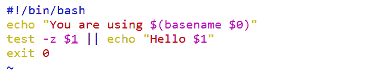
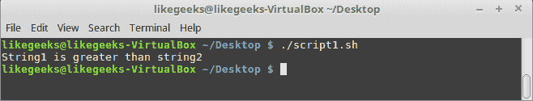

# 三、条件

现在可以使用`read`命令使脚本更具交互性，并且知道如何读取参数和选项来减轻输入。

我们可以说，我们现在进入了脚本的细则。 这些是使用条件写入脚本的细节，以测试语句是否应该运行。 现在我们已经准备好向我们的脚本中添加一些智能，以便我们的脚本变得更健壮、更容易使用和更可靠。 条件语句可以使用包含`AND`或`OR`命令的简单命令行列表一起编写，或者更常见的是使用传统的`if`语句。

在本章中，我们将涵盖以下主题:

*   使用命令行列表的简单决策路径
*   用列表验证用户输入
*   使用内置的测试 shell
*   使用`if`创建条件语句
*   用`else`扩展`if`
*   使用`test`命令和`if`命令
*   有`elif`更多条件
*   使用情况报表
*   菜谱前端与`grep`

# 技术要求

本章的源代码可以从这里下载:

[https://github.com/PacktPublishing/Mastering-Linux-Shell-Scripting-Second-Edition/tree/master/Chapter03](https://github.com/PacktPublishing/Mastering-Linux-Shell-Scripting-Second-Edition/tree/master/Chapter03)

# 使用命令行列表的简单决策路径

我们使用命令行名单`||`和`&&`,在[第一章](01.html),*与 Bash 脚本的什么和为什么*,和在一些脚本中找到[第二章](02.html)、【显示】创建交互脚本。 列表是我们可以创建的最简单的条件语句之一，因此我们认为在这里全面解释它们之前，最好在前面的示例中使用它们。

命令行列表是使用`AND`或`OR`表示法连接的两个或多个语句:

*   `&&`:`AND`
*   `||`:`OR`

在使用`AND`符号连接这两个语句的地方，只有当第一个命令成功时，第二个命令才运行。 然而，使用`OR`表示法，只有在第一个命令失败时，第二个命令才会运行。

通过从应用中读取退出代码来决定命令的成功或失败。 零代表成功的应用完成，除了零以外的任何东西都代表失败。 我们可以通过系统变量`$?`读取退出状态来测试应用的成功或失败。 如下面的例子所示:

```sh
$ echo $? 
```

如果我们需要确保脚本从用户的主目录运行，我们可以将其构建到脚本的逻辑中。 这可以从命令行进行测试，而不必在脚本中进行测试。 考虑以下命令行示例:

```sh
$ test $PWD == $HOME || cd $HOME  
```

两个竖条表示一个`OR`布尔值。 这确保了只有在第一条语句不正确时才执行第二条语句。 简单地说，如果我们当前不在主目录中，我们将在命令行列表的末尾。 我们很快就会看到更多关于`test`命令的内容。

我们可以将它构建到几乎任何我们想要的命令中，而不仅仅是测试。 例如，我们可以查询用户是否已登录到系统，如果已登录，则可以使用`write`命令直接向其控制台发送消息。 与前面类似，我们可以在将其添加到脚本之前在命令行中对其进行测试。 这在下面的命令行示例中显示:

```sh
$ who | grep pi > /dev/null 2>&1 && write pi < message.txt 
```

注意，您应该将用户`pi`更改为您的用户名。

如果我们在脚本中使用它，几乎可以肯定我们将用一个变量替换用户名。 一般来说，如果我们需要多次引用同一个值，那么使用变量是一个好主意。 在本例中，我们正在搜索`pi`用户。

在分解命令行列表时，我们首先使用`who`命令列出登录的用户。 我们将列表管道到`grep`以搜索所需的用户名。 我们对搜索的结果不感兴趣，只对它的成功或失败感兴趣。 记住这一点，我们将所有输出重定向到`/dev/null`。 双&表示只有在第一个语句返回 true 时，列表中的第二个语句才会运行。 如果`pi`用户已登录，则使用`write`向该用户发送消息。 下面的屏幕截图演示了这个命令和输出:


# 用列表验证用户输入

在这个脚本中，我们将确保为第一个位置参数提供了一个值。 我们可以修改我们在[第一章](01.html)，*Bash*中创建的`hello2.sh`脚本，在显示`hello`文本之前检查用户输入。

您可以将`hello2.sh`脚本复制到`hello4.sh`，或者简单地从头创建一个新脚本。 不会有很多输入，脚本将被创建为`$HOME/bin/hello4.sh`，如下所示:



我们可以使用以下命令来确保脚本是可执行的:

```sh
$ chmod +x $HOME/bin/hello4.sh  
```

然后我们可以运行带或不带参数的脚本。 `test`语句正在寻找`$1`变量为零字节。 如果是，那么我们将看不到`hello`语句; 否则，将打印`hello`消息。 简单地说，如果我们提供一个名称，我们将看到`hello`消息。

下面的屏幕截图显示了当您没有为脚本提供参数时，您将看到的输出，后面跟着所提供的参数:


# 使用内置的测试 shell

现在可能是时候把车停在脚本高速公路的一边，对命令`test`进行更多的研究了。 这既是一个内置的 shell，也是一个文件可执行文件。 当然，除非我们指定了文件的完整路径，否则我们必须先点击内置命令。

当运行`test`命令而不计算任何表达式时，测试将返回 false。 因此，如果我们运行如下命令所示的`test`，则退出状态将为`1`，即使没有显示错误输出:

```sh
$ test  
```

`test`命令将始终分别返回`True`或`False`或`0`或`1`。 `test`的基本语法如下:

```sh
test EXPRESSION  
```

或者，我们可以倒转`test`命令:

```sh
test ! EXPRESSION  
```

如果需要包含多个表达式，可以同时使用`AND`或`OR`，分别使用`-a`和`-o`选项:

```sh
test EXPRESSION -a EXPRESSION
test EXPRESSION -o EXPRESSION 
```

我们也可以将其写成简写形式，将`test`替换为方括号括住表达式，如下例所示:

```sh
[ EXPRESSION ]  
```

# 测试字符串

我们可以测试两个字符串是否相等。 例如，测试根用户的一种方法是使用以下命令:

```sh
test $USER = root  
```

我们也可以用方括号表示:

```sh
[ $USER = root ]  
```

注意，必须在每个方括号和内部测试条件之间放一个空格，如前面所示。

同样，我们可以用以下两种方法测试非 root 帐户:

```sh
test ! $USER = root
[ ! $USER = root ] 
```

我们还可以测试字符串的零值或非零值。 我们在本章前面的例子中看到了这一点。

要测试字符串是否有值，可以使用`-n`选项。 通过检查用户环境中是否存在变量，我们可以检查当前连接是否通过 SSH 建立。 我们在下面两个例子中使用了`test`和方括号:

```sh
test -n $SSH_TTY
[ -n $SSH_TTY ]  
```

如果这是真的，那么连接是通过 SSH 建立的; 如果为 false，则不是通过 SSH 连接。

如前所述，在决定是否设置变量时，测试字符串值为 0 是很有用的:

```sh
test -z $1 
```

或者，更简单地说，我们可以使用以下方法:

```sh
[ -z $1 ]  
```

该查询的真实结果意味着没有向脚本提供输入参数。

# 测试的整数

除了测试 bash 脚本的字符串值之外，我们还可以测试整数值和整数。 另一种测试脚本输入的方法是计算位置参数的数量，并测试该数量是否高于`0`:

```sh
test $# -gt 0 
```

或使用括号，如下所示:

```sh
[ $# -gt 0 ] 
```

在关系中，`$#`变量的顶部位置参数表示传递给脚本的参数数量。

有很多测试可以对数字进行:

*   `number1 -eq number2`:检查`number1`是否等于`number2`
*   `number1 -ge number2`:检查`number1`是否大于或等于`number2`。

*   `number1 -gt number2`:检查`number1`是否大于`number2`
*   `number1 -le number2`:检查`number1`是否小于或等于`number2`
*   `number1 -lt number2`:检查`number1`是否小于`number2`
*   `number1 -ne number2`:检查`number1`是否等于`number2`

# 测试文件类型

在测试值时，我们可以测试是否存在一个文件或文件类型。 例如，我们可能只希望删除一个符号链接的文件。 我们在编译内核时使用它。 `/usr/src/linux`目录应该是指向最新内核源代码的符号链接。 如果我们在编译新内核之前下载一个新版本，我们需要删除现有的链接并创建一个新的链接。 万一有人创建了`/usr/src/linux`目录，我们可以在删除之前测试它是否有链接:

```sh
# [ -h /usr/src/linux ] &&rm /usr/src/linux  
```

选项测试文件是否有链接。 其他选项包括:

*   `-d`:这表示它是一个目录
*   `-e`:表示文件以任何形式存在
*   `-x`:这表示文件是可执行的
*   `-f`:这表示该文件是一个常规文件
*   `-r`:表示该文件是可读的
*   `-p`:这表明该文件是一个命名管道
*   `-b`:这表示该文件是一个块设备
*   `file1 -nt file2`:检查`file1`是否比`file2`更新
*   `file1 -ot file2`:检查`file1`是否大于`file2`
*   `-O file`:检查登录的用户是否为文件的所有者
*   `-c`:这表示该文件是一个字符设备

确实存在更多的选项，所以需要时可以深入研究主页。 我们将在整本书中使用不同的选项，从而给你提供实用和有用的例子。

# 使用 if 创建条件语句

如前所述，可以使用命令行列表构建简单的条件。 在编写这些条件语句时可以使用测试，也可以不使用测试。 随着任务复杂性的增加，使用`if`创建语句变得更加容易。 这当然会简化脚本的可读性和逻辑布局。 在某种程度上，它也符合我们思考和说话的方式; `if`是口语中的语义，与 bash 脚本中的语义相同。

虽然它在脚本中会占用不止一行，但使用`if`语句我们可以实现更多，使脚本更容易读懂。 话虽如此，让我们看看创造`if`条件。 下面是一个使用`if`语句的脚本示例:

```sh
#!/bin/bash 
# Welcome script to display a message to users on login 
# Author: @theurbanpenguin 
# Date: 1/1/1971 
if [ $# -lt 1 ] ; then 
echo "Usage: $0 <name>" 
exit 1 
fi 
echo "Hello $1" 
exit 0 
```

只有当条件计算结果为 true 时，`if`语句中的代码才会运行，并且`if`块的结束用`fi`-`if`向后表示。 `vim`中的颜色编码有助于提高可读性，如下截图所示:


在脚本中，我们可以轻松地添加多个语句，以便在条件为`true`时运行。 在我们的例子中，这包括退出脚本并显示一个错误，以及包含`usage`语句来帮助用户。 这确保了我们只有在提供了欢迎的人的姓名后才显示`hello`消息。

我们可以在下面的截图中查看带参数和不带参数的脚本执行:


下面的伪代码显示了`if`条件语句的语法:

```sh
if condition; then 
   statement 1 
   statement 2 
fi 
```

代码不需要缩进，但它有助于提高可读性，强烈推荐使用。 将`then`语句添加到与`if`语句相同的行中，同样有助于提高代码的可读性，并且需要用分号将`if`和`then`分开。

# 用 else 扩展 if

当需要不管`if`条件的结果都继续执行脚本时，通常需要同时处理计算的两种条件，即在`true`和`false`条件下应该做什么。 这就是我们可以使用`else`关键字的地方。 这允许在条件为真时执行一个代码块，在条件为假时执行另一个代码块。 伪代码如下所示:

```sh
if condition; then 
   statement 
else  
   statement 
fi 
```

如果我们考虑扩展前面创建的`hello5.sh`脚本，那么无论是否存在参数，都可以很容易地允许正确执行。 我们可以将其重新创建为`hello6.sh`，如下:

```sh
#!/bin/bash 
# Welcome script to display a message to users 
# Author: @theurbanpenguin 
# Date: 1/1/1971 
if [ $# -lt 1 ] ; then 
read -p "Enter a name: " 
name=$REPLY 
else 
name=$1 
fi 
echo "Hello $name" 
exit 0 

```

现在脚本设置了一个命名变量，这有助于可读性，我们可以从输入参数或从`read`提示符为`$name`赋值; 不管怎样，脚本运行良好，并开始成形。

# 使用 if 命令测试命令

您已经了解了如何使用`test`命令或简短版本`[ ]`。 这个测试返回 0 (true)或非 0 (false)。

您将看到如何使用`if`命令检查返回的结果。

# 检查字符串

您可以使用`if`命令和`test`命令来检查字符串是否匹配特定的条件:

*   `if [$string1 = $string2]`:检查`string1`是否与`string2`相同。
*   `if [$string1 != $string2]`:检查`string1`与`string2`是否相同。
*   `if [$string1 \< $string2]`:检查`string1`是否小于`string2`
*   `if [$string1 \> $string2]`:检查`string1`是否大于`string2`

小于和大于应该使用反斜杠进行转义，就像它显示一个警告一样。

*   `if [-n $string1]`:检查`string1`是否大于零
*   `if [-z $string1]`:检查`string1`是否为零长度

让我们看一些例子来解释`if`语句是如何工作的:

```sh
#!/bin/bash 
if [ "mokhtar" = "Mokhtar" ]  
then 
echo "Strings are identical" 
else 
echo "Strings are not identical" 
fi 

```


这个`if`语句检查字符串是否相同; 由于字符串不相同，因为其中一个有大写字母，所以它们被标识为不相同。

Note the space between the square brackets and the variables; without this space it will show a warning in some cases.

不相等运算符(`!=`)的工作方式相同。 同样，你也可以否定`if`，它会以同样的方式工作，像这样:

```sh
if ! [ "mokhtar" = "Mokhtar" ]
```

小于和大于操作符从 ascii 顺序的角度检查第一个字符串是否大于或小于第二个字符串:

```sh
#!/bin/bash 
if [ "mokhtar" \> "Mokhtar" ]  
then 
echo "String1 is greater than string2" 
else 
echo "String1 is less than the string2" 
fi 

```



在 ASCII 顺序中，小写字符比大写字符高。

如果您使用`sort`命令对文件或类似文件进行排序，并发现排序顺序与`test`命令相反，请不要感到困惑。 这是因为`sort`命令使用了来自系统设置的编号顺序，这与 ASCII 顺序相反。

要检查字符串长度，可以使用`-n`测试:

```sh
#!/bin/bash 
if [ -n "mokhtar" ]  
then 
echo "String length is greater than zero" 
else 
echo "String is zero length" 
fi 
```


要检查长度为零，可以使用`-z`测试:

```sh
#!/bin/bash 
if [ -z "mokhtar" ]  
then 
echo "String length is zero" 
else 
echo "String length is not zero" 
fi        

```


我们在测试字符串周围使用了引号，尽管我们的字符串没有空格。

如果您有一个带有空格的字符串，您**必须**使用引号。

# 检查文件和目录

类似地，您可以使用`if`语句检查文件和目录。

让我们看一个例子:

```sh
#!/bin/bash 
mydir=/home/mydir 
if [ -d $mydir ] 
then 
echo "Directory $mydir exists." 
else 
echo "Directory $mydir not found." 
fi 
```

我们使用`-d`测试来检查路径是否为目录。

其余的测试工作方式相同。

# 检查数量

同样，我们可以使用`test`和`if`命令检查数字。

```sh
#!/bin/bash 
if [ 12 -gt 10 ] 
then 
echo "number1 is greater than number2" 
else 
echo "number1 is less than number2" 
fi  
```


正如所料，`12`大于`10`。

所有其他数字测试的工作方式相同。

# 结合测试

您可以组合多个测试并使用一个`if`语句检查它们。

这是通过`AND`(`&&`)和`OR`(`||`)命令完成的:

```sh
#!/bin/bash 
mydir=/home/mydir 
name="mokhtar" 
if [ -d $mydir ] && [ -n $name ]; then 
   echo "The name is not zero length and the directory exists." 
else 
echo "One of the tests failed." 
fi 
```


`if`语句执行两次检查，它检查目录是否存在以及名称长度不为零。

这两个测试必须返回成功(零)以评估下一个`echo`命令。

如果其中一个失败，则`if`语句转到`else`子句。

与`OR`(`||`)命令不同，如果任何一个测试返回成功(零)，则`if`语句成功。

```sh
#!/bin/bash 
mydir=/home/mydir 
name="mokhtar" 
if [ -d $mydir ] || [ -n $name ]; then 
   echo "One of tests or both successes" 
else 
echo "Both failed" 
fi  
```


很明显，如果其中一个测试返回 true，那么`if`语句将为组合测试返回 true。

# 更多的条件与 elif

在需要更大程度控制的地方，我们可以使用`elif`关键字。 与`else`不同，`elif`要求为每个`elif`测试一个附加条件。 这样，我们就可以为不同的情况做准备。 我们可以根据需要添加许多`elif`条件。 下面显示了一些伪代码:

```sh
if condition; then 
statement 
elif condition; then 
statement 
else 
statement 
fi 
exit 0 
```

脚本可以为更复杂的代码段提供简化的选择，从而简化操作人员的工作。 尽管为了满足需求，脚本变得越来越复杂，但对于操作人员的执行却大大简化了。 我们的工作是让用户在创建脚本时能够从命令行轻松地运行更复杂的操作。 通常，这将需要在我们的脚本中增加更多的复杂性; 然而，我们将得到脚本化应用的可靠性。

# 使用 elif 命令创建 backup2.sh

我们可以重新访问为运行早期备份而创建的脚本。 这个脚本`$HOME/bin/backup.sh`提示用户输入文件类型和存储备份的目录。 用于备份的工具有`find`和`cp`。

有了这个新发现的知识，我们现在可以允许脚本使用命令`tar`和操作员选择的压缩级别来运行备份。 不需要选择文件类型，因为将备份完整的主目录，备份目录本身除外。

操作人员可以根据`H`、`M`、`L`三个字母选择压缩值。 选择将影响传递给`tar`命令的选项和创建的备份文件。 选择高级别使用`bzip2`压缩，中级别使用`gzip`压缩，低级别创建未压缩的`tar`存档。 逻辑存在于扩展的`if`语句中，如下:

```sh
if [ $file_compression = "L" ] ; then 
tar_opt=$tar_l 
elif [ $file_compression = "M" ]; then 
tar_opt=$tar_m 
else 
tar_opt=$tar_h 
fi 
```

根据用户的选择，我们可以为`tar`命令配置正确的选项。 由于我们有三个条件要评估，所以`if`、`elif`和`else`语句是合适的。 要查看变量是如何配置的，我们可以查看脚本中的以下摘录:

```sh
tar_l="-cvf $backup_dir/b.tar --exclude $backup_dir $HOME" 
tar_m="-czvf $backup_dir/b.tar.gz --exclude $backup_dir $HOME" 
tar_h="-cjvf $backup_dir/b.tar.bzip2 --exclude $backup_dir $HOME" 
```

完整的脚本可以创建为`$HOME/bin/backup2.sh`，并且应该包含以下代码:

```sh
#!/bin/bash 
# Author: @theurbanpenguin 
# Web: www.theurbapenguin.com 
read -p "Choose H, M or L compression " file_compression 
read -p "Which directory do you want to backup to " dir_name 
# The next lines creates the directory if it does not exist 
test -d $HOME/$dir_name || mkdir -m 700 $HOME/$dir_name 
backup_dir=$HOME/$dir_name 
tar_l="-cvf $backup_dir/b.tar --exclude $backup_dir $HOME" 
tar_m="-czvf $backup_dir/b.tar.gz --exclude $backup_dir $HOME" 
tar_h="-cjvf $backup_dir/b.tar.bzip2 --exclude $backup_dir $HOME" 
if [ $file_compression = "L" ] ; then 
tar_opt=$tar_l 
elif [ $file_compression = "M" ]; then 
tar_opt=$tar_m 
else 
tar_opt=$tar_h 
fi 
tar $tar_opt 
exit 0 
```

当我们执行脚本时，我们需要用大写字母选择`H`、`M`或`L`，因为这是在脚本中进行选择的方式。 下面的截图显示了初始脚本的执行，其中选择了`M`:


# 使用情况报表

当对单个表达式求值时，与其使用多个`elif`语句，不如使用`case`语句提供更简单的机制。

使用伪代码，`case`语句的基本布局如下所示:

```sh
case expression in 
 case1)  
  statement1 
  statement2 
 ;; 
 case2) 
  statement1 
  statement2 
 ;; 
 *) 
  statement1 
 ;; 
esac 
```

我们看到的语句布局与其他语言中存在的`switch`语句没有什么不同。 在 bash 中，我们可以使用`case`语句来测试简单值，比如字符串或整数。 Case 语句可以处理范围很广的字母，例如`[a-f]`或`a`到`f`，但是它们不能轻松处理像`[1-20]`这样的整数范围。

`case`语句首先展开表达式，然后尝试将其与每个项依次匹配。 当找到匹配时，执行所有语句，直到`;;`。 这表示该匹配的代码结束。 如果没有匹配，则匹配由`*`表示的 case`else`语句。 这必须是列表中的最后一项。

考虑下面的脚本`grade.sh`，它是用来评价分数的:

```sh
#!/bin/bash 
#Script to evaluate grades 
#Usage: grade.sh stduent grade 
#Author: @likegeeks 
#Date: 1/1/1971 
if [ ! $# -eq 2 ] ; then 
    echo "You must provide <student> <grade>" 
    exit 2 
fi 
case ${2^^} in #Parameter expansion is used to capitalize input 
    [A-C]) echo "$1 is a star pupil" 
    ;; 
    [D]) echo "$1 needs to try a little harder!" 
    ;; 
    [E-F]) echo "$1 could do a lot better next year" 
    ;; 
    *) echo "Grade could not be evaluated for $1 $2" 
    ;; 
esac 
```

脚本首先使用一个`if`语句检查是否恰好有两个参数提供给脚本。 如果没有提供，脚本将以错误状态退出:

```sh
if [ ! $# -eq2 ] ; then 
echo "You must provide <student><grade> 
exit 2 
fi 
```

然后，我们对变量`$2`的值进行参数展开，使用`^^`将输入大写。 这代表我们提供的等级。 由于要对输入进行大写，我们首先尝试匹配字母`A`到`C`。

我们对提供的其他等级`E`至`F`进行类似测试。

以下截图显示了不同等级的脚本执行情况:


# Recipe—使用 grep 构建一个前端

作为本章的结尾，我们将把我们学到的一些特性组合在一起，并构建一个脚本，该脚本提示操作符输入文件名、搜索字符串和使用`grep`命令执行的操作。 我们将创建脚本为`$HOME/bin/search.sh`，并且不要忘记让它可执行:

```sh
#!/bin/bash 
#Author: @theurbanpenguin 
usage="Usage: search.sh file string operation" 

if [ ! $# -eq3 ] ; then 
echo "$usage" 
exit 2 
fi 

[ ! -f $1 ] && exit 3 

case $3 in 
    [cC]) 
mesg="Counting the matches in $1 of $2" 
opt="-c" 
    ;; 
    [pP]) 
mesg="Print the matches of $2 in $1" 
        opt="" 
    ;; 
    [dD]) 
mesg="Printing all lines but those matching $3 from $1" 
opt="-v" 
    ;; 
    *) echo "Could not evaluate $1 $2 $3";; 
esac 
echo $mesg 
grep $opt $2 $1 
```

我们首先使用下面的代码检查三个输入参数:

```sh
if [ ! $# -eq3 ] ; then 
echo "$usage" 
exit 2 
fi 
```

接下来的检查使用命令行列表来退出脚本，如果 file 参数不是一个常规文件，使用`test -f`:

```sh
[ ! -f $1 ]&& exit 3 
```

`case`语句允许三种操作:

*   计算匹配行
*   打印匹配的行
*   打印除匹配行以外的所有行

下面的屏幕截图显示了在`/etc/ntp.conf`文件中搜索以字符串服务器开头的行。 我们在这个例子中选择 count 选项:


# 总结

脚本编写中最重要和最耗时的任务之一是构建所有我们需要的条件语句，以使脚本可用和健壮。 人们经常提到一条 80/20 规则。 也就是 20%的时间花在写主脚本上，80%的时间花在确保脚本中正确处理所有可能的事件上。 这就是我们所说的脚本的过程完整性，即我们试图仔细而准确地涵盖每个场景。

我们从一个使用命令行列表的简单测试开始。 如果需要的操作很简单，那么这些操作提供了很好的功能，并且很容易添加。 在需要更复杂的地方，我们添加`if`语句。

使用`if`语句，我们可以根据需要使用`else`和`elif`关键字扩展它们。 不要忘记`elif`关键词需要有自己的条件来评估。

我们了解了如何在`test`命令中使用`if`语句，并检查字符串、文件和数字。

最后，我们了解了如何在需要计算单个表达式的情况下使用`case`。

在下一章中，我们将试图理解阅读已经准备好的代码片段的重要性。 我们将创建一个示例`if`语句，可以将其保存为代码片段，以便在编辑时读取到脚本中。

# 问题

1.  下面的代码:`True`或`False`的结果是什么?

```sh
if [ "LikeGeeks" \> "likegeeks" ]  
then 
echo "True" 
else 
echo "False" 
fi 
```

2.  下面哪个脚本是正确的?

```sh
#!/bin/bash 
if ! [ "mokhtar" = "Mokhtar" ]  
then 
echo "Strings are not identical" 
else 
echo "Strings are identical" 
fi 
```

或

```sh
#!/bin/bash 
if [ "mokhtar" != "Mokhtar" ]  
then 
echo "Strings are not identical" 
else 
echo "Strings are identical" 
fi
```

3.  在下面的例子中，一个操作符可以使用多少个命令返回`True`?

```sh
#!/bin/bash 
if [ 20 ?? 15 ] 
then 
echo "True" 
else 
echo "False" 
fi 
```

4.  下面代码的结果是什么?

```sh
#!/bin/bash 
mydir=/home/mydir 
name="mokhtar" 
if [ -d $mydir ] || [ -n $name ]; then 
   echo "True" 
else 
echo "False" 
fi 
```

# 进一步的阅读

请参阅以下有关本章的资料:

*   [http://tldp.org/HOWTO/Bash-Prog-Intro-HOWTO-6.html](http://tldp.org/HOWTO/Bash-Prog-Intro-HOWTO-6.html) 
*   [http://tldp.org/LDP/Bash-Beginners-Guide/html/sect_07_03.html](http://tldp.org/LDP/Bash-Beginners-Guide/html/sect_07_03.html) 
*   [http://wiki.bash-hackers.org/commands/classictest](http://wiki.bash-hackers.org/commands/classictest)