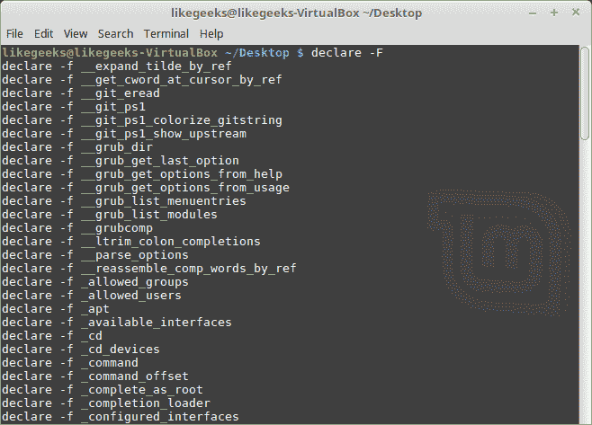
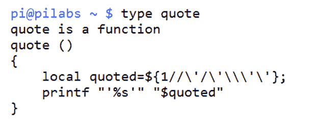
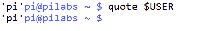
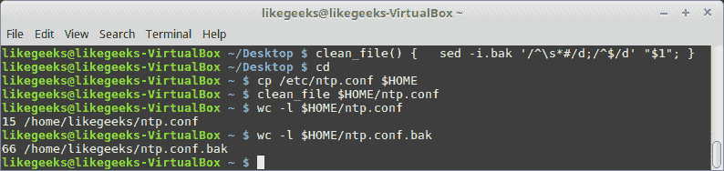
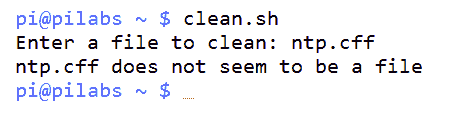
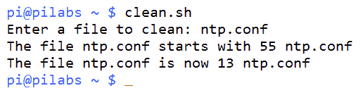
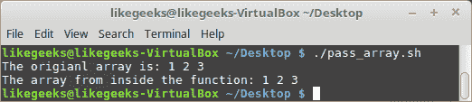
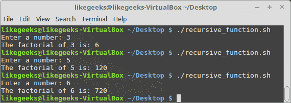
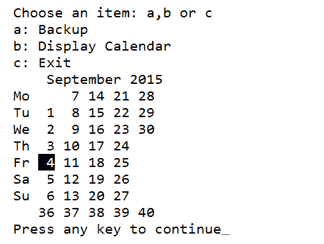

# 使用函数创建构建块

在本章中，我们将深入研究函数的奇妙世界。 我们可以把这些看作是创建功能强大、适应性强的脚本的模块化构建块。 通过创建函数，我们将代码添加到一个单独的构建块中，与脚本的其余部分隔离开来。 专注于单个函数的改进要比尝试将脚本作为单个对象进行改进容易得多。 如果没有函数，就很难专注于问题区域，并且代码经常重复，这意味着需要在许多位置进行更新。 函数被命名为脚本中的代码块或脚本，它们可以克服许多与更复杂的代码相关的问题。

在本章中，我们将涵盖以下主题:

*   引入函数
*   向函数传递参数
*   变量作用域
*   从函数中返回值
*   递归函数
*   在菜单中使用函数

# 技术要求

本章的源代码可以从这里下载:

[https://github.com/PacktPublishing/Mastering-Linux-Shell-Scripting-Second-Edition/tree/master/Chapter07](https://github.com/PacktPublishing/Mastering-Linux-Shell-Scripting-Second-Edition/tree/master/Chapter07)

# 引入函数

函数是作为**命名元素**存在于内存中的代码块。 这些元素可以在 shell 环境中创建，也可以在脚本执行中创建。 当在命令行发出命令时，首先检查别名，然后检查匹配的函数名。 要查看 shell 环境中的函数，可以使用以下命令:

```sh
$ declare -F  
```

输出将根据您使用的分布和创建的函数数量而有所不同。 在我的 Linux Mint 上，部分输出如下截图所示:



使用小的`-f`选项，您可以显示该函数和相关的定义。 然而，如果我们只想看到单个函数定义，我们可以使用`type`命令:

```sh
$ type quote  
```

前面的代码示例将显示`quote`函数的代码块，如果它存在于您的 shell 中。 我们可以在下面的截图中看到这个命令的输出:



bash 中的`quote`函数在提供的输入参数周围插入单引号。 例如，我们可以展开`USER`变量并将其值显示为字符串文本; 如下面的截图所示。 屏幕截图捕捉命令和输出:



大多数代码都可以用一个伪代码来表示，它显示了一个示例布局。 函数也没有什么不同，下面的例子中列出了创建函数的代码:

```sh
function-name() { 
<code to execute> 
} 
```

此外，还有另一种定义函数的方法，像这样:

```sh
function <function-name> { 
<code to execute> 
} 
```

在**Portable Operating System Interface**(**POSIX**)规范中，`keyword`函数已不再支持可移植性，但仍有一些开发人员在使用它。

Note that the `()` are not necessary when using the `keyword` function, but they are a must if you define the function without the `keyword` function.

该函数创建时没有`do`和`done`块，就像我们在前面的循环中使用的那样。 花括号的目的是定义代码块边界。

下面的代码显示了一个显示聚合系统信息的简单函数。 这可以在命令行中创建，并驻留在您的 shell 中。 这将不会持续登录，并将在 shell 关闭或函数未设置时丢失。 为了允许函数持久化，我们需要将其添加到用户帐户的登录脚本中。 示例代码如下:

```sh
$ show_system() {
echo "The uptime is:"
uptime
echo
echo "CPU Detail"
lscpu
echo
echo "User list"
who
}  
```

我们可以使用`type`命令打印函数的详细信息，类似于前面的实例; 如下截图所示:


要执行该函数，只需输入`show_system`，就可以看到静态文本和来自三个命令:`uptime`、`lscpu`和`who`的输出。 当然，这是一个非常简单的函数，但是我们可以通过允许在运行时传递参数来添加更多的功能。

# 向函数传递参数

在本章的前面，我们将函数称为脚本中的脚本，我们将继续保持这种类比。 与脚本如何具有输入参数类似，我们可以创建函数，这些函数也可以接受参数，从而使其操作不那么静态。 在处理脚本之前，我们可以看看命令行中的一个有用函数。

One of my pet peeves is overcommented configuration files, especially where documentation exists to detail the options available.

**GNU's Not Unix**(**GNU**)Linux`sed`命令可以方便地为我们编辑文件并删除注释行和空行。 我们在这里介绍流编辑器`sed`，但我们将在下一章中更详细地了解它。

运行就地编辑的`sed`命令行如下:

```sh
$ sed -i.bak '/^\s*#/d;/^$/d' <filename>  
```

我们可以在命令行中通过逐个元素分解来完成取证。 让我们来深入了解一下:

*   `sed -i.bak`:编辑文件并创建扩展名为`.bak`的备份。 然后可以通过`<filename>.bak`访问原始文件。
*   `/^`:插入符号(`^`)表示编辑插入符号后面的内容开始的行。 所以插入符号匹配一行的开头。
*   `\s*`:这意味着任意数量的空白，包括空格和制表符。
*   `#/`:正常`#`征象。 因此，total 表达式`^\s*#`意味着我们要查找以注释或空格和注释开头的行。
*   `d`:这是删除匹配行的删除操作。
*   `;/^$/d`:分号用于分隔表达式，第二个表达式类似于第一个表达式，但这一次我们准备删除空行。

要将其移动到函数中，我们只需要想出一个好名字。 我喜欢在函数名中加入动词; 它有助于惟一性并确定函数的目的。 我们将按照如下方式创建`clean_file`函数:

```sh
$ function clean_file {
  sed -i.bak '/^\s*#/d;/^$/d' "$1"
}  
```

与在脚本中一样，我们使用位置参数来接受命令行参数。 我们可以在函数内用`$1`替换前面使用的硬编码文件名。 我们将引用这个变量以防止文件名中出现空格。 为了测试`clean_file`函数，我们将复制一个系统文件并使用该副本。 这样，我们就可以确保任何系统文件都不会受到伤害。 我们可以向所有读者保证，在本书的制作过程中，没有任何系统文件受到伤害。 以下是我们需要遵循的对新功能进行测试的详细步骤:

1.  按照描述创建`clean_file`功能
2.  使用不带参数的`cd`命令移动到您的`home`目录
3.  将时间配置文件复制到您的`home`目录`cp /etc/ntp.conf $HOME`
4.  使用以下命令计算文件中的行数:`wc -l $HOME/ntp.conf`
5.  现在用`clean_file $HOME/ntp.conf`删除注释和空行
6.  现在用`wc -l $HOME/ntp.conf`重述几行
7.  另外，检查我们创建的原始文件的备份计数:`wc -l $HOME/ntp.conf.bak`

命令的顺序如下截图所示:



我们可以使用在执行函数时提供的参数将函数的注意力转移到所需的文件上。 如果需要持久化这个函数，那么应该将它添加到登录脚本中。 但是，如果我们想在 shell 脚本中测试它，我们可以创建下面的文件来完成这项工作，并练习我们学过的其他一些元素。 我们需要注意的是，函数应该总是在脚本开始时创建，因为它们需要在调用时存储在内存中。 只要认为您的函数需要在您扣动扳机之前解锁和加载。

我们将创建一个新的 shell 脚本`$HOME/bin/clean.sh`，并且需要像往常一样设置执行权限。 脚本代码如下:

```sh
#!/bin/bash 
# Script will prompt for filename 
# then remove commented and blank lines 

is_file() { 
    if [ ! -f "$1" ] ; then 
        echo "$1 does not seem to be a file" 
        exit 2 
    fi 
} 

clean_file() { 
    is_file "$1" 
    BEFORE=$(wc -l "$1") 
    echo "The file $1 starts with $BEFORE" 
    sed -i.bak '/^\s*#/d;/^$/d' "$1" 
    AFTER=$(wc -l "$1") 
    echo "The file $1 is now $AFTER" 
} 

read -p "Enter a file to clean: " 
clean_file "$REPLY" 
exit 1 
```

我们在脚本中提供了两个函数。 第一个是`is_file`，它只是简单地测试以确保我们输入的文件名是一个常规文件。 然后，我们声明了带有一些附加功能的`clean_file`函数，显示操作前后文件的行数。 我们还可以看到，函数可以嵌套，我们用`clean_file`调用`is_file`函数。

没有函数定义，我们在文件的末尾只有三行代码，我们可以在前面保存为`$HOME/bin/clean.sh`的代码块中的示例代码中看到这三行代码。 我们首先提示输入文件名，然后运行`clean_file`函数，该函数接着调用`is_file`函数。 这里，主代码的简单性非常重要。 复杂性在于函数，因为每个函数都可以作为一个独立的单元来处理。

现在我们可以测试脚本操作，首先使用一个错误的文件名，如下面的截图所示:



现在我们已经看到了使用错误文件的操作，我们可以再次尝试使用实际文件! 我们可以使用之前处理过的系统文件。 我们需要首先将文件返回到它们的原始状态:

```sh
$ cd $HOME
$ rm $HOME/ntp.conf
$ mv ntp.conf.bak ntp.conf  
```

现在文件准备好了，我们可以从`$HOME`目录执行脚本，如下截图所示:



# 通过数组

并不是所有传递的值都是单一值; 您可能需要向函数传递一个数组。 让我们看看如何传递一个数组作为参数:

```sh
#!/bin/bash 
myfunc() { 
   arr=$@ 
   echo "The array from inside the function: ${arr[*]}" 
} 

test_arr=(1 2 3) 
echo "The original array is: ${test_arr[*]}" 
myfunc ${test_arr[*]} 
```



从结果中，您可以看到所使用的数组是以函数的方式返回的。

注意，我们使用了`$@`来获取函数内部的数组。 如果你使用`$1`，它将只返回第一个数组元素:

```sh
#!/bin/bash 
myfunc() { 
   arr=$1 
   echo "The array from inside the function: ${arr[*]}" 
} 

my_arr=(5 10 15) 
echo "The original array: ${my_arr[*]}" 
myfunc ${my_arr[*]} 
```


因为我们使用了`$1`，所以它只返回第一个数组元素。

# 变量作用域

默认情况下，在函数中声明的任何变量都是全局变量。 这意味着这个变量可以在函数内外使用，没有问题。

看看这个例子:

```sh
#!/bin/bash 
myvar=10 
myfunc() { 
   myvar=50 
} 
myfunc 
echo $myvar 

```

如果运行此脚本，它将返回`50`，这是在函数内部更改的值。

如果你想声明一个专属于函数的变量呢? 这被称为局部变量。

你可以像这样使用`local`命令来声明局部变量:

```sh
myfunc() { 
   local myvar=10 
} 
```

为了确保这个变量只在函数内部使用，让我们看看下面的例子:

```sh
#!/bin/bash 
myvar=30 
myfunc() { 
   local myvar=10 
} 
myfunc 
echo $myvar 
```

如果运行此脚本，它将打印`30`，这意味着该变量的本地版本与全局版本不同。

# 从函数中返回值

每当函数中有语句打印在屏幕上时，我们就可以看到它们的结果。 然而，很多时候，我们希望函数在脚本中填充一个变量，而不显示任何内容。 在本例中，我们在函数中使用`return`。 当我们从用户那里获取输入时，这一点尤其重要。 我们可能更喜欢用案例将输入转换为已知案例，以便更容易地进行条件测试。 将代码嵌入到函数中允许在脚本中多次使用。

下面的代码展示了如何通过创建`to_lower`函数来实现这一点:

```sh
to_lower () 
{ 
    input="$1" 
    output=$( echo $input | tr [A-Z] [a-z]) 
return $output 
} 
```

逐步浏览代码，我们可以开始了解这个函数的操作:

*   `input="$1"`:这比其他任何事情都更容易; 我们将第一个输入参数赋给一个命名变量输入。
*   `output=$( echo $input | tr [A-Z] [a-z])`:这是函数的主引擎，在这里进行从大写到小写的转换。 我们将输入通过管道传递到`tr`命令，将大写字母转换为小写字母。
*   `return $output`:这就是我们创建返回值的方式。

这个函数的一种用法是在一个脚本中，该脚本读取用户的输入并简化测试，以查看他们是选择`Q`还是`q`。 这可以从下面的代码摘录中看到:

```sh
to_lower () 
{ 
    input="$1" 
    output=$( echo $input | tr [A-Z] [a-z]) 
return $output 
} 

while true 
do 
  read -p "Enter c to continue or q to exit: " 
  $REPLY=$(to_lower "$REPLY") 
  if [ $REPLY = "q" ] ; then 
    break 
  fi 

done 
echo "Finished" 
```

# 递归函数

递归函数是从自身内部调用自身的函数。 当您需要调用该函数来再次从内部执行某些操作时，这个函数非常有用。 最著名的例子就是计算阶乘。

为了计算 4 的阶乘，你用 4 乘以递减数。 你可以这样做:

```sh
4! = 4*3*2*1
```

符号 T0 表示阶乘。

让我们写一个递归函数来计算任意给定数的阶乘:

```sh
#!/bin/bash 
calc_factorial() { 
if [ $1 -eq 1 ] 
then 
echo 1 
else 
local var=$(( $1 - 1 )) 
local res=$(calc_factorial $var) 
echo $(( $res * $1 )) 
fi 
} 

read -p "Enter a number: " val 
factorial=$(calc_factorial $val) 
echo "The factorial of $val is: $factorial" 
```



首先，我们定义名为`calc_factorial`的函数，并在其内部检查 number 是否等于 1，如果等于 1，函数将返回 1，因为 1 的阶乘等于 1。

然后我们将数字减 1，然后从里面调用函数，这将再次调用函数。

这将继续发生，直到它达到 1，然后函数将退出。

# 在菜单中使用函数

在[第 6 章](06.html)，*循环迭代*中，我们创建了`menu.sh`文件。 菜单是使用函数的最佳目标，因为`case`语句用单行条目非常简单地维护，而复杂性仍然可以存储在每个函数中。 我们应该考虑为每个菜单项创建一个函数。 如果将之前的`$HOME/bin/menu.sh`复制到`$HOME/bin/menu2.sh`，就可以改进功能。 新的菜单看起来应该像下面的代码:

```sh
#!/bin/bash 
# Author: @likegeeks 
# Web: likegeeks.com 
# Sample menu with functions 
# Last Edited: April 2018 

to_lower() { 
    input="$1" 
    output=$( echo $input | tr [A-Z] [a-z]) 
return $output 
} 

do_backup() { 
    tar -czvf $HOME/backup.tgz ${HOME}/bin 
} 

show_cal() { 
    if [ -x /usr/bin/ncal ] ; then 
      command="/usr/bin/ncal -w" 
    else 
      command="/usr/bin/cal" 
    fi 
    $command 
} 

while true 
do 
  clear 
  echo "Choose an item: a, b or c" 
  echo "a: Backup" 
  echo "b: Display Calendar" 
  echo "c: Exit" 
  read -sn1 
  REPLY=$(to_lower "$REPLY") 
  case "$REPLY" in 
    a) do_backup;; 
    b) show_cal;; 
    c) exit 0;; 
  esac 
  read -n1 -p "Press any key to continue" 
done 
```

如我们所见，我们仍然保持了`case`语句的简单性; 但是，我们可以通过函数来开发脚本以增加复杂性。 例如，当为日历选择选项`b`时，我们现在检查`ncal`命令是否可用。 如果是，则使用`ncal`并使用`-w`选项打印周数。 我们可以在下面的截图中看到这一点，在这里我们选择显示日历并安装`ncal`:



我们也不必担心*Caps Lock*键，因为`to_lower`函数将我们的选择转换为小写。 随着时间的推移，我们很容易向函数中添加额外的元素，因为我们知道我们只影响一个函数。

# 总结

我们在剧本写作方面仍在取得跳跃式的进步。 我希望这些想法能够陪伴您，并且您会发现这些代码示例是有用的。 函数对于简化脚本及其最终功能的维护非常重要。 脚本越容易维护，您就越有可能随着时间的推移添加改进。 我们可以在命令行或脚本中定义函数，但在使用它们之前需要将它们包含在脚本中。

在脚本运行时，函数本身被加载到内存中，但只要脚本是分叉的，而不是源代码，它们将在脚本完成后从内存中释放。 在本章中，我们已经稍微谈到了`sed`，在下一章中，我们将进一步讨论如何使用流编辑器(`sed`)。 `sed`命令非常强大，我们可以在脚本中很好地使用它。

# 问题

1.  以下代码的打印值是多少?

```sh
#!/bin/bash 
myfunc() { 
arr=$1 
echo "The array: ${arr[*]}" 
} 

my_arr=(1 2 3) 
myfunc ${my_arr[*]} 
```

2.  以下代码的输出是什么?

```sh
#!/bin/bash 
myvar=50 
myfunc() { 
myvar=100 
} 
echo $myvar 
myfunc 
```

3.  下面的代码有什么问题? 你怎么能解决它呢?

```sh
clean_file { 
    is_file "$1" 
    BEFORE=$(wc -l "$1") 
    echo "The file $1 starts with $BEFORE" 
    sed -i.bak '/^\s*#/d;/^$/d' "$1" 
    AFTER=$(wc -l "$1") 
    echo "The file $1 is now $AFTER" 
} 
```

4.  下面的代码有什么问题? 你怎么能解决它呢?

```sh
#!/bin/bash 
myfunc() { 
arr=$@ 
echo "The array from inside the function: ${arr[*]}" 
} 

test_arr=(1 2 3) 
echo "The origianl array is: ${test_arr[*]}" 
myfunc (${test_arr[*]}) 
```

# 进一步的阅读

请参阅以下有关本章的资料:

*   [http://tldp.org/HOWTO/Bash-Prog-Intro-HOWTO-8.html](http://tldp.org/HOWTO/Bash-Prog-Intro-HOWTO-8.html)
*   [http://tldp.org/LDP/abs/html/functions.html](http://tldp.org/LDP/abs/html/functions.html)
*   [https://likegeeks.com/bash-functions/](https://likegeeks.com/bash-functions/)