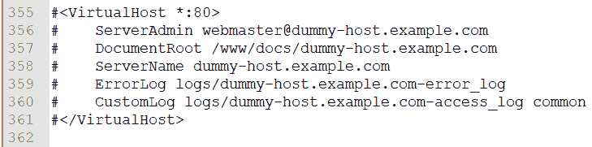
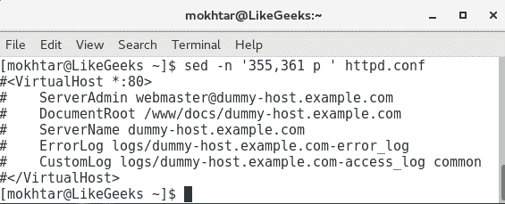
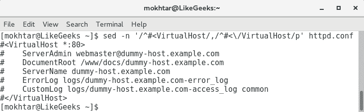
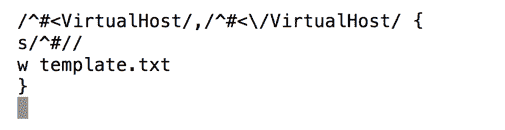
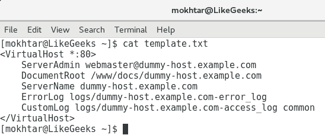

# 九、自动化 Apache 虚拟主机

现在我们已经了解了一些**流编辑器**(**sed**)，我们可以将这些知识应用于实践。 在[第八章](08.html)，*介绍流编辑器*中，我们熟悉了`sed`的一些功能; 然而，这只是编辑器中包含的一小部分功能。 在本章中，我们将进一步练习`sed`，并了解该工具的一些实际用途，特别是在使用 bash 脚本时。

在这一过程中，我们将使用`sed`来帮助我们自动化创建基于 Apache 名称的虚拟主机。 Apache 主机是我们演示的`sed`的实际用户，但更重要的是，我们将使用`sed`在主配置中搜索选定的行。 然后我们将取消这些行的注释并将它们保存为模板。 创建模板之后，我们将从中创建新的配置。 我们用 Apache 演示的概念可以应用于许多不同的情况。

我们将发现，在 shell 脚本中使用`sed`可以方便地从主配置中提取模板数据，并根据虚拟主机的需要进行调整。 通过这种方式，我们将能够扩展`sed`和 shell 脚本的知识。 在本章中，我们将涵盖以下主题:

*   基于 Apache 名称的虚拟主机
*   自动创建虚拟主机

# 技术要求

你需要以下资料:

*   CentOS 7。 x 机
*   Apache 2.4。 安装 X web 服务器

安装 Apache 的方法如下:

```sh
    $ sudo yum install httpd
```

然后你可以启动 web 服务器:

```sh
    $ systemctl start httpd 
```

通过以下检查状态，可以确认服务已经运行:

```sh
    $ systemctl status httpd   
```

本章的源代码可以从这里下载:

[https://github.com/PacktPublishing/Mastering-Linux-Shell-Scripting-Second-Edition/tree/master/Chapter09](https://github.com/PacktPublishing/Mastering-Linux-Shell-Scripting-Second-Edition/tree/master/Chapter09)

# 基于 Apache 名称的虚拟主机

在本演示中，我们将使用来自 CentOS 7 的 Apache 2.4 HTTPD 服务器的`httpd.conf`文件。 x 主机。 坦白地说，我们对配置文件更感兴趣，因为 Red Hat 或 CentOS 提供了它，而不是我们将进行的实际配置更改。 该文件可以从本章的代码包中下载。 我们的目的是学习如何从系统提供的文件中提取数据并从中创建模板。 我们可以将其应用于 Apache 配置文件或任何其他文本数据文件。 我们关注的是方法，而不是实际结果。

为了对我们正在尝试做的事情有一些了解，我们必须首先看一下`/etc/httpd/conf/httpd.conf`文件，即 CentOS、Red Hat Enterprise Linux 或 Scientific Linux。 下面的截图显示了我们感兴趣的文件的虚拟主机部分:


看看这些行，我们可以看到它们都被注释了，而且这都是一个整体`httpd.conf`的一部分。 在创建虚拟主机时，我们通常倾向于为每个潜在的虚拟主机单独配置。 我们需要能够从主文件中提取数据，同时取消注释。 然后我们可以将这些未注释的数据保存为模板。

使用这个模板，我们将创建新的配置文件，这些文件代表不同的命名`hosts`，我们需要在 Apache 的一个实例上运行这些文件。 这使我们能够在单个服务器上托管`sales.example.com`和`marketing.example.com`。 销售和营销都将有自己的配置和网站，彼此独立。 此外，它也将很容易添加额外的网站，我们需要与我们创建的模板。 主 web 服务器的任务就是读取传入的 HTTP 报头请求，并根据所使用的域名将它们指向正确的站点。

然后，我们的第一个任务将是提取出现在开始和结束`VirtualHost`标记之间的数据，取消注释，并将其保存到模板中。 这只需要执行一次，并且不会是创建虚拟主机的主脚本的一部分。

# 创建虚拟主机模板

因为我们不打算测试我们创建的虚拟主机，所以我们将复制`httpd.conf`文件，并在本地的`home`目录中使用该文件。 在开发脚本时，这是一个很好的实践，以免影响工作配置。 我正在处理的`httpd.conf`文件应该能够通过脚本中引用的其他脚本资源从发布者那里下载。 或者，您可以从安装了 Apache 的 CentOS 主机上复制它。 确保将`httpd.conf`文件复制到`home`目录，并且您正在`home`目录中工作。

# 第一步

创建模板的第一步是隔离我们需要的行。 在我们的示例中，这将是我们在前面的截图中看到的示例虚拟主机定义中包含的行。 这包括`VirtualHost`的开始和结束标记以及两者之间的所有内容。 我们可以使用行号; 然而，这可能不可靠，因为我们需要假设文件中没有任何更改，以便行号保持一致。 为了完整起见，在转向更可靠的机制之前，我们将展示这一点。

首先，我们将提醒自己如何使用`sed`打印整个文件。 这一点很重要，因为在下一步中，我们将过滤显示并只显示我们想要的行:

```sh
$ sed -n ' p ' httpd.conf
```

选项`-n`用于抑制标准输出，引号中的`sed`命令为`p`; 它用于显示模式匹配。 因为我们在这里没有过滤任何内容，所以匹配的模式是完整的文件。 如果我们使用行号来过滤，我们可以使用`sed`轻松地添加行号，如下面的命令所示:

```sh
$ sed = httpd.conf 
```

从下面的截图中，我们可以看到，在这个系统中，我们只需要使用行`355`到`361`; 然而，我再次强调，这些数字可能因文件而异:



# 隔离线

为了显示这些被标签包围的行，我们可以向`sed`添加一个数字范围。 这很容易通过将这些数字添加到`sed`来实现，如下面的命令所示:

```sh
$ sed -n '355,361 p ' httpd.conf 
```

通过指定行范围，我们可以轻松地隔离所需的行，现在只显示虚拟主机定义的行。 我们可以在下面的截图中看到这一点，它同时显示了命令和输出:



在硬编码行号时，我们面临的问题是我们失去了灵活性。 这些行号与这个文件相关，可能只与这个文件相关。 我们总是需要检查与我们正在处理的文件相关的文件中的正确行号。 如果这些行不方便地放在文件的末尾，并且我们必须回滚来尝试查找正确的行号，那么这可能是一个问题。 为了克服这些问题，我们可以不使用行号，而是直接实现对开始和结束标记的搜索:

```sh
$ sed -n '/^#<VirtualHost/,/^#<\/VirtualHost/p' httpd.conf
```

我们不再使用起始号和结束号，而是使用更可靠的起始正则表达式和结束正则表达式。 开始的正则表达式查找以`#<VirtualHost`开头的行。 结束正则表达式正在搜索结束标记。 但是，我们需要使用转义字符来保护`/VirtualHost`。 通过查看正则表达式的末尾，我们可以看到它转换为以`#\/VirtualHost`开头的行，并带有转义的正斜杠。

If you recall from [Chapter 8](08.html), *Introducing the Stream Editor*, we specify the lines that begin with a specified character by using the carat (`^`).

通过查看下面的屏幕截图，我们现在可以更可靠地隔离所需的行，而不需要知道行号。 这是更可取的跨编辑文件，将不同的行编号:



# sed 脚本文件

隔离战线只是第一步! 我们仍然需要取消注释这些行，然后将结果保存为模板。 尽管我们可以将其编写为一个单独的`sed`命令字符串，但我们已经可以看到，它将非常长，难以阅读和编辑。 值得庆幸的是，`sed`命令确实有从输入文件(通常称为脚本)中读取命令的选项。 我们使用`-f`选项和`sed`来指定我们想要读取的文件作为我们的控件。

我们已经看到可以从文件中分离出正确的行。 因此，脚本的第一行将配置我们将要使用的行。 我们实现大括号`{}`来定义紧接在所选行之后的代码块。 代码块是我们想要在给定的选择上运行的一个或多个命令。

在我们的例子中，第一个命令将删除注释，第二个命令将把模式空间写入一个新文件。 `sed`脚本应该如下所示:

```sh
/^#<VirtualHost/,/^#<\/VirtualHost/ { 
s/^#// 
w template.txt 
} 
```

我们可以将该文件保存为`$HOME/vh.sed`。

在第一行中，我们选择要处理的行，如前所述，然后用左括号打开代码块。 在第 2 行中，我们使用`substitute`命令`s`。 它将查找以注释或`#`开头的行。 我们将注释替换为一个空字符串。 中间和结尾的正斜杠之间没有字符或空格。 在英语中，我们取消了该行的注释，但是对代码来说，这是用一个空字符串替换了`#`。 最后一行代码使用写入命令`w`将其保存到`template.txt`。 为了帮助你看到这一点，我们包含了以下的`vh.sed`文件截图:



现在，通过确保我们与正在执行以下命令的`httpd.conf`和`vh.sed`文件处于同一目录，我们可以看到我们的所有努力都取得了成果:

```sh
$ sed -nf vh.sed httpd.conf  
```

现在，我们已经在工作目录中创建了`template.txt`文件。 这是从`httpd.conf`文件中分离出来的未注释文本。 简单地说，我们在毫秒内从 350 多行文本中提取了 7 行正确的行，删除了注释，并将结果保存为一个新文件。 `template.txt`文件如下截图所示:



现在我们有了一个模板文件，可以开始使用它来创建虚拟主机定义。 尽管我们看到的是 Apache，但取消文本注释或删除所选行的第一个字符的相同想法可以应用于许多情况，因此可以将此视为`sed`的功能。

# 自动创建虚拟主机

创建模板之后，我们现在可以使用它来创建虚拟主机配置。 简单地说，我们需要将`dummy-host.example.com`URL 替换为`sales.example.com`或`marketing.example.com`URL。 当然，我们还必须创建`DocumentRoot`目录，即网页所在的目录，并添加一些基本内容。 当我们使用脚本运行整个过程时，不会忘记任何事情，并且每次编辑都是准确的。 脚本的基本内容如下:

```sh
#!/bin/bash 
WEBDIR=/www/docs 
CONFDIR=/etc/httpd/conf.d 
TEMPLATE=$HOME/template.txt 
[ -d $CONFDIR ] || mkdir -p $CONFDIR 
sed s/dummy-host.example.com/$1/ $TEMPLATE > $CONFDIR/$1.conf 
mkdir -p $WEBDIR/$1 
echo "New site for $1" > $WEBDIR/$1/index.html 
```

我们可以忽略第一行中的 shebang; 我们现在应该知道了。 我们可以从脚本的第 2 行开始解释:

| **线** | **含义** |
| `WEBDIR=/www/docs/` | 我们初始化变量`WEDIR`，该变量存储在存放不同网站的目录的路径中。 |
| `CONFDIR=/etc/httpd/conf.d` | 我们初始化了`CONFDIR`变量，我们将使用它来存储新创建的虚拟主机配置文件。 |
| `TEMPLATE=$HOME/template.txt` | 我们初始化将用于模板的变量。 这应该指向模板的路径。 |
| `[ -d $CONFDIR ] &#124;&#124; mkdir -p "$CONFDIR"` | 在工作的`EL6`主机上，这个目录将存在，并且包含在主配置中。 如果我们将其作为纯测试运行，那么我们可以创建一个目录来证明我们可以在目标目录中创建正确的配置。 |
| `sed s/dummy-host.example.com/$1/ $TEMPLATE >$CONFDIR/$1.conf` | `sed`命令在脚本中充当引擎，运行搜索和替换操作。 使用`sed`中的 substitute 命令，搜索虚拟文本并将其替换为传递给脚本的参数。 |
| `mkdir -p $WEBDIR/$1` | 在这里，我们创建正确的子目录来存放新虚拟主机的网站。 |
| `echo "New site for $1" > $WEBDIR/$1/index.html` | 在最后一步中，我们为网站创建一个基本的保持页面。 |

我们可以将这个脚本创建为`$HOME/bin/vhost.sh`。 不要忘记添加执行权限。 下面的截图说明了这一点:


要创建销售虚拟主机和 web 页面，我们可以运行如下示例所示的脚本。 我们将直接作为根用户运行脚本。 或者，您可以选择在脚本中使用`sudo`命令:

```sh
# vhost.sh sales.example.com  
```

现在我们可以看到，使用精心设计的脚本创建虚拟主机是多么容易。 虚拟主机的配置文件将创建在`/etc/httpd/conf.d/`目录中，并将其命名为`sales.example.com.conf`。 该文件将类似如下截图:


网站内容必须已经在`/www/docs/sales.example.com`目录中创建。 这将是一个简单的保持页面，它证明了我们可以从脚本中做到这一点。 使用下面的命令，我们可以列出用于存放每个站点的内容或基目录:

```sh
$ ls -R /www/docs  
```

`-R`选项允许递归列表。 我们使用了`/www/docs`目录，因为它是在我们提取的原始虚拟主机定义中设置的。 如果在活动环境中工作，您可能更喜欢使用`/var/www`或类似的方法，而不是在文件系统的根目录创建新目录。 这将是一个简单的问题，编辑我们创建的模板，这也可以在创建模板时使用`sed`完成。

# 在站点创建期间提示数据

我们现在可以使用脚本来创建虚拟主机和内容，但是除了虚拟主机名之外，我们不允许进行任何自定义。 当然，这很重要。 毕竟，在配置本身以及设置网站目录和配置文件名称时都使用了这个虚拟主机名。

我们可能允许在创建虚拟主机期间指定其他选项。 我们将使用`sed`按需要插入数据。 命令`sed``i`用于在选择之前插入数据，`a`用于在选择之后追加数据。

对于我们的示例，我们将添加一个主机限制，只允许本地网络访问该网站。 我们更感兴趣的是将数据插入到文件中，而不是如何处理特定的 HTTP 配置文件。 在脚本中，我们将添加`read`提示并将`Directory`块插入配置中。

为了尝试解释我们正在尝试做什么，在执行脚本时，我们应该看到类似以下内容。 你可以从文本中看到，我们正在为营销网站创建这一点，并增加了谁可以访问网站的限制:


如您所见，我们可以问两个问题，但如果需要，可以添加更多的问题来支持定制，其想法是额外的定制应该像脚本创建一样准确和可靠。 您还可以选择使用示例答案来详细说明问题，以便用户知道应该如何格式化网络地址。

为了辅助脚本创建，我们将原始的`vhost.sh`复制到`vhost2.sh`。 我们可以整理脚本中的一些条目，以便更容易地进行扩展，然后添加额外的提示。 新的脚本看起来类似如下代码:

```sh
#!/bin/bash 
WEBDIR=/www/docs/$1 
CONFDIR=/etc/httpd/conf.d 
CONFFILE=$CONFDIR/$1.conf 
TEMPLATE=$HOME/template.txt 
[ -d $CONFDIR ] || mkdir -p $CONFDIR  
sed s/dummy-host.example.com/$1/ $TEMPLATE > $CONFFILE 
mkdir -p $WEBDIR 
echo "New site for $1" > $WEBDIR/index.html 
read -p "Do you want to restrict access to this site? y/n " 
[ ${REPLY^^} = 'n' ] && exit 0 
read -p "Which network should we restrict access to: " NETWORK 
sed -i "/<\/VirtualHost>/i <Directory $WEBDIR >\ 
  \n  Order allow,deny\ 
  \n  Allow from 127.0.0.1\ 
  \n  Allow from $NETWORK\ 
\n</Directory>" $CONFFILE 
```

Please note that we are not running too many checks in the script. This is to keep our focus on the elements that we are adding rather than a robust script. In your own environment, once you have the script working the way you want, you may need to implement more checks to ensure script reliability.

如你所见，我们还有几行。 变量`WEBDIR`已经被调整为包含目录的完整路径，并且，以类似的方式，我们添加了一个新变量`CONFFILE`，以便我们可以直接引用该文件。 如果第一个提示符的答案是`n`，并且用户不需要额外的自定义，则脚本将退出。 如果他们的回答不是`n`，脚本将继续并提示网络授予访问权限。 然后，我们可以使用`sed`编辑现有的配置并插入新的`directory`块。 这将默认拒绝访问，但允许来自`localhost`和`NETWORK`变量的访问。 我们在代码中将`localhost`称为`127.0.0.1`。

为了简化代码以便更好地理解，伪代码如下所示:

```sh
$ sed -i "/SearchText/i NewText <filename>  
```

这里的`SearchText`表示要在文件中插入文本的前一行。 另外，`NewText`表示将在`SearchText`之前添加的一个或多个新行。 紧跟在`SearchText`之后的`i`命令表示我们正在插入文本。 使用`a`命令追加意味着我们添加的文本将被添加到`SearchText`之后。

我们可以看到`marketing.example.com`的结果配置文件，因为我们在下面的截图中添加了额外的`Directory`块来创建它:


我们可以看到，我们已经在关闭标记`VirtualHost`上方添加了新的块。 在脚本中，这是我们使用的`SearchText`。 我们添加的`Directory`块将替换伪代码中的`NewText`。 当我们查看它时，它看起来更加复杂，因为我们用`\n`嵌入了新行，并使用行延续字符`\`格式化了文件，以便更容易阅读。 再次，我们必须强调，一旦脚本创建，这种编辑是容易和准确的。

为了完整起见，我们包括以下脚本`vhost2.sh`的截图:


# 总结

在本章中，我们已经看到了如何将`sed`扩展到一些非常酷的脚本中，这些脚本允许我们从文件中提取数据，取消所选行的注释，并编写新的配置。 不仅如此，我们还看到了如何在脚本中使用`sed`将新行插入到现有文件中。 我认为`sed`将很快成为你的朋友，我们已经创建了一些强大的脚本来支持学习体验。

你可能已经知道了，但是`sed`有一个哥哥`awk`。 在下一章中，我们将看到如何使用`awk`从文件中提取数据。

# 问题

1.  如何从 Apache 配置文件中打印行号`50`?
2.  如何使用`sed`将 Apache 的默认端口`80`更改为`8080`?

# 进一步的阅读

请参阅以下有关本章的资料:

*   [https://httpd.apache.org/docs/2.2/](https://httpd.apache.org/docs/2.2/)
*   [https://httpd.apache.org/docs/2.2/vhosts/examples.html](https://httpd.apache.org/docs/2.2/vhosts/examples.html)